# Arquitetura do Jogo — Grandma's Garden
## Referência Arquitetural Completa (Alto Nível)

---

## Sumário

0. [Introdução e Filosofia](#0-introdução-e-filosofia)
1. [Visão Geral](#1-visão-geral)
2. [Decisões Arquiteturais Fundamentais](#2-decisões-arquiteturais-fundamentais)
3. [C4 Diagrams](#3-c4-diagrams)
4. [Modelos de Dados](#4-modelos-de-dados)
5. [Diagramas de Classe](#5-diagramas-de-classe)
6. [Diagramas de Sequência](#6-diagramas-de-sequência)
7. [Máquinas de Estado](#7-máquinas-de-estado)
8. [Wireframes](#8-wireframes)
9. [Fluxo de Dados](#9-fluxo-de-dados)
10. [Especificação de APIs](#10-especificação-de-apis)
11. [Análise de Decisões de Implementação](#11-análise-de-decisões-de-implementação)
12. [Fluxo de Gameplay Completo](#12-fluxo-de-gameplay-completo)
13. [Formato de Serialização](#13-formato-de-serialização)
14. [Resumo de Constraints](#14-resumo-de-constraints)

---

## 0. Introdução e Filosofia

### O que é o Grandma's Garden

Grandma's Garden é um jogo de puzzle físico 2D onde jogadores criam e resolvem fases usando um conjunto diversificado de peças mecânicas — bolas, engrenagens, motores, correias, cordas, lasers, emissores, consumidores elétricos e muito mais. O jogo combina a criatividade de um editor de fases com a satisfação de ver máquinas físicas funcionando de forma determinística.

A essência do jogo está em dois fluxos complementares: **criar** fases no editor (usando ferramentas visuais com gizmos, handles e diálogos) e **resolver** puzzles no puzzle editor, onde o jogador recebe um inventário limitado de peças e deve encontrar a configuração correta para resolver o desafio.

### A Dualidade Criativa

O jogo bifurca-se em duas experiências distintas:

**Fase de Criação (Level Editor):** O creator coloca peças na tela, conecta-as com ropes e belts, define condições de solução, configura state machines e testando inline. É um ambiente OOP completo com undo/redo, validação, e preview visual. O foco é liberdade criativa e construção de puzzles.

**Fase de Resolução (Puzzle Editor):** O player recebe uma fase com um inventário limitado de peças (subconjunto das que o creator colocou). O objetivo é posicionar essas peças de forma a satisfazer as condições de solução. O foco é raciocínio lógico e experimentação.

Ambas as experiências compartilham o mesmo motor de simulação, garantindo que o que funciona no editor funcionará no puzzle editor e vice-versa.

### Filosofia de Design

#### Determinismo Acima de Tudo
Cada simulação deve ser **reproduzível**. Dado o mesmo `level_data` e o mesmo `seed` do RNG, a simulação produz exatamente os mesmos resultados em qualquer execução, em qualquer máquina. Isso permite:
- **Debugging preciso**: um bug repropduz-se sempre, em qualquer lugar
- **Testes automatizados**: deterministic tests com 50+ runs para validar consistência
- **Gameplay previsível**: o jogador pode confiar que suas soluções são estáveis

#### Dados Sobre Código
O comportamento das fases é governado por **chain scripts** — estruturas de dados JSON que definem condições e ações. Não há código hardcoded para lógicas de puzzle. Isso significa que:
- Designers podem criar puzzles sem escrever código
- O motor de simulação é genérico e extensível
- Novas lógicas podem ser adicionadas sem modificar código C#/GDScript

#### Isolamento de Responsabilidades
Cada subsistema tem uma responsabilidade clara e limites bem definidos:
- `PartData` existe apenas no editor (OOP, com callbacks, gizmos, handles)
- `Part` existe apenas na simulação (data-driven, stateless, deterministic)
- `ChainManager` avalia regras sem conhecer detalhes de física
- `PhysicsEngine` executa física sem saber de game logic

#### Physics como Sistema de Primeira Classe
A física não é um detalhe de implementação — é o **núcleo do gameplay**. O motor de física é deterministic, opera em fixed-point (Q8.8), e executa 13 passes por tick em ordem estrita. Cada peça pode ter state machines, triggers, e comportamentos que interagem com o sistema físico.

---

## 1. Visão Geral

### 1.1 Arquitetura Bifurcada — Três Contextos Mutuamente Exclusivos

O jogo opera em **três contextos funcionalmente separados**, cada um com seu próprio conjunto de objetos, responsabilidades e ciclo de vida.Importante: **nenhum contexto interage diretamente com outro durante execução** — a comunicação ocorre apenas via serialização (Editor → Simulação) ou sinais (Simulação → UI).

| Contexto | Paradigma | Objetos | Propósito |
|----------|-----------|---------|-----------|
| **Level Editor** | OOP App | `EditorController`, `WorldState`, `PartData[]`, `PhysicsSolver`, `UndoSystem` | Criar e editar fases — gizmos, handles, diálogos, undo/redo, preview inline |
| **Puzzle Editor** | OOP App | `EditorController`, `WorldState`, `PartData[]` (inventário), `SolutionChecker` | Resolver puzzles — posiciona peças do inventário, verifica solução |
| **Simulação** | Data-Driven | `SimulationRunner`, `Board`, `Part[]`, `PhysicsEngine`, `ChainManager` | Playback determinístico — isolado em SubViewport, não interativo |

#### Por que três contextos e não dois?

A bifurcação entre Level Editor e Puzzle Editor é **fundamental**, não um detalhe de implementação:

**Level Editor** é um ambiente de **autoria**. O creator precisa de acesso total a todas as peças da fase, ferramentas de conexão, diálogos de state machine, condições de solução, e preview inline. É um aplicativo OOP completo com sua própria máquina de estados de ferramentas (SELECT, PLACE, DELETE, CONNECT, PREVIEW, LEVEL_INFO).

**Puzzle Editor** é um ambiente de **resolução**. O player recebe apenas as peças do inventário (subconjunto das que o creator colocou). Não pode adicionar peças além do inventário, não pode editar state machines, não pode alterar conexões. O foco é resolver o puzzle, não criar.

**Simulação** é o motor que **executa** a física. Roda isolado em um SubViewport, não tem acesso a nenhum objeto do editor. Apenas recebe `level_data` (serializado), executa o loop determinístico, e emite sinais de volta para a UI.

#### Fluxo de Dados Entre Contextos

```
[Level Editor] ──save_yaml()──> [level_data.yaml]
                                      │
                               [Puzzle Editor] ◄──load_yaml()──┘
                                      │
                                 [user joga]
                                      │
                                 [Play] ▼
                                      │
                               [Simulação]
                            (SubViewport isolado)
                                      │
                          ┌───────────┴───────────┐
                          │  sinais: state_changed │
                          │  tick_updated         │
                          │  objective_updated    │
                          │  simulation_finished   │
                          └────────────────────────┘
```

A serialização é o **único ponto de contato** entre contextos. Não há estado compartilhado em runtime. O que não é serializado (callbacks, gizmos, undo_stack, part_nodes) é **editor-only** e não existe na simulação.

### 1.2 Princípios Fundamentais

Quatro princípios orientam todas as decisões arquiteturais do projeto:

#### Princípio 1: Dual Part Representation

Cada peça física no jogo existe em **duas representações distintas**:

- **`PartData`** (editor): Objeto OOP com 282 campos, callbacks, gizmos, handles, undo/redo. Existe apenas no contexto do editor. Tem referências a callbacks (`on_collision`, `on_state_change`), posições de handles de resize, e integração com o sistema de undo.

- **`Part`** (simulação): Estrutura data-driven com ~60 campos, sem callbacks, sem estado Godot. Existe apenas no contexto de simulação. Contém apenas dados necessários para física determinística.

**Por que não uma única classe?**

Porque os requisitos são fundamentalmente conflitantes:
- O editor precisa de **callbacks** (Quando o usuário arrasta uma peça, os sprites precisam atualizar? Quando o state_counter muda, o gizmo precisa revalidar?). PartData tem `on_collision` e `on_state_change` como Callable.
- A simulação precisa de **determinismo** (Não pode haver side effects além dos dados. O mesmo `level_data` deve produzir o mesmo resultado). Part não tem callbacks — apenas dados.

Se usássemos uma única classe, teríamos que escolher entre callbacks (que quebram determinismo) ou sem callbacks (que quebram o editor).

#### Princípio 2: Loop de Simulação ≠ Godot Loop

O `_process()` do Godot **não é** o loop de simulação. É apenas um **pacemaker externo** que mede wall-clock time.

**O problema:**
O Godot `_process()` varia com frame rate. Em uma máquina rápida pode rodar 144fps, em uma lenta 30fps. Se a física dependesse de `_process()`, o comportamento seria diferente em cada máquina.

**A solução:**
```
_process(delta):
    tick_accum_ms += delta * 1000
    while tick_accum_ms >= 16.667:  # 1000/60
        tick_accum_ms -= 16.667
        _internal_tick()
```

A física sempre avança em **incrementos fixos de 16.667ms** (60Hz), independente do frame rate. Se a máquina é rápida, o `while` roda várias vezes por frame. Se é lenta, o `while` pode rodar zero vezes (e o jogo "congela" visualmente, mas a física não acelera).

#### Princípio 3: Fluxo de Dados Unidirecional

O fluxo de dados é **estritamente unidirecional**:

```
Editor ──serialização──> Simulação ──sinais──> UI
                          (level_data)
```

**O que flui do Editor para Simulação:**
- Setup data: posições iniciais, state counters, conexões, flags
- Chain script: condições e ações (JSON array)
- Solution conditions: zona de vitória, estado requerido

**O que flui da Simulação para Editor:**
- Sinais: `state_changed(state)`, `tick_updated(tick, max)`, `objective_updated(primary, secondary)`, `simulation_finished(success, tick, events)`
- **Nada de estado runtime** (posições, velocidades) volta para o editor

Este isolamento garante que a simulação não pode "poluir" o estado do editor. Bugs na simulação não afetam o editor.

#### Princípio 4: Determinismo Completo

Mesma entrada → mesmo resultado, em qualquer execução, em qualquer máquina.

O determinismo é garantido por:
1. **Fixed-point arithmetic** (Q8.8): Sem floating point, sem arredondamentos variáveis
2. **Fixed tick rate** (60Hz): Sempre o mesmo número de ticks por segundo
3. **LCG RNG com seed fixa**: O RNG é determinístico — mesma seed = mesma sequência de números
4. **Ordem estrita de passes**: physics.step() executa 13 passes em ordem fixa
5. **Sem callbacks no loop de física**: Part.advance_state() não chama callbacks externos

---

## 2. Decisões Arquiteturais Fundamentais

Esta seção documenta as **5 decisões de design mais críticas** do projeto — decisões que afetam profundamente a estrutura do código e que não podem ser revertidas facilmente. Cada decisão inclui o **contexto** (por que foi necessária), a **solução adotada**, e os **trade-offs** envolvidos.

### Decisão 1: Dual Part Representation (PartData vs Part)

**Contexto:** O editor precisa de callbacks, gizmos, handles, undo/redo e estado Godot. A simulação precisa de determinismo, sem side effects.

**Problema Original:** Uma única classe `Part` que tentasse servir ambos os propósitos teria que:
- Suportar callbacks (`on_collision`, `on_state_change`) para o editor
- Mas callbacks introduzem side effects que quebram determinismo
- Sem callbacks, o editor não consegue atualizar gizmos quando state_counter muda

**Solução Adotada:** Duas classes completamente separadas:
- `PartData` (editor): 282 campos, callbacks Callable, gizmos, handles, undo system. Referências a nós Sprite2D.
- `Part` (simulação): ~60 campos, nenhum callback, estrutura flat para serialização. Apenas setup data + physics state.

**O que é comum (superfície de interseção):**
```
part_type, x, y, width_1, height_1, flags_1, connected_1/2,
state_counter, sub_counter, state_limit_*, current_state,
mass, cor_q8, friction_q8, collision_radius, facing
```

**O que é exclusivo de PartData:**
```
name, appearance, behavior, rotation_angle, angular_velocity,
motor_connected, density, elasticity, friction_extra,
gravity_category, max_gravity, wind_force, gravity_buoyancy,
outlet_plugged_1/2, belt_connected_part_1/2,
rope_1/2_anchor_x/y, pulley_rope_1/2_connect_x/y, rope_index,
explosion_timer, explosion_radius, is_moving, is_solved,
on_collision, on_state_change (Callable)
```

**O que é exclusivo de Part:**
```
pos_x, pos_y, vel_x, vel_y, is_powered, destroyed, spawns,
rope_pull_x, rope_pull_y, triggers, destructible,
archetype (enum), _rng_state, _countdown
```

**Trade-offs:**
- **Duplicação de dados**: Cada part na memória tem duas cópias (PartData no editor, Part na simulação)
- **Complexidade de serialização**: Bridge entre os dois formatos requer mapeamento cuidadoso
- **Benefício**: Isolamento completo — bugs em um contexto não afetam o outro

### Decisão 2: Loop de Simulação Separo do Godot Loop

**Contexto:** O `_process()` do Godot varia com frame rate (30-144fps tipicamente). A física precisa de 60Hz fixo determinístico.

**Problema Original:** Se a física dependesse diretamente de `_process(delta)`:
- Máquina rápida (144fps): física roda 144 vezes por segundo — demasiado rápido
- Máquina lenta (30fps): física roda 30 vezes por segundo — demasiado lento
- Comportamento diferente em cada máquina, quebrando determinismo

**Solução Adotada:** `_process()` é apenas um **pacemaker wall-clock** que acumula tempo e dispara ticks internos:

```gdscript
var tick_accum_ms: float = 0.0

func _process(delta):
    tick_accum_ms += delta * 1000  # delta em segundos, converte para ms
    while tick_accum_ms >= 16.667:  # 1000ms / 60 = 16.667ms
        tick_accum_ms -= 16.667
        _internal_tick()  # physics.step() + chain.evaluate_chain()
```

**Por que `while` e não `if`:**
- Se a máquina é rápida, pode acumular tempo suficiente para rodar múltiplos ticks em um frame
- Se a máquina é lenta (delta > 16.667ms), vai rodar zero ticks (e o jogo congela visualmente, mas a física não acelera além do normal)

**Trade-offs:**
- **Visual decoupling**: O que aparece na tela pode ser mais lento que a física real (se a renderização não acompanhar)
- **Benefício**: Determinismo garantido, física sempre em 60Hz independente de frame rate

### Decisão 3: Chain Script como Motor de Gameplay

**Contexto:** O comportamento das fases é definido por designers, não por programadores. Regras de puzzle precisam ser flexíveis e editáveis sem código.

**Problema Original:** Se a lógica de puzzle fosse hardcoded em GDScript:
- Cada novo tipo de puzzle requereria mudança de código
- Designers precisariam pedir a programadores para modificar comportamento
- Testar diferentes lógicas seria lento e arriscado

**Solução Adotada:** **Chain script** — um array de regras JSON avaliadas por `ChainManager`:

```json
[
  {
    "when": {"type": "overlap", "a": "ball", "b": "laser"},
    "actions": [{"type": "win", "msg": "Level Complete!"}],
    "mode": "once"
  },
  {
    "when": {"type": "prop_gt_ref", "part": "ball", "prop": "state_counter", "ref_part": "motor", "ref_prop": "state_counter", "offset": 2},
    "actions": [{"type": "set_flag", "name": "ball_spinning", "value": true}],
    "mode": "repeat"
  }
]
```

**7 tipos de condições:**
- `tick`: Sempre verdadeiro (executa todo tick)
- `flag`: Verifica valor de uma flag
- `and`: Todas as sub-condições precisam ser verdadeiras
- `prop_ge`: Property >= valor
- `prop_eq`: Property == valor
- `prop_gt_ref`: Property > reference_property + offset
- `overlap`: AABB overlap entre duas partes
- `solution`: board.solution.check()

**6 tipos de ações:**
- `set_flag`: Define flag `_flags[name] = value`
- `inc`: Incrementa property `p[prop] += value`
- `set`: Define property `p[prop] = value`
- `delta`: Idem a inc, mas com lógica especial para posição x
- `log`: Adiciona ao event_log e emite signal
- `win`: Emite chain_completed (fim de jogo)

**Modos:**
- `once`: Executa apenas uma vez (marca em `_fired[]`)
- `repeat`: Executa todo tick em que a condição é verdadeira

**Importante:** Nenhum part reference hardcoded. Todas as referências a parts são por nome (`"part": "ball"`), resolvidas em runtime via `_find_part(part_name)`.

**Trade-offs:**
- **Flexibilidade**: Designers criam puzzles sem código
- **Debugging mais difícil**: Regras são dados, não código — erros são mais obscuros
- **Performance**: Avaliar regras todo tick tem custo, mas é O(n) onde n = número de regras

### Decisão 4: State Machines como Sistema de Primeira Classe

**Contexto:** Quase todas as peças do jogo têm comportamento stateful — balls mudam de cor com base em state_counter, gears rotacionam, motores ligam/desligam, emissores mudam comportamento.

**Problema Original:** Se cada part type implementasse sua própria lógica de estado:
- Muita duplicação de código
- Comportamentos inconsistentes entre tipos diferentes
- Impossível fazer deterministic RNG para delays

**Solução Adotada:** Todo part tem uma **state machine padronizada** implementada em `Part.advance_state()`:

```
state_counter == 0:
    - RNG delay: _countdown = random [40, 239] ticks
    - _rng_state & 1 == 0 → deterministic path (state_counter += 1)
    - _rng_state & 1 == 1 → random path (aguarda countdown)

state_counter != 0:
    - deterministic increment a cada tick
    - wrap at state_limit_upper → state_limit_reset

sub_counter > 0:
    - countdown mode: sub_counter-- por tick
    - quando chega a 0, volta para state_counter increment

on_collision() callback:
    - Se triggers.has("collision"): sempre incrementa state_counter
    - Override do RNG delay — collisão sempre avança estado
```

**Deterministic LCG RNG:**
```gdscript
_rng_state = (_rng_state * 0x343FD + 0x269EC3) & 0xFFFFFFFF
_randint(lo, hi) = lo + (_rng_state % (hi - lo + 1))
```

**Por que não Godot's RandomNumberGenerator?**
- Godot RNG não é determinístico por padrão
- Precisamos de reprodutibilidade completa entre execuções
- LCG com seed fixa é a solução padrão para deterministic gaming

**Trade-offs:**
- **Complexidade**: A state machine tem muitos edge cases (wrap, clamp, sub_counter)
- **Benefício**: Comportamento consistente e previsível em todos os 278 tipos de peça

### Decisão 5: Unidirectional Data Flow com Bridge de Serialização

**Contexto:** Editor e simulação são contextos completamente separados. Precisa haver comunicação, mas sem acoplamento direto.

**Problema Original:** Se editor e simulação compartilhassem objetos em runtime:
- Simulação poderia modificar estado do editor acidentalmente
- Bugs na física poderiam corromper estruturas do editor
- Impossível fazer reset limpo da simulação sem afetaro editor

**Solução Adotada:** Bridge de serialização unidirecional:
```
Editor ──_snapshot_world()──> level_data Dictionary
                              (setup data only)

level_data ──SimulationRunner.init()──> Part[] (novo, isolado)
                                    chain_script (copiado)
                                    SolutionCondition (copiado)

Simulação ──sinais──> UI (play/pause/stop, tick, finished)
                    (sem acesso a objetos do editor)
```

**O que é serializado (setup data):**
```
part_type, x, y, width_1/2, height_1/2,
flags_1, connected_1/2,
state_counter, state_limit_*, current_state,
mass, cor_q8, friction_q8, collision_radius, facing
```

**O que NÃO é serializado (editor-only):**
```
undo_stack, redo_stack (50 níveis de undo)
gizmo positions, handle_drag_idx, drag_offset
world.on_collision, on_state_change (Callable)
part_nodes (Sprite2D refs)
dialog_active, is_dirty, level_title
AnmRenderer instance, rect_tool
solver, checker instances
```

**Sinais da simulação (feedback only):**
```gdscript
signal state_changed(state: int)      # RUNNING, PAUSED, SUCCESS, FAIL
signal tick_updated(tick: int, max: int)  # UI updates tick counter
signal objective_updated(primary: bool, secondary: bool)  # objective checkboxes
signal simulation_finished(success: bool, tick_count: int, events: Array)
```

**Trade-offs:**
- **Performance**: Serialização tem custo (mas é only-on-play, não todo frame)
- **Isolamento**: Bugs não atravessam a bridge
- **Complexidade**: Dois formatos de dados (PartData vs Part) requerem mapeamento

---

## 3. C4 Diagrams

### 2.1 C4 Context — Sistema Completo

```plantuml
@startuml C4_Context
!include .plantuml/C4_Context.puml

LAYOUT_WITH_LEGEND()

title Diagrama de Contexto — Grandma's Garden

Person(player, "Player", "Jogador que cria e resolve puzzles")
Person(creator, "Creator", "Criador de fases no editor")

System_Boundary(game, "Grandma's Garden") {
  System(level_editor, "Level Editor", "Aplicação OOP para criar/editrar fases com gizmos, handles, dialogs")
  System(puzzle_editor, "Puzzle Editor", "Editor de resolução de puzzles — inventário de peças")
  System(simulation, "Simulação", "Playback determinístico isolado em SubViewport")
}

System_Ext(gdd, "GDD (compiled.html)", "Game Design Document — especificação de mecânicas e regras")
System_Ext(part_catalog, "Part Database", "Catálogo de 278 tipos de peça com sprites ANM")
System_Ext(anm_files, "ANM Files", "Arquivos de animação bytecode para cada peça")

Rel(creator, level_editor, "Cria fases")
Rel(player, puzzle_editor, "Resolve puzzles")
Rel(level_editor, gdd, "Consulta regras")
Rel(level_editor, part_catalog, "Lista peças")
Rel(level_editor, anm_files, "Renderiza sprites")
Rel(puzzle_editor, simulation, "Inicia simulação")
Rel(simulation, part_catalog, "Renderiza durante play")
Rel(simulation, anm_files, "Renderiza durante play")
Rel(simulation, puzzle_editor, "Resultado (sinais)")

@enduml
```

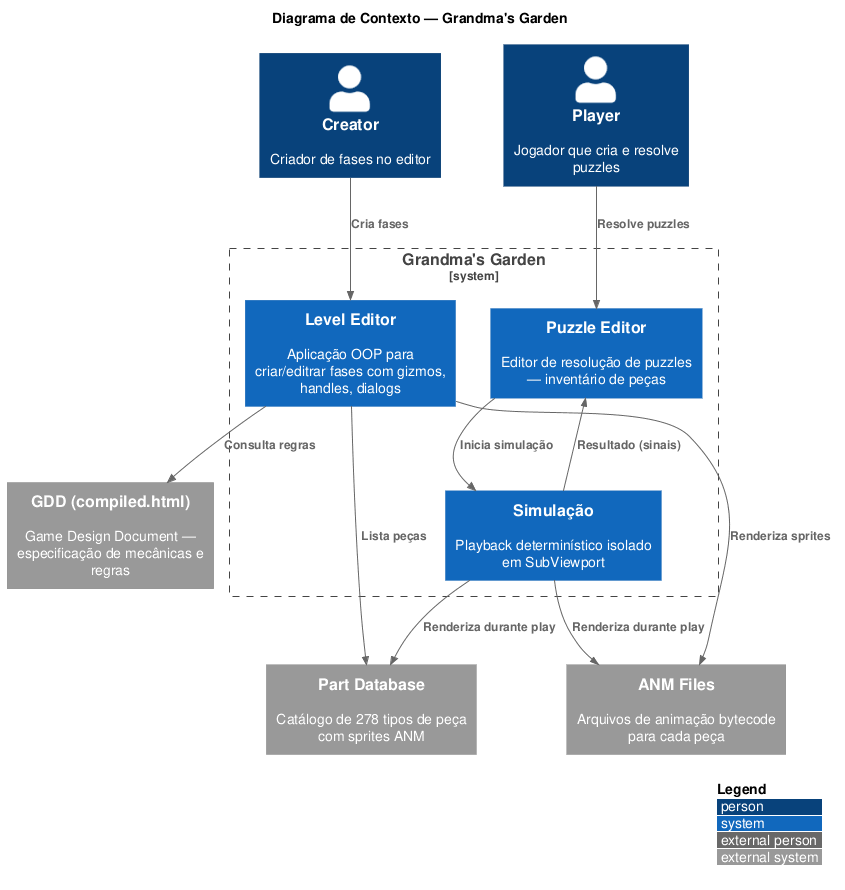

### 2.2 C4 Container — Arquitetura de Containers

```plantuml
@startuml C4_Container
!include .plantuml/C4_Container.puml

LAYOUT_WITH_LEGEND()

title C4 Container — Dual-Mode Architecture

System_Boundary(godot_app, "Godot 4.6 Application") {
  Container(editor_ctrl, "EditorController", "Control (Node)", "Máquina de estados de ferramentas, viewport, catalog, undo/redo")
  Container(world_state, "WorldState", "RefCounted", "Container de parts[], gravity, pressure, viewport")
  Container(part_data, "PartData", "RefCounted (282 campos)", "Representação OOP de peça no editor — gizmos, handles, state machine")
  Container(behavior_reg, "BehaviorRegistry", "Node (Autoload)", "Catálogo de comportamentos, state limits, triggers, física por tipo")
  Container(simulation_runner, "SimulationRunner", "Node2D", "Pacemaker externo, avalia chain_script, orchestra physics")
  Container(board, "Board", "Node2D", "Container de parts[], sprites, level_data, solution")
  Container(part, "Part", "RefCounted", "Estrutura data+physics para simulação — state machine, 7-pass physics")
  Container(physics_eng, "PhysicsEngine", "RefCounted", "13-pass loop de física por tick (gravity, collisions, constraints)")
  Container(chain_mgr, "ChainManager", "RefCounted", "Avaliador de regras chain_script — condições e ações")
  Container(anm_renderer, "AnmRenderer", "Autoload", "Renderiza frames ANM para ImageTexture")
  Container(anm_db, "AnmDatabase", "Autoload", "Cache de ANM files, part→anm mapping")
  Container(part_db, "PartDatabase", "Autoload", "Catálogo de 278 tipos de peça")
  Container(level_serializer, "LevelSerializer", "RefCounted", "Save/load YAML/JSON de níveis")
}

Rel(editor_ctrl, world_state, "Adiciona/remove/edit parts")
Rel(editor_ctrl, behavior_reg, "Consulta state limits, behaviors")
Rel(editor_ctrl, anm_renderer, "Renderiza preview de sprites")
Rel(editor_ctrl, level_serializer, "Save/load níveis")
Rel(world_state, part_data, "Contém Array[PartData]")
Rel(behavior_reg, part_data, "Inicializa physics props, state limits")
Rel(part_data, part, "Serializa setup data → JSON")
Rel(level_serializer, part_data, "Serialize/deserialize")
Rel(simulation_runner, board, "Orquestra simulação")
Rel(simulation_runner, chain_mgr, "Evalua chain_script")
Rel(simulation_runner, physics_eng, "Executa 13-pass physics")
Rel(board, part, "Contém Array[Part]")
Rel(board, anm_renderer, "Renderiza sprites via AnmDatabase")
Rel(chain_mgr, part, "Modifica propriedades via regras")
Rel(physics_eng, part, "Aplica física (gravity, collisions, constraints)")
Rel(anm_db, anm_renderer, "提供 frames ANM")

@enduml
```

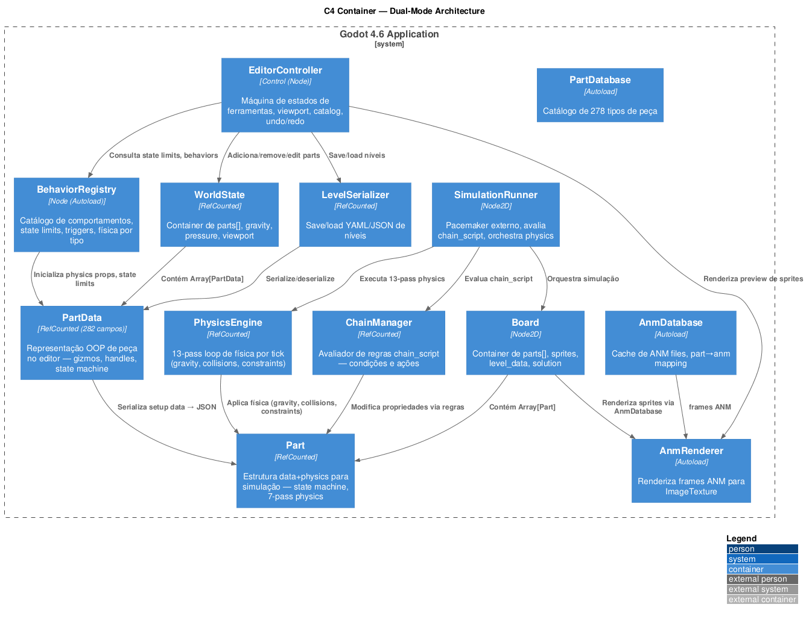

### 2.3 C4 Component — Simulação (Isolated SubViewport)

```plantuml
@startuml C4_Simulation_Component
!include .plantuml/C4_Component.puml

LAYOUT_WITH_LEGEND()

title C4 Component — Simulation Isolated in SubViewport

Container_Boundary(sim_overlay, "SimulationOverlay (SubViewport)") {
  Container(sim_runner, "SimulationRunner", "Node2D", "Pacemaker wall-clock, state machine, tick orchestration")
  Container(board, "Board", "Node2D", "Parts container + sprite rendering + level_data bridge")
  Container(part, "Part", "RefCounted x32", "Data+physics per part — position, velocity, state_counter, archetype")
  Container(physics_eng, "PhysicsEngine", "RefCounted", "7-pass physics loop — gravity, collisions, constraints")
  Container(chain_mgr, "ChainManager", "RefCounted", "Data-driven rule evaluator — chain_script")
  Container(solution_cond, "SolutionCondition", "RefCounted", "Win condition checker — AABB_overlap, state_match")
  Container(overlay_ui, "SimUI", "Control", "Play/Pause/Stop/Reset, speed slider, tick counter, objective checkboxes")
}

Container_Boundary(godot_main, "Main.gd (Mode Switcher)") {
  Container(main, "Main", "Node2D", "Toggle EDITOR ↔ SIMULATION modes")
}

Rel(overlay_ui, sim_runner, "play() pause() stop() reset() set_speed()")
Rel(overlay_ui, sim_runner, "state_changed, tick_updated, simulation_finished, objective_updated (signals)")
Rel(sim_runner, board, "board.init() board.sync_sprites()")
Rel(sim_runner, chain_mgr, "chain.load_from_level() chain.evaluate_chain()")
Rel(sim_runner, physics_eng, "physics.step(tick)")
Rel(board, part, "board.parts[] board.add_part()")
Rel(physics_eng, part, "Modifica pos_x/y, vel_x/y, state_counter")
Rel(chain_mgr, part, "Modifica via ações (inc, set, delta)")
Rel(board, solution_cond, "board.solution.check()")
Rel(main, sim_overlay, "Mode.SIMULATION: add_child(sim_overlay)")
Rel(main, overlay_ui, "overlay_ui.connect_signals()")

@enduml
```

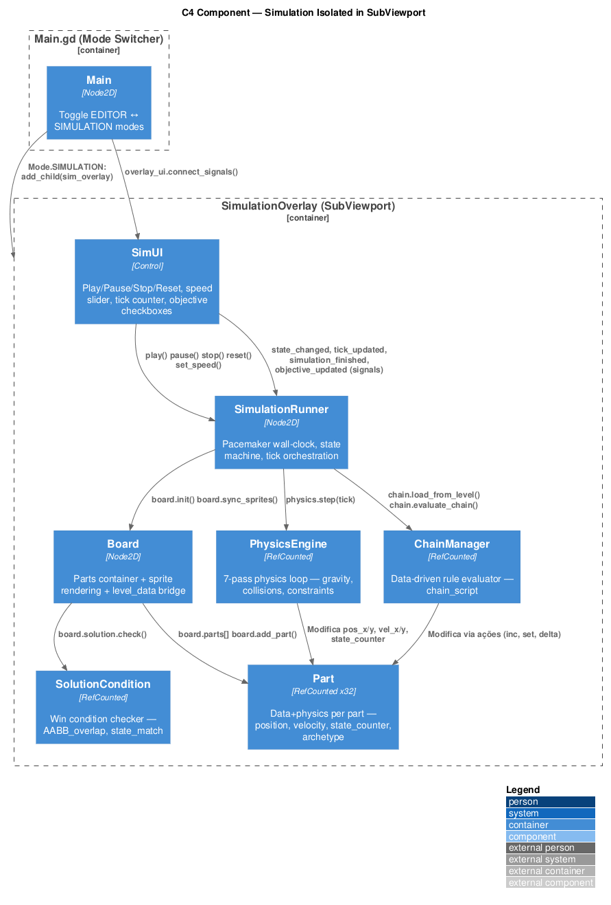

### 2.4 C4 Component — Editor

```plantuml
@startuml C4_Editor_Component
!include .plantuml/C4_Component.puml

LAYOUT_WITH_LEGEND()

title C4 Component — Level Editor

Container_Boundary(editor, "EditorController") {
  Container(editor_ctrl, "EditorController", "Control", "6 tool modes, canvas, catalog, undo/redo, dialogs")
  Container(tool_machine, "ToolMode Enum", "Enum", "MODE_SELECT, MODE_PLACE, MODE_DELETE, MODE_CONNECT, MODE_PREVIEW, MODE_LEVEL_INFO")
  Container(viewport, "Viewport", "Node2D", "Canvas com zoom/pan, grid, selection handles, gizmos")
  Container(catalog, "Catalog", "VBoxContainer", "Lista de peças por categoria com ícones ANM")
  Container(undo_sys, "UndoSystem", "Array[Dictionary]", "50 níveis de undo/redo")
}

Container_Boundary(world, "World State") {
  Container(world_state, "WorldState", "RefCounted", "Array[PartData], gravity, pressure, viewport, callbacks")
  Container(part_data, "PartData", "RefCounted xMAX", "282 campos, state machine, collision box, animation")
  Container(solver, "PhysicsSolver", "RefCounted", "7-pass physics preview, deterministic 60Hz")
  Container(checker, "SolutionChecker", "RefCounted", "Verifica condições de solução")
}

Container_Boundary(backend, "Backend Catalogs") {
  Container(behavior_reg, "BehaviorRegistry", "Autoload", "solve_data, category_rules, physics_props, state limits")
  Container(anm_renderer, "AnmRenderer", "Autoload", "Renderiza frames ANM para Texture")
  Container(anm_db, "AnmDatabase", "Autoload", "Cache de ANM, part→anm mapping")
  Container(part_db, "PartDatabase", "Autoload", "278 tipos de peça")
  Container(level_serializer, "LevelSerializer", "RefCounted", "YAML load/save")
}

Rel(editor_ctrl, world_state, "add_part(), remove_part(), reset()")
Rel(editor_ctrl, solver, "step() preview_running")
Rel(editor_ctrl, checker, "check(world_state)")
Rel(editor_ctrl, level_serializer, "save_yaml(), load_yaml()")
Rel(editor_ctrl, behavior_reg, "get_state_limits(), get_behavior(), get_category()")
Rel(world_state, part_data, "Array[PartData]")
Rel(behavior_reg, part_data, "Inicializa state_limit_*, mass, cor_q8, triggers")
Rel(anm_renderer, part_data, "Renderiza sprite via AnmDatabase")
Rel(part_data, solver, "state_counter, pos_x/y, vel_x/y")

@enduml
```

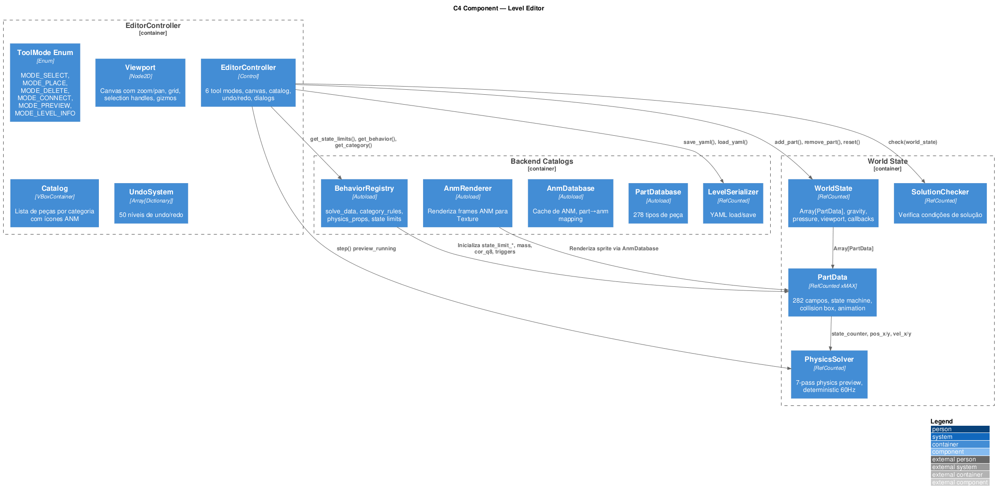

---

## 4. Modelos de Dados

### 3.1 Simulação — Part (Data-Driven, RefCounted)

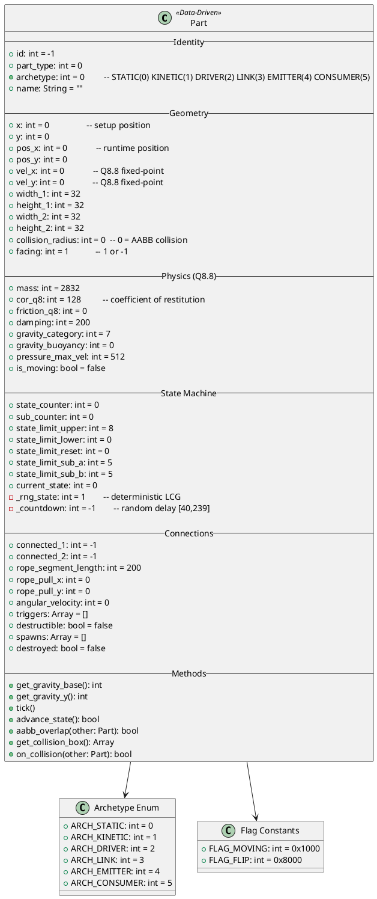
```plantuml
@startuml Part_Data_Model
hide empty fields
skinparam classFontSize 14
skinparam packageStyle rectangle

class Part <<Data-Driven>> {
  -- Identity --
  +id: int = -1
  +part_type: int = 0
  +archetype: int = 0         -- STATIC(0) KINETIC(1) DRIVER(2) LINK(3) EMITTER(4) CONSUMER(5)
  +name: String = ""

  -- Geometry --
  +x: int = 0                 -- setup position
  +y: int = 0
  +pos_x: int = 0             -- runtime position
  +pos_y: int = 0
  +vel_x: int = 0             -- Q8.8 fixed-point
  +vel_y: int = 0             -- Q8.8 fixed-point
  +width_1: int = 32
  +height_1: int = 32
  +width_2: int = 32
  +height_2: int = 32
  +collision_radius: int = 0  -- 0 = AABB collision
  +facing: int = 1            -- 1 or -1

  -- Physics (Q8.8) --
  +mass: int = 2832
  +cor_q8: int = 128          -- coefficient of restitution
  +friction_q8: int = 0
  +damping: int = 200
  +gravity_category: int = 7
  +gravity_buoyancy: int = 0
  +pressure_max_vel: int = 512
  +is_moving: bool = false

  -- State Machine --
  +state_counter: int = 0
  +sub_counter: int = 0
  +state_limit_upper: int = 8
  +state_limit_lower: int = 0
  +state_limit_reset: int = 0
  +state_limit_sub_a: int = 5
  +state_limit_sub_b: int = 5
  +current_state: int = 0
  -_rng_state: int = 1        -- deterministic LCG
  -_countdown: int = -1        -- random delay [40,239]

  -- Connections --
  +connected_1: int = -1
  +connected_2: int = -1
  +rope_segment_length: int = 200
  +rope_pull_x: int = 0
  +rope_pull_y: int = 0
  +angular_velocity: int = 0
  +triggers: Array = []
  +destructible: bool = false
  +spawns: Array = []
  +destroyed: bool = false

  -- Methods --
  +get_gravity_base(): int
  +get_gravity_y(): int
  +tick()
  +advance_state(): bool
  +aabb_overlap(other: Part): bool
  +get_collision_box(): Array
  +on_collision(other: Part): bool
}

class "Archetype Enum" as Archetype {
  +ARCH_STATIC: int = 0
  +ARCH_KINETIC: int = 1
  +ARCH_DRIVER: int = 2
  +ARCH_LINK: int = 3
  +ARCH_EMITTER: int = 4
  +ARCH_CONSUMER: int = 5
}

class "Flag Constants" as PartFlags {
  +FLAG_MOVING: int = 0x1000
  +FLAG_FLIP: int = 0x8000
}

Part --> Archetype
Part --> PartFlags

@enduml
```

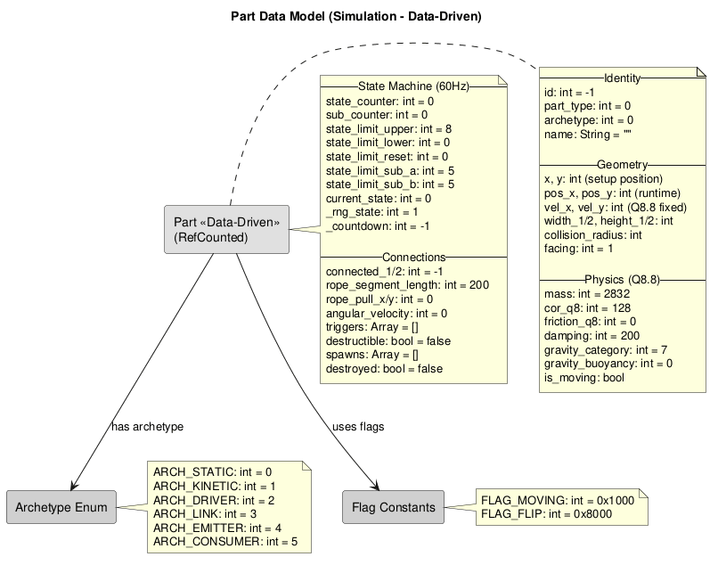

### 3.2 Editor — PartData (OOP, RefCounted)

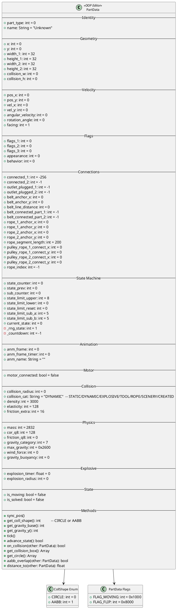
```plantuml
@startuml PartData_Object_Model
hide empty fields
skinparam classFontSize 12
skinparam packageStyle rectangle

class PartData <<OOP Editor>> {
  -- Identity --
  +part_type: int = 0
  +name: String = "Unknown"

  -- Geometry --
  +x: int = 0
  +y: int = 0
  +width_1: int = 32
  +height_1: int = 32
  +width_2: int = 32
  +height_2: int = 32
  +collision_w: int = 0
  +collision_h: int = 0

  -- Velocity --
  +pos_x: int = 0
  +pos_y: int = 0
  +vel_x: int = 0
  +vel_y: int = 0
  +angular_velocity: int = 0
  +rotation_angle: int = 0
  +facing: int = 1

  -- Flags --
  +flags_1: int = 0
  +flags_2: int = 0
  +flags_3: int = 0
  +appearance: int = 0
  +behavior: int = 0

  -- Connections --
  +connected_1: int = -256
  +connected_2: int = -1
  +outlet_plugged_1: int = -1
  +outlet_plugged_2: int = -1
  +belt_anchor_x: int = 0
  +belt_anchor_y: int = 0
  +belt_line_distance: int = 0
  +belt_connected_part_1: int = -1
  +belt_connected_part_2: int = -1
  +rope_1_anchor_x: int = 0
  +rope_1_anchor_y: int = 0
  +rope_2_anchor_x: int = 0
  +rope_2_anchor_y: int = 0
  +rope_segment_length: int = 200
  +pulley_rope_1_connect_x: int = 0
  +pulley_rope_1_connect_y: int = 0
  +pulley_rope_2_connect_x: int = 0
  +pulley_rope_2_connect_y: int = 0
  +rope_index: int = -1

  -- State Machine --
  +state_counter: int = 0
  +state_prev: int = 0
  +sub_counter: int = 0
  +state_limit_upper: int = 8
  +state_limit_lower: int = 0
  +state_limit_reset: int = 0
  +state_limit_sub_a: int = 5
  +state_limit_sub_b: int = 5
  +current_state: int = 0
  -_rng_state: int = 1
  -_countdown: int = -1

  -- Animation --
  +anm_frame: int = 0
  +anm_frame_timer: int = 0
  +anm_name: String = ""

  -- Motor --
  +motor_connected: bool = false

  -- Collision --
  +collision_radius: int = 0
  +collision_cat: String = "DYNAMIC"  -- STATIC/DYNAMIC/EXPLOSIVE/TOOL/ROPE/SCENERY/CREATED
  +density: int = 3000
  +elasticity: int = 128
  +friction_extra: int = 16

  -- Physics --
  +mass: int = 2832
  +cor_q8: int = 128
  +friction_q8: int = 0
  +gravity_category: int = 7
  +max_gravity: int = 0x2600
  +wind_force: int = 0
  +gravity_buoyancy: int = 0

  -- Explosive --
  +explosion_timer: float = 0
  +explosion_radius: int = 0

  -- State --
  +is_moving: bool = false
  +is_solved: bool = false

  -- Methods --
  +sync_pos()
  +get_coll_shape(): int           -- CIRCLE or AABB
  +get_gravity_base(): int
  +get_gravity_y(): int
  +tick()
  +advance_state(): bool
  +on_collision(other: PartData): bool
  +get_collision_box(): Array
  +get_circle(): Array
  +aabb_overlap(other: PartData): bool
  +distance_to(other: PartData): float
}

class "CollShape Enum" as CollShape {
  +CIRCLE: int = 0
  +AABB: int = 1
}

class "PartData Flags" as PdFlags {
  +FLAG_MOVING: int = 0x1000
  +FLAG_FLIP: int = 0x8000
}

PartData --> CollShape
PartData --> PdFlags

@enduml
```

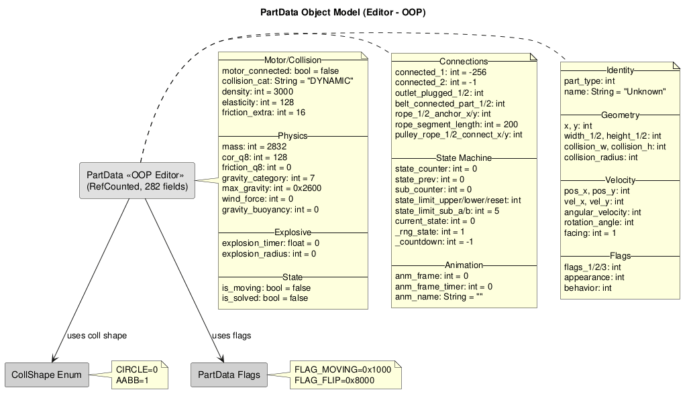

### 3.3 Chain Script — Data-Driven Rules

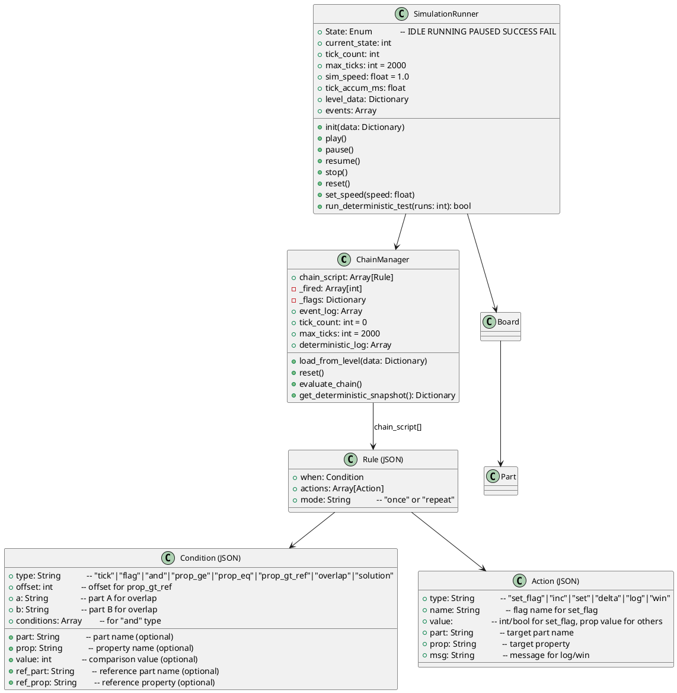
```plantuml
@startuml Chain_Script_Model
skinparam classFontSize 13
skinparam packageStyle rectangle

class "ChainManager" {
  +chain_script: Array[Rule]
  -_fired: Array[int]
  -_flags: Dictionary
  +event_log: Array
  +tick_count: int = 0
  +max_ticks: int = 2000
  +deterministic_log: Array

  +load_from_level(data: Dictionary)
  +reset()
  +evaluate_chain()
  +get_deterministic_snapshot(): Dictionary
}

class "Rule (JSON)" as Rule {
  +when: Condition
  +actions: Array[Action]
  +mode: String            -- "once" or "repeat"
}

class "Condition (JSON)" as Condition {
  +type: String            -- "tick"|"flag"|"and"|"prop_ge"|"prop_eq"|"prop_gt_ref"|"overlap"|"solution"
  +part: String            -- part name (optional)
  +prop: String            -- property name (optional)
  +value: int              -- comparison value (optional)
  +ref_part: String        -- reference part name (optional)
  +ref_prop: String        -- reference property (optional)
  +offset: int             -- offset for prop_gt_ref
  +a: String               -- part A for overlap
  +b: String               -- part B for overlap
  +conditions: Array        -- for "and" type
}

class "Action (JSON)" as Action {
  +type: String            -- "set_flag"|"inc"|"set"|"delta"|"log"|"win"
  +name: String            -- flag name for set_flag
  +value:                  -- int/bool for set_flag, prop value for others
  +part: String            -- target part name
  +prop: String            -- target property
  +msg: String             -- message for log/win
}

class "SimulationRunner" {
  +State: Enum             -- IDLE RUNNING PAUSED SUCCESS FAIL
  +current_state: int
  +tick_count: int
  +max_ticks: int = 2000
  +sim_speed: float = 1.0
  +tick_accum_ms: float
  +level_data: Dictionary
  +events: Array

  +init(data: Dictionary)
  +play()
  +pause()
  +resume()
  +stop()
  +reset()
  +set_speed(speed: float)
  +run_deterministic_test(runs: int): bool
}

ChainManager --> Rule : "chain_script[]"
Rule --> Condition
Rule --> Action

SimulationRunner --> ChainManager
SimulationRunner --> Board
Board --> Part

@enduml
```

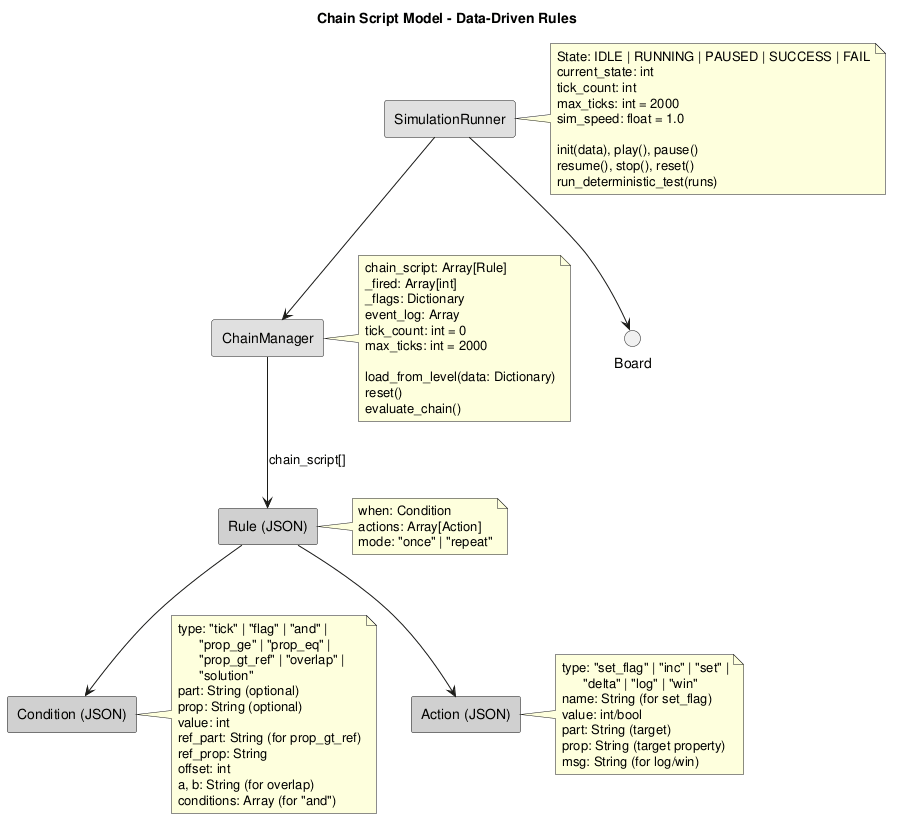

---

## 5. Diagramas de Classe

### 4.1 Class Diagram — Simulation Architecture

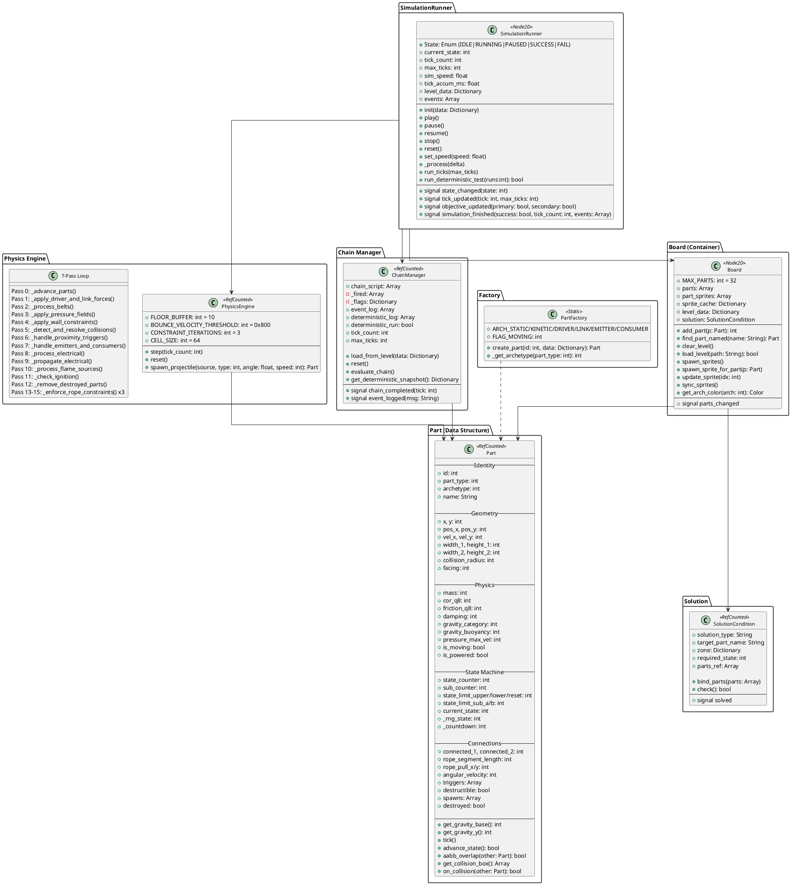
```plantuml
@startuml Simulation_Class_Diagram
skinparam classFontSize 12
skinparam linetype ortho
skinparam shadowing false

package "SimulationRunner" {
  class SimulationRunner <<Node2D>> {
    +State: Enum (IDLE|RUNNING|PAUSED|SUCCESS|FAIL)
    +current_state: int
    +tick_count: int
    +max_ticks: int
    +sim_speed: float
    +tick_accum_ms: float
    +level_data: Dictionary
    +events: Array
    --
    +init(data: Dictionary)
    +play()
    +pause()
    +resume()
    +stop()
    +reset()
    +set_speed(speed: float)
    +_process(delta)
    +run_ticks(max_ticks)
    +run_deterministic_test(runs:int): bool
    --
    +signal state_changed(state: int)
    +signal tick_updated(tick: int, max_ticks: int)
    +signal objective_updated(primary: bool, secondary: bool)
    +signal simulation_finished(success: bool, tick_count: int, events: Array)
  }
}

package "Board (Container)" {
  class Board <<Node2D>> {
    +MAX_PARTS: int = 32
    +parts: Array
    +part_sprites: Array
    +sprite_cache: Dictionary
    +level_data: Dictionary
    +solution: SolutionCondition
    --
    +add_part(p: Part): int
    +find_part_named(name: String): Part
    +clear_level()
    +load_level(path: String): bool
    +spawn_sprites()
    +spawn_sprite_for_part(p: Part)
    +update_sprite(idx: int)
    +sync_sprites()
    +get_arch_color(arch: int): Color
    --
    +signal parts_changed
  }
}

package "Physics Engine" {
  class PhysicsEngine <<RefCounted>> {
    +FLOOR_BUFFER: int = 10
    +BOUNCE_VELOCITY_THRESHOLD: int = 0x800
    +CONSTRAINT_ITERATIONS: int = 3
    +CELL_SIZE: int = 64
    --
    +step(tick_count: int)
    +reset()
    +spawn_projectile(source, type: int, angle: float, speed: int): Part
  }

  class "7-Pass Loop" as PhysicsPasses {
    Pass 0: _advance_parts()
    Pass 1: _apply_driver_and_link_forces()
    Pass 2: _process_belts()
    Pass 3: _apply_pressure_fields()
    Pass 4: _apply_wall_constraints()
    Pass 5: _detect_and_resolve_collisions()
    Pass 6: _handle_proximity_triggers()
    Pass 7: _handle_emitters_and_consumers()
    Pass 8: _process_electrical()
    Pass 9: _propagate_electrical()
    Pass 10: _process_flame_sources()
    Pass 11: _check_ignition()
    Pass 12: _remove_destroyed_parts()
    Pass 13-15: _enforce_rope_constraints() x3
  }
}

package "Part (Data Structure)" {
  class Part <<RefCounted>> {
    -- Identity --
    +id: int
    +part_type: int
    +archetype: int
    +name: String

    -- Geometry --
    +x, y: int
    +pos_x, pos_y: int
    +vel_x, vel_y: int
    +width_1, height_1: int
    +width_2, height_2: int
    +collision_radius: int
    +facing: int

    -- Physics --
    +mass: int
    +cor_q8: int
    +friction_q8: int
    +damping: int
    +gravity_category: int
    +gravity_buoyancy: int
    +pressure_max_vel: int
    +is_moving: bool
    +is_powered: bool

    -- State Machine --
    +state_counter: int
    +sub_counter: int
    +state_limit_upper/lower/reset: int
    +state_limit_sub_a/b: int
    +current_state: int
    +_rng_state: int
    +_countdown: int

    -- Connections --
    +connected_1, connected_2: int
    +rope_segment_length: int
    +rope_pull_x/y: int
    +angular_velocity: int
    +triggers: Array
    +destructible: bool
    +spawns: Array
    +destroyed: bool

    --
    +get_gravity_base(): int
    +get_gravity_y(): int
    +tick()
    +advance_state(): bool
    +aabb_overlap(other: Part): bool
    +get_collision_box(): Array
    +on_collision(other: Part): bool
  }
}

package "Chain Manager" {
  class ChainManager <<RefCounted>> {
    +chain_script: Array
    -_fired: Array
    -_flags: Dictionary
    +event_log: Array
    +deterministic_log: Array
    +deterministic_run: bool
    +tick_count: int
    +max_ticks: int

    +load_from_level(data: Dictionary)
    +reset()
    +evaluate_chain()
    +get_deterministic_snapshot(): Dictionary
    --
    +signal chain_completed(tick: int)
    +signal event_logged(msg: String)
  }
}

package "Solution" {
  class SolutionCondition <<RefCounted>> {
    +solution_type: String
    +target_part_name: String
    +zone: Dictionary
    +required_state: int
    +parts_ref: Array

    +bind_parts(parts: Array)
    +check(): bool
    --
    +signal solved
  }
}

package "Factory" {
  class PartFactory <<Static>> {
    +ARCH_STATIC/KINETIC/DRIVER/LINK/EMITTER/CONSUMER
    +FLAG_MOVING: int
    +create_part(id: int, data: Dictionary): Part
    +_get_archetype(part_type: int): int
  }
}

SimulationRunner --> Board
SimulationRunner --> PhysicsEngine
SimulationRunner --> ChainManager
Board --> Part
PhysicsEngine --> Part
ChainManager --> Part
Board --> SolutionCondition
PartFactory ..> Part

@enduml
```

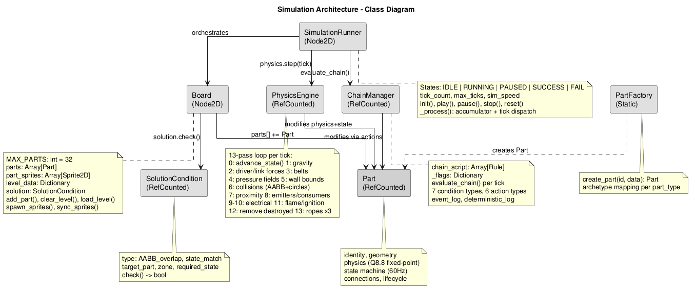

### 4.2 Class Diagram — Editor Architecture


```plantuml
@startuml Editor_Class_Diagram
skinparam classFontSize 11
skinparam linetype ortho
skinparam shadowing false

package "Editor Core" {
  class EditorController <<Control>> {
    +ToolMode: Enum (SELECT|PLACE|DELETE|CONNECT|PREVIEW|LEVEL_INFO)
    +current_mode: ToolMode
    +selected_part_type: int
    +selected_part_idx: int
    +connect_source_idx: int
    +zoom: float
    +scroll: Vector2
    +is_dirty: bool
    +level_title/goal/bg_color/pressure/gravity/music_track

    +_ready()
    +_process(delta)
    +_input(event)
    +_draw()
    +_set_mode(mode: ToolMode)
    +_handle_key(event)
    +_handle_mouse_click(event)
    +_handle_mouse_move(event)
    +_toggle_preview()
    +_start_preview()
    +_stop_preview()
    +_push_undo()
    +_undo()
    +_redo()
    +_save_dialog()
    +_load_dialog()
    +_open_condition_editor()
  }
}

package "World State" {
  class WorldState <<RefCounted>> {
    +parts: Array[PartData]
    +gravity: int = 272
    +pressure: int = 67
    +tick_count: int = 0
    +viewport: Array = [0,0,560,377]
    +on_collision: Callable
    +on_state_change: Callable

    +add_part(part: PartData)
    +remove_part(index: int)
    +get_part_by_index(index: int): PartData
    +reset()
  }

  class PartData <<RefCounted>> {
    -- Identity --
    +part_type: int
    +name: String

    -- Geometry --
    +x, y: int
    +width_1, height_1: int
    +width_2, height_2: int
    +collision_w, collision_h: int

    -- Velocity --
    +pos_x, pos_y: int
    +vel_x, vel_y: int
    +angular_velocity: int
    +rotation_angle: int
    +facing: int

    -- Flags --
    +flags_1, flags_2, flags_3: int
    +appearance: int
    +behavior: int

    -- Connections --
    +connected_1: int = -256
    +connected_2: int = -1
    +outlet_plugged_1/2: int
    +belt_connected_part_1/2: int
    +rope_segment_length: int
    +rope_1/2_anchor_x/y: int
    +pulley_rope_1/2_connect_x/y: int
    +rope_index: int

    -- State Machine --
    +state_counter: int
    +state_prev: int
    +sub_counter: int
    +state_limit_upper/lower/reset: int
    +state_limit_sub_a/b: int
    +current_state: int
    +_rng_state: int
    +_countdown: int

    -- Animation --
    +anm_frame: int
    +anm_frame_timer: int
    +anm_name: String

    -- Physics --
    +mass: int = 2832
    +cor_q8: int = 128
    +friction_q8: int = 0
    +collision_radius: int
    +collision_cat: String = "DYNAMIC"
    +density: int = 3000
    +elasticity: int = 128
    +friction_extra: int = 16
    +gravity_category: int = 7
    +max_gravity: int
    +wind_force: int
    +gravity_buoyancy: int

    -- State --
    +is_moving: bool
    +is_solved: bool

    +sync_pos()
    +get_coll_shape(): int
    +get_gravity_base(): int
    +get_gravity_y(): int
    +tick()
    +advance_state(): bool
    +on_collision(other: PartData): bool
    +aabb_overlap(other: PartData): bool
    +distance_to(other: PartData): float
  }
}

package "Physics Solver" {
  class PhysicsSolver <<RefCounted>> {
    +MAX_TICKS: int = 10000
    +tick_counter: int
    +FLOOR_BUFFER: int = 32
    +BOUNCE_VELOCITY_THRESHOLD: int = 0x800
    +CONSTRAINT_ITERATIONS: int = 3
    +CELL_SIZE: int = 64

    +step()
    +_resolve_trigger_chains(parts: Array)
    +_handle_behaviors(parts: Array)
    +_apply_viewport_bounds(parts: Array, vp: Array)
    +_detect_collision(a: PartData, b: PartData): bool
    +_resolve_collision(a: PartData, b: PartData)
    +_check_proximity_behaviors(parts: Array)
    +_propagate_electrical(parts: Array)
    +_enforce_rope_constraint(part: PartData, target: PartData)
  }
}

package "Solution" {
  class SolutionChecker <<RefCounted>> {
    +conditions: Array[SolutionCondition]

    +check(world_state: WorldState): Array
    +reset()
  }

  class SolutionCondition <<RefCounted>> {
    +part_index: int
    +part_state_1: int
    +part_state_2: int
    +count: int
    +rect: Rect2

    +from_dict(data: Dictionary)
    +to_dict(): Dictionary
    +check(): bool
  }
}

package "Serialization" {
  class LevelSerializer <<RefCounted>> {
    +save_yaml(path: String, level: Dictionary)
    +load_yaml(path: String): Dictionary
    +_write_part_group(file, label: String, plist: Array)
    +_get_part_field(p, field: String)
    +_hex16(val): String
  }
}

package "Catalogs (Autoloads)" {
  class BehaviorRegistry <<Node>> {
    +solve_data: Dictionary
    +behaviors: Dictionary
    +physics_props: Dictionary
    +part_sounds: Dictionary
    +godot_behaviors: Dictionary
    +category_rules: Dictionary
    +orphan_states: Dictionary

    +get_state_limits(part_type: int): Dictionary
    +get_solve_transitions(part_type: int): Array
    +get_behavior(part_type: int): Dictionary
    +get_category(part_type: int): String
    +get_physics_props(part_type: int): Dictionary
    +get_anm_state_for_counter(part_type: int, counter: int): int
    +get_trigger_targets(part_type: int, state_counter: int): Dictionary
    +validate_orphan_states(part_type: int): Array
  }

  class AnmDatabase <<Autoload>> {
    +load_anm(name: String): Dictionary
    +get_anm_for_part(part_type: int): String
    +get_default_state_id(anm: String): int
  }

  class AnmRenderer <<Autoload>> {
    +render_frame(anm: String, state_id: int, counter: int, w: int, h: int): Image
    +render_wall(anm: String, wall_w: int, wall_h: int): Image
    +get_frame_meta(anm: String, state_id: int, counter: int, w: int, h: int): Dictionary
    +load_palette(): Array[Color]
  }

  class PartDatabase <<Autoload>> {
    +part_catalog: Dictionary
    +get_part_name(part_type: int): String
  }
}

EditorController --> WorldState
EditorController --> PhysicsSolver
EditorController --> SolutionChecker
EditorController --> LevelSerializer
EditorController --> BehaviorRegistry
EditorController --> AnmRenderer

WorldState --> PartData
PhysicsSolver --> WorldState
PhysicsSolver --> PartData
PhysicsSolver --> BehaviorRegistry

SolutionChecker --> SolutionCondition
SolutionCondition --> WorldState

PartData --> BehaviorRegistry

@enduml
```

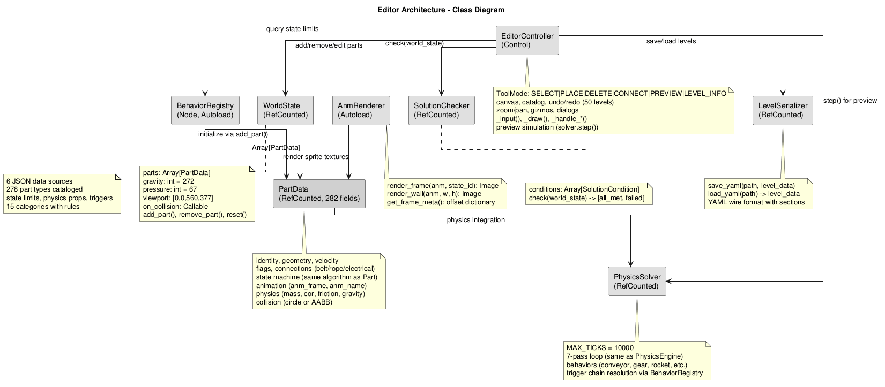

---

## 6. Diagramas de Sequência

### 5.1 Sequence — Simulation Loop (Pacemaker + Chain + Physics)

```plantuml
@startuml Simulation_Loop_Sequence
autonumber 1
skinparam backgroundColor #1e1e2e
skinparam handwritten false
skinparam sequenceFontSize 12
skinparam sequenceDividerFontColor #88ccff

participant SimulationRunner as SR
participant ChainManager as CM
participant PhysicsEngine as PE
participant Board as BD
participant Part order 1
participant SolutionCondition as SC

note over SR: _process() acts as\nwall-clock pacemaker\n(not the game loop)

[-> SR : play()
activate SR
SR -> BD : clear_level()
SR -> BD : level_data = data
loop per part in level_data
  SR -> BD : add_part(PartFactory.create_part())
end
SR -> BD : spawn_sprites()
SR -> CM : load_from_level(level_data)

SR -> BD : board.set_process(true)
SR -> SR : running = true

alt running loop (every ~16.667ms)

  note over SR: tick_accum_ms >= 1000/60
  SR -> CM : tick_count += 1
  SR -> CM : evaluate_chain()
  activate CM

    loop per rule in chain_script
      alt mode=="once" and already fired
        CM -> CM : continue
      end
      CM -> CM : _check_condition(when)
      alt condition is TRUE
        CM -> CM : _execute_actions(actions)
        alt action.type == "win"
          CM -> SR : chain_completed.emit(tick)
        end
        alt mode == "once"
          CM -> CM : _fired.append(rule_index)
        end
      end
    end

  deactivate CM

  SR -> PE : physics.step(tick_count)
  activate PE

    note over PE: Pass 0: State Counters
    loop per part where is_moving
      PE -> Part : advance_state()
      activate Part #PaleGoldenrod
      Part -> Part : advance_state()\n(sub_counter==0? rand delay?)\n(wrap at state_limit_upper)
      deactivate Part
    end

    note over PE: Pass 1: Gravity Integration
    loop per part where is_moving
      PE -> Part : tick()\n(gravity, damping, pos update)
      activate Part #PaleGoldenrod
      Part -> Part : vel_y += gravity_y\nvel_x += gravity_x\npos_x/y += vel >> 9
      deactivate Part
    end

    note over PE: Pass 2-3: Behaviors + Belts
    note over PE: Pass 4: Wall Constraints
    note over PE: Pass 5: Collisions (Spatial Grid)\n  PE -> Part : on_collision(other)\n  alt triggers.has("collision")
    Part -> Part : state_counter += 1
  end
    note over PE: Pass 6: Proximity + Electrical\nPass 7: Emitters/Consumers\nPass 8-9: Flame/Ignition\nPass 10: Remove destroyed\nPass 11-13: Rope constraints x3

  deactivate PE

  SR -> BD : sync_sprites()
  activate BD
    loop per sprite
      BD -> BD : update_sprite()\n(ANM render if state changed)
    end
  deactivate BD

  SR -> SC : solution.check()
  activate SC
  alt solution met
    SC -> SR : simulation_finished.emit(true,...)
  end
  deactivate SC

  SR -> SR : tick_updated.emit(tick, max_ticks)
  alt tick >= max_ticks
    SR -> SR : _on_timeout()
  end
end

note over SR: stop() → running = false\nboard.set_process(false)

[<-> SR : state_changed(state)

@enduml
```

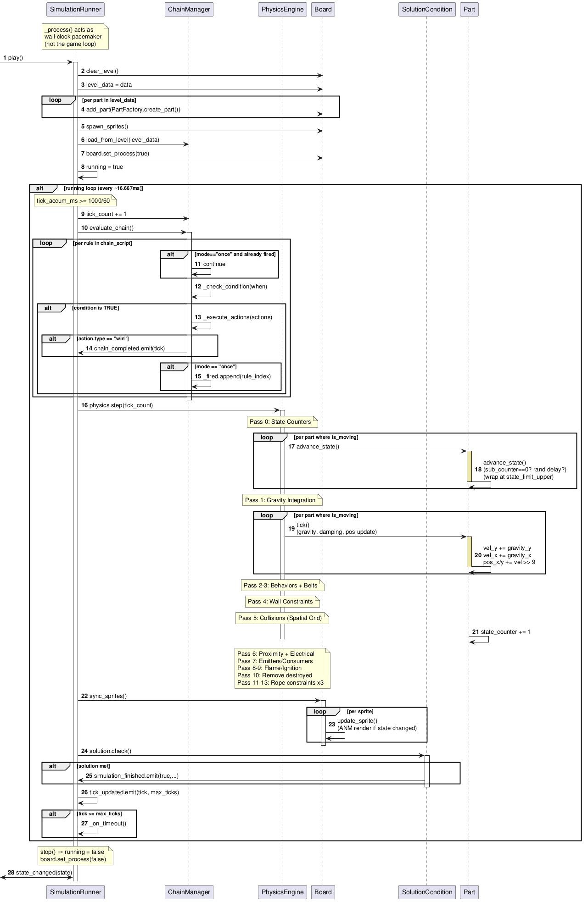

### 5.2 Sequence — Editor Tool Interactions

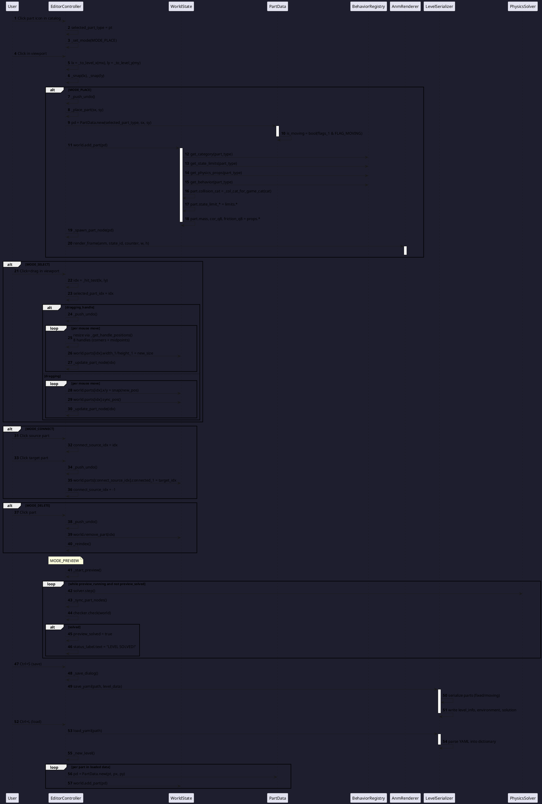
```plantuml
@startuml Editor_Tool_Sequence
autonumber 1
skinparam backgroundColor #1e1e2e

participant User
participant EditorController as EC
participant WorldState as WS
participant PartData as PD
participant BehaviorRegistry as BR
participant AnmRenderer as AR
participant LevelSerializer as LS

User -> EC : Click part icon in catalog
EC -> EC : selected_part_type = pt
EC -> EC : _set_mode(MODE_PLACE)

User -> EC : Click in viewport
EC -> EC : lx = _to_level_x(mx), ly = _to_level_y(my)
EC -> EC : _snap(lx), _snap(ly)

alt MODE_PLACE
  EC -> EC : _push_undo()
  EC -> EC : _place_part(sx, sy)
  EC -> PD : pd = PartData.new(selected_part_type, sx, sy)
  activate PD
  PD -> PD : is_moving = bool(flags_1 & FLAG_MOVING)
  deactivate PD
  EC -> WS : world.add_part(pd)
  activate WS
  WS -> BR : get_category(part_type)
  WS -> BR : get_state_limits(part_type)
  WS -> BR : get_physics_props(part_type)
  WS -> BR : get_behavior(part_type)
  WS -> WS : part.collision_cat = _col_cat_for_game_cat(cat)
  WS -> WS : part.state_limit_* = limits.*
  WS -> WS : part.mass, cor_q8, friction_q8 = props.*
  deactivate WS
  EC -> EC : _spawn_part_node(pd)
  EC -> AR : render_frame(anm, state_id, counter, w, h)
  activate AR
  deactivate AR
end

alt MODE_SELECT
  User -> EC : Click+drag in viewport
  EC -> EC : idx = _hit_test(lx, ly)
  EC -> EC : selected_part_idx = idx
  alt dragging_handle
    EC -> EC : _push_undo()
    loop per mouse move
      EC -> EC : resize via _get_handle_positions()\n8 handles (corners + midpoints)
      EC -> WS : world.parts[idx].width_1/height_1 = new_size
      EC -> EC : _update_part_node(idx)
    end
  else dragging
    loop per mouse move
      EC -> WS : world.parts[idx].x/y = snap(new_pos)
      EC -> WS : world.parts[idx].sync_pos()
      EC -> EC : _update_part_node(idx)
    end
  end
end

alt MODE_CONNECT
  User -> EC : Click source part
  EC -> EC : connect_source_idx = idx
  User -> EC : Click target part
  EC -> EC : _push_undo()
  EC -> WS : world.parts[connect_source_idx].connected_1 = target_idx
  EC -> EC : connect_source_idx = -1
end

alt MODE_DELETE
  User -> EC : Click part
  EC -> EC : _push_undo()
  EC -> WS : world.remove_part(idx)
  EC -> EC : _reindex()
end

note over EC: MODE_PREVIEW
  EC -> EC : _start_preview()
  loop while preview_running and not preview_solved
    EC -> PhysicsSolver : solver.step()
    EC -> EC : _sync_part_nodes()
    EC -> EC : checker.check(world)
    alt solved
      EC -> EC : preview_solved = true
      EC -> EC : status_label.text = "LEVEL SOLVED!"
    end
  end

User -> EC : Ctrl+S (save)
EC -> EC : _save_dialog()
EC -> LS : save_yaml(path, level_data)
activate LS
LS -> LS : serialize parts (fixed/moving)
LS -> LS : write level_info, environment, solution
deactivate LS

User -> EC : Ctrl+L (load)
EC -> LS : load_yaml(path)
activate LS
LS -> LS : parse YAML into dictionary
deactivate LS
EC -> EC : _new_level()
loop per part in loaded data
  EC -> PD : pd = PartData.new(pt, px, py)
  EC -> WS : world.add_part(pd)
end

@enduml
```

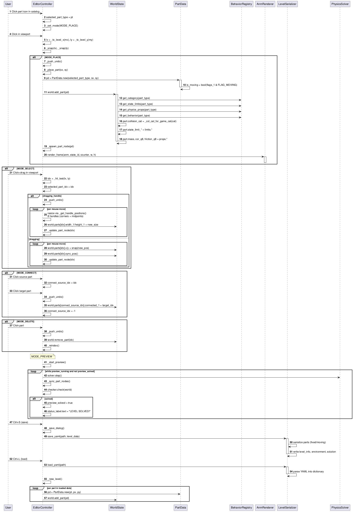

### 5.3 Sequence — Chain Script Evaluation

```plantuml
@startuml Chain_Evaluation_Sequence
autonumber 1
skinparam backgroundColor #1e1e2e

participant SimulationRunner as SR
participant ChainManager as CM
participant "chain_script[i]" as Rule

[-> CM : evaluate_chain()
activate CM

loop for each rule in chain_script
  CM -> Rule : mode = rule.get("mode")
  alt mode == "once" and _fired.has(i)
    CM -> CM : continue to next rule
  end

  CM -> CM : _check_condition(when)
  activate CM

    branch on condition type

      alt "tick"
        CM -> CM : return true

      alt "flag"
        CM -> CM : return _flags[name] == value

      alt "and"
        loop per condition in conditions
          CM -> CM : _check_condition(c)
          alt not true
            CM -> CM : return false
          end
        end
        CM -> CM : return true

      alt "prop_ge"
        CM -> CM : p = _find_part(part_name)
        CM -> CM : return p[prop] >= value

      alt "prop_eq"
        CM -> CM : p = _find_part(part_name)
        CM -> CM : return p[prop] == value

      alt "prop_gt_ref"
        CM -> CM : p = _find_part(part_name)
        CM -> CM : ref = _find_part(ref_part_name)
        CM -> CM : return p[prop] > ref[ref_prop] + offset

      alt "overlap"
        CM -> CM : a = _find_part(a_name)
        CM -> CM : b = _find_part(b_name)
        CM -> CM : return a.aabb_overlap(b)

      alt "solution"
        CM -> CM : return board.solution.check()

    end

  deactivate CM

  alt condition TRUE
    CM -> CM : _execute_actions(actions)
    activate CM

      loop per action in actions
        branch on action type

          alt "set_flag"
            CM -> CM : _flags[name] = value

          alt "inc"
            CM -> CM : p = _find_part(part)
            CM -> CM : p[prop] = p[prop] + value

          alt "set"
            CM -> CM : p = _find_part(part)
            CM -> CM : p[prop] = value

          alt "delta"
            CM -> CM : p = _find_part(part)
            CM -> CM : p[prop] = p[prop] + value
            alt prop == "x"
              CM -> CM : p.pos_x = value
            end

          alt "log"
            CM -> CM : _log(msg % [tick_count/60.0])
            CM -> CM : event_log.append()
            CM -> CM : event_logged.emit(msg)

          alt "win"
            CM -> CM : _log(msg)
            CM -> CM : chain_completed.emit(tick_count)

        end
      end

    deactivate CM

    alt mode == "once"
      CM -> CM : _fired.append(i)
    end
  end
end

CM -> SR : chain_completed(tick)\n(if "win" action fired)

@enduml
```

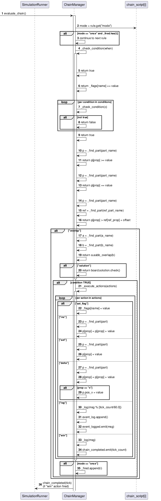

---

## 7. Máquinas de Estado

### 6.1 Part State Machine (Per-Instance, Deterministic)

```plantuml
@startuml Part_State_Machine
skinparam stateFontSize 14
skinparam backgroundColor #1e1e2e

title Part State Machine — advance_state() per tick (60Hz)

state "state_counter == 0\n(Idle / Waiting)" as IDLE {
  note top of IDLE
    RNG-based delay before first transition
    _countdown: random [40, 239] ticks
    _rng_state = (_rng_state * 0x343FD + 0x269EC3) & 0xFFFFFFFF
  end note

  state "_countdown = _randint(40,239)\nRNG bit == 1" as WAITING_RNG
  state "_countdown -= 1\n_countdown < 0 → advance" as WAITING_DEC
  state "_countdown = _randint(40,239)\nnext delay" as WAITING_RESET

  IDLE --> WAITING_RNG : start
  WAITING_RNG --> WAITING_DEC : _rng_state & 1 == 1
  WAITING_RNG --> IDLE : _rng_state & 1 == 0\n(deterministic: state_counter += 1)
  WAITING_DEC --> WAITING_RESET : _countdown < 0\n(state_counter += 1)
  WAITING_RESET --> IDLE : _rng_state & 1 == 0\n(next RNG bit = 0)
  WAITING_DEC --> WAITING_RNG : _countdown >= 0
}

state "state_counter != 0\n(Active / Counting)" as ACTIVE {
  note top of ACTIVE
    Deterministic increment each tick
    Wrap at state_limit_upper → state_limit_reset
  end note

  state "state_counter += 1\nstate_counter >= state_limit_upper?" as ACTIVE_INC
  state "state_counter = state_limit_reset\n(wrap)" as ACTIVE_WRAP
  state "state_counter += 1\nsub_counter > 0" as SUBCOUNT_INC
  state "sub_counter -= 1\nsub_counter == 0?" as SUBCOUNT_DEC
  state "state_counter = state_limit_reset\n(sub done)" as SUBCOUNT_DONE

  ACTIVE --> ACTIVE_INC : each tick
  ACTIVE_INC --> ACTIVE_WRAP : state_counter >= state_limit_upper
  ACTIVE_INC --> ACTIVE : state_counter < state_limit_upper
  ACTIVE_WRAP --> ACTIVE : state_limit_reset

  note right of ACTIVE_INC
    Clamp: state_counter < state_limit_lower
    → state_counter = state_limit_lower - 1
  end note
}

state "sub_counter > 0\n(Delayed Sub-Counter)" as SUBCOUNT {
  note top of SUBCOUNT
    Used for timed delays between sub-states
    Advances even when state_counter would wait
  end note

  SUBCOUNT --> SUBCOUNT_DEC : each tick
  SUBCOUNT_DEC --> SUBCOUNT_DONE : sub_counter == 0
  SUBCOUNT_DEC --> SUBCOUNT_INC : sub_counter > 0
  SUBCOUNT_DONE --> ACTIVE : reset complete
}

state "SOLVE.RES Override\n(on_collision callback)" as SOLVE {
  note top of SOLVE
    Triggered by physics collision
    Only fires if triggers.has("collision")
    Always increments state_counter
    (overrides RNG delay)
  end note

  state "state_counter += 1\nstate_counter < state_limit_upper" as SOLVE_INC
  state "current_state = state_counter\nreturn true" as SOLVE_DONE

  SOLVE --> SOLVE_INC : on_collision(other)
  SOLVE_INC --> SOLVE_DONE : always
  SOLVE_DONE --> IDLE or ACTIVE : (depends on state_counter value)
}

[*] --> IDLE : Part created, is_moving=true

IDLE -right-> ACTIVE : _rng_state & 1 == 0\n(deterministic path)
IDLE -down-> WAITING_RNG : _rng_state & 1 == 1\n(random path)
ACTIVE -right-> SOLVE : on_collision(other)\n(triggers.has("collision") && state_counter < upper)
ACTIVE --> SUBCOUNT : sub_counter > 0
SUBCOUNT --> ACTIVE : sub_counter == 0

note bottom of [*]
  State machine freezes when is_moving = false
  state_counter stays at current value
end note

@enduml
```

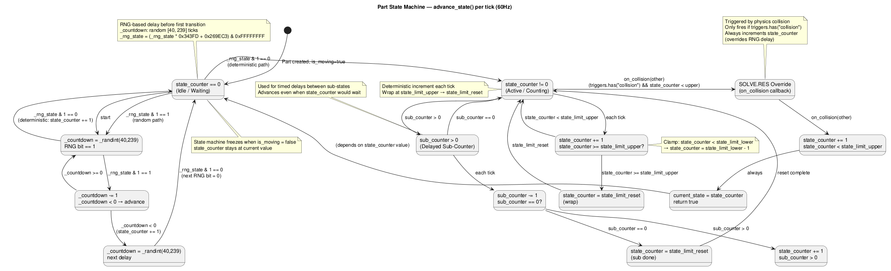

### 6.2 SimulationRunner State Machine

```plantuml
@startuml Simulation_State_Machine
skinparam stateFontSize 16
skinparam backgroundColor #1e1e2e

title SimulationRunner States — play/pause/stop/reset/timeout

state IDLE {
  note right of IDLE
    Initial state after init()
    Board loaded, chain_script parsed
    Sprites rendered at initial positions
  end note
}

state RUNNING {
  note right of RUNNING
    _process() pacemaker active
    tick_accum_ms accumulates wall-clock
    chain.evaluate_chain() + physics.step() per 16.667ms
    board.sync_sprites() updates visuals
  end note

  state "Tick Loop" as TICK_LOOP {
    note bottom of TICK_LOOP
      while tick_accum_ms >= 16.667ms:
        tick_accum_ms -= 16.667ms
        tick_count += 1
        chain.evaluate_chain()
        physics.step(tick_count)
        board.sync_sprites()
    end note
  }
}

state PAUSED {
  note right of PAUSED
    Pacemaker halted
    Board frozen
    Can resume to RUNNING
  end note
}

state SUCCESS {
  note right of SUCCESS
    solution.check() returned true
    OR chain "win" action fired
    simulation_finished.emit(true, ...)
    Board frozen
  end note
}

state FAIL {
  note right of FAIL
    tick_count >= max_ticks (timeout)
    OR explicit failure condition
    simulation_finished.emit(false, ...)
    Board frozen
  end note
}

[*] --> IDLE : init(data)

IDLE --> RUNNING : play()
RUNNING --> PAUSED : pause()
PAUSED --> RUNNING : resume()
RUNNING --> IDLE : stop()
PAUSED --> IDLE : stop()
RUNNING --> SUCCESS : solution.check() == true\nOR chain "win" action
RUNNING --> FAIL : tick_count >= max_ticks
SUCCESS --> IDLE : reset() → _reset_simulation()
FAIL --> IDLE : reset() → _reset_simulation()
IDLE --> IDLE : reset() (re-init from same data)

note bottom of SUCCESS
  play() after SUCCESS → _reset_simulation() first
end note

@enduml
```

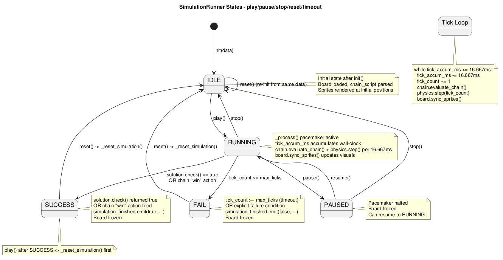

### 6.3 Editor Tool Mode State Machine

```plantuml
@startuml Editor_Tool_State_Machine
skinparam stateFontSize 15
skinparam backgroundColor #1e1e2e

title EditorController Tool Modes

state MODE_SELECT {
  note right of MODE_SELECT
    Default mode
    Click: select part (hit test)
    Drag: move part
    Handle drag: resize part (8 handles)
    F: flip selected
    L: lock/unlock
    Del: delete
  end note
}

state MODE_PLACE {
  note right of MODE_PLACE
    Click in viewport: place part at snapped position
    Left panel: part catalog
    Icon click: select part_type + switch to PLACE
    Part placed with FLAG_MOVING set
  end note
}

state MODE_DELETE {
  note right of MODE_DELETE
    Click in viewport: delete part
    Handles removed
    Undo-able operation
  end note
}

state MODE_CONNECT {
  note right of MODE_CONNECT
    First click: select source part
    Second click: connect source.connected_1 = target
    Visual line shows connection preview
  end note
}

state MODE_PREVIEW {
  note right of MODE_PREVIEW
    Inline simulation running
    Solver.step() per _process()
    State counters advance (frozen normally)
    Sprites sync with PartData positions
    Checker monitors solution conditions
    Space: toggle start/stop
  end note
}

state MODE_LEVEL_INFO {
  note right of MODE_LEVEL_INFO
    Dialog for level metadata
    title, goal, bg_color, pressure, gravity
    music_track, solution conditions
  end note
}

[*] --> MODE_SELECT : initial

MODE_SELECT --> MODE_PLACE : key P\nor catalog icon click
MODE_SELECT --> MODE_DELETE : key D
MODE_SELECT --> MODE_CONNECT : key C
MODE_SELECT --> MODE_PREVIEW : Space or key Space
MODE_SELECT --> MODE_LEVEL_INFO : key I

MODE_PLACE --> MODE_SELECT : key S\nor click already placed part
MODE_DELETE --> MODE_SELECT : key S
MODE_CONNECT --> MODE_SELECT : key S\nor click empty space
MODE_PREVIEW --> MODE_SELECT : Space (stop)\nkey S
MODE_LEVEL_INFO --> MODE_SELECT : dialog closed

note bottom of MODE_SELECT
  Ctrl+S: save dialog
  Ctrl+L: load dialog
  Ctrl+Z: undo (50 levels)
  Ctrl+Y: redo
  +/-: zoom (0.25x to 4x)
  Middle mouse: pan
  Scroll: zoom (in viewport only)
end note

@enduml
```

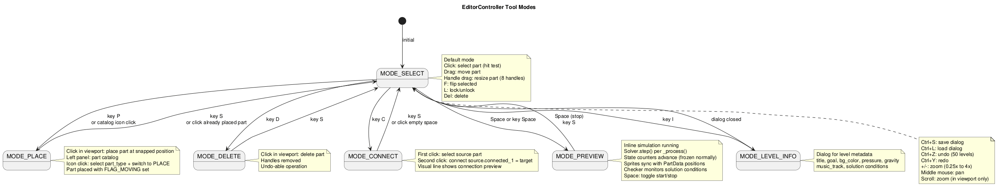

---

## 8. Wireframes

### 7.1 Level Editor Wireframe

```plantuml
@startuml Editor_Wireframe
skinparam backgroundColor #1e1e1e
skinparam defaultFontColor #cccccc
skinparam componentStyle uml

rectangle "== LEVEL EDITOR" as TITLE #Bold #ffffff

box "Toolbar" #2a2a3a [
  [New] [Save] [Load]
  ----
  [Select] [Place] [Delete] [Connect] [Preview] [Info] [Conditions]
]

box "Main Area" #1a1a2a {
  rectangle "Viewport (560x377)" #161620 [
    |+ Grid (16px snap)|
    ||
    ||  [Selected Part with 8 handles]
    ||
    |+ Zoom: 1.0x    Scroll: (0,0)|
    ||
  ]

  rectangle "Catalog (200px)" #161620 [
    |**Parts**|
    |--- Balls ---|
    |  Ball [ID:0]|
    |  Balloon [ID:4]|
    |--- Walls ---|
    |  Wall [ID:1]|
    |--- Rotating ---|
    |  Gear [ID:6]|
    |  Motor [ID:50]|
    |--- ... ---|
  ]
}

box "Status Bar" #2a2a3a [
  [Mode: SELECT] [Status: Ready] [Zoom: 1.00x]
]

note bottom of TITLE
  Keyboard shortcuts:
  S=Select P=Place D=Delete C=Connect
  Space=Preview I=Level Info
  F=Flip L=Lock Del=Delete
  Ctrl+Z/Y=Undo/Redo +/-=Zoom
end note

@enduml
```

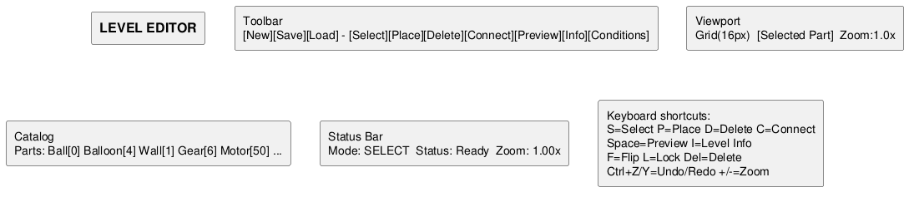

### 7.2 Simulation Overlay Wireframe

```plantuml
@startuml Simulation_Overlay_Wireframe
skinparam backgroundColor #1e1e1e
skinparam defaultFontColor #cccccc
skinparam componentStyle uml

rectangle "== SIMULATION" as TITLE #Bold #ffffff

box "Controls (Top Bar)" #2a2a3a [
  [▶ Play] [⏸ Pause] [⏹ Stop] [↺ Reset]   Speed: [====O===] 2x   Tick: 127/2000
]

box "SubViewport (640x480)" #0a0a15 [
  ||
  ||  [Ball sprite at (320,240)]
  ||
  ||  [Gear at (200,300)]
  ||
  ||  [Laser at (500,100)]
  ||
]

box "Objective Panel (Bottom)" #2a2a3a [
  |☐ Primary: Ball reaches laser zone|
  |☐ Secondary: Don't drop ball|
]

box "State Indicator" #1a1a2a [
  State: RUNNING   Events: 12   Speed: 2x
]

note bottom of TITLE
  Simulation is isolated in SubViewport
  Play/Pause/Stop/Reset controls
  Speed slider (1x - 4x)
  Tick counter
  Objective checkboxes (emit via signals)
end note

@enduml
```

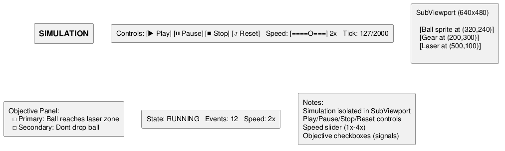

### 7.3 Part Gizmos Wireframe

```plantuml
@startuml Part_Gizmos_Wireframe
skinparam backgroundColor #1e1e1e
skinparam defaultFontColor #cccccc

title Part Selection Handles (8-point resize)

rectangle "Selected Part" #2a2a3a [
  |<UL> 0|         |<UR> 1|
  |         |         |
  |<L> 6 |  [Part]  | <R> 7|
  |         |         |
  |<BL> 2|         |<BR> 3|

  Bottom-center handle (5) for height-only resize
  Top-center handle (4) for height-only resize
]

note top of 0
  UL: resize left + up
  U: resize up only
  UR: resize right + up
  R: resize right only
  BR: resize right + down
  B: resize down only
  BL: resize left + down
  L: resize left only
end note

note bottom of "Selected Part"
  Yellow outline (Color(1, 0.78, 0, 0.6))
  Orange handles (6px, scales with zoom)
  Min part size: 8px
  Snap to 16px grid
end note

@enduml
```

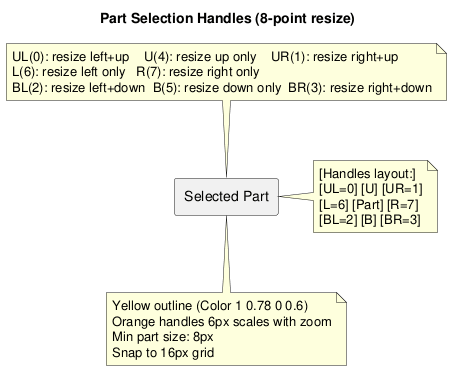

---

## 9. Fluxo de Dados

### 8.1 Data Flow — Editor → Simulation Bridge

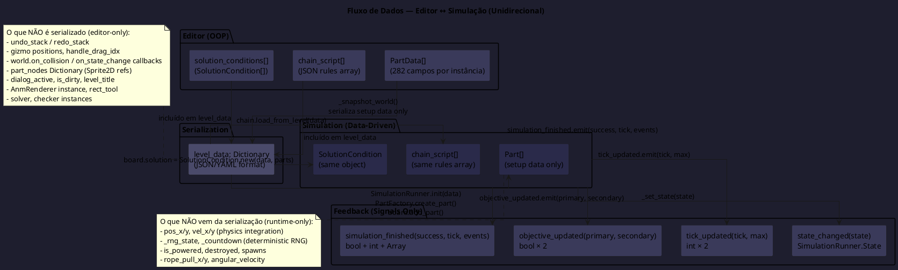
```plantuml
@startuml Data_Flow_Bridge
skinparam backgroundColor #1e1e2e
skinparam linetype ortho

title Fluxo de Dados — Editor ↔ Simulação (Unidirecional)

package "Editor (OOP)" as EDITOR {
  rectangle "PartData[]\n(282 campos por instância)" as PD_ARRAY #3a3a5a
  rectangle "chain_script[]\n(JSON rules array)" as CS_EDITOR #3a3a5a
  rectangle "solution_conditions[]\n(SolutionCondition[])" as SC_EDITOR #3a3a5a
}

package "Serialization" as SERIAL {
  rectangle "level_data: Dictionary\n(JSON/YAML format)" as LD #4a4a6a
}

package "Simulation (Data-Driven)" as SIM {
  rectangle "Part[]\n(setup data only)" as PART_ARRAY #2a2a4a
  rectangle "chain_script[]\n(same rules array)" as CS_SIM #2a2a4a
  rectangle "SolutionCondition\n(same object)" as SC_SIM #2a2a4a
}

package "Feedback (Signals Only)" as FEEDBACK {
  rectangle "state_changed(state)\nSimulationRunner.State" as SIG_STATE #3a3a5a
  rectangle "tick_updated(tick, max)\nint × 2" as SIG_TICK #3a3a5a
  rectangle "objective_updated(primary, secondary)\nbool × 2" as SIG_OBJ #3a3a5a
  rectangle "simulation_finished(success, tick, events)\nbool + int + Array" as SIG_FINISH #3a3a5a
}

PD_ARRAY -down-> LD : _snapshot_world()\nserializa setup data only
CS_EDITOR -down-> LD : incluído em level_data
SC_EDITOR -down-> LD : incluído em level_data

LD -right-> PART_ARRAY : SimulationRunner.init(data)\nPartFactory.create_part()\nboard.add_part()
LD -right-> CS_SIM : chain.load_from_level(data)
LD -right-> SC_SIM : board.solution = SolutionCondition.new(data, parts)

SIM -down-> SIG_STATE : _set_state(state)
SIM -down-> SIG_TICK : tick_updated.emit(tick, max)
SIM -down-> SIG_OBJ : objective_updated.emit(primary, secondary)
SIM -down-> SIG_FINISH : simulation_finished.emit(success, tick, events)

note top of LD
  O que NÃO é serializado (editor-only):
  - undo_stack / redo_stack
  - gizmo positions, handle_drag_idx
  - world.on_collision / on_state_change callbacks
  - part_nodes Dictionary (Sprite2D refs)
  - dialog_active, is_dirty, level_title
  - AnmRenderer instance, rect_tool
  - solver, checker instances
end note

note bottom of PART_ARRAY
  O que NÃO vem da serialização (runtime-only):
  - pos_x/y, vel_x/y (physics integration)
  - _rng_state, _countdown (deterministic RNG)
  - is_powered, destroyed, spawns
  - rope_pull_x/y, angular_velocity
end note

@enduml
```

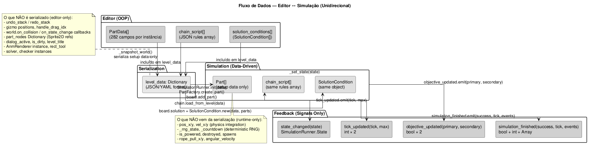

### 8.2 Physics 7-Pass Data Flow

```plantuml
@startuml Physics_7Pass_Data_Flow
skinparam backgroundColor #1e1e2e
skinparam linetype ortho

title 7-Pass Physics Loop — per tick (deterministic order)

rectangle "Part[]\n(Array[Part])" as PARTS #2a2a4a

note bottom of PARTS
  All 13 passes operate on the same parts[] array
  Order is STRICT — pass N sees results of pass N-1
  3 constraint iterations enforce rope/rod limits
end note

rectangle "Pass 0: State Counters" as P0 #3a3a5a [
  advance_state() for all is_moving parts
  - sub_counter countdown (random [40,239])
  - RNG-based delay at state_counter==0
  - deterministic wrap at state_limit_upper
]
rectangle "Pass 1: Gravity Integration" as P1 #3a3a5a [
  tick() per is_moving part:
  - vel_y += gravity_y
  - vel_x += gravity_x
  - pos += vel >> 9
]
rectangle "Pass 2: Behaviors" as P2 #3a3a5a [
  ARCH_DRIVER: angular_velocity = 8
  ARCH_LINK: rope pull on connected_1
  ARCH_CONSUMER: if powered, state_counter=1
]
rectangle "Pass 3: Belts" as P3 #3a3a5a [
  belt_connections: sync angular_velocity
  from belt_driver to belt slave
]
rectangle "Pass 4: Pressure Fields" as P4 #3a3a5a [
  ARCH_CONSUMER + powered
  → pressure field on nearby parts
  (falloff over distance, facing direction)
]
rectangle "Pass 5: Wall Constraints" as P5 #3a3a5a [
  Floor bounce (COR), ceiling negation
  Left/right wall bounce
  pos clamped to viewport bounds
]
rectangle "Pass 6: Collisions (Spatial Grid)" as P6 #3a3a5a [
  CELL_SIZE=64, 9-cell neighborhood
  AABB overlap detection
  Push-apart + COR impulse + friction
  on_collision() → SOLVE.RES state advance
  Destructible vs explosive check
]
rectangle "Pass 7: Proximity Triggers" as P7 #3a3a5a [
  parts with triggers.has("proximity")
  → on_collision() within 80px
]
rectangle "Pass 8: Emitters/Consumers" as P8 #3a3a5a [
  ARCH_EMITTER + state_counter>=2
  → is_powered = true
  → nearby ARCH_CONSUMER powered
]
rectangle "Pass 9: Electrical" as P9 #3a3a5a [
  electrical_outlets cleared + rebuilt
  plugged consumers get is_powered
]
rectangle "Pass 10: Flame/Ignition" as P10 #3a3a5a [
  flame sources + state_counter>=1
  flammable parts within 40px
  → state_counter = 2
]
rectangle "Pass 11: Remove Destroyed" as P11 #3a3a5a [
  parts where destroyed==true
  → removed from parts[]
]
rectangle "Pass 12-14: Rope Constraints ×3" as P12 #3a3a5a [
  CONSTRAINT_ITERATIONS = 3
  ARCH_LINK parts: enforce rope_segment_length
  Push-apart both endpoints
]

PARTS -down-> P0
P0 -down-> P1
P1 -down-> P2
P2 -down-> P3
P3 -down-> P4
P4 -down-> P5
P5 -down-> P6
P6 -down-> P7
P7 -down-> P8
P8 -down-> P9
P9 -down-> P10
P10 -down-> P11
P11 -down-> P12

@enduml
```

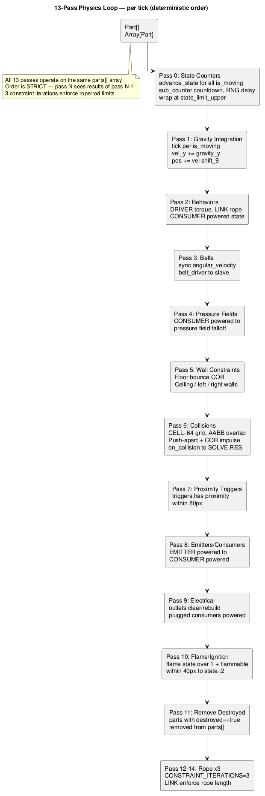

---

## 10. Especificação de APIs

### 9.1 Part State Machine API

```plantuml
@startuml Part_State_Machine_API
skinparam classFontSize 13
skinparam backgroundColor #1e1e2e

title Part State Machine — Public API

class Part {
  +state_counter: int       -- current state (0=initial)
  +sub_counter: int         -- delay counter
  +state_limit_upper: int  -- wrap upper bound
  +state_limit_lower: int  -- clamp lower bound
  +state_limit_reset: int  -- wrap reset value
  +state_limit_sub_a: int  -- sub upper
  +state_limit_sub_b: int  -- sub wrap target
  +current_state: int      -- snapshot

  +advance_state(): bool
  ---

  Summary:
  - sub_counter == 0:
    - state_counter != 0: deterministic increment
      wrap at state_limit_upper → state_limit_reset
    - state_counter == 0: RNG-based delay [40,239] ticks
      (_rng_state & 1 == 0 → deterministic path)
  - sub_counter > 0: countdown mode
    sub_counter-- per tick, then reset
  Returns: state_counter changed
}

class PartData {
  +state_counter: int
  +state_prev: int
  +sub_counter: int
  +state_limit_upper/lower/reset: int
  +state_limit_sub_a/b: int
  +current_state: int

  +advance_state(): bool
  +on_collision(other: PartData): bool
  ---

  Same algorithm as Part
  Additional: state_prev tracks last tick's value
  on_collision: increments if triggers.has("collision")
}

note top of Part
  Deterministic LCG:
  _rng_state = (_rng_state * 0x343FD + 0x269EC3) & 0xFFFFFFFF
  _randint(lo, hi) = lo + (_rng_state % (hi - lo + 1))
end note

note bottom of Part
  Physics callbacks override RNG delay:
  on_collision() always increments state_counter
  (regardless of _countdown state)
end note

@enduml
```

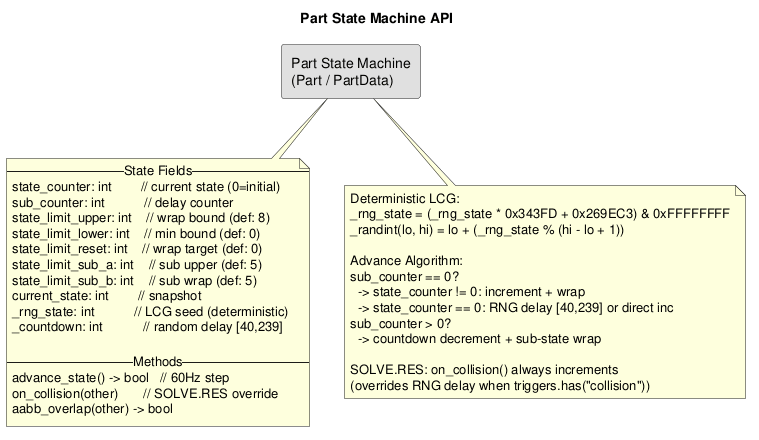

### 9.2 BehaviorRegistry — Key API Surface

```plantuml
@startuml BehaviorRegistry_API
skinparam classFontSize 13
skinparam backgroundColor #1e1e2e

title BehaviorRegistry — Public API (Autoload)

class BehaviorRegistry <<Node>> {

  -- State Machine --
  +get_state_limits(part_type: int): Dictionary
    Returns: {
      limit_lower: int (default 0),
      limit_upper: int (default 8),
      limit_reset: int (default 0),
      limit_sub_a: int (default 5),
      limit_sub_b: int (default 5)
    }

  +get_solve_transitions(part_type: int): Array
    Returns: states[] from solve-decoded.json
    Each state: {anm_state, triggers:[{self,other}], explosive}

  +get_anm_state_for_counter(part_type: int, counter: int): int
    Maps state_counter → anm_state_id
    Used by AnmRenderer for sprite frame selection

  +get_trigger_targets(part_type: int, state_counter: int): Dictionary
    Returns: {self: int, other: int}
    self >= 0: cascade to own state
    other >= 0: cascade to connected_1 part

  -- Physics --
  +get_physics_props(part_type: int): Dictionary
    Returns: {mass, cor_q8, friction_q8, collision_radius, collision_w, collision_h}

  -- Behavior --
  +get_behavior(part_type: int): Dictionary
    Returns: {category, name, triggers, rules, destructible, spawns, solve_states, explosive}

  +get_category(part_type: int): String
    Returns: "Balls"|"Electrical"|"Explosives"|etc (15 categories)

  +get_trigger_targets(part_type: int, state_counter: int): Dictionary
    Returns: {self, other} for trigger chain cascade

  -- Validation --
  +validate_orphan_states(part_type: int): Array
    Checks for unmapped ANM states

  +validate_trigger_chains(part_type: int): Array
    Checks for invalid other state references (> 104)
}

note bottom of BehaviorRegistry
  Data sources (loaded in _ready):
  - res://data/solve-decoded.json     → state machine definitions
  - res://data/behaviors.json         → state limits, sub-limits
  - res://data/categories.json        → category metadata
  - res://data/part-properties.json  → mass, cor, friction, dimensions
  - res://data/part-assets.json       → category mapping, sounds
  - res://data/state-machine-report.json → orphan ANM states

  15 categories:
  Balls, Walls/Floors, Inclines, Special Mechanics, Balloons/Airships,
  Rotating Power Sources, Ropes/Belts/Pulleys, Containers, Characters,
  Springs/Pneumatics, Explosives/Projectiles, Electrical, Light/Flame Sources,
  Lasers/Optics, Scenery
end note

@enduml
```

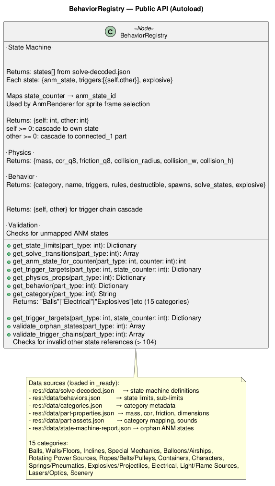

---

## 11. Análise de Decisões de Implementação

Esta seção documenta as **decisões técnicas de implementação** — escolhas de engenharia que foram feitas durante o desenvolvimento e que explicam por que o código está estruturado da forma que está.

### 11.1 Por Que Q8.8 Fixed-Point?

**Problema:** Floating point (float/double) tem comportamento não determinístico em diferentes plataformas e configurações de CPU. Arredondamentos podem variar ligeiramente.

**Solução:** Q8.8 fixed-point arithmetic — 16 bits integer onde 8 são parte inteira e 8 são parte fracionária.

```gdscript
# Exemplo: velocidade em Q8.8
vel_y += gravity_y  # gravity_y é Q8.8
pos_y += vel_y >> 8  # shift right 8 = divide por 256
```

**Por que 8 bits para a parte fracionária?**
- Proporciona precisão suficiente para posições e velocidades
- 16-bit total cabe em register do CPU sem overflow
- Multiplicação de dois Q8.8 ainda cabe em 32-bit

**Trade-offs:**
- **Range limitado**: Max value = 32767.999 (2^15 - 1)
- **Precisão limitada**: 1/256 = 0.0039 (suficiente para física)
- **Benefício**: Reproducibilidade entre plataformas

### 11.2 Por Que 13 Passes em vez de 1 Loop?

**Problema:** Se todas as física fossem aplicadas em um único loop, a ordem de aplicação seria aleatória (ou dependente da ordem no array).

**Solução:** 13 passes em ordem estrita e determinística:

| Pass | Nome | O que faz |
|------|------|-----------|
| 0 | State Counters | `advance_state()` em todos os parts |
| 1 | Gravity | Integração gravitacional |
| 2 | Behaviors | Drivers (torque), Links (rope pull), Consumers |
| 3 | Belts | Sincronização de velocidade angular |
| 4 | Pressure Fields | Campos de pressão de consumers |
| 5 | Wall Constraints | Bounce no chão/parede/teto |
| 6 | Collisions | AABB + circle, impulse resolution |
| 7 | Proximity Triggers | Triggers de proximidade |
| 8 | Emitters/Consumers | Electrical propagation |
| 9 | Electrical | Outlets e consumers |
| 10 | Flame/Ignition | Fontes de chama |
| 11 | Remove Destroyed | Limpa parts destruídos |
| 12-14 | Rope Constraints | 3 iterações para ropes/links |

**Por que a ordem importa?**
- Gravity deve vir antes de collisions (parts precisam estar em posições corretas)
- Collisions deve vir antes de proximity triggers (overlap precisa ser detectado)
- Rope constraints deve vir por último (corrige posições após tudo mais)
- 3 iterações garantem convergência (cada iteração aproxima mais da solução ideal)

### 11.3 Por Que Spatial Grid com CELL_SIZE=64?

**Problema:** Detectar collisions entre N parts é O(n²) — para 32 parts são 496 checks por frame, 60fps = ~30,000 checks/segundo.

**Solução:** Spatial grid divide o viewport em células de 64x64 pixels. Cada part é inserido na célula correspondente à sua posição.

```gdscript
var grid: Dictionary  # key = "cx,cy", value = Array of part indices

func _insert_in_grid(part, cx, cy):
    var key = "%d,%d" % [cx, cy]
    if not grid.has(key):
        grid[key] = []
    grid[key].append(part.id)
```

**Por que CELL_SIZE=64?**
- Viewport típico é ~640x480
- 64px por célula = ~10x10 grid = 100 células
- Cada part checka apenas 9 células vizinhas (3x3 neighborhood)
- Reduz de O(n²) para aproximadamente O(n * k) onde k = parts por célula

**Trade-offs:**
- Parts maiores que 64px podem spanhar múltiplas células
- CELL_SIZE=64 é um trade-off entre granularidade e número de células
- Para viewport maior, precisaria de células maiores

### 11.4 Por Que 3 Iterações de Rope Constraints?

**Problema:** Rope constraints (ARCH_LINK parts) são resolvedores de distância — precisam manter dois parts a uma distância específica.

**Solução:** Iterative constraint solving com 3 iterações:

```gdscript
for iteration in range(3):  # CONSTRAINT_ITERATIONS = 3
    for part in parts:
        if part.archetype == ARCH_LINK:
            _enforce_rope_constraint(part, target)
```

**Por que 3?**
- 1 iteração: aproximação grosseira
- 2 iterações: melhor, mas ainda não convergido
- 3 iterações: suficiente para a maioria dos casos
- Mais de 3: custo de performance sem benefício perceptível

**Convergência:** Constraints são "soft" — cada iteração move os parts um pouco em direção à posição correta. Após 3 iterações, o erro típico é menor que 1px, que é aceitável visualmente.

### 11.5 Por Que LCG RNG com Seed Fixa?

**Contexto:** Deterministic RNG é necessário para reprodutibilidade.

**Solução:** Linear Congruential Generator com seed fixa:

```gdscript
_rng_state = (_rng_state * 0x343FD + 0x269EC3) & 0xFFFFFFFF
_randint(lo, hi) = lo + (_rng_state % (hi - lo + 1))
```

**Parâmetros escolhidos:**
- `0x343FD`: Multiplicador (escolhido para boa distribuição estatística)
- `0x269EC3`: Incremento (número primo)
- `& 0xFFFFFFFF`: Mantém em 32-bit unsigned

**Por que não Godot's RandomNumberGenerator?**
- Godot RNG usa plataforma-dependant implementation
- Seed fixo não garante determinismo entre plataformas diferentes
- LCG é simple, fast, e completamente determinístico

**Seed inicial:** `_rng_state` começa em 1. Isso significa que qualquer simulação com o mesmo `level_data` produz exatamente os mesmos resultados.

---

## 12. Fluxo de Gameplay Completo

Esta seção descreve o **ciclo de vida completo** de uma fase — desde a criação no editor até a resolução no puzzle editor.

### 12.1 Criação de Fase (Level Editor)

O creator usa o Level Editor para construir uma fase do zero:

**1. Nova fase ou carregar existente**
- Ctrl+N: limpa world_state, cria fase vazia
- Ctrl+L: carrega YAML, popula world_state com PartData[]

**2. Selecionar工具 (tool modes)**
- **S (SELECT)**: default — clique para selecionar, drag para mover, handles para resize
- **P (PLACE)**: seleciona part_type do catálogo, clique no viewport para colocar
- **D (DELETE)**: clique para remover part, undo disponível
- **C (CONNECT)**: primeiro clique = source, segundo clique = target (connected_1 = target)
- **Space (PREVIEW)**: inline simulation running — solver.step() por _process()
- **I (LEVEL_INFO)**: dialog para metadata (title, goal, bg_color, pressure, gravity, music_track)

**3. Adicionar peças**
- Click no catálogo (part_type)
- Click no viewport (snapped para 16px grid)
- PartData criado com FLAG_MOVING set
- Sprite renderizado via AnmRenderer

**4. Conectar peças**
- SELECT: seleciona part, mostra 8 handles de resize
- CONNECT: click source → click target (connected_1 = target_idx)
- Visual: linha mostra connection preview

**5. Configurar state machine (Condition Editor)**
- Double-click part: abre ConditionEditor dialog
- Define chain_script rules para esta part
- Regras são armazenadas no level_data, não no PartData

**6. Definir solução (Solution Editor)**
- Dialog para definir objective zones
- primary/secondary conditions
- Estado requerido (state_counter >= X)

**7. Testar (PREVIEW mode)**
- Space toggles preview
- Solver.step() executa física inline
- State counters avançam, sprites sync
- SolutionChecker monitora condições

**8. Salvar (Ctrl+S)**
- YAML salvo com todos os parts, connections, chain_script, solution
- is_dirty = false

### 12.2 Resolução de Puzzle (Puzzle Editor)

O player recebe uma fase com um inventário limitado de peças:

**1. Carregar fase**
- Carrega same YAML que o creator salvou
- Mas: only mostra parts que estão no inventário da fase
- Part count é limitado ao que o creator definiu

**2. Diferença do Level Editor**
- Não pode adicionar peças além do inventário
- Não pode editar state machines
- Não pode alterar connections
- Foco: posicionar peças do inventário para satisfazer solution conditions

**3. Posicionar peças**
- Arrasta peças do inventário para o viewport
- Snap para 16px grid
- Pode rotacionar (R key), flip (F key)

**4. Testar (Play button)**
- Simulação inicia em SubViewport
- Physics executa deterministicamente
- Player observa se solution conditions são atingidas

**5. Iterar**
- Se falhou: reset, reposicionar, tentar novamente
- Se succeeded: level completo, next level unlocked

### 12.3 Modo de Simulação (SubViewport)

A simulação é isolada em um SubViewport e controlada por UI separada:

**1. Inicialização (play())**
```gdscript
sim_runner.init(level_data)  # deserialize
board.clear_level()
board.add_part(PartFactory.create_part(...))  # para cada part
board.spawn_sprites()
chain.load_from_level(level_data)
board.set_process(true)
```

**2. Loop de Tick (wall-clock pacemaker)**
```gdscript
while tick_accum_ms >= 16.667:
    tick_accum_ms -= 16.667
    tick_count += 1
    chain.evaluate_chain()   # avalia regras do chain_script
    physics.step(tick_count)  # 13 passes de física
    board.sync_sprites()     # atualiza sprites se state mudou
```

**3. Controles**
- **Play**: inicia/retoma simulação
- **Pause**: pausa pacemaker, física congelada
- **Stop**: reseta para IDLE, limpa level
- **Reset**: mesmo que stop, mas também reseta chain_script

**4. Sinais de feedback**
```gdscript
signal state_changed(state)       # RUNNING, PAUSED, SUCCESS, FAIL
signal tick_updated(tick, max)    # UI atualiza tick counter
signal objective_updated(primary, secondary)  # checkboxes
signal simulation_finished(success, tick, events)  # end state
```

**5. Timeout**
- max_ticks default = 2000
- Se tick_count >= max_ticks: FAIL state
- Timeout significa que a solução não foi encontrada dentro do tempo esperado

---

## 13. Formato de Serialização

Esta seção descreve o **formato de dados** usado para salvar e carregar fases — o bridge entre editor e simulação.

### 13.1 Por Que YAML?

**Decisão:** YAML em vez de JSON ou binary.

**Vantagens do YAML:**
- **Legibilidade**: Humains podem ler e editar diretamente
- **Version control**: Diff legível no git, fácil resolver conflitos
- **Extensibilidade**: Adicionar novos campos sem quebrar parsers antigos
- **Tooling**: Libraries disponíveis em todas as linguagens

**Desvantagens:**
- **Performance**: Parsing YAML é mais lento que JSON
- **Espaço**: YAML é mais verboso que JSON

**Decisão tomada:** Legibilidade > performance. Fases são salvas/carregadas infrequently (only ao play e ao save), então o custo de parsing é insignificante.

### 13.2 Estrutura do level_data

```yaml
level_info:
  title: "Ball in the Basket"
  goal: "Get the ball into the basket"
  bg_color: [200, 220, 240]
  pressure: 67
  gravity: 272
  music_track: "level_01.ogg"

parts:
  fixed:
    - part_type: 1
      name: "floor"
      x: 0
      y: 300
      width_1: 640
      height_1: 32
      flags_1: 0
      connected_1: -1
      state_limit_upper: 8
      ...

  moving:
    - part_type: 0
      name: "ball"
      x: 100
      y: 100
      width_1: 32
      height_1: 32
      flags_1: 4096  # FLAG_MOVING
      connected_1: -1
      state_limit_upper: 8
      ...

chain_script:
  - when:
      type: "overlap"
      a: "ball"
      b: "basket"
    actions:
      - type: "win"
        msg: "Level Complete!"
    mode: "once"

solution:
  solution_type: "zone_overlap"
  target_part_name: "ball"
  zone:
    x: 500
    y: 280
    w: 80
    h: 40
  required_state: 0

inventory:
  - part_type: 0
    count: 3
  - part_type: 6
    count: 2
```

### 13.3 O Que É Serializado vs O Que Não É

**Serializado (setup data — vai para simulação):**
```
PartData: part_type, name, x, y, width_1/2, height_1/2,
          flags_1/2/3, connected_1/2, state_counter,
          state_limit_*, current_state, mass, cor_q8,
          friction_q8, collision_radius, facing
```

**NÃO Serializado (editor-only — não vai para simulação):**
```
Editor state:
  - undo_stack, redo_stack (50 níveis)
  - gizmo positions, handle_drag_idx
  - world.on_collision, on_state_change (Callable)
  - part_nodes (Sprite2D refs no editor)
  - dialog_active, is_dirty, level_title
  - rect_tool (Selection rectangle tool)
  - solver instance, checker instance

Runtime-only (gerado na simulação):
  - pos_x, pos_y, vel_x, vel_y (physics integration)
  - _rng_state, _countdown (deterministic RNG state)
  - is_powered, destroyed, spawns
  - rope_pull_x, rope_pull_y
```

### 13.4 LevelSerializer — Save/Load

```gdscript
class LevelSerializer extends RefCounted:

    func save_yaml(path: String, level: Dictionary):
        # Serialize parts: fixed[] e moving[]
        # Serialize chain_script[]
        # Serialize solution{}
        # Serialize level_info{}
        # Serialize inventory[]

    func load_yaml(path: String) -> Dictionary:
        # Parse YAML
        # Validate required fields
        # Return level_data dictionary
        # Não cria PartData — isso é feito pelo caller
```

**Formato de saída:**
- Seção "fixed": parts com FLAG_MOVING não setado
- Seção "moving": parts com FLAG_MOVING setado
- Cada part list é um array de dicionários com campos em hex16 (exceto coordenadas e nomes)

**Hex16 encoding:** Valores numéricos são salvos como hex strings para legibilidade e compactação. Ex: `state_limit_upper: 8` vs `state_limit_upper: "0x8"`.

---

## 14. Resumo de Constraints

### 14.1 Constraints Verificadas

| Constraint | Implementação |
|------------|---------------|
| Determinismo 50/50 | `SimulationRunner.run_deterministic_test(50)` → PASS |
| 60Hz fixed tick | `tick_accum_ms >= 1000/60` no `_process()` pacemaker |
| Q8.8 fixed-point | `vel_y >> 9`, `cor_q8 >> 8`, gravity table |
| 7-pass physics | `PhysicsEngine.step()` — 13 passes (0-12) |
| Dual representation | `PartData` (282 campos) ↔ `Part` (60 campos) |
| OOP editor | `EditorController` com 6 tool modes, undo/redo |
| Data-driven simulation | `chain_script` array de regras JSON |
| State machines first-class | `advance_state()` em Part e PartData |
| Signal-based feedback | `state_changed`, `tick_updated`, `simulation_finished` |
| SubViewport isolation | `SimulationOverlay.tscn` (SubViewport + controls) |
| No runtime state sharing | Serializa apenas setup data na bridge |

---

*Documento de Arquitetura — Grandma's Garden*
*Versão expandida com seções narrativas de decisões de design*
*Última atualização: Introdução, Decisões Arquiteturais, Análise de Implementação, Gameplay Flow, Serialização*