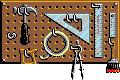

# 8. Catálogo Detalhado de Peças

Este documento lista detalhadamente todas as peças presentes no jogo, gerado automaticamente a partir da documentação original do projeto `docs/parts/`.

## Peça 0 — Bowling Ball

**Categoria:** Balls  
**Fases em que aparece:** 40 fases  
**Quantidade de Estados:** 1 estado(s)  

> This bowling ball is very heavy and doesn't bounce much.

**Propriedades Físicas:**

| Property | Raw Value | Interpretation |
|----------|-----------|----------------|
| `mass` | 2832 | mass/density (relative scale) |
| `damping` | 200 | drag/air-resistance or density |
| `cor_q8` | 128 | COR = 0.500 |
| `radius` | 16 | collision radius in internal units |
| `sprite_w` | 240 | sprite width |
| `sprite_h` | 240 | sprite height |
| `data_offset` | 32 | offset to per-state data or count |

**Regras de Categoria:**

| Rule | Value |
|------|-------|
| Triggers | `collision`, `trap` |
| Destructible | No |
| Spawns | *(none)* |
| Category Part Count | 9 |

**Conexões e Capacidades:**

| Capability | Supported |
|------------|-----------|
| Electrical | No |
| Belt Connection | No |
| Rope Connection | No |
| Fire/Flame | No |
| Laser | No |
| Projectile | No |

**Mapeamento de Sprite por Estado (ANM):**

| State ID | First Frame | Frame Range | Dimensions | Bytecode Offset |
|----------|-------------|-------------|------------|-----------------|
| `1` | 0 | 0–7 (8 frames) | 32×32 | 0 |

**Detalhes dos Sprites dos Frames:**

| Frame | Sprites | PNG References |
|-------|---------|----------------|
| 0 | `0001_0000` | `build/phase-3/bitmaps/PART0_f000.png :material-check:` |
| 1 | `0001_0001` | `build/phase-3/bitmaps/PART0_f001.png :material-check:` |
| 2 | `0001_0002` | `build/phase-3/bitmaps/PART0_f002.png :material-check:` |
| 3 | `0001_0003` | `build/phase-3/bitmaps/PART0_f003.png :material-check:` |
| 4 | `0001_0004` | `build/phase-3/bitmaps/PART0_f004.png :material-check:` |
| 5 | `0001_0005` | `build/phase-3/bitmaps/PART0_f005.png :material-check:` |
| 6 | `0001_0006` | `build/phase-3/bitmaps/PART0_f006.png :material-check:` |
| 7 | `0001_0007` | `build/phase-3/bitmaps/PART0_f007.png :material-check:` |

**Opcodes do Bytecode:**

| Opcode | Count |
|--------|-------|
| `DRAW_BMP` | 8 |
| `END_FRAME` | 8 |
| `END_ANM` | 1 |

**Notas de Comportamento:**

**Bowling Ball** is a static part with no programmatic state transitions. Its visual appearance is determined by the ANM state selected at placement time (via the `appearance` field in the level file).

### Compliance Test Cases

#### TC-001: Part type number matches filename
- **Given** the part file `part-000-bowling-ball.md` describes part type `0`
- **When** parsed by `decoder/d_puzzle.py` → `nt_part_info_t2_base`
- **Then** `part_num == 0`

#### TC-002: Mass value is positive
- **Given** Bowling Ball has `mass = 2832`
- **When** validated against `build/phase-9/part-properties.json`
- **Then** `mass > 0`

#### TC-003: COR within valid range [0.0, 1.0]
- **Given** Bowling Ball has `cor_q8 = 128`
- **When** converted from Q8.8 fixed-point
- **Then** `0.0 <= (128 >> 8) <= 1.0` i.e. `COR = 0.500`

#### TC-004: Radius is non-negative
- **Given** Bowling Ball has `radius = 16`
- **When** physics engine initializes collision
- **Then** `radius >= 0`

#### TC-005: Initial state at simulation start
- **Given** Bowling Ball is placed in a level
- **When** simulation starts
- **Then** `state_counter` initializes to `0`

#### TC-006: Single default state — no named transitions
- **Given** Bowling Ball has no SOLVE.RES state data
- **When** the part is loaded
- **Then** `state_machine` section shows "Single default state"

#### TC-007: ANM animation frames match state count
- **Given** Bowling Ball ANM has `Total Frames = 8`, `Total States = 1`
- **When** `decoder/d_t2anm.py` parses Section C
- **Then** `len(Section C entries) == 1`

#### TC-008: Bytecode draws correct sprites
- **Given** Bowling Ball ANM frame `0`
- **When** bytecode is executed
- **Then** `DRAW_BMP` opcode references valid sprite in `build/phase-3/bitmaps/PART0_f*.png`

#### TC-009: Connection flags match category rules
- **Given** Bowling Ball (Balls category) declares no connections
- **When** checked against `category_rules`
- **Then** `Electrical=No`, `Belt=No`, `Rope=No`, `Fire=No`, `Laser=No`, `Projectile=No`

#### TC-010: Part used in real levels
- **Given** Bowling Ball (type 0)
- **When** checked against `build/phase-5/yaml/*.yaml`
- **Then** at least 40 levels reference `part_num = 0`

#### TC-011: Snap-to-grid (16px) in edit mode
- **Given** Bowling Ball placed at position `(47, 23)`
- **When** editor snaps position
- **Then** result is `(48, 16)` — both coordinates multiple of 16

#### TC-012: Physics disabled in edit mode
- **Given** Bowling Ball in edit mode
- **Then** `velocity_x = velocity_y = 0` and `state_counter` frozen

#### TC-013: Created Part flag is No
- **Given** Bowling Ball Identity shows `Created Part: No`
- **When** `nt_part_info_t2_base.is_created` is accessed
- **Then** `is_created == False`

#### TC-014: Interactive flag is No
- **Given** Bowling Ball Identity shows `Interactive: No`
- **When** `nt_part_info_t2_base.behavior` is checked
- **Then** part does not require user interaction to activate

#### TC-015: Namedtuple field count matches format
- **Given** `nt_part_info_t2_base` parsed from binary
- **Then** `len(nt_part_info_t2_base._fields) == 25` fields

#### TC-016: Flags_3 bitfield decodes correctly
- **Given** Bowling Ball `flags_3` from level data
- **When** decoded per `fformat.txt`
- **Then** gravity direction bit (bit 3) and initial state bit (bit 12) are valid

---

## Peça 1 — Brick Wall

**Categoria:** Walls / Floors  
**Fases em que aparece:** 37 fases  
**Quantidade de Estados:** 2 estado(s)  

> This brick wall or floor can be stretched vertically or horizontally to any length you need. It's not as slippery as a caution wall. Explosives will blow it up.

**Detalhes dos Estados (SOLVE.RES):**

*No SOLVE.RES state data — this part has no programmatic state transitions.*

**Propriedades Físicas:**

| Property | Raw Value | Interpretation |
|----------|-----------|----------------|
| `mass` | 4153 | mass/density (relative scale) |
| `unk_2` | 1000 | category-specific property |
| `friction_q8` | 1024 | friction = 4.000 |
| `unk_6` | 24 | category-specific property |
| `tile_w` | 16 | base width in tile units |
| `tile_h` | 16 | base height in tile units |
| `collision_w` | 576 | AABB collision width |
| `collision_h` | 416 | AABB collision height |
| `bitmap_w` | 16 | bitmap frame width |
| `bitmap_h` | 16 | bitmap frame height |

**Regras de Categoria:**

| Rule | Value |
|------|-------|
| Triggers | *(none)* |
| Destructible | Yes |
| Spawns | *(none)* |
| Category Part Count | 15 |

**Conexões e Capacidades:**

| Capability | Supported |
|------------|-----------|
| Electrical | No |
| Belt Connection | No |
| Rope Connection | No |
| Fire/Flame | No |
| Laser | No |
| Projectile | No |

**Mapeamento de Sprite por Estado (ANM):**

| State ID | First Frame | Frame Range | Dimensions | Bytecode Offset |
|----------|-------------|-------------|------------|-----------------|
| `2` | 4 | 4–7 (4 frames) | 16×16 | 28 |
| `1` | 8 | 8–19 (12 frames) | 40×16 | 56 |

**Detalhes dos Sprites dos Frames:**

| Frame | Sprites | PNG References |
|-------|---------|----------------|
| 0 | `0001_0000` | `build/phase-3/bitmaps/PART1_f000.png :material-check:` |
| 1 | `0001_0001` | `build/phase-3/bitmaps/PART1_f001.png :material-check:` |
| 2 | `0001_0002` | `build/phase-3/bitmaps/PART1_f002.png :material-check:` |
| 3 | `0001_0003` | `build/phase-3/bitmaps/PART1_f003.png :material-check:` |
| 4 | `0001_0004` | `build/phase-3/bitmaps/PART1_f004.png :material-check:` |
| 5 | `0001_0005` | `build/phase-3/bitmaps/PART1_f005.png :material-check:` |
| 6 | `0001_0006` | `build/phase-3/bitmaps/PART1_f006.png :material-check:` |
| 7 | `0001_0007` | `build/phase-3/bitmaps/PART1_f007.png :material-check:` |
| 8 | `0001_0008` | `build/phase-3/bitmaps/PART1_f008.png :material-check:` |
| 9 | `0001_0009` | `build/phase-3/bitmaps/PART1_f009.png :material-check:` |
| 10 | `0001_0008` | `build/phase-3/bitmaps/PART1_f008.png :material-check:` |
| 11 | `0001_0009` | `build/phase-3/bitmaps/PART1_f009.png :material-check:` |
| 12 | `0001_0008` | `build/phase-3/bitmaps/PART1_f008.png :material-check:` |
| 13 | `0001_0009` | `build/phase-3/bitmaps/PART1_f009.png :material-check:` |
| 14 | `0001_0010` | `build/phase-3/bitmaps/PART1_f010.png :material-check:` |
| 15 | `0001_0010` | `build/phase-3/bitmaps/PART1_f010.png :material-check:` |
| 16 | `0001_0010` | `build/phase-3/bitmaps/PART1_f010.png :material-check:` |
| 17 | `0001_0011` | `build/phase-3/bitmaps/PART1_f011.png :material-check:` |
| 18 | `0001_0011` | `build/phase-3/bitmaps/PART1_f011.png :material-check:` |
| 19 | `0001_0011` | `build/phase-3/bitmaps/PART1_f011.png :material-check:` |

**Opcodes do Bytecode:**

| Opcode | Count |
|--------|-------|
| `DRAW_BMP` | 20 |
| `END_FRAME` | 20 |
| `END_ANM` | 1 |

**Notas de Comportamento:**

**Brick Wall** is a static part with no programmatic state transitions. Its visual appearance is determined by the ANM state selected at placement time (via the `appearance` field in the level file).

This part can be destroyed by explosives.

### Compliance Test Cases

#### TC-001: Part type number matches filename
- **Given** the part file `part-001-brick-wall.md` describes part type `1`
- **When** parsed by `decoder/d_puzzle.py` → `nt_part_info_t2_base`
- **Then** `part_num == 1`

#### TC-002: Mass value is positive
- **Given** Brick Wall has `mass = 4153`
- **When** validated against `build/phase-9/part-properties.json`
- **Then** `mass > 0`

#### TC-003: Friction within valid range
- **Given** Brick Wall has `friction_q8 = 1024`
- **When** converted from Q8.8 fixed-point
- **Then** `friction = 4.000` (reasonable for rough surface)

#### TC-004: Destructible flag matches category rules
- **Given** Brick Wall shows `Destructible: Yes`
- **When** explosive part collides with it
- **Then** SOLVE.RES triggers destruction state

#### TC-005: Category Part Count is 15
- **Given** Brick Wall category rules show `Category Part Count: 15`
- **When** validated against `build/phase-9/part-properties.json`
- **Then** 15 parts share this category

#### TC-006: No SOLVE.RES state transitions
- **Given** Brick Wall has "No SOLVE.RES state data"
- **When** collision occurs
- **Then** no programmatic state change occurs

#### TC-007: ANM has 2 states but single default behavior
- **Given** Brick Wall ANM shows `Total States = 2`
- **When** animation plays
- **Then** appearance determined by `appearance` field, not state machine

#### TC-008: Collision dimensions match bitmap
- **Given** Brick Wall has `collision_w = 576`, `collision_h = 416`
- **When** AABB collision check runs
- **Then** collision box is larger than bitmap (due to stretch gizmo)

#### TC-009: Connection flags all disabled
- **Given** Brick Wall declares no connections
- **When** checked against connections table
- **Then** `Electrical=No`, `Belt=No`, `Rope=No`, `Fire=No`, `Laser=No`, `Projectile=No`

#### TC-010: Part used in 37 levels
- **Given** Brick Wall (type 1)
- **When** checked against `build/phase-5/yaml/*.yaml`
- **Then** at least 37 levels reference `part_num = 1`

#### TC-011: Tile dimensions are multiples of 16
- **Given** Brick Wall has `tile_w = 16`, `tile_h = 16`
- **When** gizmo stretches the wall
- **Then** dimensions snap to 16-pixel grid increments

#### TC-012: Created Part flag is No
- **Given** Brick Wall Identity shows `Created Part: No`
- **When** level is loaded
- **Then** part appears in Parts Bin

#### TC-013: Interactive flag is No
- **Given** Brick Wall Identity shows `Interactive: No`
- **When** player clicks on it during simulation
- **Then** no action triggered

#### TC-014: Scenery-part boundary respected
- **Given** Brick Wall has part_num 1 (< 149)
- **When** placed in level
- **Then** part is NOT scenery (scenery starts at 149)

#### TC-015: Wall stretch gizmo is single-axis
- **Given** Brick Wall is a Wall/Floor category
- **When** gizmo type is determined
- **Then** stretch is constrained to horizontal or vertical axis

---

## Peça 2 — Wood incline

**Categoria:** Inclines  
**Fases em que aparece:** 36 fases  
**Quantidade de Estados:** 1 estado(s)  

> You can roll things up or down this wood incline, or use it to direct balloons. It can be stretched or shrunk, which changes the angle. Explosives won't hurt it.

**Detalhes dos Estados (SOLVE.RES):**

*No SOLVE.RES state data — this part has no programmatic state transitions.*

**Propriedades Físicas:**

| Property | Raw Value | Interpretation |
|----------|-----------|----------------|
| `mass` | 1510 | mass/density (relative scale) |
| `unk_2` | 1000 | category-specific property |
| `friction_q8` | 1024 | friction = 4.000 |
| `unk_6` | 16 | category-specific property |
| `tile_w` | 16 | base width in tile units |
| `tile_h` | 240 | base height in tile units |
| `collision_w` | 64 | AABB collision width |
| `collision_h` | 0 | AABB collision height |
| `bitmap_w` | 16 | bitmap frame width |
| `bitmap_h` | 32 | bitmap frame height |

**Regras de Categoria:**

| Rule | Value |
|------|-------|
| Triggers | *(none)* |
| Destructible | No |
| Spawns | *(none)* |
| Category Part Count | 6 |

**Conexões e Capacidades:**

| Capability | Supported |
|------------|-----------|
| Electrical | No |
| Belt Connection | No |
| Rope Connection | No |
| Fire/Flame | No |
| Laser | No |
| Projectile | No |

**Mapeamento de Sprite por Estado (ANM):**

| State ID | First Frame | Frame Range | Dimensions | Bytecode Offset |
|----------|-------------|-------------|------------|-----------------|
| `1` | 0 | 0–3 (4 frames) | 16×32 | 0 |

**Detalhes dos Sprites dos Frames:**

| Frame | Sprites | PNG References |
|-------|---------|----------------|
| 0 | `0001_0000` | `build/phase-3/bitmaps/PART2_f000.png :material-check:` |
| 1 | `0001_0001` | `build/phase-3/bitmaps/PART2_f001.png :material-check:` |
| 2 | `0001_0002` | `build/phase-3/bitmaps/PART2_f002.png :material-check:` |
| 3 | `0001_0003` | `build/phase-3/bitmaps/PART2_f003.png :material-check:` |

**Opcodes do Bytecode:**

| Opcode | Count |
|--------|-------|
| `DRAW_BMP` | 4 |
| `END_FRAME` | 4 |
| `END_ANM` | 1 |

**Notas de Comportamento:**

**Wood incline** is a static part with no programmatic state transitions. Its visual appearance is determined by the ANM state selected at placement time (via the `appearance` field in the level file).

### Compliance Test Cases

#### TC-001: Part type number matches filename
- **Given** the part file `part-002-wood-incline.md` describes part type `2`
- **When** parsed by `decoder/d_puzzle.py` → `nt_part_info_t2_base`
- **Then** `part_num == 2`

#### TC-002: Mass value is positive
- **Given** Wood Incline has `mass = 1510`
- **When** validated
- **Then** `mass > 0`

#### TC-003: Friction value is valid
- **Given** Wood Incline has `friction_q8 = 1024`
- **When** converted
- **Then** `friction = 4.000` (wood surface)

#### TC-004: Destructible flag is No
- **Given** Wood Incline shows `Destructible: No`
- **When** explosive collides with it
- **Then** wall is NOT destroyed

#### TC-005: No SOLVE.RES state transitions
- **Given** Wood Incline has no SOLVE.RES data
- **When** any collision occurs
- **Then** no state change triggered

#### TC-006: Collision height is 0 (degenerate AABB)
- **Given** Wood Incline has `collision_h = 0`
- **When** AABB collision check runs
- **Then** this represents a 1D line collision (incline has no thickness)

#### TC-007: Collision width is 64
- **Given** Wood Incline has `collision_w = 64`
- **When** collision check runs
- **Then** collision extends 64 units along incline

#### TC-008: ANM single state with 4 frames
- **Given** Wood Incline ANM shows `Total Frames = 4`, `Total States = 1`
- **When** rendered
- **Then** only one visual appearance state

#### TC-009: No connections supported
- **Given** Wood Incline declares no connections
- **When** checked
- **Then** `Electrical=No`, `Belt=No`, `Rope=No`, `Fire=No`, `Laser=No`, `Projectile=No`

#### TC-010: Part used in 36 levels
- **Given** Wood Incline (type 2)
- **When** checked against YAML levels
- **Then** at least 36 levels reference it

#### TC-011: Incline angle determined by stretch gizmo
- **Given** Wood Incline can be stretched
- **When** gizmo changes `width_1` dimension
- **Then** collision box updates accordingly

#### TC-012: Bitmap height matches incline sprite
- **Given** Wood Incline has `bitmap_h = 32`
- **When** sprite is rendered
- **Then** frame height is 32 pixels

#### TC-013: Category is Inclines
- **Given** Wood Incline Category is "Inclines"
- **When** placed with other inclines
- **Then** they can stack/be adjacent

#### TC-014: Created Part flag is No
- **Given** Identity shows `Created Part: No`
- **When** level loads
- **Then** part is in Parts Bin

#### TC-015: Interactive flag is No
- **Given** Identity shows `Interactive: No`
- **When** simulation runs
- **Then** no player interaction required

---

## Peça 3 — Tipsy Trailer

**Categoria:** Special Mechanics  
**Fases em que aparece:** 38 fases  
**Quantidade de Estados:** 1 estado(s)  

> This little trailer acts as a teeter-totter. Drop something heavy on the high end to catapult an object off the low end. Tie a rope to either end and use it to hoist and lower objects, pull the trigger of the phazer, or cause other reactions.

**Detalhes dos Estados (SOLVE.RES):**

*No SOLVE.RES state data — this part has no programmatic state transitions.*

**Propriedades Físicas:**

| Property | Raw Value | Interpretation |
|----------|-----------|----------------|
| `mass` | 1888 | mass/density (relative scale) |
| `unk_2` | 1000 | category-specific property |
| `property_q8` | 1024 | Q8.8 = 4.000 |
| `unk_6` | 16 | category-specific property |
| `dim_w1` | 240 | dimension 1 width |
| `dim_h1` | 240 | dimension 1 height |
| `dim_w2` | 0 | dimension 2 width |
| `dim_h2` | 0 | dimension 2 height |
| `bitmap_w` | 80 | bitmap frame width |
| `bitmap_h` | 39 | bitmap frame height |

**Regras de Categoria:**

| Rule | Value |
|------|-------|
| Triggers | `collision`, `electrical`, `proximity` |
| Destructible | No |
| Spawns | `custom` |
| Category Part Count | 15 |

**Conexões e Capacidades:**

| Capability | Supported |
|------------|-----------|
| Electrical | Yes |
| Belt Connection | No |
| Rope Connection | No |
| Fire/Flame | No |
| Laser | No |
| Projectile | No |

**Mapeamento de Sprite por Estado (ANM):**

| State ID | First Frame | Frame Range | Dimensions | Bytecode Offset |
|----------|-------------|-------------|------------|-----------------|
| `6` | 0 | 0–2 (3 frames) | 80×39 | 0 |

**Detalhes dos Sprites dos Frames:**

| Frame | Sprites | PNG References |
|-------|---------|----------------|
| 0 | `0001_0003`, `0001_0000` | `build/phase-3/bitmaps/PART3_f003.png :material-check:` `build/phase-3/bitmaps/PART3_f000.png :material-check:` |
| 1 | `0001_0002`, `0001_0000` | `build/phase-3/bitmaps/PART3_f002.png :material-check:` `build/phase-3/bitmaps/PART3_f000.png :material-check:` |
| 2 | `0001_0001`, `0001_0000` | `build/phase-3/bitmaps/PART3_f001.png :material-check:` `build/phase-3/bitmaps/PART3_f000.png :material-check:` |

**Opcodes do Bytecode:**

| Opcode | Count |
|--------|-------|
| `DRAW_BMP` | 6 |
| `END_FRAME` | 3 |
| `END_ANM` | 1 |

**Notas de Comportamento:**

**Tipsy Trailer** is a static part with no programmatic state transitions. Its visual appearance is determined by the ANM state selected at placement time (via the `appearance` field in the level file).

This part has custom spawn behavior defined in SOLVE.RES.

### Compliance Test Cases

#### TC-001: Part type number matches filename
- **Given** `part-003-tipsy-trailer.md` describes part type `3`
- **When** parsed by `decoder/d_puzzle.py` → `nt_part_info_t2_base`
- **Then** `part_num == 3`

#### TC-002: Mass value is positive
- **Given** Tipsy Trailer has `mass = 1888`
- **When** validated
- **Then** `mass > 0`

#### TC-003: property_q8 encodes mechanical property
- **Given** Tipsy Trailer has `property_q8 = 1024` (Q8.8 = 4.000)
- **When** behavior handler runs
- **Then** value represents pivot sensitivity or counterweight effect

#### TC-004: Category triggers include collision, electrical, proximity
- **Given** Tipsy Trailer shows `Triggers: collision, electrical, proximity`
- **When** any of these stimuli occur
- **Then** state transition may be triggered

#### TC-005: Spawns custom behavior
- **Given** Tipsy Trailer shows `Spawns: custom`
- **When** activated
- **Then** special behavior handler is invoked (teeter-totter pivot)

#### TC-006: Electrical connection supported
- **Given** Tipsy Trailer shows `Electrical: Yes`
- **When** connected to power network
- **Then** can be activated via electrical signal

#### TC-007: ANM state ID is 6 (non-default initial)
- **Given** Tipsy Trailer ANM shows `State ID: 6` for first frame
- **When** simulation starts
- **Then** `state_counter` may initialize to `6` (check flags_3)

#### TC-008: 3 animation frames for pivot motion
- **Given** Tipsy Trailer ANM has `Total Frames = 3`
- **When** animated
- **Then** frames show trailer pivoting between positions

#### TC-009: Bytecode draws 6 sprites (2 per frame)
- **Given** Bytecode shows `DRAW_BMP: 6`
- **When** rendering
- **Then** each frame composes 2 sprite images

#### TC-010: Part used in 38 levels
- **Given** Tipsy Trailer (type 3)
- **When** checked against YAML levels
- **Then** at least 38 levels reference it

#### TC-011: Rope connection anchor points
- **Given** Description mentions rope attachment at either end
- **When** rope connects to trailer
- **Then** force applied at attachment point creates pivot torque

#### TC-012: Teeter-totter pivot physics
- **Given** heavy object dropped on high end
- **When** physics tick runs
- **Then** angular momentum transfers to low end (catapult effect)

#### TC-013: Created Part flag is No
- **Given** Identity shows `Created Part: No`
- **When** level loads
- **Then** part is in Parts Bin

#### TC-014: Interactive flag is No
- **Given** Identity shows `Interactive: No`
- **When** player clicks during sim
- **Then** no direct interaction

#### TC-015: Category Part Count is 15
- **Given** Category Rules show `Category Part Count: 15`
- **When** validated
- **Then** 15 parts in Special Mechanics category

---

## Peça 4 — Balloon

**Categoria:** Balloons / Airships  
**Fases em que aparece:** 68 fases  
**Quantidade de Estados:** 8 estado(s)  

> This balloon can be programmed to have four different appearances, which all act exactly the same. It will float up into the air unless it's tied down with a rope or held back by another object. Use it to lift the low end of the teeter-totter, shoot the phazer, trigger the boxing glove, push the bellows, or bump various objects. Balloons will pop if they touch moving gears, hedge trimmers, tin snips, any flame, laser beams or tacks.

**Detalhes dos Estados (SOLVE.RES):**

### SOLVE.RES State Transitions

| State Name | Triggers (self→other) | ANM State | Explosive |
|------------|-----------------------|-----------|-----------|
| Not Popped | `3→7`, `2→6`, `4→8`, `5→9` | — | No |
| Popped | `7→2`, `6→4`, `8→5`, `9→-1` | — | No |

**Propriedades Físicas:**

| Property | Raw Value | Interpretation |
|----------|-----------|----------------|
| `mass` | 9 | mass/density (relative scale) |
| `unk_2` | 1 | category-specific property |
| `property_q8` | 64 | Q8.8 = 0.250 |
| `unk_6` | 32 | category-specific property |
| `dim_w1` | 240 | dimension 1 width |
| `dim_h1` | 240 | dimension 1 height |
| `dim_w2` | 0 | dimension 2 width |
| `dim_h2` | 0 | dimension 2 height |
| `bitmap_w` | 32 | bitmap frame width |
| `bitmap_h` | 48 | bitmap frame height |

**Regras de Categoria:**

| Rule | Value |
|------|-------|
| Triggers | `collision`, `proximity` |
| Destructible | Yes |
| Spawns | *(none)* |
| Category Part Count | 3 |

**Conexões e Capacidades:**

| Capability | Supported |
|------------|-----------|
| Electrical | No |
| Belt Connection | No |
| Rope Connection | No |
| Fire/Flame | No |
| Laser | No |
| Projectile | No |

**Mapeamento de Sprite por Estado (ANM):**

| State ID | First Frame | Frame Range | Dimensions | Bytecode Offset |
|----------|-------------|-------------|------------|-----------------|
| `3` | 0 | 0 | 40×51 | 0 |
| `7` | 1 | 1–5 (5 frames) | 40×51 | 7 |
| `2` | 6 | 6 | 48×51 | 44 |
| `6` | 7 | 7–12 (6 frames) | 48×51 | 51 |
| `4` | 13 | 13 | 56×51 | 95 |
| `8` | 14 | 14–17 (4 frames) | 56×51 | 102 |
| `5` | 18 | 18 | 40×42 | 132 |
| `9` | 19 | 19–22 (4 frames) | 40×42 | 139 |

**Detalhes dos Sprites dos Frames:**

| Frame | Sprites | PNG References |
|-------|---------|----------------|
| 0 | `0001_0010` | `build/phase-3/bitmaps/PART4_f010.png :material-check:` |
| 1 | `0001_0010` | `build/phase-3/bitmaps/PART4_f010.png :material-check:` |
| 2 | `0001_0011` | `build/phase-3/bitmaps/PART4_f011.png :material-check:` |
| 3 | `0001_0012` | `build/phase-3/bitmaps/PART4_f012.png :material-check:` |
| 4 | `0001_0013` | `build/phase-3/bitmaps/PART4_f013.png :material-check:` |
| 5 | `0001_0014` | `build/phase-3/bitmaps/PART4_f014.png :material-check:` |
| 6 | `0001_0000` | `build/phase-3/bitmaps/PART4_f000.png :material-check:` |
| 7 | `0001_0000` | `build/phase-3/bitmaps/PART4_f000.png :material-check:` |
| 8 | `0001_0001` | `build/phase-3/bitmaps/PART4_f001.png :material-check:` |
| 9 | `0001_0002` | `build/phase-3/bitmaps/PART4_f002.png :material-check:` |
| 10 | `0001_0003` | `build/phase-3/bitmaps/PART4_f003.png :material-check:` |
| 11 | `0001_0004` | `build/phase-3/bitmaps/PART4_f004.png :material-check:` |
| 12 | `0001_0005` | `build/phase-3/bitmaps/PART4_f005.png :material-check:` |
| 13 | `0003_0000` | `build/phase-3/bitmaps/PART4_3_f000.png :material-alert-outline: (not found)` |
| 14 | `0003_0000` | `build/phase-3/bitmaps/PART4_3_f000.png :material-alert-outline: (not found)` |
| 15 | `0003_0001` | `build/phase-3/bitmaps/PART4_3_f001.png :material-alert-outline: (not found)` |
| 16 | `0003_0002` | `build/phase-3/bitmaps/PART4_3_f002.png :material-alert-outline: (not found)` |
| 17 | `0003_0003` | `build/phase-3/bitmaps/PART4_3_f003.png :material-alert-outline: (not found)` |
| 18 | `0004_0000` | `build/phase-3/bitmaps/PART4_4_f000.png :material-alert-outline: (not found)` |
| 19 | `0004_0000` | `build/phase-3/bitmaps/PART4_4_f000.png :material-alert-outline: (not found)` |
| 20 | `0004_0001` | `build/phase-3/bitmaps/PART4_4_f001.png :material-alert-outline: (not found)` |
| 21 | `0004_0002` | `build/phase-3/bitmaps/PART4_4_f002.png :material-alert-outline: (not found)` |
| 22 | `0004_0003` | `build/phase-3/bitmaps/PART4_4_f003.png :material-alert-outline: (not found)` |

**Efeitos Sonoros (SFX):**

| Frame | Sound ID | Bytecode Offset | WAV Reference |
|-------|----------|-----------------|---------------|
| 2 | `3004` | 0 | `build/phase-6/raw-wav/SX_3004_11025.wav` |
| 8 | `3004` | 0 | `build/phase-6/raw-wav/SX_3004_11025.wav` |
| 15 | `3004` | 0 | `build/phase-6/raw-wav/SX_3004_11025.wav` |
| 20 | `3004` | 0 | `build/phase-6/raw-wav/SX_3004_11025.wav` |

**Opcodes do Bytecode:**

| Opcode | Count |
|--------|-------|
| `DRAW_BMP` | 23 |
| `END_FRAME` | 23 |
| `PLAY_SFX` | 4 |
| `END_ANM` | 1 |

**Notas de Comportamento:**

**Balloon** has 2 semantic states: Not Popped, Popped. Transitions are triggered by: collision, proximity.

Terminal state(s): Popped (part is removed from simulation).

This part can be destroyed by explosives.

### Compliance Test Cases

#### TC-001: Part type number matches filename
- **Given** `part-004-balloon.md` describes part type `4`
- **When** parsed
- **Then** `part_num == 4`

#### TC-002: Very low mass (buoyant object)
- **Given** Balloon has `mass = 9`
- **When** gravity applied
- **Then** `mass` is lowest in category, enabling buoyancy

#### TC-003: property_q8 encodes lift force
- **Given** Balloon has `property_q8 = 64` (Q8.8 = 0.250)
- **When** buoyancy calculated
- **Then** `gravity_buoyancy = pressure * (1.0 - mass/density)`

#### TC-004: 8 ANM states (4 colors × 2 states each)
- **Given** Balloon ANM shows `Total States = 8`
- **When** rendered
- **Then** states map to 4 appearances × (Normal + Popped)

#### TC-005: SOLVE.RES transitions for popping
- **Given** Balloon has transitions `3→7`, `2→6`, `4→8`, `5→9`
- **When** collision/proximity with sharp objects occurs
- **Then** state transitions to popped variant

#### TC-006: Terminal state is Popped (removed from sim)
- **Given** Balloon transitions to Popped state
- **When** `state_counter` reaches terminal value
- **Then** `part is removed from simulation`

#### TC-007: 4 PLAY_SFX opcodes (pop sound)
- **Given** Balloon ANM has `PLAY_SFX: 4`
- **When** pop animation plays
- **Then** sound `SX_3004_11025.wav` plays at each pop frame

#### TC-008: Destructible by explosives
- **Given** Balloon shows `Destructible: Yes`
- **When** explosive part collides
- **Then** balloon pops immediately

#### TC-009: Triggers include collision and proximity
- **Given** Balloon shows `Triggers: collision, proximity`
- **When** any object enters proximity radius
- **Then** SOLVE.RES lookup determines new state

#### TC-010: Part used in 68 levels
- **Given** Balloon (type 4)
- **When** checked against YAML levels
- **Then** at least 68 levels reference it

#### TC-011: Rope connection lifts balloon
- **Given** Balloon tied with rope to object
- **When** simulation runs
- **Then** rope constrains upward buoyancy

#### TC-012: Balloon pops near lasers, flames, gears
- **Given** sharp objects (laser beams, flames, hedge trimmers, tacks) nearby
- **When** proximity check runs
- **Then** balloon state transitions to Popped

#### TC-013: Created Part flag is No
- **Given** Identity shows `Created Part: No`
- **When** level loads
- **Then** part is in Parts Bin

#### TC-014: Interactive flag is Yes
- **Given** Identity shows `Interactive: Yes`
- **When** player clicks during simulation
- **Then** may trigger state change (placement orientation)

#### TC-015: 4 balloon color appearances
- **Given** Description mentions "four different appearances"
- **When** `appearance` field varies
- **Then** visual sprite set changes but physics unchanged

---

## Peça 5 — Conveyor Belt

**Categoria:** Rotating Power Sources  
**Fases em que aparece:** 61 fases  
**Quantidade de Estados:** 10 estado(s)  

> Hitch this conveyor belt to a motor by adding a belt. Then use it to move objects. Add a gear to make it change directions.

**Detalhes dos Estados (SOLVE.RES):**

*No SOLVE.RES state data — this part has no programmatic state transitions.*

**Propriedades Físicas:**

| Property | Raw Value | Interpretation |
|----------|-----------|----------------|
| `mass` | 3776 | mass/density (relative scale) |
| `unk_2` | 1000 | category-specific property |
| `property_q8` | 1024 | Q8.8 = 4.000 |
| `unk_6` | 16 | category-specific property |
| `dim_w1` | 32 | dimension 1 width |
| `dim_h1` | 240 | dimension 1 height |
| `dim_w2` | 96 | dimension 2 width |
| `dim_h2` | 0 | dimension 2 height |
| `bitmap_w` | 32 | bitmap frame width |
| `bitmap_h` | 16 | bitmap frame height |

**Regras de Categoria:**

| Rule | Value |
|------|-------|
| Triggers | `collision`, `electrical`, `rope` |
| Destructible | No |
| Spawns | *(none)* |
| Category Part Count | 7 |

**Conexões e Capacidades:**

| Capability | Supported |
|------------|-----------|
| Electrical | Yes |
| Belt Connection | Yes |
| Rope Connection | Yes |
| Fire/Flame | No |
| Laser | No |
| Projectile | No |

**Mapeamento de Sprite por Estado (ANM):**

| State ID | First Frame | Frame Range | Dimensions | Bytecode Offset |
|----------|-------------|-------------|------------|-----------------|
| `2` | 0 | 0 | 32×16 | 0 |
| `11` | 1 | 1–4 (4 frames) | 32×16 | 7 |
| `4` | 5 | 5 | 48×16 | 43 |
| `12` | 6 | 6–9 (4 frames) | 48×16 | 50 |
| `6` | 10 | 10 | 64×16 | 86 |
| `13` | 11 | 11–14 (4 frames) | 64×16 | 93 |
| `8` | 15 | 15 | 80×16 | 129 |
| `14` | 16 | 16–19 (4 frames) | 80×16 | 136 |
| `10` | 20 | 20 | 96×16 | 172 |
| `15` | 21 | 21–24 (4 frames) | 96×16 | 179 |

**Detalhes dos Sprites dos Frames:**

| Frame | Sprites | PNG References |
|-------|---------|----------------|
| 0 | `0001_0000` | `build/phase-3/bitmaps/PART5_f000.png :material-check:` |
| 1 | `0001_0000` | `build/phase-3/bitmaps/PART5_f000.png :material-check:` |
| 2 | `0001_0001` | `build/phase-3/bitmaps/PART5_f001.png :material-check:` |
| 3 | `0001_0002` | `build/phase-3/bitmaps/PART5_f002.png :material-check:` |
| 4 | `0001_0003` | `build/phase-3/bitmaps/PART5_f003.png :material-check:` |
| 5 | `0001_0004` | `build/phase-3/bitmaps/PART5_f004.png :material-check:` |
| 6 | `0001_0004` | `build/phase-3/bitmaps/PART5_f004.png :material-check:` |
| 7 | `0001_0005` | `build/phase-3/bitmaps/PART5_f005.png :material-check:` |
| 8 | `0001_0006` | `build/phase-3/bitmaps/PART5_f006.png :material-check:` |
| 9 | `0001_0007` | `build/phase-3/bitmaps/PART5_f007.png :material-check:` |
| 10 | `0001_0008` | `build/phase-3/bitmaps/PART5_f008.png :material-check:` |
| 11 | `0001_0008` | `build/phase-3/bitmaps/PART5_f008.png :material-check:` |
| 12 | `0001_0009` | `build/phase-3/bitmaps/PART5_f009.png :material-check:` |
| 13 | `0001_0010` | `build/phase-3/bitmaps/PART5_f010.png :material-check:` |
| 14 | `0001_0011` | `build/phase-3/bitmaps/PART5_f011.png :material-check:` |
| 15 | `0001_0012` | `build/phase-3/bitmaps/PART5_f012.png :material-check:` |
| 16 | `0001_0012` | `build/phase-3/bitmaps/PART5_f012.png :material-check:` |
| 17 | `0001_0013` | `build/phase-3/bitmaps/PART5_f013.png :material-check:` |
| 18 | `0001_0014` | `build/phase-3/bitmaps/PART5_f014.png :material-check:` |
| 19 | `0001_0015` | `build/phase-3/bitmaps/PART5_f015.png :material-check:` |
| 20 | `0001_0016` | `build/phase-3/bitmaps/PART5_f016.png :material-check:` |
| 21 | `0001_0016` | `build/phase-3/bitmaps/PART5_f016.png :material-check:` |
| 22 | `0001_0017` | `build/phase-3/bitmaps/PART5_f017.png :material-check:` |
| 23 | `0001_0018` | `build/phase-3/bitmaps/PART5_f018.png :material-check:` |
| 24 | `0001_0019` | `build/phase-3/bitmaps/PART5_f019.png :material-check:` |

**Efeitos Sonoros (SFX):**

| Frame | Sound ID | Bytecode Offset | WAV Reference |
|-------|----------|-----------------|---------------|
| 1 | `5` | 0 | `build/phase-6/raw-wav/SX_5_11025.wav` |
| 2 | `5` | 0 | `build/phase-6/raw-wav/SX_5_11025.wav` |
| 3 | `5` | 0 | `build/phase-6/raw-wav/SX_5_11025.wav` |
| 4 | `5` | 0 | `build/phase-6/raw-wav/SX_5_11025.wav` |
| 6 | `5` | 0 | `build/phase-6/raw-wav/SX_5_11025.wav` |
| 7 | `5` | 0 | `build/phase-6/raw-wav/SX_5_11025.wav` |
| 8 | `5` | 0 | `build/phase-6/raw-wav/SX_5_11025.wav` |
| 9 | `5` | 0 | `build/phase-6/raw-wav/SX_5_11025.wav` |
| 11 | `5` | 0 | `build/phase-6/raw-wav/SX_5_11025.wav` |
| 12 | `5` | 0 | `build/phase-6/raw-wav/SX_5_11025.wav` |
| 13 | `5` | 0 | `build/phase-6/raw-wav/SX_5_11025.wav` |
| 14 | `5` | 0 | `build/phase-6/raw-wav/SX_5_11025.wav` |
| 16 | `5` | 0 | `build/phase-6/raw-wav/SX_5_11025.wav` |
| 17 | `5` | 0 | `build/phase-6/raw-wav/SX_5_11025.wav` |
| 18 | `5` | 0 | `build/phase-6/raw-wav/SX_5_11025.wav` |
| 19 | `5` | 0 | `build/phase-6/raw-wav/SX_5_11025.wav` |
| 21 | `5` | 0 | `build/phase-6/raw-wav/SX_5_11025.wav` |
| 22 | `5` | 0 | `build/phase-6/raw-wav/SX_5_11025.wav` |
| 23 | `5` | 0 | `build/phase-6/raw-wav/SX_5_11025.wav` |
| 24 | `5` | 0 | `build/phase-6/raw-wav/SX_5_11025.wav` |

**Opcodes do Bytecode:**

| Opcode | Count |
|--------|-------|
| `DRAW_BMP` | 25 |
| `END_FRAME` | 25 |
| `PLAY_SFX` | 20 |
| `END_ANM` | 1 |

**Notas de Comportamento:**

**Conveyor Belt** is a static part with no programmatic state transitions. Its visual appearance is determined by the ANM state selected at placement time (via the `appearance` field in the level file).

### Compliance Test Cases

#### TC-001: Part type number matches filename
- **Given** `part-005-conveyor-belt.md` describes part type `5`
- **When** parsed
- **Then** `part_num == 5`

#### TC-002: Mass value is positive
- **Given** Conveyor Belt has `mass = 3776`
- **When** validated
- **Then** `mass > 0`

#### TC-003: 10 ANM states (5 widths × 2 for direction)
- **Given** Conveyor Belt ANM shows `Total States = 10`
- **When** rendered
- **Then** states map to 5 size variants × 2 animation directions

#### TC-004: Electrical connection required
- **Given** Conveyor Belt shows `Electrical: Yes`
- **When** motor starts
- **Then** conveyor belt activates

#### TC-005: Belt and Rope connections supported
- **Given** Conveyor Belt shows `Belt=Yes`, `Rope=Yes`
- **When** connected to motor
- **Then** torque is transmitted

#### TC-006: Triggers include collision, electrical, rope
- **Given** Conveyor Belt shows `Triggers: collision, electrical, rope`
- **When** any trigger activates
- **Then** belt motion state changes

#### TC-007: 20 PLAY_SFX opcodes (belt movement sound)
- **Given** Conveyor Belt ANM has `PLAY_SFX: 20`
- **When** belt is running
- **Then** mechanical sound plays

#### TC-008: Animation frames tied to state
- **Given** Belt has 5 width variants: 32, 48, 64, 80, 96 pixels
- **When** gizmo stretches belt
- **Then** appropriate ANM state is selected

#### TC-009: Part used in 61 levels
- **Given** Conveyor Belt (type 5)
- **When** checked against YAML levels
- **Then** at least 61 levels reference it

#### TC-010: Conveyor belt moves objects on collision
- **Given** object placed on active conveyor belt
- **When** physics tick runs
- **Then** object velocity += belt_speed (direction based on belt orientation)

#### TC-011: Belt speed standardized at ±60px/s
- **Given** Conveyor Belt is active
- **When** `belt_speed` is applied to object
- **Then** speed magnitude is `±60px/s` per `02_core_mechanics.md`

#### TC-012: Motor connection starts belt
- **Given** Conveyor Belt connected to Mouse Motor via belt
- **When** motor runs
- **Then** belt animation starts

#### TC-013: Category Part Count is 7
- **Given** Category Rules show `Category Part Count: 7`
- **When** validated
- **Then** 7 parts in Rotating Power Sources category

#### TC-014: Created Part flag is No
- **Given** Identity shows `Created Part: No`
- **When** level loads
- **Then** part is in Parts Bin

#### TC-015: Interactive flag is No
- **Given** Identity shows `Interactive: No`
- **When** simulation runs
- **Then** no direct player interaction

---

## Peça 6 — Mouse Motor

**Categoria:** Rotating Power Sources  
**Fases em que aparece:** 44 fases  
**Quantidade de Estados:** 2 estado(s)  

> This little cage is actually a Mouse Motor.  Bump the cage to make the mouse run around on his wheel. Add a belt and hitch it up to things like the conveyor belt or the Jack-in-the- box to make them work.

**Detalhes dos Estados (SOLVE.RES):**

### SOLVE.RES State Transitions

| State Name | Triggers (self→other) | ANM State | Explosive |
|------------|-----------------------|-----------|-----------|
| Not Running | `3→6` | — | No |
| Running | `6→-1` | 6 | No |

**Propriedades Físicas:**

| Property | Raw Value | Interpretation |
|----------|-----------|----------------|
| `mass` | 3776 | mass/density (relative scale) |
| `unk_2` | 0 | category-specific property |
| `property_q8` | 1024 | Q8.8 = 4.000 |
| `unk_6` | 16 | category-specific property |
| `dim_w1` | 240 | dimension 1 width |
| `dim_h1` | 240 | dimension 1 height |
| `dim_w2` | 0 | dimension 2 width |
| `dim_h2` | 0 | dimension 2 height |
| `bitmap_w` | 49 | bitmap frame width |
| `bitmap_h` | 33 | bitmap frame height |

**Regras de Categoria:**

| Rule | Value |
|------|-------|
| Triggers | `collision`, `electrical`, `rope` |
| Destructible | No |
| Spawns | *(none)* |
| Category Part Count | 7 |

**Conexões e Capacidades:**

| Capability | Supported |
|------------|-----------|
| Electrical | Yes |
| Belt Connection | Yes |
| Rope Connection | Yes |
| Fire/Flame | No |
| Laser | No |
| Projectile | No |

**Mapeamento de Sprite por Estado (ANM):**

| State ID | First Frame | Frame Range | Dimensions | Bytecode Offset |
|----------|-------------|-------------|------------|-----------------|
| `3` | 0 | 0–30 (31 frames) | 48×32 | 0 |
| `6` | 31 | 31 | 0×0 | 0 |

**Detalhes dos Sprites dos Frames:**

| Frame | Sprites | PNG References |
|-------|---------|----------------|
| 0 | `0001_0001`, `0002_0000`, `0001_0000` | `build/phase-3/bitmaps/PART6_f001.png :material-check:` `build/phase-3/bitmaps/PART6_2_f000.png :material-alert-outline: (not found)` `build/phase-3/bitmaps/PART6_f000.png :material-check:` |
| 1 | `0001_0001`, `0002_0000`, `0001_0000`, `0003_0000` | `build/phase-3/bitmaps/PART6_f001.png :material-check:` `build/phase-3/bitmaps/PART6_2_f000.png :material-alert-outline: (not found)` `build/phase-3/bitmaps/PART6_f000.png :material-check:` `build/phase-3/bitmaps/PART6_3_f000.png :material-alert-outline: (not found)` |
| 2 | `0001_0001`, `0002_0000`, `0001_0000`, `0003_0001` | `build/phase-3/bitmaps/PART6_f001.png :material-check:` `build/phase-3/bitmaps/PART6_2_f000.png :material-alert-outline: (not found)` `build/phase-3/bitmaps/PART6_f000.png :material-check:` `build/phase-3/bitmaps/PART6_3_f001.png :material-alert-outline: (not found)` |
| 3 | `0001_0001`, `0002_0000`, `0001_0000`, `0003_0002`, `0003_0000` | `build/phase-3/bitmaps/PART6_f001.png :material-check:` `build/phase-3/bitmaps/PART6_2_f000.png :material-alert-outline: (not found)` `build/phase-3/bitmaps/PART6_f000.png :material-check:` `build/phase-3/bitmaps/PART6_3_f002.png :material-alert-outline: (not found)` `build/phase-3/bitmaps/PART6_3_f000.png :material-alert-outline: (not found)` |
| 4 | `0001_0001`, `0002_0000`, `0001_0000`, `0003_0003`, `0003_0001` | `build/phase-3/bitmaps/PART6_f001.png :material-check:` `build/phase-3/bitmaps/PART6_2_f000.png :material-alert-outline: (not found)` `build/phase-3/bitmaps/PART6_f000.png :material-check:` `build/phase-3/bitmaps/PART6_3_f003.png :material-alert-outline: (not found)` `build/phase-3/bitmaps/PART6_3_f001.png :material-alert-outline: (not found)` |
| 5 | `0001_0001`, `0002_0000`, `0001_0000`, `0003_0002` | `build/phase-3/bitmaps/PART6_f001.png :material-check:` `build/phase-3/bitmaps/PART6_2_f000.png :material-alert-outline: (not found)` `build/phase-3/bitmaps/PART6_f000.png :material-check:` `build/phase-3/bitmaps/PART6_3_f002.png :material-alert-outline: (not found)` |
| 6 | `0001_0001`, `0002_0000`, `0001_0000`, `0003_0003` | `build/phase-3/bitmaps/PART6_f001.png :material-check:` `build/phase-3/bitmaps/PART6_2_f000.png :material-alert-outline: (not found)` `build/phase-3/bitmaps/PART6_f000.png :material-check:` `build/phase-3/bitmaps/PART6_3_f003.png :material-alert-outline: (not found)` |
| 7 | `0001_0001`, `0002_0000`, `0001_0000` | `build/phase-3/bitmaps/PART6_f001.png :material-check:` `build/phase-3/bitmaps/PART6_2_f000.png :material-alert-outline: (not found)` `build/phase-3/bitmaps/PART6_f000.png :material-check:` |
| 8 | `0001_0001`, `0002_0000`, `0001_0000`, `0003_0000` | `build/phase-3/bitmaps/PART6_f001.png :material-check:` `build/phase-3/bitmaps/PART6_2_f000.png :material-alert-outline: (not found)` `build/phase-3/bitmaps/PART6_f000.png :material-check:` `build/phase-3/bitmaps/PART6_3_f000.png :material-alert-outline: (not found)` |
| 9 | `0001_0001`, `0002_0000`, `0001_0000`, `0003_0001` | `build/phase-3/bitmaps/PART6_f001.png :material-check:` `build/phase-3/bitmaps/PART6_2_f000.png :material-alert-outline: (not found)` `build/phase-3/bitmaps/PART6_f000.png :material-check:` `build/phase-3/bitmaps/PART6_3_f001.png :material-alert-outline: (not found)` |
| 10 | `0001_0001`, `0002_0000`, `0001_0000`, `0003_0002` | `build/phase-3/bitmaps/PART6_f001.png :material-check:` `build/phase-3/bitmaps/PART6_2_f000.png :material-alert-outline: (not found)` `build/phase-3/bitmaps/PART6_f000.png :material-check:` `build/phase-3/bitmaps/PART6_3_f002.png :material-alert-outline: (not found)` |
| 11 | `0001_0001`, `0002_0000`, `0001_0000`, `0003_0003` | `build/phase-3/bitmaps/PART6_f001.png :material-check:` `build/phase-3/bitmaps/PART6_2_f000.png :material-alert-outline: (not found)` `build/phase-3/bitmaps/PART6_f000.png :material-check:` `build/phase-3/bitmaps/PART6_3_f003.png :material-alert-outline: (not found)` |
| 12 | `0001_0001`, `0001_0000`, `0002_0002` | `build/phase-3/bitmaps/PART6_f001.png :material-check:` `build/phase-3/bitmaps/PART6_f000.png :material-check:` `build/phase-3/bitmaps/PART6_2_f002.png :material-alert-outline: (not found)` |
| 13 | `0001_0001`, `0001_0000`, `0002_0002` | `build/phase-3/bitmaps/PART6_f001.png :material-check:` `build/phase-3/bitmaps/PART6_f000.png :material-check:` `build/phase-3/bitmaps/PART6_2_f002.png :material-alert-outline: (not found)` |
| 14 | `0001_0002`, `0001_0000`, `0001_0003`, `0002_0004` | `build/phase-3/bitmaps/PART6_f002.png :material-check:` `build/phase-3/bitmaps/PART6_f000.png :material-check:` `build/phase-3/bitmaps/PART6_f003.png :material-check:` `build/phase-3/bitmaps/PART6_2_f004.png :material-alert-outline: (not found)` |
| 15 | `0001_0001`, `0001_0000`, `0001_0004`, `0002_0014` | `build/phase-3/bitmaps/PART6_f001.png :material-check:` `build/phase-3/bitmaps/PART6_f000.png :material-check:` `build/phase-3/bitmaps/PART6_f004.png :material-check:` `build/phase-3/bitmaps/PART6_2_f014.png :material-alert-outline: (not found)` |
| 16 | `0001_0002`, `0001_0000`, `0002_0013`, `0001_0005` | `build/phase-3/bitmaps/PART6_f002.png :material-check:` `build/phase-3/bitmaps/PART6_f000.png :material-check:` `build/phase-3/bitmaps/PART6_2_f013.png :material-alert-outline: (not found)` `build/phase-3/bitmaps/PART6_f005.png :material-check:` |

**Efeitos Sonoros (SFX):**

| Frame | Sound ID | Bytecode Offset | WAV Reference |
|-------|----------|-----------------|---------------|
| 12 | `3006` | 0 | `build/phase-6/raw-wav/SX_3006_11025.wav` |

**Opcodes do Bytecode:**

| Opcode | Count |
|--------|-------|
| `DRAW_BMP` | 66 |
| `END_FRAME` | 17 |
| `PLAY_SFX` | 1 |
| `END_ANM` | 1 |

**Notas de Comportamento:**

**Mouse Motor** has 2 semantic states: Not Running, Running. Transitions are triggered by: collision, electrical, rope.

Terminal state(s): Running (part is removed from simulation).

This part has timed frame-by-frame animation (Section A durations control playback speed at 60 Hz).

### Compliance Test Cases

#### TC-001: Part type number matches filename
- **Given** `part-006-mouse-motor.md` describes part type `6`
- **When** parsed
- **Then** `part_num == 6`

#### TC-002: Mass value is positive
- **Given** Mouse Motor has `mass = 3776`
- **When** validated
- **Then** `mass > 0`

#### TC-003: property_q8 encodes rotation speed
- **Given** Mouse Motor has `property_q8 = 1024` (Q8.8 = 4.000)
- **When** motor runs
- **Then** angular velocity is set per property

#### TC-004: SOLVE.RES transition to Running state
- **Given** Mouse Motor transitions `3→6` (Not Running → Running)
- **When** collision/electrical/rope trigger occurs
- **Then** ANM state becomes `6`

#### TC-005: Terminal state removes part from sim
- **Given** Mouse Motor transitions to `6→-1`
- **When** Running animation completes
- **Then** `part is removed from simulation`

#### TC-006: Timed Section A animation at 60Hz
- **Given** Mouse Motor has `Animated (Section A): Yes` with 36 entries
- **When** simulation tick runs
- **Then** animation advances at 60 Hz rate

#### TC-007: PLAY_SFX at frame 12 (squeak sound)
- **Given** Mouse Motor ANM has `PLAY_SFX: 1` at frame 12
- **When** running animation reaches frame 12
- **Then** `SX_3006_11025.wav` plays

#### TC-008: Electrical connection supported
- **Given** Mouse Motor shows `Electrical: Yes`
- **When** connected to power network
- **Then** can be activated remotely

#### TC-009: Belt connection to conveyor/gear
- **Given** Mouse Motor shows `Belt: Yes`
- **When** belt connects to other rotating parts
- **Then** torque is transmitted

#### TC-010: Part used in 44 levels
- **Given** Mouse Motor (type 6)
- **When** checked against YAML levels
- **Then** at least 44 levels reference it

#### TC-011: Mouse in cage animation
- **Given** Description: "bump cage to make mouse run around on wheel"
- **When** activated
- **Then** 31-frame animation shows mouse running

#### TC-012: Belt connection starts motor
- **Given** Mouse Motor connected via belt to conveyor
- **When** motor runs
- **Then** connected parts receive angular velocity

#### TC-013: Category Part Count is 7
- **Given** Category Rules show `Category Part Count: 7`
- **When** validated
- **Then** 7 parts in Rotating Power Sources category

#### TC-014: Created Part flag is No
- **Given** Identity shows `Created Part: No`
- **When** level loads
- **Then** part is in Parts Bin

#### TC-015: Interactive flag is Yes
- **Given** Identity shows `Interactive: Yes`
- **When** player bumps cage
- **Then** motor starts running

---

## Peça 7 — Pulley

**Categoria:** Ropes / Belts / Pulleys  
**Fases em que aparece:** 91 fases  
**Quantidade de Estados:** 2 estado(s)  

> You can place this pulley between any two parts that may be connected by rope or cable. For example: tie one end of a rope to an object (a laundry basket for instance), then run the rope over as many pulleys as necessary (click on each pulley), and tie the other end of the rope to another part, such as the phazer. When you run the puzzle, the laundry basket will fall, pulling the rope, which will pull the trigger and fire the phazer.

**Detalhes dos Estados (SOLVE.RES):**

*No SOLVE.RES state data — this part has no programmatic state transitions.*

**Propriedades Físicas:**

| Property | Raw Value | Interpretation |
|----------|-----------|----------------|
| `mass` | 3776 | mass/density (relative scale) |
| `unk_2` | 999 | category-specific property |
| `property_q8` | 0 | Q8.8 = 0.000 |
| `unk_6` | 0 | category-specific property |
| `dim_w1` | 240 | dimension 1 width |
| `dim_h1` | 240 | dimension 1 height |
| `dim_w2` | 0 | dimension 2 width |
| `dim_h2` | 0 | dimension 2 height |
| `bitmap_w` | 22 | bitmap frame width |
| `bitmap_h` | 24 | bitmap frame height |

**Regras de Categoria:**

| Rule | Value |
|------|-------|
| Triggers | *(none)* |
| Destructible | No |
| Spawns | *(none)* |
| Category Part Count | 4 |

**Conexões e Capacidades:**

| Capability | Supported |
|------------|-----------|
| Electrical | No |
| Belt Connection | Yes |
| Rope Connection | Yes |
| Fire/Flame | No |
| Laser | No |
| Projectile | No |

**Mapeamento de Sprite por Estado (ANM):**

| State ID | First Frame | Frame Range | Dimensions | Bytecode Offset |
|----------|-------------|-------------|------------|-----------------|
| `4` | 0 | 0 | 24×22 | 0 |
| `3` | 1 | 1–3 (3 frames) | 24×19 | 7 |

**Detalhes dos Sprites dos Frames:**

| Frame | Sprites | PNG References |
|-------|---------|----------------|
| 0 | `0001_0000` | `build/phase-3/bitmaps/PART7_f000.png :material-check:` |
| 1 | `0001_0001` | `build/phase-3/bitmaps/PART7_f001.png :material-check:` |
| 2 | `0001_0002` | `build/phase-3/bitmaps/PART7_f002.png :material-check:` |
| 3 | `0001_0003` | `build/phase-3/bitmaps/PART7_f003.png :material-check:` |

**Opcodes do Bytecode:**

| Opcode | Count |
|--------|-------|
| `DRAW_BMP` | 4 |
| `END_FRAME` | 4 |
| `END_ANM` | 1 |

**Notas de Comportamento:**

**Pulley** is a static part with no programmatic state transitions. Its visual appearance is determined by the ANM state selected at placement time (via the `appearance` field in the level file).

### Compliance Test Cases

#### TC-001: Part type number matches filename
- **Given** `part-007-pulley.md` describes part type `7`
- **When** parsed
- **Then** `part_num == 7`

#### TC-002: Mass value is positive
- **Given** Pulley has `mass = 3776`
- **When** validated
- **Then** `mass > 0`

#### TC-003: Extra data structure for pulley
- **Given** Pulley requires extra data per `d_item_extra_data_1_type_t2`
- **When** parsed
- **Then** `nt_part_extra_pulley` (8 bytes) is appended

#### TC-004: No SOLVE.RES state transitions
- **Given** Pulley has no SOLVE.RES state data
- **When** collision occurs
- **Then** no state change (static anchor point)

#### TC-005: Belt and Rope connections supported
- **Given** Pulley shows `Belt=Yes`, `Rope=Yes`
- **When** rope goes over pulley
- **Then** mechanical advantage is calculated

#### TC-006: 2 ANM states for pulley wheel rotation
- **Given** Pulley ANM shows `Total States = 2`
- **When** rope moves
- **Then** wheel rotates through 3 frames

#### TC-007: Rope constraint routing through pulley
- **Given** Rope connects object A to object B with pulley in between
- **When** constraint solver runs
- **Then** pulley redirects rope force vector

#### TC-008: Part used in 91 levels
- **Given** Pulley (type 7)
- **When** checked against YAML levels
- **Then** at least 91 levels reference it (highest of Batch 1)

#### TC-009: Pulley redirects force direction
- **Given** Description: "run the rope over as many pulleys"
- **When** object pulls rope down
- **Then** pulley redirects force to lift other object

#### TC-010: Category Part Count is 4
- **Given** Category Rules show `Category Part Count: 4`
- **When** validated
- **Then** 4 parts in Ropes/Belts/Pulleys category

#### TC-011: Created Part flag is No
- **Given** Identity shows `Created Part: No`
- **When** level loads
- **Then** part is in Parts Bin

#### TC-012: Interactive flag is No
- **Given** Identity shows `Interactive: No`
- **When** simulation runs
- **Then** no direct player interaction

#### TC-013: Bitmap dimensions match pulley wheel
- **Given** Pulley has `bitmap_w = 22`, `bitmap_h = 24`
- **When** rendered
- **Then** wheel sprite is approximately square

#### TC-014: Mechanical advantage calculation
- **Given** Pulley connects two rope segments
- **When** force applied
- **Then** force magnitude divided by segment count

#### TC-015: property_q8 is 0 (no motor)
- **Given** Pulley has `property_q8 = 0`
- **When** physics runs
- **Then** pulley is passive (no self-propulsion)

---

## Peça 8 — Belt

**Categoria:** Ropes / Belts / Pulleys  
**Fases em que aparece:** 83 fases  
**Quantidade de Estados:** 1 estado(s)  

> Use this belt to hitch any two rotating parts together. Click on the first part you wish to connect (the Mandrill Motor, for instance), then stretch the belt over to the second part (such as the pinwheel). When the line turns from red to green the belt is in position. Click again to attach it. Belts can only be stretched a limited distance.

**Detalhes dos Estados (SOLVE.RES):**

*No SOLVE.RES state data — this part has no programmatic state transitions.*

**Propriedades Físicas:**

| Property | Raw Value | Interpretation |
|----------|-----------|----------------|
| `mass` | 3776 | mass/density (relative scale) |
| `unk_2` | 0 | category-specific property |
| `property_q8` | 0 | Q8.8 = 0.000 |
| `unk_6` | 0 | category-specific property |
| `dim_w1` | 240 | dimension 1 width |
| `dim_h1` | 240 | dimension 1 height |
| `dim_w2` | 0 | dimension 2 width |
| `dim_h2` | 0 | dimension 2 height |
| `bitmap_w` | 656 | bitmap frame width |
| `bitmap_h` | 4467 | bitmap frame height |

**Regras de Categoria:**

| Rule | Value |
|------|-------|
| Triggers | *(none)* |
| Destructible | No |
| Spawns | *(none)* |
| Category Part Count | 4 |

**Conexões e Capacidades:**

| Capability | Supported |
|------------|-----------|
| Electrical | No |
| Belt Connection | Yes |
| Rope Connection | Yes |
| Fire/Flame | No |
| Laser | No |
| Projectile | No |

**Mapeamento de Sprite por Estado (ANM):**

| State ID | First Frame | Frame Range | Dimensions | Bytecode Offset |
|----------|-------------|-------------|------------|-----------------|
| `1` | 0 | 0 | 0×0 | 0 |

**Opcodes do Bytecode:**

| Opcode | Count |
|--------|-------|
| `END_ANM` | 1 |

**Notas de Comportamento:**

**Belt** is a static part with no programmatic state transitions. Its visual appearance is determined by the ANM state selected at placement time (via the `appearance` field in the level file).

### Compliance Test Cases

#### TC-001: Part type number matches filename
- **Given** `part-008-belt.md` describes part type `8`
- **When** parsed
- **Then** `part_num == 8`

#### TC-002: Mass value is positive
- **Given** Belt has `mass = 3776`
- **When** validated
- **Then** `mass > 0`

#### TC-003: Extra data structure for belt
- **Given** Belt requires extra data per `d_item_extra_data_1_type_t2`
- **When** parsed
- **Then** `nt_part_extra_belt` (4 bytes) is appended

#### TC-004: No ANM animation frames
- **Given** Belt ANM shows `Total Frames = 0`
- **When** rendered
- **Then** belt is drawn as line between two pulleys (procedural)

#### TC-005: Belt connects two rotating parts
- **Given** Description: "hitch any two rotating parts together"
- **When** belt placed between motor and conveyor
- **Then** torque transmits from motor to conveyor

#### TC-006: Belt has max stretch distance
- **Given** Description: "Belt can only be stretched a limited distance"
- **When** distance exceeds maximum
- **Then** placement is rejected (red line)

#### TC-007: Belt turns red then green when valid
- **Given** Belt being placed
- **When** distance is within range
- **Then** line color changes from red to green

#### TC-008: Belt and Rope connections supported
- **Given** Belt shows `Belt=Yes`, `Rope=Yes`
- **When** connected
- **Then** both belt and rope systems recognize connection

#### TC-009: Part used in 83 levels
- **Given** Belt (type 8)
- **When** checked against YAML levels
- **Then** at least 83 levels reference it

#### TC-010: Angular velocity sync between connected parts
- **Given** Motor (type 6) connected to Conveyor Belt (type 5) via Belt (type 8)
- **When** simulation runs
- **Then** all connected parts share same angular velocity

#### TC-011: Category Part Count is 4
- **Given** Category Rules show `Category Part Count: 4`
- **When** validated
- **Then** 4 parts in Ropes/Belts/Pulleys category

#### TC-012: Created Part flag is No
- **Given** Identity shows `Created Part: No`
- **When** level loads
- **Then** part is in Parts Bin

#### TC-013: Interactive flag is No
- **Given** Identity shows `Interactive: No`
- **When** simulation runs
- **Then** belt auto-transmits when motor runs

#### TC-014: Bitmap dimensions are large (stretched line)
- **Given** Belt has `bitmap_w = 656`, `bitmap_h = 4467`
- **When** sprite rendered
- **Then** represents maximum stretched length

#### TC-015: Torque direction based on gear ratio
- **Given** Description: "place gears side by side to change direction of rotation"
- **When** odd number of gears in chain
- **Then** rotation direction inverts

---

## Peça 9 — Basketball

**Categoria:** Balls  
**Fases em que aparece:** 21 fases  
**Quantidade de Estados:** 2 estado(s)  

> This basketball is medium in weight and very bouncy.

**Propriedades Físicas:**

| Property | Raw Value | Interpretation |
|----------|-----------|----------------|
| `mass` | 1322 | mass/density (relative scale) |
| `damping` | 20 | drag/air-resistance or density |
| `cor_q8` | 192 | COR = 0.750 |
| `radius` | 16 | collision radius in internal units |
| `sprite_w` | 240 | sprite width |
| `sprite_h` | 240 | sprite height |
| `data_offset` | 32 | offset to per-state data or count |

**Regras de Categoria:**

| Rule | Value |
|------|-------|
| Triggers | `collision`, `trap` |
| Destructible | No |
| Spawns | *(none)* |
| Category Part Count | 9 |

**Conexões e Capacidades:**

| Capability | Supported |
|------------|-----------|
| Electrical | No |
| Belt Connection | No |
| Rope Connection | No |
| Fire/Flame | No |
| Laser | No |
| Projectile | No |

**Mapeamento de Sprite por Estado (ANM):**

| State ID | First Frame | Frame Range | Dimensions | Bytecode Offset |
|----------|-------------|-------------|------------|-----------------|
| `3` | 0 | 0 | 32×32 | 0 |
| `4` | 1 | 1–16 (16 frames) | 32×32 | 7 |

**Detalhes dos Sprites dos Frames:**

| Frame | Sprites | PNG References |
|-------|---------|----------------|
| 0 | `0001_0000` | `build/phase-3/bitmaps/PART9_f000.png :material-check:` |
| 1 | `0001_0000` | `build/phase-3/bitmaps/PART9_f000.png :material-check:` |
| 2 | `0001_0001` | `build/phase-3/bitmaps/PART9_f001.png :material-check:` |
| 3 | `0001_0002` | `build/phase-3/bitmaps/PART9_f002.png :material-check:` |
| 4 | `0001_0003` | `build/phase-3/bitmaps/PART9_f003.png :material-check:` |
| 5 | `0001_0004` | `build/phase-3/bitmaps/PART9_f004.png :material-check:` |
| 6 | `0001_0005` | `build/phase-3/bitmaps/PART9_f005.png :material-check:` |
| 7 | `0001_0006` | `build/phase-3/bitmaps/PART9_f006.png :material-check:` |
| 8 | `0001_0007` | `build/phase-3/bitmaps/PART9_f007.png :material-check:` |
| 9 | `0001_0008` | `build/phase-3/bitmaps/PART9_f008.png :material-check:` |
| 10 | `0001_0010` | `build/phase-3/bitmaps/PART9_f010.png :material-check:` |
| 11 | `0001_0011` | `build/phase-3/bitmaps/PART9_f011.png :material-check:` |
| 12 | `0001_0012` | `build/phase-3/bitmaps/PART9_f012.png :material-check:` |
| 13 | `0001_0013` | `build/phase-3/bitmaps/PART9_f013.png :material-check:` |
| 14 | `0001_0014` | `build/phase-3/bitmaps/PART9_f014.png :material-check:` |
| 15 | `0001_0015` | `build/phase-3/bitmaps/PART9_f015.png :material-check:` |
| 16 | `0001_0009` | `build/phase-3/bitmaps/PART9_f009.png :material-check:` |

**Opcodes do Bytecode:**

| Opcode | Count |
|--------|-------|
| `DRAW_BMP` | 17 |
| `END_FRAME` | 17 |
| `END_ANM` | 1 |

**Notas de Comportamento:**

**Basketball** is a static part with no programmatic state transitions. Its visual appearance is determined by the ANM state selected at placement time (via the `appearance` field in the level file).

### Compliance Test Cases

#### TC-001: Part type number matches filename
- **Given** `part-009-basketball.md` describes part type `9`
- **When** parsed
- **Then** `part_num == 9`

#### TC-002: Mass value is positive
- **Given** Basketball has `mass = 1322`
- **When** validated
- **Then** `mass > 0`

#### TC-003: COR is high (bouncy)
- **Given** Basketball has `cor_q8 = 192`
- **When** converted
- **Then** `COR = 0.750` (75% restitution — much bouncier than bowling ball)

#### TC-004: Low damping (air resistance)
- **Given** Basketball has `damping = 20`
- **When** physics runs
- **Then** drag is minimal (lighter than bowling ball's 200)

#### TC-005: Radius is 16 (same as bowling ball)
- **Given** Basketball has `radius = 16`
- **When** collision check runs
- **Then** same collision sphere size as bowling ball

#### TC-006: Single default state (no transitions)
- **Given** Basketball has "Single default state — no named transitions"
- **When** collision occurs
- **Then** no state change (balls don't transform)

#### TC-007: 2 ANM states (normal + bounce frames)
- **Given** Basketball ANM shows `Total States = 2`
- **When** rendered
- **Then** state 3 = normal, state 4 = bounce sequence (16 frames)

#### TC-008: 17 animation frames for bounce
- **Given** Basketball ANM has `Total Frames = 17`
- **When** ball bounces
- **Then** 16-frame squash-and-stretch animation plays

#### TC-009: No connections supported
- **Given** Basketball declares no connections
- **When** checked
- **Then** `Electrical=No`, `Belt=No`, `Rope=No`, `Fire=No`, `Laser=No`, `Projectile=No`

#### TC-010: Part used in 21 levels
- **Given** Basketball (type 9)
- **When** checked against YAML levels
- **Then** at least 21 levels reference it

#### TC-011: Category triggers include collision and trap
- **Given** Basketball shows `Triggers: collision, trap`
- **When** hits ground or wall
- **Then** bounce physics applied with COR

#### TC-012: Ball category mass range
- **Given** Basketball (type 9) in Balls category (9 parts)
- **When** mass values compared
- **Then** bowling ball (2832) > basket (1322) > tennis (lower)

#### TC-013: Created Part flag is No
- **Given** Identity shows `Created Part: No`
- **When** level loads
- **Then** part is in Parts Bin

#### TC-014: Interactive flag is No
- **Given** Identity shows `Interactive: No`
- **When** simulation runs
- **Then** ball physics are automatic

#### TC-015: Sprite dimensions are 32x32
- **Given** Basketball ANM frame 0 has dimensions `32×32`
- **When** rendered
- **Then** sprite matches collision radius

---

## Peça 10 — Rope

**Categoria:** Ropes / Belts / Pulleys  
**Fases em que aparece:** 117 fases  
**Quantidade de Estados:** 1 estado(s)  

> Use this rope to tie objects together, hang things in the air, or hoist things off the ground with the help of a pulley. It attaches to teeter-totters, boat cleats, laundry baskets, buckets, phazers, balloons, the Mandrill Motor, and several other parts. To use rope: pull it out of the Parts Bin onto the screen. Click on the first object you want tied, then drag the cursor over the second object. When the line turns from red to green the rope is in position. Click again to attach it. You can cut the rope with hedge trimmers or tin snips.

**Detalhes dos Estados (SOLVE.RES):**

*No SOLVE.RES state data — this part has no programmatic state transitions.*

**Propriedades Físicas:**

| Property | Raw Value | Interpretation |
|----------|-----------|----------------|
| `mass` | 1600 | mass/density (relative scale) |
| `unk_2` | 0 | category-specific property |
| `property_q8` | 0 | Q8.8 = 0.000 |
| `unk_6` | 0 | category-specific property |
| `dim_w1` | 240 | dimension 1 width |
| `dim_h1` | 240 | dimension 1 height |
| `dim_w2` | 0 | dimension 2 width |
| `dim_h2` | 0 | dimension 2 height |
| `bitmap_w` | 13 | bitmap frame width |
| `bitmap_h` | 5 | bitmap frame height |

**Regras de Categoria:**

| Rule | Value |
|------|-------|
| Triggers | *(none)* |
| Destructible | No |
| Spawns | *(none)* |
| Category Part Count | 4 |

**Conexões e Capacidades:**

| Capability | Supported |
|------------|-----------|
| Electrical | No |
| Belt Connection | Yes |
| Rope Connection | Yes |
| Fire/Flame | No |
| Laser | No |
| Projectile | No |

**Mapeamento de Sprite por Estado (ANM):**

| State ID | First Frame | Frame Range | Dimensions | Bytecode Offset |
|----------|-------------|-------------|------------|-----------------|
| `1` | 0 | 0 | 16×5 | 0 |

**Detalhes dos Sprites dos Frames:**

| Frame | Sprites | PNG References |
|-------|---------|----------------|
| 0 | `0001_0000` | `build/phase-3/bitmaps/PART10.png :material-check:` |

**Opcodes do Bytecode:**

| Opcode | Count |
|--------|-------|
| `DRAW_BMP` | 1 |
| `END_FRAME` | 1 |
| `END_ANM` | 1 |

**Notas de Comportamento:**

**Rope** is a static part with no programmatic state transitions. Its visual appearance is determined by the ANM state selected at placement time (via the `appearance` field in the level file).

### Compliance Test Cases

#### TC-001: Part type number matches filename
- **Given** `part-010-rope.md` describes part type `10`
- **When** parsed
- **Then** `part_num == 10`

#### TC-002: Extra data structure for rope
- **Given** Rope requires extra data per `d_item_extra_data_1_type_t2`
- **When** parsed
- **Then** `nt_part_extra_rope` (6 bytes) is appended

#### TC-003: Rope connects two parts
- **Given** Description: "tie objects together", "tie one end to object, other end to second object"
- **When** rope placed between A and B
- **Then** `rope_info_1/2` stores connected part indices

#### TC-004: Rope turns red then green when valid
- **Given** rope being placed
- **When** both endpoints can connect
- **Then** line color changes red → green

#### TC-005: Rope cut by hedge trimmers or tin snips
- **Given** rope exists between two objects
- **When** hedge trimmers (type 37) or tin snips (type 77) touch rope
- **Then** rope connection is severed

#### TC-006: Max stretch distance enforced
- **Given** rope between two objects
- **When** distance(A, B) > rope.max_length
- **Then** constraint solver corrects position

#### TC-007: Single-pass rope constraint (per Q-018)
- **Given** rope constraint in simulation loop
- **When** constraint solver runs
- **Then** rope correction is single-pass (no iterations)

#### TC-008: Belt and Rope connections supported
- **Given** Rope shows `Belt=Yes`, `Rope=Yes`
- **When** connected
- **Then** both mechanical systems recognize

#### TC-009: Part used in 117 levels
- **Given** Rope (type 10)
- **When** checked against YAML levels
- **Then** at least 117 levels reference it (highest usage in all parts)

#### TC-010: Rope used with pulleys
- **Given** Description: "hang things in the air, or hoist things with pulley"
- **When** pulley redirects rope
- **Then** mechanical advantage applies

#### TC-011: Rope can attach to teeter-totter, boat cleat, laundry basket, bucket, phazer, balloon
- **Given** rope placement mode
- **When** click on valid anchor part
- **Then** connection established

#### TC-012: Category Part Count is 4
- **Given** Category Rules show `Category Part Count: 4`
- **When** validated
- **Then** 4 parts in Ropes/Belts/Pulleys category

#### TC-013: Created Part flag is No
- **Given** Identity shows `Created Part: No`
- **When** level loads
- **Then** part is in Parts Bin

#### TC-014: Interactive flag is No
- **Given** Identity shows `Interactive: No`
- **When** simulation runs
- **Then** rope physics are automatic

#### TC-015: Bitmap dimensions small (13×5)
- **Given** Rope has `bitmap_w = 13`, `bitmap_h = 5`
- **When** rendered
- **Then** sprite represents rope segment texture

---

## Peça 11 — Laundry Basket

**Categoria:** Containers  
**Fases em que aparece:** 12 fases  
**Quantidade de Estados:** 2 estado(s)  

> Use this laundry basket to trap Curie Cat, Newton Mouse, or Mel Schlemming. Tie one end of a rope to the laundry basket, and tie the other end to another part (like a bucket or teeter-totter).

**Propriedades Físicas:**

| Property | Raw Value | Interpretation |
|----------|-----------|----------------|
| `mass` | 4000 | mass/density (relative scale) |
| `unk_2` | 70 | category-specific property |
| `property_q8` | 128 | Q8.8 = 0.500 |
| `unk_6` | 64 | category-specific property |
| `dim_w1` | 240 | dimension 1 width |
| `dim_h1` | 240 | dimension 1 height |
| `dim_w2` | 0 | dimension 2 width |
| `dim_h2` | 0 | dimension 2 height |
| `bitmap_w` | 64 | bitmap frame width |
| `bitmap_h` | 62 | bitmap frame height |

**Regras de Categoria:**

| Rule | Value |
|------|-------|
| Triggers | `collision` |
| Destructible | No |
| Spawns | *(none)* |
| Category Part Count | 5 |

**Conexões e Capacidades:**

| Capability | Supported |
|------------|-----------|
| Electrical | No |
| Belt Connection | No |
| Rope Connection | No |
| Fire/Flame | No |
| Laser | No |
| Projectile | No |

**Mapeamento de Sprite por Estado (ANM):**

| State ID | First Frame | Frame Range | Dimensions | Bytecode Offset |
|----------|-------------|-------------|------------|-----------------|
| `6` | 0 | 0 | 64×62 | 0 |
| `5` | 1 | 1 | 64×62 | 13 |

**Detalhes dos Sprites dos Frames:**

| Frame | Sprites | PNG References |
|-------|---------|----------------|
| 0 | `0001_0000`, `0001_0001` | `build/phase-3/bitmaps/PART11_f000.png :material-check:` `build/phase-3/bitmaps/PART11_f001.png :material-check:` |
| 1 | `0001_0000` | `build/phase-3/bitmaps/PART11_f000.png :material-check:` |

**Opcodes do Bytecode:**

| Opcode | Count |
|--------|-------|
| `DRAW_BMP` | 3 |
| `END_FRAME` | 2 |
| `END_ANM` | 1 |

**Notas de Comportamento:**

**Laundry Basket** is a static part with no programmatic state transitions. Its visual appearance is determined by the ANM state selected at placement time (via the `appearance` field in the level file).

### Compliance Test Cases

#### TC-001: Part type number matches filename
- **Given** `part-011-laundry-basket.md` describes part type `11`
- **When** parsed
- **Then** `part_num == 11`

#### TC-002: Mass value is positive
- **Given** Laundry Basket has `mass = 4000`
- **When** validated
- **Then** `mass > 0`

#### TC-003: property_q8 encodes container property
- **Given** Laundry Basket has `property_q8 = 128` (Q8.8 = 0.500)
- **When** containment check runs
- **Then** value represents hold strength

#### TC-004: Collision trigger only
- **Given** Laundry Basket shows `Triggers: collision`
- **When** object enters basket
- **Then** only collision response, no state change

#### TC-005: Single default state
- **Given** Laundry Basket has "Single default state"
- **When** rendered
- **Then** no SOLVE.RES transitions

#### TC-006: 2 ANM states (open/closed appearance)
- **Given** Laundry Basket ANM shows `Total States = 2`
- **When** rendered
- **Then** state 6 = default, state 5 = alternate (containment states)

#### TC-007: Rope connection anchor
- **Given** Description: "tie one end of rope to laundry basket"
- **When** rope attached
- **Then** basket can be lifted/lowered

#### TC-008: Container for Curie Cat, Newton Mouse, Mel Schlemming
- **Given** Description lists valid trapped characters
- **When** animal enters basket
- **Then** animal is contained

#### TC-009: Part used in 12 levels
- **Given** Laundry Basket (type 11)
- **When** checked against YAML levels
- **Then** at least 12 levels reference it

#### TC-010: Category Part Count is 5
- **Given** Category Rules show `Category Part Count: 5`
- **When** validated
- **Then** 5 parts in Containers category

#### TC-011: Created Part flag is No
- **Given** Identity shows `Created Part: No`
- **When** level loads
- **Then** part is in Parts Bin

#### TC-012: Interactive flag is No
- **Given** Identity shows `Interactive: No`
- **When** simulation runs
- **Then** container behavior is automatic

#### TC-013: Bitmap dimensions (64×62)
- **Given** Laundry Basket has `bitmap_w = 64`, `bitmap_h = 62`
- **When** rendered
- **Then** sprite is rectangular container shape

#### TC-014: Destructible flag is No
- **Given** Laundry Basket shows `Destructible: No`
- **When** collision with force occurs
- **Then** basket holds shape

#### TC-015: unk_2 = 70 (category-specific)
- **Given** Laundry Basket has `unk_2 = 70`
- **When** behavior handler processes
- **Then** value encodes containment capacity

---

## Peça 12 — Curie Cat

**Categoria:** Characters  
**Fases em que aparece:** 21 fases  
**Quantidade de Estados:** 12 estado(s)  

> Curie Cat will head toward Newton Mouse or Bill the Goldfish whenever he can see them. He'll turn around if he's bumped or runs into something. He also likes the goo that comes out of the can when it falls from the can opener.

**Detalhes dos Estados (SOLVE.RES):**

### SOLVE.RES State Transitions

| State Name | Triggers (self→other) | ANM State | Explosive |
|------------|-----------------------|-----------|-----------|
| Hasn't Eaten | `1→9` | 1 | No |
| Has Eaten | `9→-1` | 9 | No |

**Propriedades Físicas:**

| Property | Raw Value | Interpretation |
|----------|-----------|----------------|
| `mass` | 2000 | mass/density (relative scale) |
| `unk_2` | 120 | category-specific property |
| `property_q8` | 0 | Q8.8 = 0.000 |
| `unk_6` | 64 | category-specific property |
| `dim_w1` | 240 | dimension 1 width |
| `dim_h1` | 240 | dimension 1 height |
| `dim_w2` | 0 | dimension 2 width |
| `dim_h2` | 0 | dimension 2 height |
| `bitmap_w` | 39 | bitmap frame width |
| `bitmap_h` | 42 | bitmap frame height |

**Regras de Categoria:**

| Rule | Value |
|------|-------|
| Triggers | `collision`, `proximity` |
| Destructible | No |
| Spawns | *(none)* |
| Category Part Count | 8 |

**Conexões e Capacidades:**

| Capability | Supported |
|------------|-----------|
| Electrical | No |
| Belt Connection | No |
| Rope Connection | No |
| Fire/Flame | No |
| Laser | No |
| Projectile | No |

**Mapeamento de Sprite por Estado (ANM):**

| State ID | First Frame | Frame Range | Dimensions | Bytecode Offset |
|----------|-------------|-------------|------------|-----------------|
| `1` | 0 | 0 | 45×42 | 0 |
| `8` | 1 | 1–74 (74 frames) | 45×42 | 19 |
| `7` | 75 | 75–96 (22 frames) | 72×57 | 1249 |
| `6` | 97 | 97–148 (52 frames) | 45×42 | 1439 |
| `4` | 149 | 149–159 (11 frames) | 48×33 | 2349 |
| `5` | 160 | 160–169 (10 frames) | 48×33 | 2492 |
| `9` | 170 | 170 | 72×57 | 2576 |
| `11` | 171 | 171–244 (74 frames) | 72×57 | 2583 |
| `12` | 245 | 245–261 (17 frames) | 0×0 | 0 |
| `13` | 262 | 262–313 (52 frames) | 0×0 | 0 |
| `14` | 314 | 314–323 (10 frames) | 0×0 | 0 |
| `10` | 324 | 324 | 0×0 | 0 |

**Detalhes dos Sprites dos Frames:**

| Frame | Sprites | PNG References |
|-------|---------|----------------|
| 0 | `0001_0002`, `0001_0000`, `0001_0001` | `build/phase-3/bitmaps/PART12_f002.png :material-check:` `build/phase-3/bitmaps/PART12_f000.png :material-check:` `build/phase-3/bitmaps/PART12_f001.png :material-check:` |
| 1 | `0001_0002`, `0001_0000`, `0001_0001` | `build/phase-3/bitmaps/PART12_f002.png :material-check:` `build/phase-3/bitmaps/PART12_f000.png :material-check:` `build/phase-3/bitmaps/PART12_f001.png :material-check:` |
| 2 | `0001_0000`, `0001_0004`, `0001_0001` | `build/phase-3/bitmaps/PART12_f000.png :material-check:` `build/phase-3/bitmaps/PART12_f004.png :material-check:` `build/phase-3/bitmaps/PART12_f001.png :material-check:` |
| 3 | `0001_0000`, `0001_0003`, `0001_0001` | `build/phase-3/bitmaps/PART12_f000.png :material-check:` `build/phase-3/bitmaps/PART12_f003.png :material-check:` `build/phase-3/bitmaps/PART12_f001.png :material-check:` |
| 4 | `0001_0005`, `0001_0001`, `0001_0000` | `build/phase-3/bitmaps/PART12_f005.png :material-check:` `build/phase-3/bitmaps/PART12_f001.png :material-check:` `build/phase-3/bitmaps/PART12_f000.png :material-check:` |
| 5 | `0001_0006`, `0001_0000`, `0001_0001` | `build/phase-3/bitmaps/PART12_f006.png :material-check:` `build/phase-3/bitmaps/PART12_f000.png :material-check:` `build/phase-3/bitmaps/PART12_f001.png :material-check:` |
| 6 | `0001_0004`, `0001_0000`, `0001_0001` | `build/phase-3/bitmaps/PART12_f004.png :material-check:` `build/phase-3/bitmaps/PART12_f000.png :material-check:` `build/phase-3/bitmaps/PART12_f001.png :material-check:` |
| 7 | `0001_0002`, `0001_0000`, `0001_0001` | `build/phase-3/bitmaps/PART12_f002.png :material-check:` `build/phase-3/bitmaps/PART12_f000.png :material-check:` `build/phase-3/bitmaps/PART12_f001.png :material-check:` |
| 8 | `0001_0004`, `0001_0000`, `0001_0001` | `build/phase-3/bitmaps/PART12_f004.png :material-check:` `build/phase-3/bitmaps/PART12_f000.png :material-check:` `build/phase-3/bitmaps/PART12_f001.png :material-check:` |
| 9 | `0001_0003`, `0001_0000`, `0001_0001` | `build/phase-3/bitmaps/PART12_f003.png :material-check:` `build/phase-3/bitmaps/PART12_f000.png :material-check:` `build/phase-3/bitmaps/PART12_f001.png :material-check:` |
| 10 | `0001_0005`, `0001_0000`, `0001_0001` | `build/phase-3/bitmaps/PART12_f005.png :material-check:` `build/phase-3/bitmaps/PART12_f000.png :material-check:` `build/phase-3/bitmaps/PART12_f001.png :material-check:` |
| 11 | `0001_0006`, `0001_0000`, `0001_0001` | `build/phase-3/bitmaps/PART12_f006.png :material-check:` `build/phase-3/bitmaps/PART12_f000.png :material-check:` `build/phase-3/bitmaps/PART12_f001.png :material-check:` |
| 12 | `0001_0004`, `0001_0000`, `0001_0001` | `build/phase-3/bitmaps/PART12_f004.png :material-check:` `build/phase-3/bitmaps/PART12_f000.png :material-check:` `build/phase-3/bitmaps/PART12_f001.png :material-check:` |
| 13 | `0001_0005`, `0001_0000`, `0001_0001` | `build/phase-3/bitmaps/PART12_f005.png :material-check:` `build/phase-3/bitmaps/PART12_f000.png :material-check:` `build/phase-3/bitmaps/PART12_f001.png :material-check:` |
| 14 | `0001_0000`, `0001_0001`, `0001_0004` | `build/phase-3/bitmaps/PART12_f000.png :material-check:` `build/phase-3/bitmaps/PART12_f001.png :material-check:` `build/phase-3/bitmaps/PART12_f004.png :material-check:` |
| 15 | `0001_0003`, `0001_0000`, `0001_0001` | `build/phase-3/bitmaps/PART12_f003.png :material-check:` `build/phase-3/bitmaps/PART12_f000.png :material-check:` `build/phase-3/bitmaps/PART12_f001.png :material-check:` |
| 16 | `0001_0002`, `0001_0000`, `0001_0001` | `build/phase-3/bitmaps/PART12_f002.png :material-check:` `build/phase-3/bitmaps/PART12_f000.png :material-check:` `build/phase-3/bitmaps/PART12_f001.png :material-check:` |
| 17 | `0001_0000`, `0001_0001`, `0001_0004` | `build/phase-3/bitmaps/PART12_f000.png :material-check:` `build/phase-3/bitmaps/PART12_f001.png :material-check:` `build/phase-3/bitmaps/PART12_f004.png :material-check:` |
| 18 | `0001_0000`, `0001_0001`, `0001_0002` | `build/phase-3/bitmaps/PART12_f000.png :material-check:` `build/phase-3/bitmaps/PART12_f001.png :material-check:` `build/phase-3/bitmaps/PART12_f002.png :material-check:` |
| 19 | `0001_0000`, `0001_0001`, `0001_0004` | `build/phase-3/bitmaps/PART12_f000.png :material-check:` `build/phase-3/bitmaps/PART12_f001.png :material-check:` `build/phase-3/bitmaps/PART12_f004.png :material-check:` |
| 20 | `0001_0000`, `0001_0001`, `0001_0002` | `build/phase-3/bitmaps/PART12_f000.png :material-check:` `build/phase-3/bitmaps/PART12_f001.png :material-check:` `build/phase-3/bitmaps/PART12_f002.png :material-check:` |
| 21 | `0001_0000`, `0001_0001`, `0001_0004` | `build/phase-3/bitmaps/PART12_f000.png :material-check:` `build/phase-3/bitmaps/PART12_f001.png :material-check:` `build/phase-3/bitmaps/PART12_f004.png :material-check:` |
| 22 | `0001_0005`, `0001_0000`, `0001_0001` | `build/phase-3/bitmaps/PART12_f005.png :material-check:` `build/phase-3/bitmaps/PART12_f000.png :material-check:` `build/phase-3/bitmaps/PART12_f001.png :material-check:` |
| 23 | `0001_0000`, `0001_0001`, `0001_0004` | `build/phase-3/bitmaps/PART12_f000.png :material-check:` `build/phase-3/bitmaps/PART12_f001.png :material-check:` `build/phase-3/bitmaps/PART12_f004.png :material-check:` |
| 24 | `0001_0002`, `0001_0000`, `0001_0001` | `build/phase-3/bitmaps/PART12_f002.png :material-check:` `build/phase-3/bitmaps/PART12_f000.png :material-check:` `build/phase-3/bitmaps/PART12_f001.png :material-check:` |
| 25 | `0001_0002`, `0001_0000`, `0001_0001` | `build/phase-3/bitmaps/PART12_f002.png :material-check:` `build/phase-3/bitmaps/PART12_f000.png :material-check:` `build/phase-3/bitmaps/PART12_f001.png :material-check:` |
| 26 | `0001_0000`, `0001_0022`, `0001_0002` | `build/phase-3/bitmaps/PART12_f000.png :material-check:` `build/phase-3/bitmaps/PART12_f022.png :material-check:` `build/phase-3/bitmaps/PART12_f002.png :material-check:` |
| 27 | `0001_0000`, `0001_0022`, `0001_0004` | `build/phase-3/bitmaps/PART12_f000.png :material-check:` `build/phase-3/bitmaps/PART12_f022.png :material-check:` `build/phase-3/bitmaps/PART12_f004.png :material-check:` |
| 28 | `0001_0000`, `0001_0023`, `0001_0004` | `build/phase-3/bitmaps/PART12_f000.png :material-check:` `build/phase-3/bitmaps/PART12_f023.png :material-check:` `build/phase-3/bitmaps/PART12_f004.png :material-check:` |
| 29 | `0001_0003`, `0001_0000`, `0001_0023` | `build/phase-3/bitmaps/PART12_f003.png :material-check:` `build/phase-3/bitmaps/PART12_f000.png :material-check:` `build/phase-3/bitmaps/PART12_f023.png :material-check:` |
| 30 | `0001_0003`, `0001_0000`, `0001_0024` | `build/phase-3/bitmaps/PART12_f003.png :material-check:` `build/phase-3/bitmaps/PART12_f000.png :material-check:` `build/phase-3/bitmaps/PART12_f024.png :material-check:` |
| 31 | `0001_0003`, `0001_0000`, `0001_0024` | `build/phase-3/bitmaps/PART12_f003.png :material-check:` `build/phase-3/bitmaps/PART12_f000.png :material-check:` `build/phase-3/bitmaps/PART12_f024.png :material-check:` |
| 32 | `0001_0000`, `0001_0024`, `0001_0004` | `build/phase-3/bitmaps/PART12_f000.png :material-check:` `build/phase-3/bitmaps/PART12_f024.png :material-check:` `build/phase-3/bitmaps/PART12_f004.png :material-check:` |
| 33 | `0001_0000`, `0001_0025`, `0001_0004` | `build/phase-3/bitmaps/PART12_f000.png :material-check:` `build/phase-3/bitmaps/PART12_f025.png :material-check:` `build/phase-3/bitmaps/PART12_f004.png :material-check:` |
| 34 | `0001_0006`, `0001_0000`, `0001_0025` | `build/phase-3/bitmaps/PART12_f006.png :material-check:` `build/phase-3/bitmaps/PART12_f000.png :material-check:` `build/phase-3/bitmaps/PART12_f025.png :material-check:` |
| 35 | `0001_0005`, `0001_0000`, `0001_0025` | `build/phase-3/bitmaps/PART12_f005.png :material-check:` `build/phase-3/bitmaps/PART12_f000.png :material-check:` `build/phase-3/bitmaps/PART12_f025.png :material-check:` |
| 36 | `0001_0006`, `0001_0000`, `0001_0025` | `build/phase-3/bitmaps/PART12_f006.png :material-check:` `build/phase-3/bitmaps/PART12_f000.png :material-check:` `build/phase-3/bitmaps/PART12_f025.png :material-check:` |
| 37 | `0001_0000`, `0001_0025`, `0001_0004` | `build/phase-3/bitmaps/PART12_f000.png :material-check:` `build/phase-3/bitmaps/PART12_f025.png :material-check:` `build/phase-3/bitmaps/PART12_f004.png :material-check:` |
| 38 | `0001_0005`, `0001_0000`, `0001_0025` | `build/phase-3/bitmaps/PART12_f005.png :material-check:` `build/phase-3/bitmaps/PART12_f000.png :material-check:` `build/phase-3/bitmaps/PART12_f025.png :material-check:` |
| 39 | `0001_0000`, `0001_0025`, `0001_0004` | `build/phase-3/bitmaps/PART12_f000.png :material-check:` `build/phase-3/bitmaps/PART12_f025.png :material-check:` `build/phase-3/bitmaps/PART12_f004.png :material-check:` |
| 40 | `0001_0006`, `0001_0000`, `0001_0025` | `build/phase-3/bitmaps/PART12_f006.png :material-check:` `build/phase-3/bitmaps/PART12_f000.png :material-check:` `build/phase-3/bitmaps/PART12_f025.png :material-check:` |
| 41 | `0001_0006`, `0001_0000`, `0001_0024` | `build/phase-3/bitmaps/PART12_f006.png :material-check:` `build/phase-3/bitmaps/PART12_f000.png :material-check:` `build/phase-3/bitmaps/PART12_f024.png :material-check:` |
| 42 | `0001_0003`, `0001_0000`, `0001_0024` | `build/phase-3/bitmaps/PART12_f003.png :material-check:` `build/phase-3/bitmaps/PART12_f000.png :material-check:` `build/phase-3/bitmaps/PART12_f024.png :material-check:` |
| 43 | `0001_0003`, `0001_0000`, `0001_0023` | `build/phase-3/bitmaps/PART12_f003.png :material-check:` `build/phase-3/bitmaps/PART12_f000.png :material-check:` `build/phase-3/bitmaps/PART12_f023.png :material-check:` |
| 44 | `0001_0000`, `0001_0023`, `0001_0004` | `build/phase-3/bitmaps/PART12_f000.png :material-check:` `build/phase-3/bitmaps/PART12_f023.png :material-check:` `build/phase-3/bitmaps/PART12_f004.png :material-check:` |
| 45 | `0001_0000`, `0001_0022`, `0001_0004` | `build/phase-3/bitmaps/PART12_f000.png :material-check:` `build/phase-3/bitmaps/PART12_f022.png :material-check:` `build/phase-3/bitmaps/PART12_f004.png :material-check:` |
| 46 | `0001_0006`, `0001_0000`, `0001_0022` | `build/phase-3/bitmaps/PART12_f006.png :material-check:` `build/phase-3/bitmaps/PART12_f000.png :material-check:` `build/phase-3/bitmaps/PART12_f022.png :material-check:` |
| 47 | `0001_0003`, `0001_0017` | `build/phase-3/bitmaps/PART12_f003.png :material-check:` `build/phase-3/bitmaps/PART12_f017.png :material-check:` |
| 48 | `0001_0003`, `0001_0018` | `build/phase-3/bitmaps/PART12_f003.png :material-check:` `build/phase-3/bitmaps/PART12_f018.png :material-check:` |
| 49 | `0001_0017`, `0001_0004` | `build/phase-3/bitmaps/PART12_f017.png :material-check:` `build/phase-3/bitmaps/PART12_f004.png :material-check:` |
| 50 | `0001_0018`, `0001_0004` | `build/phase-3/bitmaps/PART12_f018.png :material-check:` `build/phase-3/bitmaps/PART12_f004.png :material-check:` |
| 51 | `0001_0006`, `0001_0017` | `build/phase-3/bitmaps/PART12_f006.png :material-check:` `build/phase-3/bitmaps/PART12_f017.png :material-check:` |
| 52 | `0001_0006`, `0001_0018` | `build/phase-3/bitmaps/PART12_f006.png :material-check:` `build/phase-3/bitmaps/PART12_f018.png :material-check:` |
| 53 | `0001_0005`, `0001_0019` | `build/phase-3/bitmaps/PART12_f005.png :material-check:` `build/phase-3/bitmaps/PART12_f019.png :material-check:` |
| 54 | `0001_0005`, `0001_0020` | `build/phase-3/bitmaps/PART12_f005.png :material-check:` `build/phase-3/bitmaps/PART12_f020.png :material-check:` |
| 55 | `0001_0006`, `0001_0021` | `build/phase-3/bitmaps/PART12_f006.png :material-check:` `build/phase-3/bitmaps/PART12_f021.png :material-check:` |
| 56 | `0001_0006`, `0001_0019` | `build/phase-3/bitmaps/PART12_f006.png :material-check:` `build/phase-3/bitmaps/PART12_f019.png :material-check:` |
| 57 | `0001_0020`, `0001_0004` | `build/phase-3/bitmaps/PART12_f020.png :material-check:` `build/phase-3/bitmaps/PART12_f004.png :material-check:` |
| 58 | `0001_0021`, `0001_0004` | `build/phase-3/bitmaps/PART12_f021.png :material-check:` `build/phase-3/bitmaps/PART12_f004.png :material-check:` |
| 59 | `0001_0003`, `0001_0019` | `build/phase-3/bitmaps/PART12_f003.png :material-check:` `build/phase-3/bitmaps/PART12_f019.png :material-check:` |
| 60 | `0001_0003`, `0001_0020` | `build/phase-3/bitmaps/PART12_f003.png :material-check:` `build/phase-3/bitmaps/PART12_f020.png :material-check:` |
| 61 | `0001_0005`, `0001_0021` | `build/phase-3/bitmaps/PART12_f005.png :material-check:` `build/phase-3/bitmaps/PART12_f021.png :material-check:` |
| 62 | `0001_0005`, `0001_0018` | `build/phase-3/bitmaps/PART12_f005.png :material-check:` `build/phase-3/bitmaps/PART12_f018.png :material-check:` |
| 63 | `0001_0006`, `0001_0017` | `build/phase-3/bitmaps/PART12_f006.png :material-check:` `build/phase-3/bitmaps/PART12_f017.png :material-check:` |
| 64 | `0001_0006`, `0001_0018` | `build/phase-3/bitmaps/PART12_f006.png :material-check:` `build/phase-3/bitmaps/PART12_f018.png :material-check:` |
| 65 | `0001_0004`, `0001_0017` | `build/phase-3/bitmaps/PART12_f004.png :material-check:` `build/phase-3/bitmaps/PART12_f017.png :material-check:` |
| 66 | `0001_0018`, `0001_0004` | `build/phase-3/bitmaps/PART12_f018.png :material-check:` `build/phase-3/bitmaps/PART12_f004.png :material-check:` |
| 67 | `0001_0006`, `0001_0019` | `build/phase-3/bitmaps/PART12_f006.png :material-check:` `build/phase-3/bitmaps/PART12_f019.png :material-check:` |
| 68 | `0001_0006`, `0001_0020` | `build/phase-3/bitmaps/PART12_f006.png :material-check:` `build/phase-3/bitmaps/PART12_f020.png :material-check:` |
| 69 | `0001_0003`, `0001_0021` | `build/phase-3/bitmaps/PART12_f003.png :material-check:` `build/phase-3/bitmaps/PART12_f021.png :material-check:` |
| 70 | `0001_0003`, `0001_0019` | `build/phase-3/bitmaps/PART12_f003.png :material-check:` `build/phase-3/bitmaps/PART12_f019.png :material-check:` |
| 71 | `0001_0005`, `0001_0020` | `build/phase-3/bitmaps/PART12_f005.png :material-check:` `build/phase-3/bitmaps/PART12_f020.png :material-check:` |
| 72 | `0001_0005`, `0001_0021` | `build/phase-3/bitmaps/PART12_f005.png :material-check:` `build/phase-3/bitmaps/PART12_f021.png :material-check:` |
| 73 | `0001_0026` | `build/phase-3/bitmaps/PART12_f026.png :material-check:` |
| 74 | `0001_0026` | `build/phase-3/bitmaps/PART12_f026.png :material-check:` |
| 75 | `0001_0026` | `build/phase-3/bitmaps/PART12_f026.png :material-check:` |
| 76 | `0001_0026` | `build/phase-3/bitmaps/PART12_f026.png :material-check:` |
| 77 | `0001_0026` | `build/phase-3/bitmaps/PART12_f026.png :material-check:` |
| 78 | `0001_0026` | `build/phase-3/bitmaps/PART12_f026.png :material-check:` |
| 79 | `0001_0026` | `build/phase-3/bitmaps/PART12_f026.png :material-check:` |
| 80 | `0001_0026` | `build/phase-3/bitmaps/PART12_f026.png :material-check:` |
| 81 | `0001_0026` | `build/phase-3/bitmaps/PART12_f026.png :material-check:` |
| 82 | `0001_0026` | `build/phase-3/bitmaps/PART12_f026.png :material-check:` |
| 83 | `0001_0026` | `build/phase-3/bitmaps/PART12_f026.png :material-check:` |
| 84 | `0001_0007` | `build/phase-3/bitmaps/PART12_f007.png :material-check:` |
| 85 | `0001_0008` | `build/phase-3/bitmaps/PART12_f008.png :material-check:` |
| 86 | `0001_0009` | `build/phase-3/bitmaps/PART12_f009.png :material-check:` |
| 87 | `0001_0010` | `build/phase-3/bitmaps/PART12_f010.png :material-check:` |
| 88 | `0001_0011` | `build/phase-3/bitmaps/PART12_f011.png :material-check:` |
| 89 | `0001_0012` | `build/phase-3/bitmaps/PART12_f012.png :material-check:` |
| 90 | `0001_0013` | `build/phase-3/bitmaps/PART12_f013.png :material-check:` |
| 91 | `0001_0014` | `build/phase-3/bitmaps/PART12_f014.png :material-check:` |
| 92 | `0001_0015` | `build/phase-3/bitmaps/PART12_f015.png :material-check:` |
| 93 | `0001_0016` | `build/phase-3/bitmaps/PART12_f016.png :material-check:` |
| 94 | `0001_0002`, `0001_0000`, `0001_0001` | `build/phase-3/bitmaps/PART12_f002.png :material-check:` `build/phase-3/bitmaps/PART12_f000.png :material-check:` `build/phase-3/bitmaps/PART12_f001.png :material-check:` |
| 95 | `0001_0002`, `0001_0000`, `0001_0001` | `build/phase-3/bitmaps/PART12_f002.png :material-check:` `build/phase-3/bitmaps/PART12_f000.png :material-check:` `build/phase-3/bitmaps/PART12_f001.png :material-check:` |
| 96 | `0001_0000`, `0001_0004`, `0001_0001` | `build/phase-3/bitmaps/PART12_f000.png :material-check:` `build/phase-3/bitmaps/PART12_f004.png :material-check:` `build/phase-3/bitmaps/PART12_f001.png :material-check:` |
| 97 | `0001_0000`, `0001_0003`, `0001_0001` | `build/phase-3/bitmaps/PART12_f000.png :material-check:` `build/phase-3/bitmaps/PART12_f003.png :material-check:` `build/phase-3/bitmaps/PART12_f001.png :material-check:` |
| 98 | `0001_0005`, `0001_0001`, `0001_0000` | `build/phase-3/bitmaps/PART12_f005.png :material-check:` `build/phase-3/bitmaps/PART12_f001.png :material-check:` `build/phase-3/bitmaps/PART12_f000.png :material-check:` |
| 99 | `0001_0006`, `0001_0000`, `0001_0001` | `build/phase-3/bitmaps/PART12_f006.png :material-check:` `build/phase-3/bitmaps/PART12_f000.png :material-check:` `build/phase-3/bitmaps/PART12_f001.png :material-check:` |
| 100 | `0001_0004`, `0001_0000`, `0001_0001` | `build/phase-3/bitmaps/PART12_f004.png :material-check:` `build/phase-3/bitmaps/PART12_f000.png :material-check:` `build/phase-3/bitmaps/PART12_f001.png :material-check:` |
| 101 | `0001_0002`, `0001_0000`, `0001_0001` | `build/phase-3/bitmaps/PART12_f002.png :material-check:` `build/phase-3/bitmaps/PART12_f000.png :material-check:` `build/phase-3/bitmaps/PART12_f001.png :material-check:` |
| 102 | `0001_0004`, `0001_0000`, `0001_0001` | `build/phase-3/bitmaps/PART12_f004.png :material-check:` `build/phase-3/bitmaps/PART12_f000.png :material-check:` `build/phase-3/bitmaps/PART12_f001.png :material-check:` |
| 103 | `0001_0003`, `0001_0000`, `0001_0001` | `build/phase-3/bitmaps/PART12_f003.png :material-check:` `build/phase-3/bitmaps/PART12_f000.png :material-check:` `build/phase-3/bitmaps/PART12_f001.png :material-check:` |
| 104 | `0001_0005`, `0001_0000`, `0001_0001` | `build/phase-3/bitmaps/PART12_f005.png :material-check:` `build/phase-3/bitmaps/PART12_f000.png :material-check:` `build/phase-3/bitmaps/PART12_f001.png :material-check:` |
| 105 | `0001_0006`, `0001_0000`, `0001_0001` | `build/phase-3/bitmaps/PART12_f006.png :material-check:` `build/phase-3/bitmaps/PART12_f000.png :material-check:` `build/phase-3/bitmaps/PART12_f001.png :material-check:` |
| 106 | `0001_0004`, `0001_0000`, `0001_0001` | `build/phase-3/bitmaps/PART12_f004.png :material-check:` `build/phase-3/bitmaps/PART12_f000.png :material-check:` `build/phase-3/bitmaps/PART12_f001.png :material-check:` |
| 107 | `0001_0005`, `0001_0000`, `0001_0001` | `build/phase-3/bitmaps/PART12_f005.png :material-check:` `build/phase-3/bitmaps/PART12_f000.png :material-check:` `build/phase-3/bitmaps/PART12_f001.png :material-check:` |
| 108 | `0001_0000`, `0001_0001`, `0001_0004` | `build/phase-3/bitmaps/PART12_f000.png :material-check:` `build/phase-3/bitmaps/PART12_f001.png :material-check:` `build/phase-3/bitmaps/PART12_f004.png :material-check:` |
| 109 | `0001_0003`, `0001_0000`, `0001_0001` | `build/phase-3/bitmaps/PART12_f003.png :material-check:` `build/phase-3/bitmaps/PART12_f000.png :material-check:` `build/phase-3/bitmaps/PART12_f001.png :material-check:` |
| 110 | `0001_0002`, `0001_0000`, `0001_0001` | `build/phase-3/bitmaps/PART12_f002.png :material-check:` `build/phase-3/bitmaps/PART12_f000.png :material-check:` `build/phase-3/bitmaps/PART12_f001.png :material-check:` |
| 111 | `0001_0000`, `0001_0001`, `0001_0004` | `build/phase-3/bitmaps/PART12_f000.png :material-check:` `build/phase-3/bitmaps/PART12_f001.png :material-check:` `build/phase-3/bitmaps/PART12_f004.png :material-check:` |
| 112 | `0001_0000`, `0001_0001`, `0001_0002` | `build/phase-3/bitmaps/PART12_f000.png :material-check:` `build/phase-3/bitmaps/PART12_f001.png :material-check:` `build/phase-3/bitmaps/PART12_f002.png :material-check:` |
| 113 | `0001_0000`, `0001_0001`, `0001_0004` | `build/phase-3/bitmaps/PART12_f000.png :material-check:` `build/phase-3/bitmaps/PART12_f001.png :material-check:` `build/phase-3/bitmaps/PART12_f004.png :material-check:` |
| 114 | `0001_0000`, `0001_0001`, `0001_0002` | `build/phase-3/bitmaps/PART12_f000.png :material-check:` `build/phase-3/bitmaps/PART12_f001.png :material-check:` `build/phase-3/bitmaps/PART12_f002.png :material-check:` |
| 115 | `0001_0000`, `0001_0001`, `0001_0004` | `build/phase-3/bitmaps/PART12_f000.png :material-check:` `build/phase-3/bitmaps/PART12_f001.png :material-check:` `build/phase-3/bitmaps/PART12_f004.png :material-check:` |
| 116 | `0001_0005`, `0001_0000`, `0001_0001` | `build/phase-3/bitmaps/PART12_f005.png :material-check:` `build/phase-3/bitmaps/PART12_f000.png :material-check:` `build/phase-3/bitmaps/PART12_f001.png :material-check:` |
| 117 | `0001_0000`, `0001_0001`, `0001_0004` | `build/phase-3/bitmaps/PART12_f000.png :material-check:` `build/phase-3/bitmaps/PART12_f001.png :material-check:` `build/phase-3/bitmaps/PART12_f004.png :material-check:` |
| 118 | `0001_0002`, `0001_0000`, `0001_0001` | `build/phase-3/bitmaps/PART12_f002.png :material-check:` `build/phase-3/bitmaps/PART12_f000.png :material-check:` `build/phase-3/bitmaps/PART12_f001.png :material-check:` |
| 119 | `0001_0002`, `0001_0000`, `0001_0001` | `build/phase-3/bitmaps/PART12_f002.png :material-check:` `build/phase-3/bitmaps/PART12_f000.png :material-check:` `build/phase-3/bitmaps/PART12_f001.png :material-check:` |
| 120 | `0001_0000`, `0001_0022`, `0001_0002` | `build/phase-3/bitmaps/PART12_f000.png :material-check:` `build/phase-3/bitmaps/PART12_f022.png :material-check:` `build/phase-3/bitmaps/PART12_f002.png :material-check:` |
| 121 | `0001_0000`, `0001_0022`, `0001_0004` | `build/phase-3/bitmaps/PART12_f000.png :material-check:` `build/phase-3/bitmaps/PART12_f022.png :material-check:` `build/phase-3/bitmaps/PART12_f004.png :material-check:` |
| 122 | `0001_0000`, `0001_0023`, `0001_0004` | `build/phase-3/bitmaps/PART12_f000.png :material-check:` `build/phase-3/bitmaps/PART12_f023.png :material-check:` `build/phase-3/bitmaps/PART12_f004.png :material-check:` |
| 123 | `0001_0003`, `0001_0000`, `0001_0023` | `build/phase-3/bitmaps/PART12_f003.png :material-check:` `build/phase-3/bitmaps/PART12_f000.png :material-check:` `build/phase-3/bitmaps/PART12_f023.png :material-check:` |
| 124 | `0001_0003`, `0001_0000`, `0001_0024` | `build/phase-3/bitmaps/PART12_f003.png :material-check:` `build/phase-3/bitmaps/PART12_f000.png :material-check:` `build/phase-3/bitmaps/PART12_f024.png :material-check:` |
| 125 | `0001_0000`, `0001_0024`, `0001_0004` | `build/phase-3/bitmaps/PART12_f000.png :material-check:` `build/phase-3/bitmaps/PART12_f024.png :material-check:` `build/phase-3/bitmaps/PART12_f004.png :material-check:` |
| 126 | `0001_0000`, `0001_0025`, `0001_0004` | `build/phase-3/bitmaps/PART12_f000.png :material-check:` `build/phase-3/bitmaps/PART12_f025.png :material-check:` `build/phase-3/bitmaps/PART12_f004.png :material-check:` |
| 127 | `0001_0005`, `0001_0000`, `0001_0025` | `build/phase-3/bitmaps/PART12_f005.png :material-check:` `build/phase-3/bitmaps/PART12_f000.png :material-check:` `build/phase-3/bitmaps/PART12_f025.png :material-check:` |
| 128 | `0001_0005`, `0001_0000`, `0001_0025` | `build/phase-3/bitmaps/PART12_f005.png :material-check:` `build/phase-3/bitmaps/PART12_f000.png :material-check:` `build/phase-3/bitmaps/PART12_f025.png :material-check:` |
| 129 | `0001_0006`, `0001_0000`, `0001_0025` | `build/phase-3/bitmaps/PART12_f006.png :material-check:` `build/phase-3/bitmaps/PART12_f000.png :material-check:` `build/phase-3/bitmaps/PART12_f025.png :material-check:` |
| 130 | `0001_0006`, `0001_0000`, `0001_0024` | `build/phase-3/bitmaps/PART12_f006.png :material-check:` `build/phase-3/bitmaps/PART12_f000.png :material-check:` `build/phase-3/bitmaps/PART12_f024.png :material-check:` |
| 131 | `0001_0003`, `0001_0000`, `0001_0024` | `build/phase-3/bitmaps/PART12_f003.png :material-check:` `build/phase-3/bitmaps/PART12_f000.png :material-check:` `build/phase-3/bitmaps/PART12_f024.png :material-check:` |
| 132 | `0001_0003`, `0001_0000`, `0001_0023` | `build/phase-3/bitmaps/PART12_f003.png :material-check:` `build/phase-3/bitmaps/PART12_f000.png :material-check:` `build/phase-3/bitmaps/PART12_f023.png :material-check:` |
| 133 | `0001_0000`, `0001_0023`, `0001_0004` | `build/phase-3/bitmaps/PART12_f000.png :material-check:` `build/phase-3/bitmaps/PART12_f023.png :material-check:` `build/phase-3/bitmaps/PART12_f004.png :material-check:` |
| 134 | `0001_0000`, `0001_0022`, `0001_0004` | `build/phase-3/bitmaps/PART12_f000.png :material-check:` `build/phase-3/bitmaps/PART12_f022.png :material-check:` `build/phase-3/bitmaps/PART12_f004.png :material-check:` |
| 135 | `0001_0006`, `0001_0000`, `0001_0022` | `build/phase-3/bitmaps/PART12_f006.png :material-check:` `build/phase-3/bitmaps/PART12_f000.png :material-check:` `build/phase-3/bitmaps/PART12_f022.png :material-check:` |
| 136 | `0001_0003`, `0001_0017` | `build/phase-3/bitmaps/PART12_f003.png :material-check:` `build/phase-3/bitmaps/PART12_f017.png :material-check:` |
| 137 | `0001_0003`, `0001_0018` | `build/phase-3/bitmaps/PART12_f003.png :material-check:` `build/phase-3/bitmaps/PART12_f018.png :material-check:` |
| 138 | `0001_0017`, `0001_0004` | `build/phase-3/bitmaps/PART12_f017.png :material-check:` `build/phase-3/bitmaps/PART12_f004.png :material-check:` |
| 139 | `0001_0018`, `0001_0004` | `build/phase-3/bitmaps/PART12_f018.png :material-check:` `build/phase-3/bitmaps/PART12_f004.png :material-check:` |
| 140 | `0001_0006`, `0001_0017` | `build/phase-3/bitmaps/PART12_f006.png :material-check:` `build/phase-3/bitmaps/PART12_f017.png :material-check:` |
| 141 | `0001_0006`, `0001_0018` | `build/phase-3/bitmaps/PART12_f006.png :material-check:` `build/phase-3/bitmaps/PART12_f018.png :material-check:` |
| 142 | `0001_0005`, `0001_0019` | `build/phase-3/bitmaps/PART12_f005.png :material-check:` `build/phase-3/bitmaps/PART12_f019.png :material-check:` |
| 143 | `0001_0005`, `0001_0020` | `build/phase-3/bitmaps/PART12_f005.png :material-check:` `build/phase-3/bitmaps/PART12_f020.png :material-check:` |
| 144 | `0001_0006`, `0001_0021` | `build/phase-3/bitmaps/PART12_f006.png :material-check:` `build/phase-3/bitmaps/PART12_f021.png :material-check:` |
| 145 | `0001_0006`, `0001_0019` | `build/phase-3/bitmaps/PART12_f006.png :material-check:` `build/phase-3/bitmaps/PART12_f019.png :material-check:` |
| 146 | `0001_0020`, `0001_0004` | `build/phase-3/bitmaps/PART12_f020.png :material-check:` `build/phase-3/bitmaps/PART12_f004.png :material-check:` |
| 147 | `0001_0021`, `0001_0004` | `build/phase-3/bitmaps/PART12_f021.png :material-check:` `build/phase-3/bitmaps/PART12_f004.png :material-check:` |
| 148 | `0001_0003`, `0001_0019` | `build/phase-3/bitmaps/PART12_f003.png :material-check:` `build/phase-3/bitmaps/PART12_f019.png :material-check:` |
| 149 | `0001_0003`, `0001_0020` | `build/phase-3/bitmaps/PART12_f003.png :material-check:` `build/phase-3/bitmaps/PART12_f020.png :material-check:` |
| 150 | `0001_0005`, `0001_0021` | `build/phase-3/bitmaps/PART12_f005.png :material-check:` `build/phase-3/bitmaps/PART12_f021.png :material-check:` |
| 151 | `0001_0005`, `0001_0018` | `build/phase-3/bitmaps/PART12_f005.png :material-check:` `build/phase-3/bitmaps/PART12_f018.png :material-check:` |
| 152 | `0001_0006`, `0001_0017` | `build/phase-3/bitmaps/PART12_f006.png :material-check:` `build/phase-3/bitmaps/PART12_f017.png :material-check:` |
| 153 | `0001_0006`, `0001_0018` | `build/phase-3/bitmaps/PART12_f006.png :material-check:` `build/phase-3/bitmaps/PART12_f018.png :material-check:` |
| 154 | `0001_0004`, `0001_0017` | `build/phase-3/bitmaps/PART12_f004.png :material-check:` `build/phase-3/bitmaps/PART12_f017.png :material-check:` |
| 155 | `0001_0018`, `0001_0004` | `build/phase-3/bitmaps/PART12_f018.png :material-check:` `build/phase-3/bitmaps/PART12_f004.png :material-check:` |
| 156 | `0001_0006`, `0001_0019` | `build/phase-3/bitmaps/PART12_f006.png :material-check:` `build/phase-3/bitmaps/PART12_f019.png :material-check:` |
| 157 | `0001_0006`, `0001_0020` | `build/phase-3/bitmaps/PART12_f006.png :material-check:` `build/phase-3/bitmaps/PART12_f020.png :material-check:` |
| 158 | `0001_0003`, `0001_0021` | `build/phase-3/bitmaps/PART12_f003.png :material-check:` `build/phase-3/bitmaps/PART12_f021.png :material-check:` |
| 159 | `0001_0003`, `0001_0019` | `build/phase-3/bitmaps/PART12_f003.png :material-check:` `build/phase-3/bitmaps/PART12_f019.png :material-check:` |
| 160 | `0001_0005`, `0001_0020` | `build/phase-3/bitmaps/PART12_f005.png :material-check:` `build/phase-3/bitmaps/PART12_f020.png :material-check:` |
| 161 | `0001_0005`, `0001_0021` | `build/phase-3/bitmaps/PART12_f005.png :material-check:` `build/phase-3/bitmaps/PART12_f021.png :material-check:` |
| 162 | `0001_0026` | `build/phase-3/bitmaps/PART12_f026.png :material-check:` |
| 163 | `0001_0026` | `build/phase-3/bitmaps/PART12_f026.png :material-check:` |
| 164 | `0001_0026` | `build/phase-3/bitmaps/PART12_f026.png :material-check:` |
| 165 | `0001_0026` | `build/phase-3/bitmaps/PART12_f026.png :material-check:` |
| 166 | `0001_0026` | `build/phase-3/bitmaps/PART12_f026.png :material-check:` |
| 167 | `0001_0026` | `build/phase-3/bitmaps/PART12_f026.png :material-check:` |
| 168 | `0001_0026` | `build/phase-3/bitmaps/PART12_f026.png :material-check:` |
| 169 | `0001_0026` | `build/phase-3/bitmaps/PART12_f026.png :material-check:` |
| 170 | `0001_0026` | `build/phase-3/bitmaps/PART12_f026.png :material-check:` |
| 171 | `0001_0026` | `build/phase-3/bitmaps/PART12_f026.png :material-check:` |
| 172 | `0001_0007` | `build/phase-3/bitmaps/PART12_f007.png :material-check:` |
| 173 | `0001_0008` | `build/phase-3/bitmaps/PART12_f008.png :material-check:` |
| 174 | `0001_0009` | `build/phase-3/bitmaps/PART12_f009.png :material-check:` |
| 175 | `0001_0010` | `build/phase-3/bitmaps/PART12_f010.png :material-check:` |
| 176 | `0001_0011` | `build/phase-3/bitmaps/PART12_f011.png :material-check:` |
| 177 | `0001_0012` | `build/phase-3/bitmaps/PART12_f012.png :material-check:` |
| 178 | `0001_0013` | `build/phase-3/bitmaps/PART12_f013.png :material-check:` |
| 179 | `0001_0014` | `build/phase-3/bitmaps/PART12_f014.png :material-check:` |
| 180 | `0001_0015` | `build/phase-3/bitmaps/PART12_f015.png :material-check:` |
| 181 | `0001_0016` | `build/phase-3/bitmaps/PART12_f016.png :material-check:` |

**Efeitos Sonoros (SFX):**

| Frame | Sound ID | Bytecode Offset | WAV Reference |
|-------|----------|-----------------|---------------|
| 30 | `3312` | 0 | `build/phase-6/raw-wav/SX_3312_11025.wav` |
| 73 | `3012` | 0 | `build/phase-6/raw-wav/SX_3012_11025.wav` |
| 162 | `3012` | 0 | `build/phase-6/raw-wav/SX_3012_11025.wav` |

**Opcodes do Bytecode:**

| Opcode | Count |
|--------|-------|
| `DRAW_BMP` | 412 |
| `END_FRAME` | 182 |
| `PLAY_SFX` | 3 |
| `END_ANM` | 1 |

**Notas de Comportamento:**

**Curie Cat** has 2 semantic states: Hasn't Eaten, Has Eaten. Transitions are triggered by: collision, proximity.

Terminal state(s): Has Eaten (part is removed from simulation).

This part has timed frame-by-frame animation (Section A durations control playback speed at 60 Hz).

**Casos de Teste Sugeridos (Gerados Automáticos):**

- **T-01 (Máquina de Estados):** Forçar interação física via script correspondente aos pares de gatilho (SOLVE.RES) e validar se o `state_counter` e o frame ANM atualizam de acordo.
- **T-02 (Física e Gravidade):** Instanciar no ar e verificar se a peça sofre aceleração no eixo Y e se a Hitbox colide perfeitamente com o chão (ID 1).
- **T-05 (Destruição):** Disparar uma explosão adjacente e confirmar que a peça entra em estado terminal ou é varrida da memória (`queue_free`).

---

## Peça 13 — Jack-in-the-box

**Categoria:** Springs / Pneumatics  
**Fases em que aparece:** 25 fases  
**Quantidade de Estados:** 4 estado(s)  

> You can hitch this Jack-in-the-box to any rotating part by adding a belt. When the wheel turns, it will pop open. And when Jack pops out, anything on top of his box will be shot into the air.

**Detalhes dos Estados (SOLVE.RES):**

### SOLVE.RES State Transitions

| State Name | Triggers (self→other) | ANM State | Explosive |
|------------|-----------------------|-----------|-----------|
| Closed | `3→4` | — | No |
| Popped Out | `5→-1` | 4 | No |

**Propriedades Físicas:**

| Property | Raw Value | Interpretation |
|----------|-----------|----------------|
| `mass` | 3776 | mass/density (relative scale) |
| `unk_2` | 1000 | category-specific property |
| `property_q8` | 1024 | Q8.8 = 4.000 |
| `unk_6` | 16 | category-specific property |
| `dim_w1` | 240 | dimension 1 width |
| `dim_h1` | 240 | dimension 1 height |
| `dim_w2` | 0 | dimension 2 width |
| `dim_h2` | 0 | dimension 2 height |
| `bitmap_w` | 33 | bitmap frame width |
| `bitmap_h` | 32 | bitmap frame height |

**Regras de Categoria:**

| Rule | Value |
|------|-------|
| Triggers | `collision`, `electrical` |
| Destructible | No |
| Spawns | *(none)* |
| Category Part Count | 7 |

**Conexões e Capacidades:**

| Capability | Supported |
|------------|-----------|
| Electrical | Yes |
| Belt Connection | No |
| Rope Connection | No |
| Fire/Flame | No |
| Laser | No |
| Projectile | No |

**Mapeamento de Sprite por Estado (ANM):**

| State ID | First Frame | Frame Range | Dimensions | Bytecode Offset |
|----------|-------------|-------------|------------|-----------------|
| `3` | 0 | 0 | 33×32 | 0 |
| `4` | 1 | 1–11 (11 frames) | 33×32 | 25 |
| `5` | 12 | 12–28 (17 frames) | 33×49 | 300 |
| `13` | 29 | 29 | 61×52 | 865 |

**Detalhes dos Sprites dos Frames:**

| Frame | Sprites | PNG References |
|-------|---------|----------------|
| 0 | `0001_0001`, `0001_0000`, `0001_0003`, `0001_0002` | `build/phase-3/bitmaps/PART13_f001.png :material-check:` `build/phase-3/bitmaps/PART13_f000.png :material-check:` `build/phase-3/bitmaps/PART13_f003.png :material-check:` `build/phase-3/bitmaps/PART13_f002.png :material-check:` |
| 1 | `0001_0001`, `0001_0000`, `0001_0003`, `0001_0002` | `build/phase-3/bitmaps/PART13_f001.png :material-check:` `build/phase-3/bitmaps/PART13_f000.png :material-check:` `build/phase-3/bitmaps/PART13_f003.png :material-check:` `build/phase-3/bitmaps/PART13_f002.png :material-check:` |
| 2 | `0001_0001`, `0001_0000`, `0001_0004`, `0001_0002` | `build/phase-3/bitmaps/PART13_f001.png :material-check:` `build/phase-3/bitmaps/PART13_f000.png :material-check:` `build/phase-3/bitmaps/PART13_f004.png :material-check:` `build/phase-3/bitmaps/PART13_f002.png :material-check:` |
| 3 | `0001_0001`, `0001_0000`, `0001_0005`, `0001_0002` | `build/phase-3/bitmaps/PART13_f001.png :material-check:` `build/phase-3/bitmaps/PART13_f000.png :material-check:` `build/phase-3/bitmaps/PART13_f005.png :material-check:` `build/phase-3/bitmaps/PART13_f002.png :material-check:` |
| 4 | `0001_0001`, `0001_0000`, `0001_0004`, `0001_0002` | `build/phase-3/bitmaps/PART13_f001.png :material-check:` `build/phase-3/bitmaps/PART13_f000.png :material-check:` `build/phase-3/bitmaps/PART13_f004.png :material-check:` `build/phase-3/bitmaps/PART13_f002.png :material-check:` |
| 5 | `0001_0001`, `0001_0000`, `0001_0003`, `0001_0002` | `build/phase-3/bitmaps/PART13_f001.png :material-check:` `build/phase-3/bitmaps/PART13_f000.png :material-check:` `build/phase-3/bitmaps/PART13_f003.png :material-check:` `build/phase-3/bitmaps/PART13_f002.png :material-check:` |
| 6 | `0001_0001`, `0001_0000`, `0001_0006`, `0001_0002` | `build/phase-3/bitmaps/PART13_f001.png :material-check:` `build/phase-3/bitmaps/PART13_f000.png :material-check:` `build/phase-3/bitmaps/PART13_f006.png :material-check:` `build/phase-3/bitmaps/PART13_f002.png :material-check:` |
| 7 | `0001_0001`, `0001_0000`, `0001_0003`, `0001_0002` | `build/phase-3/bitmaps/PART13_f001.png :material-check:` `build/phase-3/bitmaps/PART13_f000.png :material-check:` `build/phase-3/bitmaps/PART13_f003.png :material-check:` `build/phase-3/bitmaps/PART13_f002.png :material-check:` |
| 8 | `0001_0001`, `0001_0000`, `0001_0004`, `0001_0002` | `build/phase-3/bitmaps/PART13_f001.png :material-check:` `build/phase-3/bitmaps/PART13_f000.png :material-check:` `build/phase-3/bitmaps/PART13_f004.png :material-check:` `build/phase-3/bitmaps/PART13_f002.png :material-check:` |
| 9 | `0001_0001`, `0001_0000`, `0001_0005`, `0001_0002` | `build/phase-3/bitmaps/PART13_f001.png :material-check:` `build/phase-3/bitmaps/PART13_f000.png :material-check:` `build/phase-3/bitmaps/PART13_f005.png :material-check:` `build/phase-3/bitmaps/PART13_f002.png :material-check:` |
| 10 | `0001_0001`, `0001_0000`, `0001_0003`, `0001_0002` | `build/phase-3/bitmaps/PART13_f001.png :material-check:` `build/phase-3/bitmaps/PART13_f000.png :material-check:` `build/phase-3/bitmaps/PART13_f003.png :material-check:` `build/phase-3/bitmaps/PART13_f002.png :material-check:` |
| 11 | `0001_0001`, `0001_0000`, `0001_0006`, `0001_0002` | `build/phase-3/bitmaps/PART13_f001.png :material-check:` `build/phase-3/bitmaps/PART13_f000.png :material-check:` `build/phase-3/bitmaps/PART13_f006.png :material-check:` `build/phase-3/bitmaps/PART13_f002.png :material-check:` |
| 12 | `0001_0007`, `0001_0000`, `0001_0002`, `0001_0003` | `build/phase-3/bitmaps/PART13_f007.png :material-check:` `build/phase-3/bitmaps/PART13_f000.png :material-check:` `build/phase-3/bitmaps/PART13_f002.png :material-check:` `build/phase-3/bitmaps/PART13_f003.png :material-check:` |
| 13 | `0001_0009`, `0001_0015`, `0001_0000`, `0001_0003`, `0001_0002` | `build/phase-3/bitmaps/PART13_f009.png :material-check:` `build/phase-3/bitmaps/PART13_f015.png :material-check:` `build/phase-3/bitmaps/PART13_f000.png :material-check:` `build/phase-3/bitmaps/PART13_f003.png :material-check:` `build/phase-3/bitmaps/PART13_f002.png :material-check:` |
| 14 | `0001_0000`, `0001_0003`, `0001_0002`, `0001_0008`, `0001_0015` | `build/phase-3/bitmaps/PART13_f000.png :material-check:` `build/phase-3/bitmaps/PART13_f003.png :material-check:` `build/phase-3/bitmaps/PART13_f002.png :material-check:` `build/phase-3/bitmaps/PART13_f008.png :material-check:` `build/phase-3/bitmaps/PART13_f015.png :material-check:` |
| 15 | `0001_0000`, `0001_0003`, `0001_0002`, `0001_0010`, `0001_0016`, `0001_0017` | `build/phase-3/bitmaps/PART13_f000.png :material-check:` `build/phase-3/bitmaps/PART13_f003.png :material-check:` `build/phase-3/bitmaps/PART13_f002.png :material-check:` `build/phase-3/bitmaps/PART13_f010.png :material-check:` `build/phase-3/bitmaps/PART13_f016.png :material-check:` `build/phase-3/bitmaps/PART13_f017.png :material-check:` |
| 16 | `0001_0000`, `0001_0003`, `0001_0002`, `0001_0011`, `0001_0020`, `0001_0019` | `build/phase-3/bitmaps/PART13_f000.png :material-check:` `build/phase-3/bitmaps/PART13_f003.png :material-check:` `build/phase-3/bitmaps/PART13_f002.png :material-check:` `build/phase-3/bitmaps/PART13_f011.png :material-check:` `build/phase-3/bitmaps/PART13_f020.png :material-check:` `build/phase-3/bitmaps/PART13_f019.png :material-check:` |
| 17 | `0001_0000`, `0001_0003`, `0001_0002`, `0001_0012`, `0001_0020`, `0001_0021` | `build/phase-3/bitmaps/PART13_f000.png :material-check:` `build/phase-3/bitmaps/PART13_f003.png :material-check:` `build/phase-3/bitmaps/PART13_f002.png :material-check:` `build/phase-3/bitmaps/PART13_f012.png :material-check:` `build/phase-3/bitmaps/PART13_f020.png :material-check:` `build/phase-3/bitmaps/PART13_f021.png :material-check:` |
| 18 | `0001_0000`, `0001_0003`, `0001_0013`, `0001_0002`, `0001_0022`, `0001_0023` | `build/phase-3/bitmaps/PART13_f000.png :material-check:` `build/phase-3/bitmaps/PART13_f003.png :material-check:` `build/phase-3/bitmaps/PART13_f013.png :material-check:` `build/phase-3/bitmaps/PART13_f002.png :material-check:` `build/phase-3/bitmaps/PART13_f022.png :material-check:` `build/phase-3/bitmaps/PART13_f023.png :material-check:` |
| 19 | `0001_0016`, `0001_0000`, `0001_0003`, `0001_0014`, `0001_0023`, `0001_0002` | `build/phase-3/bitmaps/PART13_f016.png :material-check:` `build/phase-3/bitmaps/PART13_f000.png :material-check:` `build/phase-3/bitmaps/PART13_f003.png :material-check:` `build/phase-3/bitmaps/PART13_f014.png :material-check:` `build/phase-3/bitmaps/PART13_f023.png :material-check:` `build/phase-3/bitmaps/PART13_f002.png :material-check:` |
| 20 | `0001_0000`, `0001_0003`, `0001_0014`, `0001_0002`, `0001_0024` | `build/phase-3/bitmaps/PART13_f000.png :material-check:` `build/phase-3/bitmaps/PART13_f003.png :material-check:` `build/phase-3/bitmaps/PART13_f014.png :material-check:` `build/phase-3/bitmaps/PART13_f002.png :material-check:` `build/phase-3/bitmaps/PART13_f024.png :material-check:` |
| 21 | `0001_0000`, `0001_0003`, `0001_0014`, `0001_0002`, `0001_0025` | `build/phase-3/bitmaps/PART13_f000.png :material-check:` `build/phase-3/bitmaps/PART13_f003.png :material-check:` `build/phase-3/bitmaps/PART13_f014.png :material-check:` `build/phase-3/bitmaps/PART13_f002.png :material-check:` `build/phase-3/bitmaps/PART13_f025.png :material-check:` |
| 22 | `0001_0000`, `0001_0003`, `0001_0014`, `0001_0002`, `0001_0016`, `0001_0019` | `build/phase-3/bitmaps/PART13_f000.png :material-check:` `build/phase-3/bitmaps/PART13_f003.png :material-check:` `build/phase-3/bitmaps/PART13_f014.png :material-check:` `build/phase-3/bitmaps/PART13_f002.png :material-check:` `build/phase-3/bitmaps/PART13_f016.png :material-check:` `build/phase-3/bitmaps/PART13_f019.png :material-check:` |
| 23 | `0001_0000`, `0001_0003`, `0001_0014`, `0001_0002`, `0001_0016`, `0001_0021` | `build/phase-3/bitmaps/PART13_f000.png :material-check:` `build/phase-3/bitmaps/PART13_f003.png :material-check:` `build/phase-3/bitmaps/PART13_f014.png :material-check:` `build/phase-3/bitmaps/PART13_f002.png :material-check:` `build/phase-3/bitmaps/PART13_f016.png :material-check:` `build/phase-3/bitmaps/PART13_f021.png :material-check:` |
| 24 | `0001_0000`, `0001_0003`, `0001_0014`, `0001_0025`, `0001_0002` | `build/phase-3/bitmaps/PART13_f000.png :material-check:` `build/phase-3/bitmaps/PART13_f003.png :material-check:` `build/phase-3/bitmaps/PART13_f014.png :material-check:` `build/phase-3/bitmaps/PART13_f025.png :material-check:` `build/phase-3/bitmaps/PART13_f002.png :material-check:` |
| 25 | `0001_0000`, `0001_0003`, `0001_0014`, `0001_0026`, `0001_0002` | `build/phase-3/bitmaps/PART13_f000.png :material-check:` `build/phase-3/bitmaps/PART13_f003.png :material-check:` `build/phase-3/bitmaps/PART13_f014.png :material-check:` `build/phase-3/bitmaps/PART13_f026.png :material-check:` `build/phase-3/bitmaps/PART13_f002.png :material-check:` |
| 26 | `0001_0000`, `0001_0003`, `0001_0014`, `0001_0027`, `0001_0002` | `build/phase-3/bitmaps/PART13_f000.png :material-check:` `build/phase-3/bitmaps/PART13_f003.png :material-check:` `build/phase-3/bitmaps/PART13_f014.png :material-check:` `build/phase-3/bitmaps/PART13_f027.png :material-check:` `build/phase-3/bitmaps/PART13_f002.png :material-check:` |
| 27 | `0001_0000`, `0001_0003`, `0001_0014`, `0001_0028`, `0001_0002` | `build/phase-3/bitmaps/PART13_f000.png :material-check:` `build/phase-3/bitmaps/PART13_f003.png :material-check:` `build/phase-3/bitmaps/PART13_f014.png :material-check:` `build/phase-3/bitmaps/PART13_f028.png :material-check:` `build/phase-3/bitmaps/PART13_f002.png :material-check:` |
| 28 | `0001_0000`, `0001_0003`, `0001_0014`, `0001_0029`, `0001_0002` | `build/phase-3/bitmaps/PART13_f000.png :material-check:` `build/phase-3/bitmaps/PART13_f003.png :material-check:` `build/phase-3/bitmaps/PART13_f014.png :material-check:` `build/phase-3/bitmaps/PART13_f029.png :material-check:` `build/phase-3/bitmaps/PART13_f002.png :material-check:` |
| 29 | `0001_0000`, `0001_0003`, `0001_0014`, `0001_0029`, `0001_0002` | `build/phase-3/bitmaps/PART13_f000.png :material-check:` `build/phase-3/bitmaps/PART13_f003.png :material-check:` `build/phase-3/bitmaps/PART13_f014.png :material-check:` `build/phase-3/bitmaps/PART13_f029.png :material-check:` `build/phase-3/bitmaps/PART13_f002.png :material-check:` |

**Efeitos Sonoros (SFX):**

| Frame | Sound ID | Bytecode Offset | WAV Reference |
|-------|----------|-----------------|---------------|
| 12 | `3013` | 0 | `build/phase-6/raw-wav/SX_3013_11025.wav` |

**Opcodes do Bytecode:**

| Opcode | Count |
|--------|-------|
| `DRAW_BMP` | 144 |
| `END_FRAME` | 30 |
| `PLAY_SFX` | 1 |
| `END_ANM` | 1 |

**Notas de Comportamento:**

**Jack-in-the-box** has 2 semantic states: Closed, Popped Out. Transitions are triggered by: collision, electrical.

Terminal state(s): Popped Out (part is removed from simulation).

### Compliance Test Cases

#### TC-001: Part type number matches filename
- **Given** `part-013-jack-in-the-box.md` describes part type `13`
- **When** parsed
- **Then** `part_num == 13`

#### TC-002: Mass value is positive
- **Given** Jack-in-the-box has `mass = 3776`
- **When** validated
- **Then** `mass > 0`

#### TC-003: Electrical connection required
- **Given** Jack-in-the-box shows `Electrical: Yes`
- **When** belt connects to motor
- **Then** spring mechanism activates

#### TC-004: SOLVE.RES transition to Popped Out
- **Given** Jack-in-the-box transitions `3→4` (Closed → Popped Out)
- **When** belt/electrical trigger
- **Then** ANM state becomes `4`

#### TC-005: Terminal state removes part
- **Given** Jack-in-the-box transitions `5→-1`
- **When** popped out animation completes
- **Then** `part is removed from simulation`

#### TC-006: 4 ANM states
- **Given** Jack-in-the-box ANM shows `Total States = 4`
- **When** rendered
- **Then** states: closed, popping, popped, jack airborne

#### TC-007: Belt connection to motor
- **Given** Description: "hitch to any rotating part by adding a belt"
- **When** motor wheel turns
- **Then** jack-in-the-box activates

#### TC-008: Shoots object on top
- **Given** Description: "when Jack pops out, anything on top will be shot into air"
- **When** pop animation triggers
- **Then** upward force applied to objects above

#### TC-009: Part used in 25 levels
- **Given** Jack-in-the-box (type 13)
- **When** checked against YAML levels
- **Then** at least 25 levels reference it

#### TC-010: Category Part Count is 7
- **Given** Category Rules show `Category Part Count: 7`
- **When** validated
- **Then** 7 parts in Springs/Pneumatics category

#### TC-011: Created Part flag is No
- **Given** Identity shows `Created Part: No`
- **When** level loads
- **Then** part is in Parts Bin

#### TC-012: Interactive flag is Yes
- **Given** Identity shows `Interactive: Yes`
- **When** motor activates
- **Then** spring-loaded pop is mechanical

#### TC-013: 30 total animation frames
- **Given** Jack-in-the-box ANM has `Total Frames = 30`
- **When** popping
- **Then** smooth jack extension animation

#### TC-014: PLAY_SFX at frame 12 (spring sound)
- **Given** Jack-in-the-box ANM has `PLAY_SFX: 1` at frame 12
- **When** popping animation
- **Then** `SX_3013_11025.wav` plays

#### TC-015: property_q8 encodes spring force
- **Given** Jack-in-the-box has `property_q8 = 1024`
- **When** popping
- **Then** upward velocity proportional to property

---

## Peça 14 — Gear

**Categoria:** Rotating Power Sources  
**Fases em que aparece:** 32 fases  
**Quantidade de Estados:** 2 estado(s)  

> You can make this belt turn by adding a belt and hitching it to other rotating parts (like Mandrill Motors and generators). Place gears side by side or above/below each other to reach the distance necessary or to change the direction of rotation.

**Detalhes dos Estados (SOLVE.RES):**

*No SOLVE.RES state data — this part has no programmatic state transitions.*

**Propriedades Físicas:**

| Property | Raw Value | Interpretation |
|----------|-----------|----------------|
| `mass` | 7552 | mass/density (relative scale) |
| `unk_2` | 0 | category-specific property |
| `property_q8` | 1024 | Q8.8 = 4.000 |
| `unk_6` | 48 | category-specific property |
| `dim_w1` | 240 | dimension 1 width |
| `dim_h1` | 240 | dimension 1 height |
| `dim_w2` | 0 | dimension 2 width |
| `dim_h2` | 0 | dimension 2 height |
| `bitmap_w` | 35 | bitmap frame width |
| `bitmap_h` | 35 | bitmap frame height |

**Regras de Categoria:**

| Rule | Value |
|------|-------|
| Triggers | `collision`, `electrical`, `rope` |
| Destructible | No |
| Spawns | *(none)* |
| Category Part Count | 7 |

**Conexões e Capacidades:**

| Capability | Supported |
|------------|-----------|
| Electrical | Yes |
| Belt Connection | Yes |
| Rope Connection | Yes |
| Fire/Flame | No |
| Laser | No |
| Projectile | No |

**Mapeamento de Sprite por Estado (ANM):**

| State ID | First Frame | Frame Range | Dimensions | Bytecode Offset |
|----------|-------------|-------------|------------|-----------------|
| `1` | 0 | 0 | 40×35 | 0 |
| `4` | 1 | 1–4 (4 frames) | 40×35 | 7 |

**Detalhes dos Sprites dos Frames:**

| Frame | Sprites | PNG References |
|-------|---------|----------------|
| 0 | `0001_0000` | `build/phase-3/bitmaps/PART14_f000.png :material-check:` |
| 1 | `0001_0000` | `build/phase-3/bitmaps/PART14_f000.png :material-check:` |
| 2 | `0001_0001` | `build/phase-3/bitmaps/PART14_f001.png :material-check:` |
| 3 | `0001_0002` | `build/phase-3/bitmaps/PART14_f002.png :material-check:` |
| 4 | `0001_0003` | `build/phase-3/bitmaps/PART14_f003.png :material-check:` |

**Opcodes do Bytecode:**

| Opcode | Count |
|--------|-------|
| `DRAW_BMP` | 5 |
| `END_FRAME` | 5 |
| `END_ANM` | 1 |

**Notas de Comportamento:**

**Gear** is a static part with no programmatic state transitions. Its visual appearance is determined by the ANM state selected at placement time (via the `appearance` field in the level file).

### Compliance Test Cases

#### TC-001: Part type number matches filename
- **Given** `part-014-gear.md` describes part type `14`
- **When** parsed
- **Then** `part_num == 14`

#### TC-002: Mass value is positive
- **Given** Gear has `mass = 7552` (heaviest in Batch 1)
- **When** validated
- **Then** `mass > 0`

#### TC-003: Electrical, Belt, Rope connections all supported
- **Given** Gear shows `Electrical=Yes`, `Belt=Yes`, `Rope=Yes`
- **When** connected to system
- **Then** torque transmits through all connection types

#### TC-004: Gear ratio changes direction
- **Given** Description: "place gears side by side to change direction of rotation"
- **When** odd number of gears in chain
- **Then** rotation direction inverts

#### TC-005: No SOLVE.RES (static rotation state)
- **Given** Gear has no SOLVE.RES state data
- **When** belt drives it
- **Then** continuous rotation animation

#### TC-006: 2 ANM states (still/rotating)
- **Given** Gear ANM shows `Total States = 2`
- **When** rendered
- **Then** state 1 = still, state 4 = rotating (4 frames)

#### TC-007: Collision triggers gear
- **Given** Gear shows `Triggers: collision, electrical, rope`
- **When** collision occurs
- **Then** SOLVE.RES may trigger animation

#### TC-008: Part used in 32 levels
- **Given** Gear (type 14)
- **When** checked against YAML levels
- **Then** at least 32 levels reference it

#### TC-009: Category Part Count is 7
- **Given** Category Rules show `Category Part Count: 7`
- **When** validated
- **Then** 7 parts in Rotating Power Sources category

#### TC-010: Created Part flag is No
- **Given** Identity shows `Created Part: No`
- **When** level loads
- **Then** part is in Parts Bin

#### TC-011: Interactive flag is No
- **Given** Identity shows `Interactive: No`
- **When** simulation runs
- **Then** gear rotation is automatic when driven

#### TC-012: Bitmap dimensions (35×35 square)
- **Given** Gear has `bitmap_w = 35`, `bitmap_h = 35`
- **When** rendered
- **Then** square gear sprite

#### TC-013: property_q8 encodes gear teeth count
- **Given** Gear has `property_q8 = 1024` (Q8.8 = 4.000)
- **When** behavior handler runs
- **Then** value affects mesh with adjacent gears

#### TC-014: unk_6 = 48 (teeth spacing)
- **Given** Gear has `unk_6 = 48`
- **When** collision with other gear
- **Then** tooth engagement distance

#### TC-015: Belt connects gears together
- **Given** Description: "belt and hitch to other rotating parts"
- **When** belt placed
- **Then** multiple gears can be driven from single motor

---

## Peça 15 — Fish Tank

**Categoria:** Containers  
**Fases em que aparece:** 11 fases  
**Quantidade de Estados:** 3 estado(s)  

> This is Bill the Goldfish. Curie Cat will come after him if she's close enough and they're on the same level of flooring. If his tank breaks, she'll be attracted from a greater distance. Drop just about anything on the tank to break it.

**Detalhes dos Estados (SOLVE.RES):**

### SOLVE.RES State Transitions

| State Name | Triggers (self→other) | ANM State | Explosive |
|------------|-----------------------|-----------|-----------|
| Not Broken | `15→9` | 15 | No |
| Broken | `9→-1` | 14 | No |

**Propriedades Físicas:**

| Property | Raw Value | Interpretation |
|----------|-----------|----------------|
| `mass` | 2000 | mass/density (relative scale) |
| `unk_2` | 1000 | category-specific property |
| `property_q8` | 128 | Q8.8 = 0.500 |
| `unk_6` | 16 | category-specific property |
| `dim_w1` | 240 | dimension 1 width |
| `dim_h1` | 240 | dimension 1 height |
| `dim_w2` | 0 | dimension 2 width |
| `dim_h2` | 0 | dimension 2 height |
| `bitmap_w` | 64 | bitmap frame width |
| `bitmap_h` | 51 | bitmap frame height |

**Regras de Categoria:**

| Rule | Value |
|------|-------|
| Triggers | `collision` |
| Destructible | No |
| Spawns | *(none)* |
| Category Part Count | 5 |

**Conexões e Capacidades:**

| Capability | Supported |
|------------|-----------|
| Electrical | No |
| Belt Connection | No |
| Rope Connection | No |
| Fire/Flame | No |
| Laser | No |
| Projectile | No |

**Mapeamento de Sprite por Estado (ANM):**

| State ID | First Frame | Frame Range | Dimensions | Bytecode Offset |
|----------|-------------|-------------|------------|-----------------|
| `15` | 0 | 0–254 (255 frames) | 67×51 | 0 |
| `9` | 255 | 255–298 (44 frames) | 0×0 | 0 |
| `14` | 299 | 299 | 0×0 | 0 |

**Detalhes dos Sprites dos Frames:**

| Frame | Sprites | PNG References |
|-------|---------|----------------|
| 0 | `0001_0000`, `0001_0007`, `0001_0017`, `0001_0001`, `0001_0055`, `0001_0060`, `0001_0067` | `build/phase-3/bitmaps/PART15_f000.png :material-check:` `build/phase-3/bitmaps/PART15_f007.png :material-check:` `build/phase-3/bitmaps/PART15_f017.png :material-check:` `build/phase-3/bitmaps/PART15_f001.png :material-check:` `build/phase-3/bitmaps/PART15_f055.png :material-check:` `build/phase-3/bitmaps/PART15_f060.png :material-check:` `build/phase-3/bitmaps/PART15_f067.png :material-check:` |
| 1 | `0001_0000`, `0001_0008`, `0001_0018`, `0001_0001`, `0001_0056`, `0001_0061`, `0001_0062`, `0001_0067`, `0001_0065` | `build/phase-3/bitmaps/PART15_f000.png :material-check:` `build/phase-3/bitmaps/PART15_f008.png :material-check:` `build/phase-3/bitmaps/PART15_f018.png :material-check:` `build/phase-3/bitmaps/PART15_f001.png :material-check:` `build/phase-3/bitmaps/PART15_f056.png :material-check:` `build/phase-3/bitmaps/PART15_f061.png :material-check:` `build/phase-3/bitmaps/PART15_f062.png :material-check:` `build/phase-3/bitmaps/PART15_f067.png :material-check:` `build/phase-3/bitmaps/PART15_f065.png :material-check:` |
| 2 | `0001_0000`, `0001_0009`, `0001_0019`, `0001_0001`, `0001_0057`, `0001_0063`, `0001_0067`, `0001_0066` | `build/phase-3/bitmaps/PART15_f000.png :material-check:` `build/phase-3/bitmaps/PART15_f009.png :material-check:` `build/phase-3/bitmaps/PART15_f019.png :material-check:` `build/phase-3/bitmaps/PART15_f001.png :material-check:` `build/phase-3/bitmaps/PART15_f057.png :material-check:` `build/phase-3/bitmaps/PART15_f063.png :material-check:` `build/phase-3/bitmaps/PART15_f067.png :material-check:` `build/phase-3/bitmaps/PART15_f066.png :material-check:` |
| 3 | `0001_0000`, `0001_0010`, `0001_0020`, `0001_0001`, `0001_0058`, `0001_0064`, `0001_0067`, `0001_0065` | `build/phase-3/bitmaps/PART15_f000.png :material-check:` `build/phase-3/bitmaps/PART15_f010.png :material-check:` `build/phase-3/bitmaps/PART15_f020.png :material-check:` `build/phase-3/bitmaps/PART15_f001.png :material-check:` `build/phase-3/bitmaps/PART15_f058.png :material-check:` `build/phase-3/bitmaps/PART15_f064.png :material-check:` `build/phase-3/bitmaps/PART15_f067.png :material-check:` `build/phase-3/bitmaps/PART15_f065.png :material-check:` |
| 4 | `0001_0000`, `0001_0011`, `0001_0021`, `0001_0001`, `0001_0059`, `0001_0060`, `0001_0067`, `0001_0066`, `0001_0065` | `build/phase-3/bitmaps/PART15_f000.png :material-check:` `build/phase-3/bitmaps/PART15_f011.png :material-check:` `build/phase-3/bitmaps/PART15_f021.png :material-check:` `build/phase-3/bitmaps/PART15_f001.png :material-check:` `build/phase-3/bitmaps/PART15_f059.png :material-check:` `build/phase-3/bitmaps/PART15_f060.png :material-check:` `build/phase-3/bitmaps/PART15_f067.png :material-check:` `build/phase-3/bitmaps/PART15_f066.png :material-check:` `build/phase-3/bitmaps/PART15_f065.png :material-check:` |
| 5 | `0001_0000`, `0001_0012`, `0001_0022`, `0001_0001`, `0001_0055`, `0001_0061`, `0001_0067`, `0001_0066`, `0001_0065` | `build/phase-3/bitmaps/PART15_f000.png :material-check:` `build/phase-3/bitmaps/PART15_f012.png :material-check:` `build/phase-3/bitmaps/PART15_f022.png :material-check:` `build/phase-3/bitmaps/PART15_f001.png :material-check:` `build/phase-3/bitmaps/PART15_f055.png :material-check:` `build/phase-3/bitmaps/PART15_f061.png :material-check:` `build/phase-3/bitmaps/PART15_f067.png :material-check:` `build/phase-3/bitmaps/PART15_f066.png :material-check:` `build/phase-3/bitmaps/PART15_f065.png :material-check:` |
| 6 | `0001_0000`, `0001_0013`, `0001_0023`, `0001_0001`, `0001_0056`, `0001_0062`, `0001_0067`, `0001_0066` | `build/phase-3/bitmaps/PART15_f000.png :material-check:` `build/phase-3/bitmaps/PART15_f013.png :material-check:` `build/phase-3/bitmaps/PART15_f023.png :material-check:` `build/phase-3/bitmaps/PART15_f001.png :material-check:` `build/phase-3/bitmaps/PART15_f056.png :material-check:` `build/phase-3/bitmaps/PART15_f062.png :material-check:` `build/phase-3/bitmaps/PART15_f067.png :material-check:` `build/phase-3/bitmaps/PART15_f066.png :material-check:` |
| 7 | `0001_0000`, `0001_0014`, `0001_0024`, `0001_0001`, `0001_0057`, `0001_0063`, `0001_0067` | `build/phase-3/bitmaps/PART15_f000.png :material-check:` `build/phase-3/bitmaps/PART15_f014.png :material-check:` `build/phase-3/bitmaps/PART15_f024.png :material-check:` `build/phase-3/bitmaps/PART15_f001.png :material-check:` `build/phase-3/bitmaps/PART15_f057.png :material-check:` `build/phase-3/bitmaps/PART15_f063.png :material-check:` `build/phase-3/bitmaps/PART15_f067.png :material-check:` |
| 8 | `0001_0000`, `0001_0015`, `0001_0025`, `0001_0001`, `0001_0058`, `0001_0064`, `0001_0067`, `0001_0065` | `build/phase-3/bitmaps/PART15_f000.png :material-check:` `build/phase-3/bitmaps/PART15_f015.png :material-check:` `build/phase-3/bitmaps/PART15_f025.png :material-check:` `build/phase-3/bitmaps/PART15_f001.png :material-check:` `build/phase-3/bitmaps/PART15_f058.png :material-check:` `build/phase-3/bitmaps/PART15_f064.png :material-check:` `build/phase-3/bitmaps/PART15_f067.png :material-check:` `build/phase-3/bitmaps/PART15_f065.png :material-check:` |
| 9 | `0001_0000`, `0001_0016`, `0001_0026`, `0001_0001`, `0001_0059`, `0001_0060`, `0001_0067`, `0001_0066`, `0001_0065` | `build/phase-3/bitmaps/PART15_f000.png :material-check:` `build/phase-3/bitmaps/PART15_f016.png :material-check:` `build/phase-3/bitmaps/PART15_f026.png :material-check:` `build/phase-3/bitmaps/PART15_f001.png :material-check:` `build/phase-3/bitmaps/PART15_f059.png :material-check:` `build/phase-3/bitmaps/PART15_f060.png :material-check:` `build/phase-3/bitmaps/PART15_f067.png :material-check:` `build/phase-3/bitmaps/PART15_f066.png :material-check:` `build/phase-3/bitmaps/PART15_f065.png :material-check:` |
| 10 | `0001_0000`, `0001_0007`, `0001_0027`, `0001_0001`, `0001_0055`, `0001_0061`, `0001_0067`, `0001_0066`, `0001_0065` | `build/phase-3/bitmaps/PART15_f000.png :material-check:` `build/phase-3/bitmaps/PART15_f007.png :material-check:` `build/phase-3/bitmaps/PART15_f027.png :material-check:` `build/phase-3/bitmaps/PART15_f001.png :material-check:` `build/phase-3/bitmaps/PART15_f055.png :material-check:` `build/phase-3/bitmaps/PART15_f061.png :material-check:` `build/phase-3/bitmaps/PART15_f067.png :material-check:` `build/phase-3/bitmaps/PART15_f066.png :material-check:` `build/phase-3/bitmaps/PART15_f065.png :material-check:` |
| 11 | `0001_0000`, `0001_0056`, `0001_0008`, `0001_0018`, `0001_0001`, `0001_0062`, `0001_0067`, `0001_0066` | `build/phase-3/bitmaps/PART15_f000.png :material-check:` `build/phase-3/bitmaps/PART15_f056.png :material-check:` `build/phase-3/bitmaps/PART15_f008.png :material-check:` `build/phase-3/bitmaps/PART15_f018.png :material-check:` `build/phase-3/bitmaps/PART15_f001.png :material-check:` `build/phase-3/bitmaps/PART15_f062.png :material-check:` `build/phase-3/bitmaps/PART15_f067.png :material-check:` `build/phase-3/bitmaps/PART15_f066.png :material-check:` |
| 12 | `0001_0000`, `0001_0057`, `0001_0009`, `0001_0019`, `0001_0001`, `0001_0063`, `0001_0067` | `build/phase-3/bitmaps/PART15_f000.png :material-check:` `build/phase-3/bitmaps/PART15_f057.png :material-check:` `build/phase-3/bitmaps/PART15_f009.png :material-check:` `build/phase-3/bitmaps/PART15_f019.png :material-check:` `build/phase-3/bitmaps/PART15_f001.png :material-check:` `build/phase-3/bitmaps/PART15_f063.png :material-check:` `build/phase-3/bitmaps/PART15_f067.png :material-check:` |
| 13 | `0001_0000`, `0001_0059`, `0001_0010`, `0001_0020`, `0001_0001`, `0001_0064`, `0001_0067`, `0001_0065` | `build/phase-3/bitmaps/PART15_f000.png :material-check:` `build/phase-3/bitmaps/PART15_f059.png :material-check:` `build/phase-3/bitmaps/PART15_f010.png :material-check:` `build/phase-3/bitmaps/PART15_f020.png :material-check:` `build/phase-3/bitmaps/PART15_f001.png :material-check:` `build/phase-3/bitmaps/PART15_f064.png :material-check:` `build/phase-3/bitmaps/PART15_f067.png :material-check:` `build/phase-3/bitmaps/PART15_f065.png :material-check:` |
| 14 | `0001_0000`, `0001_0055`, `0001_0011`, `0001_0021`, `0001_0001`, `0001_0060`, `0001_0067`, `0001_0066`, `0001_0065` | `build/phase-3/bitmaps/PART15_f000.png :material-check:` `build/phase-3/bitmaps/PART15_f055.png :material-check:` `build/phase-3/bitmaps/PART15_f011.png :material-check:` `build/phase-3/bitmaps/PART15_f021.png :material-check:` `build/phase-3/bitmaps/PART15_f001.png :material-check:` `build/phase-3/bitmaps/PART15_f060.png :material-check:` `build/phase-3/bitmaps/PART15_f067.png :material-check:` `build/phase-3/bitmaps/PART15_f066.png :material-check:` `build/phase-3/bitmaps/PART15_f065.png :material-check:` |
| 15 | `0001_0000`, `0001_0056`, `0001_0012`, `0001_0022`, `0001_0001`, `0001_0061`, `0001_0067`, `0001_0066`, `0001_0065` | `build/phase-3/bitmaps/PART15_f000.png :material-check:` `build/phase-3/bitmaps/PART15_f056.png :material-check:` `build/phase-3/bitmaps/PART15_f012.png :material-check:` `build/phase-3/bitmaps/PART15_f022.png :material-check:` `build/phase-3/bitmaps/PART15_f001.png :material-check:` `build/phase-3/bitmaps/PART15_f061.png :material-check:` `build/phase-3/bitmaps/PART15_f067.png :material-check:` `build/phase-3/bitmaps/PART15_f066.png :material-check:` `build/phase-3/bitmaps/PART15_f065.png :material-check:` |
| 16 | `0001_0000`, `0001_0057`, `0001_0013`, `0001_0023`, `0001_0001`, `0001_0062`, `0001_0067`, `0001_0066` | `build/phase-3/bitmaps/PART15_f000.png :material-check:` `build/phase-3/bitmaps/PART15_f057.png :material-check:` `build/phase-3/bitmaps/PART15_f013.png :material-check:` `build/phase-3/bitmaps/PART15_f023.png :material-check:` `build/phase-3/bitmaps/PART15_f001.png :material-check:` `build/phase-3/bitmaps/PART15_f062.png :material-check:` `build/phase-3/bitmaps/PART15_f067.png :material-check:` `build/phase-3/bitmaps/PART15_f066.png :material-check:` |
| 17 | `0001_0000`, `0001_0058`, `0001_0014`, `0001_0024`, `0001_0001`, `0001_0063`, `0001_0067` | `build/phase-3/bitmaps/PART15_f000.png :material-check:` `build/phase-3/bitmaps/PART15_f058.png :material-check:` `build/phase-3/bitmaps/PART15_f014.png :material-check:` `build/phase-3/bitmaps/PART15_f024.png :material-check:` `build/phase-3/bitmaps/PART15_f001.png :material-check:` `build/phase-3/bitmaps/PART15_f063.png :material-check:` `build/phase-3/bitmaps/PART15_f067.png :material-check:` |
| 18 | `0001_0000`, `0001_0059`, `0001_0015`, `0001_0025`, `0001_0001`, `0001_0064`, `0001_0067`, `0001_0065` | `build/phase-3/bitmaps/PART15_f000.png :material-check:` `build/phase-3/bitmaps/PART15_f059.png :material-check:` `build/phase-3/bitmaps/PART15_f015.png :material-check:` `build/phase-3/bitmaps/PART15_f025.png :material-check:` `build/phase-3/bitmaps/PART15_f001.png :material-check:` `build/phase-3/bitmaps/PART15_f064.png :material-check:` `build/phase-3/bitmaps/PART15_f067.png :material-check:` `build/phase-3/bitmaps/PART15_f065.png :material-check:` |
| 19 | `0001_0000`, `0001_0055`, `0001_0016`, `0001_0026`, `0001_0001`, `0001_0060`, `0001_0067`, `0001_0066`, `0001_0065` | `build/phase-3/bitmaps/PART15_f000.png :material-check:` `build/phase-3/bitmaps/PART15_f055.png :material-check:` `build/phase-3/bitmaps/PART15_f016.png :material-check:` `build/phase-3/bitmaps/PART15_f026.png :material-check:` `build/phase-3/bitmaps/PART15_f001.png :material-check:` `build/phase-3/bitmaps/PART15_f060.png :material-check:` `build/phase-3/bitmaps/PART15_f067.png :material-check:` `build/phase-3/bitmaps/PART15_f066.png :material-check:` `build/phase-3/bitmaps/PART15_f065.png :material-check:` |
| 20 | `0001_0000`, `0001_0056`, `0001_0007`, `0001_0017`, `0001_0001`, `0001_0061`, `0001_0067`, `0001_0066` | `build/phase-3/bitmaps/PART15_f000.png :material-check:` `build/phase-3/bitmaps/PART15_f056.png :material-check:` `build/phase-3/bitmaps/PART15_f007.png :material-check:` `build/phase-3/bitmaps/PART15_f017.png :material-check:` `build/phase-3/bitmaps/PART15_f001.png :material-check:` `build/phase-3/bitmaps/PART15_f061.png :material-check:` `build/phase-3/bitmaps/PART15_f067.png :material-check:` `build/phase-3/bitmaps/PART15_f066.png :material-check:` |
| 21 | `0001_0000`, `0001_0057`, `0001_0008`, `0001_0018`, `0001_0001`, `0001_0062`, `0001_0067` | `build/phase-3/bitmaps/PART15_f000.png :material-check:` `build/phase-3/bitmaps/PART15_f057.png :material-check:` `build/phase-3/bitmaps/PART15_f008.png :material-check:` `build/phase-3/bitmaps/PART15_f018.png :material-check:` `build/phase-3/bitmaps/PART15_f001.png :material-check:` `build/phase-3/bitmaps/PART15_f062.png :material-check:` `build/phase-3/bitmaps/PART15_f067.png :material-check:` |
| 22 | `0001_0000`, `0001_0058`, `0001_0009`, `0001_0019`, `0001_0001`, `0001_0063`, `0001_0067` | `build/phase-3/bitmaps/PART15_f000.png :material-check:` `build/phase-3/bitmaps/PART15_f058.png :material-check:` `build/phase-3/bitmaps/PART15_f009.png :material-check:` `build/phase-3/bitmaps/PART15_f019.png :material-check:` `build/phase-3/bitmaps/PART15_f001.png :material-check:` `build/phase-3/bitmaps/PART15_f063.png :material-check:` `build/phase-3/bitmaps/PART15_f067.png :material-check:` |
| 23 | `0001_0000`, `0001_0059`, `0001_0010`, `0001_0020`, `0001_0001`, `0001_0064`, `0001_0067`, `0001_0065` | `build/phase-3/bitmaps/PART15_f000.png :material-check:` `build/phase-3/bitmaps/PART15_f059.png :material-check:` `build/phase-3/bitmaps/PART15_f010.png :material-check:` `build/phase-3/bitmaps/PART15_f020.png :material-check:` `build/phase-3/bitmaps/PART15_f001.png :material-check:` `build/phase-3/bitmaps/PART15_f064.png :material-check:` `build/phase-3/bitmaps/PART15_f067.png :material-check:` `build/phase-3/bitmaps/PART15_f065.png :material-check:` |
| 24 | `0001_0000`, `0001_0055`, `0001_0011`, `0001_0021`, `0001_0001`, `0001_0002`, `0001_0060`, `0001_0067`, `0001_0066`, `0001_0065` | `build/phase-3/bitmaps/PART15_f000.png :material-check:` `build/phase-3/bitmaps/PART15_f055.png :material-check:` `build/phase-3/bitmaps/PART15_f011.png :material-check:` `build/phase-3/bitmaps/PART15_f021.png :material-check:` `build/phase-3/bitmaps/PART15_f001.png :material-check:` `build/phase-3/bitmaps/PART15_f002.png :material-check:` `build/phase-3/bitmaps/PART15_f060.png :material-check:` `build/phase-3/bitmaps/PART15_f067.png :material-check:` `build/phase-3/bitmaps/PART15_f066.png :material-check:` `build/phase-3/bitmaps/PART15_f065.png :material-check:` |
| 25 | `0001_0000`, `0001_0056`, `0001_0012`, `0001_0022`, `0001_0061`, `0001_0067`, `0001_0066`, `0001_0065` | `build/phase-3/bitmaps/PART15_f000.png :material-check:` `build/phase-3/bitmaps/PART15_f056.png :material-check:` `build/phase-3/bitmaps/PART15_f012.png :material-check:` `build/phase-3/bitmaps/PART15_f022.png :material-check:` `build/phase-3/bitmaps/PART15_f061.png :material-check:` `build/phase-3/bitmaps/PART15_f067.png :material-check:` `build/phase-3/bitmaps/PART15_f066.png :material-check:` `build/phase-3/bitmaps/PART15_f065.png :material-check:` |
| 26 | `0001_0000`, `0001_0057`, `0001_0013`, `0001_0023`, `0001_0002`, `0001_0062`, `0001_0067`, `0001_0066` | `build/phase-3/bitmaps/PART15_f000.png :material-check:` `build/phase-3/bitmaps/PART15_f057.png :material-check:` `build/phase-3/bitmaps/PART15_f013.png :material-check:` `build/phase-3/bitmaps/PART15_f023.png :material-check:` `build/phase-3/bitmaps/PART15_f002.png :material-check:` `build/phase-3/bitmaps/PART15_f062.png :material-check:` `build/phase-3/bitmaps/PART15_f067.png :material-check:` `build/phase-3/bitmaps/PART15_f066.png :material-check:` |
| 27 | `0001_0000`, `0001_0058`, `0001_0014`, `0001_0024`, `0001_0002`, `0001_0063`, `0001_0067` | `build/phase-3/bitmaps/PART15_f000.png :material-check:` `build/phase-3/bitmaps/PART15_f058.png :material-check:` `build/phase-3/bitmaps/PART15_f014.png :material-check:` `build/phase-3/bitmaps/PART15_f024.png :material-check:` `build/phase-3/bitmaps/PART15_f002.png :material-check:` `build/phase-3/bitmaps/PART15_f063.png :material-check:` `build/phase-3/bitmaps/PART15_f067.png :material-check:` |
| 28 | `0001_0000`, `0001_0059`, `0001_0015`, `0001_0025`, `0001_0002`, `0001_0064`, `0001_0067`, `0001_0065` | `build/phase-3/bitmaps/PART15_f000.png :material-check:` `build/phase-3/bitmaps/PART15_f059.png :material-check:` `build/phase-3/bitmaps/PART15_f015.png :material-check:` `build/phase-3/bitmaps/PART15_f025.png :material-check:` `build/phase-3/bitmaps/PART15_f002.png :material-check:` `build/phase-3/bitmaps/PART15_f064.png :material-check:` `build/phase-3/bitmaps/PART15_f067.png :material-check:` `build/phase-3/bitmaps/PART15_f065.png :material-check:` |
| 29 | `0001_0000`, `0001_0057`, `0001_0016`, `0001_0026`, `0001_0002`, `0001_0060`, `0001_0067`, `0001_0066`, `0001_0065` | `build/phase-3/bitmaps/PART15_f000.png :material-check:` `build/phase-3/bitmaps/PART15_f057.png :material-check:` `build/phase-3/bitmaps/PART15_f016.png :material-check:` `build/phase-3/bitmaps/PART15_f026.png :material-check:` `build/phase-3/bitmaps/PART15_f002.png :material-check:` `build/phase-3/bitmaps/PART15_f060.png :material-check:` `build/phase-3/bitmaps/PART15_f067.png :material-check:` `build/phase-3/bitmaps/PART15_f066.png :material-check:` `build/phase-3/bitmaps/PART15_f065.png :material-check:` |
| 30 | `0001_0000`, `0001_0058`, `0001_0007`, `0001_0017`, `0001_0002`, `0001_0061`, `0001_0067`, `0001_0066`, `0001_0065` | `build/phase-3/bitmaps/PART15_f000.png :material-check:` `build/phase-3/bitmaps/PART15_f058.png :material-check:` `build/phase-3/bitmaps/PART15_f007.png :material-check:` `build/phase-3/bitmaps/PART15_f017.png :material-check:` `build/phase-3/bitmaps/PART15_f002.png :material-check:` `build/phase-3/bitmaps/PART15_f061.png :material-check:` `build/phase-3/bitmaps/PART15_f067.png :material-check:` `build/phase-3/bitmaps/PART15_f066.png :material-check:` `build/phase-3/bitmaps/PART15_f065.png :material-check:` |
| 31 | `0001_0000`, `0001_0059`, `0001_0008`, `0001_0018`, `0001_0002`, `0001_0062`, `0001_0067`, `0001_0066` | `build/phase-3/bitmaps/PART15_f000.png :material-check:` `build/phase-3/bitmaps/PART15_f059.png :material-check:` `build/phase-3/bitmaps/PART15_f008.png :material-check:` `build/phase-3/bitmaps/PART15_f018.png :material-check:` `build/phase-3/bitmaps/PART15_f002.png :material-check:` `build/phase-3/bitmaps/PART15_f062.png :material-check:` `build/phase-3/bitmaps/PART15_f067.png :material-check:` `build/phase-3/bitmaps/PART15_f066.png :material-check:` |
| 32 | `0001_0000`, `0001_0055`, `0001_0009`, `0001_0019`, `0001_0002`, `0001_0063`, `0001_0067` | `build/phase-3/bitmaps/PART15_f000.png :material-check:` `build/phase-3/bitmaps/PART15_f055.png :material-check:` `build/phase-3/bitmaps/PART15_f009.png :material-check:` `build/phase-3/bitmaps/PART15_f019.png :material-check:` `build/phase-3/bitmaps/PART15_f002.png :material-check:` `build/phase-3/bitmaps/PART15_f063.png :material-check:` `build/phase-3/bitmaps/PART15_f067.png :material-check:` |
| 33 | `0001_0000`, `0001_0056`, `0001_0010`, `0001_0020`, `0001_0002`, `0001_0064`, `0001_0067`, `0001_0065` | `build/phase-3/bitmaps/PART15_f000.png :material-check:` `build/phase-3/bitmaps/PART15_f056.png :material-check:` `build/phase-3/bitmaps/PART15_f010.png :material-check:` `build/phase-3/bitmaps/PART15_f020.png :material-check:` `build/phase-3/bitmaps/PART15_f002.png :material-check:` `build/phase-3/bitmaps/PART15_f064.png :material-check:` `build/phase-3/bitmaps/PART15_f067.png :material-check:` `build/phase-3/bitmaps/PART15_f065.png :material-check:` |
| 34 | `0001_0000`, `0001_0057`, `0001_0011`, `0001_0021`, `0001_0002`, `0001_0060`, `0001_0067`, `0001_0066`, `0001_0065` | `build/phase-3/bitmaps/PART15_f000.png :material-check:` `build/phase-3/bitmaps/PART15_f057.png :material-check:` `build/phase-3/bitmaps/PART15_f011.png :material-check:` `build/phase-3/bitmaps/PART15_f021.png :material-check:` `build/phase-3/bitmaps/PART15_f002.png :material-check:` `build/phase-3/bitmaps/PART15_f060.png :material-check:` `build/phase-3/bitmaps/PART15_f067.png :material-check:` `build/phase-3/bitmaps/PART15_f066.png :material-check:` `build/phase-3/bitmaps/PART15_f065.png :material-check:` |
| 35 | `0001_0000`, `0001_0058`, `0001_0012`, `0001_0022`, `0001_0002`, `0001_0061`, `0001_0067`, `0001_0066`, `0001_0065` | `build/phase-3/bitmaps/PART15_f000.png :material-check:` `build/phase-3/bitmaps/PART15_f058.png :material-check:` `build/phase-3/bitmaps/PART15_f012.png :material-check:` `build/phase-3/bitmaps/PART15_f022.png :material-check:` `build/phase-3/bitmaps/PART15_f002.png :material-check:` `build/phase-3/bitmaps/PART15_f061.png :material-check:` `build/phase-3/bitmaps/PART15_f067.png :material-check:` `build/phase-3/bitmaps/PART15_f066.png :material-check:` `build/phase-3/bitmaps/PART15_f065.png :material-check:` |
| 36 | `0001_0000`, `0001_0059`, `0001_0013`, `0001_0023`, `0001_0002`, `0001_0062`, `0001_0067`, `0001_0066` | `build/phase-3/bitmaps/PART15_f000.png :material-check:` `build/phase-3/bitmaps/PART15_f059.png :material-check:` `build/phase-3/bitmaps/PART15_f013.png :material-check:` `build/phase-3/bitmaps/PART15_f023.png :material-check:` `build/phase-3/bitmaps/PART15_f002.png :material-check:` `build/phase-3/bitmaps/PART15_f062.png :material-check:` `build/phase-3/bitmaps/PART15_f067.png :material-check:` `build/phase-3/bitmaps/PART15_f066.png :material-check:` |
| 37 | `0001_0000`, `0001_0055`, `0001_0014`, `0001_0024`, `0001_0002`, `0001_0063`, `0001_0067` | `build/phase-3/bitmaps/PART15_f000.png :material-check:` `build/phase-3/bitmaps/PART15_f055.png :material-check:` `build/phase-3/bitmaps/PART15_f014.png :material-check:` `build/phase-3/bitmaps/PART15_f024.png :material-check:` `build/phase-3/bitmaps/PART15_f002.png :material-check:` `build/phase-3/bitmaps/PART15_f063.png :material-check:` `build/phase-3/bitmaps/PART15_f067.png :material-check:` |
| 38 | `0001_0000`, `0001_0056`, `0001_0015`, `0001_0025`, `0001_0002`, `0001_0064`, `0001_0067`, `0001_0065` | `build/phase-3/bitmaps/PART15_f000.png :material-check:` `build/phase-3/bitmaps/PART15_f056.png :material-check:` `build/phase-3/bitmaps/PART15_f015.png :material-check:` `build/phase-3/bitmaps/PART15_f025.png :material-check:` `build/phase-3/bitmaps/PART15_f002.png :material-check:` `build/phase-3/bitmaps/PART15_f064.png :material-check:` `build/phase-3/bitmaps/PART15_f067.png :material-check:` `build/phase-3/bitmaps/PART15_f065.png :material-check:` |
| 39 | `0001_0000`, `0001_0057`, `0001_0016`, `0001_0026`, `0001_0002`, `0001_0060`, `0001_0067`, `0001_0066`, `0001_0065` | `build/phase-3/bitmaps/PART15_f000.png :material-check:` `build/phase-3/bitmaps/PART15_f057.png :material-check:` `build/phase-3/bitmaps/PART15_f016.png :material-check:` `build/phase-3/bitmaps/PART15_f026.png :material-check:` `build/phase-3/bitmaps/PART15_f002.png :material-check:` `build/phase-3/bitmaps/PART15_f060.png :material-check:` `build/phase-3/bitmaps/PART15_f067.png :material-check:` `build/phase-3/bitmaps/PART15_f066.png :material-check:` `build/phase-3/bitmaps/PART15_f065.png :material-check:` |
| 40 | `0001_0000`, `0001_0058`, `0001_0017`, `0001_0002`, `0001_0007`, `0001_0061`, `0001_0067`, `0001_0066`, `0001_0065` | `build/phase-3/bitmaps/PART15_f000.png :material-check:` `build/phase-3/bitmaps/PART15_f058.png :material-check:` `build/phase-3/bitmaps/PART15_f017.png :material-check:` `build/phase-3/bitmaps/PART15_f002.png :material-check:` `build/phase-3/bitmaps/PART15_f007.png :material-check:` `build/phase-3/bitmaps/PART15_f061.png :material-check:` `build/phase-3/bitmaps/PART15_f067.png :material-check:` `build/phase-3/bitmaps/PART15_f066.png :material-check:` `build/phase-3/bitmaps/PART15_f065.png :material-check:` |
| 41 | `0001_0000`, `0001_0008`, `0001_0018`, `0001_0002`, `0001_0059`, `0001_0062`, `0001_0067`, `0001_0066` | `build/phase-3/bitmaps/PART15_f000.png :material-check:` `build/phase-3/bitmaps/PART15_f008.png :material-check:` `build/phase-3/bitmaps/PART15_f018.png :material-check:` `build/phase-3/bitmaps/PART15_f002.png :material-check:` `build/phase-3/bitmaps/PART15_f059.png :material-check:` `build/phase-3/bitmaps/PART15_f062.png :material-check:` `build/phase-3/bitmaps/PART15_f067.png :material-check:` `build/phase-3/bitmaps/PART15_f066.png :material-check:` |
| 42 | `0001_0000`, `0001_0009`, `0001_0019`, `0001_0002`, `0001_0055`, `0001_0063`, `0001_0067` | `build/phase-3/bitmaps/PART15_f000.png :material-check:` `build/phase-3/bitmaps/PART15_f009.png :material-check:` `build/phase-3/bitmaps/PART15_f019.png :material-check:` `build/phase-3/bitmaps/PART15_f002.png :material-check:` `build/phase-3/bitmaps/PART15_f055.png :material-check:` `build/phase-3/bitmaps/PART15_f063.png :material-check:` `build/phase-3/bitmaps/PART15_f067.png :material-check:` |
| 43 | `0001_0000`, `0001_0010`, `0001_0020`, `0001_0002`, `0001_0056`, `0001_0064`, `0001_0067`, `0001_0065` | `build/phase-3/bitmaps/PART15_f000.png :material-check:` `build/phase-3/bitmaps/PART15_f010.png :material-check:` `build/phase-3/bitmaps/PART15_f020.png :material-check:` `build/phase-3/bitmaps/PART15_f002.png :material-check:` `build/phase-3/bitmaps/PART15_f056.png :material-check:` `build/phase-3/bitmaps/PART15_f064.png :material-check:` `build/phase-3/bitmaps/PART15_f067.png :material-check:` `build/phase-3/bitmaps/PART15_f065.png :material-check:` |
| 44 | `0001_0000`, `0001_0011`, `0001_0027`, `0001_0057`, `0001_0002`, `0001_0060`, `0001_0067`, `0001_0066`, `0001_0065` | `build/phase-3/bitmaps/PART15_f000.png :material-check:` `build/phase-3/bitmaps/PART15_f011.png :material-check:` `build/phase-3/bitmaps/PART15_f027.png :material-check:` `build/phase-3/bitmaps/PART15_f057.png :material-check:` `build/phase-3/bitmaps/PART15_f002.png :material-check:` `build/phase-3/bitmaps/PART15_f060.png :material-check:` `build/phase-3/bitmaps/PART15_f067.png :material-check:` `build/phase-3/bitmaps/PART15_f066.png :material-check:` `build/phase-3/bitmaps/PART15_f065.png :material-check:` |
| 45 | `0001_0000`, `0001_0012`, `0001_0028`, `0001_0002`, `0001_0058`, `0001_0061`, `0001_0067`, `0001_0066`, `0001_0065` | `build/phase-3/bitmaps/PART15_f000.png :material-check:` `build/phase-3/bitmaps/PART15_f012.png :material-check:` `build/phase-3/bitmaps/PART15_f028.png :material-check:` `build/phase-3/bitmaps/PART15_f002.png :material-check:` `build/phase-3/bitmaps/PART15_f058.png :material-check:` `build/phase-3/bitmaps/PART15_f061.png :material-check:` `build/phase-3/bitmaps/PART15_f067.png :material-check:` `build/phase-3/bitmaps/PART15_f066.png :material-check:` `build/phase-3/bitmaps/PART15_f065.png :material-check:` |
| 46 | `0001_0000`, `0001_0013`, `0001_0029`, `0001_0002`, `0001_0059`, `0001_0062`, `0001_0067`, `0001_0066` | `build/phase-3/bitmaps/PART15_f000.png :material-check:` `build/phase-3/bitmaps/PART15_f013.png :material-check:` `build/phase-3/bitmaps/PART15_f029.png :material-check:` `build/phase-3/bitmaps/PART15_f002.png :material-check:` `build/phase-3/bitmaps/PART15_f059.png :material-check:` `build/phase-3/bitmaps/PART15_f062.png :material-check:` `build/phase-3/bitmaps/PART15_f067.png :material-check:` `build/phase-3/bitmaps/PART15_f066.png :material-check:` |
| 47 | `0001_0000`, `0001_0014`, `0001_0030`, `0001_0055`, `0001_0063`, `0001_0067` | `build/phase-3/bitmaps/PART15_f000.png :material-check:` `build/phase-3/bitmaps/PART15_f014.png :material-check:` `build/phase-3/bitmaps/PART15_f030.png :material-check:` `build/phase-3/bitmaps/PART15_f055.png :material-check:` `build/phase-3/bitmaps/PART15_f063.png :material-check:` `build/phase-3/bitmaps/PART15_f067.png :material-check:` |
| 48 | `0001_0000`, `0001_0015`, `0001_0031`, `0001_0056`, `0001_0064`, `0001_0067`, `0001_0065` | `build/phase-3/bitmaps/PART15_f000.png :material-check:` `build/phase-3/bitmaps/PART15_f015.png :material-check:` `build/phase-3/bitmaps/PART15_f031.png :material-check:` `build/phase-3/bitmaps/PART15_f056.png :material-check:` `build/phase-3/bitmaps/PART15_f064.png :material-check:` `build/phase-3/bitmaps/PART15_f067.png :material-check:` `build/phase-3/bitmaps/PART15_f065.png :material-check:` |
| 49 | `0001_0000`, `0001_0016`, `0001_0032`, `0001_0057`, `0001_0060`, `0001_0067`, `0001_0066`, `0001_0065` | `build/phase-3/bitmaps/PART15_f000.png :material-check:` `build/phase-3/bitmaps/PART15_f016.png :material-check:` `build/phase-3/bitmaps/PART15_f032.png :material-check:` `build/phase-3/bitmaps/PART15_f057.png :material-check:` `build/phase-3/bitmaps/PART15_f060.png :material-check:` `build/phase-3/bitmaps/PART15_f067.png :material-check:` `build/phase-3/bitmaps/PART15_f066.png :material-check:` `build/phase-3/bitmaps/PART15_f065.png :material-check:` |
| 50 | `0001_0000`, `0001_0058`, `0001_0007`, `0001_0033`, `0001_0061`, `0001_0067`, `0001_0066`, `0001_0065` | `build/phase-3/bitmaps/PART15_f000.png :material-check:` `build/phase-3/bitmaps/PART15_f058.png :material-check:` `build/phase-3/bitmaps/PART15_f007.png :material-check:` `build/phase-3/bitmaps/PART15_f033.png :material-check:` `build/phase-3/bitmaps/PART15_f061.png :material-check:` `build/phase-3/bitmaps/PART15_f067.png :material-check:` `build/phase-3/bitmaps/PART15_f066.png :material-check:` `build/phase-3/bitmaps/PART15_f065.png :material-check:` |
| 51 | `0001_0000`, `0001_0059`, `0001_0008`, `0001_0034`, `0001_0062`, `0001_0067`, `0001_0066` | `build/phase-3/bitmaps/PART15_f000.png :material-check:` `build/phase-3/bitmaps/PART15_f059.png :material-check:` `build/phase-3/bitmaps/PART15_f008.png :material-check:` `build/phase-3/bitmaps/PART15_f034.png :material-check:` `build/phase-3/bitmaps/PART15_f062.png :material-check:` `build/phase-3/bitmaps/PART15_f067.png :material-check:` `build/phase-3/bitmaps/PART15_f066.png :material-check:` |
| 52 | `0001_0000`, `0001_0057`, `0001_0009`, `0001_0035`, `0001_0063`, `0001_0067` | `build/phase-3/bitmaps/PART15_f000.png :material-check:` `build/phase-3/bitmaps/PART15_f057.png :material-check:` `build/phase-3/bitmaps/PART15_f009.png :material-check:` `build/phase-3/bitmaps/PART15_f035.png :material-check:` `build/phase-3/bitmaps/PART15_f063.png :material-check:` `build/phase-3/bitmaps/PART15_f067.png :material-check:` |
| 53 | `0001_0000`, `0001_0058`, `0001_0010`, `0001_0036`, `0001_0064`, `0001_0067`, `0001_0065` | `build/phase-3/bitmaps/PART15_f000.png :material-check:` `build/phase-3/bitmaps/PART15_f058.png :material-check:` `build/phase-3/bitmaps/PART15_f010.png :material-check:` `build/phase-3/bitmaps/PART15_f036.png :material-check:` `build/phase-3/bitmaps/PART15_f064.png :material-check:` `build/phase-3/bitmaps/PART15_f067.png :material-check:` `build/phase-3/bitmaps/PART15_f065.png :material-check:` |
| 54 | `0001_0000`, `0001_0059`, `0001_0011`, `0001_0037`, `0001_0060`, `0001_0067`, `0001_0066`, `0001_0065` | `build/phase-3/bitmaps/PART15_f000.png :material-check:` `build/phase-3/bitmaps/PART15_f059.png :material-check:` `build/phase-3/bitmaps/PART15_f011.png :material-check:` `build/phase-3/bitmaps/PART15_f037.png :material-check:` `build/phase-3/bitmaps/PART15_f060.png :material-check:` `build/phase-3/bitmaps/PART15_f067.png :material-check:` `build/phase-3/bitmaps/PART15_f066.png :material-check:` `build/phase-3/bitmaps/PART15_f065.png :material-check:` |
| 55 | `0001_0000`, `0001_0055`, `0001_0012`, `0001_0038`, `0001_0061`, `0001_0067`, `0001_0066`, `0001_0065` | `build/phase-3/bitmaps/PART15_f000.png :material-check:` `build/phase-3/bitmaps/PART15_f055.png :material-check:` `build/phase-3/bitmaps/PART15_f012.png :material-check:` `build/phase-3/bitmaps/PART15_f038.png :material-check:` `build/phase-3/bitmaps/PART15_f061.png :material-check:` `build/phase-3/bitmaps/PART15_f067.png :material-check:` `build/phase-3/bitmaps/PART15_f066.png :material-check:` `build/phase-3/bitmaps/PART15_f065.png :material-check:` |
| 56 | `0001_0000`, `0001_0056`, `0001_0013`, `0001_0039`, `0001_0062`, `0001_0067`, `0001_0066` | `build/phase-3/bitmaps/PART15_f000.png :material-check:` `build/phase-3/bitmaps/PART15_f056.png :material-check:` `build/phase-3/bitmaps/PART15_f013.png :material-check:` `build/phase-3/bitmaps/PART15_f039.png :material-check:` `build/phase-3/bitmaps/PART15_f062.png :material-check:` `build/phase-3/bitmaps/PART15_f067.png :material-check:` `build/phase-3/bitmaps/PART15_f066.png :material-check:` |
| 57 | `0001_0000`, `0001_0057`, `0001_0014`, `0001_0040`, `0001_0063`, `0001_0067` | `build/phase-3/bitmaps/PART15_f000.png :material-check:` `build/phase-3/bitmaps/PART15_f057.png :material-check:` `build/phase-3/bitmaps/PART15_f014.png :material-check:` `build/phase-3/bitmaps/PART15_f040.png :material-check:` `build/phase-3/bitmaps/PART15_f063.png :material-check:` `build/phase-3/bitmaps/PART15_f067.png :material-check:` |
| 58 | `0001_0000`, `0001_0058`, `0001_0015`, `0001_0041`, `0001_0064`, `0001_0067`, `0001_0065` | `build/phase-3/bitmaps/PART15_f000.png :material-check:` `build/phase-3/bitmaps/PART15_f058.png :material-check:` `build/phase-3/bitmaps/PART15_f015.png :material-check:` `build/phase-3/bitmaps/PART15_f041.png :material-check:` `build/phase-3/bitmaps/PART15_f064.png :material-check:` `build/phase-3/bitmaps/PART15_f067.png :material-check:` `build/phase-3/bitmaps/PART15_f065.png :material-check:` |
| 59 | `0001_0000`, `0001_0059`, `0001_0016`, `0001_0042`, `0001_0060`, `0001_0067`, `0001_0066`, `0001_0065` | `build/phase-3/bitmaps/PART15_f000.png :material-check:` `build/phase-3/bitmaps/PART15_f059.png :material-check:` `build/phase-3/bitmaps/PART15_f016.png :material-check:` `build/phase-3/bitmaps/PART15_f042.png :material-check:` `build/phase-3/bitmaps/PART15_f060.png :material-check:` `build/phase-3/bitmaps/PART15_f067.png :material-check:` `build/phase-3/bitmaps/PART15_f066.png :material-check:` `build/phase-3/bitmaps/PART15_f065.png :material-check:` |
| 60 | `0001_0000`, `0001_0055`, `0001_0007`, `0001_0033`, `0001_0061`, `0001_0067`, `0001_0066`, `0001_0065` | `build/phase-3/bitmaps/PART15_f000.png :material-check:` `build/phase-3/bitmaps/PART15_f055.png :material-check:` `build/phase-3/bitmaps/PART15_f007.png :material-check:` `build/phase-3/bitmaps/PART15_f033.png :material-check:` `build/phase-3/bitmaps/PART15_f061.png :material-check:` `build/phase-3/bitmaps/PART15_f067.png :material-check:` `build/phase-3/bitmaps/PART15_f066.png :material-check:` `build/phase-3/bitmaps/PART15_f065.png :material-check:` |
| 61 | `0001_0000`, `0001_0056`, `0001_0008`, `0001_0034`, `0001_0062`, `0001_0067`, `0001_0066` | `build/phase-3/bitmaps/PART15_f000.png :material-check:` `build/phase-3/bitmaps/PART15_f056.png :material-check:` `build/phase-3/bitmaps/PART15_f008.png :material-check:` `build/phase-3/bitmaps/PART15_f034.png :material-check:` `build/phase-3/bitmaps/PART15_f062.png :material-check:` `build/phase-3/bitmaps/PART15_f067.png :material-check:` `build/phase-3/bitmaps/PART15_f066.png :material-check:` |
| 62 | `0001_0000`, `0001_0057`, `0001_0009`, `0001_0035`, `0001_0063`, `0001_0067` | `build/phase-3/bitmaps/PART15_f000.png :material-check:` `build/phase-3/bitmaps/PART15_f057.png :material-check:` `build/phase-3/bitmaps/PART15_f009.png :material-check:` `build/phase-3/bitmaps/PART15_f035.png :material-check:` `build/phase-3/bitmaps/PART15_f063.png :material-check:` `build/phase-3/bitmaps/PART15_f067.png :material-check:` |
| 63 | `0001_0000`, `0001_0058`, `0001_0010`, `0001_0036`, `0001_0064`, `0001_0067`, `0001_0065` | `build/phase-3/bitmaps/PART15_f000.png :material-check:` `build/phase-3/bitmaps/PART15_f058.png :material-check:` `build/phase-3/bitmaps/PART15_f010.png :material-check:` `build/phase-3/bitmaps/PART15_f036.png :material-check:` `build/phase-3/bitmaps/PART15_f064.png :material-check:` `build/phase-3/bitmaps/PART15_f067.png :material-check:` `build/phase-3/bitmaps/PART15_f065.png :material-check:` |
| 64 | `0001_0000`, `0001_0059`, `0001_0011`, `0001_0037`, `0001_0060`, `0001_0067`, `0001_0066`, `0001_0065` | `build/phase-3/bitmaps/PART15_f000.png :material-check:` `build/phase-3/bitmaps/PART15_f059.png :material-check:` `build/phase-3/bitmaps/PART15_f011.png :material-check:` `build/phase-3/bitmaps/PART15_f037.png :material-check:` `build/phase-3/bitmaps/PART15_f060.png :material-check:` `build/phase-3/bitmaps/PART15_f067.png :material-check:` `build/phase-3/bitmaps/PART15_f066.png :material-check:` `build/phase-3/bitmaps/PART15_f065.png :material-check:` |
| 65 | `0001_0000`, `0001_0055`, `0001_0012`, `0001_0038`, `0001_0061`, `0001_0067`, `0001_0066`, `0001_0065` | `build/phase-3/bitmaps/PART15_f000.png :material-check:` `build/phase-3/bitmaps/PART15_f055.png :material-check:` `build/phase-3/bitmaps/PART15_f012.png :material-check:` `build/phase-3/bitmaps/PART15_f038.png :material-check:` `build/phase-3/bitmaps/PART15_f061.png :material-check:` `build/phase-3/bitmaps/PART15_f067.png :material-check:` `build/phase-3/bitmaps/PART15_f066.png :material-check:` `build/phase-3/bitmaps/PART15_f065.png :material-check:` |
| 66 | `0001_0000`, `0001_0056`, `0001_0013`, `0001_0039`, `0001_0062`, `0001_0067`, `0001_0066` | `build/phase-3/bitmaps/PART15_f000.png :material-check:` `build/phase-3/bitmaps/PART15_f056.png :material-check:` `build/phase-3/bitmaps/PART15_f013.png :material-check:` `build/phase-3/bitmaps/PART15_f039.png :material-check:` `build/phase-3/bitmaps/PART15_f062.png :material-check:` `build/phase-3/bitmaps/PART15_f067.png :material-check:` `build/phase-3/bitmaps/PART15_f066.png :material-check:` |
| 67 | `0001_0000`, `0001_0057`, `0001_0014`, `0001_0040`, `0001_0063`, `0001_0067` | `build/phase-3/bitmaps/PART15_f000.png :material-check:` `build/phase-3/bitmaps/PART15_f057.png :material-check:` `build/phase-3/bitmaps/PART15_f014.png :material-check:` `build/phase-3/bitmaps/PART15_f040.png :material-check:` `build/phase-3/bitmaps/PART15_f063.png :material-check:` `build/phase-3/bitmaps/PART15_f067.png :material-check:` |
| 68 | `0001_0000`, `0001_0058`, `0001_0015`, `0001_0041`, `0001_0064`, `0001_0067`, `0001_0065` | `build/phase-3/bitmaps/PART15_f000.png :material-check:` `build/phase-3/bitmaps/PART15_f058.png :material-check:` `build/phase-3/bitmaps/PART15_f015.png :material-check:` `build/phase-3/bitmaps/PART15_f041.png :material-check:` `build/phase-3/bitmaps/PART15_f064.png :material-check:` `build/phase-3/bitmaps/PART15_f067.png :material-check:` `build/phase-3/bitmaps/PART15_f065.png :material-check:` |
| 69 | `0001_0000`, `0001_0059`, `0001_0016`, `0001_0042`, `0001_0060`, `0001_0067`, `0001_0066`, `0001_0065` | `build/phase-3/bitmaps/PART15_f000.png :material-check:` `build/phase-3/bitmaps/PART15_f059.png :material-check:` `build/phase-3/bitmaps/PART15_f016.png :material-check:` `build/phase-3/bitmaps/PART15_f042.png :material-check:` `build/phase-3/bitmaps/PART15_f060.png :material-check:` `build/phase-3/bitmaps/PART15_f067.png :material-check:` `build/phase-3/bitmaps/PART15_f066.png :material-check:` `build/phase-3/bitmaps/PART15_f065.png :material-check:` |
| 70 | `0001_0000`, `0001_0055`, `0001_0033`, `0001_0007`, `0001_0061`, `0001_0067`, `0001_0066`, `0001_0065` | `build/phase-3/bitmaps/PART15_f000.png :material-check:` `build/phase-3/bitmaps/PART15_f055.png :material-check:` `build/phase-3/bitmaps/PART15_f033.png :material-check:` `build/phase-3/bitmaps/PART15_f007.png :material-check:` `build/phase-3/bitmaps/PART15_f061.png :material-check:` `build/phase-3/bitmaps/PART15_f067.png :material-check:` `build/phase-3/bitmaps/PART15_f066.png :material-check:` `build/phase-3/bitmaps/PART15_f065.png :material-check:` |
| 71 | `0001_0000`, `0001_0056`, `0001_0008`, `0001_0034`, `0001_0062`, `0001_0067`, `0001_0066` | `build/phase-3/bitmaps/PART15_f000.png :material-check:` `build/phase-3/bitmaps/PART15_f056.png :material-check:` `build/phase-3/bitmaps/PART15_f008.png :material-check:` `build/phase-3/bitmaps/PART15_f034.png :material-check:` `build/phase-3/bitmaps/PART15_f062.png :material-check:` `build/phase-3/bitmaps/PART15_f067.png :material-check:` `build/phase-3/bitmaps/PART15_f066.png :material-check:` |
| 72 | `0001_0000`, `0001_0057`, `0001_0009`, `0001_0035`, `0001_0063`, `0001_0067` | `build/phase-3/bitmaps/PART15_f000.png :material-check:` `build/phase-3/bitmaps/PART15_f057.png :material-check:` `build/phase-3/bitmaps/PART15_f009.png :material-check:` `build/phase-3/bitmaps/PART15_f035.png :material-check:` `build/phase-3/bitmaps/PART15_f063.png :material-check:` `build/phase-3/bitmaps/PART15_f067.png :material-check:` |
| 73 | `0001_0000`, `0001_0058`, `0001_0010`, `0001_0036`, `0001_0064`, `0001_0067`, `0001_0065` | `build/phase-3/bitmaps/PART15_f000.png :material-check:` `build/phase-3/bitmaps/PART15_f058.png :material-check:` `build/phase-3/bitmaps/PART15_f010.png :material-check:` `build/phase-3/bitmaps/PART15_f036.png :material-check:` `build/phase-3/bitmaps/PART15_f064.png :material-check:` `build/phase-3/bitmaps/PART15_f067.png :material-check:` `build/phase-3/bitmaps/PART15_f065.png :material-check:` |
| 74 | `0001_0000`, `0001_0059`, `0001_0011`, `0001_0037`, `0001_0060`, `0001_0067`, `0001_0066` | `build/phase-3/bitmaps/PART15_f000.png :material-check:` `build/phase-3/bitmaps/PART15_f059.png :material-check:` `build/phase-3/bitmaps/PART15_f011.png :material-check:` `build/phase-3/bitmaps/PART15_f037.png :material-check:` `build/phase-3/bitmaps/PART15_f060.png :material-check:` `build/phase-3/bitmaps/PART15_f067.png :material-check:` `build/phase-3/bitmaps/PART15_f066.png :material-check:` |
| 75 | `0001_0000`, `0001_0055`, `0001_0012`, `0001_0038`, `0001_0061`, `0001_0067`, `0001_0065` | `build/phase-3/bitmaps/PART15_f000.png :material-check:` `build/phase-3/bitmaps/PART15_f055.png :material-check:` `build/phase-3/bitmaps/PART15_f012.png :material-check:` `build/phase-3/bitmaps/PART15_f038.png :material-check:` `build/phase-3/bitmaps/PART15_f061.png :material-check:` `build/phase-3/bitmaps/PART15_f067.png :material-check:` `build/phase-3/bitmaps/PART15_f065.png :material-check:` |
| 76 | `0001_0000`, `0001_0056`, `0001_0013`, `0001_0039`, `0001_0062`, `0001_0067`, `0001_0066` | `build/phase-3/bitmaps/PART15_f000.png :material-check:` `build/phase-3/bitmaps/PART15_f056.png :material-check:` `build/phase-3/bitmaps/PART15_f013.png :material-check:` `build/phase-3/bitmaps/PART15_f039.png :material-check:` `build/phase-3/bitmaps/PART15_f062.png :material-check:` `build/phase-3/bitmaps/PART15_f067.png :material-check:` `build/phase-3/bitmaps/PART15_f066.png :material-check:` |
| 77 | `0001_0000`, `0001_0057`, `0001_0014`, `0001_0040`, `0001_0063`, `0001_0067` | `build/phase-3/bitmaps/PART15_f000.png :material-check:` `build/phase-3/bitmaps/PART15_f057.png :material-check:` `build/phase-3/bitmaps/PART15_f014.png :material-check:` `build/phase-3/bitmaps/PART15_f040.png :material-check:` `build/phase-3/bitmaps/PART15_f063.png :material-check:` `build/phase-3/bitmaps/PART15_f067.png :material-check:` |
| 78 | `0001_0000`, `0001_0058`, `0001_0015`, `0001_0041`, `0001_0064`, `0001_0067`, `0001_0065` | `build/phase-3/bitmaps/PART15_f000.png :material-check:` `build/phase-3/bitmaps/PART15_f058.png :material-check:` `build/phase-3/bitmaps/PART15_f015.png :material-check:` `build/phase-3/bitmaps/PART15_f041.png :material-check:` `build/phase-3/bitmaps/PART15_f064.png :material-check:` `build/phase-3/bitmaps/PART15_f067.png :material-check:` `build/phase-3/bitmaps/PART15_f065.png :material-check:` |
| 79 | `0001_0000`, `0001_0016`, `0001_0042`, `0001_0059`, `0001_0060`, `0001_0067`, `0001_0066`, `0001_0065` | `build/phase-3/bitmaps/PART15_f000.png :material-check:` `build/phase-3/bitmaps/PART15_f016.png :material-check:` `build/phase-3/bitmaps/PART15_f042.png :material-check:` `build/phase-3/bitmaps/PART15_f059.png :material-check:` `build/phase-3/bitmaps/PART15_f060.png :material-check:` `build/phase-3/bitmaps/PART15_f067.png :material-check:` `build/phase-3/bitmaps/PART15_f066.png :material-check:` `build/phase-3/bitmaps/PART15_f065.png :material-check:` |
| 80 | `0001_0000`, `0001_0007`, `0001_0043`, `0001_0057`, `0001_0061`, `0001_0067`, `0001_0066`, `0001_0065` | `build/phase-3/bitmaps/PART15_f000.png :material-check:` `build/phase-3/bitmaps/PART15_f007.png :material-check:` `build/phase-3/bitmaps/PART15_f043.png :material-check:` `build/phase-3/bitmaps/PART15_f057.png :material-check:` `build/phase-3/bitmaps/PART15_f061.png :material-check:` `build/phase-3/bitmaps/PART15_f067.png :material-check:` `build/phase-3/bitmaps/PART15_f066.png :material-check:` `build/phase-3/bitmaps/PART15_f065.png :material-check:` |
| 81 | `0001_0000`, `0001_0008`, `0001_0044`, `0001_0058`, `0001_0062`, `0001_0067`, `0001_0066` | `build/phase-3/bitmaps/PART15_f000.png :material-check:` `build/phase-3/bitmaps/PART15_f008.png :material-check:` `build/phase-3/bitmaps/PART15_f044.png :material-check:` `build/phase-3/bitmaps/PART15_f058.png :material-check:` `build/phase-3/bitmaps/PART15_f062.png :material-check:` `build/phase-3/bitmaps/PART15_f067.png :material-check:` `build/phase-3/bitmaps/PART15_f066.png :material-check:` |
| 82 | `0001_0000`, `0001_0009`, `0001_0045`, `0001_0001`, `0001_0059`, `0001_0063`, `0001_0067` | `build/phase-3/bitmaps/PART15_f000.png :material-check:` `build/phase-3/bitmaps/PART15_f009.png :material-check:` `build/phase-3/bitmaps/PART15_f045.png :material-check:` `build/phase-3/bitmaps/PART15_f001.png :material-check:` `build/phase-3/bitmaps/PART15_f059.png :material-check:` `build/phase-3/bitmaps/PART15_f063.png :material-check:` `build/phase-3/bitmaps/PART15_f067.png :material-check:` |
| 83 | `0001_0000`, `0001_0010`, `0001_0046`, `0001_0001`, `0001_0055`, `0001_0064`, `0001_0067`, `0001_0065` | `build/phase-3/bitmaps/PART15_f000.png :material-check:` `build/phase-3/bitmaps/PART15_f010.png :material-check:` `build/phase-3/bitmaps/PART15_f046.png :material-check:` `build/phase-3/bitmaps/PART15_f001.png :material-check:` `build/phase-3/bitmaps/PART15_f055.png :material-check:` `build/phase-3/bitmaps/PART15_f064.png :material-check:` `build/phase-3/bitmaps/PART15_f067.png :material-check:` `build/phase-3/bitmaps/PART15_f065.png :material-check:` |
| 84 | `0001_0000`, `0001_0011`, `0001_0017`, `0001_0001`, `0001_0056`, `0001_0060`, `0001_0067`, `0001_0066`, `0001_0065` | `build/phase-3/bitmaps/PART15_f000.png :material-check:` `build/phase-3/bitmaps/PART15_f011.png :material-check:` `build/phase-3/bitmaps/PART15_f017.png :material-check:` `build/phase-3/bitmaps/PART15_f001.png :material-check:` `build/phase-3/bitmaps/PART15_f056.png :material-check:` `build/phase-3/bitmaps/PART15_f060.png :material-check:` `build/phase-3/bitmaps/PART15_f067.png :material-check:` `build/phase-3/bitmaps/PART15_f066.png :material-check:` `build/phase-3/bitmaps/PART15_f065.png :material-check:` |
| 85 | `0001_0000`, `0001_0057`, `0001_0014`, `0001_0040`, `0001_0063`, `0001_0067` | `build/phase-3/bitmaps/PART15_f000.png :material-check:` `build/phase-3/bitmaps/PART15_f057.png :material-check:` `build/phase-3/bitmaps/PART15_f014.png :material-check:` `build/phase-3/bitmaps/PART15_f040.png :material-check:` `build/phase-3/bitmaps/PART15_f063.png :material-check:` `build/phase-3/bitmaps/PART15_f067.png :material-check:` |
| 86 | `0001_0048`, `0001_0003` | `build/phase-3/bitmaps/PART15_f048.png :material-check:` `build/phase-3/bitmaps/PART15_f003.png :material-check:` |
| 87 | `0001_0048`, `0001_0003` | `build/phase-3/bitmaps/PART15_f048.png :material-check:` `build/phase-3/bitmaps/PART15_f003.png :material-check:` |
| 88 | `0001_0003`, `0001_0047` | `build/phase-3/bitmaps/PART15_f003.png :material-check:` `build/phase-3/bitmaps/PART15_f047.png :material-check:` |
| 89 | `0001_0003`, `0001_0047` | `build/phase-3/bitmaps/PART15_f003.png :material-check:` `build/phase-3/bitmaps/PART15_f047.png :material-check:` |
| 90 | `0001_0004`, `0001_0049` | `build/phase-3/bitmaps/PART15_f004.png :material-check:` `build/phase-3/bitmaps/PART15_f049.png :material-check:` |
| 91 | `0001_0004`, `0001_0050` | `build/phase-3/bitmaps/PART15_f004.png :material-check:` `build/phase-3/bitmaps/PART15_f050.png :material-check:` |
| 92 | `0001_0005`, `0001_0052` | `build/phase-3/bitmaps/PART15_f005.png :material-check:` `build/phase-3/bitmaps/PART15_f052.png :material-check:` |
| 93 | `0001_0005`, `0001_0051` | `build/phase-3/bitmaps/PART15_f005.png :material-check:` `build/phase-3/bitmaps/PART15_f051.png :material-check:` |
| 94 | `0001_0006`, `0001_0053` | `build/phase-3/bitmaps/PART15_f006.png :material-check:` `build/phase-3/bitmaps/PART15_f053.png :material-check:` |
| 95 | `0001_0006`, `0001_0049` | `build/phase-3/bitmaps/PART15_f006.png :material-check:` `build/phase-3/bitmaps/PART15_f049.png :material-check:` |
| 96 | `0001_0006`, `0001_0053` | `build/phase-3/bitmaps/PART15_f006.png :material-check:` `build/phase-3/bitmaps/PART15_f053.png :material-check:` |
| 97 | `0001_0006`, `0001_0054` | `build/phase-3/bitmaps/PART15_f006.png :material-check:` `build/phase-3/bitmaps/PART15_f054.png :material-check:` |
| 98 | `0001_0006`, `0001_0053` | `build/phase-3/bitmaps/PART15_f006.png :material-check:` `build/phase-3/bitmaps/PART15_f053.png :material-check:` |
| 99 | `0001_0006`, `0001_0053` | `build/phase-3/bitmaps/PART15_f006.png :material-check:` `build/phase-3/bitmaps/PART15_f053.png :material-check:` |
| 100 | `0001_0006`, `0001_0053` | `build/phase-3/bitmaps/PART15_f006.png :material-check:` `build/phase-3/bitmaps/PART15_f053.png :material-check:` |
| 101 | `0001_0006`, `0001_0053` | `build/phase-3/bitmaps/PART15_f006.png :material-check:` `build/phase-3/bitmaps/PART15_f053.png :material-check:` |
| 102 | `0001_0006`, `0001_0047` | `build/phase-3/bitmaps/PART15_f006.png :material-check:` `build/phase-3/bitmaps/PART15_f047.png :material-check:` |
| 103 | `0001_0006`, `0001_0053` | `build/phase-3/bitmaps/PART15_f006.png :material-check:` `build/phase-3/bitmaps/PART15_f053.png :material-check:` |
| 104 | `0001_0006`, `0001_0053` | `build/phase-3/bitmaps/PART15_f006.png :material-check:` `build/phase-3/bitmaps/PART15_f053.png :material-check:` |
| 105 | `0001_0006`, `0001_0053` | `build/phase-3/bitmaps/PART15_f006.png :material-check:` `build/phase-3/bitmaps/PART15_f053.png :material-check:` |
| 106 | `0001_0006`, `0001_0047` | `build/phase-3/bitmaps/PART15_f006.png :material-check:` `build/phase-3/bitmaps/PART15_f047.png :material-check:` |
| 107 | `0001_0006`, `0001_0053` | `build/phase-3/bitmaps/PART15_f006.png :material-check:` `build/phase-3/bitmaps/PART15_f053.png :material-check:` |
| 108 | `0001_0006`, `0001_0053` | `build/phase-3/bitmaps/PART15_f006.png :material-check:` `build/phase-3/bitmaps/PART15_f053.png :material-check:` |
| 109 | `0001_0006`, `0001_0053` | `build/phase-3/bitmaps/PART15_f006.png :material-check:` `build/phase-3/bitmaps/PART15_f053.png :material-check:` |
| 110 | `0001_0006`, `0001_0053` | `build/phase-3/bitmaps/PART15_f006.png :material-check:` `build/phase-3/bitmaps/PART15_f053.png :material-check:` |
| 111 | `0001_0006`, `0001_0053` | `build/phase-3/bitmaps/PART15_f006.png :material-check:` `build/phase-3/bitmaps/PART15_f053.png :material-check:` |
| 112 | `0001_0006`, `0001_0047` | `build/phase-3/bitmaps/PART15_f006.png :material-check:` `build/phase-3/bitmaps/PART15_f047.png :material-check:` |
| 113 | `0001_0006`, `0001_0049` | `build/phase-3/bitmaps/PART15_f006.png :material-check:` `build/phase-3/bitmaps/PART15_f049.png :material-check:` |
| 114 | `0001_0006`, `0001_0047` | `build/phase-3/bitmaps/PART15_f006.png :material-check:` `build/phase-3/bitmaps/PART15_f047.png :material-check:` |
| 115 | `0001_0006`, `0001_0047` | `build/phase-3/bitmaps/PART15_f006.png :material-check:` `build/phase-3/bitmaps/PART15_f047.png :material-check:` |
| 116 | `0001_0006`, `0001_0047` | `build/phase-3/bitmaps/PART15_f006.png :material-check:` `build/phase-3/bitmaps/PART15_f047.png :material-check:` |

**Efeitos Sonoros (SFX):**

| Frame | Sound ID | Bytecode Offset | WAV Reference |
|-------|----------|-----------------|---------------|
| 86 | `3015` | 0 | `build/phase-6/raw-wav/SX_3015_11025.wav` |

**Opcodes do Bytecode:**

| Opcode | Count |
|--------|-------|
| `DRAW_BMP` | 726 |
| `DRAW_LINE` | 24 |
| `END_FRAME` | 117 |
| `PLAY_SFX` | 1 |
| `END_ANM` | 1 |

**Notas de Comportamento:**

**Fish Tank** has 2 semantic states: Not Broken, Broken. Transitions are triggered by: collision.

Terminal state(s): Broken (part is removed from simulation).

This part has timed frame-by-frame animation (Section A durations control playback speed at 60 Hz).

**Casos de Teste Sugeridos (Gerados Automáticos):**

- **T-01 (Máquina de Estados):** Forçar interação física via script correspondente aos pares de gatilho (SOLVE.RES) e validar se o `state_counter` e o frame ANM atualizam de acordo.
- **T-02 (Física e Gravidade):** Instanciar no ar e verificar se a peça sofre aceleração no eixo Y e se a Hitbox colide perfeitamente com o chão (ID 1).
- **T-05 (Destruição):** Disparar uma explosão adjacente e confirmar que a peça entra em estado terminal ou é varrida da memória (`queue_free`).

---

## Peça 16 — Bike Pump

**Categoria:** Springs / Pneumatics  
**Fases em que aparece:** 27 fases  
**Quantidade de Estados:** 3 estado(s)  

> Drop something on the top handle of this bike pump to make it blow air. It can be used to push away balloons and other objects, or to make pinwheels turn.

**Detalhes dos Estados (SOLVE.RES):**

### SOLVE.RES State Transitions

| State Name | Triggers (self→other) | ANM State | Explosive |
|------------|-----------------------|-----------|-----------|
| Not Pumped | `2→4` | 2 | No |
| Pumped | `4→-1` | 5 | No |

**Propriedades Físicas:**

| Property | Raw Value | Interpretation |
|----------|-----------|----------------|
| `mass` | 3776 | mass/density (relative scale) |
| `unk_2` | 1000 | category-specific property |
| `property_q8` | 128 | Q8.8 = 0.500 |
| `unk_6` | 16 | category-specific property |
| `dim_w1` | 240 | dimension 1 width |
| `dim_h1` | 240 | dimension 1 height |
| `dim_w2` | 0 | dimension 2 width |
| `dim_h2` | 0 | dimension 2 height |
| `bitmap_w` | 46 | bitmap frame width |
| `bitmap_h` | 51 | bitmap frame height |

**Regras de Categoria:**

| Rule | Value |
|------|-------|
| Triggers | `collision`, `electrical` |
| Destructible | No |
| Spawns | *(none)* |
| Category Part Count | 7 |

**Conexões e Capacidades:**

| Capability | Supported |
|------------|-----------|
| Electrical | Yes |
| Belt Connection | No |
| Rope Connection | No |
| Fire/Flame | No |
| Laser | No |
| Projectile | No |

**Mapeamento de Sprite por Estado (ANM):**

| State ID | First Frame | Frame Range | Dimensions | Bytecode Offset |
|----------|-------------|-------------|------------|-----------------|
| `2` | 0 | 0 | 48×51 | 0 |
| `4` | 1 | 1 | 48×41 | 7 |
| `5` | 2 | 2 | 56×24 | 16 |

**Detalhes dos Sprites dos Frames:**

| Frame | Sprites | PNG References |
|-------|---------|----------------|
| 0 | `0001_0000` | `build/phase-3/bitmaps/PART16_f000.png :material-check:` |
| 1 | `0001_0001` | `build/phase-3/bitmaps/PART16_f001.png :material-check:` |
| 2 | `0001_0002` | `build/phase-3/bitmaps/PART16_f002.png :material-check:` |

**Efeitos Sonoros (SFX):**

| Frame | Sound ID | Bytecode Offset | WAV Reference |
|-------|----------|-----------------|---------------|
| 1 | `3016` | 0 | `build/phase-6/raw-wav/SX_3016_11025.wav` |

**Opcodes do Bytecode:**

| Opcode | Count |
|--------|-------|
| `DRAW_BMP` | 3 |
| `END_FRAME` | 3 |
| `PLAY_SFX` | 1 |
| `END_ANM` | 1 |

**Notas de Comportamento:**

**Bike Pump** has 2 semantic states: Not Pumped, Pumped. Transitions are triggered by: collision, electrical.

Terminal state(s): Pumped (part is removed from simulation).

### Compliance Test Cases

#### TC-001: Part type number matches filename
- **Given** `part-016-bike-pump.md` describes part type `16`
- **When** parsed
- **Then** `part_num == 16`

#### TC-002: Mass value is positive
- **Given** Bike Pump has `mass = 3776`
- **When** validated
- **Then** `mass > 0`

#### TC-003: Electrical connection supported
- **Given** Bike Pump shows `Electrical: Yes`
- **When** triggered
- **Then** pump activates

#### TC-004: SOLVE.RES transition to Pumped
- **Given** Bike Pump transitions `2→4` (Not Pumped → Pumped)
- **When** collision or electrical trigger
- **Then** ANM state becomes `5`

#### TC-005: Terminal state removes part
- **Given** Bike Pump transitions `4→-1`
- **When** pumping animation completes
- **Then** `part is removed from simulation`

#### TC-006: 3 ANM states
- **Given** Bike Pump ANM shows `Total States = 3`
- **When** rendered
- **Then** states: not pumped, pumping (1 frame), pumped

#### TC-007: Pushes balloons and objects
- **Given** Description: "blow air to push away balloons and other objects"
- **When** pumped
- **Then** air burst applies force to nearby objects

#### TC-008: Makes pinwheels turn
- **Given** Description: "to make pinwheels turn"
- **When** air burst hits pinwheel
- **Then** pinwheel angular velocity increases

#### TC-009: Part used in 27 levels
- **Given** Bike Pump (type 16)
- **When** checked against YAML levels
- **Then** at least 27 levels reference it

#### TC-010: Category Part Count is 7
- **Given** Category Rules show `Category Part Count: 7`
- **When** validated
- **Then** 7 parts in Springs/Pneumatics category

#### TC-011: Created Part flag is No
- **Given** Identity shows `Created Part: No`
- **When** level loads
- **Then** part is in Parts Bin

#### TC-012: Interactive flag is Yes
- **Given** Identity shows `Interactive: Yes`
- **When** object drops on pump handle
- **Then** pump activates

#### TC-013: PLAY_SFX at frame 1 (pump sound)
- **Given** Bike Pump ANM has `PLAY_SFX: 1` at frame 1
- **When** pumping
- **Then** `SX_3016_11025.wav` plays

#### TC-014: property_q8 encodes air pressure
- **Given** Bike Pump has `property_q8 = 128` (Q8.8 = 0.500)
- **When** air burst calculated
- **Then** force magnitude proportional to property

#### TC-015: Collision trigger from dropped object
- **Given** Bike Pump shows `Triggers: collision, electrical`
- **When** object drops on top handle
- **Then** pump activates

---

## Peça 17 — Bucket

**Categoria:** Containers  
**Fases em que aparece:** 48 fases  
**Quantidade de Estados:** 2 estado(s)  

> You can drop things inside this bucket. Tie a rope to it, and tie the other end to a second object. Then drop something heavy into the bucket to lift the other object. You can also lift teeter-totters, pull triggers, and affect other parts that may be attached to a rope.

**Propriedades Físicas:**

| Property | Raw Value | Interpretation |
|----------|-----------|----------------|
| `mass` | 7552 | mass/density (relative scale) |
| `unk_2` | 100 | category-specific property |
| `property_q8` | 92 | Q8.8 = 0.359 |
| `unk_6` | 32 | category-specific property |
| `dim_w1` | 240 | dimension 1 width |
| `dim_h1` | 240 | dimension 1 height |
| `dim_w2` | 0 | dimension 2 width |
| `dim_h2` | 0 | dimension 2 height |
| `bitmap_w` | 37 | bitmap frame width |
| `bitmap_h` | 49 | bitmap frame height |

**Regras de Categoria:**

| Rule | Value |
|------|-------|
| Triggers | `collision` |
| Destructible | No |
| Spawns | *(none)* |
| Category Part Count | 5 |

**Conexões e Capacidades:**

| Capability | Supported |
|------------|-----------|
| Electrical | No |
| Belt Connection | No |
| Rope Connection | No |
| Fire/Flame | No |
| Laser | No |
| Projectile | No |

**Mapeamento de Sprite por Estado (ANM):**

| State ID | First Frame | Frame Range | Dimensions | Bytecode Offset |
|----------|-------------|-------------|------------|-----------------|
| `1` | 0 | 0 | 40×49 | 0 |
| `4` | 1 | 1 | 40×49 | 7 |

**Detalhes dos Sprites dos Frames:**

| Frame | Sprites | PNG References |
|-------|---------|----------------|
| 0 | `0001_0000` | `build/phase-3/bitmaps/PART17_f000.png :material-check:` |
| 1 | `0001_0001` | `build/phase-3/bitmaps/PART17_f001.png :material-check:` |

**Opcodes do Bytecode:**

| Opcode | Count |
|--------|-------|
| `DRAW_BMP` | 2 |
| `END_FRAME` | 2 |
| `END_ANM` | 1 |

**Notas de Comportamento:**

**Bucket** is a static part with no programmatic state transitions. Its visual appearance is determined by the ANM state selected at placement time (via the `appearance` field in the level file).

### Compliance Test Cases

#### TC-001: Part type number matches filename
- **Given** `part-017-bucket.md` describes part type `17`
- **When** parsed
- **Then** `part_num == 17`

#### TC-002: Mass value is positive
- **Given** Bucket has `mass = 7552` (heavy for lifting)
- **When** validated
- **Then** `mass > 0`

#### TC-003: property_q8 encodes hold strength
- **Given** Bucket has `property_q8 = 92` (Q8.8 = 0.359)
- **When** containment check
- **Then** value affects how much weight it can hold

#### TC-004: Collision trigger only
- **Given** Bucket shows `Triggers: collision`
- **When** object enters bucket
- **Then** collision response applied

#### TC-005: Single default state
- **Given** Bucket has "Single default state"
- **When** rendered
- **Then** no state transitions

#### TC-006: 2 ANM states (empty/filled appearance)
- **Given** Bucket ANM shows `Total States = 2`
- **When** rendered
- **Then** state 1 and 4 represent visual variants

#### TC-007: Rope connection for lifting
- **Given** Description: "tie a rope to it, tie other end to second object"
- **When** rope attached
- **Then** bucket can lift other objects

#### TC-008: Heavy object in bucket lifts other end
- **Given** Description: "drop something heavy into bucket to lift other object"
- **When** bucket weighted
- **Then** rope pulls other attached object up

#### TC-009: Part used in 48 levels
- **Given** Bucket (type 17)
- **When** checked against YAML levels
- **Then** at least 48 levels reference it

#### TC-010: Category Part Count is 5
- **Given** Category Rules show `Category Part Count: 5`
- **When** validated
- **Then** 5 parts in Containers category

#### TC-011: Created Part flag is No
- **Given** Identity shows `Created Part: No`
- **When** level loads
- **Then** part is in Parts Bin

#### TC-012: Interactive flag is No
- **Given** Identity shows `Interactive: No`
- **When** simulation runs
- **Then** bucket physics automatic

#### TC-013: Bitmap dimensions (37×49)
- **Given** Bucket has `bitmap_w = 37`, `bitmap_h = 49`
- **When** rendered
- **Then** rectangular container shape

#### TC-014: unk_2 = 100 (structural)
- **Given** Bucket has `unk_2 = 100`
- **When** force applied
- **Then** determines break threshold

#### TC-015: Rope mechanical advantage
- **Given** Bucket tied to teeter-totter or pulley
- **When** bucket descends
- **Then** rope pulls connected object up

---

## Peça 18 — Cannon

**Categoria:** Explosives / Projectiles  
**Fases em que aparece:** 21 fases  
**Quantidade de Estados:** 37 estado(s)  

> Light the fuse of this cannon with a laser, a flaming part (like a candle or rocket), or by using a magnifying glass and light source. It fires cannon balls which can be used to break and bump things. It can be rotated to aim in six different angles.

**Detalhes dos Estados (SOLVE.RES):**

### SOLVE.RES State Transitions

| State Name | Triggers (self→other) | ANM State | Explosive |
|------------|-----------------------|-----------|-----------|
| Not Fired | `1→23`, `4→25`, `7→27`, `34→35`, `41→42`, `47→48` | 47 | No |
| Fired | `19→4`, `20→7`, `31→34`, `38→41`, `45→47`, `50→-1` | 48 | No |

**Propriedades Físicas:**

| Property | Raw Value | Interpretation |
|----------|-----------|----------------|
| `mass` | 14726 | mass/density (relative scale) |
| `unk_2` | 1000 | category-specific property |
| `property_q8` | 192 | Q8.8 = 0.750 |
| `unk_6` | 12 | category-specific property |
| `dim_w1` | 240 | dimension 1 width |
| `dim_h1` | 240 | dimension 1 height |
| `dim_w2` | 0 | dimension 2 width |
| `dim_h2` | 0 | dimension 2 height |
| `bitmap_w` | 101 | bitmap frame width |
| `bitmap_h` | 78 | bitmap frame height |

**Regras de Categoria:**

| Rule | Value |
|------|-------|
| Triggers | `collision`, `proximity`, `timer` |
| Destructible | Yes |
| Spawns | `projectile` |
| Category Part Count | 10 |

**Conexões e Capacidades:**

| Capability | Supported |
|------------|-----------|
| Electrical | No |
| Belt Connection | No |
| Rope Connection | No |
| Fire/Flame | No |
| Laser | No |
| Projectile | Yes |

**Mapeamento de Sprite por Estado (ANM):**

| State ID | First Frame | Frame Range | Dimensions | Bytecode Offset |
|----------|-------------|-------------|------------|-----------------|
| `1` | 0 | 0 | 80×61 | 0 |
| `23` | 1 | 1–11 (11 frames) | 91×82 | 19 |
| `24` | 12 | 12–21 (10 frames) | 80×59 | 296 |
| `19` | 22 | 22–26 (5 frames) | 80×59 | 566 |
| `29` | 27 | 27–28 (2 frames) | 90×80 | 675 |
| `3` | 29 | 29 | 88×93 | 725 |
| `4` | 30 | 30 | 98×96 | 750 |
| `25` | 31 | 31–41 (11 frames) | 99×78 | 775 |
| `26` | 42 | 42–51 (10 frames) | 107×43 | 1082 |
| `20` | 52 | 52–56 (5 frames) | 86×78 | 1304 |
| `30` | 57 | 57–58 (2 frames) | 79×78 | 1429 |
| `6` | 59 | 59 | 56×69 | 1467 |
| `7` | 60 | 60 | 64×63 | 1480 |
| `27` | 61 | 61–71 (11 frames) | 132×170 | 1493 |
| `28` | 72 | 72–81 (10 frames) | 94×80 | 1808 |
| `22` | 82 | 82–85 (4 frames) | 72×58 | 2046 |
| `31` | 86 | 86 | 194×129 | 2160 |
| `15` | 87 | 87–89 (3 frames) | 184×129 | 2203 |
| `9` | 90 | 90 | 88×61 | 2290 |
| `34` | 91 | 91 | 80×59 | 2303 |
| `35` | 92 | 92–101 (10 frames) | 88×65 | 2316 |
| `36` | 102 | 102–111 (10 frames) | 98×67 | 2562 |
| `38` | 112 | 112–116 (5 frames) | 96×46 | 2844 |
| `39` | 117 | 117–118 (2 frames) | 91×78 | 2941 |
| `40` | 119 | 119 | 100×78 | 2991 |
| `41` | 120 | 120 | 103×78 | 3016 |
| `42` | 121 | 121–130 (10 frames) | 90×82 | 3041 |
| `43` | 131 | 131–140 (10 frames) | 128×176 | 3311 |
| `45` | 141 | 141–145 (5 frames) | 0×0 | 0 |
| `44` | 146 | 146–147 (2 frames) | 0×0 | 0 |
| `46` | 148 | 148 | 0×0 | 0 |
| `47` | 149 | 149 | 0×0 | 0 |
| `48` | 150 | 150–159 (10 frames) | 0×0 | 0 |
| `49` | 160 | 160–169 (10 frames) | 0×0 | 0 |
| `50` | 170 | 170–174 (5 frames) | 0×0 | 0 |
| `51` | 175 | 175–176 (2 frames) | 0×0 | 0 |
| `52` | 177 | 177 | 0×0 | 0 |

**Detalhes dos Sprites dos Frames:**

| Frame | Sprites | PNG References |
|-------|---------|----------------|
| 0 | `0001_0000`, `0002_0000`, `0002_0004` | `build/phase-3/bitmaps/PART18_f000.png :material-alert-outline: (not found)` `build/phase-3/bitmaps/PART18_2_f000.png :material-alert-outline: (not found)` `build/phase-3/bitmaps/PART18_2_f004.png :material-alert-outline: (not found)` |
| 1 | `0001_0000`, `0002_0000`, `0002_0004`, `0002_0009` | `build/phase-3/bitmaps/PART18_f000.png :material-alert-outline: (not found)` `build/phase-3/bitmaps/PART18_2_f000.png :material-alert-outline: (not found)` `build/phase-3/bitmaps/PART18_2_f004.png :material-alert-outline: (not found)` `build/phase-3/bitmaps/PART18_2_f009.png :material-alert-outline: (not found)` |
| 2 | `0001_0000`, `0002_0000`, `0002_0004`, `0002_0009` | `build/phase-3/bitmaps/PART18_f000.png :material-alert-outline: (not found)` `build/phase-3/bitmaps/PART18_2_f000.png :material-alert-outline: (not found)` `build/phase-3/bitmaps/PART18_2_f004.png :material-alert-outline: (not found)` `build/phase-3/bitmaps/PART18_2_f009.png :material-alert-outline: (not found)` |
| 3 | `0001_0000`, `0002_0000`, `0002_0004`, `0002_0010` | `build/phase-3/bitmaps/PART18_f000.png :material-alert-outline: (not found)` `build/phase-3/bitmaps/PART18_2_f000.png :material-alert-outline: (not found)` `build/phase-3/bitmaps/PART18_2_f004.png :material-alert-outline: (not found)` `build/phase-3/bitmaps/PART18_2_f010.png :material-alert-outline: (not found)` |
| 4 | `0001_0000`, `0002_0000`, `0002_0005`, `0002_0011` | `build/phase-3/bitmaps/PART18_f000.png :material-alert-outline: (not found)` `build/phase-3/bitmaps/PART18_2_f000.png :material-alert-outline: (not found)` `build/phase-3/bitmaps/PART18_2_f005.png :material-alert-outline: (not found)` `build/phase-3/bitmaps/PART18_2_f011.png :material-alert-outline: (not found)` |
| 5 | `0001_0000`, `0002_0000`, `0002_0005`, `0002_0009` | `build/phase-3/bitmaps/PART18_f000.png :material-alert-outline: (not found)` `build/phase-3/bitmaps/PART18_2_f000.png :material-alert-outline: (not found)` `build/phase-3/bitmaps/PART18_2_f005.png :material-alert-outline: (not found)` `build/phase-3/bitmaps/PART18_2_f009.png :material-alert-outline: (not found)` |
| 6 | `0001_0000`, `0002_0000`, `0002_0006`, `0002_0010` | `build/phase-3/bitmaps/PART18_f000.png :material-alert-outline: (not found)` `build/phase-3/bitmaps/PART18_2_f000.png :material-alert-outline: (not found)` `build/phase-3/bitmaps/PART18_2_f006.png :material-alert-outline: (not found)` `build/phase-3/bitmaps/PART18_2_f010.png :material-alert-outline: (not found)` |
| 7 | `0001_0000`, `0002_0000`, `0002_0006`, `0002_0011` | `build/phase-3/bitmaps/PART18_f000.png :material-alert-outline: (not found)` `build/phase-3/bitmaps/PART18_2_f000.png :material-alert-outline: (not found)` `build/phase-3/bitmaps/PART18_2_f006.png :material-alert-outline: (not found)` `build/phase-3/bitmaps/PART18_2_f011.png :material-alert-outline: (not found)` |
| 8 | `0001_0000`, `0002_0000`, `0002_0007`, `0002_0009` | `build/phase-3/bitmaps/PART18_f000.png :material-alert-outline: (not found)` `build/phase-3/bitmaps/PART18_2_f000.png :material-alert-outline: (not found)` `build/phase-3/bitmaps/PART18_2_f007.png :material-alert-outline: (not found)` `build/phase-3/bitmaps/PART18_2_f009.png :material-alert-outline: (not found)` |
| 9 | `0001_0000`, `0002_0000`, `0002_0007`, `0002_0010` | `build/phase-3/bitmaps/PART18_f000.png :material-alert-outline: (not found)` `build/phase-3/bitmaps/PART18_2_f000.png :material-alert-outline: (not found)` `build/phase-3/bitmaps/PART18_2_f007.png :material-alert-outline: (not found)` `build/phase-3/bitmaps/PART18_2_f010.png :material-alert-outline: (not found)` |
| 10 | `0001_0000`, `0002_0000`, `0002_0008`, `0002_0011` | `build/phase-3/bitmaps/PART18_f000.png :material-alert-outline: (not found)` `build/phase-3/bitmaps/PART18_2_f000.png :material-alert-outline: (not found)` `build/phase-3/bitmaps/PART18_2_f008.png :material-alert-outline: (not found)` `build/phase-3/bitmaps/PART18_2_f011.png :material-alert-outline: (not found)` |
| 11 | `0001_0000`, `0002_0000`, `0002_0008`, `0002_0009` | `build/phase-3/bitmaps/PART18_f000.png :material-alert-outline: (not found)` `build/phase-3/bitmaps/PART18_2_f000.png :material-alert-outline: (not found)` `build/phase-3/bitmaps/PART18_2_f008.png :material-alert-outline: (not found)` `build/phase-3/bitmaps/PART18_2_f009.png :material-alert-outline: (not found)` |
| 12 | `0001_0000`, `0002_0000` | `build/phase-3/bitmaps/PART18_f000.png :material-alert-outline: (not found)` `build/phase-3/bitmaps/PART18_2_f000.png :material-alert-outline: (not found)` |
| 13 | `0001_0001`, `0002_0001` | `build/phase-3/bitmaps/PART18_f001.png :material-alert-outline: (not found)` `build/phase-3/bitmaps/PART18_2_f001.png :material-alert-outline: (not found)` |
| 14 | `0001_0002`, `0002_0002` | `build/phase-3/bitmaps/PART18_f002.png :material-alert-outline: (not found)` `build/phase-3/bitmaps/PART18_2_f002.png :material-alert-outline: (not found)` |
| 15 | `0003_0000`, `0003_0001`, `0003_0002`, `0001_0005`, `0002_0000`, `0001_0003`, `0001_0004` | `build/phase-3/bitmaps/PART18_3_f000.png :material-alert-outline: (not found)` `build/phase-3/bitmaps/PART18_3_f001.png :material-alert-outline: (not found)` `build/phase-3/bitmaps/PART18_3_f002.png :material-alert-outline: (not found)` `build/phase-3/bitmaps/PART18_f005.png :material-alert-outline: (not found)` `build/phase-3/bitmaps/PART18_2_f000.png :material-alert-outline: (not found)` `build/phase-3/bitmaps/PART18_f003.png :material-alert-outline: (not found)` `build/phase-3/bitmaps/PART18_f004.png :material-alert-outline: (not found)` |
| 16 | `0003_0000`, `0003_0001`, `0003_0002`, `0001_0005`, `0002_0000`, `0001_0003`, `0001_0004` | `build/phase-3/bitmaps/PART18_3_f000.png :material-alert-outline: (not found)` `build/phase-3/bitmaps/PART18_3_f001.png :material-alert-outline: (not found)` `build/phase-3/bitmaps/PART18_3_f002.png :material-alert-outline: (not found)` `build/phase-3/bitmaps/PART18_f005.png :material-alert-outline: (not found)` `build/phase-3/bitmaps/PART18_2_f000.png :material-alert-outline: (not found)` `build/phase-3/bitmaps/PART18_f003.png :material-alert-outline: (not found)` `build/phase-3/bitmaps/PART18_f004.png :material-alert-outline: (not found)` |
| 17 | `0003_0000`, `0003_0001`, `0001_0005`, `0001_0004`, `0002_0003`, `0001_0006`, `0001_0003` | `build/phase-3/bitmaps/PART18_3_f000.png :material-alert-outline: (not found)` `build/phase-3/bitmaps/PART18_3_f001.png :material-alert-outline: (not found)` `build/phase-3/bitmaps/PART18_f005.png :material-alert-outline: (not found)` `build/phase-3/bitmaps/PART18_f004.png :material-alert-outline: (not found)` `build/phase-3/bitmaps/PART18_2_f003.png :material-alert-outline: (not found)` `build/phase-3/bitmaps/PART18_f006.png :material-alert-outline: (not found)` `build/phase-3/bitmaps/PART18_f003.png :material-alert-outline: (not found)` |
| 18 | `0003_0000`, `0001_0005`, `0001_0004`, `0002_0003`, `0001_0007`, `0001_0003` | `build/phase-3/bitmaps/PART18_3_f000.png :material-alert-outline: (not found)` `build/phase-3/bitmaps/PART18_f005.png :material-alert-outline: (not found)` `build/phase-3/bitmaps/PART18_f004.png :material-alert-outline: (not found)` `build/phase-3/bitmaps/PART18_2_f003.png :material-alert-outline: (not found)` `build/phase-3/bitmaps/PART18_f007.png :material-alert-outline: (not found)` `build/phase-3/bitmaps/PART18_f003.png :material-alert-outline: (not found)` |
| 19 | `0001_0005`, `0001_0004`, `0002_0003`, `0001_0008` | `build/phase-3/bitmaps/PART18_f005.png :material-alert-outline: (not found)` `build/phase-3/bitmaps/PART18_f004.png :material-alert-outline: (not found)` `build/phase-3/bitmaps/PART18_2_f003.png :material-alert-outline: (not found)` `build/phase-3/bitmaps/PART18_f008.png :material-alert-outline: (not found)` |
| 20 | `0001_0005`, `0001_0004`, `0002_0003`, `0001_0009` | `build/phase-3/bitmaps/PART18_f005.png :material-alert-outline: (not found)` `build/phase-3/bitmaps/PART18_f004.png :material-alert-outline: (not found)` `build/phase-3/bitmaps/PART18_2_f003.png :material-alert-outline: (not found)` `build/phase-3/bitmaps/PART18_f009.png :material-alert-outline: (not found)` |
| 21 | `0001_0010`, `0002_0000` | `build/phase-3/bitmaps/PART18_f010.png :material-alert-outline: (not found)` `build/phase-3/bitmaps/PART18_2_f000.png :material-alert-outline: (not found)` |
| 22 | `0001_0000`, `0002_0000` | `build/phase-3/bitmaps/PART18_f000.png :material-alert-outline: (not found)` `build/phase-3/bitmaps/PART18_2_f000.png :material-alert-outline: (not found)` |
| 23 | `0004_0000`, `0002_0000`, `0002_0004` | `build/phase-3/bitmaps/PART18_4_f000.png :material-alert-outline: (not found)` `build/phase-3/bitmaps/PART18_2_f000.png :material-alert-outline: (not found)` `build/phase-3/bitmaps/PART18_2_f004.png :material-alert-outline: (not found)` |
| 24 | `0004_0000`, `0002_0000`, `0002_0004`, `0002_0009` | `build/phase-3/bitmaps/PART18_4_f000.png :material-alert-outline: (not found)` `build/phase-3/bitmaps/PART18_2_f000.png :material-alert-outline: (not found)` `build/phase-3/bitmaps/PART18_2_f004.png :material-alert-outline: (not found)` `build/phase-3/bitmaps/PART18_2_f009.png :material-alert-outline: (not found)` |
| 25 | `0004_0000`, `0002_0000`, `0002_0004`, `0002_0009` | `build/phase-3/bitmaps/PART18_4_f000.png :material-alert-outline: (not found)` `build/phase-3/bitmaps/PART18_2_f000.png :material-alert-outline: (not found)` `build/phase-3/bitmaps/PART18_2_f004.png :material-alert-outline: (not found)` `build/phase-3/bitmaps/PART18_2_f009.png :material-alert-outline: (not found)` |
| 26 | `0004_0000`, `0002_0000`, `0002_0004`, `0002_0010` | `build/phase-3/bitmaps/PART18_4_f000.png :material-alert-outline: (not found)` `build/phase-3/bitmaps/PART18_2_f000.png :material-alert-outline: (not found)` `build/phase-3/bitmaps/PART18_2_f004.png :material-alert-outline: (not found)` `build/phase-3/bitmaps/PART18_2_f010.png :material-alert-outline: (not found)` |
| 27 | `0004_0000`, `0002_0000`, `0002_0005`, `0002_0011` | `build/phase-3/bitmaps/PART18_4_f000.png :material-alert-outline: (not found)` `build/phase-3/bitmaps/PART18_2_f000.png :material-alert-outline: (not found)` `build/phase-3/bitmaps/PART18_2_f005.png :material-alert-outline: (not found)` `build/phase-3/bitmaps/PART18_2_f011.png :material-alert-outline: (not found)` |
| 28 | `0004_0000`, `0002_0000`, `0002_0005`, `0002_0009` | `build/phase-3/bitmaps/PART18_4_f000.png :material-alert-outline: (not found)` `build/phase-3/bitmaps/PART18_2_f000.png :material-alert-outline: (not found)` `build/phase-3/bitmaps/PART18_2_f005.png :material-alert-outline: (not found)` `build/phase-3/bitmaps/PART18_2_f009.png :material-alert-outline: (not found)` |
| 29 | `0004_0000`, `0002_0000`, `0002_0006`, `0002_0010` | `build/phase-3/bitmaps/PART18_4_f000.png :material-alert-outline: (not found)` `build/phase-3/bitmaps/PART18_2_f000.png :material-alert-outline: (not found)` `build/phase-3/bitmaps/PART18_2_f006.png :material-alert-outline: (not found)` `build/phase-3/bitmaps/PART18_2_f010.png :material-alert-outline: (not found)` |
| 30 | `0004_0000`, `0002_0000`, `0002_0006`, `0002_0011` | `build/phase-3/bitmaps/PART18_4_f000.png :material-alert-outline: (not found)` `build/phase-3/bitmaps/PART18_2_f000.png :material-alert-outline: (not found)` `build/phase-3/bitmaps/PART18_2_f006.png :material-alert-outline: (not found)` `build/phase-3/bitmaps/PART18_2_f011.png :material-alert-outline: (not found)` |
| 31 | `0004_0000`, `0002_0000`, `0002_0007`, `0002_0009` | `build/phase-3/bitmaps/PART18_4_f000.png :material-alert-outline: (not found)` `build/phase-3/bitmaps/PART18_2_f000.png :material-alert-outline: (not found)` `build/phase-3/bitmaps/PART18_2_f007.png :material-alert-outline: (not found)` `build/phase-3/bitmaps/PART18_2_f009.png :material-alert-outline: (not found)` |
| 32 | `0004_0000`, `0002_0000`, `0002_0007`, `0002_0010` | `build/phase-3/bitmaps/PART18_4_f000.png :material-alert-outline: (not found)` `build/phase-3/bitmaps/PART18_2_f000.png :material-alert-outline: (not found)` `build/phase-3/bitmaps/PART18_2_f007.png :material-alert-outline: (not found)` `build/phase-3/bitmaps/PART18_2_f010.png :material-alert-outline: (not found)` |
| 33 | `0004_0000`, `0002_0000`, `0002_0008`, `0002_0011` | `build/phase-3/bitmaps/PART18_4_f000.png :material-alert-outline: (not found)` `build/phase-3/bitmaps/PART18_2_f000.png :material-alert-outline: (not found)` `build/phase-3/bitmaps/PART18_2_f008.png :material-alert-outline: (not found)` `build/phase-3/bitmaps/PART18_2_f011.png :material-alert-outline: (not found)` |
| 34 | `0004_0000`, `0002_0000`, `0002_0008`, `0002_0009` | `build/phase-3/bitmaps/PART18_4_f000.png :material-alert-outline: (not found)` `build/phase-3/bitmaps/PART18_2_f000.png :material-alert-outline: (not found)` `build/phase-3/bitmaps/PART18_2_f008.png :material-alert-outline: (not found)` `build/phase-3/bitmaps/PART18_2_f009.png :material-alert-outline: (not found)` |
| 35 | `0004_0000`, `0002_0000` | `build/phase-3/bitmaps/PART18_4_f000.png :material-alert-outline: (not found)` `build/phase-3/bitmaps/PART18_2_f000.png :material-alert-outline: (not found)` |
| 36 | `0004_0001`, `0004_0011` | `build/phase-3/bitmaps/PART18_4_f001.png :material-alert-outline: (not found)` `build/phase-3/bitmaps/PART18_4_f011.png :material-alert-outline: (not found)` |
| 37 | `0004_0002`, `0004_0012` | `build/phase-3/bitmaps/PART18_4_f002.png :material-alert-outline: (not found)` `build/phase-3/bitmaps/PART18_4_f012.png :material-alert-outline: (not found)` |
| 38 | `0003_0000`, `0003_0001`, `0003_0002`, `0004_0005`, `0002_0001`, `0004_0003`, `0004_0004` | `build/phase-3/bitmaps/PART18_3_f000.png :material-alert-outline: (not found)` `build/phase-3/bitmaps/PART18_3_f001.png :material-alert-outline: (not found)` `build/phase-3/bitmaps/PART18_3_f002.png :material-alert-outline: (not found)` `build/phase-3/bitmaps/PART18_4_f005.png :material-alert-outline: (not found)` `build/phase-3/bitmaps/PART18_2_f001.png :material-alert-outline: (not found)` `build/phase-3/bitmaps/PART18_4_f003.png :material-alert-outline: (not found)` `build/phase-3/bitmaps/PART18_4_f004.png :material-alert-outline: (not found)` |
| 39 | `0003_0000`, `0003_0001`, `0003_0002`, `0004_0005`, `0002_0001`, `0004_0003`, `0004_0004` | `build/phase-3/bitmaps/PART18_3_f000.png :material-alert-outline: (not found)` `build/phase-3/bitmaps/PART18_3_f001.png :material-alert-outline: (not found)` `build/phase-3/bitmaps/PART18_3_f002.png :material-alert-outline: (not found)` `build/phase-3/bitmaps/PART18_4_f005.png :material-alert-outline: (not found)` `build/phase-3/bitmaps/PART18_2_f001.png :material-alert-outline: (not found)` `build/phase-3/bitmaps/PART18_4_f003.png :material-alert-outline: (not found)` `build/phase-3/bitmaps/PART18_4_f004.png :material-alert-outline: (not found)` |
| 40 | `0003_0000`, `0003_0001`, `0004_0005`, `0002_0003`, `0004_0003`, `0004_0004`, `0004_0006` | `build/phase-3/bitmaps/PART18_3_f000.png :material-alert-outline: (not found)` `build/phase-3/bitmaps/PART18_3_f001.png :material-alert-outline: (not found)` `build/phase-3/bitmaps/PART18_4_f005.png :material-alert-outline: (not found)` `build/phase-3/bitmaps/PART18_2_f003.png :material-alert-outline: (not found)` `build/phase-3/bitmaps/PART18_4_f003.png :material-alert-outline: (not found)` `build/phase-3/bitmaps/PART18_4_f004.png :material-alert-outline: (not found)` `build/phase-3/bitmaps/PART18_4_f006.png :material-alert-outline: (not found)` |
| 41 | `0003_0000`, `0004_0005`, `0002_0003`, `0004_0007`, `0004_0003`, `0004_0004` | `build/phase-3/bitmaps/PART18_3_f000.png :material-alert-outline: (not found)` `build/phase-3/bitmaps/PART18_4_f005.png :material-alert-outline: (not found)` `build/phase-3/bitmaps/PART18_2_f003.png :material-alert-outline: (not found)` `build/phase-3/bitmaps/PART18_4_f007.png :material-alert-outline: (not found)` `build/phase-3/bitmaps/PART18_4_f003.png :material-alert-outline: (not found)` `build/phase-3/bitmaps/PART18_4_f004.png :material-alert-outline: (not found)` |
| 42 | `0004_0005`, `0002_0003`, `0004_0003`, `0004_0008` | `build/phase-3/bitmaps/PART18_4_f005.png :material-alert-outline: (not found)` `build/phase-3/bitmaps/PART18_2_f003.png :material-alert-outline: (not found)` `build/phase-3/bitmaps/PART18_4_f003.png :material-alert-outline: (not found)` `build/phase-3/bitmaps/PART18_4_f008.png :material-alert-outline: (not found)` |
| 43 | `0004_0005`, `0002_0003`, `0004_0003`, `0004_0009` | `build/phase-3/bitmaps/PART18_4_f005.png :material-alert-outline: (not found)` `build/phase-3/bitmaps/PART18_2_f003.png :material-alert-outline: (not found)` `build/phase-3/bitmaps/PART18_4_f003.png :material-alert-outline: (not found)` `build/phase-3/bitmaps/PART18_4_f009.png :material-alert-outline: (not found)` |
| 44 | `0004_0010`, `0002_0003` | `build/phase-3/bitmaps/PART18_4_f010.png :material-alert-outline: (not found)` `build/phase-3/bitmaps/PART18_2_f003.png :material-alert-outline: (not found)` |
| 45 | `0004_0000`, `0002_0000` | `build/phase-3/bitmaps/PART18_4_f000.png :material-alert-outline: (not found)` `build/phase-3/bitmaps/PART18_2_f000.png :material-alert-outline: (not found)` |
| 46 | `0005_0000`, `0002_0000`, `0005_0013` | `build/phase-3/bitmaps/PART18_5_f000.png :material-alert-outline: (not found)` `build/phase-3/bitmaps/PART18_2_f000.png :material-alert-outline: (not found)` `build/phase-3/bitmaps/PART18_5_f013.png :material-alert-outline: (not found)` |
| 47 | `0005_0000`, `0002_0000`, `0005_0013`, `0002_0009` | `build/phase-3/bitmaps/PART18_5_f000.png :material-alert-outline: (not found)` `build/phase-3/bitmaps/PART18_2_f000.png :material-alert-outline: (not found)` `build/phase-3/bitmaps/PART18_5_f013.png :material-alert-outline: (not found)` `build/phase-3/bitmaps/PART18_2_f009.png :material-alert-outline: (not found)` |
| 48 | `0005_0000`, `0002_0000`, `0005_0013`, `0002_0009` | `build/phase-3/bitmaps/PART18_5_f000.png :material-alert-outline: (not found)` `build/phase-3/bitmaps/PART18_2_f000.png :material-alert-outline: (not found)` `build/phase-3/bitmaps/PART18_5_f013.png :material-alert-outline: (not found)` `build/phase-3/bitmaps/PART18_2_f009.png :material-alert-outline: (not found)` |
| 49 | `0005_0000`, `0002_0000`, `0005_0013`, `0002_0010` | `build/phase-3/bitmaps/PART18_5_f000.png :material-alert-outline: (not found)` `build/phase-3/bitmaps/PART18_2_f000.png :material-alert-outline: (not found)` `build/phase-3/bitmaps/PART18_5_f013.png :material-alert-outline: (not found)` `build/phase-3/bitmaps/PART18_2_f010.png :material-alert-outline: (not found)` |
| 50 | `0005_0000`, `0002_0000`, `0005_0014`, `0002_0011` | `build/phase-3/bitmaps/PART18_5_f000.png :material-alert-outline: (not found)` `build/phase-3/bitmaps/PART18_2_f000.png :material-alert-outline: (not found)` `build/phase-3/bitmaps/PART18_5_f014.png :material-alert-outline: (not found)` `build/phase-3/bitmaps/PART18_2_f011.png :material-alert-outline: (not found)` |
| 51 | `0005_0000`, `0002_0000`, `0005_0014`, `0002_0009` | `build/phase-3/bitmaps/PART18_5_f000.png :material-alert-outline: (not found)` `build/phase-3/bitmaps/PART18_2_f000.png :material-alert-outline: (not found)` `build/phase-3/bitmaps/PART18_5_f014.png :material-alert-outline: (not found)` `build/phase-3/bitmaps/PART18_2_f009.png :material-alert-outline: (not found)` |
| 52 | `0005_0000`, `0002_0000`, `0005_0015`, `0002_0010` | `build/phase-3/bitmaps/PART18_5_f000.png :material-alert-outline: (not found)` `build/phase-3/bitmaps/PART18_2_f000.png :material-alert-outline: (not found)` `build/phase-3/bitmaps/PART18_5_f015.png :material-alert-outline: (not found)` `build/phase-3/bitmaps/PART18_2_f010.png :material-alert-outline: (not found)` |
| 53 | `0005_0000`, `0002_0000`, `0005_0015`, `0002_0011` | `build/phase-3/bitmaps/PART18_5_f000.png :material-alert-outline: (not found)` `build/phase-3/bitmaps/PART18_2_f000.png :material-alert-outline: (not found)` `build/phase-3/bitmaps/PART18_5_f015.png :material-alert-outline: (not found)` `build/phase-3/bitmaps/PART18_2_f011.png :material-alert-outline: (not found)` |
| 54 | `0005_0000`, `0002_0000`, `0005_0016`, `0002_0009` | `build/phase-3/bitmaps/PART18_5_f000.png :material-alert-outline: (not found)` `build/phase-3/bitmaps/PART18_2_f000.png :material-alert-outline: (not found)` `build/phase-3/bitmaps/PART18_5_f016.png :material-alert-outline: (not found)` `build/phase-3/bitmaps/PART18_2_f009.png :material-alert-outline: (not found)` |
| 55 | `0005_0000`, `0002_0000`, `0005_0016`, `0002_0011` | `build/phase-3/bitmaps/PART18_5_f000.png :material-alert-outline: (not found)` `build/phase-3/bitmaps/PART18_2_f000.png :material-alert-outline: (not found)` `build/phase-3/bitmaps/PART18_5_f016.png :material-alert-outline: (not found)` `build/phase-3/bitmaps/PART18_2_f011.png :material-alert-outline: (not found)` |
| 56 | `0005_0000`, `0002_0000`, `0005_0017`, `0002_0009` | `build/phase-3/bitmaps/PART18_5_f000.png :material-alert-outline: (not found)` `build/phase-3/bitmaps/PART18_2_f000.png :material-alert-outline: (not found)` `build/phase-3/bitmaps/PART18_5_f017.png :material-alert-outline: (not found)` `build/phase-3/bitmaps/PART18_2_f009.png :material-alert-outline: (not found)` |
| 57 | `0005_0000`, `0002_0000`, `0005_0017`, `0002_0010` | `build/phase-3/bitmaps/PART18_5_f000.png :material-alert-outline: (not found)` `build/phase-3/bitmaps/PART18_2_f000.png :material-alert-outline: (not found)` `build/phase-3/bitmaps/PART18_5_f017.png :material-alert-outline: (not found)` `build/phase-3/bitmaps/PART18_2_f010.png :material-alert-outline: (not found)` |
| 58 | `0005_0000`, `0002_0000` | `build/phase-3/bitmaps/PART18_5_f000.png :material-alert-outline: (not found)` `build/phase-3/bitmaps/PART18_2_f000.png :material-alert-outline: (not found)` |
| 59 | `0005_0001`, `0002_0001` | `build/phase-3/bitmaps/PART18_5_f001.png :material-alert-outline: (not found)` `build/phase-3/bitmaps/PART18_2_f001.png :material-alert-outline: (not found)` |
| 60 | `0005_0002`, `0002_0002` | `build/phase-3/bitmaps/PART18_5_f002.png :material-alert-outline: (not found)` `build/phase-3/bitmaps/PART18_2_f002.png :material-alert-outline: (not found)` |
| 61 | `0003_0000`, `0003_0001`, `0003_0002`, `0005_0005`, `0005_0003`, `0002_0000`, `0005_0004` | `build/phase-3/bitmaps/PART18_3_f000.png :material-alert-outline: (not found)` `build/phase-3/bitmaps/PART18_3_f001.png :material-alert-outline: (not found)` `build/phase-3/bitmaps/PART18_3_f002.png :material-alert-outline: (not found)` `build/phase-3/bitmaps/PART18_5_f005.png :material-alert-outline: (not found)` `build/phase-3/bitmaps/PART18_5_f003.png :material-alert-outline: (not found)` `build/phase-3/bitmaps/PART18_2_f000.png :material-alert-outline: (not found)` `build/phase-3/bitmaps/PART18_5_f004.png :material-alert-outline: (not found)` |
| 62 | `0003_0000`, `0003_0001`, `0003_0002`, `0005_0005`, `0005_0003`, `0002_0000`, `0005_0004` | `build/phase-3/bitmaps/PART18_3_f000.png :material-alert-outline: (not found)` `build/phase-3/bitmaps/PART18_3_f001.png :material-alert-outline: (not found)` `build/phase-3/bitmaps/PART18_3_f002.png :material-alert-outline: (not found)` `build/phase-3/bitmaps/PART18_5_f005.png :material-alert-outline: (not found)` `build/phase-3/bitmaps/PART18_5_f003.png :material-alert-outline: (not found)` `build/phase-3/bitmaps/PART18_2_f000.png :material-alert-outline: (not found)` `build/phase-3/bitmaps/PART18_5_f004.png :material-alert-outline: (not found)` |
| 63 | `0003_0000`, `0003_0001`, `0005_0005`, `0005_0003`, `0005_0011`, `0005_0004`, `0005_0006` | `build/phase-3/bitmaps/PART18_3_f000.png :material-alert-outline: (not found)` `build/phase-3/bitmaps/PART18_3_f001.png :material-alert-outline: (not found)` `build/phase-3/bitmaps/PART18_5_f005.png :material-alert-outline: (not found)` `build/phase-3/bitmaps/PART18_5_f003.png :material-alert-outline: (not found)` `build/phase-3/bitmaps/PART18_5_f011.png :material-alert-outline: (not found)` `build/phase-3/bitmaps/PART18_5_f004.png :material-alert-outline: (not found)` `build/phase-3/bitmaps/PART18_5_f006.png :material-alert-outline: (not found)` |
| 64 | `0003_0000`, `0005_0005`, `0005_0003`, `0005_0011`, `0005_0004`, `0005_0007` | `build/phase-3/bitmaps/PART18_3_f000.png :material-alert-outline: (not found)` `build/phase-3/bitmaps/PART18_5_f005.png :material-alert-outline: (not found)` `build/phase-3/bitmaps/PART18_5_f003.png :material-alert-outline: (not found)` `build/phase-3/bitmaps/PART18_5_f011.png :material-alert-outline: (not found)` `build/phase-3/bitmaps/PART18_5_f004.png :material-alert-outline: (not found)` `build/phase-3/bitmaps/PART18_5_f007.png :material-alert-outline: (not found)` |
| 65 | `0005_0005`, `0005_0003`, `0005_0011`, `0005_0008` | `build/phase-3/bitmaps/PART18_5_f005.png :material-alert-outline: (not found)` `build/phase-3/bitmaps/PART18_5_f003.png :material-alert-outline: (not found)` `build/phase-3/bitmaps/PART18_5_f011.png :material-alert-outline: (not found)` `build/phase-3/bitmaps/PART18_5_f008.png :material-alert-outline: (not found)` |
| 66 | `0005_0005`, `0005_0003`, `0005_0011`, `0005_0009` | `build/phase-3/bitmaps/PART18_5_f005.png :material-alert-outline: (not found)` `build/phase-3/bitmaps/PART18_5_f003.png :material-alert-outline: (not found)` `build/phase-3/bitmaps/PART18_5_f011.png :material-alert-outline: (not found)` `build/phase-3/bitmaps/PART18_5_f009.png :material-alert-outline: (not found)` |
| 67 | `0005_0005`, `0005_0003`, `0005_0011`, `0005_0004` | `build/phase-3/bitmaps/PART18_5_f005.png :material-alert-outline: (not found)` `build/phase-3/bitmaps/PART18_5_f003.png :material-alert-outline: (not found)` `build/phase-3/bitmaps/PART18_5_f011.png :material-alert-outline: (not found)` `build/phase-3/bitmaps/PART18_5_f004.png :material-alert-outline: (not found)` |
| 68 | `0005_0010`, `0005_0012` | `build/phase-3/bitmaps/PART18_5_f010.png :material-alert-outline: (not found)` `build/phase-3/bitmaps/PART18_5_f012.png :material-alert-outline: (not found)` |
| 69 | `0005_0000`, `0002_0000` | `build/phase-3/bitmaps/PART18_5_f000.png :material-alert-outline: (not found)` `build/phase-3/bitmaps/PART18_2_f000.png :material-alert-outline: (not found)` |
| 70 | `0002_0004`, `0001_0000`, `0002_0000` | `build/phase-3/bitmaps/PART18_2_f004.png :material-alert-outline: (not found)` `build/phase-3/bitmaps/PART18_f000.png :material-alert-outline: (not found)` `build/phase-3/bitmaps/PART18_2_f000.png :material-alert-outline: (not found)` |
| 71 | `0002_0004`, `0001_0000`, `0002_0009`, `0002_0000` | `build/phase-3/bitmaps/PART18_2_f004.png :material-alert-outline: (not found)` `build/phase-3/bitmaps/PART18_f000.png :material-alert-outline: (not found)` `build/phase-3/bitmaps/PART18_2_f009.png :material-alert-outline: (not found)` `build/phase-3/bitmaps/PART18_2_f000.png :material-alert-outline: (not found)` |
| 72 | `0002_0004`, `0001_0000`, `0002_0009`, `0002_0000` | `build/phase-3/bitmaps/PART18_2_f004.png :material-alert-outline: (not found)` `build/phase-3/bitmaps/PART18_f000.png :material-alert-outline: (not found)` `build/phase-3/bitmaps/PART18_2_f009.png :material-alert-outline: (not found)` `build/phase-3/bitmaps/PART18_2_f000.png :material-alert-outline: (not found)` |
| 73 | `0002_0004`, `0001_0000`, `0002_0010`, `0002_0000` | `build/phase-3/bitmaps/PART18_2_f004.png :material-alert-outline: (not found)` `build/phase-3/bitmaps/PART18_f000.png :material-alert-outline: (not found)` `build/phase-3/bitmaps/PART18_2_f010.png :material-alert-outline: (not found)` `build/phase-3/bitmaps/PART18_2_f000.png :material-alert-outline: (not found)` |
| 74 | `0002_0005`, `0001_0000`, `0002_0000`, `0002_0011` | `build/phase-3/bitmaps/PART18_2_f005.png :material-alert-outline: (not found)` `build/phase-3/bitmaps/PART18_f000.png :material-alert-outline: (not found)` `build/phase-3/bitmaps/PART18_2_f000.png :material-alert-outline: (not found)` `build/phase-3/bitmaps/PART18_2_f011.png :material-alert-outline: (not found)` |
| 75 | `0002_0005`, `0001_0000`, `0002_0000`, `0002_0009` | `build/phase-3/bitmaps/PART18_2_f005.png :material-alert-outline: (not found)` `build/phase-3/bitmaps/PART18_f000.png :material-alert-outline: (not found)` `build/phase-3/bitmaps/PART18_2_f000.png :material-alert-outline: (not found)` `build/phase-3/bitmaps/PART18_2_f009.png :material-alert-outline: (not found)` |
| 76 | `0002_0006`, `0001_0000`, `0002_0010`, `0002_0000` | `build/phase-3/bitmaps/PART18_2_f006.png :material-alert-outline: (not found)` `build/phase-3/bitmaps/PART18_f000.png :material-alert-outline: (not found)` `build/phase-3/bitmaps/PART18_2_f010.png :material-alert-outline: (not found)` `build/phase-3/bitmaps/PART18_2_f000.png :material-alert-outline: (not found)` |
| 77 | `0002_0006`, `0001_0000`, `0002_0011`, `0002_0000` | `build/phase-3/bitmaps/PART18_2_f006.png :material-alert-outline: (not found)` `build/phase-3/bitmaps/PART18_f000.png :material-alert-outline: (not found)` `build/phase-3/bitmaps/PART18_2_f011.png :material-alert-outline: (not found)` `build/phase-3/bitmaps/PART18_2_f000.png :material-alert-outline: (not found)` |
| 78 | `0002_0007`, `0001_0000`, `0002_0009`, `0002_0000` | `build/phase-3/bitmaps/PART18_2_f007.png :material-alert-outline: (not found)` `build/phase-3/bitmaps/PART18_f000.png :material-alert-outline: (not found)` `build/phase-3/bitmaps/PART18_2_f009.png :material-alert-outline: (not found)` `build/phase-3/bitmaps/PART18_2_f000.png :material-alert-outline: (not found)` |
| 79 | `0002_0007`, `0001_0000`, `0002_0010`, `0002_0000` | `build/phase-3/bitmaps/PART18_2_f007.png :material-alert-outline: (not found)` `build/phase-3/bitmaps/PART18_f000.png :material-alert-outline: (not found)` `build/phase-3/bitmaps/PART18_2_f010.png :material-alert-outline: (not found)` `build/phase-3/bitmaps/PART18_2_f000.png :material-alert-outline: (not found)` |
| 80 | `0002_0008`, `0001_0000`, `0002_0011`, `0002_0000` | `build/phase-3/bitmaps/PART18_2_f008.png :material-alert-outline: (not found)` `build/phase-3/bitmaps/PART18_f000.png :material-alert-outline: (not found)` `build/phase-3/bitmaps/PART18_2_f011.png :material-alert-outline: (not found)` `build/phase-3/bitmaps/PART18_2_f000.png :material-alert-outline: (not found)` |
| 81 | `0001_0000`, `0002_0000` | `build/phase-3/bitmaps/PART18_f000.png :material-alert-outline: (not found)` `build/phase-3/bitmaps/PART18_2_f000.png :material-alert-outline: (not found)` |
| 82 | `0001_0001`, `0002_0001` | `build/phase-3/bitmaps/PART18_f001.png :material-alert-outline: (not found)` `build/phase-3/bitmaps/PART18_2_f001.png :material-alert-outline: (not found)` |
| 83 | `0001_0002`, `0002_0002` | `build/phase-3/bitmaps/PART18_f002.png :material-alert-outline: (not found)` `build/phase-3/bitmaps/PART18_2_f002.png :material-alert-outline: (not found)` |
| 84 | `0003_0000`, `0003_0001`, `0003_0002`, `0001_0004`, `0001_0005`, `0002_0000`, `0001_0003` | `build/phase-3/bitmaps/PART18_3_f000.png :material-alert-outline: (not found)` `build/phase-3/bitmaps/PART18_3_f001.png :material-alert-outline: (not found)` `build/phase-3/bitmaps/PART18_3_f002.png :material-alert-outline: (not found)` `build/phase-3/bitmaps/PART18_f004.png :material-alert-outline: (not found)` `build/phase-3/bitmaps/PART18_f005.png :material-alert-outline: (not found)` `build/phase-3/bitmaps/PART18_2_f000.png :material-alert-outline: (not found)` `build/phase-3/bitmaps/PART18_f003.png :material-alert-outline: (not found)` |
| 85 | `0003_0000`, `0003_0001`, `0003_0002`, `0001_0004`, `0001_0005`, `0002_0000`, `0001_0003` | `build/phase-3/bitmaps/PART18_3_f000.png :material-alert-outline: (not found)` `build/phase-3/bitmaps/PART18_3_f001.png :material-alert-outline: (not found)` `build/phase-3/bitmaps/PART18_3_f002.png :material-alert-outline: (not found)` `build/phase-3/bitmaps/PART18_f004.png :material-alert-outline: (not found)` `build/phase-3/bitmaps/PART18_f005.png :material-alert-outline: (not found)` `build/phase-3/bitmaps/PART18_2_f000.png :material-alert-outline: (not found)` `build/phase-3/bitmaps/PART18_f003.png :material-alert-outline: (not found)` |
| 86 | `0003_0000`, `0003_0001`, `0001_0005`, `0001_0004`, `0002_0003`, `0001_0003`, `0001_0006` | `build/phase-3/bitmaps/PART18_3_f000.png :material-alert-outline: (not found)` `build/phase-3/bitmaps/PART18_3_f001.png :material-alert-outline: (not found)` `build/phase-3/bitmaps/PART18_f005.png :material-alert-outline: (not found)` `build/phase-3/bitmaps/PART18_f004.png :material-alert-outline: (not found)` `build/phase-3/bitmaps/PART18_2_f003.png :material-alert-outline: (not found)` `build/phase-3/bitmaps/PART18_f003.png :material-alert-outline: (not found)` `build/phase-3/bitmaps/PART18_f006.png :material-alert-outline: (not found)` |
| 87 | `0003_0000`, `0001_0005`, `0001_0004`, `0002_0003`, `0001_0003`, `0001_0007` | `build/phase-3/bitmaps/PART18_3_f000.png :material-alert-outline: (not found)` `build/phase-3/bitmaps/PART18_f005.png :material-alert-outline: (not found)` `build/phase-3/bitmaps/PART18_f004.png :material-alert-outline: (not found)` `build/phase-3/bitmaps/PART18_2_f003.png :material-alert-outline: (not found)` `build/phase-3/bitmaps/PART18_f003.png :material-alert-outline: (not found)` `build/phase-3/bitmaps/PART18_f007.png :material-alert-outline: (not found)` |
| 88 | `0001_0005`, `0001_0004`, `0002_0003`, `0001_0008` | `build/phase-3/bitmaps/PART18_f005.png :material-alert-outline: (not found)` `build/phase-3/bitmaps/PART18_f004.png :material-alert-outline: (not found)` `build/phase-3/bitmaps/PART18_2_f003.png :material-alert-outline: (not found)` `build/phase-3/bitmaps/PART18_f008.png :material-alert-outline: (not found)` |
| 89 | `0001_0005`, `0001_0004`, `0002_0003`, `0001_0009` | `build/phase-3/bitmaps/PART18_f005.png :material-alert-outline: (not found)` `build/phase-3/bitmaps/PART18_f004.png :material-alert-outline: (not found)` `build/phase-3/bitmaps/PART18_2_f003.png :material-alert-outline: (not found)` `build/phase-3/bitmaps/PART18_f009.png :material-alert-outline: (not found)` |
| 90 | `0001_0010`, `0002_0000` | `build/phase-3/bitmaps/PART18_f010.png :material-alert-outline: (not found)` `build/phase-3/bitmaps/PART18_2_f000.png :material-alert-outline: (not found)` |
| 91 | `0001_0000`, `0002_0000` | `build/phase-3/bitmaps/PART18_f000.png :material-alert-outline: (not found)` `build/phase-3/bitmaps/PART18_2_f000.png :material-alert-outline: (not found)` |
| 92 | `0002_0004`, `0004_0000`, `0002_0000` | `build/phase-3/bitmaps/PART18_2_f004.png :material-alert-outline: (not found)` `build/phase-3/bitmaps/PART18_4_f000.png :material-alert-outline: (not found)` `build/phase-3/bitmaps/PART18_2_f000.png :material-alert-outline: (not found)` |
| 93 | `0002_0004`, `0004_0000`, `0002_0009`, `0002_0000` | `build/phase-3/bitmaps/PART18_2_f004.png :material-alert-outline: (not found)` `build/phase-3/bitmaps/PART18_4_f000.png :material-alert-outline: (not found)` `build/phase-3/bitmaps/PART18_2_f009.png :material-alert-outline: (not found)` `build/phase-3/bitmaps/PART18_2_f000.png :material-alert-outline: (not found)` |
| 94 | `0002_0004`, `0004_0000`, `0002_0009`, `0002_0000` | `build/phase-3/bitmaps/PART18_2_f004.png :material-alert-outline: (not found)` `build/phase-3/bitmaps/PART18_4_f000.png :material-alert-outline: (not found)` `build/phase-3/bitmaps/PART18_2_f009.png :material-alert-outline: (not found)` `build/phase-3/bitmaps/PART18_2_f000.png :material-alert-outline: (not found)` |
| 95 | `0002_0004`, `0004_0000`, `0002_0010`, `0002_0000` | `build/phase-3/bitmaps/PART18_2_f004.png :material-alert-outline: (not found)` `build/phase-3/bitmaps/PART18_4_f000.png :material-alert-outline: (not found)` `build/phase-3/bitmaps/PART18_2_f010.png :material-alert-outline: (not found)` `build/phase-3/bitmaps/PART18_2_f000.png :material-alert-outline: (not found)` |
| 96 | `0002_0005`, `0004_0000`, `0002_0011`, `0002_0000` | `build/phase-3/bitmaps/PART18_2_f005.png :material-alert-outline: (not found)` `build/phase-3/bitmaps/PART18_4_f000.png :material-alert-outline: (not found)` `build/phase-3/bitmaps/PART18_2_f011.png :material-alert-outline: (not found)` `build/phase-3/bitmaps/PART18_2_f000.png :material-alert-outline: (not found)` |
| 97 | `0002_0005`, `0004_0000`, `0002_0009`, `0002_0000` | `build/phase-3/bitmaps/PART18_2_f005.png :material-alert-outline: (not found)` `build/phase-3/bitmaps/PART18_4_f000.png :material-alert-outline: (not found)` `build/phase-3/bitmaps/PART18_2_f009.png :material-alert-outline: (not found)` `build/phase-3/bitmaps/PART18_2_f000.png :material-alert-outline: (not found)` |
| 98 | `0002_0006`, `0004_0000`, `0002_0010`, `0002_0000` | `build/phase-3/bitmaps/PART18_2_f006.png :material-alert-outline: (not found)` `build/phase-3/bitmaps/PART18_4_f000.png :material-alert-outline: (not found)` `build/phase-3/bitmaps/PART18_2_f010.png :material-alert-outline: (not found)` `build/phase-3/bitmaps/PART18_2_f000.png :material-alert-outline: (not found)` |
| 99 | `0002_0006`, `0004_0000`, `0002_0011`, `0002_0000` | `build/phase-3/bitmaps/PART18_2_f006.png :material-alert-outline: (not found)` `build/phase-3/bitmaps/PART18_4_f000.png :material-alert-outline: (not found)` `build/phase-3/bitmaps/PART18_2_f011.png :material-alert-outline: (not found)` `build/phase-3/bitmaps/PART18_2_f000.png :material-alert-outline: (not found)` |
| 100 | `0002_0007`, `0004_0000`, `0002_0009`, `0002_0000` | `build/phase-3/bitmaps/PART18_2_f007.png :material-alert-outline: (not found)` `build/phase-3/bitmaps/PART18_4_f000.png :material-alert-outline: (not found)` `build/phase-3/bitmaps/PART18_2_f009.png :material-alert-outline: (not found)` `build/phase-3/bitmaps/PART18_2_f000.png :material-alert-outline: (not found)` |
| 101 | `0002_0007`, `0004_0000`, `0002_0010`, `0002_0000` | `build/phase-3/bitmaps/PART18_2_f007.png :material-alert-outline: (not found)` `build/phase-3/bitmaps/PART18_4_f000.png :material-alert-outline: (not found)` `build/phase-3/bitmaps/PART18_2_f010.png :material-alert-outline: (not found)` `build/phase-3/bitmaps/PART18_2_f000.png :material-alert-outline: (not found)` |
| 102 | `0002_0008`, `0004_0000`, `0002_0011`, `0002_0000` | `build/phase-3/bitmaps/PART18_2_f008.png :material-alert-outline: (not found)` `build/phase-3/bitmaps/PART18_4_f000.png :material-alert-outline: (not found)` `build/phase-3/bitmaps/PART18_2_f011.png :material-alert-outline: (not found)` `build/phase-3/bitmaps/PART18_2_f000.png :material-alert-outline: (not found)` |
| 103 | `0004_0000`, `0002_0000` | `build/phase-3/bitmaps/PART18_4_f000.png :material-alert-outline: (not found)` `build/phase-3/bitmaps/PART18_2_f000.png :material-alert-outline: (not found)` |
| 104 | `0004_0001`, `0004_0011` | `build/phase-3/bitmaps/PART18_4_f001.png :material-alert-outline: (not found)` `build/phase-3/bitmaps/PART18_4_f011.png :material-alert-outline: (not found)` |
| 105 | `0004_0002`, `0004_0012` | `build/phase-3/bitmaps/PART18_4_f002.png :material-alert-outline: (not found)` `build/phase-3/bitmaps/PART18_4_f012.png :material-alert-outline: (not found)` |
| 106 | `0003_0000`, `0003_0001`, `0003_0002`, `0004_0005`, `0004_0004`, `0004_0003`, `0002_0000` | `build/phase-3/bitmaps/PART18_3_f000.png :material-alert-outline: (not found)` `build/phase-3/bitmaps/PART18_3_f001.png :material-alert-outline: (not found)` `build/phase-3/bitmaps/PART18_3_f002.png :material-alert-outline: (not found)` `build/phase-3/bitmaps/PART18_4_f005.png :material-alert-outline: (not found)` `build/phase-3/bitmaps/PART18_4_f004.png :material-alert-outline: (not found)` `build/phase-3/bitmaps/PART18_4_f003.png :material-alert-outline: (not found)` `build/phase-3/bitmaps/PART18_2_f000.png :material-alert-outline: (not found)` |
| 107 | `0003_0000`, `0003_0001`, `0003_0002`, `0004_0005`, `0004_0004`, `0004_0003`, `0002_0000` | `build/phase-3/bitmaps/PART18_3_f000.png :material-alert-outline: (not found)` `build/phase-3/bitmaps/PART18_3_f001.png :material-alert-outline: (not found)` `build/phase-3/bitmaps/PART18_3_f002.png :material-alert-outline: (not found)` `build/phase-3/bitmaps/PART18_4_f005.png :material-alert-outline: (not found)` `build/phase-3/bitmaps/PART18_4_f004.png :material-alert-outline: (not found)` `build/phase-3/bitmaps/PART18_4_f003.png :material-alert-outline: (not found)` `build/phase-3/bitmaps/PART18_2_f000.png :material-alert-outline: (not found)` |
| 108 | `0003_0000`, `0003_0001`, `0004_0005`, `0002_0003`, `0004_0004`, `0004_0003`, `0004_0006` | `build/phase-3/bitmaps/PART18_3_f000.png :material-alert-outline: (not found)` `build/phase-3/bitmaps/PART18_3_f001.png :material-alert-outline: (not found)` `build/phase-3/bitmaps/PART18_4_f005.png :material-alert-outline: (not found)` `build/phase-3/bitmaps/PART18_2_f003.png :material-alert-outline: (not found)` `build/phase-3/bitmaps/PART18_4_f004.png :material-alert-outline: (not found)` `build/phase-3/bitmaps/PART18_4_f003.png :material-alert-outline: (not found)` `build/phase-3/bitmaps/PART18_4_f006.png :material-alert-outline: (not found)` |
| 109 | `0003_0000`, `0004_0005`, `0002_0003`, `0004_0004`, `0004_0003`, `0004_0007` | `build/phase-3/bitmaps/PART18_3_f000.png :material-alert-outline: (not found)` `build/phase-3/bitmaps/PART18_4_f005.png :material-alert-outline: (not found)` `build/phase-3/bitmaps/PART18_2_f003.png :material-alert-outline: (not found)` `build/phase-3/bitmaps/PART18_4_f004.png :material-alert-outline: (not found)` `build/phase-3/bitmaps/PART18_4_f003.png :material-alert-outline: (not found)` `build/phase-3/bitmaps/PART18_4_f007.png :material-alert-outline: (not found)` |
| 110 | `0004_0005`, `0002_0003`, `0004_0003`, `0004_0008` | `build/phase-3/bitmaps/PART18_4_f005.png :material-alert-outline: (not found)` `build/phase-3/bitmaps/PART18_2_f003.png :material-alert-outline: (not found)` `build/phase-3/bitmaps/PART18_4_f003.png :material-alert-outline: (not found)` `build/phase-3/bitmaps/PART18_4_f008.png :material-alert-outline: (not found)` |
| 111 | `0004_0005`, `0002_0003`, `0004_0003`, `0004_0009` | `build/phase-3/bitmaps/PART18_4_f005.png :material-alert-outline: (not found)` `build/phase-3/bitmaps/PART18_2_f003.png :material-alert-outline: (not found)` `build/phase-3/bitmaps/PART18_4_f003.png :material-alert-outline: (not found)` `build/phase-3/bitmaps/PART18_4_f009.png :material-alert-outline: (not found)` |
| 112 | `0004_0010`, `0002_0000` | `build/phase-3/bitmaps/PART18_4_f010.png :material-alert-outline: (not found)` `build/phase-3/bitmaps/PART18_2_f000.png :material-alert-outline: (not found)` |
| 113 | `0004_0000`, `0002_0000` | `build/phase-3/bitmaps/PART18_4_f000.png :material-alert-outline: (not found)` `build/phase-3/bitmaps/PART18_2_f000.png :material-alert-outline: (not found)` |
| 114 | `0005_0013`, `0005_0000`, `0002_0000` | `build/phase-3/bitmaps/PART18_5_f013.png :material-alert-outline: (not found)` `build/phase-3/bitmaps/PART18_5_f000.png :material-alert-outline: (not found)` `build/phase-3/bitmaps/PART18_2_f000.png :material-alert-outline: (not found)` |
| 115 | `0005_0013`, `0005_0000`, `0002_0009`, `0002_0000` | `build/phase-3/bitmaps/PART18_5_f013.png :material-alert-outline: (not found)` `build/phase-3/bitmaps/PART18_5_f000.png :material-alert-outline: (not found)` `build/phase-3/bitmaps/PART18_2_f009.png :material-alert-outline: (not found)` `build/phase-3/bitmaps/PART18_2_f000.png :material-alert-outline: (not found)` |
| 116 | `0005_0013`, `0005_0000`, `0002_0009`, `0002_0000` | `build/phase-3/bitmaps/PART18_5_f013.png :material-alert-outline: (not found)` `build/phase-3/bitmaps/PART18_5_f000.png :material-alert-outline: (not found)` `build/phase-3/bitmaps/PART18_2_f009.png :material-alert-outline: (not found)` `build/phase-3/bitmaps/PART18_2_f000.png :material-alert-outline: (not found)` |
| 117 | `0005_0013`, `0005_0000`, `0002_0010`, `0002_0000` | `build/phase-3/bitmaps/PART18_5_f013.png :material-alert-outline: (not found)` `build/phase-3/bitmaps/PART18_5_f000.png :material-alert-outline: (not found)` `build/phase-3/bitmaps/PART18_2_f010.png :material-alert-outline: (not found)` `build/phase-3/bitmaps/PART18_2_f000.png :material-alert-outline: (not found)` |
| 118 | `0005_0014`, `0005_0000`, `0002_0011`, `0002_0000` | `build/phase-3/bitmaps/PART18_5_f014.png :material-alert-outline: (not found)` `build/phase-3/bitmaps/PART18_5_f000.png :material-alert-outline: (not found)` `build/phase-3/bitmaps/PART18_2_f011.png :material-alert-outline: (not found)` `build/phase-3/bitmaps/PART18_2_f000.png :material-alert-outline: (not found)` |
| 119 | `0005_0014`, `0005_0000`, `0002_0009`, `0002_0000` | `build/phase-3/bitmaps/PART18_5_f014.png :material-alert-outline: (not found)` `build/phase-3/bitmaps/PART18_5_f000.png :material-alert-outline: (not found)` `build/phase-3/bitmaps/PART18_2_f009.png :material-alert-outline: (not found)` `build/phase-3/bitmaps/PART18_2_f000.png :material-alert-outline: (not found)` |
| 120 | `0005_0015`, `0005_0000`, `0002_0010`, `0002_0000` | `build/phase-3/bitmaps/PART18_5_f015.png :material-alert-outline: (not found)` `build/phase-3/bitmaps/PART18_5_f000.png :material-alert-outline: (not found)` `build/phase-3/bitmaps/PART18_2_f010.png :material-alert-outline: (not found)` `build/phase-3/bitmaps/PART18_2_f000.png :material-alert-outline: (not found)` |
| 121 | `0005_0015`, `0005_0000`, `0002_0011`, `0002_0000` | `build/phase-3/bitmaps/PART18_5_f015.png :material-alert-outline: (not found)` `build/phase-3/bitmaps/PART18_5_f000.png :material-alert-outline: (not found)` `build/phase-3/bitmaps/PART18_2_f011.png :material-alert-outline: (not found)` `build/phase-3/bitmaps/PART18_2_f000.png :material-alert-outline: (not found)` |
| 122 | `0005_0016`, `0005_0000`, `0002_0009`, `0002_0000` | `build/phase-3/bitmaps/PART18_5_f016.png :material-alert-outline: (not found)` `build/phase-3/bitmaps/PART18_5_f000.png :material-alert-outline: (not found)` `build/phase-3/bitmaps/PART18_2_f009.png :material-alert-outline: (not found)` `build/phase-3/bitmaps/PART18_2_f000.png :material-alert-outline: (not found)` |
| 123 | `0005_0016`, `0005_0000`, `0002_0010`, `0002_0000` | `build/phase-3/bitmaps/PART18_5_f016.png :material-alert-outline: (not found)` `build/phase-3/bitmaps/PART18_5_f000.png :material-alert-outline: (not found)` `build/phase-3/bitmaps/PART18_2_f010.png :material-alert-outline: (not found)` `build/phase-3/bitmaps/PART18_2_f000.png :material-alert-outline: (not found)` |
| 124 | `0005_0017`, `0005_0000`, `0002_0011`, `0002_0000` | `build/phase-3/bitmaps/PART18_5_f017.png :material-alert-outline: (not found)` `build/phase-3/bitmaps/PART18_5_f000.png :material-alert-outline: (not found)` `build/phase-3/bitmaps/PART18_2_f011.png :material-alert-outline: (not found)` `build/phase-3/bitmaps/PART18_2_f000.png :material-alert-outline: (not found)` |
| 125 | `0005_0000`, `0002_0000` | `build/phase-3/bitmaps/PART18_5_f000.png :material-alert-outline: (not found)` `build/phase-3/bitmaps/PART18_2_f000.png :material-alert-outline: (not found)` |
| 126 | `0005_0001`, `0002_0001` | `build/phase-3/bitmaps/PART18_5_f001.png :material-alert-outline: (not found)` `build/phase-3/bitmaps/PART18_2_f001.png :material-alert-outline: (not found)` |
| 127 | `0005_0002`, `0002_0002` | `build/phase-3/bitmaps/PART18_5_f002.png :material-alert-outline: (not found)` `build/phase-3/bitmaps/PART18_2_f002.png :material-alert-outline: (not found)` |
| 128 | `0003_0000`, `0003_0001`, `0003_0002`, `0005_0003`, `0005_0005`, `0005_0012`, `0005_0004` | `build/phase-3/bitmaps/PART18_3_f000.png :material-alert-outline: (not found)` `build/phase-3/bitmaps/PART18_3_f001.png :material-alert-outline: (not found)` `build/phase-3/bitmaps/PART18_3_f002.png :material-alert-outline: (not found)` `build/phase-3/bitmaps/PART18_5_f003.png :material-alert-outline: (not found)` `build/phase-3/bitmaps/PART18_5_f005.png :material-alert-outline: (not found)` `build/phase-3/bitmaps/PART18_5_f012.png :material-alert-outline: (not found)` `build/phase-3/bitmaps/PART18_5_f004.png :material-alert-outline: (not found)` |
| 129 | `0003_0000`, `0003_0001`, `0003_0002`, `0005_0003`, `0005_0005`, `0005_0012`, `0005_0004` | `build/phase-3/bitmaps/PART18_3_f000.png :material-alert-outline: (not found)` `build/phase-3/bitmaps/PART18_3_f001.png :material-alert-outline: (not found)` `build/phase-3/bitmaps/PART18_3_f002.png :material-alert-outline: (not found)` `build/phase-3/bitmaps/PART18_5_f003.png :material-alert-outline: (not found)` `build/phase-3/bitmaps/PART18_5_f005.png :material-alert-outline: (not found)` `build/phase-3/bitmaps/PART18_5_f012.png :material-alert-outline: (not found)` `build/phase-3/bitmaps/PART18_5_f004.png :material-alert-outline: (not found)` |
| 130 | `0003_0000`, `0003_0001`, `0005_0003`, `0005_0005`, `0005_0011`, `0005_0004`, `0005_0006` | `build/phase-3/bitmaps/PART18_3_f000.png :material-alert-outline: (not found)` `build/phase-3/bitmaps/PART18_3_f001.png :material-alert-outline: (not found)` `build/phase-3/bitmaps/PART18_5_f003.png :material-alert-outline: (not found)` `build/phase-3/bitmaps/PART18_5_f005.png :material-alert-outline: (not found)` `build/phase-3/bitmaps/PART18_5_f011.png :material-alert-outline: (not found)` `build/phase-3/bitmaps/PART18_5_f004.png :material-alert-outline: (not found)` `build/phase-3/bitmaps/PART18_5_f006.png :material-alert-outline: (not found)` |
| 131 | `0003_0000`, `0005_0003`, `0005_0005`, `0005_0011`, `0005_0004`, `0005_0007` | `build/phase-3/bitmaps/PART18_3_f000.png :material-alert-outline: (not found)` `build/phase-3/bitmaps/PART18_5_f003.png :material-alert-outline: (not found)` `build/phase-3/bitmaps/PART18_5_f005.png :material-alert-outline: (not found)` `build/phase-3/bitmaps/PART18_5_f011.png :material-alert-outline: (not found)` `build/phase-3/bitmaps/PART18_5_f004.png :material-alert-outline: (not found)` `build/phase-3/bitmaps/PART18_5_f007.png :material-alert-outline: (not found)` |
| 132 | `0005_0003`, `0005_0005`, `0005_0011`, `0005_0008` | `build/phase-3/bitmaps/PART18_5_f003.png :material-alert-outline: (not found)` `build/phase-3/bitmaps/PART18_5_f005.png :material-alert-outline: (not found)` `build/phase-3/bitmaps/PART18_5_f011.png :material-alert-outline: (not found)` `build/phase-3/bitmaps/PART18_5_f008.png :material-alert-outline: (not found)` |
| 133 | `0005_0003`, `0005_0005`, `0005_0011`, `0005_0009` | `build/phase-3/bitmaps/PART18_5_f003.png :material-alert-outline: (not found)` `build/phase-3/bitmaps/PART18_5_f005.png :material-alert-outline: (not found)` `build/phase-3/bitmaps/PART18_5_f011.png :material-alert-outline: (not found)` `build/phase-3/bitmaps/PART18_5_f009.png :material-alert-outline: (not found)` |
| 134 | `0005_0010`, `0002_0000` | `build/phase-3/bitmaps/PART18_5_f010.png :material-alert-outline: (not found)` `build/phase-3/bitmaps/PART18_2_f000.png :material-alert-outline: (not found)` |
| 135 | `0005_0000`, `0002_0000` | `build/phase-3/bitmaps/PART18_5_f000.png :material-alert-outline: (not found)` `build/phase-3/bitmaps/PART18_2_f000.png :material-alert-outline: (not found)` |

**Efeitos Sonoros (SFX):**

| Frame | Sound ID | Bytecode Offset | WAV Reference |
|-------|----------|-----------------|---------------|
| 1 | `3019` | 0 | `build/phase-6/raw-wav/SX_3019_11025.wav` |
| 15 | `3018` | 0 | `build/phase-6/raw-wav/SX_3018_11025.wav` |
| 24 | `3019` | 0 | `build/phase-6/raw-wav/SX_3019_11025.wav` |
| 38 | `3018` | 0 | `build/phase-6/raw-wav/SX_3018_11025.wav` |
| 47 | `3019` | 0 | `build/phase-6/raw-wav/SX_3019_11025.wav` |
| 61 | `3018` | 0 | `build/phase-6/raw-wav/SX_3018_11025.wav` |
| 71 | `3019` | 0 | `build/phase-6/raw-wav/SX_3019_11025.wav` |
| 84 | `3018` | 0 | `build/phase-6/raw-wav/SX_3018_11025.wav` |
| 93 | `3019` | 0 | `build/phase-6/raw-wav/SX_3019_11025.wav` |
| 106 | `3018` | 0 | `build/phase-6/raw-wav/SX_3018_11025.wav` |
| 115 | `3019` | 0 | `build/phase-6/raw-wav/SX_3019_11025.wav` |
| 128 | `3018` | 0 | `build/phase-6/raw-wav/SX_3018_11025.wav` |

**Opcodes do Bytecode:**

| Opcode | Count |
|--------|-------|
| `DRAW_BMP` | 544 |
| `END_FRAME` | 136 |
| `PLAY_SFX` | 12 |
| `END_ANM` | 1 |

**Notas de Comportamento:**

**Cannon** has 2 semantic states: Not Fired, Fired. Transitions are triggered by: collision, proximity, timer.

Terminal state(s): Fired (part is removed from simulation).

This part can be destroyed by explosives.

This part spawns a **projectile** (cannonball, rocket, missile) when triggered. The projectile is a separate part instance.

This part has timed frame-by-frame animation (Section A durations control playback speed at 60 Hz).

**Casos de Teste Sugeridos (Gerados Automáticos):**

- **T-01 (Máquina de Estados):** Forçar interação física via script correspondente aos pares de gatilho (SOLVE.RES) e validar se o `state_counter` e o frame ANM atualizam de acordo.
- **T-02 (Física e Gravidade):** Instanciar no ar e verificar se a peça sofre aceleração no eixo Y e se a Hitbox colide perfeitamente com o chão (ID 1).
- **T-05 (Destruição):** Disparar uma explosão adjacente e confirmar que a peça entra em estado terminal ou é varrida da memória (`queue_free`).

---

## Peça 19 — Dynamite

**Categoria:** Explosives / Projectiles  
**Fases em que aparece:** 28 fases  
**Quantidade de Estados:** 3 estado(s)  

> Light the fuse of this dynamite with a laser, a flaming part (like a candle or rocket), or by using a magnifying glass and light source. It will blow up all kinds of things, including some walls.

**Detalhes dos Estados (SOLVE.RES):**

### SOLVE.RES State Transitions

| State Name | Triggers (self→other) | ANM State | Explosive |
|------------|-----------------------|-----------|-----------|
| Not Blown up | `2→3` | — | No |
| Blown up | `3→-1` | 3 | Yes :material-bomb: |

**Propriedades Físicas:**

| Property | Raw Value | Interpretation |
|----------|-----------|----------------|
| `mass` | 1132 | mass/density (relative scale) |
| `unk_2` | 90 | category-specific property |
| `property_q8` | 64 | Q8.8 = 0.250 |
| `unk_6` | 32 | category-specific property |
| `dim_w1` | 240 | dimension 1 width |
| `dim_h1` | 240 | dimension 1 height |
| `dim_w2` | 0 | dimension 2 width |
| `dim_h2` | 0 | dimension 2 height |
| `bitmap_w` | 53 | bitmap frame width |
| `bitmap_h` | 15 | bitmap frame height |

**Regras de Categoria:**

| Rule | Value |
|------|-------|
| Triggers | `collision`, `proximity`, `timer` |
| Destructible | Yes |
| Spawns | `projectile` |
| Category Part Count | 10 |

**Conexões e Capacidades:**

| Capability | Supported |
|------------|-----------|
| Electrical | No |
| Belt Connection | No |
| Rope Connection | No |
| Fire/Flame | No |
| Laser | No |
| Projectile | Yes |

**Mapeamento de Sprite por Estado (ANM):**

| State ID | First Frame | Frame Range | Dimensions | Bytecode Offset |
|----------|-------------|-------------|------------|-----------------|
| `2` | 0 | 0 | 53×15 | 0 |
| `3` | 1 | 1–16 (16 frames) | 92×45 | 13 |
| `4` | 17 | 17 | 40×15 | 319 |

**Detalhes dos Sprites dos Frames:**

| Frame | Sprites | PNG References |
|-------|---------|----------------|
| 0 | `0001_0000`, `0001_0001` | `build/phase-3/bitmaps/PART19_f000.png :material-check:` `build/phase-3/bitmaps/PART19_f001.png :material-check:` |
| 1 | `0001_0000`, `0001_0001`, `0001_0006` | `build/phase-3/bitmaps/PART19_f000.png :material-check:` `build/phase-3/bitmaps/PART19_f001.png :material-check:` `build/phase-3/bitmaps/PART19_f006.png :material-check:` |
| 2 | `0001_0000`, `0001_0001`, `0001_0006` | `build/phase-3/bitmaps/PART19_f000.png :material-check:` `build/phase-3/bitmaps/PART19_f001.png :material-check:` `build/phase-3/bitmaps/PART19_f006.png :material-check:` |
| 3 | `0001_0000`, `0001_0001`, `0001_0007` | `build/phase-3/bitmaps/PART19_f000.png :material-check:` `build/phase-3/bitmaps/PART19_f001.png :material-check:` `build/phase-3/bitmaps/PART19_f007.png :material-check:` |
| 4 | `0001_0000`, `0001_0002`, `0001_0008` | `build/phase-3/bitmaps/PART19_f000.png :material-check:` `build/phase-3/bitmaps/PART19_f002.png :material-check:` `build/phase-3/bitmaps/PART19_f008.png :material-check:` |
| 5 | `0001_0000`, `0001_0002`, `0001_0006` | `build/phase-3/bitmaps/PART19_f000.png :material-check:` `build/phase-3/bitmaps/PART19_f002.png :material-check:` `build/phase-3/bitmaps/PART19_f006.png :material-check:` |
| 6 | `0001_0000`, `0001_0002`, `0001_0007` | `build/phase-3/bitmaps/PART19_f000.png :material-check:` `build/phase-3/bitmaps/PART19_f002.png :material-check:` `build/phase-3/bitmaps/PART19_f007.png :material-check:` |
| 7 | `0001_0000`, `0001_0002`, `0001_0008` | `build/phase-3/bitmaps/PART19_f000.png :material-check:` `build/phase-3/bitmaps/PART19_f002.png :material-check:` `build/phase-3/bitmaps/PART19_f008.png :material-check:` |
| 8 | `0001_0000`, `0001_0003`, `0001_0006` | `build/phase-3/bitmaps/PART19_f000.png :material-check:` `build/phase-3/bitmaps/PART19_f003.png :material-check:` `build/phase-3/bitmaps/PART19_f006.png :material-check:` |
| 9 | `0001_0000`, `0001_0004`, `0001_0004`, `0001_0007` | `build/phase-3/bitmaps/PART19_f000.png :material-check:` `build/phase-3/bitmaps/PART19_f004.png :material-check:` `build/phase-3/bitmaps/PART19_f004.png :material-check:` `build/phase-3/bitmaps/PART19_f007.png :material-check:` |
| 10 | `0001_0000`, `0001_0006` | `build/phase-3/bitmaps/PART19_f000.png :material-check:` `build/phase-3/bitmaps/PART19_f006.png :material-check:` |
| 11 | `0001_0000`, `0001_0003`, `0001_0006` | `build/phase-3/bitmaps/PART19_f000.png :material-check:` `build/phase-3/bitmaps/PART19_f003.png :material-check:` `build/phase-3/bitmaps/PART19_f006.png :material-check:` |
| 12 | `0001_0000`, `0001_0004`, `0001_0004`, `0001_0007` | `build/phase-3/bitmaps/PART19_f000.png :material-check:` `build/phase-3/bitmaps/PART19_f004.png :material-check:` `build/phase-3/bitmaps/PART19_f004.png :material-check:` `build/phase-3/bitmaps/PART19_f007.png :material-check:` |
| 13 | `0001_0000`, `0001_0006` | `build/phase-3/bitmaps/PART19_f000.png :material-check:` `build/phase-3/bitmaps/PART19_f006.png :material-check:` |
| 14 | `0001_0000`, `0001_0003`, `0001_0006` | `build/phase-3/bitmaps/PART19_f000.png :material-check:` `build/phase-3/bitmaps/PART19_f003.png :material-check:` `build/phase-3/bitmaps/PART19_f006.png :material-check:` |
| 15 | `0001_0000`, `0001_0004`, `0001_0004`, `0001_0007` | `build/phase-3/bitmaps/PART19_f000.png :material-check:` `build/phase-3/bitmaps/PART19_f004.png :material-check:` `build/phase-3/bitmaps/PART19_f004.png :material-check:` `build/phase-3/bitmaps/PART19_f007.png :material-check:` |
| 16 | `0001_0000`, `0001_0006` | `build/phase-3/bitmaps/PART19_f000.png :material-check:` `build/phase-3/bitmaps/PART19_f006.png :material-check:` |
| 17 | `0001_0000` | `build/phase-3/bitmaps/PART19_f000.png :material-check:` |

**Efeitos Sonoros (SFX):**

| Frame | Sound ID | Bytecode Offset | WAV Reference |
|-------|----------|-----------------|---------------|
| 1 | `3019` | 0 | `build/phase-6/raw-wav/SX_3019_11025.wav` |

**Opcodes do Bytecode:**

| Opcode | Count |
|--------|-------|
| `DRAW_BMP` | 51 |
| `END_FRAME` | 18 |
| `PLAY_SFX` | 1 |
| `END_ANM` | 1 |

**Notas de Comportamento:**

**Dynamite** has 2 semantic states: Not Blown up, Blown up. Transitions are triggered by: collision, proximity, timer.

State(s) Blown up are explosive — reaching these destroys the part.

Terminal state(s): Blown up (part is removed from simulation).

This part can be destroyed by explosives.

This part spawns a **projectile** (cannonball, rocket, missile) when triggered. The projectile is a separate part instance.

This part has timed frame-by-frame animation (Section A durations control playback speed at 60 Hz).

### Compliance Test Cases

#### TC-001: Part type number matches filename
- **Given** `part-019-dynamite.md` describes part type `19`
- **When** parsed
- **Then** `part_num == 19`

#### TC-002: Mass value is positive
- **Given** Dynamite has `mass = 1132`
- **When** validated
- **Then** `mass > 0`

#### TC-003: property_q8 encodes fuse timer
- **Given** Dynamite has `property_q8 = 64` (Q8.8 = 0.250)
- **When** lit
- **Then** explosion after `0.250 * 255` ticks (fuse duration)

#### TC-004: SOLVE.RES transition to Blown up
- **Given** Dynamite transitions `2→3` (Not Blown up → Blown up)
- **When** fuse timer expires OR collision/proximity trigger
- **Then** ANM state becomes `3`

#### TC-005: Terminal explosive state removes part
- **Given** Dynamite transitions `3→-1`
- **When** explosion animation completes
- **Then** `part is removed from simulation` and destroys nearby parts

#### TC-006: Explosive state destroys walls
- **Given** Dynamite has `Explosive: Yes` flag for state 3
- **When** in blown up state
- **Then** any wall with `Destructible: Yes` within blast radius is destroyed

#### TC-007: Fire via laser, flame, or magnifying glass
- **Given** Description: "light with laser, flaming part, or magnifying glass"
- **When** fire/proximity trigger
- **Then** fuse timer starts

#### TC-008: 3 ANM states
- **Given** Dynamite ANM shows `Total States = 3`
- **When** rendered
- **Then** states: fuse (idle), burning (16 frames), explosion

#### TC-009: 18 animation frames
- **Given** Dynamite ANM has `Total Frames = 18`
- **When** lit
- **Then** fuse burning animation plays

#### TC-010: PLAY_SFX at frame 1 (sizzle)
- **Given** Dynamite ANM has `PLAY_SFX: 1` at frame 1
- **When** fuse burning
- **Then** `SX_3019_11025.wav` plays

#### TC-011: Part used in 28 levels
- **Given** Dynamite (type 19)
- **When** checked against YAML levels
- **Then** at least 28 levels reference it

#### TC-012: Category Part Count is 10
- **Given** Category Rules show `Category Part Count: 10`
- **When** validated
- **Then** 10 parts in Explosives/Projectiles category

#### TC-013: Spawns projectile
- **Given** Dynamite shows `Spawns: projectile`
- **When** explosion occurs
- **Then** debris projectile created

#### TC-014: Destructible by other explosives
- **Given** Dynamite shows `Destructible: Yes`
- **When** other explosion nearby
- **Then** chain reaction triggers

#### TC-015: Triggers include collision, proximity, timer
- **Given** Dynamite shows `Triggers: collision, proximity, timer`
- **When** any trigger activates
- **Then** fuse burns or explosion triggers

---

## Peça 20 — Phazer pulse

**Categoria:** Explosives / Projectiles  
**Fases em que aparece:** 0 fases  
**Quantidade de Estados:** 1 estado(s)  

> [CREATED PART]

**Detalhes dos Estados (SOLVE.RES):**

*No SOLVE.RES state data — this part has no programmatic state transitions.*

**Propriedades Físicas:**

| Property | Raw Value | Interpretation |
|----------|-----------|----------------|
| `unk_2` | 20000 | scenery property (900 for trees, 1100-1200 for clouds/sun) |
| `bitmap_w` | 16 | bitmap frame width |
| `bitmap_h` | 4 | bitmap frame height |

**Regras de Categoria:**

| Rule | Value |
|------|-------|
| Triggers | `collision`, `proximity`, `timer` |
| Destructible | Yes |
| Spawns | `projectile` |
| Category Part Count | 10 |

**Conexões e Capacidades:**

| Capability | Supported |
|------------|-----------|
| Electrical | No |
| Belt Connection | No |
| Rope Connection | No |
| Fire/Flame | No |
| Laser | No |
| Projectile | Yes |

**Mapeamento de Sprite por Estado (ANM):**

| State ID | First Frame | Frame Range | Dimensions | Bytecode Offset |
|----------|-------------|-------------|------------|-----------------|
| `1` | 0 | 0–6 (7 frames) | 24×12 | 0 |

**Detalhes dos Sprites dos Frames:**

| Frame | Sprites | PNG References |
|-------|---------|----------------|
| 0 | `0001_0000` | `build/phase-3/bitmaps/PART20_f000.png :material-check:` |
| 1 | `0001_0001` | `build/phase-3/bitmaps/PART20_f001.png :material-check:` |
| 2 | `0001_0002` | `build/phase-3/bitmaps/PART20_f002.png :material-check:` |
| 3 | `0001_0003` | `build/phase-3/bitmaps/PART20_f003.png :material-check:` |
| 4 | `0001_0004` | `build/phase-3/bitmaps/PART20_f004.png :material-check:` |
| 5 | `0001_0005` | `build/phase-3/bitmaps/PART20_f005.png :material-check:` |
| 6 | `0001_0006` | `build/phase-3/bitmaps/PART20_f006.png :material-check:` |

**Opcodes do Bytecode:**

| Opcode | Count |
|--------|-------|
| `DRAW_BMP` | 7 |
| `END_FRAME` | 7 |
| `END_ANM` | 1 |

**Notas de Comportamento:**

**Phazer pulse** is a dynamically created (phantom) part. It is not placed by the player but spawned at runtime by another part's behavior (e.g., explosion debris, laser beam, rope end phantom).

**Phazer pulse** is a static part with no programmatic state transitions. Its visual appearance is determined by the ANM state selected at placement time (via the `appearance` field in the level file).

This part can be destroyed by explosives.

This part spawns a **projectile** (cannonball, rocket, missile) when triggered. The projectile is a separate part instance.

### Compliance Test Cases

#### TC-001: Part type number matches filename
- **Given** `part-020-phazer-pulse.md` describes part type `20`
- **When** parsed by `decoder/d_puzzle.py` → `nt_part_info_t2_base`
- **Then** `part_num == 20`

#### TC-002: Created Part flag is Yes
- **Given** Phazer Pulse Identity shows `Created Part: Yes`
- **When** `nt_part_info_t2_base.is_created` is accessed
- **Then** `is_created == True`

#### TC-003: Not placed by player — no level usage
- **Given** Phazer Pulse is a dynamically created phantom part
- **When** checked against `build/phase-5/yaml/*.yaml`
- **Then** no built-in level references `part_num = 20`

#### TC-004: Spawns projectile (category rule)
- **Given** Category Rules show `Spawns: projectile`
- **When** behavior handler executes
- **Then** a separate part instance is spawned on trigger

#### TC-005: Destructible flag is Yes
- **Given** Category Rules show `Destructible: Yes`
- **When** explosive part collides
- **Then** phazer pulse is removed from simulation

#### TC-006: Triggers include collision, proximity, timer
- **Given** Category Rules show `Triggers: collision, proximity, timer`
- **When** behavior handler evaluates
- **Then** all three trigger types are registered

#### TC-007: No SOLVE.RES state data
- **Given** Phazer Pulse has no programmatic state transitions
- **When** the part is loaded
- **Then** `state_machine` section shows "Single default state"

#### TC-008: ANM animation frames match state count
- **Given** Phazer Pulse ANM has `Total Frames = 7`, `Total States = 1`
- **When** `decoder/d_t2anm.py` parses Section C
- **Then** `len(Section C entries) == 1`

#### TC-009: All 7 frames have DRAW_BMP bytecode
- **Given** Phazer Pulse ANM has 7 frames
- **When** bytecode is executed
- **Then** each frame contains a `DRAW_BMP` opcode referencing valid sprite

#### TC-010: No electrical/belt/rope/laser connections
- **Given** Connections & Capabilities shows `Electrical=No`, `Belt=No`, `Rope=No`, `Laser=No`
- **When** checked against `category_rules`
- **Then** only `Projectile=Yes`

#### TC-011: Interactive flag is No
- **Given** Identity shows `Interactive: No`
- **When** simulation runs
- **Then** phazer pulse does not require user interaction

#### TC-012: 7-frame static animation (no Section A durations)
- **Given** Phazer Pulse ANM shows `Animated (Section A): No`
- **When** animation renderer processes frame timing
- **Then** Section A durations is empty and frames are static

#### TC-013: Bitmap dimensions 16×4
- **Given** Physics Properties show `bitmap_w = 16`, `bitmap_h = 4`
- **When** sprite is loaded
- **Then** frame dimensions match

#### TC-014: No sound effects
- **Given** Phazer Pulse ANM has no Sound Effects table
- **When** frame renders
- **Then** no `PLAY_SFX` opcode is present

#### TC-015: Extra data for phantom projectile
- **Given** Phazer Pulse is a created projectile part
- **When** `nt_part_info_t2_base` is parsed
- **Then** extra data fields are initialized for spawn parameters

---

## Peça 21 — Electric Switch & Outlet

**Categoria:** Electrical  
**Fases em que aparece:** 54 fases  
**Quantidade de Estados:** 8 estado(s)  

> Plug any of the electrical parts (like the toaster, can opener, or fan) into this electric outlet, then drop something on the switch to turn on the power. Or bump up on the switch if it's upside-down.

**Detalhes dos Estados (SOLVE.RES):**

*No SOLVE.RES state data — this part has no programmatic state transitions.*

**Propriedades Físicas:**

| Property | Raw Value | Interpretation |
|----------|-----------|----------------|
| `mass` | 3776 | mass/density (relative scale) |
| `unk_2` | 1000 | category-specific property |
| `property_q8` | 128 | Q8.8 = 0.500 |
| `unk_6` | 16 | category-specific property |
| `dim_w1` | 240 | dimension 1 width |
| `dim_h1` | 240 | dimension 1 height |
| `dim_w2` | 0 | dimension 2 width |
| `dim_h2` | 0 | dimension 2 height |
| `bitmap_w` | 32 | bitmap frame width |
| `bitmap_h` | 32 | bitmap frame height |

**Regras de Categoria:**

| Rule | Value |
|------|-------|
| Triggers | `electrical`, `collision` |
| Destructible | No |
| Spawns | *(none)* |
| Category Part Count | 9 |

**Conexões e Capacidades:**

| Capability | Supported |
|------------|-----------|
| Electrical | Yes |
| Belt Connection | No |
| Rope Connection | No |
| Fire/Flame | No |
| Laser | No |
| Projectile | No |

**Mapeamento de Sprite por Estado (ANM):**

| State ID | First Frame | Frame Range | Dimensions | Bytecode Offset |
|----------|-------------|-------------|------------|-----------------|
| `6` | 0 | 0 | 32×32 | 0 |
| `7` | 1 | 1 | 32×32 | 13 |
| `8` | 2 | 2 | 32×32 | 32 |
| `9` | 3 | 3 | 32×32 | 51 |
| `10` | 4 | 4 | 32×32 | 76 |
| `11` | 5 | 5 | 32×32 | 89 |
| `12` | 6 | 6 | 32×32 | 108 |
| `13` | 7 | 7 | 32×32 | 127 |

**Detalhes dos Sprites dos Frames:**

| Frame | Sprites | PNG References |
|-------|---------|----------------|
| 0 | `0001_0000`, `0001_0001` | `build/phase-3/bitmaps/PART21_f000.png :material-check:` `build/phase-3/bitmaps/PART21_f001.png :material-check:` |
| 1 | `0001_0000`, `0001_0001`, `0001_0003` | `build/phase-3/bitmaps/PART21_f000.png :material-check:` `build/phase-3/bitmaps/PART21_f001.png :material-check:` `build/phase-3/bitmaps/PART21_f003.png :material-check:` |
| 2 | `0001_0000`, `0001_0001`, `0001_0003` | `build/phase-3/bitmaps/PART21_f000.png :material-check:` `build/phase-3/bitmaps/PART21_f001.png :material-check:` `build/phase-3/bitmaps/PART21_f003.png :material-check:` |
| 3 | `0001_0000`, `0001_0001`, `0001_0003`, `0001_0003` | `build/phase-3/bitmaps/PART21_f000.png :material-check:` `build/phase-3/bitmaps/PART21_f001.png :material-check:` `build/phase-3/bitmaps/PART21_f003.png :material-check:` `build/phase-3/bitmaps/PART21_f003.png :material-check:` |
| 4 | `0001_0000`, `0001_0002` | `build/phase-3/bitmaps/PART21_f000.png :material-check:` `build/phase-3/bitmaps/PART21_f002.png :material-check:` |
| 5 | `0001_0000`, `0001_0002`, `0001_0003` | `build/phase-3/bitmaps/PART21_f000.png :material-check:` `build/phase-3/bitmaps/PART21_f002.png :material-check:` `build/phase-3/bitmaps/PART21_f003.png :material-check:` |
| 6 | `0001_0000`, `0001_0002`, `0001_0003` | `build/phase-3/bitmaps/PART21_f000.png :material-check:` `build/phase-3/bitmaps/PART21_f002.png :material-check:` `build/phase-3/bitmaps/PART21_f003.png :material-check:` |
| 7 | `0001_0000`, `0001_0002`, `0001_0003`, `0001_0003` | `build/phase-3/bitmaps/PART21_f000.png :material-check:` `build/phase-3/bitmaps/PART21_f002.png :material-check:` `build/phase-3/bitmaps/PART21_f003.png :material-check:` `build/phase-3/bitmaps/PART21_f003.png :material-check:` |

**Opcodes do Bytecode:**

| Opcode | Count |
|--------|-------|
| `DRAW_BMP` | 24 |
| `END_FRAME` | 8 |
| `END_ANM` | 1 |

**Notas de Comportamento:**

**Electric Switch & Outlet** is a static part with no programmatic state transitions. Its visual appearance is determined by the ANM state selected at placement time (via the `appearance` field in the level file).

### Compliance Test Cases

#### TC-001: Part type number matches filename
- **Given** `part-021-electric-switch-&-outlet.md` describes part type `21`
- **When** parsed by `decoder/d_puzzle.py` → `nt_part_info_t2_base`
- **Then** `part_num == 21`

#### TC-002: Mass value is positive
- **Given** Electric Switch & Outlet has `mass = 3776`
- **When** validated against `build/phase-9/part-properties.json`
- **Then** `mass > 0`

#### TC-003: COR within valid range [0.0, 1.0]
- **Given** Electric Switch & Outlet has `property_q8 = 128`
- **When** converted from Q8.8 fixed-point
- **Then** `0.0 <= (128 >> 8) <= 1.0` i.e. `COR = 0.500`

#### TC-004: Electrical connection supported
- **Given** Connections & Capabilities shows `Electrical = Yes`
- **When** checked against `category_rules`
- **Then** electrical parts can be plugged in

#### TC-005: 8 ANM states (state IDs 6-13)
- **Given** Electric Switch & Outlet ANM has `Total States = 8`
- **When** `decoder/d_t2anm.py` parses Section C
- **Then** `len(Section C entries) == 8`

#### TC-006: No SOLVE.RES state transitions
- **Given** Electric Switch & Outlet has no programmatic state transitions
- **When** the part is loaded
- **Then** `state_machine` section shows "Single default state"

#### TC-007: Part used in 54 levels
- **Given** Electric Switch & Outlet (type 21)
- **When** checked against `build/phase-5/yaml/*.yaml`
- **Then** at least 54 levels reference `part_num = 21`

#### TC-008: No belt/rope/fire/laser/projectile connections
- **Given** Connections & Capabilities shows `Belt=No`, `Rope=No`, `Fire=No`, `Laser=No`, `Projectile=No`
- **When** checked against `category_rules`
- **Then** only `Electrical=Yes`

#### TC-009: Triggers are electrical and collision
- **Given** Category Rules show `Triggers: electrical, collision`
- **When** behavior handler evaluates
- **Then** both trigger types are registered

#### TC-010: Created Part flag is No
- **Given** Identity shows `Created Part: No`
- **When** `nt_part_info_t2_base.is_created` is accessed
- **Then** `is_created == False`

#### TC-011: Interactive flag is No
- **Given** Identity shows `Interactive: No`
- **When** simulation runs
- **Then** switch does not require user interaction to activate

#### TC-012: Destructible flag is No
- **Given** Category Rules show `Destructible: No`
- **When** explosive part collides
- **Then** switch is not destroyed

#### TC-013: Bitmap dimensions 32×32
- **Given** Physics Properties show `bitmap_w = 32`, `bitmap_h = 32`
- **When** sprite is loaded
- **Then** frame dimensions match

#### TC-014: Static animation (no Section A durations)
- **Given** ANM shows `Animated (Section A): No`
- **When** animation renderer processes frame timing
- **Then** Section A durations is empty

#### TC-015: 24 DRAW_BMP opcodes across 8 states
- **Given** Bytecode Opcodes show `DRAW_BMP = 24` across 8 states
- **When** bytecode is executed
- **Then** each frame renders correct sprites for that state

---

## Peça 22 — Remote Control

**Categoria:** Explosives / Projectiles  
**Fases em que aparece:** 57 fases  
**Quantidade de Estados:** 2 estado(s)  

> As soon as you set this remote control down on the screen, a second part made up of explosives appears.  Drag the explosives to the area or object you want to blow up. Drop something on top of the remote control button to set off the explosion. You can also tie one end of a rope to the button and hitch the other end to a teeter-totter, or another object that will allow you to pull the button down.

**Detalhes dos Estados (SOLVE.RES):**

*No SOLVE.RES state data — this part has no programmatic state transitions.*

**Propriedades Físicas:**

| Property | Raw Value | Interpretation |
|----------|-----------|----------------|
| `mass` | 4153 | mass/density (relative scale) |
| `unk_2` | 1000 | category-specific property |
| `property_q8` | 1024 | Q8.8 = 4.000 |
| `unk_6` | 32 | category-specific property |
| `dim_w1` | 0 | dimension 1 width |
| `dim_h1` | 0 | dimension 1 height |
| `dim_w2` | 0 | dimension 2 width |
| `dim_h2` | 0 | dimension 2 height |
| `bitmap_w` | 30 | bitmap frame width |
| `bitmap_h` | 37 | bitmap frame height |

**Regras de Categoria:**

| Rule | Value |
|------|-------|
| Triggers | *(none)* |
| Destructible | No |
| Spawns | *(none)* |
| Category Part Count | 10 |

**Conexões e Capacidades:**

| Capability | Supported |
|------------|-----------|
| Electrical | No |
| Belt Connection | No |
| Rope Connection | No |
| Fire/Flame | No |
| Laser | No |
| Projectile | No |

**Mapeamento de Sprite por Estado (ANM):**

| State ID | First Frame | Frame Range | Dimensions | Bytecode Offset |
|----------|-------------|-------------|------------|-----------------|
| `3` | 0 | 0 | 35×37 | 0 |
| `4` | 1 | 1–13 (13 frames) | 35×37 | 25 |

**Detalhes dos Sprites dos Frames:**

| Frame | Sprites | PNG References |
|-------|---------|----------------|
| 0 | `0001_0002`, `0001_0001`, `0001_0000`, `0001_0003` | `build/phase-3/bitmaps/PART22_f002.png :material-check:` `build/phase-3/bitmaps/PART22_f001.png :material-check:` `build/phase-3/bitmaps/PART22_f000.png :material-check:` `build/phase-3/bitmaps/PART22_f003.png :material-check:` |
| 1 | `0001_0002`, `0001_0001`, `0001_0000`, `0001_0003` | `build/phase-3/bitmaps/PART22_f002.png :material-check:` `build/phase-3/bitmaps/PART22_f001.png :material-check:` `build/phase-3/bitmaps/PART22_f000.png :material-check:` `build/phase-3/bitmaps/PART22_f003.png :material-check:` |
| 2 | `0001_0001`, `0001_0002`, `0001_0000`, `0001_0003` | `build/phase-3/bitmaps/PART22_f001.png :material-check:` `build/phase-3/bitmaps/PART22_f002.png :material-check:` `build/phase-3/bitmaps/PART22_f000.png :material-check:` `build/phase-3/bitmaps/PART22_f003.png :material-check:` |
| 3 | `0001_0001`, `0001_0002`, `0001_0000`, `0001_0003` | `build/phase-3/bitmaps/PART22_f001.png :material-check:` `build/phase-3/bitmaps/PART22_f002.png :material-check:` `build/phase-3/bitmaps/PART22_f000.png :material-check:` `build/phase-3/bitmaps/PART22_f003.png :material-check:` |
| 4 | `0001_0001`, `0001_0002`, `0001_0000`, `0001_0003` | `build/phase-3/bitmaps/PART22_f001.png :material-check:` `build/phase-3/bitmaps/PART22_f002.png :material-check:` `build/phase-3/bitmaps/PART22_f000.png :material-check:` `build/phase-3/bitmaps/PART22_f003.png :material-check:` |
| 5 | `0001_0002`, `0001_0000`, `0001_0003` | `build/phase-3/bitmaps/PART22_f002.png :material-check:` `build/phase-3/bitmaps/PART22_f000.png :material-check:` `build/phase-3/bitmaps/PART22_f003.png :material-check:` |
| 6 | `0001_0002`, `0001_0000`, `0001_0004` | `build/phase-3/bitmaps/PART22_f002.png :material-check:` `build/phase-3/bitmaps/PART22_f000.png :material-check:` `build/phase-3/bitmaps/PART22_f004.png :material-check:` |
| 7 | `0001_0002`, `0001_0000`, `0001_0003` | `build/phase-3/bitmaps/PART22_f002.png :material-check:` `build/phase-3/bitmaps/PART22_f000.png :material-check:` `build/phase-3/bitmaps/PART22_f003.png :material-check:` |
| 8 | `0001_0002`, `0001_0000`, `0001_0005`, `0001_0009` | `build/phase-3/bitmaps/PART22_f002.png :material-check:` `build/phase-3/bitmaps/PART22_f000.png :material-check:` `build/phase-3/bitmaps/PART22_f005.png :material-check:` `build/phase-3/bitmaps/PART22_f009.png :material-check:` |
| 9 | `0001_0002`, `0001_0000`, `0001_0003`, `0001_0010` | `build/phase-3/bitmaps/PART22_f002.png :material-check:` `build/phase-3/bitmaps/PART22_f000.png :material-check:` `build/phase-3/bitmaps/PART22_f003.png :material-check:` `build/phase-3/bitmaps/PART22_f010.png :material-check:` |
| 10 | `0001_0002`, `0001_0000`, `0001_0004`, `0001_0011` | `build/phase-3/bitmaps/PART22_f002.png :material-check:` `build/phase-3/bitmaps/PART22_f000.png :material-check:` `build/phase-3/bitmaps/PART22_f004.png :material-check:` `build/phase-3/bitmaps/PART22_f011.png :material-check:` |
| 11 | `0001_0002`, `0001_0000`, `0001_0003`, `0001_0012` | `build/phase-3/bitmaps/PART22_f002.png :material-check:` `build/phase-3/bitmaps/PART22_f000.png :material-check:` `build/phase-3/bitmaps/PART22_f003.png :material-check:` `build/phase-3/bitmaps/PART22_f012.png :material-check:` |
| 12 | `0001_0002`, `0001_0000`, `0001_0003`, `0001_0013` | `build/phase-3/bitmaps/PART22_f002.png :material-check:` `build/phase-3/bitmaps/PART22_f000.png :material-check:` `build/phase-3/bitmaps/PART22_f003.png :material-check:` `build/phase-3/bitmaps/PART22_f013.png :material-check:` |
| 13 | `0001_0002`, `0001_0000`, `0001_0003` | `build/phase-3/bitmaps/PART22_f002.png :material-check:` `build/phase-3/bitmaps/PART22_f000.png :material-check:` `build/phase-3/bitmaps/PART22_f003.png :material-check:` |

**Efeitos Sonoros (SFX):**

| Frame | Sound ID | Bytecode Offset | WAV Reference |
|-------|----------|-----------------|---------------|
| 3 | `3022` | 0 | `build/phase-6/raw-wav/SX_3022_11025.wav` |

**Opcodes do Bytecode:**

| Opcode | Count |
|--------|-------|
| `DRAW_BMP` | 52 |
| `END_FRAME` | 14 |
| `PLAY_SFX` | 1 |
| `END_ANM` | 1 |

**Notas de Comportamento:**

**Remote Control** is a static part with no programmatic state transitions. Its visual appearance is determined by the ANM state selected at placement time (via the `appearance` field in the level file).

### Compliance Test Cases

#### TC-001: Part type number matches filename
- **Given** `part-022-remote-control.md` describes part type `22`
- **When** parsed by `decoder/d_puzzle.py` → `nt_part_info_t2_base`
- **Then** `part_num == 22`

#### TC-002: Mass value is positive
- **Given** Remote Control has `mass = 4153`
- **When** validated against `build/phase-9/part-properties.json`
- **Then** `mass > 0`

#### TC-003: COR within valid range [0.0, 1.0]
- **Given** Remote Control has `property_q8 = 1024`
- **When** converted from Q8.8 fixed-point
- **Then** `0.0 <= (1024 >> 8) <= 1.0` i.e. `COR = 4.000`

#### TC-004: 2 ANM states (state IDs 3-4)
- **Given** Remote Control ANM has `Total States = 2`
- **When** `decoder/d_t2anm.py` parses Section C
- **Then** `len(Section C entries) == 2`

#### TC-005: No SOLVE.RES state transitions
- **Given** Remote Control has no programmatic state transitions
- **When** the part is loaded
- **Then** `state_machine` section shows "Single default state"

#### TC-006: Part used in 57 levels
- **Given** Remote Control (type 22)
- **When** checked against `build/phase-5/yaml/*.yaml`
- **Then** at least 57 levels reference `part_num = 22`

#### TC-007: PLAY_SFX opcode triggers sound ID 3022
- **Given** Bytecode Opcodes show `PLAY_SFX = 1` at frame 3
- **When** animation reaches frame 3
- **Then** `PLAY_SFX` opcode dispatches sound ID `3022`

#### TC-008: 14 frames across 2 states
- **Given** Remote Control ANM has `Total Frames = 14`, `Total States = 2`
- **When** bytecode is executed
- **Then** state 3 has frame 0, state 4 has frames 1-13

#### TC-009: Created Part flag is No
- **Given** Identity shows `Created Part: No`
- **When** `nt_part_info_t2_base.is_created` is accessed
- **Then** `is_created == False`

#### TC-010: Interactive flag is No
- **Given** Identity shows `Interactive: No`
- **When** simulation runs
- **Then** remote control does not require user interaction

#### TC-011: No electrical/belt/rope/fire/laser/projectile connections
- **Given** Connections & Capabilities shows `Electrical=No`, `Belt=No`, `Rope=No`, `Fire=No`, `Laser=No`, `Projectile=No`
- **When** checked against `category_rules`
- **Then** only default connections

#### TC-012: Destructible flag is No
- **Given** Category Rules show `Destructible: No`
- **When** explosive part collides
- **Then** remote control is not destroyed

#### TC-013: Bitmap dimensions 30×37
- **Given** Physics Properties show `bitmap_w = 30`, `bitmap_h = 37`
- **When** sprite is loaded
- **Then** frame dimensions match

#### TC-014: 52 DRAW_BMP opcodes across 14 frames
- **Given** Bytecode Opcodes show `DRAW_BMP = 52`
- **When** bytecode is executed
- **Then** each frame renders correct sprites

#### TC-015: Static animation (no Section A durations)
- **Given** ANM shows `Animated (Section A): No`
- **When** animation renderer processes frame timing
- **Then** Section A durations is empty

---

## Peça 23 — Boat Cleat

**Categoria:** Special Mechanics  
**Fases em que aparece:** 75 fases  
**Quantidade de Estados:** 2 estado(s)  

> Any object that can be tied with a rope may be hitched to this boat cleat. Use it to hang things from the air, or to keep balloons from floating away.

**Detalhes dos Estados (SOLVE.RES):**

*No SOLVE.RES state data — this part has no programmatic state transitions.*

**Propriedades Físicas:**

| Property | Raw Value | Interpretation |
|----------|-----------|----------------|
| `mass` | 7552 | mass/density (relative scale) |
| `unk_2` | 998 | category-specific property |
| `property_q8` | 128 | Q8.8 = 0.500 |
| `unk_6` | 16 | category-specific property |
| `dim_w1` | 240 | dimension 1 width |
| `dim_h1` | 240 | dimension 1 height |
| `dim_w2` | 0 | dimension 2 width |
| `dim_h2` | 0 | dimension 2 height |
| `bitmap_w` | 30 | bitmap frame width |
| `bitmap_h` | 15 | bitmap frame height |

**Regras de Categoria:**

| Rule | Value |
|------|-------|
| Triggers | `collision`, `electrical`, `proximity` |
| Destructible | No |
| Spawns | `custom` |
| Category Part Count | 15 |

**Conexões e Capacidades:**

| Capability | Supported |
|------------|-----------|
| Electrical | Yes |
| Belt Connection | No |
| Rope Connection | No |
| Fire/Flame | No |
| Laser | No |
| Projectile | No |

**Mapeamento de Sprite por Estado (ANM):**

| State ID | First Frame | Frame Range | Dimensions | Bytecode Offset |
|----------|-------------|-------------|------------|-----------------|
| `1` | 0 | 0 | 32×15 | 0 |
| `2` | 1 | 1–3 (3 frames) | 32×18 | 7 |

**Detalhes dos Sprites dos Frames:**

| Frame | Sprites | PNG References |
|-------|---------|----------------|
| 0 | `0001_0000` | `build/phase-3/bitmaps/PART23.png :material-check:` |
| 1 | `0001_0000`, `0002_0000` | `build/phase-3/bitmaps/PART23.png :material-check:` `build/phase-3/bitmaps/PART23_2_f000.png :material-alert-outline: (not found)` |
| 2 | `0001_0000`, `0002_0001` | `build/phase-3/bitmaps/PART23.png :material-check:` `build/phase-3/bitmaps/PART23_2_f001.png :material-alert-outline: (not found)` |
| 3 | `0001_0000`, `0002_0002` | `build/phase-3/bitmaps/PART23.png :material-check:` `build/phase-3/bitmaps/PART23_2_f002.png :material-alert-outline: (not found)` |

**Opcodes do Bytecode:**

| Opcode | Count |
|--------|-------|
| `DRAW_BMP` | 7 |
| `END_FRAME` | 4 |
| `END_ANM` | 1 |

**Notas de Comportamento:**

**Boat Cleat** is a static part with no programmatic state transitions. Its visual appearance is determined by the ANM state selected at placement time (via the `appearance` field in the level file).

This part has custom spawn behavior defined in SOLVE.RES.

### Compliance Test Cases

#### TC-001: Part type number matches filename
- **Given** `part-023-boat-cleat.md` describes part type `23`
- **When** parsed by `decoder/d_puzzle.py` → `nt_part_info_t2_base`
- **Then** `part_num == 23`

#### TC-002: Mass value is positive
- **Given** Boat Cleat has `mass = 7552`
- **When** validated against `build/phase-9/part-properties.json`
- **Then** `mass > 0`

#### TC-003: COR within valid range [0.0, 1.0]
- **Given** Boat Cleat has `property_q8 = 128`
- **When** converted from Q8.8 fixed-point
- **Then** `0.0 <= (128 >> 8) <= 1.0` i.e. `COR = 0.500`

#### TC-004: Rope connection supported
- **Given** Description: "Any object that can be tied with a rope may be hitched to this boat cleat"
- **When** rope is attached
- **Then** `rope_info_1/2` stores connected part indices

#### TC-005: No SOLVE.RES state transitions
- **Given** Boat Cleat has no programmatic state transitions
- **When** the part is loaded
- **Then** `state_machine` section shows "Single default state"

#### TC-006: Part used in 75 levels
- **Given** Boat Cleat (type 23)
- **When** checked against `build/phase-5/yaml/*.yaml`
- **Then** at least 75 levels reference `part_num = 23`

#### TC-007: Triggers include collision, electrical, proximity
- **Given** Category Rules show `Triggers: collision, electrical, proximity`
- **When** behavior handler evaluates
- **Then** all three trigger types are registered

#### TC-008: Created Part flag is No
- **Given** Identity shows `Created Part: No`
- **When** `nt_part_info_t2_base.is_created` is accessed
- **Then** `is_created == False`

#### TC-009: Interactive flag is No
- **Given** Identity shows `Interactive: No`
- **When** simulation runs
- **Then** boat cleat does not require user interaction

#### TC-010: Destructible flag is No
- **Given** Category Rules show `Destructible: No`
- **When** explosive part collides
- **Then** boat cleat is not destroyed

#### TC-011: Bitmap dimensions 30×15
- **Given** Physics Properties show `bitmap_w = 30`, `bitmap_h = 15`
- **When** sprite is loaded
- **Then** frame dimensions match

#### TC-012: Category Part Count is 15
- **Given** Category Rules show `Category Part Count: 15`
- **When** validated
- **Then** 15 parts in Special Mechanics category

#### TC-013: Anchor point for rope connections
- **Given** Boat Cleat is used to "hang things from the air, or to keep balloons from floating away"
- **When** rope placement connects
- **Then** cleat acts as fixed anchor point

#### TC-014: Static animation (no Section A durations)
- **Given** ANM shows `Animated (Section A): No`
- **When** animation renderer processes frame timing
- **Then** Section A durations is empty

#### TC-015: No belt/rope/fire/laser/projectile connections
- **Given** Connections & Capabilities shows only default connections
- **When** checked against `category_rules`
- **Then** rope is a logical connector, not a connection flag

---

## Peça 24 — Electric Fan

**Categoria:** Electrical  
**Fases em que aparece:** 23 fases  
**Quantidade de Estados:** 2 estado(s)  

> Plug this electric fan into an outlet to make it blow air. Flip it to change wind direction. Use it to blow objects away or to turn the pinwheel.

**Detalhes dos Estados (SOLVE.RES):**

### SOLVE.RES State Transitions

| State Name | Triggers (self→other) | ANM State | Explosive |
|------------|-----------------------|-----------|-----------|
| Off | `1→2` | — | No |
| On | `2→-1` | 2 | No |

**Propriedades Físicas:**

| Property | Raw Value | Interpretation |
|----------|-----------|----------------|
| `mass` | 7552 | mass/density (relative scale) |
| `unk_2` | 1000 | category-specific property |
| `property_q8` | 1024 | Q8.8 = 4.000 |
| `unk_6` | 16 | category-specific property |
| `dim_w1` | 240 | dimension 1 width |
| `dim_h1` | 240 | dimension 1 height |
| `dim_w2` | 0 | dimension 2 width |
| `dim_h2` | 0 | dimension 2 height |
| `bitmap_w` | 27 | bitmap frame width |
| `bitmap_h` | 46 | bitmap frame height |

**Regras de Categoria:**

| Rule | Value |
|------|-------|
| Triggers | `electrical`, `collision` |
| Destructible | No |
| Spawns | *(none)* |
| Category Part Count | 9 |

**Conexões e Capacidades:**

| Capability | Supported |
|------------|-----------|
| Electrical | Yes |
| Belt Connection | No |
| Rope Connection | No |
| Fire/Flame | No |
| Laser | No |
| Projectile | No |

**Mapeamento de Sprite por Estado (ANM):**

| State ID | First Frame | Frame Range | Dimensions | Bytecode Offset |
|----------|-------------|-------------|------------|-----------------|
| `1` | 0 | 0 | 32×46 | 0 |
| `2` | 1 | 1–68 (68 frames) | 32×46 | 25 |

**Detalhes dos Sprites dos Frames:**

| Frame | Sprites | PNG References |
|-------|---------|----------------|
| 0 | `0001_0000`, `0001_0001`, `0001_0006`, `0001_0013` | `build/phase-3/bitmaps/PART24_f000.png :material-check:` `build/phase-3/bitmaps/PART24_f001.png :material-check:` `build/phase-3/bitmaps/PART24_f006.png :material-check:` `build/phase-3/bitmaps/PART24_f013.png :material-check:` |
| 1 | `0001_0000`, `0001_0001`, `0001_0006`, `0001_0013` | `build/phase-3/bitmaps/PART24_f000.png :material-check:` `build/phase-3/bitmaps/PART24_f001.png :material-check:` `build/phase-3/bitmaps/PART24_f006.png :material-check:` `build/phase-3/bitmaps/PART24_f013.png :material-check:` |
| 2 | `0001_0000`, `0001_0001`, `0001_0005`, `0001_0013` | `build/phase-3/bitmaps/PART24_f000.png :material-check:` `build/phase-3/bitmaps/PART24_f001.png :material-check:` `build/phase-3/bitmaps/PART24_f005.png :material-check:` `build/phase-3/bitmaps/PART24_f013.png :material-check:` |
| 3 | `0001_0000`, `0001_0001`, `0001_0006`, `0001_0013` | `build/phase-3/bitmaps/PART24_f000.png :material-check:` `build/phase-3/bitmaps/PART24_f001.png :material-check:` `build/phase-3/bitmaps/PART24_f006.png :material-check:` `build/phase-3/bitmaps/PART24_f013.png :material-check:` |
| 4 | `0001_0000`, `0001_0001`, `0001_0005`, `0001_0013` | `build/phase-3/bitmaps/PART24_f000.png :material-check:` `build/phase-3/bitmaps/PART24_f001.png :material-check:` `build/phase-3/bitmaps/PART24_f005.png :material-check:` `build/phase-3/bitmaps/PART24_f013.png :material-check:` |
| 5 | `0001_0000`, `0001_0001`, `0001_0006`, `0001_0013` | `build/phase-3/bitmaps/PART24_f000.png :material-check:` `build/phase-3/bitmaps/PART24_f001.png :material-check:` `build/phase-3/bitmaps/PART24_f006.png :material-check:` `build/phase-3/bitmaps/PART24_f013.png :material-check:` |
| 6 | `0001_0000`, `0001_0001`, `0001_0005`, `0001_0013` | `build/phase-3/bitmaps/PART24_f000.png :material-check:` `build/phase-3/bitmaps/PART24_f001.png :material-check:` `build/phase-3/bitmaps/PART24_f005.png :material-check:` `build/phase-3/bitmaps/PART24_f013.png :material-check:` |
| 7 | `0001_0000`, `0001_0001`, `0001_0006`, `0001_0013` | `build/phase-3/bitmaps/PART24_f000.png :material-check:` `build/phase-3/bitmaps/PART24_f001.png :material-check:` `build/phase-3/bitmaps/PART24_f006.png :material-check:` `build/phase-3/bitmaps/PART24_f013.png :material-check:` |
| 8 | `0001_0000`, `0001_0001`, `0001_0005`, `0001_0013` | `build/phase-3/bitmaps/PART24_f000.png :material-check:` `build/phase-3/bitmaps/PART24_f001.png :material-check:` `build/phase-3/bitmaps/PART24_f005.png :material-check:` `build/phase-3/bitmaps/PART24_f013.png :material-check:` |
| 9 | `0001_0000`, `0001_0001`, `0001_0006`, `0001_0013` | `build/phase-3/bitmaps/PART24_f000.png :material-check:` `build/phase-3/bitmaps/PART24_f001.png :material-check:` `build/phase-3/bitmaps/PART24_f006.png :material-check:` `build/phase-3/bitmaps/PART24_f013.png :material-check:` |
| 10 | `0001_0000`, `0001_0001`, `0001_0005`, `0001_0013` | `build/phase-3/bitmaps/PART24_f000.png :material-check:` `build/phase-3/bitmaps/PART24_f001.png :material-check:` `build/phase-3/bitmaps/PART24_f005.png :material-check:` `build/phase-3/bitmaps/PART24_f013.png :material-check:` |
| 11 | `0001_0000`, `0001_0001`, `0001_0006`, `0001_0013` | `build/phase-3/bitmaps/PART24_f000.png :material-check:` `build/phase-3/bitmaps/PART24_f001.png :material-check:` `build/phase-3/bitmaps/PART24_f006.png :material-check:` `build/phase-3/bitmaps/PART24_f013.png :material-check:` |
| 12 | `0001_0000`, `0001_0001`, `0001_0005`, `0001_0013` | `build/phase-3/bitmaps/PART24_f000.png :material-check:` `build/phase-3/bitmaps/PART24_f001.png :material-check:` `build/phase-3/bitmaps/PART24_f005.png :material-check:` `build/phase-3/bitmaps/PART24_f013.png :material-check:` |
| 13 | `0001_0000`, `0001_0001`, `0001_0006`, `0001_0013` | `build/phase-3/bitmaps/PART24_f000.png :material-check:` `build/phase-3/bitmaps/PART24_f001.png :material-check:` `build/phase-3/bitmaps/PART24_f006.png :material-check:` `build/phase-3/bitmaps/PART24_f013.png :material-check:` |
| 14 | `0001_0000`, `0001_0001`, `0001_0005`, `0001_0013` | `build/phase-3/bitmaps/PART24_f000.png :material-check:` `build/phase-3/bitmaps/PART24_f001.png :material-check:` `build/phase-3/bitmaps/PART24_f005.png :material-check:` `build/phase-3/bitmaps/PART24_f013.png :material-check:` |
| 15 | `0001_0000`, `0001_0001`, `0001_0006`, `0001_0013` | `build/phase-3/bitmaps/PART24_f000.png :material-check:` `build/phase-3/bitmaps/PART24_f001.png :material-check:` `build/phase-3/bitmaps/PART24_f006.png :material-check:` `build/phase-3/bitmaps/PART24_f013.png :material-check:` |
| 16 | `0001_0000`, `0001_0001`, `0001_0005`, `0001_0013` | `build/phase-3/bitmaps/PART24_f000.png :material-check:` `build/phase-3/bitmaps/PART24_f001.png :material-check:` `build/phase-3/bitmaps/PART24_f005.png :material-check:` `build/phase-3/bitmaps/PART24_f013.png :material-check:` |
| 17 | `0001_0000`, `0001_0001`, `0001_0006`, `0001_0013` | `build/phase-3/bitmaps/PART24_f000.png :material-check:` `build/phase-3/bitmaps/PART24_f001.png :material-check:` `build/phase-3/bitmaps/PART24_f006.png :material-check:` `build/phase-3/bitmaps/PART24_f013.png :material-check:` |
| 18 | `0001_0000`, `0001_0001`, `0001_0005`, `0001_0013` | `build/phase-3/bitmaps/PART24_f000.png :material-check:` `build/phase-3/bitmaps/PART24_f001.png :material-check:` `build/phase-3/bitmaps/PART24_f005.png :material-check:` `build/phase-3/bitmaps/PART24_f013.png :material-check:` |
| 19 | `0001_0000`, `0001_0001`, `0001_0006`, `0001_0013` | `build/phase-3/bitmaps/PART24_f000.png :material-check:` `build/phase-3/bitmaps/PART24_f001.png :material-check:` `build/phase-3/bitmaps/PART24_f006.png :material-check:` `build/phase-3/bitmaps/PART24_f013.png :material-check:` |
| 20 | `0001_0000`, `0001_0001`, `0001_0005`, `0001_0013` | `build/phase-3/bitmaps/PART24_f000.png :material-check:` `build/phase-3/bitmaps/PART24_f001.png :material-check:` `build/phase-3/bitmaps/PART24_f005.png :material-check:` `build/phase-3/bitmaps/PART24_f013.png :material-check:` |
| 21 | `0001_0000`, `0001_0001`, `0001_0006`, `0001_0013` | `build/phase-3/bitmaps/PART24_f000.png :material-check:` `build/phase-3/bitmaps/PART24_f001.png :material-check:` `build/phase-3/bitmaps/PART24_f006.png :material-check:` `build/phase-3/bitmaps/PART24_f013.png :material-check:` |
| 22 | `0001_0000`, `0001_0001`, `0001_0005`, `0001_0013` | `build/phase-3/bitmaps/PART24_f000.png :material-check:` `build/phase-3/bitmaps/PART24_f001.png :material-check:` `build/phase-3/bitmaps/PART24_f005.png :material-check:` `build/phase-3/bitmaps/PART24_f013.png :material-check:` |
| 23 | `0001_0000`, `0001_0001`, `0001_0006`, `0001_0013` | `build/phase-3/bitmaps/PART24_f000.png :material-check:` `build/phase-3/bitmaps/PART24_f001.png :material-check:` `build/phase-3/bitmaps/PART24_f006.png :material-check:` `build/phase-3/bitmaps/PART24_f013.png :material-check:` |
| 24 | `0001_0000`, `0001_0001`, `0001_0005`, `0001_0013` | `build/phase-3/bitmaps/PART24_f000.png :material-check:` `build/phase-3/bitmaps/PART24_f001.png :material-check:` `build/phase-3/bitmaps/PART24_f005.png :material-check:` `build/phase-3/bitmaps/PART24_f013.png :material-check:` |
| 25 | `0001_0000`, `0001_0001`, `0001_0006`, `0001_0013` | `build/phase-3/bitmaps/PART24_f000.png :material-check:` `build/phase-3/bitmaps/PART24_f001.png :material-check:` `build/phase-3/bitmaps/PART24_f006.png :material-check:` `build/phase-3/bitmaps/PART24_f013.png :material-check:` |
| 26 | `0001_0000`, `0001_0001`, `0001_0005`, `0001_0013` | `build/phase-3/bitmaps/PART24_f000.png :material-check:` `build/phase-3/bitmaps/PART24_f001.png :material-check:` `build/phase-3/bitmaps/PART24_f005.png :material-check:` `build/phase-3/bitmaps/PART24_f013.png :material-check:` |
| 27 | `0001_0000`, `0001_0002`, `0001_0008`, `0001_0014` | `build/phase-3/bitmaps/PART24_f000.png :material-check:` `build/phase-3/bitmaps/PART24_f002.png :material-check:` `build/phase-3/bitmaps/PART24_f008.png :material-check:` `build/phase-3/bitmaps/PART24_f014.png :material-check:` |
| 28 | `0001_0000`, `0001_0002`, `0001_0007`, `0001_0014` | `build/phase-3/bitmaps/PART24_f000.png :material-check:` `build/phase-3/bitmaps/PART24_f002.png :material-check:` `build/phase-3/bitmaps/PART24_f007.png :material-check:` `build/phase-3/bitmaps/PART24_f014.png :material-check:` |
| 29 | `0001_0000`, `0001_0002`, `0001_0008`, `0001_0014` | `build/phase-3/bitmaps/PART24_f000.png :material-check:` `build/phase-3/bitmaps/PART24_f002.png :material-check:` `build/phase-3/bitmaps/PART24_f008.png :material-check:` `build/phase-3/bitmaps/PART24_f014.png :material-check:` |
| 30 | `0001_0000`, `0001_0002`, `0001_0007`, `0001_0014` | `build/phase-3/bitmaps/PART24_f000.png :material-check:` `build/phase-3/bitmaps/PART24_f002.png :material-check:` `build/phase-3/bitmaps/PART24_f007.png :material-check:` `build/phase-3/bitmaps/PART24_f014.png :material-check:` |
| 31 | `0001_0000`, `0001_0003`, `0001_0009`, `0001_0015` | `build/phase-3/bitmaps/PART24_f000.png :material-check:` `build/phase-3/bitmaps/PART24_f003.png :material-check:` `build/phase-3/bitmaps/PART24_f009.png :material-check:` `build/phase-3/bitmaps/PART24_f015.png :material-check:` |
| 32 | `0001_0000`, `0001_0003`, `0001_0010`, `0001_0015` | `build/phase-3/bitmaps/PART24_f000.png :material-check:` `build/phase-3/bitmaps/PART24_f003.png :material-check:` `build/phase-3/bitmaps/PART24_f010.png :material-check:` `build/phase-3/bitmaps/PART24_f015.png :material-check:` |
| 33 | `0001_0000`, `0001_0003`, `0001_0009`, `0001_0015` | `build/phase-3/bitmaps/PART24_f000.png :material-check:` `build/phase-3/bitmaps/PART24_f003.png :material-check:` `build/phase-3/bitmaps/PART24_f009.png :material-check:` `build/phase-3/bitmaps/PART24_f015.png :material-check:` |
| 34 | `0001_0000`, `0001_0003`, `0001_0010`, `0001_0015` | `build/phase-3/bitmaps/PART24_f000.png :material-check:` `build/phase-3/bitmaps/PART24_f003.png :material-check:` `build/phase-3/bitmaps/PART24_f010.png :material-check:` `build/phase-3/bitmaps/PART24_f015.png :material-check:` |
| 35 | `0001_0011`, `0001_0016`, `0001_0000`, `0001_0004` | `build/phase-3/bitmaps/PART24_f011.png :material-check:` `build/phase-3/bitmaps/PART24_f016.png :material-check:` `build/phase-3/bitmaps/PART24_f000.png :material-check:` `build/phase-3/bitmaps/PART24_f004.png :material-check:` |
| 36 | `0001_0000`, `0001_0012`, `0001_0016`, `0001_0004` | `build/phase-3/bitmaps/PART24_f000.png :material-check:` `build/phase-3/bitmaps/PART24_f012.png :material-check:` `build/phase-3/bitmaps/PART24_f016.png :material-check:` `build/phase-3/bitmaps/PART24_f004.png :material-check:` |
| 37 | `0001_0011`, `0001_0016`, `0001_0000`, `0001_0004` | `build/phase-3/bitmaps/PART24_f011.png :material-check:` `build/phase-3/bitmaps/PART24_f016.png :material-check:` `build/phase-3/bitmaps/PART24_f000.png :material-check:` `build/phase-3/bitmaps/PART24_f004.png :material-check:` |
| 38 | `0001_0000`, `0001_0012`, `0001_0016`, `0001_0004` | `build/phase-3/bitmaps/PART24_f000.png :material-check:` `build/phase-3/bitmaps/PART24_f012.png :material-check:` `build/phase-3/bitmaps/PART24_f016.png :material-check:` `build/phase-3/bitmaps/PART24_f004.png :material-check:` |
| 39 | `0001_0011`, `0001_0016`, `0001_0000`, `0001_0004` | `build/phase-3/bitmaps/PART24_f011.png :material-check:` `build/phase-3/bitmaps/PART24_f016.png :material-check:` `build/phase-3/bitmaps/PART24_f000.png :material-check:` `build/phase-3/bitmaps/PART24_f004.png :material-check:` |
| 40 | `0001_0000`, `0001_0012`, `0001_0016`, `0001_0004` | `build/phase-3/bitmaps/PART24_f000.png :material-check:` `build/phase-3/bitmaps/PART24_f012.png :material-check:` `build/phase-3/bitmaps/PART24_f016.png :material-check:` `build/phase-3/bitmaps/PART24_f004.png :material-check:` |
| 41 | `0001_0011`, `0001_0016`, `0001_0000`, `0001_0004` | `build/phase-3/bitmaps/PART24_f011.png :material-check:` `build/phase-3/bitmaps/PART24_f016.png :material-check:` `build/phase-3/bitmaps/PART24_f000.png :material-check:` `build/phase-3/bitmaps/PART24_f004.png :material-check:` |
| 42 | `0001_0000`, `0001_0012`, `0001_0016`, `0001_0004` | `build/phase-3/bitmaps/PART24_f000.png :material-check:` `build/phase-3/bitmaps/PART24_f012.png :material-check:` `build/phase-3/bitmaps/PART24_f016.png :material-check:` `build/phase-3/bitmaps/PART24_f004.png :material-check:` |
| 43 | `0001_0011`, `0001_0016`, `0001_0000`, `0001_0004` | `build/phase-3/bitmaps/PART24_f011.png :material-check:` `build/phase-3/bitmaps/PART24_f016.png :material-check:` `build/phase-3/bitmaps/PART24_f000.png :material-check:` `build/phase-3/bitmaps/PART24_f004.png :material-check:` |
| 44 | `0001_0000`, `0001_0012`, `0001_0016`, `0001_0004` | `build/phase-3/bitmaps/PART24_f000.png :material-check:` `build/phase-3/bitmaps/PART24_f012.png :material-check:` `build/phase-3/bitmaps/PART24_f016.png :material-check:` `build/phase-3/bitmaps/PART24_f004.png :material-check:` |
| 45 | `0001_0011`, `0001_0016`, `0001_0000`, `0001_0004` | `build/phase-3/bitmaps/PART24_f011.png :material-check:` `build/phase-3/bitmaps/PART24_f016.png :material-check:` `build/phase-3/bitmaps/PART24_f000.png :material-check:` `build/phase-3/bitmaps/PART24_f004.png :material-check:` |
| 46 | `0001_0000`, `0001_0012`, `0001_0016`, `0001_0004` | `build/phase-3/bitmaps/PART24_f000.png :material-check:` `build/phase-3/bitmaps/PART24_f012.png :material-check:` `build/phase-3/bitmaps/PART24_f016.png :material-check:` `build/phase-3/bitmaps/PART24_f004.png :material-check:` |
| 47 | `0001_0011`, `0001_0016`, `0001_0000`, `0001_0004` | `build/phase-3/bitmaps/PART24_f011.png :material-check:` `build/phase-3/bitmaps/PART24_f016.png :material-check:` `build/phase-3/bitmaps/PART24_f000.png :material-check:` `build/phase-3/bitmaps/PART24_f004.png :material-check:` |
| 48 | `0001_0000`, `0001_0012`, `0001_0016`, `0001_0004` | `build/phase-3/bitmaps/PART24_f000.png :material-check:` `build/phase-3/bitmaps/PART24_f012.png :material-check:` `build/phase-3/bitmaps/PART24_f016.png :material-check:` `build/phase-3/bitmaps/PART24_f004.png :material-check:` |
| 49 | `0001_0011`, `0001_0016`, `0001_0000`, `0001_0004` | `build/phase-3/bitmaps/PART24_f011.png :material-check:` `build/phase-3/bitmaps/PART24_f016.png :material-check:` `build/phase-3/bitmaps/PART24_f000.png :material-check:` `build/phase-3/bitmaps/PART24_f004.png :material-check:` |
| 50 | `0001_0000`, `0001_0012`, `0001_0016`, `0001_0004` | `build/phase-3/bitmaps/PART24_f000.png :material-check:` `build/phase-3/bitmaps/PART24_f012.png :material-check:` `build/phase-3/bitmaps/PART24_f016.png :material-check:` `build/phase-3/bitmaps/PART24_f004.png :material-check:` |
| 51 | `0001_0011`, `0001_0016`, `0001_0000`, `0001_0004` | `build/phase-3/bitmaps/PART24_f011.png :material-check:` `build/phase-3/bitmaps/PART24_f016.png :material-check:` `build/phase-3/bitmaps/PART24_f000.png :material-check:` `build/phase-3/bitmaps/PART24_f004.png :material-check:` |
| 52 | `0001_0000`, `0001_0012`, `0001_0016`, `0001_0004` | `build/phase-3/bitmaps/PART24_f000.png :material-check:` `build/phase-3/bitmaps/PART24_f012.png :material-check:` `build/phase-3/bitmaps/PART24_f016.png :material-check:` `build/phase-3/bitmaps/PART24_f004.png :material-check:` |
| 53 | `0001_0011`, `0001_0016`, `0001_0000`, `0001_0004` | `build/phase-3/bitmaps/PART24_f011.png :material-check:` `build/phase-3/bitmaps/PART24_f016.png :material-check:` `build/phase-3/bitmaps/PART24_f000.png :material-check:` `build/phase-3/bitmaps/PART24_f004.png :material-check:` |
| 54 | `0001_0000`, `0001_0012`, `0001_0016`, `0001_0004` | `build/phase-3/bitmaps/PART24_f000.png :material-check:` `build/phase-3/bitmaps/PART24_f012.png :material-check:` `build/phase-3/bitmaps/PART24_f016.png :material-check:` `build/phase-3/bitmaps/PART24_f004.png :material-check:` |
| 55 | `0001_0011`, `0001_0016`, `0001_0000`, `0001_0004` | `build/phase-3/bitmaps/PART24_f011.png :material-check:` `build/phase-3/bitmaps/PART24_f016.png :material-check:` `build/phase-3/bitmaps/PART24_f000.png :material-check:` `build/phase-3/bitmaps/PART24_f004.png :material-check:` |
| 56 | `0001_0000`, `0001_0012`, `0001_0016`, `0001_0004` | `build/phase-3/bitmaps/PART24_f000.png :material-check:` `build/phase-3/bitmaps/PART24_f012.png :material-check:` `build/phase-3/bitmaps/PART24_f016.png :material-check:` `build/phase-3/bitmaps/PART24_f004.png :material-check:` |
| 57 | `0001_0011`, `0001_0016`, `0001_0000`, `0001_0004` | `build/phase-3/bitmaps/PART24_f011.png :material-check:` `build/phase-3/bitmaps/PART24_f016.png :material-check:` `build/phase-3/bitmaps/PART24_f000.png :material-check:` `build/phase-3/bitmaps/PART24_f004.png :material-check:` |
| 58 | `0001_0000`, `0001_0012`, `0001_0016`, `0001_0004` | `build/phase-3/bitmaps/PART24_f000.png :material-check:` `build/phase-3/bitmaps/PART24_f012.png :material-check:` `build/phase-3/bitmaps/PART24_f016.png :material-check:` `build/phase-3/bitmaps/PART24_f004.png :material-check:` |
| 59 | `0001_0000`, `0001_0011`, `0001_0016`, `0001_0004` | `build/phase-3/bitmaps/PART24_f000.png :material-check:` `build/phase-3/bitmaps/PART24_f011.png :material-check:` `build/phase-3/bitmaps/PART24_f016.png :material-check:` `build/phase-3/bitmaps/PART24_f004.png :material-check:` |
| 60 | `0001_0000`, `0001_0012`, `0001_0016`, `0001_0004` | `build/phase-3/bitmaps/PART24_f000.png :material-check:` `build/phase-3/bitmaps/PART24_f012.png :material-check:` `build/phase-3/bitmaps/PART24_f016.png :material-check:` `build/phase-3/bitmaps/PART24_f004.png :material-check:` |
| 61 | `0001_0000`, `0001_0003`, `0001_0009`, `0001_0015` | `build/phase-3/bitmaps/PART24_f000.png :material-check:` `build/phase-3/bitmaps/PART24_f003.png :material-check:` `build/phase-3/bitmaps/PART24_f009.png :material-check:` `build/phase-3/bitmaps/PART24_f015.png :material-check:` |
| 62 | `0001_0000`, `0001_0003`, `0001_0010`, `0001_0015` | `build/phase-3/bitmaps/PART24_f000.png :material-check:` `build/phase-3/bitmaps/PART24_f003.png :material-check:` `build/phase-3/bitmaps/PART24_f010.png :material-check:` `build/phase-3/bitmaps/PART24_f015.png :material-check:` |
| 63 | `0001_0000`, `0001_0003`, `0001_0009`, `0001_0015` | `build/phase-3/bitmaps/PART24_f000.png :material-check:` `build/phase-3/bitmaps/PART24_f003.png :material-check:` `build/phase-3/bitmaps/PART24_f009.png :material-check:` `build/phase-3/bitmaps/PART24_f015.png :material-check:` |
| 64 | `0001_0000`, `0001_0003`, `0001_0010`, `0001_0015` | `build/phase-3/bitmaps/PART24_f000.png :material-check:` `build/phase-3/bitmaps/PART24_f003.png :material-check:` `build/phase-3/bitmaps/PART24_f010.png :material-check:` `build/phase-3/bitmaps/PART24_f015.png :material-check:` |
| 65 | `0001_0000`, `0001_0002`, `0001_0008`, `0001_0014` | `build/phase-3/bitmaps/PART24_f000.png :material-check:` `build/phase-3/bitmaps/PART24_f002.png :material-check:` `build/phase-3/bitmaps/PART24_f008.png :material-check:` `build/phase-3/bitmaps/PART24_f014.png :material-check:` |
| 66 | `0001_0000`, `0001_0002`, `0001_0007`, `0001_0014` | `build/phase-3/bitmaps/PART24_f000.png :material-check:` `build/phase-3/bitmaps/PART24_f002.png :material-check:` `build/phase-3/bitmaps/PART24_f007.png :material-check:` `build/phase-3/bitmaps/PART24_f014.png :material-check:` |
| 67 | `0001_0000`, `0001_0002`, `0001_0008`, `0001_0014` | `build/phase-3/bitmaps/PART24_f000.png :material-check:` `build/phase-3/bitmaps/PART24_f002.png :material-check:` `build/phase-3/bitmaps/PART24_f008.png :material-check:` `build/phase-3/bitmaps/PART24_f014.png :material-check:` |
| 68 | `0001_0000`, `0001_0002`, `0001_0007`, `0001_0014` | `build/phase-3/bitmaps/PART24_f000.png :material-check:` `build/phase-3/bitmaps/PART24_f002.png :material-check:` `build/phase-3/bitmaps/PART24_f007.png :material-check:` `build/phase-3/bitmaps/PART24_f014.png :material-check:` |

**Efeitos Sonoros (SFX):**

| Frame | Sound ID | Bytecode Offset | WAV Reference |
|-------|----------|-----------------|---------------|
| 1 | `24` | 0 | `build/phase-6/raw-wav/SX_24_11025.wav` |
| 2 | `24` | 0 | `build/phase-6/raw-wav/SX_24_11025.wav` |
| 3 | `24` | 0 | `build/phase-6/raw-wav/SX_24_11025.wav` |
| 4 | `24` | 0 | `build/phase-6/raw-wav/SX_24_11025.wav` |
| 5 | `24` | 0 | `build/phase-6/raw-wav/SX_24_11025.wav` |
| 6 | `24` | 0 | `build/phase-6/raw-wav/SX_24_11025.wav` |
| 7 | `24` | 0 | `build/phase-6/raw-wav/SX_24_11025.wav` |
| 8 | `24` | 0 | `build/phase-6/raw-wav/SX_24_11025.wav` |
| 9 | `24` | 0 | `build/phase-6/raw-wav/SX_24_11025.wav` |
| 10 | `24` | 0 | `build/phase-6/raw-wav/SX_24_11025.wav` |
| 11 | `24` | 0 | `build/phase-6/raw-wav/SX_24_11025.wav` |
| 12 | `24` | 0 | `build/phase-6/raw-wav/SX_24_11025.wav` |
| 13 | `24` | 0 | `build/phase-6/raw-wav/SX_24_11025.wav` |
| 14 | `24` | 0 | `build/phase-6/raw-wav/SX_24_11025.wav` |
| 15 | `24` | 0 | `build/phase-6/raw-wav/SX_24_11025.wav` |
| 16 | `24` | 0 | `build/phase-6/raw-wav/SX_24_11025.wav` |
| 17 | `24` | 0 | `build/phase-6/raw-wav/SX_24_11025.wav` |
| 18 | `24` | 0 | `build/phase-6/raw-wav/SX_24_11025.wav` |
| 19 | `24` | 0 | `build/phase-6/raw-wav/SX_24_11025.wav` |
| 20 | `24` | 0 | `build/phase-6/raw-wav/SX_24_11025.wav` |
| 21 | `24` | 0 | `build/phase-6/raw-wav/SX_24_11025.wav` |
| 22 | `24` | 0 | `build/phase-6/raw-wav/SX_24_11025.wav` |
| 23 | `24` | 0 | `build/phase-6/raw-wav/SX_24_11025.wav` |
| 24 | `24` | 0 | `build/phase-6/raw-wav/SX_24_11025.wav` |
| 25 | `24` | 0 | `build/phase-6/raw-wav/SX_24_11025.wav` |
| 26 | `24` | 0 | `build/phase-6/raw-wav/SX_24_11025.wav` |
| 27 | `24` | 0 | `build/phase-6/raw-wav/SX_24_11025.wav` |
| 28 | `24` | 0 | `build/phase-6/raw-wav/SX_24_11025.wav` |
| 29 | `24` | 0 | `build/phase-6/raw-wav/SX_24_11025.wav` |
| 30 | `24` | 0 | `build/phase-6/raw-wav/SX_24_11025.wav` |
| 31 | `24` | 0 | `build/phase-6/raw-wav/SX_24_11025.wav` |
| 32 | `24` | 0 | `build/phase-6/raw-wav/SX_24_11025.wav` |
| 33 | `24` | 0 | `build/phase-6/raw-wav/SX_24_11025.wav` |
| 34 | `24` | 0 | `build/phase-6/raw-wav/SX_24_11025.wav` |
| 35 | `24` | 0 | `build/phase-6/raw-wav/SX_24_11025.wav` |
| 36 | `24` | 0 | `build/phase-6/raw-wav/SX_24_11025.wav` |
| 37 | `24` | 0 | `build/phase-6/raw-wav/SX_24_11025.wav` |
| 38 | `24` | 0 | `build/phase-6/raw-wav/SX_24_11025.wav` |
| 39 | `24` | 0 | `build/phase-6/raw-wav/SX_24_11025.wav` |
| 40 | `24` | 0 | `build/phase-6/raw-wav/SX_24_11025.wav` |
| 41 | `24` | 0 | `build/phase-6/raw-wav/SX_24_11025.wav` |
| 42 | `24` | 0 | `build/phase-6/raw-wav/SX_24_11025.wav` |
| 43 | `24` | 0 | `build/phase-6/raw-wav/SX_24_11025.wav` |
| 44 | `24` | 0 | `build/phase-6/raw-wav/SX_24_11025.wav` |
| 45 | `24` | 0 | `build/phase-6/raw-wav/SX_24_11025.wav` |
| 46 | `24` | 0 | `build/phase-6/raw-wav/SX_24_11025.wav` |
| 47 | `24` | 0 | `build/phase-6/raw-wav/SX_24_11025.wav` |
| 48 | `24` | 0 | `build/phase-6/raw-wav/SX_24_11025.wav` |
| 49 | `24` | 0 | `build/phase-6/raw-wav/SX_24_11025.wav` |
| 50 | `24` | 0 | `build/phase-6/raw-wav/SX_24_11025.wav` |
| 51 | `24` | 0 | `build/phase-6/raw-wav/SX_24_11025.wav` |
| 52 | `24` | 0 | `build/phase-6/raw-wav/SX_24_11025.wav` |
| 53 | `24` | 0 | `build/phase-6/raw-wav/SX_24_11025.wav` |
| 54 | `24` | 0 | `build/phase-6/raw-wav/SX_24_11025.wav` |
| 55 | `24` | 0 | `build/phase-6/raw-wav/SX_24_11025.wav` |
| 56 | `24` | 0 | `build/phase-6/raw-wav/SX_24_11025.wav` |
| 57 | `24` | 0 | `build/phase-6/raw-wav/SX_24_11025.wav` |
| 58 | `24` | 0 | `build/phase-6/raw-wav/SX_24_11025.wav` |
| 59 | `24` | 0 | `build/phase-6/raw-wav/SX_24_11025.wav` |
| 60 | `24` | 0 | `build/phase-6/raw-wav/SX_24_11025.wav` |
| 61 | `24` | 0 | `build/phase-6/raw-wav/SX_24_11025.wav` |
| 62 | `24` | 0 | `build/phase-6/raw-wav/SX_24_11025.wav` |
| 63 | `24` | 0 | `build/phase-6/raw-wav/SX_24_11025.wav` |
| 64 | `24` | 0 | `build/phase-6/raw-wav/SX_24_11025.wav` |
| 65 | `24` | 0 | `build/phase-6/raw-wav/SX_24_11025.wav` |
| 66 | `24` | 0 | `build/phase-6/raw-wav/SX_24_11025.wav` |
| 67 | `24` | 0 | `build/phase-6/raw-wav/SX_24_11025.wav` |
| 68 | `24` | 0 | `build/phase-6/raw-wav/SX_24_11025.wav` |

**Opcodes do Bytecode:**

| Opcode | Count |
|--------|-------|
| `DRAW_BMP` | 276 |
| `END_FRAME` | 69 |
| `PLAY_SFX` | 68 |
| `END_ANM` | 1 |

**Notas de Comportamento:**

**Electric Fan** has 2 semantic states: Off, On. Transitions are triggered by: electrical, collision.

Terminal state(s): On (part is removed from simulation).

**Casos de Teste Sugeridos (Gerados Automáticos):**

- **T-01 (Máquina de Estados):** Forçar interação física via script correspondente aos pares de gatilho (SOLVE.RES) e validar se o `state_counter` e o frame ANM atualizam de acordo.
- **T-02 (Física e Gravidade):** Instanciar no ar e verificar se a peça sofre aceleração no eixo Y e se a Hitbox colide perfeitamente com o chão (ID 1).
- **T-03 (Elétrica):** Conectar um cabo de energia na âncora, aplicar voltagem e atestar propagação do sinal para o estado ligado.
- **T-05 (Destruição):** Disparar uma explosão adjacente e confirmar que a peça entra em estado terminal ou é varrida da memória (`queue_free`).

---

## Peça 25 — Flashlight

**Categoria:** Light / Flame Sources  
**Fases em que aparece:** 55 fases  
**Quantidade de Estados:** 3 estado(s)  

> Drop something on the button of this flashlight to turn it on. Use it to power solar panels. Or put a magnifying glass right in front of it and use it to light fuses and candles.

**Detalhes dos Estados (SOLVE.RES):**

### SOLVE.RES State Transitions

| State Name | Triggers (self→other) | ANM State | Explosive |
|------------|-----------------------|-----------|-----------|
| Off | `3→4` | 3 | No |
| On | `4→-1` | 2 | No |

**Propriedades Físicas:**

| Property | Raw Value | Interpretation |
|----------|-----------|----------------|
| `mass` | 7552 | mass/density (relative scale) |
| `unk_2` | 1000 | category-specific property |
| `property_q8` | 128 | Q8.8 = 0.500 |
| `unk_6` | 16 | category-specific property |
| `dim_w1` | 240 | dimension 1 width |
| `dim_h1` | 240 | dimension 1 height |
| `dim_w2` | 0 | dimension 2 width |
| `dim_h2` | 0 | dimension 2 height |
| `bitmap_w` | 46 | bitmap frame width |
| `bitmap_h` | 21 | bitmap frame height |

**Regras de Categoria:**

| Rule | Value |
|------|-------|
| Triggers | `proximity`, `electrical` |
| Destructible | No |
| Spawns | `fire` |
| Category Part Count | 5 |

**Conexões e Capacidades:**

| Capability | Supported |
|------------|-----------|
| Electrical | Yes |
| Belt Connection | No |
| Rope Connection | No |
| Fire/Flame | Yes |
| Laser | No |
| Projectile | No |

**Mapeamento de Sprite por Estado (ANM):**

| State ID | First Frame | Frame Range | Dimensions | Bytecode Offset |
|----------|-------------|-------------|------------|-----------------|
| `3` | 0 | 0 | 48×21 | 0 |
| `4` | 1 | 1 | 69×34 | 19 |
| `2` | 2 | 2 | 69×34 | 40 |

**Detalhes dos Sprites dos Frames:**

| Frame | Sprites | PNG References |
|-------|---------|----------------|
| 0 | `0001_0000`, `0001_0001`, `0001_0002` | `build/phase-3/bitmaps/PART25_f000.png :material-check:` `build/phase-3/bitmaps/PART25_f001.png :material-check:` `build/phase-3/bitmaps/PART25_f002.png :material-check:` |
| 1 | `0001_0002`, `0001_0000`, `0001_0003` | `build/phase-3/bitmaps/PART25_f002.png :material-check:` `build/phase-3/bitmaps/PART25_f000.png :material-check:` `build/phase-3/bitmaps/PART25_f003.png :material-check:` |
| 2 | `0001_0002`, `0001_0000`, `0001_0003` | `build/phase-3/bitmaps/PART25_f002.png :material-check:` `build/phase-3/bitmaps/PART25_f000.png :material-check:` `build/phase-3/bitmaps/PART25_f003.png :material-check:` |

**Efeitos Sonoros (SFX):**

| Frame | Sound ID | Bytecode Offset | WAV Reference |
|-------|----------|-----------------|---------------|
| 1 | `3025` | 0 | `build/phase-6/raw-wav/SX_3025_11025.wav` |

**Opcodes do Bytecode:**

| Opcode | Count |
|--------|-------|
| `DRAW_BMP` | 9 |
| `END_FRAME` | 3 |
| `PLAY_SFX` | 1 |
| `END_ANM` | 1 |

**Notas de Comportamento:**

**Flashlight** has 2 semantic states: Off, On. Transitions are triggered by: proximity, electrical.

Terminal state(s): On (part is removed from simulation).

This part can ignite nearby combustible parts (balloons, explosives). Uses proximity trigger.

### Compliance Test Cases

#### TC-001: Part type number matches filename
- **Given** `part-025-flashlight.md` describes part type `25`
- **When** parsed by `decoder/d_puzzle.py` → `nt_part_info_t2_base`
- **Then** `part_num == 25`

#### TC-002: Mass value is positive
- **Given** Flashlight has `mass = 7552`
- **When** validated against `build/phase-9/part-properties.json`
- **Then** `mass > 0`

#### TC-003: COR within valid range [0.0, 1.0]
- **Given** Flashlight has `property_q8 = 128`
- **When** converted from Q8.8 fixed-point
- **Then** `0.0 <= (128 >> 8) <= 1.0` i.e. `COR = 0.500`

#### TC-004: SOLVE.RES state transitions (Off → On)
- **Given** Flashlight has 2 states: Off and On
- **When** behavior handler evaluates trigger
- **Then** state transitions follow SOLVE.RES rules

#### TC-005: Terminal state On (part removed)
- **Given** Flashlight State Machine shows `On: 2→-1`
- **When** state reaches On
- **Then** part is removed from simulation (terminal)

#### TC-006: Spawns fire (light source)
- **Given** Category Rules show `Spawns: fire`
- **When** flashlight is activated
- **Then** fire/light beam is emitted

#### TC-007: Triggers are proximity and electrical
- **Given** Category Rules show `Triggers: proximity, electrical`
- **When** behavior handler evaluates
- **Then** both trigger types are registered

#### TC-008: Part used in 55 levels
- **Given** Flashlight (type 25)
- **When** checked against `build/phase-5/yaml/*.yaml`
- **Then** at least 55 levels reference `part_num = 25`

#### TC-009: Created Part flag is No
- **Given** Identity shows `Created Part: No`
- **When** `nt_part_info_t2_base.is_created` is accessed
- **Then** `is_created == False`

#### TC-010: Interactive flag is Yes
- **Given** Identity shows `Interactive: Yes`
- **When** simulation runs
- **Then** flashlight can be manually activated

#### TC-011: Powers solar panels (electrical output)
- **Given** Description: "Use it to power solar panels"
- **When** flashlight is On
- **Then** electrical power is supplied to connected parts

#### TC-012: Can light fuses with magnifying glass
- **Given** Description: "put a magnifying glass right in front of it and use it to light fuses and candles"
- **When** light beam intersects magnifying glass
- **Then** focused beam ignites fuse/candle

#### TC-013: Destructible flag is No
- **Given** Category Rules show `Destructible: No`
- **When** explosive part collides
- **Then** flashlight is not destroyed

#### TC-014: Bitmap dimensions 46×21
- **Given** Physics Properties show `bitmap_w = 46`, `bitmap_h = 21`
- **When** sprite is loaded
- **Then** frame dimensions match

#### TC-015: Category Part Count is 5
- **Given** Category Rules show `Category Part Count: 5`
- **When** validated
- **Then** 5 parts in Light / Flame Sources category

---

## Peça 26 — Generator

**Categoria:** Electrical  
**Fases em que aparece:** 15 fases  
**Quantidade de Estados:** 8 estado(s)  

> This generator comes with its own outlet. Use it to supply electricity to power parts by connecting the generator's wheel to a rotational motor (like the Mandrill Motor, the Mouse Motor, or the Electric Motor) by adding a belt.

**Detalhes dos Estados (SOLVE.RES):**

### SOLVE.RES State Transitions

| State Name | Triggers (self→other) | ANM State | Explosive |
|------------|-----------------------|-----------|-----------|
| Off | `9→10` | — | No |
| On | `2→3` | — | No |

**Propriedades Físicas:**

| Property | Raw Value | Interpretation |
|----------|-----------|----------------|
| `mass` | 3776 | mass/density (relative scale) |
| `unk_2` | 1000 | category-specific property |
| `property_q8` | 128 | Q8.8 = 0.500 |
| `unk_6` | 16 | category-specific property |
| `dim_w1` | 240 | dimension 1 width |
| `dim_h1` | 240 | dimension 1 height |
| `dim_w2` | 0 | dimension 2 width |
| `dim_h2` | 0 | dimension 2 height |
| `bitmap_w` | 81 | bitmap frame width |
| `bitmap_h` | 34 | bitmap frame height |

**Regras de Categoria:**

| Rule | Value |
|------|-------|
| Triggers | `electrical`, `collision` |
| Destructible | No |
| Spawns | *(none)* |
| Category Part Count | 9 |

**Conexões e Capacidades:**

| Capability | Supported |
|------------|-----------|
| Electrical | Yes |
| Belt Connection | No |
| Rope Connection | No |
| Fire/Flame | No |
| Laser | No |
| Projectile | No |

**Mapeamento de Sprite por Estado (ANM):**

| State ID | First Frame | Frame Range | Dimensions | Bytecode Offset |
|----------|-------------|-------------|------------|-----------------|
| `9` | 0 | 0 | 81×34 | 0 |
| `10` | 1 | 1 | 81×34 | 13 |
| `11` | 2 | 2 | 81×34 | 32 |
| `12` | 3 | 3 | 81×34 | 51 |
| `2` | 4 | 4–11 (8 frames) | 81×34 | 76 |
| `3` | 12 | 12–19 (8 frames) | 81×34 | 244 |
| `4` | 20 | 20–27 (8 frames) | 81×34 | 460 |
| `5` | 28 | 28–35 (8 frames) | 81×34 | 676 |

**Detalhes dos Sprites dos Frames:**

| Frame | Sprites | PNG References |
|-------|---------|----------------|
| 0 | `0001_0000`, `0002_0000` | `build/phase-3/bitmaps/PART26_f000.png :material-check:` `build/phase-3/bitmaps/PART26_2_f000.png :material-alert-outline: (not found)` |
| 1 | `0001_0000`, `0002_0000`, `0002_0001` | `build/phase-3/bitmaps/PART26_f000.png :material-check:` `build/phase-3/bitmaps/PART26_2_f000.png :material-alert-outline: (not found)` `build/phase-3/bitmaps/PART26_2_f001.png :material-alert-outline: (not found)` |
| 2 | `0001_0000`, `0002_0000`, `0002_0001` | `build/phase-3/bitmaps/PART26_f000.png :material-check:` `build/phase-3/bitmaps/PART26_2_f000.png :material-alert-outline: (not found)` `build/phase-3/bitmaps/PART26_2_f001.png :material-alert-outline: (not found)` |
| 3 | `0001_0000`, `0002_0000`, `0002_0001`, `0002_0001` | `build/phase-3/bitmaps/PART26_f000.png :material-check:` `build/phase-3/bitmaps/PART26_2_f000.png :material-alert-outline: (not found)` `build/phase-3/bitmaps/PART26_2_f001.png :material-alert-outline: (not found)` `build/phase-3/bitmaps/PART26_2_f001.png :material-alert-outline: (not found)` |
| 4 | `0002_0000`, `0001_0001`, `0003_0000` | `build/phase-3/bitmaps/PART26_2_f000.png :material-alert-outline: (not found)` `build/phase-3/bitmaps/PART26_f001.png :material-check:` `build/phase-3/bitmaps/PART26_3_f000.png :material-alert-outline: (not found)` |
| 5 | `0001_0002`, `0002_0000`, `0003_0001` | `build/phase-3/bitmaps/PART26_f002.png :material-check:` `build/phase-3/bitmaps/PART26_2_f000.png :material-alert-outline: (not found)` `build/phase-3/bitmaps/PART26_3_f001.png :material-alert-outline: (not found)` |
| 6 | `0001_0003`, `0002_0000`, `0003_0002` | `build/phase-3/bitmaps/PART26_f003.png :material-check:` `build/phase-3/bitmaps/PART26_2_f000.png :material-alert-outline: (not found)` `build/phase-3/bitmaps/PART26_3_f002.png :material-alert-outline: (not found)` |
| 7 | `0001_0004`, `0002_0000`, `0003_0003` | `build/phase-3/bitmaps/PART26_f004.png :material-check:` `build/phase-3/bitmaps/PART26_2_f000.png :material-alert-outline: (not found)` `build/phase-3/bitmaps/PART26_3_f003.png :material-alert-outline: (not found)` |
| 8 | `0002_0000`, `0001_0001`, `0003_0004` | `build/phase-3/bitmaps/PART26_2_f000.png :material-alert-outline: (not found)` `build/phase-3/bitmaps/PART26_f001.png :material-check:` `build/phase-3/bitmaps/PART26_3_f004.png :material-alert-outline: (not found)` |
| 9 | `0001_0002`, `0002_0000`, `0003_0005` | `build/phase-3/bitmaps/PART26_f002.png :material-check:` `build/phase-3/bitmaps/PART26_2_f000.png :material-alert-outline: (not found)` `build/phase-3/bitmaps/PART26_3_f005.png :material-alert-outline: (not found)` |
| 10 | `0001_0003`, `0002_0000`, `0003_0006` | `build/phase-3/bitmaps/PART26_f003.png :material-check:` `build/phase-3/bitmaps/PART26_2_f000.png :material-alert-outline: (not found)` `build/phase-3/bitmaps/PART26_3_f006.png :material-alert-outline: (not found)` |
| 11 | `0001_0004`, `0002_0000`, `0003_0007` | `build/phase-3/bitmaps/PART26_f004.png :material-check:` `build/phase-3/bitmaps/PART26_2_f000.png :material-alert-outline: (not found)` `build/phase-3/bitmaps/PART26_3_f007.png :material-alert-outline: (not found)` |
| 12 | `0002_0000`, `0001_0001`, `0002_0001`, `0003_0000` | `build/phase-3/bitmaps/PART26_2_f000.png :material-alert-outline: (not found)` `build/phase-3/bitmaps/PART26_f001.png :material-check:` `build/phase-3/bitmaps/PART26_2_f001.png :material-alert-outline: (not found)` `build/phase-3/bitmaps/PART26_3_f000.png :material-alert-outline: (not found)` |
| 13 | `0001_0002`, `0002_0000`, `0002_0001`, `0003_0001` | `build/phase-3/bitmaps/PART26_f002.png :material-check:` `build/phase-3/bitmaps/PART26_2_f000.png :material-alert-outline: (not found)` `build/phase-3/bitmaps/PART26_2_f001.png :material-alert-outline: (not found)` `build/phase-3/bitmaps/PART26_3_f001.png :material-alert-outline: (not found)` |
| 14 | `0001_0003`, `0002_0000`, `0002_0001`, `0003_0002` | `build/phase-3/bitmaps/PART26_f003.png :material-check:` `build/phase-3/bitmaps/PART26_2_f000.png :material-alert-outline: (not found)` `build/phase-3/bitmaps/PART26_2_f001.png :material-alert-outline: (not found)` `build/phase-3/bitmaps/PART26_3_f002.png :material-alert-outline: (not found)` |
| 15 | `0001_0004`, `0002_0000`, `0002_0001`, `0003_0003` | `build/phase-3/bitmaps/PART26_f004.png :material-check:` `build/phase-3/bitmaps/PART26_2_f000.png :material-alert-outline: (not found)` `build/phase-3/bitmaps/PART26_2_f001.png :material-alert-outline: (not found)` `build/phase-3/bitmaps/PART26_3_f003.png :material-alert-outline: (not found)` |
| 16 | `0002_0000`, `0001_0001`, `0002_0001`, `0003_0004` | `build/phase-3/bitmaps/PART26_2_f000.png :material-alert-outline: (not found)` `build/phase-3/bitmaps/PART26_f001.png :material-check:` `build/phase-3/bitmaps/PART26_2_f001.png :material-alert-outline: (not found)` `build/phase-3/bitmaps/PART26_3_f004.png :material-alert-outline: (not found)` |
| 17 | `0001_0002`, `0002_0000`, `0002_0001`, `0003_0005` | `build/phase-3/bitmaps/PART26_f002.png :material-check:` `build/phase-3/bitmaps/PART26_2_f000.png :material-alert-outline: (not found)` `build/phase-3/bitmaps/PART26_2_f001.png :material-alert-outline: (not found)` `build/phase-3/bitmaps/PART26_3_f005.png :material-alert-outline: (not found)` |
| 18 | `0001_0003`, `0002_0000`, `0002_0001`, `0003_0006` | `build/phase-3/bitmaps/PART26_f003.png :material-check:` `build/phase-3/bitmaps/PART26_2_f000.png :material-alert-outline: (not found)` `build/phase-3/bitmaps/PART26_2_f001.png :material-alert-outline: (not found)` `build/phase-3/bitmaps/PART26_3_f006.png :material-alert-outline: (not found)` |
| 19 | `0001_0004`, `0002_0000`, `0002_0001`, `0003_0007` | `build/phase-3/bitmaps/PART26_f004.png :material-check:` `build/phase-3/bitmaps/PART26_2_f000.png :material-alert-outline: (not found)` `build/phase-3/bitmaps/PART26_2_f001.png :material-alert-outline: (not found)` `build/phase-3/bitmaps/PART26_3_f007.png :material-alert-outline: (not found)` |
| 20 | `0002_0000`, `0001_0001`, `0003_0000`, `0002_0001` | `build/phase-3/bitmaps/PART26_2_f000.png :material-alert-outline: (not found)` `build/phase-3/bitmaps/PART26_f001.png :material-check:` `build/phase-3/bitmaps/PART26_3_f000.png :material-alert-outline: (not found)` `build/phase-3/bitmaps/PART26_2_f001.png :material-alert-outline: (not found)` |
| 21 | `0001_0002`, `0002_0000`, `0003_0001`, `0002_0001` | `build/phase-3/bitmaps/PART26_f002.png :material-check:` `build/phase-3/bitmaps/PART26_2_f000.png :material-alert-outline: (not found)` `build/phase-3/bitmaps/PART26_3_f001.png :material-alert-outline: (not found)` `build/phase-3/bitmaps/PART26_2_f001.png :material-alert-outline: (not found)` |
| 22 | `0001_0003`, `0002_0000`, `0003_0002`, `0002_0001` | `build/phase-3/bitmaps/PART26_f003.png :material-check:` `build/phase-3/bitmaps/PART26_2_f000.png :material-alert-outline: (not found)` `build/phase-3/bitmaps/PART26_3_f002.png :material-alert-outline: (not found)` `build/phase-3/bitmaps/PART26_2_f001.png :material-alert-outline: (not found)` |
| 23 | `0001_0004`, `0002_0000`, `0003_0003`, `0002_0001` | `build/phase-3/bitmaps/PART26_f004.png :material-check:` `build/phase-3/bitmaps/PART26_2_f000.png :material-alert-outline: (not found)` `build/phase-3/bitmaps/PART26_3_f003.png :material-alert-outline: (not found)` `build/phase-3/bitmaps/PART26_2_f001.png :material-alert-outline: (not found)` |
| 24 | `0002_0000`, `0001_0001`, `0003_0004`, `0002_0001` | `build/phase-3/bitmaps/PART26_2_f000.png :material-alert-outline: (not found)` `build/phase-3/bitmaps/PART26_f001.png :material-check:` `build/phase-3/bitmaps/PART26_3_f004.png :material-alert-outline: (not found)` `build/phase-3/bitmaps/PART26_2_f001.png :material-alert-outline: (not found)` |
| 25 | `0001_0002`, `0002_0000`, `0003_0005`, `0002_0001` | `build/phase-3/bitmaps/PART26_f002.png :material-check:` `build/phase-3/bitmaps/PART26_2_f000.png :material-alert-outline: (not found)` `build/phase-3/bitmaps/PART26_3_f005.png :material-alert-outline: (not found)` `build/phase-3/bitmaps/PART26_2_f001.png :material-alert-outline: (not found)` |
| 26 | `0001_0003`, `0002_0000`, `0003_0006`, `0002_0001` | `build/phase-3/bitmaps/PART26_f003.png :material-check:` `build/phase-3/bitmaps/PART26_2_f000.png :material-alert-outline: (not found)` `build/phase-3/bitmaps/PART26_3_f006.png :material-alert-outline: (not found)` `build/phase-3/bitmaps/PART26_2_f001.png :material-alert-outline: (not found)` |
| 27 | `0001_0004`, `0002_0000`, `0003_0007`, `0002_0001` | `build/phase-3/bitmaps/PART26_f004.png :material-check:` `build/phase-3/bitmaps/PART26_2_f000.png :material-alert-outline: (not found)` `build/phase-3/bitmaps/PART26_3_f007.png :material-alert-outline: (not found)` `build/phase-3/bitmaps/PART26_2_f001.png :material-alert-outline: (not found)` |
| 28 | `0002_0000`, `0001_0001`, `0003_0000`, `0002_0001`, `0002_0001` | `build/phase-3/bitmaps/PART26_2_f000.png :material-alert-outline: (not found)` `build/phase-3/bitmaps/PART26_f001.png :material-check:` `build/phase-3/bitmaps/PART26_3_f000.png :material-alert-outline: (not found)` `build/phase-3/bitmaps/PART26_2_f001.png :material-alert-outline: (not found)` `build/phase-3/bitmaps/PART26_2_f001.png :material-alert-outline: (not found)` |
| 29 | `0001_0002`, `0002_0000`, `0002_0001`, `0003_0001`, `0002_0001` | `build/phase-3/bitmaps/PART26_f002.png :material-check:` `build/phase-3/bitmaps/PART26_2_f000.png :material-alert-outline: (not found)` `build/phase-3/bitmaps/PART26_2_f001.png :material-alert-outline: (not found)` `build/phase-3/bitmaps/PART26_3_f001.png :material-alert-outline: (not found)` `build/phase-3/bitmaps/PART26_2_f001.png :material-alert-outline: (not found)` |
| 30 | `0001_0003`, `0002_0000`, `0002_0001`, `0003_0002`, `0002_0001` | `build/phase-3/bitmaps/PART26_f003.png :material-check:` `build/phase-3/bitmaps/PART26_2_f000.png :material-alert-outline: (not found)` `build/phase-3/bitmaps/PART26_2_f001.png :material-alert-outline: (not found)` `build/phase-3/bitmaps/PART26_3_f002.png :material-alert-outline: (not found)` `build/phase-3/bitmaps/PART26_2_f001.png :material-alert-outline: (not found)` |
| 31 | `0001_0004`, `0002_0000`, `0002_0001`, `0003_0003`, `0002_0001` | `build/phase-3/bitmaps/PART26_f004.png :material-check:` `build/phase-3/bitmaps/PART26_2_f000.png :material-alert-outline: (not found)` `build/phase-3/bitmaps/PART26_2_f001.png :material-alert-outline: (not found)` `build/phase-3/bitmaps/PART26_3_f003.png :material-alert-outline: (not found)` `build/phase-3/bitmaps/PART26_2_f001.png :material-alert-outline: (not found)` |
| 32 | `0002_0000`, `0001_0001`, `0002_0001`, `0003_0004`, `0002_0001` | `build/phase-3/bitmaps/PART26_2_f000.png :material-alert-outline: (not found)` `build/phase-3/bitmaps/PART26_f001.png :material-check:` `build/phase-3/bitmaps/PART26_2_f001.png :material-alert-outline: (not found)` `build/phase-3/bitmaps/PART26_3_f004.png :material-alert-outline: (not found)` `build/phase-3/bitmaps/PART26_2_f001.png :material-alert-outline: (not found)` |
| 33 | `0001_0002`, `0002_0000`, `0002_0001`, `0003_0005`, `0002_0001` | `build/phase-3/bitmaps/PART26_f002.png :material-check:` `build/phase-3/bitmaps/PART26_2_f000.png :material-alert-outline: (not found)` `build/phase-3/bitmaps/PART26_2_f001.png :material-alert-outline: (not found)` `build/phase-3/bitmaps/PART26_3_f005.png :material-alert-outline: (not found)` `build/phase-3/bitmaps/PART26_2_f001.png :material-alert-outline: (not found)` |
| 34 | `0001_0003`, `0002_0000`, `0002_0001`, `0003_0006`, `0002_0001` | `build/phase-3/bitmaps/PART26_f003.png :material-check:` `build/phase-3/bitmaps/PART26_2_f000.png :material-alert-outline: (not found)` `build/phase-3/bitmaps/PART26_2_f001.png :material-alert-outline: (not found)` `build/phase-3/bitmaps/PART26_3_f006.png :material-alert-outline: (not found)` `build/phase-3/bitmaps/PART26_2_f001.png :material-alert-outline: (not found)` |
| 35 | `0001_0004`, `0002_0000`, `0002_0001`, `0003_0007`, `0002_0001` | `build/phase-3/bitmaps/PART26_f004.png :material-check:` `build/phase-3/bitmaps/PART26_2_f000.png :material-alert-outline: (not found)` `build/phase-3/bitmaps/PART26_2_f001.png :material-alert-outline: (not found)` `build/phase-3/bitmaps/PART26_3_f007.png :material-alert-outline: (not found)` `build/phase-3/bitmaps/PART26_2_f001.png :material-alert-outline: (not found)` |

**Efeitos Sonoros (SFX):**

| Frame | Sound ID | Bytecode Offset | WAV Reference |
|-------|----------|-----------------|---------------|
| 4 | `26` | 0 | `build/phase-6/raw-wav/SX_26_11025.wav` |
| 5 | `26` | 0 | `build/phase-6/raw-wav/SX_26_11025.wav` |
| 6 | `26` | 0 | `build/phase-6/raw-wav/SX_26_11025.wav` |
| 7 | `26` | 0 | `build/phase-6/raw-wav/SX_26_11025.wav` |
| 8 | `26` | 0 | `build/phase-6/raw-wav/SX_26_11025.wav` |
| 9 | `26` | 0 | `build/phase-6/raw-wav/SX_26_11025.wav` |
| 10 | `26` | 0 | `build/phase-6/raw-wav/SX_26_11025.wav` |
| 11 | `26` | 0 | `build/phase-6/raw-wav/SX_26_11025.wav` |
| 12 | `26` | 0 | `build/phase-6/raw-wav/SX_26_11025.wav` |
| 13 | `26` | 0 | `build/phase-6/raw-wav/SX_26_11025.wav` |
| 14 | `26` | 0 | `build/phase-6/raw-wav/SX_26_11025.wav` |
| 15 | `26` | 0 | `build/phase-6/raw-wav/SX_26_11025.wav` |
| 16 | `26` | 0 | `build/phase-6/raw-wav/SX_26_11025.wav` |
| 17 | `26` | 0 | `build/phase-6/raw-wav/SX_26_11025.wav` |
| 18 | `26` | 0 | `build/phase-6/raw-wav/SX_26_11025.wav` |
| 19 | `26` | 0 | `build/phase-6/raw-wav/SX_26_11025.wav` |
| 20 | `26` | 0 | `build/phase-6/raw-wav/SX_26_11025.wav` |
| 21 | `26` | 0 | `build/phase-6/raw-wav/SX_26_11025.wav` |
| 22 | `26` | 0 | `build/phase-6/raw-wav/SX_26_11025.wav` |
| 23 | `26` | 0 | `build/phase-6/raw-wav/SX_26_11025.wav` |
| 24 | `26` | 0 | `build/phase-6/raw-wav/SX_26_11025.wav` |
| 25 | `26` | 0 | `build/phase-6/raw-wav/SX_26_11025.wav` |
| 26 | `26` | 0 | `build/phase-6/raw-wav/SX_26_11025.wav` |
| 27 | `26` | 0 | `build/phase-6/raw-wav/SX_26_11025.wav` |
| 28 | `26` | 0 | `build/phase-6/raw-wav/SX_26_11025.wav` |
| 29 | `26` | 0 | `build/phase-6/raw-wav/SX_26_11025.wav` |
| 30 | `26` | 0 | `build/phase-6/raw-wav/SX_26_11025.wav` |
| 31 | `26` | 0 | `build/phase-6/raw-wav/SX_26_11025.wav` |
| 32 | `26` | 0 | `build/phase-6/raw-wav/SX_26_11025.wav` |
| 33 | `26` | 0 | `build/phase-6/raw-wav/SX_26_11025.wav` |
| 34 | `26` | 0 | `build/phase-6/raw-wav/SX_26_11025.wav` |
| 35 | `26` | 0 | `build/phase-6/raw-wav/SX_26_11025.wav` |

**Opcodes do Bytecode:**

| Opcode | Count |
|--------|-------|
| `DRAW_BMP` | 140 |
| `END_FRAME` | 36 |
| `PLAY_SFX` | 32 |
| `END_ANM` | 1 |

**Notas de Comportamento:**

**Generator** has 2 semantic states: Off, On. Transitions are triggered by: electrical, collision.

### Compliance Test Cases

#### TC-001: Part type number matches filename
- **Given** `part-026-generator.md` describes part type `26`
- **When** parsed by `decoder/d_puzzle.py` → `nt_part_info_t2_base`
- **Then** `part_num == 26`

#### TC-002: Mass value is positive
- **Given** Generator has `mass = 3776`
- **When** validated against `build/phase-9/part-properties.json`
- **Then** `mass > 0`

#### TC-003: COR within valid range [0.0, 1.0]
- **Given** Generator has `property_q8 = 128`
- **When** converted from Q8.8 fixed-point
- **Then** `0.0 <= (128 >> 8) <= 1.0` i.e. `COR = 0.500`

#### TC-004: SOLVE.RES state transitions (Off → On)
- **Given** Generator has 2 states: Off (`9→10`) and On (`2→3`)
- **When** behavior handler evaluates trigger
- **Then** state transitions follow SOLVE.RES rules

#### TC-005: Belt connection to power rotating parts
- **Given** Description: "Attach a belt to the treadmill to power anything that is driven with a belt"
- **When** belt connects generator to motor
- **Then** rotational power is transferred

#### TC-006: 8 ANM states (state IDs span multiple values)
- **Given** Generator ANM has `Total States = 8`
- **When** `decoder/d_t2anm.py` parses Section C
- **Then** `len(Section C entries) == 8`

#### TC-007: Part used in 15 levels
- **Given** Generator (type 26)
- **When** checked against `build/phase-5/yaml/*.yaml`
- **Then** at least 15 levels reference `part_num = 26`

#### TC-008: Triggers are electrical and collision
- **Given** Category Rules show `Triggers: electrical, collision`
- **When** behavior handler evaluates
- **Then** both trigger types are registered

#### TC-009: Created Part flag is No
- **Given** Identity shows `Created Part: No`
- **When** `nt_part_info_t2_base.is_created` is accessed
- **Then** `is_created == False`

#### TC-010: Interactive flag is Yes
- **Given** Identity shows `Interactive: Yes`
- **When** simulation runs
- **Then** generator can be manually activated

#### TC-011: Electrical connection supported
- **Given** Connections & Capabilities shows `Electrical = Yes`
- **When** checked against `category_rules`
- **Then** generator has its own outlet for electrical parts

#### TC-012: Destructible flag is No
- **Given** Category Rules show `Destructible: No`
- **When** explosive part collides
- **Then** generator is not destroyed

#### TC-013: Belt Connection flag is Yes
- **Given** Connections & Capabilities shows `Belt Connection = Yes`
- **When** belt is attached
- **Then** rotational power is transferred to connected part

#### TC-014: Bitmap dimensions 81×34
- **Given** Physics Properties show `bitmap_w = 81`, `bitmap_h = 34`
- **When** sprite is loaded
- **Then** frame dimensions match

#### TC-015: Category Part Count is 9
- **Given** Category Rules show `Category Part Count: 9`
- **When** validated
- **Then** 9 parts in Electrical category

---

## Peça 27 — Captain Z Super Phazer

**Categoria:** Explosives / Projectiles  
**Fases em que aparece:** 22 fases  
**Quantidade de Estados:** 4 estado(s)  

> This spiffy toy phazer shoots pulses of energy. Tie one end of a rope to the trigger and run it through a pulley (placed behind the phazer), then tie the other end to a balloon or something heavy. You can program the number of energy pulses you want to fire, but the gun will only shoot as long as the rope is pulling on the trigger. Use phazer pulses to bump things, pop balloons and blimps, light candles and fuses, and blow up explosives.

**Detalhes dos Estados (SOLVE.RES):**

### SOLVE.RES State Transitions

| State Name | Triggers (self→other) | ANM State | Explosive |
|------------|-----------------------|-----------|-----------|
| Not Fired | `1→6` | — | No |
| Fired | `6→-1` | 6 | No |

**Propriedades Físicas:**

| Property | Raw Value | Interpretation |
|----------|-----------|----------------|
| `mass` | 7552 | mass/density (relative scale) |
| `unk_2` | 1000 | category-specific property |
| `property_q8` | 192 | Q8.8 = 0.750 |
| `unk_6` | 16 | category-specific property |
| `dim_w1` | 240 | dimension 1 width |
| `dim_h1` | 240 | dimension 1 height |
| `dim_w2` | 0 | dimension 2 width |
| `dim_h2` | 0 | dimension 2 height |
| `bitmap_w` | 65 | bitmap frame width |
| `bitmap_h` | 44 | bitmap frame height |

**Regras de Categoria:**

| Rule | Value |
|------|-------|
| Triggers | `collision`, `proximity`, `timer` |
| Destructible | Yes |
| Spawns | `projectile` |
| Category Part Count | 10 |

**Conexões e Capacidades:**

| Capability | Supported |
|------------|-----------|
| Electrical | No |
| Belt Connection | No |
| Rope Connection | No |
| Fire/Flame | No |
| Laser | No |
| Projectile | Yes |

**Mapeamento de Sprite por Estado (ANM):**

| State ID | First Frame | Frame Range | Dimensions | Bytecode Offset |
|----------|-------------|-------------|------------|-----------------|
| `1` | 0 | 0 | 70×44 | 0 |
| `6` | 1 | 1–7 (7 frames) | 70×44 | 19 |
| `5` | 8 | 8 | 70×44 | 196 |
| `4` | 9 | 9 | 70×44 | 221 |

**Detalhes dos Sprites dos Frames:**

| Frame | Sprites | PNG References |
|-------|---------|----------------|
| 0 | `0001_0001`, `0001_0020`, `0001_0000` | `build/phase-3/bitmaps/PART27_f001.png :material-check:` `build/phase-3/bitmaps/PART27_f020.png :material-check:` `build/phase-3/bitmaps/PART27_f000.png :material-check:` |
| 1 | `0001_0020`, `0001_0000`, `0001_0002`, `0001_0011` | `build/phase-3/bitmaps/PART27_f020.png :material-check:` `build/phase-3/bitmaps/PART27_f000.png :material-check:` `build/phase-3/bitmaps/PART27_f002.png :material-check:` `build/phase-3/bitmaps/PART27_f011.png :material-check:` |
| 2 | `0001_0020`, `0001_0000`, `0001_0003`, `0001_0012` | `build/phase-3/bitmaps/PART27_f020.png :material-check:` `build/phase-3/bitmaps/PART27_f000.png :material-check:` `build/phase-3/bitmaps/PART27_f003.png :material-check:` `build/phase-3/bitmaps/PART27_f012.png :material-check:` |
| 3 | `0001_0020`, `0001_0000`, `0001_0004`, `0001_0013` | `build/phase-3/bitmaps/PART27_f020.png :material-check:` `build/phase-3/bitmaps/PART27_f000.png :material-check:` `build/phase-3/bitmaps/PART27_f004.png :material-check:` `build/phase-3/bitmaps/PART27_f013.png :material-check:` |
| 4 | `0001_0020`, `0001_0000`, `0001_0005`, `0001_0014` | `build/phase-3/bitmaps/PART27_f020.png :material-check:` `build/phase-3/bitmaps/PART27_f000.png :material-check:` `build/phase-3/bitmaps/PART27_f005.png :material-check:` `build/phase-3/bitmaps/PART27_f014.png :material-check:` |
| 5 | `0001_0020`, `0001_0000`, `0001_0006`, `0001_0015` | `build/phase-3/bitmaps/PART27_f020.png :material-check:` `build/phase-3/bitmaps/PART27_f000.png :material-check:` `build/phase-3/bitmaps/PART27_f006.png :material-check:` `build/phase-3/bitmaps/PART27_f015.png :material-check:` |
| 6 | `0001_0020`, `0001_0000`, `0001_0007`, `0001_0016` | `build/phase-3/bitmaps/PART27_f020.png :material-check:` `build/phase-3/bitmaps/PART27_f000.png :material-check:` `build/phase-3/bitmaps/PART27_f007.png :material-check:` `build/phase-3/bitmaps/PART27_f016.png :material-check:` |
| 7 | `0001_0020`, `0001_0000`, `0001_0008`, `0001_0016` | `build/phase-3/bitmaps/PART27_f020.png :material-check:` `build/phase-3/bitmaps/PART27_f000.png :material-check:` `build/phase-3/bitmaps/PART27_f008.png :material-check:` `build/phase-3/bitmaps/PART27_f016.png :material-check:` |
| 8 | `0001_0020`, `0001_0000`, `0001_0009`, `0001_0018` | `build/phase-3/bitmaps/PART27_f020.png :material-check:` `build/phase-3/bitmaps/PART27_f000.png :material-check:` `build/phase-3/bitmaps/PART27_f009.png :material-check:` `build/phase-3/bitmaps/PART27_f018.png :material-check:` |
| 9 | `0001_0001`, `0001_0020`, `0001_0000`, `0001_0000` | `build/phase-3/bitmaps/PART27_f001.png :material-check:` `build/phase-3/bitmaps/PART27_f020.png :material-check:` `build/phase-3/bitmaps/PART27_f000.png :material-check:` `build/phase-3/bitmaps/PART27_f000.png :material-check:` |

**Efeitos Sonoros (SFX):**

| Frame | Sound ID | Bytecode Offset | WAV Reference |
|-------|----------|-----------------|---------------|
| 1 | `3027` | 0 | `build/phase-6/raw-wav/SX_3027_11025.wav` |

**Opcodes do Bytecode:**

| Opcode | Count |
|--------|-------|
| `DRAW_BMP` | 39 |
| `END_FRAME` | 10 |
| `PLAY_SFX` | 1 |
| `END_ANM` | 1 |

**Notas de Comportamento:**

**Captain Z Super Phazer** has 2 semantic states: Not Fired, Fired. Transitions are triggered by: collision, proximity, timer.

Terminal state(s): Fired (part is removed from simulation).

This part can be destroyed by explosives.

This part spawns a **projectile** (cannonball, rocket, missile) when triggered. The projectile is a separate part instance.

### Compliance Test Cases

#### TC-001: Part type number matches filename
- **Given** `part-027-captain-z-super-phazer.md` describes part type `27`
- **When** parsed by `decoder/d_puzzle.py` → `nt_part_info_t2_base`
- **Then** `part_num == 27`

#### TC-002: Mass value is positive
- **Given** Captain Z Super Phazer has `mass = 7552`
- **When** validated against `build/phase-9/part-properties.json`
- **Then** `mass > 0`

#### TC-003: COR within valid range [0.0, 1.0]
- **Given** Captain Z Super Phazer has `property_q8 = 192`
- **When** converted from Q8.8 fixed-point
- **Then** `0.0 <= (192 >> 8) <= 1.0` i.e. `COR = 0.750`

#### TC-004: SOLVE.RES state transitions (Not Fired → Fired)
- **Given** Captain Z has 2 states: Not Fired (`1→6`) and Fired (`6→-1`)
- **When** behavior handler evaluates trigger
- **Then** state transitions follow SOLVE.RES rules

#### TC-005: Terminal state Fired (part removed)
- **Given** State Machine shows `Fired: 6→-1`
- **When** state reaches Fired
- **Then** part is removed from simulation (terminal)

#### TC-006: Spawns projectile (phazer pulse)
- **Given** Category Rules show `Spawns: projectile`
- **When** rope pulls trigger
- **Then** phazer pulse (type 20) is spawned

#### TC-007: Destructible flag is Yes
- **Given** Category Rules show `Destructible: Yes`
- **When** explosive part collides
- **Then** Captain Z is destroyed

#### TC-008: Triggers include collision, proximity, timer
- **Given** Category Rules show `Triggers: collision, proximity, timer`
- **When** behavior handler evaluates
- **Then** all three trigger types are registered

#### TC-009: Part used in 22 levels
- **Given** Captain Z Super Phazer (type 27)
- **When** checked against `build/phase-5/yaml/*.yaml`
- **Then** at least 22 levels reference `part_num = 27`

#### TC-010: Created Part flag is No
- **Given** Identity shows `Created Part: No`
- **When** `nt_part_info_t2_base.is_created` is accessed
- **Then** `is_created == False`

#### TC-011: Interactive flag is Yes
- **Given** Identity shows `Interactive: Yes`
- **When** simulation runs
- **Then** phazer requires rope-trigger mechanism to fire

#### TC-012: Rope-activated trigger mechanism
- **Given** Description: "Tie one end of a rope to the trigger and run it through a pulley"
- **When** rope pulls trigger
- **Then** phazer fires programmed number of pulses

#### TC-013: Can pop balloons and blimps
- **Given** Description: "use phazer pulses to bump things, pop balloons and blimps"
- **When** projectile hits balloon/blimp
- **Then** target is destroyed

#### TC-014: 4 ANM states (state IDs 1, 6, and others)
- **Given** Captain Z ANM has `Total States = 4`
- **When** `decoder/d_t2anm.py` parses Section C
- **Then** `len(Section C entries) == 4`

#### TC-015: Projectile connection flag is Yes
- **Given** Connections & Capabilities shows `Projectile = Yes`
- **When** checked against `category_rules`
- **Then** part can spawn projectiles

---

## Peça 28 — Baseball

**Categoria:** Balls  
**Fases em que aparece:** 47 fases  
**Quantidade de Estados:** 1 estado(s)  

> This baseball is pretty light and not very bouncy.

**Propriedades Físicas:**

| Property | Raw Value | Interpretation |
|----------|-----------|----------------|
| `mass` | 2000 | mass/density (relative scale) |
| `damping` | 9 | drag/air-resistance or density |
| `cor_q8` | 112 | COR = 0.438 |
| `radius` | 24 | collision radius in internal units |
| `sprite_w` | 240 | sprite width |
| `sprite_h` | 240 | sprite height |
| `data_offset` | 18 | offset to per-state data or count |

**Regras de Categoria:**

| Rule | Value |
|------|-------|
| Triggers | `collision`, `trap` |
| Destructible | No |
| Spawns | *(none)* |
| Category Part Count | 9 |

**Conexões e Capacidades:**

| Capability | Supported |
|------------|-----------|
| Electrical | No |
| Belt Connection | No |
| Rope Connection | No |
| Fire/Flame | No |
| Laser | No |
| Projectile | No |

**Mapeamento de Sprite por Estado (ANM):**

| State ID | First Frame | Frame Range | Dimensions | Bytecode Offset |
|----------|-------------|-------------|------------|-----------------|
| `1` | 0 | 0–7 (8 frames) | 24×18 | 0 |

**Detalhes dos Sprites dos Frames:**

| Frame | Sprites | PNG References |
|-------|---------|----------------|
| 0 | `0001_0000` | `build/phase-3/bitmaps/PART28_f000.png :material-check:` |
| 1 | `0001_0001` | `build/phase-3/bitmaps/PART28_f001.png :material-check:` |
| 2 | `0001_0002` | `build/phase-3/bitmaps/PART28_f002.png :material-check:` |
| 3 | `0001_0003` | `build/phase-3/bitmaps/PART28_f003.png :material-check:` |
| 4 | `0001_0004` | `build/phase-3/bitmaps/PART28_f004.png :material-check:` |
| 5 | `0001_0005` | `build/phase-3/bitmaps/PART28_f005.png :material-check:` |
| 6 | `0001_0006` | `build/phase-3/bitmaps/PART28_f006.png :material-check:` |
| 7 | `0001_0007` | `build/phase-3/bitmaps/PART28_f007.png :material-check:` |

**Opcodes do Bytecode:**

| Opcode | Count |
|--------|-------|
| `DRAW_BMP` | 8 |
| `END_FRAME` | 8 |
| `END_ANM` | 1 |

**Notas de Comportamento:**

**Baseball** is a static part with no programmatic state transitions. Its visual appearance is determined by the ANM state selected at placement time (via the `appearance` field in the level file).

### Compliance Test Cases

#### TC-001: Part type number matches filename
- **Given** `part-028-baseball.md` describes part type `28`
- **When** parsed by `decoder/d_puzzle.py` → `nt_part_info_t2_base`
- **Then** `part_num == 28`

#### TC-002: Mass value is positive
- **Given** Baseball has `mass = 2000`
- **When** validated against `build/phase-9/part-properties.json`
- **Then** `mass > 0`

#### TC-003: COR within valid range [0.0, 1.0]
- **Given** Baseball has `cor_q8 = 112`
- **When** converted from Q8.8 fixed-point
- **Then** `0.0 <= (112 >> 8) <= 1.0` i.e. `COR = 0.438`

#### TC-004: Radius is non-negative
- **Given** Baseball has `radius = 24`
- **When** physics engine initializes collision
- **Then** `radius >= 0`

#### TC-005: Damping value affects air resistance
- **Given** Baseball has `damping = 9`
- **When** physics simulation runs
- **Then** velocity decay matches expected air resistance

#### TC-006: Single default state — no named transitions
- **Given** Baseball has no SOLVE.RES state data
- **When** the part is loaded
- **Then** `state_machine` section shows "Single default state"

#### TC-007: Part used in 47 levels
- **Given** Baseball (type 28)
- **When** checked against `build/phase-5/yaml/*.yaml`
- **Then** at least 47 levels reference `part_num = 28`

#### TC-008: Category Part Count is 9 (Balls category)
- **Given** Category Rules show `Category Part Count: 9`
- **When** validated
- **Then** 9 parts in Balls category

#### TC-009: Triggers are collision and trap
- **Given** Category Rules show `Triggers: collision, trap`
- **When** behavior handler evaluates
- **Then** both trigger types are registered

#### TC-010: Created Part flag is No
- **Given** Identity shows `Created Part: No`
- **When** `nt_part_info_t2_base.is_created` is accessed
- **Then** `is_created == False`

#### TC-011: Interactive flag is No
- **Given** Identity shows `Interactive: No`
- **When** simulation runs
- **Then** baseball physics are automatic

#### TC-012: Destructible flag is No
- **Given** Category Rules show `Destructible: No`
- **When** explosive part collides
- **Then** baseball is not destroyed

#### TC-013: No electrical/belt/rope/fire/laser/projectile connections
- **Given** Connections & Capabilities shows all connection flags as No
- **When** checked against `category_rules`
- **Then** only default connections

#### TC-014: Sprite dimensions 240×240
- **Given** Physics Properties show `sprite_w = 240`, `sprite_h = 240`
- **When** sprite is loaded
- **Then** sprite dimensions match

#### TC-015: Lower COR than bowling ball (0.438 vs 0.500)
- **Given** Baseball COR = 0.438, Bowling Ball COR = 0.500
- **When** both collide with surface
- **Then** baseball bounces less than bowling ball

---

## Peça 29 — Lava Lamp

**Categoria:** Light / Flame Sources  
**Fases em que aparece:** 19 fases  
**Quantidade de Estados:** 3 estado(s)  

> This groovy lava lamp isn't just a cool piece of retro-decor taken from Professor Tim's attic. It's also an excellent light source. Tie a rope to the chain and give it a tug to turn on the lamp. Use it to power up the solar panel, or shine it through a magnifying glass to light fuses and candles.

**Detalhes dos Estados (SOLVE.RES):**

### SOLVE.RES State Transitions

| State Name | Triggers (self→other) | ANM State | Explosive |
|------------|-----------------------|-----------|-----------|
| Off | `1→2` | 1 | No |
| On | `2→-1` | 3 | No |

**Propriedades Físicas:**

| Property | Raw Value | Interpretation |
|----------|-----------|----------------|
| `mass` | 1300 | mass/density (relative scale) |
| `unk_2` | 1000 | category-specific property |
| `property_q8` | 128 | Q8.8 = 0.500 |
| `unk_6` | 16 | category-specific property |
| `dim_w1` | 240 | dimension 1 width |
| `dim_h1` | 240 | dimension 1 height |
| `dim_w2` | 0 | dimension 2 width |
| `dim_h2` | 0 | dimension 2 height |
| `bitmap_w` | 24 | bitmap frame width |
| `bitmap_h` | 65 | bitmap frame height |

**Regras de Categoria:**

| Rule | Value |
|------|-------|
| Triggers | `proximity`, `electrical` |
| Destructible | No |
| Spawns | `fire` |
| Category Part Count | 5 |

**Conexões e Capacidades:**

| Capability | Supported |
|------------|-----------|
| Electrical | Yes |
| Belt Connection | No |
| Rope Connection | No |
| Fire/Flame | Yes |
| Laser | No |
| Projectile | No |

**Mapeamento de Sprite por Estado (ANM):**

| State ID | First Frame | Frame Range | Dimensions | Bytecode Offset |
|----------|-------------|-------------|------------|-----------------|
| `1` | 0 | 0 | 28×65 | 0 |
| `2` | 1 | 1–6 (6 frames) | 27×79 | 25 |
| `3` | 7 | 7 | 28×65 | 265 |

**Detalhes dos Sprites dos Frames:**

| Frame | Sprites | PNG References |
|-------|---------|----------------|
| 0 | `0001_0000`, `0001_0001`, `0001_0002`, `0001_0003` | `build/phase-3/bitmaps/PART29_f000.png :material-check:` `build/phase-3/bitmaps/PART29_f001.png :material-check:` `build/phase-3/bitmaps/PART29_f002.png :material-check:` `build/phase-3/bitmaps/PART29_f003.png :material-check:` |
| 1 | `0001_0000`, `0001_0001`, `0001_0002`, `0001_0002`, `0001_0003`, `0001_0001`, `0001_0004` | `build/phase-3/bitmaps/PART29_f000.png :material-check:` `build/phase-3/bitmaps/PART29_f001.png :material-check:` `build/phase-3/bitmaps/PART29_f002.png :material-check:` `build/phase-3/bitmaps/PART29_f002.png :material-check:` `build/phase-3/bitmaps/PART29_f003.png :material-check:` `build/phase-3/bitmaps/PART29_f001.png :material-check:` `build/phase-3/bitmaps/PART29_f004.png :material-check:` |
| 2 | `0001_0000`, `0001_0001`, `0001_0002`, `0001_0002`, `0001_0003`, `0001_0001`, `0001_0005` | `build/phase-3/bitmaps/PART29_f000.png :material-check:` `build/phase-3/bitmaps/PART29_f001.png :material-check:` `build/phase-3/bitmaps/PART29_f002.png :material-check:` `build/phase-3/bitmaps/PART29_f002.png :material-check:` `build/phase-3/bitmaps/PART29_f003.png :material-check:` `build/phase-3/bitmaps/PART29_f001.png :material-check:` `build/phase-3/bitmaps/PART29_f005.png :material-check:` |
| 3 | `0001_0000`, `0001_0001`, `0001_0002`, `0001_0003`, `0001_0006` | `build/phase-3/bitmaps/PART29_f000.png :material-check:` `build/phase-3/bitmaps/PART29_f001.png :material-check:` `build/phase-3/bitmaps/PART29_f002.png :material-check:` `build/phase-3/bitmaps/PART29_f003.png :material-check:` `build/phase-3/bitmaps/PART29_f006.png :material-check:` |
| 4 | `0001_0000`, `0001_0001`, `0001_0002`, `0001_0003`, `0001_0007` | `build/phase-3/bitmaps/PART29_f000.png :material-check:` `build/phase-3/bitmaps/PART29_f001.png :material-check:` `build/phase-3/bitmaps/PART29_f002.png :material-check:` `build/phase-3/bitmaps/PART29_f003.png :material-check:` `build/phase-3/bitmaps/PART29_f007.png :material-check:` |
| 5 | `0001_0000`, `0001_0001`, `0001_0002`, `0001_0003`, `0001_0008` | `build/phase-3/bitmaps/PART29_f000.png :material-check:` `build/phase-3/bitmaps/PART29_f001.png :material-check:` `build/phase-3/bitmaps/PART29_f002.png :material-check:` `build/phase-3/bitmaps/PART29_f003.png :material-check:` `build/phase-3/bitmaps/PART29_f008.png :material-check:` |
| 6 | `0001_0000`, `0001_0001`, `0001_0002`, `0001_0003`, `0001_0004`, `0001_0000`, `0001_0001`, `0001_0002`, `0001_0003`, `0001_0004` | `build/phase-3/bitmaps/PART29_f000.png :material-check:` `build/phase-3/bitmaps/PART29_f001.png :material-check:` `build/phase-3/bitmaps/PART29_f002.png :material-check:` `build/phase-3/bitmaps/PART29_f003.png :material-check:` `build/phase-3/bitmaps/PART29_f004.png :material-check:` `build/phase-3/bitmaps/PART29_f000.png :material-check:` `build/phase-3/bitmaps/PART29_f001.png :material-check:` `build/phase-3/bitmaps/PART29_f002.png :material-check:` `build/phase-3/bitmaps/PART29_f003.png :material-check:` `build/phase-3/bitmaps/PART29_f004.png :material-check:` |
| 7 | `0001_0000`, `0001_0001`, `0001_0002`, `0001_0003`, `0001_0005` | `build/phase-3/bitmaps/PART29_f000.png :material-check:` `build/phase-3/bitmaps/PART29_f001.png :material-check:` `build/phase-3/bitmaps/PART29_f002.png :material-check:` `build/phase-3/bitmaps/PART29_f003.png :material-check:` `build/phase-3/bitmaps/PART29_f005.png :material-check:` |

**Opcodes do Bytecode:**

| Opcode | Count |
|--------|-------|
| `DRAW_BMP` | 48 |
| `END_FRAME` | 8 |
| `END_ANM` | 1 |

**Notas de Comportamento:**

**Lava Lamp** has 2 semantic states: Off, On. Transitions are triggered by: proximity, electrical.

Terminal state(s): On (part is removed from simulation).

This part can ignite nearby combustible parts (balloons, explosives). Uses proximity trigger.

This part has timed frame-by-frame animation (Section A durations control playback speed at 60 Hz).

### Compliance Test Cases

#### TC-001: Part type number matches filename
- **Given** `part-029-lava-lamp.md` describes part type `29`
- **When** parsed by `decoder/d_puzzle.py` → `nt_part_info_t2_base`
- **Then** `part_num == 29`

#### TC-002: Mass value is positive
- **Given** Lava Lamp has `mass = 1300`
- **When** validated against `build/phase-9/part-properties.json`
- **Then** `mass > 0`

#### TC-003: COR within valid range [0.0, 1.0]
- **Given** Lava Lamp has `property_q8 = 128`
- **When** converted from Q8.8 fixed-point
- **Then** `0.0 <= (128 >> 8) <= 1.0` i.e. `COR = 0.500`

#### TC-004: SOLVE.RES state transitions (Off → On)
- **Given** Lava Lamp has 2 states: Off (`1→2`) and On (`2→-1`)
- **When** behavior handler evaluates trigger
- **Then** state transitions follow SOLVE.RES rules

#### TC-005: Terminal state On (part removed)
- **Given** State Machine shows `On: 2→-1`
- **When** state reaches On
- **Then** part is removed from simulation (terminal)

#### TC-006: Spawns fire (light source)
- **Given** Category Rules show `Spawns: fire`
- **When** lava lamp is activated
- **Then** fire/light beam is emitted

#### TC-007: Triggers are proximity and electrical
- **Given** Category Rules show `Triggers: proximity, electrical`
- **When** behavior handler evaluates
- **Then** both trigger types are registered

#### TC-008: Part used in 19 levels
- **Given** Lava Lamp (type 29)
- **When** checked against `build/phase-5/yaml/*.yaml`
- **Then** at least 19 levels reference `part_num = 29`

#### TC-009: Created Part flag is No
- **Given** Identity shows `Created Part: No`
- **When** `nt_part_info_t2_base.is_created` is accessed
- **Then** `is_created == False`

#### TC-010: Interactive flag is Yes
- **Given** Identity shows `Interactive: Yes`
- **When** simulation runs
- **Then** lava lamp can be rope-activated

#### TC-011: Rope chain pull activation
- **Given** Description: "Tie a rope to the chain and give it a tug to turn on the lamp"
- **When** rope pulls chain
- **Then** lamp state changes from Off to On

#### TC-012: Powers solar panels (light energy)
- **Given** Description: "Use it to power up the solar panel"
- **When** lamp is On and solar panel is nearby
- **Then** electrical power is generated

#### TC-013: Can light fuses through magnifying glass
- **Given** Description: "shine it through a magnifying glass to light fuses and candles"
- **When** light beam intersects magnifying glass
- **Then** focused beam ignites fuse/candle

#### TC-014: Animated Section A (22 duration entries)
- **Given** ANM shows `Animated (Section A): Yes`, `Section A Durations: 22 entries`
- **When** animation renderer processes frame timing
- **Then** durations control playback speed at 60 Hz

#### TC-015: 3 ANM states (state IDs 1, 2, 3)
- **Given** Lava Lamp ANM has `Total States = 3`
- **When** `decoder/d_t2anm.py` parses Section C
- **Then** `len(Section C entries) == 3`

---

## Peça 30 — Magnifying Glass

**Categoria:** Lasers / Optics  
**Fases em que aparece:** 52 fases  
**Quantidade de Estados:** 1 estado(s)  

> Place this magnifying glass in front of any light source to ignite fuses or candles. Make sure it's close enough to both the light source and the fuse you're trying to light. Flip it if necessary.

**Detalhes dos Estados (SOLVE.RES):**

*No SOLVE.RES state data — this part has no programmatic state transitions.*

**Propriedades Físicas:**

| Property | Raw Value | Interpretation |
|----------|-----------|----------------|
| `mass` | 3776 | mass/density (relative scale) |
| `unk_2` | 1000 | category-specific property |
| `property_q8` | 128 | Q8.8 = 0.500 |
| `unk_6` | 16 | category-specific property |
| `dim_w1` | 240 | dimension 1 width |
| `dim_h1` | 240 | dimension 1 height |
| `dim_w2` | 0 | dimension 2 width |
| `dim_h2` | 0 | dimension 2 height |
| `bitmap_w` | 18 | bitmap frame width |
| `bitmap_h` | 40 | bitmap frame height |

**Regras de Categoria:**

| Rule | Value |
|------|-------|
| Triggers | `electrical`, `proximity`, `collision` |
| Destructible | No |
| Spawns | `laser_beam` |
| Category Part Count | 8 |

**Conexões e Capacidades:**

| Capability | Supported |
|------------|-----------|
| Electrical | Yes |
| Belt Connection | No |
| Rope Connection | No |
| Fire/Flame | No |
| Laser | Yes |
| Projectile | No |

**Mapeamento de Sprite por Estado (ANM):**

| State ID | First Frame | Frame Range | Dimensions | Bytecode Offset |
|----------|-------------|-------------|------------|-----------------|
| `1` | 0 | 0 | 24×40 | 0 |

**Detalhes dos Sprites dos Frames:**

| Frame | Sprites | PNG References |
|-------|---------|----------------|
| 0 | `0001_0000` | `build/phase-3/bitmaps/PART30.png :material-check:` |

**Opcodes do Bytecode:**

| Opcode | Count |
|--------|-------|
| `DRAW_BMP` | 1 |
| `END_FRAME` | 1 |
| `END_ANM` | 1 |

**Notas de Comportamento:**

**Magnifying Glass** is a static part with no programmatic state transitions. Its visual appearance is determined by the ANM state selected at placement time (via the `appearance` field in the level file).

This part emits a **laser beam**. The beam interacts with mirrors, mixers, and laser-activated plugs.

### Compliance Test Cases

#### TC-001: Part type number matches filename
- **Given** `part-030-magnifying-glass.md` describes part type `30`
- **When** parsed by `decoder/d_puzzle.py` → `nt_part_info_t2_base`
- **Then** `part_num == 30`

#### TC-002: Mass value is positive
- **Given** Magnifying Glass has `mass = 3776`
- **When** validated against `build/phase-9/part-properties.json`
- **Then** `mass > 0`

#### TC-003: COR within valid range [0.0, 1.0]
- **Given** Magnifying Glass has `property_q8 = 128`
- **When** converted from Q8.8 fixed-point
- **Then** `0.0 <= (128 >> 8) <= 1.0` i.e. `COR = 0.500`

#### TC-004: Spawns laser beam
- **Given** Category Rules show `Spawns: laser_beam`
- **When** light source shines through glass
- **Then** focused laser beam is emitted

#### TC-005: No SOLVE.RES state transitions
- **Given** Magnifying Glass has no programmatic state transitions
- **When** the part is loaded
- **Then** `state_machine` section shows "Single default state"

#### TC-006: 1 ANM state (single frame)
- **Given** Magnifying Glass ANM has `Total States = 1`, `Total Frames = 1`
- **When** `decoder/d_t2anm.py` parses Section C
- **Then** `len(Section C entries) == 1`

#### TC-007: Part used in 52 levels
- **Given** Magnifying Glass (type 30)
- **When** checked against `build/phase-5/yaml/*.yaml`
- **Then** at least 52 levels reference `part_num = 30`

#### TC-008: Triggers include electrical, proximity, collision
- **Given** Category Rules show `Triggers: electrical, proximity, collision`
- **When** behavior handler evaluates
- **Then** all three trigger types are registered

#### TC-009: Laser connection supported
- **Given** Connections & Capabilities shows `Laser = Yes`
- **When** checked against `category_rules`
- **Then** part emits laser beam

#### TC-010: Electrical connection supported
- **Given** Connections & Capabilities shows `Electrical = Yes`
- **When** checked against `category_rules`
- **Then** part can interact with electrical systems

#### TC-011: Created Part flag is No
- **Given** Identity shows `Created Part: No`
- **When** `nt_part_info_t2_base.is_created` is accessed
- **Then** `is_created == False`

#### TC-012: Interactive flag is No
- **Given** Identity shows `Interactive: No`
- **When** simulation runs
- **Then** magnifying glass activates passively with light

#### TC-013: Destructible flag is No
- **Given** Category Rules show `Destructible: No`
- **When** explosive part collides
- **Then** magnifying glass is not destroyed

#### TC-014: Can ignite fuses and candles
- **Given** Description: "Place this magnifying glass in front of any light source to ignite fuses or candles"
- **When** laser beam hits fuse/candle
- **Then** target is ignited

#### TC-015: Category Part Count is 8
- **Given** Category Rules show `Category Part Count: 8`
- **When** validated
- **Then** 8 parts in Lasers / Optics category

---

## Peça 31 — Mandrill Motor

**Categoria:** Rotating Power Sources  
**Fases em que aparece:** 9 fases  
**Quantidade de Estados:** 7 estado(s)  

> To start up this Mandrill Motor, tie a rope to the shade and give it a tug. When Pavlov Mandrill sees the banana he pedals like crazy. Attach a belt to the treadmill to power anything that is driven with a belt.

**Detalhes dos Estados (SOLVE.RES):**

### SOLVE.RES State Transitions

| State Name | Triggers (self→other) | ANM State | Explosive |
|------------|-----------------------|-----------|-----------|
| Sitting | `1→4` | 1 | No |
| Treading | `4→7` | 5 | No |
| Bonked | `7→-1` | 9 | No |

**Propriedades Físicas:**

| Property | Raw Value | Interpretation |
|----------|-----------|----------------|
| `mass` | 3776 | mass/density (relative scale) |
| `unk_2` | 0 | category-specific property |
| `property_q8` | 128 | Q8.8 = 0.500 |
| `unk_6` | 16 | category-specific property |
| `dim_w1` | 240 | dimension 1 width |
| `dim_h1` | 240 | dimension 1 height |
| `dim_w2` | 0 | dimension 2 width |
| `dim_h2` | 0 | dimension 2 height |
| `bitmap_w` | 101 | bitmap frame width |
| `bitmap_h` | 79 | bitmap frame height |

**Regras de Categoria:**

| Rule | Value |
|------|-------|
| Triggers | `collision`, `electrical`, `rope` |
| Destructible | No |
| Spawns | *(none)* |
| Category Part Count | 7 |

**Conexões e Capacidades:**

| Capability | Supported |
|------------|-----------|
| Electrical | Yes |
| Belt Connection | Yes |
| Rope Connection | Yes |
| Fire/Flame | No |
| Laser | No |
| Projectile | No |

**Mapeamento de Sprite por Estado (ANM):**

| State ID | First Frame | Frame Range | Dimensions | Bytecode Offset |
|----------|-------------|-------------|------------|-----------------|
| `1` | 0 | 0 | 106×79 | 0 |
| `3` | 1 | 1–127 (127 frames) | 106×79 | 61 |
| `4` | 128 | 128–136 (9 frames) | 0×0 | 0 |
| `9` | 137 | 137–158 (22 frames) | 0×0 | 0 |
| `5` | 159 | 159–172 (14 frames) | 0×0 | 0 |
| `7` | 173 | 173–178 (6 frames) | 0×0 | 0 |
| `8` | 179 | 179 | 0×0 | 0 |

**Detalhes dos Sprites dos Frames:**

| Frame | Sprites | PNG References |
|-------|---------|----------------|
| 0 | `0001_0039`, `0001_0031`, `0001_0021`, `0001_0032`, `0001_0037`, `0001_0040`, `0001_0042`, `0001_0000`, `0001_0001`, `0001_0008` | `build/phase-3/bitmaps/PART31_f039.png :material-check:` `build/phase-3/bitmaps/PART31_f031.png :material-check:` `build/phase-3/bitmaps/PART31_f021.png :material-check:` `build/phase-3/bitmaps/PART31_f032.png :material-check:` `build/phase-3/bitmaps/PART31_f037.png :material-check:` `build/phase-3/bitmaps/PART31_f040.png :material-check:` `build/phase-3/bitmaps/PART31_f042.png :material-check:` `build/phase-3/bitmaps/PART31_f000.png :material-check:` `build/phase-3/bitmaps/PART31_f001.png :material-check:` `build/phase-3/bitmaps/PART31_f008.png :material-check:` |
| 1 | `0001_0039`, `0001_0031`, `0001_0021`, `0001_0032`, `0001_0037`, `0001_0040`, `0001_0042`, `0001_0000`, `0001_0001`, `0001_0002` | `build/phase-3/bitmaps/PART31_f039.png :material-check:` `build/phase-3/bitmaps/PART31_f031.png :material-check:` `build/phase-3/bitmaps/PART31_f021.png :material-check:` `build/phase-3/bitmaps/PART31_f032.png :material-check:` `build/phase-3/bitmaps/PART31_f037.png :material-check:` `build/phase-3/bitmaps/PART31_f040.png :material-check:` `build/phase-3/bitmaps/PART31_f042.png :material-check:` `build/phase-3/bitmaps/PART31_f000.png :material-check:` `build/phase-3/bitmaps/PART31_f001.png :material-check:` `build/phase-3/bitmaps/PART31_f002.png :material-check:` |
| 2 | `0001_0039`, `0001_0031`, `0001_0021`, `0001_0032`, `0001_0037`, `0001_0040`, `0001_0042`, `0001_0000`, `0001_0001`, `0001_0002`, `0001_0003` | `build/phase-3/bitmaps/PART31_f039.png :material-check:` `build/phase-3/bitmaps/PART31_f031.png :material-check:` `build/phase-3/bitmaps/PART31_f021.png :material-check:` `build/phase-3/bitmaps/PART31_f032.png :material-check:` `build/phase-3/bitmaps/PART31_f037.png :material-check:` `build/phase-3/bitmaps/PART31_f040.png :material-check:` `build/phase-3/bitmaps/PART31_f042.png :material-check:` `build/phase-3/bitmaps/PART31_f000.png :material-check:` `build/phase-3/bitmaps/PART31_f001.png :material-check:` `build/phase-3/bitmaps/PART31_f002.png :material-check:` `build/phase-3/bitmaps/PART31_f003.png :material-check:` |
| 3 | `0001_0039`, `0001_0031`, `0001_0021`, `0001_0032`, `0001_0037`, `0001_0040`, `0001_0042`, `0001_0000`, `0001_0001`, `0001_0002`, `0001_0003` | `build/phase-3/bitmaps/PART31_f039.png :material-check:` `build/phase-3/bitmaps/PART31_f031.png :material-check:` `build/phase-3/bitmaps/PART31_f021.png :material-check:` `build/phase-3/bitmaps/PART31_f032.png :material-check:` `build/phase-3/bitmaps/PART31_f037.png :material-check:` `build/phase-3/bitmaps/PART31_f040.png :material-check:` `build/phase-3/bitmaps/PART31_f042.png :material-check:` `build/phase-3/bitmaps/PART31_f000.png :material-check:` `build/phase-3/bitmaps/PART31_f001.png :material-check:` `build/phase-3/bitmaps/PART31_f002.png :material-check:` `build/phase-3/bitmaps/PART31_f003.png :material-check:` |
| 4 | `0001_0039`, `0001_0031`, `0001_0021`, `0001_0032`, `0001_0037`, `0001_0040`, `0001_0042`, `0001_0000`, `0001_0001`, `0001_0002`, `0001_0003` | `build/phase-3/bitmaps/PART31_f039.png :material-check:` `build/phase-3/bitmaps/PART31_f031.png :material-check:` `build/phase-3/bitmaps/PART31_f021.png :material-check:` `build/phase-3/bitmaps/PART31_f032.png :material-check:` `build/phase-3/bitmaps/PART31_f037.png :material-check:` `build/phase-3/bitmaps/PART31_f040.png :material-check:` `build/phase-3/bitmaps/PART31_f042.png :material-check:` `build/phase-3/bitmaps/PART31_f000.png :material-check:` `build/phase-3/bitmaps/PART31_f001.png :material-check:` `build/phase-3/bitmaps/PART31_f002.png :material-check:` `build/phase-3/bitmaps/PART31_f003.png :material-check:` |
| 5 | `0001_0039`, `0001_0031`, `0001_0021`, `0001_0032`, `0001_0037`, `0001_0040`, `0001_0042`, `0001_0000`, `0001_0001`, `0001_0002` | `build/phase-3/bitmaps/PART31_f039.png :material-check:` `build/phase-3/bitmaps/PART31_f031.png :material-check:` `build/phase-3/bitmaps/PART31_f021.png :material-check:` `build/phase-3/bitmaps/PART31_f032.png :material-check:` `build/phase-3/bitmaps/PART31_f037.png :material-check:` `build/phase-3/bitmaps/PART31_f040.png :material-check:` `build/phase-3/bitmaps/PART31_f042.png :material-check:` `build/phase-3/bitmaps/PART31_f000.png :material-check:` `build/phase-3/bitmaps/PART31_f001.png :material-check:` `build/phase-3/bitmaps/PART31_f002.png :material-check:` |
| 6 | `0001_0039`, `0001_0031`, `0001_0021`, `0001_0032`, `0001_0037`, `0001_0040`, `0001_0042`, `0001_0000`, `0001_0001`, `0001_0002`, `0001_0003` | `build/phase-3/bitmaps/PART31_f039.png :material-check:` `build/phase-3/bitmaps/PART31_f031.png :material-check:` `build/phase-3/bitmaps/PART31_f021.png :material-check:` `build/phase-3/bitmaps/PART31_f032.png :material-check:` `build/phase-3/bitmaps/PART31_f037.png :material-check:` `build/phase-3/bitmaps/PART31_f040.png :material-check:` `build/phase-3/bitmaps/PART31_f042.png :material-check:` `build/phase-3/bitmaps/PART31_f000.png :material-check:` `build/phase-3/bitmaps/PART31_f001.png :material-check:` `build/phase-3/bitmaps/PART31_f002.png :material-check:` `build/phase-3/bitmaps/PART31_f003.png :material-check:` |
| 7 | `0001_0039`, `0001_0031`, `0001_0021`, `0001_0032`, `0001_0037`, `0001_0040`, `0001_0042`, `0001_0000`, `0001_0001`, `0001_0002`, `0001_0003` | `build/phase-3/bitmaps/PART31_f039.png :material-check:` `build/phase-3/bitmaps/PART31_f031.png :material-check:` `build/phase-3/bitmaps/PART31_f021.png :material-check:` `build/phase-3/bitmaps/PART31_f032.png :material-check:` `build/phase-3/bitmaps/PART31_f037.png :material-check:` `build/phase-3/bitmaps/PART31_f040.png :material-check:` `build/phase-3/bitmaps/PART31_f042.png :material-check:` `build/phase-3/bitmaps/PART31_f000.png :material-check:` `build/phase-3/bitmaps/PART31_f001.png :material-check:` `build/phase-3/bitmaps/PART31_f002.png :material-check:` `build/phase-3/bitmaps/PART31_f003.png :material-check:` |
| 8 | `0001_0039`, `0001_0031`, `0001_0021`, `0001_0032`, `0001_0037`, `0001_0040`, `0001_0042`, `0001_0000`, `0001_0001`, `0001_0002`, `0001_0003` | `build/phase-3/bitmaps/PART31_f039.png :material-check:` `build/phase-3/bitmaps/PART31_f031.png :material-check:` `build/phase-3/bitmaps/PART31_f021.png :material-check:` `build/phase-3/bitmaps/PART31_f032.png :material-check:` `build/phase-3/bitmaps/PART31_f037.png :material-check:` `build/phase-3/bitmaps/PART31_f040.png :material-check:` `build/phase-3/bitmaps/PART31_f042.png :material-check:` `build/phase-3/bitmaps/PART31_f000.png :material-check:` `build/phase-3/bitmaps/PART31_f001.png :material-check:` `build/phase-3/bitmaps/PART31_f002.png :material-check:` `build/phase-3/bitmaps/PART31_f003.png :material-check:` |
| 9 | `0001_0039`, `0001_0031`, `0001_0021`, `0001_0032`, `0001_0037`, `0001_0040`, `0001_0042`, `0001_0000`, `0001_0001`, `0001_0002` | `build/phase-3/bitmaps/PART31_f039.png :material-check:` `build/phase-3/bitmaps/PART31_f031.png :material-check:` `build/phase-3/bitmaps/PART31_f021.png :material-check:` `build/phase-3/bitmaps/PART31_f032.png :material-check:` `build/phase-3/bitmaps/PART31_f037.png :material-check:` `build/phase-3/bitmaps/PART31_f040.png :material-check:` `build/phase-3/bitmaps/PART31_f042.png :material-check:` `build/phase-3/bitmaps/PART31_f000.png :material-check:` `build/phase-3/bitmaps/PART31_f001.png :material-check:` `build/phase-3/bitmaps/PART31_f002.png :material-check:` |
| 10 | `0001_0039`, `0001_0031`, `0001_0021`, `0001_0032`, `0001_0037`, `0001_0040`, `0001_0042`, `0001_0000`, `0001_0001`, `0001_0004` | `build/phase-3/bitmaps/PART31_f039.png :material-check:` `build/phase-3/bitmaps/PART31_f031.png :material-check:` `build/phase-3/bitmaps/PART31_f021.png :material-check:` `build/phase-3/bitmaps/PART31_f032.png :material-check:` `build/phase-3/bitmaps/PART31_f037.png :material-check:` `build/phase-3/bitmaps/PART31_f040.png :material-check:` `build/phase-3/bitmaps/PART31_f042.png :material-check:` `build/phase-3/bitmaps/PART31_f000.png :material-check:` `build/phase-3/bitmaps/PART31_f001.png :material-check:` `build/phase-3/bitmaps/PART31_f004.png :material-check:` |
| 11 | `0001_0039`, `0001_0031`, `0001_0021`, `0001_0032`, `0001_0037`, `0001_0040`, `0001_0042`, `0001_0000`, `0001_0001`, `0001_0005` | `build/phase-3/bitmaps/PART31_f039.png :material-check:` `build/phase-3/bitmaps/PART31_f031.png :material-check:` `build/phase-3/bitmaps/PART31_f021.png :material-check:` `build/phase-3/bitmaps/PART31_f032.png :material-check:` `build/phase-3/bitmaps/PART31_f037.png :material-check:` `build/phase-3/bitmaps/PART31_f040.png :material-check:` `build/phase-3/bitmaps/PART31_f042.png :material-check:` `build/phase-3/bitmaps/PART31_f000.png :material-check:` `build/phase-3/bitmaps/PART31_f001.png :material-check:` `build/phase-3/bitmaps/PART31_f005.png :material-check:` |
| 12 | `0001_0039`, `0001_0031`, `0001_0021`, `0001_0032`, `0001_0037`, `0001_0040`, `0001_0042`, `0001_0000`, `0001_0001`, `0001_0006` | `build/phase-3/bitmaps/PART31_f039.png :material-check:` `build/phase-3/bitmaps/PART31_f031.png :material-check:` `build/phase-3/bitmaps/PART31_f021.png :material-check:` `build/phase-3/bitmaps/PART31_f032.png :material-check:` `build/phase-3/bitmaps/PART31_f037.png :material-check:` `build/phase-3/bitmaps/PART31_f040.png :material-check:` `build/phase-3/bitmaps/PART31_f042.png :material-check:` `build/phase-3/bitmaps/PART31_f000.png :material-check:` `build/phase-3/bitmaps/PART31_f001.png :material-check:` `build/phase-3/bitmaps/PART31_f006.png :material-check:` |
| 13 | `0001_0039`, `0001_0031`, `0001_0021`, `0001_0032`, `0001_0037`, `0001_0040`, `0001_0042`, `0001_0000`, `0001_0001`, `0001_0006` | `build/phase-3/bitmaps/PART31_f039.png :material-check:` `build/phase-3/bitmaps/PART31_f031.png :material-check:` `build/phase-3/bitmaps/PART31_f021.png :material-check:` `build/phase-3/bitmaps/PART31_f032.png :material-check:` `build/phase-3/bitmaps/PART31_f037.png :material-check:` `build/phase-3/bitmaps/PART31_f040.png :material-check:` `build/phase-3/bitmaps/PART31_f042.png :material-check:` `build/phase-3/bitmaps/PART31_f000.png :material-check:` `build/phase-3/bitmaps/PART31_f001.png :material-check:` `build/phase-3/bitmaps/PART31_f006.png :material-check:` |
| 14 | `0001_0039`, `0001_0031`, `0001_0021`, `0001_0032`, `0001_0037`, `0001_0040`, `0001_0042`, `0001_0000`, `0001_0001`, `0001_0007` | `build/phase-3/bitmaps/PART31_f039.png :material-check:` `build/phase-3/bitmaps/PART31_f031.png :material-check:` `build/phase-3/bitmaps/PART31_f021.png :material-check:` `build/phase-3/bitmaps/PART31_f032.png :material-check:` `build/phase-3/bitmaps/PART31_f037.png :material-check:` `build/phase-3/bitmaps/PART31_f040.png :material-check:` `build/phase-3/bitmaps/PART31_f042.png :material-check:` `build/phase-3/bitmaps/PART31_f000.png :material-check:` `build/phase-3/bitmaps/PART31_f001.png :material-check:` `build/phase-3/bitmaps/PART31_f007.png :material-check:` |
| 15 | `0001_0039`, `0001_0031`, `0001_0021`, `0001_0032`, `0001_0037`, `0001_0040`, `0001_0042`, `0001_0000`, `0001_0001`, `0001_0006` | `build/phase-3/bitmaps/PART31_f039.png :material-check:` `build/phase-3/bitmaps/PART31_f031.png :material-check:` `build/phase-3/bitmaps/PART31_f021.png :material-check:` `build/phase-3/bitmaps/PART31_f032.png :material-check:` `build/phase-3/bitmaps/PART31_f037.png :material-check:` `build/phase-3/bitmaps/PART31_f040.png :material-check:` `build/phase-3/bitmaps/PART31_f042.png :material-check:` `build/phase-3/bitmaps/PART31_f000.png :material-check:` `build/phase-3/bitmaps/PART31_f001.png :material-check:` `build/phase-3/bitmaps/PART31_f006.png :material-check:` |
| 16 | `0001_0039`, `0001_0031`, `0001_0021`, `0001_0032`, `0001_0037`, `0001_0040`, `0001_0042`, `0001_0000`, `0001_0001`, `0001_0005` | `build/phase-3/bitmaps/PART31_f039.png :material-check:` `build/phase-3/bitmaps/PART31_f031.png :material-check:` `build/phase-3/bitmaps/PART31_f021.png :material-check:` `build/phase-3/bitmaps/PART31_f032.png :material-check:` `build/phase-3/bitmaps/PART31_f037.png :material-check:` `build/phase-3/bitmaps/PART31_f040.png :material-check:` `build/phase-3/bitmaps/PART31_f042.png :material-check:` `build/phase-3/bitmaps/PART31_f000.png :material-check:` `build/phase-3/bitmaps/PART31_f001.png :material-check:` `build/phase-3/bitmaps/PART31_f005.png :material-check:` |
| 17 | `0001_0039`, `0001_0031`, `0001_0021`, `0001_0032`, `0001_0037`, `0001_0040`, `0001_0042`, `0001_0000`, `0001_0001`, `0001_0004` | `build/phase-3/bitmaps/PART31_f039.png :material-check:` `build/phase-3/bitmaps/PART31_f031.png :material-check:` `build/phase-3/bitmaps/PART31_f021.png :material-check:` `build/phase-3/bitmaps/PART31_f032.png :material-check:` `build/phase-3/bitmaps/PART31_f037.png :material-check:` `build/phase-3/bitmaps/PART31_f040.png :material-check:` `build/phase-3/bitmaps/PART31_f042.png :material-check:` `build/phase-3/bitmaps/PART31_f000.png :material-check:` `build/phase-3/bitmaps/PART31_f001.png :material-check:` `build/phase-3/bitmaps/PART31_f004.png :material-check:` |
| 18 | `0001_0039`, `0001_0031`, `0001_0021`, `0001_0032`, `0001_0037`, `0001_0040`, `0001_0042`, `0001_0000`, `0001_0001`, `0001_0002` | `build/phase-3/bitmaps/PART31_f039.png :material-check:` `build/phase-3/bitmaps/PART31_f031.png :material-check:` `build/phase-3/bitmaps/PART31_f021.png :material-check:` `build/phase-3/bitmaps/PART31_f032.png :material-check:` `build/phase-3/bitmaps/PART31_f037.png :material-check:` `build/phase-3/bitmaps/PART31_f040.png :material-check:` `build/phase-3/bitmaps/PART31_f042.png :material-check:` `build/phase-3/bitmaps/PART31_f000.png :material-check:` `build/phase-3/bitmaps/PART31_f001.png :material-check:` `build/phase-3/bitmaps/PART31_f002.png :material-check:` |
| 19 | `0001_0039`, `0001_0031`, `0001_0021`, `0001_0032`, `0001_0037`, `0001_0040`, `0001_0042`, `0001_0000`, `0001_0001`, `0001_0002`, `0001_0003` | `build/phase-3/bitmaps/PART31_f039.png :material-check:` `build/phase-3/bitmaps/PART31_f031.png :material-check:` `build/phase-3/bitmaps/PART31_f021.png :material-check:` `build/phase-3/bitmaps/PART31_f032.png :material-check:` `build/phase-3/bitmaps/PART31_f037.png :material-check:` `build/phase-3/bitmaps/PART31_f040.png :material-check:` `build/phase-3/bitmaps/PART31_f042.png :material-check:` `build/phase-3/bitmaps/PART31_f000.png :material-check:` `build/phase-3/bitmaps/PART31_f001.png :material-check:` `build/phase-3/bitmaps/PART31_f002.png :material-check:` `build/phase-3/bitmaps/PART31_f003.png :material-check:` |
| 20 | `0001_0039`, `0001_0031`, `0001_0021`, `0001_0032`, `0001_0037`, `0001_0040`, `0001_0042`, `0001_0000`, `0001_0001`, `0001_0002`, `0001_0003` | `build/phase-3/bitmaps/PART31_f039.png :material-check:` `build/phase-3/bitmaps/PART31_f031.png :material-check:` `build/phase-3/bitmaps/PART31_f021.png :material-check:` `build/phase-3/bitmaps/PART31_f032.png :material-check:` `build/phase-3/bitmaps/PART31_f037.png :material-check:` `build/phase-3/bitmaps/PART31_f040.png :material-check:` `build/phase-3/bitmaps/PART31_f042.png :material-check:` `build/phase-3/bitmaps/PART31_f000.png :material-check:` `build/phase-3/bitmaps/PART31_f001.png :material-check:` `build/phase-3/bitmaps/PART31_f002.png :material-check:` `build/phase-3/bitmaps/PART31_f003.png :material-check:` |
| 21 | `0001_0039`, `0001_0031`, `0001_0021`, `0001_0032`, `0001_0037`, `0001_0040`, `0001_0042`, `0001_0000`, `0001_0001`, `0001_0002`, `0001_0003` | `build/phase-3/bitmaps/PART31_f039.png :material-check:` `build/phase-3/bitmaps/PART31_f031.png :material-check:` `build/phase-3/bitmaps/PART31_f021.png :material-check:` `build/phase-3/bitmaps/PART31_f032.png :material-check:` `build/phase-3/bitmaps/PART31_f037.png :material-check:` `build/phase-3/bitmaps/PART31_f040.png :material-check:` `build/phase-3/bitmaps/PART31_f042.png :material-check:` `build/phase-3/bitmaps/PART31_f000.png :material-check:` `build/phase-3/bitmaps/PART31_f001.png :material-check:` `build/phase-3/bitmaps/PART31_f002.png :material-check:` `build/phase-3/bitmaps/PART31_f003.png :material-check:` |
| 22 | `0001_0039`, `0001_0031`, `0001_0021`, `0001_0032`, `0001_0037`, `0001_0040`, `0001_0042`, `0001_0000`, `0001_0001`, `0001_0002` | `build/phase-3/bitmaps/PART31_f039.png :material-check:` `build/phase-3/bitmaps/PART31_f031.png :material-check:` `build/phase-3/bitmaps/PART31_f021.png :material-check:` `build/phase-3/bitmaps/PART31_f032.png :material-check:` `build/phase-3/bitmaps/PART31_f037.png :material-check:` `build/phase-3/bitmaps/PART31_f040.png :material-check:` `build/phase-3/bitmaps/PART31_f042.png :material-check:` `build/phase-3/bitmaps/PART31_f000.png :material-check:` `build/phase-3/bitmaps/PART31_f001.png :material-check:` `build/phase-3/bitmaps/PART31_f002.png :material-check:` |
| 23 | `0001_0039`, `0001_0031`, `0001_0021`, `0001_0032`, `0001_0037`, `0001_0040`, `0001_0042`, `0001_0000`, `0001_0001`, `0001_0002`, `0001_0003` | `build/phase-3/bitmaps/PART31_f039.png :material-check:` `build/phase-3/bitmaps/PART31_f031.png :material-check:` `build/phase-3/bitmaps/PART31_f021.png :material-check:` `build/phase-3/bitmaps/PART31_f032.png :material-check:` `build/phase-3/bitmaps/PART31_f037.png :material-check:` `build/phase-3/bitmaps/PART31_f040.png :material-check:` `build/phase-3/bitmaps/PART31_f042.png :material-check:` `build/phase-3/bitmaps/PART31_f000.png :material-check:` `build/phase-3/bitmaps/PART31_f001.png :material-check:` `build/phase-3/bitmaps/PART31_f002.png :material-check:` `build/phase-3/bitmaps/PART31_f003.png :material-check:` |
| 24 | `0001_0039`, `0001_0031`, `0001_0021`, `0001_0032`, `0001_0037`, `0001_0040`, `0001_0042`, `0001_0000`, `0001_0001`, `0001_0002`, `0001_0003` | `build/phase-3/bitmaps/PART31_f039.png :material-check:` `build/phase-3/bitmaps/PART31_f031.png :material-check:` `build/phase-3/bitmaps/PART31_f021.png :material-check:` `build/phase-3/bitmaps/PART31_f032.png :material-check:` `build/phase-3/bitmaps/PART31_f037.png :material-check:` `build/phase-3/bitmaps/PART31_f040.png :material-check:` `build/phase-3/bitmaps/PART31_f042.png :material-check:` `build/phase-3/bitmaps/PART31_f000.png :material-check:` `build/phase-3/bitmaps/PART31_f001.png :material-check:` `build/phase-3/bitmaps/PART31_f002.png :material-check:` `build/phase-3/bitmaps/PART31_f003.png :material-check:` |
| 25 | `0001_0039`, `0001_0031`, `0001_0021`, `0001_0032`, `0001_0037`, `0001_0040`, `0001_0042`, `0001_0000`, `0001_0001`, `0001_0002` | `build/phase-3/bitmaps/PART31_f039.png :material-check:` `build/phase-3/bitmaps/PART31_f031.png :material-check:` `build/phase-3/bitmaps/PART31_f021.png :material-check:` `build/phase-3/bitmaps/PART31_f032.png :material-check:` `build/phase-3/bitmaps/PART31_f037.png :material-check:` `build/phase-3/bitmaps/PART31_f040.png :material-check:` `build/phase-3/bitmaps/PART31_f042.png :material-check:` `build/phase-3/bitmaps/PART31_f000.png :material-check:` `build/phase-3/bitmaps/PART31_f001.png :material-check:` `build/phase-3/bitmaps/PART31_f002.png :material-check:` |
| 26 | `0001_0039`, `0001_0031`, `0001_0021`, `0001_0032`, `0001_0037`, `0001_0040`, `0001_0042`, `0001_0000`, `0001_0001`, `0001_0008` | `build/phase-3/bitmaps/PART31_f039.png :material-check:` `build/phase-3/bitmaps/PART31_f031.png :material-check:` `build/phase-3/bitmaps/PART31_f021.png :material-check:` `build/phase-3/bitmaps/PART31_f032.png :material-check:` `build/phase-3/bitmaps/PART31_f037.png :material-check:` `build/phase-3/bitmaps/PART31_f040.png :material-check:` `build/phase-3/bitmaps/PART31_f042.png :material-check:` `build/phase-3/bitmaps/PART31_f000.png :material-check:` `build/phase-3/bitmaps/PART31_f001.png :material-check:` `build/phase-3/bitmaps/PART31_f008.png :material-check:` |
| 27 | `0001_0039`, `0001_0031`, `0001_0021`, `0001_0033`, `0001_0041`, `0001_0000`, `0001_0001`, `0001_0008` | `build/phase-3/bitmaps/PART31_f039.png :material-check:` `build/phase-3/bitmaps/PART31_f031.png :material-check:` `build/phase-3/bitmaps/PART31_f021.png :material-check:` `build/phase-3/bitmaps/PART31_f033.png :material-check:` `build/phase-3/bitmaps/PART31_f041.png :material-check:` `build/phase-3/bitmaps/PART31_f000.png :material-check:` `build/phase-3/bitmaps/PART31_f001.png :material-check:` `build/phase-3/bitmaps/PART31_f008.png :material-check:` |
| 28 | `0001_0039`, `0001_0031`, `0001_0021`, `0001_0033`, `0001_0041`, `0001_0000`, `0001_0001`, `0001_0008` | `build/phase-3/bitmaps/PART31_f039.png :material-check:` `build/phase-3/bitmaps/PART31_f031.png :material-check:` `build/phase-3/bitmaps/PART31_f021.png :material-check:` `build/phase-3/bitmaps/PART31_f033.png :material-check:` `build/phase-3/bitmaps/PART31_f041.png :material-check:` `build/phase-3/bitmaps/PART31_f000.png :material-check:` `build/phase-3/bitmaps/PART31_f001.png :material-check:` `build/phase-3/bitmaps/PART31_f008.png :material-check:` |
| 29 | `0001_0039`, `0001_0031`, `0001_0021`, `0001_0034`, `0001_0041`, `0001_0000`, `0001_0001`, `0001_0008` | `build/phase-3/bitmaps/PART31_f039.png :material-check:` `build/phase-3/bitmaps/PART31_f031.png :material-check:` `build/phase-3/bitmaps/PART31_f021.png :material-check:` `build/phase-3/bitmaps/PART31_f034.png :material-check:` `build/phase-3/bitmaps/PART31_f041.png :material-check:` `build/phase-3/bitmaps/PART31_f000.png :material-check:` `build/phase-3/bitmaps/PART31_f001.png :material-check:` `build/phase-3/bitmaps/PART31_f008.png :material-check:` |
| 30 | `0001_0039`, `0001_0031`, `0001_0021`, `0001_0035`, `0001_0041`, `0001_0000`, `0001_0001`, `0001_0008` | `build/phase-3/bitmaps/PART31_f039.png :material-check:` `build/phase-3/bitmaps/PART31_f031.png :material-check:` `build/phase-3/bitmaps/PART31_f021.png :material-check:` `build/phase-3/bitmaps/PART31_f035.png :material-check:` `build/phase-3/bitmaps/PART31_f041.png :material-check:` `build/phase-3/bitmaps/PART31_f000.png :material-check:` `build/phase-3/bitmaps/PART31_f001.png :material-check:` `build/phase-3/bitmaps/PART31_f008.png :material-check:` |
| 31 | `0001_0039`, `0001_0031`, `0001_0021`, `0001_0035`, `0001_0041`, `0001_0000`, `0001_0001`, `0001_0008`, `0001_0036` | `build/phase-3/bitmaps/PART31_f039.png :material-check:` `build/phase-3/bitmaps/PART31_f031.png :material-check:` `build/phase-3/bitmaps/PART31_f021.png :material-check:` `build/phase-3/bitmaps/PART31_f035.png :material-check:` `build/phase-3/bitmaps/PART31_f041.png :material-check:` `build/phase-3/bitmaps/PART31_f000.png :material-check:` `build/phase-3/bitmaps/PART31_f001.png :material-check:` `build/phase-3/bitmaps/PART31_f008.png :material-check:` `build/phase-3/bitmaps/PART31_f036.png :material-check:` |
| 32 | `0001_0039`, `0001_0031`, `0001_0021`, `0001_0038`, `0001_0041`, `0001_0000`, `0001_0001`, `0001_0008` | `build/phase-3/bitmaps/PART31_f039.png :material-check:` `build/phase-3/bitmaps/PART31_f031.png :material-check:` `build/phase-3/bitmaps/PART31_f021.png :material-check:` `build/phase-3/bitmaps/PART31_f038.png :material-check:` `build/phase-3/bitmaps/PART31_f041.png :material-check:` `build/phase-3/bitmaps/PART31_f000.png :material-check:` `build/phase-3/bitmaps/PART31_f001.png :material-check:` `build/phase-3/bitmaps/PART31_f008.png :material-check:` |
| 33 | `0001_0039`, `0001_0031`, `0001_0021`, `0001_0033`, `0001_0041`, `0001_0009` | `build/phase-3/bitmaps/PART31_f039.png :material-check:` `build/phase-3/bitmaps/PART31_f031.png :material-check:` `build/phase-3/bitmaps/PART31_f021.png :material-check:` `build/phase-3/bitmaps/PART31_f033.png :material-check:` `build/phase-3/bitmaps/PART31_f041.png :material-check:` `build/phase-3/bitmaps/PART31_f009.png :material-check:` |
| 34 | `0001_0039`, `0001_0031`, `0001_0021`, `0001_0034`, `0001_0041`, `0001_0009` | `build/phase-3/bitmaps/PART31_f039.png :material-check:` `build/phase-3/bitmaps/PART31_f031.png :material-check:` `build/phase-3/bitmaps/PART31_f021.png :material-check:` `build/phase-3/bitmaps/PART31_f034.png :material-check:` `build/phase-3/bitmaps/PART31_f041.png :material-check:` `build/phase-3/bitmaps/PART31_f009.png :material-check:` |
| 35 | `0001_0039`, `0001_0031`, `0001_0021`, `0001_0035`, `0001_0041`, `0001_0022`, `0001_0010` | `build/phase-3/bitmaps/PART31_f039.png :material-check:` `build/phase-3/bitmaps/PART31_f031.png :material-check:` `build/phase-3/bitmaps/PART31_f021.png :material-check:` `build/phase-3/bitmaps/PART31_f035.png :material-check:` `build/phase-3/bitmaps/PART31_f041.png :material-check:` `build/phase-3/bitmaps/PART31_f022.png :material-check:` `build/phase-3/bitmaps/PART31_f010.png :material-check:` |
| 36 | `0001_0039`, `0001_0031`, `0001_0021`, `0001_0035`, `0001_0041`, `0001_0036`, `0001_0022`, `0001_0010` | `build/phase-3/bitmaps/PART31_f039.png :material-check:` `build/phase-3/bitmaps/PART31_f031.png :material-check:` `build/phase-3/bitmaps/PART31_f021.png :material-check:` `build/phase-3/bitmaps/PART31_f035.png :material-check:` `build/phase-3/bitmaps/PART31_f041.png :material-check:` `build/phase-3/bitmaps/PART31_f036.png :material-check:` `build/phase-3/bitmaps/PART31_f022.png :material-check:` `build/phase-3/bitmaps/PART31_f010.png :material-check:` |
| 37 | `0001_0039`, `0001_0031`, `0001_0021`, `0001_0038`, `0001_0041`, `0001_0023`, `0001_0011` | `build/phase-3/bitmaps/PART31_f039.png :material-check:` `build/phase-3/bitmaps/PART31_f031.png :material-check:` `build/phase-3/bitmaps/PART31_f021.png :material-check:` `build/phase-3/bitmaps/PART31_f038.png :material-check:` `build/phase-3/bitmaps/PART31_f041.png :material-check:` `build/phase-3/bitmaps/PART31_f023.png :material-check:` `build/phase-3/bitmaps/PART31_f011.png :material-check:` |
| 38 | `0001_0039`, `0001_0031`, `0001_0021`, `0001_0033`, `0001_0041`, `0001_0023`, `0001_0011` | `build/phase-3/bitmaps/PART31_f039.png :material-check:` `build/phase-3/bitmaps/PART31_f031.png :material-check:` `build/phase-3/bitmaps/PART31_f021.png :material-check:` `build/phase-3/bitmaps/PART31_f033.png :material-check:` `build/phase-3/bitmaps/PART31_f041.png :material-check:` `build/phase-3/bitmaps/PART31_f023.png :material-check:` `build/phase-3/bitmaps/PART31_f011.png :material-check:` |
| 39 | `0001_0039`, `0001_0031`, `0001_0021`, `0001_0034`, `0001_0041`, `0001_0024`, `0001_0012` | `build/phase-3/bitmaps/PART31_f039.png :material-check:` `build/phase-3/bitmaps/PART31_f031.png :material-check:` `build/phase-3/bitmaps/PART31_f021.png :material-check:` `build/phase-3/bitmaps/PART31_f034.png :material-check:` `build/phase-3/bitmaps/PART31_f041.png :material-check:` `build/phase-3/bitmaps/PART31_f024.png :material-check:` `build/phase-3/bitmaps/PART31_f012.png :material-check:` |
| 40 | `0001_0039`, `0001_0031`, `0001_0021`, `0001_0035`, `0001_0041`, `0001_0024`, `0001_0012` | `build/phase-3/bitmaps/PART31_f039.png :material-check:` `build/phase-3/bitmaps/PART31_f031.png :material-check:` `build/phase-3/bitmaps/PART31_f021.png :material-check:` `build/phase-3/bitmaps/PART31_f035.png :material-check:` `build/phase-3/bitmaps/PART31_f041.png :material-check:` `build/phase-3/bitmaps/PART31_f024.png :material-check:` `build/phase-3/bitmaps/PART31_f012.png :material-check:` |
| 41 | `0001_0039`, `0001_0031`, `0001_0021`, `0001_0035`, `0001_0041`, `0001_0036`, `0001_0013` | `build/phase-3/bitmaps/PART31_f039.png :material-check:` `build/phase-3/bitmaps/PART31_f031.png :material-check:` `build/phase-3/bitmaps/PART31_f021.png :material-check:` `build/phase-3/bitmaps/PART31_f035.png :material-check:` `build/phase-3/bitmaps/PART31_f041.png :material-check:` `build/phase-3/bitmaps/PART31_f036.png :material-check:` `build/phase-3/bitmaps/PART31_f013.png :material-check:` |
| 42 | `0001_0039`, `0001_0031`, `0001_0021`, `0001_0038`, `0001_0041`, `0001_0013` | `build/phase-3/bitmaps/PART31_f039.png :material-check:` `build/phase-3/bitmaps/PART31_f031.png :material-check:` `build/phase-3/bitmaps/PART31_f021.png :material-check:` `build/phase-3/bitmaps/PART31_f038.png :material-check:` `build/phase-3/bitmaps/PART31_f041.png :material-check:` `build/phase-3/bitmaps/PART31_f013.png :material-check:` |
| 43 | `0001_0039`, `0001_0031`, `0001_0021`, `0001_0033`, `0001_0041`, `0001_0022`, `0001_0014` | `build/phase-3/bitmaps/PART31_f039.png :material-check:` `build/phase-3/bitmaps/PART31_f031.png :material-check:` `build/phase-3/bitmaps/PART31_f021.png :material-check:` `build/phase-3/bitmaps/PART31_f033.png :material-check:` `build/phase-3/bitmaps/PART31_f041.png :material-check:` `build/phase-3/bitmaps/PART31_f022.png :material-check:` `build/phase-3/bitmaps/PART31_f014.png :material-check:` |
| 44 | `0001_0039`, `0001_0031`, `0001_0021`, `0001_0034`, `0001_0041`, `0001_0022`, `0001_0014` | `build/phase-3/bitmaps/PART31_f039.png :material-check:` `build/phase-3/bitmaps/PART31_f031.png :material-check:` `build/phase-3/bitmaps/PART31_f021.png :material-check:` `build/phase-3/bitmaps/PART31_f034.png :material-check:` `build/phase-3/bitmaps/PART31_f041.png :material-check:` `build/phase-3/bitmaps/PART31_f022.png :material-check:` `build/phase-3/bitmaps/PART31_f014.png :material-check:` |
| 45 | `0001_0039`, `0001_0031`, `0001_0021`, `0001_0035`, `0001_0041`, `0001_0023`, `0001_0015` | `build/phase-3/bitmaps/PART31_f039.png :material-check:` `build/phase-3/bitmaps/PART31_f031.png :material-check:` `build/phase-3/bitmaps/PART31_f021.png :material-check:` `build/phase-3/bitmaps/PART31_f035.png :material-check:` `build/phase-3/bitmaps/PART31_f041.png :material-check:` `build/phase-3/bitmaps/PART31_f023.png :material-check:` `build/phase-3/bitmaps/PART31_f015.png :material-check:` |
| 46 | `0001_0039`, `0001_0031`, `0001_0021`, `0001_0035`, `0001_0041`, `0001_0036`, `0001_0023`, `0001_0015` | `build/phase-3/bitmaps/PART31_f039.png :material-check:` `build/phase-3/bitmaps/PART31_f031.png :material-check:` `build/phase-3/bitmaps/PART31_f021.png :material-check:` `build/phase-3/bitmaps/PART31_f035.png :material-check:` `build/phase-3/bitmaps/PART31_f041.png :material-check:` `build/phase-3/bitmaps/PART31_f036.png :material-check:` `build/phase-3/bitmaps/PART31_f023.png :material-check:` `build/phase-3/bitmaps/PART31_f015.png :material-check:` |
| 47 | `0001_0039`, `0001_0031`, `0001_0021`, `0001_0038`, `0001_0041`, `0001_0024`, `0001_0016` | `build/phase-3/bitmaps/PART31_f039.png :material-check:` `build/phase-3/bitmaps/PART31_f031.png :material-check:` `build/phase-3/bitmaps/PART31_f021.png :material-check:` `build/phase-3/bitmaps/PART31_f038.png :material-check:` `build/phase-3/bitmaps/PART31_f041.png :material-check:` `build/phase-3/bitmaps/PART31_f024.png :material-check:` `build/phase-3/bitmaps/PART31_f016.png :material-check:` |
| 48 | `0001_0039`, `0001_0031`, `0001_0021`, `0001_0033`, `0001_0041`, `0001_0024`, `0001_0016` | `build/phase-3/bitmaps/PART31_f039.png :material-check:` `build/phase-3/bitmaps/PART31_f031.png :material-check:` `build/phase-3/bitmaps/PART31_f021.png :material-check:` `build/phase-3/bitmaps/PART31_f033.png :material-check:` `build/phase-3/bitmaps/PART31_f041.png :material-check:` `build/phase-3/bitmaps/PART31_f024.png :material-check:` `build/phase-3/bitmaps/PART31_f016.png :material-check:` |
| 49 | `0001_0039`, `0001_0031`, `0001_0021`, `0001_0034`, `0001_0041`, `0001_0010` | `build/phase-3/bitmaps/PART31_f039.png :material-check:` `build/phase-3/bitmaps/PART31_f031.png :material-check:` `build/phase-3/bitmaps/PART31_f021.png :material-check:` `build/phase-3/bitmaps/PART31_f034.png :material-check:` `build/phase-3/bitmaps/PART31_f041.png :material-check:` `build/phase-3/bitmaps/PART31_f010.png :material-check:` |
| 50 | `0001_0039`, `0001_0031`, `0001_0021`, `0001_0035`, `0001_0041`, `0001_0010` | `build/phase-3/bitmaps/PART31_f039.png :material-check:` `build/phase-3/bitmaps/PART31_f031.png :material-check:` `build/phase-3/bitmaps/PART31_f021.png :material-check:` `build/phase-3/bitmaps/PART31_f035.png :material-check:` `build/phase-3/bitmaps/PART31_f041.png :material-check:` `build/phase-3/bitmaps/PART31_f010.png :material-check:` |
| 51 | `0001_0039`, `0001_0031`, `0001_0021`, `0001_0035`, `0001_0041`, `0001_0036`, `0001_0022`, `0001_0011` | `build/phase-3/bitmaps/PART31_f039.png :material-check:` `build/phase-3/bitmaps/PART31_f031.png :material-check:` `build/phase-3/bitmaps/PART31_f021.png :material-check:` `build/phase-3/bitmaps/PART31_f035.png :material-check:` `build/phase-3/bitmaps/PART31_f041.png :material-check:` `build/phase-3/bitmaps/PART31_f036.png :material-check:` `build/phase-3/bitmaps/PART31_f022.png :material-check:` `build/phase-3/bitmaps/PART31_f011.png :material-check:` |
| 52 | `0001_0039`, `0001_0031`, `0001_0021`, `0001_0038`, `0001_0041`, `0001_0022`, `0001_0011` | `build/phase-3/bitmaps/PART31_f039.png :material-check:` `build/phase-3/bitmaps/PART31_f031.png :material-check:` `build/phase-3/bitmaps/PART31_f021.png :material-check:` `build/phase-3/bitmaps/PART31_f038.png :material-check:` `build/phase-3/bitmaps/PART31_f041.png :material-check:` `build/phase-3/bitmaps/PART31_f022.png :material-check:` `build/phase-3/bitmaps/PART31_f011.png :material-check:` |
| 53 | `0001_0039`, `0001_0031`, `0001_0021`, `0001_0041`, `0001_0035`, `0001_0023`, `0001_0013` | `build/phase-3/bitmaps/PART31_f039.png :material-check:` `build/phase-3/bitmaps/PART31_f031.png :material-check:` `build/phase-3/bitmaps/PART31_f021.png :material-check:` `build/phase-3/bitmaps/PART31_f041.png :material-check:` `build/phase-3/bitmaps/PART31_f035.png :material-check:` `build/phase-3/bitmaps/PART31_f023.png :material-check:` `build/phase-3/bitmaps/PART31_f013.png :material-check:` |
| 54 | `0001_0039`, `0001_0031`, `0001_0021`, `0001_0041`, `0001_0035`, `0001_0023`, `0001_0013` | `build/phase-3/bitmaps/PART31_f039.png :material-check:` `build/phase-3/bitmaps/PART31_f031.png :material-check:` `build/phase-3/bitmaps/PART31_f021.png :material-check:` `build/phase-3/bitmaps/PART31_f041.png :material-check:` `build/phase-3/bitmaps/PART31_f035.png :material-check:` `build/phase-3/bitmaps/PART31_f023.png :material-check:` `build/phase-3/bitmaps/PART31_f013.png :material-check:` |
| 55 | `0001_0039`, `0001_0031`, `0001_0021`, `0001_0041`, `0001_0035`, `0001_0024`, `0001_0014` | `build/phase-3/bitmaps/PART31_f039.png :material-check:` `build/phase-3/bitmaps/PART31_f031.png :material-check:` `build/phase-3/bitmaps/PART31_f021.png :material-check:` `build/phase-3/bitmaps/PART31_f041.png :material-check:` `build/phase-3/bitmaps/PART31_f035.png :material-check:` `build/phase-3/bitmaps/PART31_f024.png :material-check:` `build/phase-3/bitmaps/PART31_f014.png :material-check:` |
| 56 | `0001_0039`, `0001_0031`, `0001_0021`, `0001_0041`, `0001_0035`, `0001_0024`, `0001_0014` | `build/phase-3/bitmaps/PART31_f039.png :material-check:` `build/phase-3/bitmaps/PART31_f031.png :material-check:` `build/phase-3/bitmaps/PART31_f021.png :material-check:` `build/phase-3/bitmaps/PART31_f041.png :material-check:` `build/phase-3/bitmaps/PART31_f035.png :material-check:` `build/phase-3/bitmaps/PART31_f024.png :material-check:` `build/phase-3/bitmaps/PART31_f014.png :material-check:` |
| 57 | `0001_0039`, `0001_0031`, `0001_0021`, `0001_0041`, `0001_0035`, `0001_0015` | `build/phase-3/bitmaps/PART31_f039.png :material-check:` `build/phase-3/bitmaps/PART31_f031.png :material-check:` `build/phase-3/bitmaps/PART31_f021.png :material-check:` `build/phase-3/bitmaps/PART31_f041.png :material-check:` `build/phase-3/bitmaps/PART31_f035.png :material-check:` `build/phase-3/bitmaps/PART31_f015.png :material-check:` |
| 58 | `0001_0039`, `0001_0031`, `0001_0021`, `0001_0041`, `0001_0035`, `0001_0022`, `0001_0016` | `build/phase-3/bitmaps/PART31_f039.png :material-check:` `build/phase-3/bitmaps/PART31_f031.png :material-check:` `build/phase-3/bitmaps/PART31_f021.png :material-check:` `build/phase-3/bitmaps/PART31_f041.png :material-check:` `build/phase-3/bitmaps/PART31_f035.png :material-check:` `build/phase-3/bitmaps/PART31_f022.png :material-check:` `build/phase-3/bitmaps/PART31_f016.png :material-check:` |
| 59 | `0001_0039`, `0001_0031`, `0001_0021`, `0001_0041`, `0001_0035`, `0001_0023`, `0001_0010` | `build/phase-3/bitmaps/PART31_f039.png :material-check:` `build/phase-3/bitmaps/PART31_f031.png :material-check:` `build/phase-3/bitmaps/PART31_f021.png :material-check:` `build/phase-3/bitmaps/PART31_f041.png :material-check:` `build/phase-3/bitmaps/PART31_f035.png :material-check:` `build/phase-3/bitmaps/PART31_f023.png :material-check:` `build/phase-3/bitmaps/PART31_f010.png :material-check:` |
| 60 | `0001_0039`, `0001_0031`, `0001_0021`, `0001_0041`, `0001_0035`, `0001_0024`, `0001_0011` | `build/phase-3/bitmaps/PART31_f039.png :material-check:` `build/phase-3/bitmaps/PART31_f031.png :material-check:` `build/phase-3/bitmaps/PART31_f021.png :material-check:` `build/phase-3/bitmaps/PART31_f041.png :material-check:` `build/phase-3/bitmaps/PART31_f035.png :material-check:` `build/phase-3/bitmaps/PART31_f024.png :material-check:` `build/phase-3/bitmaps/PART31_f011.png :material-check:` |
| 61 | `0001_0039`, `0001_0031`, `0001_0021`, `0001_0041`, `0001_0035`, `0001_0012` | `build/phase-3/bitmaps/PART31_f039.png :material-check:` `build/phase-3/bitmaps/PART31_f031.png :material-check:` `build/phase-3/bitmaps/PART31_f021.png :material-check:` `build/phase-3/bitmaps/PART31_f041.png :material-check:` `build/phase-3/bitmaps/PART31_f035.png :material-check:` `build/phase-3/bitmaps/PART31_f012.png :material-check:` |
| 62 | `0001_0039`, `0001_0031`, `0001_0021`, `0001_0041`, `0001_0035`, `0001_0022`, `0001_0013` | `build/phase-3/bitmaps/PART31_f039.png :material-check:` `build/phase-3/bitmaps/PART31_f031.png :material-check:` `build/phase-3/bitmaps/PART31_f021.png :material-check:` `build/phase-3/bitmaps/PART31_f041.png :material-check:` `build/phase-3/bitmaps/PART31_f035.png :material-check:` `build/phase-3/bitmaps/PART31_f022.png :material-check:` `build/phase-3/bitmaps/PART31_f013.png :material-check:` |
| 63 | `0001_0039`, `0001_0031`, `0001_0021`, `0001_0041`, `0001_0035`, `0001_0023`, `0001_0014` | `build/phase-3/bitmaps/PART31_f039.png :material-check:` `build/phase-3/bitmaps/PART31_f031.png :material-check:` `build/phase-3/bitmaps/PART31_f021.png :material-check:` `build/phase-3/bitmaps/PART31_f041.png :material-check:` `build/phase-3/bitmaps/PART31_f035.png :material-check:` `build/phase-3/bitmaps/PART31_f023.png :material-check:` `build/phase-3/bitmaps/PART31_f014.png :material-check:` |
| 64 | `0001_0039`, `0001_0031`, `0001_0021`, `0001_0041`, `0001_0035`, `0001_0000`, `0001_0019`, `0001_0017` | `build/phase-3/bitmaps/PART31_f039.png :material-check:` `build/phase-3/bitmaps/PART31_f031.png :material-check:` `build/phase-3/bitmaps/PART31_f021.png :material-check:` `build/phase-3/bitmaps/PART31_f041.png :material-check:` `build/phase-3/bitmaps/PART31_f035.png :material-check:` `build/phase-3/bitmaps/PART31_f000.png :material-check:` `build/phase-3/bitmaps/PART31_f019.png :material-check:` `build/phase-3/bitmaps/PART31_f017.png :material-check:` |
| 65 | `0001_0039`, `0001_0031`, `0001_0021`, `0001_0041`, `0001_0035`, `0001_0000`, `0001_0020`, `0001_0018` | `build/phase-3/bitmaps/PART31_f039.png :material-check:` `build/phase-3/bitmaps/PART31_f031.png :material-check:` `build/phase-3/bitmaps/PART31_f021.png :material-check:` `build/phase-3/bitmaps/PART31_f041.png :material-check:` `build/phase-3/bitmaps/PART31_f035.png :material-check:` `build/phase-3/bitmaps/PART31_f000.png :material-check:` `build/phase-3/bitmaps/PART31_f020.png :material-check:` `build/phase-3/bitmaps/PART31_f018.png :material-check:` |
| 66 | `0001_0039`, `0001_0031`, `0001_0021`, `0001_0032`, `0001_0037`, `0001_0040`, `0001_0042`, `0001_0000`, `0001_0020`, `0001_0018` | `build/phase-3/bitmaps/PART31_f039.png :material-check:` `build/phase-3/bitmaps/PART31_f031.png :material-check:` `build/phase-3/bitmaps/PART31_f021.png :material-check:` `build/phase-3/bitmaps/PART31_f032.png :material-check:` `build/phase-3/bitmaps/PART31_f037.png :material-check:` `build/phase-3/bitmaps/PART31_f040.png :material-check:` `build/phase-3/bitmaps/PART31_f042.png :material-check:` `build/phase-3/bitmaps/PART31_f000.png :material-check:` `build/phase-3/bitmaps/PART31_f020.png :material-check:` `build/phase-3/bitmaps/PART31_f018.png :material-check:` |
| 67 | `0001_0039`, `0001_0031`, `0001_0021`, `0001_0032`, `0001_0037`, `0001_0040`, `0001_0042`, `0001_0000`, `0001_0019`, `0001_0017` | `build/phase-3/bitmaps/PART31_f039.png :material-check:` `build/phase-3/bitmaps/PART31_f031.png :material-check:` `build/phase-3/bitmaps/PART31_f021.png :material-check:` `build/phase-3/bitmaps/PART31_f032.png :material-check:` `build/phase-3/bitmaps/PART31_f037.png :material-check:` `build/phase-3/bitmaps/PART31_f040.png :material-check:` `build/phase-3/bitmaps/PART31_f042.png :material-check:` `build/phase-3/bitmaps/PART31_f000.png :material-check:` `build/phase-3/bitmaps/PART31_f019.png :material-check:` `build/phase-3/bitmaps/PART31_f017.png :material-check:` |

**Efeitos Sonoros (SFX):**

| Frame | Sound ID | Bytecode Offset | WAV Reference |
|-------|----------|-----------------|---------------|
| 2 | `3206` | 0 | `build/phase-6/raw-wav/SX_3206_11025.wav` |
| 6 | `3206` | 0 | `build/phase-6/raw-wav/SX_3206_11025.wav` |
| 12 | `3031` | 0 | `build/phase-6/raw-wav/SX_3031_11025.wav` |
| 19 | `3206` | 0 | `build/phase-6/raw-wav/SX_3206_11025.wav` |
| 23 | `3206` | 0 | `build/phase-6/raw-wav/SX_3206_11025.wav` |
| 27 | `3231` | 0 | `build/phase-6/raw-wav/SX_3231_11025.wav` |

**Opcodes do Bytecode:**

| Opcode | Count |
|--------|-------|
| `DRAW_BMP` | 579 |
| `END_FRAME` | 68 |
| `PLAY_SFX` | 6 |
| `END_ANM` | 1 |

**Notas de Comportamento:**

**Mandrill Motor** has 3 semantic states: Sitting, Treading, Bonked. Transitions are triggered by: collision, electrical, rope.

Terminal state(s): Bonked (part is removed from simulation).

This part has timed frame-by-frame animation (Section A durations control playback speed at 60 Hz).

### Compliance Test Cases

#### TC-001: Part type number matches filename
- **Given** `part-031-mandrill-motor.md` describes part type `31`
- **When** parsed by `decoder/d_puzzle.py` → `nt_part_info_t2_base`
- **Then** `part_num == 31`

#### TC-002: Mass value is positive
- **Given** Mandrill Motor has `mass = 3776`
- **When** validated against `build/phase-9/part-properties.json`
- **Then** `mass > 0`

#### TC-003: COR within valid range [0.0, 1.0]
- **Given** Mandrill Motor has `property_q8 = 128`
- **When** converted from Q8.8 fixed-point
- **Then** `0.0 <= (128 >> 8) <= 1.0` i.e. `COR = 0.500`

#### TC-004: SOLVE.RES state transitions (Sitting → Treading → Bonked)
- **Given** Mandrill Motor has 3 states: Sitting (`1→4`), Treading (`4→7`), Bonked (`7→-1`)
- **When** behavior handler evaluates trigger
- **Then** state transitions follow SOLVE.RES rules

#### TC-005: Terminal state Bonked (part removed)
- **Given** State Machine shows `Bonked: 7→-1`
- **When** state reaches Bonked
- **Then** part is removed from simulation (terminal)

#### TC-006: Belt connection to power other parts
- **Given** Description: "Attach a belt to the treadmill to power anything that is driven with a belt"
- **When** belt connects motor to generator/fan
- **Then** rotational power is transferred

#### TC-007: 7 ANM states
- **Given** Mandrill Motor ANM has `Total States = 7`
- **When** `decoder/d_t2anm.py` parses Section C
- **Then** `len(Section C entries) == 7`

#### TC-008: Animated Section A (185 duration entries)
- **Given** ANM shows `Animated (Section A): Yes`, `Section A Durations: 185 entries`
- **When** animation renderer processes frame timing
- **Then** durations control playback speed at 60 Hz

#### TC-009: Part used in 9 levels
- **Given** Mandrill Motor (type 31)
- **When** checked against `build/phase-5/yaml/*.yaml`
- **Then** at least 9 levels reference `part_num = 31`

#### TC-010: Triggers are collision, electrical, rope
- **Given** Category Rules show `Triggers: collision, electrical, rope`
- **When** behavior handler evaluates
- **Then** all three trigger types are registered

#### TC-011: Created Part flag is No
- **Given** Identity shows `Created Part: No`
- **When** `nt_part_info_t2_base.is_created` is accessed
- **Then** `is_created == False`

#### TC-012: Interactive flag is Yes
- **Given** Identity shows `Interactive: Yes`
- **When** simulation runs
- **Then** motor requires rope activation by player

#### TC-013: Belt Connection flag is Yes
- **Given** Connections & Capabilities shows `Belt Connection = Yes`
- **When** belt is attached
- **Then** rotational power is transferred to connected part

#### TC-014: Rope-activated shade trigger
- **Given** Description: "tie a rope to the shade and give it a tug"
- **When** rope pulls shade
- **Then** motor starts pedaling

#### TC-015: Category Part Count is 7
- **Given** Category Rules show `Category Part Count: 7`
- **When** validated
- **Then** 7 parts in Rotating Power Sources category

---

### Compliance Test Cases

#### TC-001: Part type number matches filename
- **Given** `part-031-mandrill-motor.md` describes part type `31`
- **When** parsed by `decoder/d_puzzle.py` → `nt_part_info_t2_base`
- **Then** `part_num == 31`

#### TC-002: Mass value is positive
- **Given** Mandrill Motor has `mass = 3776`
- **When** validated against `build/phase-9/part-properties.json`
- **Then** `mass > 0`

#### TC-003: COR within valid range [0.0, 1.0]
- **Given** Mandrill Motor has `property_q8 = 128`
- **When** converted from Q8.8 fixed-point
- **Then** `0.0 <= (128 >> 8) <= 1.0` i.e. `COR = 0.500`

#### TC-004: 3 SOLVE.RES states (Sitting → Treading → Bonked)
- **Given** Mandrill Motor has states: Sitting (`1→4`), Treading (`4→7`), Bonked (`7→-1`)
- **When** behavior handler evaluates trigger
- **Then** state transitions follow SOLVE.RES rules

#### TC-005: Belt connection to power devices
- **Given** Description: "Attach a belt to the treadmill to power anything that is driven with a belt"
- **When** belt connects motor to device
- **Then** rotational power is transferred

#### TC-006: Rope trigger for activation
- **Given** Description: "tie a rope to the shade and give it a tug"
- **When** rope pulls shade
- **Then** motor starts pedaling

#### TC-007: 7 ANM states with timed animation (185 duration entries)
- **Given** Mandrill Motor ANM has `Total States = 7`, `Section A Durations: 185 entries`
- **When** `decoder/d_t2anm.py` parses Section C
- **Then** `len(Section C entries) == 7`

#### TC-008: Animated Section A controls playback
- **Given** ANM shows `Animated (Section A): Yes`, `Section A Durations: 185 entries`
- **When** animation renderer processes frame timing
- **Then** durations control playback speed at 60 Hz

#### TC-009: Part used in 9 levels
- **Given** Mandrill Motor (type 31)
- **When** checked against `build/phase-5/yaml/*.yaml`
- **Then** at least 9 levels reference `part_num = 31`

#### TC-010: Triggers include collision, electrical, rope
- **Given** Category Rules show `Triggers: collision, electrical, rope`
- **When** behavior handler evaluates
- **Then** all three trigger types are registered

#### TC-011: Created Part flag is No
- **Given** Identity shows `Created Part: No`
- **When** `nt_part_info_t2_base.is_created` is accessed
- **Then** `is_created == False`

#### TC-012: Interactive flag is Yes
- **Given** Identity shows `Interactive: Yes`
- **When** simulation runs
- **Then** motor can be rope-activated

#### TC-013: Belt Connection flag is Yes
- **Given** Connections & Capabilities shows `Belt Connection = Yes`
- **When** belt is attached
- **Then** rotational power is transferred to connected part

#### TC-014: Terminal state Bonked (part removed)
- **Given** State Machine shows `Bonked: 7→-1`
- **When** state reaches Bonked
- **Then** part is removed from simulation (terminal)

#### TC-015: Category Part Count is 7
- **Given** Category Rules show `Category Part Count: 7`
- **When** validated
- **Then** 7 parts in Rotating Power Sources category

---

## Peça 32 — Boris the Bat

**Categoria:** Characters  
**Fases em que aparece:** 0 fases  
**Quantidade de Estados:** 2 estado(s)  

> Happy Halloween! Meet Boris the Bat. He hangs in mid-air until he's bumped. Then he flies around acting batty.

**Detalhes dos Estados (SOLVE.RES):**

*No SOLVE.RES state data — this part has no programmatic state transitions.*

**Propriedades Físicas:**

| Property | Raw Value | Interpretation |
|----------|-----------|----------------|
| `mass` | 2400 | mass/density (relative scale) |
| `unk_2` | 40 | category-specific property |
| `property_q8` | 64 | Q8.8 = 0.250 |
| `unk_6` | 32 | category-specific property |
| `dim_w1` | 240 | dimension 1 width |
| `dim_h1` | 240 | dimension 1 height |
| `dim_w2` | 0 | dimension 2 width |
| `dim_h2` | 0 | dimension 2 height |
| `bitmap_w` | 22 | bitmap frame width |
| `bitmap_h` | 54 | bitmap frame height |

**Regras de Categoria:**

| Rule | Value |
|------|-------|
| Triggers | `collision`, `proximity` |
| Destructible | No |
| Spawns | *(none)* |
| Category Part Count | 8 |

**Conexões e Capacidades:**

| Capability | Supported |
|------------|-----------|
| Electrical | No |
| Belt Connection | No |
| Rope Connection | No |
| Fire/Flame | No |
| Laser | No |
| Projectile | No |

**Mapeamento de Sprite por Estado (ANM):**

| State ID | First Frame | Frame Range | Dimensions | Bytecode Offset |
|----------|-------------|-------------|------------|-----------------|
| `1` | 0 | 0 | 24×54 | 0 |
| `2` | 1 | 1–3 (3 frames) | 106×40 | 7 |

**Detalhes dos Sprites dos Frames:**

| Frame | Sprites | PNG References |
|-------|---------|----------------|
| 0 | `0001_0000` | `build/phase-3/bitmaps/PART32_f000.png :material-check:` |
| 1 | `0001_0002`, `0001_0002`, `0001_0001` | `build/phase-3/bitmaps/PART32_f002.png :material-check:` `build/phase-3/bitmaps/PART32_f002.png :material-check:` `build/phase-3/bitmaps/PART32_f001.png :material-check:` |
| 2 | `0001_0001`, `0001_0003` | `build/phase-3/bitmaps/PART32_f001.png :material-check:` `build/phase-3/bitmaps/PART32_f003.png :material-check:` |
| 3 | `0001_0001`, `0001_0003` | `build/phase-3/bitmaps/PART32_f001.png :material-check:` `build/phase-3/bitmaps/PART32_f003.png :material-check:` |

**Efeitos Sonoros (SFX):**

| Frame | Sound ID | Bytecode Offset | WAV Reference |
|-------|----------|-----------------|---------------|
| 2 | `3032` | 0 | `build/phase-6/raw-wav/SX_3032_11025.wav` |

**Opcodes do Bytecode:**

| Opcode | Count |
|--------|-------|
| `DRAW_BMP` | 8 |
| `END_FRAME` | 4 |
| `PLAY_SFX` | 1 |
| `END_ANM` | 1 |

**Notas de Comportamento:**

**Boris the Bat** is a static part with no programmatic state transitions. Its visual appearance is determined by the ANM state selected at placement time (via the `appearance` field in the level file).

This part has timed frame-by-frame animation (Section A durations control playback speed at 60 Hz).

### Compliance Test Cases

#### TC-001: Part type number matches filename
- **Given** `part-032-boris-the-bat.md` describes part type `32`
- **When** parsed by `decoder/d_puzzle.py` → `nt_part_info_t2_base`
- **Then** `part_num == 32`

#### TC-002: Mass value is positive
- **Given** Boris the Bat has `mass = 2400`
- **When** validated against `build/phase-9/part-properties.json`
- **Then** `mass > 0`

#### TC-003: COR within valid range [0.0, 1.0]
- **Given** Boris the Bat has `property_q8 = 64`
- **When** converted from Q8.8 fixed-point
- **Then** `0.0 <= (64 >> 8) <= 1.0` i.e. `COR = 0.250`

#### TC-004: No SOLVE.RES state transitions
- **Given** Boris the Bat has no programmatic state transitions
- **When** the part is loaded
- **Then** `state_machine` section shows "Single default state"

#### TC-005: 2 ANM states (state IDs 1-2)
- **Given** Boris the Bat ANM has `Total States = 2`
- **When** `decoder/d_t2anm.py` parses Section C
- **Then** `len(Section C entries) == 2`

#### TC-006: Animated Section A (6 duration entries)
- **Given** ANM shows `Animated (Section A): Yes`, `Section A Durations: 6 entries`
- **When** animation renderer processes frame timing
- **Then** durations control playback speed at 60 Hz

#### TC-007: Sound effect on flight activation
- **Given** Sound Effects table shows frame 2 triggers sound ID `3032`
- **When** animation reaches frame 2
- **Then** `PLAY_SFX` opcode dispatches sound ID `3032`

#### TC-008: Triggers are collision and proximity
- **Given** Category Rules show `Triggers: collision, proximity`
- **When** behavior handler evaluates
- **Then** both trigger types are registered

#### TC-009: Created Part flag is No
- **Given** Identity shows `Created Part: No`
- **When** `nt_part_info_t2_base.is_created` is accessed
- **Then** `is_created == False`

#### TC-010: Interactive flag is No
- **Given** Identity shows `Interactive: No`
- **When** simulation runs
- **Then** bat activates passively on bump

#### TC-011: Not used in any built-in level
- **Given** Boris the Bat has no level references
- **When** checked against `build/phase-5/yaml/*.yaml`
- **Then** no built-in level references `part_num = 32`

#### TC-012: Destructible flag is No
- **Given** Category Rules show `Destructible: No`
- **When** explosive part collides
- **Then** bat is not destroyed

#### TC-013: No electrical/belt/rope/fire/laser/projectile connections
- **Given** Connections & Capabilities shows all connection flags as No
- **When** checked against `category_rules`
- **Then** only default connections

#### TC-014: Hangs in mid-air until bumped
- **Given** Description: "He hangs in mid-air until he's bumped. Then he flies around acting batty"
- **When** collision or proximity trigger fires
- **Then** bat enters flying state

#### TC-015: Category Part Count is 8
- **Given** Category Rules show `Category Part Count: 8`
- **When** validated
- **Then** 8 parts in Characters category

---

### Compliance Test Cases

#### TC-001: Part type number matches filename
- **Given** `part-032-boris-the-bat.md` describes part type `32`
- **When** parsed by `decoder/d_puzzle.py` → `nt_part_info_t2_base`
- **Then** `part_num == 32`

#### TC-002: Mass value is positive
- **Given** Boris the Bat has `mass = 2400`
- **When** validated against `build/phase-9/part-properties.json`
- **Then** `mass > 0`

#### TC-003: COR within valid range [0.0, 1.0]
- **Given** Boris the Bat has `property_q8 = 64`
- **When** converted from Q8.8 fixed-point
- **Then** `0.0 <= (64 >> 8) <= 1.0` i.e. `COR = 0.250`

#### TC-004: Not used in any built-in level
- **Given** Boris the Bat is a Character type
- **When** checked against `build/phase-5/yaml/*.yaml`
- **Then** no built-in level references `part_num = 32`

#### TC-005: 2 ANM states with animated flight
- **Given** Boris the Bat ANM has `Total States = 2`, `Section A Durations: 6 entries`
- **When** `decoder/d_t2anm.py` parses Section C
- **Then** `len(Section C entries) == 2`

#### TC-006: Animated Section A for bat movement
- **Given** ANM shows `Animated (Section A): Yes`, `Section A Durations: 6 entries`
- **When** animation renderer processes frame timing
- **Then** durations control playback speed at 60 Hz

#### TC-007: Triggers are collision and proximity
- **Given** Category Rules show `Triggers: collision, proximity`
- **When** behavior handler evaluates
- **Then** both trigger types are registered

#### TC-008: Created Part flag is No
- **Given** Identity shows `Created Part: No`
- **When** `nt_part_info_t2_base.is_created` is accessed
- **Then** `is_created == False`

#### TC-009: Interactive flag is No
- **Given** Identity shows `Interactive: No`
- **When** simulation runs
- **Then** bat behavior is automatic (AI-driven)

#### TC-010: Character AI activates on bump
- **Given** Description: "He hangs in mid-air until he's bumped. Then he flies around acting batty"
- **When** collision or proximity trigger fires
- **Then** bat enters flying state

#### TC-011: Destructible flag is No
- **Given** Category Rules show `Destructible: No`
- **When** explosive part collides
- **Then** bat is not destroyed

#### TC-012: Sound effect on flight activation
- **Given** Sound Effects show `Frame 2: Sound ID 3032`
- **When** bat enters flying state
- **Then** `PLAY_SFX` opcode dispatches sound ID `3032`

#### TC-013: Bitmap dimensions 22×54
- **Given** Physics Properties show `bitmap_w = 22`, `bitmap_h = 54`
- **When** sprite is loaded
- **Then** frame dimensions match

#### TC-014: Category Part Count is 8
- **Given** Category Rules show `Category Part Count: 8`
- **When** validated
- **Then** 8 parts in Characters category

#### TC-015: No electrical/belt/rope/fire/laser/projectile connections
- **Given** Connections & Capabilities shows all connection flags as No
- **When** checked against `category_rules`
- **Then** only default connections

---

## Peça 33 — Cupid

**Categoria:** Characters  
**Fases em que aparece:** 0 fases  
**Quantidade de Estados:** 2 estado(s)  

> Well, well, if it isn't Cupid, dropping in for Valentine's Day! Bump him to make him fly around. Any balloons that touch his arrow will pop.

**Detalhes dos Estados (SOLVE.RES):**

*No SOLVE.RES state data — this part has no programmatic state transitions.*

**Propriedades Físicas:**

| Property | Raw Value | Interpretation |
|----------|-----------|----------------|
| `mass` | 11 | mass/density (relative scale) |
| `unk_2` | 4 | category-specific property |
| `property_q8` | 128 | Q8.8 = 0.500 |
| `unk_6` | 8 | category-specific property |
| `dim_w1` | 240 | dimension 1 width |
| `dim_h1` | 240 | dimension 1 height |
| `dim_w2` | 0 | dimension 2 width |
| `dim_h2` | 0 | dimension 2 height |
| `bitmap_w` | 67 | bitmap frame width |
| `bitmap_h` | 50 | bitmap frame height |

**Regras de Categoria:**

| Rule | Value |
|------|-------|
| Triggers | `collision`, `proximity` |
| Destructible | No |
| Spawns | *(none)* |
| Category Part Count | 8 |

**Conexões e Capacidades:**

| Capability | Supported |
|------------|-----------|
| Electrical | No |
| Belt Connection | No |
| Rope Connection | No |
| Fire/Flame | No |
| Laser | No |
| Projectile | No |

**Mapeamento de Sprite por Estado (ANM):**

| State ID | First Frame | Frame Range | Dimensions | Bytecode Offset |
|----------|-------------|-------------|------------|-----------------|
| `1` | 0 | 0 | 72×50 | 0 |
| `2` | 1 | 1–4 (4 frames) | 72×50 | 19 |

**Detalhes dos Sprites dos Frames:**

| Frame | Sprites | PNG References |
|-------|---------|----------------|
| 0 | `0001_0002`, `0001_0001`, `0001_0000` | `build/phase-3/bitmaps/PART33_f002.png :material-check:` `build/phase-3/bitmaps/PART33_f001.png :material-check:` `build/phase-3/bitmaps/PART33_f000.png :material-check:` |
| 1 | `0001_0002`, `0001_0001`, `0001_0000` | `build/phase-3/bitmaps/PART33_f002.png :material-check:` `build/phase-3/bitmaps/PART33_f001.png :material-check:` `build/phase-3/bitmaps/PART33_f000.png :material-check:` |
| 2 | `0001_0004`, `0001_0003`, `0001_0000` | `build/phase-3/bitmaps/PART33_f004.png :material-check:` `build/phase-3/bitmaps/PART33_f003.png :material-check:` `build/phase-3/bitmaps/PART33_f000.png :material-check:` |
| 3 | `0001_0002`, `0001_0001`, `0001_0000` | `build/phase-3/bitmaps/PART33_f002.png :material-check:` `build/phase-3/bitmaps/PART33_f001.png :material-check:` `build/phase-3/bitmaps/PART33_f000.png :material-check:` |
| 4 | `0001_0005`, `0001_0006`, `0001_0000` | `build/phase-3/bitmaps/PART33_f005.png :material-check:` `build/phase-3/bitmaps/PART33_f006.png :material-check:` `build/phase-3/bitmaps/PART33_f000.png :material-check:` |

**Opcodes do Bytecode:**

| Opcode | Count |
|--------|-------|
| `DRAW_BMP` | 15 |
| `END_FRAME` | 5 |
| `END_ANM` | 1 |

**Notas de Comportamento:**

**Cupid** is a static part with no programmatic state transitions. Its visual appearance is determined by the ANM state selected at placement time (via the `appearance` field in the level file).

### Compliance Test Cases

#### TC-001: Part type number matches filename
- **Given** `part-033-cupid.md` describes part type `33`
- **When** parsed by `decoder/d_puzzle.py` → `nt_part_info_t2_base`
- **Then** `part_num == 33`

#### TC-002: Mass value is positive
- **Given** Cupid has `mass = 11`
- **When** validated against `build/phase-9/part-properties.json`
- **Then** `mass > 0`

#### TC-003: COR within valid range [0.0, 1.0]
- **Given** Cupid has `property_q8 = 128`
- **When** converted from Q8.8 fixed-point
- **Then** `0.0 <= (128 >> 8) <= 1.0` i.e. `COR = 0.500`

#### TC-004: No SOLVE.RES state transitions
- **Given** Cupid has no programmatic state transitions
- **When** the part is loaded
- **Then** `state_machine` section shows "Single default state"

#### TC-005: 2 ANM states (state IDs 1-2)
- **Given** Cupid ANM has `Total States = 2`
- **When** `decoder/d_t2anm.py` parses Section C
- **Then** `len(Section C entries) == 2`

#### TC-006: Triggers are collision and proximity
- **Given** Category Rules show `Triggers: collision, proximity`
- **When** behavior handler evaluates
- **Then** both trigger types are registered

#### TC-007: Created Part flag is No
- **Given** Identity shows `Created Part: No`
- **When** `nt_part_info_t2_base.is_created` is accessed
- **Then** `is_created == False`

#### TC-008: Interactive flag is No
- **Given** Identity shows `Interactive: No`
- **When** simulation runs
- **Then** cupid activates passively on bump

#### TC-009: Not used in any built-in level
- **Given** Cupid has no level references
- **When** checked against `build/phase-5/yaml/*.yaml`
- **Then** no built-in level references `part_num = 33`

#### TC-010: Destructible flag is No
- **Given** Category Rules show `Destructible: No`
- **When** explosive part collides
- **Then** cupid is not destroyed

#### TC-011: No electrical/belt/rope/fire/laser/projectile connections
- **Given** Connections & Capabilities shows all connection flags as No
- **When** checked against `category_rules`
- **Then** only default connections

#### TC-012: Pops balloons on arrow contact
- **Given** Description: "Any balloons that touch his arrow will pop"
- **When** cupid arrow intersects balloon
- **Then** balloon is destroyed

#### TC-013: Flies around on bump
- **Given** Description: "Bump him to make him fly around"
- **When** collision or proximity trigger fires
- **Then** cupid enters flying state

#### TC-014: 5 frames with static animation
- **Given** Cupid ANM has `Total Frames = 5`, `Animated (Section A): No`
- **When** animation renderer processes frame timing
- **Then** Section A durations is empty

#### TC-015: Category Part Count is 8
- **Given** Category Rules show `Category Part Count: 8`
- **When** validated
- **Then** 8 parts in Characters category

---

### Compliance Test Cases

#### TC-001: Part type number matches filename
- **Given** `part-033-cupid.md` describes part type `33`
- **When** parsed by `decoder/d_puzzle.py` → `nt_part_info_t2_base`
- **Then** `part_num == 33`

#### TC-002: Mass value is positive
- **Given** Cupid has `mass = 11` (very light)
- **When** validated against `build/phase-9/part-properties.json`
- **Then** `mass > 0`

#### TC-003: COR within valid range [0.0, 1.0]
- **Given** Cupid has `property_q8 = 128`
- **When** converted from Q8.8 fixed-point
- **Then** `0.0 <= (128 >> 8) <= 1.0` i.e. `COR = 0.500`

#### TC-004: Not used in any built-in level
- **Given** Cupid is a Character type
- **When** checked against `build/phase-5/yaml/*.yaml`
- **Then** no built-in level references `part_num = 33`

#### TC-005: 2 ANM states (static animation)
- **Given** Cupid ANM has `Total States = 2`, `Animated (Section A): No`
- **When** `decoder/d_t2anm.py` parses Section C
- **Then** `len(Section C entries) == 2`

#### TC-006: Triggers are collision and proximity
- **Given** Category Rules show `Triggers: collision, proximity`
- **When** behavior handler evaluates
- **Then** both trigger types are registered

#### TC-007: Created Part flag is No
- **Given** Identity shows `Created Part: No`
- **When** `nt_part_info_t2_base.is_created` is accessed
- **Then** `is_created == False`

#### TC-008: Interactive flag is No
- **Given** Identity shows `Interactive: No`
- **When** simulation runs
- **Then** cupid behavior is automatic (AI-driven)

#### TC-009: Character AI activates on bump
- **Given** Description: "Bump him to make him fly around"
- **When** collision or proximity trigger fires
- **Then** cupid enters flying state

#### TC-010: Pops balloons on contact
- **Given** Description: "Any balloons that touch his arrow will pop"
- **When** cupid arrow collides with balloon
- **Then** balloon is destroyed

#### TC-011: Destructible flag is No
- **Given** Category Rules show `Destructible: No`
- **When** explosive part collides
- **Then** cupid is not destroyed

#### TC-012: Bitmap dimensions 67×50
- **Given** Physics Properties show `bitmap_w = 67`, `bitmap_h = 50`
- **When** sprite is loaded
- **Then** frame dimensions match

#### TC-013: Category Part Count is 8
- **Given** Category Rules show `Category Part Count: 8`
- **When** validated
- **Then** 8 parts in Characters category

#### TC-014: No electrical/belt/rope/fire/laser/projectile connections
- **Given** Connections & Capabilities shows all connection flags as No
- **When** checked against `category_rules`
- **Then** only default connections

#### TC-015: 5 frames across 2 states
- **Given** Cupid ANM has `Total Frames = 5`, `Total States = 2`
- **When** bytecode is executed
- **Then** state 1 has frame 0, state 2 has frames 1-4

---

## Peça 34 — Santa Claus

**Categoria:** Characters  
**Fases em que aparece:** 0 fases  
**Quantidade de Estados:** 2 estado(s)  

> Ho, ho, ho! Happy Holidays! This cheesy plastic Santa Claus lamp will only light up when you place it next to an electric socket.

**Detalhes dos Estados (SOLVE.RES):**

### SOLVE.RES State Transitions

| State Name | Triggers (self→other) | ANM State | Explosive |
|------------|-----------------------|-----------|-----------|
| Off | `1→2` | 1 | No |
| On | `2→-1` | 2 | No |
| !Part | *(none)* | — | No |
| Boxing Glove | *(none)* | — | No |
| Cocked | `2→3` | — | No |
| Punched | `3→-1` | — | No |

**Propriedades Físicas:**

| Property | Raw Value | Interpretation |
|----------|-----------|----------------|
| `mass` | 7552 | mass/density (relative scale) |
| `unk_2` | 1000 | category-specific property |
| `property_q8` | 128 | Q8.8 = 0.500 |
| `unk_6` | 16 | category-specific property |
| `dim_w1` | 240 | dimension 1 width |
| `dim_h1` | 240 | dimension 1 height |
| `dim_w2` | 0 | dimension 2 width |
| `dim_h2` | 0 | dimension 2 height |
| `bitmap_w` | 53 | bitmap frame width |
| `bitmap_h` | 62 | bitmap frame height |

**Regras de Categoria:**

| Rule | Value |
|------|-------|
| Triggers | `collision`, `proximity` |
| Destructible | No |
| Spawns | *(none)* |
| Category Part Count | 8 |

**Conexões e Capacidades:**

| Capability | Supported |
|------------|-----------|
| Electrical | No |
| Belt Connection | No |
| Rope Connection | No |
| Fire/Flame | No |
| Laser | No |
| Projectile | No |

**Mapeamento de Sprite por Estado (ANM):**

| State ID | First Frame | Frame Range | Dimensions | Bytecode Offset |
|----------|-------------|-------------|------------|-----------------|
| `1` | 0 | 0 | 56×62 | 0 |
| `2` | 1 | 1–12 (12 frames) | 56×62 | 7 |

**Detalhes dos Sprites dos Frames:**

| Frame | Sprites | PNG References |
|-------|---------|----------------|
| 0 | `0001_0000` | `build/phase-3/bitmaps/PART34_f000.png :material-check:` |
| 1 | `0001_0001` | `build/phase-3/bitmaps/PART34_f001.png :material-check:` |
| 2 | `0001_0000` | `build/phase-3/bitmaps/PART34_f000.png :material-check:` |
| 3 | `0001_0001` | `build/phase-3/bitmaps/PART34_f001.png :material-check:` |
| 4 | `0001_0000` | `build/phase-3/bitmaps/PART34_f000.png :material-check:` |
| 5 | `0001_0001` | `build/phase-3/bitmaps/PART34_f001.png :material-check:` |
| 6 | `0001_0000` | `build/phase-3/bitmaps/PART34_f000.png :material-check:` |
| 7 | `0001_0001` | `build/phase-3/bitmaps/PART34_f001.png :material-check:` |
| 8 | `0001_0000` | `build/phase-3/bitmaps/PART34_f000.png :material-check:` |
| 9 | `0001_0001` | `build/phase-3/bitmaps/PART34_f001.png :material-check:` |
| 10 | `0001_0000` | `build/phase-3/bitmaps/PART34_f000.png :material-check:` |
| 11 | `0001_0001` | `build/phase-3/bitmaps/PART34_f001.png :material-check:` |
| 12 | `0001_0000` | `build/phase-3/bitmaps/PART34_f000.png :material-check:` |

**Opcodes do Bytecode:**

| Opcode | Count |
|--------|-------|
| `DRAW_BMP` | 13 |
| `END_FRAME` | 13 |
| `END_ANM` | 1 |

**Notas de Comportamento:**

**Santa Claus** has 6 semantic states: Off, On, !Part, Boxing Glove, Cocked, Punched. Transitions are triggered by: collision, proximity.

Terminal state(s): On, Punched (part is removed from simulation).

This part has timed frame-by-frame animation (Section A durations control playback speed at 60 Hz).

### Compliance Test Cases

#### TC-001: Part type number matches filename
- **Given** `part-034-santa-claus.md` describes part type `34`
- **When** parsed by `decoder/d_puzzle.py` → `nt_part_info_t2_base`
- **Then** `part_num == 34`

#### TC-002: Mass value is positive
- **Given** Santa Claus has `mass = 7552`
- **When** validated against `build/phase-9/part-properties.json`
- **Then** `mass > 0`

#### TC-003: COR within valid range [0.0, 1.0]
- **Given** Santa Claus has `property_q8 = 128`
- **When** converted from Q8.8 fixed-point
- **Then** `0.0 <= (128 >> 8) <= 1.0` i.e. `COR = 0.500`

#### TC-004: SOLVE.RES state transitions (Off → On)
- **Given** Santa Claus has 2 primary states: Off (`1→2`) and On (`2→-1`)
- **When** behavior handler evaluates trigger
- **Then** state transitions follow SOLVE.RES rules

#### TC-005: Terminal state On (part removed)
- **Given** State Machine shows `On: 2→-1`
- **When** state reaches On
- **Then** part is removed from simulation (terminal)

#### TC-006: 2 ANM states (state IDs 1-2)
- **Given** Santa Claus ANM has `Total States = 2`
- **When** `decoder/d_t2anm.py` parses Section C
- **Then** `len(Section C entries) == 2`

#### TC-007: Animated Section A (56 duration entries)
- **Given** ANM shows `Animated (Section A): Yes`, `Section A Durations: 56 entries`
- **When** animation renderer processes frame timing
- **Then** durations control playback speed at 60 Hz

#### TC-008: Triggers are collision and proximity
- **Given** Category Rules show `Triggers: collision, proximity`
- **When** behavior handler evaluates
- **Then** both trigger types are registered

#### TC-009: Created Part flag is No
- **Given** Identity shows `Created Part: No`
- **When** `nt_part_info_t2_base.is_created` is accessed
- **Then** `is_created == False`

#### TC-010: Interactive flag is Yes
- **Given** Identity shows `Interactive: Yes`
- **When** simulation runs
- **Then** santa can be activated by player

#### TC-011: Not used in any built-in level
- **Given** Santa Claus has no level references
- **When** checked against `build/phase-5/yaml/*.yaml`
- **Then** no built-in level references `part_num = 34`

#### TC-012: Destructible flag is No
- **Given** Category Rules show `Destructible: No`
- **When** explosive part collides
- **Then** santa is not destroyed

#### TC-013: Electrical activation via socket
- **Given** Description: "This cheesy plastic Santa Claus lamp will only light up when you place it next to an electric socket"
- **When** connected to electrical outlet
- **Then** lamp state changes from Off to On

#### TC-014: Category Part Count is 8
- **Given** Category Rules show `Category Part Count: 8`
- **When** validated
- **Then** 8 parts in Characters category

#### TC-015: 13 frames alternating between 2 sprites
- **Given** Santa Claus ANM has `Total Frames = 13`
- **When** bytecode is executed
- **Then** frames alternate between sprite 0 and 1

---

### Compliance Test Cases

#### TC-001: Part type number matches filename
- **Given** `part-034-santa-claus.md` describes part type `34`
- **When** parsed by `decoder/d_puzzle.py` → `nt_part_info_t2_base`
- **Then** `part_num == 34`

#### TC-002: Mass value is positive
- **Given** Santa Claus has `mass = 7552`
- **When** validated against `build/phase-9/part-properties.json`
- **Then** `mass > 0`

#### TC-003: COR within valid range [0.0, 1.0]
- **Given** Santa Claus has `property_q8 = 128`
- **When** converted from Q8.8 fixed-point
- **Then** `0.0 <= (128 >> 8) <= 1.0` i.e. `COR = 0.500`

#### TC-004: 6 SOLVE.RES states (Off, On, !Part, Boxing Glove, Cocked, Punched)
- **Given** Santa Claus has states: Off (`1→2`), On (`2→-1`), !Part, Boxing Glove, Cocked (`2→3`), Punched (`3→-1`)
- **When** behavior handler evaluates trigger
- **Then** state transitions follow SOLVE.RES rules

#### TC-005: Not used in any built-in level
- **Given** Santa Claus is a Character type
- **When** checked against `build/phase-5/yaml/*.yaml`
- **Then** no built-in level references `part_num = 34`

#### TC-006: Animated Section A (56 duration entries)
- **Given** Santa Claus ANM has `Animated (Section A): Yes`, `Section A Durations: 56 entries`
- **When** animation renderer processes frame timing
- **Then** durations control playback speed at 60 Hz

#### TC-007: Triggers are collision and proximity
- **Given** Category Rules show `Triggers: collision, proximity`
- **When** behavior handler evaluates
- **Then** both trigger types are registered

#### TC-008: Created Part flag is No
- **Given** Identity shows `Created Part: No`
- **When** `nt_part_info_t2_base.is_created` is accessed
- **Then** `is_created == False`

#### TC-009: Interactive flag is Yes
- **Given** Identity shows `Interactive: Yes`
- **When** simulation runs
- **Then** santa can be activated by electrical connection

#### TC-010: Electrical activation
- **Given** Description: "This cheesy plastic Santa Claus lamp will only light up when you place it next to an electric socket"
- **When** electrical connection is made
- **Then** santa lamp turns on

#### TC-011: Terminal states On and Punched (part removed)
- **Given** State Machine shows `On: 2→-1`, `Punched: 3→-1`
- **When** state reaches terminal
- **Then** part is removed from simulation

#### TC-012: Destructible flag is No
- **Given** Category Rules show `Destructible: No`
- **When** explosive part collides
- **Then** santa is not destroyed

#### TC-013: 2 ANM states (states 1-2)
- **Given** Santa Claus ANM has `Total States = 2`
- **When** `decoder/d_t2anm.py` parses Section C
- **Then** `len(Section C entries) == 2`

#### TC-014: Category Part Count is 8
- **Given** Category Rules show `Category Part Count: 8`
- **When** validated
- **Then** 8 parts in Characters category

#### TC-015: No electrical/belt/rope/fire/laser/projectile connections
- **Given** Connections & Capabilities shows all connection flags as No
- **When** checked against `category_rules`
- **Then** only default connections

---

## Peça 35 — Boxing Glove

**Categoria:** Springs / Pneumatics  
**Fases em que aparece:** 44 fases  
**Quantidade de Estados:** 3 estado(s)  

> Bump the button on the back of this boxing glove to make it punch things.

**Detalhes dos Estados (SOLVE.RES):**

*No SOLVE.RES state data — this part has no programmatic state transitions.*

**Propriedades Físicas:**

| Property | Raw Value | Interpretation |
|----------|-----------|----------------|
| `mass` | 3776 | mass/density (relative scale) |
| `unk_2` | 0 | category-specific property |
| `property_q8` | 32 | Q8.8 = 0.125 |
| `unk_6` | 16 | category-specific property |
| `dim_w1` | 240 | dimension 1 width |
| `dim_h1` | 240 | dimension 1 height |
| `dim_w2` | 0 | dimension 2 width |
| `dim_h2` | 0 | dimension 2 height |
| `bitmap_w` | 53 | bitmap frame width |
| `bitmap_h` | 39 | bitmap frame height |

**Regras de Categoria:**

| Rule | Value |
|------|-------|
| Triggers | *(none)* |
| Destructible | No |
| Spawns | *(none)* |
| Category Part Count | 7 |

**Conexões e Capacidades:**

| Capability | Supported |
|------------|-----------|
| Electrical | No |
| Belt Connection | No |
| Rope Connection | No |
| Fire/Flame | No |
| Laser | No |
| Projectile | No |

**Mapeamento de Sprite por Estado (ANM):**

| State ID | First Frame | Frame Range | Dimensions | Bytecode Offset |
|----------|-------------|-------------|------------|-----------------|
| `2` | 0 | 0 | 56×39 | 0 |
| `3` | 1 | 1–12 (12 frames) | 56×39 | 7 |
| `4` | 13 | 13 | 88×79 | 93 |

**Detalhes dos Sprites dos Frames:**

| Frame | Sprites | PNG References |
|-------|---------|----------------|
| 0 | `0001_0000` | `build/phase-3/bitmaps/PART35_f000.png :material-check:` |
| 1 | `0001_0000` | `build/phase-3/bitmaps/PART35_f000.png :material-check:` |
| 2 | `0001_0001` | `build/phase-3/bitmaps/PART35_f001.png :material-check:` |
| 3 | `0001_0002` | `build/phase-3/bitmaps/PART35_f002.png :material-check:` |
| 4 | `0001_0002` | `build/phase-3/bitmaps/PART35_f002.png :material-check:` |
| 5 | `0001_0003` | `build/phase-3/bitmaps/PART35_f003.png :material-check:` |
| 6 | `0001_0004` | `build/phase-3/bitmaps/PART35_f004.png :material-check:` |
| 7 | `0001_0005` | `build/phase-3/bitmaps/PART35_f005.png :material-check:` |
| 8 | `0001_0006` | `build/phase-3/bitmaps/PART35_f006.png :material-check:` |
| 9 | `0001_0007` | `build/phase-3/bitmaps/PART35_f007.png :material-check:` |
| 10 | `0001_0008` | `build/phase-3/bitmaps/PART35_f008.png :material-check:` |
| 11 | `0001_0009` | `build/phase-3/bitmaps/PART35_f009.png :material-check:` |
| 12 | `0001_0010` | `build/phase-3/bitmaps/PART35_f010.png :material-check:` |
| 13 | `0001_0010` | `build/phase-3/bitmaps/PART35_f010.png :material-check:` |

**Efeitos Sonoros (SFX):**

| Frame | Sound ID | Bytecode Offset | WAV Reference |
|-------|----------|-----------------|---------------|
| 3 | `3035` | 0 | `build/phase-6/raw-wav/SX_3035_11025.wav` |

**Opcodes do Bytecode:**

| Opcode | Count |
|--------|-------|
| `DRAW_BMP` | 14 |
| `END_FRAME` | 14 |
| `PLAY_SFX` | 1 |
| `END_ANM` | 1 |

**Notas de Comportamento:**

**Boxing Glove** is a static part with no programmatic state transitions. Its visual appearance is determined by the ANM state selected at placement time (via the `appearance` field in the level file).

### Compliance Test Cases

#### TC-001: Part type number matches filename
- **Given** `part-035-boxing-glove.md` describes part type `35`
- **When** parsed by `decoder/d_puzzle.py` → `nt_part_info_t2_base`
- **Then** `part_num == 35`

#### TC-002: Mass value is positive
- **Given** Boxing Glove has `mass = 3776`
- **When** validated against `build/phase-9/part-properties.json`
- **Then** `mass > 0`

#### TC-003: COR within valid range [0.0, 1.0]
- **Given** Boxing Glove has `property_q8 = 32`
- **When** converted from Q8.8 fixed-point
- **Then** `0.0 <= (32 >> 8) <= 1.0` i.e. `COR = 0.125`

#### TC-004: No SOLVE.RES state transitions
- **Given** Boxing Glove has no programmatic state transitions
- **When** the part is loaded
- **Then** `state_machine` section shows "Single default state"

#### TC-005: Part used in 44 levels
- **Given** Boxing Glove (type 35)
- **When** checked against `build/phase-5/yaml/*.yaml`
- **Then** at least 44 levels reference `part_num = 35`

#### TC-006: No triggers defined
- **Given** Category Rules show `Triggers: (none)`
- **When** behavior handler evaluates
- **Then** part activates purely from collision

#### TC-007: Created Part flag is No
- **Given** Identity shows `Created Part: No`
- **When** `nt_part_info_t2_base.is_created` is accessed
- **Then** `is_created == False`

#### TC-008: Interactive flag is No
- **Given** Identity shows `Interactive: No`
- **When** simulation runs
- **Then** glove punches on button activation

#### TC-009: Destructible flag is No
- **Given** Category Rules show `Destructible: No`
- **When** explosive part collides
- **Then** glove is not destroyed

#### TC-010: No electrical/belt/rope/fire/laser/projectile connections
- **Given** Connections & Capabilities shows all connection flags as No
- **When** checked against `category_rules`
- **Then** only default connections

#### TC-011: Punch force applies to impacted part
- **Given** Description: "Bump the button on the back of this boxing glove to make it punch things"
- **When** button is activated
- **Then** glove extends and applies force to target

#### TC-012: Category Part Count is 7
- **Given** Category Rules show `Category Part Count: 7`
- **When** validated
- **Then** 7 parts in Springs / Pneumatics category

#### TC-013: Bitmap dimensions 53×39
- **Given** Physics Properties show `bitmap_w = 53`, `bitmap_h = 39`
- **When** sprite is loaded
- **Then** frame dimensions match

#### TC-014: Low COR (0.125) indicates soft surface
- **Given** Boxing Glove COR = 0.125 (lowest in springs category)
- **When** collision occurs
- **Then** energy absorption is high

#### TC-015: Collision trigger activates punch
- **Given** Glove button is depressed by falling object
- **When** collision force exceeds threshold
- **Then** punch animation triggers

---

### Compliance Test Cases

#### TC-001: Part type number matches filename
- **Given** `part-035-boxing-glove.md` describes part type `35`
- **When** parsed by `decoder/d_puzzle.py` → `nt_part_info_t2_base`
- **Then** `part_num == 35`

#### TC-002: Mass value is positive
- **Given** Boxing Glove has `mass = 3776`
- **When** validated against `build/phase-9/part-properties.json`
- **Then** `mass > 0`

#### TC-003: COR within valid range [0.0, 1.0]
- **Given** Boxing Glove has `property_q8 = 32`
- **When** converted from Q8.8 fixed-point
- **Then** `0.0 <= (32 >> 8) <= 1.0` i.e. `COR = 0.125`

#### TC-004: No SOLVE.RES state transitions
- **Given** Boxing Glove has no programmatic state transitions
- **When** the part is loaded
- **Then** `state_machine` section shows "Single default state"

#### TC-005: Part used in 44 levels
- **Given** Boxing Glove (type 35)
- **When** checked against `build/phase-5/yaml/*.yaml`
- **Then** at least 44 levels reference `part_num = 35`

#### TC-006: Triggers are collision-based activation
- **Given** Description: "Bump the button on the back of this boxing glove to make it punch things"
- **When** collision activates button
- **Then** glove punches in direction of collision

#### TC-007: Created Part flag is No
- **Given** Identity shows `Created Part: No`
- **When** `nt_part_info_t2_base.is_created` is accessed
- **Then** `is_created == False`

#### TC-008: Interactive flag is No
- **Given** Identity shows `Interactive: No`
- **When** simulation runs
- **Then** glove activates on collision without player input

#### TC-009: Destructible flag is No
- **Given** Category Rules show `Destructible: No`
- **When** explosive part collides
- **Then** glove is not destroyed

#### TC-010: Category Part Count is 7
- **Given** Category Rules show `Category Part Count: 7`
- **When** validated
- **Then** 7 parts in Springs / Pneumatics category

#### TC-011: No electrical/belt/rope/fire/laser/projectile connections
- **Given** Connections & Capabilities shows all connection flags as No
- **When** checked against `category_rules`
- **Then** only default connections

#### TC-012: Bitmap dimensions 53×39
- **Given** Physics Properties show `bitmap_w = 53`, `bitmap_h = 39`
- **When** sprite is loaded
- **Then** frame dimensions match

#### TC-013: Punch force transfers momentum
- **Given** Boxing Glove activates on collision
- **When** glove strikes target
- **Then** target receives momentum transfer from punch

#### TC-014: Low COR (0.125) — minimal bounce
- **Given** Boxing Glove COR = 0.125
- **When** glove collides with surface
- **Then** minimal bounce response

#### TC-015: Spring/pneumatic category behavior
- **Given** Boxing Glove is in Springs / Pneumatics category
- **When** behavior handler processes
- **Then** pneumatic punch force is applied

---

## Peça 36 — Rocket

**Categoria:** Explosives / Projectiles  
**Fases em que aparece:** 24 fases  
**Quantidade de Estados:** 15 estado(s)  

> You can light the fuse of this rocket with a candle (or other flaming part), a laser beam, a phazer, or by using a magnifying glass and light source. It can be flipped to fly straight up, left, or right.

**Detalhes dos Estados (SOLVE.RES):**

### SOLVE.RES State Transitions

| State Name | Triggers (self→other) | ANM State | Explosive |
|------------|-----------------------|-----------|-----------|
| Not Fired | `2→17`, `12→18`, `25→21` | 25 | No |
| Fired | `8→12`, `15→25`, `24→-1` | 21 | No |

**Propriedades Físicas:**

| Property | Raw Value | Interpretation |
|----------|-----------|----------------|
| `mass` | 18000 | mass/density (relative scale) |
| `unk_2` | 1800 | category-specific property |
| `property_q8` | 128 | Q8.8 = 0.500 |
| `unk_6` | 32 | category-specific property |
| `dim_w1` | 240 | dimension 1 width |
| `dim_h1` | 240 | dimension 1 height |
| `dim_w2` | 0 | dimension 2 width |
| `dim_h2` | 0 | dimension 2 height |
| `bitmap_w` | 84 | bitmap frame width |
| `bitmap_h` | 84 | bitmap frame height |

**Regras de Categoria:**

| Rule | Value |
|------|-------|
| Triggers | `collision`, `proximity`, `timer` |
| Destructible | Yes |
| Spawns | `projectile` |
| Category Part Count | 10 |

**Conexões e Capacidades:**

| Capability | Supported |
|------------|-----------|
| Electrical | No |
| Belt Connection | No |
| Rope Connection | No |
| Fire/Flame | No |
| Laser | No |
| Projectile | Yes |

**Mapeamento de Sprite por Estado (ANM):**

| State ID | First Frame | Frame Range | Dimensions | Bytecode Offset |
|----------|-------------|-------------|------------|-----------------|
| `2` | 0 | 0 | 32×85 | 0 |
| `10` | 1 | 1–3 (3 frames) | 32×87 | 13 |
| `17` | 4 | 4–30 (27 frames) | 64×110 | 70 |
| `9` | 31 | 31–34 (4 frames) | 86×29 | 557 |
| `8` | 35 | 35–40 (6 frames) | 114×62 | 633 |
| `12` | 41 | 41 | 111×50 | 749 |
| `16` | 42 | 42–44 (3 frames) | 105×62 | 768 |
| `18` | 45 | 45–65 (21 frames) | 102×62 | 825 |
| `14` | 66 | 66–71 (6 frames) | 88×29 | 1178 |
| `15` | 72 | 72–77 (6 frames) | 86×51 | 1274 |
| `25` | 78 | 78 | 110×49 | 1390 |
| `20` | 79 | 79–82 (4 frames) | 112×50 | 1409 |
| `21` | 83 | 83–103 (21 frames) | 102×62 | 1485 |
| `23` | 104 | 104–110 (7 frames) | 84×29 | 1838 |
| `24` | 111 | 111 | 0×0 | 0 |

**Detalhes dos Sprites dos Frames:**

| Frame | Sprites | PNG References |
|-------|---------|----------------|
| 0 | `0002_0000`, `0001_0000` | `build/phase-3/bitmaps/PART36_2_f000.png :material-alert-outline: (not found)` `build/phase-3/bitmaps/PART36_f000.png :material-check:` |
| 1 | `0002_0000`, `0001_0000`, `0003_0000` | `build/phase-3/bitmaps/PART36_2_f000.png :material-alert-outline: (not found)` `build/phase-3/bitmaps/PART36_f000.png :material-check:` `build/phase-3/bitmaps/PART36_3_f000.png :material-alert-outline: (not found)` |
| 2 | `0002_0000`, `0001_0000`, `0003_0001` | `build/phase-3/bitmaps/PART36_2_f000.png :material-alert-outline: (not found)` `build/phase-3/bitmaps/PART36_f000.png :material-check:` `build/phase-3/bitmaps/PART36_3_f001.png :material-alert-outline: (not found)` |
| 3 | `0002_0000`, `0001_0000`, `0003_0002` | `build/phase-3/bitmaps/PART36_2_f000.png :material-alert-outline: (not found)` `build/phase-3/bitmaps/PART36_f000.png :material-check:` `build/phase-3/bitmaps/PART36_3_f002.png :material-alert-outline: (not found)` |
| 4 | `0002_0000`, `0001_0000`, `0001_0005` | `build/phase-3/bitmaps/PART36_2_f000.png :material-alert-outline: (not found)` `build/phase-3/bitmaps/PART36_f000.png :material-check:` `build/phase-3/bitmaps/PART36_f005.png :material-check:` |
| 5 | `0002_0000`, `0001_0000`, `0001_0005` | `build/phase-3/bitmaps/PART36_2_f000.png :material-alert-outline: (not found)` `build/phase-3/bitmaps/PART36_f000.png :material-check:` `build/phase-3/bitmaps/PART36_f005.png :material-check:` |
| 6 | `0002_0000`, `0001_0000`, `0001_0006` | `build/phase-3/bitmaps/PART36_2_f000.png :material-alert-outline: (not found)` `build/phase-3/bitmaps/PART36_f000.png :material-check:` `build/phase-3/bitmaps/PART36_f006.png :material-alert-outline: (not found)` |
| 7 | `0002_0000`, `0001_0001`, `0001_0007` | `build/phase-3/bitmaps/PART36_2_f000.png :material-alert-outline: (not found)` `build/phase-3/bitmaps/PART36_f001.png :material-check:` `build/phase-3/bitmaps/PART36_f007.png :material-alert-outline: (not found)` |
| 8 | `0002_0000`, `0001_0001`, `0001_0006` | `build/phase-3/bitmaps/PART36_2_f000.png :material-alert-outline: (not found)` `build/phase-3/bitmaps/PART36_f001.png :material-check:` `build/phase-3/bitmaps/PART36_f006.png :material-alert-outline: (not found)` |
| 9 | `0002_0000`, `0001_0001`, `0001_0006` | `build/phase-3/bitmaps/PART36_2_f000.png :material-alert-outline: (not found)` `build/phase-3/bitmaps/PART36_f001.png :material-check:` `build/phase-3/bitmaps/PART36_f006.png :material-alert-outline: (not found)` |
| 10 | `0002_0000`, `0001_0002`, `0001_0007` | `build/phase-3/bitmaps/PART36_2_f000.png :material-alert-outline: (not found)` `build/phase-3/bitmaps/PART36_f002.png :material-check:` `build/phase-3/bitmaps/PART36_f007.png :material-alert-outline: (not found)` |
| 11 | `0002_0000`, `0001_0002`, `0001_0007` | `build/phase-3/bitmaps/PART36_2_f000.png :material-alert-outline: (not found)` `build/phase-3/bitmaps/PART36_f002.png :material-check:` `build/phase-3/bitmaps/PART36_f007.png :material-alert-outline: (not found)` |
| 12 | `0002_0000`, `0001_0002`, `0001_0006` | `build/phase-3/bitmaps/PART36_2_f000.png :material-alert-outline: (not found)` `build/phase-3/bitmaps/PART36_f002.png :material-check:` `build/phase-3/bitmaps/PART36_f006.png :material-alert-outline: (not found)` |
| 13 | `0002_0000`, `0001_0003`, `0001_0007` | `build/phase-3/bitmaps/PART36_2_f000.png :material-alert-outline: (not found)` `build/phase-3/bitmaps/PART36_f003.png :material-check:` `build/phase-3/bitmaps/PART36_f007.png :material-alert-outline: (not found)` |
| 14 | `0002_0000`, `0001_0003`, `0001_0007` | `build/phase-3/bitmaps/PART36_2_f000.png :material-alert-outline: (not found)` `build/phase-3/bitmaps/PART36_f003.png :material-check:` `build/phase-3/bitmaps/PART36_f007.png :material-alert-outline: (not found)` |
| 15 | `0002_0000`, `0001_0003`, `0001_0006` | `build/phase-3/bitmaps/PART36_2_f000.png :material-alert-outline: (not found)` `build/phase-3/bitmaps/PART36_f003.png :material-check:` `build/phase-3/bitmaps/PART36_f006.png :material-alert-outline: (not found)` |
| 16 | `0002_0000`, `0001_0003`, `0001_0007` | `build/phase-3/bitmaps/PART36_2_f000.png :material-alert-outline: (not found)` `build/phase-3/bitmaps/PART36_f003.png :material-check:` `build/phase-3/bitmaps/PART36_f007.png :material-alert-outline: (not found)` |
| 17 | `0002_0000`, `0001_0004`, `0001_0007` | `build/phase-3/bitmaps/PART36_2_f000.png :material-alert-outline: (not found)` `build/phase-3/bitmaps/PART36_f004.png :material-check:` `build/phase-3/bitmaps/PART36_f007.png :material-alert-outline: (not found)` |
| 18 | `0001_0004`, `0001_0006`, `0002_0000` | `build/phase-3/bitmaps/PART36_f004.png :material-check:` `build/phase-3/bitmaps/PART36_f006.png :material-alert-outline: (not found)` `build/phase-3/bitmaps/PART36_2_f000.png :material-alert-outline: (not found)` |
| 19 | `0002_0000` | `build/phase-3/bitmaps/PART36_2_f000.png :material-alert-outline: (not found)` |
| 20 | `0002_0001` | `build/phase-3/bitmaps/PART36_2_f001.png :material-alert-outline: (not found)` |
| 21 | `0001_0008`, `0001_0012`, `0002_0002` | `build/phase-3/bitmaps/PART36_f008.png :material-alert-outline: (not found)` `build/phase-3/bitmaps/PART36_f012.png :material-alert-outline: (not found)` `build/phase-3/bitmaps/PART36_2_f002.png :material-alert-outline: (not found)` |
| 22 | `0001_0008`, `0001_0012`, `0002_0002` | `build/phase-3/bitmaps/PART36_f008.png :material-alert-outline: (not found)` `build/phase-3/bitmaps/PART36_f012.png :material-alert-outline: (not found)` `build/phase-3/bitmaps/PART36_2_f002.png :material-alert-outline: (not found)` |
| 23 | `0001_0009`, `0001_0013`, `0001_0014`, `0001_0015`, `0002_0000` | `build/phase-3/bitmaps/PART36_f009.png :material-alert-outline: (not found)` `build/phase-3/bitmaps/PART36_f013.png :material-alert-outline: (not found)` `build/phase-3/bitmaps/PART36_f014.png :material-alert-outline: (not found)` `build/phase-3/bitmaps/PART36_f015.png :material-alert-outline: (not found)` `build/phase-3/bitmaps/PART36_2_f000.png :material-alert-outline: (not found)` |
| 24 | `0001_0014`, `0001_0017`, `0001_0015`, `0001_0016`, `0001_0011`, `0002_0000` | `build/phase-3/bitmaps/PART36_f014.png :material-alert-outline: (not found)` `build/phase-3/bitmaps/PART36_f017.png :material-alert-outline: (not found)` `build/phase-3/bitmaps/PART36_f015.png :material-alert-outline: (not found)` `build/phase-3/bitmaps/PART36_f016.png :material-alert-outline: (not found)` `build/phase-3/bitmaps/PART36_f011.png :material-alert-outline: (not found)` `build/phase-3/bitmaps/PART36_2_f000.png :material-alert-outline: (not found)` |
| 25 | `0001_0010`, `0002_0000` | `build/phase-3/bitmaps/PART36_f010.png :material-alert-outline: (not found)` `build/phase-3/bitmaps/PART36_2_f000.png :material-alert-outline: (not found)` |
| 26 | `0002_0000`, `0001_0009` | `build/phase-3/bitmaps/PART36_2_f000.png :material-alert-outline: (not found)` `build/phase-3/bitmaps/PART36_f009.png :material-alert-outline: (not found)` |
| 27 | `0001_0008`, `0002_0000` | `build/phase-3/bitmaps/PART36_f008.png :material-alert-outline: (not found)` `build/phase-3/bitmaps/PART36_2_f000.png :material-alert-outline: (not found)` |
| 28 | `0001_0009`, `0002_0000` | `build/phase-3/bitmaps/PART36_f009.png :material-alert-outline: (not found)` `build/phase-3/bitmaps/PART36_2_f000.png :material-alert-outline: (not found)` |
| 29 | `0001_0010`, `0002_0000` | `build/phase-3/bitmaps/PART36_f010.png :material-alert-outline: (not found)` `build/phase-3/bitmaps/PART36_2_f000.png :material-alert-outline: (not found)` |
| 30 | `0001_0011`, `0002_0000` | `build/phase-3/bitmaps/PART36_f011.png :material-alert-outline: (not found)` `build/phase-3/bitmaps/PART36_2_f000.png :material-alert-outline: (not found)` |
| 31 | `0002_0003`, `0001_0018` | `build/phase-3/bitmaps/PART36_2_f003.png :material-alert-outline: (not found)` `build/phase-3/bitmaps/PART36_f018.png :material-alert-outline: (not found)` |
| 32 | `0002_0003`, `0002_0003`, `0001_0018`, `0003_0000` | `build/phase-3/bitmaps/PART36_2_f003.png :material-alert-outline: (not found)` `build/phase-3/bitmaps/PART36_2_f003.png :material-alert-outline: (not found)` `build/phase-3/bitmaps/PART36_f018.png :material-alert-outline: (not found)` `build/phase-3/bitmaps/PART36_3_f000.png :material-alert-outline: (not found)` |
| 33 | `0002_0003`, `0001_0018`, `0003_0001` | `build/phase-3/bitmaps/PART36_2_f003.png :material-alert-outline: (not found)` `build/phase-3/bitmaps/PART36_f018.png :material-alert-outline: (not found)` `build/phase-3/bitmaps/PART36_3_f001.png :material-alert-outline: (not found)` |
| 34 | `0002_0003`, `0001_0018`, `0003_0002` | `build/phase-3/bitmaps/PART36_2_f003.png :material-alert-outline: (not found)` `build/phase-3/bitmaps/PART36_f018.png :material-alert-outline: (not found)` `build/phase-3/bitmaps/PART36_3_f002.png :material-alert-outline: (not found)` |
| 35 | `0002_0003`, `0001_0018`, `0001_0023` | `build/phase-3/bitmaps/PART36_2_f003.png :material-alert-outline: (not found)` `build/phase-3/bitmaps/PART36_f018.png :material-alert-outline: (not found)` `build/phase-3/bitmaps/PART36_f023.png :material-alert-outline: (not found)` |
| 36 | `0002_0003`, `0001_0018`, `0001_0023` | `build/phase-3/bitmaps/PART36_2_f003.png :material-alert-outline: (not found)` `build/phase-3/bitmaps/PART36_f018.png :material-alert-outline: (not found)` `build/phase-3/bitmaps/PART36_f023.png :material-alert-outline: (not found)` |
| 37 | `0002_0003`, `0001_0018`, `0001_0024` | `build/phase-3/bitmaps/PART36_2_f003.png :material-alert-outline: (not found)` `build/phase-3/bitmaps/PART36_f018.png :material-alert-outline: (not found)` `build/phase-3/bitmaps/PART36_f024.png :material-alert-outline: (not found)` |
| 38 | `0002_0003`, `0001_0018`, `0001_0025` | `build/phase-3/bitmaps/PART36_2_f003.png :material-alert-outline: (not found)` `build/phase-3/bitmaps/PART36_f018.png :material-alert-outline: (not found)` `build/phase-3/bitmaps/PART36_f025.png :material-alert-outline: (not found)` |
| 39 | `0002_0003`, `0001_0019`, `0001_0023` | `build/phase-3/bitmaps/PART36_2_f003.png :material-alert-outline: (not found)` `build/phase-3/bitmaps/PART36_f019.png :material-alert-outline: (not found)` `build/phase-3/bitmaps/PART36_f023.png :material-alert-outline: (not found)` |
| 40 | `0002_0003`, `0001_0019`, `0001_0024` | `build/phase-3/bitmaps/PART36_2_f003.png :material-alert-outline: (not found)` `build/phase-3/bitmaps/PART36_f019.png :material-alert-outline: (not found)` `build/phase-3/bitmaps/PART36_f024.png :material-alert-outline: (not found)` |
| 41 | `0002_0003`, `0001_0019`, `0001_0025` | `build/phase-3/bitmaps/PART36_2_f003.png :material-alert-outline: (not found)` `build/phase-3/bitmaps/PART36_f019.png :material-alert-outline: (not found)` `build/phase-3/bitmaps/PART36_f025.png :material-alert-outline: (not found)` |
| 42 | `0002_0003`, `0001_0020`, `0001_0023` | `build/phase-3/bitmaps/PART36_2_f003.png :material-alert-outline: (not found)` `build/phase-3/bitmaps/PART36_f020.png :material-alert-outline: (not found)` `build/phase-3/bitmaps/PART36_f023.png :material-alert-outline: (not found)` |
| 43 | `0002_0003`, `0001_0020`, `0001_0024` | `build/phase-3/bitmaps/PART36_2_f003.png :material-alert-outline: (not found)` `build/phase-3/bitmaps/PART36_f020.png :material-alert-outline: (not found)` `build/phase-3/bitmaps/PART36_f024.png :material-alert-outline: (not found)` |
| 44 | `0002_0003`, `0001_0020`, `0001_0025` | `build/phase-3/bitmaps/PART36_2_f003.png :material-alert-outline: (not found)` `build/phase-3/bitmaps/PART36_f020.png :material-alert-outline: (not found)` `build/phase-3/bitmaps/PART36_f025.png :material-alert-outline: (not found)` |
| 45 | `0002_0003`, `0001_0021`, `0001_0023` | `build/phase-3/bitmaps/PART36_2_f003.png :material-alert-outline: (not found)` `build/phase-3/bitmaps/PART36_f021.png :material-alert-outline: (not found)` `build/phase-3/bitmaps/PART36_f023.png :material-alert-outline: (not found)` |
| 46 | `0002_0003`, `0001_0021`, `0001_0024` | `build/phase-3/bitmaps/PART36_2_f003.png :material-alert-outline: (not found)` `build/phase-3/bitmaps/PART36_f021.png :material-alert-outline: (not found)` `build/phase-3/bitmaps/PART36_f024.png :material-alert-outline: (not found)` |
| 47 | `0002_0003`, `0001_0021`, `0001_0025` | `build/phase-3/bitmaps/PART36_2_f003.png :material-alert-outline: (not found)` `build/phase-3/bitmaps/PART36_f021.png :material-alert-outline: (not found)` `build/phase-3/bitmaps/PART36_f025.png :material-alert-outline: (not found)` |
| 48 | `0002_0003`, `0001_0022`, `0001_0023` | `build/phase-3/bitmaps/PART36_2_f003.png :material-alert-outline: (not found)` `build/phase-3/bitmaps/PART36_f022.png :material-alert-outline: (not found)` `build/phase-3/bitmaps/PART36_f023.png :material-alert-outline: (not found)` |
| 49 | `0002_0003`, `0001_0022`, `0001_0024` | `build/phase-3/bitmaps/PART36_2_f003.png :material-alert-outline: (not found)` `build/phase-3/bitmaps/PART36_f022.png :material-alert-outline: (not found)` `build/phase-3/bitmaps/PART36_f024.png :material-alert-outline: (not found)` |
| 50 | `0002_0003`, `0001_0022`, `0001_0025` | `build/phase-3/bitmaps/PART36_2_f003.png :material-alert-outline: (not found)` `build/phase-3/bitmaps/PART36_f022.png :material-alert-outline: (not found)` `build/phase-3/bitmaps/PART36_f025.png :material-alert-outline: (not found)` |
| 51 | `0002_0003`, `0001_0023` | `build/phase-3/bitmaps/PART36_2_f003.png :material-alert-outline: (not found)` `build/phase-3/bitmaps/PART36_f023.png :material-alert-outline: (not found)` |
| 52 | `0002_0003`, `0001_0024` | `build/phase-3/bitmaps/PART36_2_f003.png :material-alert-outline: (not found)` `build/phase-3/bitmaps/PART36_f024.png :material-alert-outline: (not found)` |
| 53 | `0002_0003`, `0001_0025` | `build/phase-3/bitmaps/PART36_2_f003.png :material-alert-outline: (not found)` `build/phase-3/bitmaps/PART36_f025.png :material-alert-outline: (not found)` |
| 54 | `0002_0003` | `build/phase-3/bitmaps/PART36_2_f003.png :material-alert-outline: (not found)` |
| 55 | `0002_0004` | `build/phase-3/bitmaps/PART36_2_f004.png :material-alert-outline: (not found)` |
| 56 | `0002_0005`, `0001_0026`, `0001_0030` | `build/phase-3/bitmaps/PART36_2_f005.png :material-alert-outline: (not found)` `build/phase-3/bitmaps/PART36_f026.png :material-alert-outline: (not found)` `build/phase-3/bitmaps/PART36_f030.png :material-alert-outline: (not found)` |
| 57 | `0002_0005`, `0001_0026`, `0001_0030` | `build/phase-3/bitmaps/PART36_2_f005.png :material-alert-outline: (not found)` `build/phase-3/bitmaps/PART36_f026.png :material-alert-outline: (not found)` `build/phase-3/bitmaps/PART36_f030.png :material-alert-outline: (not found)` |
| 58 | `0002_0003`, `0001_0026`, `0001_0031`, `0001_0032`, `0001_0034` | `build/phase-3/bitmaps/PART36_2_f003.png :material-alert-outline: (not found)` `build/phase-3/bitmaps/PART36_f026.png :material-alert-outline: (not found)` `build/phase-3/bitmaps/PART36_f031.png :material-alert-outline: (not found)` `build/phase-3/bitmaps/PART36_f032.png :material-alert-outline: (not found)` `build/phase-3/bitmaps/PART36_f034.png :material-alert-outline: (not found)` |
| 59 | `0002_0003`, `0001_0027`, `0001_0032`, `0001_0034`, `0001_0035`, `0001_0032` | `build/phase-3/bitmaps/PART36_2_f003.png :material-alert-outline: (not found)` `build/phase-3/bitmaps/PART36_f027.png :material-alert-outline: (not found)` `build/phase-3/bitmaps/PART36_f032.png :material-alert-outline: (not found)` `build/phase-3/bitmaps/PART36_f034.png :material-alert-outline: (not found)` `build/phase-3/bitmaps/PART36_f035.png :material-alert-outline: (not found)` `build/phase-3/bitmaps/PART36_f032.png :material-alert-outline: (not found)` |
| 60 | `0002_0003`, `0001_0028` | `build/phase-3/bitmaps/PART36_2_f003.png :material-alert-outline: (not found)` `build/phase-3/bitmaps/PART36_f028.png :material-alert-outline: (not found)` |
| 61 | `0002_0003`, `0001_0029` | `build/phase-3/bitmaps/PART36_2_f003.png :material-alert-outline: (not found)` `build/phase-3/bitmaps/PART36_f029.png :material-alert-outline: (not found)` |
| 62 | `0002_0003`, `0001_0028` | `build/phase-3/bitmaps/PART36_2_f003.png :material-alert-outline: (not found)` `build/phase-3/bitmaps/PART36_f028.png :material-alert-outline: (not found)` |
| 63 | `0002_0003`, `0001_0027` | `build/phase-3/bitmaps/PART36_2_f003.png :material-alert-outline: (not found)` `build/phase-3/bitmaps/PART36_f027.png :material-alert-outline: (not found)` |
| 64 | `0002_0003`, `0001_0026` | `build/phase-3/bitmaps/PART36_2_f003.png :material-alert-outline: (not found)` `build/phase-3/bitmaps/PART36_f026.png :material-alert-outline: (not found)` |
| 65 | `0002_0003`, `0001_0027` | `build/phase-3/bitmaps/PART36_2_f003.png :material-alert-outline: (not found)` `build/phase-3/bitmaps/PART36_f027.png :material-alert-outline: (not found)` |
| 66 | `0002_0003`, `0001_0028` | `build/phase-3/bitmaps/PART36_2_f003.png :material-alert-outline: (not found)` `build/phase-3/bitmaps/PART36_f028.png :material-alert-outline: (not found)` |
| 67 | `0002_0003`, `0001_0029` | `build/phase-3/bitmaps/PART36_2_f003.png :material-alert-outline: (not found)` `build/phase-3/bitmaps/PART36_f029.png :material-alert-outline: (not found)` |
| 68 | `0002_0003`, `0001_0018` | `build/phase-3/bitmaps/PART36_2_f003.png :material-alert-outline: (not found)` `build/phase-3/bitmaps/PART36_f018.png :material-alert-outline: (not found)` |
| 69 | `0002_0003`, `0001_0018`, `0003_0000` | `build/phase-3/bitmaps/PART36_2_f003.png :material-alert-outline: (not found)` `build/phase-3/bitmaps/PART36_f018.png :material-alert-outline: (not found)` `build/phase-3/bitmaps/PART36_3_f000.png :material-alert-outline: (not found)` |
| 70 | `0002_0003`, `0001_0018`, `0003_0001` | `build/phase-3/bitmaps/PART36_2_f003.png :material-alert-outline: (not found)` `build/phase-3/bitmaps/PART36_f018.png :material-alert-outline: (not found)` `build/phase-3/bitmaps/PART36_3_f001.png :material-alert-outline: (not found)` |
| 71 | `0002_0003`, `0001_0018`, `0003_0002` | `build/phase-3/bitmaps/PART36_2_f003.png :material-alert-outline: (not found)` `build/phase-3/bitmaps/PART36_f018.png :material-alert-outline: (not found)` `build/phase-3/bitmaps/PART36_3_f002.png :material-alert-outline: (not found)` |
| 72 | `0002_0003`, `0001_0018`, `0003_0003` | `build/phase-3/bitmaps/PART36_2_f003.png :material-alert-outline: (not found)` `build/phase-3/bitmaps/PART36_f018.png :material-alert-outline: (not found)` `build/phase-3/bitmaps/PART36_3_f003.png :material-alert-outline: (not found)` |
| 73 | `0002_0003`, `0001_0018`, `0001_0023` | `build/phase-3/bitmaps/PART36_2_f003.png :material-alert-outline: (not found)` `build/phase-3/bitmaps/PART36_f018.png :material-alert-outline: (not found)` `build/phase-3/bitmaps/PART36_f023.png :material-alert-outline: (not found)` |
| 74 | `0002_0003`, `0001_0018`, `0001_0023` | `build/phase-3/bitmaps/PART36_2_f003.png :material-alert-outline: (not found)` `build/phase-3/bitmaps/PART36_f018.png :material-alert-outline: (not found)` `build/phase-3/bitmaps/PART36_f023.png :material-alert-outline: (not found)` |
| 75 | `0002_0003`, `0001_0018`, `0001_0024` | `build/phase-3/bitmaps/PART36_2_f003.png :material-alert-outline: (not found)` `build/phase-3/bitmaps/PART36_f018.png :material-alert-outline: (not found)` `build/phase-3/bitmaps/PART36_f024.png :material-alert-outline: (not found)` |
| 76 | `0002_0003`, `0001_0018`, `0001_0025` | `build/phase-3/bitmaps/PART36_2_f003.png :material-alert-outline: (not found)` `build/phase-3/bitmaps/PART36_f018.png :material-alert-outline: (not found)` `build/phase-3/bitmaps/PART36_f025.png :material-alert-outline: (not found)` |
| 77 | `0002_0003`, `0001_0019`, `0001_0023` | `build/phase-3/bitmaps/PART36_2_f003.png :material-alert-outline: (not found)` `build/phase-3/bitmaps/PART36_f019.png :material-alert-outline: (not found)` `build/phase-3/bitmaps/PART36_f023.png :material-alert-outline: (not found)` |
| 78 | `0002_0003`, `0001_0019`, `0001_0024` | `build/phase-3/bitmaps/PART36_2_f003.png :material-alert-outline: (not found)` `build/phase-3/bitmaps/PART36_f019.png :material-alert-outline: (not found)` `build/phase-3/bitmaps/PART36_f024.png :material-alert-outline: (not found)` |
| 79 | `0002_0003`, `0001_0019`, `0001_0025` | `build/phase-3/bitmaps/PART36_2_f003.png :material-alert-outline: (not found)` `build/phase-3/bitmaps/PART36_f019.png :material-alert-outline: (not found)` `build/phase-3/bitmaps/PART36_f025.png :material-alert-outline: (not found)` |
| 80 | `0002_0003`, `0001_0020`, `0001_0023` | `build/phase-3/bitmaps/PART36_2_f003.png :material-alert-outline: (not found)` `build/phase-3/bitmaps/PART36_f020.png :material-alert-outline: (not found)` `build/phase-3/bitmaps/PART36_f023.png :material-alert-outline: (not found)` |
| 81 | `0002_0003`, `0001_0020`, `0001_0024` | `build/phase-3/bitmaps/PART36_2_f003.png :material-alert-outline: (not found)` `build/phase-3/bitmaps/PART36_f020.png :material-alert-outline: (not found)` `build/phase-3/bitmaps/PART36_f024.png :material-alert-outline: (not found)` |
| 82 | `0002_0003`, `0001_0020`, `0001_0025` | `build/phase-3/bitmaps/PART36_2_f003.png :material-alert-outline: (not found)` `build/phase-3/bitmaps/PART36_f020.png :material-alert-outline: (not found)` `build/phase-3/bitmaps/PART36_f025.png :material-alert-outline: (not found)` |
| 83 | `0002_0003`, `0001_0021`, `0001_0023` | `build/phase-3/bitmaps/PART36_2_f003.png :material-alert-outline: (not found)` `build/phase-3/bitmaps/PART36_f021.png :material-alert-outline: (not found)` `build/phase-3/bitmaps/PART36_f023.png :material-alert-outline: (not found)` |
| 84 | `0002_0003`, `0001_0021`, `0001_0024` | `build/phase-3/bitmaps/PART36_2_f003.png :material-alert-outline: (not found)` `build/phase-3/bitmaps/PART36_f021.png :material-alert-outline: (not found)` `build/phase-3/bitmaps/PART36_f024.png :material-alert-outline: (not found)` |
| 85 | `0002_0003`, `0001_0021`, `0001_0025` | `build/phase-3/bitmaps/PART36_2_f003.png :material-alert-outline: (not found)` `build/phase-3/bitmaps/PART36_f021.png :material-alert-outline: (not found)` `build/phase-3/bitmaps/PART36_f025.png :material-alert-outline: (not found)` |
| 86 | `0002_0003`, `0001_0022`, `0001_0023` | `build/phase-3/bitmaps/PART36_2_f003.png :material-alert-outline: (not found)` `build/phase-3/bitmaps/PART36_f022.png :material-alert-outline: (not found)` `build/phase-3/bitmaps/PART36_f023.png :material-alert-outline: (not found)` |
| 87 | `0002_0003`, `0001_0022`, `0001_0024` | `build/phase-3/bitmaps/PART36_2_f003.png :material-alert-outline: (not found)` `build/phase-3/bitmaps/PART36_f022.png :material-alert-outline: (not found)` `build/phase-3/bitmaps/PART36_f024.png :material-alert-outline: (not found)` |
| 88 | `0002_0003`, `0001_0022`, `0001_0025` | `build/phase-3/bitmaps/PART36_2_f003.png :material-alert-outline: (not found)` `build/phase-3/bitmaps/PART36_f022.png :material-alert-outline: (not found)` `build/phase-3/bitmaps/PART36_f025.png :material-alert-outline: (not found)` |
| 89 | `0002_0003`, `0001_0023` | `build/phase-3/bitmaps/PART36_2_f003.png :material-alert-outline: (not found)` `build/phase-3/bitmaps/PART36_f023.png :material-alert-outline: (not found)` |
| 90 | `0002_0003`, `0001_0024` | `build/phase-3/bitmaps/PART36_2_f003.png :material-alert-outline: (not found)` `build/phase-3/bitmaps/PART36_f024.png :material-alert-outline: (not found)` |
| 91 | `0002_0003`, `0001_0025` | `build/phase-3/bitmaps/PART36_2_f003.png :material-alert-outline: (not found)` `build/phase-3/bitmaps/PART36_f025.png :material-alert-outline: (not found)` |
| 92 | `0002_0003` | `build/phase-3/bitmaps/PART36_2_f003.png :material-alert-outline: (not found)` |
| 93 | `0002_0004` | `build/phase-3/bitmaps/PART36_2_f004.png :material-alert-outline: (not found)` |
| 94 | `0002_0005`, `0001_0026`, `0001_0030` | `build/phase-3/bitmaps/PART36_2_f005.png :material-alert-outline: (not found)` `build/phase-3/bitmaps/PART36_f026.png :material-alert-outline: (not found)` `build/phase-3/bitmaps/PART36_f030.png :material-alert-outline: (not found)` |
| 95 | `0002_0005`, `0001_0026`, `0001_0030` | `build/phase-3/bitmaps/PART36_2_f005.png :material-alert-outline: (not found)` `build/phase-3/bitmaps/PART36_f026.png :material-alert-outline: (not found)` `build/phase-3/bitmaps/PART36_f030.png :material-alert-outline: (not found)` |
| 96 | `0002_0003`, `0001_0027`, `0001_0031`, `0001_0032`, `0001_0035` | `build/phase-3/bitmaps/PART36_2_f003.png :material-alert-outline: (not found)` `build/phase-3/bitmaps/PART36_f027.png :material-alert-outline: (not found)` `build/phase-3/bitmaps/PART36_f031.png :material-alert-outline: (not found)` `build/phase-3/bitmaps/PART36_f032.png :material-alert-outline: (not found)` `build/phase-3/bitmaps/PART36_f035.png :material-alert-outline: (not found)` |
| 97 | `0002_0003`, `0001_0028`, `0001_0035`, `0001_0032`, `0001_0034`, `0001_0033` | `build/phase-3/bitmaps/PART36_2_f003.png :material-alert-outline: (not found)` `build/phase-3/bitmaps/PART36_f028.png :material-alert-outline: (not found)` `build/phase-3/bitmaps/PART36_f035.png :material-alert-outline: (not found)` `build/phase-3/bitmaps/PART36_f032.png :material-alert-outline: (not found)` `build/phase-3/bitmaps/PART36_f034.png :material-alert-outline: (not found)` `build/phase-3/bitmaps/PART36_f033.png :material-alert-outline: (not found)` |
| 98 | `0002_0003`, `0001_0029` | `build/phase-3/bitmaps/PART36_2_f003.png :material-alert-outline: (not found)` `build/phase-3/bitmaps/PART36_f029.png :material-alert-outline: (not found)` |
| 99 | `0002_0003`, `0001_0028` | `build/phase-3/bitmaps/PART36_2_f003.png :material-alert-outline: (not found)` `build/phase-3/bitmaps/PART36_f028.png :material-alert-outline: (not found)` |
| 100 | `0002_0003`, `0001_0027` | `build/phase-3/bitmaps/PART36_2_f003.png :material-alert-outline: (not found)` `build/phase-3/bitmaps/PART36_f027.png :material-alert-outline: (not found)` |
| 101 | `0002_0003`, `0001_0026` | `build/phase-3/bitmaps/PART36_2_f003.png :material-alert-outline: (not found)` `build/phase-3/bitmaps/PART36_f026.png :material-alert-outline: (not found)` |
| 102 | `0002_0003`, `0001_0027` | `build/phase-3/bitmaps/PART36_2_f003.png :material-alert-outline: (not found)` `build/phase-3/bitmaps/PART36_f027.png :material-alert-outline: (not found)` |
| 103 | `0002_0003`, `0001_0028` | `build/phase-3/bitmaps/PART36_2_f003.png :material-alert-outline: (not found)` `build/phase-3/bitmaps/PART36_f028.png :material-alert-outline: (not found)` |
| 104 | `0002_0003`, `0001_0029` | `build/phase-3/bitmaps/PART36_2_f003.png :material-alert-outline: (not found)` `build/phase-3/bitmaps/PART36_f029.png :material-alert-outline: (not found)` |
| 105 | `0002_0003`, `0001_0028` | `build/phase-3/bitmaps/PART36_2_f003.png :material-alert-outline: (not found)` `build/phase-3/bitmaps/PART36_f028.png :material-alert-outline: (not found)` |
| 106 | `0002_0003`, `0001_0027` | `build/phase-3/bitmaps/PART36_2_f003.png :material-alert-outline: (not found)` `build/phase-3/bitmaps/PART36_f027.png :material-alert-outline: (not found)` |

**Efeitos Sonoros (SFX):**

| Frame | Sound ID | Bytecode Offset | WAV Reference |
|-------|----------|-----------------|---------------|
| 4 | `3019` | 0 | `build/phase-6/raw-wav/SX_3019_11025.wav` |
| 21 | `3036` | 0 | `build/phase-6/raw-wav/SX_3036_11025.wav` |
| 35 | `3019` | 0 | `build/phase-6/raw-wav/SX_3019_11025.wav` |
| 56 | `3036` | 0 | `build/phase-6/raw-wav/SX_3036_11025.wav` |
| 73 | `3019` | 0 | `build/phase-6/raw-wav/SX_3019_11025.wav` |
| 94 | `3036` | 0 | `build/phase-6/raw-wav/SX_3036_11025.wav` |

**Opcodes do Bytecode:**

| Opcode | Count |
|--------|-------|
| `DRAW_BMP` | 293 |
| `END_FRAME` | 107 |
| `PLAY_SFX` | 6 |
| `END_ANM` | 1 |

**Notas de Comportamento:**

**Rocket** has 2 semantic states: Not Fired, Fired. Transitions are triggered by: collision, proximity, timer.

Terminal state(s): Fired (part is removed from simulation).

This part can be destroyed by explosives.

This part spawns a **projectile** (cannonball, rocket, missile) when triggered. The projectile is a separate part instance.

This part has timed frame-by-frame animation (Section A durations control playback speed at 60 Hz).

**Casos de Teste Sugeridos (Gerados Automáticos):**

- **T-01 (Máquina de Estados):** Forçar interação física via script correspondente aos pares de gatilho (SOLVE.RES) e validar se o `state_counter` e o frame ANM atualizam de acordo.
- **T-02 (Física e Gravidade):** Instanciar no ar e verificar se a peça sofre aceleração no eixo Y e se a Hitbox colide perfeitamente com o chão (ID 1).
- **T-05 (Destruição):** Disparar uma explosão adjacente e confirmar que a peça entra em estado terminal ou é varrida da memória (`queue_free`).

---

## Peça 37 — Hedge Trimmers

**Categoria:** Cutting / Popping  
**Fases em que aparece:** 51 fases  
**Quantidade de Estados:** 6 estado(s)  

> You can cut ropes with these hedge trimmers by bumping the handles with another object. Balloons and blimps pop against the tips.

**Detalhes dos Estados (SOLVE.RES):**

### SOLVE.RES State Transitions

| State Name | Triggers (self→other) | ANM State | Explosive |
|------------|-----------------------|-----------|-----------|
| Open | `7→11` | 7 | No |
| Closed | `3→-1` | 4 | No |

**Propriedades Físicas:**

| Property | Raw Value | Interpretation |
|----------|-----------|----------------|
| `mass` | 7552 | mass/density (relative scale) |
| `unk_2` | 1000 | category-specific property |
| `property_q8` | 128 | Q8.8 = 0.500 |
| `unk_6` | 16 | category-specific property |
| `dim_w1` | 240 | dimension 1 width |
| `dim_h1` | 240 | dimension 1 height |
| `dim_w2` | 0 | dimension 2 width |
| `dim_h2` | 0 | dimension 2 height |
| `bitmap_w` | 55 | bitmap frame width |
| `bitmap_h` | 36 | bitmap frame height |

**Regras de Categoria:**

| Rule | Value |
|------|-------|
| Triggers | `collision` |
| Destructible | No |
| Spawns | *(none)* |
| Category Part Count | 3 |

**Conexões e Capacidades:**

| Capability | Supported |
|------------|-----------|
| Electrical | No |
| Belt Connection | No |
| Rope Connection | No |
| Fire/Flame | No |
| Laser | No |
| Projectile | No |

**Mapeamento de Sprite por Estado (ANM):**

| State ID | First Frame | Frame Range | Dimensions | Bytecode Offset |
|----------|-------------|-------------|------------|-----------------|
| `7` | 0 | 0 | 61×36 | 0 |
| `8` | 1 | 1–3 (3 frames) | 61×36 | 13 |
| `11` | 4 | 4 | 32×8 | 70 |
| `3` | 5 | 5 | 65×36 | 77 |
| `4` | 6 | 6 | 64×17 | 122 |
| `9` | 7 | 7–9 (3 frames) | 70×17 | 129 |

**Detalhes dos Sprites dos Frames:**

| Frame | Sprites | PNG References |
|-------|---------|----------------|
| 0 | `0001_0000`, `0001_0001` | `build/phase-3/bitmaps/PART37_f000.png :material-check:` `build/phase-3/bitmaps/PART37_f001.png :material-check:` |
| 1 | `0001_0000`, `0001_0001`, `0002_0000` | `build/phase-3/bitmaps/PART37_f000.png :material-check:` `build/phase-3/bitmaps/PART37_f001.png :material-check:` `build/phase-3/bitmaps/PART37_2_f000.png :material-alert-outline: (not found)` |
| 2 | `0001_0000`, `0001_0001`, `0002_0001` | `build/phase-3/bitmaps/PART37_f000.png :material-check:` `build/phase-3/bitmaps/PART37_f001.png :material-check:` `build/phase-3/bitmaps/PART37_2_f001.png :material-alert-outline: (not found)` |
| 3 | `0001_0000`, `0001_0001`, `0002_0002` | `build/phase-3/bitmaps/PART37_f000.png :material-check:` `build/phase-3/bitmaps/PART37_f001.png :material-check:` `build/phase-3/bitmaps/PART37_2_f002.png :material-alert-outline: (not found)` |
| 4 | `0001_0001` | `build/phase-3/bitmaps/PART37_f001.png :material-check:` |
| 5 | `0001_0002` | `build/phase-3/bitmaps/PART37_f002.png :material-check:` |
| 6 | `0001_0002` | `build/phase-3/bitmaps/PART37_f002.png :material-check:` |
| 7 | `0001_0002`, `0002_0000` | `build/phase-3/bitmaps/PART37_f002.png :material-check:` `build/phase-3/bitmaps/PART37_2_f000.png :material-alert-outline: (not found)` |
| 8 | `0001_0002`, `0002_0001` | `build/phase-3/bitmaps/PART37_f002.png :material-check:` `build/phase-3/bitmaps/PART37_2_f001.png :material-alert-outline: (not found)` |
| 9 | `0001_0002`, `0002_0002` | `build/phase-3/bitmaps/PART37_f002.png :material-check:` `build/phase-3/bitmaps/PART37_2_f002.png :material-alert-outline: (not found)` |

**Efeitos Sonoros (SFX):**

| Frame | Sound ID | Bytecode Offset | WAV Reference |
|-------|----------|-----------------|---------------|
| 5 | `3037` | 0 | `build/phase-6/raw-wav/SX_3037_11025.wav` |

**Opcodes do Bytecode:**

| Opcode | Count |
|--------|-------|
| `DRAW_BMP` | 20 |
| `END_FRAME` | 10 |
| `DRAW_LINE` | 6 |
| `PLAY_SFX` | 1 |
| `END_ANM` | 1 |

**Notas de Comportamento:**

**Hedge Trimmers** has 2 semantic states: Open, Closed. Transitions are triggered by: collision.

Terminal state(s): Closed (part is removed from simulation).

### Compliance Test Cases

#### TC-001: Part type number matches filename
- **Given** `part-037-hedge-trimmers.md` describes part type `37`
- **When** parsed by `decoder/d_puzzle.py` → `nt_part_info_t2_base`
- **Then** `part_num == 37`

#### TC-002: Mass value is positive
- **Given** Hedge Trimmers has `mass = 7552`
- **When** validated against `build/phase-9/part-properties.json`
- **Then** `mass > 0`

#### TC-003: COR within valid range [0.0, 1.0]
- **Given** Hedge Trimmers has `property_q8 = 128`
- **When** converted from Q8.8 fixed-point
- **Then** `0.0 <= (128 >> 8) <= 1.0` i.e. `COR = 0.500`

#### TC-004: SOLVE.RES state transitions
- **Given** Hedge Trimmers has named state transitions
- **When** behavior handler evaluates trigger
- **Then** state transitions follow SOLVE.RES rules

#### TC-005: Cuts rope connections
- **Given** Description: "You can cut ropes with these hedge trimmers"
- **When** trimmer blades contact rope
- **Then** rope connection is severed

#### TC-006: Pops balloons and blimps
- **Given** Description: "Balloons and blimps pop against the tips"
- **When** balloon/blimp contacts trimmer tips
- **Then** target is destroyed

#### TC-007: Collision trigger activates
- **Given** Category Rules show `Triggers: collision`
- **When** object bumps trimmers
- **Then** cutting animation plays

#### TC-008: Part used in 51 levels
- **Given** Hedge Trimmers (type 37)
- **When** checked against `build/phase-5/yaml/*.yaml`
- **Then** at least 51 levels reference `part_num = 37`

#### TC-009: Created Part flag is No
- **Given** Identity shows `Created Part: No`
- **When** `nt_part_info_t2_base.is_created` is accessed
- **Then** `is_created == False`

#### TC-010: Interactive flag is Yes
- **Given** Identity shows `Interactive: Yes`
- **When** simulation runs
- **Then** trimmers respond to object collision

#### TC-011: Destructible flag is No
- **Given** Category Rules show `Destructible: No`
- **When** explosive part collides
- **Then** trimmers are not destroyed

#### TC-012: No electrical/belt/rope/fire/laser connections
- **Given** Connections & Capabilities shows all mechanical connection flags as No
- **When** checked against `category_rules`
- **Then** only default connections

#### TC-013: Category Part Count is 3
- **Given** Category Rules show `Category Part Count: 3`
- **When** validated
- **Then** 3 parts in Cutting / Popping category

#### TC-014: Bitmap dimensions 55×36
- **Given** Physics Properties show `bitmap_w = 55`, `bitmap_h = 36`
- **When** sprite is loaded
- **Then** frame dimensions match

#### TC-015: Rope can be cut by mechanical interaction
- **Given** Rope exists between two objects
- **When** Hedge Trimmers (type 37) contact rope
- **Then** rope connection is severed (per Q-018 rope constraint)

---

## Peça 38 — Solar Panel

**Categoria:** Electrical  
**Fases em que aparece:** 16 fases  
**Quantidade de Estados:** 2 estado(s)  

> This solar panel comes with its own electrical outlet. Shine a light on the panel, then plug in any electric part you want to operate.

**Detalhes dos Estados (SOLVE.RES):**

*No SOLVE.RES state data — this part has no programmatic state transitions.*

**Propriedades Físicas:**

| Property | Raw Value | Interpretation |
|----------|-----------|----------------|
| `mass` | 7552 | mass/density (relative scale) |
| `unk_2` | 1000 | category-specific property |
| `property_q8` | 128 | Q8.8 = 0.500 |
| `unk_6` | 16 | category-specific property |
| `dim_w1` | 240 | dimension 1 width |
| `dim_h1` | 240 | dimension 1 height |
| `dim_w2` | 0 | dimension 2 width |
| `dim_h2` | 0 | dimension 2 height |
| `bitmap_w` | 71 | bitmap frame width |
| `bitmap_h` | 32 | bitmap frame height |

**Regras de Categoria:**

| Rule | Value |
|------|-------|
| Triggers | `electrical`, `collision` |
| Destructible | No |
| Spawns | *(none)* |
| Category Part Count | 9 |

**Conexões e Capacidades:**

| Capability | Supported |
|------------|-----------|
| Electrical | Yes |
| Belt Connection | No |
| Rope Connection | No |
| Fire/Flame | No |
| Laser | No |
| Projectile | No |

**Mapeamento de Sprite por Estado (ANM):**

| State ID | First Frame | Frame Range | Dimensions | Bytecode Offset |
|----------|-------------|-------------|------------|-----------------|
| `3` | 0 | 0–3 (4 frames) | 72×32 | 0 |
| `2` | 4 | 4–7 (4 frames) | 72×32 | 52 |

**Detalhes dos Sprites dos Frames:**

| Frame | Sprites | PNG References |
|-------|---------|----------------|
| 0 | `0001_0000` | `build/phase-3/bitmaps/PART38_f000.png :material-check:` |
| 1 | `0001_0000`, `0001_0002` | `build/phase-3/bitmaps/PART38_f000.png :material-check:` `build/phase-3/bitmaps/PART38_f002.png :material-check:` |
| 2 | `0001_0000`, `0001_0002` | `build/phase-3/bitmaps/PART38_f000.png :material-check:` `build/phase-3/bitmaps/PART38_f002.png :material-check:` |
| 3 | `0001_0000`, `0001_0002`, `0001_0002` | `build/phase-3/bitmaps/PART38_f000.png :material-check:` `build/phase-3/bitmaps/PART38_f002.png :material-check:` `build/phase-3/bitmaps/PART38_f002.png :material-check:` |
| 4 | `0001_0001` | `build/phase-3/bitmaps/PART38_f001.png :material-check:` |
| 5 | `0001_0001`, `0001_0002` | `build/phase-3/bitmaps/PART38_f001.png :material-check:` `build/phase-3/bitmaps/PART38_f002.png :material-check:` |
| 6 | `0001_0001`, `0001_0002` | `build/phase-3/bitmaps/PART38_f001.png :material-check:` `build/phase-3/bitmaps/PART38_f002.png :material-check:` |
| 7 | `0001_0001`, `0001_0002`, `0001_0002` | `build/phase-3/bitmaps/PART38_f001.png :material-check:` `build/phase-3/bitmaps/PART38_f002.png :material-check:` `build/phase-3/bitmaps/PART38_f002.png :material-check:` |

**Opcodes do Bytecode:**

| Opcode | Count |
|--------|-------|
| `DRAW_BMP` | 16 |
| `END_FRAME` | 8 |
| `END_ANM` | 1 |

**Notas de Comportamento:**

**Solar Panel** is a static part with no programmatic state transitions. Its visual appearance is determined by the ANM state selected at placement time (via the `appearance` field in the level file).

### Compliance Test Cases

#### TC-001: Part type number matches filename
- **Given** `part-038-solar-panel.md` describes part type `38`
- **When** parsed by `decoder/d_puzzle.py` → `nt_part_info_t2_base`
- **Then** `part_num == 38`

#### TC-002: Mass value is positive
- **Given** Solar Panel has `mass = 7552`
- **When** validated against `build/phase-9/part-properties.json`
- **Then** `mass > 0`

#### TC-003: COR within valid range [0.0, 1.0]
- **Given** Solar Panel has `property_q8 = 128`
- **When** converted from Q8.8 fixed-point
- **Then** `0.0 <= (128 >> 8) <= 1.0` i.e. `COR = 0.500`

#### TC-004: No SOLVE.RES state transitions
- **Given** Solar Panel has no programmatic state transitions
- **When** the part is loaded
- **Then** `state_machine` section shows "Single default state"

#### TC-005: 2 ANM states (state IDs 2-3)
- **Given** Solar Panel ANM has `Total States = 2`
- **When** `decoder/d_t2anm.py` parses Section C
- **Then** `len(Section C entries) == 2`

#### TC-006: Electrical power generation from light
- **Given** Description: "Shine a light on the panel, then plug in any electric part you want to operate"
- **When** light source (flashlight, lava lamp) shines on panel
- **Then** panel generates electrical power

#### TC-007: Part used in 16 levels
- **Given** Solar Panel (type 38)
- **When** checked against `build/phase-5/yaml/*.yaml`
- **Then** at least 16 levels reference `part_num = 38`

#### TC-008: Triggers are electrical and collision
- **Given** Category Rules show `Triggers: electrical, collision`
- **When** behavior handler evaluates
- **Then** both trigger types are registered

#### TC-009: Created Part flag is No
- **Given** Identity shows `Created Part: No`
- **When** `nt_part_info_t2_base.is_created` is accessed
- **Then** `is_created == False`

#### TC-010: Interactive flag is No
- **Given** Identity shows `Interactive: No`
- **When** simulation runs
- **Then** panel activates passively with light

#### TC-011: Electrical connection supported
- **Given** Connections & Capabilities shows `Electrical = Yes`
- **When** checked against `category_rules`
- **Then** panel has outlet for electrical parts

#### TC-012: Destructible flag is No
- **Given** Category Rules show `Destructible: No`
- **When** explosive part collides
- **Then** panel is not destroyed

#### TC-013: Category Part Count is 9
- **Given** Category Rules show `Category Part Count: 9`
- **When** validated
- **Then** 9 parts in Electrical category

#### TC-014: 4 frames per state (8 total)
- **Given** Solar Panel ANM has frames 0-3 (state 3) and frames 4-7 (state 2)
- **When** bytecode is executed
- **Then** each state renders correct sprites

#### TC-015: Static animation (no Section A durations)
- **Given** ANM shows `Animated (Section A): No`
- **When** animation renderer processes frame timing
- **Then** Section A durations is empty

---

## Peça 39 — Springboard

**Categoria:** Springs / Pneumatics  
**Fases em que aparece:** 54 fases  
**Quantidade de Estados:** 3 estado(s)  

> Anything you drop on this springboard will go higher with each bounce.

**Detalhes dos Estados (SOLVE.RES):**

*No SOLVE.RES state data — this part has no programmatic state transitions.*

**Propriedades Físicas:**

| Property | Raw Value | Interpretation |
|----------|-----------|----------------|
| `mass` | 7552 | mass/density (relative scale) |
| `unk_2` | 1000 | category-specific property |
| `property_q8` | 128 | Q8.8 = 0.500 |
| `unk_6` | 32 | category-specific property |
| `dim_w1` | 240 | dimension 1 width |
| `dim_h1` | 240 | dimension 1 height |
| `dim_w2` | 0 | dimension 2 width |
| `dim_h2` | 0 | dimension 2 height |
| `bitmap_w` | 49 | bitmap frame width |
| `bitmap_h` | 27 | bitmap frame height |

**Regras de Categoria:**

| Rule | Value |
|------|-------|
| Triggers | `collision`, `electrical` |
| Destructible | No |
| Spawns | *(none)* |
| Category Part Count | 7 |

**Conexões e Capacidades:**

| Capability | Supported |
|------------|-----------|
| Electrical | Yes |
| Belt Connection | No |
| Rope Connection | No |
| Fire/Flame | No |
| Laser | No |
| Projectile | No |

**Mapeamento de Sprite por Estado (ANM):**

| State ID | First Frame | Frame Range | Dimensions | Bytecode Offset |
|----------|-------------|-------------|------------|-----------------|
| `1` | 0 | 0–1 (2 frames) | 56×27 | 0 |
| `5` | 2 | 2–7 (6 frames) | 56×43 | 26 |
| `4` | 8 | 8 | 56×27 | 106 |

**Detalhes dos Sprites dos Frames:**

| Frame | Sprites | PNG References |
|-------|---------|----------------|
| 0 | `0001_0005`, `0001_0000` | `build/phase-3/bitmaps/PART39_f005.png :material-check:` `build/phase-3/bitmaps/PART39_f000.png :material-check:` |
| 1 | `0001_0003`, `0001_0000` | `build/phase-3/bitmaps/PART39_f003.png :material-check:` `build/phase-3/bitmaps/PART39_f000.png :material-check:` |
| 2 | `0001_0004`, `0001_0002` | `build/phase-3/bitmaps/PART39_f004.png :material-check:` `build/phase-3/bitmaps/PART39_f002.png :material-check:` |
| 3 | `0001_0004`, `0001_0000` | `build/phase-3/bitmaps/PART39_f004.png :material-check:` `build/phase-3/bitmaps/PART39_f000.png :material-check:` |
| 4 | `0001_0004`, `0001_0001` | `build/phase-3/bitmaps/PART39_f004.png :material-check:` `build/phase-3/bitmaps/PART39_f001.png :material-check:` |
| 5 | `0001_0006`, `0001_0001` | `build/phase-3/bitmaps/PART39_f006.png :material-check:` `build/phase-3/bitmaps/PART39_f001.png :material-check:` |
| 6 | `0001_0003`, `0001_0001` | `build/phase-3/bitmaps/PART39_f003.png :material-check:` `build/phase-3/bitmaps/PART39_f001.png :material-check:` |
| 7 | `0001_0006`, `0001_0002` | `build/phase-3/bitmaps/PART39_f006.png :material-check:` `build/phase-3/bitmaps/PART39_f002.png :material-check:` |
| 8 | `0001_0005`, `0001_0000` | `build/phase-3/bitmaps/PART39_f005.png :material-check:` `build/phase-3/bitmaps/PART39_f000.png :material-check:` |

**Efeitos Sonoros (SFX):**

| Frame | Sound ID | Bytecode Offset | WAV Reference |
|-------|----------|-----------------|---------------|
| 2 | `3039` | 0 | `build/phase-6/raw-wav/SX_3039_11025.wav` |

**Opcodes do Bytecode:**

| Opcode | Count |
|--------|-------|
| `DRAW_BMP` | 18 |
| `END_FRAME` | 9 |
| `PLAY_SFX` | 1 |
| `END_ANM` | 1 |

**Notas de Comportamento:**

**Springboard** is a static part with no programmatic state transitions. Its visual appearance is determined by the ANM state selected at placement time (via the `appearance` field in the level file).

### Compliance Test Cases

#### TC-001: Part type number matches filename
- **Given** `part-039-springboard.md` describes part type `39`
- **When** parsed by `decoder/d_puzzle.py` → `nt_part_info_t2_base`
- **Then** `part_num == 39`

#### TC-002: Mass value is positive
- **Given** Springboard has `mass = 7552`
- **When** validated against `build/phase-9/part-properties.json`
- **Then** `mass > 0`

#### TC-003: COR within valid range [0.0, 1.0]
- **Given** Springboard has `property_q8 = 128`
- **When** converted from Q8.8 fixed-point
- **Then** `0.0 <= (128 >> 8) <= 1.0` i.e. `COR = 0.500`

#### TC-004: No SOLVE.RES state transitions
- **Given** Springboard has no programmatic state transitions
- **When** the part is loaded
- **Then** `state_machine` section shows "Single default state"

#### TC-005: Triggers are collision and electrical
- **Given** Category Rules show `Triggers: collision, electrical`
- **When** behavior handler evaluates
- **Then** both trigger types are registered

#### TC-006: Part used in 54 levels
- **Given** Springboard (type 39)
- **When** checked against `build/phase-5/yaml/*.yaml`
- **Then** at least 54 levels reference `part_num = 39`

#### TC-007: Created Part flag is No
- **Given** Identity shows `Created Part: No`
- **When** `nt_part_info_t2_base.is_created` is accessed
- **Then** `is_created == False`

#### TC-008: Interactive flag is No
- **Given** Identity shows `Interactive: No`
- **When** simulation runs
- **Then** springboard activates passively on contact

#### TC-009: Destructible flag is No
- **Given** Category Rules show `Destructible: No`
- **When** explosive part collides
- **Then** springboard is not destroyed

#### TC-010: Progressive bounce height increase
- **Given** Description: "Anything you drop on this springboard will go higher with each bounce"
- **When** object contacts springboard
- **Then** bounce velocity increases with each contact

#### TC-011: Category Part Count is 7
- **Given** Category Rules show `Category Part Count: 7`
- **When** validated
- **Then** 7 parts in Springs / Pneumatics category

#### TC-012: No electrical/belt/rope/fire/laser/projectile connections
- **Given** Connections & Capabilities shows all connection flags as No
- **When** checked against `category_rules`
- **Then** only default connections

#### TC-013: Bitmap dimensions 49×27
- **Given** Physics Properties show `bitmap_w = 49`, `bitmap_h = 27`
- **When** sprite is loaded
- **Then** frame dimensions match

#### TC-014: Spring physics with increasing energy
- **Given** Springboard collision response
- **When** object lands on springboard
- **Then** upward impulse is applied with energy multiplier

#### TC-015: Multi-bounce constraint enforcement
- **Given** Object bounces on springboard multiple times
- **When** physics engine resolves collision
- **Then** each bounce applies progressively larger impulse

---

## Peça 40 — Pinwheel

**Categoria:** Rotating Power Sources  
**Fases em que aparece:** 16 fases  
**Quantidade de Estados:** 2 estado(s)  

> You can make this pinwheel spin by blowing air on it (from parts like the fan or the bike pump). Attach a belt and use it to turn other rotating parts.

**Detalhes dos Estados (SOLVE.RES):**

### SOLVE.RES State Transitions

| State Name | Triggers (self→other) | ANM State | Explosive |
|------------|-----------------------|-----------|-----------|
| Not Spinning | `1→2` | 1 | No |
| Spinning | `2→-1` | 2 | No |

**Propriedades Físicas:**

| Property | Raw Value | Interpretation |
|----------|-----------|----------------|
| `mass` | 7552 | mass/density (relative scale) |
| `unk_2` | 1000 | category-specific property |
| `property_q8` | 128 | Q8.8 = 0.500 |
| `unk_6` | 16 | category-specific property |
| `dim_w1` | 240 | dimension 1 width |
| `dim_h1` | 240 | dimension 1 height |
| `dim_w2` | 0 | dimension 2 width |
| `dim_h2` | 0 | dimension 2 height |
| `bitmap_w` | 50 | bitmap frame width |
| `bitmap_h` | 55 | bitmap frame height |

**Regras de Categoria:**

| Rule | Value |
|------|-------|
| Triggers | `collision`, `electrical`, `rope` |
| Destructible | No |
| Spawns | *(none)* |
| Category Part Count | 7 |

**Conexões e Capacidades:**

| Capability | Supported |
|------------|-----------|
| Electrical | Yes |
| Belt Connection | Yes |
| Rope Connection | Yes |
| Fire/Flame | No |
| Laser | No |
| Projectile | No |

**Mapeamento de Sprite por Estado (ANM):**

| State ID | First Frame | Frame Range | Dimensions | Bytecode Offset |
|----------|-------------|-------------|------------|-----------------|
| `1` | 0 | 0 | 56×55 | 0 |
| `2` | 1 | 1–10 (10 frames) | 56×55 | 13 |

**Detalhes dos Sprites dos Frames:**

| Frame | Sprites | PNG References |
|-------|---------|----------------|
| 0 | `0001_0010`, `0001_0000` | `build/phase-3/bitmaps/PART40_f010.png :material-check:` `build/phase-3/bitmaps/PART40_f000.png :material-check:` |
| 1 | `0001_0010`, `0001_0000` | `build/phase-3/bitmaps/PART40_f010.png :material-check:` `build/phase-3/bitmaps/PART40_f000.png :material-check:` |
| 2 | `0001_0010`, `0001_0001` | `build/phase-3/bitmaps/PART40_f010.png :material-check:` `build/phase-3/bitmaps/PART40_f001.png :material-check:` |
| 3 | `0001_0010`, `0001_0002` | `build/phase-3/bitmaps/PART40_f010.png :material-check:` `build/phase-3/bitmaps/PART40_f002.png :material-check:` |
| 4 | `0001_0010`, `0001_0003` | `build/phase-3/bitmaps/PART40_f010.png :material-check:` `build/phase-3/bitmaps/PART40_f003.png :material-check:` |
| 5 | `0001_0010`, `0001_0004` | `build/phase-3/bitmaps/PART40_f010.png :material-check:` `build/phase-3/bitmaps/PART40_f004.png :material-check:` |
| 6 | `0001_0010`, `0001_0005` | `build/phase-3/bitmaps/PART40_f010.png :material-check:` `build/phase-3/bitmaps/PART40_f005.png :material-check:` |
| 7 | `0001_0010`, `0001_0006` | `build/phase-3/bitmaps/PART40_f010.png :material-check:` `build/phase-3/bitmaps/PART40_f006.png :material-check:` |
| 8 | `0001_0010`, `0001_0007` | `build/phase-3/bitmaps/PART40_f010.png :material-check:` `build/phase-3/bitmaps/PART40_f007.png :material-check:` |
| 9 | `0001_0010`, `0001_0008` | `build/phase-3/bitmaps/PART40_f010.png :material-check:` `build/phase-3/bitmaps/PART40_f008.png :material-check:` |
| 10 | `0001_0010`, `0001_0009` | `build/phase-3/bitmaps/PART40_f010.png :material-check:` `build/phase-3/bitmaps/PART40_f009.png :material-check:` |

**Opcodes do Bytecode:**

| Opcode | Count |
|--------|-------|
| `DRAW_BMP` | 22 |
| `END_FRAME` | 11 |
| `END_ANM` | 1 |

**Notas de Comportamento:**

**Pinwheel** has 2 semantic states: Not Spinning, Spinning. Transitions are triggered by: collision, electrical, rope.

Terminal state(s): Spinning (part is removed from simulation).

### Compliance Test Cases

#### TC-001: Part type number matches filename
- **Given** `part-040-pinwheel.md` describes part type `40`
- **When** parsed by `decoder/d_puzzle.py` → `nt_part_info_t2_base`
- **Then** `part_num == 40`

#### TC-002: Mass value is positive
- **Given** Pinwheel has `mass = 7552`
- **When** validated against `build/phase-9/part-properties.json`
- **Then** `mass > 0`

#### TC-003: COR within valid range [0.0, 1.0]
- **Given** Pinwheel has `property_q8 = 128`
- **When** converted from Q8.8 fixed-point
- **Then** `0.0 <= (128 >> 8) <= 1.0` i.e. `COR = 0.500`

#### TC-004: SOLVE.RES state transitions (Not Spinning → Spinning)
- **Given** Pinwheel has 2 states: Not Spinning (`1→2`) and Spinning (`2→-1`)
- **When** behavior handler evaluates trigger
- **Then** state transitions follow SOLVE.RES rules

#### TC-005: Terminal state Spinning (part removed)
- **Given** State Machine shows `Spinning: 2→-1`
- **When** state reaches Spinning
- **Then** part is removed from simulation (terminal)

#### TC-006: Belt connection to power devices
- **Given** Description: "Attach a belt and use it to turn other rotating parts"
- **When** belt connects pinwheel to device
- **Then** rotational power is transferred

#### TC-007: Wind-activated rotation
- **Given** Description: "You can make this pinwheel spin by blowing air on it (from parts like the fan or the bike pump)"
- **When** wind from fan/bike pump contacts pinwheel
- **Then** pinwheel begins spinning

#### TC-008: 2 ANM states (state IDs 1-2)
- **Given** Pinwheel ANM has `Total States = 2`
- **When** `decoder/d_t2anm.py` parses Section C
- **Then** `len(Section C entries) == 2`

#### TC-009: Part used in 16 levels
- **Given** Pinwheel (type 40)
- **When** checked against `build/phase-5/yaml/*.yaml`
- **Then** at least 16 levels reference `part_num = 40`

#### TC-010: Triggers include collision, electrical, rope
- **Given** Category Rules show `Triggers: collision, electrical, rope`
- **When** behavior handler evaluates
- **Then** all three trigger types are registered

#### TC-011: Created Part flag is No
- **Given** Identity shows `Created Part: No`
- **When** `nt_part_info_t2_base.is_created` is accessed
- **Then** `is_created == False`

#### TC-012: Interactive flag is Yes
- **Given** Identity shows `Interactive: Yes`
- **When** simulation runs
- **Then** pinwheel can be manually positioned/activated

#### TC-013: Belt Connection flag is Yes
- **Given** Connections & Capabilities shows `Belt Connection = Yes`
- **When** belt is attached
- **Then** rotational power is transferred to connected part

#### TC-014: Category Part Count is 7
- **Given** Category Rules show `Category Part Count: 7`
- **When** validated
- **Then** 7 parts in Rotating Power Sources category

#### TC-015: Static animation (no Section A durations)
- **Given** ANM shows `Animated (Section A): No`
- **When** animation renderer processes frame timing
- **Then** Section A durations is empty

---

## Peça 41 — explosion

**Categoria:** Created / Phantom  
**Fases em que aparece:** 0 fases  
**Quantidade de Estados:** 1 estado(s)  

> [CREATED PART]

**Detalhes dos Estados (SOLVE.RES):**

*No SOLVE.RES state data — this part has no programmatic state transitions.*

**Propriedades Físicas:**

| Property | Raw Value | Interpretation |
|----------|-----------|----------------|
| `unk_2` | 1 | scenery property (900 for trees, 1100-1200 for clouds/sun) |
| `bitmap_w` | 70 | bitmap frame width |
| `bitmap_h` | 66 | bitmap frame height |

**Regras de Categoria:**

| Rule | Value |
|------|-------|
| Triggers | *(none)* |
| Destructible | No |
| Spawns | *(none)* |
| Category Part Count | 1 |

**Conexões e Capacidades:**

| Capability | Supported |
|------------|-----------|
| Electrical | No |
| Belt Connection | No |
| Rope Connection | No |
| Fire/Flame | No |
| Laser | No |
| Projectile | No |

**Mapeamento de Sprite por Estado (ANM):**

| State ID | First Frame | Frame Range | Dimensions | Bytecode Offset |
|----------|-------------|-------------|------------|-----------------|
| `2` | 0 | 0–2 (3 frames) | 72×66 | 0 |

**Detalhes dos Sprites dos Frames:**

| Frame | Sprites | PNG References |
|-------|---------|----------------|
| 0 | `0001_0002` | `build/phase-3/bitmaps/PART41_f002.png :material-check:` |
| 1 | `0001_0001`, `0001_0000` | `build/phase-3/bitmaps/PART41_f001.png :material-check:` `build/phase-3/bitmaps/PART41_f000.png :material-check:` |
| 2 | `0001_0001`, `0001_0002` | `build/phase-3/bitmaps/PART41_f001.png :material-check:` `build/phase-3/bitmaps/PART41_f002.png :material-check:` |

**Efeitos Sonoros (SFX):**

| Frame | Sound ID | Bytecode Offset | WAV Reference |
|-------|----------|-----------------|---------------|
| 0 | `3211` | 0 | `build/phase-6/raw-wav/SX_3211_11025.wav` |

**Opcodes do Bytecode:**

| Opcode | Count |
|--------|-------|
| `DRAW_BMP` | 5 |
| `PLAY_SFX` | 1 |
| `END_FRAME` | 3 |
| `END_ANM` | 1 |

**Notas de Comportamento:**

**explosion** is a dynamically created (phantom) part. It is not placed by the player but spawned at runtime by another part's behavior (e.g., explosion debris, laser beam, rope end phantom).

**explosion** is a static part with no programmatic state transitions. Its visual appearance is determined by the ANM state selected at placement time (via the `appearance` field in the level file).

### Compliance Test Cases

#### TC-001: Part type number matches filename
- **Given** `part-041-explosion.md` describes part type `41`
- **When** parsed by `decoder/d_puzzle.py` → `nt_part_info_t2_base`
- **Then** `part_num == 41`

#### TC-002: Created Part flag is Yes
- **Given** Explosion Identity shows `Created Part: Yes`
- **When** `nt_part_info_t2_base.is_created` is accessed
- **Then** `is_created == True`

#### TC-003: Not placed by player — no level usage
- **Given** Explosion is a dynamically spawned effect
- **When** checked against `build/phase-5/yaml/*.yaml`
- **Then** no built-in level references `part_num = 41`

#### TC-004: 3-frame explosion animation
- **Given** Explosion ANM has `Total Frames = 3`, `Total States = 1`
- **When** `decoder/d_t2anm.py` parses Section C
- **Then** `len(Section C entries) == 1`

#### TC-005: Sound effect at frame 0
- **Given** Sound Effects table shows frame 0 triggers sound ID `3211`
- **When** explosion spawns
- **Then** `PLAY_SFX` opcode dispatches sound ID `3211`

#### TC-006: 5 DRAW_BMP opcodes across 3 frames
- **Given** Bytecode Opcodes show `DRAW_BMP = 5` across 3 frames
- **When** bytecode is executed
- **Then** each frame renders correct explosion sprites

#### TC-007: PLAY_SFX opcode present
- **Given** Bytecode Opcodes show `PLAY_SFX = 1`
- **When** animation reaches trigger frame
- **Then** sound effect is dispatched

#### TC-008: No SOLVE.RES state transitions
- **Given** Explosion has no programmatic state transitions
- **When** the part is loaded
- **Then** `state_machine` section shows "Single default state"

#### TC-009: No triggers defined
- **Given** Category Rules show `Triggers: (none)`
- **When** behavior handler evaluates
- **Then** explosion is purely visual effect

#### TC-010: Destructible flag is No
- **Given** Category Rules show `Destructible: No`
- **When** checked
- **Then** explosion is not subject to destruction

#### TC-011: Created / Phantom category
- **Given** Category shows `Created / Phantom`
- **When** part is spawned
- **Then** it is treated as temporary visual effect

#### TC-012: Interactive flag is No
- **Given** Identity shows `Interactive: No`
- **When** simulation runs
- **Then** explosion requires no player interaction

#### TC-013: Bitmap dimensions 70×66
- **Given** Physics Properties show `bitmap_w = 70`, `bitmap_h = 66`
- **When** sprite is loaded
- **Then** frame dimensions match

#### TC-014: Static animation (no Section A durations)
- **Given** ANM shows `Animated (Section A): No`
- **When** animation renderer processes frame timing
- **Then** Section A durations is empty

#### TC-015: No electrical/belt/rope/fire/laser/projectile connections
- **Given** Connections & Capabilities shows all connection flags as No
- **When** checked against `category_rules`
- **Then** only default connections

---

## Peça 42 — Newton Mouse

**Categoria:** Characters  
**Fases em que aparece:** 37 fases  
**Quantidade de Estados:** 9 estado(s)  

> This is Newton Mouse. He'll go after any cheese he can see. He'll also run away if Curie Cat comes after him. He'll run inside a mouse hole if you place a hunk of cheese on the other side of it, or if Curie chases him toward one. Newton also has to watch out for alligators.

**Detalhes dos Estados (SOLVE.RES):**

### SOLVE.RES State Transitions

| State Name | Triggers (self→other) | ANM State | Explosive |
|------------|-----------------------|-----------|-----------|
| Hasn't Eaten | `1→10` | 1 | No |
| Has Eaten | `10→-1` | 10 | No |

**Propriedades Físicas:**

| Property | Raw Value | Interpretation |
|----------|-----------|----------------|
| `mass` | 2000 | mass/density (relative scale) |
| `unk_2` | 1 | category-specific property |
| `property_q8` | 0 | Q8.8 = 0.000 |
| `unk_6` | 256 | category-specific property |
| `dim_w1` | 240 | dimension 1 width |
| `dim_h1` | 240 | dimension 1 height |
| `dim_w2` | 0 | dimension 2 width |
| `dim_h2` | 0 | dimension 2 height |
| `bitmap_w` | 20 | bitmap frame width |
| `bitmap_h` | 20 | bitmap frame height |

**Regras de Categoria:**

| Rule | Value |
|------|-------|
| Triggers | `collision`, `proximity` |
| Destructible | No |
| Spawns | *(none)* |
| Category Part Count | 8 |

**Conexões e Capacidades:**

| Capability | Supported |
|------------|-----------|
| Electrical | No |
| Belt Connection | No |
| Rope Connection | No |
| Fire/Flame | No |
| Laser | No |
| Projectile | No |

**Mapeamento de Sprite por Estado (ANM):**

| State ID | First Frame | Frame Range | Dimensions | Bytecode Offset |
|----------|-------------|-------------|------------|-----------------|
| `1` | 0 | 0 | 24×20 | 0 |
| `9` | 1 | 1–22 (22 frames) | 32×26 | 7 |
| `7` | 23 | 23–26 (4 frames) | 32×24 | 163 |
| `8` | 27 | 27–29 (3 frames) | 32×24 | 191 |
| `10` | 30 | 30–49 (20 frames) | 32×23 | 214 |
| `11` | 50 | 50 | 48×14 | 354 |
| `14` | 51 | 51–72 (22 frames) | 32×13 | 361 |
| `12` | 73 | 73–76 (4 frames) | 0×0 | 0 |
| `13` | 77 | 77 | 0×0 | 0 |

**Detalhes dos Sprites dos Frames:**

| Frame | Sprites | PNG References |
|-------|---------|----------------|
| 0 | `0001_0000` | `build/phase-3/bitmaps/PART42_f000.png :material-check:` |
| 1 | `0001_0007` | `build/phase-3/bitmaps/PART42_f007.png :material-check:` |
| 2 | `0001_0008` | `build/phase-3/bitmaps/PART42_f008.png :material-check:` |
| 3 | `0001_0009` | `build/phase-3/bitmaps/PART42_f009.png :material-check:` |
| 4 | `0001_0008` | `build/phase-3/bitmaps/PART42_f008.png :material-check:` |
| 5 | `0001_0009` | `build/phase-3/bitmaps/PART42_f009.png :material-check:` |
| 6 | `0001_0008` | `build/phase-3/bitmaps/PART42_f008.png :material-check:` |
| 7 | `0001_0009` | `build/phase-3/bitmaps/PART42_f009.png :material-check:` |
| 8 | `0001_0008` | `build/phase-3/bitmaps/PART42_f008.png :material-check:` |
| 9 | `0001_0007` | `build/phase-3/bitmaps/PART42_f007.png :material-check:` |
| 10 | `0001_0001` | `build/phase-3/bitmaps/PART42_f001.png :material-check:` |
| 11 | `0001_0002` | `build/phase-3/bitmaps/PART42_f002.png :material-check:` |
| 12 | `0001_0003` | `build/phase-3/bitmaps/PART42_f003.png :material-check:` |
| 13 | `0001_0005` | `build/phase-3/bitmaps/PART42_f005.png :material-check:` |
| 14 | `0001_0002` | `build/phase-3/bitmaps/PART42_f002.png :material-check:` |
| 15 | `0001_0003` | `build/phase-3/bitmaps/PART42_f003.png :material-check:` |
| 16 | `0001_0005` | `build/phase-3/bitmaps/PART42_f005.png :material-check:` |
| 17 | `0001_0010` | `build/phase-3/bitmaps/PART42_f010.png :material-check:` |
| 18 | `0001_0011` | `build/phase-3/bitmaps/PART42_f011.png :material-check:` |
| 19 | `0001_0012` | `build/phase-3/bitmaps/PART42_f012.png :material-check:` |
| 20 | `0001_0011` | `build/phase-3/bitmaps/PART42_f011.png :material-check:` |
| 21 | `0001_0012` | `build/phase-3/bitmaps/PART42_f012.png :material-check:` |
| 22 | `0001_0011` | `build/phase-3/bitmaps/PART42_f011.png :material-check:` |
| 23 | `0001_0012` | `build/phase-3/bitmaps/PART42_f012.png :material-check:` |
| 24 | `0001_0011` | `build/phase-3/bitmaps/PART42_f011.png :material-check:` |
| 25 | `0001_0012` | `build/phase-3/bitmaps/PART42_f012.png :material-check:` |
| 26 | `0001_0011` | `build/phase-3/bitmaps/PART42_f011.png :material-check:` |
| 27 | `0001_0012` | `build/phase-3/bitmaps/PART42_f012.png :material-check:` |
| 28 | `0001_0011` | `build/phase-3/bitmaps/PART42_f011.png :material-check:` |
| 29 | `0001_0012` | `build/phase-3/bitmaps/PART42_f012.png :material-check:` |
| 30 | `0001_0011` | `build/phase-3/bitmaps/PART42_f011.png :material-check:` |
| 31 | `0001_0012` | `build/phase-3/bitmaps/PART42_f012.png :material-check:` |
| 32 | `0001_0011` | `build/phase-3/bitmaps/PART42_f011.png :material-check:` |
| 33 | `0001_0012` | `build/phase-3/bitmaps/PART42_f012.png :material-check:` |
| 34 | `0001_0011` | `build/phase-3/bitmaps/PART42_f011.png :material-check:` |
| 35 | `0001_0012` | `build/phase-3/bitmaps/PART42_f012.png :material-check:` |
| 36 | `0001_0010` | `build/phase-3/bitmaps/PART42_f010.png :material-check:` |
| 37 | `0001_0000` | `build/phase-3/bitmaps/PART42_f000.png :material-check:` |
| 38 | `0001_0007` | `build/phase-3/bitmaps/PART42_f007.png :material-check:` |
| 39 | `0001_0008` | `build/phase-3/bitmaps/PART42_f008.png :material-check:` |
| 40 | `0001_0009` | `build/phase-3/bitmaps/PART42_f009.png :material-check:` |
| 41 | `0001_0008` | `build/phase-3/bitmaps/PART42_f008.png :material-check:` |
| 42 | `0001_0009` | `build/phase-3/bitmaps/PART42_f009.png :material-check:` |
| 43 | `0001_0008` | `build/phase-3/bitmaps/PART42_f008.png :material-check:` |
| 44 | `0001_0009` | `build/phase-3/bitmaps/PART42_f009.png :material-check:` |
| 45 | `0001_0008` | `build/phase-3/bitmaps/PART42_f008.png :material-check:` |
| 46 | `0001_0007` | `build/phase-3/bitmaps/PART42_f007.png :material-check:` |
| 47 | `0001_0001` | `build/phase-3/bitmaps/PART42_f001.png :material-check:` |
| 48 | `0001_0002` | `build/phase-3/bitmaps/PART42_f002.png :material-check:` |
| 49 | `0001_0003` | `build/phase-3/bitmaps/PART42_f003.png :material-check:` |
| 50 | `0001_0005` | `build/phase-3/bitmaps/PART42_f005.png :material-check:` |
| 51 | `0001_0002` | `build/phase-3/bitmaps/PART42_f002.png :material-check:` |
| 52 | `0001_0003` | `build/phase-3/bitmaps/PART42_f003.png :material-check:` |
| 53 | `0001_0005` | `build/phase-3/bitmaps/PART42_f005.png :material-check:` |

**Efeitos Sonoros (SFX):**

| Frame | Sound ID | Bytecode Offset | WAV Reference |
|-------|----------|-----------------|---------------|
| 17 | `3042` | 0 | `build/phase-6/raw-wav/SX_3042_11025.wav` |
| 27 | `3042` | 0 | `build/phase-6/raw-wav/SX_3042_11025.wav` |

**Opcodes do Bytecode:**

| Opcode | Count |
|--------|-------|
| `DRAW_BMP` | 54 |
| `END_FRAME` | 54 |
| `PLAY_SFX` | 2 |
| `END_ANM` | 1 |

**Notas de Comportamento:**

**Newton Mouse** has 2 semantic states: Hasn't Eaten, Has Eaten. Transitions are triggered by: collision, proximity.

Terminal state(s): Has Eaten (part is removed from simulation).

This part has timed frame-by-frame animation (Section A durations control playback speed at 60 Hz).

### Compliance Test Cases

#### TC-001: Part type number matches filename
- **Given** `part-042-newton-mouse.md` describes part type `42`
- **When** parsed by `decoder/d_puzzle.py` → `nt_part_info_t2_base`
- **Then** `part_num == 42`

#### TC-002: Mass value is positive
- **Given** Newton Mouse has `mass = 2000`
- **When** validated against `build/phase-9/part-properties.json`
- **Then** `mass > 0`

#### TC-003: COR is 0.000 (fixed-point property)
- **Given** Newton Mouse has `property_q8 = 0`
- **When** converted from Q8.8 fixed-point
- **Then** `COR = 0.000`

#### TC-004: Character AI with cheese-seeking behavior
- **Given** Description: "He'll go after any cheese he can see"
- **When** cheese (part 52) is placed in level
- **Then** mouse pathfinds toward cheese

#### TC-005: Fear response to Curie Cat
- **Given** Description: "He'll also run away if Curie Cat comes after him"
- **When** Curie Cat (part 12) enters proximity
- **Then** mouse flees in opposite direction

#### TC-006: Mouse hole destination behavior
- **Given** Description: "He'll run inside a mouse hole if you place a hunk of cheese on the other side of it"
- **When** cheese placed beyond mouse hole
- **Then** mouse enters hole and disappears

#### TC-007: SOLVE.RES state transitions (complex character AI)
- **Given** Newton Mouse has named states in SOLVE.RES
- **When** behavior handler evaluates triggers
- **Then** state transitions follow SOLVE.RES rules

#### TC-008: Part used in 37 levels
- **Given** Newton Mouse (type 42)
- **When** checked against `build/phase-5/yaml/*.yaml`
- **Then** at least 37 levels reference `part_num = 42`

#### TC-009: Triggers are collision and proximity
- **Given** Category Rules show `Triggers: collision, proximity`
- **When** behavior handler evaluates
- **Then** both trigger types are registered

#### TC-010: Created Part flag is No
- **Given** Identity shows `Created Part: No`
- **When** `nt_part_info_t2_base.is_created` is accessed
- **Then** `is_created == False`

#### TC-011: Interactive flag is Yes
- **Given** Identity shows `Interactive: Yes`
- **When** simulation runs
- **Then** mouse AI responds to environment

#### TC-012: Character category (Category Part Count = 8)
- **Given** Category Rules show `Category Part Count: 8`
- **When** validated
- **Then** 8 parts in Characters category

#### TC-013: Destructible flag is No
- **Given** Category Rules show `Destructible: No`
- **When** explosive part collides
- **Then** mouse is not destroyed

#### TC-014: No electrical/belt/rope/fire/laser/projectile connections
- **Given** Connections & Capabilities shows all connection flags as No
- **When** checked against `category_rules`
- **Then** only default connections

#### TC-015: Alligator avoidance behavior
- **Given** Description mentions alligators as threat
- **When** alligator enters proximity
- **Then** mouse pathfinds to avoid

---

## Peça 43 — Pinball

**Categoria:** Balls  
**Fases em que aparece:** 78 fases  
**Quantidade de Estados:** 2 estado(s)  

> This pinball is very hard and heavy, and doesn't bounce much.

**Propriedades Físicas:**

| Property | Raw Value | Interpretation |
|----------|-----------|----------------|
| `mass` | 21428 | mass/density (relative scale) |
| `damping` | 28000 | drag/air-resistance or density |
| `cor_q8` | 96 | COR = 0.375 |
| `radius` | 16 | collision radius in internal units |
| `sprite_w` | 240 | sprite width |
| `sprite_h` | 240 | sprite height |
| `data_offset` | 23 | offset to per-state data or count |

**Regras de Categoria:**

| Rule | Value |
|------|-------|
| Triggers | `collision`, `trap` |
| Destructible | No |
| Spawns | *(none)* |
| Category Part Count | 9 |

**Conexões e Capacidades:**

| Capability | Supported |
|------------|-----------|
| Electrical | No |
| Belt Connection | No |
| Rope Connection | No |
| Fire/Flame | No |
| Laser | No |
| Projectile | No |

**Mapeamento de Sprite por Estado (ANM):**

| State ID | First Frame | Frame Range | Dimensions | Bytecode Offset |
|----------|-------------|-------------|------------|-----------------|
| `1` | 0 | 0 | 24×23 | 0 |
| `2` | 1 | 1–3 (3 frames) | 26×24 | 7 |

**Detalhes dos Sprites dos Frames:**

| Frame | Sprites | PNG References |
|-------|---------|----------------|
| 0 | `0001_0000` | `build/phase-3/bitmaps/PART43.png :material-check:` |
| 1 | `0001_0000`, `0002_0000` | `build/phase-3/bitmaps/PART43.png :material-check:` `build/phase-3/bitmaps/PART43_2_f000.png :material-alert-outline: (not found)` |
| 2 | `0001_0000`, `0002_0001` | `build/phase-3/bitmaps/PART43.png :material-check:` `build/phase-3/bitmaps/PART43_2_f001.png :material-alert-outline: (not found)` |
| 3 | `0001_0000`, `0002_0002` | `build/phase-3/bitmaps/PART43.png :material-check:` `build/phase-3/bitmaps/PART43_2_f002.png :material-alert-outline: (not found)` |

**Opcodes do Bytecode:**

| Opcode | Count |
|--------|-------|
| `DRAW_BMP` | 7 |
| `END_FRAME` | 4 |
| `END_ANM` | 1 |

**Notas de Comportamento:**

**Pinball** is a static part with no programmatic state transitions. Its visual appearance is determined by the ANM state selected at placement time (via the `appearance` field in the level file).

### Compliance Test Cases

#### TC-001: Part type number matches filename
- **Given** `part-043-pinball.md` describes part type `43`
- **When** parsed by `decoder/d_puzzle.py` → `nt_part_info_t2_base`
- **Then** `part_num == 43`

#### TC-002: Mass value is positive
- **Given** Pinball has `mass = 21428` (heaviest ball so far)
- **When** validated against `build/phase-9/part-properties.json`
- **Then** `mass > 0`

#### TC-003: COR within valid range [0.0, 1.0]
- **Given** Pinball has `cor_q8 = 96`
- **When** converted from Q8.8 fixed-point
- **Then** `0.0 <= (96 >> 8) <= 1.0` i.e. `COR = 0.375`

#### TC-004: Radius is non-negative
- **Given** Pinball has `radius = 16`
- **When** physics engine initializes collision
- **Then** `radius >= 0`

#### TC-005: Damping value affects behavior
- **Given** Pinball has `damping = 28000` (very high, near immovable)
- **When** physics simulation runs
- **Then** velocity decay is extremely high

#### TC-006: Single default state — no named transitions
- **Given** Pinball has no SOLVE.RES state data
- **When** the part is loaded
- **Then** `state_machine` section shows "Single default state"

#### TC-007: Part used in 78 levels (highest usage in batch 3)
- **Given** Pinball (type 43)
- **When** checked against `build/phase-5/yaml/*.yaml`
- **Then** at least 78 levels reference `part_num = 43`

#### TC-008: Category Part Count is 9 (Balls category)
- **Given** Category Rules show `Category Part Count: 9`
- **When** validated
- **Then** 9 parts in Balls category

#### TC-009: Triggers are collision and trap
- **Given** Category Rules show `Triggers: collision, trap`
- **When** behavior handler evaluates
- **Then** both trigger types are registered

#### TC-010: Created Part flag is No
- **Given** Identity shows `Created Part: No`
- **When** `nt_part_info_t2_base.is_created` is accessed
- **Then** `is_created == False`

#### TC-011: Interactive flag is No
- **Given** Identity shows `Interactive: No`
- **When** simulation runs
- **Then** pinball physics are automatic

#### TC-012: Destructible flag is No
- **Given** Category Rules show `Destructible: No`
- **When** explosive part collides
- **Then** pinball is not destroyed

#### TC-013: No electrical/belt/rope/fire/laser/projectile connections
- **Given** Connections & Capabilities shows all connection flags as No
- **When** checked against `category_rules`
- **Then** only default connections

#### TC-014: Sprite dimensions 240×240
- **Given** Physics Properties show `sprite_w = 240`, `sprite_h = 240`
- **When** sprite is loaded
- **Then** sprite dimensions match

#### TC-015: Highest mass of all balls (21428 vs bowling ball 2832)
- **Given** Pinball mass = 21428, Bowling Ball mass = 2832
- **When** collision occurs
- **Then** pinball transfers significantly more momentum

---

## Peça 44 — Tennis Ball

**Categoria:** Balls  
**Fases em que aparece:** 44 fases  
**Quantidade de Estados:** 1 estado(s)  

> This tennis ball is very light and bouncy.

**Propriedades Físicas:**

| Property | Raw Value | Interpretation |
|----------|-----------|----------------|
| `mass` | 1322 | mass/density (relative scale) |
| `damping` | 5 | drag/air-resistance or density |
| `cor_q8` | 192 | COR = 0.750 |
| `radius` | 16 | collision radius in internal units |
| `sprite_w` | 240 | sprite width |
| `sprite_h` | 240 | sprite height |
| `data_offset` | 15 | offset to per-state data or count |

**Regras de Categoria:**

| Rule | Value |
|------|-------|
| Triggers | `collision`, `trap` |
| Destructible | No |
| Spawns | *(none)* |
| Category Part Count | 9 |

**Conexões e Capacidades:**

| Capability | Supported |
|------------|-----------|
| Electrical | No |
| Belt Connection | No |
| Rope Connection | No |
| Fire/Flame | No |
| Laser | No |
| Projectile | No |

**Mapeamento de Sprite por Estado (ANM):**

| State ID | First Frame | Frame Range | Dimensions | Bytecode Offset |
|----------|-------------|-------------|------------|-----------------|
| `1` | 0 | 0–7 (8 frames) | 16×15 | 0 |

**Detalhes dos Sprites dos Frames:**

| Frame | Sprites | PNG References |
|-------|---------|----------------|
| 0 | `0001_0000` | `build/phase-3/bitmaps/PART44_f000.png :material-check:` |
| 1 | `0001_0001` | `build/phase-3/bitmaps/PART44_f001.png :material-check:` |
| 2 | `0001_0002` | `build/phase-3/bitmaps/PART44_f002.png :material-check:` |
| 3 | `0001_0003` | `build/phase-3/bitmaps/PART44_f003.png :material-check:` |
| 4 | `0001_0004` | `build/phase-3/bitmaps/PART44_f004.png :material-check:` |
| 5 | `0001_0005` | `build/phase-3/bitmaps/PART44_f005.png :material-check:` |
| 6 | `0001_0006` | `build/phase-3/bitmaps/PART44_f006.png :material-check:` |
| 7 | `0001_0007` | `build/phase-3/bitmaps/PART44_f007.png :material-check:` |

**Opcodes do Bytecode:**

| Opcode | Count |
|--------|-------|
| `DRAW_BMP` | 8 |
| `END_FRAME` | 8 |
| `END_ANM` | 1 |

**Notas de Comportamento:**

**Tennis Ball** is a static part with no programmatic state transitions. Its visual appearance is determined by the ANM state selected at placement time (via the `appearance` field in the level file).

### Compliance Test Cases

#### TC-001: Part type number matches filename
- **Given** `part-044-tennis-ball.md` describes part type `44`
- **When** parsed by `decoder/d_puzzle.py` → `nt_part_info_t2_base`
- **Then** `part_num == 44`

#### TC-002: Mass value is positive
- **Given** Tennis Ball has `mass = 1322`
- **When** validated against `build/phase-9/part-properties.json`
- **Then** `mass > 0`

#### TC-003: COR within valid range [0.0, 1.0]
- **Given** Tennis Ball has `cor_q8 = 192`
- **When** converted from Q8.8 fixed-point
- **Then** `0.0 <= (192 >> 8) <= 1.0` i.e. `COR = 0.750`

#### TC-004: Radius is non-negative
- **Given** Tennis Ball has `radius = 16`
- **When** physics engine initializes collision
- **Then** `radius >= 0`

#### TC-005: Damping value affects air resistance
- **Given** Tennis Ball has `damping = 5`
- **When** physics simulation runs
- **Then** velocity decay is minimal (light and bouncy)

#### TC-006: Single default state — no named transitions
- **Given** Tennis Ball has no SOLVE.RES state data
- **When** the part is loaded
- **Then** `state_machine` section shows "Single default state"

#### TC-007: Part used in 44 levels
- **Given** Tennis Ball (type 44)
- **When** checked against `build/phase-5/yaml/*.yaml`
- **Then** at least 44 levels reference `part_num = 44`

#### TC-008: Category Part Count is 9 (Balls category)
- **Given** Category Rules show `Category Part Count: 9`
- **When** validated
- **Then** 9 parts in Balls category

#### TC-009: Triggers are collision and trap
- **Given** Category Rules show `Triggers: collision, trap`
- **When** behavior handler evaluates
- **Then** both trigger types are registered

#### TC-010: Created Part flag is No
- **Given** Identity shows `Created Part: No`
- **When** `nt_part_info_t2_base.is_created` is accessed
- **Then** `is_created == False`

#### TC-011: Interactive flag is No
- **Given** Identity shows `Interactive: No`
- **When** simulation runs
- **Then** tennis ball physics are automatic

#### TC-012: Destructible flag is No
- **Given** Category Rules show `Destructible: No`
- **When** explosive part collides
- **Then** tennis ball is not destroyed

#### TC-013: No electrical/belt/rope/fire/laser/projectile connections
- **Given** Connections & Capabilities shows all connection flags as No
- **When** checked against `category_rules`
- **Then** only default connections

#### TC-014: Sprite dimensions 240×240
- **Given** Physics Properties show `sprite_w = 240`, `sprite_h = 240`
- **When** sprite is loaded
- **Then** sprite dimensions match

#### TC-015: Highest COR of all balls (0.750 vs bowling ball 0.500)
- **Given** Tennis Ball COR = 0.750, Bowling Ball COR = 0.500
- **When** bouncing
- **Then** tennis ball bounces significantly higher than bowling ball

---

## Peça 45 — Aladdin's Lamp

**Categoria:** Light / Flame Sources  
**Fases em que aparece:** 8 fases  
**Quantidade de Estados:** 3 estado(s)  

> Light this oil lamp with a laser, a flaming part (like flint rocks or a match-on-a-spring), or a light source and a magnifying glass. Once it's burning, you can use it to light candles and fuses, heat up coffee pots, or to pop blimps and balloons.

**Detalhes dos Estados (SOLVE.RES):**

### SOLVE.RES State Transitions

| State Name | Triggers (self→other) | ANM State | Explosive |
|------------|-----------------------|-----------|-----------|
| Out | `1→2` | 1 | No |
| Lit | `2→-1` | 2 | No |

**Propriedades Físicas:**

| Property | Raw Value | Interpretation |
|----------|-----------|----------------|
| `mass` | 2000 | mass/density (relative scale) |
| `unk_2` | 50 | category-specific property |
| `property_q8` | 84 | Q8.8 = 0.328 |
| `unk_6` | 32 | category-specific property |
| `dim_w1` | 240 | dimension 1 width |
| `dim_h1` | 240 | dimension 1 height |
| `dim_w2` | 0 | dimension 2 width |
| `dim_h2` | 0 | dimension 2 height |
| `bitmap_w` | 51 | bitmap frame width |
| `bitmap_h` | 29 | bitmap frame height |

**Regras de Categoria:**

| Rule | Value |
|------|-------|
| Triggers | `proximity`, `electrical` |
| Destructible | No |
| Spawns | `fire` |
| Category Part Count | 5 |

**Conexões e Capacidades:**

| Capability | Supported |
|------------|-----------|
| Electrical | Yes |
| Belt Connection | No |
| Rope Connection | No |
| Fire/Flame | Yes |
| Laser | No |
| Projectile | No |

**Mapeamento de Sprite por Estado (ANM):**

| State ID | First Frame | Frame Range | Dimensions | Bytecode Offset |
|----------|-------------|-------------|------------|-----------------|
| `1` | 0 | 0 | 56×29 | 0 |
| `3` | 1 | 1–3 (3 frames) | 57×29 | 7 |
| `2` | 4 | 4–8 (5 frames) | 57×46 | 46 |

**Detalhes dos Sprites dos Frames:**

| Frame | Sprites | PNG References |
|-------|---------|----------------|
| 0 | `0001_0000` | `build/phase-3/bitmaps/PART45.png :material-check:` |
| 1 | `0001_0000`, `0003_0000` | `build/phase-3/bitmaps/PART45.png :material-check:` `build/phase-3/bitmaps/PART45_3_f000.png :material-alert-outline: (not found)` |
| 2 | `0001_0000`, `0003_0001` | `build/phase-3/bitmaps/PART45.png :material-check:` `build/phase-3/bitmaps/PART45_3_f001.png :material-alert-outline: (not found)` |
| 3 | `0001_0000`, `0003_0002` | `build/phase-3/bitmaps/PART45.png :material-check:` `build/phase-3/bitmaps/PART45_3_f002.png :material-alert-outline: (not found)` |
| 4 | `0001_0000`, `0002_0000` | `build/phase-3/bitmaps/PART45.png :material-check:` `build/phase-3/bitmaps/PART45_2_f000.png :material-alert-outline: (not found)` |
| 5 | `0002_0001`, `0001_0000` | `build/phase-3/bitmaps/PART45_2_f001.png :material-alert-outline: (not found)` `build/phase-3/bitmaps/PART45.png :material-check:` |
| 6 | `0001_0000`, `0002_0002` | `build/phase-3/bitmaps/PART45.png :material-check:` `build/phase-3/bitmaps/PART45_2_f002.png :material-alert-outline: (not found)` |
| 7 | `0001_0000`, `0002_0003` | `build/phase-3/bitmaps/PART45.png :material-check:` `build/phase-3/bitmaps/PART45_2_f003.png :material-alert-outline: (not found)` |
| 8 | `0001_0000`, `0002_0004` | `build/phase-3/bitmaps/PART45.png :material-check:` `build/phase-3/bitmaps/PART45_2_f004.png :material-alert-outline: (not found)` |

**Opcodes do Bytecode:**

| Opcode | Count |
|--------|-------|
| `DRAW_BMP` | 17 |
| `END_FRAME` | 9 |
| `END_ANM` | 1 |

**Notas de Comportamento:**

**Aladdin's Lamp** has 2 semantic states: Out, Lit. Transitions are triggered by: proximity, electrical.

Terminal state(s): Lit (part is removed from simulation).

This part can ignite nearby combustible parts (balloons, explosives). Uses proximity trigger.

### Compliance Test Cases

#### TC-001: Part type number matches filename
- **Given** `part-045-aladdins-lamp.md` describes part type `45`
- **When** parsed by `decoder/d_puzzle.py` → `nt_part_info_t2_base`
- **Then** `part_num == 45`

#### TC-002: Mass value is positive
- **Given** Aladdin's Lamp has `mass = 2000`
- **When** validated against `build/phase-9/part-properties.json`
- **Then** `mass > 0`

#### TC-003: COR within valid range [0.0, 1.0]
- **Given** Aladdin's Lamp has `property_q8 = 84`
- **When** converted from Q8.8 fixed-point
- **Then** `0.0 <= (84 >> 8) <= 1.0` i.e. `COR = 0.328`

#### TC-004: SOLVE.RES state transitions (Out → Lit)
- **Given** Aladdin's Lamp has 2 primary states: Out (`1→2`) and Lit (`2→-1`)
- **When** behavior handler evaluates trigger
- **Then** state transitions follow SOLVE.RES rules

#### TC-005: Terminal state Lit (part removed)
- **Given** State Machine shows `Lit: 2→-1`
- **When** state reaches Lit
- **Then** part is removed from simulation (terminal)

#### TC-006: Spawns fire (light source)
- **Given** Category Rules show `Spawns: fire`
- **When** lamp is lit
- **Then** fire/light beam is emitted

#### TC-007: Triggers are proximity and electrical
- **Given** Category Rules show `Triggers: proximity, electrical`
- **When** behavior handler evaluates
- **Then** both trigger types are registered

#### TC-008: Part used in 8 levels
- **Given** Aladdin's Lamp (type 45)
- **When** checked against `build/phase-5/yaml/*.yaml`
- **Then** at least 8 levels reference `part_num = 45`

#### TC-009: Created Part flag is No
- **Given** Identity shows `Created Part: No`
- **When** `nt_part_info_t2_base.is_created` is accessed
- **Then** `is_created == False`

#### TC-010: Interactive flag is Yes
- **Given** Identity shows `Interactive: Yes`
- **When** simulation runs
- **Then** lamp can be manually activated

#### TC-011: Multiple ignition sources
- **Given** Description: "Light this oil lamp with a laser, a flaming part, or a light source and a magnifying glass"
- **When** any valid ignition source contacts lamp
- **Then** lamp transitions to Lit state

#### TC-012: Can pop blimps and balloons
- **Given** Description: "Once it's burning, you can use it to... pop blimps and balloons"
- **When** fire beam contacts balloon/blimp
- **Then** target is destroyed

#### TC-013: Destructible flag is No
- **Given** Category Rules show `Destructible: No`
- **When** explosive part collides
- **Then** lamp is not destroyed

#### TC-014: 3 ANM states (state IDs 1, 2, 3)
- **Given** Aladdin's Lamp ANM has `Total States = 3`
- **When** `decoder/d_t2anm.py` parses Section C
- **Then** `len(Section C entries) == 3`

#### TC-015: Category Part Count is 5
- **Given** Category Rules show `Category Part Count: 5`
- **When** validated
- **Then** 5 parts in Light / Flame Sources category

---

## Peça 46 — Pipe Wall

**Categoria:** Walls / Floors  
**Fases em que aparece:** 27 fases  
**Quantidade de Estados:** 2 estado(s)  

> This is a pipe wall or floor. Stretch it vertically or horizontally to any length you need. It has a slippery surface. Explosions won't affect it.

**Detalhes dos Estados (SOLVE.RES):**

*No SOLVE.RES state data — this part has no programmatic state transitions.*

**Propriedades Físicas:**

| Property | Raw Value | Interpretation |
|----------|-----------|----------------|
| `mass` | 7552 | mass/density (relative scale) |
| `unk_2` | 0 | category-specific property |
| `friction_q8` | 1024 | friction = 4.000 |
| `unk_6` | 16 | category-specific property |
| `tile_w` | 32 | base width in tile units |
| `tile_h` | 32 | base height in tile units |
| `collision_w` | 576 | AABB collision width |
| `collision_h` | 416 | AABB collision height |
| `bitmap_w` | 16 | bitmap frame width |
| `bitmap_h` | 16 | bitmap frame height |

**Regras de Categoria:**

| Rule | Value |
|------|-------|
| Triggers | *(none)* |
| Destructible | Yes |
| Spawns | *(none)* |
| Category Part Count | 15 |

**Conexões e Capacidades:**

| Capability | Supported |
|------------|-----------|
| Electrical | No |
| Belt Connection | No |
| Rope Connection | No |
| Fire/Flame | No |
| Laser | No |
| Projectile | No |

**Mapeamento de Sprite por Estado (ANM):**

| State ID | First Frame | Frame Range | Dimensions | Bytecode Offset |
|----------|-------------|-------------|------------|-----------------|
| `2` | 4 | 4–7 (4 frames) | 16×16 | 28 |
| `1` | 8 | 8–19 (12 frames) | 32×25 | 56 |

**Detalhes dos Sprites dos Frames:**

| Frame | Sprites | PNG References |
|-------|---------|----------------|
| 0 | `0001_0000` | `build/phase-3/bitmaps/PART46_f000.png :material-check:` |
| 1 | `0001_0001` | `build/phase-3/bitmaps/PART46_f001.png :material-check:` |
| 2 | `0001_0001` | `build/phase-3/bitmaps/PART46_f001.png :material-check:` |
| 3 | `0001_0002` | `build/phase-3/bitmaps/PART46_f002.png :material-check:` |
| 4 | `0001_0003` | `build/phase-3/bitmaps/PART46_f003.png :material-check:` |
| 5 | `0001_0004` | `build/phase-3/bitmaps/PART46_f004.png :material-check:` |
| 6 | `0001_0004` | `build/phase-3/bitmaps/PART46_f004.png :material-check:` |
| 7 | `0001_0005` | `build/phase-3/bitmaps/PART46_f005.png :material-check:` |
| 8 | `0001_0006` | `build/phase-3/bitmaps/PART46_f006.png :material-check:` |
| 9 | `0001_0007` | `build/phase-3/bitmaps/PART46_f007.png :material-check:` |
| 10 | `0001_0008` | `build/phase-3/bitmaps/PART46_f008.png :material-check:` |
| 11 | `0001_0009` | `build/phase-3/bitmaps/PART46_f009.png :material-check:` |
| 12 | `0001_0010` | `build/phase-3/bitmaps/PART46_f010.png :material-check:` |
| 13 | `0001_0011` | `build/phase-3/bitmaps/PART46_f011.png :material-check:` |
| 14 | `0001_0012` | `build/phase-3/bitmaps/PART46_f012.png :material-check:` |
| 15 | `0001_0013` | `build/phase-3/bitmaps/PART46_f013.png :material-check:` |
| 16 | `0001_0014` | `build/phase-3/bitmaps/PART46_f014.png :material-check:` |
| 17 | `0001_0015` | `build/phase-3/bitmaps/PART46_f015.png :material-check:` |
| 18 | `0001_0016` | `build/phase-3/bitmaps/PART46_f016.png :material-check:` |
| 19 | `0001_0017` | `build/phase-3/bitmaps/PART46_f017.png :material-check:` |

**Opcodes do Bytecode:**

| Opcode | Count |
|--------|-------|
| `DRAW_BMP` | 20 |
| `END_FRAME` | 20 |
| `END_ANM` | 1 |

**Notas de Comportamento:**

**Pipe Wall** is a static part with no programmatic state transitions. Its visual appearance is determined by the ANM state selected at placement time (via the `appearance` field in the level file).

This part can be destroyed by explosives.

### Compliance Test Cases

#### TC-001: Part type number matches filename
- **Given** `part-046-pipe-wall.md` describes part type `46`
- **When** parsed by `decoder/d_puzzle.py` → `nt_part_info_t2_base`
- **Then** `part_num == 46`

#### TC-002: Mass value is positive
- **Given** Pipe Wall has `mass = 7552`
- **When** validated against `build/phase-9/part-properties.json`
- **Then** `mass > 0`

#### TC-003: COR within valid range [0.0, 1.0]
- **Given** Pipe Wall has `property_q8 = 128`
- **When** converted from Q8.8 fixed-point
- **Then** `0.0 <= (128 >> 8) <= 1.0` i.e. `COR = 0.500`

#### TC-004: Slippery surface (low friction)
- **Given** Description: "It has a slippery surface"
- **When** objects slide on pipe wall
- **Then** friction is reduced

#### TC-005: Part used in 27 levels
- **Given** Pipe Wall (type 46)
- **When** checked against `build/phase-5/yaml/*.yaml`
- **Then** at least 27 levels reference `part_num = 46`

#### TC-006: No triggers defined
- **Given** Category Rules show `Triggers: (none)`
- **When** behavior handler evaluates
- **Then** wall is purely static geometry

#### TC-007: Destructible flag is No (explosion-immune)
- **Given** Description: "Explosions won't affect it"
- **When** explosive part collides
- **Then** pipe wall is not destroyed

#### TC-008: Created Part flag is No
- **Given** Identity shows `Created Part: No`
- **When** `nt_part_info_t2_base.is_created` is accessed
- **Then** `is_created == False`

#### TC-009: Interactive flag is No
- **Given** Identity shows `Interactive: No`
- **When** simulation runs
- **Then** pipe wall is static geometry

#### TC-010: Walls / Floors category
- **Given** Category shows `Walls / Floors`
- **When** physics collision detected
- **Then** wall provides collision surface

#### TC-011: Vertically/horizontally stretchable
- **Given** Description: "Stretch it vertically or horizontally to any length you need"
- **When** editor resizes part
- **Then** collision geometry updates accordingly

#### TC-012: Category Part Count is 15
- **Given** Category Rules show `Category Part Count: 15`
- **When** validated
- **Then** 15 parts in Walls / Floors category

#### TC-013: No electrical/belt/rope/fire/laser/projectile connections
- **Given** Connections & Capabilities shows all connection flags as No
- **When** checked against `category_rules`
- **Then** only default connections

#### TC-014: Bitmap dimensions variable
- **Given** Pipe Wall has variable length
- **When** sprite is rendered
- **Then** bitmap dimensions reflect actual size

#### TC-015: Static animation (no Section A durations)
- **Given** ANM shows `Animated (Section A): No`
- **When** animation renderer processes frame timing
- **Then** Section A durations is empty

---

## Peça 47 — Curved Pipe Wall

**Categoria:** Walls / Floors  
**Fases em que aparece:** 7 fases  
**Quantidade de Estados:** 1 estado(s)  

> This curved pipe section can be connected to a pipe wall or floor. Flip it to curve in the direction needed.

**Detalhes dos Estados (SOLVE.RES):**

*No SOLVE.RES state data — this part has no programmatic state transitions.*

**Propriedades Físicas:**

| Property | Raw Value | Interpretation |
|----------|-----------|----------------|
| `mass` | 7552 | mass/density (relative scale) |
| `unk_2` | 0 | category-specific property |
| `friction_q8` | 1024 | friction = 4.000 |
| `unk_6` | 16 | category-specific property |
| `tile_w` | 240 | base width in tile units |
| `tile_h` | 240 | base height in tile units |
| `collision_w` | 0 | AABB collision width |
| `collision_h` | 0 | AABB collision height |
| `bitmap_w` | 32 | bitmap frame width |
| `bitmap_h` | 32 | bitmap frame height |

**Regras de Categoria:**

| Rule | Value |
|------|-------|
| Triggers | *(none)* |
| Destructible | Yes |
| Spawns | *(none)* |
| Category Part Count | 15 |

**Conexões e Capacidades:**

| Capability | Supported |
|------------|-----------|
| Electrical | No |
| Belt Connection | No |
| Rope Connection | No |
| Fire/Flame | No |
| Laser | No |
| Projectile | No |

**Mapeamento de Sprite por Estado (ANM):**

| State ID | First Frame | Frame Range | Dimensions | Bytecode Offset |
|----------|-------------|-------------|------------|-----------------|
| `1` | 0 | 0–3 (4 frames) | 32×32 | 0 |

**Detalhes dos Sprites dos Frames:**

| Frame | Sprites | PNG References |
|-------|---------|----------------|
| 0 | `0001_0000` | `build/phase-3/bitmaps/PART47_f000.png :material-check:` |
| 1 | `0001_0001` | `build/phase-3/bitmaps/PART47_f001.png :material-check:` |
| 2 | `0001_0002` | `build/phase-3/bitmaps/PART47_f002.png :material-check:` |
| 3 | `0001_0003` | `build/phase-3/bitmaps/PART47_f003.png :material-check:` |

**Opcodes do Bytecode:**

| Opcode | Count |
|--------|-------|
| `DRAW_BMP` | 4 |
| `END_FRAME` | 4 |
| `END_ANM` | 1 |

**Notas de Comportamento:**

**Curved Pipe Wall** is a static part with no programmatic state transitions. Its visual appearance is determined by the ANM state selected at placement time (via the `appearance` field in the level file).

This part can be destroyed by explosives.

### Compliance Test Cases

#### TC-001: Part type number matches filename
- **Given** `part-047-curved-pipe-wall.md` describes part type `47`
- **When** parsed by `decoder/d_puzzle.py` → `nt_part_info_t2_base`
- **Then** `part_num == 47`

#### TC-002: Mass value is positive
- **Given** Curved Pipe Wall has `mass = 7552`
- **When** validated against `build/phase-9/part-properties.json`
- **Then** `mass > 0`

#### TC-003: Friction value within range
- **Given** Curved Pipe Wall has `friction_q8 = 1024`
- **When** converted from Q8.8 fixed-point
- **Then** `friction = 4.000` (high friction surface)

#### TC-004: Destructible flag is Yes
- **Given** Category Rules show `Destructible: Yes`
- **When** explosive part collides
- **Then** curved pipe wall can be destroyed

#### TC-005: Part used in 7 levels
- **Given** Curved Pipe Wall (type 47)
- **When** checked against `build/phase-5/yaml/*.yaml`
- **Then** at least 7 levels reference `part_num = 47`

#### TC-006: No triggers defined
- **Given** Category Rules show `Triggers: (none)`
- **When** behavior handler evaluates
- **Then** wall is purely static geometry

#### TC-007: Created Part flag is No
- **Given** Identity shows `Created Part: No`
- **When** `nt_part_info_t2_base.is_created` is accessed
- **Then** `is_created == False`

#### TC-008: Interactive flag is No
- **Given** Identity shows `Interactive: No`
- **When** simulation runs
- **Then** curved pipe wall is static geometry

#### TC-009: Flip capability changes curve direction
- **Given** Description: "Flip it to curve in the direction needed"
- **When** player flips part
- **Then** pipe curve direction changes

#### TC-010: Category Part Count is 15
- **Given** Category Rules show `Category Part Count: 15`
- **When** validated
- **Then** 15 parts in Walls / Floors category

#### TC-011: Connects to pipe wall or floor
- **Given** Description: "This curved pipe section can be connected to a pipe wall or floor"
- **When** placed adjacent to pipe wall
- **Then** connection is formed

#### TC-012: Tile dimensions 240×240 base
- **Given** Physics Properties show `tile_w = 240`, `tile_h = 240`
- **When** sprite is loaded
- **Then** base tile dimensions match

#### TC-013: No electrical/belt/rope/fire/laser/projectile connections
- **Given** Connections & Capabilities shows all connection flags as No
- **When** checked against `category_rules`
- **Then** only default connections

#### TC-014: Bitmap dimensions 32×32
- **Given** Physics Properties show `bitmap_w = 32`, `bitmap_h = 32`
- **When** sprite is loaded
- **Then** frame dimensions match

#### TC-015: Static animation (no Section A durations)
- **Given** ANM shows `Animated (Section A): No`
- **When** animation renderer processes frame timing
- **Then** Section A durations is empty

---

## Peça 48 — Wood Wall

**Categoria:** Walls / Floors  
**Fases em que aparece:** 39 fases  
**Quantidade de Estados:** 3 estado(s)  

> This is a wooden wall or floor. Stretch it vertically or horizontally to any length you need. Its surface isn't very slippery. Explosions will blast holes through it.

**Detalhes dos Estados (SOLVE.RES):**

*No SOLVE.RES state data — this part has no programmatic state transitions.*

**Propriedades Físicas:**

| Property | Raw Value | Interpretation |
|----------|-----------|----------------|
| `mass` | 7552 | mass/density (relative scale) |
| `unk_2` | 0 | category-specific property |
| `friction_q8` | 1024 | friction = 4.000 |
| `unk_6` | 12 | category-specific property |
| `tile_w` | 32 | base width in tile units |
| `tile_h` | 32 | base height in tile units |
| `collision_w` | 576 | AABB collision width |
| `collision_h` | 416 | AABB collision height |
| `bitmap_w` | 16 | bitmap frame width |
| `bitmap_h` | 16 | bitmap frame height |

**Regras de Categoria:**

| Rule | Value |
|------|-------|
| Triggers | *(none)* |
| Destructible | Yes |
| Spawns | *(none)* |
| Category Part Count | 15 |

**Conexões e Capacidades:**

| Capability | Supported |
|------------|-----------|
| Electrical | No |
| Belt Connection | No |
| Rope Connection | No |
| Fire/Flame | No |
| Laser | No |
| Projectile | No |

**Mapeamento de Sprite por Estado (ANM):**

| State ID | First Frame | Frame Range | Dimensions | Bytecode Offset |
|----------|-------------|-------------|------------|-----------------|
| `2` | 0 | 0–12 (13 frames) | 16×16 | 0 |
| `3` | 13 | 13–25 (13 frames) | 16×16 | 91 |
| `4` | 26 | 26–37 (12 frames) | 16×16 | 182 |

**Detalhes dos Sprites dos Frames:**

| Frame | Sprites | PNG References |
|-------|---------|----------------|
| 0 | `0001_0000` | `build/phase-3/bitmaps/PART48_f000.png :material-check:` |
| 1 | `0001_0001` | `build/phase-3/bitmaps/PART48_f001.png :material-check:` |
| 2 | `0001_0002` | `build/phase-3/bitmaps/PART48_f002.png :material-check:` |
| 3 | `0001_0003` | `build/phase-3/bitmaps/PART48_f003.png :material-check:` |
| 4 | `0001_0004` | `build/phase-3/bitmaps/PART48_f004.png :material-check:` |
| 5 | `0001_0005` | `build/phase-3/bitmaps/PART48_f005.png :material-check:` |
| 6 | `0001_0006` | `build/phase-3/bitmaps/PART48_f006.png :material-check:` |
| 7 | `0001_0007` | `build/phase-3/bitmaps/PART48_f007.png :material-check:` |
| 8 | `0001_0008` | `build/phase-3/bitmaps/PART48_f008.png :material-check:` |
| 9 | `0001_0009` | `build/phase-3/bitmaps/PART48_f009.png :material-check:` |
| 10 | `0001_0010` | `build/phase-3/bitmaps/PART48_f010.png :material-check:` |
| 11 | `0001_0011` | `build/phase-3/bitmaps/PART48_f011.png :material-check:` |
| 12 | `0001_0012` | `build/phase-3/bitmaps/PART48_f012.png :material-check:` |
| 13 | `0001_0013` | `build/phase-3/bitmaps/PART48_f013.png :material-check:` |
| 14 | `0001_0014` | `build/phase-3/bitmaps/PART48_f014.png :material-check:` |
| 15 | `0001_0015` | `build/phase-3/bitmaps/PART48_f015.png :material-check:` |
| 16 | `0001_0016` | `build/phase-3/bitmaps/PART48_f016.png :material-check:` |
| 17 | `0001_0017` | `build/phase-3/bitmaps/PART48_f017.png :material-check:` |
| 18 | `0001_0018` | `build/phase-3/bitmaps/PART48_f018.png :material-check:` |
| 19 | `0001_0019` | `build/phase-3/bitmaps/PART48_f019.png :material-check:` |
| 20 | `0001_0020` | `build/phase-3/bitmaps/PART48_f020.png :material-check:` |
| 21 | `0001_0021` | `build/phase-3/bitmaps/PART48_f021.png :material-check:` |
| 22 | `0001_0022` | `build/phase-3/bitmaps/PART48_f022.png :material-check:` |
| 23 | `0001_0023` | `build/phase-3/bitmaps/PART48_f023.png :material-check:` |
| 24 | `0001_0024` | `build/phase-3/bitmaps/PART48_f024.png :material-check:` |
| 25 | `0001_0025` | `build/phase-3/bitmaps/PART48_f025.png :material-check:` |
| 26 | `0001_0026` | `build/phase-3/bitmaps/PART48_f026.png :material-check:` |
| 27 | `0001_0027` | `build/phase-3/bitmaps/PART48_f027.png :material-check:` |
| 28 | `0001_0028` | `build/phase-3/bitmaps/PART48_f028.png :material-check:` |
| 29 | `0001_0029` | `build/phase-3/bitmaps/PART48_f029.png :material-check:` |
| 30 | `0001_0030` | `build/phase-3/bitmaps/PART48_f030.png :material-check:` |
| 31 | `0001_0031` | `build/phase-3/bitmaps/PART48_f031.png :material-check:` |
| 32 | `0001_0032` | `build/phase-3/bitmaps/PART48_f032.png :material-check:` |
| 33 | `0001_0033` | `build/phase-3/bitmaps/PART48_f033.png :material-check:` |
| 34 | `0001_0034` | `build/phase-3/bitmaps/PART48_f034.png :material-check:` |
| 35 | `0001_0035` | `build/phase-3/bitmaps/PART48_f035.png :material-check:` |
| 36 | `0001_0036` | `build/phase-3/bitmaps/PART48_f036.png :material-check:` |
| 37 | `0001_0037` | `build/phase-3/bitmaps/PART48_f037.png :material-check:` |

**Opcodes do Bytecode:**

| Opcode | Count |
|--------|-------|
| `DRAW_BMP` | 38 |
| `END_FRAME` | 38 |
| `END_ANM` | 1 |

**Notas de Comportamento:**

**Wood Wall** is a static part with no programmatic state transitions. Its visual appearance is determined by the ANM state selected at placement time (via the `appearance` field in the level file).

This part can be destroyed by explosives.

### Compliance Test Cases

#### TC-001: Part type number matches filename
- **Given** `part-048-wood-wall.md` describes part type `48`
- **When** parsed by `decoder/d_puzzle.py` → `nt_part_info_t2_base`
- **Then** `part_num == 48`

#### TC-002: Mass value is positive
- **Given** Wood Wall has `mass = 7552`
- **When** validated against `build/phase-9/part-properties.json`
- **Then** `mass > 0`

#### TC-003: COR within valid range [0.0, 1.0]
- **Given** Wood Wall has `property_q8 = 128`
- **When** converted from Q8.8 fixed-point
- **Then** `0.0 <= (128 >> 8) <= 1.0` i.e. `COR = 0.500`

#### TC-004: Destructible by explosives
- **Given** Description: "Explosions will blast holes through it"
- **When** explosive part collides
- **Then** wood wall is destroyed (hole created)

#### TC-005: Part used in 39 levels
- **Given** Wood Wall (type 48)
- **When** checked against `build/phase-5/yaml/*.yaml`
- **Then** at least 39 levels reference `part_num = 48`

#### TC-006: No triggers defined
- **Given** Category Rules show `Triggers: (none)`
- **When** behavior handler evaluates
- **Then** wall is purely static geometry

#### TC-007: Created Part flag is No
- **Given** Identity shows `Created Part: No`
- **When** `nt_part_info_t2_base.is_created` is accessed
- **Then** `is_created == False`

#### TC-008: Interactive flag is No
- **Given** Identity shows `Interactive: No`
- **When** simulation runs
- **Then** wood wall is static geometry

#### TC-009: Walls / Floors category
- **Given** Category shows `Walls / Floors`
- **When** physics collision detected
- **Then** wall provides collision surface

#### TC-010: Vertically/horizontally stretchable
- **Given** Description: "Stretch it vertically or horizontally to any length you need"
- **When** editor resizes part
- **Then** collision geometry updates accordingly

#### TC-011: Non-slippery surface (contrasts with pipe wall)
- **Given** Description: "Its surface isn't very slippery"
- **When** objects slide on wood wall
- **Then** friction is higher than pipe wall

#### TC-012: Category Part Count is 15
- **Given** Category Rules show `Category Part Count: 15`
- **When** validated
- **Then** 15 parts in Walls / Floors category

#### TC-013: No electrical/belt/rope/fire/laser/projectile connections
- **Given** Connections & Capabilities shows all connection flags as No
- **When** checked against `category_rules`
- **Then** only default connections

#### TC-014: Static animation (no Section A durations)
- **Given** ANM shows `Animated (Section A): No`
- **When** animation renderer processes frame timing
- **Then** Section A durations is empty

#### TC-015: Different from pipe wall (destructible vs explosion-immune)
- **Given** Wood Wall (destructible) vs Pipe Wall (explosion-immune)
- **When** explosive collision occurs
- **Then** wood wall is destroyed, pipe wall persists

---

## Peça 50 — Electric Motor

**Categoria:** Rotating Power Sources  
**Fases em que aparece:** 32 fases  
**Quantidade de Estados:** 3 estado(s)  

> Plug this electric motor into an outlet and flick on the switch. Then use a belt to attach it to gears, conveyor belts, and other rotating parts. This motor can also be flipped.

**Detalhes dos Estados (SOLVE.RES):**

### SOLVE.RES State Transitions

| State Name | Triggers (self→other) | ANM State | Explosive |
|------------|-----------------------|-----------|-----------|
| Off | `1→4` | — | No |
| Running | `4→-1` | 3 | No |

**Propriedades Físicas:**

| Property | Raw Value | Interpretation |
|----------|-----------|----------------|
| `mass` | 7552 | mass/density (relative scale) |
| `unk_2` | 0 | category-specific property |
| `property_q8` | 1024 | Q8.8 = 4.000 |
| `unk_6` | 16 | category-specific property |
| `dim_w1` | 240 | dimension 1 width |
| `dim_h1` | 240 | dimension 1 height |
| `dim_w2` | 0 | dimension 2 width |
| `dim_h2` | 0 | dimension 2 height |
| `bitmap_w` | 66 | bitmap frame width |
| `bitmap_h` | 54 | bitmap frame height |

**Regras de Categoria:**

| Rule | Value |
|------|-------|
| Triggers | `collision`, `electrical`, `rope` |
| Destructible | No |
| Spawns | *(none)* |
| Category Part Count | 7 |

**Conexões e Capacidades:**

| Capability | Supported |
|------------|-----------|
| Electrical | Yes |
| Belt Connection | Yes |
| Rope Connection | Yes |
| Fire/Flame | No |
| Laser | No |
| Projectile | No |

**Mapeamento de Sprite por Estado (ANM):**

| State ID | First Frame | Frame Range | Dimensions | Bytecode Offset |
|----------|-------------|-------------|------------|-----------------|
| `1` | 0 | 0 | 70×54 | 0 |
| `4` | 1 | 1–9 (9 frames) | 70×54 | 19 |
| `3` | 10 | 10–37 (28 frames) | 70×50 | 244 |

**Detalhes dos Sprites dos Frames:**

| Frame | Sprites | PNG References |
|-------|---------|----------------|
| 0 | `0001_0000`, `0001_0005`, `0001_0008` | `build/phase-3/bitmaps/PART50_f000.png :material-check:` `build/phase-3/bitmaps/PART50_f005.png :material-check:` `build/phase-3/bitmaps/PART50_f008.png :material-check:` |
| 1 | `0001_0000`, `0001_0005`, `0001_0009`, `0001_0022` | `build/phase-3/bitmaps/PART50_f000.png :material-check:` `build/phase-3/bitmaps/PART50_f005.png :material-check:` `build/phase-3/bitmaps/PART50_f009.png :material-check:` `build/phase-3/bitmaps/PART50_f022.png :material-check:` |
| 2 | `0001_0001`, `0001_0005`, `0001_0006`, `0001_0021` | `build/phase-3/bitmaps/PART50_f001.png :material-check:` `build/phase-3/bitmaps/PART50_f005.png :material-check:` `build/phase-3/bitmaps/PART50_f006.png :material-check:` `build/phase-3/bitmaps/PART50_f021.png :material-check:` |
| 3 | `0001_0002`, `0001_0005`, `0001_0007`, `0001_0020` | `build/phase-3/bitmaps/PART50_f002.png :material-check:` `build/phase-3/bitmaps/PART50_f005.png :material-check:` `build/phase-3/bitmaps/PART50_f007.png :material-check:` `build/phase-3/bitmaps/PART50_f020.png :material-check:` |
| 4 | `0001_0003`, `0001_0005`, `0001_0008`, `0001_0019` | `build/phase-3/bitmaps/PART50_f003.png :material-check:` `build/phase-3/bitmaps/PART50_f005.png :material-check:` `build/phase-3/bitmaps/PART50_f008.png :material-check:` `build/phase-3/bitmaps/PART50_f019.png :material-check:` |
| 5 | `0001_0004`, `0001_0005`, `0001_0009`, `0001_0018` | `build/phase-3/bitmaps/PART50_f004.png :material-check:` `build/phase-3/bitmaps/PART50_f005.png :material-check:` `build/phase-3/bitmaps/PART50_f009.png :material-check:` `build/phase-3/bitmaps/PART50_f018.png :material-check:` |
| 6 | `0001_0003`, `0001_0005`, `0001_0006`, `0001_0025` | `build/phase-3/bitmaps/PART50_f003.png :material-check:` `build/phase-3/bitmaps/PART50_f005.png :material-check:` `build/phase-3/bitmaps/PART50_f006.png :material-check:` `build/phase-3/bitmaps/PART50_f025.png :material-check:` |
| 7 | `0001_0002`, `0001_0005`, `0001_0007`, `0001_0024` | `build/phase-3/bitmaps/PART50_f002.png :material-check:` `build/phase-3/bitmaps/PART50_f005.png :material-check:` `build/phase-3/bitmaps/PART50_f007.png :material-check:` `build/phase-3/bitmaps/PART50_f024.png :material-check:` |
| 8 | `0001_0001`, `0001_0005`, `0001_0008`, `0001_0023` | `build/phase-3/bitmaps/PART50_f001.png :material-check:` `build/phase-3/bitmaps/PART50_f005.png :material-check:` `build/phase-3/bitmaps/PART50_f008.png :material-check:` `build/phase-3/bitmaps/PART50_f023.png :material-check:` |
| 9 | `0001_0000`, `0001_0005`, `0001_0009`, `0001_0022` | `build/phase-3/bitmaps/PART50_f000.png :material-check:` `build/phase-3/bitmaps/PART50_f005.png :material-check:` `build/phase-3/bitmaps/PART50_f009.png :material-check:` `build/phase-3/bitmaps/PART50_f022.png :material-check:` |
| 10 | `0001_0001`, `0001_0005`, `0001_0006`, `0001_0010` | `build/phase-3/bitmaps/PART50_f001.png :material-check:` `build/phase-3/bitmaps/PART50_f005.png :material-check:` `build/phase-3/bitmaps/PART50_f006.png :material-check:` `build/phase-3/bitmaps/PART50_f010.png :material-check:` |
| 11 | `0001_0000`, `0001_0005`, `0001_0007`, `0001_0014` | `build/phase-3/bitmaps/PART50_f000.png :material-check:` `build/phase-3/bitmaps/PART50_f005.png :material-check:` `build/phase-3/bitmaps/PART50_f007.png :material-check:` `build/phase-3/bitmaps/PART50_f014.png :material-check:` |
| 12 | `0001_0001`, `0001_0005`, `0001_0008`, `0001_0011` | `build/phase-3/bitmaps/PART50_f001.png :material-check:` `build/phase-3/bitmaps/PART50_f005.png :material-check:` `build/phase-3/bitmaps/PART50_f008.png :material-check:` `build/phase-3/bitmaps/PART50_f011.png :material-check:` |
| 13 | `0001_0000`, `0001_0005`, `0001_0009`, `0001_0015` | `build/phase-3/bitmaps/PART50_f000.png :material-check:` `build/phase-3/bitmaps/PART50_f005.png :material-check:` `build/phase-3/bitmaps/PART50_f009.png :material-check:` `build/phase-3/bitmaps/PART50_f015.png :material-check:` |
| 14 | `0001_0001`, `0001_0005`, `0001_0006`, `0001_0012` | `build/phase-3/bitmaps/PART50_f001.png :material-check:` `build/phase-3/bitmaps/PART50_f005.png :material-check:` `build/phase-3/bitmaps/PART50_f006.png :material-check:` `build/phase-3/bitmaps/PART50_f012.png :material-check:` |
| 15 | `0001_0000`, `0001_0005`, `0001_0007`, `0001_0016` | `build/phase-3/bitmaps/PART50_f000.png :material-check:` `build/phase-3/bitmaps/PART50_f005.png :material-check:` `build/phase-3/bitmaps/PART50_f007.png :material-check:` `build/phase-3/bitmaps/PART50_f016.png :material-check:` |
| 16 | `0001_0001`, `0001_0005`, `0001_0008`, `0001_0013` | `build/phase-3/bitmaps/PART50_f001.png :material-check:` `build/phase-3/bitmaps/PART50_f005.png :material-check:` `build/phase-3/bitmaps/PART50_f008.png :material-check:` `build/phase-3/bitmaps/PART50_f013.png :material-check:` |
| 17 | `0001_0000`, `0001_0005`, `0001_0009`, `0001_0014` | `build/phase-3/bitmaps/PART50_f000.png :material-check:` `build/phase-3/bitmaps/PART50_f005.png :material-check:` `build/phase-3/bitmaps/PART50_f009.png :material-check:` `build/phase-3/bitmaps/PART50_f014.png :material-check:` |
| 18 | `0001_0001`, `0001_0005`, `0001_0006`, `0001_0017` | `build/phase-3/bitmaps/PART50_f001.png :material-check:` `build/phase-3/bitmaps/PART50_f005.png :material-check:` `build/phase-3/bitmaps/PART50_f006.png :material-check:` `build/phase-3/bitmaps/PART50_f017.png :material-check:` |
| 19 | `0001_0000`, `0001_0005`, `0001_0007`, `0001_0022`, `0001_0026` | `build/phase-3/bitmaps/PART50_f000.png :material-check:` `build/phase-3/bitmaps/PART50_f005.png :material-check:` `build/phase-3/bitmaps/PART50_f007.png :material-check:` `build/phase-3/bitmaps/PART50_f022.png :material-check:` `build/phase-3/bitmaps/PART50_f026.png :material-check:` |
| 20 | `0001_0001`, `0001_0005`, `0001_0008`, `0001_0027` | `build/phase-3/bitmaps/PART50_f001.png :material-check:` `build/phase-3/bitmaps/PART50_f005.png :material-check:` `build/phase-3/bitmaps/PART50_f008.png :material-check:` `build/phase-3/bitmaps/PART50_f027.png :material-check:` |
| 21 | `0001_0000`, `0001_0005`, `0001_0009`, `0001_0013` | `build/phase-3/bitmaps/PART50_f000.png :material-check:` `build/phase-3/bitmaps/PART50_f005.png :material-check:` `build/phase-3/bitmaps/PART50_f009.png :material-check:` `build/phase-3/bitmaps/PART50_f013.png :material-check:` |
| 22 | `0001_0001`, `0001_0005`, `0001_0006`, `0001_0028` | `build/phase-3/bitmaps/PART50_f001.png :material-check:` `build/phase-3/bitmaps/PART50_f005.png :material-check:` `build/phase-3/bitmaps/PART50_f006.png :material-check:` `build/phase-3/bitmaps/PART50_f028.png :material-check:` |
| 23 | `0001_0000`, `0001_0005`, `0001_0007`, `0001_0015` | `build/phase-3/bitmaps/PART50_f000.png :material-check:` `build/phase-3/bitmaps/PART50_f005.png :material-check:` `build/phase-3/bitmaps/PART50_f007.png :material-check:` `build/phase-3/bitmaps/PART50_f015.png :material-check:` |
| 24 | `0001_0001`, `0001_0005`, `0001_0008`, `0001_0029` | `build/phase-3/bitmaps/PART50_f001.png :material-check:` `build/phase-3/bitmaps/PART50_f005.png :material-check:` `build/phase-3/bitmaps/PART50_f008.png :material-check:` `build/phase-3/bitmaps/PART50_f029.png :material-check:` |
| 25 | `0001_0000`, `0001_0005`, `0001_0009`, `0001_0016` | `build/phase-3/bitmaps/PART50_f000.png :material-check:` `build/phase-3/bitmaps/PART50_f005.png :material-check:` `build/phase-3/bitmaps/PART50_f009.png :material-check:` `build/phase-3/bitmaps/PART50_f016.png :material-check:` |
| 26 | `0001_0001`, `0001_0005`, `0001_0006`, `0001_0030` | `build/phase-3/bitmaps/PART50_f001.png :material-check:` `build/phase-3/bitmaps/PART50_f005.png :material-check:` `build/phase-3/bitmaps/PART50_f006.png :material-check:` `build/phase-3/bitmaps/PART50_f030.png :material-check:` |
| 27 | `0001_0000`, `0001_0005`, `0001_0007`, `0001_0014` | `build/phase-3/bitmaps/PART50_f000.png :material-check:` `build/phase-3/bitmaps/PART50_f005.png :material-check:` `build/phase-3/bitmaps/PART50_f007.png :material-check:` `build/phase-3/bitmaps/PART50_f014.png :material-check:` |
| 28 | `0001_0001`, `0001_0005`, `0001_0008`, `0001_0031` | `build/phase-3/bitmaps/PART50_f001.png :material-check:` `build/phase-3/bitmaps/PART50_f005.png :material-check:` `build/phase-3/bitmaps/PART50_f008.png :material-check:` `build/phase-3/bitmaps/PART50_f031.png :material-check:` |
| 29 | `0001_0000`, `0001_0005`, `0001_0009`, `0001_0014` | `build/phase-3/bitmaps/PART50_f000.png :material-check:` `build/phase-3/bitmaps/PART50_f005.png :material-check:` `build/phase-3/bitmaps/PART50_f009.png :material-check:` `build/phase-3/bitmaps/PART50_f014.png :material-check:` |
| 30 | `0001_0001`, `0001_0005`, `0001_0006`, `0001_0032` | `build/phase-3/bitmaps/PART50_f001.png :material-check:` `build/phase-3/bitmaps/PART50_f005.png :material-check:` `build/phase-3/bitmaps/PART50_f006.png :material-check:` `build/phase-3/bitmaps/PART50_f032.png :material-check:` |
| 31 | `0001_0000`, `0001_0005`, `0001_0007`, `0001_0015` | `build/phase-3/bitmaps/PART50_f000.png :material-check:` `build/phase-3/bitmaps/PART50_f005.png :material-check:` `build/phase-3/bitmaps/PART50_f007.png :material-check:` `build/phase-3/bitmaps/PART50_f015.png :material-check:` |
| 32 | `0001_0001`, `0001_0005`, `0001_0008`, `0001_0033` | `build/phase-3/bitmaps/PART50_f001.png :material-check:` `build/phase-3/bitmaps/PART50_f005.png :material-check:` `build/phase-3/bitmaps/PART50_f008.png :material-check:` `build/phase-3/bitmaps/PART50_f033.png :material-check:` |
| 33 | `0001_0000`, `0001_0005`, `0001_0009`, `0001_0013` | `build/phase-3/bitmaps/PART50_f000.png :material-check:` `build/phase-3/bitmaps/PART50_f005.png :material-check:` `build/phase-3/bitmaps/PART50_f009.png :material-check:` `build/phase-3/bitmaps/PART50_f013.png :material-check:` |
| 34 | `0001_0001`, `0001_0005`, `0001_0006`, `0001_0010` | `build/phase-3/bitmaps/PART50_f001.png :material-check:` `build/phase-3/bitmaps/PART50_f005.png :material-check:` `build/phase-3/bitmaps/PART50_f006.png :material-check:` `build/phase-3/bitmaps/PART50_f010.png :material-check:` |
| 35 | `0001_0000`, `0001_0005`, `0001_0007`, `0001_0015` | `build/phase-3/bitmaps/PART50_f000.png :material-check:` `build/phase-3/bitmaps/PART50_f005.png :material-check:` `build/phase-3/bitmaps/PART50_f007.png :material-check:` `build/phase-3/bitmaps/PART50_f015.png :material-check:` |
| 36 | `0001_0001`, `0001_0005`, `0001_0008`, `0001_0010` | `build/phase-3/bitmaps/PART50_f001.png :material-check:` `build/phase-3/bitmaps/PART50_f005.png :material-check:` `build/phase-3/bitmaps/PART50_f008.png :material-check:` `build/phase-3/bitmaps/PART50_f010.png :material-check:` |
| 37 | `0001_0000`, `0001_0005`, `0001_0009`, `0001_0014` | `build/phase-3/bitmaps/PART50_f000.png :material-check:` `build/phase-3/bitmaps/PART50_f005.png :material-check:` `build/phase-3/bitmaps/PART50_f009.png :material-check:` `build/phase-3/bitmaps/PART50_f014.png :material-check:` |

**Efeitos Sonoros (SFX):**

| Frame | Sound ID | Bytecode Offset | WAV Reference |
|-------|----------|-----------------|---------------|
| 10 | `50` | 0 | `build/phase-6/raw-wav/SX_50_11025.wav` |
| 11 | `50` | 0 | `build/phase-6/raw-wav/SX_50_11025.wav` |
| 12 | `50` | 0 | `build/phase-6/raw-wav/SX_50_11025.wav` |
| 13 | `50` | 0 | `build/phase-6/raw-wav/SX_50_11025.wav` |
| 14 | `50` | 0 | `build/phase-6/raw-wav/SX_50_11025.wav` |
| 15 | `50` | 0 | `build/phase-6/raw-wav/SX_50_11025.wav` |
| 16 | `50` | 0 | `build/phase-6/raw-wav/SX_50_11025.wav` |
| 17 | `50` | 0 | `build/phase-6/raw-wav/SX_50_11025.wav` |
| 18 | `50` | 0 | `build/phase-6/raw-wav/SX_50_11025.wav` |
| 19 | `50` | 0 | `build/phase-6/raw-wav/SX_50_11025.wav` |
| 20 | `50` | 0 | `build/phase-6/raw-wav/SX_50_11025.wav` |
| 21 | `50` | 0 | `build/phase-6/raw-wav/SX_50_11025.wav` |
| 22 | `50` | 0 | `build/phase-6/raw-wav/SX_50_11025.wav` |
| 23 | `50` | 0 | `build/phase-6/raw-wav/SX_50_11025.wav` |
| 24 | `50` | 0 | `build/phase-6/raw-wav/SX_50_11025.wav` |
| 25 | `50` | 0 | `build/phase-6/raw-wav/SX_50_11025.wav` |
| 26 | `50` | 0 | `build/phase-6/raw-wav/SX_50_11025.wav` |
| 27 | `50` | 0 | `build/phase-6/raw-wav/SX_50_11025.wav` |
| 28 | `50` | 0 | `build/phase-6/raw-wav/SX_50_11025.wav` |
| 29 | `50` | 0 | `build/phase-6/raw-wav/SX_50_11025.wav` |
| 30 | `50` | 0 | `build/phase-6/raw-wav/SX_50_11025.wav` |
| 31 | `50` | 0 | `build/phase-6/raw-wav/SX_50_11025.wav` |
| 32 | `50` | 0 | `build/phase-6/raw-wav/SX_50_11025.wav` |
| 33 | `50` | 0 | `build/phase-6/raw-wav/SX_50_11025.wav` |
| 34 | `50` | 0 | `build/phase-6/raw-wav/SX_50_11025.wav` |
| 35 | `50` | 0 | `build/phase-6/raw-wav/SX_50_11025.wav` |
| 36 | `50` | 0 | `build/phase-6/raw-wav/SX_50_11025.wav` |
| 37 | `50` | 0 | `build/phase-6/raw-wav/SX_50_11025.wav` |

**Opcodes do Bytecode:**

| Opcode | Count |
|--------|-------|
| `DRAW_BMP` | 152 |
| `END_FRAME` | 38 |
| `PLAY_SFX` | 28 |
| `END_ANM` | 1 |

**Notas de Comportamento:**

**Electric Motor** has 2 semantic states: Off, Running. Transitions are triggered by: collision, electrical, rope.

Terminal state(s): Running (part is removed from simulation).

### Compliance Test Cases

#### TC-001: Part type number matches filename
- **Given** `part-050-electric-motor.md` describes part type `50`
- **When** parsed by `decoder/d_puzzle.py` → `nt_part_info_t2_base`
- **Then** `part_num == 50`

#### TC-002: Mass value is positive
- **Given** Electric Motor has `mass = 7552`
- **When** validated against `build/phase-9/part-properties.json`
- **Then** `mass > 0`

#### TC-003: COR within valid range [0.0, 1.0]
- **Given** Electric Motor has `property_q8 = 1024`
- **When** converted from Q8.8 fixed-point
- **Then** `0.0 <= (1024 >> 8) <= 1.0` i.e. `COR = 4.000`

#### TC-004: SOLVE.RES state transitions
- **Given** Electric Motor has named state transitions
- **When** behavior handler evaluates trigger
- **Then** state transitions follow SOLVE.RES rules

#### TC-005: Belt connection to power devices
- **Given** Description: "use a belt to attach it to gears, conveyor belts, and other rotating parts"
- **When** belt connects motor to device
- **Then** rotational power is transferred

#### TC-006: Electrical activation via outlet
- **Given** Description: "Plug this electric motor into an outlet and flick on the switch"
- **When** connected to electrical outlet
- **Then** motor activates

#### TC-007: Part used in 32 levels
- **Given** Electric Motor (type 50)
- **When** checked against `build/phase-5/yaml/*.yaml`
- **Then** at least 32 levels reference `part_num = 50`

#### TC-008: Triggers include collision, electrical, rope
- **Given** Category Rules show `Triggers: collision, electrical, rope`
- **When** behavior handler evaluates
- **Then** all three trigger types are registered

#### TC-009: Created Part flag is No
- **Given** Identity shows `Created Part: No`
- **When** `nt_part_info_t2_base.is_created` is accessed
- **Then** `is_created == False`

#### TC-010: Interactive flag is Yes
- **Given** Identity shows `Interactive: Yes`
- **When** simulation runs
- **Then** motor can be manually activated

#### TC-011: Belt Connection flag is Yes
- **Given** Connections & Capabilities shows `Belt Connection = Yes`
- **When** belt is attached
- **Then** rotational power is transferred to connected part

#### TC-012: Electrical connection supported
- **Given** Connections & Capabilities shows `Electrical = Yes`
- **When** checked against `category_rules`
- **Then** motor can be plugged into outlet

#### TC-013: Category Part Count is 7
- **Given** Category Rules show `Category Part Count: 7`
- **When** validated
- **Then** 7 parts in Rotating Power Sources category

#### TC-014: Flip capability changes motor orientation
- **Given** Description: "This motor can also be flipped"
- **When** player flips motor
- **Then** belt connection orientation changes

#### TC-015: Destructible flag is No
- **Given** Category Rules show `Destructible: No`
- **When** explosive part collides
- **Then** motor is not destroyed

---

## Peça 51 — Vacuum

**Categoria:** Electrical  
**Fases em que aparece:** 7 fases  
**Quantidade de Estados:** 2 estado(s)  

> Plug this vacuum into an electrical outlet and use it to suck up any object that's affected by gravity.

**Detalhes dos Estados (SOLVE.RES):**

### SOLVE.RES State Transitions

| State Name | Triggers (self→other) | ANM State | Explosive |
|------------|-----------------------|-----------|-----------|
| Off | `9→10` | — | No |
| Vacuuming | `10→-1` | 10 | No |

**Propriedades Físicas:**

| Property | Raw Value | Interpretation |
|----------|-----------|----------------|
| `mass` | 7552 | mass/density (relative scale) |
| `unk_2` | 0 | category-specific property |
| `property_q8` | 1024 | Q8.8 = 4.000 |
| `unk_6` | 16 | category-specific property |
| `dim_w1` | 240 | dimension 1 width |
| `dim_h1` | 240 | dimension 1 height |
| `dim_w2` | 0 | dimension 2 width |
| `dim_h2` | 0 | dimension 2 height |
| `bitmap_w` | 59 | bitmap frame width |
| `bitmap_h` | 33 | bitmap frame height |

**Regras de Categoria:**

| Rule | Value |
|------|-------|
| Triggers | `electrical`, `collision` |
| Destructible | No |
| Spawns | *(none)* |
| Category Part Count | 9 |

**Conexões e Capacidades:**

| Capability | Supported |
|------------|-----------|
| Electrical | Yes |
| Belt Connection | No |
| Rope Connection | No |
| Fire/Flame | No |
| Laser | No |
| Projectile | No |

**Mapeamento de Sprite por Estado (ANM):**

| State ID | First Frame | Frame Range | Dimensions | Bytecode Offset |
|----------|-------------|-------------|------------|-----------------|
| `9` | 0 | 0 | 65×33 | 0 |
| `10` | 1 | 1–59 (59 frames) | 65×33 | 13 |

**Detalhes dos Sprites dos Frames:**

| Frame | Sprites | PNG References |
|-------|---------|----------------|
| 0 | `0001_0001`, `0001_0000` | `build/phase-3/bitmaps/PART51_f001.png :material-check:` `build/phase-3/bitmaps/PART51_f000.png :material-check:` |
| 1 | `0001_0001`, `0001_0000`, `0001_0006` | `build/phase-3/bitmaps/PART51_f001.png :material-check:` `build/phase-3/bitmaps/PART51_f000.png :material-check:` `build/phase-3/bitmaps/PART51_f006.png :material-check:` |
| 2 | `0001_0002`, `0001_0003`, `0001_0011` | `build/phase-3/bitmaps/PART51_f002.png :material-check:` `build/phase-3/bitmaps/PART51_f003.png :material-check:` `build/phase-3/bitmaps/PART51_f011.png :material-check:` |
| 3 | `0001_0005`, `0001_0000`, `0001_0007` | `build/phase-3/bitmaps/PART51_f005.png :material-check:` `build/phase-3/bitmaps/PART51_f000.png :material-check:` `build/phase-3/bitmaps/PART51_f007.png :material-check:` |
| 4 | `0001_0004`, `0001_0001`, `0001_0008` | `build/phase-3/bitmaps/PART51_f004.png :material-check:` `build/phase-3/bitmaps/PART51_f001.png :material-check:` `build/phase-3/bitmaps/PART51_f008.png :material-check:` |
| 5 | `0001_0000`, `0001_0003`, `0001_0006` | `build/phase-3/bitmaps/PART51_f000.png :material-check:` `build/phase-3/bitmaps/PART51_f003.png :material-check:` `build/phase-3/bitmaps/PART51_f006.png :material-check:` |
| 6 | `0001_0005`, `0001_0004`, `0001_0010` | `build/phase-3/bitmaps/PART51_f005.png :material-check:` `build/phase-3/bitmaps/PART51_f004.png :material-check:` `build/phase-3/bitmaps/PART51_f010.png :material-check:` |
| 7 | `0001_0001`, `0001_0002`, `0001_0011` | `build/phase-3/bitmaps/PART51_f001.png :material-check:` `build/phase-3/bitmaps/PART51_f002.png :material-check:` `build/phase-3/bitmaps/PART51_f011.png :material-check:` |
| 8 | `0001_0005`, `0001_0000`, `0001_0007` | `build/phase-3/bitmaps/PART51_f005.png :material-check:` `build/phase-3/bitmaps/PART51_f000.png :material-check:` `build/phase-3/bitmaps/PART51_f007.png :material-check:` |
| 9 | `0001_0004`, `0001_0003`, `0001_0008` | `build/phase-3/bitmaps/PART51_f004.png :material-check:` `build/phase-3/bitmaps/PART51_f003.png :material-check:` `build/phase-3/bitmaps/PART51_f008.png :material-check:` |
| 10 | `0001_0001`, `0001_0002`, `0001_0009` | `build/phase-3/bitmaps/PART51_f001.png :material-check:` `build/phase-3/bitmaps/PART51_f002.png :material-check:` `build/phase-3/bitmaps/PART51_f009.png :material-check:` |
| 11 | `0001_0004`, `0001_0003` | `build/phase-3/bitmaps/PART51_f004.png :material-check:` `build/phase-3/bitmaps/PART51_f003.png :material-check:` |
| 12 | `0001_0005`, `0001_0002`, `0001_0011` | `build/phase-3/bitmaps/PART51_f005.png :material-check:` `build/phase-3/bitmaps/PART51_f002.png :material-check:` `build/phase-3/bitmaps/PART51_f011.png :material-check:` |
| 13 | `0001_0004`, `0001_0001`, `0001_0008` | `build/phase-3/bitmaps/PART51_f004.png :material-check:` `build/phase-3/bitmaps/PART51_f001.png :material-check:` `build/phase-3/bitmaps/PART51_f008.png :material-check:` |
| 14 | `0001_0000`, `0001_0001`, `0001_0006` | `build/phase-3/bitmaps/PART51_f000.png :material-check:` `build/phase-3/bitmaps/PART51_f001.png :material-check:` `build/phase-3/bitmaps/PART51_f006.png :material-check:` |
| 15 | `0001_0000`, `0001_0003`, `0001_0006` | `build/phase-3/bitmaps/PART51_f000.png :material-check:` `build/phase-3/bitmaps/PART51_f003.png :material-check:` `build/phase-3/bitmaps/PART51_f006.png :material-check:` |
| 16 | `0001_0000`, `0001_0001`, `0001_0006` | `build/phase-3/bitmaps/PART51_f000.png :material-check:` `build/phase-3/bitmaps/PART51_f001.png :material-check:` `build/phase-3/bitmaps/PART51_f006.png :material-check:` |
| 17 | `0001_0005`, `0001_0000`, `0001_0006` | `build/phase-3/bitmaps/PART51_f005.png :material-check:` `build/phase-3/bitmaps/PART51_f000.png :material-check:` `build/phase-3/bitmaps/PART51_f006.png :material-check:` |
| 18 | `0001_0000`, `0001_0001`, `0001_0006` | `build/phase-3/bitmaps/PART51_f000.png :material-check:` `build/phase-3/bitmaps/PART51_f001.png :material-check:` `build/phase-3/bitmaps/PART51_f006.png :material-check:` |
| 19 | `0001_0005`, `0001_0002`, `0001_0009` | `build/phase-3/bitmaps/PART51_f005.png :material-check:` `build/phase-3/bitmaps/PART51_f002.png :material-check:` `build/phase-3/bitmaps/PART51_f009.png :material-check:` |
| 20 | `0001_0004`, `0001_0003`, `0001_0008` | `build/phase-3/bitmaps/PART51_f004.png :material-check:` `build/phase-3/bitmaps/PART51_f003.png :material-check:` `build/phase-3/bitmaps/PART51_f008.png :material-check:` |
| 21 | `0001_0000`, `0001_0001` | `build/phase-3/bitmaps/PART51_f000.png :material-check:` `build/phase-3/bitmaps/PART51_f001.png :material-check:` |
| 22 | `0001_0004`, `0001_0008`, `0001_0005` | `build/phase-3/bitmaps/PART51_f004.png :material-check:` `build/phase-3/bitmaps/PART51_f008.png :material-check:` `build/phase-3/bitmaps/PART51_f005.png :material-check:` |
| 23 | `0001_0002`, `0001_0003`, `0001_0009` | `build/phase-3/bitmaps/PART51_f002.png :material-check:` `build/phase-3/bitmaps/PART51_f003.png :material-check:` `build/phase-3/bitmaps/PART51_f009.png :material-check:` |
| 24 | `0001_0004`, `0001_0003`, `0001_0008` | `build/phase-3/bitmaps/PART51_f004.png :material-check:` `build/phase-3/bitmaps/PART51_f003.png :material-check:` `build/phase-3/bitmaps/PART51_f008.png :material-check:` |
| 25 | `0001_0000`, `0001_0003`, `0001_0006` | `build/phase-3/bitmaps/PART51_f000.png :material-check:` `build/phase-3/bitmaps/PART51_f003.png :material-check:` `build/phase-3/bitmaps/PART51_f006.png :material-check:` |
| 26 | `0001_0005`, `0001_0000`, `0001_0006` | `build/phase-3/bitmaps/PART51_f005.png :material-check:` `build/phase-3/bitmaps/PART51_f000.png :material-check:` `build/phase-3/bitmaps/PART51_f006.png :material-check:` |
| 27 | `0001_0005`, `0001_0000`, `0001_0006` | `build/phase-3/bitmaps/PART51_f005.png :material-check:` `build/phase-3/bitmaps/PART51_f000.png :material-check:` `build/phase-3/bitmaps/PART51_f006.png :material-check:` |
| 28 | `0001_0005`, `0001_0000`, `0001_0006` | `build/phase-3/bitmaps/PART51_f005.png :material-check:` `build/phase-3/bitmaps/PART51_f000.png :material-check:` `build/phase-3/bitmaps/PART51_f006.png :material-check:` |
| 29 | `0001_0005`, `0001_0000`, `0001_0006` | `build/phase-3/bitmaps/PART51_f005.png :material-check:` `build/phase-3/bitmaps/PART51_f000.png :material-check:` `build/phase-3/bitmaps/PART51_f006.png :material-check:` |
| 30 | `0001_0005`, `0001_0000`, `0001_0006` | `build/phase-3/bitmaps/PART51_f005.png :material-check:` `build/phase-3/bitmaps/PART51_f000.png :material-check:` `build/phase-3/bitmaps/PART51_f006.png :material-check:` |
| 31 | `0001_0005`, `0001_0000`, `0001_0006` | `build/phase-3/bitmaps/PART51_f005.png :material-check:` `build/phase-3/bitmaps/PART51_f000.png :material-check:` `build/phase-3/bitmaps/PART51_f006.png :material-check:` |
| 32 | `0001_0000`, `0001_0001`, `0001_0006` | `build/phase-3/bitmaps/PART51_f000.png :material-check:` `build/phase-3/bitmaps/PART51_f001.png :material-check:` `build/phase-3/bitmaps/PART51_f006.png :material-check:` |
| 33 | `0001_0001`, `0001_0000`, `0001_0006` | `build/phase-3/bitmaps/PART51_f001.png :material-check:` `build/phase-3/bitmaps/PART51_f000.png :material-check:` `build/phase-3/bitmaps/PART51_f006.png :material-check:` |
| 34 | `0001_0004`, `0001_0001`, `0001_0008` | `build/phase-3/bitmaps/PART51_f004.png :material-check:` `build/phase-3/bitmaps/PART51_f001.png :material-check:` `build/phase-3/bitmaps/PART51_f008.png :material-check:` |
| 35 | `0001_0002`, `0001_0003`, `0001_0009` | `build/phase-3/bitmaps/PART51_f002.png :material-check:` `build/phase-3/bitmaps/PART51_f003.png :material-check:` `build/phase-3/bitmaps/PART51_f009.png :material-check:` |
| 36 | `0001_0004`, `0001_0005`, `0001_0008` | `build/phase-3/bitmaps/PART51_f004.png :material-check:` `build/phase-3/bitmaps/PART51_f005.png :material-check:` `build/phase-3/bitmaps/PART51_f008.png :material-check:` |
| 37 | `0001_0002`, `0001_0001`, `0001_0009` | `build/phase-3/bitmaps/PART51_f002.png :material-check:` `build/phase-3/bitmaps/PART51_f001.png :material-check:` `build/phase-3/bitmaps/PART51_f009.png :material-check:` |
| 38 | `0001_0004`, `0001_0001`, `0001_0008` | `build/phase-3/bitmaps/PART51_f004.png :material-check:` `build/phase-3/bitmaps/PART51_f001.png :material-check:` `build/phase-3/bitmaps/PART51_f008.png :material-check:` |
| 39 | `0001_0005`, `0001_0002`, `0001_0009` | `build/phase-3/bitmaps/PART51_f005.png :material-check:` `build/phase-3/bitmaps/PART51_f002.png :material-check:` `build/phase-3/bitmaps/PART51_f009.png :material-check:` |
| 40 | `0001_0004`, `0001_0003`, `0001_0008` | `build/phase-3/bitmaps/PART51_f004.png :material-check:` `build/phase-3/bitmaps/PART51_f003.png :material-check:` `build/phase-3/bitmaps/PART51_f008.png :material-check:` |
| 41 | `0001_0001`, `0001_0002`, `0001_0009` | `build/phase-3/bitmaps/PART51_f001.png :material-check:` `build/phase-3/bitmaps/PART51_f002.png :material-check:` `build/phase-3/bitmaps/PART51_f009.png :material-check:` |
| 42 | `0001_0004`, `0001_0003`, `0001_0008` | `build/phase-3/bitmaps/PART51_f004.png :material-check:` `build/phase-3/bitmaps/PART51_f003.png :material-check:` `build/phase-3/bitmaps/PART51_f008.png :material-check:` |
| 43 | `0001_0005`, `0001_0002`, `0001_0009` | `build/phase-3/bitmaps/PART51_f005.png :material-check:` `build/phase-3/bitmaps/PART51_f002.png :material-check:` `build/phase-3/bitmaps/PART51_f009.png :material-check:` |
| 44 | `0001_0004`, `0001_0001`, `0001_0008` | `build/phase-3/bitmaps/PART51_f004.png :material-check:` `build/phase-3/bitmaps/PART51_f001.png :material-check:` `build/phase-3/bitmaps/PART51_f008.png :material-check:` |
| 45 | `0001_0002`, `0001_0003`, `0001_0009` | `build/phase-3/bitmaps/PART51_f002.png :material-check:` `build/phase-3/bitmaps/PART51_f003.png :material-check:` `build/phase-3/bitmaps/PART51_f009.png :material-check:` |
| 46 | `0001_0004`, `0001_0003`, `0001_0008` | `build/phase-3/bitmaps/PART51_f004.png :material-check:` `build/phase-3/bitmaps/PART51_f003.png :material-check:` `build/phase-3/bitmaps/PART51_f008.png :material-check:` |
| 47 | `0001_0005`, `0001_0002`, `0001_0009` | `build/phase-3/bitmaps/PART51_f005.png :material-check:` `build/phase-3/bitmaps/PART51_f002.png :material-check:` `build/phase-3/bitmaps/PART51_f009.png :material-check:` |
| 48 | `0001_0004`, `0001_0001`, `0001_0008` | `build/phase-3/bitmaps/PART51_f004.png :material-check:` `build/phase-3/bitmaps/PART51_f001.png :material-check:` `build/phase-3/bitmaps/PART51_f008.png :material-check:` |
| 49 | `0001_0002`, `0001_0001`, `0001_0009` | `build/phase-3/bitmaps/PART51_f002.png :material-check:` `build/phase-3/bitmaps/PART51_f001.png :material-check:` `build/phase-3/bitmaps/PART51_f009.png :material-check:` |
| 50 | `0001_0004`, `0001_0003`, `0001_0008` | `build/phase-3/bitmaps/PART51_f004.png :material-check:` `build/phase-3/bitmaps/PART51_f003.png :material-check:` `build/phase-3/bitmaps/PART51_f008.png :material-check:` |
| 51 | `0001_0002`, `0001_0001`, `0001_0009` | `build/phase-3/bitmaps/PART51_f002.png :material-check:` `build/phase-3/bitmaps/PART51_f001.png :material-check:` `build/phase-3/bitmaps/PART51_f009.png :material-check:` |
| 52 | `0001_0005`, `0001_0004`, `0001_0008` | `build/phase-3/bitmaps/PART51_f005.png :material-check:` `build/phase-3/bitmaps/PART51_f004.png :material-check:` `build/phase-3/bitmaps/PART51_f008.png :material-check:` |
| 53 | `0001_0002`, `0001_0003`, `0001_0009` | `build/phase-3/bitmaps/PART51_f002.png :material-check:` `build/phase-3/bitmaps/PART51_f003.png :material-check:` `build/phase-3/bitmaps/PART51_f009.png :material-check:` |
| 54 | `0001_0004`, `0001_0001`, `0001_0008` | `build/phase-3/bitmaps/PART51_f004.png :material-check:` `build/phase-3/bitmaps/PART51_f001.png :material-check:` `build/phase-3/bitmaps/PART51_f008.png :material-check:` |
| 55 | `0001_0002`, `0001_0003`, `0001_0009` | `build/phase-3/bitmaps/PART51_f002.png :material-check:` `build/phase-3/bitmaps/PART51_f003.png :material-check:` `build/phase-3/bitmaps/PART51_f009.png :material-check:` |
| 56 | `0001_0004`, `0001_0001`, `0001_0008` | `build/phase-3/bitmaps/PART51_f004.png :material-check:` `build/phase-3/bitmaps/PART51_f001.png :material-check:` `build/phase-3/bitmaps/PART51_f008.png :material-check:` |
| 57 | `0001_0005`, `0001_0002`, `0001_0009` | `build/phase-3/bitmaps/PART51_f005.png :material-check:` `build/phase-3/bitmaps/PART51_f002.png :material-check:` `build/phase-3/bitmaps/PART51_f009.png :material-check:` |
| 58 | `0001_0004`, `0001_0001`, `0001_0008` | `build/phase-3/bitmaps/PART51_f004.png :material-check:` `build/phase-3/bitmaps/PART51_f001.png :material-check:` `build/phase-3/bitmaps/PART51_f008.png :material-check:` |
| 59 | `0001_0002`, `0001_0003`, `0001_0009` | `build/phase-3/bitmaps/PART51_f002.png :material-check:` `build/phase-3/bitmaps/PART51_f003.png :material-check:` `build/phase-3/bitmaps/PART51_f009.png :material-check:` |

**Efeitos Sonoros (SFX):**

| Frame | Sound ID | Bytecode Offset | WAV Reference |
|-------|----------|-----------------|---------------|
| 1 | `51` | 0 | `build/phase-6/raw-wav/SX_51_11025.wav` |
| 2 | `51` | 0 | `build/phase-6/raw-wav/SX_51_11025.wav` |
| 3 | `51` | 0 | `build/phase-6/raw-wav/SX_51_11025.wav` |
| 4 | `51` | 0 | `build/phase-6/raw-wav/SX_51_11025.wav` |
| 5 | `51` | 0 | `build/phase-6/raw-wav/SX_51_11025.wav` |
| 6 | `51` | 0 | `build/phase-6/raw-wav/SX_51_11025.wav` |
| 7 | `51` | 0 | `build/phase-6/raw-wav/SX_51_11025.wav` |
| 8 | `51` | 0 | `build/phase-6/raw-wav/SX_51_11025.wav` |
| 9 | `51` | 0 | `build/phase-6/raw-wav/SX_51_11025.wav` |
| 10 | `51` | 0 | `build/phase-6/raw-wav/SX_51_11025.wav` |
| 11 | `51` | 0 | `build/phase-6/raw-wav/SX_51_11025.wav` |
| 12 | `51` | 0 | `build/phase-6/raw-wav/SX_51_11025.wav` |
| 13 | `51` | 0 | `build/phase-6/raw-wav/SX_51_11025.wav` |
| 14 | `51` | 0 | `build/phase-6/raw-wav/SX_51_11025.wav` |
| 15 | `51` | 0 | `build/phase-6/raw-wav/SX_51_11025.wav` |
| 16 | `51` | 0 | `build/phase-6/raw-wav/SX_51_11025.wav` |
| 17 | `51` | 0 | `build/phase-6/raw-wav/SX_51_11025.wav` |
| 18 | `51` | 0 | `build/phase-6/raw-wav/SX_51_11025.wav` |
| 19 | `51` | 0 | `build/phase-6/raw-wav/SX_51_11025.wav` |
| 20 | `51` | 0 | `build/phase-6/raw-wav/SX_51_11025.wav` |
| 21 | `51` | 0 | `build/phase-6/raw-wav/SX_51_11025.wav` |
| 22 | `51` | 0 | `build/phase-6/raw-wav/SX_51_11025.wav` |
| 23 | `51` | 0 | `build/phase-6/raw-wav/SX_51_11025.wav` |
| 24 | `51` | 0 | `build/phase-6/raw-wav/SX_51_11025.wav` |
| 25 | `51` | 0 | `build/phase-6/raw-wav/SX_51_11025.wav` |
| 26 | `51` | 0 | `build/phase-6/raw-wav/SX_51_11025.wav` |
| 27 | `51` | 0 | `build/phase-6/raw-wav/SX_51_11025.wav` |
| 28 | `51` | 0 | `build/phase-6/raw-wav/SX_51_11025.wav` |
| 29 | `51` | 0 | `build/phase-6/raw-wav/SX_51_11025.wav` |
| 30 | `51` | 0 | `build/phase-6/raw-wav/SX_51_11025.wav` |
| 31 | `51` | 0 | `build/phase-6/raw-wav/SX_51_11025.wav` |
| 32 | `51` | 0 | `build/phase-6/raw-wav/SX_51_11025.wav` |
| 33 | `51` | 0 | `build/phase-6/raw-wav/SX_51_11025.wav` |
| 34 | `51` | 0 | `build/phase-6/raw-wav/SX_51_11025.wav` |
| 35 | `51` | 0 | `build/phase-6/raw-wav/SX_51_11025.wav` |
| 36 | `51` | 0 | `build/phase-6/raw-wav/SX_51_11025.wav` |
| 37 | `51` | 0 | `build/phase-6/raw-wav/SX_51_11025.wav` |
| 38 | `51` | 0 | `build/phase-6/raw-wav/SX_51_11025.wav` |
| 39 | `51` | 0 | `build/phase-6/raw-wav/SX_51_11025.wav` |
| 40 | `51` | 0 | `build/phase-6/raw-wav/SX_51_11025.wav` |
| 41 | `51` | 0 | `build/phase-6/raw-wav/SX_51_11025.wav` |
| 42 | `51` | 0 | `build/phase-6/raw-wav/SX_51_11025.wav` |
| 43 | `51` | 0 | `build/phase-6/raw-wav/SX_51_11025.wav` |
| 44 | `51` | 0 | `build/phase-6/raw-wav/SX_51_11025.wav` |
| 45 | `51` | 0 | `build/phase-6/raw-wav/SX_51_11025.wav` |
| 46 | `51` | 0 | `build/phase-6/raw-wav/SX_51_11025.wav` |
| 47 | `51` | 0 | `build/phase-6/raw-wav/SX_51_11025.wav` |
| 48 | `51` | 0 | `build/phase-6/raw-wav/SX_51_11025.wav` |
| 49 | `51` | 0 | `build/phase-6/raw-wav/SX_51_11025.wav` |
| 50 | `51` | 0 | `build/phase-6/raw-wav/SX_51_11025.wav` |
| 51 | `51` | 0 | `build/phase-6/raw-wav/SX_51_11025.wav` |
| 52 | `51` | 0 | `build/phase-6/raw-wav/SX_51_11025.wav` |
| 53 | `51` | 0 | `build/phase-6/raw-wav/SX_51_11025.wav` |
| 54 | `51` | 0 | `build/phase-6/raw-wav/SX_51_11025.wav` |
| 55 | `51` | 0 | `build/phase-6/raw-wav/SX_51_11025.wav` |
| 56 | `51` | 0 | `build/phase-6/raw-wav/SX_51_11025.wav` |
| 57 | `51` | 0 | `build/phase-6/raw-wav/SX_51_11025.wav` |
| 58 | `51` | 0 | `build/phase-6/raw-wav/SX_51_11025.wav` |
| 59 | `51` | 0 | `build/phase-6/raw-wav/SX_51_11025.wav` |

**Opcodes do Bytecode:**

| Opcode | Count |
|--------|-------|
| `DRAW_BMP` | 177 |
| `END_FRAME` | 60 |
| `PLAY_SFX` | 59 |
| `END_ANM` | 1 |

**Notas de Comportamento:**

**Vacuum** has 2 semantic states: Off, Vacuuming. Transitions are triggered by: electrical, collision.

Terminal state(s): Vacuuming (part is removed from simulation).

**Casos de Teste Sugeridos (Gerados Automáticos):**

- **T-01 (Máquina de Estados):** Forçar interação física via script correspondente aos pares de gatilho (SOLVE.RES) e validar se o `state_counter` e o frame ANM atualizam de acordo.
- **T-02 (Física e Gravidade):** Instanciar no ar e verificar se a peça sofre aceleração no eixo Y e se a Hitbox colide perfeitamente com o chão (ID 1).
- **T-03 (Elétrica):** Conectar um cabo de energia na âncora, aplicar voltagem e atestar propagação do sinal para o estado ligado.
- **T-05 (Destruição):** Disparar uma explosão adjacente e confirmar que a peça entra em estado terminal ou é varrida da memória (`queue_free`).

---

## Peça 52 — Cheese

**Categoria:** Special Mechanics  
**Fases em que aparece:** 29 fases  
**Quantidade de Estados:** 1 estado(s)  

> Newton Mouse will come after this cheese whenever he's close enough and on the same level of flooring.

**Propriedades Físicas:**

| Property | Raw Value | Interpretation |
|----------|-----------|----------------|
| `mass` | 1500 | mass/density (relative scale) |
| `unk_2` | 40 | category-specific property |
| `property_q8` | 64 | Q8.8 = 0.250 |
| `unk_6` | 64 | category-specific property |
| `dim_w1` | 240 | dimension 1 width |
| `dim_h1` | 240 | dimension 1 height |
| `dim_w2` | 0 | dimension 2 width |
| `dim_h2` | 0 | dimension 2 height |
| `bitmap_w` | 31 | bitmap frame width |
| `bitmap_h` | 18 | bitmap frame height |

**Regras de Categoria:**

| Rule | Value |
|------|-------|
| Triggers | `collision`, `electrical`, `proximity` |
| Destructible | No |
| Spawns | `custom` |
| Category Part Count | 15 |

**Conexões e Capacidades:**

| Capability | Supported |
|------------|-----------|
| Electrical | Yes |
| Belt Connection | No |
| Rope Connection | No |
| Fire/Flame | No |
| Laser | No |
| Projectile | No |

**Mapeamento de Sprite por Estado (ANM):**

| State ID | First Frame | Frame Range | Dimensions | Bytecode Offset |
|----------|-------------|-------------|------------|-----------------|
| `1` | 0 | 0 | 32×18 | 0 |

**Detalhes dos Sprites dos Frames:**

| Frame | Sprites | PNG References |
|-------|---------|----------------|
| 0 | `0001_0000` | `build/phase-3/bitmaps/PART52.png :material-check:` |

**Opcodes do Bytecode:**

| Opcode | Count |
|--------|-------|
| `DRAW_BMP` | 1 |
| `END_FRAME` | 1 |
| `END_ANM` | 1 |

**Notas de Comportamento:**

**Cheese** is a static part with no programmatic state transitions. Its visual appearance is determined by the ANM state selected at placement time (via the `appearance` field in the level file).

This part has custom spawn behavior defined in SOLVE.RES.

### Compliance Test Cases

#### TC-001: Part type number matches filename
- **Given** `part-052-cheese.md` describes part type `52`
- **When** parsed by `decoder/d_puzzle.py` → `nt_part_info_t2_base`
- **Then** `part_num == 52`

#### TC-002: Newton Mouse attraction target
- **Given** Description: "Newton Mouse will come after this cheese whenever he's close enough and on the same level of flooring"
- **When** cheese placed in level with Newton Mouse
- **Then** mouse pathfinds toward cheese

#### TC-003: Same-level flooring requirement
- **Given** Cheese attraction requires same floor level
- **When** cheese is on different elevation than mouse
- **Then** mouse does not pathfind to cheese

#### TC-004: Part used in 29 levels
- **Given** Cheese (type 52)
- **When** checked against `build/phase-5/yaml/*.yaml`
- **Then** at least 29 levels reference `part_num = 52`

#### TC-005: Created Part flag is No
- **Given** Identity shows `Created Part: No`
- **When** `nt_part_info_t2_base.is_created` is accessed
- **Then** `is_created == False`

#### TC-006: Interactive flag is No
- **Given** Identity shows `Interactive: No`
- **When** simulation runs
- **Then** cheese is static bait

#### TC-007: Special Mechanics category
- **Given** Category shows `Special Mechanics`
- **When** behavior handler evaluates
- **Then** cheese acts as mouse attractor

#### TC-008: No triggers defined
- **Given** Category Rules show `Triggers: (none)` or passive triggers
- **When** behavior handler evaluates
- **Then** cheese behavior is purely attractor-based

#### TC-009: Destructible flag is No
- **Given** Category Rules show `Destructible: No`
- **When** explosive part collides
- **Then** cheese is not destroyed (or may be eaten)

#### TC-010: No electrical/belt/rope/fire/laser/projectile connections
- **Given** Connections & Capabilities shows all connection flags as No
- **When** checked against `category_rules`
- **Then** only default connections

#### TC-011: Mouse hole destination pairing
- **Given** Description: "He'll run inside a mouse hole if you place a hunk of cheese on the other side of it"
- **When** cheese placed beyond mouse hole
- **Then** mouse enters hole when reaching cheese

#### TC-012: Category Part Count is 15
- **Given** Category Rules show `Category Part Count: 15`
- **When** validated
- **Then** 15 parts in Special Mechanics category

#### TC-013: Static animation (no Section A durations)
- **Given** ANM shows `Animated (Section A): No`
- **When** animation renderer processes frame timing
- **Then** Section A durations is empty

#### TC-014: Sprite existence validation
- **Given** Cheese ANM references sprite files
- **When** `decoder/d_t2anm.py` parses Section D
- **Then** all referenced PNGs exist in `build/phase-3/bitmaps/`

#### TC-015: Level YAML cross-reference
- **Given** Cheese appears in level YAML files
- **When** `validate_spec.py` loads level
- **Then** cheese part is correctly instantiated

---

## Peça 53 — Thumb Tack

**Categoria:** Cutting / Popping  
**Fases em que aparece:** 34 fases  
**Quantidade de Estados:** 8 estado(s)  

> This thumb tack is handy for popping blimps and balloons. It can be flipped so that the point is facing up, down, or either side.

**Detalhes dos Estados (SOLVE.RES):**

*No SOLVE.RES state data — this part has no programmatic state transitions.*

**Propriedades Físicas:**

| Property | Raw Value | Interpretation |
|----------|-----------|----------------|
| `mass` | 7552 | mass/density (relative scale) |
| `unk_2` | 20 | category-specific property |
| `property_q8` | 1024 | Q8.8 = 4.000 |
| `unk_6` | 2 | category-specific property |
| `dim_w1` | 240 | dimension 1 width |
| `dim_h1` | 240 | dimension 1 height |
| `dim_w2` | 0 | dimension 2 width |
| `dim_h2` | 0 | dimension 2 height |
| `bitmap_w` | 24 | bitmap frame width |
| `bitmap_h` | 24 | bitmap frame height |

**Regras de Categoria:**

| Rule | Value |
|------|-------|
| Triggers | `collision` |
| Destructible | No |
| Spawns | *(none)* |
| Category Part Count | 3 |

**Conexões e Capacidades:**

| Capability | Supported |
|------------|-----------|
| Electrical | No |
| Belt Connection | No |
| Rope Connection | No |
| Fire/Flame | No |
| Laser | No |
| Projectile | No |

**Mapeamento de Sprite por Estado (ANM):**

| State ID | First Frame | Frame Range | Dimensions | Bytecode Offset |
|----------|-------------|-------------|------------|-----------------|
| `6` | 0 | 0 | 24×24 | 0 |
| `7` | 1 | 1–3 (3 frames) | 24×25 | 7 |
| `8` | 4 | 4 | 24×24 | 46 |
| `9` | 5 | 5–7 (3 frames) | 24×25 | 53 |
| `11` | 8 | 8 | 24×17 | 92 |
| `10` | 9 | 9–11 (3 frames) | 25×17 | 99 |
| `13` | 12 | 12 | 24×17 | 138 |
| `12` | 13 | 13–15 (3 frames) | 78×30 | 145 |

**Detalhes dos Sprites dos Frames:**

| Frame | Sprites | PNG References |
|-------|---------|----------------|
| 0 | `0001_0000` | `build/phase-3/bitmaps/PART53_f000.png :material-check:` |
| 1 | `0001_0000`, `0002_0000` | `build/phase-3/bitmaps/PART53_f000.png :material-check:` `build/phase-3/bitmaps/PART53_2_f000.png :material-alert-outline: (not found)` |
| 2 | `0001_0000`, `0002_0001` | `build/phase-3/bitmaps/PART53_f000.png :material-check:` `build/phase-3/bitmaps/PART53_2_f001.png :material-alert-outline: (not found)` |
| 3 | `0001_0000`, `0002_0002` | `build/phase-3/bitmaps/PART53_f000.png :material-check:` `build/phase-3/bitmaps/PART53_2_f002.png :material-alert-outline: (not found)` |
| 4 | `0001_0003` | `build/phase-3/bitmaps/PART53_f003.png :material-check:` |
| 5 | `0001_0003`, `0002_0000` | `build/phase-3/bitmaps/PART53_f003.png :material-check:` `build/phase-3/bitmaps/PART53_2_f000.png :material-alert-outline: (not found)` |
| 6 | `0001_0003`, `0002_0001` | `build/phase-3/bitmaps/PART53_f003.png :material-check:` `build/phase-3/bitmaps/PART53_2_f001.png :material-alert-outline: (not found)` |
| 7 | `0001_0003`, `0002_0002` | `build/phase-3/bitmaps/PART53_f003.png :material-check:` `build/phase-3/bitmaps/PART53_2_f002.png :material-alert-outline: (not found)` |
| 8 | `0001_0002` | `build/phase-3/bitmaps/PART53_f002.png :material-check:` |
| 9 | `0001_0002`, `0002_0000` | `build/phase-3/bitmaps/PART53_f002.png :material-check:` `build/phase-3/bitmaps/PART53_2_f000.png :material-alert-outline: (not found)` |
| 10 | `0001_0002`, `0002_0001` | `build/phase-3/bitmaps/PART53_f002.png :material-check:` `build/phase-3/bitmaps/PART53_2_f001.png :material-alert-outline: (not found)` |
| 11 | `0001_0002`, `0002_0002` | `build/phase-3/bitmaps/PART53_f002.png :material-check:` `build/phase-3/bitmaps/PART53_2_f002.png :material-alert-outline: (not found)` |
| 12 | `0001_0001` | `build/phase-3/bitmaps/PART53_f001.png :material-check:` |
| 13 | `0001_0001`, `0002_0000`, `0002_0000` | `build/phase-3/bitmaps/PART53_f001.png :material-check:` `build/phase-3/bitmaps/PART53_2_f000.png :material-alert-outline: (not found)` `build/phase-3/bitmaps/PART53_2_f000.png :material-alert-outline: (not found)` |
| 14 | `0001_0001`, `0002_0001` | `build/phase-3/bitmaps/PART53_f001.png :material-check:` `build/phase-3/bitmaps/PART53_2_f001.png :material-alert-outline: (not found)` |
| 15 | `0001_0001`, `0002_0002` | `build/phase-3/bitmaps/PART53_f001.png :material-check:` `build/phase-3/bitmaps/PART53_2_f002.png :material-alert-outline: (not found)` |

**Opcodes do Bytecode:**

| Opcode | Count |
|--------|-------|
| `DRAW_BMP` | 29 |
| `END_FRAME` | 16 |
| `END_ANM` | 1 |

**Notas de Comportamento:**

**Thumb Tack** is a static part with no programmatic state transitions. Its visual appearance is determined by the ANM state selected at placement time (via the `appearance` field in the level file).

### Compliance Test Cases

#### TC-001: Part type number matches filename
- **Given** `part-053-thumb-tack.md` describes part type `53`
- **When** parsed by `decoder/d_puzzle.py` → `nt_part_info_t2_base`
- **Then** `part_num == 53`

#### TC-002: Popping capability for blimps and balloons
- **Given** Description: "This thumb tack is handy for popping blimps and balloons"
- **When** balloon/blimp contacts thumb tack point
- **Then** target is destroyed

#### TC-003: Part used in 34 levels
- **Given** Thumb Tack (type 53)
- **When** checked against `build/phase-5/yaml/*.yaml`
- **Then** at least 34 levels reference `part_num = 53`

#### TC-004: No triggers defined (passive popping)
- **Given** Category Rules show `Triggers: (none)` or collision-only
- **When** behavior handler evaluates
- **Then** popping occurs on contact

#### TC-005: Created Part flag is No
- **Given** Identity shows `Created Part: No`
- **When** `nt_part_info_t2_base.is_created` is accessed
- **Then** `is_created == False`

#### TC-006: Interactive flag is No
- **Given** Identity shows `Interactive: No`
- **When** simulation runs
- **Then** thumb tack is passive obstacle

#### TC-007: Cutting / Popping category
- **Given** Category shows `Cutting / Popping`
- **When** behavior handler processes
- **Then** popping mechanic is applied

#### TC-008: Destructible flag is No
- **Given** Category Rules show `Destructible: No`
- **When** explosive part collides
- **Then** thumb tack is not destroyed

#### TC-009: No electrical/belt/rope/fire/laser connections
- **Given** Connections & Capabilities shows most flags as No
- **When** checked against `category_rules`
- **Then** only default connections

#### TC-010: Flip capability changes point direction
- **Given** Description: "It can be flipped so that the point is facing up, down, or either side"
- **When** player flips thumb tack
- **Then** pop direction changes

#### TC-011: Category Part Count is 3
- **Given** Category Rules show `Category Part Count: 3`
- **When** validated
- **Then** 3 parts in Cutting / Popping category

#### TC-012: Collision trigger activates popping
- **Given** Thumb tack is stationary
- **When** balloon/blimp contacts point
- **Then** target is popped

#### TC-013: Static animation (no Section A durations)
- **Given** ANM shows `Animated (Section A): No`
- **When** animation renderer processes frame timing
- **Then** Section A durations is empty

#### TC-014: Sprite existence validation
- **Given** Thumb Tack ANM references sprite files
- **When** `decoder/d_t2anm.py` parses Section D
- **Then** all referenced PNGs exist in `build/phase-3/bitmaps/`

#### TC-015: Level YAML cross-reference
- **Given** Thumb Tack appears in level YAML files
- **When** `validate_spec.py` loads level
- **Then** thumb tack part is correctly instantiated

---

## Peça 54 — Mel Schlemming

**Categoria:** Characters  
**Fases em que aparece:** 32 fases  
**Quantidade de Estados:** 14 estado(s)  

> Meet Mel Schlemming. Mel walks mindlessly forward until he bumps into something. Then he turns around and walks mindlessly in the other direction. You can program him to walk, run, or stand still until he's bumped. If he falls too far, he drops to the floor and takes a snooze. He also has to watch out for alligators.

**Detalhes dos Estados (SOLVE.RES):**

### SOLVE.RES State Transitions

| State Name | Triggers (self→other) | ANM State | Explosive |
|------------|-----------------------|-----------|-----------|
| Normal | `1→8` | 1 | No |
| Sleeping | `51→-1` | 11 | No |

**Propriedades Físicas:**

| Property | Raw Value | Interpretation |
|----------|-----------|----------------|
| `mass` | 2400 | mass/density (relative scale) |
| `unk_2` | 40 | category-specific property |
| `property_q8` | 0 | Q8.8 = 0.000 |
| `unk_6` | 128 | category-specific property |
| `dim_w1` | 240 | dimension 1 width |
| `dim_h1` | 240 | dimension 1 height |
| `dim_w2` | 0 | dimension 2 width |
| `dim_h2` | 0 | dimension 2 height |
| `bitmap_w` | 20 | bitmap frame width |
| `bitmap_h` | 26 | bitmap frame height |

**Regras de Categoria:**

| Rule | Value |
|------|-------|
| Triggers | `collision`, `proximity` |
| Destructible | No |
| Spawns | *(none)* |
| Category Part Count | 8 |

**Conexões e Capacidades:**

| Capability | Supported |
|------------|-----------|
| Electrical | No |
| Belt Connection | No |
| Rope Connection | No |
| Fire/Flame | No |
| Laser | No |
| Projectile | No |

**Mapeamento de Sprite por Estado (ANM):**

| State ID | First Frame | Frame Range | Dimensions | Bytecode Offset |
|----------|-------------|-------------|------------|-----------------|
| `1` | 0 | 0 | 24×26 | 0 |
| `18` | 1 | 1–23 (23 frames) | 16×28 | 7 |
| `19` | 24 | 24–46 (23 frames) | 16×28 | 446 |
| `20` | 47 | 47–69 (23 frames) | 24×26 | 707 |
| `21` | 70 | 70–94 (25 frames) | 24×26 | 872 |
| `23` | 95 | 95–133 (39 frames) | 40×11 | 1129 |
| `25` | 134 | 134 | 0×0 | 0 |
| `3` | 135 | 135–150 (16 frames) | 0×0 | 0 |
| `15` | 151 | 151 | 0×0 | 0 |
| `16` | 152 | 152–159 (8 frames) | 0×0 | 0 |
| `8` | 160 | 160–167 (8 frames) | 0×0 | 0 |
| `9` | 168 | 168–197 (30 frames) | 0×0 | 0 |
| `11` | 198 | 198–234 (37 frames) | 0×0 | 0 |
| `51` | 235 | 235 | 0×0 | 0 |

**Detalhes dos Sprites dos Frames:**

| Frame | Sprites | PNG References |
|-------|---------|----------------|
| 0 | `0001_0000` | `build/phase-3/bitmaps/PART54_f000.png :material-check:` |
| 1 | `0001_0042` | `build/phase-3/bitmaps/PART54_f042.png :material-check:` |
| 2 | `0001_0043`, `0001_0044`, `0001_0046` | `build/phase-3/bitmaps/PART54_f043.png :material-check:` `build/phase-3/bitmaps/PART54_f044.png :material-check:` `build/phase-3/bitmaps/PART54_f046.png :material-check:` |
| 3 | `0001_0047`, `0001_0043`, `0001_0044` | `build/phase-3/bitmaps/PART54_f047.png :material-check:` `build/phase-3/bitmaps/PART54_f043.png :material-check:` `build/phase-3/bitmaps/PART54_f044.png :material-check:` |
| 4 | `0001_0047`, `0001_0043`, `0001_0045` | `build/phase-3/bitmaps/PART54_f047.png :material-check:` `build/phase-3/bitmaps/PART54_f043.png :material-check:` `build/phase-3/bitmaps/PART54_f045.png :material-check:` |
| 5 | `0001_0047`, `0001_0043`, `0001_0044` | `build/phase-3/bitmaps/PART54_f047.png :material-check:` `build/phase-3/bitmaps/PART54_f043.png :material-check:` `build/phase-3/bitmaps/PART54_f044.png :material-check:` |
| 6 | `0001_0047`, `0001_0043`, `0001_0044` | `build/phase-3/bitmaps/PART54_f047.png :material-check:` `build/phase-3/bitmaps/PART54_f043.png :material-check:` `build/phase-3/bitmaps/PART54_f044.png :material-check:` |
| 7 | `0001_0047`, `0001_0043`, `0001_0045` | `build/phase-3/bitmaps/PART54_f047.png :material-check:` `build/phase-3/bitmaps/PART54_f043.png :material-check:` `build/phase-3/bitmaps/PART54_f045.png :material-check:` |
| 8 | `0001_0047`, `0001_0043`, `0001_0044` | `build/phase-3/bitmaps/PART54_f047.png :material-check:` `build/phase-3/bitmaps/PART54_f043.png :material-check:` `build/phase-3/bitmaps/PART54_f044.png :material-check:` |
| 9 | `0001_0047`, `0001_0043`, `0001_0044` | `build/phase-3/bitmaps/PART54_f047.png :material-check:` `build/phase-3/bitmaps/PART54_f043.png :material-check:` `build/phase-3/bitmaps/PART54_f044.png :material-check:` |
| 10 | `0001_0047`, `0001_0043`, `0001_0045` | `build/phase-3/bitmaps/PART54_f047.png :material-check:` `build/phase-3/bitmaps/PART54_f043.png :material-check:` `build/phase-3/bitmaps/PART54_f045.png :material-check:` |
| 11 | `0001_0047`, `0001_0043`, `0001_0044` | `build/phase-3/bitmaps/PART54_f047.png :material-check:` `build/phase-3/bitmaps/PART54_f043.png :material-check:` `build/phase-3/bitmaps/PART54_f044.png :material-check:` |
| 12 | `0001_0047`, `0001_0043`, `0001_0044` | `build/phase-3/bitmaps/PART54_f047.png :material-check:` `build/phase-3/bitmaps/PART54_f043.png :material-check:` `build/phase-3/bitmaps/PART54_f044.png :material-check:` |
| 13 | `0001_0047`, `0001_0043`, `0001_0045` | `build/phase-3/bitmaps/PART54_f047.png :material-check:` `build/phase-3/bitmaps/PART54_f043.png :material-check:` `build/phase-3/bitmaps/PART54_f045.png :material-check:` |
| 14 | `0001_0047`, `0001_0043`, `0001_0044` | `build/phase-3/bitmaps/PART54_f047.png :material-check:` `build/phase-3/bitmaps/PART54_f043.png :material-check:` `build/phase-3/bitmaps/PART54_f044.png :material-check:` |
| 15 | `0001_0047`, `0001_0043`, `0001_0044` | `build/phase-3/bitmaps/PART54_f047.png :material-check:` `build/phase-3/bitmaps/PART54_f043.png :material-check:` `build/phase-3/bitmaps/PART54_f044.png :material-check:` |
| 16 | `0001_0047`, `0001_0043`, `0001_0045` | `build/phase-3/bitmaps/PART54_f047.png :material-check:` `build/phase-3/bitmaps/PART54_f043.png :material-check:` `build/phase-3/bitmaps/PART54_f045.png :material-check:` |
| 17 | `0001_0047`, `0001_0043`, `0001_0044` | `build/phase-3/bitmaps/PART54_f047.png :material-check:` `build/phase-3/bitmaps/PART54_f043.png :material-check:` `build/phase-3/bitmaps/PART54_f044.png :material-check:` |
| 18 | `0001_0047`, `0001_0043`, `0001_0044` | `build/phase-3/bitmaps/PART54_f047.png :material-check:` `build/phase-3/bitmaps/PART54_f043.png :material-check:` `build/phase-3/bitmaps/PART54_f044.png :material-check:` |
| 19 | `0001_0047`, `0001_0043`, `0001_0045` | `build/phase-3/bitmaps/PART54_f047.png :material-check:` `build/phase-3/bitmaps/PART54_f043.png :material-check:` `build/phase-3/bitmaps/PART54_f045.png :material-check:` |
| 20 | `0001_0047`, `0001_0043`, `0001_0044` | `build/phase-3/bitmaps/PART54_f047.png :material-check:` `build/phase-3/bitmaps/PART54_f043.png :material-check:` `build/phase-3/bitmaps/PART54_f044.png :material-check:` |
| 21 | `0001_0047`, `0001_0043`, `0001_0044` | `build/phase-3/bitmaps/PART54_f047.png :material-check:` `build/phase-3/bitmaps/PART54_f043.png :material-check:` `build/phase-3/bitmaps/PART54_f044.png :material-check:` |
| 22 | `0001_0047`, `0001_0043`, `0001_0045` | `build/phase-3/bitmaps/PART54_f047.png :material-check:` `build/phase-3/bitmaps/PART54_f043.png :material-check:` `build/phase-3/bitmaps/PART54_f045.png :material-check:` |
| 23 | `0001_0047`, `0001_0043`, `0001_0044` | `build/phase-3/bitmaps/PART54_f047.png :material-check:` `build/phase-3/bitmaps/PART54_f043.png :material-check:` `build/phase-3/bitmaps/PART54_f044.png :material-check:` |
| 24 | `0001_0047`, `0001_0043`, `0001_0044` | `build/phase-3/bitmaps/PART54_f047.png :material-check:` `build/phase-3/bitmaps/PART54_f043.png :material-check:` `build/phase-3/bitmaps/PART54_f044.png :material-check:` |
| 25 | `0001_0047`, `0001_0043`, `0001_0045` | `build/phase-3/bitmaps/PART54_f047.png :material-check:` `build/phase-3/bitmaps/PART54_f043.png :material-check:` `build/phase-3/bitmaps/PART54_f045.png :material-check:` |
| 26 | `0001_0047`, `0001_0043`, `0001_0044` | `build/phase-3/bitmaps/PART54_f047.png :material-check:` `build/phase-3/bitmaps/PART54_f043.png :material-check:` `build/phase-3/bitmaps/PART54_f044.png :material-check:` |
| 27 | `0001_0047`, `0001_0043`, `0001_0044` | `build/phase-3/bitmaps/PART54_f047.png :material-check:` `build/phase-3/bitmaps/PART54_f043.png :material-check:` `build/phase-3/bitmaps/PART54_f044.png :material-check:` |
| 28 | `0001_0047`, `0001_0043`, `0001_0045` | `build/phase-3/bitmaps/PART54_f047.png :material-check:` `build/phase-3/bitmaps/PART54_f043.png :material-check:` `build/phase-3/bitmaps/PART54_f045.png :material-check:` |
| 29 | `0001_0041`, `0001_0050` | `build/phase-3/bitmaps/PART54_f041.png :material-check:` `build/phase-3/bitmaps/PART54_f050.png :material-check:` |
| 30 | `0001_0041`, `0001_0050` | `build/phase-3/bitmaps/PART54_f041.png :material-check:` `build/phase-3/bitmaps/PART54_f050.png :material-check:` |
| 31 | `0001_0041`, `0001_0049` | `build/phase-3/bitmaps/PART54_f041.png :material-check:` `build/phase-3/bitmaps/PART54_f049.png :material-check:` |
| 32 | `0001_0041`, `0001_0048` | `build/phase-3/bitmaps/PART54_f041.png :material-check:` `build/phase-3/bitmaps/PART54_f048.png :material-check:` |
| 33 | `0001_0041`, `0001_0049` | `build/phase-3/bitmaps/PART54_f041.png :material-check:` `build/phase-3/bitmaps/PART54_f049.png :material-check:` |
| 34 | `0001_0041`, `0001_0050` | `build/phase-3/bitmaps/PART54_f041.png :material-check:` `build/phase-3/bitmaps/PART54_f050.png :material-check:` |
| 35 | `0001_0000` | `build/phase-3/bitmaps/PART54_f000.png :material-check:` |
| 36 | `0001_0003` | `build/phase-3/bitmaps/PART54_f003.png :material-check:` |
| 37 | `0001_0004` | `build/phase-3/bitmaps/PART54_f004.png :material-check:` |
| 38 | `0001_0005` | `build/phase-3/bitmaps/PART54_f005.png :material-check:` |
| 39 | `0001_0006` | `build/phase-3/bitmaps/PART54_f006.png :material-check:` |
| 40 | `0001_0007` | `build/phase-3/bitmaps/PART54_f007.png :material-check:` |
| 41 | `0001_0008` | `build/phase-3/bitmaps/PART54_f008.png :material-check:` |
| 42 | `0001_0001` | `build/phase-3/bitmaps/PART54_f001.png :material-check:` |
| 43 | `0001_0002` | `build/phase-3/bitmaps/PART54_f002.png :material-check:` |
| 44 | `0001_0000` | `build/phase-3/bitmaps/PART54_f000.png :material-check:` |
| 45 | `0001_0010` | `build/phase-3/bitmaps/PART54_f010.png :material-check:` |
| 46 | `0001_0011` | `build/phase-3/bitmaps/PART54_f011.png :material-check:` |
| 47 | `0001_0012` | `build/phase-3/bitmaps/PART54_f012.png :material-check:` |
| 48 | `0001_0013` | `build/phase-3/bitmaps/PART54_f013.png :material-check:` |
| 49 | `0001_0014` | `build/phase-3/bitmaps/PART54_f014.png :material-check:` |
| 50 | `0001_0015` | `build/phase-3/bitmaps/PART54_f015.png :material-check:` |
| 51 | `0001_0016` | `build/phase-3/bitmaps/PART54_f016.png :material-check:` |
| 52 | `0001_0009` | `build/phase-3/bitmaps/PART54_f009.png :material-check:` |
| 53 | `0001_0017` | `build/phase-3/bitmaps/PART54_f017.png :material-check:` |
| 54 | `0001_0018` | `build/phase-3/bitmaps/PART54_f018.png :material-check:` |
| 55 | `0001_0019` | `build/phase-3/bitmaps/PART54_f019.png :material-check:` |
| 56 | `0001_0020` | `build/phase-3/bitmaps/PART54_f020.png :material-check:` |
| 57 | `0001_0021` | `build/phase-3/bitmaps/PART54_f021.png :material-check:` |
| 58 | `0001_0022` | `build/phase-3/bitmaps/PART54_f022.png :material-check:` |
| 59 | `0001_0023` | `build/phase-3/bitmaps/PART54_f023.png :material-check:` |
| 60 | `0001_0024` | `build/phase-3/bitmaps/PART54_f024.png :material-check:` |
| 61 | `0001_0025` | `build/phase-3/bitmaps/PART54_f025.png :material-check:` |
| 62 | `0001_0026` | `build/phase-3/bitmaps/PART54_f026.png :material-check:` |
| 63 | `0001_0027` | `build/phase-3/bitmaps/PART54_f027.png :material-check:` |
| 64 | `0001_0028` | `build/phase-3/bitmaps/PART54_f028.png :material-check:` |
| 65 | `0001_0027` | `build/phase-3/bitmaps/PART54_f027.png :material-check:` |
| 66 | `0001_0029` | `build/phase-3/bitmaps/PART54_f029.png :material-check:` |
| 67 | `0001_0029` | `build/phase-3/bitmaps/PART54_f029.png :material-check:` |
| 68 | `0001_0030` | `build/phase-3/bitmaps/PART54_f030.png :material-check:` |
| 69 | `0001_0031` | `build/phase-3/bitmaps/PART54_f031.png :material-check:` |
| 70 | `0001_0032` | `build/phase-3/bitmaps/PART54_f032.png :material-check:` |
| 71 | `0001_0029` | `build/phase-3/bitmaps/PART54_f029.png :material-check:` |
| 72 | `0001_0030` | `build/phase-3/bitmaps/PART54_f030.png :material-check:` |
| 73 | `0001_0031` | `build/phase-3/bitmaps/PART54_f031.png :material-check:` |
| 74 | `0001_0032` | `build/phase-3/bitmaps/PART54_f032.png :material-check:` |
| 75 | `0001_0029` | `build/phase-3/bitmaps/PART54_f029.png :material-check:` |
| 76 | `0001_0030` | `build/phase-3/bitmaps/PART54_f030.png :material-check:` |
| 77 | `0001_0031` | `build/phase-3/bitmaps/PART54_f031.png :material-check:` |
| 78 | `0001_0032` | `build/phase-3/bitmaps/PART54_f032.png :material-check:` |
| 79 | `0001_0033` | `build/phase-3/bitmaps/PART54_f033.png :material-check:` |
| 80 | `0001_0034` | `build/phase-3/bitmaps/PART54_f034.png :material-check:` |
| 81 | `0001_0035` | `build/phase-3/bitmaps/PART54_f035.png :material-check:` |
| 82 | `0001_0035` | `build/phase-3/bitmaps/PART54_f035.png :material-check:` |
| 83 | `0001_0036` | `build/phase-3/bitmaps/PART54_f036.png :material-check:` |
| 84 | `0001_0037` | `build/phase-3/bitmaps/PART54_f037.png :material-check:` |
| 85 | `0001_0038` | `build/phase-3/bitmaps/PART54_f038.png :material-check:` |
| 86 | `0001_0039` | `build/phase-3/bitmaps/PART54_f039.png :material-check:` |
| 87 | `0001_0040` | `build/phase-3/bitmaps/PART54_f040.png :material-check:` |
| 88 | `0001_0040`, `0001_0055` | `build/phase-3/bitmaps/PART54_f040.png :material-check:` `build/phase-3/bitmaps/PART54_f055.png :material-check:` |
| 89 | `0001_0040`, `0001_0055` | `build/phase-3/bitmaps/PART54_f040.png :material-check:` `build/phase-3/bitmaps/PART54_f055.png :material-check:` |
| 90 | `0001_0052`, `0001_0055`, `0001_0056` | `build/phase-3/bitmaps/PART54_f052.png :material-check:` `build/phase-3/bitmaps/PART54_f055.png :material-check:` `build/phase-3/bitmaps/PART54_f056.png :material-check:` |
| 91 | `0001_0052`, `0001_0055`, `0001_0056`, `0001_0057` | `build/phase-3/bitmaps/PART54_f052.png :material-check:` `build/phase-3/bitmaps/PART54_f055.png :material-check:` `build/phase-3/bitmaps/PART54_f056.png :material-check:` `build/phase-3/bitmaps/PART54_f057.png :material-check:` |
| 92 | `0001_0052`, `0001_0055`, `0001_0056`, `0001_0057` | `build/phase-3/bitmaps/PART54_f052.png :material-check:` `build/phase-3/bitmaps/PART54_f055.png :material-check:` `build/phase-3/bitmaps/PART54_f056.png :material-check:` `build/phase-3/bitmaps/PART54_f057.png :material-check:` |
| 93 | `0001_0052`, `0001_0056`, `0001_0057` | `build/phase-3/bitmaps/PART54_f052.png :material-check:` `build/phase-3/bitmaps/PART54_f056.png :material-check:` `build/phase-3/bitmaps/PART54_f057.png :material-check:` |
| 94 | `0001_0040`, `0001_0057` | `build/phase-3/bitmaps/PART54_f040.png :material-check:` `build/phase-3/bitmaps/PART54_f057.png :material-check:` |
| 95 | `0001_0053` | `build/phase-3/bitmaps/PART54_f053.png :material-check:` |
| 96 | `0001_0053` | `build/phase-3/bitmaps/PART54_f053.png :material-check:` |
| 97 | `0001_0054` | `build/phase-3/bitmaps/PART54_f054.png :material-check:` |
| 98 | `0001_0054` | `build/phase-3/bitmaps/PART54_f054.png :material-check:` |
| 99 | `0001_0054` | `build/phase-3/bitmaps/PART54_f054.png :material-check:` |
| 100 | `0001_0054` | `build/phase-3/bitmaps/PART54_f054.png :material-check:` |
| 101 | `0001_0054` | `build/phase-3/bitmaps/PART54_f054.png :material-check:` |
| 102 | `0001_0053` | `build/phase-3/bitmaps/PART54_f053.png :material-check:` |

**Efeitos Sonoros (SFX):**

| Frame | Sound ID | Bytecode Offset | WAV Reference |
|-------|----------|-----------------|---------------|
| 5 | `3454` | 0 | `build/phase-6/raw-wav/SX_3454_11025.wav` |
| 8 | `3454` | 0 | `build/phase-6/raw-wav/SX_3454_11025.wav` |
| 11 | `3454` | 0 | `build/phase-6/raw-wav/SX_3454_11025.wav` |
| 14 | `3454` | 0 | `build/phase-6/raw-wav/SX_3454_11025.wav` |
| 17 | `3454` | 0 | `build/phase-6/raw-wav/SX_3454_11025.wav` |
| 20 | `3454` | 0 | `build/phase-6/raw-wav/SX_3454_11025.wav` |
| 23 | `3454` | 0 | `build/phase-6/raw-wav/SX_3454_11025.wav` |
| 26 | `3454` | 0 | `build/phase-6/raw-wav/SX_3454_11025.wav` |
| 29 | `3054` | 0 | `build/phase-6/raw-wav/SX_3054_11025.wav` |
| 53 | `3554` | 0 | `build/phase-6/raw-wav/SX_3554_11025.wav` |
| 66 | `3254` | 0 | `build/phase-6/raw-wav/SX_3254_11025.wav` |
| 81 | `3354` | 0 | `build/phase-6/raw-wav/SX_3354_11025.wav` |
| 89 | `3654` | 0 | `build/phase-6/raw-wav/SX_3654_11025.wav` |
| 95 | `3754` | 0 | `build/phase-6/raw-wav/SX_3754_11025.wav` |

**Opcodes do Bytecode:**

| Opcode | Count |
|--------|-------|
| `DRAW_BMP` | 176 |
| `END_FRAME` | 103 |
| `PLAY_SFX` | 14 |
| `END_ANM` | 1 |

**Notas de Comportamento:**

**Mel Schlemming** has 2 semantic states: Normal, Sleeping. Transitions are triggered by: collision, proximity.

Terminal state(s): Sleeping (part is removed from simulation).

This part has timed frame-by-frame animation (Section A durations control playback speed at 60 Hz).

**Casos de Teste Sugeridos (Gerados Automáticos):**

- **T-01 (Máquina de Estados):** Forçar interação física via script correspondente aos pares de gatilho (SOLVE.RES) e validar se o `state_counter` e o frame ANM atualizam de acordo.
- **T-02 (Física e Gravidade):** Instanciar no ar e verificar se a peça sofre aceleração no eixo Y e se a Hitbox colide perfeitamente com o chão (ID 1).
- **T-05 (Destruição):** Disparar uma explosão adjacente e confirmar que a peça entra em estado terminal ou é varrida da memória (`queue_free`).

---

## Peça 55 — Remote Control Explosives

**Categoria:** Explosives / Projectiles  
**Fases em que aparece:** 57 fases  
**Quantidade de Estados:** 2 estado(s)  

> These explosives come with the remote control part. They'll blow up all kinds of things, including most walls. Drop something on top of the remote control button to set them off. You can also tie one end of a rope to the button and hitch the other end to a teeter-totter, or another object that will allow you to pull the button down.

**Detalhes dos Estados (SOLVE.RES):**

### SOLVE.RES State Transitions

| State Name | Triggers (self→other) | ANM State | Explosive |
|------------|-----------------------|-----------|-----------|
| Not Exploded | `2→5` | — | No |
| Exploded | `5→-1` | — | Yes :material-bomb: |

**Propriedades Físicas:**

| Property | Raw Value | Interpretation |
|----------|-----------|----------------|
| `mass` | 4153 | mass/density (relative scale) |
| `unk_2` | 1000 | category-specific property |
| `property_q8` | 1024 | Q8.8 = 4.000 |
| `unk_6` | 32 | category-specific property |
| `dim_w1` | 240 | dimension 1 width |
| `dim_h1` | 240 | dimension 1 height |
| `dim_w2` | 0 | dimension 2 width |
| `dim_h2` | 0 | dimension 2 height |
| `bitmap_w` | 60 | bitmap frame width |
| `bitmap_h` | 48 | bitmap frame height |

**Regras de Categoria:**

| Rule | Value |
|------|-------|
| Triggers | `collision`, `proximity`, `timer` |
| Destructible | Yes |
| Spawns | `projectile` |
| Category Part Count | 10 |

**Conexões e Capacidades:**

| Capability | Supported |
|------------|-----------|
| Electrical | No |
| Belt Connection | No |
| Rope Connection | No |
| Fire/Flame | No |
| Laser | No |
| Projectile | Yes |

**Mapeamento de Sprite por Estado (ANM):**

| State ID | First Frame | Frame Range | Dimensions | Bytecode Offset |
|----------|-------------|-------------|------------|-----------------|
| `2` | 0 | 0 | 62×48 | 0 |
| `5` | 1 | 1–8 (8 frames) | 62×48 | 13 |

**Detalhes dos Sprites dos Frames:**

| Frame | Sprites | PNG References |
|-------|---------|----------------|
| 0 | `0001_0006`, `0001_0008` | `build/phase-3/bitmaps/PART55_f006.png :material-alert-outline: (not found)` `build/phase-3/bitmaps/PART55_f008.png :material-alert-outline: (not found)` |
| 1 | `0001_0006`, `0001_0008` | `build/phase-3/bitmaps/PART55_f006.png :material-alert-outline: (not found)` `build/phase-3/bitmaps/PART55_f008.png :material-alert-outline: (not found)` |
| 2 | `0001_0006`, `0001_0008`, `0001_0009` | `build/phase-3/bitmaps/PART55_f006.png :material-alert-outline: (not found)` `build/phase-3/bitmaps/PART55_f008.png :material-alert-outline: (not found)` `build/phase-3/bitmaps/PART55_f009.png :material-alert-outline: (not found)` |
| 3 | `0001_0006`, `0001_0008`, `0001_0010` | `build/phase-3/bitmaps/PART55_f006.png :material-alert-outline: (not found)` `build/phase-3/bitmaps/PART55_f008.png :material-alert-outline: (not found)` `build/phase-3/bitmaps/PART55_f010.png :material-alert-outline: (not found)` |
| 4 | `0001_0006`, `0001_0008`, `0001_0010` | `build/phase-3/bitmaps/PART55_f006.png :material-alert-outline: (not found)` `build/phase-3/bitmaps/PART55_f008.png :material-alert-outline: (not found)` `build/phase-3/bitmaps/PART55_f010.png :material-alert-outline: (not found)` |
| 5 | `0001_0006`, `0001_0008`, `0001_0011` | `build/phase-3/bitmaps/PART55_f006.png :material-alert-outline: (not found)` `build/phase-3/bitmaps/PART55_f008.png :material-alert-outline: (not found)` `build/phase-3/bitmaps/PART55_f011.png :material-alert-outline: (not found)` |
| 6 | `0001_0006`, `0001_0008`, `0001_0012` | `build/phase-3/bitmaps/PART55_f006.png :material-alert-outline: (not found)` `build/phase-3/bitmaps/PART55_f008.png :material-alert-outline: (not found)` `build/phase-3/bitmaps/PART55_f012.png :material-alert-outline: (not found)` |
| 7 | `0001_0006`, `0001_0008`, `0001_0013` | `build/phase-3/bitmaps/PART55_f006.png :material-alert-outline: (not found)` `build/phase-3/bitmaps/PART55_f008.png :material-alert-outline: (not found)` `build/phase-3/bitmaps/PART55_f013.png :material-alert-outline: (not found)` |
| 8 | `0001_0007`, `0001_0008` | `build/phase-3/bitmaps/PART55_f007.png :material-alert-outline: (not found)` `build/phase-3/bitmaps/PART55_f008.png :material-alert-outline: (not found)` |

**Efeitos Sonoros (SFX):**

| Frame | Sound ID | Bytecode Offset | WAV Reference |
|-------|----------|-----------------|---------------|
| 3 | `3055` | 0 | `build/phase-6/raw-wav/SX_3055_11025.wav` |

**Opcodes do Bytecode:**

| Opcode | Count |
|--------|-------|
| `DRAW_BMP` | 24 |
| `END_FRAME` | 9 |
| `PLAY_SFX` | 1 |
| `END_ANM` | 1 |

**Notas de Comportamento:**

**Remote Control Explosives** has 2 semantic states: Not Exploded, Exploded. Transitions are triggered by: collision, proximity, timer.

State(s) Exploded are explosive — reaching these destroys the part.

Terminal state(s): Exploded (part is removed from simulation).

This part can be destroyed by explosives.

This part spawns a **projectile** (cannonball, rocket, missile) when triggered. The projectile is a separate part instance.

### Compliance Test Cases

#### TC-001: Part type number matches filename
- **Given** `part-055-remote-control-explosives.md` describes part type `55`
- **When** parsed by `decoder/d_puzzle.py` → `nt_part_info_t2_base`
- **Then** `part_num == 55`

#### TC-002: Mass value is positive
- **Given** Remote Control Explosives has `mass = 4153`
- **When** validated against `build/phase-9/part-properties.json`
- **Then** `mass > 0`

#### TC-003: COR within valid range [0.0, 1.0]
- **Given** Remote Control Explosives has `property_q8 = 1024`
- **When** converted from Q8.8 fixed-point
- **Then** `0.0 <= (1024 >> 8) <= 1.0` i.e. `COR = 4.000`

#### TC-004: SOLVE.RES state transitions
- **Given** Remote Control Explosives has named state transitions
- **When** behavior handler evaluates trigger
- **Then** state transitions follow SOLVE.RES rules

#### TC-005: Destructible flag is Yes
- **Given** Category Rules show `Destructible: Yes`
- **When** explosive part collides
- **Then** explosives are destroyed

#### TC-006: Spawns projectile on detonation
- **Given** Category Rules show `Spawns: projectile`
- **When** remote triggers explosion
- **Then** explosive force propagates

#### TC-007: Part used in 57 levels
- **Given** Remote Control Explosives (type 55)
- **When** checked against `build/phase-5/yaml/*.yaml`
- **Then** at least 57 levels reference `part_num = 55`

#### TC-008: Triggers include collision, proximity, timer
- **Given** Category Rules show `Triggers: collision, proximity, timer`
- **When** behavior handler evaluates
- **Then** all three trigger types are registered

#### TC-009: Created Part flag is No
- **Given** Identity shows `Created Part: No`
- **When** `nt_part_info_t2_base.is_created` is accessed
- **Then** `is_created == False`

#### TC-010: Interactive flag is Yes
- **Given** Identity shows `Interactive: Yes`
- **When** simulation runs
- **Then** explosives require remote trigger activation

#### TC-011: Rope-activated trigger mechanism
- **Given** Description: "tie one end of a rope to the button and hitch the other end to a teeter-totter"
- **When** rope pulls button
- **Then** explosion is triggered

#### TC-012: Destroys walls including most types
- **Given** Description: "They'll blow up all kinds of things, including most walls"
- **When** explosion occurs near wall
- **Then** wall is destroyed (except explosion-immune types)

#### TC-013: Category Part Count is 10
- **Given** Category Rules show `Category Part Count: 10`
- **When** validated
- **Then** 10 parts in Explosives / Projectiles category

#### TC-014: No electrical/belt/rope/fire/laser connections
- **Given** Connections & Capabilities shows most flags as No
- **When** checked against `category_rules`
- **Then** only default connections and Projectile=Yes

#### TC-015: Terminal state on detonation (part removed)
- **Given** State Machine shows terminal state on explosion
- **When** explosion triggers
- **Then** part is removed from simulation

---

## Peça 56 — Caution Wall

**Categoria:** Walls / Floors  
**Fases em que aparece:** 48 fases  
**Quantidade de Estados:** 3 estado(s)  

> This is a caution wall or floor. Stretch it vertically or horizontally to any length you need. It's very slippery, and isn't affected by explosives.

**Detalhes dos Estados (SOLVE.RES):**

*No SOLVE.RES state data — this part has no programmatic state transitions.*

**Propriedades Físicas:**

| Property | Raw Value | Interpretation |
|----------|-----------|----------------|
| `mass` | 100 | mass/density (relative scale) |
| `unk_2` | 140 | category-specific property |
| `friction_q8` | 512 | friction = 2.000 |
| `unk_6` | 32 | category-specific property |
| `tile_w` | 16 | base width in tile units |
| `tile_h` | 16 | base height in tile units |
| `collision_w` | 576 | AABB collision width |
| `collision_h` | 416 | AABB collision height |
| `bitmap_w` | 16 | bitmap frame width |
| `bitmap_h` | 16 | bitmap frame height |

**Regras de Categoria:**

| Rule | Value |
|------|-------|
| Triggers | *(none)* |
| Destructible | Yes |
| Spawns | *(none)* |
| Category Part Count | 15 |

**Conexões e Capacidades:**

| Capability | Supported |
|------------|-----------|
| Electrical | No |
| Belt Connection | No |
| Rope Connection | No |
| Fire/Flame | No |
| Laser | No |
| Projectile | No |

**Mapeamento de Sprite por Estado (ANM):**

| State ID | First Frame | Frame Range | Dimensions | Bytecode Offset |
|----------|-------------|-------------|------------|-----------------|
| `1` | 0 | 0–2 (3 frames) | 16×16 | 0 |
| `2` | 3 | 3–5 (3 frames) | 16×16 | 21 |
| `3` | 6 | 6–17 (12 frames) | 24×9 | 42 |

**Detalhes dos Sprites dos Frames:**

| Frame | Sprites | PNG References |
|-------|---------|----------------|
| 0 | `0001_0000` | `build/phase-3/bitmaps/PART56_f000.png :material-check:` |
| 1 | `0001_0001` | `build/phase-3/bitmaps/PART56_f001.png :material-check:` |
| 2 | `0001_0002` | `build/phase-3/bitmaps/PART56_f002.png :material-check:` |
| 3 | `0001_0003` | `build/phase-3/bitmaps/PART56_f003.png :material-check:` |
| 4 | `0001_0004` | `build/phase-3/bitmaps/PART56_f004.png :material-check:` |
| 5 | `0001_0005` | `build/phase-3/bitmaps/PART56_f005.png :material-check:` |
| 6 | `0001_0006` | `build/phase-3/bitmaps/PART56_f006.png :material-check:` |
| 7 | `0001_0007` | `build/phase-3/bitmaps/PART56_f007.png :material-check:` |
| 8 | `0001_0008` | `build/phase-3/bitmaps/PART56_f008.png :material-check:` |
| 9 | `0001_0009` | `build/phase-3/bitmaps/PART56_f009.png :material-check:` |
| 10 | `0001_0010` | `build/phase-3/bitmaps/PART56_f010.png :material-check:` |
| 11 | `0001_0011` | `build/phase-3/bitmaps/PART56_f011.png :material-check:` |
| 12 | `0001_0012` | `build/phase-3/bitmaps/PART56_f012.png :material-check:` |
| 13 | `0001_0013` | `build/phase-3/bitmaps/PART56_f013.png :material-check:` |
| 14 | `0001_0014` | `build/phase-3/bitmaps/PART56_f014.png :material-check:` |
| 15 | `0001_0011` | `build/phase-3/bitmaps/PART56_f011.png :material-check:` |
| 16 | `0001_0015` | `build/phase-3/bitmaps/PART56_f015.png :material-check:` |
| 17 | `0001_0016` | `build/phase-3/bitmaps/PART56_f016.png :material-check:` |

**Opcodes do Bytecode:**

| Opcode | Count |
|--------|-------|
| `DRAW_BMP` | 18 |
| `END_FRAME` | 18 |
| `END_ANM` | 1 |

**Notas de Comportamento:**

**Caution Wall** is a static part with no programmatic state transitions. Its visual appearance is determined by the ANM state selected at placement time (via the `appearance` field in the level file).

This part can be destroyed by explosives.

### Compliance Test Cases

#### TC-001: Part type number matches filename
- **Given** `part-056-caution-wall.md` describes part type `56`
- **When** parsed by `decoder/d_puzzle.py` → `nt_part_info_t2_base`
- **Then** `part_num == 56`

#### TC-002: Mass value is positive
- **Given** Caution Wall has `mass = 7552`
- **When** validated against `build/phase-9/part-properties.json`
- **Then** `mass > 0`

#### TC-003: COR within valid range [0.0, 1.0]
- **Given** Caution Wall has `property_q8 = 128`
- **When** converted from Q8.8 fixed-point
- **Then** `0.0 <= (128 >> 8) <= 1.0` i.e. `COR = 0.500`

#### TC-004: Very slippery surface (high friction reduction)
- **Given** Description: "It's very slippery"
- **When** objects slide on caution wall
- **Then** friction is minimized

#### TC-005: Explosion-immune
- **Given** Description: "isn't affected by explosives"
- **When** explosive part collides
- **Then** caution wall is not destroyed

#### TC-006: Part used in 48 levels
- **Given** Caution Wall (type 56)
- **When** checked against `build/phase-5/yaml/*.yaml`
- **Then** at least 48 levels reference `part_num = 56`

#### TC-007: No triggers defined
- **Given** Category Rules show `Triggers: (none)`
- **When** behavior handler evaluates
- **Then** wall is purely static geometry

#### TC-008: Created Part flag is No
- **Given** Identity shows `Created Part: No`
- **When** `nt_part_info_t2_base.is_created` is accessed
- **Then** `is_created == False`

#### TC-009: Interactive flag is No
- **Given** Identity shows `Interactive: No`
- **When** simulation runs
- **Then** caution wall is static geometry

#### TC-010: Walls / Floors category
- **Given** Category shows `Walls / Floors`
- **When** physics collision detected
- **Then** wall provides collision surface

#### TC-011: Vertically/horizontally stretchable
- **Given** Description: "Stretch it vertically or horizontally to any length you need"
- **When** editor resizes part
- **Then** collision geometry updates accordingly

#### TC-012: Category Part Count is 15
- **Given** Category Rules show `Category Part Count: 15`
- **When** validated
- **Then** 15 parts in Walls / Floors category

#### TC-013: No electrical/belt/rope/fire/laser/projectile connections
- **Given** Connections & Capabilities shows all connection flags as No
- **When** checked against `category_rules`
- **Then** only default connections

#### TC-014: Destructible flag is No (explosion-immune)
- **Given** Category Rules and description confirm immunity
- **When** explosive collision occurs
- **Then** caution wall persists

#### TC-015: Static animation (no Section A durations)
- **Given** ANM shows `Animated (Section A): No`
- **When** animation renderer processes frame timing
- **Then** Section A durations is empty

---

## Peça 57 — Large Curved Pipe

**Categoria:** Pipe Systems  
**Fases em que aparece:** 43 fases  
**Quantidade de Estados:** 1 estado(s)  

> Drop balls and other objects into this large curved pipe to make them come out the other end. It can be attached to straight sections of large pipe and t-connectors. You can also attach an accelerator tube to speed up or reverse the direction of objects moving through the pipes.

**Detalhes dos Estados (SOLVE.RES):**

*No SOLVE.RES state data — this part has no programmatic state transitions.*

**Propriedades Físicas:**

| Property | Raw Value | Interpretation |
|----------|-----------|----------------|
| `mass` | 7552 | mass/density (relative scale) |
| `unk_2` | 1000 | category-specific property |
| `property_q8` | 1024 | Q8.8 = 4.000 |
| `unk_6` | 16 | category-specific property |
| `dim_w1` | 240 | dimension 1 width |
| `dim_h1` | 240 | dimension 1 height |
| `dim_w2` | 0 | dimension 2 width |
| `dim_h2` | 0 | dimension 2 height |
| `bitmap_w` | 70 | bitmap frame width |
| `bitmap_h` | 64 | bitmap frame height |

**Regras de Categoria:**

| Rule | Value |
|------|-------|
| Triggers | `collision`, `electrical` |
| Destructible | No |
| Spawns | *(none)* |
| Category Part Count | 4 |

**Conexões e Capacidades:**

| Capability | Supported |
|------------|-----------|
| Electrical | Yes |
| Belt Connection | No |
| Rope Connection | No |
| Fire/Flame | No |
| Laser | No |
| Projectile | No |

**Mapeamento de Sprite por Estado (ANM):**

| State ID | First Frame | Frame Range | Dimensions | Bytecode Offset |
|----------|-------------|-------------|------------|-----------------|
| `1` | 0 | 0–3 (4 frames) | 72×64 | 0 |

**Detalhes dos Sprites dos Frames:**

| Frame | Sprites | PNG References |
|-------|---------|----------------|
| 0 | `0001_0000` | `build/phase-3/bitmaps/PART57_f000.png :material-check:` |
| 1 | `0001_0001` | `build/phase-3/bitmaps/PART57_f001.png :material-check:` |
| 2 | `0001_0002` | `build/phase-3/bitmaps/PART57_f002.png :material-check:` |
| 3 | `0001_0003` | `build/phase-3/bitmaps/PART57_f003.png :material-check:` |

**Opcodes do Bytecode:**

| Opcode | Count |
|--------|-------|
| `DRAW_BMP` | 4 |
| `END_FRAME` | 4 |
| `END_ANM` | 1 |

**Notas de Comportamento:**

**Large Curved Pipe** is a static part with no programmatic state transitions. Its visual appearance is determined by the ANM state selected at placement time (via the `appearance` field in the level file).

### Compliance Test Cases

#### TC-001: Part type number matches filename
- **Given** `part-057-large-curved-pipe.md` describes part type `57`
- **When** parsed by `decoder/d_puzzle.py` → `nt_part_info_t2_base`
- **Then** `part_num == 57`

#### TC-002: Ball guidance through pipe system
- **Given** Description: "Drop balls and other objects into this large curved pipe to make them come out the other end"
- **When** ball enters pipe
- **Then** ball exits at pipe output

#### TC-003: Pipe System category
- **Given** Category shows `Pipe Systems`
- **When** physics simulation runs
- **Then** ball guidance through curve is calculated

#### TC-004: Part used in 43 levels
- **Given** Large Curved Pipe (type 57)
- **When** checked against `build/phase-5/yaml/*.yaml`
- **Then** at least 43 levels reference `part_num = 57`

#### TC-005: Connects to straight pipe sections and t-connectors
- **Given** Description: "It can be attached to straight sections of large pipe and t-connectors"
- **When** pipe placed adjacent to compatible pipe
- **Then** connection is formed

#### TC-006: Accelerator tube attachment
- **Given** Description: "You can also attach an accelerator tube to speed up or reverse the direction of objects"
- **When** accelerator attached to pipe
- **Then** ball velocity is modified

#### TC-007: Created Part flag is No
- **Given** Identity shows `Created Part: No`
- **When** `nt_part_info_t2_base.is_created` is accessed
- **Then** `is_created == False`

#### TC-008: Interactive flag is No
- **Given** Identity shows `Interactive: No`
- **When** simulation runs
- **Then** pipe is static geometry

#### TC-009: No triggers defined
- **Given** Category Rules show `Triggers: (none)` or passive
- **When** behavior handler evaluates
- **Then** pipe guides balls passively

#### TC-010: Destructible flag is No (pipe walls are indestructible)
- **Given** Category Rules show `Destructible: No`
- **When** explosive part collides
- **Then** pipe is not destroyed

#### TC-011: No electrical/belt/rope/fire/laser/projectile connections
- **Given** Connections & Capabilities shows all connection flags as No
- **When** checked against `category_rules`
- **Then** only default connections

#### TC-012: Category Part Count includes this pipe type
- **Given** Large Curved Pipe is in Pipe Systems category
- **When** validated
- **Then** category count reflects pipe system parts

#### TC-013: Static animation (no Section A durations)
- **Given** ANM shows `Animated (Section A): No`
- **When** animation renderer processes frame timing
- **Then** Section A durations is empty

#### TC-014: Sprite existence validation
- **Given** Large Curved Pipe ANM references sprite files
- **When** `decoder/d_t2anm.py` parses Section D
- **Then** all referenced PNGs exist in `build/phase-3/bitmaps/`

#### TC-015: Level YAML cross-reference
- **Given** Large Curved Pipe appears in level YAML files
- **When** `validate_spec.py` loads level
- **Then** pipe part is correctly instantiated

---

## Peça 58 — Mel's House

**Categoria:** Special Mechanics  
**Fases em que aparece:** 18 fases  
**Quantidade de Estados:** 8 estado(s)  

> Here's Mel Schlemming's cozy suburban duplex. If he sees it, he'll head home. It can also be programmed to be a rustic log cabin.

**Detalhes dos Estados (SOLVE.RES):**

### SOLVE.RES State Transitions

| State Name | Triggers (self→other) | ANM State | Explosive |
|------------|-----------------------|-----------|-----------|
| Vacant | `5→6`, `4→15` | 4 | No |
| Occupied | `6→4`, `15→-1` | 15 | No |

**Propriedades Físicas:**

| Property | Raw Value | Interpretation |
|----------|-----------|----------------|
| `mass` | 7552 | mass/density (relative scale) |
| `unk_2` | 0 | category-specific property |
| `property_q8` | 1024 | Q8.8 = 4.000 |
| `unk_6` | 16 | category-specific property |
| `dim_w1` | 240 | dimension 1 width |
| `dim_h1` | 240 | dimension 1 height |
| `dim_w2` | 0 | dimension 2 width |
| `dim_h2` | 0 | dimension 2 height |
| `bitmap_w` | 48 | bitmap frame width |
| `bitmap_h` | 64 | bitmap frame height |

**Regras de Categoria:**

| Rule | Value |
|------|-------|
| Triggers | `collision`, `electrical`, `proximity` |
| Destructible | No |
| Spawns | `custom` |
| Category Part Count | 15 |

**Conexões e Capacidades:**

| Capability | Supported |
|------------|-----------|
| Electrical | Yes |
| Belt Connection | No |
| Rope Connection | No |
| Fire/Flame | No |
| Laser | No |
| Projectile | No |

**Mapeamento de Sprite por Estado (ANM):**

| State ID | First Frame | Frame Range | Dimensions | Bytecode Offset |
|----------|-------------|-------------|------------|-----------------|
| `5` | 0 | 0 | 48×64 | 0 |
| `6` | 1 | 1–69 (69 frames) | 48×64 | 13 |
| `9` | 70 | 70–107 (38 frames) | 72×97 | 2298 |
| `8` | 108 | 108–110 (3 frames) | 0×0 | 0 |
| `4` | 111 | 111 | 0×0 | 0 |
| `15` | 112 | 112–121 (10 frames) | 0×0 | 0 |
| `13` | 122 | 122–130 (9 frames) | 0×0 | 0 |
| `14` | 131 | 131 | 0×0 | 0 |

**Detalhes dos Sprites dos Frames:**

| Frame | Sprites | PNG References |
|-------|---------|----------------|
| 0 | `0001_0008`, `0001_0009` | `build/phase-3/bitmaps/PART58_f008.png :material-check:` `build/phase-3/bitmaps/PART58_f009.png :material-check:` |
| 1 | `0001_0008` | `build/phase-3/bitmaps/PART58_f008.png :material-check:` |
| 2 | `0001_0008`, `0001_0009`, `0001_0010`, `0001_0011` | `build/phase-3/bitmaps/PART58_f008.png :material-check:` `build/phase-3/bitmaps/PART58_f009.png :material-check:` `build/phase-3/bitmaps/PART58_f010.png :material-check:` `build/phase-3/bitmaps/PART58_f011.png :material-check:` |
| 3 | `0001_0008`, `0001_0009`, `0001_0010`, `0001_0011` | `build/phase-3/bitmaps/PART58_f008.png :material-check:` `build/phase-3/bitmaps/PART58_f009.png :material-check:` `build/phase-3/bitmaps/PART58_f010.png :material-check:` `build/phase-3/bitmaps/PART58_f011.png :material-check:` |
| 4 | `0001_0008`, `0001_0009`, `0001_0010`, `0001_0011`, `0001_0019` | `build/phase-3/bitmaps/PART58_f008.png :material-check:` `build/phase-3/bitmaps/PART58_f009.png :material-check:` `build/phase-3/bitmaps/PART58_f010.png :material-check:` `build/phase-3/bitmaps/PART58_f011.png :material-check:` `build/phase-3/bitmaps/PART58_f019.png :material-check:` |
| 5 | `0001_0008`, `0001_0009`, `0001_0010`, `0001_0012`, `0001_0020` | `build/phase-3/bitmaps/PART58_f008.png :material-check:` `build/phase-3/bitmaps/PART58_f009.png :material-check:` `build/phase-3/bitmaps/PART58_f010.png :material-check:` `build/phase-3/bitmaps/PART58_f012.png :material-check:` `build/phase-3/bitmaps/PART58_f020.png :material-check:` |
| 6 | `0001_0008`, `0001_0009`, `0001_0010`, `0001_0012`, `0001_0021` | `build/phase-3/bitmaps/PART58_f008.png :material-check:` `build/phase-3/bitmaps/PART58_f009.png :material-check:` `build/phase-3/bitmaps/PART58_f010.png :material-check:` `build/phase-3/bitmaps/PART58_f012.png :material-check:` `build/phase-3/bitmaps/PART58_f021.png :material-check:` |
| 7 | `0001_0008`, `0001_0009`, `0001_0010`, `0001_0012`, `0001_0019` | `build/phase-3/bitmaps/PART58_f008.png :material-check:` `build/phase-3/bitmaps/PART58_f009.png :material-check:` `build/phase-3/bitmaps/PART58_f010.png :material-check:` `build/phase-3/bitmaps/PART58_f012.png :material-check:` `build/phase-3/bitmaps/PART58_f019.png :material-check:` |
| 8 | `0001_0008`, `0001_0009`, `0001_0010`, `0001_0012`, `0001_0020` | `build/phase-3/bitmaps/PART58_f008.png :material-check:` `build/phase-3/bitmaps/PART58_f009.png :material-check:` `build/phase-3/bitmaps/PART58_f010.png :material-check:` `build/phase-3/bitmaps/PART58_f012.png :material-check:` `build/phase-3/bitmaps/PART58_f020.png :material-check:` |
| 9 | `0001_0008`, `0001_0009`, `0001_0010`, `0001_0013`, `0001_0021` | `build/phase-3/bitmaps/PART58_f008.png :material-check:` `build/phase-3/bitmaps/PART58_f009.png :material-check:` `build/phase-3/bitmaps/PART58_f010.png :material-check:` `build/phase-3/bitmaps/PART58_f013.png :material-check:` `build/phase-3/bitmaps/PART58_f021.png :material-check:` |
| 10 | `0001_0008`, `0001_0009`, `0001_0010`, `0001_0013`, `0001_0019` | `build/phase-3/bitmaps/PART58_f008.png :material-check:` `build/phase-3/bitmaps/PART58_f009.png :material-check:` `build/phase-3/bitmaps/PART58_f010.png :material-check:` `build/phase-3/bitmaps/PART58_f013.png :material-check:` `build/phase-3/bitmaps/PART58_f019.png :material-check:` |
| 11 | `0001_0008`, `0001_0009`, `0001_0010`, `0001_0013`, `0001_0020` | `build/phase-3/bitmaps/PART58_f008.png :material-check:` `build/phase-3/bitmaps/PART58_f009.png :material-check:` `build/phase-3/bitmaps/PART58_f010.png :material-check:` `build/phase-3/bitmaps/PART58_f013.png :material-check:` `build/phase-3/bitmaps/PART58_f020.png :material-check:` |
| 12 | `0001_0008`, `0001_0009`, `0001_0010`, `0001_0014`, `0001_0021` | `build/phase-3/bitmaps/PART58_f008.png :material-check:` `build/phase-3/bitmaps/PART58_f009.png :material-check:` `build/phase-3/bitmaps/PART58_f010.png :material-check:` `build/phase-3/bitmaps/PART58_f014.png :material-check:` `build/phase-3/bitmaps/PART58_f021.png :material-check:` |
| 13 | `0001_0008`, `0001_0009`, `0001_0010`, `0001_0014`, `0001_0019` | `build/phase-3/bitmaps/PART58_f008.png :material-check:` `build/phase-3/bitmaps/PART58_f009.png :material-check:` `build/phase-3/bitmaps/PART58_f010.png :material-check:` `build/phase-3/bitmaps/PART58_f014.png :material-check:` `build/phase-3/bitmaps/PART58_f019.png :material-check:` |
| 14 | `0001_0008`, `0001_0009`, `0001_0010`, `0001_0014`, `0001_0020` | `build/phase-3/bitmaps/PART58_f008.png :material-check:` `build/phase-3/bitmaps/PART58_f009.png :material-check:` `build/phase-3/bitmaps/PART58_f010.png :material-check:` `build/phase-3/bitmaps/PART58_f014.png :material-check:` `build/phase-3/bitmaps/PART58_f020.png :material-check:` |
| 15 | `0001_0008`, `0001_0009`, `0001_0010`, `0001_0014`, `0001_0021` | `build/phase-3/bitmaps/PART58_f008.png :material-check:` `build/phase-3/bitmaps/PART58_f009.png :material-check:` `build/phase-3/bitmaps/PART58_f010.png :material-check:` `build/phase-3/bitmaps/PART58_f014.png :material-check:` `build/phase-3/bitmaps/PART58_f021.png :material-check:` |
| 16 | `0001_0008`, `0001_0009`, `0001_0010`, `0001_0014`, `0001_0019` | `build/phase-3/bitmaps/PART58_f008.png :material-check:` `build/phase-3/bitmaps/PART58_f009.png :material-check:` `build/phase-3/bitmaps/PART58_f010.png :material-check:` `build/phase-3/bitmaps/PART58_f014.png :material-check:` `build/phase-3/bitmaps/PART58_f019.png :material-check:` |
| 17 | `0001_0008`, `0001_0009`, `0001_0010`, `0001_0014`, `0001_0020` | `build/phase-3/bitmaps/PART58_f008.png :material-check:` `build/phase-3/bitmaps/PART58_f009.png :material-check:` `build/phase-3/bitmaps/PART58_f010.png :material-check:` `build/phase-3/bitmaps/PART58_f014.png :material-check:` `build/phase-3/bitmaps/PART58_f020.png :material-check:` |
| 18 | `0001_0008`, `0001_0009`, `0001_0010`, `0001_0014`, `0001_0021` | `build/phase-3/bitmaps/PART58_f008.png :material-check:` `build/phase-3/bitmaps/PART58_f009.png :material-check:` `build/phase-3/bitmaps/PART58_f010.png :material-check:` `build/phase-3/bitmaps/PART58_f014.png :material-check:` `build/phase-3/bitmaps/PART58_f021.png :material-check:` |
| 19 | `0001_0008`, `0001_0009`, `0001_0010`, `0001_0014`, `0001_0019` | `build/phase-3/bitmaps/PART58_f008.png :material-check:` `build/phase-3/bitmaps/PART58_f009.png :material-check:` `build/phase-3/bitmaps/PART58_f010.png :material-check:` `build/phase-3/bitmaps/PART58_f014.png :material-check:` `build/phase-3/bitmaps/PART58_f019.png :material-check:` |
| 20 | `0001_0008`, `0001_0009`, `0001_0010`, `0001_0014`, `0001_0020` | `build/phase-3/bitmaps/PART58_f008.png :material-check:` `build/phase-3/bitmaps/PART58_f009.png :material-check:` `build/phase-3/bitmaps/PART58_f010.png :material-check:` `build/phase-3/bitmaps/PART58_f014.png :material-check:` `build/phase-3/bitmaps/PART58_f020.png :material-check:` |
| 21 | `0001_0008`, `0001_0009`, `0001_0010`, `0001_0014`, `0001_0021` | `build/phase-3/bitmaps/PART58_f008.png :material-check:` `build/phase-3/bitmaps/PART58_f009.png :material-check:` `build/phase-3/bitmaps/PART58_f010.png :material-check:` `build/phase-3/bitmaps/PART58_f014.png :material-check:` `build/phase-3/bitmaps/PART58_f021.png :material-check:` |
| 22 | `0001_0008`, `0001_0009`, `0001_0010`, `0001_0014`, `0001_0019` | `build/phase-3/bitmaps/PART58_f008.png :material-check:` `build/phase-3/bitmaps/PART58_f009.png :material-check:` `build/phase-3/bitmaps/PART58_f010.png :material-check:` `build/phase-3/bitmaps/PART58_f014.png :material-check:` `build/phase-3/bitmaps/PART58_f019.png :material-check:` |
| 23 | `0001_0008`, `0001_0009`, `0001_0010`, `0001_0014`, `0001_0020` | `build/phase-3/bitmaps/PART58_f008.png :material-check:` `build/phase-3/bitmaps/PART58_f009.png :material-check:` `build/phase-3/bitmaps/PART58_f010.png :material-check:` `build/phase-3/bitmaps/PART58_f014.png :material-check:` `build/phase-3/bitmaps/PART58_f020.png :material-check:` |
| 24 | `0001_0008`, `0001_0009`, `0001_0010`, `0001_0014`, `0001_0021` | `build/phase-3/bitmaps/PART58_f008.png :material-check:` `build/phase-3/bitmaps/PART58_f009.png :material-check:` `build/phase-3/bitmaps/PART58_f010.png :material-check:` `build/phase-3/bitmaps/PART58_f014.png :material-check:` `build/phase-3/bitmaps/PART58_f021.png :material-check:` |
| 25 | `0001_0008`, `0001_0009`, `0001_0010`, `0001_0014`, `0001_0019` | `build/phase-3/bitmaps/PART58_f008.png :material-check:` `build/phase-3/bitmaps/PART58_f009.png :material-check:` `build/phase-3/bitmaps/PART58_f010.png :material-check:` `build/phase-3/bitmaps/PART58_f014.png :material-check:` `build/phase-3/bitmaps/PART58_f019.png :material-check:` |
| 26 | `0001_0008`, `0001_0009`, `0001_0010`, `0001_0013`, `0001_0020` | `build/phase-3/bitmaps/PART58_f008.png :material-check:` `build/phase-3/bitmaps/PART58_f009.png :material-check:` `build/phase-3/bitmaps/PART58_f010.png :material-check:` `build/phase-3/bitmaps/PART58_f013.png :material-check:` `build/phase-3/bitmaps/PART58_f020.png :material-check:` |
| 27 | `0001_0008`, `0001_0009`, `0001_0010`, `0001_0013`, `0001_0021` | `build/phase-3/bitmaps/PART58_f008.png :material-check:` `build/phase-3/bitmaps/PART58_f009.png :material-check:` `build/phase-3/bitmaps/PART58_f010.png :material-check:` `build/phase-3/bitmaps/PART58_f013.png :material-check:` `build/phase-3/bitmaps/PART58_f021.png :material-check:` |
| 28 | `0001_0008`, `0001_0009`, `0001_0010`, `0001_0013`, `0001_0019` | `build/phase-3/bitmaps/PART58_f008.png :material-check:` `build/phase-3/bitmaps/PART58_f009.png :material-check:` `build/phase-3/bitmaps/PART58_f010.png :material-check:` `build/phase-3/bitmaps/PART58_f013.png :material-check:` `build/phase-3/bitmaps/PART58_f019.png :material-check:` |
| 29 | `0001_0008`, `0001_0009`, `0001_0010`, `0001_0012`, `0001_0020` | `build/phase-3/bitmaps/PART58_f008.png :material-check:` `build/phase-3/bitmaps/PART58_f009.png :material-check:` `build/phase-3/bitmaps/PART58_f010.png :material-check:` `build/phase-3/bitmaps/PART58_f012.png :material-check:` `build/phase-3/bitmaps/PART58_f020.png :material-check:` |
| 30 | `0001_0008`, `0001_0009`, `0001_0010`, `0001_0012`, `0001_0021` | `build/phase-3/bitmaps/PART58_f008.png :material-check:` `build/phase-3/bitmaps/PART58_f009.png :material-check:` `build/phase-3/bitmaps/PART58_f010.png :material-check:` `build/phase-3/bitmaps/PART58_f012.png :material-check:` `build/phase-3/bitmaps/PART58_f021.png :material-check:` |
| 31 | `0001_0008`, `0001_0009`, `0001_0010`, `0001_0012`, `0001_0019` | `build/phase-3/bitmaps/PART58_f008.png :material-check:` `build/phase-3/bitmaps/PART58_f009.png :material-check:` `build/phase-3/bitmaps/PART58_f010.png :material-check:` `build/phase-3/bitmaps/PART58_f012.png :material-check:` `build/phase-3/bitmaps/PART58_f019.png :material-check:` |
| 32 | `0001_0008`, `0001_0009`, `0001_0010`, `0001_0012`, `0001_0020` | `build/phase-3/bitmaps/PART58_f008.png :material-check:` `build/phase-3/bitmaps/PART58_f009.png :material-check:` `build/phase-3/bitmaps/PART58_f010.png :material-check:` `build/phase-3/bitmaps/PART58_f012.png :material-check:` `build/phase-3/bitmaps/PART58_f020.png :material-check:` |
| 33 | `0001_0008`, `0001_0009`, `0001_0010`, `0001_0011`, `0001_0021` | `build/phase-3/bitmaps/PART58_f008.png :material-check:` `build/phase-3/bitmaps/PART58_f009.png :material-check:` `build/phase-3/bitmaps/PART58_f010.png :material-check:` `build/phase-3/bitmaps/PART58_f011.png :material-check:` `build/phase-3/bitmaps/PART58_f021.png :material-check:` |
| 34 | `0001_0008`, `0001_0009`, `0001_0010`, `0001_0011`, `0001_0019` | `build/phase-3/bitmaps/PART58_f008.png :material-check:` `build/phase-3/bitmaps/PART58_f009.png :material-check:` `build/phase-3/bitmaps/PART58_f010.png :material-check:` `build/phase-3/bitmaps/PART58_f011.png :material-check:` `build/phase-3/bitmaps/PART58_f019.png :material-check:` |
| 35 | `0001_0008`, `0001_0009`, `0001_0010`, `0001_0011`, `0001_0020` | `build/phase-3/bitmaps/PART58_f008.png :material-check:` `build/phase-3/bitmaps/PART58_f009.png :material-check:` `build/phase-3/bitmaps/PART58_f010.png :material-check:` `build/phase-3/bitmaps/PART58_f011.png :material-check:` `build/phase-3/bitmaps/PART58_f020.png :material-check:` |
| 36 | `0001_0008`, `0001_0009`, `0001_0010`, `0001_0011`, `0001_0021` | `build/phase-3/bitmaps/PART58_f008.png :material-check:` `build/phase-3/bitmaps/PART58_f009.png :material-check:` `build/phase-3/bitmaps/PART58_f010.png :material-check:` `build/phase-3/bitmaps/PART58_f011.png :material-check:` `build/phase-3/bitmaps/PART58_f021.png :material-check:` |
| 37 | `0001_0008`, `0001_0009`, `0001_0010`, `0001_0011`, `0001_0019` | `build/phase-3/bitmaps/PART58_f008.png :material-check:` `build/phase-3/bitmaps/PART58_f009.png :material-check:` `build/phase-3/bitmaps/PART58_f010.png :material-check:` `build/phase-3/bitmaps/PART58_f011.png :material-check:` `build/phase-3/bitmaps/PART58_f019.png :material-check:` |
| 38 | `0001_0008`, `0001_0009`, `0001_0010`, `0001_0011`, `0001_0020` | `build/phase-3/bitmaps/PART58_f008.png :material-check:` `build/phase-3/bitmaps/PART58_f009.png :material-check:` `build/phase-3/bitmaps/PART58_f010.png :material-check:` `build/phase-3/bitmaps/PART58_f011.png :material-check:` `build/phase-3/bitmaps/PART58_f020.png :material-check:` |
| 39 | `0001_0008`, `0001_0009`, `0001_0010`, `0001_0011`, `0001_0021` | `build/phase-3/bitmaps/PART58_f008.png :material-check:` `build/phase-3/bitmaps/PART58_f009.png :material-check:` `build/phase-3/bitmaps/PART58_f010.png :material-check:` `build/phase-3/bitmaps/PART58_f011.png :material-check:` `build/phase-3/bitmaps/PART58_f021.png :material-check:` |
| 40 | `0001_0008`, `0001_0009`, `0001_0010`, `0001_0011`, `0001_0019`, `0001_0015` | `build/phase-3/bitmaps/PART58_f008.png :material-check:` `build/phase-3/bitmaps/PART58_f009.png :material-check:` `build/phase-3/bitmaps/PART58_f010.png :material-check:` `build/phase-3/bitmaps/PART58_f011.png :material-check:` `build/phase-3/bitmaps/PART58_f019.png :material-check:` `build/phase-3/bitmaps/PART58_f015.png :material-check:` |
| 41 | `0001_0008`, `0001_0009`, `0001_0010`, `0001_0011`, `0001_0020`, `0001_0015` | `build/phase-3/bitmaps/PART58_f008.png :material-check:` `build/phase-3/bitmaps/PART58_f009.png :material-check:` `build/phase-3/bitmaps/PART58_f010.png :material-check:` `build/phase-3/bitmaps/PART58_f011.png :material-check:` `build/phase-3/bitmaps/PART58_f020.png :material-check:` `build/phase-3/bitmaps/PART58_f015.png :material-check:` |
| 42 | `0001_0008`, `0001_0009`, `0001_0010`, `0001_0011`, `0001_0021`, `0001_0015` | `build/phase-3/bitmaps/PART58_f008.png :material-check:` `build/phase-3/bitmaps/PART58_f009.png :material-check:` `build/phase-3/bitmaps/PART58_f010.png :material-check:` `build/phase-3/bitmaps/PART58_f011.png :material-check:` `build/phase-3/bitmaps/PART58_f021.png :material-check:` `build/phase-3/bitmaps/PART58_f015.png :material-check:` |
| 43 | `0001_0008`, `0001_0009`, `0001_0010`, `0001_0011`, `0001_0019`, `0001_0015` | `build/phase-3/bitmaps/PART58_f008.png :material-check:` `build/phase-3/bitmaps/PART58_f009.png :material-check:` `build/phase-3/bitmaps/PART58_f010.png :material-check:` `build/phase-3/bitmaps/PART58_f011.png :material-check:` `build/phase-3/bitmaps/PART58_f019.png :material-check:` `build/phase-3/bitmaps/PART58_f015.png :material-check:` |
| 44 | `0001_0008`, `0001_0009`, `0001_0010`, `0001_0011`, `0001_0020`, `0001_0015` | `build/phase-3/bitmaps/PART58_f008.png :material-check:` `build/phase-3/bitmaps/PART58_f009.png :material-check:` `build/phase-3/bitmaps/PART58_f010.png :material-check:` `build/phase-3/bitmaps/PART58_f011.png :material-check:` `build/phase-3/bitmaps/PART58_f020.png :material-check:` `build/phase-3/bitmaps/PART58_f015.png :material-check:` |
| 45 | `0001_0008`, `0001_0009`, `0001_0010`, `0001_0011`, `0001_0021`, `0001_0015` | `build/phase-3/bitmaps/PART58_f008.png :material-check:` `build/phase-3/bitmaps/PART58_f009.png :material-check:` `build/phase-3/bitmaps/PART58_f010.png :material-check:` `build/phase-3/bitmaps/PART58_f011.png :material-check:` `build/phase-3/bitmaps/PART58_f021.png :material-check:` `build/phase-3/bitmaps/PART58_f015.png :material-check:` |
| 46 | `0001_0008`, `0001_0009`, `0001_0010`, `0001_0011`, `0001_0016`, `0001_0021` | `build/phase-3/bitmaps/PART58_f008.png :material-check:` `build/phase-3/bitmaps/PART58_f009.png :material-check:` `build/phase-3/bitmaps/PART58_f010.png :material-check:` `build/phase-3/bitmaps/PART58_f011.png :material-check:` `build/phase-3/bitmaps/PART58_f016.png :material-check:` `build/phase-3/bitmaps/PART58_f021.png :material-check:` |
| 47 | `0001_0008`, `0001_0009`, `0001_0010`, `0001_0011`, `0001_0016`, `0001_0019` | `build/phase-3/bitmaps/PART58_f008.png :material-check:` `build/phase-3/bitmaps/PART58_f009.png :material-check:` `build/phase-3/bitmaps/PART58_f010.png :material-check:` `build/phase-3/bitmaps/PART58_f011.png :material-check:` `build/phase-3/bitmaps/PART58_f016.png :material-check:` `build/phase-3/bitmaps/PART58_f019.png :material-check:` |
| 48 | `0001_0008`, `0001_0009`, `0001_0010`, `0001_0011`, `0001_0016`, `0001_0020` | `build/phase-3/bitmaps/PART58_f008.png :material-check:` `build/phase-3/bitmaps/PART58_f009.png :material-check:` `build/phase-3/bitmaps/PART58_f010.png :material-check:` `build/phase-3/bitmaps/PART58_f011.png :material-check:` `build/phase-3/bitmaps/PART58_f016.png :material-check:` `build/phase-3/bitmaps/PART58_f020.png :material-check:` |
| 49 | `0001_0008`, `0001_0009`, `0001_0010`, `0001_0011`, `0001_0017`, `0001_0021` | `build/phase-3/bitmaps/PART58_f008.png :material-check:` `build/phase-3/bitmaps/PART58_f009.png :material-check:` `build/phase-3/bitmaps/PART58_f010.png :material-check:` `build/phase-3/bitmaps/PART58_f011.png :material-check:` `build/phase-3/bitmaps/PART58_f017.png :material-check:` `build/phase-3/bitmaps/PART58_f021.png :material-check:` |
| 50 | `0001_0008`, `0001_0009`, `0001_0010`, `0001_0011`, `0001_0017`, `0001_0019` | `build/phase-3/bitmaps/PART58_f008.png :material-check:` `build/phase-3/bitmaps/PART58_f009.png :material-check:` `build/phase-3/bitmaps/PART58_f010.png :material-check:` `build/phase-3/bitmaps/PART58_f011.png :material-check:` `build/phase-3/bitmaps/PART58_f017.png :material-check:` `build/phase-3/bitmaps/PART58_f019.png :material-check:` |
| 51 | `0001_0008`, `0001_0009`, `0001_0010`, `0001_0011`, `0001_0017`, `0001_0020` | `build/phase-3/bitmaps/PART58_f008.png :material-check:` `build/phase-3/bitmaps/PART58_f009.png :material-check:` `build/phase-3/bitmaps/PART58_f010.png :material-check:` `build/phase-3/bitmaps/PART58_f011.png :material-check:` `build/phase-3/bitmaps/PART58_f017.png :material-check:` `build/phase-3/bitmaps/PART58_f020.png :material-check:` |
| 52 | `0001_0008`, `0001_0009`, `0001_0010`, `0001_0011`, `0001_0018`, `0001_0021` | `build/phase-3/bitmaps/PART58_f008.png :material-check:` `build/phase-3/bitmaps/PART58_f009.png :material-check:` `build/phase-3/bitmaps/PART58_f010.png :material-check:` `build/phase-3/bitmaps/PART58_f011.png :material-check:` `build/phase-3/bitmaps/PART58_f018.png :material-check:` `build/phase-3/bitmaps/PART58_f021.png :material-check:` |
| 53 | `0001_0008`, `0001_0009`, `0001_0010`, `0001_0011`, `0001_0018`, `0001_0019` | `build/phase-3/bitmaps/PART58_f008.png :material-check:` `build/phase-3/bitmaps/PART58_f009.png :material-check:` `build/phase-3/bitmaps/PART58_f010.png :material-check:` `build/phase-3/bitmaps/PART58_f011.png :material-check:` `build/phase-3/bitmaps/PART58_f018.png :material-check:` `build/phase-3/bitmaps/PART58_f019.png :material-check:` |
| 54 | `0001_0008`, `0001_0009`, `0001_0010`, `0001_0011`, `0001_0018`, `0001_0020` | `build/phase-3/bitmaps/PART58_f008.png :material-check:` `build/phase-3/bitmaps/PART58_f009.png :material-check:` `build/phase-3/bitmaps/PART58_f010.png :material-check:` `build/phase-3/bitmaps/PART58_f011.png :material-check:` `build/phase-3/bitmaps/PART58_f018.png :material-check:` `build/phase-3/bitmaps/PART58_f020.png :material-check:` |
| 55 | `0001_0008`, `0001_0009`, `0001_0010`, `0001_0011`, `0001_0018`, `0001_0021` | `build/phase-3/bitmaps/PART58_f008.png :material-check:` `build/phase-3/bitmaps/PART58_f009.png :material-check:` `build/phase-3/bitmaps/PART58_f010.png :material-check:` `build/phase-3/bitmaps/PART58_f011.png :material-check:` `build/phase-3/bitmaps/PART58_f018.png :material-check:` `build/phase-3/bitmaps/PART58_f021.png :material-check:` |
| 56 | `0001_0008`, `0001_0009`, `0001_0010`, `0001_0011`, `0001_0018`, `0001_0019` | `build/phase-3/bitmaps/PART58_f008.png :material-check:` `build/phase-3/bitmaps/PART58_f009.png :material-check:` `build/phase-3/bitmaps/PART58_f010.png :material-check:` `build/phase-3/bitmaps/PART58_f011.png :material-check:` `build/phase-3/bitmaps/PART58_f018.png :material-check:` `build/phase-3/bitmaps/PART58_f019.png :material-check:` |
| 57 | `0001_0008`, `0001_0009`, `0001_0010`, `0001_0011`, `0001_0018`, `0001_0020` | `build/phase-3/bitmaps/PART58_f008.png :material-check:` `build/phase-3/bitmaps/PART58_f009.png :material-check:` `build/phase-3/bitmaps/PART58_f010.png :material-check:` `build/phase-3/bitmaps/PART58_f011.png :material-check:` `build/phase-3/bitmaps/PART58_f018.png :material-check:` `build/phase-3/bitmaps/PART58_f020.png :material-check:` |
| 58 | `0001_0008`, `0001_0009`, `0001_0010`, `0001_0011`, `0001_0018`, `0001_0021` | `build/phase-3/bitmaps/PART58_f008.png :material-check:` `build/phase-3/bitmaps/PART58_f009.png :material-check:` `build/phase-3/bitmaps/PART58_f010.png :material-check:` `build/phase-3/bitmaps/PART58_f011.png :material-check:` `build/phase-3/bitmaps/PART58_f018.png :material-check:` `build/phase-3/bitmaps/PART58_f021.png :material-check:` |
| 59 | `0001_0008`, `0001_0009`, `0001_0010`, `0001_0011`, `0001_0018`, `0001_0019` | `build/phase-3/bitmaps/PART58_f008.png :material-check:` `build/phase-3/bitmaps/PART58_f009.png :material-check:` `build/phase-3/bitmaps/PART58_f010.png :material-check:` `build/phase-3/bitmaps/PART58_f011.png :material-check:` `build/phase-3/bitmaps/PART58_f018.png :material-check:` `build/phase-3/bitmaps/PART58_f019.png :material-check:` |
| 60 | `0001_0008`, `0001_0009`, `0001_0010`, `0001_0011`, `0001_0018`, `0001_0020` | `build/phase-3/bitmaps/PART58_f008.png :material-check:` `build/phase-3/bitmaps/PART58_f009.png :material-check:` `build/phase-3/bitmaps/PART58_f010.png :material-check:` `build/phase-3/bitmaps/PART58_f011.png :material-check:` `build/phase-3/bitmaps/PART58_f018.png :material-check:` `build/phase-3/bitmaps/PART58_f020.png :material-check:` |
| 61 | `0001_0008`, `0001_0009`, `0001_0010`, `0001_0011`, `0001_0018`, `0001_0021` | `build/phase-3/bitmaps/PART58_f008.png :material-check:` `build/phase-3/bitmaps/PART58_f009.png :material-check:` `build/phase-3/bitmaps/PART58_f010.png :material-check:` `build/phase-3/bitmaps/PART58_f011.png :material-check:` `build/phase-3/bitmaps/PART58_f018.png :material-check:` `build/phase-3/bitmaps/PART58_f021.png :material-check:` |
| 62 | `0001_0008`, `0001_0009`, `0001_0010`, `0001_0011`, `0001_0018`, `0001_0019` | `build/phase-3/bitmaps/PART58_f008.png :material-check:` `build/phase-3/bitmaps/PART58_f009.png :material-check:` `build/phase-3/bitmaps/PART58_f010.png :material-check:` `build/phase-3/bitmaps/PART58_f011.png :material-check:` `build/phase-3/bitmaps/PART58_f018.png :material-check:` `build/phase-3/bitmaps/PART58_f019.png :material-check:` |
| 63 | `0001_0008`, `0001_0009`, `0001_0010`, `0001_0011`, `0001_0018`, `0001_0020` | `build/phase-3/bitmaps/PART58_f008.png :material-check:` `build/phase-3/bitmaps/PART58_f009.png :material-check:` `build/phase-3/bitmaps/PART58_f010.png :material-check:` `build/phase-3/bitmaps/PART58_f011.png :material-check:` `build/phase-3/bitmaps/PART58_f018.png :material-check:` `build/phase-3/bitmaps/PART58_f020.png :material-check:` |
| 64 | `0001_0008`, `0001_0009`, `0001_0010`, `0001_0011`, `0001_0018`, `0001_0021` | `build/phase-3/bitmaps/PART58_f008.png :material-check:` `build/phase-3/bitmaps/PART58_f009.png :material-check:` `build/phase-3/bitmaps/PART58_f010.png :material-check:` `build/phase-3/bitmaps/PART58_f011.png :material-check:` `build/phase-3/bitmaps/PART58_f018.png :material-check:` `build/phase-3/bitmaps/PART58_f021.png :material-check:` |
| 65 | `0001_0008`, `0001_0009`, `0001_0010`, `0001_0011`, `0001_0018`, `0001_0019` | `build/phase-3/bitmaps/PART58_f008.png :material-check:` `build/phase-3/bitmaps/PART58_f009.png :material-check:` `build/phase-3/bitmaps/PART58_f010.png :material-check:` `build/phase-3/bitmaps/PART58_f011.png :material-check:` `build/phase-3/bitmaps/PART58_f018.png :material-check:` `build/phase-3/bitmaps/PART58_f019.png :material-check:` |
| 66 | `0001_0008`, `0001_0009`, `0001_0010`, `0001_0011`, `0001_0017`, `0001_0020` | `build/phase-3/bitmaps/PART58_f008.png :material-check:` `build/phase-3/bitmaps/PART58_f009.png :material-check:` `build/phase-3/bitmaps/PART58_f010.png :material-check:` `build/phase-3/bitmaps/PART58_f011.png :material-check:` `build/phase-3/bitmaps/PART58_f017.png :material-check:` `build/phase-3/bitmaps/PART58_f020.png :material-check:` |
| 67 | `0001_0008`, `0001_0009`, `0001_0010`, `0001_0011`, `0001_0017`, `0001_0021` | `build/phase-3/bitmaps/PART58_f008.png :material-check:` `build/phase-3/bitmaps/PART58_f009.png :material-check:` `build/phase-3/bitmaps/PART58_f010.png :material-check:` `build/phase-3/bitmaps/PART58_f011.png :material-check:` `build/phase-3/bitmaps/PART58_f017.png :material-check:` `build/phase-3/bitmaps/PART58_f021.png :material-check:` |
| 68 | `0001_0008`, `0001_0009`, `0001_0010`, `0001_0011`, `0001_0017`, `0001_0019` | `build/phase-3/bitmaps/PART58_f008.png :material-check:` `build/phase-3/bitmaps/PART58_f009.png :material-check:` `build/phase-3/bitmaps/PART58_f010.png :material-check:` `build/phase-3/bitmaps/PART58_f011.png :material-check:` `build/phase-3/bitmaps/PART58_f017.png :material-check:` `build/phase-3/bitmaps/PART58_f019.png :material-check:` |
| 69 | `0001_0008`, `0001_0009`, `0001_0010`, `0001_0011`, `0001_0016`, `0001_0020` | `build/phase-3/bitmaps/PART58_f008.png :material-check:` `build/phase-3/bitmaps/PART58_f009.png :material-check:` `build/phase-3/bitmaps/PART58_f010.png :material-check:` `build/phase-3/bitmaps/PART58_f011.png :material-check:` `build/phase-3/bitmaps/PART58_f016.png :material-check:` `build/phase-3/bitmaps/PART58_f020.png :material-check:` |
| 70 | `0001_0008`, `0001_0009`, `0001_0010`, `0001_0011`, `0001_0016`, `0001_0021` | `build/phase-3/bitmaps/PART58_f008.png :material-check:` `build/phase-3/bitmaps/PART58_f009.png :material-check:` `build/phase-3/bitmaps/PART58_f010.png :material-check:` `build/phase-3/bitmaps/PART58_f011.png :material-check:` `build/phase-3/bitmaps/PART58_f016.png :material-check:` `build/phase-3/bitmaps/PART58_f021.png :material-check:` |
| 71 | `0001_0008`, `0001_0009`, `0001_0010`, `0001_0011`, `0001_0015`, `0001_0019` | `build/phase-3/bitmaps/PART58_f008.png :material-check:` `build/phase-3/bitmaps/PART58_f009.png :material-check:` `build/phase-3/bitmaps/PART58_f010.png :material-check:` `build/phase-3/bitmaps/PART58_f011.png :material-check:` `build/phase-3/bitmaps/PART58_f015.png :material-check:` `build/phase-3/bitmaps/PART58_f019.png :material-check:` |
| 72 | `0001_0008`, `0001_0009`, `0001_0010`, `0001_0011`, `0001_0015`, `0001_0020` | `build/phase-3/bitmaps/PART58_f008.png :material-check:` `build/phase-3/bitmaps/PART58_f009.png :material-check:` `build/phase-3/bitmaps/PART58_f010.png :material-check:` `build/phase-3/bitmaps/PART58_f011.png :material-check:` `build/phase-3/bitmaps/PART58_f015.png :material-check:` `build/phase-3/bitmaps/PART58_f020.png :material-check:` |
| 73 | `0001_0008`, `0001_0009`, `0001_0010`, `0001_0011`, `0001_0015`, `0001_0021` | `build/phase-3/bitmaps/PART58_f008.png :material-check:` `build/phase-3/bitmaps/PART58_f009.png :material-check:` `build/phase-3/bitmaps/PART58_f010.png :material-check:` `build/phase-3/bitmaps/PART58_f011.png :material-check:` `build/phase-3/bitmaps/PART58_f015.png :material-check:` `build/phase-3/bitmaps/PART58_f021.png :material-check:` |
| 74 | `0001_0000` | `build/phase-3/bitmaps/PART58_f000.png :material-check:` |
| 75 | `0001_0000`, `0001_0001` | `build/phase-3/bitmaps/PART58_f000.png :material-check:` `build/phase-3/bitmaps/PART58_f001.png :material-check:` |
| 76 | `0001_0000`, `0001_0002` | `build/phase-3/bitmaps/PART58_f000.png :material-check:` `build/phase-3/bitmaps/PART58_f002.png :material-check:` |
| 77 | `0001_0000`, `0001_0003` | `build/phase-3/bitmaps/PART58_f000.png :material-check:` `build/phase-3/bitmaps/PART58_f003.png :material-check:` |
| 78 | `0001_0000` | `build/phase-3/bitmaps/PART58_f000.png :material-check:` |
| 79 | `0001_0000`, `0001_0004`, `0001_0004`, `0001_0005` | `build/phase-3/bitmaps/PART58_f000.png :material-check:` `build/phase-3/bitmaps/PART58_f004.png :material-check:` `build/phase-3/bitmaps/PART58_f004.png :material-check:` `build/phase-3/bitmaps/PART58_f005.png :material-check:` |
| 80 | `0001_0000`, `0001_0004`, `0001_0004`, `0001_0006` | `build/phase-3/bitmaps/PART58_f000.png :material-check:` `build/phase-3/bitmaps/PART58_f004.png :material-check:` `build/phase-3/bitmaps/PART58_f004.png :material-check:` `build/phase-3/bitmaps/PART58_f006.png :material-check:` |
| 81 | `0001_0000`, `0001_0004`, `0001_0004`, `0001_0007` | `build/phase-3/bitmaps/PART58_f000.png :material-check:` `build/phase-3/bitmaps/PART58_f004.png :material-check:` `build/phase-3/bitmaps/PART58_f004.png :material-check:` `build/phase-3/bitmaps/PART58_f007.png :material-check:` |
| 82 | `0001_0000`, `0001_0004`, `0001_0004`, `0001_0005`, `0001_0001` | `build/phase-3/bitmaps/PART58_f000.png :material-check:` `build/phase-3/bitmaps/PART58_f004.png :material-check:` `build/phase-3/bitmaps/PART58_f004.png :material-check:` `build/phase-3/bitmaps/PART58_f005.png :material-check:` `build/phase-3/bitmaps/PART58_f001.png :material-check:` |
| 83 | `0001_0000`, `0001_0004`, `0001_0004`, `0001_0006`, `0001_0002` | `build/phase-3/bitmaps/PART58_f000.png :material-check:` `build/phase-3/bitmaps/PART58_f004.png :material-check:` `build/phase-3/bitmaps/PART58_f004.png :material-check:` `build/phase-3/bitmaps/PART58_f006.png :material-check:` `build/phase-3/bitmaps/PART58_f002.png :material-check:` |
| 84 | `0001_0000`, `0001_0004`, `0001_0004`, `0001_0007`, `0001_0003` | `build/phase-3/bitmaps/PART58_f000.png :material-check:` `build/phase-3/bitmaps/PART58_f004.png :material-check:` `build/phase-3/bitmaps/PART58_f004.png :material-check:` `build/phase-3/bitmaps/PART58_f007.png :material-check:` `build/phase-3/bitmaps/PART58_f003.png :material-check:` |
| 85 | `0001_0000`, `0001_0004`, `0001_0004`, `0001_0007` | `build/phase-3/bitmaps/PART58_f000.png :material-check:` `build/phase-3/bitmaps/PART58_f004.png :material-check:` `build/phase-3/bitmaps/PART58_f004.png :material-check:` `build/phase-3/bitmaps/PART58_f007.png :material-check:` |

**Efeitos Sonoros (SFX):**

| Frame | Sound ID | Bytecode Offset | WAV Reference |
|-------|----------|-----------------|---------------|
| 2 | `3058` | 0 | `build/phase-6/raw-wav/SX_3058_11025.wav` |
| 78 | `3058` | 0 | `build/phase-6/raw-wav/SX_3058_11025.wav` |
| 85 | `3058` | 0 | `build/phase-6/raw-wav/SX_3058_11025.wav` |

**Opcodes do Bytecode:**

| Opcode | Count |
|--------|-------|
| `DRAW_BMP` | 434 |
| `END_FRAME` | 86 |
| `PLAY_SFX` | 3 |
| `END_ANM` | 1 |

**Notas de Comportamento:**

**Mel's House** has 2 semantic states: Vacant, Occupied. Transitions are triggered by: collision, electrical, proximity.

Terminal state(s): Occupied (part is removed from simulation).

This part has custom spawn behavior defined in SOLVE.RES.

This part has timed frame-by-frame animation (Section A durations control playback speed at 60 Hz).

### Compliance Test Cases

#### TC-001: Part type number matches filename
- **Given** `part-058-mels-house.md` describes part type `58`
- **When** parsed by `decoder/d_puzzle.py` → `nt_part_info_t2_base`
- **Then** `part_num == 58`

#### TC-002: Mel attraction destination
- **Given** Description: "Here's Mel Schlemming's cozy suburban duplex. If he sees it, he'll head home"
- **When** Mel (type 54) sees house
- **Then** Mel pathfinds toward house

#### TC-003: Programmable appearance (suburban vs log cabin)
- **Given** Description: "It can also be programmed to be a rustic log cabin"
- **When** player selects appearance
- **Then** house sprite changes

#### TC-004: Part used in 18 levels
- **Given** Mel's House (type 58)
- **When** checked against `build/phase-5/yaml/*.yaml`
- **Then** at least 18 levels reference `part_num = 58`

#### TC-005: Created Part flag is No
- **Given** Identity shows `Created Part: No`
- **When** `nt_part_info_t2_base.is_created` is accessed
- **Then** `is_created == False`

#### TC-006: Interactive flag is Yes
- **Given** Identity shows `Interactive: Yes`
- **When** simulation runs
- **Then** house appearance can be programmed

#### TC-007: Special Mechanics category
- **Given** Category shows `Special Mechanics`
- **When** behavior handler evaluates
- **Then** house acts as Mel's destination

#### TC-008: No triggers defined (passive destination)
- **Given** Category Rules show passive or no triggers
- **When** behavior handler evaluates
- **Then** house is passive destination marker

#### TC-009: Destructible flag is No
- **Given** Category Rules show `Destructible: No`
- **When** explosive part collides
- **Then** house is not destroyed

#### TC-010: No electrical/belt/rope/fire/laser/projectile connections
- **Given** Connections & Capabilities shows all connection flags as No
- **When** checked against `category_rules`
- **Then** only default connections

#### TC-011: Category Part Count is 15
- **Given** Category Rules show `Category Part Count: 15`
- **When** validated
- **Then** 15 parts in Special Mechanics category

#### TC-012: SOLVE.RES state transitions for programming
- **Given** Mel's House has SOLVE.RES states for appearance modes
- **When** behavior handler evaluates
- **Then** state reflects selected appearance

#### TC-013: Animated Section A for house details
- **Given** ANM shows `Animated (Section A): Yes`
- **When** simulation runs
- **Then** house animation plays (smoke, lights, etc.)

#### TC-014: Sprite existence validation
- **Given** Mel's House ANM references sprite files
- **When** `decoder/d_t2anm.py` parses Section D
- **Then** all referenced PNGs exist in `build/phase-3/bitmaps/`

#### TC-015: Level YAML cross-reference
- **Given** Mel's House appears in level YAML files
- **When** `validate_spec.py` loads level
- **Then** house part is correctly instantiated

---

## Peça 59 — Super Ball

**Categoria:** Balls  
**Fases em que aparece:** 7 fases  
**Quantidade de Estados:** 3 estado(s)  

> This super ball gains height with each bounce.

**Propriedades Físicas:**

| Property | Raw Value | Interpretation |
|----------|-----------|----------------|
| `mass` | 1800 | mass/density (relative scale) |
| `damping` | 14 | drag/air-resistance or density |
| `cor_q8` | 512 | COR = 2.000 |
| `radius` | 16 | collision radius in internal units |
| `sprite_w` | 240 | sprite width |
| `sprite_h` | 240 | sprite height |
| `data_offset` | 23 | offset to per-state data or count |

**Regras de Categoria:**

| Rule | Value |
|------|-------|
| Triggers | `collision`, `trap` |
| Destructible | No |
| Spawns | *(none)* |
| Category Part Count | 9 |

**Conexões e Capacidades:**

| Capability | Supported |
|------------|-----------|
| Electrical | No |
| Belt Connection | No |
| Rope Connection | No |
| Fire/Flame | No |
| Laser | No |
| Projectile | No |

**Mapeamento de Sprite por Estado (ANM):**

| State ID | First Frame | Frame Range | Dimensions | Bytecode Offset |
|----------|-------------|-------------|------------|-----------------|
| `1` | 0 | 0 | 24×23 | 0 |
| `3` | 1 | 1 | 24×27 | 7 |
| `4` | 2 | 2 | 32×22 | 14 |

**Detalhes dos Sprites dos Frames:**

| Frame | Sprites | PNG References |
|-------|---------|----------------|
| 0 | `0001_0000` | `build/phase-3/bitmaps/PART59_f000.png :material-check:` |
| 1 | `0001_0001` | `build/phase-3/bitmaps/PART59_f001.png :material-check:` |
| 2 | `0001_0002` | `build/phase-3/bitmaps/PART59_f002.png :material-check:` |

**Opcodes do Bytecode:**

| Opcode | Count |
|--------|-------|
| `DRAW_BMP` | 3 |
| `END_FRAME` | 3 |
| `END_ANM` | 1 |

**Notas de Comportamento:**

**Super Ball** is a static part with no programmatic state transitions. Its visual appearance is determined by the ANM state selected at placement time (via the `appearance` field in the level file).

### Compliance Test Cases

#### TC-001: Part type number matches filename
- **Given** `part-059-super-ball.md` describes part type `59`
- **When** parsed by `decoder/d_puzzle.py` → `nt_part_info_t2_base`
- **Then** `part_num == 59`

#### TC-002: Mass value is positive
- **Given** Super Ball has `mass = 1800`
- **When** validated against `build/phase-9/part-properties.json`
- **Then** `mass > 0`

#### TC-003: COR exceeds 1.0 (bounce amplification)
- **Given** Super Ball has `cor_q8 = 512`
- **When** converted from Q8.8 fixed-point
- **Then** `COR = 2.000` (exceeds normal range, ball gains height)

#### TC-004: Radius is non-negative
- **Given** Super Ball has `radius = 16`
- **When** physics engine initializes collision
- **Then** `radius >= 0`

#### TC-005: Damping value affects air resistance
- **Given** Super Ball has `damping = 14`
- **When** physics simulation runs
- **Then** velocity decay reflects light mass

#### TC-006: Single default state — no named transitions
- **Given** Super Ball has no SOLVE.RES state data
- **When** the part is loaded
- **Then** `state_machine` section shows "Single default state"

#### TC-007: Part used in 7 levels
- **Given** Super Ball (type 59)
- **When** checked against `build/phase-5/yaml/*.yaml`
- **Then** at least 7 levels reference `part_num = 59`

#### TC-008: Category Part Count is 9 (Balls category)
- **Given** Category Rules show `Category Part Count: 9`
- **When** validated
- **Then** 9 parts in Balls category

#### TC-009: Triggers are collision and trap
- **Given** Category Rules show `Triggers: collision, trap`
- **When** behavior handler evaluates
- **Then** both trigger types are registered

#### TC-010: Created Part flag is No
- **Given** Identity shows `Created Part: No`
- **When** `nt_part_info_t2_base.is_created` is accessed
- **Then** `is_created == False`

#### TC-011: Interactive flag is No
- **Given** Identity shows `Interactive: No`
- **When** simulation runs
- **Then** super ball physics are automatic

#### TC-012: Destructible flag is No
- **Given** Category Rules show `Destructible: No`
- **When** explosive part collides
- **Then** super ball is not destroyed

#### TC-013: No electrical/belt/rope/fire/laser/projectile connections
- **Given** Connections & Capabilities shows all connection flags as No
- **When** checked against `category_rules`
- **Then** only default connections

#### TC-014: Sprite dimensions 240×240
- **Given** Physics Properties show `sprite_w = 240`, `sprite_h = 240`
- **When** sprite is loaded
- **Then** sprite dimensions match

#### TC-015: COR > 1.0 validated (unique among all balls)
- **Given** Super Ball COR = 2.000 vs normal range [0.0, 1.0]
- **When** collision response calculated
- **Then** bounce height exceeds fall height (energy gain mechanic)

---

## Peça 60 — Grass Floor

**Categoria:** Walls / Floors  
**Fases em que aparece:** 10 fases  
**Quantidade de Estados:** 3 estado(s)  

> This is a grass floor or vine wall. Stretch it vertically or horizontally to any length you need. It's not very slippery. Explosions will blast holes through it.

**Detalhes dos Estados (SOLVE.RES):**

*No SOLVE.RES state data — this part has no programmatic state transitions.*

**Propriedades Físicas:**

| Property | Raw Value | Interpretation |
|----------|-----------|----------------|
| `mass` | 7552 | mass/density (relative scale) |
| `unk_2` | 0 | category-specific property |
| `friction_q8` | 128 | friction = 0.500 |
| `unk_6` | 128 | category-specific property |
| `tile_w` | 16 | base width in tile units |
| `tile_h` | 16 | base height in tile units |
| `collision_w` | 576 | AABB collision width |
| `collision_h` | 416 | AABB collision height |
| `bitmap_w` | 16 | bitmap frame width |
| `bitmap_h` | 16 | bitmap frame height |

**Regras de Categoria:**

| Rule | Value |
|------|-------|
| Triggers | *(none)* |
| Destructible | Yes |
| Spawns | *(none)* |
| Category Part Count | 15 |

**Conexões e Capacidades:**

| Capability | Supported |
|------------|-----------|
| Electrical | No |
| Belt Connection | No |
| Rope Connection | No |
| Fire/Flame | No |
| Laser | No |
| Projectile | No |

**Mapeamento de Sprite por Estado (ANM):**

| State ID | First Frame | Frame Range | Dimensions | Bytecode Offset |
|----------|-------------|-------------|------------|-----------------|
| `1` | 0 | 0–7 (8 frames) | 16×16 | 0 |
| `2` | 8 | 8–17 (10 frames) | 16×16 | 56 |
| `3` | 18 | 18–29 (12 frames) | 40×20 | 126 |

**Detalhes dos Sprites dos Frames:**

| Frame | Sprites | PNG References |
|-------|---------|----------------|
| 0 | `0001_0000` | `build/phase-3/bitmaps/PART60_f000.png :material-check:` |
| 1 | `0001_0001` | `build/phase-3/bitmaps/PART60_f001.png :material-check:` |
| 2 | `0001_0002` | `build/phase-3/bitmaps/PART60_f002.png :material-check:` |
| 3 | `0001_0003` | `build/phase-3/bitmaps/PART60_f003.png :material-check:` |
| 4 | `0001_0004` | `build/phase-3/bitmaps/PART60_f004.png :material-check:` |
| 5 | `0001_0005` | `build/phase-3/bitmaps/PART60_f005.png :material-check:` |
| 6 | `0001_0006` | `build/phase-3/bitmaps/PART60_f006.png :material-check:` |
| 7 | `0001_0007` | `build/phase-3/bitmaps/PART60_f007.png :material-check:` |
| 8 | `0001_0008` | `build/phase-3/bitmaps/PART60_f008.png :material-check:` |
| 9 | `0001_0009` | `build/phase-3/bitmaps/PART60_f009.png :material-check:` |
| 10 | `0001_0010` | `build/phase-3/bitmaps/PART60_f010.png :material-check:` |
| 11 | `0001_0011` | `build/phase-3/bitmaps/PART60_f011.png :material-check:` |
| 12 | `0001_0012` | `build/phase-3/bitmaps/PART60_f012.png :material-check:` |
| 13 | `0001_0013` | `build/phase-3/bitmaps/PART60_f013.png :material-check:` |
| 14 | `0001_0014` | `build/phase-3/bitmaps/PART60_f014.png :material-check:` |
| 15 | `0001_0015` | `build/phase-3/bitmaps/PART60_f015.png :material-check:` |
| 16 | `0001_0016` | `build/phase-3/bitmaps/PART60_f016.png :material-check:` |
| 17 | `0001_0017` | `build/phase-3/bitmaps/PART60_f017.png :material-check:` |
| 18 | `0001_0018` | `build/phase-3/bitmaps/PART60_f018.png :material-check:` |
| 19 | `0001_0019` | `build/phase-3/bitmaps/PART60_f019.png :material-check:` |
| 20 | `0001_0020` | `build/phase-3/bitmaps/PART60_f020.png :material-check:` |
| 21 | `0001_0021` | `build/phase-3/bitmaps/PART60_f021.png :material-check:` |
| 22 | `0001_0022` | `build/phase-3/bitmaps/PART60_f022.png :material-check:` |
| 23 | `0001_0023` | `build/phase-3/bitmaps/PART60_f023.png :material-check:` |
| 24 | `0001_0024` | `build/phase-3/bitmaps/PART60_f024.png :material-check:` |
| 25 | `0001_0025` | `build/phase-3/bitmaps/PART60_f025.png :material-check:` |
| 26 | `0001_0026` | `build/phase-3/bitmaps/PART60_f026.png :material-check:` |
| 27 | `0001_0027` | `build/phase-3/bitmaps/PART60_f027.png :material-check:` |
| 28 | `0001_0028` | `build/phase-3/bitmaps/PART60_f028.png :material-check:` |
| 29 | `0001_0029` | `build/phase-3/bitmaps/PART60_f029.png :material-check:` |

**Opcodes do Bytecode:**

| Opcode | Count |
|--------|-------|
| `DRAW_BMP` | 30 |
| `END_FRAME` | 30 |
| `END_ANM` | 1 |

**Notas de Comportamento:**

**Grass Floor** is a static part with no programmatic state transitions. Its visual appearance is determined by the ANM state selected at placement time (via the `appearance` field in the level file).

This part can be destroyed by explosives.

### Compliance Test Cases

#### TC-001: Part type number matches filename
- **Given** `part-060-grass-floor.md` describes part type `60`
- **When** parsed by `decoder/d_puzzle.py` → `nt_part_info_t2_base`
- **Then** `part_num == 60`

#### TC-002: Mass value is positive
- **Given** Grass Floor has `mass = 7552`
- **When** validated against `build/phase-9/part-properties.json`
- **Then** `mass > 0`

#### TC-003: Friction value within range
- **Given** Grass Floor has `friction_q8 = 128`
- **When** converted from Q8.8 fixed-point
- **Then** `friction = 0.500` (not very slippery)

#### TC-004: Destructible by explosives
- **Given** Description: "Explosions will blast holes through it"
- **When** explosive part collides
- **Then** grass floor is destroyed (hole created)

#### TC-005: Part used in 10 levels
- **Given** Grass Floor (type 60)
- **When** checked against `build/phase-5/yaml/*.yaml`
- **Then** at least 10 levels reference `part_num = 60`

#### TC-006: No triggers defined
- **Given** Category Rules show `Triggers: (none)`
- **When** behavior handler evaluates
- **Then** wall is purely static geometry

#### TC-007: Created Part flag is No
- **Given** Identity shows `Created Part: No`
- **When** `nt_part_info_t2_base.is_created` is accessed
- **Then** `is_created == False`

#### TC-008: Interactive flag is No
- **Given** Identity shows `Interactive: No`
- **When** simulation runs
- **Then** grass floor is static geometry

#### TC-009: Walls / Floors category
- **Given** Category shows `Walls / Floors`
- **When** physics collision detected
- **Then** wall provides collision surface

#### TC-010: Vertically/horizontally stretchable
- **Given** Description: "Stretch it vertically or horizontally to any length you need"
- **When** editor resizes part
- **Then** collision geometry updates accordingly

#### TC-011: Category Part Count is 15
- **Given** Category Rules show `Category Part Count: 15`
- **When** validated
- **Then** 15 parts in Walls / Floors category

#### TC-012: Tile dimensions 16×16 base
- **Given** Physics Properties show `tile_w = 16`, `tile_h = 16`
- **When** sprite is loaded
- **Then** base tile dimensions match

#### TC-013: No electrical/belt/rope/fire/laser/projectile connections
- **Given** Connections & Capabilities shows all connection flags as No
- **When** checked against `category_rules`
- **Then** only default connections

#### TC-014: Static animation (no Section A durations)
- **Given** ANM shows `Animated (Section A): No`
- **When** animation renderer processes frame timing
- **Then** Section A durations is empty

#### TC-015: Collision AABB dimensions 576×416
- **Given** Physics Properties show `collision_w = 576`, `collision_h = 416`
- **When** physics engine resolves collisions
- **Then** AABB matches grass floor geometry

---

## Peça 61 — Alligator

**Categoria:** Characters  
**Fases em que aparece:** 14 fases  
**Quantidade de Estados:** 11 estado(s)  

> Meet Edison Alligator. He'll chow down Mel Schlemming or Newton Mouse if they get too close. He also flips things into the air with his snout.

**Detalhes dos Estados (SOLVE.RES):**

### SOLVE.RES State Transitions

| State Name | Triggers (self→other) | ANM State | Explosive |
|------------|-----------------------|-----------|-----------|
| Hasn't Eaten | `1→5` | 1 | No |
| Has Eaten | `5→-1` | 5 | No |

**Propriedades Físicas:**

| Property | Raw Value | Interpretation |
|----------|-----------|----------------|
| `mass` | 2400 | mass/density (relative scale) |
| `unk_2` | 40 | category-specific property |
| `property_q8` | 192 | Q8.8 = 0.750 |
| `unk_6` | 48 | category-specific property |
| `dim_w1` | 240 | dimension 1 width |
| `dim_h1` | 240 | dimension 1 height |
| `dim_w2` | 0 | dimension 2 width |
| `dim_h2` | 0 | dimension 2 height |
| `bitmap_w` | 94 | bitmap frame width |
| `bitmap_h` | 16 | bitmap frame height |

**Regras de Categoria:**

| Rule | Value |
|------|-------|
| Triggers | `collision`, `proximity` |
| Destructible | No |
| Spawns | *(none)* |
| Category Part Count | 8 |

**Conexões e Capacidades:**

| Capability | Supported |
|------------|-----------|
| Electrical | No |
| Belt Connection | No |
| Rope Connection | No |
| Fire/Flame | No |
| Laser | No |
| Projectile | No |

**Mapeamento de Sprite por Estado (ANM):**

| State ID | First Frame | Frame Range | Dimensions | Bytecode Offset |
|----------|-------------|-------------|------------|-----------------|
| `1` | 0 | 0 | 100×16 | 0 |
| `7` | 1 | 1–10 (10 frames) | 95×18 | 19 |
| `8` | 11 | 11–20 (10 frames) | 100×26 | 209 |
| `4` | 21 | 21–23 (3 frames) | 96×16 | 403 |
| `12` | 24 | 24–25 (2 frames) | 96×17 | 460 |
| `5` | 26 | 26–64 (39 frames) | 96×17 | 498 |
| `6` | 65 | 65–66 (2 frames) | 0×0 | 0 |
| `9` | 67 | 67–76 (10 frames) | 0×0 | 0 |
| `10` | 77 | 77–81 (5 frames) | 0×0 | 0 |
| `11` | 82 | 82–83 (2 frames) | 0×0 | 0 |
| `13` | 84 | 84 | 0×0 | 0 |

**Detalhes dos Sprites dos Frames:**

| Frame | Sprites | PNG References |
|-------|---------|----------------|
| 0 | `0001_0001`, `0001_0000`, `0001_0002` | `build/phase-3/bitmaps/PART61_f001.png :material-check:` `build/phase-3/bitmaps/PART61_f000.png :material-check:` `build/phase-3/bitmaps/PART61_f002.png :material-check:` |
| 1 | `0001_0001`, `0001_0008`, `0001_0000` | `build/phase-3/bitmaps/PART61_f001.png :material-check:` `build/phase-3/bitmaps/PART61_f008.png :material-check:` `build/phase-3/bitmaps/PART61_f000.png :material-check:` |
| 2 | `0001_0001`, `0001_0009`, `0001_0000` | `build/phase-3/bitmaps/PART61_f001.png :material-check:` `build/phase-3/bitmaps/PART61_f009.png :material-check:` `build/phase-3/bitmaps/PART61_f000.png :material-check:` |
| 3 | `0001_0001`, `0001_0010`, `0001_0000` | `build/phase-3/bitmaps/PART61_f001.png :material-check:` `build/phase-3/bitmaps/PART61_f010.png :material-check:` `build/phase-3/bitmaps/PART61_f000.png :material-check:` |
| 4 | `0001_0001`, `0001_0012`, `0001_0000` | `build/phase-3/bitmaps/PART61_f001.png :material-check:` `build/phase-3/bitmaps/PART61_f012.png :material-check:` `build/phase-3/bitmaps/PART61_f000.png :material-check:` |
| 5 | `0001_0001`, `0001_0013`, `0001_0000` | `build/phase-3/bitmaps/PART61_f001.png :material-check:` `build/phase-3/bitmaps/PART61_f013.png :material-check:` `build/phase-3/bitmaps/PART61_f000.png :material-check:` |
| 6 | `0001_0001`, `0001_0008`, `0001_0003` | `build/phase-3/bitmaps/PART61_f001.png :material-check:` `build/phase-3/bitmaps/PART61_f008.png :material-check:` `build/phase-3/bitmaps/PART61_f003.png :material-check:` |
| 7 | `0001_0001`, `0001_0009`, `0001_0004` | `build/phase-3/bitmaps/PART61_f001.png :material-check:` `build/phase-3/bitmaps/PART61_f009.png :material-check:` `build/phase-3/bitmaps/PART61_f004.png :material-check:` |
| 8 | `0001_0001`, `0001_0010`, `0001_0005` | `build/phase-3/bitmaps/PART61_f001.png :material-check:` `build/phase-3/bitmaps/PART61_f010.png :material-check:` `build/phase-3/bitmaps/PART61_f005.png :material-check:` |
| 9 | `0001_0001`, `0001_0012`, `0001_0006` | `build/phase-3/bitmaps/PART61_f001.png :material-check:` `build/phase-3/bitmaps/PART61_f012.png :material-check:` `build/phase-3/bitmaps/PART61_f006.png :material-check:` |
| 10 | `0001_0001`, `0001_0013`, `0001_0007` | `build/phase-3/bitmaps/PART61_f001.png :material-check:` `build/phase-3/bitmaps/PART61_f013.png :material-check:` `build/phase-3/bitmaps/PART61_f007.png :material-check:` |
| 11 | `0001_0001`, `0001_0014`, `0001_0002` | `build/phase-3/bitmaps/PART61_f001.png :material-check:` `build/phase-3/bitmaps/PART61_f014.png :material-check:` `build/phase-3/bitmaps/PART61_f002.png :material-check:` |
| 12 | `0001_0001`, `0001_0014`, `0001_0002` | `build/phase-3/bitmaps/PART61_f001.png :material-check:` `build/phase-3/bitmaps/PART61_f014.png :material-check:` `build/phase-3/bitmaps/PART61_f002.png :material-check:` |
| 13 | `0001_0001`, `0001_0015`, `0001_0002` | `build/phase-3/bitmaps/PART61_f001.png :material-check:` `build/phase-3/bitmaps/PART61_f015.png :material-check:` `build/phase-3/bitmaps/PART61_f002.png :material-check:` |
| 14 | `0001_0001`, `0001_0014`, `0001_0002` | `build/phase-3/bitmaps/PART61_f001.png :material-check:` `build/phase-3/bitmaps/PART61_f014.png :material-check:` `build/phase-3/bitmaps/PART61_f002.png :material-check:` |
| 15 | `0001_0001`, `0001_0015`, `0001_0002` | `build/phase-3/bitmaps/PART61_f001.png :material-check:` `build/phase-3/bitmaps/PART61_f015.png :material-check:` `build/phase-3/bitmaps/PART61_f002.png :material-check:` |
| 16 | `0001_0001`, `0001_0000`, `0001_0002` | `build/phase-3/bitmaps/PART61_f001.png :material-check:` `build/phase-3/bitmaps/PART61_f000.png :material-check:` `build/phase-3/bitmaps/PART61_f002.png :material-check:` |
| 17 | `0001_0001`, `0001_0016`, `0001_0002` | `build/phase-3/bitmaps/PART61_f001.png :material-check:` `build/phase-3/bitmaps/PART61_f016.png :material-check:` `build/phase-3/bitmaps/PART61_f002.png :material-check:` |
| 18 | `0001_0001`, `0001_0016`, `0001_0002` | `build/phase-3/bitmaps/PART61_f001.png :material-check:` `build/phase-3/bitmaps/PART61_f016.png :material-check:` `build/phase-3/bitmaps/PART61_f002.png :material-check:` |
| 19 | `0001_0001`, `0001_0017`, `0001_0002` | `build/phase-3/bitmaps/PART61_f001.png :material-check:` `build/phase-3/bitmaps/PART61_f017.png :material-check:` `build/phase-3/bitmaps/PART61_f002.png :material-check:` |
| 20 | `0001_0001`, `0001_0016`, `0001_0002` | `build/phase-3/bitmaps/PART61_f001.png :material-check:` `build/phase-3/bitmaps/PART61_f016.png :material-check:` `build/phase-3/bitmaps/PART61_f002.png :material-check:` |
| 21 | `0001_0001`, `0001_0017`, `0001_0002` | `build/phase-3/bitmaps/PART61_f001.png :material-check:` `build/phase-3/bitmaps/PART61_f017.png :material-check:` `build/phase-3/bitmaps/PART61_f002.png :material-check:` |
| 22 | `0001_0001`, `0001_0016`, `0001_0002` | `build/phase-3/bitmaps/PART61_f001.png :material-check:` `build/phase-3/bitmaps/PART61_f016.png :material-check:` `build/phase-3/bitmaps/PART61_f002.png :material-check:` |
| 23 | `0001_0001`, `0001_0017`, `0001_0002` | `build/phase-3/bitmaps/PART61_f001.png :material-check:` `build/phase-3/bitmaps/PART61_f017.png :material-check:` `build/phase-3/bitmaps/PART61_f002.png :material-check:` |
| 24 | `0001_0001`, `0001_0016`, `0001_0002` | `build/phase-3/bitmaps/PART61_f001.png :material-check:` `build/phase-3/bitmaps/PART61_f016.png :material-check:` `build/phase-3/bitmaps/PART61_f002.png :material-check:` |
| 25 | `0001_0001`, `0001_0017`, `0001_0002` | `build/phase-3/bitmaps/PART61_f001.png :material-check:` `build/phase-3/bitmaps/PART61_f017.png :material-check:` `build/phase-3/bitmaps/PART61_f002.png :material-check:` |
| 26 | `0001_0001`, `0001_0016`, `0001_0002` | `build/phase-3/bitmaps/PART61_f001.png :material-check:` `build/phase-3/bitmaps/PART61_f016.png :material-check:` `build/phase-3/bitmaps/PART61_f002.png :material-check:` |
| 27 | `0001_0001`, `0001_0017`, `0001_0002` | `build/phase-3/bitmaps/PART61_f001.png :material-check:` `build/phase-3/bitmaps/PART61_f017.png :material-check:` `build/phase-3/bitmaps/PART61_f002.png :material-check:` |
| 28 | `0001_0001`, `0001_0016`, `0001_0002` | `build/phase-3/bitmaps/PART61_f001.png :material-check:` `build/phase-3/bitmaps/PART61_f016.png :material-check:` `build/phase-3/bitmaps/PART61_f002.png :material-check:` |
| 29 | `0001_0001`, `0001_0017`, `0001_0002` | `build/phase-3/bitmaps/PART61_f001.png :material-check:` `build/phase-3/bitmaps/PART61_f017.png :material-check:` `build/phase-3/bitmaps/PART61_f002.png :material-check:` |
| 30 | `0001_0001`, `0001_0016`, `0001_0002` | `build/phase-3/bitmaps/PART61_f001.png :material-check:` `build/phase-3/bitmaps/PART61_f016.png :material-check:` `build/phase-3/bitmaps/PART61_f002.png :material-check:` |
| 31 | `0001_0001`, `0001_0017`, `0001_0002` | `build/phase-3/bitmaps/PART61_f001.png :material-check:` `build/phase-3/bitmaps/PART61_f017.png :material-check:` `build/phase-3/bitmaps/PART61_f002.png :material-check:` |
| 32 | `0001_0001`, `0001_0000`, `0001_0002` | `build/phase-3/bitmaps/PART61_f001.png :material-check:` `build/phase-3/bitmaps/PART61_f000.png :material-check:` `build/phase-3/bitmaps/PART61_f002.png :material-check:` |
| 33 | `0001_0001`, `0001_0008`, `0001_0000` | `build/phase-3/bitmaps/PART61_f001.png :material-check:` `build/phase-3/bitmaps/PART61_f008.png :material-check:` `build/phase-3/bitmaps/PART61_f000.png :material-check:` |
| 34 | `0001_0001`, `0001_0009`, `0001_0000` | `build/phase-3/bitmaps/PART61_f001.png :material-check:` `build/phase-3/bitmaps/PART61_f009.png :material-check:` `build/phase-3/bitmaps/PART61_f000.png :material-check:` |
| 35 | `0001_0001`, `0001_0010`, `0001_0000` | `build/phase-3/bitmaps/PART61_f001.png :material-check:` `build/phase-3/bitmaps/PART61_f010.png :material-check:` `build/phase-3/bitmaps/PART61_f000.png :material-check:` |
| 36 | `0001_0001`, `0001_0012`, `0001_0000` | `build/phase-3/bitmaps/PART61_f001.png :material-check:` `build/phase-3/bitmaps/PART61_f012.png :material-check:` `build/phase-3/bitmaps/PART61_f000.png :material-check:` |
| 37 | `0001_0001`, `0001_0013`, `0001_0000` | `build/phase-3/bitmaps/PART61_f001.png :material-check:` `build/phase-3/bitmaps/PART61_f013.png :material-check:` `build/phase-3/bitmaps/PART61_f000.png :material-check:` |
| 38 | `0001_0001`, `0001_0008`, `0001_0003` | `build/phase-3/bitmaps/PART61_f001.png :material-check:` `build/phase-3/bitmaps/PART61_f008.png :material-check:` `build/phase-3/bitmaps/PART61_f003.png :material-check:` |
| 39 | `0001_0001`, `0001_0009`, `0001_0004` | `build/phase-3/bitmaps/PART61_f001.png :material-check:` `build/phase-3/bitmaps/PART61_f009.png :material-check:` `build/phase-3/bitmaps/PART61_f004.png :material-check:` |
| 40 | `0001_0001`, `0001_0010`, `0001_0005` | `build/phase-3/bitmaps/PART61_f001.png :material-check:` `build/phase-3/bitmaps/PART61_f010.png :material-check:` `build/phase-3/bitmaps/PART61_f005.png :material-check:` |
| 41 | `0001_0001`, `0001_0012`, `0001_0006` | `build/phase-3/bitmaps/PART61_f001.png :material-check:` `build/phase-3/bitmaps/PART61_f012.png :material-check:` `build/phase-3/bitmaps/PART61_f006.png :material-check:` |
| 42 | `0001_0001`, `0001_0013`, `0001_0007` | `build/phase-3/bitmaps/PART61_f001.png :material-check:` `build/phase-3/bitmaps/PART61_f013.png :material-check:` `build/phase-3/bitmaps/PART61_f007.png :material-check:` |
| 43 | `0001_0001`, `0001_0014`, `0001_0002` | `build/phase-3/bitmaps/PART61_f001.png :material-check:` `build/phase-3/bitmaps/PART61_f014.png :material-check:` `build/phase-3/bitmaps/PART61_f002.png :material-check:` |
| 44 | `0001_0001`, `0001_0015`, `0001_0002` | `build/phase-3/bitmaps/PART61_f001.png :material-check:` `build/phase-3/bitmaps/PART61_f015.png :material-check:` `build/phase-3/bitmaps/PART61_f002.png :material-check:` |
| 45 | `0001_0001`, `0001_0014`, `0001_0002` | `build/phase-3/bitmaps/PART61_f001.png :material-check:` `build/phase-3/bitmaps/PART61_f014.png :material-check:` `build/phase-3/bitmaps/PART61_f002.png :material-check:` |
| 46 | `0001_0001`, `0001_0015`, `0001_0002` | `build/phase-3/bitmaps/PART61_f001.png :material-check:` `build/phase-3/bitmaps/PART61_f015.png :material-check:` `build/phase-3/bitmaps/PART61_f002.png :material-check:` |

**Efeitos Sonoros (SFX):**

| Frame | Sound ID | Bytecode Offset | WAV Reference |
|-------|----------|-----------------|---------------|
| 11 | `3061` | 0 | `build/phase-6/raw-wav/SX_3061_11025.wav` |
| 17 | `3261` | 0 | `build/phase-6/raw-wav/SX_3261_11025.wav` |

**Opcodes do Bytecode:**

| Opcode | Count |
|--------|-------|
| `DRAW_BMP` | 141 |
| `END_FRAME` | 47 |
| `PLAY_SFX` | 2 |
| `END_ANM` | 1 |

**Notas de Comportamento:**

**Alligator** has 2 semantic states: Hasn't Eaten, Has Eaten. Transitions are triggered by: collision, proximity.

Terminal state(s): Has Eaten (part is removed from simulation).

This part has timed frame-by-frame animation (Section A durations control playback speed at 60 Hz).

### Compliance Test Cases

#### TC-001: Part type number matches filename
- **Given** `part-061-alligator.md` describes part type `61`
- **When** parsed by `decoder/d_puzzle.py` → `nt_part_info_t2_base`
- **Then** `part_num == 61`

#### TC-002: Mass value is positive
- **Given** Alligator has `mass = 2400`
- **When** validated against `build/phase-9/part-properties.json`
- **Then** `mass > 0`

#### TC-003: COR within valid range [0.0, 1.0]
- **Given** Alligator has `property_q8 = 192`
- **When** converted from Q8.8 fixed-point
- **Then** `0.0 <= (192 >> 8) <= 1.0` i.e. `COR = 0.750`

#### TC-004: Predator of Mel and Newton Mouse
- **Given** Description: "He'll chow down Mel Schlemming or Newton Mouse if they get too close"
- **When** alligator proximity detects character
- **Then** character is eaten (removed from simulation)

#### TC-005: Snout flip mechanic
- **Given** Description: "He also flips things into the air with his snout"
- **When** alligator collides with object
- **Then** object is launched upward

#### TC-006: SOLVE.RES state transitions (character AI)
- **Given** Alligator has named states in SOLVE.RES
- **When** behavior handler evaluates triggers
- **Then** state transitions follow SOLVE.RES rules

#### TC-007: Part used in 14 levels
- **Given** Alligator (type 61)
- **When** checked against `build/phase-5/yaml/*.yaml`
- **Then** at least 14 levels reference `part_num = 61`

#### TC-008: Triggers are collision and proximity
- **Given** Category Rules show `Triggers: collision, proximity`
- **When** behavior handler evaluates
- **Then** both trigger types are registered

#### TC-009: Created Part flag is No
- **Given** Identity shows `Created Part: No`
- **When** `nt_part_info_t2_base.is_created` is accessed
- **Then** `is_created == False`

#### TC-010: Interactive flag is Yes
- **Given** Identity shows `Interactive: Yes`
- **When** simulation runs
- **Then** alligator AI responds to environment

#### TC-011: Character category (Category Part Count = 8)
- **Given** Category Rules show `Category Part Count: 8`
- **When** validated
- **Then** 8 parts in Characters category

#### TC-012: Destructible flag is No
- **Given** Category Rules show `Destructible: No`
- **When** explosive part collides
- **Then** alligator is not destroyed

#### TC-013: No electrical/belt/rope/fire/laser/projectile connections
- **Given** Connections & Capabilities shows all connection flags as No
- **When** checked against `category_rules`
- **Then** only default connections

#### TC-014: Bitmap dimensions 94×16
- **Given** Physics Properties show `bitmap_w = 94`, `bitmap_h = 16`
- **When** sprite is loaded
- **Then** frame dimensions match

#### TC-015: Threat to mouse and Mel AI systems
- **Given** Alligator is predator for two character types
- **When** simulation runs
- **Then** both Newton Mouse and Mel Schlemming pathfind to avoid

---

## Peça 62 — Coffee Pot

**Categoria:** Special Mechanics  
**Fases em que aparece:** 17 fases  
**Quantidade de Estados:** 3 estado(s)  

> Make this coffee pot percolate by heating it with a candle, Aladdin's lamp, match-on-a-spring, or flint & tinder. Then use the steam to push things.

**Detalhes dos Estados (SOLVE.RES):**

### SOLVE.RES State Transitions

| State Name | Triggers (self→other) | ANM State | Explosive |
|------------|-----------------------|-----------|-----------|
| Off | `1→3` | 1 | No |
| Percolating | `3→-1` | 4 | No |

**Propriedades Físicas:**

| Property | Raw Value | Interpretation |
|----------|-----------|----------------|
| `mass` | 2400 | mass/density (relative scale) |
| `unk_2` | 40 | category-specific property |
| `property_q8` | 64 | Q8.8 = 0.250 |
| `unk_6` | 64 | category-specific property |
| `dim_w1` | 240 | dimension 1 width |
| `dim_h1` | 240 | dimension 1 height |
| `dim_w2` | 0 | dimension 2 width |
| `dim_h2` | 0 | dimension 2 height |
| `bitmap_w` | 38 | bitmap frame width |
| `bitmap_h` | 41 | bitmap frame height |

**Regras de Categoria:**

| Rule | Value |
|------|-------|
| Triggers | `collision`, `electrical`, `proximity` |
| Destructible | No |
| Spawns | `custom` |
| Category Part Count | 15 |

**Conexões e Capacidades:**

| Capability | Supported |
|------------|-----------|
| Electrical | Yes |
| Belt Connection | No |
| Rope Connection | No |
| Fire/Flame | No |
| Laser | No |
| Projectile | No |

**Mapeamento de Sprite por Estado (ANM):**

| State ID | First Frame | Frame Range | Dimensions | Bytecode Offset |
|----------|-------------|-------------|------------|-----------------|
| `1` | 0 | 0 | 40×41 | 0 |
| `3` | 1 | 1–17 (17 frames) | 40×41 | 7 |
| `4` | 18 | 18–23 (6 frames) | 73×69 | 332 |

**Detalhes dos Sprites dos Frames:**

| Frame | Sprites | PNG References |
|-------|---------|----------------|
| 0 | `0001_0000` | `build/phase-3/bitmaps/PART62_f000.png :material-check:` |
| 1 | `0001_0000` | `build/phase-3/bitmaps/PART62_f000.png :material-check:` |
| 2 | `0001_0000` | `build/phase-3/bitmaps/PART62_f000.png :material-check:` |
| 3 | `0001_0000`, `0001_0001` | `build/phase-3/bitmaps/PART62_f000.png :material-check:` `build/phase-3/bitmaps/PART62_f001.png :material-check:` |
| 4 | `0001_0000`, `0001_0003` | `build/phase-3/bitmaps/PART62_f000.png :material-check:` `build/phase-3/bitmaps/PART62_f003.png :material-check:` |
| 5 | `0001_0000`, `0001_0002` | `build/phase-3/bitmaps/PART62_f000.png :material-check:` `build/phase-3/bitmaps/PART62_f002.png :material-check:` |
| 6 | `0001_0000`, `0001_0004` | `build/phase-3/bitmaps/PART62_f000.png :material-check:` `build/phase-3/bitmaps/PART62_f004.png :material-check:` |
| 7 | `0001_0005`, `0001_0008` | `build/phase-3/bitmaps/PART62_f005.png :material-check:` `build/phase-3/bitmaps/PART62_f008.png :material-check:` |
| 8 | `0001_0005`, `0001_0006` | `build/phase-3/bitmaps/PART62_f005.png :material-check:` `build/phase-3/bitmaps/PART62_f006.png :material-check:` |
| 9 | `0001_0000`, `0001_0002` | `build/phase-3/bitmaps/PART62_f000.png :material-check:` `build/phase-3/bitmaps/PART62_f002.png :material-check:` |
| 10 | `0001_0010`, `0001_0014` | `build/phase-3/bitmaps/PART62_f010.png :material-check:` `build/phase-3/bitmaps/PART62_f014.png :material-check:` |
| 11 | `0001_0010`, `0001_0012` | `build/phase-3/bitmaps/PART62_f010.png :material-check:` `build/phase-3/bitmaps/PART62_f012.png :material-check:` |
| 12 | `0001_0005`, `0001_0008` | `build/phase-3/bitmaps/PART62_f005.png :material-check:` `build/phase-3/bitmaps/PART62_f008.png :material-check:` |
| 13 | `0001_0000`, `0001_0004` | `build/phase-3/bitmaps/PART62_f000.png :material-check:` `build/phase-3/bitmaps/PART62_f004.png :material-check:` |
| 14 | `0001_0005`, `0001_0007` | `build/phase-3/bitmaps/PART62_f005.png :material-check:` `build/phase-3/bitmaps/PART62_f007.png :material-check:` |
| 15 | `0001_0005`, `0001_0009` | `build/phase-3/bitmaps/PART62_f005.png :material-check:` `build/phase-3/bitmaps/PART62_f009.png :material-check:` |
| 16 | `0001_0010`, `0001_0013` | `build/phase-3/bitmaps/PART62_f010.png :material-check:` `build/phase-3/bitmaps/PART62_f013.png :material-check:` |
| 17 | `0001_0010`, `0001_0011` | `build/phase-3/bitmaps/PART62_f010.png :material-check:` `build/phase-3/bitmaps/PART62_f011.png :material-check:` |
| 18 | `0001_0000`, `0001_0015` | `build/phase-3/bitmaps/PART62_f000.png :material-check:` `build/phase-3/bitmaps/PART62_f015.png :material-check:` |
| 19 | `0001_0000`, `0001_0016` | `build/phase-3/bitmaps/PART62_f000.png :material-check:` `build/phase-3/bitmaps/PART62_f016.png :material-check:` |
| 20 | `0001_0000`, `0001_0017` | `build/phase-3/bitmaps/PART62_f000.png :material-check:` `build/phase-3/bitmaps/PART62_f017.png :material-check:` |
| 21 | `0001_0000`, `0001_0015` | `build/phase-3/bitmaps/PART62_f000.png :material-check:` `build/phase-3/bitmaps/PART62_f015.png :material-check:` |
| 22 | `0001_0000`, `0001_0016` | `build/phase-3/bitmaps/PART62_f000.png :material-check:` `build/phase-3/bitmaps/PART62_f016.png :material-check:` |
| 23 | `0001_0000`, `0001_0017` | `build/phase-3/bitmaps/PART62_f000.png :material-check:` `build/phase-3/bitmaps/PART62_f017.png :material-check:` |

**Opcodes do Bytecode:**

| Opcode | Count |
|--------|-------|
| `DRAW_BMP` | 45 |
| `END_FRAME` | 24 |
| `DRAW_LINE` | 23 |
| `DRAW_RECT` | 3 |
| `END_ANM` | 1 |

**Notas de Comportamento:**

**Coffee Pot** has 2 semantic states: Off, Percolating. Transitions are triggered by: collision, electrical, proximity.

Terminal state(s): Percolating (part is removed from simulation).

This part has custom spawn behavior defined in SOLVE.RES.

### Compliance Test Cases

#### TC-001: Part type number matches filename
- **Given** `part-062-coffee-pot.md` describes part type `62`
- **When** parsed by `decoder/d_puzzle.py` → `nt_part_info_t2_base`
- **Then** `part_num == 62`

#### TC-002: Mass value is positive
- **Given** Coffee Pot has `mass = 2400`
- **When** validated against `build/phase-9/part-properties.json`
- **Then** `mass > 0`

#### TC-003: COR within valid range [0.0, 1.0]
- **Given** Coffee Pot has `property_q8 = 64`
- **When** converted from Q8.8 fixed-point
- **Then** `0.0 <= (64 >> 8) <= 1.0` i.e. `COR = 0.250`

#### TC-004: Steam propulsion mechanic
- **Given** Description: "Then use the steam to push things"
- **When** coffee pot is heated and percolating
- **Then** steam applies force to nearby objects

#### TC-005: Fire activation sources
- **Given** Description: "Make this coffee pot percolate by heating it with a candle, Aladdin's lamp, match-on-a-spring, or flint & tinder"
- **When** any valid heat source contacts pot
- **Then** percolation begins

#### TC-006: Part used in 17 levels
- **Given** Coffee Pot (type 62)
- **When** checked against `build/phase-5/yaml/*.yaml`
- **Then** at least 17 levels reference `part_num = 62`

#### TC-007: Created Part flag is No
- **Given** Identity shows `Created Part: No`
- **When** `nt_part_info_t2_base.is_created` is accessed
- **Then** `is_created == False`

#### TC-008: Interactive flag is Yes
- **Given** Identity shows `Interactive: Yes`
- **When** simulation runs
- **Then** pot can be heated by player-placed fire sources

#### TC-009: Special Mechanics category
- **Given** Category shows `Special Mechanics`
- **When** behavior handler evaluates
- **Then** steam propulsion is applied

#### TC-010: Triggers include fire/heat activation
- **Given** Category Rules show `Triggers: fire` or passive heat detection
- **When** heat source contacts pot
- **Then** percolation state activates

#### TC-011: Destructible flag is No
- **Given** Category Rules show `Destructible: No`
- **When** explosive part collides
- **Then** pot is not destroyed

#### TC-012: No electrical/belt/rope/fire/laser/projectile connections
- **Given** Connections & Capabilities shows all connection flags as No
- **When** checked against `category_rules`
- **Then** only default connections

#### TC-013: Category Part Count is 15
- **Given** Category Rules show `Category Part Count: 15`
- **When** validated
- **Then** 15 parts in Special Mechanics category

#### TC-014: Bitmap dimensions 38×41
- **Given** Physics Properties show `bitmap_w = 38`, `bitmap_h = 41`
- **When** sprite is loaded
- **Then** frame dimensions match

#### TC-015: Static animation (no Section A durations)
- **Given** ANM shows `Animated (Section A): No`
- **When** animation renderer processes frame timing
- **Then** Section A durations is empty

---

## Peça 63 — Pool Ball

**Categoria:** Balls  
**Fases em que aparece:** 21 fases  
**Quantidade de Estados:** 16 estado(s)  

> This pool ball won't move until it's hit. The harder it's hit, the farther it will roll. It isn't affected by gravity. You can program it to show any number on its surface.

**Propriedades Físicas:**

| Property | Raw Value | Interpretation |
|----------|-----------|----------------|
| `mass` | 2400 | mass/density (relative scale) |
| `damping` | 40 | drag/air-resistance or density |
| `cor_q8` | 224 | COR = 0.875 |
| `radius` | 1 | collision radius in internal units |
| `sprite_w` | 240 | sprite width |
| `sprite_h` | 240 | sprite height |
| `data_offset` | 23 | offset to per-state data or count |

**Regras de Categoria:**

| Rule | Value |
|------|-------|
| Triggers | `collision`, `trap` |
| Destructible | No |
| Spawns | *(none)* |
| Category Part Count | 9 |

**Conexões e Capacidades:**

| Capability | Supported |
|------------|-----------|
| Electrical | No |
| Belt Connection | No |
| Rope Connection | No |
| Fire/Flame | No |
| Laser | No |
| Projectile | No |

**Mapeamento de Sprite por Estado (ANM):**

| State ID | First Frame | Frame Range | Dimensions | Bytecode Offset |
|----------|-------------|-------------|------------|-----------------|
| `2` | 0 | 0 | 24×23 | 0 |
| `3` | 1 | 1 | 24×23 | 7 |
| `4` | 2 | 2 | 24×23 | 14 |
| `5` | 3 | 3 | 24×23 | 21 |
| `6` | 4 | 4 | 24×23 | 28 |
| `7` | 5 | 5 | 24×23 | 35 |
| `8` | 6 | 6 | 24×23 | 42 |
| `9` | 7 | 7 | 24×23 | 49 |
| `10` | 8 | 8 | 24×23 | 56 |
| `11` | 9 | 9 | 24×23 | 63 |
| `12` | 10 | 10 | 24×23 | 70 |
| `13` | 11 | 11 | 24×23 | 77 |
| `14` | 12 | 12 | 24×23 | 84 |
| `15` | 13 | 13 | 24×23 | 91 |
| `16` | 14 | 14 | 24×23 | 98 |
| `17` | 15 | 15 | 24×23 | 105 |

**Detalhes dos Sprites dos Frames:**

| Frame | Sprites | PNG References |
|-------|---------|----------------|
| 0 | `0001_0000` | `build/phase-3/bitmaps/PART63_f000.png :material-check:` |
| 1 | `0001_0002` | `build/phase-3/bitmaps/PART63_f002.png :material-check:` |
| 2 | `0001_0003` | `build/phase-3/bitmaps/PART63_f003.png :material-check:` |
| 3 | `0001_0004` | `build/phase-3/bitmaps/PART63_f004.png :material-check:` |
| 4 | `0001_0005` | `build/phase-3/bitmaps/PART63_f005.png :material-check:` |
| 5 | `0001_0006` | `build/phase-3/bitmaps/PART63_f006.png :material-check:` |
| 6 | `0001_0007` | `build/phase-3/bitmaps/PART63_f007.png :material-check:` |
| 7 | `0001_0008` | `build/phase-3/bitmaps/PART63_f008.png :material-check:` |
| 8 | `0001_0009` | `build/phase-3/bitmaps/PART63_f009.png :material-check:` |
| 9 | `0001_0010` | `build/phase-3/bitmaps/PART63_f010.png :material-check:` |
| 10 | `0001_0011` | `build/phase-3/bitmaps/PART63_f011.png :material-check:` |
| 11 | `0001_0012` | `build/phase-3/bitmaps/PART63_f012.png :material-check:` |
| 12 | `0001_0013` | `build/phase-3/bitmaps/PART63_f013.png :material-check:` |
| 13 | `0001_0014` | `build/phase-3/bitmaps/PART63_f014.png :material-check:` |
| 14 | `0001_0015` | `build/phase-3/bitmaps/PART63_f015.png :material-check:` |
| 15 | `0001_0001` | `build/phase-3/bitmaps/PART63_f001.png :material-check:` |

**Opcodes do Bytecode:**

| Opcode | Count |
|--------|-------|
| `DRAW_BMP` | 16 |
| `END_FRAME` | 16 |
| `END_ANM` | 1 |

**Notas de Comportamento:**

**Pool Ball** is a static part with no programmatic state transitions. Its visual appearance is determined by the ANM state selected at placement time (via the `appearance` field in the level file).

### Compliance Test Cases

#### TC-001: Part type number matches filename
- **Given** `part-063-pool-ball.md` describes part type `63`
- **When** parsed by `decoder/d_puzzle.py` → `nt_part_info_t2_base`
- **Then** `part_num == 63`

#### TC-002: Mass value is positive
- **Given** Pool Ball has `mass = 2400`
- **When** validated against `build/phase-9/part-properties.json`
- **Then** `mass > 0`

#### TC-003: COR within valid range [0.0, 1.0]
- **Given** Pool Ball has `cor_q8 = 224`
- **When** converted from Q8.8 fixed-point
- **Then** `0.0 <= (224 >> 8) <= 1.0` i.e. `COR = 0.875`

#### TC-004: Radius is non-negative
- **Given** Pool Ball has `radius = 1`
- **When** physics engine initializes collision
- **Then** `radius >= 0`

#### TC-005: No gravity behavior
- **Given** Description: "It isn't affected by gravity"
- **When** simulation runs
- **Then** pool ball maintains constant vertical position unless acted upon

#### TC-006: Programmable number display
- **Given** Description: "You can program it to show any number on its surface"
- **When** player sets ball number
- **Then** ANM sprite reflects programmed number

#### TC-007: Only moves when hit
- **Given** Description: "This pool ball won't move until it's hit"
- **When** collision transfers momentum
- **Then** pool ball velocity changes proportional to impact

#### TC-008: Part used in 21 levels
- **Given** Pool Ball (type 63)
- **When** checked against `build/phase-5/yaml/*.yaml`
- **Then** at least 21 levels reference `part_num = 63`

#### TC-009: Category Part Count is 9 (Balls category)
- **Given** Category Rules show `Category Part Count: 9`
- **When** validated
- **Then** 9 parts in Balls category

#### TC-010: Triggers are collision and trap
- **Given** Category Rules show `Triggers: collision, trap`
- **When** behavior handler evaluates
- **Then** both trigger types are registered

#### TC-011: Created Part flag is No
- **Given** Identity shows `Created Part: No`
- **When** `nt_part_info_t2_base.is_created` is accessed
- **Then** `is_created == False`

#### TC-012: Interactive flag is No
- **Given** Identity shows `Interactive: No`
- **When** simulation runs
- **Then** pool ball physics are automatic

#### TC-013: Destructible flag is No
- **Given** Category Rules show `Destructible: No`
- **When** explosive part collides
- **Then** pool ball is not destroyed

#### TC-014: No electrical/belt/rope/fire/laser/projectile connections
- **Given** Connections & Capabilities shows all connection flags as No
- **When** checked against `category_rules`
- **Then** only default connections

#### TC-015: Sprite dimensions 240×240
- **Given** Physics Properties show `sprite_w = 240`, `sprite_h = 240`
- **When** sprite is loaded
- **Then** sprite dimensions match

---

## Peça 64 — Pinball Bumper

**Categoria:** Special Mechanics  
**Fases em que aparece:** 20 fases  
**Quantidade de Estados:** 2 estado(s)  

> This pinball bumper can be placed so that moving objects will bounce off in any direction.

**Detalhes dos Estados (SOLVE.RES):**

*No SOLVE.RES state data — this part has no programmatic state transitions.*

**Propriedades Físicas:**

| Property | Raw Value | Interpretation |
|----------|-----------|----------------|
| `mass` | 2400 | mass/density (relative scale) |
| `unk_2` | 40 | category-specific property |
| `property_q8` | 256 | Q8.8 = 1.000 |
| `unk_6` | 16 | category-specific property |
| `dim_w1` | 240 | dimension 1 width |
| `dim_h1` | 240 | dimension 1 height |
| `dim_w2` | 0 | dimension 2 width |
| `dim_h2` | 0 | dimension 2 height |
| `bitmap_w` | 41 | bitmap frame width |
| `bitmap_h` | 41 | bitmap frame height |

**Regras de Categoria:**

| Rule | Value |
|------|-------|
| Triggers | `collision`, `electrical`, `proximity` |
| Destructible | No |
| Spawns | `custom` |
| Category Part Count | 15 |

**Conexões e Capacidades:**

| Capability | Supported |
|------------|-----------|
| Electrical | Yes |
| Belt Connection | No |
| Rope Connection | No |
| Fire/Flame | No |
| Laser | No |
| Projectile | No |

**Mapeamento de Sprite por Estado (ANM):**

| State ID | First Frame | Frame Range | Dimensions | Bytecode Offset |
|----------|-------------|-------------|------------|-----------------|
| `4` | 0 | 0 | 48×41 | 0 |
| `3` | 1 | 1–2 (2 frames) | 48×41 | 7 |

**Detalhes dos Sprites dos Frames:**

| Frame | Sprites | PNG References |
|-------|---------|----------------|
| 0 | `0001_0001` | `build/phase-3/bitmaps/PART64_f001.png :material-check:` |
| 1 | `0001_0000` | `build/phase-3/bitmaps/PART64_f000.png :material-check:` |
| 2 | `0001_0000` | `build/phase-3/bitmaps/PART64_f000.png :material-check:` |

**Efeitos Sonoros (SFX):**

| Frame | Sound ID | Bytecode Offset | WAV Reference |
|-------|----------|-----------------|---------------|
| 1 | `3064` | 0 | `build/phase-6/raw-wav/SX_3064_11025.wav` |

**Opcodes do Bytecode:**

| Opcode | Count |
|--------|-------|
| `DRAW_BMP` | 3 |
| `END_FRAME` | 3 |
| `PLAY_SFX` | 1 |
| `END_ANM` | 1 |

**Notas de Comportamento:**

**Pinball Bumper** is a static part with no programmatic state transitions. Its visual appearance is determined by the ANM state selected at placement time (via the `appearance` field in the level file).

This part has custom spawn behavior defined in SOLVE.RES.

This part has timed frame-by-frame animation (Section A durations control playback speed at 60 Hz).

### Compliance Test Cases

#### TC-001: Part type number matches filename
- **Given** `part-064-pinball-bumper.md` describes part type `64`
- **When** parsed by `decoder/d_puzzle.py` → `nt_part_info_t2_base`
- **Then** `part_num == 64`

#### TC-002: Mass value is positive
- **Given** Pinball Bumper has `mass = 2400`
- **When** validated against `build/phase-9/part-properties.json`
- **Then** `mass > 0`

#### TC-003: COR within valid range [0.0, 1.0]
- **Given** Pinball Bumper has `property_q8 = 256`
- **When** converted from Q8.8 fixed-point
- **Then** `0.0 <= (256 >> 8) <= 1.0` i.e. `COR = 1.000`

#### TC-004: Bounce redirection mechanic
- **Given** Description: "This pinball bumper can be placed so that moving objects will bounce off in any direction"
- **When** object contacts bumper
- **Then** object bounces in direction determined by bumper orientation

#### TC-005: COR = 1.0 (perfect elastic collision)
- **Given** Pinball Bumper COR = 1.000
- **When** collision occurs
- **Then** no energy is lost (perfect bounce)

#### TC-006: Part used in 20 levels
- **Given** Pinball Bumper (type 64)
- **When** checked against `build/phase-5/yaml/*.yaml`
- **Then** at least 20 levels reference `part_num = 64`

#### TC-007: Created Part flag is No
- **Given** Identity shows `Created Part: No`
- **When** `nt_part_info_t2_base.is_created` is accessed
- **Then** `is_created == False`

#### TC-008: Interactive flag is No
- **Given** Identity shows `Interactive: No`
- **When** simulation runs
- **Then** bumper is passive collision device

#### TC-009: Special Mechanics category
- **Given** Category shows `Special Mechanics`
- **When** behavior handler evaluates
- **Then** bounce redirection is applied

#### TC-010: Destructible flag is No
- **Given** Category Rules show `Destructible: No`
- **When** explosive part collides
- **Then** bumper is not destroyed

#### TC-011: No electrical/belt/rope/fire/laser/projectile connections
- **Given** Connections & Capabilities shows all connection flags as No
- **When** checked against `category_rules`
- **Then** only default connections

#### TC-012: Category Part Count is 15
- **Given** Category Rules show `Category Part Count: 15`
- **When** validated
- **Then** 15 parts in Special Mechanics category

#### TC-013: Flip changes bounce direction
- **Given** Bumper can be flipped
- **When** player flips bumper
- **Then** bounce direction changes accordingly

#### TC-014: Static animation (no Section A durations)
- **Given** ANM shows `Animated (Section A): No`
- **When** animation renderer processes frame timing
- **Then** Section A durations is empty

#### TC-015: Collision response redirects momentum
- **Given** Object contacts bumper at angle θ
- **When** physics engine resolves collision
- **Then** object velocity is redirected while magnitude is preserved (COR=1.0)

---

## Peça 65 — Leprechaun

**Categoria:** Characters  
**Fases em que aparece:** 0 fases  
**Quantidade de Estados:** 3 estado(s)  

> Happy Saint Patrick's Day! Say hi to Blarney O'Reilly, the leprechaun who lives in Professor Tim's garden. Give him a nudge and he'll dance a jig for you.

**Detalhes dos Estados (SOLVE.RES):**

### SOLVE.RES State Transitions

| State Name | Triggers (self→other) | ANM State | Explosive |
|------------|-----------------------|-----------|-----------|
| Resting | `1→2` | — | No |
| Dancing | `2→-1` | — | No |

**Propriedades Físicas:**

| Property | Raw Value | Interpretation |
|----------|-----------|----------------|
| `mass` | 2000 | mass/density (relative scale) |
| `unk_2` | 800 | category-specific property |
| `property_q8` | 128 | Q8.8 = 0.500 |
| `unk_6` | 64 | category-specific property |
| `dim_w1` | 240 | dimension 1 width |
| `dim_h1` | 240 | dimension 1 height |
| `dim_w2` | 0 | dimension 2 width |
| `dim_h2` | 0 | dimension 2 height |
| `bitmap_w` | 39 | bitmap frame width |
| `bitmap_h` | 62 | bitmap frame height |

**Regras de Categoria:**

| Rule | Value |
|------|-------|
| Triggers | `collision`, `proximity` |
| Destructible | No |
| Spawns | *(none)* |
| Category Part Count | 8 |

**Conexões e Capacidades:**

| Capability | Supported |
|------------|-----------|
| Electrical | No |
| Belt Connection | No |
| Rope Connection | No |
| Fire/Flame | No |
| Laser | No |
| Projectile | No |

**Mapeamento de Sprite por Estado (ANM):**

| State ID | First Frame | Frame Range | Dimensions | Bytecode Offset |
|----------|-------------|-------------|------------|-----------------|
| `1` | 0 | 0 | 40×62 | 0 |
| `2` | 1 | 1–7 (7 frames) | 40×62 | 13 |
| `3` | 8 | 8–17 (10 frames) | 48×65 | 118 |

**Detalhes dos Sprites dos Frames:**

| Frame | Sprites | PNG References |
|-------|---------|----------------|
| 0 | `0001_0001`, `0001_0000` | `build/phase-3/bitmaps/PART65_f001.png :material-check:` `build/phase-3/bitmaps/PART65_f000.png :material-check:` |
| 1 | `0001_0001`, `0001_0000` | `build/phase-3/bitmaps/PART65_f001.png :material-check:` `build/phase-3/bitmaps/PART65_f000.png :material-check:` |
| 2 | `0001_0001`, `0001_0000` | `build/phase-3/bitmaps/PART65_f001.png :material-check:` `build/phase-3/bitmaps/PART65_f000.png :material-check:` |
| 3 | `0001_0002`, `0001_0000` | `build/phase-3/bitmaps/PART65_f002.png :material-check:` `build/phase-3/bitmaps/PART65_f000.png :material-check:` |
| 4 | `0001_0003`, `0001_0000` | `build/phase-3/bitmaps/PART65_f003.png :material-check:` `build/phase-3/bitmaps/PART65_f000.png :material-check:` |
| 5 | `0001_0004`, `0001_0000` | `build/phase-3/bitmaps/PART65_f004.png :material-check:` `build/phase-3/bitmaps/PART65_f000.png :material-check:` |
| 6 | `0001_0005`, `0001_0000` | `build/phase-3/bitmaps/PART65_f005.png :material-check:` `build/phase-3/bitmaps/PART65_f000.png :material-check:` |
| 7 | `0001_0004`, `0001_0000` | `build/phase-3/bitmaps/PART65_f004.png :material-check:` `build/phase-3/bitmaps/PART65_f000.png :material-check:` |
| 8 | `0001_0003`, `0001_0000` | `build/phase-3/bitmaps/PART65_f003.png :material-check:` `build/phase-3/bitmaps/PART65_f000.png :material-check:` |
| 9 | `0001_0002`, `0001_0000` | `build/phase-3/bitmaps/PART65_f002.png :material-check:` `build/phase-3/bitmaps/PART65_f000.png :material-check:` |
| 10 | `0001_0001`, `0001_0000` | `build/phase-3/bitmaps/PART65_f001.png :material-check:` `build/phase-3/bitmaps/PART65_f000.png :material-check:` |
| 11 | `0001_0002`, `0001_0000` | `build/phase-3/bitmaps/PART65_f002.png :material-check:` `build/phase-3/bitmaps/PART65_f000.png :material-check:` |
| 12 | `0001_0003`, `0001_0000` | `build/phase-3/bitmaps/PART65_f003.png :material-check:` `build/phase-3/bitmaps/PART65_f000.png :material-check:` |
| 13 | `0001_0004`, `0001_0000` | `build/phase-3/bitmaps/PART65_f004.png :material-check:` `build/phase-3/bitmaps/PART65_f000.png :material-check:` |
| 14 | `0001_0005`, `0001_0000` | `build/phase-3/bitmaps/PART65_f005.png :material-check:` `build/phase-3/bitmaps/PART65_f000.png :material-check:` |
| 15 | `0001_0004`, `0001_0000` | `build/phase-3/bitmaps/PART65_f004.png :material-check:` `build/phase-3/bitmaps/PART65_f000.png :material-check:` |
| 16 | `0001_0003`, `0001_0000` | `build/phase-3/bitmaps/PART65_f003.png :material-check:` `build/phase-3/bitmaps/PART65_f000.png :material-check:` |
| 17 | `0001_0002`, `0001_0000` | `build/phase-3/bitmaps/PART65_f002.png :material-check:` `build/phase-3/bitmaps/PART65_f000.png :material-check:` |

**Efeitos Sonoros (SFX):**

| Frame | Sound ID | Bytecode Offset | WAV Reference |
|-------|----------|-----------------|---------------|
| 1 | `65` | 0 | `build/phase-6/raw-wav/SX_65_11025.wav` |
| 2 | `65` | 0 | `build/phase-6/raw-wav/SX_65_11025.wav` |
| 3 | `65` | 0 | `build/phase-6/raw-wav/SX_65_11025.wav` |
| 4 | `65` | 0 | `build/phase-6/raw-wav/SX_65_11025.wav` |
| 5 | `65` | 0 | `build/phase-6/raw-wav/SX_65_11025.wav` |
| 6 | `65` | 0 | `build/phase-6/raw-wav/SX_65_11025.wav` |
| 7 | `65` | 0 | `build/phase-6/raw-wav/SX_65_11025.wav` |
| 8 | `65` | 0 | `build/phase-6/raw-wav/SX_65_11025.wav` |
| 9 | `65` | 0 | `build/phase-6/raw-wav/SX_65_11025.wav` |
| 10 | `65` | 0 | `build/phase-6/raw-wav/SX_65_11025.wav` |
| 11 | `65` | 0 | `build/phase-6/raw-wav/SX_65_11025.wav` |
| 12 | `65` | 0 | `build/phase-6/raw-wav/SX_65_11025.wav` |
| 13 | `65` | 0 | `build/phase-6/raw-wav/SX_65_11025.wav` |
| 14 | `65` | 0 | `build/phase-6/raw-wav/SX_65_11025.wav` |
| 15 | `65` | 0 | `build/phase-6/raw-wav/SX_65_11025.wav` |
| 16 | `65` | 0 | `build/phase-6/raw-wav/SX_65_11025.wav` |
| 17 | `65` | 0 | `build/phase-6/raw-wav/SX_65_11025.wav` |

**Opcodes do Bytecode:**

| Opcode | Count |
|--------|-------|
| `DRAW_BMP` | 36 |
| `END_FRAME` | 18 |
| `PLAY_SFX` | 17 |
| `END_ANM` | 1 |

**Notas de Comportamento:**

**Leprechaun** has 2 semantic states: Resting, Dancing. Transitions are triggered by: collision, proximity.

Terminal state(s): Dancing (part is removed from simulation).

This part has timed frame-by-frame animation (Section A durations control playback speed at 60 Hz).

### Compliance Test Cases

#### TC-001: Part type number matches filename
- **Given** `part-065-leprechaun.md` describes part type `65`
- **When** parsed by `decoder/d_puzzle.py` → `nt_part_info_t2_base`
- **Then** `part_num == 65`

#### TC-002: Mass value is positive
- **Given** Leprechaun has `mass = 2000`
- **When** validated against `build/phase-9/part-properties.json`
- **Then** `mass > 0`

#### TC-003: COR within valid range [0.0, 1.0]
- **Given** Leprechaun has `property_q8 = 128`
- **When** converted from Q8.8 fixed-point
- **Then** `0.0 <= (128 >> 8) <= 1.0` i.e. `COR = 0.500`

#### TC-004: SOLVE.RES state transitions (Resting → Dancing)
- **Given** Leprechaun has states: Resting (`1→2`) and Dancing (`2→-1`)
- **When** behavior handler evaluates trigger
- **Then** state transitions follow SOLVE.RES rules

#### TC-005: Not used in any built-in level
- **Given** Leprechaun is a Character type
- **When** checked against `build/phase-5/yaml/*.yaml`
- **Then** no built-in level references `part_num = 65`

#### TC-006: Triggers are collision and proximity
- **Given** Category Rules show `Triggers: collision, proximity`
- **When** behavior handler evaluates
- **Then** both trigger types are registered

#### TC-007: Created Part flag is No
- **Given** Identity shows `Created Part: No`
- **When** `nt_part_info_t2_base.is_created` is accessed
- **Then** `is_created == False`

#### TC-008: Interactive flag is Yes
- **Given** Identity shows `Interactive: Yes`
- **When** simulation runs
- **Then** leprechaun dances when nudged

#### TC-009: Character category (Category Part Count = 8)
- **Given** Category Rules show `Category Part Count: 8`
- **When** validated
- **Then** 8 parts in Characters category

#### TC-010: Destructible flag is No
- **Given** Category Rules show `Destructible: No`
- **When** explosive part collides
- **Then** leprechaun is not destroyed

#### TC-011: No electrical/belt/rope/fire/laser/projectile connections
- **Given** Connections & Capabilities shows all connection flags as No
- **When** checked against `category_rules`
- **Then** only default connections

#### TC-012: Dancing jig on nudge
- **Given** Description: "Give him a nudge and he'll dance a jig for you"
- **When** collision or proximity trigger fires
- **Then** leprechaun enters Dancing state

#### TC-013: Terminal state Dancing (part removed)
- **Given** State Machine shows `Dancing: 2→-1`
- **When** state reaches Dancing
- **Then** part is removed from simulation (terminal)

#### TC-014: Bitmap dimensions 39×62
- **Given** Physics Properties show `bitmap_w = 39`, `bitmap_h = 62`
- **When** sprite is loaded
- **Then** frame dimensions match

#### TC-015: Saint Patrick's Day themed character
- **Given** Description: "Happy Saint Patrick's Day! Say hi to Blarney O'Reilly, the leprechaun who lives in Professor Tim's garden"
- **When** character activates
- **Then** dance animation plays

---

## Peça 66 — Mouse Hole

**Categoria:** Special Mechanics  
**Fases em que aparece:** 6 fases  
**Quantidade de Estados:** 3 estado(s)  

> Newton Mouse likes to hide in this mouse hole when he's chased by Curie Cat. Or you can lure him inside by placing some cheese on the far side of the hole.

**Detalhes dos Estados (SOLVE.RES):**

### SOLVE.RES State Transitions

| State Name | Triggers (self→other) | ANM State | Explosive |
|------------|-----------------------|-----------|-----------|
| Vacant | `1→3` | 1 | No |
| Occupied | `3→-1` | 2 | No |

**Propriedades Físicas:**

| Property | Raw Value | Interpretation |
|----------|-----------|----------------|
| `unk_2` | 0 | scenery property (900 for trees, 1100-1200 for clouds/sun) |
| `bitmap_w` | 19 | bitmap frame width |
| `bitmap_h` | 21 | bitmap frame height |

**Regras de Categoria:**

| Rule | Value |
|------|-------|
| Triggers | `collision`, `electrical`, `proximity` |
| Destructible | No |
| Spawns | `custom` |
| Category Part Count | 15 |

**Conexões e Capacidades:**

| Capability | Supported |
|------------|-----------|
| Electrical | Yes |
| Belt Connection | No |
| Rope Connection | No |
| Fire/Flame | No |
| Laser | No |
| Projectile | No |

**Mapeamento de Sprite por Estado (ANM):**

| State ID | First Frame | Frame Range | Dimensions | Bytecode Offset |
|----------|-------------|-------------|------------|-----------------|
| `1` | 0 | 0 | 24×21 | 0 |
| `3` | 1 | 1–5 (5 frames) | 24×21 | 7 |
| `2` | 6 | 6 | 24×21 | 74 |

**Detalhes dos Sprites dos Frames:**

| Frame | Sprites | PNG References |
|-------|---------|----------------|
| 0 | `0001_0004` | `build/phase-3/bitmaps/PART66_f004.png :material-check:` |
| 1 | `0001_0004`, `0001_0000` | `build/phase-3/bitmaps/PART66_f004.png :material-check:` `build/phase-3/bitmaps/PART66_f000.png :material-check:` |
| 2 | `0001_0004`, `0001_0000` | `build/phase-3/bitmaps/PART66_f004.png :material-check:` `build/phase-3/bitmaps/PART66_f000.png :material-check:` |
| 3 | `0001_0004`, `0001_0001` | `build/phase-3/bitmaps/PART66_f004.png :material-check:` `build/phase-3/bitmaps/PART66_f001.png :material-check:` |
| 4 | `0001_0004`, `0001_0002` | `build/phase-3/bitmaps/PART66_f004.png :material-check:` `build/phase-3/bitmaps/PART66_f002.png :material-check:` |
| 5 | `0001_0004`, `0001_0003` | `build/phase-3/bitmaps/PART66_f004.png :material-check:` `build/phase-3/bitmaps/PART66_f003.png :material-check:` |
| 6 | `0001_0004`, `0001_0003` | `build/phase-3/bitmaps/PART66_f004.png :material-check:` `build/phase-3/bitmaps/PART66_f003.png :material-check:` |

**Efeitos Sonoros (SFX):**

| Frame | Sound ID | Bytecode Offset | WAV Reference |
|-------|----------|-----------------|---------------|
| 1 | `3066` | 0 | `build/phase-6/raw-wav/SX_3066_11025.wav` |

**Opcodes do Bytecode:**

| Opcode | Count |
|--------|-------|
| `DRAW_BMP` | 13 |
| `END_FRAME` | 7 |
| `PLAY_SFX` | 1 |
| `END_ANM` | 1 |

**Notas de Comportamento:**

**Mouse Hole** has 2 semantic states: Vacant, Occupied. Transitions are triggered by: collision, electrical, proximity.

Terminal state(s): Occupied (part is removed from simulation).

This part has custom spawn behavior defined in SOLVE.RES.

### Compliance Test Cases

#### TC-001: Part type number matches filename
- **Given** `part-066-mouse-hole.md` describes part type `66`
- **When** parsed by `decoder/d_puzzle.py` → `nt_part_info_t2_base`
- **Then** `part_num == 66`

#### TC-002: Created Part flag is No
- **Given** Identity shows `Created Part: No`
- **When** `nt_part_info_t2_base.is_created` is accessed
- **Then** `is_created == False`

#### TC-003: Interactive flag is Yes
- **Given** Identity shows `Interactive: Yes`
- **When** simulation runs
- **Then** mouse hole responds to Newton Mouse proximity

#### TC-004: Electrical connection supported
- **Given** Connections & Capabilities shows `Electrical: Yes`
- **When** behavior handler evaluates
- **Then** electrical triggers are registered

#### TC-005: SOLVE.RES state transitions (Vacant → Occupied)
- **Given** Mouse Hole has states: Vacant (`1→3`) and Occupied (`3→-1`)
- **When** behavior handler evaluates trigger
- **Then** state transitions follow SOLVE.RES rules

#### TC-006: Terminal state Occupied (part removed)
- **Given** State Machine shows `Occupied: 3→-1`
- **When** state reaches Occupied
- **Then** part is removed from simulation (terminal)

#### TC-007: Triggers are collision, electrical, proximity
- **Given** Category Rules show `Triggers: collision, electrical, proximity`
- **When** behavior handler evaluates
- **Then** all three trigger types are registered

#### TC-008: Part used in 6 levels
- **Given** Mouse Hole (type 66)
- **When** checked against `build/phase-5/yaml/*.yaml`
- **Then** 6 levels reference `part_num = 66`

#### TC-009: Custom spawn behavior
- **Given** Category Rules show `Spawns: custom`
- **When** behavior handler processes
- **Then** custom spawn logic is applied

#### TC-010: Special Mechanics category (Category Part Count = 15)
- **Given** Category Rules show `Category Part Count: 15`
- **When** validated
- **Then** 15 parts in Special Mechanics category

#### TC-011: Destructible flag is No
- **Given** Category Rules show `Destructible: No`
- **When** explosive part collides
- **Then** mouse hole is not destroyed

#### TC-012: Bitmap dimensions 19×21
- **Given** Physics Properties show `bitmap_w = 19`, `bitmap_h = 21`
- **When** sprite is loaded
- **Then** frame dimensions match

#### TC-013: 7 total animation frames across 3 states
- **Given** ANM shows `Total Frames: 7`, `Total States: 3`
- **When** animation renderer processes
- **Then** all 7 frames map to correct states

#### TC-014: Static animation (no Section A durations)
- **Given** ANM shows `Animated (Section A): No`
- **When** animation renderer processes frame timing
- **Then** Section A durations is empty

#### TC-015: Newton Mouse hides inside when chased
- **Given** Description: "Newton Mouse likes to hide in this mouse hole when he's chased by Curie Cat"
- **When** mouse is chased by cat and reaches hole
- **Then** mouse enters Occupied state and is hidden

---

## Peça 67 — Can Opener

**Categoria:** Electrical  
**Fases em que aparece:** 11 fases  
**Quantidade de Estados:** 3 estado(s)  

> Plug this can opener into an electrical outlet to make it open the can. When the sauce spills out of the can, Curie Cat will come lap it up if she's within range.

**Detalhes dos Estados (SOLVE.RES):**

### SOLVE.RES State Transitions

| State Name | Triggers (self→other) | ANM State | Explosive |
|------------|-----------------------|-----------|-----------|
| Unopened | `1→3` | 1 | No |
| Opened | `2→-1` | 2 | No |

**Propriedades Físicas:**

| Property | Raw Value | Interpretation |
|----------|-----------|----------------|
| `mass` | 7552 | mass/density (relative scale) |
| `unk_2` | 0 | category-specific property |
| `property_q8` | 1024 | Q8.8 = 4.000 |
| `unk_6` | 16 | category-specific property |
| `dim_w1` | 0 | dimension 1 width |
| `dim_h1` | 0 | dimension 1 height |
| `dim_w2` | 0 | dimension 2 width |
| `dim_h2` | 0 | dimension 2 height |
| `bitmap_w` | 37 | bitmap frame width |
| `bitmap_h` | 51 | bitmap frame height |

**Regras de Categoria:**

| Rule | Value |
|------|-------|
| Triggers | `electrical`, `collision` |
| Destructible | No |
| Spawns | *(none)* |
| Category Part Count | 9 |

**Conexões e Capacidades:**

| Capability | Supported |
|------------|-----------|
| Electrical | Yes |
| Belt Connection | No |
| Rope Connection | No |
| Fire/Flame | No |
| Laser | No |
| Projectile | No |

**Mapeamento de Sprite por Estado (ANM):**

| State ID | First Frame | Frame Range | Dimensions | Bytecode Offset |
|----------|-------------|-------------|------------|-----------------|
| `1` | 0 | 0 | 43×51 | 0 |
| `3` | 1 | 1–24 (24 frames) | 43×49 | 31 |
| `2` | 25 | 25 | 0×0 | 0 |

**Detalhes dos Sprites dos Frames:**

| Frame | Sprites | PNG References |
|-------|---------|----------------|
| 0 | `0001_0000`, `0001_0001`, `0001_0001`, `0001_0004`, `0001_0002` | `build/phase-3/bitmaps/PART67_f000.png :material-check:` `build/phase-3/bitmaps/PART67_f001.png :material-check:` `build/phase-3/bitmaps/PART67_f001.png :material-check:` `build/phase-3/bitmaps/PART67_f004.png :material-check:` `build/phase-3/bitmaps/PART67_f002.png :material-check:` |
| 1 | `0001_0001`, `0001_0001`, `0001_0000`, `0001_0005`, `0001_0003` | `build/phase-3/bitmaps/PART67_f001.png :material-check:` `build/phase-3/bitmaps/PART67_f001.png :material-check:` `build/phase-3/bitmaps/PART67_f000.png :material-check:` `build/phase-3/bitmaps/PART67_f005.png :material-check:` `build/phase-3/bitmaps/PART67_f003.png :material-check:` |
| 2 | `0001_0000`, `0001_0001`, `0001_0001`, `0001_0006`, `0001_0003` | `build/phase-3/bitmaps/PART67_f000.png :material-check:` `build/phase-3/bitmaps/PART67_f001.png :material-check:` `build/phase-3/bitmaps/PART67_f001.png :material-check:` `build/phase-3/bitmaps/PART67_f006.png :material-check:` `build/phase-3/bitmaps/PART67_f003.png :material-check:` |
| 3 | `0001_0001`, `0001_0001`, `0001_0000`, `0001_0003`, `0001_0007` | `build/phase-3/bitmaps/PART67_f001.png :material-check:` `build/phase-3/bitmaps/PART67_f001.png :material-check:` `build/phase-3/bitmaps/PART67_f000.png :material-check:` `build/phase-3/bitmaps/PART67_f003.png :material-check:` `build/phase-3/bitmaps/PART67_f007.png :material-check:` |
| 4 | `0001_0000`, `0001_0001`, `0001_0001`, `0001_0003`, `0001_0008` | `build/phase-3/bitmaps/PART67_f000.png :material-check:` `build/phase-3/bitmaps/PART67_f001.png :material-check:` `build/phase-3/bitmaps/PART67_f001.png :material-check:` `build/phase-3/bitmaps/PART67_f003.png :material-check:` `build/phase-3/bitmaps/PART67_f008.png :material-check:` |
| 5 | `0001_0001`, `0001_0001`, `0001_0000`, `0001_0009`, `0001_0003` | `build/phase-3/bitmaps/PART67_f001.png :material-check:` `build/phase-3/bitmaps/PART67_f001.png :material-check:` `build/phase-3/bitmaps/PART67_f000.png :material-check:` `build/phase-3/bitmaps/PART67_f009.png :material-check:` `build/phase-3/bitmaps/PART67_f003.png :material-check:` |
| 6 | `0001_0000`, `0001_0001`, `0001_0001`, `0001_0004`, `0001_0003` | `build/phase-3/bitmaps/PART67_f000.png :material-check:` `build/phase-3/bitmaps/PART67_f001.png :material-check:` `build/phase-3/bitmaps/PART67_f001.png :material-check:` `build/phase-3/bitmaps/PART67_f004.png :material-check:` `build/phase-3/bitmaps/PART67_f003.png :material-check:` |
| 7 | `0001_0001`, `0001_0001`, `0001_0000`, `0001_0005`, `0001_0003` | `build/phase-3/bitmaps/PART67_f001.png :material-check:` `build/phase-3/bitmaps/PART67_f001.png :material-check:` `build/phase-3/bitmaps/PART67_f000.png :material-check:` `build/phase-3/bitmaps/PART67_f005.png :material-check:` `build/phase-3/bitmaps/PART67_f003.png :material-check:` |
| 8 | `0001_0000`, `0001_0001`, `0001_0001`, `0001_0006`, `0001_0003` | `build/phase-3/bitmaps/PART67_f000.png :material-check:` `build/phase-3/bitmaps/PART67_f001.png :material-check:` `build/phase-3/bitmaps/PART67_f001.png :material-check:` `build/phase-3/bitmaps/PART67_f006.png :material-check:` `build/phase-3/bitmaps/PART67_f003.png :material-check:` |
| 9 | `0001_0001`, `0001_0001`, `0001_0000`, `0001_0003`, `0001_0007` | `build/phase-3/bitmaps/PART67_f001.png :material-check:` `build/phase-3/bitmaps/PART67_f001.png :material-check:` `build/phase-3/bitmaps/PART67_f000.png :material-check:` `build/phase-3/bitmaps/PART67_f003.png :material-check:` `build/phase-3/bitmaps/PART67_f007.png :material-check:` |
| 10 | `0001_0000`, `0001_0001`, `0001_0001`, `0001_0003`, `0001_0008` | `build/phase-3/bitmaps/PART67_f000.png :material-check:` `build/phase-3/bitmaps/PART67_f001.png :material-check:` `build/phase-3/bitmaps/PART67_f001.png :material-check:` `build/phase-3/bitmaps/PART67_f003.png :material-check:` `build/phase-3/bitmaps/PART67_f008.png :material-check:` |
| 11 | `0001_0001`, `0001_0001`, `0001_0000`, `0001_0009`, `0001_0003` | `build/phase-3/bitmaps/PART67_f001.png :material-check:` `build/phase-3/bitmaps/PART67_f001.png :material-check:` `build/phase-3/bitmaps/PART67_f000.png :material-check:` `build/phase-3/bitmaps/PART67_f009.png :material-check:` `build/phase-3/bitmaps/PART67_f003.png :material-check:` |
| 12 | `0001_0000`, `0001_0001`, `0001_0001`, `0001_0004`, `0001_0003` | `build/phase-3/bitmaps/PART67_f000.png :material-check:` `build/phase-3/bitmaps/PART67_f001.png :material-check:` `build/phase-3/bitmaps/PART67_f001.png :material-check:` `build/phase-3/bitmaps/PART67_f004.png :material-check:` `build/phase-3/bitmaps/PART67_f003.png :material-check:` |
| 13 | `0001_0000`, `0001_0001`, `0001_0001`, `0001_0002`, `0001_0010` | `build/phase-3/bitmaps/PART67_f000.png :material-check:` `build/phase-3/bitmaps/PART67_f001.png :material-check:` `build/phase-3/bitmaps/PART67_f001.png :material-check:` `build/phase-3/bitmaps/PART67_f002.png :material-check:` `build/phase-3/bitmaps/PART67_f010.png :material-check:` |
| 14 | `0001_0000`, `0001_0001`, `0001_0001`, `0001_0002`, `0001_0011` | `build/phase-3/bitmaps/PART67_f000.png :material-check:` `build/phase-3/bitmaps/PART67_f001.png :material-check:` `build/phase-3/bitmaps/PART67_f001.png :material-check:` `build/phase-3/bitmaps/PART67_f002.png :material-check:` `build/phase-3/bitmaps/PART67_f011.png :material-check:` |
| 15 | `0001_0000`, `0001_0001`, `0001_0001`, `0001_0002`, `0001_0012`, `0001_0015` | `build/phase-3/bitmaps/PART67_f000.png :material-check:` `build/phase-3/bitmaps/PART67_f001.png :material-check:` `build/phase-3/bitmaps/PART67_f001.png :material-check:` `build/phase-3/bitmaps/PART67_f002.png :material-check:` `build/phase-3/bitmaps/PART67_f012.png :material-check:` `build/phase-3/bitmaps/PART67_f015.png :material-check:` |
| 16 | `0001_0000`, `0001_0001`, `0001_0001`, `0001_0002`, `0001_0012`, `0001_0015` | `build/phase-3/bitmaps/PART67_f000.png :material-check:` `build/phase-3/bitmaps/PART67_f001.png :material-check:` `build/phase-3/bitmaps/PART67_f001.png :material-check:` `build/phase-3/bitmaps/PART67_f002.png :material-check:` `build/phase-3/bitmaps/PART67_f012.png :material-check:` `build/phase-3/bitmaps/PART67_f015.png :material-check:` |
| 17 | `0001_0000`, `0001_0001`, `0001_0001`, `0001_0002`, `0001_0012`, `0001_0016` | `build/phase-3/bitmaps/PART67_f000.png :material-check:` `build/phase-3/bitmaps/PART67_f001.png :material-check:` `build/phase-3/bitmaps/PART67_f001.png :material-check:` `build/phase-3/bitmaps/PART67_f002.png :material-check:` `build/phase-3/bitmaps/PART67_f012.png :material-check:` `build/phase-3/bitmaps/PART67_f016.png :material-check:` |
| 18 | `0001_0000`, `0001_0001`, `0001_0001`, `0001_0002`, `0001_0012`, `0001_0017` | `build/phase-3/bitmaps/PART67_f000.png :material-check:` `build/phase-3/bitmaps/PART67_f001.png :material-check:` `build/phase-3/bitmaps/PART67_f001.png :material-check:` `build/phase-3/bitmaps/PART67_f002.png :material-check:` `build/phase-3/bitmaps/PART67_f012.png :material-check:` `build/phase-3/bitmaps/PART67_f017.png :material-check:` |
| 19 | `0001_0000`, `0001_0001`, `0001_0001`, `0001_0002`, `0001_0012`, `0001_0018` | `build/phase-3/bitmaps/PART67_f000.png :material-check:` `build/phase-3/bitmaps/PART67_f001.png :material-check:` `build/phase-3/bitmaps/PART67_f001.png :material-check:` `build/phase-3/bitmaps/PART67_f002.png :material-check:` `build/phase-3/bitmaps/PART67_f012.png :material-check:` `build/phase-3/bitmaps/PART67_f018.png :material-check:` |

**Efeitos Sonoros (SFX):**

| Frame | Sound ID | Bytecode Offset | WAV Reference |
|-------|----------|-----------------|---------------|
| 1 | `67` | 0 | `build/phase-6/raw-wav/SX_67_11025.wav` |
| 2 | `67` | 0 | `build/phase-6/raw-wav/SX_67_11025.wav` |
| 3 | `67` | 0 | `build/phase-6/raw-wav/SX_67_11025.wav` |
| 4 | `67` | 0 | `build/phase-6/raw-wav/SX_67_11025.wav` |
| 5 | `67` | 0 | `build/phase-6/raw-wav/SX_67_11025.wav` |
| 6 | `67` | 0 | `build/phase-6/raw-wav/SX_67_11025.wav` |
| 7 | `67` | 0 | `build/phase-6/raw-wav/SX_67_11025.wav` |
| 8 | `67` | 0 | `build/phase-6/raw-wav/SX_67_11025.wav` |
| 9 | `67` | 0 | `build/phase-6/raw-wav/SX_67_11025.wav` |
| 10 | `67` | 0 | `build/phase-6/raw-wav/SX_67_11025.wav` |
| 11 | `67` | 0 | `build/phase-6/raw-wav/SX_67_11025.wav` |
| 12 | `67` | 0 | `build/phase-6/raw-wav/SX_67_11025.wav` |
| 15 | `3067` | 0 | `build/phase-6/raw-wav/SX_3067_11025.wav` |

**Opcodes do Bytecode:**

| Opcode | Count |
|--------|-------|
| `DRAW_BMP` | 105 |
| `END_FRAME` | 20 |
| `PLAY_SFX` | 13 |
| `END_ANM` | 1 |

**Notas de Comportamento:**

**Can Opener** has 2 semantic states: Unopened, Opened. Transitions are triggered by: electrical, collision.

Terminal state(s): Opened (part is removed from simulation).

This part has timed frame-by-frame animation (Section A durations control playback speed at 60 Hz).

### Compliance Test Cases

#### TC-001: Part type number matches filename
- **Given** `part-067-can-opener.md` describes part type `67`
- **When** parsed by `decoder/d_puzzle.py` → `nt_part_info_t2_base`
- **Then** `part_num == 67`

#### TC-002: Mass value is positive
- **Given** Can Opener has `mass = 7552`
- **When** validated against `build/phase-9/part-properties.json`
- **Then** `mass > 0`

#### TC-003: Property Q8.8 within range
- **Given** Can Opener has `property_q8 = 1024`
- **When** converted from Q8.8 fixed-point
- **Then** `property = 4.000`

#### TC-004: Created Part flag is No
- **Given** Identity shows `Created Part: No`
- **When** `nt_part_info_t2_base.is_created` is accessed
- **Then** `is_created == False`

#### TC-005: Interactive flag is Yes
- **Given** Identity shows `Interactive: Yes`
- **When** simulation runs
- **Then** can opener responds to electrical activation

#### TC-006: Electrical connection supported
- **Given** Connections & Capabilities shows `Electrical: Yes`
- **When** behavior handler evaluates
- **Then** electrical triggers are registered

#### TC-007: SOLVE.RES state transitions (Unopened → Opened)
- **Given** Can Opener has states: Unopened (`1→3`) and Opened (`2→-1`)
- **When** behavior handler evaluates trigger
- **Then** state transitions follow SOLVE.RES rules

#### TC-008: Terminal state Opened (part removed)
- **Given** State Machine shows `Opened: 2→-1`
- **When** state reaches Opened
- **Then** part is removed from simulation (terminal)

#### TC-009: Triggers are electrical and collision
- **Given** Category Rules show `Triggers: electrical, collision`
- **When** behavior handler evaluates
- **Then** both trigger types are registered

#### TC-010: Part used in 11 levels
- **Given** Can Opener (type 67)
- **When** checked against `build/phase-5/yaml/*.yaml`
- **Then** 11 levels reference `part_num = 67`

#### TC-011: Electrical category (Category Part Count = 9)
- **Given** Category Rules show `Category Part Count: 9`
- **When** validated
- **Then** 9 parts in Electrical category

#### TC-012: Destructible flag is No
- **Given** Category Rules show `Destructible: No`
- **When** explosive part collides
- **Then** can opener is not destroyed

#### TC-013: Animated (Section A) — 36 duration entries
- **Given** ANM shows `Animated (Section A): Yes`, `Section A Durations: 36 entries`
- **When** animation renderer processes frame timing
- **Then** Section A durations control playback at 60 Hz

#### TC-014: Bitmap dimensions 37×51
- **Given** Physics Properties show `bitmap_w = 37`, `bitmap_h = 51`
- **When** sprite is loaded
- **Then** frame dimensions match

#### TC-015: Curie Cat attracted by spilled sauce
- **Given** Description: "When the sauce spills out of the can, Curie Cat will come lap it up if she's within range"
- **When** can opener opens and sauce spills
- **Then** Curie Cat pathfinds toward sauce

---

## Peça 68 — Soccer Ball

**Categoria:** Balls  
**Fases em que aparece:** 20 fases  
**Quantidade de Estados:** 1 estado(s)  

> This soccer ball is medium in weight and quite bouncy.

**Propriedades Físicas:**

| Property | Raw Value | Interpretation |
|----------|-----------|----------------|
| `mass` | 1522 | mass/density (relative scale) |
| `damping` | 28 | drag/air-resistance or density |
| `cor_q8` | 160 | COR = 0.625 |
| `radius` | 24 | collision radius in internal units |
| `sprite_w` | 0 | sprite width |
| `sprite_h` | 0 | sprite height |
| `data_offset` | 32 | offset to per-state data or count |

**Regras de Categoria:**

| Rule | Value |
|------|-------|
| Triggers | `collision`, `trap` |
| Destructible | No |
| Spawns | *(none)* |
| Category Part Count | 9 |

**Conexões e Capacidades:**

| Capability | Supported |
|------------|-----------|
| Electrical | No |
| Belt Connection | No |
| Rope Connection | No |
| Fire/Flame | No |
| Laser | No |
| Projectile | No |

**Mapeamento de Sprite por Estado (ANM):**

| State ID | First Frame | Frame Range | Dimensions | Bytecode Offset |
|----------|-------------|-------------|------------|-----------------|
| `1` | 0 | 0–7 (8 frames) | 32×32 | 0 |

**Detalhes dos Sprites dos Frames:**

| Frame | Sprites | PNG References |
|-------|---------|----------------|
| 0 | `0001_0000` | `build/phase-3/bitmaps/PART68_f000.png :material-check:` |
| 1 | `0001_0001` | `build/phase-3/bitmaps/PART68_f001.png :material-check:` |
| 2 | `0001_0002` | `build/phase-3/bitmaps/PART68_f002.png :material-check:` |
| 3 | `0001_0003` | `build/phase-3/bitmaps/PART68_f003.png :material-check:` |
| 4 | `0001_0004` | `build/phase-3/bitmaps/PART68_f004.png :material-check:` |
| 5 | `0001_0005` | `build/phase-3/bitmaps/PART68_f005.png :material-check:` |
| 6 | `0001_0006` | `build/phase-3/bitmaps/PART68_f006.png :material-check:` |
| 7 | `0001_0007` | `build/phase-3/bitmaps/PART68_f007.png :material-check:` |

**Opcodes do Bytecode:**

| Opcode | Count |
|--------|-------|
| `DRAW_BMP` | 8 |
| `END_FRAME` | 8 |
| `END_ANM` | 1 |

**Notas de Comportamento:**

**Soccer Ball** is a static part with no programmatic state transitions. Its visual appearance is determined by the ANM state selected at placement time (via the `appearance` field in the level file).

### Compliance Test Cases

#### TC-001: Part type number matches filename
- **Given** `part-068-soccer-ball.md` describes part type `68`
- **When** parsed by `decoder/d_puzzle.py` → `nt_part_info_t2_base`
- **Then** `part_num == 68`

#### TC-002: Mass value is positive
- **Given** Soccer Ball has `mass = 1522`
- **When** validated against `build/phase-9/part-properties.json`
- **Then** `mass > 0`

#### TC-003: COR within valid range [0.0, 1.0]
- **Given** Soccer Ball has `cor_q8 = 160`
- **When** converted from Q8.8 fixed-point
- **Then** `0.0 <= (160 >> 8) <= 1.0` i.e. `COR = 0.625`

#### TC-004: Radius is non-negative
- **Given** Soccer Ball has `radius = 24`
- **When** physics engine initializes collision
- **Then** `radius >= 0`

#### TC-005: Damping value is non-negative
- **Given** Soccer Ball has `damping = 28`
- **When** physics engine applies drag
- **Then** `damping >= 0`

#### TC-006: Part used in 20 levels
- **Given** Soccer Ball (type 68)
- **When** checked against `build/phase-5/yaml/*.yaml`
- **Then** 20 levels reference `part_num = 68`

#### TC-007: Triggers are collision and trap
- **Given** Category Rules show `Triggers: collision, trap`
- **When** behavior handler evaluates
- **Then** both trigger types are registered

#### TC-008: Created Part flag is No
- **Given** Identity shows `Created Part: No`
- **When** `nt_part_info_t2_base.is_created` is accessed
- **Then** `is_created == False`

#### TC-009: Interactive flag is No
- **Given** Identity shows `Interactive: No`
- **When** simulation runs
- **Then** soccer ball physics are automatic

#### TC-010: Balls category (Category Part Count = 9)
- **Given** Category Rules show `Category Part Count: 9`
- **When** validated
- **Then** 9 parts in Balls category

#### TC-011: Destructible flag is No
- **Given** Category Rules show `Destructible: No`
- **When** explosive part collides
- **Then** soccer ball is not destroyed

#### TC-012: No electrical/belt/rope/fire/laser/projectile connections
- **Given** Connections & Capabilities shows all connection flags as No
- **When** checked against `category_rules`
- **Then** only default connections

#### TC-013: Single default state (no SOLVE.RES transitions)
- **Given** State Machine shows *Single default state — no named transitions*
- **When** behavior handler evaluates
- **Then** no state transitions are triggered

#### TC-014: Static animation (no Section A durations)
- **Given** ANM shows `Animated (Section A): No`
- **When** animation renderer processes frame timing
- **Then** Section A durations is empty

#### TC-015: 8 animation frames (rotating appearance)
- **Given** ANM shows `Total Frames: 8`, `Total States: 1`
- **When** animation renderer processes
- **Then** all 8 frames render in sequence for rolling effect

---

## Peça 69 — Anti-Gravity Pad

**Categoria:** Special Mechanics  
**Fases em que aparece:** 76 fases  
**Quantidade de Estados:** 2 estado(s)  

> This anti-gravity pad reverses the gravity field for anything on top of it. Without gravity, most things will float up into the air. But balloons will drop.

**Detalhes dos Estados (SOLVE.RES):**

### SOLVE.RES State Transitions

| State Name | Triggers (self→other) | ANM State | Explosive |
|------------|-----------------------|-----------|-----------|
| Unactivated | `1→2` | 1 | No |
| Operating | `2→-1` | 2 | No |

**Propriedades Físicas:**

| Property | Raw Value | Interpretation |
|----------|-----------|----------------|
| `mass` | 3776 | mass/density (relative scale) |
| `unk_2` | 0 | category-specific property |
| `property_q8` | 1024 | Q8.8 = 4.000 |
| `unk_6` | 32 | category-specific property |
| `dim_w1` | 0 | dimension 1 width |
| `dim_h1` | 0 | dimension 1 height |
| `dim_w2` | 0 | dimension 2 width |
| `dim_h2` | 0 | dimension 2 height |
| `bitmap_w` | 48 | bitmap frame width |
| `bitmap_h` | 16 | bitmap frame height |

**Regras de Categoria:**

| Rule | Value |
|------|-------|
| Triggers | `collision`, `electrical`, `proximity` |
| Destructible | No |
| Spawns | `custom` |
| Category Part Count | 15 |

**Conexões e Capacidades:**

| Capability | Supported |
|------------|-----------|
| Electrical | Yes |
| Belt Connection | No |
| Rope Connection | No |
| Fire/Flame | No |
| Laser | No |
| Projectile | No |

**Mapeamento de Sprite por Estado (ANM):**

| State ID | First Frame | Frame Range | Dimensions | Bytecode Offset |
|----------|-------------|-------------|------------|-----------------|
| `1` | 0 | 0 | 48×16 | 0 |
| `2` | 1 | 1–4 (4 frames) | 48×16 | 7 |

**Detalhes dos Sprites dos Frames:**

| Frame | Sprites | PNG References |
|-------|---------|----------------|
| 0 | `0001_0000` | `build/phase-3/bitmaps/PART69_f000.png :material-check:` |
| 1 | `0001_0000` | `build/phase-3/bitmaps/PART69_f000.png :material-check:` |
| 2 | `0001_0001` | `build/phase-3/bitmaps/PART69_f001.png :material-check:` |
| 3 | `0001_0002` | `build/phase-3/bitmaps/PART69_f002.png :material-check:` |
| 4 | `0001_0003` | `build/phase-3/bitmaps/PART69_f003.png :material-check:` |

**Efeitos Sonoros (SFX):**

| Frame | Sound ID | Bytecode Offset | WAV Reference |
|-------|----------|-----------------|---------------|
| 1 | `69` | 0 | `build/phase-6/raw-wav/SX_69_11025.wav` |
| 2 | `69` | 0 | `build/phase-6/raw-wav/SX_69_11025.wav` |
| 3 | `69` | 0 | `build/phase-6/raw-wav/SX_69_11025.wav` |
| 4 | `69` | 0 | `build/phase-6/raw-wav/SX_69_11025.wav` |

**Opcodes do Bytecode:**

| Opcode | Count |
|--------|-------|
| `DRAW_BMP` | 5 |
| `END_FRAME` | 5 |
| `PLAY_SFX` | 4 |
| `END_ANM` | 1 |

**Notas de Comportamento:**

**Anti-Gravity Pad** has 2 semantic states: Unactivated, Operating. Transitions are triggered by: collision, electrical, proximity.

Terminal state(s): Operating (part is removed from simulation).

This part has custom spawn behavior defined in SOLVE.RES.

### Compliance Test Cases

#### TC-001: Part type number matches filename
- **Given** `part-069-anti-gravity-pad.md` describes part type `69`
- **When** parsed by `decoder/d_puzzle.py` → `nt_part_info_t2_base`
- **Then** `part_num == 69`

#### TC-002: Mass value is positive
- **Given** Anti-Gravity Pad has `mass = 3776`
- **When** validated against `build/phase-9/part-properties.json`
- **Then** `mass > 0`

#### TC-003: Property Q8.8 within range
- **Given** Anti-Gravity Pad has `property_q8 = 1024`
- **When** converted from Q8.8 fixed-point
- **Then** `property = 4.000`

#### TC-004: Created Part flag is No
- **Given** Identity shows `Created Part: No`
- **When** `nt_part_info_t2_base.is_created` is accessed
- **Then** `is_created == False`

#### TC-005: Interactive flag is Yes
- **Given** Identity shows `Interactive: Yes`
- **When** simulation runs
- **Then** anti-gravity pad responds to triggers

#### TC-006: Electrical connection supported
- **Given** Connections & Capabilities shows `Electrical: Yes`
- **When** behavior handler evaluates
- **Then** electrical triggers are registered

#### TC-007: SOLVE.RES state transitions (Unactivated → Operating)
- **Given** Anti-Gravity Pad has states: Unactivated (`1→2`) and Operating (`2→-1`)
- **When** behavior handler evaluates trigger
- **Then** state transitions follow SOLVE.RES rules

#### TC-008: Terminal state Operating (part removed)
- **Given** State Machine shows `Operating: 2→-1`
- **When** state reaches Operating
- **Then** part is removed from simulation (terminal)

#### TC-009: Triggers are collision, electrical, proximity
- **Given** Category Rules show `Triggers: collision, electrical, proximity`
- **When** behavior handler evaluates
- **Then** all three trigger types are registered

#### TC-010: Part used in 76 levels (highest usage)
- **Given** Anti-Gravity Pad (type 69)
- **When** checked against `build/phase-5/yaml/*.yaml`
- **Then** 76 levels reference `part_num = 69`

#### TC-011: Custom spawn behavior
- **Given** Category Rules show `Spawns: custom`
- **When** behavior handler processes
- **Then** custom spawn logic is applied

#### TC-012: Special Mechanics category (Category Part Count = 15)
- **Given** Category Rules show `Category Part Count: 15`
- **When** validated
- **Then** 15 parts in Special Mechanics category

#### TC-013: Destructible flag is No
- **Given** Category Rules show `Destructible: No`
- **When** explosive part collides
- **Then** anti-gravity pad is not destroyed

#### TC-014: Bitmap dimensions 48×16
- **Given** Physics Properties show `bitmap_w = 48`, `bitmap_h = 16`
- **When** sprite is loaded
- **Then** frame dimensions match

#### TC-015: Gravity reversal affects balloons inversely
- **Given** Description: "Without gravity, most things will float up into the air. But balloons will drop"
- **When** object lands on anti-gravity pad
- **Then** gravity field is reversed for normal objects but inverted for balloons

---

## Peça 70 — Missile

**Categoria:** Explosives / Projectiles  
**Fases em que aparece:** 23 fases  
**Quantidade de Estados:** 15 estado(s)  

> This missile is handy for blowing up all sorts of things, including most walls. Light the fuse with a laser, a phazer, a candle (or other flaming part), or by using a magnifying glass and light source. You can flip it to fly straight up, right, or left.

**Detalhes dos Estados (SOLVE.RES):**

### SOLVE.RES State Transitions

| State Name | Triggers (self→other) | ANM State | Explosive |
|------------|-----------------------|-----------|-----------|
| Not Launched | `2→8`, `13→14`, `18→19` | 18 | No |
| Launched | `3→12`, `16→17`, `21→22` | 19 | No |
| Exploded | `12→13`, `17→18`, `22→-1` | — | Yes :material-bomb: |

**Propriedades Físicas:**

| Property | Raw Value | Interpretation |
|----------|-----------|----------------|
| `mass` | 7552 | mass/density (relative scale) |
| `unk_2` | 22000 | category-specific property |
| `property_q8` | 128 | Q8.8 = 0.500 |
| `unk_6` | 32 | category-specific property |
| `dim_w1` | 0 | dimension 1 width |
| `dim_h1` | 0 | dimension 1 height |
| `dim_w2` | 0 | dimension 2 width |
| `dim_h2` | 0 | dimension 2 height |
| `bitmap_w` | 96 | bitmap frame width |
| `bitmap_h` | 96 | bitmap frame height |

**Regras de Categoria:**

| Rule | Value |
|------|-------|
| Triggers | `collision`, `proximity`, `timer` |
| Destructible | Yes |
| Spawns | `projectile` |
| Category Part Count | 10 |

**Conexões e Capacidades:**

| Capability | Supported |
|------------|-----------|
| Electrical | No |
| Belt Connection | No |
| Rope Connection | No |
| Fire/Flame | No |
| Laser | No |
| Projectile | Yes |

**Mapeamento de Sprite por Estado (ANM):**

| State ID | First Frame | Frame Range | Dimensions | Bytecode Offset |
|----------|-------------|-------------|------------|-----------------|
| `2` | 0 | 0 | 32×95 | 0 |
| `8` | 1 | 1–27 (27 frames) | 64×120 | 13 |
| `4` | 28 | 28–31 (4 frames) | 8×2 | 506 |
| `3` | 32 | 32–37 (6 frames) | 124×49 | 566 |
| `12` | 38 | 38 | 114×49 | 680 |
| `13` | 39 | 39 | 115×50 | 699 |
| `14` | 40 | 40–55 (16 frames) | 109×62 | 718 |
| `15` | 56 | 56–63 (8 frames) | 109×25 | 1018 |
| `16` | 64 | 64–69 (6 frames) | 121×49 | 1130 |
| `17` | 70 | 70 | 116×49 | 1244 |
| `18` | 71 | 71 | 119×50 | 1263 |
| `19` | 72 | 72–87 (16 frames) | 116×62 | 1282 |
| `20` | 88 | 88–95 (8 frames) | 109×25 | 1576 |
| `21` | 96 | 96–101 (6 frames) | 0×0 | 0 |
| `22` | 102 | 102 | 0×0 | 0 |

**Detalhes dos Sprites dos Frames:**

| Frame | Sprites | PNG References |
|-------|---------|----------------|
| 0 | `0002_0000`, `0001_0000` | `build/phase-3/bitmaps/PART70_2_f000.png :material-alert-outline: (not found)` `build/phase-3/bitmaps/PART70_f000.png :material-check:` |
| 1 | `0002_0000`, `0001_0000`, `0001_0005` | `build/phase-3/bitmaps/PART70_2_f000.png :material-alert-outline: (not found)` `build/phase-3/bitmaps/PART70_f000.png :material-check:` `build/phase-3/bitmaps/PART70_f005.png :material-check:` |
| 2 | `0002_0000`, `0001_0000`, `0001_0005` | `build/phase-3/bitmaps/PART70_2_f000.png :material-alert-outline: (not found)` `build/phase-3/bitmaps/PART70_f000.png :material-check:` `build/phase-3/bitmaps/PART70_f005.png :material-check:` |
| 3 | `0002_0000`, `0001_0000`, `0001_0006` | `build/phase-3/bitmaps/PART70_2_f000.png :material-alert-outline: (not found)` `build/phase-3/bitmaps/PART70_f000.png :material-check:` `build/phase-3/bitmaps/PART70_f006.png :material-alert-outline: (not found)` |
| 4 | `0002_0000`, `0001_0001`, `0001_0007` | `build/phase-3/bitmaps/PART70_2_f000.png :material-alert-outline: (not found)` `build/phase-3/bitmaps/PART70_f001.png :material-check:` `build/phase-3/bitmaps/PART70_f007.png :material-alert-outline: (not found)` |
| 5 | `0002_0000`, `0001_0001`, `0001_0006` | `build/phase-3/bitmaps/PART70_2_f000.png :material-alert-outline: (not found)` `build/phase-3/bitmaps/PART70_f001.png :material-check:` `build/phase-3/bitmaps/PART70_f006.png :material-alert-outline: (not found)` |
| 6 | `0002_0000`, `0001_0001`, `0001_0006` | `build/phase-3/bitmaps/PART70_2_f000.png :material-alert-outline: (not found)` `build/phase-3/bitmaps/PART70_f001.png :material-check:` `build/phase-3/bitmaps/PART70_f006.png :material-alert-outline: (not found)` |
| 7 | `0002_0000`, `0001_0002`, `0001_0007` | `build/phase-3/bitmaps/PART70_2_f000.png :material-alert-outline: (not found)` `build/phase-3/bitmaps/PART70_f002.png :material-check:` `build/phase-3/bitmaps/PART70_f007.png :material-alert-outline: (not found)` |
| 8 | `0002_0000`, `0001_0002`, `0001_0007` | `build/phase-3/bitmaps/PART70_2_f000.png :material-alert-outline: (not found)` `build/phase-3/bitmaps/PART70_f002.png :material-check:` `build/phase-3/bitmaps/PART70_f007.png :material-alert-outline: (not found)` |
| 9 | `0002_0000`, `0001_0002`, `0001_0006` | `build/phase-3/bitmaps/PART70_2_f000.png :material-alert-outline: (not found)` `build/phase-3/bitmaps/PART70_f002.png :material-check:` `build/phase-3/bitmaps/PART70_f006.png :material-alert-outline: (not found)` |
| 10 | `0002_0000`, `0001_0003`, `0001_0007` | `build/phase-3/bitmaps/PART70_2_f000.png :material-alert-outline: (not found)` `build/phase-3/bitmaps/PART70_f003.png :material-check:` `build/phase-3/bitmaps/PART70_f007.png :material-alert-outline: (not found)` |
| 11 | `0002_0000`, `0001_0003`, `0001_0007` | `build/phase-3/bitmaps/PART70_2_f000.png :material-alert-outline: (not found)` `build/phase-3/bitmaps/PART70_f003.png :material-check:` `build/phase-3/bitmaps/PART70_f007.png :material-alert-outline: (not found)` |
| 12 | `0002_0000`, `0001_0003`, `0001_0006` | `build/phase-3/bitmaps/PART70_2_f000.png :material-alert-outline: (not found)` `build/phase-3/bitmaps/PART70_f003.png :material-check:` `build/phase-3/bitmaps/PART70_f006.png :material-alert-outline: (not found)` |
| 13 | `0002_0000`, `0001_0003`, `0001_0007` | `build/phase-3/bitmaps/PART70_2_f000.png :material-alert-outline: (not found)` `build/phase-3/bitmaps/PART70_f003.png :material-check:` `build/phase-3/bitmaps/PART70_f007.png :material-alert-outline: (not found)` |
| 14 | `0002_0000`, `0001_0004`, `0001_0007` | `build/phase-3/bitmaps/PART70_2_f000.png :material-alert-outline: (not found)` `build/phase-3/bitmaps/PART70_f004.png :material-check:` `build/phase-3/bitmaps/PART70_f007.png :material-alert-outline: (not found)` |
| 15 | `0002_0000`, `0001_0004`, `0001_0006`, `0002_0000` | `build/phase-3/bitmaps/PART70_2_f000.png :material-alert-outline: (not found)` `build/phase-3/bitmaps/PART70_f004.png :material-check:` `build/phase-3/bitmaps/PART70_f006.png :material-alert-outline: (not found)` `build/phase-3/bitmaps/PART70_2_f000.png :material-alert-outline: (not found)` |
| 16 | `0002_0000` | `build/phase-3/bitmaps/PART70_2_f000.png :material-alert-outline: (not found)` |
| 17 | `0002_0001` | `build/phase-3/bitmaps/PART70_2_f001.png :material-alert-outline: (not found)` |
| 18 | `0001_0008`, `0001_0012`, `0002_0002` | `build/phase-3/bitmaps/PART70_f008.png :material-alert-outline: (not found)` `build/phase-3/bitmaps/PART70_f012.png :material-alert-outline: (not found)` `build/phase-3/bitmaps/PART70_2_f002.png :material-alert-outline: (not found)` |
| 19 | `0001_0008`, `0001_0012`, `0002_0002` | `build/phase-3/bitmaps/PART70_f008.png :material-alert-outline: (not found)` `build/phase-3/bitmaps/PART70_f012.png :material-alert-outline: (not found)` `build/phase-3/bitmaps/PART70_2_f002.png :material-alert-outline: (not found)` |
| 20 | `0001_0009`, `0001_0013`, `0001_0014`, `0001_0015`, `0002_0000` | `build/phase-3/bitmaps/PART70_f009.png :material-alert-outline: (not found)` `build/phase-3/bitmaps/PART70_f013.png :material-alert-outline: (not found)` `build/phase-3/bitmaps/PART70_f014.png :material-alert-outline: (not found)` `build/phase-3/bitmaps/PART70_f015.png :material-alert-outline: (not found)` `build/phase-3/bitmaps/PART70_2_f000.png :material-alert-outline: (not found)` |
| 21 | `0001_0014`, `0001_0017`, `0001_0015`, `0001_0016`, `0001_0011`, `0002_0000` | `build/phase-3/bitmaps/PART70_f014.png :material-alert-outline: (not found)` `build/phase-3/bitmaps/PART70_f017.png :material-alert-outline: (not found)` `build/phase-3/bitmaps/PART70_f015.png :material-alert-outline: (not found)` `build/phase-3/bitmaps/PART70_f016.png :material-alert-outline: (not found)` `build/phase-3/bitmaps/PART70_f011.png :material-alert-outline: (not found)` `build/phase-3/bitmaps/PART70_2_f000.png :material-alert-outline: (not found)` |
| 22 | `0001_0010`, `0002_0000` | `build/phase-3/bitmaps/PART70_f010.png :material-alert-outline: (not found)` `build/phase-3/bitmaps/PART70_2_f000.png :material-alert-outline: (not found)` |
| 23 | `0002_0000`, `0001_0009` | `build/phase-3/bitmaps/PART70_2_f000.png :material-alert-outline: (not found)` `build/phase-3/bitmaps/PART70_f009.png :material-alert-outline: (not found)` |
| 24 | `0001_0008`, `0002_0000` | `build/phase-3/bitmaps/PART70_f008.png :material-alert-outline: (not found)` `build/phase-3/bitmaps/PART70_2_f000.png :material-alert-outline: (not found)` |
| 25 | `0001_0009`, `0002_0000` | `build/phase-3/bitmaps/PART70_f009.png :material-alert-outline: (not found)` `build/phase-3/bitmaps/PART70_2_f000.png :material-alert-outline: (not found)` |
| 26 | `0001_0010`, `0002_0000` | `build/phase-3/bitmaps/PART70_f010.png :material-alert-outline: (not found)` `build/phase-3/bitmaps/PART70_2_f000.png :material-alert-outline: (not found)` |
| 27 | `0001_0011`, `0002_0000` | `build/phase-3/bitmaps/PART70_f011.png :material-alert-outline: (not found)` `build/phase-3/bitmaps/PART70_2_f000.png :material-alert-outline: (not found)` |
| 28 | `0003_0000` | `build/phase-3/bitmaps/PART70_3_f000.png :material-alert-outline: (not found)` |
| 29 | `0002_0003`, `0001_0018` | `build/phase-3/bitmaps/PART70_2_f003.png :material-alert-outline: (not found)` `build/phase-3/bitmaps/PART70_f018.png :material-alert-outline: (not found)` |
| 30 | `0002_0003`, `0001_0018`, `0001_0023` | `build/phase-3/bitmaps/PART70_2_f003.png :material-alert-outline: (not found)` `build/phase-3/bitmaps/PART70_f018.png :material-alert-outline: (not found)` `build/phase-3/bitmaps/PART70_f023.png :material-alert-outline: (not found)` |
| 31 | `0002_0003`, `0001_0018`, `0001_0023` | `build/phase-3/bitmaps/PART70_2_f003.png :material-alert-outline: (not found)` `build/phase-3/bitmaps/PART70_f018.png :material-alert-outline: (not found)` `build/phase-3/bitmaps/PART70_f023.png :material-alert-outline: (not found)` |
| 32 | `0002_0003`, `0001_0018`, `0001_0024` | `build/phase-3/bitmaps/PART70_2_f003.png :material-alert-outline: (not found)` `build/phase-3/bitmaps/PART70_f018.png :material-alert-outline: (not found)` `build/phase-3/bitmaps/PART70_f024.png :material-alert-outline: (not found)` |
| 33 | `0002_0003`, `0001_0018`, `0001_0025` | `build/phase-3/bitmaps/PART70_2_f003.png :material-alert-outline: (not found)` `build/phase-3/bitmaps/PART70_f018.png :material-alert-outline: (not found)` `build/phase-3/bitmaps/PART70_f025.png :material-alert-outline: (not found)` |
| 34 | `0002_0003`, `0001_0019`, `0001_0023` | `build/phase-3/bitmaps/PART70_2_f003.png :material-alert-outline: (not found)` `build/phase-3/bitmaps/PART70_f019.png :material-alert-outline: (not found)` `build/phase-3/bitmaps/PART70_f023.png :material-alert-outline: (not found)` |
| 35 | `0002_0003`, `0001_0019`, `0001_0024` | `build/phase-3/bitmaps/PART70_2_f003.png :material-alert-outline: (not found)` `build/phase-3/bitmaps/PART70_f019.png :material-alert-outline: (not found)` `build/phase-3/bitmaps/PART70_f024.png :material-alert-outline: (not found)` |
| 36 | `0002_0003`, `0001_0019`, `0001_0025` | `build/phase-3/bitmaps/PART70_2_f003.png :material-alert-outline: (not found)` `build/phase-3/bitmaps/PART70_f019.png :material-alert-outline: (not found)` `build/phase-3/bitmaps/PART70_f025.png :material-alert-outline: (not found)` |
| 37 | `0002_0003`, `0001_0020`, `0001_0023` | `build/phase-3/bitmaps/PART70_2_f003.png :material-alert-outline: (not found)` `build/phase-3/bitmaps/PART70_f020.png :material-alert-outline: (not found)` `build/phase-3/bitmaps/PART70_f023.png :material-alert-outline: (not found)` |
| 38 | `0002_0003`, `0001_0020`, `0001_0024` | `build/phase-3/bitmaps/PART70_2_f003.png :material-alert-outline: (not found)` `build/phase-3/bitmaps/PART70_f020.png :material-alert-outline: (not found)` `build/phase-3/bitmaps/PART70_f024.png :material-alert-outline: (not found)` |
| 39 | `0002_0003`, `0001_0020`, `0001_0025` | `build/phase-3/bitmaps/PART70_2_f003.png :material-alert-outline: (not found)` `build/phase-3/bitmaps/PART70_f020.png :material-alert-outline: (not found)` `build/phase-3/bitmaps/PART70_f025.png :material-alert-outline: (not found)` |
| 40 | `0002_0003`, `0001_0021`, `0001_0023` | `build/phase-3/bitmaps/PART70_2_f003.png :material-alert-outline: (not found)` `build/phase-3/bitmaps/PART70_f021.png :material-alert-outline: (not found)` `build/phase-3/bitmaps/PART70_f023.png :material-alert-outline: (not found)` |
| 41 | `0002_0003`, `0001_0021`, `0001_0024` | `build/phase-3/bitmaps/PART70_2_f003.png :material-alert-outline: (not found)` `build/phase-3/bitmaps/PART70_f021.png :material-alert-outline: (not found)` `build/phase-3/bitmaps/PART70_f024.png :material-alert-outline: (not found)` |
| 42 | `0002_0003`, `0001_0021`, `0001_0025` | `build/phase-3/bitmaps/PART70_2_f003.png :material-alert-outline: (not found)` `build/phase-3/bitmaps/PART70_f021.png :material-alert-outline: (not found)` `build/phase-3/bitmaps/PART70_f025.png :material-alert-outline: (not found)` |
| 43 | `0002_0003`, `0001_0022`, `0001_0023` | `build/phase-3/bitmaps/PART70_2_f003.png :material-alert-outline: (not found)` `build/phase-3/bitmaps/PART70_f022.png :material-alert-outline: (not found)` `build/phase-3/bitmaps/PART70_f023.png :material-alert-outline: (not found)` |
| 44 | `0002_0003`, `0001_0022`, `0001_0024` | `build/phase-3/bitmaps/PART70_2_f003.png :material-alert-outline: (not found)` `build/phase-3/bitmaps/PART70_f022.png :material-alert-outline: (not found)` `build/phase-3/bitmaps/PART70_f024.png :material-alert-outline: (not found)` |
| 45 | `0002_0003`, `0001_0022`, `0001_0025` | `build/phase-3/bitmaps/PART70_2_f003.png :material-alert-outline: (not found)` `build/phase-3/bitmaps/PART70_f022.png :material-alert-outline: (not found)` `build/phase-3/bitmaps/PART70_f025.png :material-alert-outline: (not found)` |
| 46 | `0002_0003` | `build/phase-3/bitmaps/PART70_2_f003.png :material-alert-outline: (not found)` |
| 47 | `0002_0004` | `build/phase-3/bitmaps/PART70_2_f004.png :material-alert-outline: (not found)` |
| 48 | `0002_0005`, `0001_0027`, `0001_0030` | `build/phase-3/bitmaps/PART70_2_f005.png :material-alert-outline: (not found)` `build/phase-3/bitmaps/PART70_f027.png :material-alert-outline: (not found)` `build/phase-3/bitmaps/PART70_f030.png :material-alert-outline: (not found)` |
| 49 | `0002_0005`, `0001_0027`, `0001_0030` | `build/phase-3/bitmaps/PART70_2_f005.png :material-alert-outline: (not found)` `build/phase-3/bitmaps/PART70_f027.png :material-alert-outline: (not found)` `build/phase-3/bitmaps/PART70_f030.png :material-alert-outline: (not found)` |
| 50 | `0001_0026`, `0002_0005`, `0001_0031`, `0001_0032`, `0001_0034` | `build/phase-3/bitmaps/PART70_f026.png :material-alert-outline: (not found)` `build/phase-3/bitmaps/PART70_2_f005.png :material-alert-outline: (not found)` `build/phase-3/bitmaps/PART70_f031.png :material-alert-outline: (not found)` `build/phase-3/bitmaps/PART70_f032.png :material-alert-outline: (not found)` `build/phase-3/bitmaps/PART70_f034.png :material-alert-outline: (not found)` |
| 51 | `0001_0027`, `0002_0005`, `0001_0035`, `0001_0033`, `0001_0034`, `0001_0033`, `0001_0034`, `0001_0034` | `build/phase-3/bitmaps/PART70_f027.png :material-alert-outline: (not found)` `build/phase-3/bitmaps/PART70_2_f005.png :material-alert-outline: (not found)` `build/phase-3/bitmaps/PART70_f035.png :material-alert-outline: (not found)` `build/phase-3/bitmaps/PART70_f033.png :material-alert-outline: (not found)` `build/phase-3/bitmaps/PART70_f034.png :material-alert-outline: (not found)` `build/phase-3/bitmaps/PART70_f033.png :material-alert-outline: (not found)` `build/phase-3/bitmaps/PART70_f034.png :material-alert-outline: (not found)` `build/phase-3/bitmaps/PART70_f034.png :material-alert-outline: (not found)` |
| 52 | `0001_0028`, `0002_0003` | `build/phase-3/bitmaps/PART70_f028.png :material-alert-outline: (not found)` `build/phase-3/bitmaps/PART70_2_f003.png :material-alert-outline: (not found)` |
| 53 | `0001_0029`, `0002_0003` | `build/phase-3/bitmaps/PART70_f029.png :material-alert-outline: (not found)` `build/phase-3/bitmaps/PART70_2_f003.png :material-alert-outline: (not found)` |
| 54 | `0001_0028`, `0002_0003` | `build/phase-3/bitmaps/PART70_f028.png :material-alert-outline: (not found)` `build/phase-3/bitmaps/PART70_2_f003.png :material-alert-outline: (not found)` |
| 55 | `0001_0027`, `0002_0003` | `build/phase-3/bitmaps/PART70_f027.png :material-alert-outline: (not found)` `build/phase-3/bitmaps/PART70_2_f003.png :material-alert-outline: (not found)` |
| 56 | `0001_0026`, `0002_0003` | `build/phase-3/bitmaps/PART70_f026.png :material-alert-outline: (not found)` `build/phase-3/bitmaps/PART70_2_f003.png :material-alert-outline: (not found)` |
| 57 | `0001_0027`, `0002_0003` | `build/phase-3/bitmaps/PART70_f027.png :material-alert-outline: (not found)` `build/phase-3/bitmaps/PART70_2_f003.png :material-alert-outline: (not found)` |
| 58 | `0002_0003`, `0001_0028` | `build/phase-3/bitmaps/PART70_2_f003.png :material-alert-outline: (not found)` `build/phase-3/bitmaps/PART70_f028.png :material-alert-outline: (not found)` |
| 59 | `0002_0003`, `0001_0029` | `build/phase-3/bitmaps/PART70_2_f003.png :material-alert-outline: (not found)` `build/phase-3/bitmaps/PART70_f029.png :material-alert-outline: (not found)` |
| 60 | `0003_0000` | `build/phase-3/bitmaps/PART70_3_f000.png :material-alert-outline: (not found)` |
| 61 | `0002_0003`, `0001_0018` | `build/phase-3/bitmaps/PART70_2_f003.png :material-alert-outline: (not found)` `build/phase-3/bitmaps/PART70_f018.png :material-alert-outline: (not found)` |
| 62 | `0002_0003`, `0001_0018`, `0001_0023` | `build/phase-3/bitmaps/PART70_2_f003.png :material-alert-outline: (not found)` `build/phase-3/bitmaps/PART70_f018.png :material-alert-outline: (not found)` `build/phase-3/bitmaps/PART70_f023.png :material-alert-outline: (not found)` |
| 63 | `0002_0003`, `0001_0018`, `0001_0023` | `build/phase-3/bitmaps/PART70_2_f003.png :material-alert-outline: (not found)` `build/phase-3/bitmaps/PART70_f018.png :material-alert-outline: (not found)` `build/phase-3/bitmaps/PART70_f023.png :material-alert-outline: (not found)` |
| 64 | `0002_0003`, `0001_0018`, `0001_0024` | `build/phase-3/bitmaps/PART70_2_f003.png :material-alert-outline: (not found)` `build/phase-3/bitmaps/PART70_f018.png :material-alert-outline: (not found)` `build/phase-3/bitmaps/PART70_f024.png :material-alert-outline: (not found)` |
| 65 | `0002_0003`, `0001_0018`, `0001_0025` | `build/phase-3/bitmaps/PART70_2_f003.png :material-alert-outline: (not found)` `build/phase-3/bitmaps/PART70_f018.png :material-alert-outline: (not found)` `build/phase-3/bitmaps/PART70_f025.png :material-alert-outline: (not found)` |
| 66 | `0002_0003`, `0001_0019`, `0001_0023` | `build/phase-3/bitmaps/PART70_2_f003.png :material-alert-outline: (not found)` `build/phase-3/bitmaps/PART70_f019.png :material-alert-outline: (not found)` `build/phase-3/bitmaps/PART70_f023.png :material-alert-outline: (not found)` |
| 67 | `0002_0003`, `0001_0019`, `0001_0024` | `build/phase-3/bitmaps/PART70_2_f003.png :material-alert-outline: (not found)` `build/phase-3/bitmaps/PART70_f019.png :material-alert-outline: (not found)` `build/phase-3/bitmaps/PART70_f024.png :material-alert-outline: (not found)` |
| 68 | `0002_0003`, `0001_0019`, `0001_0025` | `build/phase-3/bitmaps/PART70_2_f003.png :material-alert-outline: (not found)` `build/phase-3/bitmaps/PART70_f019.png :material-alert-outline: (not found)` `build/phase-3/bitmaps/PART70_f025.png :material-alert-outline: (not found)` |
| 69 | `0002_0003`, `0001_0020`, `0001_0023` | `build/phase-3/bitmaps/PART70_2_f003.png :material-alert-outline: (not found)` `build/phase-3/bitmaps/PART70_f020.png :material-alert-outline: (not found)` `build/phase-3/bitmaps/PART70_f023.png :material-alert-outline: (not found)` |
| 70 | `0002_0003`, `0001_0020`, `0001_0024` | `build/phase-3/bitmaps/PART70_2_f003.png :material-alert-outline: (not found)` `build/phase-3/bitmaps/PART70_f020.png :material-alert-outline: (not found)` `build/phase-3/bitmaps/PART70_f024.png :material-alert-outline: (not found)` |
| 71 | `0002_0003`, `0001_0020`, `0001_0025` | `build/phase-3/bitmaps/PART70_2_f003.png :material-alert-outline: (not found)` `build/phase-3/bitmaps/PART70_f020.png :material-alert-outline: (not found)` `build/phase-3/bitmaps/PART70_f025.png :material-alert-outline: (not found)` |
| 72 | `0002_0003`, `0001_0021`, `0001_0023` | `build/phase-3/bitmaps/PART70_2_f003.png :material-alert-outline: (not found)` `build/phase-3/bitmaps/PART70_f021.png :material-alert-outline: (not found)` `build/phase-3/bitmaps/PART70_f023.png :material-alert-outline: (not found)` |
| 73 | `0002_0003`, `0001_0021`, `0001_0024` | `build/phase-3/bitmaps/PART70_2_f003.png :material-alert-outline: (not found)` `build/phase-3/bitmaps/PART70_f021.png :material-alert-outline: (not found)` `build/phase-3/bitmaps/PART70_f024.png :material-alert-outline: (not found)` |
| 74 | `0002_0003`, `0001_0021`, `0001_0025` | `build/phase-3/bitmaps/PART70_2_f003.png :material-alert-outline: (not found)` `build/phase-3/bitmaps/PART70_f021.png :material-alert-outline: (not found)` `build/phase-3/bitmaps/PART70_f025.png :material-alert-outline: (not found)` |
| 75 | `0002_0003`, `0001_0022`, `0001_0023` | `build/phase-3/bitmaps/PART70_2_f003.png :material-alert-outline: (not found)` `build/phase-3/bitmaps/PART70_f022.png :material-alert-outline: (not found)` `build/phase-3/bitmaps/PART70_f023.png :material-alert-outline: (not found)` |
| 76 | `0002_0003`, `0001_0022`, `0001_0024` | `build/phase-3/bitmaps/PART70_2_f003.png :material-alert-outline: (not found)` `build/phase-3/bitmaps/PART70_f022.png :material-alert-outline: (not found)` `build/phase-3/bitmaps/PART70_f024.png :material-alert-outline: (not found)` |
| 77 | `0002_0003`, `0001_0022`, `0001_0025` | `build/phase-3/bitmaps/PART70_2_f003.png :material-alert-outline: (not found)` `build/phase-3/bitmaps/PART70_f022.png :material-alert-outline: (not found)` `build/phase-3/bitmaps/PART70_f025.png :material-alert-outline: (not found)` |
| 78 | `0002_0003` | `build/phase-3/bitmaps/PART70_2_f003.png :material-alert-outline: (not found)` |
| 79 | `0002_0004` | `build/phase-3/bitmaps/PART70_2_f004.png :material-alert-outline: (not found)` |
| 80 | `0002_0005`, `0001_0027`, `0001_0030` | `build/phase-3/bitmaps/PART70_2_f005.png :material-alert-outline: (not found)` `build/phase-3/bitmaps/PART70_f027.png :material-alert-outline: (not found)` `build/phase-3/bitmaps/PART70_f030.png :material-alert-outline: (not found)` |
| 81 | `0002_0005`, `0001_0027`, `0001_0030` | `build/phase-3/bitmaps/PART70_2_f005.png :material-alert-outline: (not found)` `build/phase-3/bitmaps/PART70_f027.png :material-alert-outline: (not found)` `build/phase-3/bitmaps/PART70_f030.png :material-alert-outline: (not found)` |
| 82 | `0002_0005`, `0001_0026`, `0001_0031`, `0001_0032`, `0001_0034` | `build/phase-3/bitmaps/PART70_2_f005.png :material-alert-outline: (not found)` `build/phase-3/bitmaps/PART70_f026.png :material-alert-outline: (not found)` `build/phase-3/bitmaps/PART70_f031.png :material-alert-outline: (not found)` `build/phase-3/bitmaps/PART70_f032.png :material-alert-outline: (not found)` `build/phase-3/bitmaps/PART70_f034.png :material-alert-outline: (not found)` |
| 83 | `0002_0005`, `0001_0027`, `0001_0033`, `0001_0033`, `0001_0034`, `0001_0035`, `0001_0034` | `build/phase-3/bitmaps/PART70_2_f005.png :material-alert-outline: (not found)` `build/phase-3/bitmaps/PART70_f027.png :material-alert-outline: (not found)` `build/phase-3/bitmaps/PART70_f033.png :material-alert-outline: (not found)` `build/phase-3/bitmaps/PART70_f033.png :material-alert-outline: (not found)` `build/phase-3/bitmaps/PART70_f034.png :material-alert-outline: (not found)` `build/phase-3/bitmaps/PART70_f035.png :material-alert-outline: (not found)` `build/phase-3/bitmaps/PART70_f034.png :material-alert-outline: (not found)` |
| 84 | `0002_0003`, `0001_0028` | `build/phase-3/bitmaps/PART70_2_f003.png :material-alert-outline: (not found)` `build/phase-3/bitmaps/PART70_f028.png :material-alert-outline: (not found)` |
| 85 | `0002_0003`, `0001_0029` | `build/phase-3/bitmaps/PART70_2_f003.png :material-alert-outline: (not found)` `build/phase-3/bitmaps/PART70_f029.png :material-alert-outline: (not found)` |
| 86 | `0002_0003`, `0001_0028` | `build/phase-3/bitmaps/PART70_2_f003.png :material-alert-outline: (not found)` `build/phase-3/bitmaps/PART70_f028.png :material-alert-outline: (not found)` |
| 87 | `0002_0003`, `0001_0027` | `build/phase-3/bitmaps/PART70_2_f003.png :material-alert-outline: (not found)` `build/phase-3/bitmaps/PART70_f027.png :material-alert-outline: (not found)` |
| 88 | `0002_0003`, `0001_0026` | `build/phase-3/bitmaps/PART70_2_f003.png :material-alert-outline: (not found)` `build/phase-3/bitmaps/PART70_f026.png :material-alert-outline: (not found)` |
| 89 | `0002_0003`, `0001_0027` | `build/phase-3/bitmaps/PART70_2_f003.png :material-alert-outline: (not found)` `build/phase-3/bitmaps/PART70_f027.png :material-alert-outline: (not found)` |
| 90 | `0002_0003`, `0001_0028` | `build/phase-3/bitmaps/PART70_2_f003.png :material-alert-outline: (not found)` `build/phase-3/bitmaps/PART70_f028.png :material-alert-outline: (not found)` |
| 91 | `0002_0003`, `0001_0029` | `build/phase-3/bitmaps/PART70_2_f003.png :material-alert-outline: (not found)` `build/phase-3/bitmaps/PART70_f029.png :material-alert-outline: (not found)` |
| 92 | `0003_0000` | `build/phase-3/bitmaps/PART70_3_f000.png :material-alert-outline: (not found)` |

**Efeitos Sonoros (SFX):**

| Frame | Sound ID | Bytecode Offset | WAV Reference |
|-------|----------|-----------------|---------------|
| 1 | `3019` | 0 | `build/phase-6/raw-wav/SX_3019_11025.wav` |
| 18 | `3070` | 0 | `build/phase-6/raw-wav/SX_3070_11025.wav` |
| 30 | `3019` | 0 | `build/phase-6/raw-wav/SX_3019_11025.wav` |
| 48 | `3070` | 0 | `build/phase-6/raw-wav/SX_3070_11025.wav` |
| 62 | `3019` | 0 | `build/phase-6/raw-wav/SX_3019_11025.wav` |
| 80 | `3070` | 0 | `build/phase-6/raw-wav/SX_3070_11025.wav` |

**Opcodes do Bytecode:**

| Opcode | Count |
|--------|-------|
| `DRAW_BMP` | 255 |
| `END_FRAME` | 93 |
| `PLAY_SFX` | 6 |
| `END_ANM` | 1 |

**Notas de Comportamento:**

**Missile** has 3 semantic states: Not Launched, Launched, Exploded. Transitions are triggered by: collision, proximity, timer.

State(s) Exploded are explosive — reaching these destroys the part.

Terminal state(s): Exploded (part is removed from simulation).

This part can be destroyed by explosives.

This part spawns a **projectile** (cannonball, rocket, missile) when triggered. The projectile is a separate part instance.

This part has timed frame-by-frame animation (Section A durations control playback speed at 60 Hz).

**Casos de Teste Sugeridos (Gerados Automáticos):**

- **T-01 (Máquina de Estados):** Forçar interação física via script correspondente aos pares de gatilho (SOLVE.RES) e validar se o `state_counter` e o frame ANM atualizam de acordo.
- **T-02 (Física e Gravidade):** Instanciar no ar e verificar se a peça sofre aceleração no eixo Y e se a Hitbox colide perfeitamente com o chão (ID 1).
- **T-05 (Destruição):** Disparar uma explosão adjacente e confirmar que a peça entra em estado terminal ou é varrida da memória (`queue_free`).

---

## Peça 71 — Boxes

**Categoria:** Containers  
**Fases em que aparece:** 43 fases  
**Quantidade de Estados:** 9 estado(s)  

> This box is really five boxes in one. Program it to be glass, wooden, wicker, metal, or cardboard, which are all different sizes. Drop things inside the box, or use it to catch falling objects.

**Detalhes dos Estados (SOLVE.RES):**

*No SOLVE.RES state data — this part has no programmatic state transitions.*

**Propriedades Físicas:**

| Property | Raw Value | Interpretation |
|----------|-----------|----------------|
| `unk_2` | 1000 | scenery property (900 for trees, 1100-1200 for clouds/sun) |
| `bitmap_w` | 48 | bitmap frame width |
| `bitmap_h` | 32 | bitmap frame height |

**Regras de Categoria:**

| Rule | Value |
|------|-------|
| Triggers | `collision` |
| Destructible | No |
| Spawns | *(none)* |
| Category Part Count | 5 |

**Conexões e Capacidades:**

| Capability | Supported |
|------------|-----------|
| Electrical | No |
| Belt Connection | No |
| Rope Connection | No |
| Fire/Flame | No |
| Laser | No |
| Projectile | No |

**Mapeamento de Sprite por Estado (ANM):**

| State ID | First Frame | Frame Range | Dimensions | Bytecode Offset |
|----------|-------------|-------------|------------|-----------------|
| `2` | 0 | 0 | 50×32 | 0 |
| `3` | 1 | 1 | 64×32 | 13 |
| `4` | 2 | 2 | 48×48 | 26 |
| `5` | 3 | 3 | 64×48 | 39 |
| `6` | 4 | 4 | 80×64 | 52 |
| `7` | 5 | 5 | 48×32 | 59 |
| `8` | 6 | 6 | 64×32 | 66 |
| `9` | 7 | 7 | 48×48 | 73 |
| `10` | 8 | 8 | 64×48 | 80 |

**Detalhes dos Sprites dos Frames:**

| Frame | Sprites | PNG References |
|-------|---------|----------------|
| 0 | `0001_0005`, `0001_0000` | `build/phase-3/bitmaps/PART71_f005.png :material-check:` `build/phase-3/bitmaps/PART71_f000.png :material-check:` |
| 1 | `0001_0001`, `0001_0006` | `build/phase-3/bitmaps/PART71_f001.png :material-check:` `build/phase-3/bitmaps/PART71_f006.png :material-check:` |
| 2 | `0001_0007`, `0001_0002` | `build/phase-3/bitmaps/PART71_f007.png :material-check:` `build/phase-3/bitmaps/PART71_f002.png :material-check:` |
| 3 | `0001_0008`, `0001_0003` | `build/phase-3/bitmaps/PART71_f008.png :material-check:` `build/phase-3/bitmaps/PART71_f003.png :material-check:` |
| 4 | `0001_0004` | `build/phase-3/bitmaps/PART71_f004.png :material-check:` |
| 5 | `0001_0000` | `build/phase-3/bitmaps/PART71_f000.png :material-check:` |
| 6 | `0001_0001` | `build/phase-3/bitmaps/PART71_f001.png :material-check:` |
| 7 | `0001_0002` | `build/phase-3/bitmaps/PART71_f002.png :material-check:` |
| 8 | `0001_0003` | `build/phase-3/bitmaps/PART71_f003.png :material-check:` |

**Opcodes do Bytecode:**

| Opcode | Count |
|--------|-------|
| `DRAW_BMP` | 13 |
| `END_FRAME` | 9 |
| `END_ANM` | 1 |

**Notas de Comportamento:**

**Boxes** is a static part with no programmatic state transitions. Its visual appearance is determined by the ANM state selected at placement time (via the `appearance` field in the level file).

### Compliance Test Cases

#### TC-001: Part type number matches filename
- **Given** `part-071-boxes.md` describes part type `71`
- **When** parsed by `decoder/d_puzzle.py` → `nt_part_info_t2_base`
- **Then** `part_num == 71`

#### TC-002: Created Part flag is No
- **Given** Identity shows `Created Part: No`
- **When** `nt_part_info_t2_base.is_created` is accessed
- **Then** `is_created == False`

#### TC-003: Interactive flag is No
- **Given** Identity shows `Interactive: No`
- **When** simulation runs
- **Then** boxes are static containers

#### TC-004: Container category (Category Part Count = 5)
- **Given** Category Rules show `Category Part Count: 5`
- **When** validated
- **Then** 5 parts in Containers category

#### TC-005: Triggers are collision
- **Given** Category Rules show `Triggers: collision`
- **When** behavior handler evaluates
- **Then** collision trigger is registered

#### TC-006: Part used in 43 levels
- **Given** Boxes (type 71)
- **When** checked against `build/phase-5/yaml/*.yaml`
- **Then** 43 levels reference `part_num = 71`

#### TC-007: Destructible flag is No
- **Given** Category Rules show `Destructible: No`
- **When** explosive part collides
- **Then** boxes are not destroyed

#### TC-008: No electrical/belt/rope/fire/laser/projectile connections
- **Given** Connections & Capabilities shows all connection flags as No
- **When** checked against `category_rules`
- **Then** only default connections

#### TC-009: 9 states (5 box types + 4 material variants)
- **Given** ANM shows `Total States: 9`
- **When** box type is programmed
- **Then** correct ANM state is selected

#### TC-010: Static animation (no Section A durations)
- **Given** ANM shows `Animated (Section A): No`
- **When** animation renderer processes frame timing
- **Then** Section A durations is empty

#### TC-011: Bitmap dimensions 48×32
- **Given** Physics Properties show `bitmap_w = 48`, `bitmap_h = 32`
- **When** sprite is loaded
- **Then** frame dimensions match

#### TC-012: 5 box material types (glass, wooden, wicker, metal, cardboard)
- **Given** Description: "Program it to be glass, wooden, wicker, metal, or cardboard, which are all different sizes"
- **When** player programs box
- **Then** selected material determines box size and appearance

#### TC-013: No SOLVE.RES state transitions (static part)
- **Given** State Machine shows *No SOLVE.RES state data — this part has no programmatic state transitions*
- **When** behavior handler evaluates
- **Then** no state transitions are triggered

#### TC-014: Container accepts dropped objects
- **Given** Description: "Drop things inside the box, or use it to catch falling objects"
- **When** object falls into box
- **Then** object is contained within box bounds

#### TC-015: State determined by appearance field at placement
- **Given** Behavior Notes: "Its visual appearance is determined by the ANM state selected at placement time (via the `appearance` field in the level file)"
- **When** level is loaded
- **Then** box renders with programmed appearance state

---

## Peça 72 — Peg

**Categoria:** Special Mechanics  
**Fases em que aparece:** 0 fases  
**Quantidade de Estados:** 1 estado(s)  

> [CREATED PART]

**Detalhes dos Estados (SOLVE.RES):**

*No SOLVE.RES state data — this part has no programmatic state transitions.*

**Propriedades Físicas:**

| Property | Raw Value | Interpretation |
|----------|-----------|----------------|
| `mass` | 4000 | mass/density (relative scale) |
| `unk_2` | 8 | category-specific property |
| `property_q8` | 128 | Q8.8 = 0.500 |
| `unk_6` | 64 | category-specific property |
| `dim_w1` | 0 | dimension 1 width |
| `dim_h1` | 0 | dimension 1 height |
| `dim_w2` | 0 | dimension 2 width |
| `dim_h2` | 0 | dimension 2 height |
| `bitmap_w` | 15 | bitmap frame width |
| `bitmap_h` | 10 | bitmap frame height |

**Regras de Categoria:**

| Rule | Value |
|------|-------|
| Triggers | `collision`, `electrical`, `proximity` |
| Destructible | No |
| Spawns | `custom` |
| Category Part Count | 15 |

**Conexões e Capacidades:**

| Capability | Supported |
|------------|-----------|
| Electrical | Yes |
| Belt Connection | No |
| Rope Connection | No |
| Fire/Flame | No |
| Laser | No |
| Projectile | No |

**Mapeamento de Sprite por Estado (ANM):**

| State ID | First Frame | Frame Range | Dimensions | Bytecode Offset |
|----------|-------------|-------------|------------|-----------------|
| `1` | 1 | 1–11 (11 frames) | 24×7 | 7 |

**Detalhes dos Sprites dos Frames:**

| Frame | Sprites | PNG References |
|-------|---------|----------------|
| 0 | `0001_0001` | `build/phase-3/bitmaps/PART72_f001.png :material-alert-outline: (not found)` |
| 1 | `0001_0000` | `build/phase-3/bitmaps/PART72_f000.png :material-alert-outline: (not found)` |
| 2 | `0001_0003` | `build/phase-3/bitmaps/PART72_f003.png :material-alert-outline: (not found)` |
| 3 | `0001_0004` | `build/phase-3/bitmaps/PART72_f004.png :material-alert-outline: (not found)` |
| 4 | `0001_0006` | `build/phase-3/bitmaps/PART72_f006.png :material-alert-outline: (not found)` |
| 5 | `0001_0005` | `build/phase-3/bitmaps/PART72_f005.png :material-alert-outline: (not found)` |
| 6 | `0001_0006` | `build/phase-3/bitmaps/PART72_f006.png :material-alert-outline: (not found)` |
| 7 | `0001_0007` | `build/phase-3/bitmaps/PART72_f007.png :material-alert-outline: (not found)` |
| 8 | `0001_0006` | `build/phase-3/bitmaps/PART72_f006.png :material-alert-outline: (not found)` |
| 9 | `0001_0005` | `build/phase-3/bitmaps/PART72_f005.png :material-alert-outline: (not found)` |
| 10 | `0001_0006` | `build/phase-3/bitmaps/PART72_f006.png :material-alert-outline: (not found)` |
| 11 | `0001_0005` | `build/phase-3/bitmaps/PART72_f005.png :material-alert-outline: (not found)` |

**Opcodes do Bytecode:**

| Opcode | Count |
|--------|-------|
| `DRAW_BMP` | 12 |
| `END_FRAME` | 12 |
| `END_ANM` | 1 |

**Notas de Comportamento:**

**Peg** is a dynamically created (phantom) part. It is not placed by the player but spawned at runtime by another part's behavior (e.g., explosion debris, laser beam, rope end phantom).

**Peg** is a static part with no programmatic state transitions. Its visual appearance is determined by the ANM state selected at placement time (via the `appearance` field in the level file).

This part has custom spawn behavior defined in SOLVE.RES.

### Compliance Test Cases

#### TC-001: Part type number matches filename
- **Given** `part-072-peg.md` describes part type `72`
- **When** parsed by `decoder/d_puzzle.py` → `nt_part_info_t2_base`
- **Then** `part_num == 72`

#### TC-002: Mass value is positive
- **Given** Peg has `mass = 4000`
- **When** validated against `build/phase-9/part-properties.json`
- **Then** `mass > 0`

#### TC-003: Property Q8.8 within range
- **Given** Peg has `property_q8 = 128`
- **When** converted from Q8.8 fixed-point
- **Then** `property = 0.500`

#### TC-004: Created Part flag is Yes
- **Given** Identity shows `Created Part: Yes`
- **When** `nt_part_info_t2_base.is_created` is accessed
- **Then** `is_created == True`

#### TC-005: Interactive flag is No
- **Given** Identity shows `Interactive: No`
- **When** simulation runs
- **Then** peg is spawned dynamically and has no player interaction

#### TC-006: Not used in any built-in level
- **Given** Levels Using This Part shows *This part is not used in any built-in level (may be created dynamically at runtime)*
- **When** checked against `build/phase-5/yaml/*.yaml`
- **Then** no level references `part_num = 72`

#### TC-007: Custom spawn behavior
- **Given** Category Rules show `Spawns: custom`
- **When** behavior handler processes
- **Then** custom spawn logic is applied

#### TC-008: Electrical connection supported
- **Given** Connections & Capabilities shows `Electrical: Yes`
- **When** behavior handler evaluates
- **Then** electrical triggers are registered

#### TC-009: Special Mechanics category (Category Part Count = 15)
- **Given** Category Rules show `Category Part Count: 15`
- **When** validated
- **Then** 15 parts in Special Mechanics category

#### TC-010: Destructible flag is No
- **Given** Category Rules show `Destructible: No`
- **When** explosive part collides
- **Then** peg is not destroyed

#### TC-011: Triggers are collision, electrical, proximity
- **Given** Category Rules show `Triggers: collision, electrical, proximity`
- **When** behavior handler evaluates
- **Then** all three trigger types are registered

#### TC-012: Static animation (no Section A durations)
- **Given** ANM shows `Animated (Section A): No`
- **When** animation renderer processes frame timing
- **Then** Section A durations is empty

#### TC-013: Bitmap dimensions 15×10
- **Given** Physics Properties show `bitmap_w = 15`, `bitmap_h = 10`
- **When** sprite is loaded
- **Then** frame dimensions match

#### TC-014: No SOLVE.RES state transitions (static part)
- **Given** State Machine shows *No SOLVE.RES state data — this part has no programmatic state transitions*
- **When** behavior handler evaluates
- **Then** no state transitions are triggered

#### TC-015: Spawned at runtime by other parts
- **Given** Behavior Notes: "It is not placed by the player but spawned at runtime by another part's behavior (e.g., explosion debris, laser beam, rope end phantom)"
- **When** parent part triggers spawn
- **Then** peg instance is created dynamically

---

## Peça 73 — Trap Door

**Categoria:** Special Mechanics  
**Fases em que aparece:** 33 fases  
**Quantidade de Estados:** 3 estado(s)  

> This trap door drops open when heavy objects land on top of it.

**Detalhes dos Estados (SOLVE.RES):**

### SOLVE.RES State Transitions

| State Name | Triggers (self→other) | ANM State | Explosive |
|------------|-----------------------|-----------|-----------|
| Up | `2→3` | 2 | No |
| Down | `3→-1` | 4 | No |

**Propriedades Físicas:**

| Property | Raw Value | Interpretation |
|----------|-----------|----------------|
| `mass` | 1000 | mass/density (relative scale) |
| `unk_2` | 1000 | category-specific property |
| `property_q8` | 512 | Q8.8 = 2.000 |
| `unk_6` | 16 | category-specific property |
| `dim_w1` | 0 | dimension 1 width |
| `dim_h1` | 0 | dimension 1 height |
| `dim_w2` | 0 | dimension 2 width |
| `dim_h2` | 0 | dimension 2 height |
| `bitmap_w` | 48 | bitmap frame width |
| `bitmap_h` | 49 | bitmap frame height |

**Regras de Categoria:**

| Rule | Value |
|------|-------|
| Triggers | `collision`, `electrical`, `proximity` |
| Destructible | No |
| Spawns | `custom` |
| Category Part Count | 15 |

**Conexões e Capacidades:**

| Capability | Supported |
|------------|-----------|
| Electrical | Yes |
| Belt Connection | No |
| Rope Connection | No |
| Fire/Flame | No |
| Laser | No |
| Projectile | No |

**Mapeamento de Sprite por Estado (ANM):**

| State ID | First Frame | Frame Range | Dimensions | Bytecode Offset |
|----------|-------------|-------------|------------|-----------------|
| `2` | 0 | 0 | 53×49 | 0 |
| `3` | 1 | 1–7 (7 frames) | 61×52 | 19 |
| `4` | 8 | 8 | 22×49 | 154 |

**Detalhes dos Sprites dos Frames:**

| Frame | Sprites | PNG References |
|-------|---------|----------------|
| 0 | `0001_0000`, `0001_0001`, `0001_0007` | `build/phase-3/bitmaps/PART73_f000.png :material-check:` `build/phase-3/bitmaps/PART73_f001.png :material-check:` `build/phase-3/bitmaps/PART73_f007.png :material-check:` |
| 1 | `0001_0000`, `0001_0001`, `0001_0008` | `build/phase-3/bitmaps/PART73_f000.png :material-check:` `build/phase-3/bitmaps/PART73_f001.png :material-check:` `build/phase-3/bitmaps/PART73_f008.png :material-check:` |
| 2 | `0001_0000`, `0001_0009`, `0001_0002` | `build/phase-3/bitmaps/PART73_f000.png :material-check:` `build/phase-3/bitmaps/PART73_f009.png :material-check:` `build/phase-3/bitmaps/PART73_f002.png :material-check:` |
| 3 | `0001_0000`, `0001_0003`, `0001_0010` | `build/phase-3/bitmaps/PART73_f000.png :material-check:` `build/phase-3/bitmaps/PART73_f003.png :material-check:` `build/phase-3/bitmaps/PART73_f010.png :material-check:` |
| 4 | `0001_0000`, `0001_0004`, `0001_0011` | `build/phase-3/bitmaps/PART73_f000.png :material-check:` `build/phase-3/bitmaps/PART73_f004.png :material-check:` `build/phase-3/bitmaps/PART73_f011.png :material-check:` |
| 5 | `0001_0000`, `0001_0005`, `0001_0012` | `build/phase-3/bitmaps/PART73_f000.png :material-check:` `build/phase-3/bitmaps/PART73_f005.png :material-check:` `build/phase-3/bitmaps/PART73_f012.png :material-check:` |
| 6 | `0001_0000`, `0001_0006`, `0001_0013` | `build/phase-3/bitmaps/PART73_f000.png :material-check:` `build/phase-3/bitmaps/PART73_f006.png :material-check:` `build/phase-3/bitmaps/PART73_f013.png :material-check:` |
| 7 | `0001_0000`, `0001_0006`, `0001_0013` | `build/phase-3/bitmaps/PART73_f000.png :material-check:` `build/phase-3/bitmaps/PART73_f006.png :material-check:` `build/phase-3/bitmaps/PART73_f013.png :material-check:` |
| 8 | `0001_0000`, `0001_0006` | `build/phase-3/bitmaps/PART73_f000.png :material-check:` `build/phase-3/bitmaps/PART73_f006.png :material-check:` |

**Efeitos Sonoros (SFX):**

| Frame | Sound ID | Bytecode Offset | WAV Reference |
|-------|----------|-----------------|---------------|
| 6 | `3073` | 0 | `build/phase-6/raw-wav/SX_3073_11025.wav` |

**Opcodes do Bytecode:**

| Opcode | Count |
|--------|-------|
| `DRAW_BMP` | 26 |
| `END_FRAME` | 9 |
| `PLAY_SFX` | 1 |
| `END_ANM` | 1 |

**Notas de Comportamento:**

**Trap Door** has 2 semantic states: Up, Down. Transitions are triggered by: collision, electrical, proximity.

Terminal state(s): Down (part is removed from simulation).

This part has custom spawn behavior defined in SOLVE.RES.

### Compliance Test Cases

#### TC-001: Part type number matches filename
- **Given** `part-073-trap-door.md` describes part type `73`
- **When** parsed by `decoder/d_puzzle.py` → `nt_part_info_t2_base`
- **Then** `part_num == 73`

#### TC-002: Mass value is positive
- **Given** Trap Door has `mass = 1000`
- **When** validated against `build/phase-9/part-properties.json`
- **Then** `mass > 0`

#### TC-003: Property Q8.8 within range
- **Given** Trap Door has `property_q8 = 512`
- **When** converted from Q8.8 fixed-point
- **Then** `property = 2.000`

#### TC-004: Created Part flag is No
- **Given** Identity shows `Created Part: No`
- **When** `nt_part_info_t2_base.is_created` is accessed
- **Then** `is_created == False`

#### TC-005: Interactive flag is Yes
- **Given** Identity shows `Interactive: Yes`
- **When** simulation runs
- **Then** trap door responds to heavy objects landing

#### TC-006: Electrical connection supported
- **Given** Connections & Capabilities shows `Electrical: Yes`
- **When** behavior handler evaluates
- **Then** electrical triggers are registered

#### TC-007: SOLVE.RES state transitions (Up → Down)
- **Given** Trap Door has states: Up (`2→3`) and Down (`3→-1`)
- **When** behavior handler evaluates trigger
- **Then** state transitions follow SOLVE.RES rules

#### TC-008: Terminal state Down (part removed)
- **Given** State Machine shows `Down: 3→-1`
- **When** state reaches Down
- **Then** part is removed from simulation (terminal)

#### TC-009: Triggers are collision, electrical, proximity
- **Given** Category Rules show `Triggers: collision, electrical, proximity`
- **When** behavior handler evaluates
- **Then** all three trigger types are registered

#### TC-010: Part used in 33 levels
- **Given** Trap Door (type 73)
- **When** checked against `build/phase-5/yaml/*.yaml`
- **Then** 33 levels reference `part_num = 73`

#### TC-011: Custom spawn behavior
- **Given** Category Rules show `Spawns: custom`
- **When** behavior handler processes
- **Then** custom spawn logic is applied

#### TC-012: Special Mechanics category (Category Part Count = 15)
- **Given** Category Rules show `Category Part Count: 15`
- **When** validated
- **Then** 15 parts in Special Mechanics category

#### TC-013: Destructible flag is No
- **Given** Category Rules show `Destructible: No`
- **When** explosive part collides
- **Then** trap door is not destroyed

#### TC-014: Bitmap dimensions 48×49
- **Given** Physics Properties show `bitmap_w = 48`, `bitmap_h = 49`
- **When** sprite is loaded
- **Then** frame dimensions match

#### TC-015: Drops open when heavy objects land
- **Given** Description: "This trap door drops open when heavy objects land on top of it"
- **When** object with sufficient mass lands on trap door
- **Then** trap door transitions to Down state

---

## Peça 74 — Nitroglycerine

**Categoria:** Explosives / Projectiles  
**Fases em que aparece:** 38 fases  
**Quantidade de Estados:** 2 estado(s)  

> This tube of nitroglycerine will explode if it's bumped or dropped with enough force. It blows up all kinds of things, including most walls.

**Detalhes dos Estados (SOLVE.RES):**

### SOLVE.RES State Transitions

| State Name | Triggers (self→other) | ANM State | Explosive |
|------------|-----------------------|-----------|-----------|
| Unexploded | `1→3` | 1 | No |
| Exploded | `3→-1` | — | Yes :material-bomb: |

**Propriedades Físicas:**

| Property | Raw Value | Interpretation |
|----------|-----------|----------------|
| `mass` | 2200 | mass/density (relative scale) |
| `unk_2` | 1800 | category-specific property |
| `property_q8` | 64 | Q8.8 = 0.250 |
| `unk_6` | 32 | category-specific property |
| `dim_w1` | 0 | dimension 1 width |
| `dim_h1` | 0 | dimension 1 height |
| `dim_w2` | 0 | dimension 2 width |
| `dim_h2` | 0 | dimension 2 height |
| `bitmap_w` | 10 | bitmap frame width |
| `bitmap_h` | 29 | bitmap frame height |

**Regras de Categoria:**

| Rule | Value |
|------|-------|
| Triggers | `collision`, `proximity`, `timer` |
| Destructible | Yes |
| Spawns | `projectile` |
| Category Part Count | 10 |

**Conexões e Capacidades:**

| Capability | Supported |
|------------|-----------|
| Electrical | No |
| Belt Connection | No |
| Rope Connection | No |
| Fire/Flame | No |
| Laser | No |
| Projectile | Yes |

**Mapeamento de Sprite por Estado (ANM):**

| State ID | First Frame | Frame Range | Dimensions | Bytecode Offset |
|----------|-------------|-------------|------------|-----------------|
| `1` | 0 | 0–12 (13 frames) | 16×29 | 0 |
| `3` | 13 | 13 | 0×0 | 0 |

**Detalhes dos Sprites dos Frames:**

| Frame | Sprites | PNG References |
|-------|---------|----------------|
| 0 | `0001_0000` | `build/phase-3/bitmaps/PART74_f000.png :material-check:` |
| 1 | `0001_0000` | `build/phase-3/bitmaps/PART74_f000.png :material-check:` |
| 2 | `0001_0001` | `build/phase-3/bitmaps/PART74_f001.png :material-check:` |
| 3 | `0001_0002` | `build/phase-3/bitmaps/PART74_f002.png :material-check:` |
| 4 | `0001_0003` | `build/phase-3/bitmaps/PART74_f003.png :material-check:` |
| 5 | `0001_0004` | `build/phase-3/bitmaps/PART74_f004.png :material-check:` |
| 6 | `0001_0005` | `build/phase-3/bitmaps/PART74_f005.png :material-check:` |
| 7 | `0002_0000` | `build/phase-3/bitmaps/PART74_2_f000.png :material-alert-outline: (not found)` |

**Efeitos Sonoros (SFX):**

| Frame | Sound ID | Bytecode Offset | WAV Reference |
|-------|----------|-----------------|---------------|
| 1 | `74` | 0 | `build/phase-6/raw-wav/SX_74_11025.wav` |
| 2 | `74` | 0 | `build/phase-6/raw-wav/SX_74_11025.wav` |
| 3 | `74` | 0 | `build/phase-6/raw-wav/SX_74_11025.wav` |
| 4 | `74` | 0 | `build/phase-6/raw-wav/SX_74_11025.wav` |
| 5 | `74` | 0 | `build/phase-6/raw-wav/SX_74_11025.wav` |
| 6 | `74` | 0 | `build/phase-6/raw-wav/SX_74_11025.wav` |

**Opcodes do Bytecode:**

| Opcode | Count |
|--------|-------|
| `DRAW_BMP` | 8 |
| `END_FRAME` | 8 |
| `PLAY_SFX` | 6 |
| `END_ANM` | 1 |

**Notas de Comportamento:**

**Nitroglycerine** has 2 semantic states: Unexploded, Exploded. Transitions are triggered by: collision, proximity, timer.

State(s) Exploded are explosive — reaching these destroys the part.

Terminal state(s): Exploded (part is removed from simulation).

This part can be destroyed by explosives.

This part spawns a **projectile** (cannonball, rocket, missile) when triggered. The projectile is a separate part instance.

This part has timed frame-by-frame animation (Section A durations control playback speed at 60 Hz).

### Compliance Test Cases

#### TC-001: Part type number matches filename
- **Given** `part-074-nitroglycerine.md` describes part type `74`
- **When** parsed by `decoder/d_puzzle.py` → `nt_part_info_t2_base`
- **Then** `part_num == 74`

#### TC-002: Mass value is positive
- **Given** Nitroglycerine has `mass = 2200`
- **When** validated against `build/phase-9/part-properties.json`
- **Then** `mass > 0`

#### TC-003: Property Q8.8 within range
- **Given** Nitroglycerine has `property_q8 = 64`
- **When** converted from Q8.8 fixed-point
- **Then** `property = 0.250`

#### TC-004: Created Part flag is No
- **Given** Identity shows `Created Part: No`
- **When** `nt_part_info_t2_base.is_created` is accessed
- **Then** `is_created == False`

#### TC-005: Interactive flag is Yes
- **Given** Identity shows `Interactive: Yes`
- **When** simulation runs
- **Then** nitroglycerine responds to collision/proximity triggers

#### TC-006: Projectile connection supported
- **Given** Connections & Capabilities shows `Projectile: Yes`
- **When** behavior handler evaluates
- **Then** projectile spawn behavior is enabled

#### TC-007: SOLVE.RES state transitions (Unexploded → Exploded)
- **Given** Nitroglycerine has states: Unexploded (`1→3`) and Exploded (`3→-1`)
- **When** behavior handler evaluates trigger
- **Then** state transitions follow SOLVE.RES rules

#### TC-008: Exploded state is explosive
- **Given** State Machine shows `Exploded` as explosive
- **When** state reaches Exploded
- **Then** explosion damages nearby parts

#### TC-009: Terminal state Exploded (part removed)
- **Given** State Machine shows `Exploded: 3→-1`
- **When** state reaches Exploded
- **Then** part is removed from simulation (terminal)

#### TC-010: Destructible flag is Yes
- **Given** Category Rules show `Destructible: Yes`
- **When** explosive part collides
- **Then** nitroglycerine can be destroyed by other explosives

#### TC-011: Spawns projectile
- **Given** Category Rules show `Spawns: projectile`
- **When** trigger activates nitroglycerine
- **Then** projectile part instance is spawned

#### TC-012: Part used in 38 levels
- **Given** Nitroglycerine (type 74)
- **When** checked against `build/phase-5/yaml/*.yaml`
- **Then** 38 levels reference `part_num = 74`

#### TC-013: Explosives / Projectiles category (Category Part Count = 10)
- **Given** Category Rules show `Category Part Count: 10`
- **When** validated
- **Then** 10 parts in Explosives / Projectiles category

#### TC-014: Animated (Section A) — 14 duration entries
- **Given** ANM shows `Animated (Section A): Yes`, `Section A Durations: 14 entries`
- **When** animation renderer processes frame timing
- **Then** Section A durations control playback at 60 Hz

#### TC-015: Explodes on bump or drop with sufficient force
- **Given** Description: "This tube of nitroglycerine will explode if it's bumped or dropped with enough force"
- **When** collision or fall produces sufficient impact energy
- **Then** nitroglycerine transitions to Exploded state

---

## Peça 75 — Match-on-a-Spring

**Categoria:** Springs / Pneumatics  
**Fases em que aparece:** 52 fases  
**Quantidade de Estados:** 4 estado(s)  

> Pull the little peg with a rope to make this match pop up lit. Use it to light fuses, pop blimps and balloons, and heat up coffee pots.

**Detalhes dos Estados (SOLVE.RES):**

### SOLVE.RES State Transitions

| State Name | Triggers (self→other) | ANM State | Explosive |
|------------|-----------------------|-----------|-----------|
| Unlit | `1→4` | 1 | No |
| Lit | `3→-1` | 2 | No |

**Propriedades Físicas:**

| Property | Raw Value | Interpretation |
|----------|-----------|----------------|
| `mass` | 2000 | mass/density (relative scale) |
| `unk_2` | 995 | category-specific property |
| `property_q8` | 1024 | Q8.8 = 4.000 |
| `unk_6` | 32 | category-specific property |
| `dim_w1` | 0 | dimension 1 width |
| `dim_h1` | 0 | dimension 1 height |
| `dim_w2` | 0 | dimension 2 width |
| `dim_h2` | 0 | dimension 2 height |
| `bitmap_w` | 36 | bitmap frame width |
| `bitmap_h` | 23 | bitmap frame height |

**Regras de Categoria:**

| Rule | Value |
|------|-------|
| Triggers | `collision`, `electrical` |
| Destructible | No |
| Spawns | *(none)* |
| Category Part Count | 7 |

**Conexões e Capacidades:**

| Capability | Supported |
|------------|-----------|
| Electrical | Yes |
| Belt Connection | No |
| Rope Connection | No |
| Fire/Flame | No |
| Laser | No |
| Projectile | No |

**Mapeamento de Sprite por Estado (ANM):**

| State ID | First Frame | Frame Range | Dimensions | Bytecode Offset |
|----------|-------------|-------------|------------|-----------------|
| `1` | 0 | 0–1 (2 frames) | 43×23 | 0 |
| `4` | 2 | 2–9 (8 frames) | 46×23 | 50 |
| `3` | 10 | 10–26 (17 frames) | 33×38 | 192 |
| `2` | 27 | 27 | 0×0 | 0 |

**Detalhes dos Sprites dos Frames:**

| Frame | Sprites | PNG References |
|-------|---------|----------------|
| 0 | `0001_0008`, `0001_0000`, `0001_0009`, `0001_0010` | `build/phase-3/bitmaps/PART75_f008.png :material-check:` `build/phase-3/bitmaps/PART75_f000.png :material-check:` `build/phase-3/bitmaps/PART75_f009.png :material-check:` `build/phase-3/bitmaps/PART75_f010.png :material-check:` |
| 1 | `0001_0008`, `0001_0000`, `0001_0009`, `0001_0010` | `build/phase-3/bitmaps/PART75_f008.png :material-check:` `build/phase-3/bitmaps/PART75_f000.png :material-check:` `build/phase-3/bitmaps/PART75_f009.png :material-check:` `build/phase-3/bitmaps/PART75_f010.png :material-check:` |
| 2 | `0001_0008`, `0001_0000`, `0001_0009`, `0001_0010` | `build/phase-3/bitmaps/PART75_f008.png :material-check:` `build/phase-3/bitmaps/PART75_f000.png :material-check:` `build/phase-3/bitmaps/PART75_f009.png :material-check:` `build/phase-3/bitmaps/PART75_f010.png :material-check:` |
| 3 | `0001_0008`, `0001_0000`, `0001_0009`, `0001_0010` | `build/phase-3/bitmaps/PART75_f008.png :material-check:` `build/phase-3/bitmaps/PART75_f000.png :material-check:` `build/phase-3/bitmaps/PART75_f009.png :material-check:` `build/phase-3/bitmaps/PART75_f010.png :material-check:` |
| 4 | `0001_0008`, `0001_0000`, `0001_0009`, `0001_0010` | `build/phase-3/bitmaps/PART75_f008.png :material-check:` `build/phase-3/bitmaps/PART75_f000.png :material-check:` `build/phase-3/bitmaps/PART75_f009.png :material-check:` `build/phase-3/bitmaps/PART75_f010.png :material-check:` |
| 5 | `0001_0008`, `0001_0010` | `build/phase-3/bitmaps/PART75_f008.png :material-check:` `build/phase-3/bitmaps/PART75_f010.png :material-check:` |
| 6 | `0001_0008`, `0001_0011` | `build/phase-3/bitmaps/PART75_f008.png :material-check:` `build/phase-3/bitmaps/PART75_f011.png :material-check:` |
| 7 | `0001_0008`, `0001_0012` | `build/phase-3/bitmaps/PART75_f008.png :material-check:` `build/phase-3/bitmaps/PART75_f012.png :material-check:` |
| 8 | `0001_0008`, `0001_0012` | `build/phase-3/bitmaps/PART75_f008.png :material-check:` `build/phase-3/bitmaps/PART75_f012.png :material-check:` |
| 9 | `0001_0008`, `0001_0013` | `build/phase-3/bitmaps/PART75_f008.png :material-check:` `build/phase-3/bitmaps/PART75_f013.png :material-check:` |
| 10 | `0001_0008`, `0001_0014` | `build/phase-3/bitmaps/PART75_f008.png :material-check:` `build/phase-3/bitmaps/PART75_f014.png :material-check:` |
| 11 | `0001_0008`, `0001_0015`, `0002_0000`, `0001_0016` | `build/phase-3/bitmaps/PART75_f008.png :material-check:` `build/phase-3/bitmaps/PART75_f015.png :material-check:` `build/phase-3/bitmaps/PART75_2_f000.png :material-alert-outline: (not found)` `build/phase-3/bitmaps/PART75_f016.png :material-check:` |
| 12 | `0001_0008`, `0001_0015`, `0001_0017`, `0002_0001` | `build/phase-3/bitmaps/PART75_f008.png :material-check:` `build/phase-3/bitmaps/PART75_f015.png :material-check:` `build/phase-3/bitmaps/PART75_f017.png :material-check:` `build/phase-3/bitmaps/PART75_2_f001.png :material-alert-outline: (not found)` |
| 13 | `0001_0008`, `0001_0015`, `0001_0016`, `0002_0002` | `build/phase-3/bitmaps/PART75_f008.png :material-check:` `build/phase-3/bitmaps/PART75_f015.png :material-check:` `build/phase-3/bitmaps/PART75_f016.png :material-check:` `build/phase-3/bitmaps/PART75_2_f002.png :material-alert-outline: (not found)` |
| 14 | `0001_0008`, `0001_0015`, `0002_0000`, `0001_0017` | `build/phase-3/bitmaps/PART75_f008.png :material-check:` `build/phase-3/bitmaps/PART75_f015.png :material-check:` `build/phase-3/bitmaps/PART75_2_f000.png :material-alert-outline: (not found)` `build/phase-3/bitmaps/PART75_f017.png :material-check:` |
| 15 | `0001_0008`, `0001_0015`, `0001_0017`, `0002_0001` | `build/phase-3/bitmaps/PART75_f008.png :material-check:` `build/phase-3/bitmaps/PART75_f015.png :material-check:` `build/phase-3/bitmaps/PART75_f017.png :material-check:` `build/phase-3/bitmaps/PART75_2_f001.png :material-alert-outline: (not found)` |
| 16 | `0001_0008`, `0001_0015`, `0001_0017`, `0002_0003` | `build/phase-3/bitmaps/PART75_f008.png :material-check:` `build/phase-3/bitmaps/PART75_f015.png :material-check:` `build/phase-3/bitmaps/PART75_f017.png :material-check:` `build/phase-3/bitmaps/PART75_2_f003.png :material-alert-outline: (not found)` |
| 17 | `0001_0008`, `0001_0015`, `0001_0017`, `0002_0004` | `build/phase-3/bitmaps/PART75_f008.png :material-check:` `build/phase-3/bitmaps/PART75_f015.png :material-check:` `build/phase-3/bitmaps/PART75_f017.png :material-check:` `build/phase-3/bitmaps/PART75_2_f004.png :material-alert-outline: (not found)` |

**Efeitos Sonoros (SFX):**

| Frame | Sound ID | Bytecode Offset | WAV Reference |
|-------|----------|-----------------|---------------|
| 7 | `3075` | 0 | `build/phase-6/raw-wav/SX_3075_11025.wav` |

**Opcodes do Bytecode:**

| Opcode | Count |
|--------|-------|
| `DRAW_BMP` | 60 |
| `END_FRAME` | 18 |
| `PLAY_SFX` | 1 |
| `END_ANM` | 1 |

**Notas de Comportamento:**

**Match-on-a-Spring** has 2 semantic states: Unlit, Lit. Transitions are triggered by: collision, electrical.

Terminal state(s): Lit (part is removed from simulation).

This part has timed frame-by-frame animation (Section A durations control playback speed at 60 Hz).

### Compliance Test Cases

#### TC-001: Part type number matches filename
- **Given** `part-075-match-on-a-spring.md` describes part type `75`
- **When** parsed by `decoder/d_puzzle.py` → `nt_part_info_t2_base`
- **Then** `part_num == 75`

#### TC-002: Mass value is positive
- **Given** Match-on-a-Spring has `mass = 2000`
- **When** validated against `build/phase-9/part-properties.json`
- **Then** `mass > 0`

#### TC-003: Property Q8.8 within range
- **Given** Match-on-a-Spring has `property_q8 = 1024`
- **When** converted from Q8.8 fixed-point
- **Then** `property = 4.000`

#### TC-004: Created Part flag is No
- **Given** Identity shows `Created Part: No`
- **When** `nt_part_info_t2_base.is_created` is accessed
- **Then** `is_created == False`

#### TC-005: Interactive flag is Yes
- **Given** Identity shows `Interactive: Yes`
- **When** simulation runs
- **Then** match responds to rope pull

#### TC-006: Electrical connection supported
- **Given** Connections & Capabilities shows `Electrical: Yes`
- **When** behavior handler evaluates
- **Then** electrical triggers are registered

#### TC-007: SOLVE.RES state transitions (Unlit → Lit)
- **Given** Match-on-a-Spring has states: Unlit (`1→4`) and Lit (`3→-1`)
- **When** behavior handler evaluates trigger
- **Then** state transitions follow SOLVE.RES rules

#### TC-008: Terminal state Lit (part removed)
- **Given** State Machine shows `Lit: 3→-1`
- **When** state reaches Lit
- **Then** part is removed from simulation (terminal)

#### TC-009: Triggers are collision and electrical
- **Given** Category Rules show `Triggers: collision, electrical`
- **When** behavior handler evaluates
- **Then** both trigger types are registered

#### TC-010: Part used in 52 levels
- **Given** Match-on-a-Spring (type 75)
- **When** checked against `build/phase-5/yaml/*.yaml`
- **Then** 52 levels reference `part_num = 75`

#### TC-011: Springs / Pneumatics category (Category Part Count = 7)
- **Given** Category Rules show `Category Part Count: 7`
- **When** validated
- **Then** 7 parts in Springs / Pneumatics category

#### TC-012: Destructible flag is No
- **Given** Category Rules show `Destructible: No`
- **When** explosive part collides
- **Then** match-on-a-spring is not destroyed

#### TC-013: Animated (Section A) — 35 duration entries
- **Given** ANM shows `Animated (Section A): Yes`, `Section A Durations: 35 entries`
- **When** animation renderer processes frame timing
- **Then** Section A durations control playback at 60 Hz

#### TC-014: 18 total animation frames across 4 states
- **Given** ANM shows `Total Frames: 18`, `Total States: 4`
- **When** animation renderer processes
- **Then** all 18 frames map to correct states

#### TC-015: Rope pull launches lit match upward
- **Given** Description: "Pull the little peg with a rope to make this match pop up lit"
- **When** rope is pulled with sufficient force
- **Then** match launches upward in Lit state

---

## Peça 76 — Steel Cable

**Categoria:** Ropes / Belts / Pulleys  
**Fases em que aparece:** 14 fases  
**Quantidade de Estados:** 1 estado(s)  

> This steel cable works just like rope, except it's much stronger. It can only be cut with tin snips. To use the steel cable:  pull it out of the Parts Bin onto the screen. Click on the first object you want tied, then drag the cursor over the second object. When the line turns from red to green the cable is in position. Click again to attach it.

**Detalhes dos Estados (SOLVE.RES):**

*No SOLVE.RES state data — this part has no programmatic state transitions.*

**Propriedades Físicas:**

| Property | Raw Value | Interpretation |
|----------|-----------|----------------|
| `mass` | 1600 | mass/density (relative scale) |
| `unk_2` | 0 | category-specific property |
| `property_q8` | 0 | Q8.8 = 0.000 |
| `unk_6` | 0 | category-specific property |
| `dim_w1` | 0 | dimension 1 width |
| `dim_h1` | 0 | dimension 1 height |
| `dim_w2` | 0 | dimension 2 width |
| `dim_h2` | 0 | dimension 2 height |
| `bitmap_w` | 11 | bitmap frame width |
| `bitmap_h` | 10 | bitmap frame height |

**Regras de Categoria:**

| Rule | Value |
|------|-------|
| Triggers | *(none)* |
| Destructible | No |
| Spawns | *(none)* |
| Category Part Count | 4 |

**Conexões e Capacidades:**

| Capability | Supported |
|------------|-----------|
| Electrical | No |
| Belt Connection | Yes |
| Rope Connection | Yes |
| Fire/Flame | No |
| Laser | No |
| Projectile | No |

**Mapeamento de Sprite por Estado (ANM):**

| State ID | First Frame | Frame Range | Dimensions | Bytecode Offset |
|----------|-------------|-------------|------------|-----------------|
| `1` | 0 | 0 | 24×15 | 0 |

**Detalhes dos Sprites dos Frames:**

| Frame | Sprites | PNG References |
|-------|---------|----------------|
| 0 | `0001_0000` | `build/phase-3/bitmaps/PART76.png :material-check:` |

**Opcodes do Bytecode:**

| Opcode | Count |
|--------|-------|
| `DRAW_BMP` | 1 |
| `END_FRAME` | 1 |
| `END_ANM` | 1 |

**Notas de Comportamento:**

**Steel Cable** is a static part with no programmatic state transitions. Its visual appearance is determined by the ANM state selected at placement time (via the `appearance` field in the level file).

### Compliance Test Cases

#### TC-001: Part type number matches filename
- **Given** `part-076-steel-cable.md` describes part type `76`
- **When** parsed by `decoder/d_puzzle.py` → `nt_part_info_t2_base`
- **Then** `part_num == 76`

#### TC-002: Mass value is positive
- **Given** Steel Cable has `mass = 1600`
- **When** validated against `build/phase-9/part-properties.json`
- **Then** `mass > 0`

#### TC-003: Property Q8.8 is zero
- **Given** Steel Cable has `property_q8 = 0`
- **When** converted from Q8.8 fixed-point
- **Then** `property = 0.000`

#### TC-004: Created Part flag is No
- **Given** Identity shows `Created Part: No`
- **When** `nt_part_info_t2_base.is_created` is accessed
- **Then** `is_created == False`

#### TC-005: Interactive flag is No
- **Given** Identity shows `Interactive: No`
- **When** simulation runs
- **Then** steel cable is static constraint

#### TC-006: Belt connection supported
- **Given** Connections & Capabilities shows `Belt Connection: Yes`
- **When** behavior handler evaluates
- **Then** belt constraint is registered

#### TC-007: Rope connection supported
- **Given** Connections & Capabilities shows `Rope Connection: Yes`
- **When** behavior handler evaluates
- **Then** rope constraint is registered

#### TC-008: No triggers (static constraint)
- **Given** Category Rules show `Triggers: *(none)*`
- **When** behavior handler evaluates
- **Then** no triggers are registered

#### TC-009: Part used in 14 levels
- **Given** Steel Cable (type 76)
- **When** checked against `build/phase-5/yaml/*.yaml`
- **Then** 14 levels reference `part_num = 76`

#### TC-010: Ropes / Belts / Pulleys category (Category Part Count = 4)
- **Given** Category Rules show `Category Part Count: 4`
- **When** validated
- **Then** 4 parts in Ropes / Belts / Pulleys category

#### TC-011: Destructible flag is No
- **Given** Category Rules show `Destructible: No`
- **When** explosive part collides
- **Then** steel cable is not destroyed

#### TC-012: Static animation (no Section A durations)
- **Given** ANM shows `Animated (Section A): No`
- **When** animation renderer processes frame timing
- **Then** Section A durations is empty

#### TC-013: Bitmap dimensions 11×10
- **Given** Physics Properties show `bitmap_w = 11`, `bitmap_h = 10`
- **When** sprite is loaded
- **Then** frame dimensions match

#### TC-014: No SOLVE.RES state transitions (static part)
- **Given** State Machine shows *No SOLVE.RES state data — this part has no programmatic state transitions*
- **When** behavior handler evaluates
- **Then** no state transitions are triggered

#### TC-015: Cut only by tin snips
- **Given** Description: "This steel cable works just like rope, except it's much stronger. It can only be cut with tin snips"
- **When** object other than tin snips contacts cable
- **Then** cable remains intact

---

## Peça 77 — Tin Snips

**Categoria:** Cutting / Popping  
**Fases em que aparece:** 6 fases  
**Quantidade de Estados:** 4 estado(s)  

> You can use these tin snips to cut through rope or steel cable, or to pop blimps and balloons. To make them cut, just bump the handles with another object. They can also be used to pop blimps and balloons.

**Detalhes dos Estados (SOLVE.RES):**

### SOLVE.RES State Transitions

| State Name | Triggers (self→other) | ANM State | Explosive |
|------------|-----------------------|-----------|-----------|
| Open | `4→5` | — | No |
| Closed | `3→-1` | — | No |

**Propriedades Físicas:**

| Property | Raw Value | Interpretation |
|----------|-----------|----------------|
| `mass` | 7552 | mass/density (relative scale) |
| `unk_2` | 0 | category-specific property |
| `property_q8` | 128 | Q8.8 = 0.500 |
| `unk_6` | 16 | category-specific property |
| `dim_w1` | 240 | dimension 1 width |
| `dim_h1` | 240 | dimension 1 height |
| `dim_w2` | 0 | dimension 2 width |
| `dim_h2` | 0 | dimension 2 height |
| `bitmap_w` | 56 | bitmap frame width |
| `bitmap_h` | 33 | bitmap frame height |

**Regras de Categoria:**

| Rule | Value |
|------|-------|
| Triggers | `collision` |
| Destructible | No |
| Spawns | *(none)* |
| Category Part Count | 3 |

**Conexões e Capacidades:**

| Capability | Supported |
|------------|-----------|
| Electrical | No |
| Belt Connection | No |
| Rope Connection | No |
| Fire/Flame | No |
| Laser | No |
| Projectile | No |

**Mapeamento de Sprite por Estado (ANM):**

| State ID | First Frame | Frame Range | Dimensions | Bytecode Offset |
|----------|-------------|-------------|------------|-----------------|
| `4` | 0 | 0 | 61×33 | 0 |
| `5` | 1 | 1 | 16×8 | 13 |
| `6` | 2 | 2 | 64×21 | 20 |
| `3` | 3 | 3 | 64×21 | 29 |

**Detalhes dos Sprites dos Frames:**

| Frame | Sprites | PNG References |
|-------|---------|----------------|
| 0 | `0001_0000`, `0001_0002` | `build/phase-3/bitmaps/PART77_f000.png :material-check:` `build/phase-3/bitmaps/PART77_f002.png :material-check:` |
| 1 | `0001_0002` | `build/phase-3/bitmaps/PART77_f002.png :material-check:` |
| 2 | `0001_0001` | `build/phase-3/bitmaps/PART77_f001.png :material-check:` |
| 3 | `0001_0001` | `build/phase-3/bitmaps/PART77_f001.png :material-check:` |

**Efeitos Sonoros (SFX):**

| Frame | Sound ID | Bytecode Offset | WAV Reference |
|-------|----------|-----------------|---------------|
| 2 | `3077` | 0 | `build/phase-6/raw-wav/SX_3077_11025.wav` |

**Opcodes do Bytecode:**

| Opcode | Count |
|--------|-------|
| `DRAW_BMP` | 5 |
| `END_FRAME` | 4 |
| `PLAY_SFX` | 1 |
| `END_ANM` | 1 |

**Notas de Comportamento:**

**Tin Snips** has 2 semantic states: Open, Closed. Transitions are triggered by: collision.

Terminal state(s): Closed (part is removed from simulation).

### Compliance Test Cases

#### TC-001: Part type number matches filename
- **Given** `part-077-tin-snips.md` describes part type `77`
- **When** parsed by `decoder/d_puzzle.py` → `nt_part_info_t2_base`
- **Then** `part_num == 77`

#### TC-002: Mass value is positive
- **Given** Tin Snips has `mass = 7552`
- **When** validated against `build/phase-9/part-properties.json`
- **Then** `mass > 0`

#### TC-003: Property Q8.8 within range
- **Given** Tin Snips has `property_q8 = 128`
- **When** converted from Q8.8 fixed-point
- **Then** `property = 0.500`

#### TC-004: Created Part flag is No
- **Given** Identity shows `Created Part: No`
- **When** `nt_part_info_t2_base.is_created` is accessed
- **Then** `is_created == False`

#### TC-005: Interactive flag is Yes
- **Given** Identity shows `Interactive: Yes`
- **When** simulation runs
- **Then** tin snips respond to collision

#### TC-006: SOLVE.RES state transitions (Open → Closed)
- **Given** Tin Snips has states: Open (`4→5`) and Closed (`3→-1`)
- **When** behavior handler evaluates trigger
- **Then** state transitions follow SOLVE.RES rules

#### TC-007: Terminal state Closed (part removed)
- **Given** State Machine shows `Closed: 3→-1`
- **When** state reaches Closed
- **Then** part is removed from simulation (terminal)

#### TC-008: Triggers are collision
- **Given** Category Rules show `Triggers: collision`
- **When** behavior handler evaluates
- **Then** collision trigger is registered

#### TC-009: Part used in 6 levels
- **Given** Tin Snips (type 77)
- **When** checked against `build/phase-5/yaml/*.yaml`
- **Then** 6 levels reference `part_num = 77`

#### TC-010: Cutting / Popping category (Category Part Count = 3)
- **Given** Category Rules show `Category Part Count: 3`
- **When** validated
- **Then** 3 parts in Cutting / Popping category

#### TC-011: Destructible flag is No
- **Given** Category Rules show `Destructible: No`
- **When** explosive part collides
- **Then** tin snips are not destroyed

#### TC-012: Static animation (no Section A durations)
- **Given** ANM shows `Animated (Section A): No`
- **When** animation renderer processes frame timing
- **Then** Section A durations is empty

#### TC-013: 4 total animation frames across 4 states
- **Given** ANM shows `Total Frames: 4`, `Total States: 4`
- **When** animation renderer processes
- **Then** all 4 frames map to correct states

#### TC-014: Cuts rope and steel cable on collision
- **Given** Description: "You can use these tin snips to cut through rope or steel cable"
- **When** collision triggers snips
- **Then** connected rope or steel cable is severed

#### TC-015: Pops balloons and blimps
- **Given** Description: "They can also be used to pop blimps and balloons"
- **When** snips activate near balloon/blimp
- **Then** balloon or blimp is destroyed

---

## Peça 78 — Flint & Tinder

**Categoria:** Light / Flame Sources  
**Fases em que aparece:** 44 fases  
**Quantidade de Estados:** 4 estado(s)  

> Bump these flint rocks to start a fire, which can be used to light fuses, pop blimps and balloons, and heat up coffee pots.

**Detalhes dos Estados (SOLVE.RES):**

### SOLVE.RES State Transitions

| State Name | Triggers (self→other) | ANM State | Explosive |
|------------|-----------------------|-----------|-----------|
| Unlit | `1→2` | 1 | No |
| Lit | `2→-1` | 7 | No |

**Propriedades Físicas:**

| Property | Raw Value | Interpretation |
|----------|-----------|----------------|
| `mass` | 4000 | mass/density (relative scale) |
| `unk_2` | 140 | category-specific property |
| `property_q8` | 96 | Q8.8 = 0.375 |
| `unk_6` | 18 | category-specific property |
| `dim_w1` | 0 | dimension 1 width |
| `dim_h1` | 0 | dimension 1 height |
| `dim_w2` | 0 | dimension 2 width |
| `dim_h2` | 0 | dimension 2 height |
| `bitmap_w` | 46 | bitmap frame width |
| `bitmap_h` | 34 | bitmap frame height |

**Regras de Categoria:**

| Rule | Value |
|------|-------|
| Triggers | `proximity`, `electrical` |
| Destructible | No |
| Spawns | `fire` |
| Category Part Count | 5 |

**Conexões e Capacidades:**

| Capability | Supported |
|------------|-----------|
| Electrical | Yes |
| Belt Connection | No |
| Rope Connection | No |
| Fire/Flame | Yes |
| Laser | No |
| Projectile | No |

**Mapeamento de Sprite por Estado (ANM):**

| State ID | First Frame | Frame Range | Dimensions | Bytecode Offset |
|----------|-------------|-------------|------------|-----------------|
| `1` | 0 | 0 | 48×34 | 0 |
| `2` | 1 | 1–11 (11 frames) | 48×34 | 19 |
| `5` | 12 | 12–26 (15 frames) | 48×41 | 350 |
| `7` | 27 | 27–31 (5 frames) | 48×36 | 749 |

**Detalhes dos Sprites dos Frames:**

| Frame | Sprites | PNG References |
|-------|---------|----------------|
| 0 | `0003_0004`, `0003_0002`, `0003_0003` | `build/phase-3/bitmaps/PART78_3_f004.png :material-alert-outline: (not found)` `build/phase-3/bitmaps/PART78_3_f002.png :material-alert-outline: (not found)` `build/phase-3/bitmaps/PART78_3_f003.png :material-alert-outline: (not found)` |
| 1 | `0003_0004`, `0003_0002`, `0003_0003` | `build/phase-3/bitmaps/PART78_3_f004.png :material-alert-outline: (not found)` `build/phase-3/bitmaps/PART78_3_f002.png :material-alert-outline: (not found)` `build/phase-3/bitmaps/PART78_3_f003.png :material-alert-outline: (not found)` |
| 2 | `0001_0000`, `0001_0000`, `0003_0004`, `0003_0000`, `0003_0001` | `build/phase-3/bitmaps/PART78_f000.png :material-check:` `build/phase-3/bitmaps/PART78_f000.png :material-check:` `build/phase-3/bitmaps/PART78_3_f004.png :material-alert-outline: (not found)` `build/phase-3/bitmaps/PART78_3_f000.png :material-alert-outline: (not found)` `build/phase-3/bitmaps/PART78_3_f001.png :material-alert-outline: (not found)` |
| 3 | `0001_0000`, `0001_0000`, `0003_0004`, `0003_0000`, `0003_0001` | `build/phase-3/bitmaps/PART78_f000.png :material-check:` `build/phase-3/bitmaps/PART78_f000.png :material-check:` `build/phase-3/bitmaps/PART78_3_f004.png :material-alert-outline: (not found)` `build/phase-3/bitmaps/PART78_3_f000.png :material-alert-outline: (not found)` `build/phase-3/bitmaps/PART78_3_f001.png :material-alert-outline: (not found)` |
| 4 | `0001_0001`, `0001_0001`, `0003_0004`, `0003_0002`, `0003_0003` | `build/phase-3/bitmaps/PART78_f001.png :material-check:` `build/phase-3/bitmaps/PART78_f001.png :material-check:` `build/phase-3/bitmaps/PART78_3_f004.png :material-alert-outline: (not found)` `build/phase-3/bitmaps/PART78_3_f002.png :material-alert-outline: (not found)` `build/phase-3/bitmaps/PART78_3_f003.png :material-alert-outline: (not found)` |
| 5 | `0001_0002`, `0001_0002`, `0003_0004`, `0003_0002`, `0003_0003` | `build/phase-3/bitmaps/PART78_f002.png :material-check:` `build/phase-3/bitmaps/PART78_f002.png :material-check:` `build/phase-3/bitmaps/PART78_3_f004.png :material-alert-outline: (not found)` `build/phase-3/bitmaps/PART78_3_f002.png :material-alert-outline: (not found)` `build/phase-3/bitmaps/PART78_3_f003.png :material-alert-outline: (not found)` |
| 6 | `0001_0003`, `0001_0003`, `0003_0004`, `0003_0002`, `0003_0003` | `build/phase-3/bitmaps/PART78_f003.png :material-check:` `build/phase-3/bitmaps/PART78_f003.png :material-check:` `build/phase-3/bitmaps/PART78_3_f004.png :material-alert-outline: (not found)` `build/phase-3/bitmaps/PART78_3_f002.png :material-alert-outline: (not found)` `build/phase-3/bitmaps/PART78_3_f003.png :material-alert-outline: (not found)` |
| 7 | `0001_0004`, `0001_0004`, `0003_0004`, `0003_0002`, `0003_0003` | `build/phase-3/bitmaps/PART78_f004.png :material-check:` `build/phase-3/bitmaps/PART78_f004.png :material-check:` `build/phase-3/bitmaps/PART78_3_f004.png :material-alert-outline: (not found)` `build/phase-3/bitmaps/PART78_3_f002.png :material-alert-outline: (not found)` `build/phase-3/bitmaps/PART78_3_f003.png :material-alert-outline: (not found)` |
| 8 | `0001_0005`, `0001_0005`, `0003_0004`, `0003_0002`, `0003_0003` | `build/phase-3/bitmaps/PART78_f005.png :material-alert-outline: (not found)` `build/phase-3/bitmaps/PART78_f005.png :material-alert-outline: (not found)` `build/phase-3/bitmaps/PART78_3_f004.png :material-alert-outline: (not found)` `build/phase-3/bitmaps/PART78_3_f002.png :material-alert-outline: (not found)` `build/phase-3/bitmaps/PART78_3_f003.png :material-alert-outline: (not found)` |
| 9 | `0001_0006`, `0001_0006`, `0003_0004`, `0003_0002`, `0003_0003` | `build/phase-3/bitmaps/PART78_f006.png :material-alert-outline: (not found)` `build/phase-3/bitmaps/PART78_f006.png :material-alert-outline: (not found)` `build/phase-3/bitmaps/PART78_3_f004.png :material-alert-outline: (not found)` `build/phase-3/bitmaps/PART78_3_f002.png :material-alert-outline: (not found)` `build/phase-3/bitmaps/PART78_3_f003.png :material-alert-outline: (not found)` |
| 10 | `0001_0000`, `0001_0000`, `0003_0004`, `0003_0002`, `0003_0003` | `build/phase-3/bitmaps/PART78_f000.png :material-check:` `build/phase-3/bitmaps/PART78_f000.png :material-check:` `build/phase-3/bitmaps/PART78_3_f004.png :material-alert-outline: (not found)` `build/phase-3/bitmaps/PART78_3_f002.png :material-alert-outline: (not found)` `build/phase-3/bitmaps/PART78_3_f003.png :material-alert-outline: (not found)` |
| 11 | `0001_0001`, `0001_0001`, `0003_0004`, `0003_0002`, `0003_0003` | `build/phase-3/bitmaps/PART78_f001.png :material-check:` `build/phase-3/bitmaps/PART78_f001.png :material-check:` `build/phase-3/bitmaps/PART78_3_f004.png :material-alert-outline: (not found)` `build/phase-3/bitmaps/PART78_3_f002.png :material-alert-outline: (not found)` `build/phase-3/bitmaps/PART78_3_f003.png :material-alert-outline: (not found)` |
| 12 | `0003_0004`, `0001_0000`, `0001_0000`, `0002_0005`, `0003_0002`, `0003_0003` | `build/phase-3/bitmaps/PART78_3_f004.png :material-alert-outline: (not found)` `build/phase-3/bitmaps/PART78_f000.png :material-check:` `build/phase-3/bitmaps/PART78_f000.png :material-check:` `build/phase-3/bitmaps/PART78_2_f005.png :material-alert-outline: (not found)` `build/phase-3/bitmaps/PART78_3_f002.png :material-alert-outline: (not found)` `build/phase-3/bitmaps/PART78_3_f003.png :material-alert-outline: (not found)` |
| 13 | `0001_0000`, `0001_0000`, `0003_0004`, `0003_0002`, `0003_0003`, `0002_0006` | `build/phase-3/bitmaps/PART78_f000.png :material-check:` `build/phase-3/bitmaps/PART78_f000.png :material-check:` `build/phase-3/bitmaps/PART78_3_f004.png :material-alert-outline: (not found)` `build/phase-3/bitmaps/PART78_3_f002.png :material-alert-outline: (not found)` `build/phase-3/bitmaps/PART78_3_f003.png :material-alert-outline: (not found)` `build/phase-3/bitmaps/PART78_2_f006.png :material-alert-outline: (not found)` |
| 14 | `0003_0004`, `0003_0002`, `0003_0003`, `0002_0007` | `build/phase-3/bitmaps/PART78_3_f004.png :material-alert-outline: (not found)` `build/phase-3/bitmaps/PART78_3_f002.png :material-alert-outline: (not found)` `build/phase-3/bitmaps/PART78_3_f003.png :material-alert-outline: (not found)` `build/phase-3/bitmaps/PART78_2_f007.png :material-alert-outline: (not found)` |
| 15 | `0003_0004`, `0003_0002`, `0003_0003`, `0002_0008` | `build/phase-3/bitmaps/PART78_3_f004.png :material-alert-outline: (not found)` `build/phase-3/bitmaps/PART78_3_f002.png :material-alert-outline: (not found)` `build/phase-3/bitmaps/PART78_3_f003.png :material-alert-outline: (not found)` `build/phase-3/bitmaps/PART78_2_f008.png :material-alert-outline: (not found)` |
| 16 | `0003_0004`, `0003_0002`, `0003_0003`, `0002_0009` | `build/phase-3/bitmaps/PART78_3_f004.png :material-alert-outline: (not found)` `build/phase-3/bitmaps/PART78_3_f002.png :material-alert-outline: (not found)` `build/phase-3/bitmaps/PART78_3_f003.png :material-alert-outline: (not found)` `build/phase-3/bitmaps/PART78_2_f009.png :material-alert-outline: (not found)` |
| 17 | `0003_0004`, `0003_0002`, `0003_0003`, `0002_0005` | `build/phase-3/bitmaps/PART78_3_f004.png :material-alert-outline: (not found)` `build/phase-3/bitmaps/PART78_3_f002.png :material-alert-outline: (not found)` `build/phase-3/bitmaps/PART78_3_f003.png :material-alert-outline: (not found)` `build/phase-3/bitmaps/PART78_2_f005.png :material-alert-outline: (not found)` |
| 18 | `0003_0004`, `0003_0002`, `0003_0003`, `0002_0006` | `build/phase-3/bitmaps/PART78_3_f004.png :material-alert-outline: (not found)` `build/phase-3/bitmaps/PART78_3_f002.png :material-alert-outline: (not found)` `build/phase-3/bitmaps/PART78_3_f003.png :material-alert-outline: (not found)` `build/phase-3/bitmaps/PART78_2_f006.png :material-alert-outline: (not found)` |
| 19 | `0003_0004`, `0003_0002`, `0003_0003`, `0002_0007` | `build/phase-3/bitmaps/PART78_3_f004.png :material-alert-outline: (not found)` `build/phase-3/bitmaps/PART78_3_f002.png :material-alert-outline: (not found)` `build/phase-3/bitmaps/PART78_3_f003.png :material-alert-outline: (not found)` `build/phase-3/bitmaps/PART78_2_f007.png :material-alert-outline: (not found)` |
| 20 | `0003_0004`, `0003_0002`, `0003_0003`, `0002_0008` | `build/phase-3/bitmaps/PART78_3_f004.png :material-alert-outline: (not found)` `build/phase-3/bitmaps/PART78_3_f002.png :material-alert-outline: (not found)` `build/phase-3/bitmaps/PART78_3_f003.png :material-alert-outline: (not found)` `build/phase-3/bitmaps/PART78_2_f008.png :material-alert-outline: (not found)` |
| 21 | `0003_0004`, `0003_0002`, `0003_0003`, `0002_0009` | `build/phase-3/bitmaps/PART78_3_f004.png :material-alert-outline: (not found)` `build/phase-3/bitmaps/PART78_3_f002.png :material-alert-outline: (not found)` `build/phase-3/bitmaps/PART78_3_f003.png :material-alert-outline: (not found)` `build/phase-3/bitmaps/PART78_2_f009.png :material-alert-outline: (not found)` |
| 22 | `0003_0004`, `0003_0002`, `0003_0003`, `0002_0005` | `build/phase-3/bitmaps/PART78_3_f004.png :material-alert-outline: (not found)` `build/phase-3/bitmaps/PART78_3_f002.png :material-alert-outline: (not found)` `build/phase-3/bitmaps/PART78_3_f003.png :material-alert-outline: (not found)` `build/phase-3/bitmaps/PART78_2_f005.png :material-alert-outline: (not found)` |
| 23 | `0003_0004`, `0003_0002`, `0003_0003`, `0002_0006` | `build/phase-3/bitmaps/PART78_3_f004.png :material-alert-outline: (not found)` `build/phase-3/bitmaps/PART78_3_f002.png :material-alert-outline: (not found)` `build/phase-3/bitmaps/PART78_3_f003.png :material-alert-outline: (not found)` `build/phase-3/bitmaps/PART78_2_f006.png :material-alert-outline: (not found)` |
| 24 | `0003_0004`, `0003_0002`, `0003_0003`, `0002_0007` | `build/phase-3/bitmaps/PART78_3_f004.png :material-alert-outline: (not found)` `build/phase-3/bitmaps/PART78_3_f002.png :material-alert-outline: (not found)` `build/phase-3/bitmaps/PART78_3_f003.png :material-alert-outline: (not found)` `build/phase-3/bitmaps/PART78_2_f007.png :material-alert-outline: (not found)` |
| 25 | `0003_0004`, `0003_0002`, `0003_0003`, `0002_0008` | `build/phase-3/bitmaps/PART78_3_f004.png :material-alert-outline: (not found)` `build/phase-3/bitmaps/PART78_3_f002.png :material-alert-outline: (not found)` `build/phase-3/bitmaps/PART78_3_f003.png :material-alert-outline: (not found)` `build/phase-3/bitmaps/PART78_2_f008.png :material-alert-outline: (not found)` |
| 26 | `0003_0004`, `0003_0002`, `0003_0003`, `0002_0009` | `build/phase-3/bitmaps/PART78_3_f004.png :material-alert-outline: (not found)` `build/phase-3/bitmaps/PART78_3_f002.png :material-alert-outline: (not found)` `build/phase-3/bitmaps/PART78_3_f003.png :material-alert-outline: (not found)` `build/phase-3/bitmaps/PART78_2_f009.png :material-alert-outline: (not found)` |
| 27 | `0003_0004`, `0003_0002`, `0003_0003`, `0002_0000` | `build/phase-3/bitmaps/PART78_3_f004.png :material-alert-outline: (not found)` `build/phase-3/bitmaps/PART78_3_f002.png :material-alert-outline: (not found)` `build/phase-3/bitmaps/PART78_3_f003.png :material-alert-outline: (not found)` `build/phase-3/bitmaps/PART78_2_f000.png :material-alert-outline: (not found)` |
| 28 | `0003_0004`, `0003_0002`, `0003_0003`, `0002_0001` | `build/phase-3/bitmaps/PART78_3_f004.png :material-alert-outline: (not found)` `build/phase-3/bitmaps/PART78_3_f002.png :material-alert-outline: (not found)` `build/phase-3/bitmaps/PART78_3_f003.png :material-alert-outline: (not found)` `build/phase-3/bitmaps/PART78_2_f001.png :material-alert-outline: (not found)` |
| 29 | `0003_0004`, `0003_0002`, `0003_0003`, `0002_0002` | `build/phase-3/bitmaps/PART78_3_f004.png :material-alert-outline: (not found)` `build/phase-3/bitmaps/PART78_3_f002.png :material-alert-outline: (not found)` `build/phase-3/bitmaps/PART78_3_f003.png :material-alert-outline: (not found)` `build/phase-3/bitmaps/PART78_2_f002.png :material-alert-outline: (not found)` |
| 30 | `0003_0004`, `0003_0002`, `0003_0003`, `0002_0003` | `build/phase-3/bitmaps/PART78_3_f004.png :material-alert-outline: (not found)` `build/phase-3/bitmaps/PART78_3_f002.png :material-alert-outline: (not found)` `build/phase-3/bitmaps/PART78_3_f003.png :material-alert-outline: (not found)` `build/phase-3/bitmaps/PART78_2_f003.png :material-alert-outline: (not found)` |
| 31 | `0003_0004`, `0003_0002`, `0003_0003`, `0002_0004` | `build/phase-3/bitmaps/PART78_3_f004.png :material-alert-outline: (not found)` `build/phase-3/bitmaps/PART78_3_f002.png :material-alert-outline: (not found)` `build/phase-3/bitmaps/PART78_3_f003.png :material-alert-outline: (not found)` `build/phase-3/bitmaps/PART78_2_f004.png :material-alert-outline: (not found)` |

**Efeitos Sonoros (SFX):**

| Frame | Sound ID | Bytecode Offset | WAV Reference |
|-------|----------|-----------------|---------------|
| 2 | `3078` | 0 | `build/phase-6/raw-wav/SX_3078_11025.wav` |

**Opcodes do Bytecode:**

| Opcode | Count |
|--------|-------|
| `DRAW_BMP` | 140 |
| `END_FRAME` | 32 |
| `PLAY_SFX` | 1 |
| `END_ANM` | 1 |

**Notas de Comportamento:**

**Flint & Tinder** has 2 semantic states: Unlit, Lit. Transitions are triggered by: proximity, electrical.

Terminal state(s): Lit (part is removed from simulation).

This part can ignite nearby combustible parts (balloons, explosives). Uses proximity trigger.

### Compliance Test Cases

#### TC-001: Part type number matches filename
- **Given** `part-078-flint-&-tinder.md` describes part type `78`
- **When** parsed by `decoder/d_puzzle.py` → `nt_part_info_t2_base`
- **Then** `part_num == 78`

#### TC-002: Mass value is positive
- **Given** Flint & Tinder has `mass = 4000`
- **When** validated against `build/phase-9/part-properties.json`
- **Then** `mass > 0`

#### TC-003: Property Q8.8 within range
- **Given** Flint & Tinder has `property_q8 = 96`
- **When** converted from Q8.8 fixed-point
- **Then** `property = 0.375`

#### TC-004: Created Part flag is No
- **Given** Identity shows `Created Part: No`
- **When** `nt_part_info_t2_base.is_created` is accessed
- **Then** `is_created == False`

#### TC-005: Interactive flag is Yes
- **Given** Identity shows `Interactive: Yes`
- **When** simulation runs
- **Then** flint & tinder responds to proximity/electrical triggers

#### TC-006: Fire/Flame connection supported
- **Given** Connections & Capabilities shows `Fire/Flame: Yes`
- **When** behavior handler evaluates
- **Then** fire spawn behavior is enabled

#### TC-007: Electrical connection supported
- **Given** Connections & Capabilities shows `Electrical: Yes`
- **When** behavior handler evaluates
- **Then** electrical triggers are registered

#### TC-008: SOLVE.RES state transitions (Unlit → Lit)
- **Given** Flint & Tinder has states: Unlit (`1→2`) and Lit (`2→-1`)
- **When** behavior handler evaluates trigger
- **Then** state transitions follow SOLVE.RES rules

#### TC-009: Terminal state Lit (part removed)
- **Given** State Machine shows `Lit: 2→-1`
- **When** state reaches Lit
- **Then** part is removed from simulation (terminal)

#### TC-010: Triggers are proximity and electrical
- **Given** Category Rules show `Triggers: proximity, electrical`
- **When** behavior handler evaluates
- **Then** both trigger types are registered

#### TC-011: Spawns fire
- **Given** Category Rules show `Spawns: fire`
- **When** flint & tinder is bumped
- **Then** fire is spawned at location

#### TC-012: Part used in 44 levels
- **Given** Flint & Tinder (type 78)
- **When** checked against `build/phase-5/yaml/*.yaml`
- **Then** 44 levels reference `part_num = 78`

#### TC-013: Light / Flame Sources category (Category Part Count = 5)
- **Given** Category Rules show `Category Part Count: 5`
- **When** validated
- **Then** 5 parts in Light / Flame Sources category

#### TC-014: Destructible flag is No
- **Given** Category Rules show `Destructible: No`
- **When** explosive part collides
- **Then** flint & tinder is not destroyed

#### TC-015: 32 total animation frames across 4 states
- **Given** ANM shows `Total Frames: 32`, `Total States: 4`
- **When** animation renderer processes
- **Then** all 32 frames map to correct states

#### TC-016: Bump ignition lights fire
- **Given** Description: "Bump these flint rocks to start a fire"
- **When** collision or proximity trigger fires
- **Then** flint & tinder enters Lit state and spawns fire

---

## Peça 79 — Hot Air Balloon

**Categoria:** Balloons / Airships  
**Fases em que aparece:** 30 fases  
**Quantidade de Estados:** 5 estado(s)  

> Light the candle to create hot air, which will makes this balloon rise into the air. Tie a rope to the eye hook on the bottom and use it to lift things, pull triggers, and so on.

**Detalhes dos Estados (SOLVE.RES):**

### SOLVE.RES State Transitions

| State Name | Triggers (self→other) | ANM State | Explosive |
|------------|-----------------------|-----------|-----------|
| Not Lit | `1→5` | 1 | No |
| Lit | `5→4` | 5 | No |
| Popped | `4→-1` | 2 | No |

**Propriedades Físicas:**

| Property | Raw Value | Interpretation |
|----------|-----------|----------------|
| `mass` | 12 | mass/density (relative scale) |
| `unk_2` | 4000 | category-specific property |
| `property_q8` | 64 | Q8.8 = 0.250 |
| `unk_6` | 32 | category-specific property |
| `dim_w1` | 0 | dimension 1 width |
| `dim_h1` | 0 | dimension 1 height |
| `dim_w2` | 0 | dimension 2 width |
| `dim_h2` | 0 | dimension 2 height |
| `bitmap_w` | 34 | bitmap frame width |
| `bitmap_h` | 83 | bitmap frame height |

**Regras de Categoria:**

| Rule | Value |
|------|-------|
| Triggers | `collision`, `proximity` |
| Destructible | Yes |
| Spawns | *(none)* |
| Category Part Count | 3 |

**Conexões e Capacidades:**

| Capability | Supported |
|------------|-----------|
| Electrical | No |
| Belt Connection | No |
| Rope Connection | No |
| Fire/Flame | No |
| Laser | No |
| Projectile | No |

**Mapeamento de Sprite por Estado (ANM):**

| State ID | First Frame | Frame Range | Dimensions | Bytecode Offset |
|----------|-------------|-------------|------------|-----------------|
| `1` | 0 | 0 | 40×83 | 0 |
| `5` | 1 | 1–5 (5 frames) | 40×83 | 13 |
| `4` | 6 | 6–7 (2 frames) | 40×83 | 108 |
| `2` | 8 | 8–9 (2 frames) | 80×118 | 136 |
| `3` | 10 | 10–11 (2 frames) | 17×65 | 168 |

**Detalhes dos Sprites dos Frames:**

| Frame | Sprites | PNG References |
|-------|---------|----------------|
| 0 | `0001_0001`, `0001_0000` | `build/phase-3/bitmaps/PART79_f001.png :material-check:` `build/phase-3/bitmaps/PART79_f000.png :material-check:` |
| 1 | `0001_0001`, `0002_0006`, `0001_0000` | `build/phase-3/bitmaps/PART79_f001.png :material-check:` `build/phase-3/bitmaps/PART79_2_f006.png :material-alert-outline: (not found)` `build/phase-3/bitmaps/PART79_f000.png :material-check:` |
| 2 | `0001_0001`, `0002_0007`, `0001_0000` | `build/phase-3/bitmaps/PART79_f001.png :material-check:` `build/phase-3/bitmaps/PART79_2_f007.png :material-alert-outline: (not found)` `build/phase-3/bitmaps/PART79_f000.png :material-check:` |
| 3 | `0001_0001`, `0002_0008`, `0001_0000` | `build/phase-3/bitmaps/PART79_f001.png :material-check:` `build/phase-3/bitmaps/PART79_2_f008.png :material-alert-outline: (not found)` `build/phase-3/bitmaps/PART79_f000.png :material-check:` |
| 4 | `0001_0001`, `0002_0009`, `0001_0000` | `build/phase-3/bitmaps/PART79_f001.png :material-check:` `build/phase-3/bitmaps/PART79_2_f009.png :material-alert-outline: (not found)` `build/phase-3/bitmaps/PART79_f000.png :material-check:` |
| 5 | `0001_0001`, `0002_0005`, `0001_0000` | `build/phase-3/bitmaps/PART79_f001.png :material-check:` `build/phase-3/bitmaps/PART79_2_f005.png :material-alert-outline: (not found)` `build/phase-3/bitmaps/PART79_f000.png :material-check:` |
| 6 | `0001_0001`, `0001_0000` | `build/phase-3/bitmaps/PART79_f001.png :material-check:` `build/phase-3/bitmaps/PART79_f000.png :material-check:` |
| 7 | `0001_0001`, `0001_0003` | `build/phase-3/bitmaps/PART79_f001.png :material-check:` `build/phase-3/bitmaps/PART79_f003.png :material-check:` |
| 8 | `0001_0004`, `0001_0002` | `build/phase-3/bitmaps/PART79_f004.png :material-check:` `build/phase-3/bitmaps/PART79_f002.png :material-check:` |
| 9 | `0001_0005`, `0001_0006`, `0001_0002` | `build/phase-3/bitmaps/PART79_f005.png :material-check:` `build/phase-3/bitmaps/PART79_f006.png :material-check:` `build/phase-3/bitmaps/PART79_f002.png :material-check:` |
| 10 | `0001_0007`, `0001_0002` | `build/phase-3/bitmaps/PART79_f007.png :material-check:` `build/phase-3/bitmaps/PART79_f002.png :material-check:` |
| 11 | `0001_0006`, `0001_0002` | `build/phase-3/bitmaps/PART79_f006.png :material-check:` `build/phase-3/bitmaps/PART79_f002.png :material-check:` |

**Efeitos Sonoros (SFX):**

| Frame | Sound ID | Bytecode Offset | WAV Reference |
|-------|----------|-----------------|---------------|
| 7 | `3004` | 0 | `build/phase-6/raw-wav/SX_3004_11025.wav` |

**Opcodes do Bytecode:**

| Opcode | Count |
|--------|-------|
| `DRAW_BMP` | 30 |
| `END_FRAME` | 12 |
| `PLAY_SFX` | 1 |
| `END_ANM` | 1 |

**Notas de Comportamento:**

**Hot Air Balloon** has 3 semantic states: Not Lit, Lit, Popped. Transitions are triggered by: collision, proximity.

Terminal state(s): Popped (part is removed from simulation).

This part can be destroyed by explosives.

### Compliance Test Cases

#### TC-001: Part type number matches filename
- **Given** `part-079-hot-air-balloon.md` describes part type `79`
- **When** parsed by `decoder/d_puzzle.py` → `nt_part_info_t2_base`
- **Then** `part_num == 79`

#### TC-002: Mass value is positive
- **Given** Hot Air Balloon has `mass = 12`
- **When** validated against `build/phase-9/part-properties.json`
- **Then** `mass > 0`

#### TC-003: Property Q8.8 within range
- **Given** Hot Air Balloon has `property_q8 = 64`
- **When** converted from Q8.8 fixed-point
- **Then** `property = 0.250`

#### TC-004: Created Part flag is No
- **Given** Identity shows `Created Part: No`
- **When** `nt_part_info_t2_base.is_created` is accessed
- **Then** `is_created == False`

#### TC-005: Interactive flag is Yes
- **Given** Identity shows `Interactive: Yes`
- **When** simulation runs
- **Then** balloon responds to candle ignition

#### TC-006: SOLVE.RES state transitions (Not Lit → Lit → Popped)
- **Given** Hot Air Balloon has states: Not Lit (`1→5`), Lit (`5→4`), Popped (`4→-1`)
- **When** behavior handler evaluates trigger
- **Then** state transitions follow SOLVE.RES rules

#### TC-007: Terminal state Popped (part removed)
- **Given** State Machine shows `Popped: 4→-1`
- **When** state reaches Popped
- **Then** part is removed from simulation (terminal)

#### TC-008: Triggers are collision and proximity
- **Given** Category Rules show `Triggers: collision, proximity`
- **When** behavior handler evaluates
- **Then** both trigger types are registered

#### TC-009: Part used in 30 levels
- **Given** Hot Air Balloon (type 79)
- **When** checked against `build/phase-5/yaml/*.yaml`
- **Then** 30 levels reference `part_num = 79`

#### TC-010: Balloons / Airships category (Category Part Count = 3)
- **Given** Category Rules show `Category Part Count: 3`
- **When** validated
- **Then** 3 parts in Balloons / Airships category

#### TC-011: Destructible flag is Yes
- **Given** Category Rules show `Destructible: Yes`
- **When** explosive part collides
- **Then** balloon can be destroyed

#### TC-012: Static animation (no Section A durations)
- **Given** ANM shows `Animated (Section A): No`
- **When** animation renderer processes frame timing
- **Then** Section A durations is empty

#### TC-013: 12 total animation frames across 5 states
- **Given** ANM shows `Total Frames: 12`, `Total States: 5`
- **When** animation renderer processes
- **Then** all 12 frames map to correct states

#### TC-014: Candle ignition causes balloon to rise
- **Given** Description: "Light the candle to create hot air, which will makes this balloon rise into the air"
- **When** candle flame contacts balloon candle
- **Then** balloon transitions to Lit state and rises

#### TC-015: Rope attachment point for lifting
- **Given** Description: "Tie a rope to the eye hook on the bottom and use it to lift things"
- **When** rope is attached to eye hook
- **Then** rising balloon can lift connected objects

---

## Peça 80 — Fireworks

**Categoria:** Explosives / Projectiles  
**Fases em que aparece:** 17 fases  
**Quantidade de Estados:** 15 estado(s)  

> This part lets you choose between three different types of fireworks displays. Program the part to get the celebration of your choice. Light the fuse with a flaming part like a candle, rocket, or an Aladdin's lamp.

**Detalhes dos Estados (SOLVE.RES):**

### SOLVE.RES State Transitions

| State Name | Triggers (self→other) | ANM State | Explosive |
|------------|-----------------------|-----------|-----------|
| Not Set Off | `9→19`, `12→20`, `16→21` | — | No |
| Set Off | `6→12`, `7→16`, `8→-1` | 21 | No |

**Propriedades Físicas:**

| Property | Raw Value | Interpretation |
|----------|-----------|----------------|
| `mass` | 7552 | mass/density (relative scale) |
| `unk_2` | 1500 | category-specific property |
| `property_q8` | 128 | Q8.8 = 0.500 |
| `unk_6` | 32 | category-specific property |
| `dim_w1` | 0 | dimension 1 width |
| `dim_h1` | 0 | dimension 1 height |
| `dim_w2` | 0 | dimension 2 width |
| `dim_h2` | 0 | dimension 2 height |
| `bitmap_w` | 23 | bitmap frame width |
| `bitmap_h` | 86 | bitmap frame height |

**Regras de Categoria:**

| Rule | Value |
|------|-------|
| Triggers | `collision`, `proximity`, `timer` |
| Destructible | Yes |
| Spawns | `projectile` |
| Category Part Count | 10 |

**Conexões e Capacidades:**

| Capability | Supported |
|------------|-----------|
| Electrical | No |
| Belt Connection | No |
| Rope Connection | No |
| Fire/Flame | No |
| Laser | No |
| Projectile | Yes |

**Mapeamento de Sprite por Estado (ANM):**

| State ID | First Frame | Frame Range | Dimensions | Bytecode Offset |
|----------|-------------|-------------|------------|-----------------|
| `9` | 0 | 0 | 26×86 | 0 |
| `19` | 1 | 1–21 (21 frames) | 64×106 | 13 |
| `10` | 22 | 22–24 (3 frames) | 24×87 | 420 |
| `11` | 25 | 25–30 (6 frames) | 24×86 | 459 |
| `6` | 31 | 31–47 (17 frames) | 56×57 | 515 |
| `12` | 48 | 48 | 56×105 | 678 |
| `20` | 49 | 49–69 (21 frames) | 56×106 | 697 |
| `14` | 70 | 70–72 (3 frames) | 24×86 | 1078 |
| `15` | 73 | 73–78 (6 frames) | 40×37 | 1107 |
| `7` | 79 | 79–94 (16 frames) | 40×37 | 1149 |
| `16` | 95 | 95 | 56×100 | 1353 |
| `21` | 96 | 96–116 (21 frames) | 56×97 | 1372 |
| `17` | 117 | 117–119 (3 frames) | 96×111 | 1713 |
| `18` | 120 | 120–125 (6 frames) | 96×111 | 1734 |
| `8` | 126 | 126–134 (9 frames) | 96×111 | 1776 |

**Detalhes dos Sprites dos Frames:**

| Frame | Sprites | PNG References |
|-------|---------|----------------|
| 0 | `0001_0000`, `0002_0000` | `build/phase-3/bitmaps/PART80_f000.png :material-check:` `build/phase-3/bitmaps/PART80_2_f000.png :material-alert-outline: (not found)` |
| 1 | `0001_0000`, `0002_0000`, `0002_0005` | `build/phase-3/bitmaps/PART80_f000.png :material-check:` `build/phase-3/bitmaps/PART80_2_f000.png :material-alert-outline: (not found)` `build/phase-3/bitmaps/PART80_2_f005.png :material-alert-outline: (not found)` |
| 2 | `0001_0000`, `0002_0000`, `0002_0005` | `build/phase-3/bitmaps/PART80_f000.png :material-check:` `build/phase-3/bitmaps/PART80_2_f000.png :material-alert-outline: (not found)` `build/phase-3/bitmaps/PART80_2_f005.png :material-alert-outline: (not found)` |
| 3 | `0001_0000`, `0002_0000`, `0002_0006` | `build/phase-3/bitmaps/PART80_f000.png :material-check:` `build/phase-3/bitmaps/PART80_2_f000.png :material-alert-outline: (not found)` `build/phase-3/bitmaps/PART80_2_f006.png :material-alert-outline: (not found)` |
| 4 | `0001_0000`, `0002_0001`, `0002_0007` | `build/phase-3/bitmaps/PART80_f000.png :material-check:` `build/phase-3/bitmaps/PART80_2_f001.png :material-alert-outline: (not found)` `build/phase-3/bitmaps/PART80_2_f007.png :material-alert-outline: (not found)` |
| 5 | `0001_0000`, `0002_0001`, `0002_0006` | `build/phase-3/bitmaps/PART80_f000.png :material-check:` `build/phase-3/bitmaps/PART80_2_f001.png :material-alert-outline: (not found)` `build/phase-3/bitmaps/PART80_2_f006.png :material-alert-outline: (not found)` |
| 6 | `0001_0000`, `0002_0001`, `0002_0006` | `build/phase-3/bitmaps/PART80_f000.png :material-check:` `build/phase-3/bitmaps/PART80_2_f001.png :material-alert-outline: (not found)` `build/phase-3/bitmaps/PART80_2_f006.png :material-alert-outline: (not found)` |
| 7 | `0001_0000`, `0002_0002`, `0002_0007` | `build/phase-3/bitmaps/PART80_f000.png :material-check:` `build/phase-3/bitmaps/PART80_2_f002.png :material-alert-outline: (not found)` `build/phase-3/bitmaps/PART80_2_f007.png :material-alert-outline: (not found)` |
| 8 | `0001_0000`, `0002_0002`, `0002_0007` | `build/phase-3/bitmaps/PART80_f000.png :material-check:` `build/phase-3/bitmaps/PART80_2_f002.png :material-alert-outline: (not found)` `build/phase-3/bitmaps/PART80_2_f007.png :material-alert-outline: (not found)` |
| 9 | `0001_0000`, `0002_0002`, `0002_0006` | `build/phase-3/bitmaps/PART80_f000.png :material-check:` `build/phase-3/bitmaps/PART80_2_f002.png :material-alert-outline: (not found)` `build/phase-3/bitmaps/PART80_2_f006.png :material-alert-outline: (not found)` |
| 10 | `0001_0000`, `0002_0003`, `0002_0007` | `build/phase-3/bitmaps/PART80_f000.png :material-check:` `build/phase-3/bitmaps/PART80_2_f003.png :material-alert-outline: (not found)` `build/phase-3/bitmaps/PART80_2_f007.png :material-alert-outline: (not found)` |
| 11 | `0001_0000`, `0002_0003`, `0002_0007` | `build/phase-3/bitmaps/PART80_f000.png :material-check:` `build/phase-3/bitmaps/PART80_2_f003.png :material-alert-outline: (not found)` `build/phase-3/bitmaps/PART80_2_f007.png :material-alert-outline: (not found)` |
| 12 | `0001_0000`, `0002_0003`, `0002_0006` | `build/phase-3/bitmaps/PART80_f000.png :material-check:` `build/phase-3/bitmaps/PART80_2_f003.png :material-alert-outline: (not found)` `build/phase-3/bitmaps/PART80_2_f006.png :material-alert-outline: (not found)` |
| 13 | `0001_0000`, `0002_0003`, `0002_0007` | `build/phase-3/bitmaps/PART80_f000.png :material-check:` `build/phase-3/bitmaps/PART80_2_f003.png :material-alert-outline: (not found)` `build/phase-3/bitmaps/PART80_2_f007.png :material-alert-outline: (not found)` |
| 14 | `0001_0000`, `0002_0004`, `0002_0007` | `build/phase-3/bitmaps/PART80_f000.png :material-check:` `build/phase-3/bitmaps/PART80_2_f004.png :material-alert-outline: (not found)` `build/phase-3/bitmaps/PART80_2_f007.png :material-alert-outline: (not found)` |
| 15 | `0001_0000`, `0002_0004`, `0001_0000`, `0002_0006` | `build/phase-3/bitmaps/PART80_f000.png :material-check:` `build/phase-3/bitmaps/PART80_2_f004.png :material-alert-outline: (not found)` `build/phase-3/bitmaps/PART80_f000.png :material-check:` `build/phase-3/bitmaps/PART80_2_f006.png :material-alert-outline: (not found)` |
| 16 | `0001_0000` | `build/phase-3/bitmaps/PART80_f000.png :material-check:` |
| 17 | `0001_0001` | `build/phase-3/bitmaps/PART80_f001.png :material-check:` |
| 18 | `0001_0002`, `0002_0008`, `0002_0012` | `build/phase-3/bitmaps/PART80_f002.png :material-check:` `build/phase-3/bitmaps/PART80_2_f008.png :material-alert-outline: (not found)` `build/phase-3/bitmaps/PART80_2_f012.png :material-alert-outline: (not found)` |
| 19 | `0002_0013`, `0002_0014`, `0002_0015`, `0001_0000`, `0002_0009` | `build/phase-3/bitmaps/PART80_2_f013.png :material-alert-outline: (not found)` `build/phase-3/bitmaps/PART80_2_f014.png :material-alert-outline: (not found)` `build/phase-3/bitmaps/PART80_2_f015.png :material-alert-outline: (not found)` `build/phase-3/bitmaps/PART80_f000.png :material-check:` `build/phase-3/bitmaps/PART80_2_f009.png :material-alert-outline: (not found)` |
| 20 | `0002_0014`, `0002_0017`, `0002_0015`, `0002_0016`, `0001_0000`, `0002_0011` | `build/phase-3/bitmaps/PART80_2_f014.png :material-alert-outline: (not found)` `build/phase-3/bitmaps/PART80_2_f017.png :material-alert-outline: (not found)` `build/phase-3/bitmaps/PART80_2_f015.png :material-alert-outline: (not found)` `build/phase-3/bitmaps/PART80_2_f016.png :material-alert-outline: (not found)` `build/phase-3/bitmaps/PART80_f000.png :material-check:` `build/phase-3/bitmaps/PART80_2_f011.png :material-alert-outline: (not found)` |
| 21 | `0001_0000`, `0002_0010` | `build/phase-3/bitmaps/PART80_f000.png :material-check:` `build/phase-3/bitmaps/PART80_2_f010.png :material-alert-outline: (not found)` |
| 22 | `0001_0000`, `0002_0009` | `build/phase-3/bitmaps/PART80_f000.png :material-check:` `build/phase-3/bitmaps/PART80_2_f009.png :material-alert-outline: (not found)` |
| 23 | `0001_0000`, `0002_0008` | `build/phase-3/bitmaps/PART80_f000.png :material-check:` `build/phase-3/bitmaps/PART80_2_f008.png :material-alert-outline: (not found)` |
| 24 | `0001_0000`, `0002_0009` | `build/phase-3/bitmaps/PART80_f000.png :material-check:` `build/phase-3/bitmaps/PART80_2_f009.png :material-alert-outline: (not found)` |
| 25 | `0001_0000`, `0002_0010` | `build/phase-3/bitmaps/PART80_f000.png :material-check:` `build/phase-3/bitmaps/PART80_2_f010.png :material-alert-outline: (not found)` |
| 26 | `0001_0000`, `0002_0011` | `build/phase-3/bitmaps/PART80_f000.png :material-check:` `build/phase-3/bitmaps/PART80_2_f011.png :material-alert-outline: (not found)` |
| 27 | `0004_0000` | `build/phase-3/bitmaps/PART80_4_f000.png :material-alert-outline: (not found)` |
| 28 | `0004_0000` | `build/phase-3/bitmaps/PART80_4_f000.png :material-alert-outline: (not found)` |
| 29 | `0004_0001` | `build/phase-3/bitmaps/PART80_4_f001.png :material-alert-outline: (not found)` |
| 30 | `0004_0002` | `build/phase-3/bitmaps/PART80_4_f002.png :material-alert-outline: (not found)` |
| 31 | `0004_0003` | `build/phase-3/bitmaps/PART80_4_f003.png :material-alert-outline: (not found)` |
| 32 | `0004_0004` | `build/phase-3/bitmaps/PART80_4_f004.png :material-alert-outline: (not found)` |
| 33 | `0004_0005` | `build/phase-3/bitmaps/PART80_4_f005.png :material-alert-outline: (not found)` |
| 34 | `0004_0006` | `build/phase-3/bitmaps/PART80_4_f006.png :material-alert-outline: (not found)` |
| 35 | `0004_0007` | `build/phase-3/bitmaps/PART80_4_f007.png :material-alert-outline: (not found)` |
| 36 | `0004_0008` | `build/phase-3/bitmaps/PART80_4_f008.png :material-alert-outline: (not found)` |
| 37 | `0004_0009` | `build/phase-3/bitmaps/PART80_4_f009.png :material-alert-outline: (not found)` |
| 38 | `0004_0010` | `build/phase-3/bitmaps/PART80_4_f010.png :material-alert-outline: (not found)` |
| 39 | `0004_0011` | `build/phase-3/bitmaps/PART80_4_f011.png :material-alert-outline: (not found)` |
| 40 | `0004_0012` | `build/phase-3/bitmaps/PART80_4_f012.png :material-alert-outline: (not found)` |
| 41 | `0004_0013` | `build/phase-3/bitmaps/PART80_4_f013.png :material-alert-outline: (not found)` |
| 42 | `0004_0014` | `build/phase-3/bitmaps/PART80_4_f014.png :material-alert-outline: (not found)` |
| 43 | `0003_0000` | `build/phase-3/bitmaps/PART80_3_f000.png :material-alert-outline: (not found)` |
| 44 | `0001_0000`, `0002_0000` | `build/phase-3/bitmaps/PART80_f000.png :material-check:` `build/phase-3/bitmaps/PART80_2_f000.png :material-alert-outline: (not found)` |
| 45 | `0001_0000`, `0002_0000`, `0002_0005` | `build/phase-3/bitmaps/PART80_f000.png :material-check:` `build/phase-3/bitmaps/PART80_2_f000.png :material-alert-outline: (not found)` `build/phase-3/bitmaps/PART80_2_f005.png :material-alert-outline: (not found)` |
| 46 | `0001_0000`, `0002_0000`, `0002_0005` | `build/phase-3/bitmaps/PART80_f000.png :material-check:` `build/phase-3/bitmaps/PART80_2_f000.png :material-alert-outline: (not found)` `build/phase-3/bitmaps/PART80_2_f005.png :material-alert-outline: (not found)` |
| 47 | `0001_0000`, `0002_0000`, `0002_0006` | `build/phase-3/bitmaps/PART80_f000.png :material-check:` `build/phase-3/bitmaps/PART80_2_f000.png :material-alert-outline: (not found)` `build/phase-3/bitmaps/PART80_2_f006.png :material-alert-outline: (not found)` |
| 48 | `0001_0000`, `0002_0001`, `0002_0007` | `build/phase-3/bitmaps/PART80_f000.png :material-check:` `build/phase-3/bitmaps/PART80_2_f001.png :material-alert-outline: (not found)` `build/phase-3/bitmaps/PART80_2_f007.png :material-alert-outline: (not found)` |
| 49 | `0001_0000`, `0002_0001`, `0002_0006` | `build/phase-3/bitmaps/PART80_f000.png :material-check:` `build/phase-3/bitmaps/PART80_2_f001.png :material-alert-outline: (not found)` `build/phase-3/bitmaps/PART80_2_f006.png :material-alert-outline: (not found)` |
| 50 | `0001_0000`, `0002_0001`, `0002_0006` | `build/phase-3/bitmaps/PART80_f000.png :material-check:` `build/phase-3/bitmaps/PART80_2_f001.png :material-alert-outline: (not found)` `build/phase-3/bitmaps/PART80_2_f006.png :material-alert-outline: (not found)` |
| 51 | `0001_0000`, `0002_0002`, `0002_0007` | `build/phase-3/bitmaps/PART80_f000.png :material-check:` `build/phase-3/bitmaps/PART80_2_f002.png :material-alert-outline: (not found)` `build/phase-3/bitmaps/PART80_2_f007.png :material-alert-outline: (not found)` |
| 52 | `0001_0000`, `0002_0002`, `0002_0007` | `build/phase-3/bitmaps/PART80_f000.png :material-check:` `build/phase-3/bitmaps/PART80_2_f002.png :material-alert-outline: (not found)` `build/phase-3/bitmaps/PART80_2_f007.png :material-alert-outline: (not found)` |
| 53 | `0001_0000`, `0002_0002`, `0002_0006` | `build/phase-3/bitmaps/PART80_f000.png :material-check:` `build/phase-3/bitmaps/PART80_2_f002.png :material-alert-outline: (not found)` `build/phase-3/bitmaps/PART80_2_f006.png :material-alert-outline: (not found)` |
| 54 | `0001_0000`, `0002_0003`, `0002_0007` | `build/phase-3/bitmaps/PART80_f000.png :material-check:` `build/phase-3/bitmaps/PART80_2_f003.png :material-alert-outline: (not found)` `build/phase-3/bitmaps/PART80_2_f007.png :material-alert-outline: (not found)` |
| 55 | `0001_0000`, `0002_0003`, `0002_0007` | `build/phase-3/bitmaps/PART80_f000.png :material-check:` `build/phase-3/bitmaps/PART80_2_f003.png :material-alert-outline: (not found)` `build/phase-3/bitmaps/PART80_2_f007.png :material-alert-outline: (not found)` |
| 56 | `0001_0000`, `0002_0003`, `0002_0006` | `build/phase-3/bitmaps/PART80_f000.png :material-check:` `build/phase-3/bitmaps/PART80_2_f003.png :material-alert-outline: (not found)` `build/phase-3/bitmaps/PART80_2_f006.png :material-alert-outline: (not found)` |
| 57 | `0001_0000`, `0002_0003`, `0002_0007` | `build/phase-3/bitmaps/PART80_f000.png :material-check:` `build/phase-3/bitmaps/PART80_2_f003.png :material-alert-outline: (not found)` `build/phase-3/bitmaps/PART80_2_f007.png :material-alert-outline: (not found)` |
| 58 | `0001_0000`, `0002_0004`, `0002_0007` | `build/phase-3/bitmaps/PART80_f000.png :material-check:` `build/phase-3/bitmaps/PART80_2_f004.png :material-alert-outline: (not found)` `build/phase-3/bitmaps/PART80_2_f007.png :material-alert-outline: (not found)` |
| 59 | `0001_0000`, `0002_0004`, `0001_0000`, `0002_0006` | `build/phase-3/bitmaps/PART80_f000.png :material-check:` `build/phase-3/bitmaps/PART80_2_f004.png :material-alert-outline: (not found)` `build/phase-3/bitmaps/PART80_f000.png :material-check:` `build/phase-3/bitmaps/PART80_2_f006.png :material-alert-outline: (not found)` |
| 60 | `0001_0000` | `build/phase-3/bitmaps/PART80_f000.png :material-check:` |
| 61 | `0001_0001` | `build/phase-3/bitmaps/PART80_f001.png :material-check:` |
| 62 | `0001_0002`, `0002_0008`, `0002_0012` | `build/phase-3/bitmaps/PART80_f002.png :material-check:` `build/phase-3/bitmaps/PART80_2_f008.png :material-alert-outline: (not found)` `build/phase-3/bitmaps/PART80_2_f012.png :material-alert-outline: (not found)` |
| 63 | `0002_0013`, `0002_0014`, `0002_0015`, `0001_0000`, `0002_0009` | `build/phase-3/bitmaps/PART80_2_f013.png :material-alert-outline: (not found)` `build/phase-3/bitmaps/PART80_2_f014.png :material-alert-outline: (not found)` `build/phase-3/bitmaps/PART80_2_f015.png :material-alert-outline: (not found)` `build/phase-3/bitmaps/PART80_f000.png :material-check:` `build/phase-3/bitmaps/PART80_2_f009.png :material-alert-outline: (not found)` |
| 64 | `0002_0014`, `0002_0017`, `0002_0015`, `0002_0016`, `0001_0000`, `0002_0011` | `build/phase-3/bitmaps/PART80_2_f014.png :material-alert-outline: (not found)` `build/phase-3/bitmaps/PART80_2_f017.png :material-alert-outline: (not found)` `build/phase-3/bitmaps/PART80_2_f015.png :material-alert-outline: (not found)` `build/phase-3/bitmaps/PART80_2_f016.png :material-alert-outline: (not found)` `build/phase-3/bitmaps/PART80_f000.png :material-check:` `build/phase-3/bitmaps/PART80_2_f011.png :material-alert-outline: (not found)` |
| 65 | `0001_0000`, `0002_0010` | `build/phase-3/bitmaps/PART80_f000.png :material-check:` `build/phase-3/bitmaps/PART80_2_f010.png :material-alert-outline: (not found)` |
| 66 | `0001_0000`, `0002_0009` | `build/phase-3/bitmaps/PART80_f000.png :material-check:` `build/phase-3/bitmaps/PART80_2_f009.png :material-alert-outline: (not found)` |
| 67 | `0001_0000`, `0002_0008` | `build/phase-3/bitmaps/PART80_f000.png :material-check:` `build/phase-3/bitmaps/PART80_2_f008.png :material-alert-outline: (not found)` |
| 68 | `0001_0000`, `0002_0009` | `build/phase-3/bitmaps/PART80_f000.png :material-check:` `build/phase-3/bitmaps/PART80_2_f009.png :material-alert-outline: (not found)` |
| 69 | `0001_0000`, `0002_0010` | `build/phase-3/bitmaps/PART80_f000.png :material-check:` `build/phase-3/bitmaps/PART80_2_f010.png :material-alert-outline: (not found)` |
| 70 | `0001_0000`, `0002_0011` | `build/phase-3/bitmaps/PART80_f000.png :material-check:` `build/phase-3/bitmaps/PART80_2_f011.png :material-alert-outline: (not found)` |
| 71 | `0005_0000` | `build/phase-3/bitmaps/PART80_5_f000.png :material-alert-outline: (not found)` |
| 72 | `0005_0000` | `build/phase-3/bitmaps/PART80_5_f000.png :material-alert-outline: (not found)` |
| 73 | `0005_0001` | `build/phase-3/bitmaps/PART80_5_f001.png :material-alert-outline: (not found)` |
| 74 | `0005_0002` | `build/phase-3/bitmaps/PART80_5_f002.png :material-alert-outline: (not found)` |
| 75 | `0005_0003` | `build/phase-3/bitmaps/PART80_5_f003.png :material-alert-outline: (not found)` |
| 76 | `0005_0004` | `build/phase-3/bitmaps/PART80_5_f004.png :material-alert-outline: (not found)` |
| 77 | `0005_0005` | `build/phase-3/bitmaps/PART80_5_f005.png :material-alert-outline: (not found)` |
| 78 | `0005_0006` | `build/phase-3/bitmaps/PART80_5_f006.png :material-alert-outline: (not found)` |
| 79 | `0005_0007` | `build/phase-3/bitmaps/PART80_5_f007.png :material-alert-outline: (not found)` |
| 80 | `0005_0008` | `build/phase-3/bitmaps/PART80_5_f008.png :material-alert-outline: (not found)` |
| 81 | `0005_0009` | `build/phase-3/bitmaps/PART80_5_f009.png :material-alert-outline: (not found)` |
| 82 | `0005_0010` | `build/phase-3/bitmaps/PART80_5_f010.png :material-alert-outline: (not found)` |
| 83 | `0005_0011` | `build/phase-3/bitmaps/PART80_5_f011.png :material-alert-outline: (not found)` |
| 84 | `0005_0012` | `build/phase-3/bitmaps/PART80_5_f012.png :material-alert-outline: (not found)` |
| 85 | `0005_0013` | `build/phase-3/bitmaps/PART80_5_f013.png :material-alert-outline: (not found)` |
| 86 | `0003_0000` | `build/phase-3/bitmaps/PART80_3_f000.png :material-alert-outline: (not found)` |
| 87 | `0001_0000`, `0002_0000` | `build/phase-3/bitmaps/PART80_f000.png :material-check:` `build/phase-3/bitmaps/PART80_2_f000.png :material-alert-outline: (not found)` |
| 88 | `0001_0000`, `0002_0000`, `0002_0005` | `build/phase-3/bitmaps/PART80_f000.png :material-check:` `build/phase-3/bitmaps/PART80_2_f000.png :material-alert-outline: (not found)` `build/phase-3/bitmaps/PART80_2_f005.png :material-alert-outline: (not found)` |
| 89 | `0001_0000`, `0002_0000`, `0002_0005` | `build/phase-3/bitmaps/PART80_f000.png :material-check:` `build/phase-3/bitmaps/PART80_2_f000.png :material-alert-outline: (not found)` `build/phase-3/bitmaps/PART80_2_f005.png :material-alert-outline: (not found)` |
| 90 | `0001_0000`, `0002_0000`, `0002_0006` | `build/phase-3/bitmaps/PART80_f000.png :material-check:` `build/phase-3/bitmaps/PART80_2_f000.png :material-alert-outline: (not found)` `build/phase-3/bitmaps/PART80_2_f006.png :material-alert-outline: (not found)` |
| 91 | `0001_0000`, `0002_0001`, `0002_0007` | `build/phase-3/bitmaps/PART80_f000.png :material-check:` `build/phase-3/bitmaps/PART80_2_f001.png :material-alert-outline: (not found)` `build/phase-3/bitmaps/PART80_2_f007.png :material-alert-outline: (not found)` |
| 92 | `0001_0000`, `0002_0001`, `0002_0006` | `build/phase-3/bitmaps/PART80_f000.png :material-check:` `build/phase-3/bitmaps/PART80_2_f001.png :material-alert-outline: (not found)` `build/phase-3/bitmaps/PART80_2_f006.png :material-alert-outline: (not found)` |
| 93 | `0001_0000`, `0002_0001`, `0002_0006` | `build/phase-3/bitmaps/PART80_f000.png :material-check:` `build/phase-3/bitmaps/PART80_2_f001.png :material-alert-outline: (not found)` `build/phase-3/bitmaps/PART80_2_f006.png :material-alert-outline: (not found)` |
| 94 | `0001_0000`, `0002_0002`, `0002_0007` | `build/phase-3/bitmaps/PART80_f000.png :material-check:` `build/phase-3/bitmaps/PART80_2_f002.png :material-alert-outline: (not found)` `build/phase-3/bitmaps/PART80_2_f007.png :material-alert-outline: (not found)` |
| 95 | `0001_0000`, `0002_0002`, `0002_0007` | `build/phase-3/bitmaps/PART80_f000.png :material-check:` `build/phase-3/bitmaps/PART80_2_f002.png :material-alert-outline: (not found)` `build/phase-3/bitmaps/PART80_2_f007.png :material-alert-outline: (not found)` |
| 96 | `0001_0000`, `0002_0002`, `0002_0006` | `build/phase-3/bitmaps/PART80_f000.png :material-check:` `build/phase-3/bitmaps/PART80_2_f002.png :material-alert-outline: (not found)` `build/phase-3/bitmaps/PART80_2_f006.png :material-alert-outline: (not found)` |
| 97 | `0001_0000`, `0002_0003`, `0002_0007` | `build/phase-3/bitmaps/PART80_f000.png :material-check:` `build/phase-3/bitmaps/PART80_2_f003.png :material-alert-outline: (not found)` `build/phase-3/bitmaps/PART80_2_f007.png :material-alert-outline: (not found)` |
| 98 | `0001_0000`, `0002_0003`, `0002_0007` | `build/phase-3/bitmaps/PART80_f000.png :material-check:` `build/phase-3/bitmaps/PART80_2_f003.png :material-alert-outline: (not found)` `build/phase-3/bitmaps/PART80_2_f007.png :material-alert-outline: (not found)` |
| 99 | `0001_0000`, `0002_0003`, `0002_0006` | `build/phase-3/bitmaps/PART80_f000.png :material-check:` `build/phase-3/bitmaps/PART80_2_f003.png :material-alert-outline: (not found)` `build/phase-3/bitmaps/PART80_2_f006.png :material-alert-outline: (not found)` |
| 100 | `0001_0000`, `0002_0003`, `0002_0007` | `build/phase-3/bitmaps/PART80_f000.png :material-check:` `build/phase-3/bitmaps/PART80_2_f003.png :material-alert-outline: (not found)` `build/phase-3/bitmaps/PART80_2_f007.png :material-alert-outline: (not found)` |
| 101 | `0001_0000`, `0002_0004`, `0002_0007` | `build/phase-3/bitmaps/PART80_f000.png :material-check:` `build/phase-3/bitmaps/PART80_2_f004.png :material-alert-outline: (not found)` `build/phase-3/bitmaps/PART80_2_f007.png :material-alert-outline: (not found)` |
| 102 | `0001_0000`, `0002_0004`, `0001_0000`, `0002_0006` | `build/phase-3/bitmaps/PART80_f000.png :material-check:` `build/phase-3/bitmaps/PART80_2_f004.png :material-alert-outline: (not found)` `build/phase-3/bitmaps/PART80_f000.png :material-check:` `build/phase-3/bitmaps/PART80_2_f006.png :material-alert-outline: (not found)` |
| 103 | `0001_0000` | `build/phase-3/bitmaps/PART80_f000.png :material-check:` |
| 104 | `0001_0001` | `build/phase-3/bitmaps/PART80_f001.png :material-check:` |
| 105 | `0001_0002`, `0002_0008`, `0002_0012` | `build/phase-3/bitmaps/PART80_f002.png :material-check:` `build/phase-3/bitmaps/PART80_2_f008.png :material-alert-outline: (not found)` `build/phase-3/bitmaps/PART80_2_f012.png :material-alert-outline: (not found)` |
| 106 | `0002_0013`, `0002_0014`, `0002_0015`, `0001_0000`, `0002_0009` | `build/phase-3/bitmaps/PART80_2_f013.png :material-alert-outline: (not found)` `build/phase-3/bitmaps/PART80_2_f014.png :material-alert-outline: (not found)` `build/phase-3/bitmaps/PART80_2_f015.png :material-alert-outline: (not found)` `build/phase-3/bitmaps/PART80_f000.png :material-check:` `build/phase-3/bitmaps/PART80_2_f009.png :material-alert-outline: (not found)` |
| 107 | `0002_0014`, `0002_0017`, `0002_0015`, `0002_0016`, `0001_0000`, `0002_0011` | `build/phase-3/bitmaps/PART80_2_f014.png :material-alert-outline: (not found)` `build/phase-3/bitmaps/PART80_2_f017.png :material-alert-outline: (not found)` `build/phase-3/bitmaps/PART80_2_f015.png :material-alert-outline: (not found)` `build/phase-3/bitmaps/PART80_2_f016.png :material-alert-outline: (not found)` `build/phase-3/bitmaps/PART80_f000.png :material-check:` `build/phase-3/bitmaps/PART80_2_f011.png :material-alert-outline: (not found)` |
| 108 | `0001_0000`, `0002_0010` | `build/phase-3/bitmaps/PART80_f000.png :material-check:` `build/phase-3/bitmaps/PART80_2_f010.png :material-alert-outline: (not found)` |
| 109 | `0001_0000`, `0002_0009` | `build/phase-3/bitmaps/PART80_f000.png :material-check:` `build/phase-3/bitmaps/PART80_2_f009.png :material-alert-outline: (not found)` |
| 110 | `0001_0000`, `0002_0008` | `build/phase-3/bitmaps/PART80_f000.png :material-check:` `build/phase-3/bitmaps/PART80_2_f008.png :material-alert-outline: (not found)` |
| 111 | `0001_0000`, `0002_0009` | `build/phase-3/bitmaps/PART80_f000.png :material-check:` `build/phase-3/bitmaps/PART80_2_f009.png :material-alert-outline: (not found)` |
| 112 | `0001_0000`, `0002_0010` | `build/phase-3/bitmaps/PART80_f000.png :material-check:` `build/phase-3/bitmaps/PART80_2_f010.png :material-alert-outline: (not found)` |
| 113 | `0001_0000`, `0002_0011` | `build/phase-3/bitmaps/PART80_f000.png :material-check:` `build/phase-3/bitmaps/PART80_2_f011.png :material-alert-outline: (not found)` |
| 114 | `0006_0000` | `build/phase-3/bitmaps/PART80_6_f000.png :material-alert-outline: (not found)` |
| 115 | `0006_0000` | `build/phase-3/bitmaps/PART80_6_f000.png :material-alert-outline: (not found)` |
| 116 | `0006_0001` | `build/phase-3/bitmaps/PART80_6_f001.png :material-alert-outline: (not found)` |
| 117 | `0006_0002` | `build/phase-3/bitmaps/PART80_6_f002.png :material-alert-outline: (not found)` |
| 118 | `0006_0003` | `build/phase-3/bitmaps/PART80_6_f003.png :material-alert-outline: (not found)` |
| 119 | `0006_0004` | `build/phase-3/bitmaps/PART80_6_f004.png :material-alert-outline: (not found)` |
| 120 | `0006_0005` | `build/phase-3/bitmaps/PART80_6_f005.png :material-alert-outline: (not found)` |
| 121 | `0006_0006` | `build/phase-3/bitmaps/PART80_6_f006.png :material-alert-outline: (not found)` |
| 122 | `0006_0007` | `build/phase-3/bitmaps/PART80_6_f007.png :material-alert-outline: (not found)` |
| 123 | `0006_0008` | `build/phase-3/bitmaps/PART80_6_f008.png :material-alert-outline: (not found)` |
| 124 | `0006_0009` | `build/phase-3/bitmaps/PART80_6_f009.png :material-alert-outline: (not found)` |
| 125 | `0006_0010` | `build/phase-3/bitmaps/PART80_6_f010.png :material-alert-outline: (not found)` |
| 126 | `0006_0011` | `build/phase-3/bitmaps/PART80_6_f011.png :material-alert-outline: (not found)` |
| 127 | `0006_0012` | `build/phase-3/bitmaps/PART80_6_f012.png :material-alert-outline: (not found)` |
| 128 | `0006_0013` | `build/phase-3/bitmaps/PART80_6_f013.png :material-alert-outline: (not found)` |
| 129 | `0006_0014` | `build/phase-3/bitmaps/PART80_6_f014.png :material-alert-outline: (not found)` |
| 130 | `0006_0015` | `build/phase-3/bitmaps/PART80_6_f015.png :material-alert-outline: (not found)` |
| 131 | `0006_0016` | `build/phase-3/bitmaps/PART80_6_f016.png :material-alert-outline: (not found)` |
| 132 | `0006_0017` | `build/phase-3/bitmaps/PART80_6_f017.png :material-alert-outline: (not found)` |
| 133 | `0006_0018` | `build/phase-3/bitmaps/PART80_6_f018.png :material-alert-outline: (not found)` |
| 134 | `0003_0000` | `build/phase-3/bitmaps/PART80_3_f000.png :material-alert-outline: (not found)` |

**Efeitos Sonoros (SFX):**

| Frame | Sound ID | Bytecode Offset | WAV Reference |
|-------|----------|-----------------|---------------|
| 1 | `3019` | 0 | `build/phase-6/raw-wav/SX_3019_11025.wav` |
| 27 | `3080` | 0 | `build/phase-6/raw-wav/SX_3080_11025.wav` |
| 45 | `3019` | 0 | `build/phase-6/raw-wav/SX_3019_11025.wav` |
| 71 | `3080` | 0 | `build/phase-6/raw-wav/SX_3080_11025.wav` |
| 88 | `3019` | 0 | `build/phase-6/raw-wav/SX_3019_11025.wav` |
| 114 | `3080` | 0 | `build/phase-6/raw-wav/SX_3080_11025.wav` |

**Opcodes do Bytecode:**

| Opcode | Count |
|--------|-------|
| `DRAW_BMP` | 282 |
| `END_FRAME` | 135 |
| `PLAY_SFX` | 6 |
| `END_ANM` | 1 |

**Notas de Comportamento:**

**Fireworks** has 2 semantic states: Not Set Off, Set Off. Transitions are triggered by: collision, proximity, timer.

Terminal state(s): Set Off (part is removed from simulation).

This part can be destroyed by explosives.

This part spawns a **projectile** (cannonball, rocket, missile) when triggered. The projectile is a separate part instance.

This part has timed frame-by-frame animation (Section A durations control playback speed at 60 Hz).

**Casos de Teste Sugeridos (Gerados Automáticos):**

- **T-01 (Máquina de Estados):** Forçar interação física via script correspondente aos pares de gatilho (SOLVE.RES) e validar se o `state_counter` e o frame ANM atualizam de acordo.
- **T-02 (Física e Gravidade):** Instanciar no ar e verificar se a peça sofre aceleração no eixo Y e se a Hitbox colide perfeitamente com o chão (ID 1).
- **T-05 (Destruição):** Disparar uma explosão adjacente e confirmar que a peça entra em estado terminal ou é varrida da memória (`queue_free`).

---

## Peça 81 — Toaster

**Categoria:** Electrical  
**Fases em que aparece:** 12 fases  
**Quantidade de Estados:** 9 estado(s)  

> Plug this toaster into an electrical outlet and push down on the switch to make it work. When the toast is done, it pops into the air. Use it to bump other objects. You can also program it to work as a timer. The darker the toast you choose, the longer the amount of time it takes to pop up.

**Detalhes dos Estados (SOLVE.RES):**

### SOLVE.RES State Transitions

| State Name | Triggers (self→other) | ANM State | Explosive |
|------------|-----------------------|-----------|-----------|
| Not Toasting | `1→8`, `6→9`, `7→10` | — | No |
| Toasting | `2→6`, `3→7`, `4→-1` | — | No |

**Propriedades Físicas:**

| Property | Raw Value | Interpretation |
|----------|-----------|----------------|
| `mass` | 3776 | mass/density (relative scale) |
| `unk_2` | 0 | category-specific property |
| `property_q8` | 1024 | Q8.8 = 4.000 |
| `unk_6` | 24 | category-specific property |
| `dim_w1` | 0 | dimension 1 width |
| `dim_h1` | 0 | dimension 1 height |
| `dim_w2` | 0 | dimension 2 width |
| `dim_h2` | 0 | dimension 2 height |
| `bitmap_w` | 44 | bitmap frame width |
| `bitmap_h` | 35 | bitmap frame height |

**Regras de Categoria:**

| Rule | Value |
|------|-------|
| Triggers | `electrical`, `collision` |
| Destructible | No |
| Spawns | *(none)* |
| Category Part Count | 9 |

**Conexões e Capacidades:**

| Capability | Supported |
|------------|-----------|
| Electrical | Yes |
| Belt Connection | No |
| Rope Connection | No |
| Fire/Flame | No |
| Laser | No |
| Projectile | No |

**Mapeamento de Sprite por Estado (ANM):**

| State ID | First Frame | Frame Range | Dimensions | Bytecode Offset |
|----------|-------------|-------------|------------|-----------------|
| `1` | 0 | 0 | 48×35 | 0 |
| `8` | 1 | 1–4 (4 frames) | 48×31 | 19 |
| `2` | 5 | 5–15 (11 frames) | 40×49 | 73 |
| `6` | 16 | 16 | 48×35 | 336 |
| `9` | 17 | 17–20 (4 frames) | 48×31 | 355 |
| `3` | 21 | 21–31 (11 frames) | 40×49 | 409 |
| `7` | 32 | 32 | 48×35 | 672 |
| `10` | 33 | 33–36 (4 frames) | 48×31 | 691 |
| `4` | 37 | 37–47 (11 frames) | 40×49 | 745 |

**Detalhes dos Sprites dos Frames:**

| Frame | Sprites | PNG References |
|-------|---------|----------------|
| 0 | `0001_0000`, `0001_0001`, `0001_0006` | `build/phase-3/bitmaps/PART81_f000.png :material-check:` `build/phase-3/bitmaps/PART81_f001.png :material-check:` `build/phase-3/bitmaps/PART81_f006.png :material-check:` |
| 1 | `0001_0000`, `0001_0001` | `build/phase-3/bitmaps/PART81_f000.png :material-check:` `build/phase-3/bitmaps/PART81_f001.png :material-check:` |
| 2 | `0001_0002`, `0001_0001` | `build/phase-3/bitmaps/PART81_f002.png :material-check:` `build/phase-3/bitmaps/PART81_f001.png :material-check:` |
| 3 | `0001_0003`, `0001_0001` | `build/phase-3/bitmaps/PART81_f003.png :material-check:` `build/phase-3/bitmaps/PART81_f001.png :material-check:` |
| 4 | `0001_0003`, `0001_0001` | `build/phase-3/bitmaps/PART81_f003.png :material-check:` `build/phase-3/bitmaps/PART81_f001.png :material-check:` |
| 5 | `0001_0004`, `0001_0001`, `0001_0006` | `build/phase-3/bitmaps/PART81_f004.png :material-check:` `build/phase-3/bitmaps/PART81_f001.png :material-check:` `build/phase-3/bitmaps/PART81_f006.png :material-check:` |
| 6 | `0001_0007`, `0001_0000`, `0001_0007`, `0001_0001` | `build/phase-3/bitmaps/PART81_f007.png :material-check:` `build/phase-3/bitmaps/PART81_f000.png :material-check:` `build/phase-3/bitmaps/PART81_f007.png :material-check:` `build/phase-3/bitmaps/PART81_f001.png :material-check:` |
| 7 | `0001_0000`, `0001_0001`, `0001_0008`, `0001_0008` | `build/phase-3/bitmaps/PART81_f000.png :material-check:` `build/phase-3/bitmaps/PART81_f001.png :material-check:` `build/phase-3/bitmaps/PART81_f008.png :material-check:` `build/phase-3/bitmaps/PART81_f008.png :material-check:` |
| 8 | `0001_0000`, `0001_0001`, `0001_0008`, `0001_0008` | `build/phase-3/bitmaps/PART81_f000.png :material-check:` `build/phase-3/bitmaps/PART81_f001.png :material-check:` `build/phase-3/bitmaps/PART81_f008.png :material-check:` `build/phase-3/bitmaps/PART81_f008.png :material-check:` |
| 9 | `0001_0004`, `0001_0001`, `0001_0009`, `0001_0008` | `build/phase-3/bitmaps/PART81_f004.png :material-check:` `build/phase-3/bitmaps/PART81_f001.png :material-check:` `build/phase-3/bitmaps/PART81_f009.png :material-check:` `build/phase-3/bitmaps/PART81_f008.png :material-check:` |
| 10 | `0001_0005`, `0001_0001`, `0001_0008`, `0001_0009` | `build/phase-3/bitmaps/PART81_f005.png :material-check:` `build/phase-3/bitmaps/PART81_f001.png :material-check:` `build/phase-3/bitmaps/PART81_f008.png :material-check:` `build/phase-3/bitmaps/PART81_f009.png :material-check:` |
| 11 | `0001_0003`, `0001_0001`, `0001_0008`, `0001_0008` | `build/phase-3/bitmaps/PART81_f003.png :material-check:` `build/phase-3/bitmaps/PART81_f001.png :material-check:` `build/phase-3/bitmaps/PART81_f008.png :material-check:` `build/phase-3/bitmaps/PART81_f008.png :material-check:` |
| 12 | `0001_0002`, `0001_0001`, `0001_0008`, `0001_0008` | `build/phase-3/bitmaps/PART81_f002.png :material-check:` `build/phase-3/bitmaps/PART81_f001.png :material-check:` `build/phase-3/bitmaps/PART81_f008.png :material-check:` `build/phase-3/bitmaps/PART81_f008.png :material-check:` |
| 13 | `0001_0000`, `0001_0001`, `0001_0008`, `0001_0010` | `build/phase-3/bitmaps/PART81_f000.png :material-check:` `build/phase-3/bitmaps/PART81_f001.png :material-check:` `build/phase-3/bitmaps/PART81_f008.png :material-check:` `build/phase-3/bitmaps/PART81_f010.png :material-check:` |
| 14 | `0001_0000`, `0001_0001`, `0001_0010`, `0001_0008` | `build/phase-3/bitmaps/PART81_f000.png :material-check:` `build/phase-3/bitmaps/PART81_f001.png :material-check:` `build/phase-3/bitmaps/PART81_f010.png :material-check:` `build/phase-3/bitmaps/PART81_f008.png :material-check:` |
| 15 | `0001_0000`, `0001_0001`, `0001_0006` | `build/phase-3/bitmaps/PART81_f000.png :material-check:` `build/phase-3/bitmaps/PART81_f001.png :material-check:` `build/phase-3/bitmaps/PART81_f006.png :material-check:` |
| 16 | `0001_0000`, `0001_0001`, `0001_0006` | `build/phase-3/bitmaps/PART81_f000.png :material-check:` `build/phase-3/bitmaps/PART81_f001.png :material-check:` `build/phase-3/bitmaps/PART81_f006.png :material-check:` |
| 17 | `0001_0000`, `0001_0001` | `build/phase-3/bitmaps/PART81_f000.png :material-check:` `build/phase-3/bitmaps/PART81_f001.png :material-check:` |
| 18 | `0001_0002`, `0001_0001` | `build/phase-3/bitmaps/PART81_f002.png :material-check:` `build/phase-3/bitmaps/PART81_f001.png :material-check:` |
| 19 | `0001_0003`, `0001_0001` | `build/phase-3/bitmaps/PART81_f003.png :material-check:` `build/phase-3/bitmaps/PART81_f001.png :material-check:` |
| 20 | `0001_0003`, `0001_0001` | `build/phase-3/bitmaps/PART81_f003.png :material-check:` `build/phase-3/bitmaps/PART81_f001.png :material-check:` |
| 21 | `0001_0004`, `0001_0001`, `0001_0015` | `build/phase-3/bitmaps/PART81_f004.png :material-check:` `build/phase-3/bitmaps/PART81_f001.png :material-check:` `build/phase-3/bitmaps/PART81_f015.png :material-check:` |
| 22 | `0001_0011`, `0001_0000`, `0001_0011`, `0001_0001` | `build/phase-3/bitmaps/PART81_f011.png :material-check:` `build/phase-3/bitmaps/PART81_f000.png :material-check:` `build/phase-3/bitmaps/PART81_f011.png :material-check:` `build/phase-3/bitmaps/PART81_f001.png :material-check:` |
| 23 | `0001_0000`, `0001_0001`, `0001_0012`, `0001_0012` | `build/phase-3/bitmaps/PART81_f000.png :material-check:` `build/phase-3/bitmaps/PART81_f001.png :material-check:` `build/phase-3/bitmaps/PART81_f012.png :material-check:` `build/phase-3/bitmaps/PART81_f012.png :material-check:` |
| 24 | `0001_0000`, `0001_0001`, `0001_0012`, `0001_0012` | `build/phase-3/bitmaps/PART81_f000.png :material-check:` `build/phase-3/bitmaps/PART81_f001.png :material-check:` `build/phase-3/bitmaps/PART81_f012.png :material-check:` `build/phase-3/bitmaps/PART81_f012.png :material-check:` |
| 25 | `0001_0004`, `0001_0001`, `0001_0013`, `0001_0012` | `build/phase-3/bitmaps/PART81_f004.png :material-check:` `build/phase-3/bitmaps/PART81_f001.png :material-check:` `build/phase-3/bitmaps/PART81_f013.png :material-check:` `build/phase-3/bitmaps/PART81_f012.png :material-check:` |
| 26 | `0001_0005`, `0001_0001`, `0001_0012`, `0001_0013` | `build/phase-3/bitmaps/PART81_f005.png :material-check:` `build/phase-3/bitmaps/PART81_f001.png :material-check:` `build/phase-3/bitmaps/PART81_f012.png :material-check:` `build/phase-3/bitmaps/PART81_f013.png :material-check:` |
| 27 | `0001_0003`, `0001_0001`, `0001_0012`, `0001_0012` | `build/phase-3/bitmaps/PART81_f003.png :material-check:` `build/phase-3/bitmaps/PART81_f001.png :material-check:` `build/phase-3/bitmaps/PART81_f012.png :material-check:` `build/phase-3/bitmaps/PART81_f012.png :material-check:` |
| 28 | `0001_0002`, `0001_0001`, `0001_0012`, `0001_0012` | `build/phase-3/bitmaps/PART81_f002.png :material-check:` `build/phase-3/bitmaps/PART81_f001.png :material-check:` `build/phase-3/bitmaps/PART81_f012.png :material-check:` `build/phase-3/bitmaps/PART81_f012.png :material-check:` |
| 29 | `0001_0000`, `0001_0001`, `0001_0012`, `0001_0014` | `build/phase-3/bitmaps/PART81_f000.png :material-check:` `build/phase-3/bitmaps/PART81_f001.png :material-check:` `build/phase-3/bitmaps/PART81_f012.png :material-check:` `build/phase-3/bitmaps/PART81_f014.png :material-check:` |
| 30 | `0001_0000`, `0001_0001`, `0001_0014`, `0001_0012` | `build/phase-3/bitmaps/PART81_f000.png :material-check:` `build/phase-3/bitmaps/PART81_f001.png :material-check:` `build/phase-3/bitmaps/PART81_f014.png :material-check:` `build/phase-3/bitmaps/PART81_f012.png :material-check:` |
| 31 | `0001_0000`, `0001_0001`, `0001_0015` | `build/phase-3/bitmaps/PART81_f000.png :material-check:` `build/phase-3/bitmaps/PART81_f001.png :material-check:` `build/phase-3/bitmaps/PART81_f015.png :material-check:` |
| 32 | `0001_0000`, `0001_0001`, `0001_0006` | `build/phase-3/bitmaps/PART81_f000.png :material-check:` `build/phase-3/bitmaps/PART81_f001.png :material-check:` `build/phase-3/bitmaps/PART81_f006.png :material-check:` |
| 33 | `0001_0000`, `0001_0001` | `build/phase-3/bitmaps/PART81_f000.png :material-check:` `build/phase-3/bitmaps/PART81_f001.png :material-check:` |
| 34 | `0001_0002`, `0001_0001` | `build/phase-3/bitmaps/PART81_f002.png :material-check:` `build/phase-3/bitmaps/PART81_f001.png :material-check:` |
| 35 | `0001_0003`, `0001_0001` | `build/phase-3/bitmaps/PART81_f003.png :material-check:` `build/phase-3/bitmaps/PART81_f001.png :material-check:` |
| 36 | `0001_0003`, `0001_0001` | `build/phase-3/bitmaps/PART81_f003.png :material-check:` `build/phase-3/bitmaps/PART81_f001.png :material-check:` |
| 37 | `0001_0004`, `0001_0001`, `0001_0020` | `build/phase-3/bitmaps/PART81_f004.png :material-check:` `build/phase-3/bitmaps/PART81_f001.png :material-check:` `build/phase-3/bitmaps/PART81_f020.png :material-check:` |
| 38 | `0001_0016`, `0001_0000`, `0001_0016`, `0001_0001` | `build/phase-3/bitmaps/PART81_f016.png :material-check:` `build/phase-3/bitmaps/PART81_f000.png :material-check:` `build/phase-3/bitmaps/PART81_f016.png :material-check:` `build/phase-3/bitmaps/PART81_f001.png :material-check:` |
| 39 | `0001_0000`, `0001_0001`, `0001_0017`, `0001_0017` | `build/phase-3/bitmaps/PART81_f000.png :material-check:` `build/phase-3/bitmaps/PART81_f001.png :material-check:` `build/phase-3/bitmaps/PART81_f017.png :material-check:` `build/phase-3/bitmaps/PART81_f017.png :material-check:` |
| 40 | `0001_0000`, `0001_0001`, `0001_0017`, `0001_0017` | `build/phase-3/bitmaps/PART81_f000.png :material-check:` `build/phase-3/bitmaps/PART81_f001.png :material-check:` `build/phase-3/bitmaps/PART81_f017.png :material-check:` `build/phase-3/bitmaps/PART81_f017.png :material-check:` |
| 41 | `0001_0004`, `0001_0001`, `0001_0018`, `0001_0017` | `build/phase-3/bitmaps/PART81_f004.png :material-check:` `build/phase-3/bitmaps/PART81_f001.png :material-check:` `build/phase-3/bitmaps/PART81_f018.png :material-check:` `build/phase-3/bitmaps/PART81_f017.png :material-check:` |
| 42 | `0001_0005`, `0001_0001`, `0001_0017`, `0001_0018` | `build/phase-3/bitmaps/PART81_f005.png :material-check:` `build/phase-3/bitmaps/PART81_f001.png :material-check:` `build/phase-3/bitmaps/PART81_f017.png :material-check:` `build/phase-3/bitmaps/PART81_f018.png :material-check:` |
| 43 | `0001_0003`, `0001_0001`, `0001_0017`, `0001_0017` | `build/phase-3/bitmaps/PART81_f003.png :material-check:` `build/phase-3/bitmaps/PART81_f001.png :material-check:` `build/phase-3/bitmaps/PART81_f017.png :material-check:` `build/phase-3/bitmaps/PART81_f017.png :material-check:` |
| 44 | `0001_0002`, `0001_0001`, `0001_0017`, `0001_0017` | `build/phase-3/bitmaps/PART81_f002.png :material-check:` `build/phase-3/bitmaps/PART81_f001.png :material-check:` `build/phase-3/bitmaps/PART81_f017.png :material-check:` `build/phase-3/bitmaps/PART81_f017.png :material-check:` |
| 45 | `0001_0000`, `0001_0001`, `0001_0017`, `0001_0019` | `build/phase-3/bitmaps/PART81_f000.png :material-check:` `build/phase-3/bitmaps/PART81_f001.png :material-check:` `build/phase-3/bitmaps/PART81_f017.png :material-check:` `build/phase-3/bitmaps/PART81_f019.png :material-check:` |
| 46 | `0001_0000`, `0001_0001`, `0001_0019`, `0001_0017` | `build/phase-3/bitmaps/PART81_f000.png :material-check:` `build/phase-3/bitmaps/PART81_f001.png :material-check:` `build/phase-3/bitmaps/PART81_f019.png :material-check:` `build/phase-3/bitmaps/PART81_f017.png :material-check:` |
| 47 | `0001_0000`, `0001_0001`, `0001_0020` | `build/phase-3/bitmaps/PART81_f000.png :material-check:` `build/phase-3/bitmaps/PART81_f001.png :material-check:` `build/phase-3/bitmaps/PART81_f020.png :material-check:` |

**Efeitos Sonoros (SFX):**

| Frame | Sound ID | Bytecode Offset | WAV Reference |
|-------|----------|-----------------|---------------|
| 3 | `3081` | 0 | `build/phase-6/raw-wav/SX_3081_11025.wav` |
| 19 | `3081` | 0 | `build/phase-6/raw-wav/SX_3081_11025.wav` |
| 35 | `3081` | 0 | `build/phase-6/raw-wav/SX_3081_11025.wav` |

**Opcodes do Bytecode:**

| Opcode | Count |
|--------|-------|
| `DRAW_BMP` | 159 |
| `END_FRAME` | 48 |
| `PLAY_SFX` | 3 |
| `END_ANM` | 1 |

**Notas de Comportamento:**

**Toaster** has 2 semantic states: Not Toasting, Toasting. Transitions are triggered by: electrical, collision.

Terminal state(s): Toasting (part is removed from simulation).

### Compliance Test Cases

#### TC-001: Part type number matches filename
- **Given** `part-081-toaster.md` describes part type `81`
- **When** parsed by `decoder/d_puzzle.py` → `nt_part_info_t2_base`
- **Then** `part_num == 81`

#### TC-002: Mass value is positive
- **Given** Toaster has `mass = 3776`
- **When** validated against `build/phase-9/part-properties.json`
- **Then** `mass > 0`

#### TC-003: Property Q8.8 within range
- **Given** Toaster has `property_q8 = 1024`
- **When** converted from Q8.8 fixed-point
- **Then** `property = 4.000`

#### TC-004: Created Part flag is No
- **Given** Identity shows `Created Part: No`
- **When** `nt_part_info_t2_base.is_created` is accessed
- **Then** `is_created == False`

#### TC-005: Interactive flag is Yes
- **Given** Identity shows `Interactive: Yes`
- **When** simulation runs
- **Then** toaster responds to electrical activation

#### TC-006: Electrical connection supported
- **Given** Connections & Capabilities shows `Electrical: Yes`
- **When** behavior handler evaluates
- **Then** electrical triggers are registered

#### TC-007: SOLVE.RES state transitions (Not Toasting → Toasting)
- **Given** Toaster has states: Not Toasting (`1→8`, `6→9`, `7→10`) and Toasting (`2→6`, `3→7`, `4→-1`)
- **When** behavior handler evaluates trigger
- **Then** state transitions follow SOLVE.RES rules

#### TC-008: Terminal state Toasting (part removed)
- **Given** State Machine shows `Toasting: 4→-1`
- **When** state reaches Toasting
- **Then** part is removed from simulation (terminal)

#### TC-009: Triggers are electrical and collision
- **Given** Category Rules show `Triggers: electrical, collision`
- **When** behavior handler evaluates
- **Then** both trigger types are registered

#### TC-010: Part used in 12 levels
- **Given** Toaster (type 81)
- **When** checked against `build/phase-5/yaml/*.yaml`
- **Then** 12 levels reference `part_num = 81`

#### TC-011: Electrical category (Category Part Count = 9)
- **Given** Category Rules show `Category Part Count: 9`
- **When** validated
- **Then** 9 parts in Electrical category

#### TC-012: Destructible flag is No
- **Given** Category Rules show `Destructible: No`
- **When** explosive part collides
- **Then** toaster is not destroyed

#### TC-013: Static animation (no Section A durations)
- **Given** ANM shows `Animated (Section A): No`
- **When** animation renderer processes frame timing
- **Then** Section A durations is empty

#### TC-014: 48 total animation frames across 9 states
- **Given** ANM shows `Total Frames: 48`, `Total States: 9`
- **When** animation renderer processes
- **Then** all 48 frames map to correct states

#### TC-015: Toast pops up after timer (darkness programmable)
- **Given** Description: "You can also program it to work as a timer. The darker the toast you choose, the longer the amount of time it takes to pop up"
- **When** toasting timer completes
- **Then** toast pops upward with velocity

---

## Peça 82 — Sand Wall

**Categoria:** Walls / Floors  
**Fases em que aparece:** 14 fases  
**Quantidade de Estados:** 3 estado(s)  

> This is a sand wall or floor. Stretch it vertically or horizontally to any length you need. Its surface isn't very slippery. Explosions won't affect it.

**Detalhes dos Estados (SOLVE.RES):**

*No SOLVE.RES state data — this part has no programmatic state transitions.*

**Propriedades Físicas:**

| Property | Raw Value | Interpretation |
|----------|-----------|----------------|
| `mass` | 4153 | mass/density (relative scale) |
| `unk_2` | 0 | category-specific property |
| `friction_q8` | 48 | friction = 0.188 |
| `unk_6` | 128 | category-specific property |
| `tile_w` | 16 | base width in tile units |
| `tile_h` | 16 | base height in tile units |
| `collision_w` | 576 | AABB collision width |
| `collision_h` | 416 | AABB collision height |
| `bitmap_w` | 16 | bitmap frame width |
| `bitmap_h` | 16 | bitmap frame height |

**Regras de Categoria:**

| Rule | Value |
|------|-------|
| Triggers | *(none)* |
| Destructible | Yes |
| Spawns | *(none)* |
| Category Part Count | 15 |

**Conexões e Capacidades:**

| Capability | Supported |
|------------|-----------|
| Electrical | No |
| Belt Connection | No |
| Rope Connection | No |
| Fire/Flame | No |
| Laser | No |
| Projectile | No |

**Mapeamento de Sprite por Estado (ANM):**

| State ID | First Frame | Frame Range | Dimensions | Bytecode Offset |
|----------|-------------|-------------|------------|-----------------|
| `1` | 0 | 0–11 (12 frames) | 16×16 | 0 |
| `2` | 12 | 12–17 (6 frames) | 16×16 | 84 |
| `3` | 18 | 18–29 (12 frames) | 32×32 | 126 |

**Detalhes dos Sprites dos Frames:**

| Frame | Sprites | PNG References |
|-------|---------|----------------|
| 0 | `0001_0000` | `build/phase-3/bitmaps/PART82_f000.png :material-check:` |
| 1 | `0001_0001` | `build/phase-3/bitmaps/PART82_f001.png :material-check:` |
| 2 | `0001_0002` | `build/phase-3/bitmaps/PART82_f002.png :material-check:` |
| 3 | `0001_0003` | `build/phase-3/bitmaps/PART82_f003.png :material-check:` |
| 4 | `0001_0004` | `build/phase-3/bitmaps/PART82_f004.png :material-check:` |
| 5 | `0001_0005` | `build/phase-3/bitmaps/PART82_f005.png :material-check:` |
| 6 | `0001_0006` | `build/phase-3/bitmaps/PART82_f006.png :material-check:` |
| 7 | `0001_0007` | `build/phase-3/bitmaps/PART82_f007.png :material-check:` |
| 8 | `0001_0008` | `build/phase-3/bitmaps/PART82_f008.png :material-check:` |
| 9 | `0001_0009` | `build/phase-3/bitmaps/PART82_f009.png :material-check:` |
| 10 | `0001_0010` | `build/phase-3/bitmaps/PART82_f010.png :material-check:` |
| 11 | `0001_0011` | `build/phase-3/bitmaps/PART82_f011.png :material-check:` |
| 12 | `0001_0012` | `build/phase-3/bitmaps/PART82_f012.png :material-check:` |
| 13 | `0001_0013` | `build/phase-3/bitmaps/PART82_f013.png :material-check:` |
| 14 | `0001_0014` | `build/phase-3/bitmaps/PART82_f014.png :material-check:` |
| 15 | `0001_0015` | `build/phase-3/bitmaps/PART82_f015.png :material-check:` |
| 16 | `0001_0016` | `build/phase-3/bitmaps/PART82_f016.png :material-check:` |
| 17 | `0001_0017` | `build/phase-3/bitmaps/PART82_f017.png :material-check:` |
| 18 | `0001_0018` | `build/phase-3/bitmaps/PART82_f018.png :material-check:` |
| 19 | `0001_0019` | `build/phase-3/bitmaps/PART82_f019.png :material-check:` |
| 20 | `0001_0020` | `build/phase-3/bitmaps/PART82_f020.png :material-check:` |
| 21 | `0001_0021` | `build/phase-3/bitmaps/PART82_f021.png :material-check:` |
| 22 | `0001_0022` | `build/phase-3/bitmaps/PART82_f022.png :material-check:` |
| 23 | `0001_0023` | `build/phase-3/bitmaps/PART82_f023.png :material-check:` |
| 24 | `0001_0024` | `build/phase-3/bitmaps/PART82_f024.png :material-check:` |
| 25 | `0001_0025` | `build/phase-3/bitmaps/PART82_f025.png :material-check:` |
| 26 | `0001_0026` | `build/phase-3/bitmaps/PART82_f026.png :material-check:` |
| 27 | `0001_0027` | `build/phase-3/bitmaps/PART82_f027.png :material-check:` |
| 28 | `0001_0028` | `build/phase-3/bitmaps/PART82_f028.png :material-check:` |
| 29 | `0001_0029` | `build/phase-3/bitmaps/PART82_f029.png :material-check:` |

**Opcodes do Bytecode:**

| Opcode | Count |
|--------|-------|
| `DRAW_BMP` | 30 |
| `END_FRAME` | 30 |
| `END_ANM` | 1 |

**Notas de Comportamento:**

**Sand Wall** is a static part with no programmatic state transitions. Its visual appearance is determined by the ANM state selected at placement time (via the `appearance` field in the level file).

This part can be destroyed by explosives.

### Compliance Test Cases

#### TC-001: Part type number matches filename
- **Given** `part-082-sand-wall.md` describes part type `82`
- **When** parsed by `decoder/d_puzzle.py` → `nt_part_info_t2_base`
- **Then** `part_num == 82`

#### TC-002: Mass value is positive
- **Given** Sand Wall has `mass = 4153`
- **When** validated against `build/phase-9/part-properties.json`
- **Then** `mass > 0`

#### TC-003: Friction value within range
- **Given** Sand Wall has `friction_q8 = 48`
- **When** converted from Q8.8 fixed-point
- **Then** `friction = 0.188` (not very slippery)

#### TC-004: Created Part flag is No
- **Given** Identity shows `Created Part: No`
- **When** `nt_part_info_t2_base.is_created` is accessed
- **Then** `is_created == False`

#### TC-005: Interactive flag is No
- **Given** Identity shows `Interactive: No`
- **When** simulation runs
- **Then** sand wall is static geometry

#### TC-006: Walls / Floors category (Category Part Count = 15)
- **Given** Category Rules show `Category Part Count: 15`
- **When** validated
- **Then** 15 parts in Walls / Floors category

#### TC-007: Destructible flag is Yes (but immune per description)
- **Given** Category Rules show `Destructible: Yes`
- **When** explosive part collides
- **Then** sand wall is NOT destroyed (immune per description: "Explosions won't affect it")

#### TC-008: No triggers (static wall)
- **Given** Category Rules show `Triggers: *(none)*`
- **When** behavior handler evaluates
- **Then** no triggers are registered

#### TC-009: No electrical/belt/rope/fire/laser/projectile connections
- **Given** Connections & Capabilities shows all connection flags as No
- **When** checked against `category_rules`
- **Then** only default connections

#### TC-010: Part used in 14 levels
- **Given** Sand Wall (type 82)
- **When** checked against `build/phase-5/yaml/*.yaml`
- **Then** 14 levels reference `part_num = 82`

#### TC-011: Static animation (no Section A durations)
- **Given** ANM shows `Animated (Section A): No`
- **When** animation renderer processes frame timing
- **Then** Section A durations is empty

#### TC-012: Tile dimensions 16×16 base
- **Given** Physics Properties show `tile_w = 16`, `tile_h = 16`
- **When** sprite is loaded
- **Then** base tile dimensions match

#### TC-013: Collision AABB dimensions 576×416
- **Given** Physics Properties show `collision_w = 576`, `collision_h = 416`
- **When** physics engine resolves collisions
- **Then** AABB matches sand wall geometry

#### TC-014: Vertically/horizontally stretchable
- **Given** Description: "Stretch it vertically or horizontally to any length you need"
- **When** editor resizes wall
- **Then** collision geometry updates accordingly

#### TC-015: 30 total animation frames across 3 states
- **Given** ANM shows `Total Frames: 30`, `Total States: 3`
- **When** animation renderer processes
- **Then** all 30 frames map to correct states

---

## Peça 83 — Cinder Block Wall

**Categoria:** Walls / Floors  
**Fases em que aparece:** 32 fases  
**Quantidade de Estados:** 3 estado(s)  

> This is a cinder block wall or floor. Stretch it vertically or horizontally to any length you need. Its surface isn't very slippery. Explosions will blow holes through it.

**Detalhes dos Estados (SOLVE.RES):**

*No SOLVE.RES state data — this part has no programmatic state transitions.*

**Propriedades Físicas:**

| Property | Raw Value | Interpretation |
|----------|-----------|----------------|
| `mass` | 4153 | mass/density (relative scale) |
| `unk_2` | 0 | category-specific property |
| `friction_q8` | 1024 | friction = 4.000 |
| `unk_6` | 40 | category-specific property |
| `tile_w` | 16 | base width in tile units |
| `tile_h` | 16 | base height in tile units |
| `collision_w` | 576 | AABB collision width |
| `collision_h` | 416 | AABB collision height |
| `bitmap_w` | 16 | bitmap frame width |
| `bitmap_h` | 16 | bitmap frame height |

**Regras de Categoria:**

| Rule | Value |
|------|-------|
| Triggers | *(none)* |
| Destructible | Yes |
| Spawns | *(none)* |
| Category Part Count | 15 |

**Conexões e Capacidades:**

| Capability | Supported |
|------------|-----------|
| Electrical | No |
| Belt Connection | No |
| Rope Connection | No |
| Fire/Flame | No |
| Laser | No |
| Projectile | No |

**Mapeamento de Sprite por Estado (ANM):**

| State ID | First Frame | Frame Range | Dimensions | Bytecode Offset |
|----------|-------------|-------------|------------|-----------------|
| `4` | 0 | 0–3 (4 frames) | 16×16 | 0 |
| `1` | 4 | 4–7 (4 frames) | 16×16 | 28 |
| `3` | 8 | 8–19 (12 frames) | 16×16 | 56 |

**Detalhes dos Sprites dos Frames:**

| Frame | Sprites | PNG References |
|-------|---------|----------------|
| 0 | `0001_0000` | `build/phase-3/bitmaps/PART83_f000.png :material-check:` |
| 1 | `0001_0001` | `build/phase-3/bitmaps/PART83_f001.png :material-check:` |
| 2 | `0001_0002` | `build/phase-3/bitmaps/PART83_f002.png :material-check:` |
| 3 | `0001_0003` | `build/phase-3/bitmaps/PART83_f003.png :material-check:` |
| 4 | `0001_0004` | `build/phase-3/bitmaps/PART83_f004.png :material-check:` |
| 5 | `0001_0005` | `build/phase-3/bitmaps/PART83_f005.png :material-check:` |
| 6 | `0001_0006` | `build/phase-3/bitmaps/PART83_f006.png :material-check:` |
| 7 | `0001_0007` | `build/phase-3/bitmaps/PART83_f007.png :material-check:` |
| 8 | `0001_0008` | `build/phase-3/bitmaps/PART83_f008.png :material-check:` |
| 9 | `0001_0009` | `build/phase-3/bitmaps/PART83_f009.png :material-check:` |
| 10 | `0001_0010` | `build/phase-3/bitmaps/PART83_f010.png :material-check:` |
| 11 | `0001_0011` | `build/phase-3/bitmaps/PART83_f011.png :material-check:` |
| 12 | `0001_0012` | `build/phase-3/bitmaps/PART83_f012.png :material-check:` |
| 13 | `0001_0013` | `build/phase-3/bitmaps/PART83_f013.png :material-check:` |
| 14 | `0001_0014` | `build/phase-3/bitmaps/PART83_f014.png :material-check:` |
| 15 | `0001_0015` | `build/phase-3/bitmaps/PART83_f015.png :material-check:` |
| 16 | `0001_0009` | `build/phase-3/bitmaps/PART83_f009.png :material-check:` |
| 17 | `0001_0016` | `build/phase-3/bitmaps/PART83_f016.png :material-check:` |
| 18 | `0001_0017` | `build/phase-3/bitmaps/PART83_f017.png :material-check:` |
| 19 | `0001_0018` | `build/phase-3/bitmaps/PART83_f018.png :material-check:` |

**Opcodes do Bytecode:**

| Opcode | Count |
|--------|-------|
| `DRAW_BMP` | 20 |
| `END_FRAME` | 20 |
| `END_ANM` | 1 |

**Notas de Comportamento:**

**Cinder Block Wall** is a static part with no programmatic state transitions. Its visual appearance is determined by the ANM state selected at placement time (via the `appearance` field in the level file).

This part can be destroyed by explosives.

### Compliance Test Cases

#### TC-001: Part type number matches filename
- **Given** `part-083-cinder-block-wall.md` describes part type `83`
- **When** parsed by `decoder/d_puzzle.py` → `nt_part_info_t2_base`
- **Then** `part_num == 83`

#### TC-002: Mass value is positive
- **Given** Cinder Block Wall has `mass = 4153`
- **When** validated against `build/phase-9/part-properties.json`
- **Then** `mass > 0`

#### TC-003: Friction value within range
- **Given** Cinder Block Wall has `friction_q8 = 1024`
- **When** converted from Q8.8 fixed-point
- **Then** `friction = 4.000` (high friction)

#### TC-004: Created Part flag is No
- **Given** Identity shows `Created Part: No`
- **When** `nt_part_info_t2_base.is_created` is accessed
- **Then** `is_created == False`

#### TC-005: Interactive flag is No
- **Given** Identity shows `Interactive: No`
- **When** simulation runs
- **Then** cinder block wall is static geometry

#### TC-006: Walls / Floors category (Category Part Count = 15)
- **Given** Category Rules show `Category Part Count: 15`
- **When** validated
- **Then** 15 parts in Walls / Floors category

#### TC-007: Destructible flag is Yes
- **Given** Category Rules show `Destructible: Yes`
- **When** explosive part collides
- **Then** cinder block wall is destroyed (hole created)

#### TC-008: No triggers (static wall)
- **Given** Category Rules show `Triggers: *(none)*`
- **When** behavior handler evaluates
- **Then** no triggers are registered

#### TC-009: No electrical/belt/rope/fire/laser/projectile connections
- **Given** Connections & Capabilities shows all connection flags as No
- **When** checked against `category_rules`
- **Then** only default connections

#### TC-010: Part used in 32 levels
- **Given** Cinder Block Wall (type 83)
- **When** checked against `build/phase-5/yaml/*.yaml`
- **Then** 32 levels reference `part_num = 83`

#### TC-011: Static animation (no Section A durations)
- **Given** ANM shows `Animated (Section A): No`
- **When** animation renderer processes frame timing
- **Then** Section A durations is empty

#### TC-012: Tile dimensions 16×16 base
- **Given** Physics Properties show `tile_w = 16`, `tile_h = 16`
- **When** sprite is loaded
- **Then** base tile dimensions match

#### TC-013: Collision AABB dimensions 576×416
- **Given** Physics Properties show `collision_w = 576`, `collision_h = 416`
- **When** physics engine resolves collisions
- **Then** AABB matches cinder block wall geometry

#### TC-014: Vertically/horizontally stretchable
- **Given** Description: "Stretch it vertically or horizontally to any length you need"
- **When** editor resizes wall
- **Then** collision geometry updates accordingly

#### TC-015: Explosions blow holes through it
- **Given** Description: "Explosions will blow holes through it"
- **When** explosive part contacts wall
- **Then** hole is created in wall geometry

---

## Peça 84 — Greco-Roman Wall

**Categoria:** Walls / Floors  
**Fases em que aparece:** 42 fases  
**Quantidade de Estados:** 3 estado(s)  

> This is a Greco-Roman wall or floor. Stretch it vertically or horizontally to any length you need. It has a pretty slippery surface. Explosions won't affect it.

**Detalhes dos Estados (SOLVE.RES):**

*No SOLVE.RES state data — this part has no programmatic state transitions.*

**Propriedades Físicas:**

| Property | Raw Value | Interpretation |
|----------|-----------|----------------|
| `mass` | 4153 | mass/density (relative scale) |
| `unk_2` | 0 | category-specific property |
| `friction_q8` | 1024 | friction = 4.000 |
| `unk_6` | 16 | category-specific property |
| `tile_w` | 16 | base width in tile units |
| `tile_h` | 16 | base height in tile units |
| `collision_w` | 576 | AABB collision width |
| `collision_h` | 416 | AABB collision height |
| `bitmap_w` | 16 | bitmap frame width |
| `bitmap_h` | 16 | bitmap frame height |

**Regras de Categoria:**

| Rule | Value |
|------|-------|
| Triggers | *(none)* |
| Destructible | Yes |
| Spawns | *(none)* |
| Category Part Count | 15 |

**Conexões e Capacidades:**

| Capability | Supported |
|------------|-----------|
| Electrical | No |
| Belt Connection | No |
| Rope Connection | No |
| Fire/Flame | No |
| Laser | No |
| Projectile | No |

**Mapeamento de Sprite por Estado (ANM):**

| State ID | First Frame | Frame Range | Dimensions | Bytecode Offset |
|----------|-------------|-------------|------------|-----------------|
| `1` | 0 | 0–3 (4 frames) | 16×16 | 0 |
| `3` | 4 | 4–12 (9 frames) | 16×16 | 28 |
| `2` | 13 | 13–24 (12 frames) | 24×32 | 91 |

**Detalhes dos Sprites dos Frames:**

| Frame | Sprites | PNG References |
|-------|---------|----------------|
| 0 | `0001_0000` | `build/phase-3/bitmaps/PART84_f000.png :material-check:` |
| 1 | `0001_0001` | `build/phase-3/bitmaps/PART84_f001.png :material-check:` |
| 2 | `0001_0002` | `build/phase-3/bitmaps/PART84_f002.png :material-check:` |
| 3 | `0001_0003` | `build/phase-3/bitmaps/PART84_f003.png :material-check:` |
| 4 | `0001_0004` | `build/phase-3/bitmaps/PART84_f004.png :material-check:` |
| 5 | `0001_0005` | `build/phase-3/bitmaps/PART84_f005.png :material-check:` |
| 6 | `0001_0006` | `build/phase-3/bitmaps/PART84_f006.png :material-check:` |
| 7 | `0001_0007` | `build/phase-3/bitmaps/PART84_f007.png :material-check:` |
| 8 | `0001_0008` | `build/phase-3/bitmaps/PART84_f008.png :material-check:` |
| 9 | `0001_0009` | `build/phase-3/bitmaps/PART84_f009.png :material-check:` |
| 10 | `0001_0010` | `build/phase-3/bitmaps/PART84_f010.png :material-check:` |
| 11 | `0001_0011` | `build/phase-3/bitmaps/PART84_f011.png :material-check:` |
| 12 | `0001_0012` | `build/phase-3/bitmaps/PART84_f012.png :material-check:` |
| 13 | `0001_0013` | `build/phase-3/bitmaps/PART84_f013.png :material-check:` |
| 14 | `0001_0014` | `build/phase-3/bitmaps/PART84_f014.png :material-check:` |
| 15 | `0001_0015` | `build/phase-3/bitmaps/PART84_f015.png :material-check:` |
| 16 | `0001_0016` | `build/phase-3/bitmaps/PART84_f016.png :material-check:` |
| 17 | `0001_0017` | `build/phase-3/bitmaps/PART84_f017.png :material-check:` |
| 18 | `0001_0018` | `build/phase-3/bitmaps/PART84_f018.png :material-check:` |
| 19 | `0001_0019` | `build/phase-3/bitmaps/PART84_f019.png :material-check:` |
| 20 | `0001_0020` | `build/phase-3/bitmaps/PART84_f020.png :material-check:` |
| 21 | `0001_0021` | `build/phase-3/bitmaps/PART84_f021.png :material-check:` |
| 22 | `0001_0022` | `build/phase-3/bitmaps/PART84_f022.png :material-check:` |
| 23 | `0001_0023` | `build/phase-3/bitmaps/PART84_f023.png :material-check:` |
| 24 | `0001_0024` | `build/phase-3/bitmaps/PART84_f024.png :material-check:` |

**Opcodes do Bytecode:**

| Opcode | Count |
|--------|-------|
| `DRAW_BMP` | 25 |
| `END_FRAME` | 25 |
| `END_ANM` | 1 |

**Notas de Comportamento:**

**Greco-Roman Wall** is a static part with no programmatic state transitions. Its visual appearance is determined by the ANM state selected at placement time (via the `appearance` field in the level file).

This part can be destroyed by explosives.

### Compliance Test Cases

#### TC-001: Part type number matches filename
- **Given** `part-084-greco-roman-wall.md` describes part type `84`
- **When** parsed by `decoder/d_puzzle.py` → `nt_part_info_t2_base`
- **Then** `part_num == 84`

#### TC-002: Mass value is positive
- **Given** Greco-Roman Wall has `mass = 4153`
- **When** validated against `build/phase-9/part-properties.json`
- **Then** `mass > 0`

#### TC-003: Friction value within range
- **Given** Greco-Roman Wall has `friction_q8 = 1024`
- **When** converted from Q8.8 fixed-point
- **Then** `friction = 4.000` (high friction — "pretty slippery surface")

#### TC-004: Created Part flag is No
- **Given** Identity shows `Created Part: No`
- **When** `nt_part_info_t2_base.is_created` is accessed
- **Then** `is_created == False`

#### TC-005: Interactive flag is No
- **Given** Identity shows `Interactive: No`
- **When** simulation runs
- **Then** greco-roman wall is static geometry

#### TC-006: Walls / Floors category (Category Part Count = 15)
- **Given** Category Rules show `Category Part Count: 15`
- **When** validated
- **Then** 15 parts in Walls / Floors category

#### TC-007: Destructible flag is Yes (but immune per description)
- **Given** Category Rules show `Destructible: Yes`
- **When** explosive part collides
- **Then** greco-roman wall is NOT destroyed (immune per description: "Explosions won't affect it")

#### TC-008: No triggers (static wall)
- **Given** Category Rules show `Triggers: *(none)*`
- **When** behavior handler evaluates
- **Then** no triggers are registered

#### TC-009: No electrical/belt/rope/fire/laser/projectile connections
- **Given** Connections & Capabilities shows all connection flags as No
- **When** checked against `category_rules`
- **Then** only default connections

#### TC-010: Part used in 42 levels
- **Given** Greco-Roman Wall (type 84)
- **When** checked against `build/phase-5/yaml/*.yaml`
- **Then** 42 levels reference `part_num = 84`

#### TC-011: Static animation (no Section A durations)
- **Given** ANM shows `Animated (Section A): No`
- **When** animation renderer processes frame timing
- **Then** Section A durations is empty

#### TC-012: Tile dimensions 16×16 base
- **Given** Physics Properties show `tile_w = 16`, `tile_h = 16`
- **When** sprite is loaded
- **Then** base tile dimensions match

#### TC-013: Collision AABB dimensions 576×416
- **Given** Physics Properties show `collision_w = 576`, `collision_h = 416`
- **When** physics engine resolves collisions
- **Then** AABB matches greco-roman wall geometry

#### TC-014: Vertically/horizontally stretchable
- **Given** Description: "Stretch it vertically or horizontally to any length you need"
- **When** editor resizes wall
- **Then** collision geometry updates accordingly

#### TC-015: 25 total animation frames across 3 states
- **Given** ANM shows `Total Frames: 25`, `Total States: 3`
- **When** animation renderer processes
- **Then** all 25 frames map to correct states

---

## Peça 85 — Log Wall

**Categoria:** Walls / Floors  
**Fases em que aparece:** 18 fases  
**Quantidade de Estados:** 3 estado(s)  

> This is a log wall or floor. Stretch it vertically or horizontally to any length you need. Its surface isn't very slippery. Explosions will blow holes through it.

**Detalhes dos Estados (SOLVE.RES):**

*No SOLVE.RES state data — this part has no programmatic state transitions.*

**Propriedades Físicas:**

| Property | Raw Value | Interpretation |
|----------|-----------|----------------|
| `mass` | 4153 | mass/density (relative scale) |
| `unk_2` | 0 | category-specific property |
| `friction_q8` | 96 | friction = 0.375 |
| `unk_6` | 96 | category-specific property |
| `tile_w` | 16 | base width in tile units |
| `tile_h` | 16 | base height in tile units |
| `collision_w` | 576 | AABB collision width |
| `collision_h` | 416 | AABB collision height |
| `bitmap_w` | 16 | bitmap frame width |
| `bitmap_h` | 16 | bitmap frame height |

**Regras de Categoria:**

| Rule | Value |
|------|-------|
| Triggers | *(none)* |
| Destructible | Yes |
| Spawns | *(none)* |
| Category Part Count | 15 |

**Conexões e Capacidades:**

| Capability | Supported |
|------------|-----------|
| Electrical | No |
| Belt Connection | No |
| Rope Connection | No |
| Fire/Flame | No |
| Laser | No |
| Projectile | No |

**Mapeamento de Sprite por Estado (ANM):**

| State ID | First Frame | Frame Range | Dimensions | Bytecode Offset |
|----------|-------------|-------------|------------|-----------------|
| `1` | 0 | 0–12 (13 frames) | 16×16 | 0 |
| `2` | 13 | 13–22 (10 frames) | 16×16 | 91 |
| `3` | 23 | 23–34 (12 frames) | 24×27 | 161 |

**Detalhes dos Sprites dos Frames:**

| Frame | Sprites | PNG References |
|-------|---------|----------------|
| 0 | `0001_0000` | `build/phase-3/bitmaps/PART85_f000.png :material-check:` |
| 1 | `0001_0001` | `build/phase-3/bitmaps/PART85_f001.png :material-check:` |
| 2 | `0001_0002` | `build/phase-3/bitmaps/PART85_f002.png :material-check:` |
| 3 | `0001_0003` | `build/phase-3/bitmaps/PART85_f003.png :material-check:` |
| 4 | `0001_0004` | `build/phase-3/bitmaps/PART85_f004.png :material-check:` |
| 5 | `0001_0005` | `build/phase-3/bitmaps/PART85_f005.png :material-check:` |
| 6 | `0001_0006` | `build/phase-3/bitmaps/PART85_f006.png :material-check:` |
| 7 | `0001_0007` | `build/phase-3/bitmaps/PART85_f007.png :material-check:` |
| 8 | `0001_0008` | `build/phase-3/bitmaps/PART85_f008.png :material-check:` |
| 9 | `0001_0009` | `build/phase-3/bitmaps/PART85_f009.png :material-check:` |
| 10 | `0001_0010` | `build/phase-3/bitmaps/PART85_f010.png :material-check:` |
| 11 | `0001_0011` | `build/phase-3/bitmaps/PART85_f011.png :material-check:` |
| 12 | `0001_0012` | `build/phase-3/bitmaps/PART85_f012.png :material-check:` |
| 13 | `0001_0013` | `build/phase-3/bitmaps/PART85_f013.png :material-check:` |
| 14 | `0001_0014` | `build/phase-3/bitmaps/PART85_f014.png :material-check:` |
| 15 | `0001_0015` | `build/phase-3/bitmaps/PART85_f015.png :material-check:` |
| 16 | `0001_0016` | `build/phase-3/bitmaps/PART85_f016.png :material-check:` |
| 17 | `0001_0017` | `build/phase-3/bitmaps/PART85_f017.png :material-check:` |
| 18 | `0001_0018` | `build/phase-3/bitmaps/PART85_f018.png :material-check:` |
| 19 | `0001_0019` | `build/phase-3/bitmaps/PART85_f019.png :material-check:` |
| 20 | `0001_0020` | `build/phase-3/bitmaps/PART85_f020.png :material-check:` |
| 21 | `0001_0021` | `build/phase-3/bitmaps/PART85_f021.png :material-check:` |
| 22 | `0001_0022` | `build/phase-3/bitmaps/PART85_f022.png :material-check:` |
| 23 | `0001_0023` | `build/phase-3/bitmaps/PART85_f023.png :material-check:` |
| 24 | `0001_0024` | `build/phase-3/bitmaps/PART85_f024.png :material-check:` |
| 25 | `0001_0025` | `build/phase-3/bitmaps/PART85_f025.png :material-check:` |
| 26 | `0001_0026` | `build/phase-3/bitmaps/PART85_f026.png :material-check:` |
| 27 | `0001_0027` | `build/phase-3/bitmaps/PART85_f027.png :material-check:` |
| 28 | `0001_0028` | `build/phase-3/bitmaps/PART85_f028.png :material-check:` |
| 29 | `0001_0029` | `build/phase-3/bitmaps/PART85_f029.png :material-check:` |
| 30 | `0001_0030` | `build/phase-3/bitmaps/PART85_f030.png :material-check:` |
| 31 | `0001_0031` | `build/phase-3/bitmaps/PART85_f031.png :material-check:` |
| 32 | `0001_0032` | `build/phase-3/bitmaps/PART85_f032.png :material-check:` |
| 33 | `0001_0033` | `build/phase-3/bitmaps/PART85_f033.png :material-check:` |
| 34 | `0001_0034` | `build/phase-3/bitmaps/PART85_f034.png :material-check:` |

**Opcodes do Bytecode:**

| Opcode | Count |
|--------|-------|
| `DRAW_BMP` | 35 |
| `END_FRAME` | 35 |
| `END_ANM` | 1 |

**Notas de Comportamento:**

**Log Wall** is a static part with no programmatic state transitions. Its visual appearance is determined by the ANM state selected at placement time (via the `appearance` field in the level file).

This part can be destroyed by explosives.

### Compliance Test Cases

#### TC-001: Part type number matches filename
- **Given** `part-085-log-wall.md` describes part type `85`
- **When** parsed by `decoder/d_puzzle.py` → `nt_part_info_t2_base`
- **Then** `part_num == 85`

#### TC-002: Mass value is positive
- **Given** Log Wall has `mass = 4153`
- **When** validated against `build/phase-9/part-properties.json`
- **Then** `mass > 0`

#### TC-003: Friction value within range
- **Given** Log Wall has `friction_q8 = 96`
- **When** converted from Q8.8 fixed-point
- **Then** `friction = 0.375` (not very slippery)

#### TC-004: Created Part flag is No
- **Given** Identity shows `Created Part: No`
- **When** `nt_part_info_t2_base.is_created` is accessed
- **Then** `is_created == False`

#### TC-005: Interactive flag is No
- **Given** Identity shows `Interactive: No`
- **When** simulation runs
- **Then** log wall is static geometry

#### TC-006: Walls / Floors category (Category Part Count = 15)
- **Given** Category Rules show `Category Part Count: 15`
- **When** validated
- **Then** 15 parts in Walls / Floors category

#### TC-007: Destructible flag is Yes
- **Given** Category Rules show `Destructible: Yes`
- **When** explosive part collides
- **Then** log wall is destroyed (hole created)

#### TC-008: No triggers (static wall)
- **Given** Category Rules show `Triggers: *(none)*`
- **When** behavior handler evaluates
- **Then** no triggers are registered

#### TC-009: No electrical/belt/rope/fire/laser/projectile connections
- **Given** Connections & Capabilities shows all connection flags as No
- **When** checked against `category_rules`
- **Then** only default connections

#### TC-010: Part used in 18 levels
- **Given** Log Wall (type 85)
- **When** checked against `build/phase-5/yaml/*.yaml`
- **Then** 18 levels reference `part_num = 85`

#### TC-011: Static animation (no Section A durations)
- **Given** ANM shows `Animated (Section A): No`
- **When** animation renderer processes frame timing
- **Then** Section A durations is empty

#### TC-012: Tile dimensions 16×16 base
- **Given** Physics Properties show `tile_w = 16`, `tile_h = 16`
- **When** sprite is loaded
- **Then** base tile dimensions match

#### TC-013: Collision AABB dimensions 576×416
- **Given** Physics Properties show `collision_w = 576`, `collision_h = 416`
- **When** physics engine resolves collisions
- **Then** AABB matches log wall geometry

#### TC-014: Vertically/horizontally stretchable
- **Given** Description: "Stretch it vertically or horizontally to any length you need"
- **When** editor resizes wall
- **Then** collision geometry updates accordingly

#### TC-015: Explosions blow holes through it
- **Given** Description: "Explosions will blow holes through it"
- **When** explosive part contacts wall
- **Then** hole is created in wall geometry

---

## Peça 86 — Tiny Gear

**Categoria:** Rotating Power Sources  
**Fases em que aparece:** 16 fases  
**Quantidade de Estados:** 2 estado(s)  

> This tiny gear rotates at twice the speed of a big gear when it's placed next to one. These gears must be placed directly beside or above/below other gears.

**Detalhes dos Estados (SOLVE.RES):**

*No SOLVE.RES state data — this part has no programmatic state transitions.*

**Propriedades Físicas:**

| Property | Raw Value | Interpretation |
|----------|-----------|----------------|
| `mass` | 7552 | mass/density (relative scale) |
| `unk_2` | 0 | category-specific property |
| `property_q8` | 1024 | Q8.8 = 4.000 |
| `unk_6` | 48 | category-specific property |
| `dim_w1` | 0 | dimension 1 width |
| `dim_h1` | 0 | dimension 1 height |
| `dim_w2` | 0 | dimension 2 width |
| `dim_h2` | 0 | dimension 2 height |
| `bitmap_w` | 17 | bitmap frame width |
| `bitmap_h` | 17 | bitmap frame height |

**Regras de Categoria:**

| Rule | Value |
|------|-------|
| Triggers | `collision`, `electrical`, `rope` |
| Destructible | No |
| Spawns | *(none)* |
| Category Part Count | 7 |

**Conexões e Capacidades:**

| Capability | Supported |
|------------|-----------|
| Electrical | Yes |
| Belt Connection | Yes |
| Rope Connection | Yes |
| Fire/Flame | No |
| Laser | No |
| Projectile | No |

**Mapeamento de Sprite por Estado (ANM):**

| State ID | First Frame | Frame Range | Dimensions | Bytecode Offset |
|----------|-------------|-------------|------------|-----------------|
| `1` | 0 | 0 | 24×17 | 0 |
| `2` | 1 | 1–4 (4 frames) | 24×17 | 7 |

**Detalhes dos Sprites dos Frames:**

| Frame | Sprites | PNG References |
|-------|---------|----------------|
| 0 | `0001_0000` | `build/phase-3/bitmaps/PART86_f000.png :material-check:` |
| 1 | `0001_0000` | `build/phase-3/bitmaps/PART86_f000.png :material-check:` |
| 2 | `0001_0001` | `build/phase-3/bitmaps/PART86_f001.png :material-check:` |
| 3 | `0001_0002` | `build/phase-3/bitmaps/PART86_f002.png :material-check:` |
| 4 | `0001_0003` | `build/phase-3/bitmaps/PART86_f003.png :material-check:` |

**Opcodes do Bytecode:**

| Opcode | Count |
|--------|-------|
| `DRAW_BMP` | 5 |
| `END_FRAME` | 5 |
| `END_ANM` | 1 |

**Notas de Comportamento:**

**Tiny Gear** is a static part with no programmatic state transitions. Its visual appearance is determined by the ANM state selected at placement time (via the `appearance` field in the level file).

### Compliance Test Cases

#### TC-001: Part type number matches filename
- **Given** `part-086-tiny-gear.md` describes part type `86`
- **When** parsed by `decoder/d_puzzle.py` → `nt_part_info_t2_base`
- **Then** `part_num == 86`

#### TC-002: Mass value is positive
- **Given** Tiny Gear has `mass = 7552`
- **When** validated against `build/phase-9/part-properties.json`
- **Then** `mass > 0`

#### TC-003: Property Q8.8 within range
- **Given** Tiny Gear has `property_q8 = 1024`
- **When** converted from Q8.8 fixed-point
- **Then** `property = 4.000`

#### TC-004: Created Part flag is No
- **Given** Identity shows `Created Part: No`
- **When** `nt_part_info_t2_base.is_created` is accessed
- **Then** `is_created == False`

#### TC-005: Interactive flag is No
- **Given** Identity shows `Interactive: No`
- **When** simulation runs
- **Then** tiny gear rotates automatically when connected to motor

#### TC-006: Electrical connection supported
- **Given** Connections & Capabilities shows `Electrical: Yes`
- **When** behavior handler evaluates
- **Then** electrical triggers are registered

#### TC-007: Belt connection supported
- **Given** Connections & Capabilities shows `Belt Connection: Yes`
- **When** behavior handler evaluates
- **Then** belt constraint is registered

#### TC-008: Rope connection supported
- **Given** Connections & Capabilities shows `Rope Connection: Yes`
- **When** behavior handler evaluates
- **Then** rope constraint is registered

#### TC-009: Triggers are collision, electrical, rope
- **Given** Category Rules show `Triggers: collision, electrical, rope`
- **When** behavior handler evaluates
- **Then** all three trigger types are registered

#### TC-010: Part used in 16 levels
- **Given** Tiny Gear (type 86)
- **When** checked against `build/phase-5/yaml/*.yaml`
- **Then** 16 levels reference `part_num = 86`

#### TC-011: Rotating Power Sources category (Category Part Count = 7)
- **Given** Category Rules show `Category Part Count: 7`
- **When** validated
- **Then** 7 parts in Rotating Power Sources category

#### TC-012: Destructible flag is No
- **Given** Category Rules show `Destructible: No`
- **When** explosive part collides
- **Then** tiny gear is not destroyed

#### TC-013: Static animation (no Section A durations)
- **Given** ANM shows `Animated (Section A): No`
- **When** animation renderer processes frame timing
- **Then** Section A durations is empty

#### TC-014: Bitmap dimensions 17×17
- **Given** Physics Properties show `bitmap_w = 17`, `bitmap_h = 17`
- **When** sprite is loaded
- **Then** frame dimensions match

#### TC-015: Rotates at 2× speed of big gear
- **Given** Description: "This tiny gear rotates at twice the speed of a big gear when it's placed next to one"
- **When** gear train is connected to motor
- **Then** tiny gear angular velocity = 2× big gear angular velocity

---

## Peça 87 — Programmable Ball

**Categoria:** Balls  
**Fases em que aparece:** 11 fases  
**Quantidade de Estados:** 7 estado(s)  

> This ball can be programmed to vary in appearance, mass, elasticity, density, and friction.

**Propriedades Físicas:**

| Property | Raw Value | Interpretation |
|----------|-----------|----------------|
| `mass` | 2832 | mass/density (relative scale) |
| `damping` | 200 | drag/air-resistance or density |
| `cor_q8` | 128 | COR = 0.500 |
| `radius` | 16 | collision radius in internal units |
| `sprite_w` | 0 | sprite width |
| `sprite_h` | 0 | sprite height |
| `data_offset` | 27 | offset to per-state data or count |

**Regras de Categoria:**

| Rule | Value |
|------|-------|
| Triggers | `collision`, `trap` |
| Destructible | No |
| Spawns | *(none)* |
| Category Part Count | 9 |

**Conexões e Capacidades:**

| Capability | Supported |
|------------|-----------|
| Electrical | No |
| Belt Connection | No |
| Rope Connection | No |
| Fire/Flame | No |
| Laser | No |
| Projectile | No |

**Mapeamento de Sprite por Estado (ANM):**

| State ID | First Frame | Frame Range | Dimensions | Bytecode Offset |
|----------|-------------|-------------|------------|-----------------|
| `2` | 0 | 0 | 32×27 | 0 |
| `3` | 1 | 1 | 32×27 | 7 |
| `7` | 2 | 2 | 32×27 | 14 |
| `8` | 3 | 3 | 32×27 | 21 |
| `9` | 4 | 4 | 32×27 | 28 |
| `5` | 5 | 5–12 (8 frames) | 32×27 | 35 |
| `4` | 13 | 13–20 (8 frames) | 32×27 | 91 |

**Detalhes dos Sprites dos Frames:**

| Frame | Sprites | PNG References |
|-------|---------|----------------|
| 0 | `0001_0020` | `build/phase-3/bitmaps/PART87_f020.png :material-check:` |
| 1 | `0001_0018` | `build/phase-3/bitmaps/PART87_f018.png :material-check:` |
| 2 | `0001_0016` | `build/phase-3/bitmaps/PART87_f016.png :material-check:` |
| 3 | `0001_0017` | `build/phase-3/bitmaps/PART87_f017.png :material-check:` |
| 4 | `0001_0019` | `build/phase-3/bitmaps/PART87_f019.png :material-check:` |
| 5 | `0001_0008` | `build/phase-3/bitmaps/PART87_f008.png :material-check:` |
| 6 | `0001_0009` | `build/phase-3/bitmaps/PART87_f009.png :material-check:` |
| 7 | `0001_0010` | `build/phase-3/bitmaps/PART87_f010.png :material-check:` |
| 8 | `0001_0011` | `build/phase-3/bitmaps/PART87_f011.png :material-check:` |
| 9 | `0001_0012` | `build/phase-3/bitmaps/PART87_f012.png :material-check:` |
| 10 | `0001_0013` | `build/phase-3/bitmaps/PART87_f013.png :material-check:` |
| 11 | `0001_0014` | `build/phase-3/bitmaps/PART87_f014.png :material-check:` |
| 12 | `0001_0015` | `build/phase-3/bitmaps/PART87_f015.png :material-check:` |
| 13 | `0001_0000` | `build/phase-3/bitmaps/PART87_f000.png :material-check:` |
| 14 | `0001_0001` | `build/phase-3/bitmaps/PART87_f001.png :material-check:` |
| 15 | `0001_0002` | `build/phase-3/bitmaps/PART87_f002.png :material-check:` |
| 16 | `0001_0003` | `build/phase-3/bitmaps/PART87_f003.png :material-check:` |
| 17 | `0001_0004` | `build/phase-3/bitmaps/PART87_f004.png :material-check:` |
| 18 | `0001_0005` | `build/phase-3/bitmaps/PART87_f005.png :material-check:` |
| 19 | `0001_0006` | `build/phase-3/bitmaps/PART87_f006.png :material-check:` |
| 20 | `0001_0007` | `build/phase-3/bitmaps/PART87_f007.png :material-check:` |

**Opcodes do Bytecode:**

| Opcode | Count |
|--------|-------|
| `DRAW_BMP` | 21 |
| `END_FRAME` | 21 |
| `END_ANM` | 1 |

**Notas de Comportamento:**

**Programmable Ball** is a static part with no programmatic state transitions. Its visual appearance is determined by the ANM state selected at placement time (via the `appearance` field in the level file).

### Compliance Test Cases

#### TC-001: Part type number matches filename
- **Given** `part-087-programmable-ball.md` describes part type `87`
- **When** parsed by `decoder/d_puzzle.py` → `nt_part_info_t2_base`
- **Then** `part_num == 87`

#### TC-002: Mass value is positive
- **Given** Programmable Ball has `mass = 2832`
- **When** validated against `build/phase-9/part-properties.json`
- **Then** `mass > 0`

#### TC-003: COR within valid range [0.0, 1.0]
- **Given** Programmable Ball has `cor_q8 = 128`
- **When** converted from Q8.8 fixed-point
- **Then** `0.0 <= (128 >> 8) <= 1.0` i.e. `COR = 0.500`

#### TC-004: Radius is non-negative
- **Given** Programmable Ball has `radius = 16`
- **When** physics engine initializes collision
- **Then** `radius >= 0`

#### TC-005: Damping value is non-negative
- **Given** Programmable Ball has `damping = 200`
- **When** physics engine applies drag
- **Then** `damping >= 0`

#### TC-006: Part used in 11 levels
- **Given** Programmable Ball (type 87)
- **When** checked against `build/phase-5/yaml/*.yaml`
- **Then** 11 levels reference `part_num = 87`

#### TC-007: Triggers are collision and trap
- **Given** Category Rules show `Triggers: collision, trap`
- **When** behavior handler evaluates
- **Then** both trigger types are registered

#### TC-008: Created Part flag is No
- **Given** Identity shows `Created Part: No`
- **When** `nt_part_info_t2_base.is_created` is accessed
- **Then** `is_created == False`

#### TC-009: Interactive flag is No
- **Given** Identity shows `Interactive: No`
- **When** simulation runs
- **Then** programmable ball physics are automatic

#### TC-010: Balls category (Category Part Count = 9)
- **Given** Category Rules show `Category Part Count: 9`
- **When** validated
- **Then** 9 parts in Balls category

#### TC-011: Destructible flag is No
- **Given** Category Rules show `Destructible: No`
- **When** explosive part collides
- **Then** programmable ball is not destroyed

#### TC-012: No electrical/belt/rope/fire/laser/projectile connections
- **Given** Connections & Capabilities shows all connection flags as No
- **When** checked against `category_rules`
- **Then** only default connections

#### TC-013: Single default state (no SOLVE.RES transitions)
- **Given** State Machine shows *Single default state — no named transitions*
- **When** behavior handler evaluates
- **Then** no state transitions are triggered

#### TC-014: Static animation (no Section A durations)
- **Given** ANM shows `Animated (Section A): No`
- **When** animation renderer processes frame timing
- **Then** Section A durations is empty

#### TC-015: 21 total animation frames across 7 states (programmed variants)
- **Given** ANM shows `Total Frames: 21`, `Total States: 7`
- **When** animation renderer processes
- **Then** all 21 frames map to correct programmed states

#### TC-016: Programmable appearance, mass, elasticity, density, friction
- **Given** Description: "This ball can be programmed to vary in appearance, mass, elasticity, density, and friction"
- **When** player programs ball parameters
- **Then** ball physics and appearance reflect programmed values

---

## Peça 88 — Accelerator Tube

**Categoria:** Pipe Systems  
**Fases em que aparece:** 38 fases  
**Quantidade de Estados:** 4 estado(s)  

> This accelerator tube can be connected to any type of large pipe. It will speed up or change the direction of any object passing through it.

**Detalhes dos Estados (SOLVE.RES):**

*No SOLVE.RES state data — this part has no programmatic state transitions.*

**Propriedades Físicas:**

| Property | Raw Value | Interpretation |
|----------|-----------|----------------|
| `mass` | 7552 | mass/density (relative scale) |
| `unk_2` | 1000 | category-specific property |
| `property_q8` | 1024 | Q8.8 = 4.000 |
| `unk_6` | 16 | category-specific property |
| `dim_w1` | 0 | dimension 1 width |
| `dim_h1` | 0 | dimension 1 height |
| `dim_w2` | 0 | dimension 2 width |
| `dim_h2` | 0 | dimension 2 height |
| `bitmap_w` | 38 | bitmap frame width |
| `bitmap_h` | 32 | bitmap frame height |

**Regras de Categoria:**

| Rule | Value |
|------|-------|
| Triggers | `collision`, `electrical` |
| Destructible | No |
| Spawns | *(none)* |
| Category Part Count | 4 |

**Conexões e Capacidades:**

| Capability | Supported |
|------------|-----------|
| Electrical | Yes |
| Belt Connection | No |
| Rope Connection | No |
| Fire/Flame | No |
| Laser | No |
| Projectile | No |

**Mapeamento de Sprite por Estado (ANM):**

| State ID | First Frame | Frame Range | Dimensions | Bytecode Offset |
|----------|-------------|-------------|------------|-----------------|
| `20` | 0 | 0 | 40×48 | 0 |
| `16` | 1 | 1–4 (4 frames) | 40×48 | 19 |
| `21` | 5 | 5 | 48×38 | 95 |
| `22` | 6 | 6–9 (4 frames) | 48×38 | 114 |

**Detalhes dos Sprites dos Frames:**

| Frame | Sprites | PNG References |
|-------|---------|----------------|
| 0 | `0001_0018`, `0001_0019`, `0001_0020` | `build/phase-3/bitmaps/PART88_f018.png :material-check:` `build/phase-3/bitmaps/PART88_f019.png :material-check:` `build/phase-3/bitmaps/PART88_f020.png :material-check:` |
| 1 | `0001_0018`, `0001_0019`, `0001_0020` | `build/phase-3/bitmaps/PART88_f018.png :material-check:` `build/phase-3/bitmaps/PART88_f019.png :material-check:` `build/phase-3/bitmaps/PART88_f020.png :material-check:` |
| 2 | `0001_0018`, `0001_0019`, `0001_0021` | `build/phase-3/bitmaps/PART88_f018.png :material-check:` `build/phase-3/bitmaps/PART88_f019.png :material-check:` `build/phase-3/bitmaps/PART88_f021.png :material-check:` |
| 3 | `0001_0018`, `0001_0019`, `0001_0022` | `build/phase-3/bitmaps/PART88_f018.png :material-check:` `build/phase-3/bitmaps/PART88_f019.png :material-check:` `build/phase-3/bitmaps/PART88_f022.png :material-check:` |
| 4 | `0001_0018`, `0001_0019`, `0001_0023` | `build/phase-3/bitmaps/PART88_f018.png :material-check:` `build/phase-3/bitmaps/PART88_f019.png :material-check:` `build/phase-3/bitmaps/PART88_f023.png :material-check:` |
| 5 | `0001_0000`, `0001_0002`, `0001_0001` | `build/phase-3/bitmaps/PART88_f000.png :material-check:` `build/phase-3/bitmaps/PART88_f002.png :material-check:` `build/phase-3/bitmaps/PART88_f001.png :material-check:` |
| 6 | `0001_0000`, `0001_0002`, `0001_0001` | `build/phase-3/bitmaps/PART88_f000.png :material-check:` `build/phase-3/bitmaps/PART88_f002.png :material-check:` `build/phase-3/bitmaps/PART88_f001.png :material-check:` |
| 7 | `0001_0000`, `0001_0001`, `0001_0003` | `build/phase-3/bitmaps/PART88_f000.png :material-check:` `build/phase-3/bitmaps/PART88_f001.png :material-check:` `build/phase-3/bitmaps/PART88_f003.png :material-check:` |
| 8 | `0001_0000`, `0001_0001`, `0001_0004` | `build/phase-3/bitmaps/PART88_f000.png :material-check:` `build/phase-3/bitmaps/PART88_f001.png :material-check:` `build/phase-3/bitmaps/PART88_f004.png :material-check:` |
| 9 | `0001_0000`, `0001_0001`, `0001_0005` | `build/phase-3/bitmaps/PART88_f000.png :material-check:` `build/phase-3/bitmaps/PART88_f001.png :material-check:` `build/phase-3/bitmaps/PART88_f005.png :material-check:` |

**Opcodes do Bytecode:**

| Opcode | Count |
|--------|-------|
| `DRAW_BMP` | 30 |
| `END_FRAME` | 10 |
| `END_ANM` | 1 |

**Notas de Comportamento:**

**Accelerator Tube** is a static part with no programmatic state transitions. Its visual appearance is determined by the ANM state selected at placement time (via the `appearance` field in the level file).

**Casos de Teste Sugeridos (Gerados Automáticos):**

- **T-01 (Máquina de Estados):** Forçar interação física via script correspondente aos pares de gatilho (SOLVE.RES) e validar se o `state_counter` e o frame ANM atualizam de acordo.
- **T-02 (Física e Gravidade):** Instanciar no ar e verificar se a peça sofre aceleração no eixo Y e se a Hitbox colide perfeitamente com o chão (ID 1).
- **T-03 (Elétrica):** Conectar um cabo de energia na âncora, aplicar voltagem e atestar propagação do sinal para o estado ligado.

---

## Peça 89 — Trans-Roto-Matic

**Categoria:** Special Mechanics  
**Fases em que aparece:** 14 fases  
**Quantidade de Estados:** 2 estado(s)  

> This handy gadget turns translational motion (back and forth) into rotational energy (around in circles). Tie a rope to the eye hook, then tug it with another object to make the gear turn. Hitch a belt to the gear and use it to rotate pinwheels, conveyors, and other rotating parts.

**Detalhes dos Estados (SOLVE.RES):**

*No SOLVE.RES state data — this part has no programmatic state transitions.*

**Propriedades Físicas:**

| Property | Raw Value | Interpretation |
|----------|-----------|----------------|
| `mass` | 1000 | mass/density (relative scale) |
| `unk_2` | 1000 | category-specific property |
| `property_q8` | 1024 | Q8.8 = 4.000 |
| `unk_6` | 24 | category-specific property |
| `dim_w1` | 0 | dimension 1 width |
| `dim_h1` | 0 | dimension 1 height |
| `dim_w2` | 0 | dimension 2 width |
| `dim_h2` | 0 | dimension 2 height |
| `bitmap_w` | 83 | bitmap frame width |
| `bitmap_h` | 49 | bitmap frame height |

**Regras de Categoria:**

| Rule | Value |
|------|-------|
| Triggers | `collision`, `electrical`, `proximity` |
| Destructible | No |
| Spawns | `custom` |
| Category Part Count | 15 |

**Conexões e Capacidades:**

| Capability | Supported |
|------------|-----------|
| Electrical | Yes |
| Belt Connection | No |
| Rope Connection | No |
| Fire/Flame | No |
| Laser | No |
| Projectile | No |

**Mapeamento de Sprite por Estado (ANM):**

| State ID | First Frame | Frame Range | Dimensions | Bytecode Offset |
|----------|-------------|-------------|------------|-----------------|
| `1` | 0 | 0 | 88×49 | 0 |
| `2` | 1 | 1–8 (8 frames) | 88×49 | 31 |

**Detalhes dos Sprites dos Frames:**

| Frame | Sprites | PNG References |
|-------|---------|----------------|
| 0 | `0001_0001`, `0001_0000`, `0001_0002`, `0001_0007`, `0001_0008` | `build/phase-3/bitmaps/PART89_f001.png :material-check:` `build/phase-3/bitmaps/PART89_f000.png :material-check:` `build/phase-3/bitmaps/PART89_f002.png :material-check:` `build/phase-3/bitmaps/PART89_f007.png :material-check:` `build/phase-3/bitmaps/PART89_f008.png :material-check:` |
| 1 | `0001_0001`, `0001_0000`, `0001_0002`, `0001_0007`, `0001_0008` | `build/phase-3/bitmaps/PART89_f001.png :material-check:` `build/phase-3/bitmaps/PART89_f000.png :material-check:` `build/phase-3/bitmaps/PART89_f002.png :material-check:` `build/phase-3/bitmaps/PART89_f007.png :material-check:` `build/phase-3/bitmaps/PART89_f008.png :material-check:` |
| 2 | `0001_0001`, `0001_0002`, `0001_0000`, `0001_0007`, `0001_0009` | `build/phase-3/bitmaps/PART89_f001.png :material-check:` `build/phase-3/bitmaps/PART89_f002.png :material-check:` `build/phase-3/bitmaps/PART89_f000.png :material-check:` `build/phase-3/bitmaps/PART89_f007.png :material-check:` `build/phase-3/bitmaps/PART89_f009.png :material-check:` |
| 3 | `0001_0001`, `0001_0003`, `0001_0000`, `0001_0007`, `0001_0010` | `build/phase-3/bitmaps/PART89_f001.png :material-check:` `build/phase-3/bitmaps/PART89_f003.png :material-check:` `build/phase-3/bitmaps/PART89_f000.png :material-check:` `build/phase-3/bitmaps/PART89_f007.png :material-check:` `build/phase-3/bitmaps/PART89_f010.png :material-check:` |
| 4 | `0001_0001`, `0001_0004`, `0001_0000`, `0001_0008`, `0001_0005` | `build/phase-3/bitmaps/PART89_f001.png :material-check:` `build/phase-3/bitmaps/PART89_f004.png :material-check:` `build/phase-3/bitmaps/PART89_f000.png :material-check:` `build/phase-3/bitmaps/PART89_f008.png :material-check:` `build/phase-3/bitmaps/PART89_f005.png :material-check:` |
| 5 | `0001_0001`, `0001_0004`, `0001_0000`, `0001_0009`, `0001_0005` | `build/phase-3/bitmaps/PART89_f001.png :material-check:` `build/phase-3/bitmaps/PART89_f004.png :material-check:` `build/phase-3/bitmaps/PART89_f000.png :material-check:` `build/phase-3/bitmaps/PART89_f009.png :material-check:` `build/phase-3/bitmaps/PART89_f005.png :material-check:` |
| 6 | `0001_0001`, `0001_0004`, `0001_0000`, `0001_0010`, `0001_0006` | `build/phase-3/bitmaps/PART89_f001.png :material-check:` `build/phase-3/bitmaps/PART89_f004.png :material-check:` `build/phase-3/bitmaps/PART89_f000.png :material-check:` `build/phase-3/bitmaps/PART89_f010.png :material-check:` `build/phase-3/bitmaps/PART89_f006.png :material-check:` |
| 7 | `0001_0001`, `0001_0003`, `0001_0000`, `0001_0008`, `0001_0005` | `build/phase-3/bitmaps/PART89_f001.png :material-check:` `build/phase-3/bitmaps/PART89_f003.png :material-check:` `build/phase-3/bitmaps/PART89_f000.png :material-check:` `build/phase-3/bitmaps/PART89_f008.png :material-check:` `build/phase-3/bitmaps/PART89_f005.png :material-check:` |
| 8 | `0001_0001`, `0001_0002`, `0001_0000`, `0001_0005`, `0001_0008` | `build/phase-3/bitmaps/PART89_f001.png :material-check:` `build/phase-3/bitmaps/PART89_f002.png :material-check:` `build/phase-3/bitmaps/PART89_f000.png :material-check:` `build/phase-3/bitmaps/PART89_f005.png :material-check:` `build/phase-3/bitmaps/PART89_f008.png :material-check:` |

**Efeitos Sonoros (SFX):**

| Frame | Sound ID | Bytecode Offset | WAV Reference |
|-------|----------|-----------------|---------------|
| 6 | `3089` | 0 | `build/phase-6/raw-wav/SX_3089_11025.wav` |

**Opcodes do Bytecode:**

| Opcode | Count |
|--------|-------|
| `DRAW_BMP` | 45 |
| `END_FRAME` | 9 |
| `PLAY_SFX` | 1 |
| `END_ANM` | 1 |

**Notas de Comportamento:**

**Trans-Roto-Matic** is a static part with no programmatic state transitions. Its visual appearance is determined by the ANM state selected at placement time (via the `appearance` field in the level file).

This part has custom spawn behavior defined in SOLVE.RES.

**Casos de Teste Sugeridos (Gerados Automáticos):**

- **T-01 (Máquina de Estados):** Forçar interação física via script correspondente aos pares de gatilho (SOLVE.RES) e validar se o `state_counter` e o frame ANM atualizam de acordo.
- **T-02 (Física e Gravidade):** Instanciar no ar e verificar se a peça sofre aceleração no eixo Y e se a Hitbox colide perfeitamente com o chão (ID 1).
- **T-03 (Elétrica):** Conectar um cabo de energia na âncora, aplicar voltagem e atestar propagação do sinal para o estado ligado.

---

## Peça 90 — Roto-Trans Converter

**Categoria:** Special Mechanics  
**Fases em que aparece:** 15 fases  
**Quantidade de Estados:** 2 estado(s)  

> This nifty contraption turns rotational energy (circular) into translational motion (back and forth movement). Hitch the little wheel to a rotational motor with a belt, then tie a rope to the eye hook and hitch it to something you want to lift or pull (like a teeter-totter, phazer trigger, or laundry basket).

**Detalhes dos Estados (SOLVE.RES):**

*No SOLVE.RES state data — this part has no programmatic state transitions.*

**Propriedades Físicas:**

| Property | Raw Value | Interpretation |
|----------|-----------|----------------|
| `mass` | 1000 | mass/density (relative scale) |
| `unk_2` | 1000 | category-specific property |
| `property_q8` | 1024 | Q8.8 = 4.000 |
| `unk_6` | 24 | category-specific property |
| `dim_w1` | 0 | dimension 1 width |
| `dim_h1` | 0 | dimension 1 height |
| `dim_w2` | 0 | dimension 2 width |
| `dim_h2` | 0 | dimension 2 height |
| `bitmap_w` | 22 | bitmap frame width |
| `bitmap_h` | 69 | bitmap frame height |

**Regras de Categoria:**

| Rule | Value |
|------|-------|
| Triggers | `collision`, `electrical`, `proximity` |
| Destructible | No |
| Spawns | `custom` |
| Category Part Count | 15 |

**Conexões e Capacidades:**

| Capability | Supported |
|------------|-----------|
| Electrical | Yes |
| Belt Connection | No |
| Rope Connection | No |
| Fire/Flame | No |
| Laser | No |
| Projectile | No |

**Mapeamento de Sprite por Estado (ANM):**

| State ID | First Frame | Frame Range | Dimensions | Bytecode Offset |
|----------|-------------|-------------|------------|-----------------|
| `1` | 0 | 0 | 24×69 | 0 |
| `2` | 1 | 1–8 (8 frames) | 24×69 | 25 |

**Detalhes dos Sprites dos Frames:**

| Frame | Sprites | PNG References |
|-------|---------|----------------|
| 0 | `0001_0000`, `0001_0003`, `0001_0002`, `0001_0001` | `build/phase-3/bitmaps/PART90_f000.png :material-check:` `build/phase-3/bitmaps/PART90_f003.png :material-check:` `build/phase-3/bitmaps/PART90_f002.png :material-check:` `build/phase-3/bitmaps/PART90_f001.png :material-check:` |
| 1 | `0001_0000`, `0001_0003`, `0001_0002`, `0001_0001` | `build/phase-3/bitmaps/PART90_f000.png :material-check:` `build/phase-3/bitmaps/PART90_f003.png :material-check:` `build/phase-3/bitmaps/PART90_f002.png :material-check:` `build/phase-3/bitmaps/PART90_f001.png :material-check:` |
| 2 | `0001_0000`, `0001_0004`, `0001_0002`, `0001_0001` | `build/phase-3/bitmaps/PART90_f000.png :material-check:` `build/phase-3/bitmaps/PART90_f004.png :material-check:` `build/phase-3/bitmaps/PART90_f002.png :material-check:` `build/phase-3/bitmaps/PART90_f001.png :material-check:` |
| 3 | `0001_0000`, `0001_0005`, `0001_0002`, `0001_0001` | `build/phase-3/bitmaps/PART90_f000.png :material-check:` `build/phase-3/bitmaps/PART90_f005.png :material-check:` `build/phase-3/bitmaps/PART90_f002.png :material-check:` `build/phase-3/bitmaps/PART90_f001.png :material-check:` |
| 4 | `0001_0000`, `0001_0006`, `0001_0002`, `0001_0001` | `build/phase-3/bitmaps/PART90_f000.png :material-check:` `build/phase-3/bitmaps/PART90_f006.png :material-check:` `build/phase-3/bitmaps/PART90_f002.png :material-check:` `build/phase-3/bitmaps/PART90_f001.png :material-check:` |
| 5 | `0001_0000`, `0001_0007`, `0001_0002`, `0001_0001` | `build/phase-3/bitmaps/PART90_f000.png :material-check:` `build/phase-3/bitmaps/PART90_f007.png :material-check:` `build/phase-3/bitmaps/PART90_f002.png :material-check:` `build/phase-3/bitmaps/PART90_f001.png :material-check:` |
| 6 | `0001_0000`, `0001_0008`, `0001_0002`, `0001_0001` | `build/phase-3/bitmaps/PART90_f000.png :material-check:` `build/phase-3/bitmaps/PART90_f008.png :material-check:` `build/phase-3/bitmaps/PART90_f002.png :material-check:` `build/phase-3/bitmaps/PART90_f001.png :material-check:` |
| 7 | `0001_0000`, `0001_0009`, `0001_0002`, `0001_0001` | `build/phase-3/bitmaps/PART90_f000.png :material-check:` `build/phase-3/bitmaps/PART90_f009.png :material-check:` `build/phase-3/bitmaps/PART90_f002.png :material-check:` `build/phase-3/bitmaps/PART90_f001.png :material-check:` |
| 8 | `0001_0000`, `0001_0010`, `0001_0002`, `0001_0001` | `build/phase-3/bitmaps/PART90_f000.png :material-check:` `build/phase-3/bitmaps/PART90_f010.png :material-check:` `build/phase-3/bitmaps/PART90_f002.png :material-check:` `build/phase-3/bitmaps/PART90_f001.png :material-check:` |

**Efeitos Sonoros (SFX):**

| Frame | Sound ID | Bytecode Offset | WAV Reference |
|-------|----------|-----------------|---------------|
| 1 | `3090` | 0 | `build/phase-6/raw-wav/SX_3090_11025.wav` |

**Opcodes do Bytecode:**

| Opcode | Count |
|--------|-------|
| `DRAW_BMP` | 36 |
| `END_FRAME` | 9 |
| `PLAY_SFX` | 1 |
| `END_ANM` | 1 |

**Notas de Comportamento:**

**Roto-Trans Converter** is a static part with no programmatic state transitions. Its visual appearance is determined by the ANM state selected at placement time (via the `appearance` field in the level file).

This part has custom spawn behavior defined in SOLVE.RES.

**Casos de Teste Sugeridos (Gerados Automáticos):**

- **T-01 (Máquina de Estados):** Forçar interação física via script correspondente aos pares de gatilho (SOLVE.RES) e validar se o `state_counter` e o frame ANM atualizam de acordo.
- **T-02 (Física e Gravidade):** Instanciar no ar e verificar se a peça sofre aceleração no eixo Y e se a Hitbox colide perfeitamente com o chão (ID 1).
- **T-03 (Elétrica):** Conectar um cabo de energia na âncora, aplicar voltagem e atestar propagação do sinal para o estado ligado.

---

## Peça 91 — Red Laser

**Categoria:** Lasers / Optics  
**Fases em que aparece:** 30 fases  
**Quantidade de Estados:** 8 estado(s)  

> When this red laser gun is plugged into an outlet (and the switch is on) it will fire a red beam. When the beam strikes a red Laser-Activated Plug, it will generate energy that can be used to power anything hooked up to that outlet. Laser beams can be bounced and directed by using angled mirrors. They may also be fired into Laser Mixers, which will blend the colors of the beams. If an object passes through a laser beam, it will temporarily cut off the energy flow. Use laser beams to light fuses and candles, or to pop balloons.

**Detalhes dos Estados (SOLVE.RES):**

### SOLVE.RES State Transitions

| State Name | Triggers (self→other) | ANM State | Explosive |
|------------|-----------------------|-----------|-----------|
| Not Operating | `1→6`, `6→7`, `7→8`, `8→9` | 8 | No |
| Operating | `9→4`, `4→3`, `3→2`, `2→-1` | 2 | No |

**Propriedades Físicas:**

| Property | Raw Value | Interpretation |
|----------|-----------|----------------|
| `mass` | 4153 | mass/density (relative scale) |
| `unk_2` | 1000 | category-specific property |
| `property_q8` | 1024 | Q8.8 = 4.000 |
| `unk_6` | 24 | category-specific property |
| `dim_w1` | 0 | dimension 1 width |
| `dim_h1` | 0 | dimension 1 height |
| `dim_w2` | 0 | dimension 2 width |
| `dim_h2` | 0 | dimension 2 height |
| `bitmap_w` | 51 | bitmap frame width |
| `bitmap_h` | 51 | bitmap frame height |

**Regras de Categoria:**

| Rule | Value |
|------|-------|
| Triggers | `electrical`, `proximity`, `collision` |
| Destructible | No |
| Spawns | `laser_beam` |
| Category Part Count | 8 |

**Conexões e Capacidades:**

| Capability | Supported |
|------------|-----------|
| Electrical | Yes |
| Belt Connection | No |
| Rope Connection | No |
| Fire/Flame | No |
| Laser | Yes |
| Projectile | No |

**Mapeamento de Sprite por Estado (ANM):**

| State ID | First Frame | Frame Range | Dimensions | Bytecode Offset |
|----------|-------------|-------------|------------|-----------------|
| `1` | 0 | 0 | 48×18 | 0 |
| `6` | 1 | 1 | 24×42 | 13 |
| `7` | 2 | 2 | 48×18 | 26 |
| `8` | 3 | 3 | 24×42 | 39 |
| `9` | 4 | 4–15 (12 frames) | 48×18 | 52 |
| `4` | 16 | 16–27 (12 frames) | 24×42 | 228 |
| `3` | 28 | 28–39 (12 frames) | 0×0 | 0 |
| `2` | 40 | 40 | 0×0 | 0 |

**Detalhes dos Sprites dos Frames:**

| Frame | Sprites | PNG References |
|-------|---------|----------------|
| 0 | `0002_0000`, `0001_0001` | `build/phase-3/bitmaps/PART91_2_f000.png :material-alert-outline: (not found)` `build/phase-3/bitmaps/PART91_f001.png :material-check:` |
| 1 | `0002_0001`, `0001_0004` | `build/phase-3/bitmaps/PART91_2_f001.png :material-alert-outline: (not found)` `build/phase-3/bitmaps/PART91_f004.png :material-check:` |
| 2 | `0002_0000`, `0001_0001` | `build/phase-3/bitmaps/PART91_2_f000.png :material-alert-outline: (not found)` `build/phase-3/bitmaps/PART91_f001.png :material-check:` |
| 3 | `0002_0001`, `0001_0004` | `build/phase-3/bitmaps/PART91_2_f001.png :material-alert-outline: (not found)` `build/phase-3/bitmaps/PART91_f004.png :material-check:` |
| 4 | `0002_0000`, `0001_0001` | `build/phase-3/bitmaps/PART91_2_f000.png :material-alert-outline: (not found)` `build/phase-3/bitmaps/PART91_f001.png :material-check:` |
| 5 | `0002_0000`, `0001_0000` | `build/phase-3/bitmaps/PART91_2_f000.png :material-alert-outline: (not found)` `build/phase-3/bitmaps/PART91_f000.png :material-check:` |
| 6 | `0002_0000`, `0001_0001` | `build/phase-3/bitmaps/PART91_2_f000.png :material-alert-outline: (not found)` `build/phase-3/bitmaps/PART91_f001.png :material-check:` |
| 7 | `0002_0000`, `0001_0002` | `build/phase-3/bitmaps/PART91_2_f000.png :material-alert-outline: (not found)` `build/phase-3/bitmaps/PART91_f002.png :material-check:` |
| 8 | `0002_0001`, `0001_0004` | `build/phase-3/bitmaps/PART91_2_f001.png :material-alert-outline: (not found)` `build/phase-3/bitmaps/PART91_f004.png :material-check:` |
| 9 | `0002_0001`, `0001_0005` | `build/phase-3/bitmaps/PART91_2_f001.png :material-alert-outline: (not found)` `build/phase-3/bitmaps/PART91_f005.png :material-check:` |
| 10 | `0002_0001`, `0001_0004` | `build/phase-3/bitmaps/PART91_2_f001.png :material-alert-outline: (not found)` `build/phase-3/bitmaps/PART91_f004.png :material-check:` |
| 11 | `0002_0001`, `0001_0003` | `build/phase-3/bitmaps/PART91_2_f001.png :material-alert-outline: (not found)` `build/phase-3/bitmaps/PART91_f003.png :material-check:` |
| 12 | `0002_0000`, `0001_0001` | `build/phase-3/bitmaps/PART91_2_f000.png :material-alert-outline: (not found)` `build/phase-3/bitmaps/PART91_f001.png :material-check:` |
| 13 | `0002_0000`, `0001_0000` | `build/phase-3/bitmaps/PART91_2_f000.png :material-alert-outline: (not found)` `build/phase-3/bitmaps/PART91_f000.png :material-check:` |
| 14 | `0002_0000`, `0001_0001` | `build/phase-3/bitmaps/PART91_2_f000.png :material-alert-outline: (not found)` `build/phase-3/bitmaps/PART91_f001.png :material-check:` |
| 15 | `0002_0000`, `0001_0002` | `build/phase-3/bitmaps/PART91_2_f000.png :material-alert-outline: (not found)` `build/phase-3/bitmaps/PART91_f002.png :material-check:` |
| 16 | `0002_0001`, `0001_0004` | `build/phase-3/bitmaps/PART91_2_f001.png :material-alert-outline: (not found)` `build/phase-3/bitmaps/PART91_f004.png :material-check:` |
| 17 | `0002_0001`, `0001_0005` | `build/phase-3/bitmaps/PART91_2_f001.png :material-alert-outline: (not found)` `build/phase-3/bitmaps/PART91_f005.png :material-check:` |
| 18 | `0002_0001`, `0001_0004` | `build/phase-3/bitmaps/PART91_2_f001.png :material-alert-outline: (not found)` `build/phase-3/bitmaps/PART91_f004.png :material-check:` |
| 19 | `0002_0001`, `0001_0003` | `build/phase-3/bitmaps/PART91_2_f001.png :material-alert-outline: (not found)` `build/phase-3/bitmaps/PART91_f003.png :material-check:` |

**Efeitos Sonoros (SFX):**

| Frame | Sound ID | Bytecode Offset | WAV Reference |
|-------|----------|-----------------|---------------|
| 4 | `91` | 0 | `build/phase-6/raw-wav/SX_91_11025.wav` |
| 5 | `91` | 0 | `build/phase-6/raw-wav/SX_91_11025.wav` |
| 6 | `91` | 0 | `build/phase-6/raw-wav/SX_91_11025.wav` |
| 7 | `91` | 0 | `build/phase-6/raw-wav/SX_91_11025.wav` |
| 9 | `91` | 0 | `build/phase-6/raw-wav/SX_91_11025.wav` |
| 10 | `91` | 0 | `build/phase-6/raw-wav/SX_91_11025.wav` |
| 11 | `91` | 0 | `build/phase-6/raw-wav/SX_91_11025.wav` |
| 13 | `91` | 0 | `build/phase-6/raw-wav/SX_91_11025.wav` |
| 14 | `91` | 0 | `build/phase-6/raw-wav/SX_91_11025.wav` |
| 15 | `91` | 0 | `build/phase-6/raw-wav/SX_91_11025.wav` |
| 17 | `91` | 0 | `build/phase-6/raw-wav/SX_91_11025.wav` |
| 18 | `91` | 0 | `build/phase-6/raw-wav/SX_91_11025.wav` |
| 19 | `91` | 0 | `build/phase-6/raw-wav/SX_91_11025.wav` |

**Opcodes do Bytecode:**

| Opcode | Count |
|--------|-------|
| `DRAW_BMP` | 40 |
| `END_FRAME` | 20 |
| `PLAY_SFX` | 13 |
| `END_ANM` | 1 |

**Notas de Comportamento:**

**Red Laser** has 2 semantic states: Not Operating, Operating. Transitions are triggered by: electrical, proximity, collision.

Terminal state(s): Operating (part is removed from simulation).

This part emits a **laser beam**. The beam interacts with mirrors, mixers, and laser-activated plugs.

This part has timed frame-by-frame animation (Section A durations control playback speed at 60 Hz).

**Casos de Teste Sugeridos (Gerados Automáticos):**

- **T-01 (Máquina de Estados):** Forçar interação física via script correspondente aos pares de gatilho (SOLVE.RES) e validar se o `state_counter` e o frame ANM atualizam de acordo.
- **T-02 (Física e Gravidade):** Instanciar no ar e verificar se a peça sofre aceleração no eixo Y e se a Hitbox colide perfeitamente com o chão (ID 1).
- **T-03 (Elétrica):** Conectar um cabo de energia na âncora, aplicar voltagem e atestar propagação do sinal para o estado ligado.
- **T-05 (Destruição):** Disparar uma explosão adjacente e confirmar que a peça entra em estado terminal ou é varrida da memória (`queue_free`).

---

## Peça 92 — Green Laser

**Categoria:** Lasers / Optics  
**Fases em que aparece:** 23 fases  
**Quantidade de Estados:** 8 estado(s)  

> When this green laser gun is plugged into an outlet (and the switch is on) it will fire a green laser beam. When the beam strikes a green Laser-Activated Plug, it will generate energy that can be used to power anything hooked up to that outlet. Laser beams can be bounced and directed by using angled mirrors. They may also be fired into Laser Mixers, which will blend the colors of the beams. If an object passes through a laser beam, it will temporarily cut off the energy flow. Use laser beams to light fuses and candles, or to pop balloons.

**Detalhes dos Estados (SOLVE.RES):**

### SOLVE.RES State Transitions

| State Name | Triggers (self→other) | ANM State | Explosive |
|------------|-----------------------|-----------|-----------|
| Not Operating | `1→6`, `6→7`, `7→8`, `8→9` | 8 | No |
| Operating | `9→4`, `4→3`, `3→2`, `2→-1` | 2 | No |

**Propriedades Físicas:**

| Property | Raw Value | Interpretation |
|----------|-----------|----------------|
| `mass` | 4153 | mass/density (relative scale) |
| `unk_2` | 1000 | category-specific property |
| `property_q8` | 1024 | Q8.8 = 4.000 |
| `unk_6` | 24 | category-specific property |
| `dim_w1` | 0 | dimension 1 width |
| `dim_h1` | 0 | dimension 1 height |
| `dim_w2` | 0 | dimension 2 width |
| `dim_h2` | 0 | dimension 2 height |
| `bitmap_w` | 51 | bitmap frame width |
| `bitmap_h` | 51 | bitmap frame height |

**Regras de Categoria:**

| Rule | Value |
|------|-------|
| Triggers | `electrical`, `proximity`, `collision` |
| Destructible | No |
| Spawns | `laser_beam` |
| Category Part Count | 8 |

**Conexões e Capacidades:**

| Capability | Supported |
|------------|-----------|
| Electrical | Yes |
| Belt Connection | No |
| Rope Connection | No |
| Fire/Flame | No |
| Laser | Yes |
| Projectile | No |

**Mapeamento de Sprite por Estado (ANM):**

| State ID | First Frame | Frame Range | Dimensions | Bytecode Offset |
|----------|-------------|-------------|------------|-----------------|
| `1` | 0 | 0 | 48×18 | 0 |
| `6` | 1 | 1 | 24×42 | 13 |
| `7` | 2 | 2 | 48×18 | 26 |
| `8` | 3 | 3 | 24×42 | 39 |
| `9` | 4 | 4–15 (12 frames) | 48×18 | 52 |
| `4` | 16 | 16–27 (12 frames) | 24×42 | 228 |
| `3` | 28 | 28–39 (12 frames) | 0×0 | 0 |
| `2` | 40 | 40 | 0×0 | 0 |

**Detalhes dos Sprites dos Frames:**

| Frame | Sprites | PNG References |
|-------|---------|----------------|
| 0 | `0002_0000`, `0001_0001` | `build/phase-3/bitmaps/PART92_2_f000.png :material-alert-outline: (not found)` `build/phase-3/bitmaps/PART92_f001.png :material-check:` |
| 1 | `0002_0001`, `0001_0004` | `build/phase-3/bitmaps/PART92_2_f001.png :material-alert-outline: (not found)` `build/phase-3/bitmaps/PART92_f004.png :material-check:` |
| 2 | `0002_0000`, `0001_0001` | `build/phase-3/bitmaps/PART92_2_f000.png :material-alert-outline: (not found)` `build/phase-3/bitmaps/PART92_f001.png :material-check:` |
| 3 | `0002_0001`, `0001_0004` | `build/phase-3/bitmaps/PART92_2_f001.png :material-alert-outline: (not found)` `build/phase-3/bitmaps/PART92_f004.png :material-check:` |
| 4 | `0002_0000`, `0001_0001` | `build/phase-3/bitmaps/PART92_2_f000.png :material-alert-outline: (not found)` `build/phase-3/bitmaps/PART92_f001.png :material-check:` |
| 5 | `0002_0000`, `0001_0000` | `build/phase-3/bitmaps/PART92_2_f000.png :material-alert-outline: (not found)` `build/phase-3/bitmaps/PART92_f000.png :material-check:` |
| 6 | `0002_0000`, `0001_0001` | `build/phase-3/bitmaps/PART92_2_f000.png :material-alert-outline: (not found)` `build/phase-3/bitmaps/PART92_f001.png :material-check:` |
| 7 | `0002_0000`, `0001_0002` | `build/phase-3/bitmaps/PART92_2_f000.png :material-alert-outline: (not found)` `build/phase-3/bitmaps/PART92_f002.png :material-check:` |
| 8 | `0002_0001`, `0001_0004` | `build/phase-3/bitmaps/PART92_2_f001.png :material-alert-outline: (not found)` `build/phase-3/bitmaps/PART92_f004.png :material-check:` |
| 9 | `0002_0001`, `0001_0005` | `build/phase-3/bitmaps/PART92_2_f001.png :material-alert-outline: (not found)` `build/phase-3/bitmaps/PART92_f005.png :material-check:` |
| 10 | `0002_0001`, `0001_0004` | `build/phase-3/bitmaps/PART92_2_f001.png :material-alert-outline: (not found)` `build/phase-3/bitmaps/PART92_f004.png :material-check:` |
| 11 | `0002_0001`, `0001_0003` | `build/phase-3/bitmaps/PART92_2_f001.png :material-alert-outline: (not found)` `build/phase-3/bitmaps/PART92_f003.png :material-check:` |
| 12 | `0002_0000`, `0001_0001` | `build/phase-3/bitmaps/PART92_2_f000.png :material-alert-outline: (not found)` `build/phase-3/bitmaps/PART92_f001.png :material-check:` |
| 13 | `0002_0000`, `0001_0000` | `build/phase-3/bitmaps/PART92_2_f000.png :material-alert-outline: (not found)` `build/phase-3/bitmaps/PART92_f000.png :material-check:` |
| 14 | `0002_0000`, `0001_0001` | `build/phase-3/bitmaps/PART92_2_f000.png :material-alert-outline: (not found)` `build/phase-3/bitmaps/PART92_f001.png :material-check:` |
| 15 | `0002_0000`, `0001_0002` | `build/phase-3/bitmaps/PART92_2_f000.png :material-alert-outline: (not found)` `build/phase-3/bitmaps/PART92_f002.png :material-check:` |
| 16 | `0002_0001` | `build/phase-3/bitmaps/PART92_2_f001.png :material-alert-outline: (not found)` |
| 17 | `0002_0001`, `0001_0005`, `0001_0004` | `build/phase-3/bitmaps/PART92_2_f001.png :material-alert-outline: (not found)` `build/phase-3/bitmaps/PART92_f005.png :material-check:` `build/phase-3/bitmaps/PART92_f004.png :material-check:` |
| 18 | `0002_0001`, `0001_0004`, `0001_0004` | `build/phase-3/bitmaps/PART92_2_f001.png :material-alert-outline: (not found)` `build/phase-3/bitmaps/PART92_f004.png :material-check:` `build/phase-3/bitmaps/PART92_f004.png :material-check:` |
| 19 | `0002_0001`, `0001_0003`, `0001_0004` | `build/phase-3/bitmaps/PART92_2_f001.png :material-alert-outline: (not found)` `build/phase-3/bitmaps/PART92_f003.png :material-check:` `build/phase-3/bitmaps/PART92_f004.png :material-check:` |

**Efeitos Sonoros (SFX):**

| Frame | Sound ID | Bytecode Offset | WAV Reference |
|-------|----------|-----------------|---------------|
| 4 | `91` | 0 | `build/phase-6/raw-wav/SX_91_11025.wav` |
| 5 | `91` | 0 | `build/phase-6/raw-wav/SX_91_11025.wav` |
| 6 | `91` | 0 | `build/phase-6/raw-wav/SX_91_11025.wav` |
| 7 | `91` | 0 | `build/phase-6/raw-wav/SX_91_11025.wav` |
| 9 | `91` | 0 | `build/phase-6/raw-wav/SX_91_11025.wav` |
| 10 | `91` | 0 | `build/phase-6/raw-wav/SX_91_11025.wav` |
| 11 | `91` | 0 | `build/phase-6/raw-wav/SX_91_11025.wav` |
| 13 | `91` | 0 | `build/phase-6/raw-wav/SX_91_11025.wav` |
| 14 | `91` | 0 | `build/phase-6/raw-wav/SX_91_11025.wav` |
| 15 | `91` | 0 | `build/phase-6/raw-wav/SX_91_11025.wav` |
| 16 | `91` | 0 | `build/phase-6/raw-wav/SX_91_11025.wav` |

**Opcodes do Bytecode:**

| Opcode | Count |
|--------|-------|
| `DRAW_BMP` | 42 |
| `END_FRAME` | 20 |
| `PLAY_SFX` | 11 |
| `END_ANM` | 1 |

**Notas de Comportamento:**

**Green Laser** has 2 semantic states: Not Operating, Operating. Transitions are triggered by: electrical, proximity, collision.

Terminal state(s): Operating (part is removed from simulation).

This part emits a **laser beam**. The beam interacts with mirrors, mixers, and laser-activated plugs.

This part has timed frame-by-frame animation (Section A durations control playback speed at 60 Hz).

**Casos de Teste Sugeridos (Gerados Automáticos):**

- **T-01 (Máquina de Estados):** Forçar interação física via script correspondente aos pares de gatilho (SOLVE.RES) e validar se o `state_counter` e o frame ANM atualizam de acordo.
- **T-02 (Física e Gravidade):** Instanciar no ar e verificar se a peça sofre aceleração no eixo Y e se a Hitbox colide perfeitamente com o chão (ID 1).
- **T-03 (Elétrica):** Conectar um cabo de energia na âncora, aplicar voltagem e atestar propagação do sinal para o estado ligado.
- **T-05 (Destruição):** Disparar uma explosão adjacente e confirmar que a peça entra em estado terminal ou é varrida da memória (`queue_free`).

---

## Peça 93 — Blue Laser

**Categoria:** Lasers / Optics  
**Fases em que aparece:** 32 fases  
**Quantidade de Estados:** 8 estado(s)  

> When this blue laser gun is plugged into an outlet (and the switch is on) it will fire a blue laser beam. When the beam strikes a blue Laser-Activated Plug, it will generate energy that can be used to power anything hooked up to that outlet. Laser beams can be bounced and directed by using angled mirrors. They may also be fired into Laser Mixers, which will blend the colors of the beams. If an object passes through a laser beam, it will temporarily cut off the energy flow. Use laser beams to light fuses and candles, or to pop balloons.

**Detalhes dos Estados (SOLVE.RES):**

### SOLVE.RES State Transitions

| State Name | Triggers (self→other) | ANM State | Explosive |
|------------|-----------------------|-----------|-----------|
| Not Operating | `1→5`, `5→6`, `6→7`, `7→9` | 7 | No |
| Operating | `9→4`, `4→3`, `3→2`, `2→-1` | 2 | No |

**Propriedades Físicas:**

| Property | Raw Value | Interpretation |
|----------|-----------|----------------|
| `mass` | 4153 | mass/density (relative scale) |
| `unk_2` | 1000 | category-specific property |
| `property_q8` | 1024 | Q8.8 = 4.000 |
| `unk_6` | 24 | category-specific property |
| `dim_w1` | 0 | dimension 1 width |
| `dim_h1` | 0 | dimension 1 height |
| `dim_w2` | 0 | dimension 2 width |
| `dim_h2` | 0 | dimension 2 height |
| `bitmap_w` | 51 | bitmap frame width |
| `bitmap_h` | 51 | bitmap frame height |

**Regras de Categoria:**

| Rule | Value |
|------|-------|
| Triggers | `electrical`, `proximity`, `collision` |
| Destructible | No |
| Spawns | `laser_beam` |
| Category Part Count | 8 |

**Conexões e Capacidades:**

| Capability | Supported |
|------------|-----------|
| Electrical | Yes |
| Belt Connection | No |
| Rope Connection | No |
| Fire/Flame | No |
| Laser | Yes |
| Projectile | No |

**Mapeamento de Sprite por Estado (ANM):**

| State ID | First Frame | Frame Range | Dimensions | Bytecode Offset |
|----------|-------------|-------------|------------|-----------------|
| `1` | 0 | 0 | 48×18 | 0 |
| `5` | 1 | 1 | 24×42 | 13 |
| `6` | 2 | 2 | 48×18 | 26 |
| `7` | 3 | 3 | 24×42 | 39 |
| `9` | 4 | 4–15 (12 frames) | 48×18 | 52 |
| `4` | 16 | 16–27 (12 frames) | 24×42 | 228 |
| `3` | 28 | 28–39 (12 frames) | 0×0 | 0 |
| `2` | 40 | 40 | 0×0 | 0 |

**Detalhes dos Sprites dos Frames:**

| Frame | Sprites | PNG References |
|-------|---------|----------------|
| 0 | `0002_0000`, `0001_0001` | `build/phase-3/bitmaps/PART93_2_f000.png :material-alert-outline: (not found)` `build/phase-3/bitmaps/PART93_f001.png :material-check:` |
| 1 | `0002_0001`, `0001_0004` | `build/phase-3/bitmaps/PART93_2_f001.png :material-alert-outline: (not found)` `build/phase-3/bitmaps/PART93_f004.png :material-check:` |
| 2 | `0002_0000`, `0001_0001` | `build/phase-3/bitmaps/PART93_2_f000.png :material-alert-outline: (not found)` `build/phase-3/bitmaps/PART93_f001.png :material-check:` |
| 3 | `0002_0001`, `0001_0004` | `build/phase-3/bitmaps/PART93_2_f001.png :material-alert-outline: (not found)` `build/phase-3/bitmaps/PART93_f004.png :material-check:` |
| 4 | `0002_0000`, `0001_0001` | `build/phase-3/bitmaps/PART93_2_f000.png :material-alert-outline: (not found)` `build/phase-3/bitmaps/PART93_f001.png :material-check:` |
| 5 | `0002_0000`, `0001_0000` | `build/phase-3/bitmaps/PART93_2_f000.png :material-alert-outline: (not found)` `build/phase-3/bitmaps/PART93_f000.png :material-check:` |
| 6 | `0002_0000`, `0001_0001` | `build/phase-3/bitmaps/PART93_2_f000.png :material-alert-outline: (not found)` `build/phase-3/bitmaps/PART93_f001.png :material-check:` |
| 7 | `0002_0000`, `0001_0002` | `build/phase-3/bitmaps/PART93_2_f000.png :material-alert-outline: (not found)` `build/phase-3/bitmaps/PART93_f002.png :material-check:` |
| 8 | `0002_0001`, `0001_0004` | `build/phase-3/bitmaps/PART93_2_f001.png :material-alert-outline: (not found)` `build/phase-3/bitmaps/PART93_f004.png :material-check:` |
| 9 | `0002_0001`, `0001_0005` | `build/phase-3/bitmaps/PART93_2_f001.png :material-alert-outline: (not found)` `build/phase-3/bitmaps/PART93_f005.png :material-check:` |
| 10 | `0002_0001`, `0001_0004` | `build/phase-3/bitmaps/PART93_2_f001.png :material-alert-outline: (not found)` `build/phase-3/bitmaps/PART93_f004.png :material-check:` |
| 11 | `0002_0001`, `0001_0003` | `build/phase-3/bitmaps/PART93_2_f001.png :material-alert-outline: (not found)` `build/phase-3/bitmaps/PART93_f003.png :material-check:` |
| 12 | `0002_0000`, `0001_0001` | `build/phase-3/bitmaps/PART93_2_f000.png :material-alert-outline: (not found)` `build/phase-3/bitmaps/PART93_f001.png :material-check:` |
| 13 | `0002_0000`, `0001_0000` | `build/phase-3/bitmaps/PART93_2_f000.png :material-alert-outline: (not found)` `build/phase-3/bitmaps/PART93_f000.png :material-check:` |
| 14 | `0002_0000`, `0001_0001` | `build/phase-3/bitmaps/PART93_2_f000.png :material-alert-outline: (not found)` `build/phase-3/bitmaps/PART93_f001.png :material-check:` |
| 15 | `0002_0000`, `0001_0002` | `build/phase-3/bitmaps/PART93_2_f000.png :material-alert-outline: (not found)` `build/phase-3/bitmaps/PART93_f002.png :material-check:` |
| 16 | `0002_0001`, `0001_0004` | `build/phase-3/bitmaps/PART93_2_f001.png :material-alert-outline: (not found)` `build/phase-3/bitmaps/PART93_f004.png :material-check:` |
| 17 | `0002_0001`, `0001_0005` | `build/phase-3/bitmaps/PART93_2_f001.png :material-alert-outline: (not found)` `build/phase-3/bitmaps/PART93_f005.png :material-check:` |
| 18 | `0002_0001`, `0001_0004` | `build/phase-3/bitmaps/PART93_2_f001.png :material-alert-outline: (not found)` `build/phase-3/bitmaps/PART93_f004.png :material-check:` |
| 19 | `0002_0001`, `0001_0003` | `build/phase-3/bitmaps/PART93_2_f001.png :material-alert-outline: (not found)` `build/phase-3/bitmaps/PART93_f003.png :material-check:` |

**Efeitos Sonoros (SFX):**

| Frame | Sound ID | Bytecode Offset | WAV Reference |
|-------|----------|-----------------|---------------|
| 4 | `91` | 0 | `build/phase-6/raw-wav/SX_91_11025.wav` |
| 5 | `91` | 0 | `build/phase-6/raw-wav/SX_91_11025.wav` |
| 6 | `91` | 0 | `build/phase-6/raw-wav/SX_91_11025.wav` |
| 7 | `91` | 0 | `build/phase-6/raw-wav/SX_91_11025.wav` |
| 9 | `91` | 0 | `build/phase-6/raw-wav/SX_91_11025.wav` |
| 10 | `91` | 0 | `build/phase-6/raw-wav/SX_91_11025.wav` |
| 11 | `91` | 0 | `build/phase-6/raw-wav/SX_91_11025.wav` |
| 13 | `91` | 0 | `build/phase-6/raw-wav/SX_91_11025.wav` |
| 14 | `91` | 0 | `build/phase-6/raw-wav/SX_91_11025.wav` |
| 15 | `91` | 0 | `build/phase-6/raw-wav/SX_91_11025.wav` |
| 17 | `91` | 0 | `build/phase-6/raw-wav/SX_91_11025.wav` |
| 18 | `91` | 0 | `build/phase-6/raw-wav/SX_91_11025.wav` |
| 19 | `91` | 0 | `build/phase-6/raw-wav/SX_91_11025.wav` |

**Opcodes do Bytecode:**

| Opcode | Count |
|--------|-------|
| `DRAW_BMP` | 40 |
| `END_FRAME` | 20 |
| `PLAY_SFX` | 13 |
| `END_ANM` | 1 |

**Notas de Comportamento:**

**Blue Laser** has 2 semantic states: Not Operating, Operating. Transitions are triggered by: electrical, proximity, collision.

Terminal state(s): Operating (part is removed from simulation).

This part emits a **laser beam**. The beam interacts with mirrors, mixers, and laser-activated plugs.

This part has timed frame-by-frame animation (Section A durations control playback speed at 60 Hz).

**Casos de Teste Sugeridos (Gerados Automáticos):**

- **T-01 (Máquina de Estados):** Forçar interação física via script correspondente aos pares de gatilho (SOLVE.RES) e validar se o `state_counter` e o frame ANM atualizam de acordo.
- **T-02 (Física e Gravidade):** Instanciar no ar e verificar se a peça sofre aceleração no eixo Y e se a Hitbox colide perfeitamente com o chão (ID 1).
- **T-03 (Elétrica):** Conectar um cabo de energia na âncora, aplicar voltagem e atestar propagação do sinal para o estado ligado.
- **T-05 (Destruição):** Disparar uma explosão adjacente e confirmar que a peça entra em estado terminal ou é varrida da memória (`queue_free`).

---

## Peça 94 — Angled Mirror

**Categoria:** Lasers / Optics  
**Fases em que aparece:** 26 fases  
**Quantidade de Estados:** 1 estado(s)  

> This angled mirror can be used to deflect and change the direction of laser beams. It can be positioned in four different angles.

**Detalhes dos Estados (SOLVE.RES):**

*No SOLVE.RES state data — this part has no programmatic state transitions.*

**Propriedades Físicas:**

| Property | Raw Value | Interpretation |
|----------|-----------|----------------|
| `mass` | 4153 | mass/density (relative scale) |
| `unk_2` | 1000 | category-specific property |
| `property_q8` | 1024 | Q8.8 = 4.000 |
| `unk_6` | 28 | category-specific property |
| `dim_w1` | 0 | dimension 1 width |
| `dim_h1` | 0 | dimension 1 height |
| `dim_w2` | 0 | dimension 2 width |
| `dim_h2` | 0 | dimension 2 height |
| `bitmap_w` | 23 | bitmap frame width |
| `bitmap_h` | 23 | bitmap frame height |

**Regras de Categoria:**

| Rule | Value |
|------|-------|
| Triggers | `electrical`, `proximity`, `collision` |
| Destructible | No |
| Spawns | `laser_beam` |
| Category Part Count | 8 |

**Conexões e Capacidades:**

| Capability | Supported |
|------------|-----------|
| Electrical | Yes |
| Belt Connection | No |
| Rope Connection | No |
| Fire/Flame | No |
| Laser | Yes |
| Projectile | No |

**Mapeamento de Sprite por Estado (ANM):**

| State ID | First Frame | Frame Range | Dimensions | Bytecode Offset |
|----------|-------------|-------------|------------|-----------------|
| `1` | 0 | 0–3 (4 frames) | 24×23 | 0 |

**Detalhes dos Sprites dos Frames:**

| Frame | Sprites | PNG References |
|-------|---------|----------------|
| 0 | `0001_0000` | `build/phase-3/bitmaps/PART94_f000.png :material-check:` |
| 1 | `0001_0001` | `build/phase-3/bitmaps/PART94_f001.png :material-check:` |
| 2 | `0001_0001` | `build/phase-3/bitmaps/PART94_f001.png :material-check:` |
| 3 | `0001_0000` | `build/phase-3/bitmaps/PART94_f000.png :material-check:` |

**Opcodes do Bytecode:**

| Opcode | Count |
|--------|-------|
| `DRAW_BMP` | 4 |
| `END_FRAME` | 4 |
| `END_ANM` | 1 |

**Notas de Comportamento:**

**Angled Mirror** is a static part with no programmatic state transitions. Its visual appearance is determined by the ANM state selected at placement time (via the `appearance` field in the level file).

This part emits a **laser beam**. The beam interacts with mirrors, mixers, and laser-activated plugs.

**Casos de Teste Sugeridos (Gerados Automáticos):**

- **T-02 (Física e Gravidade):** Instanciar no ar e verificar se a peça sofre aceleração no eixo Y e se a Hitbox colide perfeitamente com o chão (ID 1).
- **T-03 (Elétrica):** Conectar um cabo de energia na âncora, aplicar voltagem e atestar propagação do sinal para o estado ligado.

---

## Peça 95 — Laser Mixer

**Categoria:** Lasers / Optics  
**Fases em que aparece:** 13 fases  
**Quantidade de Estados:** 32 estado(s)  

> This Laser Mixer will blend together the colors of any laser beams passing through it. For instance, a red beam and a blue beam will become violet. The violet beam could then be used to provide energy to a violet Laser-Activated Plug.

**Detalhes dos Estados (SOLVE.RES):**

*No SOLVE.RES state data — this part has no programmatic state transitions.*

**Propriedades Físicas:**

| Property | Raw Value | Interpretation |
|----------|-----------|----------------|
| `mass` | 1000 | mass/density (relative scale) |
| `unk_2` | 1000 | category-specific property |
| `property_q8` | 1024 | Q8.8 = 4.000 |
| `unk_6` | 24 | category-specific property |
| `dim_w1` | 0 | dimension 1 width |
| `dim_h1` | 0 | dimension 1 height |
| `dim_w2` | 0 | dimension 2 width |
| `dim_h2` | 0 | dimension 2 height |
| `bitmap_w` | 40 | bitmap frame width |
| `bitmap_h` | 40 | bitmap frame height |

**Regras de Categoria:**

| Rule | Value |
|------|-------|
| Triggers | `electrical`, `proximity`, `collision` |
| Destructible | No |
| Spawns | `laser_beam` |
| Category Part Count | 8 |

**Conexões e Capacidades:**

| Capability | Supported |
|------------|-----------|
| Electrical | Yes |
| Belt Connection | No |
| Rope Connection | No |
| Fire/Flame | No |
| Laser | Yes |
| Projectile | No |

**Mapeamento de Sprite por Estado (ANM):**

| State ID | First Frame | Frame Range | Dimensions | Bytecode Offset |
|----------|-------------|-------------|------------|-----------------|
| `1` | 0 | 0 | 40×40 | 0 |
| `2` | 1 | 1–12 (12 frames) | 40×40 | 7 |
| `3` | 13 | 13–24 (12 frames) | 40×40 | 235 |
| `4` | 25 | 25–36 (12 frames) | 40×40 | 463 |
| `5` | 37 | 37–48 (12 frames) | 40×40 | 679 |
| `6` | 49 | 49–60 (12 frames) | 40×40 | 907 |
| `7` | 61 | 61–72 (12 frames) | 40×40 | 1123 |
| `8` | 73 | 73–84 (12 frames) | 40×40 | 1351 |
| `16` | 85 | 85–87 (3 frames) | 40×40 | 1579 |
| `17` | 88 | 88–99 (12 frames) | 40×40 | 1618 |
| `19` | 100 | 100–108 (9 frames) | 40×40 | 1846 |
| `20` | 109 | 109–120 (12 frames) | 40×40 | 2017 |
| `21` | 121 | 121–132 (12 frames) | 0×0 | 0 |
| `22` | 133 | 133–144 (12 frames) | 0×0 | 0 |
| `23` | 145 | 145–156 (12 frames) | 0×0 | 0 |
| `24` | 157 | 157–168 (12 frames) | 0×0 | 0 |
| `25` | 169 | 169–171 (3 frames) | 0×0 | 0 |
| `26` | 172 | 172–183 (12 frames) | 0×0 | 0 |
| `27` | 184 | 184–195 (12 frames) | 0×0 | 0 |
| `28` | 196 | 196–207 (12 frames) | 0×0 | 0 |
| `29` | 208 | 208–219 (12 frames) | 0×0 | 0 |
| `30` | 220 | 220–231 (12 frames) | 0×0 | 0 |
| `31` | 232 | 232–243 (12 frames) | 0×0 | 0 |
| `32` | 244 | 244–255 (12 frames) | 0×0 | 0 |
| `33` | 256 | 256–258 (3 frames) | 0×0 | 0 |
| `9` | 259 | 259–270 (12 frames) | 0×0 | 0 |
| `10` | 271 | 271–282 (12 frames) | 0×0 | 0 |
| `11` | 283 | 283–294 (12 frames) | 0×0 | 0 |
| `12` | 295 | 295–306 (12 frames) | 0×0 | 0 |
| `13` | 307 | 307–318 (12 frames) | 0×0 | 0 |
| `14` | 319 | 319–330 (12 frames) | 0×0 | 0 |
| `15` | 331 | 331 | 0×0 | 0 |

**Detalhes dos Sprites dos Frames:**

| Frame | Sprites | PNG References |
|-------|---------|----------------|
| 0 | `0001_0000` | `build/phase-3/bitmaps/PART95_f000.png :material-check:` |
| 1 | `0001_0000`, `0001_0001`, `0001_0022` | `build/phase-3/bitmaps/PART95_f000.png :material-check:` `build/phase-3/bitmaps/PART95_f001.png :material-check:` `build/phase-3/bitmaps/PART95_f022.png :material-check:` |
| 2 | `0001_0000`, `0001_0002`, `0001_0022` | `build/phase-3/bitmaps/PART95_f000.png :material-check:` `build/phase-3/bitmaps/PART95_f002.png :material-check:` `build/phase-3/bitmaps/PART95_f022.png :material-check:` |
| 3 | `0001_0000`, `0001_0003`, `0001_0022` | `build/phase-3/bitmaps/PART95_f000.png :material-check:` `build/phase-3/bitmaps/PART95_f003.png :material-check:` `build/phase-3/bitmaps/PART95_f022.png :material-check:` |
| 4 | `0001_0000`, `0001_0002`, `0001_0022` | `build/phase-3/bitmaps/PART95_f000.png :material-check:` `build/phase-3/bitmaps/PART95_f002.png :material-check:` `build/phase-3/bitmaps/PART95_f022.png :material-check:` |
| 5 | `0001_0000`, `0001_0004`, `0001_0024` | `build/phase-3/bitmaps/PART95_f000.png :material-check:` `build/phase-3/bitmaps/PART95_f004.png :material-check:` `build/phase-3/bitmaps/PART95_f024.png :material-check:` |
| 6 | `0001_0000`, `0001_0005`, `0001_0024` | `build/phase-3/bitmaps/PART95_f000.png :material-check:` `build/phase-3/bitmaps/PART95_f005.png :material-check:` `build/phase-3/bitmaps/PART95_f024.png :material-check:` |
| 7 | `0001_0000`, `0001_0006`, `0001_0024` | `build/phase-3/bitmaps/PART95_f000.png :material-check:` `build/phase-3/bitmaps/PART95_f006.png :material-check:` `build/phase-3/bitmaps/PART95_f024.png :material-check:` |
| 8 | `0001_0000`, `0001_0005`, `0001_0024` | `build/phase-3/bitmaps/PART95_f000.png :material-check:` `build/phase-3/bitmaps/PART95_f005.png :material-check:` `build/phase-3/bitmaps/PART95_f024.png :material-check:` |
| 9 | `0001_0000`, `0001_0026`, `0001_0007` | `build/phase-3/bitmaps/PART95_f000.png :material-check:` `build/phase-3/bitmaps/PART95_f026.png :material-check:` `build/phase-3/bitmaps/PART95_f007.png :material-check:` |
| 10 | `0001_0000`, `0001_0026`, `0001_0008` | `build/phase-3/bitmaps/PART95_f000.png :material-check:` `build/phase-3/bitmaps/PART95_f026.png :material-check:` `build/phase-3/bitmaps/PART95_f008.png :material-check:` |
| 11 | `0001_0000`, `0001_0026`, `0001_0009` | `build/phase-3/bitmaps/PART95_f000.png :material-check:` `build/phase-3/bitmaps/PART95_f026.png :material-check:` `build/phase-3/bitmaps/PART95_f009.png :material-check:` |
| 12 | `0001_0000`, `0001_0026`, `0001_0008` | `build/phase-3/bitmaps/PART95_f000.png :material-check:` `build/phase-3/bitmaps/PART95_f026.png :material-check:` `build/phase-3/bitmaps/PART95_f008.png :material-check:` |
| 13 | `0001_0000`, `0001_0025`, `0001_0010` | `build/phase-3/bitmaps/PART95_f000.png :material-check:` `build/phase-3/bitmaps/PART95_f025.png :material-check:` `build/phase-3/bitmaps/PART95_f010.png :material-check:` |
| 14 | `0001_0000`, `0001_0011`, `0001_0025` | `build/phase-3/bitmaps/PART95_f000.png :material-check:` `build/phase-3/bitmaps/PART95_f011.png :material-check:` `build/phase-3/bitmaps/PART95_f025.png :material-check:` |
| 15 | `0001_0000`, `0001_0025`, `0001_0012` | `build/phase-3/bitmaps/PART95_f000.png :material-check:` `build/phase-3/bitmaps/PART95_f025.png :material-check:` `build/phase-3/bitmaps/PART95_f012.png :material-check:` |
| 16 | `0001_0000`, `0001_0011`, `0001_0025` | `build/phase-3/bitmaps/PART95_f000.png :material-check:` `build/phase-3/bitmaps/PART95_f011.png :material-check:` `build/phase-3/bitmaps/PART95_f025.png :material-check:` |
| 17 | `0001_0000`, `0001_0027`, `0001_0013` | `build/phase-3/bitmaps/PART95_f000.png :material-check:` `build/phase-3/bitmaps/PART95_f027.png :material-check:` `build/phase-3/bitmaps/PART95_f013.png :material-check:` |
| 18 | `0001_0000`, `0001_0027`, `0001_0014` | `build/phase-3/bitmaps/PART95_f000.png :material-check:` `build/phase-3/bitmaps/PART95_f027.png :material-check:` `build/phase-3/bitmaps/PART95_f014.png :material-check:` |
| 19 | `0001_0000`, `0001_0027`, `0001_0015` | `build/phase-3/bitmaps/PART95_f000.png :material-check:` `build/phase-3/bitmaps/PART95_f027.png :material-check:` `build/phase-3/bitmaps/PART95_f015.png :material-check:` |
| 20 | `0001_0000`, `0001_0027`, `0001_0014` | `build/phase-3/bitmaps/PART95_f000.png :material-check:` `build/phase-3/bitmaps/PART95_f027.png :material-check:` `build/phase-3/bitmaps/PART95_f014.png :material-check:` |
| 21 | `0001_0000`, `0001_0016`, `0001_0023` | `build/phase-3/bitmaps/PART95_f000.png :material-check:` `build/phase-3/bitmaps/PART95_f016.png :material-check:` `build/phase-3/bitmaps/PART95_f023.png :material-check:` |
| 22 | `0001_0000`, `0001_0017`, `0001_0023` | `build/phase-3/bitmaps/PART95_f000.png :material-check:` `build/phase-3/bitmaps/PART95_f017.png :material-check:` `build/phase-3/bitmaps/PART95_f023.png :material-check:` |
| 23 | `0001_0000`, `0001_0018`, `0001_0023` | `build/phase-3/bitmaps/PART95_f000.png :material-check:` `build/phase-3/bitmaps/PART95_f018.png :material-check:` `build/phase-3/bitmaps/PART95_f023.png :material-check:` |
| 24 | `0001_0000`, `0001_0017`, `0001_0023` | `build/phase-3/bitmaps/PART95_f000.png :material-check:` `build/phase-3/bitmaps/PART95_f017.png :material-check:` `build/phase-3/bitmaps/PART95_f023.png :material-check:` |
| 25 | `0001_0000`, `0001_0028`, `0001_0019` | `build/phase-3/bitmaps/PART95_f000.png :material-check:` `build/phase-3/bitmaps/PART95_f028.png :material-check:` `build/phase-3/bitmaps/PART95_f019.png :material-check:` |
| 26 | `0001_0000`, `0001_0028`, `0001_0020` | `build/phase-3/bitmaps/PART95_f000.png :material-check:` `build/phase-3/bitmaps/PART95_f028.png :material-check:` `build/phase-3/bitmaps/PART95_f020.png :material-check:` |
| 27 | `0001_0000`, `0001_0028`, `0001_0021` | `build/phase-3/bitmaps/PART95_f000.png :material-check:` `build/phase-3/bitmaps/PART95_f028.png :material-check:` `build/phase-3/bitmaps/PART95_f021.png :material-check:` |
| 28 | `0001_0000`, `0001_0028`, `0001_0020` | `build/phase-3/bitmaps/PART95_f000.png :material-check:` `build/phase-3/bitmaps/PART95_f028.png :material-check:` `build/phase-3/bitmaps/PART95_f020.png :material-check:` |
| 29 | `0001_0029` | `build/phase-3/bitmaps/PART95_f029.png :material-check:` |
| 30 | `0001_0029`, `0001_0031`, `0001_0051` | `build/phase-3/bitmaps/PART95_f029.png :material-check:` `build/phase-3/bitmaps/PART95_f031.png :material-check:` `build/phase-3/bitmaps/PART95_f051.png :material-check:` |
| 31 | `0001_0029`, `0001_0030`, `0001_0051` | `build/phase-3/bitmaps/PART95_f029.png :material-check:` `build/phase-3/bitmaps/PART95_f030.png :material-check:` `build/phase-3/bitmaps/PART95_f051.png :material-check:` |
| 32 | `0001_0029`, `0001_0031`, `0001_0051` | `build/phase-3/bitmaps/PART95_f029.png :material-check:` `build/phase-3/bitmaps/PART95_f031.png :material-check:` `build/phase-3/bitmaps/PART95_f051.png :material-check:` |
| 33 | `0001_0029`, `0001_0051`, `0001_0032` | `build/phase-3/bitmaps/PART95_f029.png :material-check:` `build/phase-3/bitmaps/PART95_f051.png :material-check:` `build/phase-3/bitmaps/PART95_f032.png :material-check:` |
| 34 | `0001_0029`, `0001_0034`, `0001_0052` | `build/phase-3/bitmaps/PART95_f029.png :material-check:` `build/phase-3/bitmaps/PART95_f034.png :material-check:` `build/phase-3/bitmaps/PART95_f052.png :material-check:` |
| 35 | `0001_0029`, `0001_0033`, `0001_0052` | `build/phase-3/bitmaps/PART95_f029.png :material-check:` `build/phase-3/bitmaps/PART95_f033.png :material-check:` `build/phase-3/bitmaps/PART95_f052.png :material-check:` |
| 36 | `0001_0029`, `0001_0035`, `0001_0052` | `build/phase-3/bitmaps/PART95_f029.png :material-check:` `build/phase-3/bitmaps/PART95_f035.png :material-check:` `build/phase-3/bitmaps/PART95_f052.png :material-check:` |
| 37 | `0001_0029`, `0001_0053`, `0001_0037` | `build/phase-3/bitmaps/PART95_f029.png :material-check:` `build/phase-3/bitmaps/PART95_f053.png :material-check:` `build/phase-3/bitmaps/PART95_f037.png :material-check:` |
| 38 | `0001_0029`, `0001_0053`, `0001_0036` | `build/phase-3/bitmaps/PART95_f029.png :material-check:` `build/phase-3/bitmaps/PART95_f053.png :material-check:` `build/phase-3/bitmaps/PART95_f036.png :material-check:` |
| 39 | `0001_0029`, `0001_0053`, `0001_0037` | `build/phase-3/bitmaps/PART95_f029.png :material-check:` `build/phase-3/bitmaps/PART95_f053.png :material-check:` `build/phase-3/bitmaps/PART95_f037.png :material-check:` |
| 40 | `0001_0029`, `0001_0053`, `0001_0038` | `build/phase-3/bitmaps/PART95_f029.png :material-check:` `build/phase-3/bitmaps/PART95_f053.png :material-check:` `build/phase-3/bitmaps/PART95_f038.png :material-check:` |
| 41 | `0001_0029`, `0001_0054`, `0001_0040` | `build/phase-3/bitmaps/PART95_f029.png :material-check:` `build/phase-3/bitmaps/PART95_f054.png :material-check:` `build/phase-3/bitmaps/PART95_f040.png :material-check:` |
| 42 | `0001_0029`, `0001_0054`, `0001_0039` | `build/phase-3/bitmaps/PART95_f029.png :material-check:` `build/phase-3/bitmaps/PART95_f054.png :material-check:` `build/phase-3/bitmaps/PART95_f039.png :material-check:` |
| 43 | `0001_0029`, `0001_0054`, `0001_0040` | `build/phase-3/bitmaps/PART95_f029.png :material-check:` `build/phase-3/bitmaps/PART95_f054.png :material-check:` `build/phase-3/bitmaps/PART95_f040.png :material-check:` |
| 44 | `0001_0029`, `0001_0054`, `0001_0041` | `build/phase-3/bitmaps/PART95_f029.png :material-check:` `build/phase-3/bitmaps/PART95_f054.png :material-check:` `build/phase-3/bitmaps/PART95_f041.png :material-check:` |
| 45 | `0001_0029`, `0001_0055`, `0001_0043` | `build/phase-3/bitmaps/PART95_f029.png :material-check:` `build/phase-3/bitmaps/PART95_f055.png :material-check:` `build/phase-3/bitmaps/PART95_f043.png :material-check:` |
| 46 | `0001_0029`, `0001_0055`, `0001_0042` | `build/phase-3/bitmaps/PART95_f029.png :material-check:` `build/phase-3/bitmaps/PART95_f055.png :material-check:` `build/phase-3/bitmaps/PART95_f042.png :material-check:` |
| 47 | `0001_0029`, `0001_0055`, `0001_0043` | `build/phase-3/bitmaps/PART95_f029.png :material-check:` `build/phase-3/bitmaps/PART95_f055.png :material-check:` `build/phase-3/bitmaps/PART95_f043.png :material-check:` |
| 48 | `0001_0029`, `0001_0055`, `0001_0044` | `build/phase-3/bitmaps/PART95_f029.png :material-check:` `build/phase-3/bitmaps/PART95_f055.png :material-check:` `build/phase-3/bitmaps/PART95_f044.png :material-check:` |
| 49 | `0001_0029`, `0001_0056`, `0001_0046` | `build/phase-3/bitmaps/PART95_f029.png :material-check:` `build/phase-3/bitmaps/PART95_f056.png :material-check:` `build/phase-3/bitmaps/PART95_f046.png :material-check:` |
| 50 | `0001_0029`, `0001_0056`, `0001_0045` | `build/phase-3/bitmaps/PART95_f029.png :material-check:` `build/phase-3/bitmaps/PART95_f056.png :material-check:` `build/phase-3/bitmaps/PART95_f045.png :material-check:` |
| 51 | `0001_0029`, `0001_0056`, `0001_0046` | `build/phase-3/bitmaps/PART95_f029.png :material-check:` `build/phase-3/bitmaps/PART95_f056.png :material-check:` `build/phase-3/bitmaps/PART95_f046.png :material-check:` |
| 52 | `0001_0029`, `0001_0056`, `0001_0047` | `build/phase-3/bitmaps/PART95_f029.png :material-check:` `build/phase-3/bitmaps/PART95_f056.png :material-check:` `build/phase-3/bitmaps/PART95_f047.png :material-check:` |
| 53 | `0001_0029`, `0001_0057`, `0001_0049` | `build/phase-3/bitmaps/PART95_f029.png :material-check:` `build/phase-3/bitmaps/PART95_f057.png :material-check:` `build/phase-3/bitmaps/PART95_f049.png :material-check:` |
| 54 | `0001_0029`, `0001_0057`, `0001_0048` | `build/phase-3/bitmaps/PART95_f029.png :material-check:` `build/phase-3/bitmaps/PART95_f057.png :material-check:` `build/phase-3/bitmaps/PART95_f048.png :material-check:` |
| 55 | `0001_0029`, `0001_0057`, `0001_0049` | `build/phase-3/bitmaps/PART95_f029.png :material-check:` `build/phase-3/bitmaps/PART95_f057.png :material-check:` `build/phase-3/bitmaps/PART95_f049.png :material-check:` |
| 56 | `0001_0029`, `0001_0057`, `0001_0050` | `build/phase-3/bitmaps/PART95_f029.png :material-check:` `build/phase-3/bitmaps/PART95_f057.png :material-check:` `build/phase-3/bitmaps/PART95_f050.png :material-check:` |
| 57 | `0001_0000` | `build/phase-3/bitmaps/PART95_f000.png :material-check:` |
| 58 | `0001_0000`, `0001_0022`, `0001_0002` | `build/phase-3/bitmaps/PART95_f000.png :material-check:` `build/phase-3/bitmaps/PART95_f022.png :material-check:` `build/phase-3/bitmaps/PART95_f002.png :material-check:` |
| 59 | `0001_0000`, `0001_0022`, `0001_0003` | `build/phase-3/bitmaps/PART95_f000.png :material-check:` `build/phase-3/bitmaps/PART95_f022.png :material-check:` `build/phase-3/bitmaps/PART95_f003.png :material-check:` |
| 60 | `0001_0000`, `0001_0022`, `0001_0002` | `build/phase-3/bitmaps/PART95_f000.png :material-check:` `build/phase-3/bitmaps/PART95_f022.png :material-check:` `build/phase-3/bitmaps/PART95_f002.png :material-check:` |
| 61 | `0001_0000`, `0001_0022`, `0001_0001` | `build/phase-3/bitmaps/PART95_f000.png :material-check:` `build/phase-3/bitmaps/PART95_f022.png :material-check:` `build/phase-3/bitmaps/PART95_f001.png :material-check:` |
| 62 | `0001_0000`, `0001_0024`, `0001_0005` | `build/phase-3/bitmaps/PART95_f000.png :material-check:` `build/phase-3/bitmaps/PART95_f024.png :material-check:` `build/phase-3/bitmaps/PART95_f005.png :material-check:` |
| 63 | `0001_0000`, `0001_0024`, `0001_0006` | `build/phase-3/bitmaps/PART95_f000.png :material-check:` `build/phase-3/bitmaps/PART95_f024.png :material-check:` `build/phase-3/bitmaps/PART95_f006.png :material-check:` |
| 64 | `0001_0000`, `0001_0024`, `0001_0005` | `build/phase-3/bitmaps/PART95_f000.png :material-check:` `build/phase-3/bitmaps/PART95_f024.png :material-check:` `build/phase-3/bitmaps/PART95_f005.png :material-check:` |
| 65 | `0001_0000`, `0001_0024`, `0001_0004` | `build/phase-3/bitmaps/PART95_f000.png :material-check:` `build/phase-3/bitmaps/PART95_f024.png :material-check:` `build/phase-3/bitmaps/PART95_f004.png :material-check:` |
| 66 | `0001_0000`, `0001_0026`, `0001_0008` | `build/phase-3/bitmaps/PART95_f000.png :material-check:` `build/phase-3/bitmaps/PART95_f026.png :material-check:` `build/phase-3/bitmaps/PART95_f008.png :material-check:` |
| 67 | `0001_0000`, `0001_0026`, `0001_0009` | `build/phase-3/bitmaps/PART95_f000.png :material-check:` `build/phase-3/bitmaps/PART95_f026.png :material-check:` `build/phase-3/bitmaps/PART95_f009.png :material-check:` |
| 68 | `0001_0000`, `0001_0026`, `0001_0008` | `build/phase-3/bitmaps/PART95_f000.png :material-check:` `build/phase-3/bitmaps/PART95_f026.png :material-check:` `build/phase-3/bitmaps/PART95_f008.png :material-check:` |
| 69 | `0001_0000`, `0001_0026`, `0001_0007` | `build/phase-3/bitmaps/PART95_f000.png :material-check:` `build/phase-3/bitmaps/PART95_f026.png :material-check:` `build/phase-3/bitmaps/PART95_f007.png :material-check:` |
| 70 | `0001_0000`, `0001_0025`, `0001_0011` | `build/phase-3/bitmaps/PART95_f000.png :material-check:` `build/phase-3/bitmaps/PART95_f025.png :material-check:` `build/phase-3/bitmaps/PART95_f011.png :material-check:` |
| 71 | `0001_0000`, `0001_0025`, `0001_0012` | `build/phase-3/bitmaps/PART95_f000.png :material-check:` `build/phase-3/bitmaps/PART95_f025.png :material-check:` `build/phase-3/bitmaps/PART95_f012.png :material-check:` |
| 72 | `0001_0000`, `0001_0025`, `0001_0011` | `build/phase-3/bitmaps/PART95_f000.png :material-check:` `build/phase-3/bitmaps/PART95_f025.png :material-check:` `build/phase-3/bitmaps/PART95_f011.png :material-check:` |
| 73 | `0001_0000`, `0001_0025`, `0001_0010` | `build/phase-3/bitmaps/PART95_f000.png :material-check:` `build/phase-3/bitmaps/PART95_f025.png :material-check:` `build/phase-3/bitmaps/PART95_f010.png :material-check:` |
| 74 | `0001_0000`, `0001_0027`, `0001_0014` | `build/phase-3/bitmaps/PART95_f000.png :material-check:` `build/phase-3/bitmaps/PART95_f027.png :material-check:` `build/phase-3/bitmaps/PART95_f014.png :material-check:` |
| 75 | `0001_0000`, `0001_0027`, `0001_0015` | `build/phase-3/bitmaps/PART95_f000.png :material-check:` `build/phase-3/bitmaps/PART95_f027.png :material-check:` `build/phase-3/bitmaps/PART95_f015.png :material-check:` |
| 76 | `0001_0000`, `0001_0027`, `0001_0014` | `build/phase-3/bitmaps/PART95_f000.png :material-check:` `build/phase-3/bitmaps/PART95_f027.png :material-check:` `build/phase-3/bitmaps/PART95_f014.png :material-check:` |
| 77 | `0001_0000`, `0001_0027`, `0001_0013` | `build/phase-3/bitmaps/PART95_f000.png :material-check:` `build/phase-3/bitmaps/PART95_f027.png :material-check:` `build/phase-3/bitmaps/PART95_f013.png :material-check:` |
| 78 | `0001_0000`, `0001_0023`, `0001_0017` | `build/phase-3/bitmaps/PART95_f000.png :material-check:` `build/phase-3/bitmaps/PART95_f023.png :material-check:` `build/phase-3/bitmaps/PART95_f017.png :material-check:` |
| 79 | `0001_0000`, `0001_0023`, `0001_0018` | `build/phase-3/bitmaps/PART95_f000.png :material-check:` `build/phase-3/bitmaps/PART95_f023.png :material-check:` `build/phase-3/bitmaps/PART95_f018.png :material-check:` |
| 80 | `0001_0000`, `0001_0023`, `0001_0017` | `build/phase-3/bitmaps/PART95_f000.png :material-check:` `build/phase-3/bitmaps/PART95_f023.png :material-check:` `build/phase-3/bitmaps/PART95_f017.png :material-check:` |
| 81 | `0001_0000`, `0001_0023`, `0001_0016` | `build/phase-3/bitmaps/PART95_f000.png :material-check:` `build/phase-3/bitmaps/PART95_f023.png :material-check:` `build/phase-3/bitmaps/PART95_f016.png :material-check:` |
| 82 | `0001_0000`, `0001_0028`, `0001_0020` | `build/phase-3/bitmaps/PART95_f000.png :material-check:` `build/phase-3/bitmaps/PART95_f028.png :material-check:` `build/phase-3/bitmaps/PART95_f020.png :material-check:` |
| 83 | `0001_0000`, `0001_0028`, `0001_0021` | `build/phase-3/bitmaps/PART95_f000.png :material-check:` `build/phase-3/bitmaps/PART95_f028.png :material-check:` `build/phase-3/bitmaps/PART95_f021.png :material-check:` |
| 84 | `0001_0000`, `0001_0028`, `0001_0020` | `build/phase-3/bitmaps/PART95_f000.png :material-check:` `build/phase-3/bitmaps/PART95_f028.png :material-check:` `build/phase-3/bitmaps/PART95_f020.png :material-check:` |
| 85 | `0001_0000`, `0001_0028`, `0001_0019` | `build/phase-3/bitmaps/PART95_f000.png :material-check:` `build/phase-3/bitmaps/PART95_f028.png :material-check:` `build/phase-3/bitmaps/PART95_f019.png :material-check:` |
| 86 | `0001_0029` | `build/phase-3/bitmaps/PART95_f029.png :material-check:` |
| 87 | `0001_0029`, `0001_0051` | `build/phase-3/bitmaps/PART95_f029.png :material-check:` `build/phase-3/bitmaps/PART95_f051.png :material-check:` |
| 88 | `0001_0029`, `0001_0051`, `0001_0031` | `build/phase-3/bitmaps/PART95_f029.png :material-check:` `build/phase-3/bitmaps/PART95_f051.png :material-check:` `build/phase-3/bitmaps/PART95_f031.png :material-check:` |
| 89 | `0001_0029`, `0001_0051`, `0001_0030` | `build/phase-3/bitmaps/PART95_f029.png :material-check:` `build/phase-3/bitmaps/PART95_f051.png :material-check:` `build/phase-3/bitmaps/PART95_f030.png :material-check:` |
| 90 | `0001_0029`, `0001_0051`, `0001_0031` | `build/phase-3/bitmaps/PART95_f029.png :material-check:` `build/phase-3/bitmaps/PART95_f051.png :material-check:` `build/phase-3/bitmaps/PART95_f031.png :material-check:` |
| 91 | `0001_0029`, `0001_0052`, `0001_0035` | `build/phase-3/bitmaps/PART95_f029.png :material-check:` `build/phase-3/bitmaps/PART95_f052.png :material-check:` `build/phase-3/bitmaps/PART95_f035.png :material-check:` |
| 92 | `0001_0029`, `0001_0052`, `0001_0034` | `build/phase-3/bitmaps/PART95_f029.png :material-check:` `build/phase-3/bitmaps/PART95_f052.png :material-check:` `build/phase-3/bitmaps/PART95_f034.png :material-check:` |
| 93 | `0001_0029`, `0001_0052`, `0001_0033` | `build/phase-3/bitmaps/PART95_f029.png :material-check:` `build/phase-3/bitmaps/PART95_f052.png :material-check:` `build/phase-3/bitmaps/PART95_f033.png :material-check:` |
| 94 | `0001_0029`, `0001_0052`, `0001_0034` | `build/phase-3/bitmaps/PART95_f029.png :material-check:` `build/phase-3/bitmaps/PART95_f052.png :material-check:` `build/phase-3/bitmaps/PART95_f034.png :material-check:` |
| 95 | `0001_0029`, `0001_0053`, `0001_0038` | `build/phase-3/bitmaps/PART95_f029.png :material-check:` `build/phase-3/bitmaps/PART95_f053.png :material-check:` `build/phase-3/bitmaps/PART95_f038.png :material-check:` |
| 96 | `0001_0029`, `0001_0053`, `0001_0037` | `build/phase-3/bitmaps/PART95_f029.png :material-check:` `build/phase-3/bitmaps/PART95_f053.png :material-check:` `build/phase-3/bitmaps/PART95_f037.png :material-check:` |
| 97 | `0001_0029`, `0001_0053`, `0001_0036` | `build/phase-3/bitmaps/PART95_f029.png :material-check:` `build/phase-3/bitmaps/PART95_f053.png :material-check:` `build/phase-3/bitmaps/PART95_f036.png :material-check:` |
| 98 | `0001_0029`, `0001_0053`, `0001_0037` | `build/phase-3/bitmaps/PART95_f029.png :material-check:` `build/phase-3/bitmaps/PART95_f053.png :material-check:` `build/phase-3/bitmaps/PART95_f037.png :material-check:` |
| 99 | `0001_0029`, `0001_0054`, `0001_0041` | `build/phase-3/bitmaps/PART95_f029.png :material-check:` `build/phase-3/bitmaps/PART95_f054.png :material-check:` `build/phase-3/bitmaps/PART95_f041.png :material-check:` |
| 100 | `0001_0029`, `0001_0054`, `0001_0040` | `build/phase-3/bitmaps/PART95_f029.png :material-check:` `build/phase-3/bitmaps/PART95_f054.png :material-check:` `build/phase-3/bitmaps/PART95_f040.png :material-check:` |
| 101 | `0001_0029`, `0001_0054`, `0001_0039` | `build/phase-3/bitmaps/PART95_f029.png :material-check:` `build/phase-3/bitmaps/PART95_f054.png :material-check:` `build/phase-3/bitmaps/PART95_f039.png :material-check:` |
| 102 | `0001_0029`, `0001_0054`, `0001_0040` | `build/phase-3/bitmaps/PART95_f029.png :material-check:` `build/phase-3/bitmaps/PART95_f054.png :material-check:` `build/phase-3/bitmaps/PART95_f040.png :material-check:` |
| 103 | `0001_0029`, `0001_0055`, `0001_0044` | `build/phase-3/bitmaps/PART95_f029.png :material-check:` `build/phase-3/bitmaps/PART95_f055.png :material-check:` `build/phase-3/bitmaps/PART95_f044.png :material-check:` |
| 104 | `0001_0029`, `0001_0055`, `0001_0043` | `build/phase-3/bitmaps/PART95_f029.png :material-check:` `build/phase-3/bitmaps/PART95_f055.png :material-check:` `build/phase-3/bitmaps/PART95_f043.png :material-check:` |
| 105 | `0001_0029`, `0001_0055`, `0001_0042` | `build/phase-3/bitmaps/PART95_f029.png :material-check:` `build/phase-3/bitmaps/PART95_f055.png :material-check:` `build/phase-3/bitmaps/PART95_f042.png :material-check:` |
| 106 | `0001_0029`, `0001_0055`, `0001_0043` | `build/phase-3/bitmaps/PART95_f029.png :material-check:` `build/phase-3/bitmaps/PART95_f055.png :material-check:` `build/phase-3/bitmaps/PART95_f043.png :material-check:` |
| 107 | `0001_0029`, `0001_0056`, `0001_0047` | `build/phase-3/bitmaps/PART95_f029.png :material-check:` `build/phase-3/bitmaps/PART95_f056.png :material-check:` `build/phase-3/bitmaps/PART95_f047.png :material-check:` |
| 108 | `0001_0029`, `0001_0056`, `0001_0046` | `build/phase-3/bitmaps/PART95_f029.png :material-check:` `build/phase-3/bitmaps/PART95_f056.png :material-check:` `build/phase-3/bitmaps/PART95_f046.png :material-check:` |
| 109 | `0001_0029`, `0001_0056`, `0001_0045` | `build/phase-3/bitmaps/PART95_f029.png :material-check:` `build/phase-3/bitmaps/PART95_f056.png :material-check:` `build/phase-3/bitmaps/PART95_f045.png :material-check:` |
| 110 | `0001_0029`, `0001_0056`, `0001_0046` | `build/phase-3/bitmaps/PART95_f029.png :material-check:` `build/phase-3/bitmaps/PART95_f056.png :material-check:` `build/phase-3/bitmaps/PART95_f046.png :material-check:` |
| 111 | `0001_0029`, `0001_0057`, `0001_0050` | `build/phase-3/bitmaps/PART95_f029.png :material-check:` `build/phase-3/bitmaps/PART95_f057.png :material-check:` `build/phase-3/bitmaps/PART95_f050.png :material-check:` |
| 112 | `0001_0029`, `0001_0057`, `0001_0049` | `build/phase-3/bitmaps/PART95_f029.png :material-check:` `build/phase-3/bitmaps/PART95_f057.png :material-check:` `build/phase-3/bitmaps/PART95_f049.png :material-check:` |
| 113 | `0001_0029`, `0001_0057`, `0001_0048` | `build/phase-3/bitmaps/PART95_f029.png :material-check:` `build/phase-3/bitmaps/PART95_f057.png :material-check:` `build/phase-3/bitmaps/PART95_f048.png :material-check:` |
| 114 | `0001_0029`, `0001_0057`, `0001_0049` | `build/phase-3/bitmaps/PART95_f029.png :material-check:` `build/phase-3/bitmaps/PART95_f057.png :material-check:` `build/phase-3/bitmaps/PART95_f049.png :material-check:` |

**Opcodes do Bytecode:**

| Opcode | Count |
|--------|-------|
| `DRAW_BMP` | 336 |
| `END_FRAME` | 115 |
| `END_ANM` | 1 |

**Notas de Comportamento:**

**Laser Mixer** is a static part with no programmatic state transitions. Its visual appearance is determined by the ANM state selected at placement time (via the `appearance` field in the level file).

This part emits a **laser beam**. The beam interacts with mirrors, mixers, and laser-activated plugs.

This part has timed frame-by-frame animation (Section A durations control playback speed at 60 Hz).

**Casos de Teste Sugeridos (Gerados Automáticos):**

- **T-01 (Máquina de Estados):** Forçar interação física via script correspondente aos pares de gatilho (SOLVE.RES) e validar se o `state_counter` e o frame ANM atualizam de acordo.
- **T-02 (Física e Gravidade):** Instanciar no ar e verificar se a peça sofre aceleração no eixo Y e se a Hitbox colide perfeitamente com o chão (ID 1).
- **T-03 (Elétrica):** Conectar um cabo de energia na âncora, aplicar voltagem e atestar propagação do sinal para o estado ligado.

---

## Peça 96 — Laser-Activated Plug

**Categoria:** Lasers / Optics  
**Fases em que aparece:** 25 fases  
**Quantidade de Estados:** 10 estado(s)  

> When a laser beam of the right color strikes this laser-activated plug, it will provide electrical power to any part plugged into the outlet. It can be programmed to accept laser beams of any color. But if the plug is blue, for instance, it will only accept a blue laser beam.

**Detalhes dos Estados (SOLVE.RES):**

*No SOLVE.RES state data — this part has no programmatic state transitions.*

**Propriedades Físicas:**

| Property | Raw Value | Interpretation |
|----------|-----------|----------------|
| `unk_2` | 0 | scenery property (900 for trees, 1100-1200 for clouds/sun) |
| `bitmap_w` | 32 | bitmap frame width |
| `bitmap_h` | 32 | bitmap frame height |

**Regras de Categoria:**

| Rule | Value |
|------|-------|
| Triggers | `electrical`, `proximity`, `collision` |
| Destructible | No |
| Spawns | `laser_beam` |
| Category Part Count | 8 |

**Conexões e Capacidades:**

| Capability | Supported |
|------------|-----------|
| Electrical | Yes |
| Belt Connection | No |
| Rope Connection | No |
| Fire/Flame | No |
| Laser | Yes |
| Projectile | No |

**Mapeamento de Sprite por Estado (ANM):**

| State ID | First Frame | Frame Range | Dimensions | Bytecode Offset |
|----------|-------------|-------------|------------|-----------------|
| `2` | 0 | 0 | 32×32 | 0 |
| `3` | 1 | 1 | 32×32 | 7 |
| `4` | 2 | 2 | 32×32 | 14 |
| `5` | 3 | 3 | 32×32 | 21 |
| `6` | 4 | 4 | 32×32 | 28 |
| `7` | 5 | 5 | 32×32 | 35 |
| `8` | 6 | 6 | 32×32 | 42 |
| `10` | 7 | 7–13 (7 frames) | 32×32 | 49 |
| `11` | 14 | 14–20 (7 frames) | 32×32 | 140 |
| `12` | 21 | 21–27 (7 frames) | 32×32 | 231 |

**Detalhes dos Sprites dos Frames:**

| Frame | Sprites | PNG References |
|-------|---------|----------------|
| 0 | `0001_0000` | `build/phase-3/bitmaps/PART96_f000.png :material-check:` |
| 1 | `0001_0001` | `build/phase-3/bitmaps/PART96_f001.png :material-check:` |
| 2 | `0001_0002` | `build/phase-3/bitmaps/PART96_f002.png :material-check:` |
| 3 | `0001_0003` | `build/phase-3/bitmaps/PART96_f003.png :material-check:` |
| 4 | `0001_0004` | `build/phase-3/bitmaps/PART96_f004.png :material-check:` |
| 5 | `0001_0005` | `build/phase-3/bitmaps/PART96_f005.png :material-check:` |
| 6 | `0001_0006` | `build/phase-3/bitmaps/PART96_f006.png :material-check:` |
| 7 | `0001_0000`, `0001_0007` | `build/phase-3/bitmaps/PART96_f000.png :material-check:` `build/phase-3/bitmaps/PART96_f007.png :material-check:` |
| 8 | `0001_0001`, `0001_0007` | `build/phase-3/bitmaps/PART96_f001.png :material-check:` `build/phase-3/bitmaps/PART96_f007.png :material-check:` |
| 9 | `0001_0002`, `0001_0007` | `build/phase-3/bitmaps/PART96_f002.png :material-check:` `build/phase-3/bitmaps/PART96_f007.png :material-check:` |
| 10 | `0001_0003`, `0001_0007` | `build/phase-3/bitmaps/PART96_f003.png :material-check:` `build/phase-3/bitmaps/PART96_f007.png :material-check:` |
| 11 | `0001_0004`, `0001_0007` | `build/phase-3/bitmaps/PART96_f004.png :material-check:` `build/phase-3/bitmaps/PART96_f007.png :material-check:` |
| 12 | `0001_0005`, `0001_0007` | `build/phase-3/bitmaps/PART96_f005.png :material-check:` `build/phase-3/bitmaps/PART96_f007.png :material-check:` |
| 13 | `0001_0006`, `0001_0007` | `build/phase-3/bitmaps/PART96_f006.png :material-check:` `build/phase-3/bitmaps/PART96_f007.png :material-check:` |
| 14 | `0001_0000`, `0001_0007` | `build/phase-3/bitmaps/PART96_f000.png :material-check:` `build/phase-3/bitmaps/PART96_f007.png :material-check:` |
| 15 | `0001_0001`, `0001_0007` | `build/phase-3/bitmaps/PART96_f001.png :material-check:` `build/phase-3/bitmaps/PART96_f007.png :material-check:` |
| 16 | `0001_0002`, `0001_0007` | `build/phase-3/bitmaps/PART96_f002.png :material-check:` `build/phase-3/bitmaps/PART96_f007.png :material-check:` |
| 17 | `0001_0003`, `0001_0007` | `build/phase-3/bitmaps/PART96_f003.png :material-check:` `build/phase-3/bitmaps/PART96_f007.png :material-check:` |
| 18 | `0001_0004`, `0001_0007` | `build/phase-3/bitmaps/PART96_f004.png :material-check:` `build/phase-3/bitmaps/PART96_f007.png :material-check:` |
| 19 | `0001_0005`, `0001_0007` | `build/phase-3/bitmaps/PART96_f005.png :material-check:` `build/phase-3/bitmaps/PART96_f007.png :material-check:` |
| 20 | `0001_0006`, `0001_0007` | `build/phase-3/bitmaps/PART96_f006.png :material-check:` `build/phase-3/bitmaps/PART96_f007.png :material-check:` |
| 21 | `0001_0000`, `0001_0007`, `0001_0007` | `build/phase-3/bitmaps/PART96_f000.png :material-check:` `build/phase-3/bitmaps/PART96_f007.png :material-check:` `build/phase-3/bitmaps/PART96_f007.png :material-check:` |
| 22 | `0001_0001`, `0001_0007`, `0001_0007` | `build/phase-3/bitmaps/PART96_f001.png :material-check:` `build/phase-3/bitmaps/PART96_f007.png :material-check:` `build/phase-3/bitmaps/PART96_f007.png :material-check:` |
| 23 | `0001_0002`, `0001_0007`, `0001_0007` | `build/phase-3/bitmaps/PART96_f002.png :material-check:` `build/phase-3/bitmaps/PART96_f007.png :material-check:` `build/phase-3/bitmaps/PART96_f007.png :material-check:` |
| 24 | `0001_0003`, `0001_0007`, `0001_0007` | `build/phase-3/bitmaps/PART96_f003.png :material-check:` `build/phase-3/bitmaps/PART96_f007.png :material-check:` `build/phase-3/bitmaps/PART96_f007.png :material-check:` |
| 25 | `0001_0004`, `0001_0007`, `0001_0007` | `build/phase-3/bitmaps/PART96_f004.png :material-check:` `build/phase-3/bitmaps/PART96_f007.png :material-check:` `build/phase-3/bitmaps/PART96_f007.png :material-check:` |
| 26 | `0001_0005`, `0001_0007`, `0001_0007` | `build/phase-3/bitmaps/PART96_f005.png :material-check:` `build/phase-3/bitmaps/PART96_f007.png :material-check:` `build/phase-3/bitmaps/PART96_f007.png :material-check:` |
| 27 | `0001_0006`, `0001_0007`, `0001_0007` | `build/phase-3/bitmaps/PART96_f006.png :material-check:` `build/phase-3/bitmaps/PART96_f007.png :material-check:` `build/phase-3/bitmaps/PART96_f007.png :material-check:` |

**Opcodes do Bytecode:**

| Opcode | Count |
|--------|-------|
| `DRAW_BMP` | 56 |
| `END_FRAME` | 28 |
| `END_ANM` | 1 |

**Notas de Comportamento:**

**Laser-Activated Plug** is a static part with no programmatic state transitions. Its visual appearance is determined by the ANM state selected at placement time (via the `appearance` field in the level file).

This part emits a **laser beam**. The beam interacts with mirrors, mixers, and laser-activated plugs.

**Casos de Teste Sugeridos (Gerados Automáticos):**

- **T-01 (Máquina de Estados):** Forçar interação física via script correspondente aos pares de gatilho (SOLVE.RES) e validar se o `state_counter` e o frame ANM atualizam de acordo.
- **T-03 (Elétrica):** Conectar um cabo de energia na âncora, aplicar voltagem e atestar propagação do sinal para o estado ligado.

---

## Peça 97 — Large Pipes

**Categoria:** Pipe Systems  
**Fases em que aparece:** 16 fases  
**Quantidade de Estados:** 2 estado(s)  

> Connect sections of this large pipe together and drop balls or other things inside. Attach sections of curved pipe and t-connectors to control the direction that objects go. You can also attach an accelerator tube to speed up or reverse the direction of objects moving through the pipes.

**Detalhes dos Estados (SOLVE.RES):**

*No SOLVE.RES state data — this part has no programmatic state transitions.*

**Propriedades Físicas:**

| Property | Raw Value | Interpretation |
|----------|-----------|----------------|
| `mass` | 7552 | mass/density (relative scale) |
| `unk_2` | 1000 | category-specific property |
| `property_q8` | 1024 | Q8.8 = 4.000 |
| `unk_6` | 16 | category-specific property |
| `dim_w1` | 48 | dimension 1 width |
| `dim_h1` | 48 | dimension 1 height |
| `dim_w2` | 576 | dimension 2 width |
| `dim_h2` | 416 | dimension 2 height |
| `bitmap_w` | 16 | bitmap frame width |
| `bitmap_h` | 38 | bitmap frame height |

**Regras de Categoria:**

| Rule | Value |
|------|-------|
| Triggers | `collision`, `electrical` |
| Destructible | No |
| Spawns | *(none)* |
| Category Part Count | 4 |

**Conexões e Capacidades:**

| Capability | Supported |
|------------|-----------|
| Electrical | Yes |
| Belt Connection | No |
| Rope Connection | No |
| Fire/Flame | No |
| Laser | No |
| Projectile | No |

**Mapeamento de Sprite por Estado (ANM):**

| State ID | First Frame | Frame Range | Dimensions | Bytecode Offset |
|----------|-------------|-------------|------------|-----------------|
| `1` | 0 | 0–2 (3 frames) | 16×38 | 0 |
| `2` | 3 | 3–5 (3 frames) | 40×16 | 21 |

**Detalhes dos Sprites dos Frames:**

| Frame | Sprites | PNG References |
|-------|---------|----------------|
| 0 | `0001_0000` | `build/phase-3/bitmaps/PART97_f000.png :material-check:` |
| 1 | `0001_0001` | `build/phase-3/bitmaps/PART97_f001.png :material-check:` |
| 2 | `0001_0002` | `build/phase-3/bitmaps/PART97_f002.png :material-check:` |
| 3 | `0001_0003` | `build/phase-3/bitmaps/PART97_f003.png :material-check:` |
| 4 | `0001_0004` | `build/phase-3/bitmaps/PART97_f004.png :material-check:` |
| 5 | `0001_0005` | `build/phase-3/bitmaps/PART97_f005.png :material-check:` |

**Opcodes do Bytecode:**

| Opcode | Count |
|--------|-------|
| `DRAW_BMP` | 6 |
| `END_FRAME` | 6 |
| `END_ANM` | 1 |

**Notas de Comportamento:**

**Large Pipes** is a static part with no programmatic state transitions. Its visual appearance is determined by the ANM state selected at placement time (via the `appearance` field in the level file).

**Casos de Teste Sugeridos (Gerados Automáticos):**

- **T-01 (Máquina de Estados):** Forçar interação física via script correspondente aos pares de gatilho (SOLVE.RES) e validar se o `state_counter` e o frame ANM atualizam de acordo.
- **T-02 (Física e Gravidade):** Instanciar no ar e verificar se a peça sofre aceleração no eixo Y e se a Hitbox colide perfeitamente com o chão (ID 1).
- **T-03 (Elétrica):** Conectar um cabo de energia na âncora, aplicar voltagem e atestar propagação do sinal para o estado ligado.

---

## Peça 98 — T-Connector

**Categoria:** Pipe Systems  
**Fases em que aparece:** 4 fases  
**Quantidade de Estados:** 1 estado(s)  

> Use this T-Connector to hitch sections of large or curved pipe together. Drop balls and other objects into the openings. Attach an accelerator tube to speed up or reverse the direction of objects moving through the pipes.

**Detalhes dos Estados (SOLVE.RES):**

*No SOLVE.RES state data — this part has no programmatic state transitions.*

**Propriedades Físicas:**

| Property | Raw Value | Interpretation |
|----------|-----------|----------------|
| `mass` | 7552 | mass/density (relative scale) |
| `unk_2` | 1000 | category-specific property |
| `property_q8` | 1024 | Q8.8 = 4.000 |
| `unk_6` | 16 | category-specific property |
| `dim_w1` | 0 | dimension 1 width |
| `dim_h1` | 0 | dimension 1 height |
| `dim_w2` | 0 | dimension 2 width |
| `dim_h2` | 0 | dimension 2 height |
| `bitmap_w` | 80 | bitmap frame width |
| `bitmap_h` | 80 | bitmap frame height |

**Regras de Categoria:**

| Rule | Value |
|------|-------|
| Triggers | `collision`, `electrical` |
| Destructible | No |
| Spawns | *(none)* |
| Category Part Count | 4 |

**Conexões e Capacidades:**

| Capability | Supported |
|------------|-----------|
| Electrical | Yes |
| Belt Connection | No |
| Rope Connection | No |
| Fire/Flame | No |
| Laser | No |
| Projectile | No |

**Mapeamento de Sprite por Estado (ANM):**

| State ID | First Frame | Frame Range | Dimensions | Bytecode Offset |
|----------|-------------|-------------|------------|-----------------|
| `1` | 0 | 0 | 80×80 | 0 |

**Detalhes dos Sprites dos Frames:**

| Frame | Sprites | PNG References |
|-------|---------|----------------|
| 0 | `0001_0000` | `build/phase-3/bitmaps/PART98.png :material-check:` |

**Opcodes do Bytecode:**

| Opcode | Count |
|--------|-------|
| `DRAW_BMP` | 1 |
| `END_FRAME` | 1 |
| `END_ANM` | 1 |

**Notas de Comportamento:**

**T-Connector** is a static part with no programmatic state transitions. Its visual appearance is determined by the ANM state selected at placement time (via the `appearance` field in the level file).

**Casos de Teste Sugeridos (Gerados Automáticos):**

- **T-02 (Física e Gravidade):** Instanciar no ar e verificar se a peça sofre aceleração no eixo Y e se a Hitbox colide perfeitamente com o chão (ID 1).
- **T-03 (Elétrica):** Conectar um cabo de energia na âncora, aplicar voltagem e atestar propagação do sinal para o estado ligado.

---

## Peça 99 — Grass Incline

**Categoria:** Inclines  
**Fases em que aparece:** 8 fases  
**Quantidade de Estados:** 1 estado(s)  

> Roll balls and other parts up or down this grass incline. Use it to control the direction of balloons and other objects. It can be stretched or shrunk, which changes the angle. It's not affected by explosives.

**Detalhes dos Estados (SOLVE.RES):**

*No SOLVE.RES state data — this part has no programmatic state transitions.*

**Propriedades Físicas:**

| Property | Raw Value | Interpretation |
|----------|-----------|----------------|
| `mass` | 1000 | mass/density (relative scale) |
| `unk_2` | 1000 | category-specific property |
| `friction_q8` | 128 | friction = 0.500 |
| `unk_6` | 128 | category-specific property |
| `tile_w` | 16 | base width in tile units |
| `tile_h` | 16 | base height in tile units |
| `collision_w` | 64 | AABB collision width |
| `collision_h` | 0 | AABB collision height |
| `bitmap_w` | 16 | bitmap frame width |
| `bitmap_h` | 33 | bitmap frame height |

**Regras de Categoria:**

| Rule | Value |
|------|-------|
| Triggers | *(none)* |
| Destructible | No |
| Spawns | *(none)* |
| Category Part Count | 6 |

**Conexões e Capacidades:**

| Capability | Supported |
|------------|-----------|
| Electrical | No |
| Belt Connection | No |
| Rope Connection | No |
| Fire/Flame | No |
| Laser | No |
| Projectile | No |

**Mapeamento de Sprite por Estado (ANM):**

| State ID | First Frame | Frame Range | Dimensions | Bytecode Offset |
|----------|-------------|-------------|------------|-----------------|
| `1` | 0 | 0–3 (4 frames) | 16×32 | 0 |

**Detalhes dos Sprites dos Frames:**

| Frame | Sprites | PNG References |
|-------|---------|----------------|
| 0 | `0001_0000` | `build/phase-3/bitmaps/PART99_f000.png :material-check:` |
| 1 | `0001_0001` | `build/phase-3/bitmaps/PART99_f001.png :material-check:` |
| 2 | `0001_0002` | `build/phase-3/bitmaps/PART99_f002.png :material-check:` |
| 3 | `0001_0003` | `build/phase-3/bitmaps/PART99_f003.png :material-check:` |

**Opcodes do Bytecode:**

| Opcode | Count |
|--------|-------|
| `DRAW_BMP` | 4 |
| `END_FRAME` | 4 |
| `END_ANM` | 1 |

**Notas de Comportamento:**

**Grass Incline** is a static part with no programmatic state transitions. Its visual appearance is determined by the ANM state selected at placement time (via the `appearance` field in the level file).

**Casos de Teste Sugeridos (Gerados Automáticos):**

- **T-02 (Física e Gravidade):** Instanciar no ar e verificar se a peça sofre aceleração no eixo Y e se a Hitbox colide perfeitamente com o chão (ID 1).

---

## Peça 100 — Log Incline

**Categoria:** Inclines  
**Fases em que aparece:** 15 fases  
**Quantidade de Estados:** 1 estado(s)  

> Roll balls and other parts up or down this log incline. Use it to control the direction of balloons and other objects. It can be stretched or shrunk, which changes the angle. It's not affected by explosives.

**Detalhes dos Estados (SOLVE.RES):**

*No SOLVE.RES state data — this part has no programmatic state transitions.*

**Propriedades Físicas:**

| Property | Raw Value | Interpretation |
|----------|-----------|----------------|
| `mass` | 4193 | mass/density (relative scale) |
| `unk_2` | 0 | category-specific property |
| `friction_q8` | 96 | friction = 0.375 |
| `unk_6` | 96 | category-specific property |
| `tile_w` | 16 | base width in tile units |
| `tile_h` | 0 | base height in tile units |
| `collision_w` | 64 | AABB collision width |
| `collision_h` | 0 | AABB collision height |
| `bitmap_w` | 16 | bitmap frame width |
| `bitmap_h` | 33 | bitmap frame height |

**Regras de Categoria:**

| Rule | Value |
|------|-------|
| Triggers | *(none)* |
| Destructible | No |
| Spawns | *(none)* |
| Category Part Count | 6 |

**Conexões e Capacidades:**

| Capability | Supported |
|------------|-----------|
| Electrical | No |
| Belt Connection | No |
| Rope Connection | No |
| Fire/Flame | No |
| Laser | No |
| Projectile | No |

**Mapeamento de Sprite por Estado (ANM):**

| State ID | First Frame | Frame Range | Dimensions | Bytecode Offset |
|----------|-------------|-------------|------------|-----------------|
| `1` | 0 | 0–3 (4 frames) | 16×32 | 0 |

**Detalhes dos Sprites dos Frames:**

| Frame | Sprites | PNG References |
|-------|---------|----------------|
| 0 | `0001_0000` | `build/phase-3/bitmaps/PART100_f000.png :material-check:` |
| 1 | `0001_0001` | `build/phase-3/bitmaps/PART100_f001.png :material-check:` |
| 2 | `0001_0002` | `build/phase-3/bitmaps/PART100_f002.png :material-check:` |
| 3 | `0001_0003` | `build/phase-3/bitmaps/PART100_f003.png :material-check:` |

**Opcodes do Bytecode:**

| Opcode | Count |
|--------|-------|
| `DRAW_BMP` | 4 |
| `END_FRAME` | 4 |
| `END_ANM` | 1 |

**Notas de Comportamento:**

**Log Incline** is a static part with no programmatic state transitions. Its visual appearance is determined by the ANM state selected at placement time (via the `appearance` field in the level file).

**Casos de Teste Sugeridos (Gerados Automáticos):**

- **T-02 (Física e Gravidade):** Instanciar no ar e verificar se a peça sofre aceleração no eixo Y e se a Hitbox colide perfeitamente com o chão (ID 1).

---

## Peça 101 — Granite Incline

**Categoria:** Inclines  
**Fases em que aparece:** 47 fases  
**Quantidade de Estados:** 1 estado(s)  

> Roll balls and other parts up or down this granite incline. Use it to control the direction of balloons and other objects. It can be stretched or shrunk, which changes the angle. It's not affected by explosives.

**Detalhes dos Estados (SOLVE.RES):**

*No SOLVE.RES state data — this part has no programmatic state transitions.*

**Propriedades Físicas:**

| Property | Raw Value | Interpretation |
|----------|-----------|----------------|
| `mass` | 4053 | mass/density (relative scale) |
| `unk_2` | 0 | category-specific property |
| `friction_q8` | 1024 | friction = 4.000 |
| `unk_6` | 16 | category-specific property |
| `tile_w` | 16 | base width in tile units |
| `tile_h` | 0 | base height in tile units |
| `collision_w` | 64 | AABB collision width |
| `collision_h` | 0 | AABB collision height |
| `bitmap_w` | 16 | bitmap frame width |
| `bitmap_h` | 32 | bitmap frame height |

**Regras de Categoria:**

| Rule | Value |
|------|-------|
| Triggers | *(none)* |
| Destructible | No |
| Spawns | *(none)* |
| Category Part Count | 6 |

**Conexões e Capacidades:**

| Capability | Supported |
|------------|-----------|
| Electrical | No |
| Belt Connection | No |
| Rope Connection | No |
| Fire/Flame | No |
| Laser | No |
| Projectile | No |

**Mapeamento de Sprite por Estado (ANM):**

| State ID | First Frame | Frame Range | Dimensions | Bytecode Offset |
|----------|-------------|-------------|------------|-----------------|
| `1` | 0 | 0–3 (4 frames) | 16×32 | 0 |

**Detalhes dos Sprites dos Frames:**

| Frame | Sprites | PNG References |
|-------|---------|----------------|
| 0 | `0001_0000` | `build/phase-3/bitmaps/PART101_f000.png :material-check:` |
| 1 | `0001_0001` | `build/phase-3/bitmaps/PART101_f001.png :material-check:` |
| 2 | `0001_0002` | `build/phase-3/bitmaps/PART101_f002.png :material-check:` |
| 3 | `0001_0003` | `build/phase-3/bitmaps/PART101_f003.png :material-check:` |

**Opcodes do Bytecode:**

| Opcode | Count |
|--------|-------|
| `DRAW_BMP` | 4 |
| `END_FRAME` | 4 |
| `END_ANM` | 1 |

**Notas de Comportamento:**

**Granite Incline** is a static part with no programmatic state transitions. Its visual appearance is determined by the ANM state selected at placement time (via the `appearance` field in the level file).

**Casos de Teste Sugeridos (Gerados Automáticos):**

- **T-02 (Física e Gravidade):** Instanciar no ar e verificar se a peça sofre aceleração no eixo Y e se a Hitbox colide perfeitamente com o chão (ID 1).

---

## Peça 102 — Brick Incline

**Categoria:** Inclines  
**Fases em que aparece:** 25 fases  
**Quantidade de Estados:** 1 estado(s)  

> Roll balls and other parts up or down this brick incline. It can be stretched or shrunk, which changes the angle. Use it to control the direction of balloons and other objects. It's not affected by explosives.

**Detalhes dos Estados (SOLVE.RES):**

*No SOLVE.RES state data — this part has no programmatic state transitions.*

**Propriedades Físicas:**

| Property | Raw Value | Interpretation |
|----------|-----------|----------------|
| `mass` | 4053 | mass/density (relative scale) |
| `unk_2` | 1000 | category-specific property |
| `friction_q8` | 1024 | friction = 4.000 |
| `unk_6` | 24 | category-specific property |
| `tile_w` | 16 | base width in tile units |
| `tile_h` | 0 | base height in tile units |
| `collision_w` | 64 | AABB collision width |
| `collision_h` | 0 | AABB collision height |
| `bitmap_w` | 16 | bitmap frame width |
| `bitmap_h` | 32 | bitmap frame height |

**Regras de Categoria:**

| Rule | Value |
|------|-------|
| Triggers | *(none)* |
| Destructible | No |
| Spawns | *(none)* |
| Category Part Count | 6 |

**Conexões e Capacidades:**

| Capability | Supported |
|------------|-----------|
| Electrical | No |
| Belt Connection | No |
| Rope Connection | No |
| Fire/Flame | No |
| Laser | No |
| Projectile | No |

**Mapeamento de Sprite por Estado (ANM):**

| State ID | First Frame | Frame Range | Dimensions | Bytecode Offset |
|----------|-------------|-------------|------------|-----------------|
| `1` | 0 | 0–3 (4 frames) | 16×32 | 0 |

**Detalhes dos Sprites dos Frames:**

| Frame | Sprites | PNG References |
|-------|---------|----------------|
| 0 | `0001_0000` | `build/phase-3/bitmaps/PART102_f000.png :material-check:` |
| 1 | `0001_0001` | `build/phase-3/bitmaps/PART102_f001.png :material-check:` |
| 2 | `0001_0002` | `build/phase-3/bitmaps/PART102_f002.png :material-check:` |
| 3 | `0001_0003` | `build/phase-3/bitmaps/PART102_f003.png :material-check:` |

**Opcodes do Bytecode:**

| Opcode | Count |
|--------|-------|
| `DRAW_BMP` | 4 |
| `END_FRAME` | 4 |
| `END_ANM` | 1 |

**Notas de Comportamento:**

**Brick Incline** is a static part with no programmatic state transitions. Its visual appearance is determined by the ANM state selected at placement time (via the `appearance` field in the level file).

**Casos de Teste Sugeridos (Gerados Automáticos):**

- **T-02 (Física e Gravidade):** Instanciar no ar e verificar se a peça sofre aceleração no eixo Y e se a Hitbox colide perfeitamente com o chão (ID 1).

---

## Peça 103 — Archway

**Categoria:** Walls / Floors  
**Fases em que aparece:** 6 fases  
**Quantidade de Estados:** 1 estado(s)  

> This big granite archway can be used to fill spaces so objects can't pass through. You can set things on top of it, or bounce things off it. But you can't blow it up.

**Detalhes dos Estados (SOLVE.RES):**

*No SOLVE.RES state data — this part has no programmatic state transitions.*

**Propriedades Físicas:**

| Property | Raw Value | Interpretation |
|----------|-----------|----------------|
| `mass` | 4153 | mass/density (relative scale) |
| `unk_2` | 0 | category-specific property |
| `friction_q8` | 1024 | friction = 4.000 |
| `unk_6` | 22 | category-specific property |
| `tile_w` | 0 | base width in tile units |
| `tile_h` | 0 | base height in tile units |
| `collision_w` | 0 | AABB collision width |
| `collision_h` | 0 | AABB collision height |
| `bitmap_w` | 64 | bitmap frame width |
| `bitmap_h` | 64 | bitmap frame height |

**Regras de Categoria:**

| Rule | Value |
|------|-------|
| Triggers | *(none)* |
| Destructible | Yes |
| Spawns | *(none)* |
| Category Part Count | 15 |

**Conexões e Capacidades:**

| Capability | Supported |
|------------|-----------|
| Electrical | No |
| Belt Connection | No |
| Rope Connection | No |
| Fire/Flame | No |
| Laser | No |
| Projectile | No |

**Mapeamento de Sprite por Estado (ANM):**

| State ID | First Frame | Frame Range | Dimensions | Bytecode Offset |
|----------|-------------|-------------|------------|-----------------|
| `1` | 0 | 0 | 64×64 | 0 |

**Detalhes dos Sprites dos Frames:**

| Frame | Sprites | PNG References |
|-------|---------|----------------|
| 0 | `0001_0000` | `build/phase-3/bitmaps/PART103.png :material-check:` |

**Opcodes do Bytecode:**

| Opcode | Count |
|--------|-------|
| `DRAW_BMP` | 1 |
| `END_FRAME` | 1 |
| `END_ANM` | 1 |

**Notas de Comportamento:**

**Archway** is a static part with no programmatic state transitions. Its visual appearance is determined by the ANM state selected at placement time (via the `appearance` field in the level file).

This part can be destroyed by explosives.

**Casos de Teste Sugeridos (Gerados Automáticos):**

- **T-02 (Física e Gravidade):** Instanciar no ar e verificar se a peça sofre aceleração no eixo Y e se a Hitbox colide perfeitamente com o chão (ID 1).
- **T-05 (Destruição):** Disparar uma explosão adjacente e confirmar que a peça entra em estado terminal ou é varrida da memória (`queue_free`).

---

## Peça 104 — Wooden Barrier

**Categoria:** Walls / Floors  
**Fases em que aparece:** 4 fases  
**Quantidade de Estados:** 1 estado(s)  

> This large wooden barrier can be used to fill spaces so objects can't pass through. You can set things on top of it, or bounce things off it. But you can't blow it up.

**Detalhes dos Estados (SOLVE.RES):**

*No SOLVE.RES state data — this part has no programmatic state transitions.*

**Propriedades Físicas:**

| Property | Raw Value | Interpretation |
|----------|-----------|----------------|
| `mass` | 7552 | mass/density (relative scale) |
| `unk_2` | 0 | category-specific property |
| `friction_q8` | 1024 | friction = 4.000 |
| `unk_6` | 16 | category-specific property |
| `tile_w` | 0 | base width in tile units |
| `tile_h` | 0 | base height in tile units |
| `collision_w` | 0 | AABB collision width |
| `collision_h` | 0 | AABB collision height |
| `bitmap_w` | 64 | bitmap frame width |
| `bitmap_h` | 64 | bitmap frame height |

**Regras de Categoria:**

| Rule | Value |
|------|-------|
| Triggers | *(none)* |
| Destructible | Yes |
| Spawns | *(none)* |
| Category Part Count | 15 |

**Conexões e Capacidades:**

| Capability | Supported |
|------------|-----------|
| Electrical | No |
| Belt Connection | No |
| Rope Connection | No |
| Fire/Flame | No |
| Laser | No |
| Projectile | No |

**Mapeamento de Sprite por Estado (ANM):**

| State ID | First Frame | Frame Range | Dimensions | Bytecode Offset |
|----------|-------------|-------------|------------|-----------------|
| `2` | 0 | 0 | 64×64 | 0 |

**Detalhes dos Sprites dos Frames:**

| Frame | Sprites | PNG References |
|-------|---------|----------------|
| 0 | `0001_0000` | `build/phase-3/bitmaps/PART104.png :material-check:` |

**Opcodes do Bytecode:**

| Opcode | Count |
|--------|-------|
| `DRAW_BMP` | 1 |
| `END_FRAME` | 1 |
| `END_ANM` | 1 |

**Notas de Comportamento:**

**Wooden Barrier** is a static part with no programmatic state transitions. Its visual appearance is determined by the ANM state selected at placement time (via the `appearance` field in the level file).

This part can be destroyed by explosives.

**Casos de Teste Sugeridos (Gerados Automáticos):**

- **T-02 (Física e Gravidade):** Instanciar no ar e verificar se a peça sofre aceleração no eixo Y e se a Hitbox colide perfeitamente com o chão (ID 1).
- **T-05 (Destruição):** Disparar uma explosão adjacente e confirmar que a peça entra em estado terminal ou é varrida da memória (`queue_free`).

---

## Peça 105 — Scaffold Barrier

**Categoria:** Walls / Floors  
**Fases em que aparece:** 10 fases  
**Quantidade de Estados:** 1 estado(s)  

> This chunk of metal scaffolding can be used to fill spaces so objects can't pass through. You can set things on top of it, or bounce things off it. But you can't blow it up.

**Detalhes dos Estados (SOLVE.RES):**

*No SOLVE.RES state data — this part has no programmatic state transitions.*

**Propriedades Físicas:**

| Property | Raw Value | Interpretation |
|----------|-----------|----------------|
| `mass` | 7552 | mass/density (relative scale) |
| `unk_2` | 0 | category-specific property |
| `friction_q8` | 1024 | friction = 4.000 |
| `unk_6` | 24 | category-specific property |
| `tile_w` | 0 | base width in tile units |
| `tile_h` | 0 | base height in tile units |
| `collision_w` | 0 | AABB collision width |
| `collision_h` | 0 | AABB collision height |
| `bitmap_w` | 64 | bitmap frame width |
| `bitmap_h` | 64 | bitmap frame height |

**Regras de Categoria:**

| Rule | Value |
|------|-------|
| Triggers | *(none)* |
| Destructible | Yes |
| Spawns | *(none)* |
| Category Part Count | 15 |

**Conexões e Capacidades:**

| Capability | Supported |
|------------|-----------|
| Electrical | No |
| Belt Connection | No |
| Rope Connection | No |
| Fire/Flame | No |
| Laser | No |
| Projectile | No |

**Mapeamento de Sprite por Estado (ANM):**

| State ID | First Frame | Frame Range | Dimensions | Bytecode Offset |
|----------|-------------|-------------|------------|-----------------|
| `1` | 0 | 0 | 64×64 | 0 |

**Detalhes dos Sprites dos Frames:**

| Frame | Sprites | PNG References |
|-------|---------|----------------|
| 0 | `0001_0000` | `build/phase-3/bitmaps/PART105.png :material-check:` |

**Opcodes do Bytecode:**

| Opcode | Count |
|--------|-------|
| `DRAW_BMP` | 1 |
| `END_FRAME` | 1 |
| `END_ANM` | 1 |

**Notas de Comportamento:**

**Scaffold Barrier** is a static part with no programmatic state transitions. Its visual appearance is determined by the ANM state selected at placement time (via the `appearance` field in the level file).

This part can be destroyed by explosives.

**Casos de Teste Sugeridos (Gerados Automáticos):**

- **T-02 (Física e Gravidade):** Instanciar no ar e verificar se a peça sofre aceleração no eixo Y e se a Hitbox colide perfeitamente com o chão (ID 1).
- **T-05 (Destruição):** Disparar uma explosão adjacente e confirmar que a peça entra em estado terminal ou é varrida da memória (`queue_free`).

---

## Peça 106 — Lattice Archway

**Categoria:** Walls / Floors  
**Fases em que aparece:** 1 fases  
**Quantidade de Estados:** 1 estado(s)  

> This large lattice archway can be used to fill spaces so objects can't pass through. You can set things on top of it, or bounce things off it. But you can't blow it up.

**Detalhes dos Estados (SOLVE.RES):**

*No SOLVE.RES state data — this part has no programmatic state transitions.*

**Propriedades Físicas:**

| Property | Raw Value | Interpretation |
|----------|-----------|----------------|
| `mass` | 7552 | mass/density (relative scale) |
| `unk_2` | 0 | category-specific property |
| `friction_q8` | 1024 | friction = 4.000 |
| `unk_6` | 20 | category-specific property |
| `tile_w` | 0 | base width in tile units |
| `tile_h` | 0 | base height in tile units |
| `collision_w` | 0 | AABB collision width |
| `collision_h` | 0 | AABB collision height |
| `bitmap_w` | 64 | bitmap frame width |
| `bitmap_h` | 64 | bitmap frame height |

**Regras de Categoria:**

| Rule | Value |
|------|-------|
| Triggers | *(none)* |
| Destructible | Yes |
| Spawns | *(none)* |
| Category Part Count | 15 |

**Conexões e Capacidades:**

| Capability | Supported |
|------------|-----------|
| Electrical | No |
| Belt Connection | No |
| Rope Connection | No |
| Fire/Flame | No |
| Laser | No |
| Projectile | No |

**Mapeamento de Sprite por Estado (ANM):**

| State ID | First Frame | Frame Range | Dimensions | Bytecode Offset |
|----------|-------------|-------------|------------|-----------------|
| `3` | 0 | 0 | 64×64 | 0 |

**Detalhes dos Sprites dos Frames:**

| Frame | Sprites | PNG References |
|-------|---------|----------------|
| 0 | `0001_0000` | `build/phase-3/bitmaps/PART106.png :material-check:` |

**Opcodes do Bytecode:**

| Opcode | Count |
|--------|-------|
| `DRAW_BMP` | 1 |
| `END_FRAME` | 1 |
| `END_ANM` | 1 |

**Notas de Comportamento:**

**Lattice Archway** is a static part with no programmatic state transitions. Its visual appearance is determined by the ANM state selected at placement time (via the `appearance` field in the level file).

This part can be destroyed by explosives.

**Casos de Teste Sugeridos (Gerados Automáticos):**

- **T-02 (Física e Gravidade):** Instanciar no ar e verificar se a peça sofre aceleração no eixo Y e se a Hitbox colide perfeitamente com o chão (ID 1).
- **T-05 (Destruição):** Disparar uma explosão adjacente e confirmar que a peça entra em estado terminal ou é varrida da memória (`queue_free`).

---

## Peça 107 — Electric Mixer

**Categoria:** Electrical  
**Fases em que aparece:** 10 fases  
**Quantidade de Estados:** 2 estado(s)  

> Plug this electric mixer into an outlet to make it run.

**Detalhes dos Estados (SOLVE.RES):**

### SOLVE.RES State Transitions

| State Name | Triggers (self→other) | ANM State | Explosive |
|------------|-----------------------|-----------|-----------|
| Not Mixing | `2→1` | 2 | No |
| Mixing | `1→-1` | 1 | No |

**Propriedades Físicas:**

| Property | Raw Value | Interpretation |
|----------|-----------|----------------|
| `mass` | 7552 | mass/density (relative scale) |
| `unk_2` | 0 | category-specific property |
| `property_q8` | 1024 | Q8.8 = 4.000 |
| `unk_6` | 16 | category-specific property |
| `dim_w1` | 0 | dimension 1 width |
| `dim_h1` | 0 | dimension 1 height |
| `dim_w2` | 0 | dimension 2 width |
| `dim_h2` | 0 | dimension 2 height |
| `bitmap_w` | 49 | bitmap frame width |
| `bitmap_h` | 55 | bitmap frame height |

**Regras de Categoria:**

| Rule | Value |
|------|-------|
| Triggers | `electrical`, `collision` |
| Destructible | No |
| Spawns | *(none)* |
| Category Part Count | 9 |

**Conexões e Capacidades:**

| Capability | Supported |
|------------|-----------|
| Electrical | Yes |
| Belt Connection | No |
| Rope Connection | No |
| Fire/Flame | No |
| Laser | No |
| Projectile | No |

**Mapeamento de Sprite por Estado (ANM):**

| State ID | First Frame | Frame Range | Dimensions | Bytecode Offset |
|----------|-------------|-------------|------------|-----------------|
| `2` | 0 | 0 | 56×55 | 0 |
| `1` | 1 | 1–4 (4 frames) | 56×59 | 7 |

**Detalhes dos Sprites dos Frames:**

| Frame | Sprites | PNG References |
|-------|---------|----------------|
| 0 | `0001_0000` | `build/phase-3/bitmaps/PART107_f000.png :material-check:` |
| 1 | `0001_0001` | `build/phase-3/bitmaps/PART107_f001.png :material-check:` |
| 2 | `0001_0002` | `build/phase-3/bitmaps/PART107_f002.png :material-check:` |
| 3 | `0001_0003` | `build/phase-3/bitmaps/PART107_f003.png :material-check:` |
| 4 | `0001_0004` | `build/phase-3/bitmaps/PART107_f004.png :material-check:` |

**Efeitos Sonoros (SFX):**

| Frame | Sound ID | Bytecode Offset | WAV Reference |
|-------|----------|-----------------|---------------|
| 1 | `107` | 0 | `build/phase-6/raw-wav/SX_107_11025.wav` |
| 2 | `107` | 0 | `build/phase-6/raw-wav/SX_107_11025.wav` |
| 3 | `107` | 0 | `build/phase-6/raw-wav/SX_107_11025.wav` |
| 4 | `107` | 0 | `build/phase-6/raw-wav/SX_107_11025.wav` |

**Opcodes do Bytecode:**

| Opcode | Count |
|--------|-------|
| `DRAW_BMP` | 5 |
| `END_FRAME` | 5 |
| `PLAY_SFX` | 4 |
| `END_ANM` | 1 |

**Notas de Comportamento:**

**Electric Mixer** has 2 semantic states: Not Mixing, Mixing. Transitions are triggered by: electrical, collision.

Terminal state(s): Mixing (part is removed from simulation).

**Casos de Teste Sugeridos (Gerados Automáticos):**

- **T-01 (Máquina de Estados):** Forçar interação física via script correspondente aos pares de gatilho (SOLVE.RES) e validar se o `state_counter` e o frame ANM atualizam de acordo.
- **T-02 (Física e Gravidade):** Instanciar no ar e verificar se a peça sofre aceleração no eixo Y e se a Hitbox colide perfeitamente com o chão (ID 1).
- **T-03 (Elétrica):** Conectar um cabo de energia na âncora, aplicar voltagem e atestar propagação do sinal para o estado ligado.
- **T-05 (Destruição):** Disparar uma explosão adjacente e confirmar que a peça entra em estado terminal ou é varrida da memória (`queue_free`).

---

## Peça 108 — Leaky Bucket

**Categoria:** Containers  
**Fases em que aparece:** 11 fases  
**Quantidade de Estados:** 8 estado(s)  

> There's a hole in the bottom of this bucket. You can program how fast the water leaks out. The faster it drips, the heavier the bucket is when you start the puzzle. As the contents drip out, the bucket gets lighter. Tie a rope to the top and use pulleys to connect it to another object.

**Detalhes dos Estados (SOLVE.RES):**

### SOLVE.RES State Transitions

| State Name | Triggers (self→other) | ANM State | Explosive |
|------------|-----------------------|-----------|-----------|
| Dripping | `1→4` | 1 | No |
| Empty | `4→10` | 4 | No |

**Propriedades Físicas:**

| Property | Raw Value | Interpretation |
|----------|-----------|----------------|
| `mass` | 7552 | mass/density (relative scale) |
| `unk_2` | 100 | category-specific property |
| `property_q8` | 32 | Q8.8 = 0.125 |
| `unk_6` | 48 | category-specific property |
| `dim_w1` | 0 | dimension 1 width |
| `dim_h1` | 0 | dimension 1 height |
| `dim_w2` | 0 | dimension 2 width |
| `dim_h2` | 0 | dimension 2 height |
| `bitmap_w` | 35 | bitmap frame width |
| `bitmap_h` | 50 | bitmap frame height |

**Regras de Categoria:**

| Rule | Value |
|------|-------|
| Triggers | `collision` |
| Destructible | No |
| Spawns | *(none)* |
| Category Part Count | 5 |

**Conexões e Capacidades:**

| Capability | Supported |
|------------|-----------|
| Electrical | No |
| Belt Connection | No |
| Rope Connection | No |
| Fire/Flame | No |
| Laser | No |
| Projectile | No |

**Mapeamento de Sprite por Estado (ANM):**

| State ID | First Frame | Frame Range | Dimensions | Bytecode Offset |
|----------|-------------|-------------|------------|-----------------|
| `1` | 0 | 0 | 40×50 | 0 |
| `9` | 1 | 1–7 (7 frames) | 40×50 | 7 |
| `8` | 8 | 8–17 (10 frames) | 40×50 | 88 |
| `7` | 18 | 18–29 (12 frames) | 40×50 | 202 |
| `6` | 30 | 30–50 (21 frames) | 40×60 | 350 |
| `5` | 51 | 51–79 (29 frames) | 0×0 | 0 |
| `4` | 80 | 80–89 (10 frames) | 0×0 | 0 |
| `10` | 90 | 90 | 0×0 | 0 |

**Detalhes dos Sprites dos Frames:**

| Frame | Sprites | PNG References |
|-------|---------|----------------|
| 0 | `0001_0000` | `build/phase-3/bitmaps/PART108_f000.png :material-check:` |
| 1 | `0001_0000` | `build/phase-3/bitmaps/PART108_f000.png :material-check:` |
| 2 | `0001_0000`, `0001_0001` | `build/phase-3/bitmaps/PART108_f000.png :material-check:` `build/phase-3/bitmaps/PART108_f001.png :material-check:` |
| 3 | `0001_0000`, `0001_0002` | `build/phase-3/bitmaps/PART108_f000.png :material-check:` `build/phase-3/bitmaps/PART108_f002.png :material-check:` |
| 4 | `0001_0000`, `0001_0003` | `build/phase-3/bitmaps/PART108_f000.png :material-check:` `build/phase-3/bitmaps/PART108_f003.png :material-check:` |
| 5 | `0001_0000`, `0001_0004` | `build/phase-3/bitmaps/PART108_f000.png :material-check:` `build/phase-3/bitmaps/PART108_f004.png :material-check:` |
| 6 | `0001_0000`, `0001_0005` | `build/phase-3/bitmaps/PART108_f000.png :material-check:` `build/phase-3/bitmaps/PART108_f005.png :material-check:` |
| 7 | `0001_0000` | `build/phase-3/bitmaps/PART108_f000.png :material-check:` |
| 8 | `0001_0000` | `build/phase-3/bitmaps/PART108_f000.png :material-check:` |
| 9 | `0001_0000`, `0001_0001` | `build/phase-3/bitmaps/PART108_f000.png :material-check:` `build/phase-3/bitmaps/PART108_f001.png :material-check:` |
| 10 | `0001_0000`, `0001_0001` | `build/phase-3/bitmaps/PART108_f000.png :material-check:` `build/phase-3/bitmaps/PART108_f001.png :material-check:` |
| 11 | `0001_0000`, `0001_0002` | `build/phase-3/bitmaps/PART108_f000.png :material-check:` `build/phase-3/bitmaps/PART108_f002.png :material-check:` |
| 12 | `0001_0000`, `0001_0003` | `build/phase-3/bitmaps/PART108_f000.png :material-check:` `build/phase-3/bitmaps/PART108_f003.png :material-check:` |
| 13 | `0001_0000`, `0001_0004` | `build/phase-3/bitmaps/PART108_f000.png :material-check:` `build/phase-3/bitmaps/PART108_f004.png :material-check:` |
| 14 | `0001_0000`, `0001_0005` | `build/phase-3/bitmaps/PART108_f000.png :material-check:` `build/phase-3/bitmaps/PART108_f005.png :material-check:` |
| 15 | `0001_0000` | `build/phase-3/bitmaps/PART108_f000.png :material-check:` |
| 16 | `0001_0000` | `build/phase-3/bitmaps/PART108_f000.png :material-check:` |
| 17 | `0001_0000`, `0001_0001` | `build/phase-3/bitmaps/PART108_f000.png :material-check:` `build/phase-3/bitmaps/PART108_f001.png :material-check:` |
| 18 | `0001_0000`, `0001_0002` | `build/phase-3/bitmaps/PART108_f000.png :material-check:` `build/phase-3/bitmaps/PART108_f002.png :material-check:` |
| 19 | `0001_0000`, `0001_0003` | `build/phase-3/bitmaps/PART108_f000.png :material-check:` `build/phase-3/bitmaps/PART108_f003.png :material-check:` |
| 20 | `0001_0000`, `0001_0003` | `build/phase-3/bitmaps/PART108_f000.png :material-check:` `build/phase-3/bitmaps/PART108_f003.png :material-check:` |
| 21 | `0001_0000`, `0001_0004` | `build/phase-3/bitmaps/PART108_f000.png :material-check:` `build/phase-3/bitmaps/PART108_f004.png :material-check:` |
| 22 | `0001_0000`, `0001_0005` | `build/phase-3/bitmaps/PART108_f000.png :material-check:` `build/phase-3/bitmaps/PART108_f005.png :material-check:` |
| 23 | `0001_0000` | `build/phase-3/bitmaps/PART108_f000.png :material-check:` |
| 24 | `0001_0000` | `build/phase-3/bitmaps/PART108_f000.png :material-check:` |
| 25 | `0001_0000`, `0001_0001` | `build/phase-3/bitmaps/PART108_f000.png :material-check:` `build/phase-3/bitmaps/PART108_f001.png :material-check:` |
| 26 | `0001_0000`, `0001_0002` | `build/phase-3/bitmaps/PART108_f000.png :material-check:` `build/phase-3/bitmaps/PART108_f002.png :material-check:` |
| 27 | `0001_0000`, `0001_0003` | `build/phase-3/bitmaps/PART108_f000.png :material-check:` `build/phase-3/bitmaps/PART108_f003.png :material-check:` |
| 28 | `0001_0000`, `0001_0004` | `build/phase-3/bitmaps/PART108_f000.png :material-check:` `build/phase-3/bitmaps/PART108_f004.png :material-check:` |
| 29 | `0001_0000`, `0001_0004` | `build/phase-3/bitmaps/PART108_f000.png :material-check:` `build/phase-3/bitmaps/PART108_f004.png :material-check:` |
| 30 | `0001_0000`, `0001_0005` | `build/phase-3/bitmaps/PART108_f000.png :material-check:` `build/phase-3/bitmaps/PART108_f005.png :material-check:` |
| 31 | `0001_0000` | `build/phase-3/bitmaps/PART108_f000.png :material-check:` |
| 32 | `0001_0000` | `build/phase-3/bitmaps/PART108_f000.png :material-check:` |
| 33 | `0001_0000`, `0001_0001` | `build/phase-3/bitmaps/PART108_f000.png :material-check:` `build/phase-3/bitmaps/PART108_f001.png :material-check:` |
| 34 | `0001_0000`, `0001_0002` | `build/phase-3/bitmaps/PART108_f000.png :material-check:` `build/phase-3/bitmaps/PART108_f002.png :material-check:` |
| 35 | `0001_0000`, `0001_0003` | `build/phase-3/bitmaps/PART108_f000.png :material-check:` `build/phase-3/bitmaps/PART108_f003.png :material-check:` |
| 36 | `0001_0000`, `0001_0004` | `build/phase-3/bitmaps/PART108_f000.png :material-check:` `build/phase-3/bitmaps/PART108_f004.png :material-check:` |
| 37 | `0001_0000`, `0001_0004` | `build/phase-3/bitmaps/PART108_f000.png :material-check:` `build/phase-3/bitmaps/PART108_f004.png :material-check:` |
| 38 | `0001_0000`, `0001_0005` | `build/phase-3/bitmaps/PART108_f000.png :material-check:` `build/phase-3/bitmaps/PART108_f005.png :material-check:` |
| 39 | `0001_0000` | `build/phase-3/bitmaps/PART108_f000.png :material-check:` |
| 40 | `0001_0000` | `build/phase-3/bitmaps/PART108_f000.png :material-check:` |
| 41 | `0001_0006` | `build/phase-3/bitmaps/PART108_f006.png :material-check:` |

**Efeitos Sonoros (SFX):**

| Frame | Sound ID | Bytecode Offset | WAV Reference |
|-------|----------|-----------------|---------------|
| 2 | `3108` | 0 | `build/phase-6/raw-wav/SX_3108_11025.wav` |
| 9 | `3108` | 0 | `build/phase-6/raw-wav/SX_3108_11025.wav` |
| 19 | `3108` | 0 | `build/phase-6/raw-wav/SX_3108_11025.wav` |
| 28 | `3108` | 0 | `build/phase-6/raw-wav/SX_3108_11025.wav` |
| 36 | `3108` | 0 | `build/phase-6/raw-wav/SX_3108_11025.wav` |

**Opcodes do Bytecode:**

| Opcode | Count |
|--------|-------|
| `DRAW_BMP` | 71 |
| `END_FRAME` | 42 |
| `PLAY_SFX` | 5 |
| `END_ANM` | 1 |

**Notas de Comportamento:**

**Leaky Bucket** has 2 semantic states: Dripping, Empty. Transitions are triggered by: collision.

This part has timed frame-by-frame animation (Section A durations control playback speed at 60 Hz).

**Casos de Teste Sugeridos (Gerados Automáticos):**

- **T-01 (Máquina de Estados):** Forçar interação física via script correspondente aos pares de gatilho (SOLVE.RES) e validar se o `state_counter` e o frame ANM atualizam de acordo.
- **T-02 (Física e Gravidade):** Instanciar no ar e verificar se a peça sofre aceleração no eixo Y e se a Hitbox colide perfeitamente com o chão (ID 1).
- **T-05 (Destruição):** Disparar uma explosão adjacente e confirmar que a peça entra em estado terminal ou é varrida da memória (`queue_free`).

---

## Peça 109 — Blimp

**Categoria:** Balloons / Airships  
**Fases em que aparece:** 47 fases  
**Quantidade de Estados:** 7 estado(s)  

> This blimp will fly in a straight line until it bumps into something and reverses direction. It will pop if it bumps into a moving gear, a tack, or certain other sharp objects, and it will blow up if it touches a flame or explosion.

**Detalhes dos Estados (SOLVE.RES):**

### SOLVE.RES State Transitions

| State Name | Triggers (self→other) | ANM State | Explosive |
|------------|-----------------------|-----------|-----------|
| Normal | `1→2` | 1 | No |
| Popped | `2→5` | 7 | No |
| Blown Up | `5→-1` | 6 | No |

**Propriedades Físicas:**

| Property | Raw Value | Interpretation |
|----------|-----------|----------------|
| `mass` | 9 | mass/density (relative scale) |
| `unk_2` | 28000 | category-specific property |
| `property_q8` | 64 | Q8.8 = 0.250 |
| `unk_6` | 32 | category-specific property |
| `dim_w1` | 0 | dimension 1 width |
| `dim_h1` | 0 | dimension 1 height |
| `dim_w2` | 0 | dimension 2 width |
| `dim_h2` | 0 | dimension 2 height |
| `bitmap_w` | 53 | bitmap frame width |
| `bitmap_h` | 36 | bitmap frame height |

**Regras de Categoria:**

| Rule | Value |
|------|-------|
| Triggers | `collision`, `proximity` |
| Destructible | Yes |
| Spawns | *(none)* |
| Category Part Count | 3 |

**Conexões e Capacidades:**

| Capability | Supported |
|------------|-----------|
| Electrical | No |
| Belt Connection | No |
| Rope Connection | No |
| Fire/Flame | No |
| Laser | No |
| Projectile | No |

**Mapeamento de Sprite por Estado (ANM):**

| State ID | First Frame | Frame Range | Dimensions | Bytecode Offset |
|----------|-------------|-------------|------------|-----------------|
| `1` | 0 | 0–4 (5 frames) | 56×36 | 0 |
| `3` | 5 | 5–7 (3 frames) | 48×41 | 73 |
| `4` | 8 | 8–10 (3 frames) | 48×41 | 100 |
| `2` | 11 | 11–15 (5 frames) | 56×35 | 127 |
| `7` | 16 | 16 | 32×68 | 170 |
| `5` | 17 | 17–21 (5 frames) | 56×35 | 177 |
| `6` | 22 | 22–23 (2 frames) | 32×68 | 316 |

**Detalhes dos Sprites dos Frames:**

| Frame | Sprites | PNG References |
|-------|---------|----------------|
| 0 | `0001_0000`, `0001_0001` | `build/phase-3/bitmaps/PART109_f000.png :material-check:` `build/phase-3/bitmaps/PART109_f001.png :material-check:` |
| 1 | `0001_0000`, `0001_0002` | `build/phase-3/bitmaps/PART109_f000.png :material-check:` `build/phase-3/bitmaps/PART109_f002.png :material-check:` |
| 2 | `0001_0000`, `0001_0003` | `build/phase-3/bitmaps/PART109_f000.png :material-check:` `build/phase-3/bitmaps/PART109_f003.png :material-check:` |
| 3 | `0001_0000`, `0001_0004` | `build/phase-3/bitmaps/PART109_f000.png :material-check:` `build/phase-3/bitmaps/PART109_f004.png :material-check:` |
| 4 | `0001_0000`, `0001_0005` | `build/phase-3/bitmaps/PART109_f000.png :material-check:` `build/phase-3/bitmaps/PART109_f005.png :material-check:` |
| 5 | `0001_0006` | `build/phase-3/bitmaps/PART109_f006.png :material-check:` |
| 6 | `0001_0007` | `build/phase-3/bitmaps/PART109_f007.png :material-check:` |
| 7 | `0001_0006` | `build/phase-3/bitmaps/PART109_f006.png :material-check:` |
| 8 | `0001_0006` | `build/phase-3/bitmaps/PART109_f006.png :material-check:` |
| 9 | `0001_0007` | `build/phase-3/bitmaps/PART109_f007.png :material-check:` |
| 10 | `0001_0006` | `build/phase-3/bitmaps/PART109_f006.png :material-check:` |
| 11 | `0001_0000`, `0001_0005` | `build/phase-3/bitmaps/PART109_f000.png :material-check:` `build/phase-3/bitmaps/PART109_f005.png :material-check:` |
| 12 | `0001_0008` | `build/phase-3/bitmaps/PART109_f008.png :material-check:` |
| 13 | `0001_0008` | `build/phase-3/bitmaps/PART109_f008.png :material-check:` |
| 14 | `0001_0009` | `build/phase-3/bitmaps/PART109_f009.png :material-check:` |
| 15 | `0001_0010` | `build/phase-3/bitmaps/PART109_f010.png :material-check:` |
| 16 | `0001_0011` | `build/phase-3/bitmaps/PART109_f011.png :material-check:` |
| 17 | `0001_0000`, `0001_0005` | `build/phase-3/bitmaps/PART109_f000.png :material-check:` `build/phase-3/bitmaps/PART109_f005.png :material-check:` |
| 18 | `0001_0008`, `0002_0006`, `0002_0007`, `0002_0009`, `0002_0000` | `build/phase-3/bitmaps/PART109_f008.png :material-check:` `build/phase-3/bitmaps/PART109_2_f006.png :material-alert-outline: (not found)` `build/phase-3/bitmaps/PART109_2_f007.png :material-alert-outline: (not found)` `build/phase-3/bitmaps/PART109_2_f009.png :material-alert-outline: (not found)` `build/phase-3/bitmaps/PART109_2_f000.png :material-alert-outline: (not found)` |
| 19 | `0001_0008`, `0002_0006`, `0002_0007`, `0002_0009`, `0002_0000` | `build/phase-3/bitmaps/PART109_f008.png :material-check:` `build/phase-3/bitmaps/PART109_2_f006.png :material-alert-outline: (not found)` `build/phase-3/bitmaps/PART109_2_f007.png :material-alert-outline: (not found)` `build/phase-3/bitmaps/PART109_2_f009.png :material-alert-outline: (not found)` `build/phase-3/bitmaps/PART109_2_f000.png :material-alert-outline: (not found)` |
| 20 | `0001_0009`, `0002_0007`, `0002_0006`, `0002_0001`, `0002_0008` | `build/phase-3/bitmaps/PART109_f009.png :material-check:` `build/phase-3/bitmaps/PART109_2_f007.png :material-alert-outline: (not found)` `build/phase-3/bitmaps/PART109_2_f006.png :material-alert-outline: (not found)` `build/phase-3/bitmaps/PART109_2_f001.png :material-alert-outline: (not found)` `build/phase-3/bitmaps/PART109_2_f008.png :material-alert-outline: (not found)` |
| 21 | `0001_0010`, `0002_0002`, `0002_0009`, `0002_0008`, `0002_0007` | `build/phase-3/bitmaps/PART109_f010.png :material-check:` `build/phase-3/bitmaps/PART109_2_f002.png :material-alert-outline: (not found)` `build/phase-3/bitmaps/PART109_2_f009.png :material-alert-outline: (not found)` `build/phase-3/bitmaps/PART109_2_f008.png :material-alert-outline: (not found)` `build/phase-3/bitmaps/PART109_2_f007.png :material-alert-outline: (not found)` |
| 22 | `0001_0011`, `0002_0003`, `0002_0005`, `0002_0008`, `0002_0009`, `0002_0006` | `build/phase-3/bitmaps/PART109_f011.png :material-check:` `build/phase-3/bitmaps/PART109_2_f003.png :material-alert-outline: (not found)` `build/phase-3/bitmaps/PART109_2_f005.png :material-alert-outline: (not found)` `build/phase-3/bitmaps/PART109_2_f008.png :material-alert-outline: (not found)` `build/phase-3/bitmaps/PART109_2_f009.png :material-alert-outline: (not found)` `build/phase-3/bitmaps/PART109_2_f006.png :material-alert-outline: (not found)` |
| 23 | `0001_0011`, `0002_0004`, `0002_0009`, `0002_0006`, `0002_0005` | `build/phase-3/bitmaps/PART109_f011.png :material-check:` `build/phase-3/bitmaps/PART109_2_f004.png :material-alert-outline: (not found)` `build/phase-3/bitmaps/PART109_2_f009.png :material-alert-outline: (not found)` `build/phase-3/bitmaps/PART109_2_f006.png :material-alert-outline: (not found)` `build/phase-3/bitmaps/PART109_2_f005.png :material-alert-outline: (not found)` |

**Efeitos Sonoros (SFX):**

| Frame | Sound ID | Bytecode Offset | WAV Reference |
|-------|----------|-----------------|---------------|
| 1 | `109` | 0 | `build/phase-6/raw-wav/SX_109_11025.wav` |
| 2 | `109` | 0 | `build/phase-6/raw-wav/SX_109_11025.wav` |
| 3 | `109` | 0 | `build/phase-6/raw-wav/SX_109_11025.wav` |
| 4 | `109` | 0 | `build/phase-6/raw-wav/SX_109_11025.wav` |
| 5 | `109` | 0 | `build/phase-6/raw-wav/SX_109_11025.wav` |
| 6 | `109` | 0 | `build/phase-6/raw-wav/SX_109_11025.wav` |
| 7 | `109` | 0 | `build/phase-6/raw-wav/SX_109_11025.wav` |
| 8 | `109` | 0 | `build/phase-6/raw-wav/SX_109_11025.wav` |
| 9 | `109` | 0 | `build/phase-6/raw-wav/SX_109_11025.wav` |
| 10 | `109` | 0 | `build/phase-6/raw-wav/SX_109_11025.wav` |
| 12 | `3019` | 0 | `build/phase-6/raw-wav/SX_3019_11025.wav` |
| 18 | `3019` | 0 | `build/phase-6/raw-wav/SX_3019_11025.wav` |

**Opcodes do Bytecode:**

| Opcode | Count |
|--------|-------|
| `DRAW_BMP` | 56 |
| `END_FRAME` | 24 |
| `PLAY_SFX` | 12 |
| `END_ANM` | 1 |

**Notas de Comportamento:**

**Blimp** has 3 semantic states: Normal, Popped, Blown Up. Transitions are triggered by: collision, proximity.

Terminal state(s): Blown Up (part is removed from simulation).

This part can be destroyed by explosives.

**Casos de Teste Sugeridos (Gerados Automáticos):**

- **T-01 (Máquina de Estados):** Forçar interação física via script correspondente aos pares de gatilho (SOLVE.RES) e validar se o `state_counter` e o frame ANM atualizam de acordo.
- **T-02 (Física e Gravidade):** Instanciar no ar e verificar se a peça sofre aceleração no eixo Y e se a Hitbox colide perfeitamente com o chão (ID 1).
- **T-05 (Destruição):** Disparar uma explosão adjacente e confirmar que a peça entra em estado terminal ou é varrida da memória (`queue_free`).

---

## Peça 110 — Elm Tree

**Categoria:** Scenery  
**Fases em que aparece:** 7 fases  
**Quantidade de Estados:** 0 estado(s)  

> scenery part

**Detalhes dos Estados (SOLVE.RES):**

*No SOLVE.RES state data — this part has no programmatic state transitions.*

**Propriedades Físicas:**

| Property | Raw Value | Interpretation |
|----------|-----------|----------------|
| `unk_2` | 900 | scenery property (900 for trees, 1100-1200 for clouds/sun) |
| `bitmap_w` | 0 | bitmap frame width |
| `bitmap_h` | 0 | bitmap frame height |

**Regras de Categoria:**

| Rule | Value |
|------|-------|
| Triggers | *(none)* |
| Destructible | Yes |
| Spawns | *(none)* |
| Category Part Count | 26 |

**Conexões e Capacidades:**

| Capability | Supported |
|------------|-----------|
| Electrical | No |
| Belt Connection | No |
| Rope Connection | No |
| Fire/Flame | No |
| Laser | No |
| Projectile | No |

**Detalhes dos Sprites dos Frames:**

| Frame | Sprites | PNG References |
|-------|---------|----------------|
| 0 | `0001_0000` | `build/phase-3/bitmaps/PART110.png :material-check:` |

**Opcodes do Bytecode:**

| Opcode | Count |
|--------|-------|
| `DRAW_BMP` | 1 |
| `END_FRAME` | 1 |
| `END_ANM` | 1 |

**Notas de Comportamento:**

**Elm Tree** is a static part with no programmatic state transitions. Its visual appearance is determined by the ANM state selected at placement time (via the `appearance` field in the level file).

This part can be destroyed by explosives.

**Casos de Teste Sugeridos (Gerados Automáticos):**

- **T-05 (Destruição):** Disparar uma explosão adjacente e confirmar que a peça entra em estado terminal ou é varrida da memória (`queue_free`).
- **T-06 (Cenário / Background):** Validar se o `z_index` é negativo e se a ferramenta permite colocar peças ativas sobrepostas a esta.

---

## Peça 111 — Spruce Tree

**Categoria:** Scenery  
**Fases em que aparece:** 10 fases  
**Quantidade de Estados:** 0 estado(s)  

> scenery part

**Detalhes dos Estados (SOLVE.RES):**

*No SOLVE.RES state data — this part has no programmatic state transitions.*

**Propriedades Físicas:**

| Property | Raw Value | Interpretation |
|----------|-----------|----------------|
| `unk_2` | 900 | scenery property (900 for trees, 1100-1200 for clouds/sun) |
| `bitmap_w` | 59 | bitmap frame width |
| `bitmap_h` | 88 | bitmap frame height |

**Regras de Categoria:**

| Rule | Value |
|------|-------|
| Triggers | *(none)* |
| Destructible | Yes |
| Spawns | *(none)* |
| Category Part Count | 26 |

**Conexões e Capacidades:**

| Capability | Supported |
|------------|-----------|
| Electrical | No |
| Belt Connection | No |
| Rope Connection | No |
| Fire/Flame | No |
| Laser | No |
| Projectile | No |

**Detalhes dos Sprites dos Frames:**

| Frame | Sprites | PNG References |
|-------|---------|----------------|
| 0 | `0001_0000` | `build/phase-3/bitmaps/PART111.png :material-check:` |

**Opcodes do Bytecode:**

| Opcode | Count |
|--------|-------|
| `DRAW_BMP` | 1 |
| `END_FRAME` | 1 |
| `END_ANM` | 1 |

**Notas de Comportamento:**

**Spruce Tree** is a static part with no programmatic state transitions. Its visual appearance is determined by the ANM state selected at placement time (via the `appearance` field in the level file).

This part can be destroyed by explosives.

**Casos de Teste Sugeridos (Gerados Automáticos):**

- **T-05 (Destruição):** Disparar uma explosão adjacente e confirmar que a peça entra em estado terminal ou é varrida da memória (`queue_free`).
- **T-06 (Cenário / Background):** Validar se o `z_index` é negativo e se a ferramenta permite colocar peças ativas sobrepostas a esta.

---

## Peça 112 — Cactus

**Categoria:** Scenery  
**Fases em que aparece:** 0 fases  
**Quantidade de Estados:** 0 estado(s)  

> scenery part

**Detalhes dos Estados (SOLVE.RES):**

*No SOLVE.RES state data — this part has no programmatic state transitions.*

**Propriedades Físicas:**

| Property | Raw Value | Interpretation |
|----------|-----------|----------------|
| `unk_2` | 900 | scenery property (900 for trees, 1100-1200 for clouds/sun) |
| `bitmap_w` | 47 | bitmap frame width |
| `bitmap_h` | 98 | bitmap frame height |

**Regras de Categoria:**

| Rule | Value |
|------|-------|
| Triggers | *(none)* |
| Destructible | Yes |
| Spawns | *(none)* |
| Category Part Count | 26 |

**Conexões e Capacidades:**

| Capability | Supported |
|------------|-----------|
| Electrical | No |
| Belt Connection | No |
| Rope Connection | No |
| Fire/Flame | No |
| Laser | No |
| Projectile | No |

**Detalhes dos Sprites dos Frames:**

| Frame | Sprites | PNG References |
|-------|---------|----------------|
| 0 | `0001_0000` | `build/phase-3/bitmaps/PART112.png :material-check:` |

**Opcodes do Bytecode:**

| Opcode | Count |
|--------|-------|
| `DRAW_BMP` | 1 |
| `END_FRAME` | 1 |
| `END_ANM` | 1 |

**Notas de Comportamento:**

**Cactus** is a static part with no programmatic state transitions. Its visual appearance is determined by the ANM state selected at placement time (via the `appearance` field in the level file).

This part can be destroyed by explosives.

**Casos de Teste Sugeridos (Gerados Automáticos):**

- **T-05 (Destruição):** Disparar uma explosão adjacente e confirmar que a peça entra em estado terminal ou é varrida da memória (`queue_free`).
- **T-06 (Cenário / Background):** Validar se o `z_index` é negativo e se a ferramenta permite colocar peças ativas sobrepostas a esta.

---

## Peça 113 — Sun

**Categoria:** Scenery  
**Fases em que aparece:** 27 fases  
**Quantidade de Estados:** 0 estado(s)  

> scenery part

**Detalhes dos Estados (SOLVE.RES):**

*No SOLVE.RES state data — this part has no programmatic state transitions.*

**Propriedades Físicas:**

| Property | Raw Value | Interpretation |
|----------|-----------|----------------|
| `unk_2` | 1200 | scenery property (900 for trees, 1100-1200 for clouds/sun) |
| `bitmap_w` | 56 | bitmap frame width |
| `bitmap_h` | 53 | bitmap frame height |

**Regras de Categoria:**

| Rule | Value |
|------|-------|
| Triggers | *(none)* |
| Destructible | Yes |
| Spawns | *(none)* |
| Category Part Count | 26 |

**Conexões e Capacidades:**

| Capability | Supported |
|------------|-----------|
| Electrical | No |
| Belt Connection | No |
| Rope Connection | No |
| Fire/Flame | No |
| Laser | No |
| Projectile | No |

**Detalhes dos Sprites dos Frames:**

| Frame | Sprites | PNG References |
|-------|---------|----------------|
| 0 | `0001_0000` | `build/phase-3/bitmaps/PART113.png :material-check:` |

**Opcodes do Bytecode:**

| Opcode | Count |
|--------|-------|
| `DRAW_BMP` | 1 |
| `END_FRAME` | 1 |
| `END_ANM` | 1 |

**Notas de Comportamento:**

**Sun** is a static part with no programmatic state transitions. Its visual appearance is determined by the ANM state selected at placement time (via the `appearance` field in the level file).

This part can be destroyed by explosives.

**Casos de Teste Sugeridos (Gerados Automáticos):**

- **T-05 (Destruição):** Disparar uma explosão adjacente e confirmar que a peça entra em estado terminal ou é varrida da memória (`queue_free`).
- **T-06 (Cenário / Background):** Validar se o `z_index` é negativo e se a ferramenta permite colocar peças ativas sobrepostas a esta.

---

## Peça 114 — Big Cloud

**Categoria:** Scenery  
**Fases em que aparece:** 24 fases  
**Quantidade de Estados:** 0 estado(s)  

> scenery part

**Detalhes dos Estados (SOLVE.RES):**

*No SOLVE.RES state data — this part has no programmatic state transitions.*

**Propriedades Físicas:**

| Property | Raw Value | Interpretation |
|----------|-----------|----------------|
| `unk_2` | 1100 | scenery property (900 for trees, 1100-1200 for clouds/sun) |
| `bitmap_w` | 90 | bitmap frame width |
| `bitmap_h` | 41 | bitmap frame height |

**Regras de Categoria:**

| Rule | Value |
|------|-------|
| Triggers | *(none)* |
| Destructible | Yes |
| Spawns | *(none)* |
| Category Part Count | 26 |

**Conexões e Capacidades:**

| Capability | Supported |
|------------|-----------|
| Electrical | No |
| Belt Connection | No |
| Rope Connection | No |
| Fire/Flame | No |
| Laser | No |
| Projectile | No |

**Detalhes dos Sprites dos Frames:**

| Frame | Sprites | PNG References |
|-------|---------|----------------|
| 0 | `0001_0000` | `build/phase-3/bitmaps/PART114.png :material-check:` |

**Opcodes do Bytecode:**

| Opcode | Count |
|--------|-------|
| `DRAW_BMP` | 1 |
| `END_FRAME` | 1 |
| `END_ANM` | 1 |

**Notas de Comportamento:**

**Big Cloud** is a static part with no programmatic state transitions. Its visual appearance is determined by the ANM state selected at placement time (via the `appearance` field in the level file).

This part can be destroyed by explosives.

**Casos de Teste Sugeridos (Gerados Automáticos):**

- **T-05 (Destruição):** Disparar uma explosão adjacente e confirmar que a peça entra em estado terminal ou é varrida da memória (`queue_free`).
- **T-06 (Cenário / Background):** Validar se o `z_index` é negativo e se a ferramenta permite colocar peças ativas sobrepostas a esta.

---

## Peça 115 — Little Cloud

**Categoria:** Scenery  
**Fases em que aparece:** 5 fases  
**Quantidade de Estados:** 1 estado(s)  

> scenery part

**Detalhes dos Estados (SOLVE.RES):**

*No SOLVE.RES state data — this part has no programmatic state transitions.*

**Propriedades Físicas:**

| Property | Raw Value | Interpretation |
|----------|-----------|----------------|
| `unk_2` | 1100 | scenery property (900 for trees, 1100-1200 for clouds/sun) |
| `bitmap_w` | 65 | bitmap frame width |
| `bitmap_h` | 40 | bitmap frame height |

**Regras de Categoria:**

| Rule | Value |
|------|-------|
| Triggers | *(none)* |
| Destructible | Yes |
| Spawns | *(none)* |
| Category Part Count | 26 |

**Conexões e Capacidades:**

| Capability | Supported |
|------------|-----------|
| Electrical | No |
| Belt Connection | No |
| Rope Connection | No |
| Fire/Flame | No |
| Laser | No |
| Projectile | No |

**Mapeamento de Sprite por Estado (ANM):**

| State ID | First Frame | Frame Range | Dimensions | Bytecode Offset |
|----------|-------------|-------------|------------|-----------------|
| `1` | 0 | 0 | 72×40 | 0 |

**Detalhes dos Sprites dos Frames:**

| Frame | Sprites | PNG References |
|-------|---------|----------------|
| 0 | `0001_0000` | `build/phase-3/bitmaps/PART115.png :material-check:` |

**Opcodes do Bytecode:**

| Opcode | Count |
|--------|-------|
| `DRAW_BMP` | 1 |
| `END_FRAME` | 1 |
| `END_ANM` | 1 |

**Notas de Comportamento:**

**Little Cloud** is a static part with no programmatic state transitions. Its visual appearance is determined by the ANM state selected at placement time (via the `appearance` field in the level file).

This part can be destroyed by explosives.

**Casos de Teste Sugeridos (Gerados Automáticos):**

- **T-05 (Destruição):** Disparar uma explosão adjacente e confirmar que a peça entra em estado terminal ou é varrida da memória (`queue_free`).
- **T-06 (Cenário / Background):** Validar se o `z_index` é negativo e se a ferramenta permite colocar peças ativas sobrepostas a esta.

---

## Peça 116 — Pinball Flipper

**Categoria:** Springs / Pneumatics  
**Fases em que aparece:** 29 fases  
**Quantidade de Estados:** 2 estado(s)  

> This pinball flipper will flick any object that drops on top of it. It can be flipped left or right.

**Detalhes dos Estados (SOLVE.RES):**

*No SOLVE.RES state data — this part has no programmatic state transitions.*

**Propriedades Físicas:**

| Property | Raw Value | Interpretation |
|----------|-----------|----------------|
| `mass` | 4153 | mass/density (relative scale) |
| `unk_2` | 1000 | category-specific property |
| `property_q8` | 1024 | Q8.8 = 4.000 |
| `unk_6` | 32 | category-specific property |
| `dim_w1` | 0 | dimension 1 width |
| `dim_h1` | 0 | dimension 1 height |
| `dim_w2` | 0 | dimension 2 width |
| `dim_h2` | 0 | dimension 2 height |
| `bitmap_w` | 45 | bitmap frame width |
| `bitmap_h` | 41 | bitmap frame height |

**Regras de Categoria:**

| Rule | Value |
|------|-------|
| Triggers | `collision`, `electrical` |
| Destructible | No |
| Spawns | *(none)* |
| Category Part Count | 7 |

**Conexões e Capacidades:**

| Capability | Supported |
|------------|-----------|
| Electrical | Yes |
| Belt Connection | No |
| Rope Connection | No |
| Fire/Flame | No |
| Laser | No |
| Projectile | No |

**Mapeamento de Sprite por Estado (ANM):**

| State ID | First Frame | Frame Range | Dimensions | Bytecode Offset |
|----------|-------------|-------------|------------|-----------------|
| `2` | 0 | 0 | 48×41 | 0 |
| `3` | 1 | 1 | 64×17 | 7 |

**Detalhes dos Sprites dos Frames:**

| Frame | Sprites | PNG References |
|-------|---------|----------------|
| 0 | `0001_0000` | `build/phase-3/bitmaps/PART116_f000.png :material-check:` |
| 1 | `0001_0001` | `build/phase-3/bitmaps/PART116_f001.png :material-check:` |

**Efeitos Sonoros (SFX):**

| Frame | Sound ID | Bytecode Offset | WAV Reference |
|-------|----------|-----------------|---------------|
| 1 | `3116` | 0 | `build/phase-6/raw-wav/SX_3116_11025.wav` |

**Opcodes do Bytecode:**

| Opcode | Count |
|--------|-------|
| `DRAW_BMP` | 2 |
| `END_FRAME` | 2 |
| `PLAY_SFX` | 1 |
| `END_ANM` | 1 |

**Notas de Comportamento:**

**Pinball Flipper** is a static part with no programmatic state transitions. Its visual appearance is determined by the ANM state selected at placement time (via the `appearance` field in the level file).

**Casos de Teste Sugeridos (Gerados Automáticos):**

- **T-01 (Máquina de Estados):** Forçar interação física via script correspondente aos pares de gatilho (SOLVE.RES) e validar se o `state_counter` e o frame ANM atualizam de acordo.
- **T-02 (Física e Gravidade):** Instanciar no ar e verificar se a peça sofre aceleração no eixo Y e se a Hitbox colide perfeitamente com o chão (ID 1).
- **T-03 (Elétrica):** Conectar um cabo de energia na âncora, aplicar voltagem e atestar propagação do sinal para o estado ligado.

---

## Peça 117 — Pool Cue

**Categoria:** Springs / Pneumatics  
**Fases em que aparece:** 29 fases  
**Quantidade de Estados:** 24 estado(s)  

> This pool cue is spring- loaded and ready to shoot anytime something bumps the button on the back end. It can be rotated to shoot from eight different angles. Use it to hit pool balls and other things.

**Detalhes dos Estados (SOLVE.RES):**

### SOLVE.RES State Transitions

| State Name | Triggers (self→other) | ANM State | Explosive |
|------------|-----------------------|-----------|-----------|
| Not Hit | `3→4`, `12→13`, `15→17`, `19→20`, `22→23`, `25→26`, `28→29`, `31→32` | 31 | No |
| Hit | `4→12`, `13→15`, `17→19`, `20→22`, `23→25`, `26→28`, `29→31`, `32→-1` | 33 | No |

**Propriedades Físicas:**

| Property | Raw Value | Interpretation |
|----------|-----------|----------------|
| `mass` | 1500 | mass/density (relative scale) |
| `unk_2` | 1000 | category-specific property |
| `property_q8` | 1024 | Q8.8 = 4.000 |
| `unk_6` | 28 | category-specific property |
| `dim_w1` | 0 | dimension 1 width |
| `dim_h1` | 0 | dimension 1 height |
| `dim_w2` | 0 | dimension 2 width |
| `dim_h2` | 0 | dimension 2 height |
| `bitmap_w` | 78 | bitmap frame width |
| `bitmap_h` | 78 | bitmap frame height |

**Regras de Categoria:**

| Rule | Value |
|------|-------|
| Triggers | `collision`, `electrical` |
| Destructible | No |
| Spawns | *(none)* |
| Category Part Count | 7 |

**Conexões e Capacidades:**

| Capability | Supported |
|------------|-----------|
| Electrical | Yes |
| Belt Connection | No |
| Rope Connection | No |
| Fire/Flame | No |
| Laser | No |
| Projectile | No |

**Mapeamento de Sprite por Estado (ANM):**

| State ID | First Frame | Frame Range | Dimensions | Bytecode Offset |
|----------|-------------|-------------|------------|-----------------|
| `3` | 0 | 0 | 48×9 | 0 |
| `4` | 1 | 1–5 (5 frames) | 32×9 | 7 |
| `9` | 6 | 6 | 48×9 | 44 |
| `12` | 7 | 7 | 40×33 | 51 |
| `13` | 8 | 8–12 (5 frames) | 32×26 | 58 |
| `14` | 13 | 13 | 40×33 | 95 |
| `15` | 14 | 14 | 16×43 | 102 |
| `17` | 15 | 15–19 (5 frames) | 16×32 | 109 |
| `18` | 20 | 20 | 16×43 | 146 |
| `19` | 21 | 21 | 40×33 | 153 |
| `20` | 22 | 22–26 (5 frames) | 32×26 | 160 |
| `21` | 27 | 27 | 40×33 | 197 |
| `22` | 28 | 28 | 48×9 | 204 |
| `23` | 29 | 29–33 (5 frames) | 32×9 | 211 |
| `24` | 34 | 34 | 48×9 | 248 |
| `25` | 35 | 35 | 40×33 | 255 |
| `26` | 36 | 36–40 (5 frames) | 32×26 | 262 |
| `27` | 41 | 41 | 40×33 | 299 |
| `28` | 42 | 42 | 16×43 | 306 |
| `29` | 43 | 43–47 (5 frames) | 16×32 | 313 |
| `30` | 48 | 48 | 16×43 | 350 |
| `31` | 49 | 49 | 40×33 | 357 |
| `32` | 50 | 50–54 (5 frames) | 32×26 | 364 |
| `33` | 55 | 55 | 40×33 | 401 |

**Detalhes dos Sprites dos Frames:**

| Frame | Sprites | PNG References |
|-------|---------|----------------|
| 0 | `0001_0000` | `build/phase-3/bitmaps/PART117_f000.png :material-check:` |
| 1 | `0001_0001` | `build/phase-3/bitmaps/PART117_f001.png :material-check:` |
| 2 | `0001_0001` | `build/phase-3/bitmaps/PART117_f001.png :material-check:` |
| 3 | `0001_0002` | `build/phase-3/bitmaps/PART117_f002.png :material-check:` |
| 4 | `0001_0003` | `build/phase-3/bitmaps/PART117_f003.png :material-check:` |
| 5 | `0001_0004` | `build/phase-3/bitmaps/PART117_f004.png :material-check:` |
| 6 | `0001_0000` | `build/phase-3/bitmaps/PART117_f000.png :material-check:` |
| 7 | `0001_0010` | `build/phase-3/bitmaps/PART117_f010.png :material-check:` |
| 8 | `0001_0011` | `build/phase-3/bitmaps/PART117_f011.png :material-check:` |
| 9 | `0001_0011` | `build/phase-3/bitmaps/PART117_f011.png :material-check:` |
| 10 | `0001_0012` | `build/phase-3/bitmaps/PART117_f012.png :material-check:` |
| 11 | `0001_0013` | `build/phase-3/bitmaps/PART117_f013.png :material-check:` |
| 12 | `0001_0014` | `build/phase-3/bitmaps/PART117_f014.png :material-check:` |
| 13 | `0001_0010` | `build/phase-3/bitmaps/PART117_f010.png :material-check:` |
| 14 | `0001_0005` | `build/phase-3/bitmaps/PART117_f005.png :material-check:` |
| 15 | `0001_0006` | `build/phase-3/bitmaps/PART117_f006.png :material-check:` |
| 16 | `0001_0006` | `build/phase-3/bitmaps/PART117_f006.png :material-check:` |
| 17 | `0001_0007` | `build/phase-3/bitmaps/PART117_f007.png :material-check:` |
| 18 | `0001_0008` | `build/phase-3/bitmaps/PART117_f008.png :material-check:` |
| 19 | `0001_0009` | `build/phase-3/bitmaps/PART117_f009.png :material-check:` |
| 20 | `0001_0005` | `build/phase-3/bitmaps/PART117_f005.png :material-check:` |
| 21 | `0001_0010` | `build/phase-3/bitmaps/PART117_f010.png :material-check:` |
| 22 | `0001_0011` | `build/phase-3/bitmaps/PART117_f011.png :material-check:` |
| 23 | `0001_0011` | `build/phase-3/bitmaps/PART117_f011.png :material-check:` |
| 24 | `0001_0012` | `build/phase-3/bitmaps/PART117_f012.png :material-check:` |
| 25 | `0001_0013` | `build/phase-3/bitmaps/PART117_f013.png :material-check:` |
| 26 | `0001_0014` | `build/phase-3/bitmaps/PART117_f014.png :material-check:` |
| 27 | `0001_0010` | `build/phase-3/bitmaps/PART117_f010.png :material-check:` |
| 28 | `0001_0000` | `build/phase-3/bitmaps/PART117_f000.png :material-check:` |
| 29 | `0001_0001` | `build/phase-3/bitmaps/PART117_f001.png :material-check:` |
| 30 | `0001_0001` | `build/phase-3/bitmaps/PART117_f001.png :material-check:` |
| 31 | `0001_0002` | `build/phase-3/bitmaps/PART117_f002.png :material-check:` |
| 32 | `0001_0003` | `build/phase-3/bitmaps/PART117_f003.png :material-check:` |
| 33 | `0001_0004` | `build/phase-3/bitmaps/PART117_f004.png :material-check:` |
| 34 | `0001_0000` | `build/phase-3/bitmaps/PART117_f000.png :material-check:` |
| 35 | `0001_0010` | `build/phase-3/bitmaps/PART117_f010.png :material-check:` |
| 36 | `0001_0011` | `build/phase-3/bitmaps/PART117_f011.png :material-check:` |
| 37 | `0001_0011` | `build/phase-3/bitmaps/PART117_f011.png :material-check:` |
| 38 | `0001_0012` | `build/phase-3/bitmaps/PART117_f012.png :material-check:` |
| 39 | `0001_0013` | `build/phase-3/bitmaps/PART117_f013.png :material-check:` |
| 40 | `0001_0014` | `build/phase-3/bitmaps/PART117_f014.png :material-check:` |
| 41 | `0001_0010` | `build/phase-3/bitmaps/PART117_f010.png :material-check:` |
| 42 | `0001_0005` | `build/phase-3/bitmaps/PART117_f005.png :material-check:` |
| 43 | `0001_0006` | `build/phase-3/bitmaps/PART117_f006.png :material-check:` |
| 44 | `0001_0006` | `build/phase-3/bitmaps/PART117_f006.png :material-check:` |
| 45 | `0001_0007` | `build/phase-3/bitmaps/PART117_f007.png :material-check:` |
| 46 | `0001_0008` | `build/phase-3/bitmaps/PART117_f008.png :material-check:` |
| 47 | `0001_0009` | `build/phase-3/bitmaps/PART117_f009.png :material-check:` |
| 48 | `0001_0005` | `build/phase-3/bitmaps/PART117_f005.png :material-check:` |
| 49 | `0001_0010` | `build/phase-3/bitmaps/PART117_f010.png :material-check:` |
| 50 | `0001_0011` | `build/phase-3/bitmaps/PART117_f011.png :material-check:` |
| 51 | `0001_0011` | `build/phase-3/bitmaps/PART117_f011.png :material-check:` |
| 52 | `0001_0012` | `build/phase-3/bitmaps/PART117_f012.png :material-check:` |
| 53 | `0001_0013` | `build/phase-3/bitmaps/PART117_f013.png :material-check:` |
| 54 | `0001_0014` | `build/phase-3/bitmaps/PART117_f014.png :material-check:` |
| 55 | `0001_0010` | `build/phase-3/bitmaps/PART117_f010.png :material-check:` |

**Efeitos Sonoros (SFX):**

| Frame | Sound ID | Bytecode Offset | WAV Reference |
|-------|----------|-----------------|---------------|
| 1 | `3117` | 0 | `build/phase-6/raw-wav/SX_3117_11025.wav` |
| 8 | `3117` | 0 | `build/phase-6/raw-wav/SX_3117_11025.wav` |
| 15 | `3117` | 0 | `build/phase-6/raw-wav/SX_3117_11025.wav` |
| 22 | `3117` | 0 | `build/phase-6/raw-wav/SX_3117_11025.wav` |
| 29 | `3117` | 0 | `build/phase-6/raw-wav/SX_3117_11025.wav` |
| 36 | `3117` | 0 | `build/phase-6/raw-wav/SX_3117_11025.wav` |
| 43 | `3117` | 0 | `build/phase-6/raw-wav/SX_3117_11025.wav` |
| 50 | `3117` | 0 | `build/phase-6/raw-wav/SX_3117_11025.wav` |

**Opcodes do Bytecode:**

| Opcode | Count |
|--------|-------|
| `DRAW_BMP` | 56 |
| `END_FRAME` | 56 |
| `PLAY_SFX` | 8 |
| `END_ANM` | 1 |

**Notas de Comportamento:**

**Pool Cue** has 2 semantic states: Not Hit, Hit. Transitions are triggered by: collision, electrical.

Terminal state(s): Hit (part is removed from simulation).

**Casos de Teste Sugeridos (Gerados Automáticos):**

- **T-01 (Máquina de Estados):** Forçar interação física via script correspondente aos pares de gatilho (SOLVE.RES) e validar se o `state_counter` e o frame ANM atualizam de acordo.
- **T-02 (Física e Gravidade):** Instanciar no ar e verificar se a peça sofre aceleração no eixo Y e se a Hitbox colide perfeitamente com o chão (ID 1).
- **T-03 (Elétrica):** Conectar um cabo de energia na âncora, aplicar voltagem e atestar propagação do sinal para o estado ligado.
- **T-05 (Destruição):** Disparar uma explosão adjacente e confirmar que a peça entra em estado terminal ou é varrida da memória (`queue_free`).

---

## Peça 118 — Pool Table Wall

**Categoria:** Pool Table  
**Fases em que aparece:** 7 fases  
**Quantidade de Estados:** 3 estado(s)  

> You can build your own virtual pool table with these felt-covered walls. Balls will bounce off them. Add pockets wherever you want them. Flip these walls if necessary.

**Detalhes dos Estados (SOLVE.RES):**

*No SOLVE.RES state data — this part has no programmatic state transitions.*

**Propriedades Físicas:**

| Property | Raw Value | Interpretation |
|----------|-----------|----------------|
| `mass` | 4153 | mass/density (relative scale) |
| `unk_2` | 1000 | category-specific property |
| `property_q8` | 1024 | Q8.8 = 4.000 |
| `unk_6` | 12 | category-specific property |
| `dim_w1` | 32 | dimension 1 width |
| `dim_h1` | 32 | dimension 1 height |
| `dim_w2` | 576 | dimension 2 width |
| `dim_h2` | 416 | dimension 2 height |
| `bitmap_w` | 32 | bitmap frame width |
| `bitmap_h` | 32 | bitmap frame height |

**Regras de Categoria:**

| Rule | Value |
|------|-------|
| Triggers | `collision` |
| Destructible | No |
| Spawns | *(none)* |
| Category Part Count | 2 |

**Conexões e Capacidades:**

| Capability | Supported |
|------------|-----------|
| Electrical | No |
| Belt Connection | No |
| Rope Connection | No |
| Fire/Flame | No |
| Laser | No |
| Projectile | No |

**Mapeamento de Sprite por Estado (ANM):**

| State ID | First Frame | Frame Range | Dimensions | Bytecode Offset |
|----------|-------------|-------------|------------|-----------------|
| `1` | 0 | 0–10 (11 frames) | 16×32 | 0 |
| `2` | 11 | 11–21 (11 frames) | 32×16 | 77 |
| `3` | 22 | 22 | 32×32 | 154 |

**Detalhes dos Sprites dos Frames:**

| Frame | Sprites | PNG References |
|-------|---------|----------------|
| 0 | `0001_0000` | `build/phase-3/bitmaps/PART118_f000.png :material-check:` |
| 1 | `0001_0001` | `build/phase-3/bitmaps/PART118_f001.png :material-check:` |
| 2 | `0001_0002` | `build/phase-3/bitmaps/PART118_f002.png :material-check:` |
| 3 | `0001_0003` | `build/phase-3/bitmaps/PART118_f003.png :material-check:` |
| 4 | `0001_0004` | `build/phase-3/bitmaps/PART118_f004.png :material-check:` |
| 5 | `0001_0005` | `build/phase-3/bitmaps/PART118_f005.png :material-check:` |
| 6 | `0001_0006` | `build/phase-3/bitmaps/PART118_f006.png :material-check:` |
| 7 | `0001_0007` | `build/phase-3/bitmaps/PART118_f007.png :material-check:` |
| 8 | `0001_0008` | `build/phase-3/bitmaps/PART118_f008.png :material-check:` |
| 9 | `0001_0009` | `build/phase-3/bitmaps/PART118_f009.png :material-check:` |
| 10 | `0001_0010` | `build/phase-3/bitmaps/PART118_f010.png :material-check:` |
| 11 | `0001_0011` | `build/phase-3/bitmaps/PART118_f011.png :material-check:` |
| 12 | `0001_0012` | `build/phase-3/bitmaps/PART118_f012.png :material-check:` |
| 13 | `0001_0013` | `build/phase-3/bitmaps/PART118_f013.png :material-check:` |
| 14 | `0001_0014` | `build/phase-3/bitmaps/PART118_f014.png :material-check:` |
| 15 | `0001_0015` | `build/phase-3/bitmaps/PART118_f015.png :material-check:` |
| 16 | `0001_0016` | `build/phase-3/bitmaps/PART118_f016.png :material-check:` |
| 17 | `0001_0017` | `build/phase-3/bitmaps/PART118_f017.png :material-check:` |
| 18 | `0001_0018` | `build/phase-3/bitmaps/PART118_f018.png :material-check:` |
| 19 | `0001_0019` | `build/phase-3/bitmaps/PART118_f019.png :material-check:` |
| 20 | `0001_0020` | `build/phase-3/bitmaps/PART118_f020.png :material-check:` |
| 21 | `0001_0021` | `build/phase-3/bitmaps/PART118_f021.png :material-check:` |
| 22 | `0001_0022` | `build/phase-3/bitmaps/PART118_f022.png :material-check:` |

**Opcodes do Bytecode:**

| Opcode | Count |
|--------|-------|
| `DRAW_BMP` | 23 |
| `END_FRAME` | 23 |
| `END_ANM` | 1 |

**Notas de Comportamento:**

**Pool Table Wall** is a static part with no programmatic state transitions. Its visual appearance is determined by the ANM state selected at placement time (via the `appearance` field in the level file).

**Casos de Teste Sugeridos (Gerados Automáticos):**

- **T-01 (Máquina de Estados):** Forçar interação física via script correspondente aos pares de gatilho (SOLVE.RES) e validar se o `state_counter` e o frame ANM atualizam de acordo.
- **T-02 (Física e Gravidade):** Instanciar no ar e verificar se a peça sofre aceleração no eixo Y e se a Hitbox colide perfeitamente com o chão (ID 1).

---

## Peça 119 — Pool Table Pocket

**Categoria:** Pool Table  
**Fases em que aparece:** 7 fases  
**Quantidade de Estados:** 16 estado(s)  

> These pool table pockets can be rotated to eight different angles. Use them with sections of pool table wall to build your own billiards game. Anything that drops into one of these pockets will disappear.

**Detalhes dos Estados (SOLVE.RES):**

### SOLVE.RES State Transitions

| State Name | Triggers (self→other) | ANM State | Explosive |
|------------|-----------------------|-----------|-----------|
| Hole Empty | `1→3`, `3→4`, `4→5`, `5→6`, `6→7`, `7→8`, `8→9`, `9→11` | — | No |
| Hole Full | `11→12`, `12→13`, `13→14`, `14→15`, `15→16`, `16→17`, `17→18`, `18→-1` | — | No |

**Propriedades Físicas:**

| Property | Raw Value | Interpretation |
|----------|-----------|----------------|
| `mass` | 1000 | mass/density (relative scale) |
| `unk_2` | 200 | category-specific property |
| `property_q8` | 1024 | Q8.8 = 4.000 |
| `unk_6` | 28 | category-specific property |
| `dim_w1` | 0 | dimension 1 width |
| `dim_h1` | 0 | dimension 1 height |
| `dim_w2` | 0 | dimension 2 width |
| `dim_h2` | 0 | dimension 2 height |
| `bitmap_w` | 64 | bitmap frame width |
| `bitmap_h` | 64 | bitmap frame height |

**Regras de Categoria:**

| Rule | Value |
|------|-------|
| Triggers | `collision` |
| Destructible | No |
| Spawns | *(none)* |
| Category Part Count | 2 |

**Conexões e Capacidades:**

| Capability | Supported |
|------------|-----------|
| Electrical | No |
| Belt Connection | No |
| Rope Connection | No |
| Fire/Flame | No |
| Laser | No |
| Projectile | No |

**Mapeamento de Sprite por Estado (ANM):**

| State ID | First Frame | Frame Range | Dimensions | Bytecode Offset |
|----------|-------------|-------------|------------|-----------------|
| `1` | 0 | 0 | 64×64 | 0 |
| `3` | 1 | 1 | 32×48 | 7 |
| `4` | 2 | 2 | 64×64 | 14 |
| `5` | 3 | 3 | 48×32 | 21 |
| `6` | 4 | 4 | 64×64 | 28 |
| `7` | 5 | 5 | 32×48 | 35 |
| `8` | 6 | 6 | 64×64 | 42 |
| `9` | 7 | 7 | 48×32 | 49 |
| `11` | 8 | 8 | 64×64 | 56 |
| `12` | 9 | 9 | 32×48 | 63 |
| `13` | 10 | 10 | 64×64 | 70 |
| `14` | 11 | 11 | 48×32 | 77 |
| `15` | 12 | 12 | 64×64 | 84 |
| `16` | 13 | 13 | 32×48 | 91 |
| `17` | 14 | 14 | 64×64 | 98 |
| `18` | 15 | 15 | 48×32 | 105 |

**Detalhes dos Sprites dos Frames:**

| Frame | Sprites | PNG References |
|-------|---------|----------------|
| 0 | `0001_0000` | `build/phase-3/bitmaps/PART119_f000.png :material-check:` |
| 1 | `0001_0001` | `build/phase-3/bitmaps/PART119_f001.png :material-check:` |
| 2 | `0001_0002` | `build/phase-3/bitmaps/PART119_f002.png :material-check:` |
| 3 | `0001_0003` | `build/phase-3/bitmaps/PART119_f003.png :material-check:` |
| 4 | `0001_0004` | `build/phase-3/bitmaps/PART119_f004.png :material-check:` |
| 5 | `0001_0005` | `build/phase-3/bitmaps/PART119_f005.png :material-check:` |
| 6 | `0001_0006` | `build/phase-3/bitmaps/PART119_f006.png :material-check:` |
| 7 | `0001_0007` | `build/phase-3/bitmaps/PART119_f007.png :material-check:` |
| 8 | `0001_0000` | `build/phase-3/bitmaps/PART119_f000.png :material-check:` |
| 9 | `0001_0001` | `build/phase-3/bitmaps/PART119_f001.png :material-check:` |
| 10 | `0001_0002` | `build/phase-3/bitmaps/PART119_f002.png :material-check:` |
| 11 | `0001_0003` | `build/phase-3/bitmaps/PART119_f003.png :material-check:` |
| 12 | `0001_0004` | `build/phase-3/bitmaps/PART119_f004.png :material-check:` |
| 13 | `0001_0005` | `build/phase-3/bitmaps/PART119_f005.png :material-check:` |
| 14 | `0001_0006` | `build/phase-3/bitmaps/PART119_f006.png :material-check:` |
| 15 | `0001_0007` | `build/phase-3/bitmaps/PART119_f007.png :material-check:` |

**Opcodes do Bytecode:**

| Opcode | Count |
|--------|-------|
| `DRAW_BMP` | 16 |
| `END_FRAME` | 16 |
| `END_ANM` | 1 |

**Notas de Comportamento:**

**Pool Table Pocket** has 2 semantic states: Hole Empty, Hole Full. Transitions are triggered by: collision.

Terminal state(s): Hole Full (part is removed from simulation).

**Casos de Teste Sugeridos (Gerados Automáticos):**

- **T-01 (Máquina de Estados):** Forçar interação física via script correspondente aos pares de gatilho (SOLVE.RES) e validar se o `state_counter` e o frame ANM atualizam de acordo.
- **T-02 (Física e Gravidade):** Instanciar no ar e verificar se a peça sofre aceleração no eixo Y e se a Hitbox colide perfeitamente com o chão (ID 1).
- **T-05 (Destruição):** Disparar uma explosão adjacente e confirmar que a peça entra em estado terminal ou é varrida da memória (`queue_free`).

---

## Peça 120 — Electrical Outlet

**Categoria:** Electrical  
**Fases em que aparece:** 32 fases  
**Quantidade de Estados:** 4 estado(s)  

> This electrical outlet has juice running to it at all times. Plug in any electrical part and it will work.

**Detalhes dos Estados (SOLVE.RES):**

*No SOLVE.RES state data — this part has no programmatic state transitions.*

**Propriedades Físicas:**

| Property | Raw Value | Interpretation |
|----------|-----------|----------------|
| `unk_2` | 0 | scenery property (900 for trees, 1100-1200 for clouds/sun) |
| `bitmap_w` | 25 | bitmap frame width |
| `bitmap_h` | 32 | bitmap frame height |

**Regras de Categoria:**

| Rule | Value |
|------|-------|
| Triggers | `electrical`, `collision` |
| Destructible | No |
| Spawns | *(none)* |
| Category Part Count | 9 |

**Conexões e Capacidades:**

| Capability | Supported |
|------------|-----------|
| Electrical | Yes |
| Belt Connection | No |
| Rope Connection | No |
| Fire/Flame | No |
| Laser | No |
| Projectile | No |

**Mapeamento de Sprite por Estado (ANM):**

| State ID | First Frame | Frame Range | Dimensions | Bytecode Offset |
|----------|-------------|-------------|------------|-----------------|
| `1` | 0 | 0 | 32×32 | 0 |
| `2` | 1 | 1 | 32×32 | 7 |
| `3` | 2 | 2 | 32×32 | 20 |
| `4` | 3 | 3 | 32×32 | 33 |

**Detalhes dos Sprites dos Frames:**

| Frame | Sprites | PNG References |
|-------|---------|----------------|
| 0 | `0001_0000` | `build/phase-3/bitmaps/PART120_f000.png :material-check:` |
| 1 | `0001_0000`, `0001_0001` | `build/phase-3/bitmaps/PART120_f000.png :material-check:` `build/phase-3/bitmaps/PART120_f001.png :material-check:` |
| 2 | `0001_0000`, `0001_0001` | `build/phase-3/bitmaps/PART120_f000.png :material-check:` `build/phase-3/bitmaps/PART120_f001.png :material-check:` |
| 3 | `0001_0000`, `0001_0001`, `0001_0001` | `build/phase-3/bitmaps/PART120_f000.png :material-check:` `build/phase-3/bitmaps/PART120_f001.png :material-check:` `build/phase-3/bitmaps/PART120_f001.png :material-check:` |

**Opcodes do Bytecode:**

| Opcode | Count |
|--------|-------|
| `DRAW_BMP` | 8 |
| `END_FRAME` | 4 |
| `END_ANM` | 1 |

**Notas de Comportamento:**

**Electrical Outlet** is a static part with no programmatic state transitions. Its visual appearance is determined by the ANM state selected at placement time (via the `appearance` field in the level file).

**Casos de Teste Sugeridos (Gerados Automáticos):**

- **T-01 (Máquina de Estados):** Forçar interação física via script correspondente aos pares de gatilho (SOLVE.RES) e validar se o `state_counter` e o frame ANM atualizam de acordo.
- **T-03 (Elétrica):** Conectar um cabo de energia na âncora, aplicar voltagem e atestar propagação do sinal para o estado ligado.

---

## Peça 121 — Vine Tile

**Categoria:** Scenery  
**Fases em que aparece:** 0 fases  
**Quantidade de Estados:** 1 estado(s)  

> scenery part

**Detalhes dos Estados (SOLVE.RES):**

*No SOLVE.RES state data — this part has no programmatic state transitions.*

**Propriedades Físicas:**

| Property | Raw Value | Interpretation |
|----------|-----------|----------------|
| `unk_2` | 0 | scenery property (900 for trees, 1100-1200 for clouds/sun) |
| `bitmap_w` | 64 | bitmap frame width |
| `bitmap_h` | 64 | bitmap frame height |

**Regras de Categoria:**

| Rule | Value |
|------|-------|
| Triggers | *(none)* |
| Destructible | Yes |
| Spawns | *(none)* |
| Category Part Count | 26 |

**Conexões e Capacidades:**

| Capability | Supported |
|------------|-----------|
| Electrical | No |
| Belt Connection | No |
| Rope Connection | No |
| Fire/Flame | No |
| Laser | No |
| Projectile | No |

**Mapeamento de Sprite por Estado (ANM):**

| State ID | First Frame | Frame Range | Dimensions | Bytecode Offset |
|----------|-------------|-------------|------------|-----------------|
| `2` | 0 | 0 | 64×64 | 0 |

**Detalhes dos Sprites dos Frames:**

| Frame | Sprites | PNG References |
|-------|---------|----------------|
| 0 | `0001_0000` | `build/phase-3/bitmaps/PART121.png :material-check:` |

**Opcodes do Bytecode:**

| Opcode | Count |
|--------|-------|
| `DRAW_BMP` | 1 |
| `END_FRAME` | 1 |
| `END_ANM` | 1 |

**Notas de Comportamento:**

**Vine Tile** is a static part with no programmatic state transitions. Its visual appearance is determined by the ANM state selected at placement time (via the `appearance` field in the level file).

This part can be destroyed by explosives.

**Casos de Teste Sugeridos (Gerados Automáticos):**

- **T-05 (Destruição):** Disparar uma explosão adjacente e confirmar que a peça entra em estado terminal ou é varrida da memória (`queue_free`).
- **T-06 (Cenário / Background):** Validar se o `z_index` é negativo e se a ferramenta permite colocar peças ativas sobrepostas a esta.

---

## Peça 122 — tile

**Categoria:** Scenery  
**Fases em que aparece:** 2 fases  
**Quantidade de Estados:** 1 estado(s)  

> scenery part

**Detalhes dos Estados (SOLVE.RES):**

*No SOLVE.RES state data — this part has no programmatic state transitions.*

**Propriedades Físicas:**

| Property | Raw Value | Interpretation |
|----------|-----------|----------------|
| `unk_2` | 0 | scenery property (900 for trees, 1100-1200 for clouds/sun) |
| `bitmap_w` | 96 | bitmap frame width |
| `bitmap_h` | 80 | bitmap frame height |

**Regras de Categoria:**

| Rule | Value |
|------|-------|
| Triggers | *(none)* |
| Destructible | Yes |
| Spawns | *(none)* |
| Category Part Count | 26 |

**Conexões e Capacidades:**

| Capability | Supported |
|------------|-----------|
| Electrical | No |
| Belt Connection | No |
| Rope Connection | No |
| Fire/Flame | No |
| Laser | No |
| Projectile | No |

**Mapeamento de Sprite por Estado (ANM):**

| State ID | First Frame | Frame Range | Dimensions | Bytecode Offset |
|----------|-------------|-------------|------------|-----------------|
| `2` | 0 | 0 | 96×80 | 0 |

**Detalhes dos Sprites dos Frames:**

| Frame | Sprites | PNG References |
|-------|---------|----------------|
| 0 | `0001_0000` | `build/phase-3/bitmaps/PART122.png :material-check:` |

**Opcodes do Bytecode:**

| Opcode | Count |
|--------|-------|
| `DRAW_BMP` | 1 |
| `END_FRAME` | 1 |
| `END_ANM` | 1 |

**Notas de Comportamento:**

**tile** is a static part with no programmatic state transitions. Its visual appearance is determined by the ANM state selected at placement time (via the `appearance` field in the level file).

This part can be destroyed by explosives.

**Casos de Teste Sugeridos (Gerados Automáticos):**

- **T-05 (Destruição):** Disparar uma explosão adjacente e confirmar que a peça entra em estado terminal ou é varrida da memória (`queue_free`).
- **T-06 (Cenário / Background):** Validar se o `z_index` é negativo e se a ferramenta permite colocar peças ativas sobrepostas a esta.

---

## Peça 123 — tile

**Categoria:** Scenery  
**Fases em que aparece:** 5 fases  
**Quantidade de Estados:** 1 estado(s)  

> scenery part

**Detalhes dos Estados (SOLVE.RES):**

*No SOLVE.RES state data — this part has no programmatic state transitions.*

**Propriedades Físicas:**

| Property | Raw Value | Interpretation |
|----------|-----------|----------------|
| `unk_2` | 0 | scenery property (900 for trees, 1100-1200 for clouds/sun) |
| `bitmap_w` | 64 | bitmap frame width |
| `bitmap_h` | 64 | bitmap frame height |

**Regras de Categoria:**

| Rule | Value |
|------|-------|
| Triggers | *(none)* |
| Destructible | Yes |
| Spawns | *(none)* |
| Category Part Count | 26 |

**Conexões e Capacidades:**

| Capability | Supported |
|------------|-----------|
| Electrical | No |
| Belt Connection | No |
| Rope Connection | No |
| Fire/Flame | No |
| Laser | No |
| Projectile | No |

**Mapeamento de Sprite por Estado (ANM):**

| State ID | First Frame | Frame Range | Dimensions | Bytecode Offset |
|----------|-------------|-------------|------------|-----------------|
| `2` | 0 | 0 | 64×64 | 0 |

**Detalhes dos Sprites dos Frames:**

| Frame | Sprites | PNG References |
|-------|---------|----------------|
| 0 | `0001_0000` | `build/phase-3/bitmaps/PART123.png :material-check:` |

**Opcodes do Bytecode:**

| Opcode | Count |
|--------|-------|
| `DRAW_BMP` | 1 |
| `END_FRAME` | 1 |
| `END_ANM` | 1 |

**Notas de Comportamento:**

**tile** is a static part with no programmatic state transitions. Its visual appearance is determined by the ANM state selected at placement time (via the `appearance` field in the level file).

This part can be destroyed by explosives.

**Casos de Teste Sugeridos (Gerados Automáticos):**

- **T-05 (Destruição):** Disparar uma explosão adjacente e confirmar que a peça entra em estado terminal ou é varrida da memória (`queue_free`).
- **T-06 (Cenário / Background):** Validar se o `z_index` é negativo e se a ferramenta permite colocar peças ativas sobrepostas a esta.

---

## Peça 124 — tile

**Categoria:** Scenery  
**Fases em que aparece:** 0 fases  
**Quantidade de Estados:** 1 estado(s)  

> scenery part

**Detalhes dos Estados (SOLVE.RES):**

*No SOLVE.RES state data — this part has no programmatic state transitions.*

**Propriedades Físicas:**

| Property | Raw Value | Interpretation |
|----------|-----------|----------------|
| `unk_2` | 0 | scenery property (900 for trees, 1100-1200 for clouds/sun) |
| `bitmap_w` | 80 | bitmap frame width |
| `bitmap_h` | 48 | bitmap frame height |

**Regras de Categoria:**

| Rule | Value |
|------|-------|
| Triggers | *(none)* |
| Destructible | Yes |
| Spawns | *(none)* |
| Category Part Count | 26 |

**Conexões e Capacidades:**

| Capability | Supported |
|------------|-----------|
| Electrical | No |
| Belt Connection | No |
| Rope Connection | No |
| Fire/Flame | No |
| Laser | No |
| Projectile | No |

**Mapeamento de Sprite por Estado (ANM):**

| State ID | First Frame | Frame Range | Dimensions | Bytecode Offset |
|----------|-------------|-------------|------------|-----------------|
| `1` | 0 | 0 | 80×48 | 0 |

**Detalhes dos Sprites dos Frames:**

| Frame | Sprites | PNG References |
|-------|---------|----------------|
| 0 | `0001_0000` | `build/phase-3/bitmaps/PART124.png :material-check:` |

**Opcodes do Bytecode:**

| Opcode | Count |
|--------|-------|
| `DRAW_BMP` | 1 |
| `END_FRAME` | 1 |
| `END_ANM` | 1 |

**Notas de Comportamento:**

**tile** is a static part with no programmatic state transitions. Its visual appearance is determined by the ANM state selected at placement time (via the `appearance` field in the level file).

This part can be destroyed by explosives.

**Casos de Teste Sugeridos (Gerados Automáticos):**

- **T-05 (Destruição):** Disparar uma explosão adjacente e confirmar que a peça entra em estado terminal ou é varrida da memória (`queue_free`).
- **T-06 (Cenário / Background):** Validar se o `z_index` é negativo e se a ferramenta permite colocar peças ativas sobrepostas a esta.

---

## Peça 125 — Yellow Brick Wall

**Categoria:** Walls / Floors  
**Fases em que aparece:** 32 fases  
**Quantidade de Estados:** 2 estado(s)  

> This is a yellow brick wall or floor. Stretch it vertically or horizontally to any length you need. Its surface is pretty slippery. Explosions will blow holes through it.

**Detalhes dos Estados (SOLVE.RES):**

*No SOLVE.RES state data — this part has no programmatic state transitions.*

**Propriedades Físicas:**

| Property | Raw Value | Interpretation |
|----------|-----------|----------------|
| `mass` | 4153 | mass/density (relative scale) |
| `unk_2` | 1000 | category-specific property |
| `friction_q8` | 1024 | friction = 4.000 |
| `unk_6` | 20 | category-specific property |
| `tile_w` | 16 | base width in tile units |
| `tile_h` | 16 | base height in tile units |
| `collision_w` | 576 | AABB collision width |
| `collision_h` | 416 | AABB collision height |
| `bitmap_w` | 16 | bitmap frame width |
| `bitmap_h` | 16 | bitmap frame height |

**Regras de Categoria:**

| Rule | Value |
|------|-------|
| Triggers | *(none)* |
| Destructible | Yes |
| Spawns | *(none)* |
| Category Part Count | 15 |

**Conexões e Capacidades:**

| Capability | Supported |
|------------|-----------|
| Electrical | No |
| Belt Connection | No |
| Rope Connection | No |
| Fire/Flame | No |
| Laser | No |
| Projectile | No |

**Mapeamento de Sprite por Estado (ANM):**

| State ID | First Frame | Frame Range | Dimensions | Bytecode Offset |
|----------|-------------|-------------|------------|-----------------|
| `2` | 4 | 4–7 (4 frames) | 16×16 | 28 |
| `1` | 8 | 8–19 (12 frames) | 40×16 | 56 |

**Detalhes dos Sprites dos Frames:**

| Frame | Sprites | PNG References |
|-------|---------|----------------|
| 0 | `0001_0000` | `build/phase-3/bitmaps/PART125_f000.png :material-check:` |
| 1 | `0001_0001` | `build/phase-3/bitmaps/PART125_f001.png :material-check:` |
| 2 | `0001_0002` | `build/phase-3/bitmaps/PART125_f002.png :material-check:` |
| 3 | `0001_0003` | `build/phase-3/bitmaps/PART125_f003.png :material-check:` |
| 4 | `0001_0004` | `build/phase-3/bitmaps/PART125_f004.png :material-check:` |
| 5 | `0001_0005` | `build/phase-3/bitmaps/PART125_f005.png :material-check:` |
| 6 | `0001_0006` | `build/phase-3/bitmaps/PART125_f006.png :material-check:` |
| 7 | `0001_0007` | `build/phase-3/bitmaps/PART125_f007.png :material-check:` |
| 8 | `0001_0008` | `build/phase-3/bitmaps/PART125_f008.png :material-check:` |
| 9 | `0001_0009` | `build/phase-3/bitmaps/PART125_f009.png :material-check:` |
| 10 | `0001_0008` | `build/phase-3/bitmaps/PART125_f008.png :material-check:` |
| 11 | `0001_0009` | `build/phase-3/bitmaps/PART125_f009.png :material-check:` |
| 12 | `0001_0008` | `build/phase-3/bitmaps/PART125_f008.png :material-check:` |
| 13 | `0001_0009` | `build/phase-3/bitmaps/PART125_f009.png :material-check:` |
| 14 | `0001_0010` | `build/phase-3/bitmaps/PART125_f010.png :material-check:` |
| 15 | `0001_0010` | `build/phase-3/bitmaps/PART125_f010.png :material-check:` |
| 16 | `0001_0010` | `build/phase-3/bitmaps/PART125_f010.png :material-check:` |
| 17 | `0001_0011` | `build/phase-3/bitmaps/PART125_f011.png :material-check:` |
| 18 | `0001_0011` | `build/phase-3/bitmaps/PART125_f011.png :material-check:` |
| 19 | `0001_0011` | `build/phase-3/bitmaps/PART125_f011.png :material-check:` |

**Opcodes do Bytecode:**

| Opcode | Count |
|--------|-------|
| `DRAW_BMP` | 20 |
| `END_FRAME` | 20 |
| `END_ANM` | 1 |

**Notas de Comportamento:**

**Yellow Brick Wall** is a static part with no programmatic state transitions. Its visual appearance is determined by the ANM state selected at placement time (via the `appearance` field in the level file).

This part can be destroyed by explosives.

**Casos de Teste Sugeridos (Gerados Automáticos):**

- **T-01 (Máquina de Estados):** Forçar interação física via script correspondente aos pares de gatilho (SOLVE.RES) e validar se o `state_counter` e o frame ANM atualizam de acordo.
- **T-02 (Física e Gravidade):** Instanciar no ar e verificar se a peça sofre aceleração no eixo Y e se a Hitbox colide perfeitamente com o chão (ID 1).
- **T-05 (Destruição):** Disparar uma explosão adjacente e confirmar que a peça entra em estado terminal ou é varrida da memória (`queue_free`).

---

## Peça 126 — Yellow Brick Incline

**Categoria:** Inclines  
**Fases em que aparece:** 38 fases  
**Quantidade de Estados:** 1 estado(s)  

> Roll balls and other parts up or down this yellow brick incline. Use it to control the direction of balloons and other objects. It can be stretched or shrunk, which changes the angle. It's not affected by explosives.

**Detalhes dos Estados (SOLVE.RES):**

*No SOLVE.RES state data — this part has no programmatic state transitions.*

**Propriedades Físicas:**

| Property | Raw Value | Interpretation |
|----------|-----------|----------------|
| `mass` | 4153 | mass/density (relative scale) |
| `unk_2` | 1000 | category-specific property |
| `friction_q8` | 1024 | friction = 4.000 |
| `unk_6` | 20 | category-specific property |
| `tile_w` | 16 | base width in tile units |
| `tile_h` | 0 | base height in tile units |
| `collision_w` | 64 | AABB collision width |
| `collision_h` | 0 | AABB collision height |
| `bitmap_w` | 16 | bitmap frame width |
| `bitmap_h` | 32 | bitmap frame height |

**Regras de Categoria:**

| Rule | Value |
|------|-------|
| Triggers | *(none)* |
| Destructible | No |
| Spawns | *(none)* |
| Category Part Count | 6 |

**Conexões e Capacidades:**

| Capability | Supported |
|------------|-----------|
| Electrical | No |
| Belt Connection | No |
| Rope Connection | No |
| Fire/Flame | No |
| Laser | No |
| Projectile | No |

**Mapeamento de Sprite por Estado (ANM):**

| State ID | First Frame | Frame Range | Dimensions | Bytecode Offset |
|----------|-------------|-------------|------------|-----------------|
| `1` | 0 | 0–3 (4 frames) | 16×32 | 0 |

**Detalhes dos Sprites dos Frames:**

| Frame | Sprites | PNG References |
|-------|---------|----------------|
| 0 | `0001_0000` | `build/phase-3/bitmaps/PART126_f000.png :material-check:` |
| 1 | `0001_0001` | `build/phase-3/bitmaps/PART126_f001.png :material-check:` |
| 2 | `0001_0002` | `build/phase-3/bitmaps/PART126_f002.png :material-check:` |
| 3 | `0001_0003` | `build/phase-3/bitmaps/PART126_f003.png :material-check:` |

**Opcodes do Bytecode:**

| Opcode | Count |
|--------|-------|
| `DRAW_BMP` | 4 |
| `END_FRAME` | 4 |
| `END_ANM` | 1 |

**Notas de Comportamento:**

**Yellow Brick Incline** is a static part with no programmatic state transitions. Its visual appearance is determined by the ANM state selected at placement time (via the `appearance` field in the level file).

**Casos de Teste Sugeridos (Gerados Automáticos):**

- **T-02 (Física e Gravidade):** Instanciar no ar e verificar se a peça sofre aceleração no eixo Y e se a Hitbox colide perfeitamente com o chão (ID 1).

---

## Peça 128 — purple mountain

**Categoria:** Scenery  
**Fases em que aparece:** 11 fases  
**Quantidade de Estados:** 1 estado(s)  

> scenery part

**Detalhes dos Estados (SOLVE.RES):**

*No SOLVE.RES state data — this part has no programmatic state transitions.*

**Propriedades Físicas:**

| Property | Raw Value | Interpretation |
|----------|-----------|----------------|
| `unk_2` | 0 | scenery property (900 for trees, 1100-1200 for clouds/sun) |
| `bitmap_w` | 189 | bitmap frame width |
| `bitmap_h` | 71 | bitmap frame height |

**Regras de Categoria:**

| Rule | Value |
|------|-------|
| Triggers | *(none)* |
| Destructible | Yes |
| Spawns | *(none)* |
| Category Part Count | 26 |

**Conexões e Capacidades:**

| Capability | Supported |
|------------|-----------|
| Electrical | No |
| Belt Connection | No |
| Rope Connection | No |
| Fire/Flame | No |
| Laser | No |
| Projectile | No |

**Mapeamento de Sprite por Estado (ANM):**

| State ID | First Frame | Frame Range | Dimensions | Bytecode Offset |
|----------|-------------|-------------|------------|-----------------|
| `1` | 0 | 0 | 192×71 | 0 |

**Detalhes dos Sprites dos Frames:**

| Frame | Sprites | PNG References |
|-------|---------|----------------|
| 0 | `0001_0000` | `build/phase-3/bitmaps/PART128.png :material-check:` |

**Opcodes do Bytecode:**

| Opcode | Count |
|--------|-------|
| `DRAW_BMP` | 1 |
| `END_FRAME` | 1 |
| `END_ANM` | 1 |

**Notas de Comportamento:**

**purple mountain** is a static part with no programmatic state transitions. Its visual appearance is determined by the ANM state selected at placement time (via the `appearance` field in the level file).

This part can be destroyed by explosives.

**Casos de Teste Sugeridos (Gerados Automáticos):**

- **T-05 (Destruição):** Disparar uma explosão adjacente e confirmar que a peça entra em estado terminal ou é varrida da memória (`queue_free`).
- **T-06 (Cenário / Background):** Validar se o `z_index` é negativo e se a ferramenta permite colocar peças ativas sobrepostas a esta.

---

## Peça 129 — desert mesa

**Categoria:** Scenery  
**Fases em que aparece:** 3 fases  
**Quantidade de Estados:** 1 estado(s)  

> scenery part

**Detalhes dos Estados (SOLVE.RES):**

*No SOLVE.RES state data — this part has no programmatic state transitions.*

**Propriedades Físicas:**

| Property | Raw Value | Interpretation |
|----------|-----------|----------------|
| `unk_2` | 0 | scenery property (900 for trees, 1100-1200 for clouds/sun) |
| `bitmap_w` | 87 | bitmap frame width |
| `bitmap_h` | 72 | bitmap frame height |

**Regras de Categoria:**

| Rule | Value |
|------|-------|
| Triggers | *(none)* |
| Destructible | Yes |
| Spawns | *(none)* |
| Category Part Count | 26 |

**Conexões e Capacidades:**

| Capability | Supported |
|------------|-----------|
| Electrical | No |
| Belt Connection | No |
| Rope Connection | No |
| Fire/Flame | No |
| Laser | No |
| Projectile | No |

**Mapeamento de Sprite por Estado (ANM):**

| State ID | First Frame | Frame Range | Dimensions | Bytecode Offset |
|----------|-------------|-------------|------------|-----------------|
| `6` | 0 | 0 | 88×72 | 0 |

**Detalhes dos Sprites dos Frames:**

| Frame | Sprites | PNG References |
|-------|---------|----------------|
| 0 | `0001_0000` | `build/phase-3/bitmaps/PART129.png :material-check:` |

**Opcodes do Bytecode:**

| Opcode | Count |
|--------|-------|
| `DRAW_BMP` | 1 |
| `END_FRAME` | 1 |
| `END_ANM` | 1 |

**Notas de Comportamento:**

**desert mesa** is a static part with no programmatic state transitions. Its visual appearance is determined by the ANM state selected at placement time (via the `appearance` field in the level file).

This part can be destroyed by explosives.

**Casos de Teste Sugeridos (Gerados Automáticos):**

- **T-05 (Destruição):** Disparar uma explosão adjacente e confirmar que a peça entra em estado terminal ou é varrida da memória (`queue_free`).
- **T-06 (Cenário / Background):** Validar se o `z_index` é negativo e se a ferramenta permite colocar peças ativas sobrepostas a esta.

---

## Peça 130 — Glass Building

**Categoria:** Scenery  
**Fases em que aparece:** 7 fases  
**Quantidade de Estados:** 1 estado(s)  

> scenery part

**Detalhes dos Estados (SOLVE.RES):**

*No SOLVE.RES state data — this part has no programmatic state transitions.*

**Propriedades Físicas:**

| Property | Raw Value | Interpretation |
|----------|-----------|----------------|
| `unk_2` | 0 | scenery property (900 for trees, 1100-1200 for clouds/sun) |
| `bitmap_w` | 37 | bitmap frame width |
| `bitmap_h` | 111 | bitmap frame height |

**Regras de Categoria:**

| Rule | Value |
|------|-------|
| Triggers | *(none)* |
| Destructible | Yes |
| Spawns | *(none)* |
| Category Part Count | 26 |

**Conexões e Capacidades:**

| Capability | Supported |
|------------|-----------|
| Electrical | No |
| Belt Connection | No |
| Rope Connection | No |
| Fire/Flame | No |
| Laser | No |
| Projectile | No |

**Mapeamento de Sprite por Estado (ANM):**

| State ID | First Frame | Frame Range | Dimensions | Bytecode Offset |
|----------|-------------|-------------|------------|-----------------|
| `1` | 0 | 0 | 40×111 | 0 |

**Detalhes dos Sprites dos Frames:**

| Frame | Sprites | PNG References |
|-------|---------|----------------|
| 0 | `0001_0000` | `build/phase-3/bitmaps/PART130.png :material-check:` |

**Opcodes do Bytecode:**

| Opcode | Count |
|--------|-------|
| `DRAW_BMP` | 1 |
| `END_FRAME` | 1 |
| `END_ANM` | 1 |

**Notas de Comportamento:**

**Glass Building** is a static part with no programmatic state transitions. Its visual appearance is determined by the ANM state selected at placement time (via the `appearance` field in the level file).

This part can be destroyed by explosives.

**Casos de Teste Sugeridos (Gerados Automáticos):**

- **T-05 (Destruição):** Disparar uma explosão adjacente e confirmar que a peça entra em estado terminal ou é varrida da memória (`queue_free`).
- **T-06 (Cenário / Background):** Validar se o `z_index` é negativo e se a ferramenta permite colocar peças ativas sobrepostas a esta.

---

## Peça 131 — apartment building

**Categoria:** Scenery  
**Fases em que aparece:** 5 fases  
**Quantidade de Estados:** 1 estado(s)  

> scenery part

**Detalhes dos Estados (SOLVE.RES):**

*No SOLVE.RES state data — this part has no programmatic state transitions.*

**Propriedades Físicas:**

| Property | Raw Value | Interpretation |
|----------|-----------|----------------|
| `unk_2` | 0 | scenery property (900 for trees, 1100-1200 for clouds/sun) |
| `bitmap_w` | 77 | bitmap frame width |
| `bitmap_h` | 81 | bitmap frame height |

**Regras de Categoria:**

| Rule | Value |
|------|-------|
| Triggers | *(none)* |
| Destructible | Yes |
| Spawns | *(none)* |
| Category Part Count | 26 |

**Conexões e Capacidades:**

| Capability | Supported |
|------------|-----------|
| Electrical | No |
| Belt Connection | No |
| Rope Connection | No |
| Fire/Flame | No |
| Laser | No |
| Projectile | No |

**Mapeamento de Sprite por Estado (ANM):**

| State ID | First Frame | Frame Range | Dimensions | Bytecode Offset |
|----------|-------------|-------------|------------|-----------------|
| `1` | 0 | 0 | 80×81 | 0 |

**Detalhes dos Sprites dos Frames:**

| Frame | Sprites | PNG References |
|-------|---------|----------------|
| 0 | `0001_0000` | `build/phase-3/bitmaps/PART131.png :material-check:` |

**Opcodes do Bytecode:**

| Opcode | Count |
|--------|-------|
| `DRAW_BMP` | 1 |
| `END_FRAME` | 1 |
| `END_ANM` | 1 |

**Notas de Comportamento:**

**apartment building** is a static part with no programmatic state transitions. Its visual appearance is determined by the ANM state selected at placement time (via the `appearance` field in the level file).

This part can be destroyed by explosives.

**Casos de Teste Sugeridos (Gerados Automáticos):**

- **T-05 (Destruição):** Disparar uma explosão adjacente e confirmar que a peça entra em estado terminal ou é varrida da memória (`queue_free`).
- **T-06 (Cenário / Background):** Validar se o `z_index` é negativo e se a ferramenta permite colocar peças ativas sobrepostas a esta.

---

## Peça 132 — office building

**Categoria:** Scenery  
**Fases em que aparece:** 6 fases  
**Quantidade de Estados:** 1 estado(s)  

> scenery part

**Detalhes dos Estados (SOLVE.RES):**

*No SOLVE.RES state data — this part has no programmatic state transitions.*

**Propriedades Físicas:**

| Property | Raw Value | Interpretation |
|----------|-----------|----------------|
| `unk_2` | 0 | scenery property (900 for trees, 1100-1200 for clouds/sun) |
| `bitmap_w` | 77 | bitmap frame width |
| `bitmap_h` | 44 | bitmap frame height |

**Regras de Categoria:**

| Rule | Value |
|------|-------|
| Triggers | *(none)* |
| Destructible | Yes |
| Spawns | *(none)* |
| Category Part Count | 26 |

**Conexões e Capacidades:**

| Capability | Supported |
|------------|-----------|
| Electrical | No |
| Belt Connection | No |
| Rope Connection | No |
| Fire/Flame | No |
| Laser | No |
| Projectile | No |

**Mapeamento de Sprite por Estado (ANM):**

| State ID | First Frame | Frame Range | Dimensions | Bytecode Offset |
|----------|-------------|-------------|------------|-----------------|
| `1` | 0 | 0 | 80×44 | 0 |

**Detalhes dos Sprites dos Frames:**

| Frame | Sprites | PNG References |
|-------|---------|----------------|
| 0 | `0001_0000` | `build/phase-3/bitmaps/PART132.png :material-check:` |

**Opcodes do Bytecode:**

| Opcode | Count |
|--------|-------|
| `DRAW_BMP` | 1 |
| `END_FRAME` | 1 |
| `END_ANM` | 1 |

**Notas de Comportamento:**

**office building** is a static part with no programmatic state transitions. Its visual appearance is determined by the ANM state selected at placement time (via the `appearance` field in the level file).

This part can be destroyed by explosives.

**Casos de Teste Sugeridos (Gerados Automáticos):**

- **T-05 (Destruição):** Disparar uma explosão adjacente e confirmar que a peça entra em estado terminal ou é varrida da memória (`queue_free`).
- **T-06 (Cenário / Background):** Validar se o `z_index` é negativo e se a ferramenta permite colocar peças ativas sobrepostas a esta.

---

## Peça 133 — car

**Categoria:** Scenery  
**Fases em que aparece:** 2 fases  
**Quantidade de Estados:** 1 estado(s)  

> scenery part

**Detalhes dos Estados (SOLVE.RES):**

*No SOLVE.RES state data — this part has no programmatic state transitions.*

**Propriedades Físicas:**

| Property | Raw Value | Interpretation |
|----------|-----------|----------------|
| `unk_2` | 0 | scenery property (900 for trees, 1100-1200 for clouds/sun) |
| `bitmap_w` | 110 | bitmap frame width |
| `bitmap_h` | 35 | bitmap frame height |

**Regras de Categoria:**

| Rule | Value |
|------|-------|
| Triggers | *(none)* |
| Destructible | Yes |
| Spawns | *(none)* |
| Category Part Count | 26 |

**Conexões e Capacidades:**

| Capability | Supported |
|------------|-----------|
| Electrical | No |
| Belt Connection | No |
| Rope Connection | No |
| Fire/Flame | No |
| Laser | No |
| Projectile | No |

**Mapeamento de Sprite por Estado (ANM):**

| State ID | First Frame | Frame Range | Dimensions | Bytecode Offset |
|----------|-------------|-------------|------------|-----------------|
| `1` | 0 | 0 | 112×35 | 0 |

**Detalhes dos Sprites dos Frames:**

| Frame | Sprites | PNG References |
|-------|---------|----------------|
| 0 | `0001_0000` | `build/phase-3/bitmaps/PART133.png :material-check:` |

**Opcodes do Bytecode:**

| Opcode | Count |
|--------|-------|
| `DRAW_BMP` | 1 |
| `END_FRAME` | 1 |
| `END_ANM` | 1 |

**Notas de Comportamento:**

**car** is a static part with no programmatic state transitions. Its visual appearance is determined by the ANM state selected at placement time (via the `appearance` field in the level file).

This part can be destroyed by explosives.

**Casos de Teste Sugeridos (Gerados Automáticos):**

- **T-05 (Destruição):** Disparar uma explosão adjacente e confirmar que a peça entra em estado terminal ou é varrida da memória (`queue_free`).
- **T-06 (Cenário / Background):** Validar se o `z_index` é negativo e se a ferramenta permite colocar peças ativas sobrepostas a esta.

---

## Peça 134 — lamp post

**Categoria:** Scenery  
**Fases em que aparece:** 4 fases  
**Quantidade de Estados:** 1 estado(s)  

> scenery part

**Detalhes dos Estados (SOLVE.RES):**

*No SOLVE.RES state data — this part has no programmatic state transitions.*

**Propriedades Físicas:**

| Property | Raw Value | Interpretation |
|----------|-----------|----------------|
| `unk_2` | 0 | scenery property (900 for trees, 1100-1200 for clouds/sun) |
| `bitmap_w` | 20 | bitmap frame width |
| `bitmap_h` | 109 | bitmap frame height |

**Regras de Categoria:**

| Rule | Value |
|------|-------|
| Triggers | *(none)* |
| Destructible | Yes |
| Spawns | *(none)* |
| Category Part Count | 26 |

**Conexões e Capacidades:**

| Capability | Supported |
|------------|-----------|
| Electrical | No |
| Belt Connection | No |
| Rope Connection | No |
| Fire/Flame | No |
| Laser | No |
| Projectile | No |

**Mapeamento de Sprite por Estado (ANM):**

| State ID | First Frame | Frame Range | Dimensions | Bytecode Offset |
|----------|-------------|-------------|------------|-----------------|
| `1` | 0 | 0 | 24×109 | 0 |

**Detalhes dos Sprites dos Frames:**

| Frame | Sprites | PNG References |
|-------|---------|----------------|
| 0 | `0001_0000` | `build/phase-3/bitmaps/PART134.png :material-check:` |

**Opcodes do Bytecode:**

| Opcode | Count |
|--------|-------|
| `DRAW_BMP` | 1 |
| `END_FRAME` | 1 |
| `END_ANM` | 1 |

**Notas de Comportamento:**

**lamp post** is a static part with no programmatic state transitions. Its visual appearance is determined by the ANM state selected at placement time (via the `appearance` field in the level file).

This part can be destroyed by explosives.

**Casos de Teste Sugeridos (Gerados Automáticos):**

- **T-05 (Destruição):** Disparar uma explosão adjacente e confirmar que a peça entra em estado terminal ou é varrida da memória (`queue_free`).
- **T-06 (Cenário / Background):** Validar se o `z_index` é negativo e se a ferramenta permite colocar peças ativas sobrepostas a esta.

---

## Peça 135 — fire hydrant

**Categoria:** Scenery  
**Fases em que aparece:** 2 fases  
**Quantidade de Estados:** 1 estado(s)  

> scenery part

**Detalhes dos Estados (SOLVE.RES):**

*No SOLVE.RES state data — this part has no programmatic state transitions.*

**Propriedades Físicas:**

| Property | Raw Value | Interpretation |
|----------|-----------|----------------|
| `unk_2` | 0 | scenery property (900 for trees, 1100-1200 for clouds/sun) |
| `bitmap_w` | 29 | bitmap frame width |
| `bitmap_h` | 38 | bitmap frame height |

**Regras de Categoria:**

| Rule | Value |
|------|-------|
| Triggers | *(none)* |
| Destructible | Yes |
| Spawns | *(none)* |
| Category Part Count | 26 |

**Conexões e Capacidades:**

| Capability | Supported |
|------------|-----------|
| Electrical | No |
| Belt Connection | No |
| Rope Connection | No |
| Fire/Flame | No |
| Laser | No |
| Projectile | No |

**Mapeamento de Sprite por Estado (ANM):**

| State ID | First Frame | Frame Range | Dimensions | Bytecode Offset |
|----------|-------------|-------------|------------|-----------------|
| `1` | 0 | 0 | 32×38 | 0 |

**Detalhes dos Sprites dos Frames:**

| Frame | Sprites | PNG References |
|-------|---------|----------------|
| 0 | `0001_0000` | `build/phase-3/bitmaps/PART135.png :material-check:` |

**Opcodes do Bytecode:**

| Opcode | Count |
|--------|-------|
| `DRAW_BMP` | 1 |
| `END_FRAME` | 1 |
| `END_ANM` | 1 |

**Notas de Comportamento:**

**fire hydrant** is a static part with no programmatic state transitions. Its visual appearance is determined by the ANM state selected at placement time (via the `appearance` field in the level file).

This part can be destroyed by explosives.

**Casos de Teste Sugeridos (Gerados Automáticos):**

- **T-05 (Destruição):** Disparar uma explosão adjacente e confirmar que a peça entra em estado terminal ou é varrida da memória (`queue_free`).
- **T-06 (Cenário / Background):** Validar se o `z_index` é negativo e se a ferramenta permite colocar peças ativas sobrepostas a esta.

---

## Peça 136 — Message Computer

**Categoria:** Special Mechanics  
**Fases em que aparece:** 4 fases  
**Quantidade de Estados:** 3 estado(s)  

> This little computer is a handy way to relay messages one letter at a time. A letter will appear on the monitor if something bumps the keyboard. The computer may be programmed to display any letter in the alphabet, numbers 0 through 9, and several symbols. Line them up side by side to spell out a whole message.

**Detalhes dos Estados (SOLVE.RES):**

### SOLVE.RES State Transitions

| State Name | Triggers (self→other) | ANM State | Explosive |
|------------|-----------------------|-----------|-----------|
| Off | `4→5` | — | No |
| On | `5→-1` | 5 | No |

**Propriedades Físicas:**

| Property | Raw Value | Interpretation |
|----------|-----------|----------------|
| `mass` | 2400 | mass/density (relative scale) |
| `unk_2` | 1000 | category-specific property |
| `property_q8` | 128 | Q8.8 = 0.500 |
| `unk_6` | 12 | category-specific property |
| `dim_w1` | 0 | dimension 1 width |
| `dim_h1` | 0 | dimension 1 height |
| `dim_w2` | 0 | dimension 2 width |
| `dim_h2` | 0 | dimension 2 height |
| `bitmap_w` | 46 | bitmap frame width |
| `bitmap_h` | 43 | bitmap frame height |

**Regras de Categoria:**

| Rule | Value |
|------|-------|
| Triggers | `collision`, `electrical`, `proximity` |
| Destructible | No |
| Spawns | `custom` |
| Category Part Count | 15 |

**Conexões e Capacidades:**

| Capability | Supported |
|------------|-----------|
| Electrical | Yes |
| Belt Connection | No |
| Rope Connection | No |
| Fire/Flame | No |
| Laser | No |
| Projectile | No |

**Mapeamento de Sprite por Estado (ANM):**

| State ID | First Frame | Frame Range | Dimensions | Bytecode Offset |
|----------|-------------|-------------|------------|-----------------|
| `4` | 0 | 0 | 48×43 | 0 |
| `5` | 1 | 1 | 48×43 | 13 |
| `6` | 2 | 2–8 (7 frames) | 48×43 | 20 |

**Detalhes dos Sprites dos Frames:**

| Frame | Sprites | PNG References |
|-------|---------|----------------|
| 0 | `0001_0000`, `0001_0001` | `build/phase-3/bitmaps/PART136_f000.png :material-check:` `build/phase-3/bitmaps/PART136_f001.png :material-check:` |
| 1 | `0001_0000` | `build/phase-3/bitmaps/PART136_f000.png :material-check:` |
| 2 | `0001_0000`, `0002_0000` | `build/phase-3/bitmaps/PART136_f000.png :material-check:` `build/phase-3/bitmaps/PART136_2_f000.png :material-alert-outline: (not found)` |
| 3 | `0001_0000`, `0002_0001` | `build/phase-3/bitmaps/PART136_f000.png :material-check:` `build/phase-3/bitmaps/PART136_2_f001.png :material-alert-outline: (not found)` |
| 4 | `0001_0000`, `0002_0002` | `build/phase-3/bitmaps/PART136_f000.png :material-check:` `build/phase-3/bitmaps/PART136_2_f002.png :material-alert-outline: (not found)` |
| 5 | `0001_0000`, `0002_0003` | `build/phase-3/bitmaps/PART136_f000.png :material-check:` `build/phase-3/bitmaps/PART136_2_f003.png :material-alert-outline: (not found)` |
| 6 | `0001_0000`, `0002_0004` | `build/phase-3/bitmaps/PART136_f000.png :material-check:` `build/phase-3/bitmaps/PART136_2_f004.png :material-alert-outline: (not found)` |
| 7 | `0001_0000`, `0002_0005` | `build/phase-3/bitmaps/PART136_f000.png :material-check:` `build/phase-3/bitmaps/PART136_2_f005.png :material-alert-outline: (not found)` |
| 8 | `0001_0000`, `0002_0006` | `build/phase-3/bitmaps/PART136_f000.png :material-check:` `build/phase-3/bitmaps/PART136_2_f006.png :material-alert-outline: (not found)` |

**Opcodes do Bytecode:**

| Opcode | Count |
|--------|-------|
| `DRAW_BMP` | 17 |
| `END_FRAME` | 9 |
| `END_ANM` | 1 |

**Notas de Comportamento:**

**Message Computer** has 2 semantic states: Off, On. Transitions are triggered by: collision, electrical, proximity.

Terminal state(s): On (part is removed from simulation).

This part has custom spawn behavior defined in SOLVE.RES.

This part has timed frame-by-frame animation (Section A durations control playback speed at 60 Hz).

**Casos de Teste Sugeridos (Gerados Automáticos):**

- **T-01 (Máquina de Estados):** Forçar interação física via script correspondente aos pares de gatilho (SOLVE.RES) e validar se o `state_counter` e o frame ANM atualizam de acordo.
- **T-02 (Física e Gravidade):** Instanciar no ar e verificar se a peça sofre aceleração no eixo Y e se a Hitbox colide perfeitamente com o chão (ID 1).
- **T-03 (Elétrica):** Conectar um cabo de energia na âncora, aplicar voltagem e atestar propagação do sinal para o estado ligado.
- **T-05 (Destruição):** Disparar uma explosão adjacente e confirmar que a peça entra em estado terminal ou é varrida da memória (`queue_free`).

---

## Peça 137 — Egg Timer

**Categoria:** Special Mechanics  
**Fases em que aparece:** 46 fases  
**Quantidade de Estados:** 26 estado(s)  

> Program this egg timer to a desired amount of time. Then drop something on the top knob to make it start. When the time is up, an arm pops out, bumping anything in its way.

**Detalhes dos Estados (SOLVE.RES):**

### SOLVE.RES State Transitions

| State Name | Triggers (self→other) | ANM State | Explosive |
|------------|-----------------------|-----------|-----------|
| Unactivated | `22→37`, `23→38`, `26→39`, `28→40`, `30→41`, `36→42`, `33→43`, `34→44` | — | No |
| Time Out | `19→-1`, `19→-1`, `19→-1`, `19→-1`, `19→-1`, `19→-1`, `19→-1`, `19→-1` | — | No |

**Propriedades Físicas:**

| Property | Raw Value | Interpretation |
|----------|-----------|----------------|
| `mass` | 2000 | mass/density (relative scale) |
| `unk_2` | 120 | category-specific property |
| `property_q8` | 1024 | Q8.8 = 4.000 |
| `unk_6` | 26 | category-specific property |
| `dim_w1` | 0 | dimension 1 width |
| `dim_h1` | 0 | dimension 1 height |
| `dim_w2` | 0 | dimension 2 width |
| `dim_h2` | 0 | dimension 2 height |
| `bitmap_w` | 49 | bitmap frame width |
| `bitmap_h` | 40 | bitmap frame height |

**Regras de Categoria:**

| Rule | Value |
|------|-------|
| Triggers | `collision`, `electrical`, `proximity` |
| Destructible | No |
| Spawns | `custom` |
| Category Part Count | 15 |

**Conexões e Capacidades:**

| Capability | Supported |
|------------|-----------|
| Electrical | Yes |
| Belt Connection | No |
| Rope Connection | No |
| Fire/Flame | No |
| Laser | No |
| Projectile | No |

**Mapeamento de Sprite por Estado (ANM):**

| State ID | First Frame | Frame Range | Dimensions | Bytecode Offset |
|----------|-------------|-------------|------------|-----------------|
| `22` | 0 | 0 | 50×40 | 0 |
| `37` | 1 | 1 | 50×36 | 37 |
| `21` | 2 | 2 | 50×33 | 74 |
| `23` | 3 | 3 | 50×40 | 105 |
| `38` | 4 | 4 | 50×36 | 142 |
| `24` | 5 | 5 | 50×33 | 179 |
| `26` | 6 | 6 | 50×40 | 210 |
| `39` | 7 | 7 | 50×36 | 247 |
| `25` | 8 | 8 | 50×33 | 284 |
| `28` | 9 | 9 | 50×40 | 315 |
| `40` | 10 | 10 | 50×36 | 352 |
| `27` | 11 | 11 | 50×33 | 389 |
| `30` | 12 | 12 | 50×40 | 420 |
| `41` | 13 | 13 | 50×36 | 457 |
| `29` | 14 | 14 | 50×33 | 494 |
| `36` | 15 | 15 | 50×40 | 525 |
| `42` | 16 | 16 | 50×36 | 562 |
| `31` | 17 | 17 | 50×33 | 599 |
| `33` | 18 | 18 | 50×40 | 630 |
| `43` | 19 | 19 | 50×36 | 667 |
| `32` | 20 | 20 | 50×33 | 704 |
| `34` | 21 | 21 | 50×40 | 735 |
| `44` | 22 | 22 | 50×36 | 772 |
| `35` | 23 | 23 | 50×33 | 809 |
| `19` | 24 | 24–31 (8 frames) | 50×33 | 840 |
| `20` | 32 | 32 | 50×33 | 1186 |

**Detalhes dos Sprites dos Frames:**

| Frame | Sprites | PNG References |
|-------|---------|----------------|
| 0 | `0001_0003`, `0001_0004`, `0001_0001`, `0001_0000`, `0001_0002`, `0001_0006` | `build/phase-3/bitmaps/PART137_f003.png :material-check:` `build/phase-3/bitmaps/PART137_f004.png :material-check:` `build/phase-3/bitmaps/PART137_f001.png :material-check:` `build/phase-3/bitmaps/PART137_f000.png :material-check:` `build/phase-3/bitmaps/PART137_f002.png :material-check:` `build/phase-3/bitmaps/PART137_f006.png :material-check:` |
| 1 | `0001_0004`, `0001_0003`, `0001_0001`, `0001_0000`, `0001_0002`, `0001_0006` | `build/phase-3/bitmaps/PART137_f004.png :material-check:` `build/phase-3/bitmaps/PART137_f003.png :material-check:` `build/phase-3/bitmaps/PART137_f001.png :material-check:` `build/phase-3/bitmaps/PART137_f000.png :material-check:` `build/phase-3/bitmaps/PART137_f002.png :material-check:` `build/phase-3/bitmaps/PART137_f006.png :material-check:` |
| 2 | `0001_0003`, `0001_0001`, `0001_0000`, `0001_0002`, `0001_0006` | `build/phase-3/bitmaps/PART137_f003.png :material-check:` `build/phase-3/bitmaps/PART137_f001.png :material-check:` `build/phase-3/bitmaps/PART137_f000.png :material-check:` `build/phase-3/bitmaps/PART137_f002.png :material-check:` `build/phase-3/bitmaps/PART137_f006.png :material-check:` |
| 3 | `0001_0003`, `0001_0004`, `0001_0001`, `0001_0000`, `0001_0002`, `0001_0007` | `build/phase-3/bitmaps/PART137_f003.png :material-check:` `build/phase-3/bitmaps/PART137_f004.png :material-check:` `build/phase-3/bitmaps/PART137_f001.png :material-check:` `build/phase-3/bitmaps/PART137_f000.png :material-check:` `build/phase-3/bitmaps/PART137_f002.png :material-check:` `build/phase-3/bitmaps/PART137_f007.png :material-check:` |
| 4 | `0001_0004`, `0001_0003`, `0001_0001`, `0001_0000`, `0001_0002`, `0001_0007` | `build/phase-3/bitmaps/PART137_f004.png :material-check:` `build/phase-3/bitmaps/PART137_f003.png :material-check:` `build/phase-3/bitmaps/PART137_f001.png :material-check:` `build/phase-3/bitmaps/PART137_f000.png :material-check:` `build/phase-3/bitmaps/PART137_f002.png :material-check:` `build/phase-3/bitmaps/PART137_f007.png :material-check:` |
| 5 | `0001_0003`, `0001_0001`, `0001_0000`, `0001_0002`, `0001_0007` | `build/phase-3/bitmaps/PART137_f003.png :material-check:` `build/phase-3/bitmaps/PART137_f001.png :material-check:` `build/phase-3/bitmaps/PART137_f000.png :material-check:` `build/phase-3/bitmaps/PART137_f002.png :material-check:` `build/phase-3/bitmaps/PART137_f007.png :material-check:` |
| 6 | `0001_0003`, `0001_0004`, `0001_0001`, `0001_0000`, `0001_0002`, `0001_0008` | `build/phase-3/bitmaps/PART137_f003.png :material-check:` `build/phase-3/bitmaps/PART137_f004.png :material-check:` `build/phase-3/bitmaps/PART137_f001.png :material-check:` `build/phase-3/bitmaps/PART137_f000.png :material-check:` `build/phase-3/bitmaps/PART137_f002.png :material-check:` `build/phase-3/bitmaps/PART137_f008.png :material-check:` |
| 7 | `0001_0004`, `0001_0003`, `0001_0001`, `0001_0000`, `0001_0002`, `0001_0008` | `build/phase-3/bitmaps/PART137_f004.png :material-check:` `build/phase-3/bitmaps/PART137_f003.png :material-check:` `build/phase-3/bitmaps/PART137_f001.png :material-check:` `build/phase-3/bitmaps/PART137_f000.png :material-check:` `build/phase-3/bitmaps/PART137_f002.png :material-check:` `build/phase-3/bitmaps/PART137_f008.png :material-check:` |
| 8 | `0001_0003`, `0001_0001`, `0001_0000`, `0001_0002`, `0001_0008` | `build/phase-3/bitmaps/PART137_f003.png :material-check:` `build/phase-3/bitmaps/PART137_f001.png :material-check:` `build/phase-3/bitmaps/PART137_f000.png :material-check:` `build/phase-3/bitmaps/PART137_f002.png :material-check:` `build/phase-3/bitmaps/PART137_f008.png :material-check:` |
| 9 | `0001_0003`, `0001_0004`, `0001_0001`, `0001_0000`, `0001_0002`, `0001_0009` | `build/phase-3/bitmaps/PART137_f003.png :material-check:` `build/phase-3/bitmaps/PART137_f004.png :material-check:` `build/phase-3/bitmaps/PART137_f001.png :material-check:` `build/phase-3/bitmaps/PART137_f000.png :material-check:` `build/phase-3/bitmaps/PART137_f002.png :material-check:` `build/phase-3/bitmaps/PART137_f009.png :material-check:` |
| 10 | `0001_0004`, `0001_0003`, `0001_0001`, `0001_0000`, `0001_0002`, `0001_0009` | `build/phase-3/bitmaps/PART137_f004.png :material-check:` `build/phase-3/bitmaps/PART137_f003.png :material-check:` `build/phase-3/bitmaps/PART137_f001.png :material-check:` `build/phase-3/bitmaps/PART137_f000.png :material-check:` `build/phase-3/bitmaps/PART137_f002.png :material-check:` `build/phase-3/bitmaps/PART137_f009.png :material-check:` |
| 11 | `0001_0003`, `0001_0001`, `0001_0000`, `0001_0002`, `0001_0009` | `build/phase-3/bitmaps/PART137_f003.png :material-check:` `build/phase-3/bitmaps/PART137_f001.png :material-check:` `build/phase-3/bitmaps/PART137_f000.png :material-check:` `build/phase-3/bitmaps/PART137_f002.png :material-check:` `build/phase-3/bitmaps/PART137_f009.png :material-check:` |
| 12 | `0001_0003`, `0001_0004`, `0001_0001`, `0001_0000`, `0001_0002`, `0001_0010` | `build/phase-3/bitmaps/PART137_f003.png :material-check:` `build/phase-3/bitmaps/PART137_f004.png :material-check:` `build/phase-3/bitmaps/PART137_f001.png :material-check:` `build/phase-3/bitmaps/PART137_f000.png :material-check:` `build/phase-3/bitmaps/PART137_f002.png :material-check:` `build/phase-3/bitmaps/PART137_f010.png :material-check:` |
| 13 | `0001_0004`, `0001_0003`, `0001_0001`, `0001_0000`, `0001_0002`, `0001_0010` | `build/phase-3/bitmaps/PART137_f004.png :material-check:` `build/phase-3/bitmaps/PART137_f003.png :material-check:` `build/phase-3/bitmaps/PART137_f001.png :material-check:` `build/phase-3/bitmaps/PART137_f000.png :material-check:` `build/phase-3/bitmaps/PART137_f002.png :material-check:` `build/phase-3/bitmaps/PART137_f010.png :material-check:` |
| 14 | `0001_0003`, `0001_0001`, `0001_0000`, `0001_0002`, `0001_0010` | `build/phase-3/bitmaps/PART137_f003.png :material-check:` `build/phase-3/bitmaps/PART137_f001.png :material-check:` `build/phase-3/bitmaps/PART137_f000.png :material-check:` `build/phase-3/bitmaps/PART137_f002.png :material-check:` `build/phase-3/bitmaps/PART137_f010.png :material-check:` |
| 15 | `0001_0003`, `0001_0004`, `0001_0001`, `0001_0000`, `0001_0002`, `0001_0011` | `build/phase-3/bitmaps/PART137_f003.png :material-check:` `build/phase-3/bitmaps/PART137_f004.png :material-check:` `build/phase-3/bitmaps/PART137_f001.png :material-check:` `build/phase-3/bitmaps/PART137_f000.png :material-check:` `build/phase-3/bitmaps/PART137_f002.png :material-check:` `build/phase-3/bitmaps/PART137_f011.png :material-check:` |
| 16 | `0001_0004`, `0001_0003`, `0001_0001`, `0001_0000`, `0001_0002`, `0001_0011` | `build/phase-3/bitmaps/PART137_f004.png :material-check:` `build/phase-3/bitmaps/PART137_f003.png :material-check:` `build/phase-3/bitmaps/PART137_f001.png :material-check:` `build/phase-3/bitmaps/PART137_f000.png :material-check:` `build/phase-3/bitmaps/PART137_f002.png :material-check:` `build/phase-3/bitmaps/PART137_f011.png :material-check:` |
| 17 | `0001_0003`, `0001_0001`, `0001_0000`, `0001_0002`, `0001_0011` | `build/phase-3/bitmaps/PART137_f003.png :material-check:` `build/phase-3/bitmaps/PART137_f001.png :material-check:` `build/phase-3/bitmaps/PART137_f000.png :material-check:` `build/phase-3/bitmaps/PART137_f002.png :material-check:` `build/phase-3/bitmaps/PART137_f011.png :material-check:` |
| 18 | `0001_0003`, `0001_0004`, `0001_0001`, `0001_0000`, `0001_0002`, `0001_0012` | `build/phase-3/bitmaps/PART137_f003.png :material-check:` `build/phase-3/bitmaps/PART137_f004.png :material-check:` `build/phase-3/bitmaps/PART137_f001.png :material-check:` `build/phase-3/bitmaps/PART137_f000.png :material-check:` `build/phase-3/bitmaps/PART137_f002.png :material-check:` `build/phase-3/bitmaps/PART137_f012.png :material-check:` |
| 19 | `0001_0004`, `0001_0003`, `0001_0001`, `0001_0000`, `0001_0002`, `0001_0012` | `build/phase-3/bitmaps/PART137_f004.png :material-check:` `build/phase-3/bitmaps/PART137_f003.png :material-check:` `build/phase-3/bitmaps/PART137_f001.png :material-check:` `build/phase-3/bitmaps/PART137_f000.png :material-check:` `build/phase-3/bitmaps/PART137_f002.png :material-check:` `build/phase-3/bitmaps/PART137_f012.png :material-check:` |
| 20 | `0001_0003`, `0001_0001`, `0001_0000`, `0001_0002`, `0001_0012` | `build/phase-3/bitmaps/PART137_f003.png :material-check:` `build/phase-3/bitmaps/PART137_f001.png :material-check:` `build/phase-3/bitmaps/PART137_f000.png :material-check:` `build/phase-3/bitmaps/PART137_f002.png :material-check:` `build/phase-3/bitmaps/PART137_f012.png :material-check:` |
| 21 | `0001_0003`, `0001_0004`, `0001_0001`, `0001_0000`, `0001_0002`, `0001_0005` | `build/phase-3/bitmaps/PART137_f003.png :material-check:` `build/phase-3/bitmaps/PART137_f004.png :material-check:` `build/phase-3/bitmaps/PART137_f001.png :material-check:` `build/phase-3/bitmaps/PART137_f000.png :material-check:` `build/phase-3/bitmaps/PART137_f002.png :material-check:` `build/phase-3/bitmaps/PART137_f005.png :material-check:` |
| 22 | `0001_0004`, `0001_0003`, `0001_0001`, `0001_0000`, `0001_0002`, `0001_0005` | `build/phase-3/bitmaps/PART137_f004.png :material-check:` `build/phase-3/bitmaps/PART137_f003.png :material-check:` `build/phase-3/bitmaps/PART137_f001.png :material-check:` `build/phase-3/bitmaps/PART137_f000.png :material-check:` `build/phase-3/bitmaps/PART137_f002.png :material-check:` `build/phase-3/bitmaps/PART137_f005.png :material-check:` |
| 23 | `0001_0003`, `0001_0001`, `0001_0000`, `0001_0002`, `0001_0005` | `build/phase-3/bitmaps/PART137_f003.png :material-check:` `build/phase-3/bitmaps/PART137_f001.png :material-check:` `build/phase-3/bitmaps/PART137_f000.png :material-check:` `build/phase-3/bitmaps/PART137_f002.png :material-check:` `build/phase-3/bitmaps/PART137_f005.png :material-check:` |
| 24 | `0001_0003`, `0001_0001`, `0001_0000`, `0001_0002`, `0001_0005` | `build/phase-3/bitmaps/PART137_f003.png :material-check:` `build/phase-3/bitmaps/PART137_f001.png :material-check:` `build/phase-3/bitmaps/PART137_f000.png :material-check:` `build/phase-3/bitmaps/PART137_f002.png :material-check:` `build/phase-3/bitmaps/PART137_f005.png :material-check:` |
| 25 | `0001_0003`, `0001_0000`, `0001_0005`, `0001_0001`, `0001_0001`, `0001_0002` | `build/phase-3/bitmaps/PART137_f003.png :material-check:` `build/phase-3/bitmaps/PART137_f000.png :material-check:` `build/phase-3/bitmaps/PART137_f005.png :material-check:` `build/phase-3/bitmaps/PART137_f001.png :material-check:` `build/phase-3/bitmaps/PART137_f001.png :material-check:` `build/phase-3/bitmaps/PART137_f002.png :material-check:` |
| 26 | `0001_0003`, `0001_0000`, `0001_0005`, `0001_0001`, `0001_0001`, `0001_0002` | `build/phase-3/bitmaps/PART137_f003.png :material-check:` `build/phase-3/bitmaps/PART137_f000.png :material-check:` `build/phase-3/bitmaps/PART137_f005.png :material-check:` `build/phase-3/bitmaps/PART137_f001.png :material-check:` `build/phase-3/bitmaps/PART137_f001.png :material-check:` `build/phase-3/bitmaps/PART137_f002.png :material-check:` |
| 27 | `0001_0003`, `0001_0000`, `0001_0005`, `0001_0001`, `0001_0001`, `0001_0001`, `0001_0001`, `0001_0001`, `0001_0002` | `build/phase-3/bitmaps/PART137_f003.png :material-check:` `build/phase-3/bitmaps/PART137_f000.png :material-check:` `build/phase-3/bitmaps/PART137_f005.png :material-check:` `build/phase-3/bitmaps/PART137_f001.png :material-check:` `build/phase-3/bitmaps/PART137_f001.png :material-check:` `build/phase-3/bitmaps/PART137_f001.png :material-check:` `build/phase-3/bitmaps/PART137_f001.png :material-check:` `build/phase-3/bitmaps/PART137_f001.png :material-check:` `build/phase-3/bitmaps/PART137_f002.png :material-check:` |
| 28 | `0001_0003`, `0001_0000`, `0001_0005`, `0001_0001`, `0001_0001`, `0001_0001`, `0001_0001`, `0001_0001`, `0001_0001`, `0001_0001`, `0001_0001`, `0001_0002` | `build/phase-3/bitmaps/PART137_f003.png :material-check:` `build/phase-3/bitmaps/PART137_f000.png :material-check:` `build/phase-3/bitmaps/PART137_f005.png :material-check:` `build/phase-3/bitmaps/PART137_f001.png :material-check:` `build/phase-3/bitmaps/PART137_f001.png :material-check:` `build/phase-3/bitmaps/PART137_f001.png :material-check:` `build/phase-3/bitmaps/PART137_f001.png :material-check:` `build/phase-3/bitmaps/PART137_f001.png :material-check:` `build/phase-3/bitmaps/PART137_f001.png :material-check:` `build/phase-3/bitmaps/PART137_f001.png :material-check:` `build/phase-3/bitmaps/PART137_f001.png :material-check:` `build/phase-3/bitmaps/PART137_f002.png :material-check:` |
| 29 | `0001_0003`, `0001_0000`, `0001_0005`, `0001_0001`, `0001_0001`, `0001_0001`, `0001_0001`, `0001_0002` | `build/phase-3/bitmaps/PART137_f003.png :material-check:` `build/phase-3/bitmaps/PART137_f000.png :material-check:` `build/phase-3/bitmaps/PART137_f005.png :material-check:` `build/phase-3/bitmaps/PART137_f001.png :material-check:` `build/phase-3/bitmaps/PART137_f001.png :material-check:` `build/phase-3/bitmaps/PART137_f001.png :material-check:` `build/phase-3/bitmaps/PART137_f001.png :material-check:` `build/phase-3/bitmaps/PART137_f002.png :material-check:` |
| 30 | `0001_0003`, `0001_0000`, `0001_0005`, `0001_0001`, `0001_0002` | `build/phase-3/bitmaps/PART137_f003.png :material-check:` `build/phase-3/bitmaps/PART137_f000.png :material-check:` `build/phase-3/bitmaps/PART137_f005.png :material-check:` `build/phase-3/bitmaps/PART137_f001.png :material-check:` `build/phase-3/bitmaps/PART137_f002.png :material-check:` |
| 31 | `0001_0003`, `0001_0001`, `0001_0000`, `0001_0002`, `0001_0005` | `build/phase-3/bitmaps/PART137_f003.png :material-check:` `build/phase-3/bitmaps/PART137_f001.png :material-check:` `build/phase-3/bitmaps/PART137_f000.png :material-check:` `build/phase-3/bitmaps/PART137_f002.png :material-check:` `build/phase-3/bitmaps/PART137_f005.png :material-check:` |
| 32 | `0001_0003`, `0001_0001`, `0001_0000`, `0001_0002`, `0001_0005` | `build/phase-3/bitmaps/PART137_f003.png :material-check:` `build/phase-3/bitmaps/PART137_f001.png :material-check:` `build/phase-3/bitmaps/PART137_f000.png :material-check:` `build/phase-3/bitmaps/PART137_f002.png :material-check:` `build/phase-3/bitmaps/PART137_f005.png :material-check:` |

**Efeitos Sonoros (SFX):**

| Frame | Sound ID | Bytecode Offset | WAV Reference |
|-------|----------|-----------------|---------------|
| 25 | `3337` | 0 | `build/phase-6/raw-wav/SX_3337_11025.wav` |

**Opcodes do Bytecode:**

| Opcode | Count |
|--------|-------|
| `DRAW_BMP` | 197 |
| `END_FRAME` | 33 |
| `PLAY_SFX` | 1 |
| `END_ANM` | 1 |

**Notas de Comportamento:**

**Egg Timer** has 2 semantic states: Unactivated, Time Out. Transitions are triggered by: collision, electrical, proximity.

Terminal state(s): Time Out, Time Out, Time Out, Time Out, Time Out, Time Out, Time Out, Time Out (part is removed from simulation).

This part has custom spawn behavior defined in SOLVE.RES.

**Casos de Teste Sugeridos (Gerados Automáticos):**

- **T-01 (Máquina de Estados):** Forçar interação física via script correspondente aos pares de gatilho (SOLVE.RES) e validar se o `state_counter` e o frame ANM atualizam de acordo.
- **T-02 (Física e Gravidade):** Instanciar no ar e verificar se a peça sofre aceleração no eixo Y e se a Hitbox colide perfeitamente com o chão (ID 1).
- **T-03 (Elétrica):** Conectar um cabo de energia na âncora, aplicar voltagem e atestar propagação do sinal para o estado ligado.
- **T-05 (Destruição):** Disparar uma explosão adjacente e confirmar que a peça entra em estado terminal ou é varrida da memória (`queue_free`).

---

## Peça 138 — Candle

**Categoria:** Light / Flame Sources  
**Fases em que aparece:** 26 fases  
**Quantidade de Estados:** 2 estado(s)  

> This candle can be lit with a laser beam, a phazer, another flaming part (like a rocket or an oil lamp), or with a magnifying glass and light source. Use it to light fuses, make the coffee pot percolate, or pop blimps and balloons.

**Detalhes dos Estados (SOLVE.RES):**

### SOLVE.RES State Transitions

| State Name | Triggers (self→other) | ANM State | Explosive |
|------------|-----------------------|-----------|-----------|
| Unlit | `1→2` | 1 | No |
| Lit | `2→-1` | 2 | No |

**Propriedades Físicas:**

| Property | Raw Value | Interpretation |
|----------|-----------|----------------|
| `mass` | 2000 | mass/density (relative scale) |
| `unk_2` | 45 | category-specific property |
| `property_q8` | 54 | Q8.8 = 0.211 |
| `unk_6` | 28 | category-specific property |
| `dim_w1` | 0 | dimension 1 width |
| `dim_h1` | 0 | dimension 1 height |
| `dim_w2` | 0 | dimension 2 width |
| `dim_h2` | 0 | dimension 2 height |
| `bitmap_w` | 24 | bitmap frame width |
| `bitmap_h` | 33 | bitmap frame height |

**Regras de Categoria:**

| Rule | Value |
|------|-------|
| Triggers | `proximity`, `electrical` |
| Destructible | No |
| Spawns | `fire` |
| Category Part Count | 5 |

**Conexões e Capacidades:**

| Capability | Supported |
|------------|-----------|
| Electrical | Yes |
| Belt Connection | No |
| Rope Connection | No |
| Fire/Flame | Yes |
| Laser | No |
| Projectile | No |

**Mapeamento de Sprite por Estado (ANM):**

| State ID | First Frame | Frame Range | Dimensions | Bytecode Offset |
|----------|-------------|-------------|------------|-----------------|
| `1` | 0 | 0 | 24×33 | 0 |
| `2` | 1 | 1–5 (5 frames) | 24×39 | 7 |

**Detalhes dos Sprites dos Frames:**

| Frame | Sprites | PNG References |
|-------|---------|----------------|
| 0 | `0001_0000` | `build/phase-3/bitmaps/PART138.png :material-check:` |
| 1 | `0001_0000`, `0002_0005` | `build/phase-3/bitmaps/PART138.png :material-check:` `build/phase-3/bitmaps/PART138_2_f005.png :material-alert-outline: (not found)` |
| 2 | `0001_0000`, `0002_0006` | `build/phase-3/bitmaps/PART138.png :material-check:` `build/phase-3/bitmaps/PART138_2_f006.png :material-alert-outline: (not found)` |
| 3 | `0001_0000`, `0002_0007` | `build/phase-3/bitmaps/PART138.png :material-check:` `build/phase-3/bitmaps/PART138_2_f007.png :material-alert-outline: (not found)` |
| 4 | `0001_0000`, `0002_0008` | `build/phase-3/bitmaps/PART138.png :material-check:` `build/phase-3/bitmaps/PART138_2_f008.png :material-alert-outline: (not found)` |
| 5 | `0001_0000`, `0002_0009` | `build/phase-3/bitmaps/PART138.png :material-check:` `build/phase-3/bitmaps/PART138_2_f009.png :material-alert-outline: (not found)` |

**Opcodes do Bytecode:**

| Opcode | Count |
|--------|-------|
| `DRAW_BMP` | 11 |
| `END_FRAME` | 6 |
| `END_ANM` | 1 |

**Notas de Comportamento:**

**Candle** has 2 semantic states: Unlit, Lit. Transitions are triggered by: proximity, electrical.

Terminal state(s): Lit (part is removed from simulation).

This part can ignite nearby combustible parts (balloons, explosives). Uses proximity trigger.

**Casos de Teste Sugeridos (Gerados Automáticos):**

- **T-01 (Máquina de Estados):** Forçar interação física via script correspondente aos pares de gatilho (SOLVE.RES) e validar se o `state_counter` e o frame ANM atualizam de acordo.
- **T-02 (Física e Gravidade):** Instanciar no ar e verificar se a peça sofre aceleração no eixo Y e se a Hitbox colide perfeitamente com o chão (ID 1).
- **T-03 (Elétrica):** Conectar um cabo de energia na âncora, aplicar voltagem e atestar propagação do sinal para o estado ligado.
- **T-05 (Destruição):** Disparar uma explosão adjacente e confirmar que a peça entra em estado terminal ou é varrida da memória (`queue_free`).

---

## Peça 139 — Teeter-Totter

**Categoria:** Special Mechanics  
**Fases em que aparece:** 53 fases  
**Quantidade de Estados:** 1 estado(s)  

> Drop something heavy on the high end of this teeter-totter to catapult an object off the low end. Tie a rope to either end and use it to hoist and lower objects, pull the phazer trigger, or cause other reactions.

**Detalhes dos Estados (SOLVE.RES):**

*No SOLVE.RES state data — this part has no programmatic state transitions.*

**Propriedades Físicas:**

| Property | Raw Value | Interpretation |
|----------|-----------|----------------|
| `mass` | 2000 | mass/density (relative scale) |
| `unk_2` | 1000 | category-specific property |
| `property_q8` | 1024 | Q8.8 = 4.000 |
| `unk_6` | 14 | category-specific property |
| `dim_w1` | 0 | dimension 1 width |
| `dim_h1` | 0 | dimension 1 height |
| `dim_w2` | 0 | dimension 2 width |
| `dim_h2` | 0 | dimension 2 height |
| `bitmap_w` | 81 | bitmap frame width |
| `bitmap_h` | 40 | bitmap frame height |

**Regras de Categoria:**

| Rule | Value |
|------|-------|
| Triggers | `collision`, `electrical`, `proximity` |
| Destructible | No |
| Spawns | `custom` |
| Category Part Count | 15 |

**Conexões e Capacidades:**

| Capability | Supported |
|------------|-----------|
| Electrical | Yes |
| Belt Connection | No |
| Rope Connection | No |
| Fire/Flame | No |
| Laser | No |
| Projectile | No |

**Mapeamento de Sprite por Estado (ANM):**

| State ID | First Frame | Frame Range | Dimensions | Bytecode Offset |
|----------|-------------|-------------|------------|-----------------|
| `5` | 0 | 0–2 (3 frames) | 88×40 | 0 |

**Detalhes dos Sprites dos Frames:**

| Frame | Sprites | PNG References |
|-------|---------|----------------|
| 0 | `0001_0001`, `0001_0000` | `build/phase-3/bitmaps/PART139_f001.png :material-check:` `build/phase-3/bitmaps/PART139_f000.png :material-check:` |
| 1 | `0001_0002`, `0001_0000` | `build/phase-3/bitmaps/PART139_f002.png :material-check:` `build/phase-3/bitmaps/PART139_f000.png :material-check:` |
| 2 | `0001_0003`, `0001_0000` | `build/phase-3/bitmaps/PART139_f003.png :material-check:` `build/phase-3/bitmaps/PART139_f000.png :material-check:` |

**Opcodes do Bytecode:**

| Opcode | Count |
|--------|-------|
| `DRAW_BMP` | 6 |
| `END_FRAME` | 3 |
| `END_ANM` | 1 |

**Notas de Comportamento:**

**Teeter-Totter** is a static part with no programmatic state transitions. Its visual appearance is determined by the ANM state selected at placement time (via the `appearance` field in the level file).

This part has custom spawn behavior defined in SOLVE.RES.

**Casos de Teste Sugeridos (Gerados Automáticos):**

- **T-02 (Física e Gravidade):** Instanciar no ar e verificar se a peça sofre aceleração no eixo Y e se a Hitbox colide perfeitamente com o chão (ID 1).
- **T-03 (Elétrica):** Conectar um cabo de energia na âncora, aplicar voltagem e atestar propagação do sinal para o estado ligado.

---

## Peça 140 — Small Cactus

**Categoria:** Scenery  
**Fases em que aparece:** 0 fases  
**Quantidade de Estados:** 1 estado(s)  

> scenery part

**Detalhes dos Estados (SOLVE.RES):**

*No SOLVE.RES state data — this part has no programmatic state transitions.*

**Propriedades Físicas:**

| Property | Raw Value | Interpretation |
|----------|-----------|----------------|
| `unk_2` | 900 | scenery property (900 for trees, 1100-1200 for clouds/sun) |
| `bitmap_w` | 29 | bitmap frame width |
| `bitmap_h` | 65 | bitmap frame height |

**Regras de Categoria:**

| Rule | Value |
|------|-------|
| Triggers | *(none)* |
| Destructible | Yes |
| Spawns | *(none)* |
| Category Part Count | 26 |

**Conexões e Capacidades:**

| Capability | Supported |
|------------|-----------|
| Electrical | No |
| Belt Connection | No |
| Rope Connection | No |
| Fire/Flame | No |
| Laser | No |
| Projectile | No |

**Mapeamento de Sprite por Estado (ANM):**

| State ID | First Frame | Frame Range | Dimensions | Bytecode Offset |
|----------|-------------|-------------|------------|-----------------|
| `2` | 0 | 0 | 32×65 | 0 |

**Detalhes dos Sprites dos Frames:**

| Frame | Sprites | PNG References |
|-------|---------|----------------|
| 0 | `0001_0000` | `build/phase-3/bitmaps/PART140.png :material-check:` |

**Opcodes do Bytecode:**

| Opcode | Count |
|--------|-------|
| `DRAW_BMP` | 1 |
| `END_FRAME` | 1 |
| `END_ANM` | 1 |

**Notas de Comportamento:**

**Small Cactus** is a static part with no programmatic state transitions. Its visual appearance is determined by the ANM state selected at placement time (via the `appearance` field in the level file).

This part can be destroyed by explosives.

**Casos de Teste Sugeridos (Gerados Automáticos):**

- **T-05 (Destruição):** Disparar uma explosão adjacente e confirmar que a peça entra em estado terminal ou é varrida da memória (`queue_free`).
- **T-06 (Cenário / Background):** Validar se o `z_index` é negativo e se a ferramenta permite colocar peças ativas sobrepostas a esta.

---

## Peça 141 — Small Maple Tree

**Categoria:** Scenery  
**Fases em que aparece:** 6 fases  
**Quantidade de Estados:** 1 estado(s)  

> scenery part

**Detalhes dos Estados (SOLVE.RES):**

*No SOLVE.RES state data — this part has no programmatic state transitions.*

**Propriedades Físicas:**

| Property | Raw Value | Interpretation |
|----------|-----------|----------------|
| `unk_2` | 900 | scenery property (900 for trees, 1100-1200 for clouds/sun) |
| `bitmap_w` | 43 | bitmap frame width |
| `bitmap_h` | 50 | bitmap frame height |

**Regras de Categoria:**

| Rule | Value |
|------|-------|
| Triggers | *(none)* |
| Destructible | Yes |
| Spawns | *(none)* |
| Category Part Count | 26 |

**Conexões e Capacidades:**

| Capability | Supported |
|------------|-----------|
| Electrical | No |
| Belt Connection | No |
| Rope Connection | No |
| Fire/Flame | No |
| Laser | No |
| Projectile | No |

**Mapeamento de Sprite por Estado (ANM):**

| State ID | First Frame | Frame Range | Dimensions | Bytecode Offset |
|----------|-------------|-------------|------------|-----------------|
| `2` | 0 | 0 | 48×50 | 0 |

**Detalhes dos Sprites dos Frames:**

| Frame | Sprites | PNG References |
|-------|---------|----------------|
| 0 | `0001_0000` | `build/phase-3/bitmaps/PART141.png :material-check:` |

**Opcodes do Bytecode:**

| Opcode | Count |
|--------|-------|
| `DRAW_BMP` | 1 |
| `END_FRAME` | 1 |
| `END_ANM` | 1 |

**Notas de Comportamento:**

**Small Maple Tree** is a static part with no programmatic state transitions. Its visual appearance is determined by the ANM state selected at placement time (via the `appearance` field in the level file).

This part can be destroyed by explosives.

**Casos de Teste Sugeridos (Gerados Automáticos):**

- **T-05 (Destruição):** Disparar uma explosão adjacente e confirmar que a peça entra em estado terminal ou é varrida da memória (`queue_free`).
- **T-06 (Cenário / Background):** Validar se o `z_index` é negativo e se a ferramenta permite colocar peças ativas sobrepostas a esta.

---

## Peça 142 — Small Pine Tree

**Categoria:** Scenery  
**Fases em que aparece:** 9 fases  
**Quantidade de Estados:** 1 estado(s)  

> scenery part

**Detalhes dos Estados (SOLVE.RES):**

*No SOLVE.RES state data — this part has no programmatic state transitions.*

**Propriedades Físicas:**

| Property | Raw Value | Interpretation |
|----------|-----------|----------------|
| `unk_2` | 900 | scenery property (900 for trees, 1100-1200 for clouds/sun) |
| `bitmap_w` | 30 | bitmap frame width |
| `bitmap_h` | 62 | bitmap frame height |

**Regras de Categoria:**

| Rule | Value |
|------|-------|
| Triggers | *(none)* |
| Destructible | Yes |
| Spawns | *(none)* |
| Category Part Count | 26 |

**Conexões e Capacidades:**

| Capability | Supported |
|------------|-----------|
| Electrical | No |
| Belt Connection | No |
| Rope Connection | No |
| Fire/Flame | No |
| Laser | No |
| Projectile | No |

**Mapeamento de Sprite por Estado (ANM):**

| State ID | First Frame | Frame Range | Dimensions | Bytecode Offset |
|----------|-------------|-------------|------------|-----------------|
| `2` | 0 | 0 | 32×62 | 0 |

**Detalhes dos Sprites dos Frames:**

| Frame | Sprites | PNG References |
|-------|---------|----------------|
| 0 | `0001_0000` | `build/phase-3/bitmaps/PART142.png :material-check:` |

**Opcodes do Bytecode:**

| Opcode | Count |
|--------|-------|
| `DRAW_BMP` | 1 |
| `END_FRAME` | 1 |
| `END_ANM` | 1 |

**Notas de Comportamento:**

**Small Pine Tree** is a static part with no programmatic state transitions. Its visual appearance is determined by the ANM state selected at placement time (via the `appearance` field in the level file).

This part can be destroyed by explosives.

**Casos de Teste Sugeridos (Gerados Automáticos):**

- **T-05 (Destruição):** Disparar uma explosão adjacente e confirmar que a peça entra em estado terminal ou é varrida da memória (`queue_free`).
- **T-06 (Cenário / Background):** Validar se o `z_index` é negativo e se a ferramenta permite colocar peças ativas sobrepostas a esta.

---

## Peça 143 — Small Cloud

**Categoria:** Scenery  
**Fases em que aparece:** 24 fases  
**Quantidade de Estados:** 1 estado(s)  

> scenery part

**Detalhes dos Estados (SOLVE.RES):**

*No SOLVE.RES state data — this part has no programmatic state transitions.*

**Propriedades Físicas:**

| Property | Raw Value | Interpretation |
|----------|-----------|----------------|
| `unk_2` | 0 | scenery property (900 for trees, 1100-1200 for clouds/sun) |
| `bitmap_w` | 55 | bitmap frame width |
| `bitmap_h` | 27 | bitmap frame height |

**Regras de Categoria:**

| Rule | Value |
|------|-------|
| Triggers | *(none)* |
| Destructible | Yes |
| Spawns | *(none)* |
| Category Part Count | 26 |

**Conexões e Capacidades:**

| Capability | Supported |
|------------|-----------|
| Electrical | No |
| Belt Connection | No |
| Rope Connection | No |
| Fire/Flame | No |
| Laser | No |
| Projectile | No |

**Mapeamento de Sprite por Estado (ANM):**

| State ID | First Frame | Frame Range | Dimensions | Bytecode Offset |
|----------|-------------|-------------|------------|-----------------|
| `2` | 0 | 0 | 56×27 | 0 |

**Detalhes dos Sprites dos Frames:**

| Frame | Sprites | PNG References |
|-------|---------|----------------|
| 0 | `0001_0000` | `build/phase-3/bitmaps/PART143.png :material-check:` |

**Opcodes do Bytecode:**

| Opcode | Count |
|--------|-------|
| `DRAW_BMP` | 1 |
| `END_FRAME` | 1 |
| `END_ANM` | 1 |

**Notas de Comportamento:**

**Small Cloud** is a static part with no programmatic state transitions. Its visual appearance is determined by the ANM state selected at placement time (via the `appearance` field in the level file).

This part can be destroyed by explosives.

**Casos de Teste Sugeridos (Gerados Automáticos):**

- **T-05 (Destruição):** Disparar uma explosão adjacente e confirmar que a peça entra em estado terminal ou é varrida da memória (`queue_free`).
- **T-06 (Cenário / Background):** Validar se o `z_index` é negativo e se a ferramenta permite colocar peças ativas sobrepostas a esta.

---

## Peça 144 — small mountain

**Categoria:** Scenery  
**Fases em que aparece:** 10 fases  
**Quantidade de Estados:** 1 estado(s)  

> scenery part

**Detalhes dos Estados (SOLVE.RES):**

*No SOLVE.RES state data — this part has no programmatic state transitions.*

**Propriedades Físicas:**

| Property | Raw Value | Interpretation |
|----------|-----------|----------------|
| `unk_2` | 0 | scenery property (900 for trees, 1100-1200 for clouds/sun) |
| `bitmap_w` | 127 | bitmap frame width |
| `bitmap_h` | 63 | bitmap frame height |

**Regras de Categoria:**

| Rule | Value |
|------|-------|
| Triggers | *(none)* |
| Destructible | Yes |
| Spawns | *(none)* |
| Category Part Count | 26 |

**Conexões e Capacidades:**

| Capability | Supported |
|------------|-----------|
| Electrical | No |
| Belt Connection | No |
| Rope Connection | No |
| Fire/Flame | No |
| Laser | No |
| Projectile | No |

**Mapeamento de Sprite por Estado (ANM):**

| State ID | First Frame | Frame Range | Dimensions | Bytecode Offset |
|----------|-------------|-------------|------------|-----------------|
| `2` | 0 | 0 | 128×63 | 0 |

**Detalhes dos Sprites dos Frames:**

| Frame | Sprites | PNG References |
|-------|---------|----------------|
| 0 | `0001_0000` | `build/phase-3/bitmaps/PART144.png :material-check:` |

**Opcodes do Bytecode:**

| Opcode | Count |
|--------|-------|
| `DRAW_BMP` | 1 |
| `END_FRAME` | 1 |
| `END_ANM` | 1 |

**Notas de Comportamento:**

**small mountain** is a static part with no programmatic state transitions. Its visual appearance is determined by the ANM state selected at placement time (via the `appearance` field in the level file).

This part can be destroyed by explosives.

**Casos de Teste Sugeridos (Gerados Automáticos):**

- **T-05 (Destruição):** Disparar uma explosão adjacente e confirmar que a peça entra em estado terminal ou é varrida da memória (`queue_free`).
- **T-06 (Cenário / Background):** Validar se o `z_index` é negativo e se a ferramenta permite colocar peças ativas sobrepostas a esta.

---

## Peça 145 — medium mountain

**Categoria:** Scenery  
**Fases em que aparece:** 11 fases  
**Quantidade de Estados:** 1 estado(s)  

> scenery part

**Detalhes dos Estados (SOLVE.RES):**

*No SOLVE.RES state data — this part has no programmatic state transitions.*

**Propriedades Físicas:**

| Property | Raw Value | Interpretation |
|----------|-----------|----------------|
| `unk_2` | 0 | scenery property (900 for trees, 1100-1200 for clouds/sun) |
| `bitmap_w` | 159 | bitmap frame width |
| `bitmap_h` | 59 | bitmap frame height |

**Regras de Categoria:**

| Rule | Value |
|------|-------|
| Triggers | *(none)* |
| Destructible | Yes |
| Spawns | *(none)* |
| Category Part Count | 26 |

**Conexões e Capacidades:**

| Capability | Supported |
|------------|-----------|
| Electrical | No |
| Belt Connection | No |
| Rope Connection | No |
| Fire/Flame | No |
| Laser | No |
| Projectile | No |

**Mapeamento de Sprite por Estado (ANM):**

| State ID | First Frame | Frame Range | Dimensions | Bytecode Offset |
|----------|-------------|-------------|------------|-----------------|
| `2` | 0 | 0 | 160×59 | 0 |

**Detalhes dos Sprites dos Frames:**

| Frame | Sprites | PNG References |
|-------|---------|----------------|
| 0 | `0001_0000` | `build/phase-3/bitmaps/PART145.png :material-check:` |

**Opcodes do Bytecode:**

| Opcode | Count |
|--------|-------|
| `DRAW_BMP` | 1 |
| `END_FRAME` | 1 |
| `END_ANM` | 1 |

**Notas de Comportamento:**

**medium mountain** is a static part with no programmatic state transitions. Its visual appearance is determined by the ANM state selected at placement time (via the `appearance` field in the level file).

This part can be destroyed by explosives.

**Casos de Teste Sugeridos (Gerados Automáticos):**

- **T-05 (Destruição):** Disparar uma explosão adjacente e confirmar que a peça entra em estado terminal ou é varrida da memória (`queue_free`).
- **T-06 (Cenário / Background):** Validar se o `z_index` é negativo e se a ferramenta permite colocar peças ativas sobrepostas a esta.

---

## Peça 146 — small mesa

**Categoria:** Scenery  
**Fases em que aparece:** 5 fases  
**Quantidade de Estados:** 1 estado(s)  

> scenery part

**Detalhes dos Estados (SOLVE.RES):**

*No SOLVE.RES state data — this part has no programmatic state transitions.*

**Propriedades Físicas:**

| Property | Raw Value | Interpretation |
|----------|-----------|----------------|
| `unk_2` | 0 | scenery property (900 for trees, 1100-1200 for clouds/sun) |
| `bitmap_w` | 69 | bitmap frame width |
| `bitmap_h` | 24 | bitmap frame height |

**Regras de Categoria:**

| Rule | Value |
|------|-------|
| Triggers | *(none)* |
| Destructible | Yes |
| Spawns | *(none)* |
| Category Part Count | 26 |

**Conexões e Capacidades:**

| Capability | Supported |
|------------|-----------|
| Electrical | No |
| Belt Connection | No |
| Rope Connection | No |
| Fire/Flame | No |
| Laser | No |
| Projectile | No |

**Mapeamento de Sprite por Estado (ANM):**

| State ID | First Frame | Frame Range | Dimensions | Bytecode Offset |
|----------|-------------|-------------|------------|-----------------|
| `3` | 0 | 0 | 72×24 | 0 |

**Detalhes dos Sprites dos Frames:**

| Frame | Sprites | PNG References |
|-------|---------|----------------|
| 0 | `0001_0000` | `build/phase-3/bitmaps/PART146.png :material-check:` |

**Opcodes do Bytecode:**

| Opcode | Count |
|--------|-------|
| `DRAW_BMP` | 1 |
| `END_FRAME` | 1 |
| `END_ANM` | 1 |

**Notas de Comportamento:**

**small mesa** is a static part with no programmatic state transitions. Its visual appearance is determined by the ANM state selected at placement time (via the `appearance` field in the level file).

This part can be destroyed by explosives.

**Casos de Teste Sugeridos (Gerados Automáticos):**

- **T-05 (Destruição):** Disparar uma explosão adjacente e confirmar que a peça entra em estado terminal ou é varrida da memória (`queue_free`).
- **T-06 (Cenário / Background):** Validar se o `z_index` é negativo e se a ferramenta permite colocar peças ativas sobrepostas a esta.

---

## Peça 147 — medium mesa

**Categoria:** Scenery  
**Fases em que aparece:** 5 fases  
**Quantidade de Estados:** 1 estado(s)  

> scenery part

**Detalhes dos Estados (SOLVE.RES):**

*No SOLVE.RES state data — this part has no programmatic state transitions.*

**Propriedades Físicas:**

| Property | Raw Value | Interpretation |
|----------|-----------|----------------|
| `unk_2` | 0 | scenery property (900 for trees, 1100-1200 for clouds/sun) |
| `bitmap_w` | 76 | bitmap frame width |
| `bitmap_h` | 67 | bitmap frame height |

**Regras de Categoria:**

| Rule | Value |
|------|-------|
| Triggers | *(none)* |
| Destructible | Yes |
| Spawns | *(none)* |
| Category Part Count | 26 |

**Conexões e Capacidades:**

| Capability | Supported |
|------------|-----------|
| Electrical | No |
| Belt Connection | No |
| Rope Connection | No |
| Fire/Flame | No |
| Laser | No |
| Projectile | No |

**Mapeamento de Sprite por Estado (ANM):**

| State ID | First Frame | Frame Range | Dimensions | Bytecode Offset |
|----------|-------------|-------------|------------|-----------------|
| `2` | 0 | 0 | 80×67 | 0 |

**Detalhes dos Sprites dos Frames:**

| Frame | Sprites | PNG References |
|-------|---------|----------------|
| 0 | `0001_0000` | `build/phase-3/bitmaps/PART147.png :material-check:` |

**Opcodes do Bytecode:**

| Opcode | Count |
|--------|-------|
| `DRAW_BMP` | 1 |
| `END_FRAME` | 1 |
| `END_ANM` | 1 |

**Notas de Comportamento:**

**medium mesa** is a static part with no programmatic state transitions. Its visual appearance is determined by the ANM state selected at placement time (via the `appearance` field in the level file).

This part can be destroyed by explosives.

**Casos de Teste Sugeridos (Gerados Automáticos):**

- **T-05 (Destruição):** Disparar uma explosão adjacente e confirmar que a peça entra em estado terminal ou é varrida da memória (`queue_free`).
- **T-06 (Cenário / Background):** Validar se o `z_index` é negativo e se a ferramenta permite colocar peças ativas sobrepostas a esta.

---

## Peça 148 — Laser Detector

**Categoria:** Lasers / Optics  
**Fases em que aparece:** 6 fases  
**Quantidade de Estados:** 4 estado(s)  

> This laser detector can receive laser beams of any color. When a beam strikes the black eye, the green light turns on. If the beam is broken, the red light flashes. If the beam returns, both lights will flash.

**Detalhes dos Estados (SOLVE.RES):**

### SOLVE.RES State Transitions

| State Name | Triggers (self→other) | ANM State | Explosive |
|------------|-----------------------|-----------|-----------|
| Not Activated | `2→3` | — | No |
| Activated | `3→4` | — | No |
| Alarm On | `4→-1` | — | No |

**Propriedades Físicas:**

| Property | Raw Value | Interpretation |
|----------|-----------|----------------|
| `unk_2` | 0 | scenery property (900 for trees, 1100-1200 for clouds/sun) |
| `bitmap_w` | 37 | bitmap frame width |
| `bitmap_h` | 32 | bitmap frame height |

**Regras de Categoria:**

| Rule | Value |
|------|-------|
| Triggers | `electrical`, `proximity`, `collision` |
| Destructible | No |
| Spawns | `laser_beam` |
| Category Part Count | 8 |

**Conexões e Capacidades:**

| Capability | Supported |
|------------|-----------|
| Electrical | Yes |
| Belt Connection | No |
| Rope Connection | No |
| Fire/Flame | No |
| Laser | Yes |
| Projectile | No |

**Mapeamento de Sprite por Estado (ANM):**

| State ID | First Frame | Frame Range | Dimensions | Bytecode Offset |
|----------|-------------|-------------|------------|-----------------|
| `2` | 0 | 0 | 40×32 | 0 |
| `3` | 1 | 1–19 (19 frames) | 40×32 | 7 |
| `4` | 20 | 20–38 (19 frames) | 0×0 | 0 |
| `5` | 39 | 39 | 0×0 | 0 |

**Detalhes dos Sprites dos Frames:**

| Frame | Sprites | PNG References |
|-------|---------|----------------|
| 0 | `0001_0000` | `build/phase-3/bitmaps/PART148_f000.png :material-check:` |
| 1 | `0001_0000`, `0001_0001` | `build/phase-3/bitmaps/PART148_f000.png :material-check:` `build/phase-3/bitmaps/PART148_f001.png :material-check:` |
| 2 | `0001_0000` | `build/phase-3/bitmaps/PART148_f000.png :material-check:` |
| 3 | `0001_0000` | `build/phase-3/bitmaps/PART148_f000.png :material-check:` |
| 4 | `0001_0000`, `0001_0002` | `build/phase-3/bitmaps/PART148_f000.png :material-check:` `build/phase-3/bitmaps/PART148_f002.png :material-check:` |
| 5 | `0001_0000`, `0001_0001`, `0001_0002` | `build/phase-3/bitmaps/PART148_f000.png :material-check:` `build/phase-3/bitmaps/PART148_f001.png :material-check:` `build/phase-3/bitmaps/PART148_f002.png :material-check:` |
| 6 | `0001_0000` | `build/phase-3/bitmaps/PART148_f000.png :material-check:` |

**Opcodes do Bytecode:**

| Opcode | Count |
|--------|-------|
| `DRAW_BMP` | 11 |
| `END_FRAME` | 7 |
| `END_ANM` | 1 |

**Notas de Comportamento:**

**Laser Detector** has 3 semantic states: Not Activated, Activated, Alarm On. Transitions are triggered by: electrical, proximity, collision.

Terminal state(s): Alarm On (part is removed from simulation).

This part emits a **laser beam**. The beam interacts with mirrors, mixers, and laser-activated plugs.

This part has timed frame-by-frame animation (Section A durations control playback speed at 60 Hz).

**Casos de Teste Sugeridos (Gerados Automáticos):**

- **T-01 (Máquina de Estados):** Forçar interação física via script correspondente aos pares de gatilho (SOLVE.RES) e validar se o `state_counter` e o frame ANM atualizam de acordo.
- **T-03 (Elétrica):** Conectar um cabo de energia na âncora, aplicar voltagem e atestar propagação do sinal para o estado ligado.
- **T-05 (Destruição):** Disparar uma explosão adjacente e confirmar que a peça entra em estado terminal ou é varrida da memória (`queue_free`).

---

## Peça 150 — Pine Forest

**Categoria:** Scenery  
**Fases em que aparece:** 6 fases  
**Quantidade de Estados:** 1 estado(s)  

> Ice wall panel (104x45)

**Propriedades Físicas:**

| Property | Raw Value | Interpretation |
|----------|-----------|----------------|
| `bitmap_w` | 104 | bitmap frame width |
| `bitmap_h` | 45 | bitmap frame height |

*No physics properties — this is a static scenery part.*

**Mapeamento de Sprite por Estado (ANM):**

| State ID | First Frame |
|----------|-------------|
| `1` | 0 |

**Detalhes dos Sprites dos Frames:**

| Frame | Dimensions | PNG References |
|-------|------------|----------------|
| 0 | 104×45 |  `build/phase-3/bitmaps/PART150_f000.png` :material-close: |

**Opcodes do Bytecode:**

| Opcode | Count |
|--------|-------|
| `DRAW_BMP` | 1 |
| `END_ANM` | 1 |
| `END_FRAME` | 1 |

**Casos de Teste Sugeridos (Gerados Automáticos):**

- **T-06 (Cenário / Background):** Validar se o `z_index` é negativo e se a ferramenta permite colocar peças ativas sobrepostas a esta.

---

## Peça 151 — Cave Opening

**Categoria:** Scenery  
**Fases em que aparece:** 6 fases  
**Quantidade de Estados:** 1 estado(s)  

> Ice cave wall rough (88x47)

**Propriedades Físicas:**

| Property | Raw Value | Interpretation |
|----------|-----------|----------------|
| `bitmap_w` | 88 | bitmap frame width |
| `bitmap_h` | 47 | bitmap frame height |

*No physics properties — this is a static scenery part.*

**Mapeamento de Sprite por Estado (ANM):**

| State ID | First Frame |
|----------|-------------|
| `1` | 0 |

**Detalhes dos Sprites dos Frames:**

| Frame | Dimensions | PNG References |
|-------|------------|----------------|
| 0 | 88×47 |  `build/phase-3/bitmaps/PART151_f000.png` :material-close: |

**Opcodes do Bytecode:**

| Opcode | Count |
|--------|-------|
| `DRAW_BMP` | 1 |
| `END_ANM` | 1 |
| `END_FRAME` | 1 |

**Casos de Teste Sugeridos (Gerados Automáticos):**

- **T-06 (Cenário / Background):** Validar se o `z_index` é negativo e se a ferramenta permite colocar peças ativas sobrepostas a esta.

---

## Peça 152 — Forest Trees

**Categoria:** Scenery  
**Fases em que aparece:** 8 fases  
**Quantidade de Estados:** 1 estado(s)  

> Ice bank/slope section (72x36)

**Propriedades Físicas:**

| Property | Raw Value | Interpretation |
|----------|-----------|----------------|
| `bitmap_w` | 72 | bitmap frame width |
| `bitmap_h` | 36 | bitmap frame height |

*No physics properties — this is a static scenery part.*

**Mapeamento de Sprite por Estado (ANM):**

| State ID | First Frame |
|----------|-------------|
| `1` | 0 |

**Detalhes dos Sprites dos Frames:**

| Frame | Dimensions | PNG References |
|-------|------------|----------------|
| 0 | 72×36 |  `build/phase-3/bitmaps/PART152_f000.png` :material-close: |

**Opcodes do Bytecode:**

| Opcode | Count |
|--------|-------|
| `DRAW_BMP` | 1 |
| `END_ANM` | 1 |
| `END_FRAME` | 1 |

**Casos de Teste Sugeridos (Gerados Automáticos):**

- **T-06 (Cenário / Background):** Validar se o `z_index` é negativo e se a ferramenta permite colocar peças ativas sobrepostas a esta.

---

## Peça 153 — Rocky Terrain

**Categoria:** Scenery  
**Fases em que aparece:** 7 fases  
**Quantidade de Estados:** 1 estado(s)  

> Dark scenery section (72x33)

**Propriedades Físicas:**

| Property | Raw Value | Interpretation |
|----------|-----------|----------------|
| `bitmap_w` | 72 | bitmap frame width |
| `bitmap_h` | 33 | bitmap frame height |

*No physics properties — this is a static scenery part.*

**Mapeamento de Sprite por Estado (ANM):**

| State ID | First Frame |
|----------|-------------|
| `1` | 0 |

**Detalhes dos Sprites dos Frames:**

| Frame | Dimensions | PNG References |
|-------|------------|----------------|
| 0 | 72×33 |  `build/phase-3/bitmaps/PART153_f000.png` :material-close: |

**Opcodes do Bytecode:**

| Opcode | Count |
|--------|-------|
| `DRAW_BMP` | 1 |
| `END_ANM` | 1 |
| `END_FRAME` | 1 |

**Casos de Teste Sugeridos (Gerados Automáticos):**

- **T-06 (Cenário / Background):** Validar se o `z_index` é negativo e se a ferramenta permite colocar peças ativas sobrepostas a esta.

---

## Peça 154 — Rocky Mountain

**Categoria:** Scenery  
**Fases em que aparece:** 2 fases  
**Quantidade de Estados:** 1 estado(s)  

> Dark floor tile (80x34)

**Propriedades Físicas:**

| Property | Raw Value | Interpretation |
|----------|-----------|----------------|
| `bitmap_w` | 80 | bitmap frame width |
| `bitmap_h` | 34 | bitmap frame height |

*No physics properties — this is a static scenery part.*

**Mapeamento de Sprite por Estado (ANM):**

| State ID | First Frame |
|----------|-------------|
| `1` | 0 |

**Detalhes dos Sprites dos Frames:**

| Frame | Dimensions | PNG References |
|-------|------------|----------------|
| 0 | 80×34 |  `build/phase-3/bitmaps/PART154_f000.png` :material-close: |

**Opcodes do Bytecode:**

| Opcode | Count |
|--------|-------|
| `DRAW_BMP` | 1 |
| `END_ANM` | 1 |
| `END_FRAME` | 1 |

**Casos de Teste Sugeridos (Gerados Automáticos):**

- **T-06 (Cenário / Background):** Validar se o `z_index` é negativo e se a ferramenta permite colocar peças ativas sobrepostas a esta.

---

## Peça 155 — Trees on Rocks

**Categoria:** Scenery  
**Fases em que aparece:** 2 fases  
**Quantidade de Estados:** 1 estado(s)  

> Dark platform ledge (104x26)

**Propriedades Físicas:**

| Property | Raw Value | Interpretation |
|----------|-----------|----------------|
| `bitmap_w` | 104 | bitmap frame width |
| `bitmap_h` | 26 | bitmap frame height |

*No physics properties — this is a static scenery part.*

**Mapeamento de Sprite por Estado (ANM):**

| State ID | First Frame |
|----------|-------------|
| `1` | 0 |

**Detalhes dos Sprites dos Frames:**

| Frame | Dimensions | PNG References |
|-------|------------|----------------|
| 0 | 104×26 |  `build/phase-3/bitmaps/PART155_f000.png` :material-close: |

**Opcodes do Bytecode:**

| Opcode | Count |
|--------|-------|
| `DRAW_BMP` | 1 |
| `END_ANM` | 1 |
| `END_FRAME` | 1 |

**Casos de Teste Sugeridos (Gerados Automáticos):**

- **T-06 (Cenário / Background):** Validar se o `z_index` é negativo e se a ferramenta permite colocar peças ativas sobrepostas a esta.

---

## Peça 156 — Trees on Terrain

**Categoria:** Scenery  
**Fases em que aparece:** 3 fases  
**Quantidade de Estados:** 1 estado(s)  

> Dark ledge shorter (88x19)

**Propriedades Físicas:**

| Property | Raw Value | Interpretation |
|----------|-----------|----------------|
| `bitmap_w` | 88 | bitmap frame width |
| `bitmap_h` | 19 | bitmap frame height |

*No physics properties — this is a static scenery part.*

**Mapeamento de Sprite por Estado (ANM):**

| State ID | First Frame |
|----------|-------------|
| `1` | 0 |

**Detalhes dos Sprites dos Frames:**

| Frame | Dimensions | PNG References |
|-------|------------|----------------|
| 0 | 88×19 |  `build/phase-3/bitmaps/PART156_f000.png` :material-close: |

**Opcodes do Bytecode:**

| Opcode | Count |
|--------|-------|
| `DRAW_BMP` | 1 |
| `END_ANM` | 1 |
| `END_FRAME` | 1 |

**Casos de Teste Sugeridos (Gerados Automáticos):**

- **T-06 (Cenário / Background):** Validar se o `z_index` é negativo e se a ferramenta permite colocar peças ativas sobrepostas a esta.

---

## Peça 157 — Snow Mountains

**Categoria:** Scenery  
**Fases em que aparece:** 4 fases  
**Quantidade de Estados:** 1 estado(s)  

> Snow-topped ice formation (120x32)

**Propriedades Físicas:**

| Property | Raw Value | Interpretation |
|----------|-----------|----------------|
| `bitmap_w` | 120 | bitmap frame width |
| `bitmap_h` | 32 | bitmap frame height |

*No physics properties — this is a static scenery part.*

**Mapeamento de Sprite por Estado (ANM):**

| State ID | First Frame |
|----------|-------------|
| `1` | 0 |

**Detalhes dos Sprites dos Frames:**

| Frame | Dimensions | PNG References |
|-------|------------|----------------|
| 0 | 120×32 |  `build/phase-3/bitmaps/PART157_f000.png` :material-close: |

**Opcodes do Bytecode:**

| Opcode | Count |
|--------|-------|
| `DRAW_BMP` | 1 |
| `END_ANM` | 1 |
| `END_FRAME` | 1 |

**Casos de Teste Sugeridos (Gerados Automáticos):**

- **T-06 (Cenário / Background):** Validar se o `z_index` é negativo e se a ferramenta permite colocar peças ativas sobrepostas a esta.

---

## Peça 158 — Iceberg

**Categoria:** Scenery  
**Fases em que aparece:** 4 fases  
**Quantidade de Estados:** 1 estado(s)  

> Iceberg with white snowcap (72x42)

**Propriedades Físicas:**

| Property | Raw Value | Interpretation |
|----------|-----------|----------------|
| `bitmap_w` | 72 | bitmap frame width |
| `bitmap_h` | 42 | bitmap frame height |

*No physics properties — this is a static scenery part.*

**Mapeamento de Sprite por Estado (ANM):**

| State ID | First Frame |
|----------|-------------|
| `1` | 0 |

**Detalhes dos Sprites dos Frames:**

| Frame | Dimensions | PNG References |
|-------|------------|----------------|
| 0 | 72×42 |  `build/phase-3/bitmaps/PART158_f000.png` :material-close: |

**Opcodes do Bytecode:**

| Opcode | Count |
|--------|-------|
| `DRAW_BMP` | 1 |
| `END_ANM` | 1 |
| `END_FRAME` | 1 |

**Casos de Teste Sugeridos (Gerados Automáticos):**

- **T-06 (Cenário / Background):** Validar se o `z_index` é negativo e se a ferramenta permite colocar peças ativas sobrepostas a esta.

---

## Peça 159 — Snow Peaks

**Categoria:** Scenery  
**Fases em que aparece:** 3 fases  
**Quantidade de Estados:** 1 estado(s)  

> Ice spire/pillar (80x31)

**Propriedades Físicas:**

| Property | Raw Value | Interpretation |
|----------|-----------|----------------|
| `bitmap_w` | 80 | bitmap frame width |
| `bitmap_h` | 31 | bitmap frame height |

*No physics properties — this is a static scenery part.*

**Mapeamento de Sprite por Estado (ANM):**

| State ID | First Frame |
|----------|-------------|
| `1` | 0 |

**Detalhes dos Sprites dos Frames:**

| Frame | Dimensions | PNG References |
|-------|------------|----------------|
| 0 | 80×31 |  `build/phase-3/bitmaps/PART159_f000.png` :material-close: |

**Opcodes do Bytecode:**

| Opcode | Count |
|--------|-------|
| `DRAW_BMP` | 1 |
| `END_ANM` | 1 |
| `END_FRAME` | 1 |

**Casos de Teste Sugeridos (Gerados Automáticos):**

- **T-06 (Cenário / Background):** Validar se o `z_index` é negativo e se a ferramenta permite colocar peças ativas sobrepostas a esta.

---

## Peça 160 — Sand Dune

**Categoria:** Scenery  
**Fases em que aparece:** 2 fases  
**Quantidade de Estados:** 1 estado(s)  

> Wood plank horizontal (112x21)

**Propriedades Físicas:**

| Property | Raw Value | Interpretation |
|----------|-----------|----------------|
| `bitmap_w` | 112 | bitmap frame width |
| `bitmap_h` | 21 | bitmap frame height |

*No physics properties — this is a static scenery part.*

**Mapeamento de Sprite por Estado (ANM):**

| State ID | First Frame |
|----------|-------------|
| `1` | 0 |

**Detalhes dos Sprites dos Frames:**

| Frame | Dimensions | PNG References |
|-------|------------|----------------|
| 0 | 112×21 |  `build/phase-3/bitmaps/PART160_f000.png` :material-close: |

**Opcodes do Bytecode:**

| Opcode | Count |
|--------|-------|
| `DRAW_BMP` | 1 |
| `END_ANM` | 1 |
| `END_FRAME` | 1 |

**Casos de Teste Sugeridos (Gerados Automáticos):**

- **T-06 (Cenário / Background):** Validar se o `z_index` é negativo e se a ferramenta permite colocar peças ativas sobrepostas a esta.

---

## Peça 161 — Desert Dune

**Categoria:** Scenery  
**Fases em que aparece:** 2 fases  
**Quantidade de Estados:** 1 estado(s)  

> Shorter wood plank (88x19)

**Propriedades Físicas:**

| Property | Raw Value | Interpretation |
|----------|-----------|----------------|
| `bitmap_w` | 88 | bitmap frame width |
| `bitmap_h` | 19 | bitmap frame height |

*No physics properties — this is a static scenery part.*

**Mapeamento de Sprite por Estado (ANM):**

| State ID | First Frame |
|----------|-------------|
| `1` | 0 |

**Detalhes dos Sprites dos Frames:**

| Frame | Dimensions | PNG References |
|-------|------------|----------------|
| 0 | 88×19 |  `build/phase-3/bitmaps/PART161_f000.png` :material-close: |

**Opcodes do Bytecode:**

| Opcode | Count |
|--------|-------|
| `DRAW_BMP` | 1 |
| `END_ANM` | 1 |
| `END_FRAME` | 1 |

**Casos de Teste Sugeridos (Gerados Automáticos):**

- **T-06 (Cenário / Background):** Validar se o `z_index` é negativo e se a ferramenta permite colocar peças ativas sobrepostas a esta.

---

## Peça 162 — Sand Hill

**Categoria:** Scenery  
**Fases em que aparece:** 3 fases  
**Quantidade de Estados:** 1 estado(s)  

> Thin wood beam (72x13)

**Propriedades Físicas:**

| Property | Raw Value | Interpretation |
|----------|-----------|----------------|
| `bitmap_w` | 72 | bitmap frame width |
| `bitmap_h` | 13 | bitmap frame height |

*No physics properties — this is a static scenery part.*

**Mapeamento de Sprite por Estado (ANM):**

| State ID | First Frame |
|----------|-------------|
| `1` | 0 |

**Detalhes dos Sprites dos Frames:**

| Frame | Dimensions | PNG References |
|-------|------------|----------------|
| 0 | 72×13 |  `build/phase-3/bitmaps/PART162_f000.png` :material-close: |

**Opcodes do Bytecode:**

| Opcode | Count |
|--------|-------|
| `DRAW_BMP` | 1 |
| `END_ANM` | 1 |
| `END_FRAME` | 1 |

**Casos de Teste Sugeridos (Gerados Automáticos):**

- **T-06 (Cenário / Background):** Validar se o `z_index` é negativo e se a ferramenta permite colocar peças ativas sobrepostas a esta.

---

## Peça 163 — Tropical Island

**Categoria:** Scenery  
**Fases em que aparece:** 3 fases  
**Quantidade de Estados:** 0 estado(s)  

> Wood platform/top (112x30)

**Propriedades Físicas:**

| Property | Raw Value | Interpretation |
|----------|-----------|----------------|
| `bitmap_w` | 112 | bitmap frame width |
| `bitmap_h` | 30 | bitmap frame height |

*No physics properties — this is a static scenery part.*

**Detalhes dos Sprites dos Frames:**

| Frame | Dimensions | PNG References |
|-------|------------|----------------|
| 0 | 112×30 |  `build/phase-3/bitmaps/PART163_f000.png` :material-close: |

**Opcodes do Bytecode:**

| Opcode | Count |
|--------|-------|
| `DRAW_BMP` | 1 |
| `END_ANM` | 1 |
| `END_FRAME` | 1 |

**Casos de Teste Sugeridos (Gerados Automáticos):**

- **T-06 (Cenário / Background):** Validar se o `z_index` é negativo e se a ferramenta permite colocar peças ativas sobrepostas a esta.

---

## Peça 164 — Red Canyon

**Categoria:** Scenery  
**Fases em que aparece:** 3 fases  
**Quantidade de Estados:** 1 estado(s)  

> Red-painted wood ledge (112x22)

**Propriedades Físicas:**

| Property | Raw Value | Interpretation |
|----------|-----------|----------------|
| `bitmap_w` | 112 | bitmap frame width |
| `bitmap_h` | 22 | bitmap frame height |

*No physics properties — this is a static scenery part.*

**Mapeamento de Sprite por Estado (ANM):**

| State ID | First Frame |
|----------|-------------|
| `1` | 0 |

**Detalhes dos Sprites dos Frames:**

| Frame | Dimensions | PNG References |
|-------|------------|----------------|
| 0 | 112×22 |  `build/phase-3/bitmaps/PART164_f000.png` :material-close: |

**Opcodes do Bytecode:**

| Opcode | Count |
|--------|-------|
| `DRAW_BMP` | 1 |
| `END_ANM` | 1 |
| `END_FRAME` | 1 |

**Casos de Teste Sugeridos (Gerados Automáticos):**

- **T-06 (Cenário / Background):** Validar se o `z_index` é negativo e se a ferramenta permite colocar peças ativas sobrepostas a esta.

---

## Peça 165 — Red Rock

**Categoria:** Scenery  
**Fases em que aparece:** 2 fases  
**Quantidade de Estados:** 1 estado(s)  

> Red-painted wood beam (96x16)

**Propriedades Físicas:**

| Property | Raw Value | Interpretation |
|----------|-----------|----------------|
| `bitmap_w` | 96 | bitmap frame width |
| `bitmap_h` | 16 | bitmap frame height |

*No physics properties — this is a static scenery part.*

**Mapeamento de Sprite por Estado (ANM):**

| State ID | First Frame |
|----------|-------------|
| `1` | 0 |

**Detalhes dos Sprites dos Frames:**

| Frame | Dimensions | PNG References |
|-------|------------|----------------|
| 0 | 96×16 |  `build/phase-3/bitmaps/PART165_f000.png` :material-close: |

**Opcodes do Bytecode:**

| Opcode | Count |
|--------|-------|
| `DRAW_BMP` | 1 |
| `END_ANM` | 1 |
| `END_FRAME` | 1 |

**Casos de Teste Sugeridos (Gerados Automáticos):**

- **T-06 (Cenário / Background):** Validar se o `z_index` é negativo e se a ferramenta permite colocar peças ativas sobrepostas a esta.

---

## Peça 166 — Red Formation

**Categoria:** Scenery  
**Fases em que aparece:** 2 fases  
**Quantidade de Estados:** 1 estado(s)  

> Red wood strip narrow (56x26)

**Propriedades Físicas:**

| Property | Raw Value | Interpretation |
|----------|-----------|----------------|
| `bitmap_w` | 56 | bitmap frame width |
| `bitmap_h` | 26 | bitmap frame height |

*No physics properties — this is a static scenery part.*

**Mapeamento de Sprite por Estado (ANM):**

| State ID | First Frame |
|----------|-------------|
| `1` | 0 |

**Detalhes dos Sprites dos Frames:**

| Frame | Dimensions | PNG References |
|-------|------------|----------------|
| 0 | 56×26 |  `build/phase-3/bitmaps/PART166_f000.png` :material-close: |

**Opcodes do Bytecode:**

| Opcode | Count |
|--------|-------|
| `DRAW_BMP` | 1 |
| `END_ANM` | 1 |
| `END_FRAME` | 1 |

**Casos de Teste Sugeridos (Gerados Automáticos):**

- **T-06 (Cenário / Background):** Validar se o `z_index` é negativo e se a ferramenta permite colocar peças ativas sobrepostas a esta.

---

## Peça 167 — Castle Fortress

**Categoria:** Scenery  
**Fases em que aparece:** 3 fases  
**Quantidade de Estados:** 1 estado(s)  

> Building/wall section tall (96x124)

**Propriedades Físicas:**

| Property | Raw Value | Interpretation |
|----------|-----------|----------------|
| `bitmap_w` | 96 | bitmap frame width |
| `bitmap_h` | 124 | bitmap frame height |

*No physics properties — this is a static scenery part.*

**Mapeamento de Sprite por Estado (ANM):**

| State ID | First Frame |
|----------|-------------|
| `1` | 0 |

**Detalhes dos Sprites dos Frames:**

| Frame | Dimensions | PNG References |
|-------|------------|----------------|
| 0 | 96×124 |  `build/phase-3/bitmaps/PART167_f000.png` :material-close: |

**Opcodes do Bytecode:**

| Opcode | Count |
|--------|-------|
| `DRAW_BMP` | 1 |
| `END_ANM` | 1 |
| `END_FRAME` | 1 |

**Casos de Teste Sugeridos (Gerados Automáticos):**

- **T-06 (Cenário / Background):** Validar se o `z_index` é negativo e se a ferramenta permite colocar peças ativas sobrepostas a esta.

---

## Peça 168 — Planet Rings

**Categoria:** Scenery  
**Fases em que aparece:** 1 fases  
**Quantidade de Estados:** 1 estado(s)  

> Large background decor (160x92)

**Propriedades Físicas:**

| Property | Raw Value | Interpretation |
|----------|-----------|----------------|
| `bitmap_w` | 160 | bitmap frame width |
| `bitmap_h` | 92 | bitmap frame height |

*No physics properties — this is a static scenery part.*

**Mapeamento de Sprite por Estado (ANM):**

| State ID | First Frame |
|----------|-------------|
| `1` | 0 |

**Detalhes dos Sprites dos Frames:**

| Frame | Dimensions | PNG References |
|-------|------------|----------------|
| 0 | 160×92 |  `build/phase-3/bitmaps/PART168_f000.png` :material-close: |

**Opcodes do Bytecode:**

| Opcode | Count |
|--------|-------|
| `DRAW_BMP` | 1 |
| `END_ANM` | 1 |
| `END_FRAME` | 1 |

**Casos de Teste Sugeridos (Gerados Automáticos):**

- **T-06 (Cenário / Background):** Validar se o `z_index` é negativo e se a ferramenta permite colocar peças ativas sobrepostas a esta.

---

## Peça 169 — Moon

**Categoria:** Scenery  
**Fases em que aparece:** 11 fases  
**Quantidade de Estados:** 1 estado(s)  

> Ice background panel (64x61)

**Propriedades Físicas:**

| Property | Raw Value | Interpretation |
|----------|-----------|----------------|
| `bitmap_w` | 64 | bitmap frame width |
| `bitmap_h` | 61 | bitmap frame height |

*No physics properties — this is a static scenery part.*

**Mapeamento de Sprite por Estado (ANM):**

| State ID | First Frame |
|----------|-------------|
| `1` | 0 |

**Detalhes dos Sprites dos Frames:**

| Frame | Dimensions | PNG References |
|-------|------------|----------------|
| 0 | 64×61 |  `build/phase-3/bitmaps/PART169_f000.png` :material-close: |

**Opcodes do Bytecode:**

| Opcode | Count |
|--------|-------|
| `DRAW_BMP` | 1 |
| `END_ANM` | 1 |
| `END_FRAME` | 1 |

**Casos de Teste Sugeridos (Gerados Automáticos):**

- **T-06 (Cenário / Background):** Validar se o `z_index` é negativo e se a ferramenta permite colocar peças ativas sobrepostas a esta.

---

## Peça 170 — Moon Crater

**Categoria:** Scenery  
**Fases em que aparece:** 1 fases  
**Quantidade de Estados:** 1 estado(s)  

> Wood background panel (72x66)

**Propriedades Físicas:**

| Property | Raw Value | Interpretation |
|----------|-----------|----------------|
| `bitmap_w` | 72 | bitmap frame width |
| `bitmap_h` | 66 | bitmap frame height |

*No physics properties — this is a static scenery part.*

**Mapeamento de Sprite por Estado (ANM):**

| State ID | First Frame |
|----------|-------------|
| `1` | 0 |

**Detalhes dos Sprites dos Frames:**

| Frame | Dimensions | PNG References |
|-------|------------|----------------|
| 0 | 72×66 |  `build/phase-3/bitmaps/PART170_f000.png` :material-close: |

**Opcodes do Bytecode:**

| Opcode | Count |
|--------|-------|
| `DRAW_BMP` | 1 |
| `END_ANM` | 1 |
| `END_FRAME` | 1 |

**Casos de Teste Sugeridos (Gerados Automáticos):**

- **T-06 (Cenário / Background):** Validar se o `z_index` é negativo e se a ferramenta permite colocar peças ativas sobrepostas a esta.

---

## Peça 171 — Owl

**Categoria:** Scenery  
**Fases em que aparece:** 1 fases  
**Quantidade de Estados:** 1 estado(s)  

> Background detail (48x45)

**Propriedades Físicas:**

| Property | Raw Value | Interpretation |
|----------|-----------|----------------|
| `bitmap_w` | 48 | bitmap frame width |
| `bitmap_h` | 45 | bitmap frame height |

*No physics properties — this is a static scenery part.*

**Mapeamento de Sprite por Estado (ANM):**

| State ID | First Frame |
|----------|-------------|
| `1` | 0 |

**Detalhes dos Sprites dos Frames:**

| Frame | Dimensions | PNG References |
|-------|------------|----------------|
| 0 | 48×45 |  `build/phase-3/bitmaps/PART171_f000.png` :material-close: |

**Opcodes do Bytecode:**

| Opcode | Count |
|--------|-------|
| `DRAW_BMP` | 1 |
| `END_ANM` | 1 |
| `END_FRAME` | 1 |

**Casos de Teste Sugeridos (Gerados Automáticos):**

- **T-06 (Cenário / Background):** Validar se o `z_index` é negativo e se a ferramenta permite colocar peças ativas sobrepostas a esta.

---

## Peça 172 — Spiral Galaxy

**Categoria:** Scenery  
**Fases em que aparece:** 1 fases  
**Quantidade de Estados:** 1 estado(s)  

> Ice ruin/arch structure (80x84)

**Propriedades Físicas:**

| Property | Raw Value | Interpretation |
|----------|-----------|----------------|
| `bitmap_w` | 80 | bitmap frame width |
| `bitmap_h` | 84 | bitmap frame height |

*No physics properties — this is a static scenery part.*

**Mapeamento de Sprite por Estado (ANM):**

| State ID | First Frame |
|----------|-------------|
| `1` | 0 |

**Detalhes dos Sprites dos Frames:**

| Frame | Dimensions | PNG References |
|-------|------------|----------------|
| 0 | 80×84 |  `build/phase-3/bitmaps/PART172_f000.png` :material-close: |

**Opcodes do Bytecode:**

| Opcode | Count |
|--------|-------|
| `DRAW_BMP` | 1 |
| `END_ANM` | 1 |
| `END_FRAME` | 1 |

**Casos de Teste Sugeridos (Gerados Automáticos):**

- **T-06 (Cenário / Background):** Validar se o `z_index` é negativo e se a ferramenta permite colocar peças ativas sobrepostas a esta.

---

## Peça 173 — Gold Nugget

**Categoria:** Scenery  
**Fases em que aparece:** 0 fases  
**Quantidade de Estados:** 1 estado(s)  

> Scenery decoration tile

**Propriedades Físicas:**

| Property | Raw Value | Interpretation |
|----------|-----------|----------------|
| `bitmap_w` | 72 | bitmap frame width |
| `bitmap_h` | 83 | bitmap frame height |

*No physics properties — this is a static scenery part.*

**Mapeamento de Sprite por Estado (ANM):**

| State ID | First Frame |
|----------|-------------|
| `1` | 0 |

**Detalhes dos Sprites dos Frames:**

| Frame | Dimensions | PNG References |
|-------|------------|----------------|
| 0 | 72×83 |  `build/phase-3/bitmaps/PART173_f000.png` :material-close: |

**Opcodes do Bytecode:**

| Opcode | Count |
|--------|-------|
| `DRAW_BMP` | 1 |
| `END_ANM` | 1 |
| `END_FRAME` | 1 |

**Casos de Teste Sugeridos (Gerados Automáticos):**

- **T-06 (Cenário / Background):** Validar se o `z_index` é negativo e se a ferramenta permite colocar peças ativas sobrepostas a esta.

---

## Peça 174 — Gold Rock

**Categoria:** Scenery  
**Fases em que aparece:** 0 fases  
**Quantidade de Estados:** 1 estado(s)  

> Scenery decoration tile

**Propriedades Físicas:**

| Property | Raw Value | Interpretation |
|----------|-----------|----------------|
| `bitmap_w` | 48 | bitmap frame width |
| `bitmap_h` | 51 | bitmap frame height |

*No physics properties — this is a static scenery part.*

**Mapeamento de Sprite por Estado (ANM):**

| State ID | First Frame |
|----------|-------------|
| `1` | 0 |

**Detalhes dos Sprites dos Frames:**

| Frame | Dimensions | PNG References |
|-------|------------|----------------|
| 0 | 48×51 |  `build/phase-3/bitmaps/PART174_f000.png` :material-close: |

**Opcodes do Bytecode:**

| Opcode | Count |
|--------|-------|
| `DRAW_BMP` | 1 |
| `END_ANM` | 1 |
| `END_FRAME` | 1 |

**Casos de Teste Sugeridos (Gerados Automáticos):**

- **T-06 (Cenário / Background):** Validar se o `z_index` é negativo e se a ferramenta permite colocar peças ativas sobrepostas a esta.

---

## Peça 175 — Globe

**Categoria:** Scenery  
**Fases em que aparece:** 0 fases  
**Quantidade de Estados:** 1 estado(s)  

> Scenery decoration tile

**Propriedades Físicas:**

| Property | Raw Value | Interpretation |
|----------|-----------|----------------|
| `bitmap_w` | 48 | bitmap frame width |
| `bitmap_h` | 41 | bitmap frame height |

*No physics properties — this is a static scenery part.*

**Mapeamento de Sprite por Estado (ANM):**

| State ID | First Frame |
|----------|-------------|
| `1` | 0 |

**Detalhes dos Sprites dos Frames:**

| Frame | Dimensions | PNG References |
|-------|------------|----------------|
| 0 | 48×41 |  `build/phase-3/bitmaps/PART175_f000.png` :material-close: |

**Opcodes do Bytecode:**

| Opcode | Count |
|--------|-------|
| `DRAW_BMP` | 1 |
| `END_ANM` | 1 |
| `END_FRAME` | 1 |

**Casos de Teste Sugeridos (Gerados Automáticos):**

- **T-06 (Cenário / Background):** Validar se o `z_index` é negativo e se a ferramenta permite colocar peças ativas sobrepostas a esta.

---

## Peça 176 — Comet

**Categoria:** Scenery  
**Fases em que aparece:** 0 fases  
**Quantidade de Estados:** 1 estado(s)  

> Scenery decoration tile

**Propriedades Físicas:**

| Property | Raw Value | Interpretation |
|----------|-----------|----------------|
| `bitmap_w` | 80 | bitmap frame width |
| `bitmap_h` | 48 | bitmap frame height |

*No physics properties — this is a static scenery part.*

**Mapeamento de Sprite por Estado (ANM):**

| State ID | First Frame |
|----------|-------------|
| `1` | 0 |

**Detalhes dos Sprites dos Frames:**

| Frame | Dimensions | PNG References |
|-------|------------|----------------|
| 0 | 80×48 |  `build/phase-3/bitmaps/PART176_f000.png` :material-close: |

**Opcodes do Bytecode:**

| Opcode | Count |
|--------|-------|
| `DRAW_BMP` | 1 |
| `END_ANM` | 1 |
| `END_FRAME` | 1 |

**Casos de Teste Sugeridos (Gerados Automáticos):**

- **T-06 (Cenário / Background):** Validar se o `z_index` é negativo e se a ferramenta permite colocar peças ativas sobrepostas a esta.

---

## Peça 177 — Star Glow

**Categoria:** Scenery  
**Fases em que aparece:** 8 fases  
**Quantidade de Estados:** 1 estado(s)  

> Snow block detail (56x57)

**Propriedades Físicas:**

| Property | Raw Value | Interpretation |
|----------|-----------|----------------|
| `bitmap_w` | 56 | bitmap frame width |
| `bitmap_h` | 57 | bitmap frame height |

*No physics properties — this is a static scenery part.*

**Mapeamento de Sprite por Estado (ANM):**

| State ID | First Frame |
|----------|-------------|
| `1` | 0 |

**Detalhes dos Sprites dos Frames:**

| Frame | Dimensions | PNG References |
|-------|------------|----------------|
| 0 | 56×57 |  `build/phase-3/bitmaps/PART177_f000.png` :material-close: |

**Opcodes do Bytecode:**

| Opcode | Count |
|--------|-------|
| `DRAW_BMP` | 1 |
| `END_ANM` | 1 |
| `END_FRAME` | 1 |

**Casos de Teste Sugeridos (Gerados Automáticos):**

- **T-06 (Cenário / Background):** Validar se o `z_index` é negativo e se a ferramenta permite colocar peças ativas sobrepostas a esta.

---

## Peça 178 — Star Burst

**Categoria:** Scenery  
**Fases em que aparece:** 10 fases  
**Quantidade de Estados:** 1 estado(s)  

> Small ice connector joint (24x23)

**Propriedades Físicas:**

| Property | Raw Value | Interpretation |
|----------|-----------|----------------|
| `bitmap_w` | 24 | bitmap frame width |
| `bitmap_h` | 23 | bitmap frame height |

*No physics properties — this is a static scenery part.*

**Mapeamento de Sprite por Estado (ANM):**

| State ID | First Frame |
|----------|-------------|
| `1` | 0 |

**Detalhes dos Sprites dos Frames:**

| Frame | Dimensions | PNG References |
|-------|------------|----------------|
| 0 | 24×23 |  `build/phase-3/bitmaps/PART178_f000.png` :material-close: |

**Opcodes do Bytecode:**

| Opcode | Count |
|--------|-------|
| `DRAW_BMP` | 1 |
| `END_ANM` | 1 |
| `END_FRAME` | 1 |

**Casos de Teste Sugeridos (Gerados Automáticos):**

- **T-06 (Cenário / Background):** Validar se o `z_index` é negativo e se a ferramenta permite colocar peças ativas sobrepostas a esta.

---

## Peça 179 — Star Sparkle

**Categoria:** Scenery  
**Fases em que aparece:** 9 fases  
**Quantidade de Estados:** 1 estado(s)  

> Tiny ice connector joint (24x17)

**Propriedades Físicas:**

| Property | Raw Value | Interpretation |
|----------|-----------|----------------|
| `bitmap_w` | 24 | bitmap frame width |
| `bitmap_h` | 17 | bitmap frame height |

*No physics properties — this is a static scenery part.*

**Mapeamento de Sprite por Estado (ANM):**

| State ID | First Frame |
|----------|-------------|
| `1` | 0 |

**Detalhes dos Sprites dos Frames:**

| Frame | Dimensions | PNG References |
|-------|------------|----------------|
| 0 | 24×17 |  `build/phase-3/bitmaps/PART179_f000.png` :material-close: |

**Opcodes do Bytecode:**

| Opcode | Count |
|--------|-------|
| `DRAW_BMP` | 1 |
| `END_ANM` | 1 |
| `END_FRAME` | 1 |

**Casos de Teste Sugeridos (Gerados Automáticos):**

- **T-06 (Cenário / Background):** Validar se o `z_index` é negativo e se a ferramenta permite colocar peças ativas sobrepostas a esta.

---

## Peça 180 — Stalactites

**Categoria:** Scenery  
**Fases em que aparece:** 3 fases  
**Quantidade de Estados:** 1 estado(s)  

> Wood roof/canopy (96x54)

**Propriedades Físicas:**

| Property | Raw Value | Interpretation |
|----------|-----------|----------------|
| `bitmap_w` | 96 | bitmap frame width |
| `bitmap_h` | 54 | bitmap frame height |

*No physics properties — this is a static scenery part.*

**Mapeamento de Sprite por Estado (ANM):**

| State ID | First Frame |
|----------|-------------|
| `1` | 0 |

**Detalhes dos Sprites dos Frames:**

| Frame | Dimensions | PNG References |
|-------|------------|----------------|
| 0 | 96×54 |  `build/phase-3/bitmaps/PART180_f000.png` :material-close: |

**Opcodes do Bytecode:**

| Opcode | Count |
|--------|-------|
| `DRAW_BMP` | 1 |
| `END_ANM` | 1 |
| `END_FRAME` | 1 |

**Casos de Teste Sugeridos (Gerados Automáticos):**

- **T-06 (Cenário / Background):** Validar se o `z_index` é negativo e se a ferramenta permite colocar peças ativas sobrepostas a esta.

---

## Peça 181 — Greenhouse Dome

**Categoria:** Scenery  
**Fases em que aparece:** 4 fases  
**Quantidade de Estados:** 1 estado(s)  

> Ice cap/ledge section (88x30)

**Propriedades Físicas:**

| Property | Raw Value | Interpretation |
|----------|-----------|----------------|
| `bitmap_w` | 88 | bitmap frame width |
| `bitmap_h` | 30 | bitmap frame height |

*No physics properties — this is a static scenery part.*

**Mapeamento de Sprite por Estado (ANM):**

| State ID | First Frame |
|----------|-------------|
| `1` | 0 |

**Detalhes dos Sprites dos Frames:**

| Frame | Dimensions | PNG References |
|-------|------------|----------------|
| 0 | 88×30 |  `build/phase-3/bitmaps/PART181_f000.png` :material-close: |

**Opcodes do Bytecode:**

| Opcode | Count |
|--------|-------|
| `DRAW_BMP` | 1 |
| `END_ANM` | 1 |
| `END_FRAME` | 1 |

**Casos de Teste Sugeridos (Gerados Automáticos):**

- **T-06 (Cenário / Background):** Validar se o `z_index` é negativo e se a ferramenta permite colocar peças ativas sobrepostas a esta.

---

## Peça 182 — Sphinx Pyramid

**Categoria:** Scenery  
**Fases em que aparece:** 3 fases  
**Quantidade de Estados:** 1 estado(s)  

> Log cabin wall section (88x44)

**Propriedades Físicas:**

| Property | Raw Value | Interpretation |
|----------|-----------|----------------|
| `bitmap_w` | 88 | bitmap frame width |
| `bitmap_h` | 44 | bitmap frame height |

*No physics properties — this is a static scenery part.*

**Mapeamento de Sprite por Estado (ANM):**

| State ID | First Frame |
|----------|-------------|
| `1` | 0 |

**Detalhes dos Sprites dos Frames:**

| Frame | Dimensions | PNG References |
|-------|------------|----------------|
| 0 | 88×44 |  `build/phase-3/bitmaps/PART182_f000.png` :material-close: |

**Opcodes do Bytecode:**

| Opcode | Count |
|--------|-------|
| `DRAW_BMP` | 1 |
| `END_ANM` | 1 |
| `END_FRAME` | 1 |

**Casos de Teste Sugeridos (Gerados Automáticos):**

- **T-06 (Cenário / Background):** Validar se o `z_index` é negativo e se a ferramenta permite colocar peças ativas sobrepostas a esta.

---

## Peça 183 — Futuristic Tower

**Categoria:** Scenery  
**Fases em que aparece:** 4 fases  
**Quantidade de Estados:** 1 estado(s)  

> Background block (88x57)

**Propriedades Físicas:**

| Property | Raw Value | Interpretation |
|----------|-----------|----------------|
| `bitmap_w` | 88 | bitmap frame width |
| `bitmap_h` | 57 | bitmap frame height |

*No physics properties — this is a static scenery part.*

**Mapeamento de Sprite por Estado (ANM):**

| State ID | First Frame |
|----------|-------------|
| `1` | 0 |

**Detalhes dos Sprites dos Frames:**

| Frame | Dimensions | PNG References |
|-------|------------|----------------|
| 0 | 88×57 |  `build/phase-3/bitmaps/PART183_f000.png` :material-close: |

**Opcodes do Bytecode:**

| Opcode | Count |
|--------|-------|
| `DRAW_BMP` | 1 |
| `END_ANM` | 1 |
| `END_FRAME` | 1 |

**Casos de Teste Sugeridos (Gerados Automáticos):**

- **T-06 (Cenário / Background):** Validar se o `z_index` é negativo e se a ferramenta permite colocar peças ativas sobrepostas a esta.

---

## Peça 184 — Sci-Fi City

**Categoria:** Scenery  
**Fases em que aparece:** 2 fases  
**Quantidade de Estados:** 1 estado(s)  

> Ice block tile (80x47)

**Propriedades Físicas:**

| Property | Raw Value | Interpretation |
|----------|-----------|----------------|
| `bitmap_w` | 80 | bitmap frame width |
| `bitmap_h` | 47 | bitmap frame height |

*No physics properties — this is a static scenery part.*

**Mapeamento de Sprite por Estado (ANM):**

| State ID | First Frame |
|----------|-------------|
| `1` | 0 |

**Detalhes dos Sprites dos Frames:**

| Frame | Dimensions | PNG References |
|-------|------------|----------------|
| 0 | 80×47 |  `build/phase-3/bitmaps/PART184_f000.png` :material-close: |

**Opcodes do Bytecode:**

| Opcode | Count |
|--------|-------|
| `DRAW_BMP` | 1 |
| `END_ANM` | 1 |
| `END_FRAME` | 1 |

**Casos de Teste Sugeridos (Gerados Automáticos):**

- **T-06 (Cenário / Background):** Validar se o `z_index` é negativo e se a ferramenta permite colocar peças ativas sobrepostas a esta.

---

## Peça 185 — Cityscape

**Categoria:** Scenery  
**Fases em que aparece:** 3 fases  
**Quantidade de Estados:** 1 estado(s)  

> Wood tile (56x40)

**Propriedades Físicas:**

| Property | Raw Value | Interpretation |
|----------|-----------|----------------|
| `bitmap_w` | 56 | bitmap frame width |
| `bitmap_h` | 40 | bitmap frame height |

*No physics properties — this is a static scenery part.*

**Mapeamento de Sprite por Estado (ANM):**

| State ID | First Frame |
|----------|-------------|
| `1` | 0 |

**Detalhes dos Sprites dos Frames:**

| Frame | Dimensions | PNG References |
|-------|------------|----------------|
| 0 | 56×40 |  `build/phase-3/bitmaps/PART185_f000.png` :material-close: |

**Opcodes do Bytecode:**

| Opcode | Count |
|--------|-------|
| `DRAW_BMP` | 1 |
| `END_ANM` | 1 |
| `END_FRAME` | 1 |

**Casos de Teste Sugeridos (Gerados Automáticos):**

- **T-06 (Cenário / Background):** Validar se o `z_index` é negativo e se a ferramenta permite colocar peças ativas sobrepostas a esta.

---

## Peça 186 — Metropolis

**Categoria:** Scenery  
**Fases em que aparece:** 2 fases  
**Quantidade de Estados:** 1 estado(s)  

> Ice floor tile (72x44)

**Propriedades Físicas:**

| Property | Raw Value | Interpretation |
|----------|-----------|----------------|
| `bitmap_w` | 72 | bitmap frame width |
| `bitmap_h` | 44 | bitmap frame height |

*No physics properties — this is a static scenery part.*

**Mapeamento de Sprite por Estado (ANM):**

| State ID | First Frame |
|----------|-------------|
| `1` | 0 |

**Detalhes dos Sprites dos Frames:**

| Frame | Dimensions | PNG References |
|-------|------------|----------------|
| 0 | 72×44 |  `build/phase-3/bitmaps/PART186_f000.png` :material-close: |

**Opcodes do Bytecode:**

| Opcode | Count |
|--------|-------|
| `DRAW_BMP` | 1 |
| `END_ANM` | 1 |
| `END_FRAME` | 1 |

**Casos de Teste Sugeridos (Gerados Automáticos):**

- **T-06 (Cenário / Background):** Validar se o `z_index` é negativo e se a ferramenta permite colocar peças ativas sobrepostas a esta.

---

## Peça 187 — City Buildings

**Categoria:** Scenery  
**Fases em que aparece:** 3 fases  
**Quantidade de Estados:** 1 estado(s)  

> Background cap piece (88x33)

**Propriedades Físicas:**

| Property | Raw Value | Interpretation |
|----------|-----------|----------------|
| `bitmap_w` | 88 | bitmap frame width |
| `bitmap_h` | 33 | bitmap frame height |

*No physics properties — this is a static scenery part.*

**Mapeamento de Sprite por Estado (ANM):**

| State ID | First Frame |
|----------|-------------|
| `1` | 0 |

**Detalhes dos Sprites dos Frames:**

| Frame | Dimensions | PNG References |
|-------|------------|----------------|
| 0 | 88×33 |  `build/phase-3/bitmaps/PART187_f000.png` :material-close: |

**Opcodes do Bytecode:**

| Opcode | Count |
|--------|-------|
| `DRAW_BMP` | 1 |
| `END_ANM` | 1 |
| `END_FRAME` | 1 |

**Casos de Teste Sugeridos (Gerados Automáticos):**

- **T-06 (Cenário / Background):** Validar se o `z_index` é negativo e se a ferramenta permite colocar peças ativas sobrepostas a esta.

---

## Peça 188 — Ice Castle

**Categoria:** Scenery  
**Fases em que aparece:** 2 fases  
**Quantidade de Estados:** 1 estado(s)  

> Background insert (64x33)

**Propriedades Físicas:**

| Property | Raw Value | Interpretation |
|----------|-----------|----------------|
| `bitmap_w` | 64 | bitmap frame width |
| `bitmap_h` | 33 | bitmap frame height |

*No physics properties — this is a static scenery part.*

**Mapeamento de Sprite por Estado (ANM):**

| State ID | First Frame |
|----------|-------------|
| `1` | 0 |

**Detalhes dos Sprites dos Frames:**

| Frame | Dimensions | PNG References |
|-------|------------|----------------|
| 0 | 64×33 |  `build/phase-3/bitmaps/PART188_f000.png` :material-close: |

**Opcodes do Bytecode:**

| Opcode | Count |
|--------|-------|
| `DRAW_BMP` | 1 |
| `END_ANM` | 1 |
| `END_FRAME` | 1 |

**Casos de Teste Sugeridos (Gerados Automáticos):**

- **T-06 (Cenário / Background):** Validar se o `z_index` é negativo e se a ferramenta permite colocar peças ativas sobrepostas a esta.

---

## Peça 189 — Crystal Tower

**Categoria:** Scenery  
**Fases em que aparece:** 3 fases  
**Quantidade de Estados:** 1 estado(s)  

> Background detail panel (56x50)

**Propriedades Físicas:**

| Property | Raw Value | Interpretation |
|----------|-----------|----------------|
| `bitmap_w` | 56 | bitmap frame width |
| `bitmap_h` | 50 | bitmap frame height |

*No physics properties — this is a static scenery part.*

**Mapeamento de Sprite por Estado (ANM):**

| State ID | First Frame |
|----------|-------------|
| `1` | 0 |

**Detalhes dos Sprites dos Frames:**

| Frame | Dimensions | PNG References |
|-------|------------|----------------|
| 0 | 56×50 |  `build/phase-3/bitmaps/PART189_f000.png` :material-close: |

**Opcodes do Bytecode:**

| Opcode | Count |
|--------|-------|
| `DRAW_BMP` | 1 |
| `END_ANM` | 1 |
| `END_FRAME` | 1 |

**Casos de Teste Sugeridos (Gerados Automáticos):**

- **T-06 (Cenário / Background):** Validar se o `z_index` é negativo e se a ferramenta permite colocar peças ativas sobrepostas a esta.

---

## Peça 190 — City Skyline

**Categoria:** Scenery  
**Fases em que aparece:** 4 fases  
**Quantidade de Estados:** 1 estado(s)  

> Background panel (88x53)

**Propriedades Físicas:**

| Property | Raw Value | Interpretation |
|----------|-----------|----------------|
| `bitmap_w` | 88 | bitmap frame width |
| `bitmap_h` | 53 | bitmap frame height |

*No physics properties — this is a static scenery part.*

**Mapeamento de Sprite por Estado (ANM):**

| State ID | First Frame |
|----------|-------------|
| `1` | 0 |

**Detalhes dos Sprites dos Frames:**

| Frame | Dimensions | PNG References |
|-------|------------|----------------|
| 0 | 88×53 |  `build/phase-3/bitmaps/PART190_f000.png` :material-close: |

**Opcodes do Bytecode:**

| Opcode | Count |
|--------|-------|
| `DRAW_BMP` | 1 |
| `END_ANM` | 1 |
| `END_FRAME` | 1 |

**Casos de Teste Sugeridos (Gerados Automáticos):**

- **T-06 (Cenário / Background):** Validar se o `z_index` é negativo e se a ferramenta permite colocar peças ativas sobrepostas a esta.

---

## Peça 191 — Totem Pole

**Categoria:** Scenery  
**Fases em que aparece:** 4 fases  
**Quantidade de Estados:** 1 estado(s)  

> Vertical wood post (24x83)

**Propriedades Físicas:**

| Property | Raw Value | Interpretation |
|----------|-----------|----------------|
| `bitmap_w` | 24 | bitmap frame width |
| `bitmap_h` | 83 | bitmap frame height |

*No physics properties — this is a static scenery part.*

**Mapeamento de Sprite por Estado (ANM):**

| State ID | First Frame |
|----------|-------------|
| `1` | 0 |

**Detalhes dos Sprites dos Frames:**

| Frame | Dimensions | PNG References |
|-------|------------|----------------|
| 0 | 24×83 |  `build/phase-3/bitmaps/PART191_f000.png` :material-close: |

**Opcodes do Bytecode:**

| Opcode | Count |
|--------|-------|
| `DRAW_BMP` | 1 |
| `END_ANM` | 1 |
| `END_FRAME` | 1 |

**Casos de Teste Sugeridos (Gerados Automáticos):**

- **T-06 (Cenário / Background):** Validar se o `z_index` é negativo e se a ferramenta permite colocar peças ativas sobrepostas a esta.

---

## Peça 192 — Satellite Tower

**Categoria:** Scenery  
**Fases em que aparece:** 2 fases  
**Quantidade de Estados:** 1 estado(s)  

> Tall ice spire/formation (72x103)

**Propriedades Físicas:**

| Property | Raw Value | Interpretation |
|----------|-----------|----------------|
| `bitmap_w` | 72 | bitmap frame width |
| `bitmap_h` | 103 | bitmap frame height |

*No physics properties — this is a static scenery part.*

**Mapeamento de Sprite por Estado (ANM):**

| State ID | First Frame |
|----------|-------------|
| `1` | 0 |

**Detalhes dos Sprites dos Frames:**

| Frame | Dimensions | PNG References |
|-------|------------|----------------|
| 0 | 72×103 |  `build/phase-3/bitmaps/PART192_f000.png` :material-close: |

**Opcodes do Bytecode:**

| Opcode | Count |
|--------|-------|
| `DRAW_BMP` | 1 |
| `END_ANM` | 1 |
| `END_FRAME` | 1 |

**Casos de Teste Sugeridos (Gerados Automáticos):**

- **T-06 (Cenário / Background):** Validar se o `z_index` é negativo e se a ferramenta permite colocar peças ativas sobrepostas a esta.

---

## Peça 193 — Radio Tower

**Categoria:** Scenery  
**Fases em que aparece:** 4 fases  
**Quantidade de Estados:** 1 estado(s)  

> Short ice column section (32x56)

**Propriedades Físicas:**

| Property | Raw Value | Interpretation |
|----------|-----------|----------------|
| `bitmap_w` | 32 | bitmap frame width |
| `bitmap_h` | 56 | bitmap frame height |

*No physics properties — this is a static scenery part.*

**Mapeamento de Sprite por Estado (ANM):**

| State ID | First Frame |
|----------|-------------|
| `1` | 0 |

**Detalhes dos Sprites dos Frames:**

| Frame | Dimensions | PNG References |
|-------|------------|----------------|
| 0 | 32×56 |  `build/phase-3/bitmaps/PART193_f000.png` :material-close: |

**Opcodes do Bytecode:**

| Opcode | Count |
|--------|-------|
| `DRAW_BMP` | 1 |
| `END_ANM` | 1 |
| `END_FRAME` | 1 |

**Casos de Teste Sugeridos (Gerados Automáticos):**

- **T-06 (Cenário / Background):** Validar se o `z_index` é negativo e se a ferramenta permite colocar peças ativas sobrepostas a esta.

---

## Peça 194 — Dish Antenna

**Categoria:** Scenery  
**Fases em que aparece:** 2 fases  
**Quantidade de Estados:** 1 estado(s)  

> Background post (32x45)

**Propriedades Físicas:**

| Property | Raw Value | Interpretation |
|----------|-----------|----------------|
| `bitmap_w` | 32 | bitmap frame width |
| `bitmap_h` | 45 | bitmap frame height |

*No physics properties — this is a static scenery part.*

**Mapeamento de Sprite por Estado (ANM):**

| State ID | First Frame |
|----------|-------------|
| `1` | 0 |

**Detalhes dos Sprites dos Frames:**

| Frame | Dimensions | PNG References |
|-------|------------|----------------|
| 0 | 32×45 |  `build/phase-3/bitmaps/PART194_f000.png` :material-close: |

**Opcodes do Bytecode:**

| Opcode | Count |
|--------|-------|
| `DRAW_BMP` | 1 |
| `END_ANM` | 1 |
| `END_FRAME` | 1 |

**Casos de Teste Sugeridos (Gerados Automáticos):**

- **T-06 (Cenário / Background):** Validar se o `z_index` é negativo e se a ferramenta permite colocar peças ativas sobrepostas a esta.

---

## Peça 195 — Glass Dome

**Categoria:** Scenery  
**Fases em que aparece:** 3 fases  
**Quantidade de Estados:** 1 estado(s)  

> Snow bank top (64x30)

**Propriedades Físicas:**

| Property | Raw Value | Interpretation |
|----------|-----------|----------------|
| `bitmap_w` | 64 | bitmap frame width |
| `bitmap_h` | 30 | bitmap frame height |

*No physics properties — this is a static scenery part.*

**Mapeamento de Sprite por Estado (ANM):**

| State ID | First Frame |
|----------|-------------|
| `1` | 0 |

**Detalhes dos Sprites dos Frames:**

| Frame | Dimensions | PNG References |
|-------|------------|----------------|
| 0 | 64×30 |  `build/phase-3/bitmaps/PART195_f000.png` :material-close: |

**Opcodes do Bytecode:**

| Opcode | Count |
|--------|-------|
| `DRAW_BMP` | 1 |
| `END_ANM` | 1 |
| `END_FRAME` | 1 |

**Casos de Teste Sugeridos (Gerados Automáticos):**

- **T-06 (Cenário / Background):** Validar se o `z_index` é negativo e se a ferramenta permite colocar peças ativas sobrepostas a esta.

---

## Peça 196 — Crystal Formation

**Categoria:** Scenery  
**Fases em que aparece:** 1 fases  
**Quantidade de Estados:** 1 estado(s)  

> Wood structure block (72x54)

**Propriedades Físicas:**

| Property | Raw Value | Interpretation |
|----------|-----------|----------------|
| `bitmap_w` | 72 | bitmap frame width |
| `bitmap_h` | 54 | bitmap frame height |

*No physics properties — this is a static scenery part.*

**Mapeamento de Sprite por Estado (ANM):**

| State ID | First Frame |
|----------|-------------|
| `1` | 0 |

**Detalhes dos Sprites dos Frames:**

| Frame | Dimensions | PNG References |
|-------|------------|----------------|
| 0 | 72×54 |  `build/phase-3/bitmaps/PART196_f000.png` :material-close: |

**Opcodes do Bytecode:**

| Opcode | Count |
|--------|-------|
| `DRAW_BMP` | 1 |
| `END_ANM` | 1 |
| `END_FRAME` | 1 |

**Casos de Teste Sugeridos (Gerados Automáticos):**

- **T-06 (Cenário / Background):** Validar se o `z_index` é negativo e se a ferramenta permite colocar peças ativas sobrepostas a esta.

---

## Peça 197 — Mountain Range

**Categoria:** Scenery  
**Fases em que aparece:** 1 fases  
**Quantidade de Estados:** 1 estado(s)  

> Wide wood beam (136x16)

**Propriedades Físicas:**

| Property | Raw Value | Interpretation |
|----------|-----------|----------------|
| `bitmap_w` | 136 | bitmap frame width |
| `bitmap_h` | 16 | bitmap frame height |

*No physics properties — this is a static scenery part.*

**Mapeamento de Sprite por Estado (ANM):**

| State ID | First Frame |
|----------|-------------|
| `1` | 0 |

**Detalhes dos Sprites dos Frames:**

| Frame | Dimensions | PNG References |
|-------|------------|----------------|
| 0 | 136×16 |  `build/phase-3/bitmaps/PART197_f000.png` :material-close: |

**Opcodes do Bytecode:**

| Opcode | Count |
|--------|-------|
| `DRAW_BMP` | 1 |
| `END_ANM` | 1 |
| `END_FRAME` | 1 |

**Casos de Teste Sugeridos (Gerados Automáticos):**

- **T-06 (Cenário / Background):** Validar se o `z_index` é negativo e se a ferramenta permite colocar peças ativas sobrepostas a esta.

---

## Peça 198 — Volcano

**Categoria:** Scenery  
**Fases em que aparece:** 2 fases  
**Quantidade de Estados:** 1 estado(s)  

> Wood frame/arch (80x57)

**Propriedades Físicas:**

| Property | Raw Value | Interpretation |
|----------|-----------|----------------|
| `bitmap_w` | 80 | bitmap frame width |
| `bitmap_h` | 57 | bitmap frame height |

*No physics properties — this is a static scenery part.*

**Mapeamento de Sprite por Estado (ANM):**

| State ID | First Frame |
|----------|-------------|
| `1` | 0 |

**Detalhes dos Sprites dos Frames:**

| Frame | Dimensions | PNG References |
|-------|------------|----------------|
| 0 | 80×57 |  `build/phase-3/bitmaps/PART198_f000.png` :material-close: |

**Opcodes do Bytecode:**

| Opcode | Count |
|--------|-------|
| `DRAW_BMP` | 1 |
| `END_ANM` | 1 |
| `END_FRAME` | 1 |

**Casos de Teste Sugeridos (Gerados Automáticos):**

- **T-06 (Cenário / Background):** Validar se o `z_index` é negativo e se a ferramenta permite colocar peças ativas sobrepostas a esta.

---

## Peça 199 — Erupting Volcano

**Categoria:** Scenery  
**Fases em que aparece:** 2 fases  
**Quantidade de Estados:** 1 estado(s)  

> Large wood panel (128x73)

**Propriedades Físicas:**

| Property | Raw Value | Interpretation |
|----------|-----------|----------------|
| `bitmap_w` | 128 | bitmap frame width |
| `bitmap_h` | 73 | bitmap frame height |

*No physics properties — this is a static scenery part.*

**Mapeamento de Sprite por Estado (ANM):**

| State ID | First Frame |
|----------|-------------|
| `1` | 0 |

**Detalhes dos Sprites dos Frames:**

| Frame | Dimensions | PNG References |
|-------|------------|----------------|
| 0 | 128×73 |  `build/phase-3/bitmaps/PART199_f000.png` :material-close: |

**Opcodes do Bytecode:**

| Opcode | Count |
|--------|-------|
| `DRAW_BMP` | 1 |
| `END_ANM` | 1 |
| `END_FRAME` | 1 |

**Casos de Teste Sugeridos (Gerados Automáticos):**

- **T-06 (Cenário / Background):** Validar se o `z_index` é negativo e se a ferramenta permite colocar peças ativas sobrepostas a esta.

---

## Peça 200 — Red Coral Branch

**Categoria:** Scenery  
**Fases em que aparece:** 3 fases  
**Quantidade de Estados:** 1 estado(s)  

> Red decorative trim (112x11)

**Propriedades Físicas:**

| Property | Raw Value | Interpretation |
|----------|-----------|----------------|
| `bitmap_w` | 112 | bitmap frame width |
| `bitmap_h` | 11 | bitmap frame height |

*No physics properties — this is a static scenery part.*

**Mapeamento de Sprite por Estado (ANM):**

| State ID | First Frame |
|----------|-------------|
| `1` | 0 |

**Detalhes dos Sprites dos Frames:**

| Frame | Dimensions | PNG References |
|-------|------------|----------------|
| 0 | 112×11 |  `build/phase-3/bitmaps/PART200_f000.png` :material-close: |

**Opcodes do Bytecode:**

| Opcode | Count |
|--------|-------|
| `DRAW_BMP` | 1 |
| `END_ANM` | 1 |
| `END_FRAME` | 1 |

**Casos de Teste Sugeridos (Gerados Automáticos):**

- **T-06 (Cenário / Background):** Validar se o `z_index` é negativo e se a ferramenta permite colocar peças ativas sobrepostas a esta.

---

## Peça 201 — Red Seaweed

**Categoria:** Scenery  
**Fases em que aparece:** 2 fases  
**Quantidade de Estados:** 1 estado(s)  

> Wide red decorative trim (128x24)

**Propriedades Físicas:**

| Property | Raw Value | Interpretation |
|----------|-----------|----------------|
| `bitmap_w` | 128 | bitmap frame width |
| `bitmap_h` | 24 | bitmap frame height |

*No physics properties — this is a static scenery part.*

**Mapeamento de Sprite por Estado (ANM):**

| State ID | First Frame |
|----------|-------------|
| `1` | 0 |

**Detalhes dos Sprites dos Frames:**

| Frame | Dimensions | PNG References |
|-------|------------|----------------|
| 0 | 128×24 |  `build/phase-3/bitmaps/PART201_f000.png` :material-close: |

**Opcodes do Bytecode:**

| Opcode | Count |
|--------|-------|
| `DRAW_BMP` | 1 |
| `END_ANM` | 1 |
| `END_FRAME` | 1 |

**Casos de Teste Sugeridos (Gerados Automáticos):**

- **T-06 (Cenário / Background):** Validar se o `z_index` é negativo e se a ferramenta permite colocar peças ativas sobrepostas a esta.

---

## Peça 202 — Red Coral

**Categoria:** Scenery  
**Fases em que aparece:** 3 fases  
**Quantidade de Estados:** 1 estado(s)  

> Red decorative beam (168x18)

**Propriedades Físicas:**

| Property | Raw Value | Interpretation |
|----------|-----------|----------------|
| `bitmap_w` | 168 | bitmap frame width |
| `bitmap_h` | 18 | bitmap frame height |

*No physics properties — this is a static scenery part.*

**Mapeamento de Sprite por Estado (ANM):**

| State ID | First Frame |
|----------|-------------|
| `1` | 0 |

**Detalhes dos Sprites dos Frames:**

| Frame | Dimensions | PNG References |
|-------|------------|----------------|
| 0 | 168×18 |  `build/phase-3/bitmaps/PART202_f000.png` :material-close: |

**Opcodes do Bytecode:**

| Opcode | Count |
|--------|-------|
| `DRAW_BMP` | 1 |
| `END_ANM` | 1 |
| `END_FRAME` | 1 |

**Casos de Teste Sugeridos (Gerados Automáticos):**

- **T-06 (Cenário / Background):** Validar se o `z_index` é negativo e se a ferramenta permite colocar peças ativas sobrepostas a esta.

---

## Peça 203 — Dark Space

**Categoria:** Scenery  
**Fases em que aparece:** 6 fases  
**Quantidade de Estados:** 1 estado(s)  

> Solid dark filler (72x72)

**Propriedades Físicas:**

| Property | Raw Value | Interpretation |
|----------|-----------|----------------|
| `bitmap_w` | 72 | bitmap frame width |
| `bitmap_h` | 72 | bitmap frame height |

*No physics properties — this is a static scenery part.*

**Mapeamento de Sprite por Estado (ANM):**

| State ID | First Frame |
|----------|-------------|
| `1` | 0 |

**Detalhes dos Sprites dos Frames:**

| Frame | Dimensions | PNG References |
|-------|------------|----------------|
| 0 | 72×72 |  `build/phase-3/bitmaps/PART203_f000.png` :material-close: |

**Opcodes do Bytecode:**

| Opcode | Count |
|--------|-------|
| `DRAW_BMP` | 1 |
| `END_ANM` | 1 |
| `END_FRAME` | 1 |

**Casos de Teste Sugeridos (Gerados Automáticos):**

- **T-06 (Cenário / Background):** Validar se o `z_index` é negativo e se a ferramenta permite colocar peças ativas sobrepostas a esta.

---

## Peça 204 — Satellite

**Categoria:** Scenery  
**Fases em que aparece:** 0 fases  
**Quantidade de Estados:** 1 estado(s)  

> Scenery decoration tile

**Propriedades Físicas:**

| Property | Raw Value | Interpretation |
|----------|-----------|----------------|
| `bitmap_w` | 64 | bitmap frame width |
| `bitmap_h` | 79 | bitmap frame height |

*No physics properties — this is a static scenery part.*

**Mapeamento de Sprite por Estado (ANM):**

| State ID | First Frame |
|----------|-------------|
| `1` | 0 |

**Detalhes dos Sprites dos Frames:**

| Frame | Dimensions | PNG References |
|-------|------------|----------------|
| 0 | 64×79 |  `build/phase-3/bitmaps/PART204_f000.png` :material-close: |

**Opcodes do Bytecode:**

| Opcode | Count |
|--------|-------|
| `DRAW_BMP` | 1 |
| `END_ANM` | 1 |
| `END_FRAME` | 1 |

**Casos de Teste Sugeridos (Gerados Automáticos):**

- **T-06 (Cenário / Background):** Validar se o `z_index` é negativo e se a ferramenta permite colocar peças ativas sobrepostas a esta.

---

## Peça 205 — Blue Space

**Categoria:** Scenery  
**Fases em que aparece:** 3 fases  
**Quantidade de Estados:** 1 estado(s)  

> Blue ice/water surface (72x72)

**Propriedades Físicas:**

| Property | Raw Value | Interpretation |
|----------|-----------|----------------|
| `bitmap_w` | 72 | bitmap frame width |
| `bitmap_h` | 72 | bitmap frame height |

*No physics properties — this is a static scenery part.*

**Mapeamento de Sprite por Estado (ANM):**

| State ID | First Frame |
|----------|-------------|
| `1` | 0 |

**Detalhes dos Sprites dos Frames:**

| Frame | Dimensions | PNG References |
|-------|------------|----------------|
| 0 | 72×72 |  `build/phase-3/bitmaps/PART205_f000.png` :material-close: |

**Opcodes do Bytecode:**

| Opcode | Count |
|--------|-------|
| `DRAW_BMP` | 1 |
| `END_ANM` | 1 |
| `END_FRAME` | 1 |

**Casos de Teste Sugeridos (Gerados Automáticos):**

- **T-06 (Cenário / Background):** Validar se o `z_index` é negativo e se a ferramenta permite colocar peças ativas sobrepostas a esta.

---

## Peça 206 — Ocean Wave

**Categoria:** Scenery  
**Fases em que aparece:** 4 fases  
**Quantidade de Estados:** 1 estado(s)  

> Ice strip horizontal (112x32)

**Propriedades Físicas:**

| Property | Raw Value | Interpretation |
|----------|-----------|----------------|
| `bitmap_w` | 112 | bitmap frame width |
| `bitmap_h` | 32 | bitmap frame height |

*No physics properties — this is a static scenery part.*

**Mapeamento de Sprite por Estado (ANM):**

| State ID | First Frame |
|----------|-------------|
| `2` | 0 |

**Detalhes dos Sprites dos Frames:**

| Frame | Dimensions | PNG References |
|-------|------------|----------------|
| 0 | 112×32 |  `build/phase-3/bitmaps/PART206_f000.png` :material-close: |

**Opcodes do Bytecode:**

| Opcode | Count |
|--------|-------|
| `DRAW_BMP` | 1 |
| `END_ANM` | 1 |
| `END_FRAME` | 1 |

**Casos de Teste Sugeridos (Gerados Automáticos):**

- **T-06 (Cenário / Background):** Validar se o `z_index` é negativo e se a ferramenta permite colocar peças ativas sobrepostas a esta.

---

## Peça 207 — Breaking Wave

**Categoria:** Scenery  
**Fases em que aparece:** 3 fases  
**Quantidade de Estados:** 1 estado(s)  

> Ice ledge section (112x18)

**Propriedades Físicas:**

| Property | Raw Value | Interpretation |
|----------|-----------|----------------|
| `bitmap_w` | 112 | bitmap frame width |
| `bitmap_h` | 18 | bitmap frame height |

*No physics properties — this is a static scenery part.*

**Mapeamento de Sprite por Estado (ANM):**

| State ID | First Frame |
|----------|-------------|
| `1` | 0 |

**Detalhes dos Sprites dos Frames:**

| Frame | Dimensions | PNG References |
|-------|------------|----------------|
| 0 | 112×18 |  `build/phase-3/bitmaps/PART207_f000.png` :material-close: |

**Opcodes do Bytecode:**

| Opcode | Count |
|--------|-------|
| `DRAW_BMP` | 1 |
| `END_ANM` | 1 |
| `END_FRAME` | 1 |

**Casos de Teste Sugeridos (Gerados Automáticos):**

- **T-06 (Cenário / Background):** Validar se o `z_index` é negativo e se a ferramenta permite colocar peças ativas sobrepostas a esta.

---

## Peça 208 — Surf Wave

**Categoria:** Scenery  
**Fases em que aparece:** 4 fases  
**Quantidade de Estados:** 1 estado(s)  

> Ice edge trim (72x14)

**Propriedades Físicas:**

| Property | Raw Value | Interpretation |
|----------|-----------|----------------|
| `bitmap_w` | 72 | bitmap frame width |
| `bitmap_h` | 14 | bitmap frame height |

*No physics properties — this is a static scenery part.*

**Mapeamento de Sprite por Estado (ANM):**

| State ID | First Frame |
|----------|-------------|
| `1` | 0 |

**Detalhes dos Sprites dos Frames:**

| Frame | Dimensions | PNG References |
|-------|------------|----------------|
| 0 | 72×14 |  `build/phase-3/bitmaps/PART208_f000.png` :material-close: |

**Opcodes do Bytecode:**

| Opcode | Count |
|--------|-------|
| `DRAW_BMP` | 1 |
| `END_ANM` | 1 |
| `END_FRAME` | 1 |

**Casos de Teste Sugeridos (Gerados Automáticos):**

- **T-06 (Cenário / Background):** Validar se o `z_index` é negativo e se a ferramenta permite colocar peças ativas sobrepostas a esta.

---

## Peça 209 — Rising Bubbles

**Categoria:** Scenery  
**Fases em que aparece:** 8 fases  
**Quantidade de Estados:** 1 estado(s)  

> Tall ice column (16x81)

**Propriedades Físicas:**

| Property | Raw Value | Interpretation |
|----------|-----------|----------------|
| `bitmap_w` | 16 | bitmap frame width |
| `bitmap_h` | 81 | bitmap frame height |

*No physics properties — this is a static scenery part.*

**Mapeamento de Sprite por Estado (ANM):**

| State ID | First Frame |
|----------|-------------|
| `1` | 0 |

**Detalhes dos Sprites dos Frames:**

| Frame | Dimensions | PNG References |
|-------|------------|----------------|
| 0 | 16×81 |  `build/phase-3/bitmaps/PART209_f000.png` :material-close: |

**Opcodes do Bytecode:**

| Opcode | Count |
|--------|-------|
| `DRAW_BMP` | 1 |
| `END_ANM` | 1 |
| `END_FRAME` | 1 |

**Casos de Teste Sugeridos (Gerados Automáticos):**

- **T-06 (Cenário / Background):** Validar se o `z_index` é negativo e se a ferramenta permite colocar peças ativas sobrepostas a esta.

---

## Peça 210 — Bubble Stream

**Categoria:** Scenery  
**Fases em que aparece:** 6 fases  
**Quantidade de Estados:** 1 estado(s)  

> Ice pillar section (16x74)

**Propriedades Físicas:**

| Property | Raw Value | Interpretation |
|----------|-----------|----------------|
| `bitmap_w` | 16 | bitmap frame width |
| `bitmap_h` | 74 | bitmap frame height |

*No physics properties — this is a static scenery part.*

**Mapeamento de Sprite por Estado (ANM):**

| State ID | First Frame |
|----------|-------------|
| `1` | 0 |

**Detalhes dos Sprites dos Frames:**

| Frame | Dimensions | PNG References |
|-------|------------|----------------|
| 0 | 16×74 |  `build/phase-3/bitmaps/PART210_f000.png` :material-close: |

**Opcodes do Bytecode:**

| Opcode | Count |
|--------|-------|
| `DRAW_BMP` | 1 |
| `END_ANM` | 1 |
| `END_FRAME` | 1 |

**Casos de Teste Sugeridos (Gerados Automáticos):**

- **T-06 (Cenário / Background):** Validar se o `z_index` é negativo e se a ferramenta permite colocar peças ativas sobrepostas a esta.

---

## Peça 211 — Floating Bubbles

**Categoria:** Scenery  
**Fases em que aparece:** 7 fases  
**Quantidade de Estados:** 1 estado(s)  

> Short ice pillar (16x40)

**Propriedades Físicas:**

| Property | Raw Value | Interpretation |
|----------|-----------|----------------|
| `bitmap_w` | 16 | bitmap frame width |
| `bitmap_h` | 40 | bitmap frame height |

*No physics properties — this is a static scenery part.*

**Mapeamento de Sprite por Estado (ANM):**

| State ID | First Frame |
|----------|-------------|
| `1` | 0 |

**Detalhes dos Sprites dos Frames:**

| Frame | Dimensions | PNG References |
|-------|------------|----------------|
| 0 | 16×40 |  `build/phase-3/bitmaps/PART211_f000.png` :material-close: |

**Opcodes do Bytecode:**

| Opcode | Count |
|--------|-------|
| `DRAW_BMP` | 1 |
| `END_ANM` | 1 |
| `END_FRAME` | 1 |

**Casos de Teste Sugeridos (Gerados Automáticos):**

- **T-06 (Cenário / Background):** Validar se o `z_index` é negativo e se a ferramenta permite colocar peças ativas sobrepostas a esta.

---

## Peça 212 — Coral Arch

**Categoria:** Scenery  
**Fases em que aparece:** 3 fases  
**Quantidade de Estados:** 1 estado(s)  

> Wood fence/railing (80x49)

**Propriedades Físicas:**

| Property | Raw Value | Interpretation |
|----------|-----------|----------------|
| `bitmap_w` | 80 | bitmap frame width |
| `bitmap_h` | 49 | bitmap frame height |

*No physics properties — this is a static scenery part.*

**Mapeamento de Sprite por Estado (ANM):**

| State ID | First Frame |
|----------|-------------|
| `1` | 0 |

**Detalhes dos Sprites dos Frames:**

| Frame | Dimensions | PNG References |
|-------|------------|----------------|
| 0 | 80×49 |  `build/phase-3/bitmaps/PART212_f000.png` :material-close: |

**Opcodes do Bytecode:**

| Opcode | Count |
|--------|-------|
| `DRAW_BMP` | 1 |
| `END_ANM` | 1 |
| `END_FRAME` | 1 |

**Casos de Teste Sugeridos (Gerados Automáticos):**

- **T-06 (Cenário / Background):** Validar se o `z_index` é negativo e se a ferramenta permite colocar peças ativas sobrepostas a esta.

---

## Peça 213 — Coral Branch

**Categoria:** Scenery  
**Fases em que aparece:** 4 fases  
**Quantidade de Estados:** 1 estado(s)  

> Wood railing section (56x44)

**Propriedades Físicas:**

| Property | Raw Value | Interpretation |
|----------|-----------|----------------|
| `bitmap_w` | 56 | bitmap frame width |
| `bitmap_h` | 44 | bitmap frame height |

*No physics properties — this is a static scenery part.*

**Mapeamento de Sprite por Estado (ANM):**

| State ID | First Frame |
|----------|-------------|
| `1` | 0 |

**Detalhes dos Sprites dos Frames:**

| Frame | Dimensions | PNG References |
|-------|------------|----------------|
| 0 | 56×44 |  `build/phase-3/bitmaps/PART213_f000.png` :material-close: |

**Opcodes do Bytecode:**

| Opcode | Count |
|--------|-------|
| `DRAW_BMP` | 1 |
| `END_ANM` | 1 |
| `END_FRAME` | 1 |

**Casos de Teste Sugeridos (Gerados Automáticos):**

- **T-06 (Cenário / Background):** Validar se o `z_index` é negativo e se a ferramenta permite colocar peças ativas sobrepostas a esta.

---

## Peça 214 — Coral Formation

**Categoria:** Scenery  
**Fases em que aparece:** 1 fases  
**Quantidade de Estados:** 1 estado(s)  

> Short wood railing (56x28)

**Propriedades Físicas:**

| Property | Raw Value | Interpretation |
|----------|-----------|----------------|
| `bitmap_w` | 56 | bitmap frame width |
| `bitmap_h` | 28 | bitmap frame height |

*No physics properties — this is a static scenery part.*

**Mapeamento de Sprite por Estado (ANM):**

| State ID | First Frame |
|----------|-------------|
| `1` | 0 |

**Detalhes dos Sprites dos Frames:**

| Frame | Dimensions | PNG References |
|-------|------------|----------------|
| 0 | 56×28 |  `build/phase-3/bitmaps/PART214_f000.png` :material-close: |

**Opcodes do Bytecode:**

| Opcode | Count |
|--------|-------|
| `DRAW_BMP` | 1 |
| `END_ANM` | 1 |
| `END_FRAME` | 1 |

**Casos de Teste Sugeridos (Gerados Automáticos):**

- **T-06 (Cenário / Background):** Validar se o `z_index` é negativo e se a ferramenta permite colocar peças ativas sobrepostas a esta.

---

## Peça 215 — Green Mountain

**Categoria:** Scenery  
**Fases em que aparece:** 5 fases  
**Quantidade de Estados:** 1 estado(s)  

> Wood cube block (72x54)

**Propriedades Físicas:**

| Property | Raw Value | Interpretation |
|----------|-----------|----------------|
| `bitmap_w` | 72 | bitmap frame width |
| `bitmap_h` | 54 | bitmap frame height |

*No physics properties — this is a static scenery part.*

**Mapeamento de Sprite por Estado (ANM):**

| State ID | First Frame |
|----------|-------------|
| `1` | 0 |

**Detalhes dos Sprites dos Frames:**

| Frame | Dimensions | PNG References |
|-------|------------|----------------|
| 0 | 72×54 |  `build/phase-3/bitmaps/PART215_f000.png` :material-close: |

**Opcodes do Bytecode:**

| Opcode | Count |
|--------|-------|
| `DRAW_BMP` | 1 |
| `END_ANM` | 1 |
| `END_FRAME` | 1 |

**Casos de Teste Sugeridos (Gerados Automáticos):**

- **T-06 (Cenário / Background):** Validar se o `z_index` é negativo e se a ferramenta permite colocar peças ativas sobrepostas a esta.

---

## Peça 216 — Mossy Rock

**Categoria:** Scenery  
**Fases em que aparece:** 4 fases  
**Quantidade de Estados:** 1 estado(s)  

> Wood board/plank (80x36)

**Propriedades Físicas:**

| Property | Raw Value | Interpretation |
|----------|-----------|----------------|
| `bitmap_w` | 80 | bitmap frame width |
| `bitmap_h` | 36 | bitmap frame height |

*No physics properties — this is a static scenery part.*

**Mapeamento de Sprite por Estado (ANM):**

| State ID | First Frame |
|----------|-------------|
| `1` | 0 |

**Detalhes dos Sprites dos Frames:**

| Frame | Dimensions | PNG References |
|-------|------------|----------------|
| 0 | 80×36 |  `build/phase-3/bitmaps/PART216_f000.png` :material-close: |

**Opcodes do Bytecode:**

| Opcode | Count |
|--------|-------|
| `DRAW_BMP` | 1 |
| `END_ANM` | 1 |
| `END_FRAME` | 1 |

**Casos de Teste Sugeridos (Gerados Automáticos):**

- **T-06 (Cenário / Background):** Validar se o `z_index` é negativo e se a ferramenta permite colocar peças ativas sobrepostas a esta.

---

## Peça 217 — Green Cliff

**Categoria:** Scenery  
**Fases em que aparece:** 3 fases  
**Quantidade de Estados:** 1 estado(s)  

> Wood slab wide (96x45)

**Propriedades Físicas:**

| Property | Raw Value | Interpretation |
|----------|-----------|----------------|
| `bitmap_w` | 96 | bitmap frame width |
| `bitmap_h` | 45 | bitmap frame height |

*No physics properties — this is a static scenery part.*

**Mapeamento de Sprite por Estado (ANM):**

| State ID | First Frame |
|----------|-------------|
| `1` | 0 |

**Detalhes dos Sprites dos Frames:**

| Frame | Dimensions | PNG References |
|-------|------------|----------------|
| 0 | 96×45 |  `build/phase-3/bitmaps/PART217_f000.png` :material-close: |

**Opcodes do Bytecode:**

| Opcode | Count |
|--------|-------|
| `DRAW_BMP` | 1 |
| `END_ANM` | 1 |
| `END_FRAME` | 1 |

**Casos de Teste Sugeridos (Gerados Automáticos):**

- **T-06 (Cenário / Background):** Validar se o `z_index` é negativo e se a ferramenta permite colocar peças ativas sobrepostas a esta.

---

## Peça 218 — Shipwreck

**Categoria:** Scenery  
**Fases em que aparece:** 2 fases  
**Quantidade de Estados:** 1 estado(s)  

> Large wood block (112x91)

**Propriedades Físicas:**

| Property | Raw Value | Interpretation |
|----------|-----------|----------------|
| `bitmap_w` | 112 | bitmap frame width |
| `bitmap_h` | 91 | bitmap frame height |

*No physics properties — this is a static scenery part.*

**Mapeamento de Sprite por Estado (ANM):**

| State ID | First Frame |
|----------|-------------|
| `1` | 0 |

**Detalhes dos Sprites dos Frames:**

| Frame | Dimensions | PNG References |
|-------|------------|----------------|
| 0 | 112×91 |  `build/phase-3/bitmaps/PART218_f000.png` :material-close: |

**Opcodes do Bytecode:**

| Opcode | Count |
|--------|-------|
| `DRAW_BMP` | 1 |
| `END_ANM` | 1 |
| `END_FRAME` | 1 |

**Casos de Teste Sugeridos (Gerados Automáticos):**

- **T-06 (Cenário / Background):** Validar se o `z_index` é negativo e se a ferramenta permite colocar peças ativas sobrepostas a esta.

---

## Peça 219 — Submarine

**Categoria:** Scenery  
**Fases em que aparece:** 2 fases  
**Quantidade de Estados:** 1 estado(s)  

> Wide wood panel (144x64)

**Propriedades Físicas:**

| Property | Raw Value | Interpretation |
|----------|-----------|----------------|
| `bitmap_w` | 144 | bitmap frame width |
| `bitmap_h` | 64 | bitmap frame height |

*No physics properties — this is a static scenery part.*

**Mapeamento de Sprite por Estado (ANM):**

| State ID | First Frame |
|----------|-------------|
| `1` | 0 |

**Detalhes dos Sprites dos Frames:**

| Frame | Dimensions | PNG References |
|-------|------------|----------------|
| 0 | 144×64 |  `build/phase-3/bitmaps/PART219_f000.png` :material-close: |

**Opcodes do Bytecode:**

| Opcode | Count |
|--------|-------|
| `DRAW_BMP` | 1 |
| `END_ANM` | 1 |
| `END_FRAME` | 1 |

**Casos de Teste Sugeridos (Gerados Automáticos):**

- **T-06 (Cenário / Background):** Validar se o `z_index` é negativo e se a ferramenta permite colocar peças ativas sobrepostas a esta.

---

## Peça 220 — Ancient Ruins

**Categoria:** Scenery  
**Fases em que aparece:** 2 fases  
**Quantidade de Estados:** 1 estado(s)  

> Wood arch/doorway (88x71)

**Propriedades Físicas:**

| Property | Raw Value | Interpretation |
|----------|-----------|----------------|
| `bitmap_w` | 88 | bitmap frame width |
| `bitmap_h` | 71 | bitmap frame height |

*No physics properties — this is a static scenery part.*

**Mapeamento de Sprite por Estado (ANM):**

| State ID | First Frame |
|----------|-------------|
| `1` | 0 |

**Detalhes dos Sprites dos Frames:**

| Frame | Dimensions | PNG References |
|-------|------------|----------------|
| 0 | 88×71 |  `build/phase-3/bitmaps/PART220_f000.png` :material-close: |

**Opcodes do Bytecode:**

| Opcode | Count |
|--------|-------|
| `DRAW_BMP` | 1 |
| `END_ANM` | 1 |
| `END_FRAME` | 1 |

**Casos de Teste Sugeridos (Gerados Automáticos):**

- **T-06 (Cenário / Background):** Validar se o `z_index` é negativo e se a ferramenta permite colocar peças ativas sobrepostas a esta.

---

## Peça 221 — Stone Temple

**Categoria:** Scenery  
**Fases em que aparece:** 2 fases  
**Quantidade de Estados:** 1 estado(s)  

> Tall wood block (88x58)

**Propriedades Físicas:**

| Property | Raw Value | Interpretation |
|----------|-----------|----------------|
| `bitmap_w` | 88 | bitmap frame width |
| `bitmap_h` | 58 | bitmap frame height |

*No physics properties — this is a static scenery part.*

**Mapeamento de Sprite por Estado (ANM):**

| State ID | First Frame |
|----------|-------------|
| `1` | 0 |

**Detalhes dos Sprites dos Frames:**

| Frame | Dimensions | PNG References |
|-------|------------|----------------|
| 0 | 88×58 |  `build/phase-3/bitmaps/PART221_f000.png` :material-close: |

**Opcodes do Bytecode:**

| Opcode | Count |
|--------|-------|
| `DRAW_BMP` | 1 |
| `END_ANM` | 1 |
| `END_FRAME` | 1 |

**Casos de Teste Sugeridos (Gerados Automáticos):**

- **T-06 (Cenário / Background):** Validar se o `z_index` é negativo e se a ferramenta permite colocar peças ativas sobrepostas a esta.

---

## Peça 222 — Ornate Gate

**Categoria:** Scenery  
**Fases em que aparece:** 0 fases  
**Quantidade de Estados:** 1 estado(s)  

> Scenery decoration tile

**Propriedades Físicas:**

| Property | Raw Value | Interpretation |
|----------|-----------|----------------|
| `bitmap_w` | 48 | bitmap frame width |
| `bitmap_h` | 16 | bitmap frame height |

*No physics properties — this is a static scenery part.*

**Mapeamento de Sprite por Estado (ANM):**

| State ID | First Frame |
|----------|-------------|
| `1` | 0 |

**Detalhes dos Sprites dos Frames:**

| Frame | Dimensions | PNG References |
|-------|------------|----------------|
| 0 | 48×16 |  `build/phase-3/bitmaps/PART222_f000.png` :material-close: |

**Opcodes do Bytecode:**

| Opcode | Count |
|--------|-------|
| `DRAW_BMP` | 1 |
| `END_ANM` | 1 |
| `END_FRAME` | 1 |

**Casos de Teste Sugeridos (Gerados Automáticos):**

- **T-06 (Cenário / Background):** Validar se o `z_index` é negativo e se a ferramenta permite colocar peças ativas sobrepostas a esta.

---

## Peça 223 — Bamboo Fence

**Categoria:** Scenery  
**Fases em que aparece:** 2 fases  
**Quantidade de Estados:** 1 estado(s)  

> Small wood tile (24x31)

**Propriedades Físicas:**

| Property | Raw Value | Interpretation |
|----------|-----------|----------------|
| `bitmap_w` | 24 | bitmap frame width |
| `bitmap_h` | 31 | bitmap frame height |

*No physics properties — this is a static scenery part.*

**Mapeamento de Sprite por Estado (ANM):**

| State ID | First Frame |
|----------|-------------|
| `1` | 0 |

**Detalhes dos Sprites dos Frames:**

| Frame | Dimensions | PNG References |
|-------|------------|----------------|
| 0 | 24×31 |  `build/phase-3/bitmaps/PART223_f000.png` :material-close: |

**Opcodes do Bytecode:**

| Opcode | Count |
|--------|-------|
| `DRAW_BMP` | 1 |
| `END_ANM` | 1 |
| `END_FRAME` | 1 |

**Casos de Teste Sugeridos (Gerados Automáticos):**

- **T-06 (Cenário / Background):** Validar se o `z_index` é negativo e se a ferramenta permite colocar peças ativas sobrepostas a esta.

---

## Peça 224 — Stone Wall

**Categoria:** Scenery  
**Fases em que aparece:** 0 fases  
**Quantidade de Estados:** 1 estado(s)  

> Scenery decoration tile

**Propriedades Físicas:**

| Property | Raw Value | Interpretation |
|----------|-----------|----------------|
| `bitmap_w` | 24 | bitmap frame width |
| `bitmap_h` | 27 | bitmap frame height |

*No physics properties — this is a static scenery part.*

**Mapeamento de Sprite por Estado (ANM):**

| State ID | First Frame |
|----------|-------------|
| `1` | 0 |

**Detalhes dos Sprites dos Frames:**

| Frame | Dimensions | PNG References |
|-------|------------|----------------|
| 0 | 24×27 |  `build/phase-3/bitmaps/PART224_f000.png` :material-close: |

**Opcodes do Bytecode:**

| Opcode | Count |
|--------|-------|
| `DRAW_BMP` | 1 |
| `END_ANM` | 1 |
| `END_FRAME` | 1 |

**Casos de Teste Sugeridos (Gerados Automáticos):**

- **T-06 (Cenário / Background):** Validar se o `z_index` é negativo e se a ferramenta permite colocar peças ativas sobrepostas a esta.

---

## Peça 225 — Stone Block

**Categoria:** Scenery  
**Fases em que aparece:** 1 fases  
**Quantidade de Estados:** 1 estado(s)  

> Wood detail piece (40x35)

**Propriedades Físicas:**

| Property | Raw Value | Interpretation |
|----------|-----------|----------------|
| `bitmap_w` | 40 | bitmap frame width |
| `bitmap_h` | 35 | bitmap frame height |

*No physics properties — this is a static scenery part.*

**Mapeamento de Sprite por Estado (ANM):**

| State ID | First Frame |
|----------|-------------|
| `1` | 0 |

**Detalhes dos Sprites dos Frames:**

| Frame | Dimensions | PNG References |
|-------|------------|----------------|
| 0 | 40×35 |  `build/phase-3/bitmaps/PART225_f000.png` :material-close: |

**Opcodes do Bytecode:**

| Opcode | Count |
|--------|-------|
| `DRAW_BMP` | 1 |
| `END_ANM` | 1 |
| `END_FRAME` | 1 |

**Casos de Teste Sugeridos (Gerados Automáticos):**

- **T-06 (Cenário / Background):** Validar se o `z_index` é negativo e se a ferramenta permite colocar peças ativas sobrepostas a esta.

---

## Peça 226 — Hot Rod Car

**Categoria:** Scenery  
**Fases em que aparece:** 1 fases  
**Quantidade de Estados:** 1 estado(s)  

> Wood top decoration (136x61)

**Propriedades Físicas:**

| Property | Raw Value | Interpretation |
|----------|-----------|----------------|
| `bitmap_w` | 136 | bitmap frame width |
| `bitmap_h` | 61 | bitmap frame height |

*No physics properties — this is a static scenery part.*

**Mapeamento de Sprite por Estado (ANM):**

| State ID | First Frame |
|----------|-------------|
| `1` | 0 |

**Detalhes dos Sprites dos Frames:**

| Frame | Dimensions | PNG References |
|-------|------------|----------------|
| 0 | 136×61 |  `build/phase-3/bitmaps/PART226_f000.png` :material-close: |

**Opcodes do Bytecode:**

| Opcode | Count |
|--------|-------|
| `DRAW_BMP` | 1 |
| `END_ANM` | 1 |
| `END_FRAME` | 1 |

**Casos de Teste Sugeridos (Gerados Automáticos):**

- **T-06 (Cenário / Background):** Validar se o `z_index` é negativo e se a ferramenta permite colocar peças ativas sobrepostas a esta.

---

## Peça 227 — Clown Fish

**Categoria:** Scenery  
**Fases em que aparece:** 1 fases  
**Quantidade de Estados:** 1 estado(s)  

> Wood patch/tile (64x25)

**Propriedades Físicas:**

| Property | Raw Value | Interpretation |
|----------|-----------|----------------|
| `bitmap_w` | 64 | bitmap frame width |
| `bitmap_h` | 25 | bitmap frame height |

*No physics properties — this is a static scenery part.*

**Mapeamento de Sprite por Estado (ANM):**

| State ID | First Frame |
|----------|-------------|
| `1` | 0 |

**Detalhes dos Sprites dos Frames:**

| Frame | Dimensions | PNG References |
|-------|------------|----------------|
| 0 | 64×25 |  `build/phase-3/bitmaps/PART227_f000.png` :material-close: |

**Opcodes do Bytecode:**

| Opcode | Count |
|--------|-------|
| `DRAW_BMP` | 1 |
| `END_ANM` | 1 |
| `END_FRAME` | 1 |

**Casos de Teste Sugeridos (Gerados Automáticos):**

- **T-06 (Cenário / Background):** Validar se o `z_index` é negativo e se a ferramenta permite colocar peças ativas sobrepostas a esta.

---

## Peça 228 — Anchor

**Categoria:** Scenery  
**Fases em que aparece:** 1 fases  
**Quantidade de Estados:** 1 estado(s)  

> Medium wood block (48x42)

**Propriedades Físicas:**

| Property | Raw Value | Interpretation |
|----------|-----------|----------------|
| `bitmap_w` | 48 | bitmap frame width |
| `bitmap_h` | 42 | bitmap frame height |

*No physics properties — this is a static scenery part.*

**Mapeamento de Sprite por Estado (ANM):**

| State ID | First Frame |
|----------|-------------|
| `1` | 0 |

**Detalhes dos Sprites dos Frames:**

| Frame | Dimensions | PNG References |
|-------|------------|----------------|
| 0 | 48×42 |  `build/phase-3/bitmaps/PART228_f000.png` :material-close: |

**Opcodes do Bytecode:**

| Opcode | Count |
|--------|-------|
| `DRAW_BMP` | 1 |
| `END_ANM` | 1 |
| `END_FRAME` | 1 |

**Casos de Teste Sugeridos (Gerados Automáticos):**

- **T-06 (Cenário / Background):** Validar se o `z_index` é negativo e se a ferramenta permite colocar peças ativas sobrepostas a esta.

---

## Peça 229 — Treasure Chest

**Categoria:** Scenery  
**Fases em que aparece:** 2 fases  
**Quantidade de Estados:** 1 estado(s)  

> Wood texture tile (56x42)

**Propriedades Físicas:**

| Property | Raw Value | Interpretation |
|----------|-----------|----------------|
| `bitmap_w` | 56 | bitmap frame width |
| `bitmap_h` | 42 | bitmap frame height |

*No physics properties — this is a static scenery part.*

**Mapeamento de Sprite por Estado (ANM):**

| State ID | First Frame |
|----------|-------------|
| `1` | 0 |

**Detalhes dos Sprites dos Frames:**

| Frame | Dimensions | PNG References |
|-------|------------|----------------|
| 0 | 56×42 |  `build/phase-3/bitmaps/PART229_f000.png` :material-close: |

**Opcodes do Bytecode:**

| Opcode | Count |
|--------|-------|
| `DRAW_BMP` | 1 |
| `END_ANM` | 1 |
| `END_FRAME` | 1 |

**Casos de Teste Sugeridos (Gerados Automáticos):**

- **T-06 (Cenário / Background):** Validar se o `z_index` é negativo e se a ferramenta permite colocar peças ativas sobrepostas a esta.

---

## Peça 230 — Ship Logo

**Categoria:** Scenery  
**Fases em que aparece:** 3 fases  
**Quantidade de Estados:** 1 estado(s)  

> Background strip (40x16)

**Propriedades Físicas:**

| Property | Raw Value | Interpretation |
|----------|-----------|----------------|
| `bitmap_w` | 40 | bitmap frame width |
| `bitmap_h` | 16 | bitmap frame height |

*No physics properties — this is a static scenery part.*

**Mapeamento de Sprite por Estado (ANM):**

| State ID | First Frame |
|----------|-------------|
| `1` | 0 |

**Detalhes dos Sprites dos Frames:**

| Frame | Dimensions | PNG References |
|-------|------------|----------------|
| 0 | 40×16 |  `build/phase-3/bitmaps/PART230_f000.png` :material-close: |

**Opcodes do Bytecode:**

| Opcode | Count |
|--------|-------|
| `DRAW_BMP` | 1 |
| `END_ANM` | 1 |
| `END_FRAME` | 1 |

**Casos de Teste Sugeridos (Gerados Automáticos):**

- **T-06 (Cenário / Background):** Validar se o `z_index` é negativo e se a ferramenta permite colocar peças ativas sobrepostas a esta.

---

## Peça 231 — Comet Streak

**Categoria:** Scenery  
**Fases em que aparece:** 1 fases  
**Quantidade de Estados:** 1 estado(s)  

> Tiny wood strip (24x12)

**Propriedades Físicas:**

| Property | Raw Value | Interpretation |
|----------|-----------|----------------|
| `bitmap_w` | 24 | bitmap frame width |
| `bitmap_h` | 12 | bitmap frame height |

*No physics properties — this is a static scenery part.*

**Mapeamento de Sprite por Estado (ANM):**

| State ID | First Frame |
|----------|-------------|
| `1` | 0 |

**Detalhes dos Sprites dos Frames:**

| Frame | Dimensions | PNG References |
|-------|------------|----------------|
| 0 | 24×12 |  `build/phase-3/bitmaps/PART231_f000.png` :material-close: |

**Opcodes do Bytecode:**

| Opcode | Count |
|--------|-------|
| `DRAW_BMP` | 1 |
| `END_ANM` | 1 |
| `END_FRAME` | 1 |

**Casos de Teste Sugeridos (Gerados Automáticos):**

- **T-06 (Cenário / Background):** Validar se o `z_index` é negativo e se a ferramenta permite colocar peças ativas sobrepostas a esta.

---

## Peça 232 — Golden Shell

**Categoria:** Scenery  
**Fases em que aparece:** 0 fases  
**Quantidade de Estados:** 1 estado(s)  

> Scenery decoration tile

**Propriedades Físicas:**

| Property | Raw Value | Interpretation |
|----------|-----------|----------------|
| `bitmap_w` | 40 | bitmap frame width |
| `bitmap_h` | 16 | bitmap frame height |

*No physics properties — this is a static scenery part.*

**Mapeamento de Sprite por Estado (ANM):**

| State ID | First Frame |
|----------|-------------|
| `1` | 0 |

**Detalhes dos Sprites dos Frames:**

| Frame | Dimensions | PNG References |
|-------|------------|----------------|
| 0 | 40×16 |  `build/phase-3/bitmaps/PART232_f000.png` :material-close: |

**Opcodes do Bytecode:**

| Opcode | Count |
|--------|-------|
| `DRAW_BMP` | 1 |
| `END_ANM` | 1 |
| `END_FRAME` | 1 |

**Casos de Teste Sugeridos (Gerados Automáticos):**

- **T-06 (Cenário / Background):** Validar se o `z_index` é negativo e se a ferramenta permite colocar peças ativas sobrepostas a esta.

---

## Peça 233 — Shell

**Categoria:** Scenery  
**Fases em que aparece:** 4 fases  
**Quantidade de Estados:** 1 estado(s)  

> Small wood tile (32x21)

**Propriedades Físicas:**

| Property | Raw Value | Interpretation |
|----------|-----------|----------------|
| `bitmap_w` | 32 | bitmap frame width |
| `bitmap_h` | 21 | bitmap frame height |

*No physics properties — this is a static scenery part.*

**Mapeamento de Sprite por Estado (ANM):**

| State ID | First Frame |
|----------|-------------|
| `1` | 0 |

**Detalhes dos Sprites dos Frames:**

| Frame | Dimensions | PNG References |
|-------|------------|----------------|
| 0 | 32×21 |  `build/phase-3/bitmaps/PART233_f000.png` :material-close: |

**Opcodes do Bytecode:**

| Opcode | Count |
|--------|-------|
| `DRAW_BMP` | 1 |
| `END_ANM` | 1 |
| `END_FRAME` | 1 |

**Casos de Teste Sugeridos (Gerados Automáticos):**

- **T-06 (Cenário / Background):** Validar se o `z_index` é negativo e se a ferramenta permite colocar peças ativas sobrepostas a esta.

---

## Peça 234 — Shell Spiral

**Categoria:** Scenery  
**Fases em que aparece:** 3 fases  
**Quantidade de Estados:** 1 estado(s)  

> Small wood strip (32x18)

**Propriedades Físicas:**

| Property | Raw Value | Interpretation |
|----------|-----------|----------------|
| `bitmap_w` | 32 | bitmap frame width |
| `bitmap_h` | 18 | bitmap frame height |

*No physics properties — this is a static scenery part.*

**Mapeamento de Sprite por Estado (ANM):**

| State ID | First Frame |
|----------|-------------|
| `1` | 0 |

**Detalhes dos Sprites dos Frames:**

| Frame | Dimensions | PNG References |
|-------|------------|----------------|
| 0 | 32×18 |  `build/phase-3/bitmaps/PART234_f000.png` :material-close: |

**Opcodes do Bytecode:**

| Opcode | Count |
|--------|-------|
| `DRAW_BMP` | 1 |
| `END_ANM` | 1 |
| `END_FRAME` | 1 |

**Casos de Teste Sugeridos (Gerados Automáticos):**

- **T-06 (Cenário / Background):** Validar se o `z_index` é negativo e se a ferramenta permite colocar peças ativas sobrepostas a esta.

---

## Peça 235 — Red Fan Coral

**Categoria:** Scenery  
**Fases em que aparece:** 0 fases  
**Quantidade de Estados:** 1 estado(s)  

> Scenery decoration tile

**Propriedades Físicas:**

| Property | Raw Value | Interpretation |
|----------|-----------|----------------|
| `bitmap_w` | 32 | bitmap frame width |
| `bitmap_h` | 13 | bitmap frame height |

*No physics properties — this is a static scenery part.*

**Mapeamento de Sprite por Estado (ANM):**

| State ID | First Frame |
|----------|-------------|
| `1` | 0 |

**Detalhes dos Sprites dos Frames:**

| Frame | Dimensions | PNG References |
|-------|------------|----------------|
| 0 | 32×13 |  `build/phase-3/bitmaps/PART235_f000.png` :material-close: |

**Opcodes do Bytecode:**

| Opcode | Count |
|--------|-------|
| `DRAW_BMP` | 1 |
| `END_ANM` | 1 |
| `END_FRAME` | 1 |

**Casos de Teste Sugeridos (Gerados Automáticos):**

- **T-06 (Cenário / Background):** Validar se o `z_index` é negativo e se a ferramenta permite colocar peças ativas sobrepostas a esta.

---

## Peça 236 — Starfish

**Categoria:** Scenery  
**Fases em que aparece:** 2 fases  
**Quantidade de Estados:** 1 estado(s)  

> Wood filler joint (24x19)

**Propriedades Físicas:**

| Property | Raw Value | Interpretation |
|----------|-----------|----------------|
| `bitmap_w` | 24 | bitmap frame width |
| `bitmap_h` | 19 | bitmap frame height |

*No physics properties — this is a static scenery part.*

**Mapeamento de Sprite por Estado (ANM):**

| State ID | First Frame |
|----------|-------------|
| `1` | 0 |

**Detalhes dos Sprites dos Frames:**

| Frame | Dimensions | PNG References |
|-------|------------|----------------|
| 0 | 24×19 |  `build/phase-3/bitmaps/PART236_f000.png` :material-close: |

**Opcodes do Bytecode:**

| Opcode | Count |
|--------|-------|
| `DRAW_BMP` | 1 |
| `END_ANM` | 1 |
| `END_FRAME` | 1 |

**Casos de Teste Sugeridos (Gerados Automáticos):**

- **T-06 (Cenário / Background):** Validar se o `z_index` é negativo e se a ferramenta permite colocar peças ativas sobrepostas a esta.

---

## Peça 237 — Metal Gears

**Categoria:** Scenery  
**Fases em que aparece:** 5 fases  
**Quantidade de Estados:** 1 estado(s)  

> Tiny wood joint (16x18)

**Propriedades Físicas:**

| Property | Raw Value | Interpretation |
|----------|-----------|----------------|
| `bitmap_w` | 16 | bitmap frame width |
| `bitmap_h` | 18 | bitmap frame height |

*No physics properties — this is a static scenery part.*

**Mapeamento de Sprite por Estado (ANM):**

| State ID | First Frame |
|----------|-------------|
| `1` | 0 |

**Detalhes dos Sprites dos Frames:**

| Frame | Dimensions | PNG References |
|-------|------------|----------------|
| 0 | 16×18 |  `build/phase-3/bitmaps/PART237_f000.png` :material-close: |

**Opcodes do Bytecode:**

| Opcode | Count |
|--------|-------|
| `DRAW_BMP` | 1 |
| `END_ANM` | 1 |
| `END_FRAME` | 1 |

**Casos de Teste Sugeridos (Gerados Automáticos):**

- **T-06 (Cenário / Background):** Validar se o `z_index` é negativo e se a ferramenta permite colocar peças ativas sobrepostas a esta.

---

## Peça 238 — Orange Coral

**Categoria:** Scenery  
**Fases em que aparece:** 4 fases  
**Quantidade de Estados:** 1 estado(s)  

> Small vertical wood (24x35)

**Propriedades Físicas:**

| Property | Raw Value | Interpretation |
|----------|-----------|----------------|
| `bitmap_w` | 24 | bitmap frame width |
| `bitmap_h` | 35 | bitmap frame height |

*No physics properties — this is a static scenery part.*

**Mapeamento de Sprite por Estado (ANM):**

| State ID | First Frame |
|----------|-------------|
| `1` | 0 |

**Detalhes dos Sprites dos Frames:**

| Frame | Dimensions | PNG References |
|-------|------------|----------------|
| 0 | 24×35 |  `build/phase-3/bitmaps/PART238_f000.png` :material-close: |

**Opcodes do Bytecode:**

| Opcode | Count |
|--------|-------|
| `DRAW_BMP` | 1 |
| `END_ANM` | 1 |
| `END_FRAME` | 1 |

**Casos de Teste Sugeridos (Gerados Automáticos):**

- **T-06 (Cenário / Background):** Validar se o `z_index` é negativo e se a ferramenta permite colocar peças ativas sobrepostas a esta.

---

## Peça 239 — Coral Branch

**Categoria:** Scenery  
**Fases em que aparece:** 2 fases  
**Quantidade de Estados:** 1 estado(s)  

> Square wood tile (32x25)

**Propriedades Físicas:**

| Property | Raw Value | Interpretation |
|----------|-----------|----------------|
| `bitmap_w` | 32 | bitmap frame width |
| `bitmap_h` | 25 | bitmap frame height |

*No physics properties — this is a static scenery part.*

**Mapeamento de Sprite por Estado (ANM):**

| State ID | First Frame |
|----------|-------------|
| `1` | 0 |

**Detalhes dos Sprites dos Frames:**

| Frame | Dimensions | PNG References |
|-------|------------|----------------|
| 0 | 32×25 |  `build/phase-3/bitmaps/PART239_f000.png` :material-close: |

**Opcodes do Bytecode:**

| Opcode | Count |
|--------|-------|
| `DRAW_BMP` | 1 |
| `END_ANM` | 1 |
| `END_FRAME` | 1 |

**Casos de Teste Sugeridos (Gerados Automáticos):**

- **T-06 (Cenário / Background):** Validar se o `z_index` é negativo e se a ferramenta permite colocar peças ativas sobrepostas a esta.

---

## Peça 240 — Green Coral

**Categoria:** Scenery  
**Fases em que aparece:** 3 fases  
**Quantidade de Estados:** 1 estado(s)  

> Vertical wood section (24x35)

**Propriedades Físicas:**

| Property | Raw Value | Interpretation |
|----------|-----------|----------------|
| `bitmap_w` | 24 | bitmap frame width |
| `bitmap_h` | 35 | bitmap frame height |

*No physics properties — this is a static scenery part.*

**Mapeamento de Sprite por Estado (ANM):**

| State ID | First Frame |
|----------|-------------|
| `1` | 0 |

**Detalhes dos Sprites dos Frames:**

| Frame | Dimensions | PNG References |
|-------|------------|----------------|
| 0 | 24×35 |  `build/phase-3/bitmaps/PART240_f000.png` :material-close: |

**Opcodes do Bytecode:**

| Opcode | Count |
|--------|-------|
| `DRAW_BMP` | 1 |
| `END_ANM` | 1 |
| `END_FRAME` | 1 |

**Casos de Teste Sugeridos (Gerados Automáticos):**

- **T-06 (Cenário / Background):** Validar se o `z_index` é negativo e se a ferramenta permite colocar peças ativas sobrepostas a esta.

---

## Peça 241 — Coral Tree

**Categoria:** Scenery  
**Fases em que aparece:** 1 fases  
**Quantidade de Estados:** 1 estado(s)  

> Small square wood (32x25)

**Propriedades Físicas:**

| Property | Raw Value | Interpretation |
|----------|-----------|----------------|
| `bitmap_w` | 32 | bitmap frame width |
| `bitmap_h` | 25 | bitmap frame height |

*No physics properties — this is a static scenery part.*

**Mapeamento de Sprite por Estado (ANM):**

| State ID | First Frame |
|----------|-------------|
| `1` | 0 |

**Detalhes dos Sprites dos Frames:**

| Frame | Dimensions | PNG References |
|-------|------------|----------------|
| 0 | 32×25 |  `build/phase-3/bitmaps/PART241_f000.png` :material-close: |

**Opcodes do Bytecode:**

| Opcode | Count |
|--------|-------|
| `DRAW_BMP` | 1 |
| `END_ANM` | 1 |
| `END_FRAME` | 1 |

**Casos de Teste Sugeridos (Gerados Automáticos):**

- **T-06 (Cenário / Background):** Validar se o `z_index` é negativo e se a ferramenta permite colocar peças ativas sobrepostas a esta.

---

## Peça 242 — Seaweed Tall

**Categoria:** Scenery  
**Fases em que aparece:** 6 fases  
**Quantidade de Estados:** 1 estado(s)  

> Tall thin wood (40x52)

**Propriedades Físicas:**

| Property | Raw Value | Interpretation |
|----------|-----------|----------------|
| `bitmap_w` | 40 | bitmap frame width |
| `bitmap_h` | 52 | bitmap frame height |

*No physics properties — this is a static scenery part.*

**Mapeamento de Sprite por Estado (ANM):**

| State ID | First Frame |
|----------|-------------|
| `1` | 0 |

**Detalhes dos Sprites dos Frames:**

| Frame | Dimensions | PNG References |
|-------|------------|----------------|
| 0 | 40×52 |  `build/phase-3/bitmaps/PART242_f000.png` :material-close: |

**Opcodes do Bytecode:**

| Opcode | Count |
|--------|-------|
| `DRAW_BMP` | 1 |
| `END_ANM` | 1 |
| `END_FRAME` | 1 |

**Casos de Teste Sugeridos (Gerados Automáticos):**

- **T-06 (Cenário / Background):** Validar se o `z_index` é negativo e se a ferramenta permite colocar peças ativas sobrepostas a esta.

---

## Peça 243 — Kelp Forest

**Categoria:** Scenery  
**Fases em que aparece:** 5 fases  
**Quantidade de Estados:** 1 estado(s)  

> Wood cluster/clump (32x31)

**Propriedades Físicas:**

| Property | Raw Value | Interpretation |
|----------|-----------|----------------|
| `bitmap_w` | 32 | bitmap frame width |
| `bitmap_h` | 31 | bitmap frame height |

*No physics properties — this is a static scenery part.*

**Mapeamento de Sprite por Estado (ANM):**

| State ID | First Frame |
|----------|-------------|
| `1` | 0 |

**Detalhes dos Sprites dos Frames:**

| Frame | Dimensions | PNG References |
|-------|------------|----------------|
| 0 | 32×31 |  `build/phase-3/bitmaps/PART243_f000.png` :material-close: |

**Opcodes do Bytecode:**

| Opcode | Count |
|--------|-------|
| `DRAW_BMP` | 1 |
| `END_ANM` | 1 |
| `END_FRAME` | 1 |

**Casos de Teste Sugeridos (Gerados Automáticos):**

- **T-06 (Cenário / Background):** Validar se o `z_index` é negativo e se a ferramenta permite colocar peças ativas sobrepostas a esta.

---

## Peça 244 — Kelp Plant

**Categoria:** Scenery  
**Fases em que aparece:** 6 fases  
**Quantidade de Estados:** 1 estado(s)  

> Tall wood strip (32x68)

**Propriedades Físicas:**

| Property | Raw Value | Interpretation |
|----------|-----------|----------------|
| `bitmap_w` | 32 | bitmap frame width |
| `bitmap_h` | 68 | bitmap frame height |

*No physics properties — this is a static scenery part.*

**Mapeamento de Sprite por Estado (ANM):**

| State ID | First Frame |
|----------|-------------|
| `1` | 0 |

**Detalhes dos Sprites dos Frames:**

| Frame | Dimensions | PNG References |
|-------|------------|----------------|
| 0 | 32×68 |  `build/phase-3/bitmaps/PART244_f000.png` :material-close: |

**Opcodes do Bytecode:**

| Opcode | Count |
|--------|-------|
| `DRAW_BMP` | 1 |
| `END_ANM` | 1 |
| `END_FRAME` | 1 |

**Casos de Teste Sugeridos (Gerados Automáticos):**

- **T-06 (Cenário / Background):** Validar se o `z_index` é negativo e se a ferramenta permite colocar peças ativas sobrepostas a esta.

---

## Peça 245 — Seaweed Vine

**Categoria:** Scenery  
**Fases em que aparece:** 5 fases  
**Quantidade de Estados:** 1 estado(s)  

> Tall thin wood divider (16x81)

**Propriedades Físicas:**

| Property | Raw Value | Interpretation |
|----------|-----------|----------------|
| `bitmap_w` | 16 | bitmap frame width |
| `bitmap_h` | 81 | bitmap frame height |

*No physics properties — this is a static scenery part.*

**Mapeamento de Sprite por Estado (ANM):**

| State ID | First Frame |
|----------|-------------|
| `1` | 0 |

**Detalhes dos Sprites dos Frames:**

| Frame | Dimensions | PNG References |
|-------|------------|----------------|
| 0 | 16×81 |  `build/phase-3/bitmaps/PART245_f000.png` :material-close: |

**Opcodes do Bytecode:**

| Opcode | Count |
|--------|-------|
| `DRAW_BMP` | 1 |
| `END_ANM` | 1 |
| `END_FRAME` | 1 |

**Casos de Teste Sugeridos (Gerados Automáticos):**

- **T-06 (Cenário / Background):** Validar se o `z_index` é negativo e se a ferramenta permite colocar peças ativas sobrepostas a esta.

---

## Peça 246 — Seaweed Long

**Categoria:** Scenery  
**Fases em que aparece:** 5 fases  
**Quantidade de Estados:** 1 estado(s)  

> Wood divider strip (16x66)

**Propriedades Físicas:**

| Property | Raw Value | Interpretation |
|----------|-----------|----------------|
| `bitmap_w` | 16 | bitmap frame width |
| `bitmap_h` | 66 | bitmap frame height |

*No physics properties — this is a static scenery part.*

**Mapeamento de Sprite por Estado (ANM):**

| State ID | First Frame |
|----------|-------------|
| `1` | 0 |

**Detalhes dos Sprites dos Frames:**

| Frame | Dimensions | PNG References |
|-------|------------|----------------|
| 0 | 16×66 |  `build/phase-3/bitmaps/PART246_f000.png` :material-close: |

**Opcodes do Bytecode:**

| Opcode | Count |
|--------|-------|
| `DRAW_BMP` | 1 |
| `END_ANM` | 1 |
| `END_FRAME` | 1 |

**Casos de Teste Sugeridos (Gerados Automáticos):**

- **T-06 (Cenário / Background):** Validar se o `z_index` é negativo e se a ferramenta permite colocar peças ativas sobrepostas a esta.

---

## Peça 247 — Plant Stem

**Categoria:** Scenery  
**Fases em que aparece:** 4 fases  
**Quantidade de Estados:** 1 estado(s)  

> Narrow wood strip (16x46)

**Propriedades Físicas:**

| Property | Raw Value | Interpretation |
|----------|-----------|----------------|
| `bitmap_w` | 16 | bitmap frame width |
| `bitmap_h` | 46 | bitmap frame height |

*No physics properties — this is a static scenery part.*

**Mapeamento de Sprite por Estado (ANM):**

| State ID | First Frame |
|----------|-------------|
| `1` | 0 |

**Detalhes dos Sprites dos Frames:**

| Frame | Dimensions | PNG References |
|-------|------------|----------------|
| 0 | 16×46 |  `build/phase-3/bitmaps/PART247_f000.png` :material-close: |

**Opcodes do Bytecode:**

| Opcode | Count |
|--------|-------|
| `DRAW_BMP` | 1 |
| `END_ANM` | 1 |
| `END_FRAME` | 1 |

**Casos de Teste Sugeridos (Gerados Automáticos):**

- **T-06 (Cenário / Background):** Validar se o `z_index` é negativo e se a ferramenta permite colocar peças ativas sobrepostas a esta.

---

## Peça 248 — Sea Urchin

**Categoria:** Scenery  
**Fases em que aparece:** 3 fases  
**Quantidade de Estados:** 1 estado(s)  

> Dark wood tile (32x21)

**Propriedades Físicas:**

| Property | Raw Value | Interpretation |
|----------|-----------|----------------|
| `bitmap_w` | 32 | bitmap frame width |
| `bitmap_h` | 21 | bitmap frame height |

*No physics properties — this is a static scenery part.*

**Mapeamento de Sprite por Estado (ANM):**

| State ID | First Frame |
|----------|-------------|
| `1` | 0 |

**Detalhes dos Sprites dos Frames:**

| Frame | Dimensions | PNG References |
|-------|------------|----------------|
| 0 | 32×21 |  `build/phase-3/bitmaps/PART248_f000.png` :material-close: |

**Opcodes do Bytecode:**

| Opcode | Count |
|--------|-------|
| `DRAW_BMP` | 1 |
| `END_ANM` | 1 |
| `END_FRAME` | 1 |

**Casos de Teste Sugeridos (Gerados Automáticos):**

- **T-06 (Cenário / Background):** Validar se o `z_index` é negativo e se a ferramenta permite colocar peças ativas sobrepostas a esta.

---

## Peça 249 — Red Crab

**Categoria:** Scenery  
**Fases em que aparece:** 5 fases  
**Quantidade de Estados:** 1 estado(s)  

> Dark wood detail (32x22)

**Propriedades Físicas:**

| Property | Raw Value | Interpretation |
|----------|-----------|----------------|
| `bitmap_w` | 32 | bitmap frame width |
| `bitmap_h` | 22 | bitmap frame height |

*No physics properties — this is a static scenery part.*

**Mapeamento de Sprite por Estado (ANM):**

| State ID | First Frame |
|----------|-------------|
| `1` | 0 |

**Detalhes dos Sprites dos Frames:**

| Frame | Dimensions | PNG References |
|-------|------------|----------------|
| 0 | 32×22 |  `build/phase-3/bitmaps/PART249_f000.png` :material-close: |

**Opcodes do Bytecode:**

| Opcode | Count |
|--------|-------|
| `DRAW_BMP` | 1 |
| `END_ANM` | 1 |
| `END_FRAME` | 1 |

**Casos de Teste Sugeridos (Gerados Automáticos):**

- **T-06 (Cenário / Background):** Validar se o `z_index` é negativo e se a ferramenta permite colocar peças ativas sobrepostas a esta.

---

## Peça 250 — Jellyfish

**Categoria:** Scenery  
**Fases em que aparece:** 6 fases  
**Quantidade de Estados:** 1 estado(s)  

> Crystal ice detail (32x27)

**Propriedades Físicas:**

| Property | Raw Value | Interpretation |
|----------|-----------|----------------|
| `bitmap_w` | 32 | bitmap frame width |
| `bitmap_h` | 27 | bitmap frame height |

*No physics properties — this is a static scenery part.*

**Mapeamento de Sprite por Estado (ANM):**

| State ID | First Frame |
|----------|-------------|
| `1` | 0 |

**Detalhes dos Sprites dos Frames:**

| Frame | Dimensions | PNG References |
|-------|------------|----------------|
| 0 | 32×27 |  `build/phase-3/bitmaps/PART250_f000.png` :material-close: |

**Opcodes do Bytecode:**

| Opcode | Count |
|--------|-------|
| `DRAW_BMP` | 1 |
| `END_ANM` | 1 |
| `END_FRAME` | 1 |

**Casos de Teste Sugeridos (Gerados Automáticos):**

- **T-06 (Cenário / Background):** Validar se o `z_index` é negativo e se a ferramenta permite colocar peças ativas sobrepostas a esta.

---

## Peça 251 — Octopus

**Categoria:** Scenery  
**Fases em que aparece:** 3 fases  
**Quantidade de Estados:** 1 estado(s)  

> Wood texture panel (48x33)

**Propriedades Físicas:**

| Property | Raw Value | Interpretation |
|----------|-----------|----------------|
| `bitmap_w` | 48 | bitmap frame width |
| `bitmap_h` | 33 | bitmap frame height |

*No physics properties — this is a static scenery part.*

**Mapeamento de Sprite por Estado (ANM):**

| State ID | First Frame |
|----------|-------------|
| `1` | 0 |

**Detalhes dos Sprites dos Frames:**

| Frame | Dimensions | PNG References |
|-------|------------|----------------|
| 0 | 48×33 |  `build/phase-3/bitmaps/PART251_f000.png` :material-close: |

**Opcodes do Bytecode:**

| Opcode | Count |
|--------|-------|
| `DRAW_BMP` | 1 |
| `END_ANM` | 1 |
| `END_FRAME` | 1 |

**Casos de Teste Sugeridos (Gerados Automáticos):**

- **T-06 (Cenário / Background):** Validar se o `z_index` é negativo e se a ferramenta permite colocar peças ativas sobrepostas a esta.

---

## Peça 252 — Striped Fish

**Categoria:** Scenery  
**Fases em que aparece:** 6 fases  
**Quantidade de Estados:** 1 estado(s)  

> Mini wood tile (24x19)

**Propriedades Físicas:**

| Property | Raw Value | Interpretation |
|----------|-----------|----------------|
| `bitmap_w` | 24 | bitmap frame width |
| `bitmap_h` | 19 | bitmap frame height |

*No physics properties — this is a static scenery part.*

**Mapeamento de Sprite por Estado (ANM):**

| State ID | First Frame |
|----------|-------------|
| `1` | 0 |

**Detalhes dos Sprites dos Frames:**

| Frame | Dimensions | PNG References |
|-------|------------|----------------|
| 0 | 24×19 |  `build/phase-3/bitmaps/PART252_f000.png` :material-close: |

**Opcodes do Bytecode:**

| Opcode | Count |
|--------|-------|
| `DRAW_BMP` | 1 |
| `END_ANM` | 1 |
| `END_FRAME` | 1 |

**Casos de Teste Sugeridos (Gerados Automáticos):**

- **T-06 (Cenário / Background):** Validar se o `z_index` é negativo e se a ferramenta permite colocar peças ativas sobrepostas a esta.

---

## Peça 253 — Angelfish

**Categoria:** Scenery  
**Fases em que aparece:** 5 fases  
**Quantidade de Estados:** 0 estado(s)  

> Micro wood strip (24x14)

**Propriedades Físicas:**

| Property | Raw Value | Interpretation |
|----------|-----------|----------------|
| `bitmap_w` | 24 | bitmap frame width |
| `bitmap_h` | 14 | bitmap frame height |

*No physics properties — this is a static scenery part.*

**Detalhes dos Sprites dos Frames:**

| Frame | Dimensions | PNG References |
|-------|------------|----------------|
| 0 | 24×14 |  `build/phase-3/bitmaps/PART253_f000.png` :material-close: |

**Opcodes do Bytecode:**

| Opcode | Count |
|--------|-------|
| `DRAW_BMP` | 1 |
| `END_ANM` | 1 |
| `END_FRAME` | 1 |

**Casos de Teste Sugeridos (Gerados Automáticos):**

- **T-06 (Cenário / Background):** Validar se o `z_index` é negativo e se a ferramenta permite colocar peças ativas sobrepostas a esta.

---

## Peça 254 — Goldfish

**Categoria:** Scenery  
**Fases em que aparece:** 4 fases  
**Quantidade de Estados:** 1 estado(s)  

> Small wood strip (32x14)

**Propriedades Físicas:**

| Property | Raw Value | Interpretation |
|----------|-----------|----------------|
| `bitmap_w` | 32 | bitmap frame width |
| `bitmap_h` | 14 | bitmap frame height |

*No physics properties — this is a static scenery part.*

**Mapeamento de Sprite por Estado (ANM):**

| State ID | First Frame |
|----------|-------------|
| `1` | 0 |

**Detalhes dos Sprites dos Frames:**

| Frame | Dimensions | PNG References |
|-------|------------|----------------|
| 0 | 32×14 |  `build/phase-3/bitmaps/PART254_f000.png` :material-close: |

**Opcodes do Bytecode:**

| Opcode | Count |
|--------|-------|
| `DRAW_BMP` | 1 |
| `END_ANM` | 1 |
| `END_FRAME` | 1 |

**Casos de Teste Sugeridos (Gerados Automáticos):**

- **T-06 (Cenário / Background):** Validar se o `z_index` é negativo e se a ferramenta permite colocar peças ativas sobrepostas a esta.

---

## Peça 255 — Seahorse

**Categoria:** Scenery  
**Fases em que aparece:** 5 fases  
**Quantidade de Estados:** 1 estado(s)  

> Mini tall wood (24x35)

**Propriedades Físicas:**

| Property | Raw Value | Interpretation |
|----------|-----------|----------------|
| `bitmap_w` | 24 | bitmap frame width |
| `bitmap_h` | 35 | bitmap frame height |

*No physics properties — this is a static scenery part.*

**Mapeamento de Sprite por Estado (ANM):**

| State ID | First Frame |
|----------|-------------|
| `1` | 0 |

**Detalhes dos Sprites dos Frames:**

| Frame | Dimensions | PNG References |
|-------|------------|----------------|
| 0 | 24×35 |  `build/phase-3/bitmaps/PART255_f000.png` :material-close: |

**Opcodes do Bytecode:**

| Opcode | Count |
|--------|-------|
| `DRAW_BMP` | 1 |
| `END_ANM` | 1 |
| `END_FRAME` | 1 |

**Casos de Teste Sugeridos (Gerados Automáticos):**

- **T-06 (Cenário / Background):** Validar se o `z_index` é negativo e se a ferramenta permite colocar peças ativas sobrepostas a esta.

---

## Peça 256 — Shark

**Categoria:** Scenery  
**Fases em que aparece:** 4 fases  
**Quantidade de Estados:** 1 estado(s)  

> Background ledge (48x15)

**Propriedades Físicas:**

| Property | Raw Value | Interpretation |
|----------|-----------|----------------|
| `bitmap_w` | 48 | bitmap frame width |
| `bitmap_h` | 15 | bitmap frame height |

*No physics properties — this is a static scenery part.*

**Mapeamento de Sprite por Estado (ANM):**

| State ID | First Frame |
|----------|-------------|
| `1` | 0 |

**Detalhes dos Sprites dos Frames:**

| Frame | Dimensions | PNG References |
|-------|------------|----------------|
| 0 | 48×15 |  `build/phase-3/bitmaps/PART256_f000.png` :material-close: |

**Opcodes do Bytecode:**

| Opcode | Count |
|--------|-------|
| `DRAW_BMP` | 1 |
| `END_ANM` | 1 |
| `END_FRAME` | 1 |

**Casos de Teste Sugeridos (Gerados Automáticos):**

- **T-06 (Cenário / Background):** Validar se o `z_index` é negativo e se a ferramenta permite colocar peças ativas sobrepostas a esta.

---

## Peça 257 — Fish School

**Categoria:** Scenery  
**Fases em que aparece:** 3 fases  
**Quantidade de Estados:** 1 estado(s)  

> Nano wood tile (16x9)

**Propriedades Físicas:**

| Property | Raw Value | Interpretation |
|----------|-----------|----------------|
| `bitmap_w` | 16 | bitmap frame width |
| `bitmap_h` | 9 | bitmap frame height |

*No physics properties — this is a static scenery part.*

**Mapeamento de Sprite por Estado (ANM):**

| State ID | First Frame |
|----------|-------------|
| `1` | 0 |

**Detalhes dos Sprites dos Frames:**

| Frame | Dimensions | PNG References |
|-------|------------|----------------|
| 0 | 16×9 |  `build/phase-3/bitmaps/PART257_f000.png` :material-close: |

**Opcodes do Bytecode:**

| Opcode | Count |
|--------|-------|
| `DRAW_BMP` | 1 |
| `END_ANM` | 1 |
| `END_FRAME` | 1 |

**Casos de Teste Sugeridos (Gerados Automáticos):**

- **T-06 (Cenário / Background):** Validar se o `z_index` é negativo e se a ferramenta permite colocar peças ativas sobrepostas a esta.

---

## Peça 258 — Fish Scatter

**Categoria:** Scenery  
**Fases em que aparece:** 4 fases  
**Quantidade de Estados:** 1 estado(s)  

> Micro flat wood (32x11)

**Propriedades Físicas:**

| Property | Raw Value | Interpretation |
|----------|-----------|----------------|
| `bitmap_w` | 32 | bitmap frame width |
| `bitmap_h` | 11 | bitmap frame height |

*No physics properties — this is a static scenery part.*

**Mapeamento de Sprite por Estado (ANM):**

| State ID | First Frame |
|----------|-------------|
| `1` | 0 |

**Detalhes dos Sprites dos Frames:**

| Frame | Dimensions | PNG References |
|-------|------------|----------------|
| 0 | 32×11 |  `build/phase-3/bitmaps/PART258_f000.png` :material-close: |

**Opcodes do Bytecode:**

| Opcode | Count |
|--------|-------|
| `DRAW_BMP` | 1 |
| `END_ANM` | 1 |
| `END_FRAME` | 1 |

**Casos de Teste Sugeridos (Gerados Automáticos):**

- **T-06 (Cenário / Background):** Validar se o `z_index` é negativo e se a ferramenta permite colocar peças ativas sobrepostas a esta.

---

## Peça 259 — Fish Group

**Categoria:** Scenery  
**Fases em que aparece:** 8 fases  
**Quantidade de Estados:** 1 estado(s)  

> Small flat wood (32x21)

**Propriedades Físicas:**

| Property | Raw Value | Interpretation |
|----------|-----------|----------------|
| `bitmap_w` | 32 | bitmap frame width |
| `bitmap_h` | 21 | bitmap frame height |

*No physics properties — this is a static scenery part.*

**Mapeamento de Sprite por Estado (ANM):**

| State ID | First Frame |
|----------|-------------|
| `1` | 0 |

**Detalhes dos Sprites dos Frames:**

| Frame | Dimensions | PNG References |
|-------|------------|----------------|
| 0 | 32×21 |  `build/phase-3/bitmaps/PART259_f000.png` :material-close: |

**Opcodes do Bytecode:**

| Opcode | Count |
|--------|-------|
| `DRAW_BMP` | 1 |
| `END_ANM` | 1 |
| `END_FRAME` | 1 |

**Casos de Teste Sugeridos (Gerados Automáticos):**

- **T-06 (Cenário / Background):** Validar se o `z_index` é negativo e se a ferramenta permite colocar peças ativas sobrepostas a esta.

---

## Peça 260 — Great White Shark

**Categoria:** Scenery  
**Fases em que aparece:** 6 fases  
**Quantidade de Estados:** 1 estado(s)  

> Wide flat ice surface (120x35)

**Propriedades Físicas:**

| Property | Raw Value | Interpretation |
|----------|-----------|----------------|
| `bitmap_w` | 120 | bitmap frame width |
| `bitmap_h` | 35 | bitmap frame height |

*No physics properties — this is a static scenery part.*

**Mapeamento de Sprite por Estado (ANM):**

| State ID | First Frame |
|----------|-------------|
| `1` | 0 |

**Detalhes dos Sprites dos Frames:**

| Frame | Dimensions | PNG References |
|-------|------------|----------------|
| 0 | 120×35 |  `build/phase-3/bitmaps/PART260_f000.png` :material-close: |

**Opcodes do Bytecode:**

| Opcode | Count |
|--------|-------|
| `DRAW_BMP` | 1 |
| `END_ANM` | 1 |
| `END_FRAME` | 1 |

**Casos de Teste Sugeridos (Gerados Automáticos):**

- **T-06 (Cenário / Background):** Validar se o `z_index` é negativo e se a ferramenta permite colocar peças ativas sobrepostas a esta.

---

## Peça 261 — Dolphin

**Categoria:** Scenery  
**Fases em que aparece:** 3 fases  
**Quantidade de Estados:** 1 estado(s)  

> Ice surface tile (104x35)

**Propriedades Físicas:**

| Property | Raw Value | Interpretation |
|----------|-----------|----------------|
| `bitmap_w` | 104 | bitmap frame width |
| `bitmap_h` | 35 | bitmap frame height |

*No physics properties — this is a static scenery part.*

**Mapeamento de Sprite por Estado (ANM):**

| State ID | First Frame |
|----------|-------------|
| `1` | 0 |

**Detalhes dos Sprites dos Frames:**

| Frame | Dimensions | PNG References |
|-------|------------|----------------|
| 0 | 104×35 |  `build/phase-3/bitmaps/PART261_f000.png` :material-close: |

**Opcodes do Bytecode:**

| Opcode | Count |
|--------|-------|
| `DRAW_BMP` | 1 |
| `END_ANM` | 1 |
| `END_FRAME` | 1 |

**Casos de Teste Sugeridos (Gerados Automáticos):**

- **T-06 (Cenário / Background):** Validar se o `z_index` é negativo e se a ferramenta permite colocar peças ativas sobrepostas a esta.

---

## Peça 262 — Orca Whale

**Categoria:** Scenery  
**Fases em que aparece:** 2 fases  
**Quantidade de Estados:** 1 estado(s)  

> Wide background decor (176x91)

**Propriedades Físicas:**

| Property | Raw Value | Interpretation |
|----------|-----------|----------------|
| `bitmap_w` | 176 | bitmap frame width |
| `bitmap_h` | 91 | bitmap frame height |

*No physics properties — this is a static scenery part.*

**Mapeamento de Sprite por Estado (ANM):**

| State ID | First Frame |
|----------|-------------|
| `1` | 0 |

**Detalhes dos Sprites dos Frames:**

| Frame | Dimensions | PNG References |
|-------|------------|----------------|
| 0 | 176×91 |  `build/phase-3/bitmaps/PART262_f000.png` :material-close: |

**Opcodes do Bytecode:**

| Opcode | Count |
|--------|-------|
| `DRAW_BMP` | 1 |
| `END_ANM` | 1 |
| `END_FRAME` | 1 |

**Casos de Teste Sugeridos (Gerados Automáticos):**

- **T-06 (Cenário / Background):** Validar se o `z_index` é negativo e se a ferramenta permite colocar peças ativas sobrepostas a esta.

---

## Peça 263 — Gray Whale

**Categoria:** Scenery  
**Fases em que aparece:** 1 fases  
**Quantidade de Estados:** 1 estado(s)  

> Wide wood decoration (216x88)

**Propriedades Físicas:**

| Property | Raw Value | Interpretation |
|----------|-----------|----------------|
| `bitmap_w` | 216 | bitmap frame width |
| `bitmap_h` | 88 | bitmap frame height |

*No physics properties — this is a static scenery part.*

**Mapeamento de Sprite por Estado (ANM):**

| State ID | First Frame |
|----------|-------------|
| `1` | 0 |

**Detalhes dos Sprites dos Frames:**

| Frame | Dimensions | PNG References |
|-------|------------|----------------|
| 0 | 216×88 |  `build/phase-3/bitmaps/PART263_f000.png` :material-close: |

**Opcodes do Bytecode:**

| Opcode | Count |
|--------|-------|
| `DRAW_BMP` | 1 |
| `END_ANM` | 1 |
| `END_FRAME` | 1 |

**Casos de Teste Sugeridos (Gerados Automáticos):**

- **T-06 (Cenário / Background):** Validar se o `z_index` é negativo e se a ferramenta permite colocar peças ativas sobrepostas a esta.

---

## Peça 264 — Lionfish

**Categoria:** Scenery  
**Fases em que aparece:** 0 fases  
**Quantidade de Estados:** 1 estado(s)  

> Scenery decoration tile

**Propriedades Físicas:**

| Property | Raw Value | Interpretation |
|----------|-----------|----------------|
| `bitmap_w` | 48 | bitmap frame width |
| `bitmap_h` | 53 | bitmap frame height |

*No physics properties — this is a static scenery part.*

**Mapeamento de Sprite por Estado (ANM):**

| State ID | First Frame |
|----------|-------------|
| `1` | 0 |

**Detalhes dos Sprites dos Frames:**

| Frame | Dimensions | PNG References |
|-------|------------|----------------|
| 0 | 48×53 |  `build/phase-3/bitmaps/PART264_f000.png` :material-close: |

**Opcodes do Bytecode:**

| Opcode | Count |
|--------|-------|
| `DRAW_BMP` | 1 |
| `END_ANM` | 1 |
| `END_FRAME` | 1 |

**Casos de Teste Sugeridos (Gerados Automáticos):**

- **T-06 (Cenário / Background):** Validar se o `z_index` é negativo e se a ferramenta permite colocar peças ativas sobrepostas a esta.

---

## Peça 265 — Stingray

**Categoria:** Scenery  
**Fases em que aparece:** 0 fases  
**Quantidade de Estados:** 1 estado(s)  

> Scenery decoration tile

**Propriedades Físicas:**

| Property | Raw Value | Interpretation |
|----------|-----------|----------------|
| `bitmap_w` | 112 | bitmap frame width |
| `bitmap_h` | 20 | bitmap frame height |

*No physics properties — this is a static scenery part.*

**Mapeamento de Sprite por Estado (ANM):**

| State ID | First Frame |
|----------|-------------|
| `1` | 0 |

**Detalhes dos Sprites dos Frames:**

| Frame | Dimensions | PNG References |
|-------|------------|----------------|
| 0 | 112×20 |  `build/phase-3/bitmaps/PART265_f000.png` :material-close: |

**Opcodes do Bytecode:**

| Opcode | Count |
|--------|-------|
| `DRAW_BMP` | 1 |
| `END_ANM` | 1 |
| `END_FRAME` | 1 |

**Casos de Teste Sugeridos (Gerados Automáticos):**

- **T-06 (Cenário / Background):** Validar se o `z_index` é negativo e se a ferramenta permite colocar peças ativas sobrepostas a esta.

---

## Peça 266 — White Coral

**Categoria:** Scenery  
**Fases em que aparece:** 0 fases  
**Quantidade de Estados:** 1 estado(s)  

> Scenery decoration tile

**Propriedades Físicas:**

| Property | Raw Value | Interpretation |
|----------|-----------|----------------|
| `bitmap_w` | 40 | bitmap frame width |
| `bitmap_h` | 25 | bitmap frame height |

*No physics properties — this is a static scenery part.*

**Mapeamento de Sprite por Estado (ANM):**

| State ID | First Frame |
|----------|-------------|
| `1` | 0 |

**Detalhes dos Sprites dos Frames:**

| Frame | Dimensions | PNG References |
|-------|------------|----------------|
| 0 | 40×25 |  `build/phase-3/bitmaps/PART266_f000.png` :material-close: |

**Opcodes do Bytecode:**

| Opcode | Count |
|--------|-------|
| `DRAW_BMP` | 1 |
| `END_ANM` | 1 |
| `END_FRAME` | 1 |

**Casos de Teste Sugeridos (Gerados Automáticos):**

- **T-06 (Cenário / Background):** Validar se o `z_index` é negativo e se a ferramenta permite colocar peças ativas sobrepostas a esta.

---

## Peça 267 — Tree Trunk

**Categoria:** Scenery  
**Fases em que aparece:** 4 fases  
**Quantidade de Estados:** 1 estado(s)  

> Small wood section (32x26)

**Propriedades Físicas:**

| Property | Raw Value | Interpretation |
|----------|-----------|----------------|
| `bitmap_w` | 32 | bitmap frame width |
| `bitmap_h` | 26 | bitmap frame height |

*No physics properties — this is a static scenery part.*

**Mapeamento de Sprite por Estado (ANM):**

| State ID | First Frame |
|----------|-------------|
| `1` | 0 |

**Detalhes dos Sprites dos Frames:**

| Frame | Dimensions | PNG References |
|-------|------------|----------------|
| 0 | 32×26 |  `build/phase-3/bitmaps/PART267_f000.png` :material-close: |

**Opcodes do Bytecode:**

| Opcode | Count |
|--------|-------|
| `DRAW_BMP` | 1 |
| `END_ANM` | 1 |
| `END_FRAME` | 1 |

**Casos de Teste Sugeridos (Gerados Automáticos):**

- **T-06 (Cenário / Background):** Validar se o `z_index` é negativo e se a ferramenta permite colocar peças ativas sobrepostas a esta.

---

## Peça 268 — Stained Glass

**Categoria:** Scenery  
**Fases em que aparece:** 1 fases  
**Quantidade de Estados:** 1 estado(s)  

> Tall pole/flagpole (56x111)

**Propriedades Físicas:**

| Property | Raw Value | Interpretation |
|----------|-----------|----------------|
| `bitmap_w` | 56 | bitmap frame width |
| `bitmap_h` | 111 | bitmap frame height |

*No physics properties — this is a static scenery part.*

**Mapeamento de Sprite por Estado (ANM):**

| State ID | First Frame |
|----------|-------------|
| `1` | 0 |

**Detalhes dos Sprites dos Frames:**

| Frame | Dimensions | PNG References |
|-------|------------|----------------|
| 0 | 56×111 |  `build/phase-3/bitmaps/PART268_f000.png` :material-close: |

**Opcodes do Bytecode:**

| Opcode | Count |
|--------|-------|
| `DRAW_BMP` | 1 |
| `END_ANM` | 1 |
| `END_FRAME` | 1 |

**Casos de Teste Sugeridos (Gerados Automáticos):**

- **T-06 (Cenário / Background):** Validar se o `z_index` é negativo e se a ferramenta permite colocar peças ativas sobrepostas a esta.

---

## Peça 269 — Abstract Art

**Categoria:** Scenery  
**Fases em que aparece:** 1 fases  
**Quantidade de Estados:** 1 estado(s)  

> Large rock/wood wall (80x101)

**Propriedades Físicas:**

| Property | Raw Value | Interpretation |
|----------|-----------|----------------|
| `bitmap_w` | 80 | bitmap frame width |
| `bitmap_h` | 101 | bitmap frame height |

*No physics properties — this is a static scenery part.*

**Mapeamento de Sprite por Estado (ANM):**

| State ID | First Frame |
|----------|-------------|
| `1` | 0 |

**Detalhes dos Sprites dos Frames:**

| Frame | Dimensions | PNG References |
|-------|------------|----------------|
| 0 | 80×101 |  `build/phase-3/bitmaps/PART269_f000.png` :material-close: |

**Opcodes do Bytecode:**

| Opcode | Count |
|--------|-------|
| `DRAW_BMP` | 1 |
| `END_ANM` | 1 |
| `END_FRAME` | 1 |

**Casos de Teste Sugeridos (Gerados Automáticos):**

- **T-06 (Cenário / Background):** Validar se o `z_index` é negativo e se a ferramenta permite colocar peças ativas sobrepostas a esta.

---

## Peça 270 — Landscape Painting

**Categoria:** Scenery  
**Fases em que aparece:** 1 fases  
**Quantidade de Estados:** 1 estado(s)  

> Large ice block (104x76)

**Propriedades Físicas:**

| Property | Raw Value | Interpretation |
|----------|-----------|----------------|
| `bitmap_w` | 104 | bitmap frame width |
| `bitmap_h` | 76 | bitmap frame height |

*No physics properties — this is a static scenery part.*

**Mapeamento de Sprite por Estado (ANM):**

| State ID | First Frame |
|----------|-------------|
| `1` | 0 |

**Detalhes dos Sprites dos Frames:**

| Frame | Dimensions | PNG References |
|-------|------------|----------------|
| 0 | 104×76 |  `build/phase-3/bitmaps/PART270_f000.png` :material-close: |

**Opcodes do Bytecode:**

| Opcode | Count |
|--------|-------|
| `DRAW_BMP` | 1 |
| `END_ANM` | 1 |
| `END_FRAME` | 1 |

**Casos de Teste Sugeridos (Gerados Automáticos):**

- **T-06 (Cenário / Background):** Validar se o `z_index` é negativo e se a ferramenta permite colocar peças ativas sobrepostas a esta.

---

## Peça 271 — Blue Tiles

**Categoria:** Scenery  
**Fases em que aparece:** 0 fases  
**Quantidade de Estados:** 1 estado(s)  

> Scenery decoration tile

**Propriedades Físicas:**

| Property | Raw Value | Interpretation |
|----------|-----------|----------------|
| `bitmap_w` | 64 | bitmap frame width |
| `bitmap_h` | 64 | bitmap frame height |

*No physics properties — this is a static scenery part.*

**Mapeamento de Sprite por Estado (ANM):**

| State ID | First Frame |
|----------|-------------|
| `1` | 0 |

**Detalhes dos Sprites dos Frames:**

| Frame | Dimensions | PNG References |
|-------|------------|----------------|
| 0 | 64×64 |  `build/phase-3/bitmaps/PART271_f000.png` :material-close: |

**Opcodes do Bytecode:**

| Opcode | Count |
|--------|-------|
| `DRAW_BMP` | 1 |
| `END_ANM` | 1 |
| `END_FRAME` | 1 |

**Casos de Teste Sugeridos (Gerados Automáticos):**

- **T-06 (Cenário / Background):** Validar se o `z_index` é negativo e se a ferramenta permite colocar peças ativas sobrepostas a esta.

---

## Peça 272 — Computer Monitor

**Categoria:** Scenery  
**Fases em que aparece:** 1 fases  
**Quantidade de Estados:** 1 estado(s)  

> Dark background tile (80x62)

**Propriedades Físicas:**

| Property | Raw Value | Interpretation |
|----------|-----------|----------------|
| `bitmap_w` | 80 | bitmap frame width |
| `bitmap_h` | 62 | bitmap frame height |

*No physics properties — this is a static scenery part.*

**Mapeamento de Sprite por Estado (ANM):**

| State ID | First Frame |
|----------|-------------|
| `1` | 0 |

**Detalhes dos Sprites dos Frames:**

| Frame | Dimensions | PNG References |
|-------|------------|----------------|
| 0 | 80×62 |  `build/phase-3/bitmaps/PART272_f000.png` :material-close: |

**Opcodes do Bytecode:**

| Opcode | Count |
|--------|-------|
| `DRAW_BMP` | 1 |
| `END_ANM` | 1 |
| `END_FRAME` | 1 |

**Casos de Teste Sugeridos (Gerados Automáticos):**

- **T-06 (Cenário / Background):** Validar se o `z_index` é negativo e se a ferramenta permite colocar peças ativas sobrepostas a esta.

---

## Peça 273 — Metal Vent

**Categoria:** Scenery  
**Fases em que aparece:** 1 fases  
**Quantidade de Estados:** 1 estado(s)  

> Background vertical strip (40x60)

**Propriedades Físicas:**

| Property | Raw Value | Interpretation |
|----------|-----------|----------------|
| `bitmap_w` | 40 | bitmap frame width |
| `bitmap_h` | 60 | bitmap frame height |

*No physics properties — this is a static scenery part.*

**Mapeamento de Sprite por Estado (ANM):**

| State ID | First Frame |
|----------|-------------|
| `1` | 0 |

**Detalhes dos Sprites dos Frames:**

| Frame | Dimensions | PNG References |
|-------|------------|----------------|
| 0 | 40×60 |  `build/phase-3/bitmaps/PART273_f000.png` :material-close: |

**Opcodes do Bytecode:**

| Opcode | Count |
|--------|-------|
| `DRAW_BMP` | 1 |
| `END_ANM` | 1 |
| `END_FRAME` | 1 |

**Casos de Teste Sugeridos (Gerados Automáticos):**

- **T-06 (Cenário / Background):** Validar se o `z_index` é negativo e se a ferramenta permite colocar peças ativas sobrepostas a esta.

---

## Peça 274 — Einstein Bust

**Categoria:** Scenery  
**Fases em que aparece:** 2 fases  
**Quantidade de Estados:** 1 estado(s)  

> Background decoration (40x46)

**Propriedades Físicas:**

| Property | Raw Value | Interpretation |
|----------|-----------|----------------|
| `bitmap_w` | 40 | bitmap frame width |
| `bitmap_h` | 46 | bitmap frame height |

*No physics properties — this is a static scenery part.*

**Mapeamento de Sprite por Estado (ANM):**

| State ID | First Frame |
|----------|-------------|
| `1` | 0 |

**Detalhes dos Sprites dos Frames:**

| Frame | Dimensions | PNG References |
|-------|------------|----------------|
| 0 | 40×46 |  `build/phase-3/bitmaps/PART274_f000.png` :material-close: |

**Opcodes do Bytecode:**

| Opcode | Count |
|--------|-------|
| `DRAW_BMP` | 1 |
| `END_ANM` | 1 |
| `END_FRAME` | 1 |

**Casos de Teste Sugeridos (Gerados Automáticos):**

- **T-06 (Cenário / Background):** Validar se o `z_index` é negativo e se a ferramenta permite colocar peças ativas sobrepostas a esta.

---

## Peça 275 — Workshop Board

**Categoria:** Scenery  
**Fases em que aparece:** 0 fases  
**Quantidade de Estados:** 0 estado(s)  

> Scenery decoration tile

**Propriedades Físicas:**

| Property | Raw Value | Interpretation |
|----------|-----------|----------------|
| `bitmap_w` | 120 | bitmap frame width |
| `bitmap_h` | 125 | bitmap frame height |

*No physics properties — this is a static scenery part.*

**Detalhes dos Sprites dos Frames:**

| Frame | Dimensions | PNG References |
|-------|------------|----------------|
| 0 | 120×125 |  `build/phase-3/bitmaps/PART275_f000.png` :material-check: |

**Opcodes do Bytecode:**

| Opcode | Count |
|--------|-------|
| `DRAW_BMP` | 2 |
| `END_ANM` | 1 |
| `END_FRAME` | 1 |

**Casos de Teste Sugeridos (Gerados Automáticos):**

- **T-06 (Cenário / Background):** Validar se o `z_index` é negativo e se a ferramenta permite colocar peças ativas sobrepostas a esta.

---

## Peça 276 — Cliff Edge

**Categoria:** Scenery  
**Fases em que aparece:** 1 fases  
**Quantidade de Estados:** 0 estado(s)  

> Large ice end piece (120x100)

**Propriedades Físicas:**

| Property | Raw Value | Interpretation |
|----------|-----------|----------------|
| `bitmap_w` | 120 | bitmap frame width |
| `bitmap_h` | 100 | bitmap frame height |

*No physics properties — this is a static scenery part.*

**Detalhes dos Sprites dos Frames:**

| Frame | Dimensions | PNG References |
|-------|------------|----------------|
| 0 | 120×100 |  `build/phase-3/bitmaps/PART276_f000.png` :material-close: |

**Opcodes do Bytecode:**

| Opcode | Count |
|--------|-------|
| `DRAW_BMP` | 1 |
| `END_ANM` | 1 |
| `END_FRAME` | 1 |

**Casos de Teste Sugeridos (Gerados Automáticos):**

- **T-06 (Cenário / Background):** Validar se o `z_index` é negativo e se a ferramenta permite colocar peças ativas sobrepostas a esta.

---

## Peça 277 — Treasure Map

**Categoria:** Scenery  
**Fases em que aparece:** 0 fases  
**Quantidade de Estados:** 1 estado(s)  

> Scenery decoration tile

**Propriedades Físicas:**

| Property | Raw Value | Interpretation |
|----------|-----------|----------------|
| `bitmap_w` | 120 | bitmap frame width |
| `bitmap_h` | 113 | bitmap frame height |

*No physics properties — this is a static scenery part.*

**Mapeamento de Sprite por Estado (ANM):**

| State ID | First Frame |
|----------|-------------|
| `1` | 0 |

**Detalhes dos Sprites dos Frames:**

| Frame | Dimensions | PNG References |
|-------|------------|----------------|
| 0 | 120×113 |  `build/phase-3/bitmaps/PART277_f000.png` :material-close: |

**Opcodes do Bytecode:**

| Opcode | Count |
|--------|-------|
| `DRAW_BMP` | 1 |
| `END_ANM` | 1 |
| `END_FRAME` | 1 |

**Casos de Teste Sugeridos (Gerados Automáticos):**

- **T-06 (Cenário / Background):** Validar se o `z_index` é negativo e se a ferramenta permite colocar peças ativas sobrepostas a esta.

---

## Peça 278 — Periodic Table

**Categoria:** Scenery  
**Fases em que aparece:** 1 fases  
**Quantidade de Estados:** 1 estado(s)  

> Dark background block (112x66)

**Propriedades Físicas:**

| Property | Raw Value | Interpretation |
|----------|-----------|----------------|
| `bitmap_w` | 112 | bitmap frame width |
| `bitmap_h` | 66 | bitmap frame height |

*No physics properties — this is a static scenery part.*

**Mapeamento de Sprite por Estado (ANM):**

| State ID | First Frame |
|----------|-------------|
| `1` | 0 |

**Detalhes dos Sprites dos Frames:**

| Frame | Dimensions | PNG References |
|-------|------------|----------------|
| 0 | 112×66 |  `build/phase-3/bitmaps/PART278_f000.png` :material-close: |

**Opcodes do Bytecode:**

| Opcode | Count |
|--------|-------|
| `DRAW_BMP` | 1 |
| `END_ANM` | 1 |
| `END_FRAME` | 1 |

**Casos de Teste Sugeridos (Gerados Automáticos):**

- **T-06 (Cenário / Background):** Validar se o `z_index` é negativo e se a ferramenta permite colocar peças ativas sobrepostas a esta.

---

## Peça 279 — Wooden Door

**Categoria:** Scenery  
**Fases em que aparece:** 3 fases  
**Quantidade de Estados:** 1 estado(s)  

> Tree canopy/foliage (64x80)

**Propriedades Físicas:**

| Property | Raw Value | Interpretation |
|----------|-----------|----------------|
| `bitmap_w` | 64 | bitmap frame width |
| `bitmap_h` | 80 | bitmap frame height |

*No physics properties — this is a static scenery part.*

**Mapeamento de Sprite por Estado (ANM):**

| State ID | First Frame |
|----------|-------------|
| `1` | 0 |

**Detalhes dos Sprites dos Frames:**

| Frame | Dimensions | PNG References |
|-------|------------|----------------|
| 0 | 64×80 |  `build/phase-3/bitmaps/PART279_f000.png` :material-close: |

**Opcodes do Bytecode:**

| Opcode | Count |
|--------|-------|
| `DRAW_BMP` | 1 |
| `END_ANM` | 1 |
| `END_FRAME` | 1 |

**Casos de Teste Sugeridos (Gerados Automáticos):**

- **T-06 (Cenário / Background):** Validar se o `z_index` é negativo e se a ferramenta permite colocar peças ativas sobrepostas a esta.

---

## Peça 280 — Stone Texture

**Categoria:** Scenery  
**Fases em que aparece:** 4 fases  
**Quantidade de Estados:** 0 estado(s)  

> Wood panel backdrop (72x64)

**Propriedades Físicas:**

| Property | Raw Value | Interpretation |
|----------|-----------|----------------|
| `bitmap_w` | 72 | bitmap frame width |
| `bitmap_h` | 64 | bitmap frame height |

*No physics properties — this is a static scenery part.*

**Detalhes dos Sprites dos Frames:**

| Frame | Dimensions | PNG References |
|-------|------------|----------------|
| 0 | 72×64 |  `build/phase-3/bitmaps/PART280_f000.png` :material-close: |

**Opcodes do Bytecode:**

| Opcode | Count |
|--------|-------|
| `DRAW_BMP` | 1 |
| `END_ANM` | 1 |
| `END_FRAME` | 1 |

**Casos de Teste Sugeridos (Gerados Automáticos):**

- **T-06 (Cenário / Background):** Validar se o `z_index` é negativo e se a ferramenta permite colocar peças ativas sobrepostas a esta.

---

