# 8. Catálogo Detalhado de Peças

Este documento lista detalhadamente todas as peças presentes no jogo, gerado automaticamente a partir da documentação original do projeto `docs/parts/`.

## Peça 0 — Bowling Ball

**Categoria:** Balls  
**Fases em que aparece:** 40 fases  
**Quantidade de Estados:** 1 estado(s)  

> This bowling ball is very heavy and doesn't bounce much.

---

## Peça 1 — Brick Wall

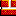

**Categoria:** Walls / Floors  
**Fases em que aparece:** 37 fases  
**Quantidade de Estados:** 2 estado(s)  

> This brick wall or floor can be stretched vertically or horizontally to any length you need. It's not as slippery as a caution wall. Explosives will blow it up.

**Detalhes dos Estados:**
*No SOLVE.RES state data — this part has no programmatic state transitions.*

---

## Peça 2 — Wood incline

**Categoria:** Inclines  
**Fases em que aparece:** 36 fases  
**Quantidade de Estados:** 1 estado(s)  

> You can roll things up or down this wood incline, or use it to direct balloons. It can be stretched or shrunk, which changes the angle. Explosives won't hurt it.

**Detalhes dos Estados:**
*No SOLVE.RES state data — this part has no programmatic state transitions.*

---

## Peça 3 — Tipsy Trailer

**Categoria:** Special Mechanics  
**Fases em que aparece:** 38 fases  
**Quantidade de Estados:** 1 estado(s)  

> This little trailer acts as a teeter-totter. Drop something heavy on the high end to catapult an object off the low end. Tie a rope to either end and use it to hoist and lower objects, pull the trigger of the phazer, or cause other reactions.

**Detalhes dos Estados:**
*No SOLVE.RES state data — this part has no programmatic state transitions.*

---

## Peça 4 — Balloon

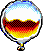

**Categoria:** Balloons / Airships  
**Fases em que aparece:** 68 fases  
**Quantidade de Estados:** 8 estado(s)  

> This balloon can be programmed to have four different appearances, which all act exactly the same. It will float up into the air unless it's tied down with a rope or held back by another object. Use it to lift the low end of the teeter-totter, shoot the phazer, trigger the boxing glove, push the bellows, or bump various objects. Balloons will pop if they touch moving gears, hedge trimmers, tin snips, any flame, laser beams or tacks.

**Detalhes dos Estados:**
### SOLVE.RES State Transitions

| State Name | Triggers (self→other) | ANM State | Explosive |
|------------|-----------------------|-----------|-----------|
| Not Popped | `3→7`, `2→6`, `4→8`, `5→9` | — | No |
| Popped | `7→2`, `6→4`, `8→5`, `9→-1` | — | No |

---

## Peça 5 — Conveyor Belt

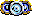

**Categoria:** Rotating Power Sources  
**Fases em que aparece:** 61 fases  
**Quantidade de Estados:** 10 estado(s)  

> Hitch this conveyor belt to a motor by adding a belt. Then use it to move objects. Add a gear to make it change directions.

**Detalhes dos Estados:**
*No SOLVE.RES state data — this part has no programmatic state transitions.*

---

## Peça 6 — Mouse Motor

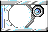

**Categoria:** Rotating Power Sources  
**Fases em que aparece:** 44 fases  
**Quantidade de Estados:** 2 estado(s)  

> This little cage is actually a Mouse Motor.  Bump the cage to make the mouse run around on his wheel. Add a belt and hitch it up to things like the conveyor belt or the Jack-in-the- box to make them work.

**Detalhes dos Estados:**
### SOLVE.RES State Transitions

| State Name | Triggers (self→other) | ANM State | Explosive |
|------------|-----------------------|-----------|-----------|
| Not Running | `3→6` | — | No |
| Running | `6→-1` | 6 | No |

---

## Peça 7 — Pulley

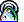

**Categoria:** Ropes / Belts / Pulleys  
**Fases em que aparece:** 91 fases  
**Quantidade de Estados:** 2 estado(s)  

> You can place this pulley between any two parts that may be connected by rope or cable. For example: tie one end of a rope to an object (a laundry basket for instance), then run the rope over as many pulleys as necessary (click on each pulley), and tie the other end of the rope to another part, such as the phazer. When you run the puzzle, the laundry basket will fall, pulling the rope, which will pull the trigger and fire the phazer.

**Detalhes dos Estados:**
*No SOLVE.RES state data — this part has no programmatic state transitions.*

---

## Peça 8 — Belt

**Categoria:** Ropes / Belts / Pulleys  
**Fases em que aparece:** 83 fases  
**Quantidade de Estados:** 1 estado(s)  

> Use this belt to hitch any two rotating parts together. Click on the first part you wish to connect (the Mandrill Motor, for instance), then stretch the belt over to the second part (such as the pinwheel). When the line turns from red to green the belt is in position. Click again to attach it. Belts can only be stretched a limited distance.

**Detalhes dos Estados:**
*No SOLVE.RES state data — this part has no programmatic state transitions.*

---

## Peça 9 — Basketball

**Categoria:** Balls  
**Fases em que aparece:** 21 fases  
**Quantidade de Estados:** 2 estado(s)  

> This basketball is medium in weight and very bouncy.

---

## Peça 10 — Rope

**Categoria:** Ropes / Belts / Pulleys  
**Fases em que aparece:** 117 fases  
**Quantidade de Estados:** 1 estado(s)  

> Use this rope to tie objects together, hang things in the air, or hoist things off the ground with the help of a pulley. It attaches to teeter-totters, boat cleats, laundry baskets, buckets, phazers, balloons, the Mandrill Motor, and several other parts. To use rope: pull it out of the Parts Bin onto the screen. Click on the first object you want tied, then drag the cursor over the second object. When the line turns from red to green the rope is in position. Click again to attach it. You can cut the rope with hedge trimmers or tin snips.

**Detalhes dos Estados:**
*No SOLVE.RES state data — this part has no programmatic state transitions.*

---

## Peça 11 — Laundry Basket

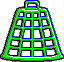

**Categoria:** Containers  
**Fases em que aparece:** 12 fases  
**Quantidade de Estados:** 2 estado(s)  

> Use this laundry basket to trap Curie Cat, Newton Mouse, or Mel Schlemming. Tie one end of a rope to the laundry basket, and tie the other end to another part (like a bucket or teeter-totter).

---

## Peça 12 — Curie Cat

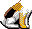

**Categoria:** Characters  
**Fases em que aparece:** 21 fases  
**Quantidade de Estados:** 12 estado(s)  

> Curie Cat will head toward Newton Mouse or Bill the Goldfish whenever he can see them. He'll turn around if he's bumped or runs into something. He also likes the goo that comes out of the can when it falls from the can opener.

**Detalhes dos Estados:**
### SOLVE.RES State Transitions

| State Name | Triggers (self→other) | ANM State | Explosive |
|------------|-----------------------|-----------|-----------|
| Hasn't Eaten | `1→9` | 1 | No |
| Has Eaten | `9→-1` | 9 | No |

---

## Peça 13 — Jack-in-the-box

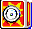

**Categoria:** Springs / Pneumatics  
**Fases em que aparece:** 25 fases  
**Quantidade de Estados:** 4 estado(s)  

> You can hitch this Jack-in-the-box to any rotating part by adding a belt. When the wheel turns, it will pop open. And when Jack pops out, anything on top of his box will be shot into the air.

**Detalhes dos Estados:**
### SOLVE.RES State Transitions

| State Name | Triggers (self→other) | ANM State | Explosive |
|------------|-----------------------|-----------|-----------|
| Closed | `3→4` | — | No |
| Popped Out | `5→-1` | 4 | No |

---

## Peça 14 — Gear

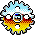

**Categoria:** Rotating Power Sources  
**Fases em que aparece:** 32 fases  
**Quantidade de Estados:** 2 estado(s)  

> You can make this belt turn by adding a belt and hitching it to other rotating parts (like Mandrill Motors and generators). Place gears side by side or above/below each other to reach the distance necessary or to change the direction of rotation.

**Detalhes dos Estados:**
*No SOLVE.RES state data — this part has no programmatic state transitions.*

---

## Peça 15 — Fish Tank

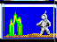

**Categoria:** Containers  
**Fases em que aparece:** 11 fases  
**Quantidade de Estados:** 3 estado(s)  

> This is Bill the Goldfish. Curie Cat will come after him if she's close enough and they're on the same level of flooring. If his tank breaks, she'll be attracted from a greater distance. Drop just about anything on the tank to break it.

**Detalhes dos Estados:**
### SOLVE.RES State Transitions

| State Name | Triggers (self→other) | ANM State | Explosive |
|------------|-----------------------|-----------|-----------|
| Not Broken | `15→9` | 15 | No |
| Broken | `9→-1` | 14 | No |

---

## Peça 16 — Bike Pump

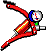

**Categoria:** Springs / Pneumatics  
**Fases em que aparece:** 27 fases  
**Quantidade de Estados:** 3 estado(s)  

> Drop something on the top handle of this bike pump to make it blow air. It can be used to push away balloons and other objects, or to make pinwheels turn.

**Detalhes dos Estados:**
### SOLVE.RES State Transitions

| State Name | Triggers (self→other) | ANM State | Explosive |
|------------|-----------------------|-----------|-----------|
| Not Pumped | `2→4` | 2 | No |
| Pumped | `4→-1` | 5 | No |

---

## Peça 17 — Bucket

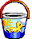

**Categoria:** Containers  
**Fases em que aparece:** 48 fases  
**Quantidade de Estados:** 2 estado(s)  

> You can drop things inside this bucket. Tie a rope to it, and tie the other end to a second object. Then drop something heavy into the bucket to lift the other object. You can also lift teeter-totters, pull triggers, and affect other parts that may be attached to a rope.

---

## Peça 18 — Cannon

**Categoria:** Explosives / Projectiles  
**Fases em que aparece:** 21 fases  
**Quantidade de Estados:** 37 estado(s)  

> Light the fuse of this cannon with a laser, a flaming part (like a candle or rocket), or by using a magnifying glass and light source. It fires cannon balls which can be used to break and bump things. It can be rotated to aim in six different angles.

**Detalhes dos Estados:**
### SOLVE.RES State Transitions

| State Name | Triggers (self→other) | ANM State | Explosive |
|------------|-----------------------|-----------|-----------|
| Not Fired | `1→23`, `4→25`, `7→27`, `34→35`, `41→42`, `47→48` | 47 | No |
| Fired | `19→4`, `20→7`, `31→34`, `38→41`, `45→47`, `50→-1` | 48 | No |

---

## Peça 19 — Dynamite

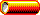

**Categoria:** Explosives / Projectiles  
**Fases em que aparece:** 28 fases  
**Quantidade de Estados:** 3 estado(s)  

> Light the fuse of this dynamite with a laser, a flaming part (like a candle or rocket), or by using a magnifying glass and light source. It will blow up all kinds of things, including some walls.

**Detalhes dos Estados:**
### SOLVE.RES State Transitions

| State Name | Triggers (self→other) | ANM State | Explosive |
|------------|-----------------------|-----------|-----------|
| Not Blown up | `2→3` | — | No |
| Blown up | `3→-1` | 3 | Yes :material-bomb: |

---

## Peça 20 — Phazer pulse

**Categoria:** Explosives / Projectiles  
**Fases em que aparece:** 0 fases  
**Quantidade de Estados:** 1 estado(s)  

> [CREATED PART]

**Detalhes dos Estados:**
*No SOLVE.RES state data — this part has no programmatic state transitions.*

---

## Peça 21 — Electric Switch & Outlet

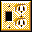

**Categoria:** Electrical  
**Fases em que aparece:** 54 fases  
**Quantidade de Estados:** 8 estado(s)  

> Plug any of the electrical parts (like the toaster, can opener, or fan) into this electric outlet, then drop something on the switch to turn on the power. Or bump up on the switch if it's upside-down.

**Detalhes dos Estados:**
*No SOLVE.RES state data — this part has no programmatic state transitions.*

---

## Peça 22 — Remote Control

**Categoria:** Explosives / Projectiles  
**Fases em que aparece:** 57 fases  
**Quantidade de Estados:** 2 estado(s)  

> As soon as you set this remote control down on the screen, a second part made up of explosives appears.  Drag the explosives to the area or object you want to blow up. Drop something on top of the remote control button to set off the explosion. You can also tie one end of a rope to the button and hitch the other end to a teeter-totter, or another object that will allow you to pull the button down.

**Detalhes dos Estados:**
*No SOLVE.RES state data — this part has no programmatic state transitions.*

---

## Peça 23 — Boat Cleat

**Categoria:** Special Mechanics  
**Fases em que aparece:** 75 fases  
**Quantidade de Estados:** 2 estado(s)  

> Any object that can be tied with a rope may be hitched to this boat cleat. Use it to hang things from the air, or to keep balloons from floating away.

**Detalhes dos Estados:**
*No SOLVE.RES state data — this part has no programmatic state transitions.*

---

## Peça 24 — Electric Fan

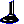

**Categoria:** Electrical  
**Fases em que aparece:** 23 fases  
**Quantidade de Estados:** 2 estado(s)  

> Plug this electric fan into an outlet to make it blow air. Flip it to change wind direction. Use it to blow objects away or to turn the pinwheel.

**Detalhes dos Estados:**
### SOLVE.RES State Transitions

| State Name | Triggers (self→other) | ANM State | Explosive |
|------------|-----------------------|-----------|-----------|
| Off | `1→2` | — | No |
| On | `2→-1` | 2 | No |

---

## Peça 25 — Flashlight

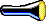

**Categoria:** Light / Flame Sources  
**Fases em que aparece:** 55 fases  
**Quantidade de Estados:** 3 estado(s)  

> Drop something on the button of this flashlight to turn it on. Use it to power solar panels. Or put a magnifying glass right in front of it and use it to light fuses and candles.

**Detalhes dos Estados:**
### SOLVE.RES State Transitions

| State Name | Triggers (self→other) | ANM State | Explosive |
|------------|-----------------------|-----------|-----------|
| Off | `3→4` | 3 | No |
| On | `4→-1` | 2 | No |

---

## Peça 26 — Generator

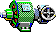

**Categoria:** Electrical  
**Fases em que aparece:** 15 fases  
**Quantidade de Estados:** 8 estado(s)  

> This generator comes with its own outlet. Use it to supply electricity to power parts by connecting the generator's wheel to a rotational motor (like the Mandrill Motor, the Mouse Motor, or the Electric Motor) by adding a belt.

**Detalhes dos Estados:**
### SOLVE.RES State Transitions

| State Name | Triggers (self→other) | ANM State | Explosive |
|------------|-----------------------|-----------|-----------|
| Off | `9→10` | — | No |
| On | `2→3` | — | No |

---

## Peça 27 — Captain Z Super Phazer

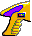

**Categoria:** Explosives / Projectiles  
**Fases em que aparece:** 22 fases  
**Quantidade de Estados:** 4 estado(s)  

> This spiffy toy phazer shoots pulses of energy. Tie one end of a rope to the trigger and run it through a pulley (placed behind the phazer), then tie the other end to a balloon or something heavy. You can program the number of energy pulses you want to fire, but the gun will only shoot as long as the rope is pulling on the trigger. Use phazer pulses to bump things, pop balloons and blimps, light candles and fuses, and blow up explosives.

**Detalhes dos Estados:**
### SOLVE.RES State Transitions

| State Name | Triggers (self→other) | ANM State | Explosive |
|------------|-----------------------|-----------|-----------|
| Not Fired | `1→6` | — | No |
| Fired | `6→-1` | 6 | No |

---

## Peça 28 — Baseball

**Categoria:** Balls  
**Fases em que aparece:** 47 fases  
**Quantidade de Estados:** 1 estado(s)  

> This baseball is pretty light and not very bouncy.

---

## Peça 29 — Lava Lamp

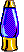

**Categoria:** Light / Flame Sources  
**Fases em que aparece:** 19 fases  
**Quantidade de Estados:** 3 estado(s)  

> This groovy lava lamp isn't just a cool piece of retro-decor taken from Professor Tim's attic. It's also an excellent light source. Tie a rope to the chain and give it a tug to turn on the lamp. Use it to power up the solar panel, or shine it through a magnifying glass to light fuses and candles.

**Detalhes dos Estados:**
### SOLVE.RES State Transitions

| State Name | Triggers (self→other) | ANM State | Explosive |
|------------|-----------------------|-----------|-----------|
| Off | `1→2` | 1 | No |
| On | `2→-1` | 3 | No |

---

## Peça 30 — Magnifying Glass

**Categoria:** Lasers / Optics  
**Fases em que aparece:** 52 fases  
**Quantidade de Estados:** 1 estado(s)  

> Place this magnifying glass in front of any light source to ignite fuses or candles. Make sure it's close enough to both the light source and the fuse you're trying to light. Flip it if necessary.

**Detalhes dos Estados:**
*No SOLVE.RES state data — this part has no programmatic state transitions.*

---

## Peça 31 — Mandrill Motor

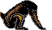

**Categoria:** Rotating Power Sources  
**Fases em que aparece:** 9 fases  
**Quantidade de Estados:** 7 estado(s)  

> To start up this Mandrill Motor, tie a rope to the shade and give it a tug. When Pavlov Mandrill sees the banana he pedals like crazy. Attach a belt to the treadmill to power anything that is driven with a belt.

**Detalhes dos Estados:**
### SOLVE.RES State Transitions

| State Name | Triggers (self→other) | ANM State | Explosive |
|------------|-----------------------|-----------|-----------|
| Sitting | `1→4` | 1 | No |
| Treading | `4→7` | 5 | No |
| Bonked | `7→-1` | 9 | No |

---

## Peça 32 — Boris the Bat

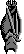

**Categoria:** Characters  
**Fases em que aparece:** 0 fases  
**Quantidade de Estados:** 2 estado(s)  

> Happy Halloween! Meet Boris the Bat. He hangs in mid-air until he's bumped. Then he flies around acting batty.

**Detalhes dos Estados:**
*No SOLVE.RES state data — this part has no programmatic state transitions.*

---

## Peça 33 — Cupid

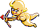

**Categoria:** Characters  
**Fases em que aparece:** 0 fases  
**Quantidade de Estados:** 2 estado(s)  

> Well, well, if it isn't Cupid, dropping in for Valentine's Day! Bump him to make him fly around. Any balloons that touch his arrow will pop.

**Detalhes dos Estados:**
*No SOLVE.RES state data — this part has no programmatic state transitions.*

---

## Peça 34 — Santa Claus

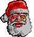

**Categoria:** Characters  
**Fases em que aparece:** 0 fases  
**Quantidade de Estados:** 2 estado(s)  

> Ho, ho, ho! Happy Holidays! This cheesy plastic Santa Claus lamp will only light up when you place it next to an electric socket.

**Detalhes dos Estados:**
### SOLVE.RES State Transitions

| State Name | Triggers (self→other) | ANM State | Explosive |
|------------|-----------------------|-----------|-----------|
| Off | `1→2` | 1 | No |
| On | `2→-1` | 2 | No |
| !Part | *(none)* | — | No |
| Boxing Glove | *(none)* | — | No |
| Cocked | `2→3` | — | No |
| Punched | `3→-1` | — | No |

---

## Peça 35 — Boxing Glove

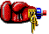

**Categoria:** Springs / Pneumatics  
**Fases em que aparece:** 44 fases  
**Quantidade de Estados:** 3 estado(s)  

> Bump the button on the back of this boxing glove to make it punch things.

**Detalhes dos Estados:**
*No SOLVE.RES state data — this part has no programmatic state transitions.*

---

## Peça 36 — Rocket

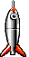

**Categoria:** Explosives / Projectiles  
**Fases em que aparece:** 24 fases  
**Quantidade de Estados:** 15 estado(s)  

> You can light the fuse of this rocket with a candle (or other flaming part), a laser beam, a phazer, or by using a magnifying glass and light source. It can be flipped to fly straight up, left, or right.

**Detalhes dos Estados:**
### SOLVE.RES State Transitions

| State Name | Triggers (self→other) | ANM State | Explosive |
|------------|-----------------------|-----------|-----------|
| Not Fired | `2→17`, `12→18`, `25→21` | 25 | No |
| Fired | `8→12`, `15→25`, `24→-1` | 21 | No |

---

## Peça 37 — Hedge Trimmers

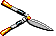

**Categoria:** Cutting / Popping  
**Fases em que aparece:** 51 fases  
**Quantidade de Estados:** 6 estado(s)  

> You can cut ropes with these hedge trimmers by bumping the handles with another object. Balloons and blimps pop against the tips.

**Detalhes dos Estados:**
### SOLVE.RES State Transitions

| State Name | Triggers (self→other) | ANM State | Explosive |
|------------|-----------------------|-----------|-----------|
| Open | `7→11` | 7 | No |
| Closed | `3→-1` | 4 | No |

---

## Peça 38 — Solar Panel

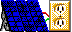

**Categoria:** Electrical  
**Fases em que aparece:** 16 fases  
**Quantidade de Estados:** 2 estado(s)  

> This solar panel comes with its own electrical outlet. Shine a light on the panel, then plug in any electric part you want to operate.

**Detalhes dos Estados:**
*No SOLVE.RES state data — this part has no programmatic state transitions.*

---

## Peça 39 — Springboard

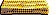

**Categoria:** Springs / Pneumatics  
**Fases em que aparece:** 54 fases  
**Quantidade de Estados:** 3 estado(s)  

> Anything you drop on this springboard will go higher with each bounce.

**Detalhes dos Estados:**
*No SOLVE.RES state data — this part has no programmatic state transitions.*

---

## Peça 40 — Pinwheel

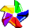

**Categoria:** Rotating Power Sources  
**Fases em que aparece:** 16 fases  
**Quantidade de Estados:** 2 estado(s)  

> You can make this pinwheel spin by blowing air on it (from parts like the fan or the bike pump). Attach a belt and use it to turn other rotating parts.

**Detalhes dos Estados:**
### SOLVE.RES State Transitions

| State Name | Triggers (self→other) | ANM State | Explosive |
|------------|-----------------------|-----------|-----------|
| Not Spinning | `1→2` | 1 | No |
| Spinning | `2→-1` | 2 | No |

---

## Peça 41 — explosion

**Categoria:** Created / Phantom  
**Fases em que aparece:** 0 fases  
**Quantidade de Estados:** 1 estado(s)  

> [CREATED PART]

**Detalhes dos Estados:**
*No SOLVE.RES state data — this part has no programmatic state transitions.*

---

## Peça 42 — Newton Mouse

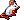

**Categoria:** Characters  
**Fases em que aparece:** 37 fases  
**Quantidade de Estados:** 9 estado(s)  

> This is Newton Mouse. He'll go after any cheese he can see. He'll also run away if Curie Cat comes after him. He'll run inside a mouse hole if you place a hunk of cheese on the other side of it, or if Curie chases him toward one. Newton also has to watch out for alligators.

**Detalhes dos Estados:**
### SOLVE.RES State Transitions

| State Name | Triggers (self→other) | ANM State | Explosive |
|------------|-----------------------|-----------|-----------|
| Hasn't Eaten | `1→10` | 1 | No |
| Has Eaten | `10→-1` | 10 | No |

---

## Peça 43 — Pinball

**Categoria:** Balls  
**Fases em que aparece:** 78 fases  
**Quantidade de Estados:** 2 estado(s)  

> This pinball is very hard and heavy, and doesn't bounce much.

---

## Peça 44 — Tennis Ball

**Categoria:** Balls  
**Fases em que aparece:** 44 fases  
**Quantidade de Estados:** 1 estado(s)  

> This tennis ball is very light and bouncy.

---

## Peça 45 — Aladdin's Lamp

**Categoria:** Light / Flame Sources  
**Fases em que aparece:** 8 fases  
**Quantidade de Estados:** 3 estado(s)  

> Light this oil lamp with a laser, a flaming part (like flint rocks or a match-on-a-spring), or a light source and a magnifying glass. Once it's burning, you can use it to light candles and fuses, heat up coffee pots, or to pop blimps and balloons.

**Detalhes dos Estados:**
### SOLVE.RES State Transitions

| State Name | Triggers (self→other) | ANM State | Explosive |
|------------|-----------------------|-----------|-----------|
| Out | `1→2` | 1 | No |
| Lit | `2→-1` | 2 | No |

---

## Peça 46 — Pipe Wall

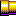

**Categoria:** Walls / Floors  
**Fases em que aparece:** 27 fases  
**Quantidade de Estados:** 2 estado(s)  

> This is a pipe wall or floor. Stretch it vertically or horizontally to any length you need. It has a slippery surface. Explosions won't affect it.

**Detalhes dos Estados:**
*No SOLVE.RES state data — this part has no programmatic state transitions.*

---

## Peça 47 — Curved Pipe Wall

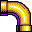

**Categoria:** Walls / Floors  
**Fases em que aparece:** 7 fases  
**Quantidade de Estados:** 1 estado(s)  

> This curved pipe section can be connected to a pipe wall or floor. Flip it to curve in the direction needed.

**Detalhes dos Estados:**
*No SOLVE.RES state data — this part has no programmatic state transitions.*

---

## Peça 48 — Wood Wall

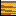

**Categoria:** Walls / Floors  
**Fases em que aparece:** 39 fases  
**Quantidade de Estados:** 3 estado(s)  

> This is a wooden wall or floor. Stretch it vertically or horizontally to any length you need. Its surface isn't very slippery. Explosions will blast holes through it.

**Detalhes dos Estados:**
*No SOLVE.RES state data — this part has no programmatic state transitions.*

---

## Peça 50 — Electric Motor

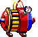

**Categoria:** Rotating Power Sources  
**Fases em que aparece:** 32 fases  
**Quantidade de Estados:** 3 estado(s)  

> Plug this electric motor into an outlet and flick on the switch. Then use a belt to attach it to gears, conveyor belts, and other rotating parts. This motor can also be flipped.

**Detalhes dos Estados:**
### SOLVE.RES State Transitions

| State Name | Triggers (self→other) | ANM State | Explosive |
|------------|-----------------------|-----------|-----------|
| Off | `1→4` | — | No |
| Running | `4→-1` | 3 | No |

---

## Peça 51 — Vacuum

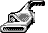

**Categoria:** Electrical  
**Fases em que aparece:** 7 fases  
**Quantidade de Estados:** 2 estado(s)  

> Plug this vacuum into an electrical outlet and use it to suck up any object that's affected by gravity.

**Detalhes dos Estados:**
### SOLVE.RES State Transitions

| State Name | Triggers (self→other) | ANM State | Explosive |
|------------|-----------------------|-----------|-----------|
| Off | `9→10` | — | No |
| Vacuuming | `10→-1` | 10 | No |

---

## Peça 52 — Cheese

**Categoria:** Special Mechanics  
**Fases em que aparece:** 29 fases  
**Quantidade de Estados:** 1 estado(s)  

> Newton Mouse will come after this cheese whenever he's close enough and on the same level of flooring.

---

## Peça 53 — Thumb Tack

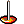

**Categoria:** Cutting / Popping  
**Fases em que aparece:** 34 fases  
**Quantidade de Estados:** 8 estado(s)  

> This thumb tack is handy for popping blimps and balloons. It can be flipped so that the point is facing up, down, or either side.

**Detalhes dos Estados:**
*No SOLVE.RES state data — this part has no programmatic state transitions.*

---

## Peça 54 — Mel Schlemming

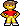

**Categoria:** Characters  
**Fases em que aparece:** 32 fases  
**Quantidade de Estados:** 14 estado(s)  

> Meet Mel Schlemming. Mel walks mindlessly forward until he bumps into something. Then he turns around and walks mindlessly in the other direction. You can program him to walk, run, or stand still until he's bumped. If he falls too far, he drops to the floor and takes a snooze. He also has to watch out for alligators.

**Detalhes dos Estados:**
### SOLVE.RES State Transitions

| State Name | Triggers (self→other) | ANM State | Explosive |
|------------|-----------------------|-----------|-----------|
| Normal | `1→8` | 1 | No |
| Sleeping | `51→-1` | 11 | No |

---

## Peça 55 — Remote Control Explosives

**Categoria:** Explosives / Projectiles  
**Fases em que aparece:** 57 fases  
**Quantidade de Estados:** 2 estado(s)  

> These explosives come with the remote control part. They'll blow up all kinds of things, including most walls. Drop something on top of the remote control button to set them off. You can also tie one end of a rope to the button and hitch the other end to a teeter-totter, or another object that will allow you to pull the button down.

**Detalhes dos Estados:**
### SOLVE.RES State Transitions

| State Name | Triggers (self→other) | ANM State | Explosive |
|------------|-----------------------|-----------|-----------|
| Not Exploded | `2→5` | — | No |
| Exploded | `5→-1` | — | Yes :material-bomb: |

---

## Peça 56 — Caution Wall

**Categoria:** Walls / Floors  
**Fases em que aparece:** 48 fases  
**Quantidade de Estados:** 3 estado(s)  

> This is a caution wall or floor. Stretch it vertically or horizontally to any length you need. It's very slippery, and isn't affected by explosives.

**Detalhes dos Estados:**
*No SOLVE.RES state data — this part has no programmatic state transitions.*

---

## Peça 57 — Large Curved Pipe

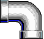

**Categoria:** Pipe Systems  
**Fases em que aparece:** 43 fases  
**Quantidade de Estados:** 1 estado(s)  

> Drop balls and other objects into this large curved pipe to make them come out the other end. It can be attached to straight sections of large pipe and t-connectors. You can also attach an accelerator tube to speed up or reverse the direction of objects moving through the pipes.

**Detalhes dos Estados:**
*No SOLVE.RES state data — this part has no programmatic state transitions.*

---

## Peça 58 — Mel's House

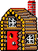

**Categoria:** Special Mechanics  
**Fases em que aparece:** 18 fases  
**Quantidade de Estados:** 8 estado(s)  

> Here's Mel Schlemming's cozy suburban duplex. If he sees it, he'll head home. It can also be programmed to be a rustic log cabin.

**Detalhes dos Estados:**
### SOLVE.RES State Transitions

| State Name | Triggers (self→other) | ANM State | Explosive |
|------------|-----------------------|-----------|-----------|
| Vacant | `5→6`, `4→15` | 4 | No |
| Occupied | `6→4`, `15→-1` | 15 | No |

---

## Peça 59 — Super Ball

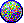

**Categoria:** Balls  
**Fases em que aparece:** 7 fases  
**Quantidade de Estados:** 3 estado(s)  

> This super ball gains height with each bounce.

---

## Peça 60 — Grass Floor

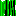

**Categoria:** Walls / Floors  
**Fases em que aparece:** 10 fases  
**Quantidade de Estados:** 3 estado(s)  

> This is a grass floor or vine wall. Stretch it vertically or horizontally to any length you need. It's not very slippery. Explosions will blast holes through it.

**Detalhes dos Estados:**
*No SOLVE.RES state data — this part has no programmatic state transitions.*

---

## Peça 61 — Alligator

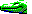

**Categoria:** Characters  
**Fases em que aparece:** 14 fases  
**Quantidade de Estados:** 11 estado(s)  

> Meet Edison Alligator. He'll chow down Mel Schlemming or Newton Mouse if they get too close. He also flips things into the air with his snout.

**Detalhes dos Estados:**
### SOLVE.RES State Transitions

| State Name | Triggers (self→other) | ANM State | Explosive |
|------------|-----------------------|-----------|-----------|
| Hasn't Eaten | `1→5` | 1 | No |
| Has Eaten | `5→-1` | 5 | No |

---

## Peça 62 — Coffee Pot

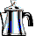

**Categoria:** Special Mechanics  
**Fases em que aparece:** 17 fases  
**Quantidade de Estados:** 3 estado(s)  

> Make this coffee pot percolate by heating it with a candle, Aladdin's lamp, match-on-a-spring, or flint & tinder. Then use the steam to push things.

**Detalhes dos Estados:**
### SOLVE.RES State Transitions

| State Name | Triggers (self→other) | ANM State | Explosive |
|------------|-----------------------|-----------|-----------|
| Off | `1→3` | 1 | No |
| Percolating | `3→-1` | 4 | No |

---

## Peça 63 — Pool Ball

**Categoria:** Balls  
**Fases em que aparece:** 21 fases  
**Quantidade de Estados:** 16 estado(s)  

> This pool ball won't move until it's hit. The harder it's hit, the farther it will roll. It isn't affected by gravity. You can program it to show any number on its surface.

---

## Peça 64 — Pinball Bumper

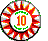

**Categoria:** Special Mechanics  
**Fases em que aparece:** 20 fases  
**Quantidade de Estados:** 2 estado(s)  

> This pinball bumper can be placed so that moving objects will bounce off in any direction.

**Detalhes dos Estados:**
*No SOLVE.RES state data — this part has no programmatic state transitions.*

---

## Peça 65 — Leprechaun

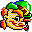

**Categoria:** Characters  
**Fases em que aparece:** 0 fases  
**Quantidade de Estados:** 3 estado(s)  

> Happy Saint Patrick's Day! Say hi to Blarney O'Reilly, the leprechaun who lives in Professor Tim's garden. Give him a nudge and he'll dance a jig for you.

**Detalhes dos Estados:**
### SOLVE.RES State Transitions

| State Name | Triggers (self→other) | ANM State | Explosive |
|------------|-----------------------|-----------|-----------|
| Resting | `1→2` | — | No |
| Dancing | `2→-1` | — | No |

---

## Peça 66 — Mouse Hole

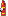

**Categoria:** Special Mechanics  
**Fases em que aparece:** 6 fases  
**Quantidade de Estados:** 3 estado(s)  

> Newton Mouse likes to hide in this mouse hole when he's chased by Curie Cat. Or you can lure him inside by placing some cheese on the far side of the hole.

**Detalhes dos Estados:**
### SOLVE.RES State Transitions

| State Name | Triggers (self→other) | ANM State | Explosive |
|------------|-----------------------|-----------|-----------|
| Vacant | `1→3` | 1 | No |
| Occupied | `3→-1` | 2 | No |

---

## Peça 67 — Can Opener

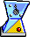

**Categoria:** Electrical  
**Fases em que aparece:** 11 fases  
**Quantidade de Estados:** 3 estado(s)  

> Plug this can opener into an electrical outlet to make it open the can. When the sauce spills out of the can, Curie Cat will come lap it up if she's within range.

**Detalhes dos Estados:**
### SOLVE.RES State Transitions

| State Name | Triggers (self→other) | ANM State | Explosive |
|------------|-----------------------|-----------|-----------|
| Unopened | `1→3` | 1 | No |
| Opened | `2→-1` | 2 | No |

---

## Peça 68 — Soccer Ball

**Categoria:** Balls  
**Fases em que aparece:** 20 fases  
**Quantidade de Estados:** 1 estado(s)  

> This soccer ball is medium in weight and quite bouncy.

---

## Peça 69 — Anti-Gravity Pad

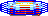

**Categoria:** Special Mechanics  
**Fases em que aparece:** 76 fases  
**Quantidade de Estados:** 2 estado(s)  

> This anti-gravity pad reverses the gravity field for anything on top of it. Without gravity, most things will float up into the air. But balloons will drop.

**Detalhes dos Estados:**
### SOLVE.RES State Transitions

| State Name | Triggers (self→other) | ANM State | Explosive |
|------------|-----------------------|-----------|-----------|
| Unactivated | `1→2` | 1 | No |
| Operating | `2→-1` | 2 | No |

---

## Peça 70 — Missile

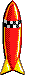

**Categoria:** Explosives / Projectiles  
**Fases em que aparece:** 23 fases  
**Quantidade de Estados:** 15 estado(s)  

> This missile is handy for blowing up all sorts of things, including most walls. Light the fuse with a laser, a phazer, a candle (or other flaming part), or by using a magnifying glass and light source. You can flip it to fly straight up, right, or left.

**Detalhes dos Estados:**
### SOLVE.RES State Transitions

| State Name | Triggers (self→other) | ANM State | Explosive |
|------------|-----------------------|-----------|-----------|
| Not Launched | `2→8`, `13→14`, `18→19` | 18 | No |
| Launched | `3→12`, `16→17`, `21→22` | 19 | No |
| Exploded | `12→13`, `17→18`, `22→-1` | — | Yes :material-bomb: |

---

## Peça 71 — Boxes

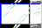

**Categoria:** Containers  
**Fases em que aparece:** 43 fases  
**Quantidade de Estados:** 9 estado(s)  

> This box is really five boxes in one. Program it to be glass, wooden, wicker, metal, or cardboard, which are all different sizes. Drop things inside the box, or use it to catch falling objects.

**Detalhes dos Estados:**
*No SOLVE.RES state data — this part has no programmatic state transitions.*

---

## Peça 72 — Peg

**Categoria:** Special Mechanics  
**Fases em que aparece:** 0 fases  
**Quantidade de Estados:** 1 estado(s)  

> [CREATED PART]

**Detalhes dos Estados:**
*No SOLVE.RES state data — this part has no programmatic state transitions.*

---

## Peça 73 — Trap Door

**Categoria:** Special Mechanics  
**Fases em que aparece:** 33 fases  
**Quantidade de Estados:** 3 estado(s)  

> This trap door drops open when heavy objects land on top of it.

**Detalhes dos Estados:**
### SOLVE.RES State Transitions

| State Name | Triggers (self→other) | ANM State | Explosive |
|------------|-----------------------|-----------|-----------|
| Up | `2→3` | 2 | No |
| Down | `3→-1` | 4 | No |

---

## Peça 74 — Nitroglycerine

**Categoria:** Explosives / Projectiles  
**Fases em que aparece:** 38 fases  
**Quantidade de Estados:** 2 estado(s)  

> This tube of nitroglycerine will explode if it's bumped or dropped with enough force. It blows up all kinds of things, including most walls.

**Detalhes dos Estados:**
### SOLVE.RES State Transitions

| State Name | Triggers (self→other) | ANM State | Explosive |
|------------|-----------------------|-----------|-----------|
| Unexploded | `1→3` | 1 | No |
| Exploded | `3→-1` | — | Yes :material-bomb: |

---

## Peça 75 — Match-on-a-Spring

**Categoria:** Springs / Pneumatics  
**Fases em que aparece:** 52 fases  
**Quantidade de Estados:** 4 estado(s)  

> Pull the little peg with a rope to make this match pop up lit. Use it to light fuses, pop blimps and balloons, and heat up coffee pots.

**Detalhes dos Estados:**
### SOLVE.RES State Transitions

| State Name | Triggers (self→other) | ANM State | Explosive |
|------------|-----------------------|-----------|-----------|
| Unlit | `1→4` | 1 | No |
| Lit | `3→-1` | 2 | No |

---

## Peça 76 — Steel Cable

**Categoria:** Ropes / Belts / Pulleys  
**Fases em que aparece:** 14 fases  
**Quantidade de Estados:** 1 estado(s)  

> This steel cable works just like rope, except it's much stronger. It can only be cut with tin snips. To use the steel cable:  pull it out of the Parts Bin onto the screen. Click on the first object you want tied, then drag the cursor over the second object. When the line turns from red to green the cable is in position. Click again to attach it.

**Detalhes dos Estados:**
*No SOLVE.RES state data — this part has no programmatic state transitions.*

---

## Peça 77 — Tin Snips

**Categoria:** Cutting / Popping  
**Fases em que aparece:** 6 fases  
**Quantidade de Estados:** 4 estado(s)  

> You can use these tin snips to cut through rope or steel cable, or to pop blimps and balloons. To make them cut, just bump the handles with another object. They can also be used to pop blimps and balloons.

**Detalhes dos Estados:**
### SOLVE.RES State Transitions

| State Name | Triggers (self→other) | ANM State | Explosive |
|------------|-----------------------|-----------|-----------|
| Open | `4→5` | — | No |
| Closed | `3→-1` | — | No |

---

## Peça 78 — Flint & Tinder

**Categoria:** Light / Flame Sources  
**Fases em que aparece:** 44 fases  
**Quantidade de Estados:** 4 estado(s)  

> Bump these flint rocks to start a fire, which can be used to light fuses, pop blimps and balloons, and heat up coffee pots.

**Detalhes dos Estados:**
### SOLVE.RES State Transitions

| State Name | Triggers (self→other) | ANM State | Explosive |
|------------|-----------------------|-----------|-----------|
| Unlit | `1→2` | 1 | No |
| Lit | `2→-1` | 7 | No |

---

## Peça 79 — Hot Air Balloon

**Categoria:** Balloons / Airships  
**Fases em que aparece:** 30 fases  
**Quantidade de Estados:** 5 estado(s)  

> Light the candle to create hot air, which will makes this balloon rise into the air. Tie a rope to the eye hook on the bottom and use it to lift things, pull triggers, and so on.

**Detalhes dos Estados:**
### SOLVE.RES State Transitions

| State Name | Triggers (self→other) | ANM State | Explosive |
|------------|-----------------------|-----------|-----------|
| Not Lit | `1→5` | 1 | No |
| Lit | `5→4` | 5 | No |
| Popped | `4→-1` | 2 | No |

---

## Peça 80 — Fireworks

**Categoria:** Explosives / Projectiles  
**Fases em que aparece:** 17 fases  
**Quantidade de Estados:** 15 estado(s)  

> This part lets you choose between three different types of fireworks displays. Program the part to get the celebration of your choice. Light the fuse with a flaming part like a candle, rocket, or an Aladdin's lamp.

**Detalhes dos Estados:**
### SOLVE.RES State Transitions

| State Name | Triggers (self→other) | ANM State | Explosive |
|------------|-----------------------|-----------|-----------|
| Not Set Off | `9→19`, `12→20`, `16→21` | — | No |
| Set Off | `6→12`, `7→16`, `8→-1` | 21 | No |

---

## Peça 81 — Toaster

**Categoria:** Electrical  
**Fases em que aparece:** 12 fases  
**Quantidade de Estados:** 9 estado(s)  

> Plug this toaster into an electrical outlet and push down on the switch to make it work. When the toast is done, it pops into the air. Use it to bump other objects. You can also program it to work as a timer. The darker the toast you choose, the longer the amount of time it takes to pop up.

**Detalhes dos Estados:**
### SOLVE.RES State Transitions

| State Name | Triggers (self→other) | ANM State | Explosive |
|------------|-----------------------|-----------|-----------|
| Not Toasting | `1→8`, `6→9`, `7→10` | — | No |
| Toasting | `2→6`, `3→7`, `4→-1` | — | No |

---

## Peça 82 — Sand Wall

**Categoria:** Walls / Floors  
**Fases em que aparece:** 14 fases  
**Quantidade de Estados:** 3 estado(s)  

> This is a sand wall or floor. Stretch it vertically or horizontally to any length you need. Its surface isn't very slippery. Explosions won't affect it.

**Detalhes dos Estados:**
*No SOLVE.RES state data — this part has no programmatic state transitions.*

---

## Peça 83 — Cinder Block Wall

**Categoria:** Walls / Floors  
**Fases em que aparece:** 32 fases  
**Quantidade de Estados:** 3 estado(s)  

> This is a cinder block wall or floor. Stretch it vertically or horizontally to any length you need. Its surface isn't very slippery. Explosions will blow holes through it.

**Detalhes dos Estados:**
*No SOLVE.RES state data — this part has no programmatic state transitions.*

---

## Peça 84 — Greco-Roman Wall

**Categoria:** Walls / Floors  
**Fases em que aparece:** 42 fases  
**Quantidade de Estados:** 3 estado(s)  

> This is a Greco-Roman wall or floor. Stretch it vertically or horizontally to any length you need. It has a pretty slippery surface. Explosions won't affect it.

**Detalhes dos Estados:**
*No SOLVE.RES state data — this part has no programmatic state transitions.*

---

## Peça 85 — Log Wall

**Categoria:** Walls / Floors  
**Fases em que aparece:** 18 fases  
**Quantidade de Estados:** 3 estado(s)  

> This is a log wall or floor. Stretch it vertically or horizontally to any length you need. Its surface isn't very slippery. Explosions will blow holes through it.

**Detalhes dos Estados:**
*No SOLVE.RES state data — this part has no programmatic state transitions.*

---

## Peça 86 — Tiny Gear

**Categoria:** Rotating Power Sources  
**Fases em que aparece:** 16 fases  
**Quantidade de Estados:** 2 estado(s)  

> This tiny gear rotates at twice the speed of a big gear when it's placed next to one. These gears must be placed directly beside or above/below other gears.

**Detalhes dos Estados:**
*No SOLVE.RES state data — this part has no programmatic state transitions.*

---

## Peça 87 — Programmable Ball

**Categoria:** Balls  
**Fases em que aparece:** 11 fases  
**Quantidade de Estados:** 7 estado(s)  

> This ball can be programmed to vary in appearance, mass, elasticity, density, and friction.

---

## Peça 88 — Accelerator Tube

**Categoria:** Pipe Systems  
**Fases em que aparece:** 38 fases  
**Quantidade de Estados:** 4 estado(s)  

> This accelerator tube can be connected to any type of large pipe. It will speed up or change the direction of any object passing through it.

**Detalhes dos Estados:**
*No SOLVE.RES state data — this part has no programmatic state transitions.*

---

## Peça 89 — Trans-Roto-Matic

**Categoria:** Special Mechanics  
**Fases em que aparece:** 14 fases  
**Quantidade de Estados:** 2 estado(s)  

> This handy gadget turns translational motion (back and forth) into rotational energy (around in circles). Tie a rope to the eye hook, then tug it with another object to make the gear turn. Hitch a belt to the gear and use it to rotate pinwheels, conveyors, and other rotating parts.

**Detalhes dos Estados:**
*No SOLVE.RES state data — this part has no programmatic state transitions.*

---

## Peça 90 — Roto-Trans Converter

**Categoria:** Special Mechanics  
**Fases em que aparece:** 15 fases  
**Quantidade de Estados:** 2 estado(s)  

> This nifty contraption turns rotational energy (circular) into translational motion (back and forth movement). Hitch the little wheel to a rotational motor with a belt, then tie a rope to the eye hook and hitch it to something you want to lift or pull (like a teeter-totter, phazer trigger, or laundry basket).

**Detalhes dos Estados:**
*No SOLVE.RES state data — this part has no programmatic state transitions.*

---

## Peça 91 — Red Laser

**Categoria:** Lasers / Optics  
**Fases em que aparece:** 30 fases  
**Quantidade de Estados:** 8 estado(s)  

> When this red laser gun is plugged into an outlet (and the switch is on) it will fire a red beam. When the beam strikes a red Laser-Activated Plug, it will generate energy that can be used to power anything hooked up to that outlet. Laser beams can be bounced and directed by using angled mirrors. They may also be fired into Laser Mixers, which will blend the colors of the beams. If an object passes through a laser beam, it will temporarily cut off the energy flow. Use laser beams to light fuses and candles, or to pop balloons.

**Detalhes dos Estados:**
### SOLVE.RES State Transitions

| State Name | Triggers (self→other) | ANM State | Explosive |
|------------|-----------------------|-----------|-----------|
| Not Operating | `1→6`, `6→7`, `7→8`, `8→9` | 8 | No |
| Operating | `9→4`, `4→3`, `3→2`, `2→-1` | 2 | No |

---

## Peça 92 — Green Laser

**Categoria:** Lasers / Optics  
**Fases em que aparece:** 23 fases  
**Quantidade de Estados:** 8 estado(s)  

> When this green laser gun is plugged into an outlet (and the switch is on) it will fire a green laser beam. When the beam strikes a green Laser-Activated Plug, it will generate energy that can be used to power anything hooked up to that outlet. Laser beams can be bounced and directed by using angled mirrors. They may also be fired into Laser Mixers, which will blend the colors of the beams. If an object passes through a laser beam, it will temporarily cut off the energy flow. Use laser beams to light fuses and candles, or to pop balloons.

**Detalhes dos Estados:**
### SOLVE.RES State Transitions

| State Name | Triggers (self→other) | ANM State | Explosive |
|------------|-----------------------|-----------|-----------|
| Not Operating | `1→6`, `6→7`, `7→8`, `8→9` | 8 | No |
| Operating | `9→4`, `4→3`, `3→2`, `2→-1` | 2 | No |

---

## Peça 93 — Blue Laser

**Categoria:** Lasers / Optics  
**Fases em que aparece:** 32 fases  
**Quantidade de Estados:** 8 estado(s)  

> When this blue laser gun is plugged into an outlet (and the switch is on) it will fire a blue laser beam. When the beam strikes a blue Laser-Activated Plug, it will generate energy that can be used to power anything hooked up to that outlet. Laser beams can be bounced and directed by using angled mirrors. They may also be fired into Laser Mixers, which will blend the colors of the beams. If an object passes through a laser beam, it will temporarily cut off the energy flow. Use laser beams to light fuses and candles, or to pop balloons.

**Detalhes dos Estados:**
### SOLVE.RES State Transitions

| State Name | Triggers (self→other) | ANM State | Explosive |
|------------|-----------------------|-----------|-----------|
| Not Operating | `1→5`, `5→6`, `6→7`, `7→9` | 7 | No |
| Operating | `9→4`, `4→3`, `3→2`, `2→-1` | 2 | No |

---

## Peça 94 — Angled Mirror

**Categoria:** Lasers / Optics  
**Fases em que aparece:** 26 fases  
**Quantidade de Estados:** 1 estado(s)  

> This angled mirror can be used to deflect and change the direction of laser beams. It can be positioned in four different angles.

**Detalhes dos Estados:**
*No SOLVE.RES state data — this part has no programmatic state transitions.*

---

## Peça 95 — Laser Mixer

**Categoria:** Lasers / Optics  
**Fases em que aparece:** 13 fases  
**Quantidade de Estados:** 32 estado(s)  

> This Laser Mixer will blend together the colors of any laser beams passing through it. For instance, a red beam and a blue beam will become violet. The violet beam could then be used to provide energy to a violet Laser-Activated Plug.

**Detalhes dos Estados:**
*No SOLVE.RES state data — this part has no programmatic state transitions.*

---

## Peça 96 — Laser-Activated Plug

**Categoria:** Lasers / Optics  
**Fases em que aparece:** 25 fases  
**Quantidade de Estados:** 10 estado(s)  

> When a laser beam of the right color strikes this laser-activated plug, it will provide electrical power to any part plugged into the outlet. It can be programmed to accept laser beams of any color. But if the plug is blue, for instance, it will only accept a blue laser beam.

**Detalhes dos Estados:**
*No SOLVE.RES state data — this part has no programmatic state transitions.*

---

## Peça 97 — Large Pipes

**Categoria:** Pipe Systems  
**Fases em que aparece:** 16 fases  
**Quantidade de Estados:** 2 estado(s)  

> Connect sections of this large pipe together and drop balls or other things inside. Attach sections of curved pipe and t-connectors to control the direction that objects go. You can also attach an accelerator tube to speed up or reverse the direction of objects moving through the pipes.

**Detalhes dos Estados:**
*No SOLVE.RES state data — this part has no programmatic state transitions.*

---

## Peça 98 — T-Connector

**Categoria:** Pipe Systems  
**Fases em que aparece:** 4 fases  
**Quantidade de Estados:** 1 estado(s)  

> Use this T-Connector to hitch sections of large or curved pipe together. Drop balls and other objects into the openings. Attach an accelerator tube to speed up or reverse the direction of objects moving through the pipes.

**Detalhes dos Estados:**
*No SOLVE.RES state data — this part has no programmatic state transitions.*

---

## Peça 99 — Grass Incline

**Categoria:** Inclines  
**Fases em que aparece:** 8 fases  
**Quantidade de Estados:** 1 estado(s)  

> Roll balls and other parts up or down this grass incline. Use it to control the direction of balloons and other objects. It can be stretched or shrunk, which changes the angle. It's not affected by explosives.

**Detalhes dos Estados:**
*No SOLVE.RES state data — this part has no programmatic state transitions.*

---

## Peça 100 — Log Incline

**Categoria:** Inclines  
**Fases em que aparece:** 15 fases  
**Quantidade de Estados:** 1 estado(s)  

> Roll balls and other parts up or down this log incline. Use it to control the direction of balloons and other objects. It can be stretched or shrunk, which changes the angle. It's not affected by explosives.

**Detalhes dos Estados:**
*No SOLVE.RES state data — this part has no programmatic state transitions.*

---

## Peça 101 — Granite Incline

**Categoria:** Inclines  
**Fases em que aparece:** 47 fases  
**Quantidade de Estados:** 1 estado(s)  

> Roll balls and other parts up or down this granite incline. Use it to control the direction of balloons and other objects. It can be stretched or shrunk, which changes the angle. It's not affected by explosives.

**Detalhes dos Estados:**
*No SOLVE.RES state data — this part has no programmatic state transitions.*

---

## Peça 102 — Brick Incline

**Categoria:** Inclines  
**Fases em que aparece:** 25 fases  
**Quantidade de Estados:** 1 estado(s)  

> Roll balls and other parts up or down this brick incline. It can be stretched or shrunk, which changes the angle. Use it to control the direction of balloons and other objects. It's not affected by explosives.

**Detalhes dos Estados:**
*No SOLVE.RES state data — this part has no programmatic state transitions.*

---

## Peça 103 — Archway

**Categoria:** Walls / Floors  
**Fases em que aparece:** 6 fases  
**Quantidade de Estados:** 1 estado(s)  

> This big granite archway can be used to fill spaces so objects can't pass through. You can set things on top of it, or bounce things off it. But you can't blow it up.

**Detalhes dos Estados:**
*No SOLVE.RES state data — this part has no programmatic state transitions.*

---

## Peça 104 — Wooden Barrier

**Categoria:** Walls / Floors  
**Fases em que aparece:** 4 fases  
**Quantidade de Estados:** 1 estado(s)  

> This large wooden barrier can be used to fill spaces so objects can't pass through. You can set things on top of it, or bounce things off it. But you can't blow it up.

**Detalhes dos Estados:**
*No SOLVE.RES state data — this part has no programmatic state transitions.*

---

## Peça 105 — Scaffold Barrier

**Categoria:** Walls / Floors  
**Fases em que aparece:** 10 fases  
**Quantidade de Estados:** 1 estado(s)  

> This chunk of metal scaffolding can be used to fill spaces so objects can't pass through. You can set things on top of it, or bounce things off it. But you can't blow it up.

**Detalhes dos Estados:**
*No SOLVE.RES state data — this part has no programmatic state transitions.*

---

## Peça 106 — Lattice Archway

**Categoria:** Walls / Floors  
**Fases em que aparece:** 1 fases  
**Quantidade de Estados:** 1 estado(s)  

> This large lattice archway can be used to fill spaces so objects can't pass through. You can set things on top of it, or bounce things off it. But you can't blow it up.

**Detalhes dos Estados:**
*No SOLVE.RES state data — this part has no programmatic state transitions.*

---

## Peça 107 — Electric Mixer

**Categoria:** Electrical  
**Fases em que aparece:** 10 fases  
**Quantidade de Estados:** 2 estado(s)  

> Plug this electric mixer into an outlet to make it run.

**Detalhes dos Estados:**
### SOLVE.RES State Transitions

| State Name | Triggers (self→other) | ANM State | Explosive |
|------------|-----------------------|-----------|-----------|
| Not Mixing | `2→1` | 2 | No |
| Mixing | `1→-1` | 1 | No |

---

## Peça 108 — Leaky Bucket

**Categoria:** Containers  
**Fases em que aparece:** 11 fases  
**Quantidade de Estados:** 8 estado(s)  

> There's a hole in the bottom of this bucket. You can program how fast the water leaks out. The faster it drips, the heavier the bucket is when you start the puzzle. As the contents drip out, the bucket gets lighter. Tie a rope to the top and use pulleys to connect it to another object.

**Detalhes dos Estados:**
### SOLVE.RES State Transitions

| State Name | Triggers (self→other) | ANM State | Explosive |
|------------|-----------------------|-----------|-----------|
| Dripping | `1→4` | 1 | No |
| Empty | `4→10` | 4 | No |

---

## Peça 109 — Blimp

**Categoria:** Balloons / Airships  
**Fases em que aparece:** 47 fases  
**Quantidade de Estados:** 7 estado(s)  

> This blimp will fly in a straight line until it bumps into something and reverses direction. It will pop if it bumps into a moving gear, a tack, or certain other sharp objects, and it will blow up if it touches a flame or explosion.

**Detalhes dos Estados:**
### SOLVE.RES State Transitions

| State Name | Triggers (self→other) | ANM State | Explosive |
|------------|-----------------------|-----------|-----------|
| Normal | `1→2` | 1 | No |
| Popped | `2→5` | 7 | No |
| Blown Up | `5→-1` | 6 | No |

---

## Peça 110 — Elm Tree

**Categoria:** Scenery  
**Fases em que aparece:** 7 fases  
**Quantidade de Estados:** 0 estado(s)  

> scenery part

**Detalhes dos Estados:**
*No SOLVE.RES state data — this part has no programmatic state transitions.*

---

## Peça 111 — Spruce Tree

**Categoria:** Scenery  
**Fases em que aparece:** 10 fases  
**Quantidade de Estados:** 0 estado(s)  

> scenery part

**Detalhes dos Estados:**
*No SOLVE.RES state data — this part has no programmatic state transitions.*

---

## Peça 112 — Cactus

**Categoria:** Scenery  
**Fases em que aparece:** 0 fases  
**Quantidade de Estados:** 0 estado(s)  

> scenery part

**Detalhes dos Estados:**
*No SOLVE.RES state data — this part has no programmatic state transitions.*

---

## Peça 113 — Sun

**Categoria:** Scenery  
**Fases em que aparece:** 27 fases  
**Quantidade de Estados:** 0 estado(s)  

> scenery part

**Detalhes dos Estados:**
*No SOLVE.RES state data — this part has no programmatic state transitions.*

---

## Peça 114 — Big Cloud

**Categoria:** Scenery  
**Fases em que aparece:** 24 fases  
**Quantidade de Estados:** 0 estado(s)  

> scenery part

**Detalhes dos Estados:**
*No SOLVE.RES state data — this part has no programmatic state transitions.*

---

## Peça 115 — Little Cloud

**Categoria:** Scenery  
**Fases em que aparece:** 5 fases  
**Quantidade de Estados:** 1 estado(s)  

> scenery part

**Detalhes dos Estados:**
*No SOLVE.RES state data — this part has no programmatic state transitions.*

---

## Peça 116 — Pinball Flipper

**Categoria:** Springs / Pneumatics  
**Fases em que aparece:** 29 fases  
**Quantidade de Estados:** 2 estado(s)  

> This pinball flipper will flick any object that drops on top of it. It can be flipped left or right.

**Detalhes dos Estados:**
*No SOLVE.RES state data — this part has no programmatic state transitions.*

---

## Peça 117 — Pool Cue

**Categoria:** Springs / Pneumatics  
**Fases em que aparece:** 29 fases  
**Quantidade de Estados:** 24 estado(s)  

> This pool cue is spring- loaded and ready to shoot anytime something bumps the button on the back end. It can be rotated to shoot from eight different angles. Use it to hit pool balls and other things.

**Detalhes dos Estados:**
### SOLVE.RES State Transitions

| State Name | Triggers (self→other) | ANM State | Explosive |
|------------|-----------------------|-----------|-----------|
| Not Hit | `3→4`, `12→13`, `15→17`, `19→20`, `22→23`, `25→26`, `28→29`, `31→32` | 31 | No |
| Hit | `4→12`, `13→15`, `17→19`, `20→22`, `23→25`, `26→28`, `29→31`, `32→-1` | 33 | No |

---

## Peça 118 — Pool Table Wall

**Categoria:** Pool Table  
**Fases em que aparece:** 7 fases  
**Quantidade de Estados:** 3 estado(s)  

> You can build your own virtual pool table with these felt-covered walls. Balls will bounce off them. Add pockets wherever you want them. Flip these walls if necessary.

**Detalhes dos Estados:**
*No SOLVE.RES state data — this part has no programmatic state transitions.*

---

## Peça 119 — Pool Table Pocket

**Categoria:** Pool Table  
**Fases em que aparece:** 7 fases  
**Quantidade de Estados:** 16 estado(s)  

> These pool table pockets can be rotated to eight different angles. Use them with sections of pool table wall to build your own billiards game. Anything that drops into one of these pockets will disappear.

**Detalhes dos Estados:**
### SOLVE.RES State Transitions

| State Name | Triggers (self→other) | ANM State | Explosive |
|------------|-----------------------|-----------|-----------|
| Hole Empty | `1→3`, `3→4`, `4→5`, `5→6`, `6→7`, `7→8`, `8→9`, `9→11` | — | No |
| Hole Full | `11→12`, `12→13`, `13→14`, `14→15`, `15→16`, `16→17`, `17→18`, `18→-1` | — | No |

---

## Peça 120 — Electrical Outlet

**Categoria:** Electrical  
**Fases em que aparece:** 32 fases  
**Quantidade de Estados:** 4 estado(s)  

> This electrical outlet has juice running to it at all times. Plug in any electrical part and it will work.

**Detalhes dos Estados:**
*No SOLVE.RES state data — this part has no programmatic state transitions.*

---

## Peça 121 — Vine Tile

**Categoria:** Scenery  
**Fases em que aparece:** 0 fases  
**Quantidade de Estados:** 1 estado(s)  

> scenery part

**Detalhes dos Estados:**
*No SOLVE.RES state data — this part has no programmatic state transitions.*

---

## Peça 122 — tile

**Categoria:** Scenery  
**Fases em que aparece:** 2 fases  
**Quantidade de Estados:** 1 estado(s)  

> scenery part

**Detalhes dos Estados:**
*No SOLVE.RES state data — this part has no programmatic state transitions.*

---

## Peça 123 — tile

**Categoria:** Scenery  
**Fases em que aparece:** 5 fases  
**Quantidade de Estados:** 1 estado(s)  

> scenery part

**Detalhes dos Estados:**
*No SOLVE.RES state data — this part has no programmatic state transitions.*

---

## Peça 124 — tile

**Categoria:** Scenery  
**Fases em que aparece:** 0 fases  
**Quantidade de Estados:** 1 estado(s)  

> scenery part

**Detalhes dos Estados:**
*No SOLVE.RES state data — this part has no programmatic state transitions.*

---

## Peça 125 — Yellow Brick Wall

**Categoria:** Walls / Floors  
**Fases em que aparece:** 32 fases  
**Quantidade de Estados:** 2 estado(s)  

> This is a yellow brick wall or floor. Stretch it vertically or horizontally to any length you need. Its surface is pretty slippery. Explosions will blow holes through it.

**Detalhes dos Estados:**
*No SOLVE.RES state data — this part has no programmatic state transitions.*

---

## Peça 126 — Yellow Brick Incline

**Categoria:** Inclines  
**Fases em que aparece:** 38 fases  
**Quantidade de Estados:** 1 estado(s)  

> Roll balls and other parts up or down this yellow brick incline. Use it to control the direction of balloons and other objects. It can be stretched or shrunk, which changes the angle. It's not affected by explosives.

**Detalhes dos Estados:**
*No SOLVE.RES state data — this part has no programmatic state transitions.*

---

## Peça 128 — purple mountain

**Categoria:** Scenery  
**Fases em que aparece:** 11 fases  
**Quantidade de Estados:** 1 estado(s)  

> scenery part

**Detalhes dos Estados:**
*No SOLVE.RES state data — this part has no programmatic state transitions.*

---

## Peça 129 — desert mesa

**Categoria:** Scenery  
**Fases em que aparece:** 3 fases  
**Quantidade de Estados:** 1 estado(s)  

> scenery part

**Detalhes dos Estados:**
*No SOLVE.RES state data — this part has no programmatic state transitions.*

---

## Peça 130 — Glass Building

**Categoria:** Scenery  
**Fases em que aparece:** 7 fases  
**Quantidade de Estados:** 1 estado(s)  

> scenery part

**Detalhes dos Estados:**
*No SOLVE.RES state data — this part has no programmatic state transitions.*

---

## Peça 131 — apartment building

**Categoria:** Scenery  
**Fases em que aparece:** 5 fases  
**Quantidade de Estados:** 1 estado(s)  

> scenery part

**Detalhes dos Estados:**
*No SOLVE.RES state data — this part has no programmatic state transitions.*

---

## Peça 132 — office building

**Categoria:** Scenery  
**Fases em que aparece:** 6 fases  
**Quantidade de Estados:** 1 estado(s)  

> scenery part

**Detalhes dos Estados:**
*No SOLVE.RES state data — this part has no programmatic state transitions.*

---

## Peça 133 — car

**Categoria:** Scenery  
**Fases em que aparece:** 2 fases  
**Quantidade de Estados:** 1 estado(s)  

> scenery part

**Detalhes dos Estados:**
*No SOLVE.RES state data — this part has no programmatic state transitions.*

---

## Peça 134 — lamp post

**Categoria:** Scenery  
**Fases em que aparece:** 4 fases  
**Quantidade de Estados:** 1 estado(s)  

> scenery part

**Detalhes dos Estados:**
*No SOLVE.RES state data — this part has no programmatic state transitions.*

---

## Peça 135 — fire hydrant

**Categoria:** Scenery  
**Fases em que aparece:** 2 fases  
**Quantidade de Estados:** 1 estado(s)  

> scenery part

**Detalhes dos Estados:**
*No SOLVE.RES state data — this part has no programmatic state transitions.*

---

## Peça 136 — Message Computer

**Categoria:** Special Mechanics  
**Fases em que aparece:** 4 fases  
**Quantidade de Estados:** 3 estado(s)  

> This little computer is a handy way to relay messages one letter at a time. A letter will appear on the monitor if something bumps the keyboard. The computer may be programmed to display any letter in the alphabet, numbers 0 through 9, and several symbols. Line them up side by side to spell out a whole message.

**Detalhes dos Estados:**
### SOLVE.RES State Transitions

| State Name | Triggers (self→other) | ANM State | Explosive |
|------------|-----------------------|-----------|-----------|
| Off | `4→5` | — | No |
| On | `5→-1` | 5 | No |

---

## Peça 137 — Egg Timer

**Categoria:** Special Mechanics  
**Fases em que aparece:** 46 fases  
**Quantidade de Estados:** 26 estado(s)  

> Program this egg timer to a desired amount of time. Then drop something on the top knob to make it start. When the time is up, an arm pops out, bumping anything in its way.

**Detalhes dos Estados:**
### SOLVE.RES State Transitions

| State Name | Triggers (self→other) | ANM State | Explosive |
|------------|-----------------------|-----------|-----------|
| Unactivated | `22→37`, `23→38`, `26→39`, `28→40`, `30→41`, `36→42`, `33→43`, `34→44` | — | No |
| Time Out | `19→-1`, `19→-1`, `19→-1`, `19→-1`, `19→-1`, `19→-1`, `19→-1`, `19→-1` | — | No |

---

## Peça 138 — Candle

**Categoria:** Light / Flame Sources  
**Fases em que aparece:** 26 fases  
**Quantidade de Estados:** 2 estado(s)  

> This candle can be lit with a laser beam, a phazer, another flaming part (like a rocket or an oil lamp), or with a magnifying glass and light source. Use it to light fuses, make the coffee pot percolate, or pop blimps and balloons.

**Detalhes dos Estados:**
### SOLVE.RES State Transitions

| State Name | Triggers (self→other) | ANM State | Explosive |
|------------|-----------------------|-----------|-----------|
| Unlit | `1→2` | 1 | No |
| Lit | `2→-1` | 2 | No |

---

## Peça 139 — Teeter-Totter

**Categoria:** Special Mechanics  
**Fases em que aparece:** 53 fases  
**Quantidade de Estados:** 1 estado(s)  

> Drop something heavy on the high end of this teeter-totter to catapult an object off the low end. Tie a rope to either end and use it to hoist and lower objects, pull the phazer trigger, or cause other reactions.

**Detalhes dos Estados:**
*No SOLVE.RES state data — this part has no programmatic state transitions.*

---

## Peça 140 — Small Cactus

**Categoria:** Scenery  
**Fases em que aparece:** 0 fases  
**Quantidade de Estados:** 1 estado(s)  

> scenery part

**Detalhes dos Estados:**
*No SOLVE.RES state data — this part has no programmatic state transitions.*

---

## Peça 141 — Small Maple Tree

**Categoria:** Scenery  
**Fases em que aparece:** 6 fases  
**Quantidade de Estados:** 1 estado(s)  

> scenery part

**Detalhes dos Estados:**
*No SOLVE.RES state data — this part has no programmatic state transitions.*

---

## Peça 142 — Small Pine Tree

**Categoria:** Scenery  
**Fases em que aparece:** 9 fases  
**Quantidade de Estados:** 1 estado(s)  

> scenery part

**Detalhes dos Estados:**
*No SOLVE.RES state data — this part has no programmatic state transitions.*

---

## Peça 143 — Small Cloud

**Categoria:** Scenery  
**Fases em que aparece:** 24 fases  
**Quantidade de Estados:** 1 estado(s)  

> scenery part

**Detalhes dos Estados:**
*No SOLVE.RES state data — this part has no programmatic state transitions.*

---

## Peça 144 — small mountain

**Categoria:** Scenery  
**Fases em que aparece:** 10 fases  
**Quantidade de Estados:** 1 estado(s)  

> scenery part

**Detalhes dos Estados:**
*No SOLVE.RES state data — this part has no programmatic state transitions.*

---

## Peça 145 — medium mountain

**Categoria:** Scenery  
**Fases em que aparece:** 11 fases  
**Quantidade de Estados:** 1 estado(s)  

> scenery part

**Detalhes dos Estados:**
*No SOLVE.RES state data — this part has no programmatic state transitions.*

---

## Peça 146 — small mesa

**Categoria:** Scenery  
**Fases em que aparece:** 5 fases  
**Quantidade de Estados:** 1 estado(s)  

> scenery part

**Detalhes dos Estados:**
*No SOLVE.RES state data — this part has no programmatic state transitions.*

---

## Peça 147 — medium mesa

**Categoria:** Scenery  
**Fases em que aparece:** 5 fases  
**Quantidade de Estados:** 1 estado(s)  

> scenery part

**Detalhes dos Estados:**
*No SOLVE.RES state data — this part has no programmatic state transitions.*

---

## Peça 148 — Laser Detector

**Categoria:** Lasers / Optics  
**Fases em que aparece:** 6 fases  
**Quantidade de Estados:** 4 estado(s)  

> This laser detector can receive laser beams of any color. When a beam strikes the black eye, the green light turns on. If the beam is broken, the red light flashes. If the beam returns, both lights will flash.

**Detalhes dos Estados:**
### SOLVE.RES State Transitions

| State Name | Triggers (self→other) | ANM State | Explosive |
|------------|-----------------------|-----------|-----------|
| Not Activated | `2→3` | — | No |
| Activated | `3→4` | — | No |
| Alarm On | `4→-1` | — | No |

---

## Peça 150 — Pine Forest

**Categoria:** Scenery  
**Fases em que aparece:** 6 fases  
**Quantidade de Estados:** 1 estado(s)  

> Ice wall panel (104x45)

---

## Peça 151 — Cave Opening

**Categoria:** Scenery  
**Fases em que aparece:** 6 fases  
**Quantidade de Estados:** 1 estado(s)  

> Ice cave wall rough (88x47)

---

## Peça 152 — Forest Trees

**Categoria:** Scenery  
**Fases em que aparece:** 8 fases  
**Quantidade de Estados:** 1 estado(s)  

> Ice bank/slope section (72x36)

---

## Peça 153 — Rocky Terrain

**Categoria:** Scenery  
**Fases em que aparece:** 7 fases  
**Quantidade de Estados:** 1 estado(s)  

> Dark scenery section (72x33)

---

## Peça 154 — Rocky Mountain

**Categoria:** Scenery  
**Fases em que aparece:** 2 fases  
**Quantidade de Estados:** 1 estado(s)  

> Dark floor tile (80x34)

---

## Peça 155 — Trees on Rocks

**Categoria:** Scenery  
**Fases em que aparece:** 2 fases  
**Quantidade de Estados:** 1 estado(s)  

> Dark platform ledge (104x26)

---

## Peça 156 — Trees on Terrain

**Categoria:** Scenery  
**Fases em que aparece:** 3 fases  
**Quantidade de Estados:** 1 estado(s)  

> Dark ledge shorter (88x19)

---

## Peça 157 — Snow Mountains

**Categoria:** Scenery  
**Fases em que aparece:** 4 fases  
**Quantidade de Estados:** 1 estado(s)  

> Snow-topped ice formation (120x32)

---

## Peça 158 — Iceberg

**Categoria:** Scenery  
**Fases em que aparece:** 4 fases  
**Quantidade de Estados:** 1 estado(s)  

> Iceberg with white snowcap (72x42)

---

## Peça 159 — Snow Peaks

**Categoria:** Scenery  
**Fases em que aparece:** 3 fases  
**Quantidade de Estados:** 1 estado(s)  

> Ice spire/pillar (80x31)

---

## Peça 160 — Sand Dune

**Categoria:** Scenery  
**Fases em que aparece:** 2 fases  
**Quantidade de Estados:** 1 estado(s)  

> Wood plank horizontal (112x21)

---

## Peça 161 — Desert Dune

**Categoria:** Scenery  
**Fases em que aparece:** 2 fases  
**Quantidade de Estados:** 1 estado(s)  

> Shorter wood plank (88x19)

---

## Peça 162 — Sand Hill

**Categoria:** Scenery  
**Fases em que aparece:** 3 fases  
**Quantidade de Estados:** 1 estado(s)  

> Thin wood beam (72x13)

---

## Peça 163 — Tropical Island

**Categoria:** Scenery  
**Fases em que aparece:** 3 fases  
**Quantidade de Estados:** 0 estado(s)  

> Wood platform/top (112x30)

---

## Peça 164 — Red Canyon

**Categoria:** Scenery  
**Fases em que aparece:** 3 fases  
**Quantidade de Estados:** 1 estado(s)  

> Red-painted wood ledge (112x22)

---

## Peça 165 — Red Rock

**Categoria:** Scenery  
**Fases em que aparece:** 2 fases  
**Quantidade de Estados:** 1 estado(s)  

> Red-painted wood beam (96x16)

---

## Peça 166 — Red Formation

**Categoria:** Scenery  
**Fases em que aparece:** 2 fases  
**Quantidade de Estados:** 1 estado(s)  

> Red wood strip narrow (56x26)

---

## Peça 167 — Castle Fortress

**Categoria:** Scenery  
**Fases em que aparece:** 3 fases  
**Quantidade de Estados:** 1 estado(s)  

> Building/wall section tall (96x124)

---

## Peça 168 — Planet Rings

**Categoria:** Scenery  
**Fases em que aparece:** 1 fases  
**Quantidade de Estados:** 1 estado(s)  

> Large background decor (160x92)

---

## Peça 169 — Moon

**Categoria:** Scenery  
**Fases em que aparece:** 11 fases  
**Quantidade de Estados:** 1 estado(s)  

> Ice background panel (64x61)

---

## Peça 170 — Moon Crater

**Categoria:** Scenery  
**Fases em que aparece:** 1 fases  
**Quantidade de Estados:** 1 estado(s)  

> Wood background panel (72x66)

---

## Peça 171 — Owl

**Categoria:** Scenery  
**Fases em que aparece:** 1 fases  
**Quantidade de Estados:** 1 estado(s)  

> Background detail (48x45)

---

## Peça 172 — Spiral Galaxy

**Categoria:** Scenery  
**Fases em que aparece:** 1 fases  
**Quantidade de Estados:** 1 estado(s)  

> Ice ruin/arch structure (80x84)

---

## Peça 173 — Gold Nugget

**Categoria:** Scenery  
**Fases em que aparece:** 0 fases  
**Quantidade de Estados:** 1 estado(s)  

> Scenery decoration tile

---

## Peça 174 — Gold Rock

**Categoria:** Scenery  
**Fases em que aparece:** 0 fases  
**Quantidade de Estados:** 1 estado(s)  

> Scenery decoration tile

---

## Peça 175 — Globe

**Categoria:** Scenery  
**Fases em que aparece:** 0 fases  
**Quantidade de Estados:** 1 estado(s)  

> Scenery decoration tile

---

## Peça 176 — Comet

**Categoria:** Scenery  
**Fases em que aparece:** 0 fases  
**Quantidade de Estados:** 1 estado(s)  

> Scenery decoration tile

---

## Peça 177 — Star Glow

**Categoria:** Scenery  
**Fases em que aparece:** 8 fases  
**Quantidade de Estados:** 1 estado(s)  

> Snow block detail (56x57)

---

## Peça 178 — Star Burst

**Categoria:** Scenery  
**Fases em que aparece:** 10 fases  
**Quantidade de Estados:** 1 estado(s)  

> Small ice connector joint (24x23)

---

## Peça 179 — Star Sparkle

**Categoria:** Scenery  
**Fases em que aparece:** 9 fases  
**Quantidade de Estados:** 1 estado(s)  

> Tiny ice connector joint (24x17)

---

## Peça 180 — Stalactites

**Categoria:** Scenery  
**Fases em que aparece:** 3 fases  
**Quantidade de Estados:** 1 estado(s)  

> Wood roof/canopy (96x54)

---

## Peça 181 — Greenhouse Dome

**Categoria:** Scenery  
**Fases em que aparece:** 4 fases  
**Quantidade de Estados:** 1 estado(s)  

> Ice cap/ledge section (88x30)

---

## Peça 182 — Sphinx Pyramid

**Categoria:** Scenery  
**Fases em que aparece:** 3 fases  
**Quantidade de Estados:** 1 estado(s)  

> Log cabin wall section (88x44)

---

## Peça 183 — Futuristic Tower

**Categoria:** Scenery  
**Fases em que aparece:** 4 fases  
**Quantidade de Estados:** 1 estado(s)  

> Background block (88x57)

---

## Peça 184 — Sci-Fi City

**Categoria:** Scenery  
**Fases em que aparece:** 2 fases  
**Quantidade de Estados:** 1 estado(s)  

> Ice block tile (80x47)

---

## Peça 185 — Cityscape

**Categoria:** Scenery  
**Fases em que aparece:** 3 fases  
**Quantidade de Estados:** 1 estado(s)  

> Wood tile (56x40)

---

## Peça 186 — Metropolis

**Categoria:** Scenery  
**Fases em que aparece:** 2 fases  
**Quantidade de Estados:** 1 estado(s)  

> Ice floor tile (72x44)

---

## Peça 187 — City Buildings

**Categoria:** Scenery  
**Fases em que aparece:** 3 fases  
**Quantidade de Estados:** 1 estado(s)  

> Background cap piece (88x33)

---

## Peça 188 — Ice Castle

**Categoria:** Scenery  
**Fases em que aparece:** 2 fases  
**Quantidade de Estados:** 1 estado(s)  

> Background insert (64x33)

---

## Peça 189 — Crystal Tower

**Categoria:** Scenery  
**Fases em que aparece:** 3 fases  
**Quantidade de Estados:** 1 estado(s)  

> Background detail panel (56x50)

---

## Peça 190 — City Skyline

**Categoria:** Scenery  
**Fases em que aparece:** 4 fases  
**Quantidade de Estados:** 1 estado(s)  

> Background panel (88x53)

---

## Peça 191 — Totem Pole

**Categoria:** Scenery  
**Fases em que aparece:** 4 fases  
**Quantidade de Estados:** 1 estado(s)  

> Vertical wood post (24x83)

---

## Peça 192 — Satellite Tower

**Categoria:** Scenery  
**Fases em que aparece:** 2 fases  
**Quantidade de Estados:** 1 estado(s)  

> Tall ice spire/formation (72x103)

---

## Peça 193 — Radio Tower

**Categoria:** Scenery  
**Fases em que aparece:** 4 fases  
**Quantidade de Estados:** 1 estado(s)  

> Short ice column section (32x56)

---

## Peça 194 — Dish Antenna

**Categoria:** Scenery  
**Fases em que aparece:** 2 fases  
**Quantidade de Estados:** 1 estado(s)  

> Background post (32x45)

---

## Peça 195 — Glass Dome

**Categoria:** Scenery  
**Fases em que aparece:** 3 fases  
**Quantidade de Estados:** 1 estado(s)  

> Snow bank top (64x30)

---

## Peça 196 — Crystal Formation

**Categoria:** Scenery  
**Fases em que aparece:** 1 fases  
**Quantidade de Estados:** 1 estado(s)  

> Wood structure block (72x54)

---

## Peça 197 — Mountain Range

**Categoria:** Scenery  
**Fases em que aparece:** 1 fases  
**Quantidade de Estados:** 1 estado(s)  

> Wide wood beam (136x16)

---

## Peça 198 — Volcano

**Categoria:** Scenery  
**Fases em que aparece:** 2 fases  
**Quantidade de Estados:** 1 estado(s)  

> Wood frame/arch (80x57)

---

## Peça 199 — Erupting Volcano

**Categoria:** Scenery  
**Fases em que aparece:** 2 fases  
**Quantidade de Estados:** 1 estado(s)  

> Large wood panel (128x73)

---

## Peça 200 — Red Coral Branch

**Categoria:** Scenery  
**Fases em que aparece:** 3 fases  
**Quantidade de Estados:** 1 estado(s)  

> Red decorative trim (112x11)

---

## Peça 201 — Red Seaweed

**Categoria:** Scenery  
**Fases em que aparece:** 2 fases  
**Quantidade de Estados:** 1 estado(s)  

> Wide red decorative trim (128x24)

---

## Peça 202 — Red Coral

**Categoria:** Scenery  
**Fases em que aparece:** 3 fases  
**Quantidade de Estados:** 1 estado(s)  

> Red decorative beam (168x18)

---

## Peça 203 — Dark Space

**Categoria:** Scenery  
**Fases em que aparece:** 6 fases  
**Quantidade de Estados:** 1 estado(s)  

> Solid dark filler (72x72)

---

## Peça 204 — Satellite

**Categoria:** Scenery  
**Fases em que aparece:** 0 fases  
**Quantidade de Estados:** 1 estado(s)  

> Scenery decoration tile

---

## Peça 205 — Blue Space

**Categoria:** Scenery  
**Fases em que aparece:** 3 fases  
**Quantidade de Estados:** 1 estado(s)  

> Blue ice/water surface (72x72)

---

## Peça 206 — Ocean Wave

**Categoria:** Scenery  
**Fases em que aparece:** 4 fases  
**Quantidade de Estados:** 1 estado(s)  

> Ice strip horizontal (112x32)

---

## Peça 207 — Breaking Wave

**Categoria:** Scenery  
**Fases em que aparece:** 3 fases  
**Quantidade de Estados:** 1 estado(s)  

> Ice ledge section (112x18)

---

## Peça 208 — Surf Wave

**Categoria:** Scenery  
**Fases em que aparece:** 4 fases  
**Quantidade de Estados:** 1 estado(s)  

> Ice edge trim (72x14)

---

## Peça 209 — Rising Bubbles

**Categoria:** Scenery  
**Fases em que aparece:** 8 fases  
**Quantidade de Estados:** 1 estado(s)  

> Tall ice column (16x81)

---

## Peça 210 — Bubble Stream

**Categoria:** Scenery  
**Fases em que aparece:** 6 fases  
**Quantidade de Estados:** 1 estado(s)  

> Ice pillar section (16x74)

---

## Peça 211 — Floating Bubbles

**Categoria:** Scenery  
**Fases em que aparece:** 7 fases  
**Quantidade de Estados:** 1 estado(s)  

> Short ice pillar (16x40)

---

## Peça 212 — Coral Arch

**Categoria:** Scenery  
**Fases em que aparece:** 3 fases  
**Quantidade de Estados:** 1 estado(s)  

> Wood fence/railing (80x49)

---

## Peça 213 — Coral Branch

**Categoria:** Scenery  
**Fases em que aparece:** 4 fases  
**Quantidade de Estados:** 1 estado(s)  

> Wood railing section (56x44)

---

## Peça 214 — Coral Formation

**Categoria:** Scenery  
**Fases em que aparece:** 1 fases  
**Quantidade de Estados:** 1 estado(s)  

> Short wood railing (56x28)

---

## Peça 215 — Green Mountain

**Categoria:** Scenery  
**Fases em que aparece:** 5 fases  
**Quantidade de Estados:** 1 estado(s)  

> Wood cube block (72x54)

---

## Peça 216 — Mossy Rock

**Categoria:** Scenery  
**Fases em que aparece:** 4 fases  
**Quantidade de Estados:** 1 estado(s)  

> Wood board/plank (80x36)

---

## Peça 217 — Green Cliff

**Categoria:** Scenery  
**Fases em que aparece:** 3 fases  
**Quantidade de Estados:** 1 estado(s)  

> Wood slab wide (96x45)

---

## Peça 218 — Shipwreck

**Categoria:** Scenery  
**Fases em que aparece:** 2 fases  
**Quantidade de Estados:** 1 estado(s)  

> Large wood block (112x91)

---

## Peça 219 — Submarine

**Categoria:** Scenery  
**Fases em que aparece:** 2 fases  
**Quantidade de Estados:** 1 estado(s)  

> Wide wood panel (144x64)

---

## Peça 220 — Ancient Ruins

**Categoria:** Scenery  
**Fases em que aparece:** 2 fases  
**Quantidade de Estados:** 1 estado(s)  

> Wood arch/doorway (88x71)

---

## Peça 221 — Stone Temple

**Categoria:** Scenery  
**Fases em que aparece:** 2 fases  
**Quantidade de Estados:** 1 estado(s)  

> Tall wood block (88x58)

---

## Peça 222 — Ornate Gate

**Categoria:** Scenery  
**Fases em que aparece:** 0 fases  
**Quantidade de Estados:** 1 estado(s)  

> Scenery decoration tile

---

## Peça 223 — Bamboo Fence

**Categoria:** Scenery  
**Fases em que aparece:** 2 fases  
**Quantidade de Estados:** 1 estado(s)  

> Small wood tile (24x31)

---

## Peça 224 — Stone Wall

**Categoria:** Scenery  
**Fases em que aparece:** 0 fases  
**Quantidade de Estados:** 1 estado(s)  

> Scenery decoration tile

---

## Peça 225 — Stone Block

**Categoria:** Scenery  
**Fases em que aparece:** 1 fases  
**Quantidade de Estados:** 1 estado(s)  

> Wood detail piece (40x35)

---

## Peça 226 — Hot Rod Car

**Categoria:** Scenery  
**Fases em que aparece:** 1 fases  
**Quantidade de Estados:** 1 estado(s)  

> Wood top decoration (136x61)

---

## Peça 227 — Clown Fish

**Categoria:** Scenery  
**Fases em que aparece:** 1 fases  
**Quantidade de Estados:** 1 estado(s)  

> Wood patch/tile (64x25)

---

## Peça 228 — Anchor

**Categoria:** Scenery  
**Fases em que aparece:** 1 fases  
**Quantidade de Estados:** 1 estado(s)  

> Medium wood block (48x42)

---

## Peça 229 — Treasure Chest

**Categoria:** Scenery  
**Fases em que aparece:** 2 fases  
**Quantidade de Estados:** 1 estado(s)  

> Wood texture tile (56x42)

---

## Peça 230 — Ship Logo

**Categoria:** Scenery  
**Fases em que aparece:** 3 fases  
**Quantidade de Estados:** 1 estado(s)  

> Background strip (40x16)

---

## Peça 231 — Comet Streak

**Categoria:** Scenery  
**Fases em que aparece:** 1 fases  
**Quantidade de Estados:** 1 estado(s)  

> Tiny wood strip (24x12)

---

## Peça 232 — Golden Shell

**Categoria:** Scenery  
**Fases em que aparece:** 0 fases  
**Quantidade de Estados:** 1 estado(s)  

> Scenery decoration tile

---

## Peça 233 — Shell

**Categoria:** Scenery  
**Fases em que aparece:** 4 fases  
**Quantidade de Estados:** 1 estado(s)  

> Small wood tile (32x21)

---

## Peça 234 — Shell Spiral

**Categoria:** Scenery  
**Fases em que aparece:** 3 fases  
**Quantidade de Estados:** 1 estado(s)  

> Small wood strip (32x18)

---

## Peça 235 — Red Fan Coral

**Categoria:** Scenery  
**Fases em que aparece:** 0 fases  
**Quantidade de Estados:** 1 estado(s)  

> Scenery decoration tile

---

## Peça 236 — Starfish

**Categoria:** Scenery  
**Fases em que aparece:** 2 fases  
**Quantidade de Estados:** 1 estado(s)  

> Wood filler joint (24x19)

---

## Peça 237 — Metal Gears

**Categoria:** Scenery  
**Fases em que aparece:** 5 fases  
**Quantidade de Estados:** 1 estado(s)  

> Tiny wood joint (16x18)

---

## Peça 238 — Orange Coral

**Categoria:** Scenery  
**Fases em que aparece:** 4 fases  
**Quantidade de Estados:** 1 estado(s)  

> Small vertical wood (24x35)

---

## Peça 239 — Coral Branch

**Categoria:** Scenery  
**Fases em que aparece:** 2 fases  
**Quantidade de Estados:** 1 estado(s)  

> Square wood tile (32x25)

---

## Peça 240 — Green Coral

**Categoria:** Scenery  
**Fases em que aparece:** 3 fases  
**Quantidade de Estados:** 1 estado(s)  

> Vertical wood section (24x35)

---

## Peça 241 — Coral Tree

**Categoria:** Scenery  
**Fases em que aparece:** 1 fases  
**Quantidade de Estados:** 1 estado(s)  

> Small square wood (32x25)

---

## Peça 242 — Seaweed Tall

**Categoria:** Scenery  
**Fases em que aparece:** 6 fases  
**Quantidade de Estados:** 1 estado(s)  

> Tall thin wood (40x52)

---

## Peça 243 — Kelp Forest

**Categoria:** Scenery  
**Fases em que aparece:** 5 fases  
**Quantidade de Estados:** 1 estado(s)  

> Wood cluster/clump (32x31)

---

## Peça 244 — Kelp Plant

**Categoria:** Scenery  
**Fases em que aparece:** 6 fases  
**Quantidade de Estados:** 1 estado(s)  

> Tall wood strip (32x68)

---

## Peça 245 — Seaweed Vine

**Categoria:** Scenery  
**Fases em que aparece:** 5 fases  
**Quantidade de Estados:** 1 estado(s)  

> Tall thin wood divider (16x81)

---

## Peça 246 — Seaweed Long

**Categoria:** Scenery  
**Fases em que aparece:** 5 fases  
**Quantidade de Estados:** 1 estado(s)  

> Wood divider strip (16x66)

---

## Peça 247 — Plant Stem

**Categoria:** Scenery  
**Fases em que aparece:** 4 fases  
**Quantidade de Estados:** 1 estado(s)  

> Narrow wood strip (16x46)

---

## Peça 248 — Sea Urchin

**Categoria:** Scenery  
**Fases em que aparece:** 3 fases  
**Quantidade de Estados:** 1 estado(s)  

> Dark wood tile (32x21)

---

## Peça 249 — Red Crab

**Categoria:** Scenery  
**Fases em que aparece:** 5 fases  
**Quantidade de Estados:** 1 estado(s)  

> Dark wood detail (32x22)

---

## Peça 250 — Jellyfish

**Categoria:** Scenery  
**Fases em que aparece:** 6 fases  
**Quantidade de Estados:** 1 estado(s)  

> Crystal ice detail (32x27)

---

## Peça 251 — Octopus

**Categoria:** Scenery  
**Fases em que aparece:** 3 fases  
**Quantidade de Estados:** 1 estado(s)  

> Wood texture panel (48x33)

---

## Peça 252 — Striped Fish

**Categoria:** Scenery  
**Fases em que aparece:** 6 fases  
**Quantidade de Estados:** 1 estado(s)  

> Mini wood tile (24x19)

---

## Peça 253 — Angelfish

**Categoria:** Scenery  
**Fases em que aparece:** 5 fases  
**Quantidade de Estados:** 0 estado(s)  

> Micro wood strip (24x14)

---

## Peça 254 — Goldfish

**Categoria:** Scenery  
**Fases em que aparece:** 4 fases  
**Quantidade de Estados:** 1 estado(s)  

> Small wood strip (32x14)

---

## Peça 255 — Seahorse

**Categoria:** Scenery  
**Fases em que aparece:** 5 fases  
**Quantidade de Estados:** 1 estado(s)  

> Mini tall wood (24x35)

---

## Peça 256 — Shark

**Categoria:** Scenery  
**Fases em que aparece:** 4 fases  
**Quantidade de Estados:** 1 estado(s)  

> Background ledge (48x15)

---

## Peça 257 — Fish School

**Categoria:** Scenery  
**Fases em que aparece:** 3 fases  
**Quantidade de Estados:** 1 estado(s)  

> Nano wood tile (16x9)

---

## Peça 258 — Fish Scatter

**Categoria:** Scenery  
**Fases em que aparece:** 4 fases  
**Quantidade de Estados:** 1 estado(s)  

> Micro flat wood (32x11)

---

## Peça 259 — Fish Group

**Categoria:** Scenery  
**Fases em que aparece:** 8 fases  
**Quantidade de Estados:** 1 estado(s)  

> Small flat wood (32x21)

---

## Peça 260 — Great White Shark

**Categoria:** Scenery  
**Fases em que aparece:** 6 fases  
**Quantidade de Estados:** 1 estado(s)  

> Wide flat ice surface (120x35)

---

## Peça 261 — Dolphin

**Categoria:** Scenery  
**Fases em que aparece:** 3 fases  
**Quantidade de Estados:** 1 estado(s)  

> Ice surface tile (104x35)

---

## Peça 262 — Orca Whale

**Categoria:** Scenery  
**Fases em que aparece:** 2 fases  
**Quantidade de Estados:** 1 estado(s)  

> Wide background decor (176x91)

---

## Peça 263 — Gray Whale

**Categoria:** Scenery  
**Fases em que aparece:** 1 fases  
**Quantidade de Estados:** 1 estado(s)  

> Wide wood decoration (216x88)

---

## Peça 264 — Lionfish

**Categoria:** Scenery  
**Fases em que aparece:** 0 fases  
**Quantidade de Estados:** 1 estado(s)  

> Scenery decoration tile

---

## Peça 265 — Stingray

**Categoria:** Scenery  
**Fases em que aparece:** 0 fases  
**Quantidade de Estados:** 1 estado(s)  

> Scenery decoration tile

---

## Peça 266 — White Coral

**Categoria:** Scenery  
**Fases em que aparece:** 0 fases  
**Quantidade de Estados:** 1 estado(s)  

> Scenery decoration tile

---

## Peça 267 — Tree Trunk

**Categoria:** Scenery  
**Fases em que aparece:** 4 fases  
**Quantidade de Estados:** 1 estado(s)  

> Small wood section (32x26)

---

## Peça 268 — Stained Glass

**Categoria:** Scenery  
**Fases em que aparece:** 1 fases  
**Quantidade de Estados:** 1 estado(s)  

> Tall pole/flagpole (56x111)

---

## Peça 269 — Abstract Art

**Categoria:** Scenery  
**Fases em que aparece:** 1 fases  
**Quantidade de Estados:** 1 estado(s)  

> Large rock/wood wall (80x101)

---

## Peça 270 — Landscape Painting

**Categoria:** Scenery  
**Fases em que aparece:** 1 fases  
**Quantidade de Estados:** 1 estado(s)  

> Large ice block (104x76)

---

## Peça 271 — Blue Tiles

**Categoria:** Scenery  
**Fases em que aparece:** 0 fases  
**Quantidade de Estados:** 1 estado(s)  

> Scenery decoration tile

---

## Peça 272 — Computer Monitor

**Categoria:** Scenery  
**Fases em que aparece:** 1 fases  
**Quantidade de Estados:** 1 estado(s)  

> Dark background tile (80x62)

---

## Peça 273 — Metal Vent

**Categoria:** Scenery  
**Fases em que aparece:** 1 fases  
**Quantidade de Estados:** 1 estado(s)  

> Background vertical strip (40x60)

---

## Peça 274 — Einstein Bust

**Categoria:** Scenery  
**Fases em que aparece:** 2 fases  
**Quantidade de Estados:** 1 estado(s)  

> Background decoration (40x46)

---

## Peça 275 — Workshop Board

**Categoria:** Scenery  
**Fases em que aparece:** 0 fases  
**Quantidade de Estados:** 0 estado(s)  

> Scenery decoration tile

---

## Peça 276 — Cliff Edge

**Categoria:** Scenery  
**Fases em que aparece:** 1 fases  
**Quantidade de Estados:** 0 estado(s)  

> Large ice end piece (120x100)

---

## Peça 277 — Treasure Map

**Categoria:** Scenery  
**Fases em que aparece:** 0 fases  
**Quantidade de Estados:** 1 estado(s)  

> Scenery decoration tile

---

## Peça 278 — Periodic Table

**Categoria:** Scenery  
**Fases em que aparece:** 1 fases  
**Quantidade de Estados:** 1 estado(s)  

> Dark background block (112x66)

---

## Peça 279 — Wooden Door

**Categoria:** Scenery  
**Fases em que aparece:** 3 fases  
**Quantidade de Estados:** 1 estado(s)  

> Tree canopy/foliage (64x80)

---

## Peça 280 — Stone Texture

**Categoria:** Scenery  
**Fases em que aparece:** 4 fases  
**Quantidade de Estados:** 0 estado(s)  

> Wood panel backdrop (72x64)

---

